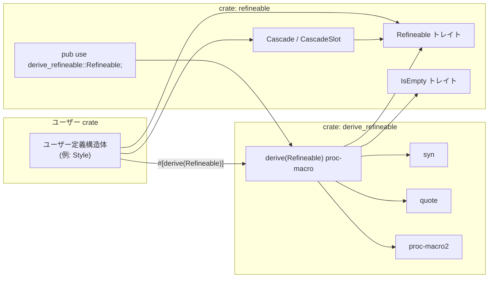
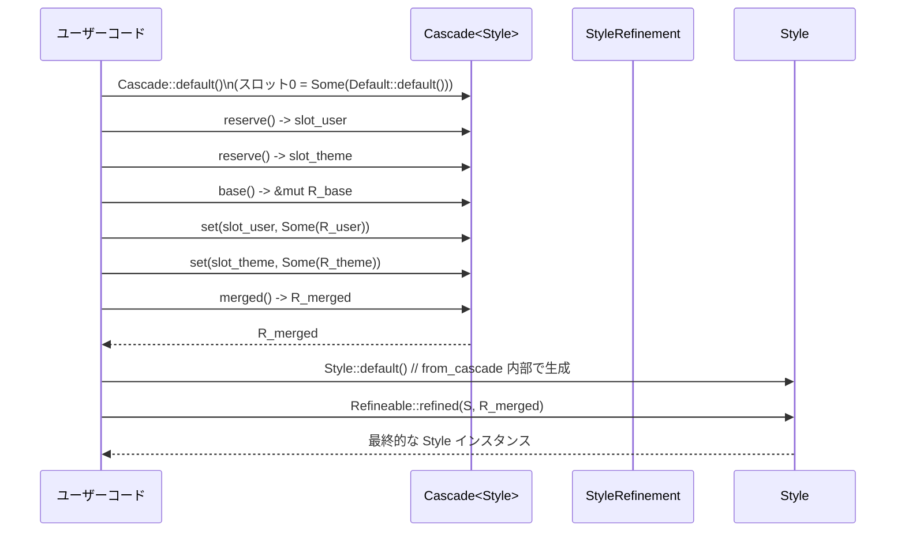

# refineable/

## 1. ざっくり一言

`refineable` ディレクトリは、**「複雑な設定構造体を部分的に上書きするためのリファインメント型」**を自動生成する `#[derive(Refineable)]` マクロと、その基盤となる `Refineable` トレイト／`Cascade` 型を提供するモジュール群です。

---

## 2. このモジュールの役割

### 2.1 概要

- このモジュールは、**設定やスタイルなどの構造体に対して「部分的な更新」を安全かつ階層的に行う**ために存在します。
- ユーザー定義の構造体に `#[derive(Refineable)]` を付けると、
  - 対応する `XXXRefinement` 型（リファインメント型）が生成され、
  - 元の型とリファインメント型に `Refineable` トレイト実装が追加されます。
- 併せて、複数のリファインメントを優先順位付きでマージするための `Cascade` 型も提供されます。

### 2.2 アーキテクチャ内での位置づけ

このディレクトリには 2 つのクレートがあります。

- ライブラリクレート `refineable`（`src/refineable.rs`）
- 派生マクロクレート `derive_refineable`（`derive_refineable/src/derive_refineable.rs`）

全体の関係を簡略化すると次のようになります。



- ユーザーは `refineable` クレートを依存に追加し、`#[derive(Refineable)]` を構造体に付与します。
- `derive_refineable` クレートの派生マクロが、
  - リファインメント型 `XXXRefinement` の定義、
  - `Refineable`／`IsEmpty`／`Default`／`From` などの実装
  を生成します。
- `Cascade` は `Refineable` を実装した任意の型に対して「CSS のようなカスケードマージ」を行うための補助型です。

### 2.3 設計上のポイント

コードから読み取れる設計上の特徴は次の通りです。

- **責務の分割**
  - `refineable::Refineable` トレイト・`Cascade` 型などのランタイムロジックは `refineable` クレートにあります。
  - AST 操作やコード生成（派生マクロ）は `derive_refineable` クレートに分離されています。
- **リファインメント型の構造**
  - 通常フィールド: `T` → `Option<T>` に変換されます。
  - `Option<T>` フィールド: そのまま `Option<T>` を保持します（`Option<Option<T>>` にはなりません）。
  - `#[refineable]` が付いたフィールド: 対象の型 `Foo` のリファインメント型 `FooRefinement` を保持します。
- **エラーハンドリング**
  - 派生マクロは「名前付きフィールドの struct 以外」に対しては `panic!` でコンパイルエラーを発生させます。
  - `#[refineable]` が付いたフィールドの型が構造体型でない場合も `panic!` します。
- **トレイト境界**
  - 派生マクロは、生成されるリファインメント型の各フィールド型に `Clone` 境界を追加します（`WherePredicate` として付与）。
  - `Refineable` トレイト自体も `Self: Clone` を要求します。
- **階層的設定のための API**
  - `Refineable::refine` / `refined` による部分更新。
  - `Refineable::is_superset_of` / `subtract` による「包含関係」と「差分」の計算。
  - `Cascade` による複数リファインメントの優先順位付きマージ。

---

## 3. 主要な機能一覧

- `Refineable` トレイト: 構造体に対する部分的な更新（リファインメント）を表現するための基本トレイト。
- `#[derive(Refineable)]` マクロ:
  - `XXXRefinement` 型の自動生成。
  - 元の型とリファインメント型への `Refineable`・`IsEmpty`・`Default`・`From` 実装の自動生成。
  - 任意の追加 derive（例: `Serialize`）や `Debug` 実装の付与。
- `IsEmpty` トレイト: リファインメントが「何も変更しない（空）」かどうかを判定するためのインターフェース。
- `Cascade<S>` 型:
  - `S: Refineable` な型に対して、複数のリファインメントをスロットごとに保持し、優先順位順にマージするコンテナ。
- `CascadeSlot`:
  - `Cascade` 内のスロットを指すハンドル。`reserve` で取得して `set` で対応スロットを更新します。
- `Refineable::from_cascade`:
  - `Cascade<S>` を `S` に変換するヘルパーメソッド。`Default` 値に全リファインメントを適用した値を生成します。

---

## 4. 関数・構造体の解説

### 4.1 型・トレイト・マクロ一覧

| 名前 | 種別 | 定義場所 | 役割 / 用途 |
|------|------|----------|-------------|
| `Refineable` | トレイト | `src/refineable.rs` | 部分更新（リファインメント）のインターフェース。リファインメント型との変換・マージを規定します。 |
| `IsEmpty` | トレイト | `src/refineable.rs` | リファインメントが「何も変えない」状態かどうかを判定します。 |
| `Cascade<S>` | 構造体 | `src/refineable.rs` | `S::Refinement` の列を保持し、優先順位順にマージして 1 つのリファインメントにまとめます。 |
| `CascadeSlot` | 構造体 | `src/refineable.rs` | `Cascade` 内のスロット番号を表す軽量ハンドル。 |
| `derive(Refineable)` | 派生マクロ | `derive_refineable/src/derive_refineable.rs` | 構造体から `XXXRefinement` 型と関連するトレイト実装を自動生成します。 |
| `FooRefinement` | 構造体（自動生成） | 派生マクロ出力 | `Foo` に対応するリファインメント型。各フィールドを部分更新可能な形に包んだ構造体です。 |

### 4.2 `Refineable` トレイト

`src/refineable.rs` より:

```rust
pub trait Refineable: Clone {
    type Refinement: Refineable<Refinement = Self::Refinement> + IsEmpty + Default;

    fn refine(&mut self, refinement: &Self::Refinement);
    fn refined(self, refinement: Self::Refinement) -> Self;

    fn from_cascade(cascade: &Cascade<Self>) -> Self
    where
        Self: Default + Sized,
    { /* 省略 */ }

    fn is_superset_of(&self, refinement: &Self::Refinement) -> bool;
    fn subtract(&self, refinement: &Self::Refinement) -> Self::Refinement;
}
```

**概要**

- 「ベース値」と「リファインメント値」を分離し、**部分的な上書き・包含関係チェック・差分取得** を行うためのトレイトです。
- 派生マクロにより自動実装されるのが主な想定です。

#### `Refineable::refine(&mut self, refinement: &Self::Refinement)`

**概要**

- 自身をインプレースに更新し、`refinement` に含まれる値だけを上書きします。

**引数**

| 引数名 | 型 | 説明 |
|--------|----|------|
| `self` | `&mut self` | 更新対象のインスタンス |
| `refinement` | `&Self::Refinement` | 適用するリファインメント。空の部分は無視されます。 |

**戻り値**

- なし（`()`）。`self` が直接変更されます。

**内部処理の流れ（派生マクロで生成される代表的なパターン）**

フィールドごとに次のルールで処理されます（`derive_refineable.rs` より）:

- `#[refineable]` が付いたフィールド（ネストした Refineable 型）:
  - `self.field.refine(&refinement.field);` を呼び出し、再帰的に更新します。
- `Option<T>` フィールド:
  - `refinement.field` が `Some(v)` のときだけ `self.field = Some(v.clone())` で上書きします。
  - `refinement.field` が `None` なら何もしません（既存値を消すことはありません）。
- それ以外のフィールド `T`:
  - `refinement.field` が `Some(v)` のときだけ `self.field = v.clone()` で上書きします。

**Examples（使用例）**

```rust
use refineable::Refineable;

// ネストしたスタイル用の構造体
#[derive(Clone, Default, Refineable)]
struct TextStyle {
    size: u32,        // 通常フィールド -> Option<u32> に対応するリファインメント
    bold: bool,       // 同上
}

// 親のスタイル構造体
#[derive(Clone, Default, Refineable)]
struct Style {
    #[refineable]           // TextStyle 自体も Refineable なのでネストして refine される
    text: TextStyle,
    color: Option<String>,  // Option フィールド
    margin: u32,            // 通常フィールド
}

fn main() {
    let mut base = Style::default();              // すべてデフォルト値
    base.color = Some("black".into());
    base.margin = 4;

    let mut refinement = StyleRefinement::default(); // 自動生成された型
    refinement.color = Some("red".into());        // color を上書き
    refinement.margin = Some(8);                  // margin を上書き
    refinement.text.size = Some(16);              // ネストした TextStyle を部分更新

    base.refine(&refinement);                     // base がインプレースで更新される
}
```

**Errors / Panics**

- `Refineable::refine` 自体はパニックしません（派生コードは `if let Some(..)` などの分岐のみ）。
- ただし、ネストした `Refineable` 実装の中でパニックがあればそれに従います。

**Edge cases（エッジケース）**

- リファインメントが完全に空 (`IsEmpty::is_empty()` が true) の場合:
  - すべてのフィールドが `None` / 空リファインメントとなり、`self` は変更されません。
- `Option<T>` フィールドについて:
  - `refinement.field = None` の場合、**既存の `self.field` はそのまま** であり、`None` に「戻す」ことはできません。
- ネストした `Refineable` フィールド:
  - ネスト側のリファインメントが空ならば、そのサブ構造体も変更されません。

**使用上の注意点**

- `Option<T>` フィールドを「未設定に戻す（`None` にする）」操作は、このレイヤーのリファインメントだけでは表現されません。
- ネストした構造体を部分更新したい場合は、そのフィールドに `#[refineable]` を付けておく必要があります。

#### `Refineable::refined(self, refinement: Self::Refinement) -> Self`

**概要**

- `self` をクローンせず「そのまま消費」しつつ、`refinement` を適用した新しいインスタンスを返します。
- `refine` の「所有権版」です。

**引数**

| 引数名 | 型 | 説明 |
|--------|----|------|
| `self` | `Self` | 元のインスタンス（このメソッドの中で更新され、そのまま返されます） |
| `refinement` | `Self::Refinement` | 適用するリファインメント（ムーブされます） |

**戻り値**

- `Self`: リファインメントが適用された新しいインスタンス。

**内部処理の流れ**

- フィールドごとの処理は `refine` と同様ですが、`refinement` をムーブで受け取るため、`&` ではなく所有権を渡します。
- 生成コードでは、最後に `self` を返しています。

**Examples（使用例）**

```rust
// 上の Style / StyleRefinement 定義を想定
fn main() {
    let base = Style::default();
    let mut refinement = StyleRefinement::default();
    refinement.margin = Some(16);

    let updated = base.refined(refinement); // base は消費され、updated に結果が入る
}
```

**使用上の注意点**

- `self` を消費するため、元の値を後で使いたい場合は、事前に `clone()` してから呼びます。

#### `Refineable::from_cascade(cascade: &Cascade<Self>) -> Self`

**概要**

- `Self::default()` をベースに、`cascade` 内のリファインメントをすべてマージして適用したインスタンスを返します。

**引数**

| 引数名 | 型 | 説明 |
|--------|----|------|
| `cascade` | `&Cascade<Self>` | `Self` のリファインメントを保持するカスケード |

**戻り値**

- `Self`: デフォルト値に対し、カスケードの全スロットを優先順位順で適用した結果。

**内部処理の流れ**

1. `Self::default()` でベース値を作る。
2. `cascade.merged()` で、全スロットをマージした 1 つのリファインメントを生成する。
3. `self.refined(merged_refinement)` を呼び、その結果を返す。

**Examples（使用例）**

```rust
use refineable::{Refineable, Cascade};

// Style / StyleRefinement 定義は前の例と同様
fn build_style_from_cascade(cascade: &Cascade<Style>) -> Style {
    Style::from_cascade(cascade)
}
```

**Edge cases（エッジケース）**

- `Self` が `Default` を実装していない場合、このメソッドは使用できません（トレイト境界で制約されています）。

**使用上の注意点**

- 「デフォルト値から積み上げる」前提なので、「既に構築済みのベース値にカスケードを適用したい」場合は、自前で `Refineable::refined` を呼び出す必要があります。

#### `Refineable::is_superset_of(&self, refinement: &Self::Refinement) -> bool`

**概要**

- `self` が `refinement` に含まれる要求をすべて満たしているかどうか（包含関係）をチェックします。

**内部処理（派生コードの挙動の要約）**

- `#[refineable]` フィールド:
  - `self.field.is_superset_of(&refinement.field)` を再帰的に呼び、どれか一つでも `false` なら全体も `false`。
- `Option<T>` フィールド:
  - `refinement.field` が `Some(...)` のときだけ `self.field == refinement.field` かどうかを比較します。
- 通常の `T` フィールド:
  - `refinement.field` が `Some(v)` のときだけ `self.field == v` かどうかを比較します。
- すべてのチェックを通過すれば `true` を返します。

**代表的な解釈**

- `refinement` の中で `Some` や非空リファインメントとして指定されている項目について、
  - `self` の対応するフィールド値がすべて一致していれば `true`。
  - どれか一つでも異なると `false`。

#### `Refineable::subtract(&self, refinement: &Self::Refinement) -> Self::Refinement`

**概要**

- `self` と `refinement` の差分を表す新しいリファインメントを返します。
- 結果のリファインメントを、`refinement` に対して適用すると `self` に近い状態を再現できる、というイメージです。

**内部処理の流れ（代表的なパターン）**

- `#[refineable]` フィールド:
  - `self.field.subtract(&refinement.field)` を呼び出し、ネストした差分をとります。
- `Option<T>` フィールド:
  - `self.field == refinement.field` の場合は `None`（差分なし）。
  - 異なる場合は `self.field.clone()`（現在値）を返します。
- 通常の `T` フィールド:
  - `refinement.field` が `Some(v)` かつ `self.field == v` であれば `None`。
  - それ以外（refinement が `None` または値が異なる）では、`Some(self.field.clone())`。

**使用上の注意点**

- 「差分がないフィールド」は `None` / 空リファインメントとして表現されます。
- このメソッドの戻り値を別のインスタンスに適用することで、「ある設定との差分だけを適用する」といった利用が可能です。

### 4.3 `Cascade<S>` と `CascadeSlot`

`src/refineable.rs` より:

```rust
pub struct Cascade<S: Refineable>(Vec<Option<S::Refinement>>);

#[derive(Copy, Clone)]
pub struct CascadeSlot(usize);
```

#### `Cascade<S>::reserve(&mut self) -> CascadeSlot`

**概要**

- 新しいスロットを末尾に追加し、そのスロットを指す `CascadeSlot` を返します。
- 追加されたスロットには初期状態として `None` が入ります。

**引数**

| 引数名 | 型 | 説明 |
|--------|----|------|
| `self` | `&mut self` | スロットを追加するカスケード |

**戻り値**

- `CascadeSlot`: 追加されたスロットの位置（インデックス）をラップしたハンドル。

**内部処理の流れ**

1. `self.0.push(None)` で空のスロットを追加。
2. 新しいインデックス `self.0.len() - 1` を `CascadeSlot` に包んで返す。

#### `Cascade<S>::base(&mut self) -> &mut S::Refinement`

**概要**

- スロット 0（ベースリファインメント）への可変参照を返します。
- ベースリファインメントは常に `Some` であることを前提としています。

**内部処理**

- `self.0[0].as_mut().unwrap()` を返します。

**Errors / Panics**

- スロット 0 が `None` の場合、`unwrap()` によりパニックします。
  - `Default` 実装では `Some(Default::default())` がセットされるため、通常の利用では `None` にはなりませんが、
  - `set` でスロット 0 に `None` を代入することは可能なので、その場合は注意が必要です。

#### `Cascade<S>::set(&mut self, slot: CascadeSlot, refinement: Option<S::Refinement>)`

**概要**

- 指定スロットにリファインメント（または `None`）を設定します。

**内部処理**

- `self.0[slot.0] = refinement` という単純な代入です。
- 範囲チェックは行っていないため、`slot` が `reserve` で得られたものであることが前提です。

#### `Cascade<S>::merged(&self) -> S::Refinement`

**概要**

- すべてのスロットに格納されているリファインメントを、スロット順（0 から順に、後ろほど優先）でマージした 1 つのリファインメントを返します。

**内部処理の流れ**

1. `let mut merged = self.0[0].clone().unwrap();` でベースリファインメントを複製。
2. `self.0.iter().skip(1).flatten()` により、スロット 1 以降の `Some(refinement)` だけを順番に取り出す。
3. 各リファインメントに対して `merged.refine(refinement)` を呼び出す。
4. 最後に `merged` を返す。

**Edge cases（エッジケース）**

- スロット 0 が `None` の場合、`clone().unwrap()` によりパニックします。
- スロット 1 以降がすべて `None` の場合は、ベースリファインメントのコピーだけが返ります。

**使用上の注意点**

- スロット 0 は「必ず `Some`」という前提で実装されています。
  - `Cascade::set` でスロット 0 に `None` を入れると、`base` / `merged` のどちらもパニックし得ます。
  - ベーススロットは `Some` のままにしておくことが安全です。

### 4.4 `IsEmpty` トレイト

```rust
pub trait IsEmpty {
    /// Returns `true` if applying this refinement would have no effect.
    fn is_empty(&self) -> bool;
}
```

- 派生マクロは、リファインメント型 `FooRefinement` に対し次のような実装を生成します。

  - `#[refineable]` フィールド: `self.field.is_empty()` が true かどうかをチェック。
  - それ以外のフィールド: `self.field.is_none()` かどうかをチェック。
  - すべてのフィールドが「空」であれば `true` を返します。

- `serde` の `Serialize` を derive する場合、`#[serde(default, skip_serializing_if = "::refineable::IsEmpty::is_empty")]` という属性がリファインメントフィールドに付与され、空のリファインメントはシリアライズ時に省略されます。

### 4.5 `derive(Refineable)` マクロが生成するもの

`derive_refineable/src/derive_refineable.rs` から読み取れる主な生成物は次のとおりです（型名 `Foo` を例にします）。

1. **リファインメント型の定義**

   ```rust
    #[derive(Clone)]
    #[derive(...指定されたトレイト...)]
    pub struct FooRefinement<...> {
        // フィールドごとに包まれた型
        field1: Option<T1>,               // 通常フィールド
        field2: Option<InnerRefinement>,  // #[refineable] フィールド
        field3: Option<U>,                // Option<U> フィールドは Option<U> のまま など
    }
   ```

   - `#[refineable(Serialize)]` が付いている場合、フィールドごとに `serde` 属性も追加されます。

2. **`impl Refineable for Foo`**
   - `type Refinement = FooRefinement<...>;`
   - メソッド `refine` / `refined` / `is_superset_of` / `subtract` がフィールド単位で実装されます。

3. **`impl Refineable for FooRefinement`**
   - リファインメント型同士を「上書き」できるように、同様のメソッドが実装されます。

4. **`impl IsEmpty for FooRefinement`**
   - 上述のルールに従って「空リファインメント」判定を行います。

5. **`impl From<FooRefinement> for Foo`**
   - フィールドごとに `Option<T>` などから元の型を構築します。
     - 通常フィールド: `value.field.map(|v| v.into()).unwrap_or_default()`
     - `Option<T>` フィールド: `value.field.map(|v| v.into())`
     - `#[refineable]` フィールド: `value.field.into()`

6. **`impl Default for FooRefinement`**
   - 各フィールドに `Default::default()` を入れたリファインメントを返します。

7. **`impl FooRefinement { pub fn is_some(&self) -> bool }`**
   - 実装は「どれか一つでも `Some` があれば true」を返します。

     ```rust
     pub fn is_some(&self) -> bool {
         if self.field1.is_some() { return true; }
         if self.field2.is_some() { return true; }
         // ...
         false
     }
     ```

   - ドキュメントコメントは「全フィールドが `Some` なら true」と書かれていますが、実装は「いずれか 1 つでも `Some` なら true」となっています。この差異はコードから客観的に読み取れます。

8. **`Debug` 実装（任意）**
   - 構造体に `#[refineable(Debug)]` が付いている場合、`FooRefinement` に `Debug` 実装が生成されます。
   - すべてのフィールドが `Some` なら通常の `debug_struct.finish()`、どれかが `None` なら `finish_non_exhaustive()` が使われます。

---

## 5. データフロー

典型的な利用シナリオとして、「複数ソースのスタイル設定をカスケードでマージして最終スタイルを得る」場合のフローを示します。



要点:

- `Cascade` 内のスロット 0 は常にベースリファインメントとして扱われます。
- スロット 1 以降のリファインメントは、「後ろにあるほど優先度が高い」形で順に `refine` されます。
- 最終的には、`Default` な `Style` に対して `merged()` の結果を `refined` することで、最終スタイルが得られます（`from_cascade` がこれをまとめて行います）。

---

## 6. 使い方（How to Use）

### 6.1 基本的な使用方法

1. **型の定義と derive**

```rust
use refineable::Refineable;

// ネストされるスタイル
#[derive(Clone, Default, Refineable)]
struct TextStyle {
    size: u32,
    bold: bool,
}

// 親スタイル
#[derive(Clone, Default, Refineable)]
struct Style {
    #[refineable]                   // TextStyle も Refineable なのでネスト更新対象
    text: TextStyle,
    color: Option<String>,          // Option フィールド
    margin: u32,                    // 通常フィールド
}
```

2. **単一のリファインメントを適用する**

```rust
fn simple_refine_example(mut base: Style) {
    let mut r = StyleRefinement::default(); // 自動生成される型
    r.color = Some("red".into());           // Option フィールドを上書き
    r.margin = Some(8);                     // 通常フィールドを上書き
    r.text.size = Some(16);                 // ネストした TextStyle を部分更新

    base.refine(&r);                        // base がインプレースで更新される
}
```

3. **カスケードを使って複数のリファインメントをマージする**

```rust
use refineable::Cascade;

fn cascade_example() {
    let mut cascade: Cascade<Style> = Cascade::default(); // slot 0 にベースが入る

    // スロットを予約
    let user_slot = cascade.reserve();      // 例: ユーザー指定
    let theme_slot = cascade.reserve();     // 例: テーマ指定

    // ベースリファインメント（slot 0）を書き換える
    let base_ref = cascade.base();          // &mut StyleRefinement
    base_ref.margin = Some(4);

    // 各スロットのリファインメントを設定
    cascade.set(
        user_slot,
        Some(StyleRefinement {
            color: Some("red".into()),
            ..Default::default()
        }),
    );
    cascade.set(theme_slot, None);          // このスロットは無効

    // カスケードから最終スタイルを構築
    let final_style = Style::from_cascade(&cascade);
    // final_style は Default な Style に base_ref → user_slot の順で適用された結果になる
}
```

### 6.2 よくある使用パターン

- **階層設定（グローバル → テーマ → ユーザー）**
  - `Cascade` のスロットに「グローバル設定」「テーマ設定」「ユーザー設定」などをそれぞれ格納し、
    - スロット番号の昇順で適用されることを利用して、優先度の低いものから高いものへとマージします。
- **差分パッチの作成**
  - ある設定 `a` と `b` に対して、`let diff = a.subtract(&b_refinement);` のように差分を取り、
  - `diff` を他のインスタンスに適用することで「`b` に対する `a` の差分だけを反映する」ような使い方が可能です。
- **シリアライズ可能なリファインメント**
  - `#[refineable(Serialize)]` を付けておくと、生成される `XXXRefinement` に `Serialize` が derive され、
  - 空のフィールドは `skip_serializing_if` によりシリアライズから省略されるため、「差分だけを JSON で送る」などの用途に向きます。

### 6.3 使用上の注意点

- **トレイトのインポート**
  - 派生マクロが生成するコードでは、`Refineable` トレイト名を完全修飾せずに使用しています。
  - 呼び出し側のクレートでは、`use refineable::Refineable;` などでトレイトをスコープに入れておくと安全です。

- **`Option<T>` フィールドの意味**
  - 元の構造体の `Option<T>` フィールドはリファインメント型でも `Option<T>` のままです。
  - リファインメント側の `None` は「変更しない」を意味するため、
    - `Some` → `None` に戻す操作はリファインメントでは表現できません。
  - 「クリアする」操作を表現したい場合は、別のフラグや設計が必要です。

- **`#[refineable]` 属性の対象**
  - この属性は「ネストした struct など、別の `Refineable` 型」用に設計されています。
  - 型が構造体型でないフィールド（例: `i32` や `Option<T>`）に付けると、コード上の期待と異なる動作をする可能性があります（`get_wrapper_type` は構造体型を前提にしています）。

- **`Cascade` のベーススロット (0) を `None` にしない**
  - `Cascade::base` / `merged` はスロット 0 が `Some` であることを前提に `unwrap()` しています。
  - `Cascade::set` で `slot.0 == 0` に `None` をセットすると、これらのメソッドがパニックし得ます。

- **ジェネリクスとトレイト境界**
  - 派生マクロは `Clone` 境界などを自動で付与しますが、`From` 実装などから追加の境界（`Default` など）が必要になることがあります。
  - コンパイルエラーとして現れるため、その場合はフィールド型に適切なトレイトを実装しておく必要があります。

---

## 7. 関連ファイル

| パス | 役割 / 関係 |
|------|------------|
| `refineable/Cargo.toml` | ライブラリクレート `refineable` のメタデータと依存関係定義。`derive_refineable` をワークスペース依存として参照します。 |
| `refineable/src/refineable.rs` | `Refineable` トレイト、`IsEmpty` トレイト、`Cascade` / `CascadeSlot` の定義とドキュメントを提供するメインライブラリ。 |
| `refineable/derive_refineable/Cargo.toml` | 派生マクロクレート `derive_refineable` のメタデータ。`proc-macro = true` として設定され、`syn` / `quote` / `proc-macro2` に依存します。 |
| `refineable/derive_refineable/src/derive_refineable.rs` | `#[proc_macro_derive(Refineable, attributes(refineable))]` の実装。ユーザーの構造体からリファインメント型とトレイト実装を生成します。 |

このディレクトリ全体として、`refineable` は「設定・スタイルなどの階層的な上書きを行うための共通基盤」として利用できるように構成されています。
