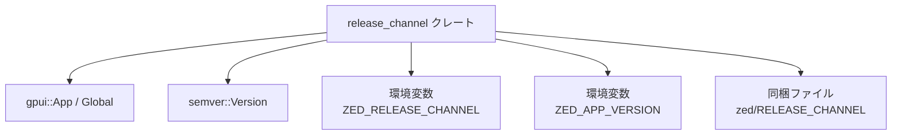
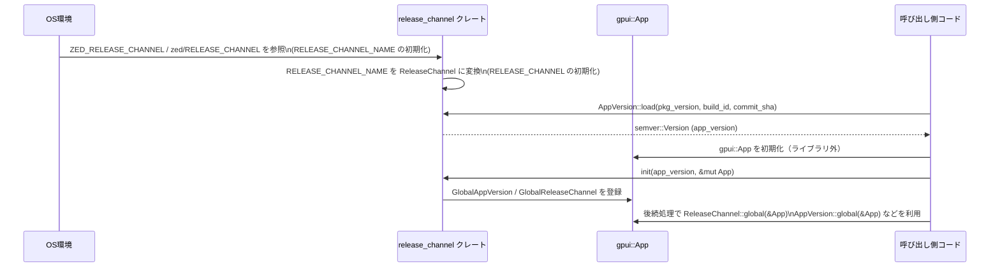

# release_channel/ ディレクトリ解説

## 1. ざっくり一言

Zed エディタの **リリースチャネル（dev/nightly/preview/stable）とアプリ版数・コミット SHA** を扱うためのユーティリティクレートです。  
`gpui::App` のグローバル状態として、これらの情報を共有・参照できるようにしています。

---

## 2. このモジュールの役割

### 2.1 概要

- このクレートは Zed の **ビルド時／実行時メタ情報** を一元管理するために存在します。
- 主に次の情報を扱います。
  - リリースチャネル（`ReleaseChannel` enum）
  - アプリのセマンティックバージョン（`semver::Version`）
  - ビルド元 Git コミット SHA（`AppCommitSha`）
- これらを `gpui::App` のグローバルとして登録・取得する API を提供します。

### 2.2 アーキテクチャ内での位置づけ

このクレートは、外部から以下の情報を依存として受け取り、それを `gpui::App` のグローバル状態として提供する役割を持ちます。



- `ENV1` + `FILE` からリリースチャネル名（文字列）を決定し、`ReleaseChannel` に変換します。
- `ENV2` または `Cargo.toml` のバージョン文字列を `semver::Version` に変換し、ビルドメタデータにリリースチャネルやビルド ID, commit SHA を埋め込みます。
- 得られた値は `gpui::App` に紐づいたグローバルとして保存され、アプリ内のどこからでも参照できます。

### 2.3 設計上のポイント

- **遅延初期化 (`LazyLock`)**
  - `RELEASE_CHANNEL_NAME` と `RELEASE_CHANNEL` は `LazyLock` により初回アクセス時に一度だけ決定されます。
- **ビルド種別による動作切り替え**
  - `cfg!(debug_assertions)` により、デバッグビルドでは環境変数 `ZED_RELEASE_CHANNEL` で上書き可能、リリースビルドでは同梱ファイルのみからチャネルを読み取る構造になっています。
- **グローバル状態のラップ**
  - `GlobalAppVersion`, `GlobalReleaseChannel`, `GlobalAppCommitSha` といった薄いラッパー構造体を `Global` トレイトでマークし、`gpui::App` の「型付きグローバル」スロットとして利用しています。
- **API と内部表現の分離**
  - 実際のチャネル文字列は `RELEASE_CHANNEL_NAME` に保持しつつ、アプリ側は型安全な `ReleaseChannel` を通じて扱うようになっています。
  - コミット SHA は専用の `AppCommitSha` 型でラップされ、短縮表示とフル表示を明確に区別できます。

---

## 3. 主要な機能一覧

- リリースチャネル名の決定:  
  デバッグ時は `ZED_RELEASE_CHANNEL` 環境変数、なければ `zed/RELEASE_CHANNEL` ファイルからチャネル文字列を決定 (`RELEASE_CHANNEL_NAME`)。
- リリースチャネル列挙体 (`ReleaseChannel`) の生成とグローバル登録:
  - 文字列から enum への変換（`FromStr` 実装）
  - `init` / `init_test` による `gpui::App` への登録
- アプリバージョン (`AppVersion`) の構築:
  - `ZED_APP_VERSION` 環境変数または `Cargo.toml` のバージョンを基に `semver::Version` を生成
  - リリースチャネル・ビルド ID・コミット SHA を build metadata に付与
- コミット SHA (`AppCommitSha`) の管理:
  - フル SHA と 7 文字短縮 SHA の取得
  - `gpui::App` グローバルとしての保存・取得
- リリースチャネルに依存した情報の提供:
  - 表示名（`display_name`）
  - プログラム用名（`dev_name`）
  - Wayland / X11 / macOS 向けアプリケーション ID（`app_id`）
  - 更新チェック用クエリパラメータ（`release_query_param`）
  - Windows 用アプリケーション ID（`app_identifier`、Windows のみ）

---

## 4. 関数・構造体の解説

### 4.1 型一覧（構造体・列挙体など）

| 名前 | 種別 | 公開 | 役割 / 用途 |
|------|------|------|-------------|
| `AppCommitSha` | 構造体（タプル struct） | `pub` | Git コミット SHA をラップし、フル／短縮表記を提供する |
| `GlobalAppCommitSha` | 構造体 | crate 内部 | `AppCommitSha` を `gpui::App` グローバルに保存するためのラッパー |
| `GlobalAppVersion` | 構造体 | crate 内部 | `semver::Version` を `gpui::App` グローバルに保存するためのラッパー |
| `AppVersion` | 単位構造体 | `pub` | アプリ版数のロードとグローバル取得のための名前空間的な型 |
| `ReleaseChannel` | enum | `pub` | `Dev / Nightly / Preview / Stable` の 4 種のリリースチャネルを表す |
| `GlobalReleaseChannel` | 構造体 | crate 内部 | `ReleaseChannel` を `gpui::App` グローバルに保存するためのラッパー |
| `InvalidReleaseChannel` | 構造体 | `pub` | チャネル文字列のパースに失敗したことを表すエラー型 |

#### グローバル定数 / 静的変数

- `RELEASE_CHANNEL_NAME: LazyLock<String>`
  - 実行時に一度だけ初期化されるチャネル名文字列です（`"dev"`, `"nightly"` など）。
  - デバッグビルドでは `ZED_RELEASE_CHANNEL` 環境変数を優先し、なければ `../../zed/RELEASE_CHANNEL` ファイルの内容を使用します。
  - リリースビルドでは環境変数は見ず、常にファイルの内容を使用します。
- `RELEASE_CHANNEL: LazyLock<ReleaseChannel>`
  - `RELEASE_CHANNEL_NAME` を `ReleaseChannel::from_str` でパースした結果を保持します。
  - パースに失敗すると `panic!("invalid release channel ...")` します。

### 4.2 重要な関数・メソッド（詳細）

#### `AppVersion::load(pkg_version: &str, build_id: Option<&str>, commit_sha: Option<AppCommitSha>) -> Version`

**概要**

- アプリ版数を環境変数または `Cargo.toml` の値から読み取り、`semver::Version` を構築します。
- さらにリリースチャネル名・ビルド ID・コミット SHA を build metadata として埋め込みます。

**引数**

| 引数名 | 型 | 説明 |
|--------|----|------|
| `pkg_version` | `&str` | `Cargo.toml` に記載されているバージョン文字列（例: `"0.1.0"`） |
| `build_id` | `Option<&str>` | 任意のビルド ID（CI のビルド番号など） |
| `commit_sha` | `Option<AppCommitSha>` | 任意のコミット SHA 情報 |

**戻り値**

- `semver::Version`  
  - `major.minor.patch` は環境変数 `ZED_APP_VERSION` または `pkg_version` に従います。
  - `build` フィールドに `"dev"` などのチャネル名、ビルド ID、コミット SHA がピリオドで連結された文字列が入ります（semver 的に有効な場合のみ）。

**内部処理の流れ**

1. `env::var("ZED_APP_VERSION")` を試み、取得できればそれを、できなければ `pkg_version` を `Version::parse` します。
2. 現在のリリースチャネルのプログラム名（`RELEASE_CHANNEL.dev_name()`）を `pre` 文字列として用意します。
3. `build_id` があれば `.<build_id>` を `pre` に追加します。
4. `commit_sha` があれば `.<sha>` を `pre` に追加します。
5. `semver::BuildMetadata::new(&pre)` を試み、成功した場合のみ `version.build` にセットします。
6. 最終的な `Version` を返します。

**Examples（使用例）**

`pkg_version` と環境変数からバージョンを組み立て、ビルド ID とコミット SHA を含める例です。

```rust
use semver::Version;                         // セマンティックバージョン型
use release_channel::{AppVersion, AppCommitSha};

fn make_version() -> Version {               // アプリ版数を組み立てる関数
    let pkg_version = env!("CARGO_PKG_VERSION");          // Cargo.toml の version
    let build_id = Some("ci-1234");                       // CI ビルド番号など
    let commit_sha = Some(AppCommitSha::new(              // コミット SHA をラップ
        "0123456789abcdef0123456789abcdef01234567".into()
    ));

    AppVersion::load(pkg_version, build_id.as_deref(), commit_sha)
    // 例: 0.1.0+dev.ci-1234.0123456... のような build metadata 付き Version が返る
}
```

**Errors / Panics**

- `ZED_APP_VERSION` が設定されていて **semver として不正な文字列** の場合:
  - `from_env.parse().expect("invalid ZED_APP_VERSION")` により `panic!` します。
- `ZED_APP_VERSION` が無く、`pkg_version` が semver として不正な場合:
  - `pkg_version.parse().expect("invalid version in Cargo.toml")` により `panic!` します。
- build metadata 文字列が semver の制約に合わない場合:
  - `BuildMetadata::new(&pre)` が `Err` となり、その場合 **`version.build` は変更されません**（panic にはなりません）。

**Edge cases（エッジケース）**

- `build_id` が `None`、`commit_sha` も `None` の場合:
  - build metadata は `"dev"` などチャネル名のみになります。
- `commit_sha` の中身が非常に長い場合:
  - build metadata 全体が semver の仕様に合わなくなると `BuildMetadata::new` が失敗し、結果として build metadata が未設定になります。

**使用上の注意点**

- 環境変数 `ZED_APP_VERSION` を設定する場合は **完全な semver 文字列** である必要があります。
- `pkg_version` には通常 `env!("CARGO_PKG_VERSION")` を渡す想定です。
- build metadata は semver 的には「後方互換性に影響しない識別子」ですが、他のシステム（配布サーバなど）が文字列として解釈する場合があるため、フォーマットを変更する際は注意が必要です。

---

#### `AppVersion::global(cx: &App) -> Version`

**概要**

- `gpui::App` に登録されているグローバルなアプリ版数を取り出します。
- 登録されていない場合は `0.0.0` を返します。

**引数**

| 引数名 | 型 | 説明 |
|--------|----|------|
| `cx` | `&App` | `gpui` のアプリケーションコンテキスト |

**戻り値**

- `Version`  
  事前に `init` / `init_test` で登録されていればその版数、そうでなければ `Version::new(0, 0, 0)`。

**内部処理の流れ**

1. `cx.has_global::<GlobalAppVersion>()` でグローバル登録の有無を確認します。
2. 登録があれば `cx.global::<GlobalAppVersion>().0.clone()` で版数を返します。
3. 無ければ `Version::new(0, 0, 0)` を返します。

**Examples（使用例）**

```rust
use gpui::App;                               // アプリケーションコンテキスト
use release_channel::AppVersion;

fn log_version(cx: &App) {                   // 版数をログに出す関数
    let version = AppVersion::global(cx);    // グローバルな Version を取得
    eprintln!("Zed version: {}", version);   // 表示やログに利用
}
```

**Edge cases**

- `init` が呼ばれていない場合でも panic はせず、`0.0.0` を返します。

**使用上の注意点**

- 実際の Zed 本体では、起動時に `init` を呼び出してからこの関数を利用する前提の構造になっています。
- `0.0.0` は「未設定」を意味する特別な値として扱われる可能性があります。そのため、アプリロジック側で「`0.0.0` の場合は表示しない」といった扱いをすると明確になります。

---

#### `ReleaseChannel::global(cx: &App) -> Self`

**概要**

- `gpui::App` に登録されたグローバルなリリースチャネルを取得します。

**引数**

| 引数名 | 型 | 説明 |
|--------|----|------|
| `cx` | `&App` | `gpui` のアプリケーションコンテキスト |

**戻り値**

- `ReleaseChannel`  
  `init` / `init_test` によって設定されたチャネル。

**内部処理の流れ**

1. `cx.global::<GlobalReleaseChannel>().0` を返します。
   - ここでは `has_global` や `try_global` を呼んでいません。

**Examples（使用例）**

```rust
use gpui::App;
use release_channel::ReleaseChannel;

fn show_channel(cx: &App) {                  // 現在のチャネルを表示する関数
    let channel = ReleaseChannel::global(cx); // グローバルチャネルを取得
    println!("Current channel: {}", channel.dev_name()); // "dev" などを表示
}
```

**Edge cases**

- `GlobalReleaseChannel` が登録されていない状態で呼び出された場合の挙動は、`gpui::App::global` の実装に依存します。
  - このクレート側では、**必ず事前に `init` か `init_test` を呼ぶ**という前提で使われています。

**使用上の注意点**

- 安全に利用するには、アプリ起動時に一度 `init`（またはテスト時に `init_test`）を呼び、リリースチャネルを登録しておく必要があります。
- テストでチャネルを差し替えたい場合は `init_test` を使う想定です。

---

#### `ReleaseChannel::poll_for_updates(&self) -> bool`

**概要**

- 現在のチャネルで「更新チェックを行うべきか」を判定します。

**引数**

| 引数名 | 型 | 説明 |
|--------|----|------|
| `self` | `&ReleaseChannel` | 対象のリリースチャネル |

**戻り値**

- `bool`  
  - `Dev` の場合は `false`（更新チェックしない）。
  - それ以外 (`Nightly`, `Preview`, `Stable`) は `true`。

**内部処理の流れ**

- `!matches!(self, ReleaseChannel::Dev)` という単純なパターンマッチで判定しています。

**Examples（使用例）**

```rust
use gpui::App;
use release_channel::ReleaseChannel;

fn maybe_check_updates(cx: &App) {
    let channel = ReleaseChannel::global(cx); // 現在のチャネルを取得
    if channel.poll_for_updates() {           // 更新チェックすべきか判定
        // 実際の更新チェック処理をここで行う
    }
}
```

**Edge cases**

- 特になし（`ReleaseChannel` のバリアントは 4 種に限定されており、全て網羅されています）。

**使用上の注意点**

- 「ローカル開発用ビルドでは更新をかけない」というポリシーを実装したものです。  
  同じ判定ロジックを別の場所で重複させず、このメソッドを利用すると意図が明確になります。

---

#### `ReleaseChannel::app_id(&self) -> &'static str`

**概要**

- Wayland の application ID、X11 の `WM_CLASS`、macOS の bundle identifier として使用されるアプリ ID を返します。
- リリースチャネルごとに異なる文字列を返します。

**戻り値**

- `&'static str`  
  - `Dev` → `"dev.zed.Zed-Dev"`
  - `Nightly` → `"dev.zed.Zed-Nightly"`
  - `Preview` → `"dev.zed.Zed-Preview"`
  - `Stable` → `"dev.zed.Zed"`

**Examples（使用例）**

```rust
use gpui::App;
use release_channel::ReleaseChannel;

fn app_id_for_window(cx: &App) -> &'static str {
    let channel = ReleaseChannel::global(cx); // チャネルを取得
    channel.app_id()                          // プラットフォーム用の app id を返す
}
```

**Edge cases**

- 4 つのチャネルそれぞれに対応した固定文字列を返すだけであり、特別なエッジケースはありません。

**使用上の注意点**

- この値はプラットフォーム側から「別アプリ」として識別されるため、チャネルごとに別のプロセス・設定として扱われることが想定されます。

---

#### `init(app_version: Version, cx: &mut App)`

**概要**

- 起動時にアプリ版数とリリースチャネルを `gpui::App` のグローバルに登録する初期化関数です。

**引数**

| 引数名 | 型 | 説明 |
|--------|----|------|
| `app_version` | `Version` | `AppVersion::load` などで構築したアプリ版数 |
| `cx` | `&mut App` | `gpui` のアプリケーションコンテキスト（可変参照） |

**戻り値**

- なし（`()`）

**内部処理の流れ**

1. `cx.set_global(GlobalAppVersion(app_version));`
   - アプリ版数をグローバルとして登録します。
2. `cx.set_global(GlobalReleaseChannel(*RELEASE_CHANNEL));`
   - 静的な `RELEASE_CHANNEL`（`LazyLock<ReleaseChannel>`）からチャネルを取得し、グローバルとして登録します。

**Examples（使用例）**

```rust
use gpui::App;
use release_channel::{AppVersion, init};

fn setup(cx: &mut App) {                          // アプリ起動時のセットアップ関数
    let pkg_version = env!("CARGO_PKG_VERSION");  // Cargo.toml の version
    let app_version = AppVersion::load(pkg_version, None, None); // バージョンを組み立てる

    init(app_version, cx);                        // 版数とチャネルをグローバル登録
}
```

**Edge cases**

- `RELEASE_CHANNEL` の初期化に失敗している場合（たとえば `RELEASE_CHANNEL_NAME` が不正文字列だった場合）は、`RELEASE_CHANNEL` の初期化時点で `panic!` しており、この関数に到達しません。

**使用上の注意点**

- この関数は通常、アプリの起動直後に一度だけ呼ばれる想定です。
- テストでチャネルを差し替えたい場合は `init` ではなく `init_test` を使うことで、`RELEASE_CHANNEL` の値とは無関係にチャネルを指定できます。

---

#### `AppCommitSha::try_global(cx: &App) -> Option<AppCommitSha>`

**概要**

- `gpui::App` に登録されているグローバルなコミット SHA を取得します（未登録なら `None`）。

**引数**

| 引数名 | 型 | 説明 |
|--------|----|------|
| `cx` | `&App` | `gpui` のアプリケーションコンテキスト |

**戻り値**

- `Option<AppCommitSha>`  
  - 登録済みならクローンした `AppCommitSha`。
  - 未登録なら `None`。

**内部処理の流れ**

1. `cx.try_global::<GlobalAppCommitSha>()` でグローバル登録を試みて取得します。
2. 得られた場合、内部の `AppCommitSha` を `.0.clone()` して返します。
3. 登録されていなければ `None` を返します。

**Examples（使用例）**

```rust
use gpui::App;
use release_channel::AppCommitSha;

fn log_commit(cx: &App) {
    if let Some(sha) = AppCommitSha::try_global(cx) {  // グローバルにあれば取得
        println!("Commit: {}", sha.short());           // 短縮 SHA を表示
    } else {
        println!("Commit sha not set");                // 未設定の場合
    }
}
```

**Edge cases**

- コミット SHA が一度も `set_global` されていない場合は `None` になります。

**使用上の注意点**

- コミット SHA を使う前に、起動時などで `AppCommitSha::set_global` を呼んでおく必要があります。
- SHA の文字列長に制限は設けていないため、短い SHA を渡した場合は `short()` で 7 文字未満の文字列が返ることがあります。

---

### 4.3 その他の関数・メソッド一覧

| 関数 / メソッド名 | 役割（1 行） |
|-------------------|-------------|
| `#[cfg(target_os = "windows")] app_identifier() -> &'static str` | Windows 用のアプリ識別子（`Zed-Editor-Dev` など）を `RELEASE_CHANNEL` に基づいて返す |
| `AppCommitSha::new(sha: String) -> AppCommitSha` | 生の文字列から `AppCommitSha` を生成するコンストラクタ |
| `AppCommitSha::set_global(sha: AppCommitSha, cx: &mut App)` | コミット SHA を `gpui::App` のグローバルとして登録する |
| `AppCommitSha::full(&self) -> String` | フルの SHA 文字列（内部の `String` をクローン）を返す |
| `AppCommitSha::short(&self) -> String` | 先頭 7 文字を連結した短縮 SHA を返す |
| `init_test(app_version: Version, release_channel: ReleaseChannel, cx: &mut App)` | テスト向けに、任意のリリースチャネルと版数をグローバル登録する初期化関数 |
| `ReleaseChannel::try_global(cx: &App) -> Option<Self>` | `GlobalReleaseChannel` が登録されていればその値を返し、なければ `None` を返す |
| `ReleaseChannel::display_name(&self) -> &'static str` | UI 表示用のチャネル名（`"Zed Dev"`, `"Zed"` など）を返す |
| `ReleaseChannel::dev_name(&self) -> &'static str` | プログラム用のチャネル名（`"dev"`, `"stable"` など）を返す |
| `ReleaseChannel::release_query_param(&self) -> Option<&'static str>` | 更新サーバなどに渡すクエリパラメータ（`"nightly=1"`, `"preview=1"`）を返す。`Dev`/`Stable` は `None` |
| `ReleaseChannel::from_str(channel: &str) -> Result<Self, InvalidReleaseChannel>` | `"dev"`, `"nightly"`, `"preview"`, `"stable"` のいずれかを `ReleaseChannel` に変換する |

---

## 5. データフロー

ここでは、典型的な「アプリ起動時に版数とリリースチャネルを初期化し、その後別コンポーネントから参照する」流れを示します。



- 起動時に `RELEASE_CHANNEL_NAME` / `RELEASE_CHANNEL` の `LazyLock` が初期化され、チャネルが決定されます。
- 呼び出し側コードは `AppVersion::load` で版数を構築し、`init` で `App` に登録します。
- 以降のコンポーネントは `ReleaseChannel::global` や `AppVersion::global` を通して、同じ `App` インスタンスからチャネルや版数を参照できます。

---

## 6. 使い方（How to Use）

### 6.1 基本的な使用方法

起動時に版数とチャネル、コミット SHA を初期化する一連の例です。  
`gpui::App` の作り方はこのクレートからは分からないため、ここでは「どこかから渡される」と仮定した関数にしています。

```rust
use gpui::App;                                      // gpui のアプリコンテキスト
use release_channel::{AppVersion, AppCommitSha, init};

fn setup_release_info(cx: &mut App) {               // 起動時に呼ばれるセットアップ関数
    let pkg_version = env!("CARGO_PKG_VERSION");    // Cargo.toml の version を取得

    // CI などで埋め込んだビルド ID・コミット SHA を読み取る（存在しない場合もある）
    let build_id = std::env::var("BUILD_ID").ok();  // BUILD_ID 環境変数があれば利用
    let commit = std::env::var("GIT_COMMIT_SHA")    // GIT_COMMIT_SHA 環境変数を読み取る
        .ok()
        .map(AppCommitSha::new);                    // あれば AppCommitSha に包む

    // AppVersion::load で semver::Version を構築する
    let app_version = AppVersion::load(
        pkg_version,
        build_id.as_deref(),                        // Option<String> → Option<&str> に変換
        commit.clone(),                             // AppVersion::load に渡す用
    );

    // コミット SHA をグローバルに登録（存在する場合）
    if let Some(commit_sha) = commit {
        AppCommitSha::set_global(commit_sha, cx);   // App にコミット情報を保存
    }

    // 版数とリリースチャネルをグローバルに登録
    init(app_version, cx);                          // 以後、他の箇所から global で参照可能
}
```

このセットアップの後、他のコードからは単に `AppVersion::global(cx)` や `ReleaseChannel::global(cx)` を呼ぶだけで同じ情報を共有できます。

### 6.2 よくある使用パターン

#### パターン 1: UI に現在のチャネルとバージョンを表示する

```rust
use gpui::App;
use release_channel::{AppVersion, ReleaseChannel};

fn status_line_text(cx: &App) -> String {           // ステータスバーに表示する文字列を組み立てる
    let version = AppVersion::global(cx);          // グローバル版数を取得
    let channel = ReleaseChannel::global(cx);      // グローバルチャネルを取得

    format!("Zed {} ({})", version, channel.display_name())
    // 例: "Zed 0.1.0+dev.abc123 (Zed Nightly)" のような文字列
}
```

#### パターン 2: 更新サーバに送るクエリパラメータを生成する

```rust
use gpui::App;
use release_channel::ReleaseChannel;

fn build_update_url(cx: &App) -> String {          // 更新チェック用 URL を組み立てる関数
    let base = "https://updates.zed.dev/check";    // 仮のベース URL
    let channel = ReleaseChannel::global(cx);      // 現在のチャネルを取得

    if let Some(param) = channel.release_query_param() {  // nightly/preview 用のクエリがあれば
        format!("{base}?{param}")                  // 例: "...?nightly=1"
    } else {
        base.to_string()                           // dev/stable はクエリなし
    }
}
```

### 6.3 使用上の注意点（まとめ）

- **`init` / `init_test` の呼び出し順序**
  - `ReleaseChannel::global` は `has_global` チェックを行っていないため、`gpui::App` 側で未登録時の挙動はこのクレートからは分かりません。
  - このため、`ReleaseChannel::global` を使う前に **必ず一度 `init` または `init_test` を呼ぶ** 前提で設計されています。
- **`AppVersion::global` の 0.0.0**
  - グローバル版数が未登録の場合、`Version::new(0, 0, 0)` が返ります。
  - 実用上は「未初期化」を意味する値として扱うのが分かりやすく、UI にそのまま表示しない方がよい場合があります。
- **環境変数のフォーマット**
  - `ZED_APP_VERSION` は厳密な semver 文字列である必要があります。不正な場合は `panic!` します。
  - `ZED_RELEASE_CHANNEL` は `"dev"`, `"nightly"`, `"preview"`, `"stable"` のいずれか一つである必要があります。それ以外の値の場合、`RELEASE_CHANNEL` の初期化時に `panic!` します。
- **デバッグビルドとリリースビルドの違い**
  - `ZED_RELEASE_CHANNEL` が利用されるのは `cfg!(debug_assertions)` が `true` のとき（通常デバッグビルド）だけです。
  - リリースビルドでは環境変数は無視され、ビルド時に埋め込まれた `zed/RELEASE_CHANNEL` ファイルの内容が必ず使われます。
- **コミット SHA の長さ**
  - `AppCommitSha::short` は単に先頭 7 文字を取るだけなので、元の SHA が 7 文字未満の場合、短い文字列になります。
- **テスト時のチャネル差し替え**
  - テストコードで異なるチャネルごとに挙動を検証したい場合は、`init` ではなく `init_test` を使うことで、`ReleaseChannel` を任意の値に設定できます。

---

## 7. 関連ファイル

| パス | 役割 / 関係 |
|------|------------|
| `release_channel/Cargo.toml` | クレート名・ライセンス・`gpui` / `semver` への依存など、このクレート全体のメタ情報を定義する |
| `release_channel/src/lib.rs` | 本解説の対象となるすべてのロジック（リリースチャネル・版数・コミット SHA の管理）を定義するメインモジュール |
| `crates/zed/RELEASE_CHANNEL`（`include_str!("../../zed/RELEASE_CHANNEL")` が指すファイル） | 実行時に読み込まれるリリースチャネル名（`"dev"`, `"stable"` など）を 1 行で保持するテキストファイル（このバッチには含まれていません） |

このクレート内にテストコードや追加モジュールは、このチャンクには現れていません。
