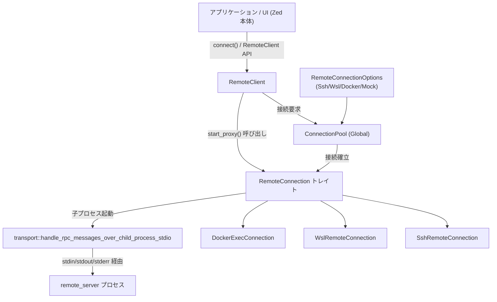
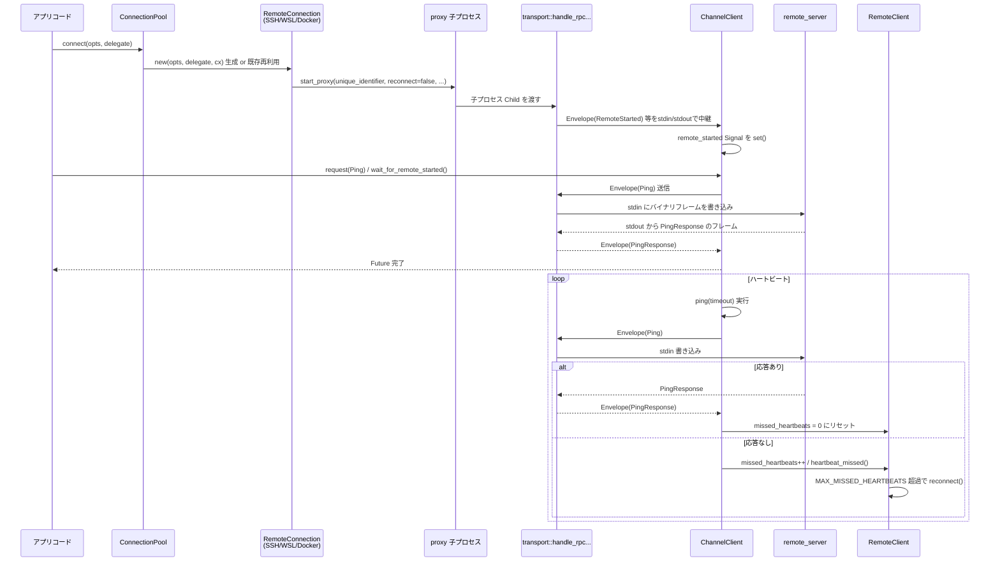

# crates/remote ディレクトリ コード解説

## 1. ざっくり一言

`remote` クレートは、Zed の「リモート開発（remote editing）」機能の **クライアント側サブシステム**です。  
SSH / WSL / Docker 経由でリモートマシン上の `zed-remote-server` プロセスに接続し、RPC メッセージの多重化、再接続、ファイルアップロード、コマンド実行をまとめて扱えるようにしています。

---

## 2. このモジュールの役割

### 2.1 概要

このディレクトリは、次の問題を解決するための機能を提供します。

> 「ユーザーのローカル Zed プロセスから、SSH / WSL / Docker など様々な手段でリモートマシンへ接続し、  
> リモートサーバーと安定的に RPC 通信しつつコマンド実行やファイル転送を行う」

主な役割は次の通りです。

- 接続先（SSH/WSL/Docker/Mock）ごとの違いを隠蔽する **`RemoteConnection` トレイトと実装群**
- 接続管理・再接続・ハートビートを行う **`RemoteClient` と内部状態機械**
- RPC プロトコル (`rpc::proto::Envelope`) を扱う **メッセージ多重化クライアント (`ChannelClient`)**
- `zed-remote-server` バイナリの **配布（ダウンロード／アップロード／ビルド）と起動**
- リモート側標準エラーに出力された **JSON 形式ログのローカル側 Logger への橋渡し**

### 2.2 アーキテクチャ内での位置づけ

全体像としては、アプリケーションコードから見ると `RemoteClient` だけを意識すればよく、  
その裏側で接続プール・トランスポート・子プロセスとのメッセージ中継が動いています。



- アプリケーションは `RemoteConnectionOptions` を作り、`remote::connect()` → `RemoteClient::new()` で接続を開始します。
- `ConnectionPool` は同じオプションへ複数回接続しようとした場合にも、接続の再利用や同時接続の調整を行います。
- `RemoteConnection` 実装（SSH / WSL / Docker / Mock）が、実際のプロセス起動やファイルアップロードを担います。
- `transport::handle_rpc_messages_over_child_process_stdio` がリモートプロセスの stdin/stdout/stderr と RPC メッセージ／ログを橋渡しします。
- `ChannelClient`（`remote_client.rs` 内部）は `rpc::ProtoClient` として、Envelope ベースの RPC を多重化し、再接続時のバッファリングや再送を管理します。

### 2.3 設計上のポイント

コードから読み取れる設計上の特徴は次の通りです。

- **トランスポート抽象化**
  - `RemoteConnection` トレイトを中心に、SSH / WSL / Docker / Mock の各実装が存在します。
  - 上位は `RemoteConnectionOptions` と `RemoteConnection` に対してのみ依存し、実際に SSH なのか Docker なのかを意識する必要はありません。

- **状態機械による接続管理**
  - 内部の `State` enum で `Connecting / Connected / HeartbeatMissed / Reconnecting / ReconnectFailed / ReconnectExhausted / ServerNotRunning` を管理し、
    再接続や切断通知を一元的に扱います。
  - `ConnectionState` は UI など外部向けの簡略化された列挙体です。

- **ハートビートと再接続**
  - `ChannelClient::ping()` と `RemoteClient::heartbeat()` による定期的な ping / 応答監視。
  - 連続して一定回数 (`MAX_MISSED_HEARTBEATS`) 失敗すると自動で再接続処理 (`RemoteClient::reconnect`) に遷移します。

- **接続プール (ConnectionPool)**
  - `Global` として `ConnectionPool` を保持し、同じ `RemoteConnectionOptions` に対する接続を共有・再利用します。
  - 進行中の接続試行（`Connecting`）も共有し、重複接続の無駄を避けています。

- **RPC メッセージ多重化と再送**
  - `ChannelClient` がメッセージ ID・ACK・バッファを管理し、`FlushBufferedMessages` メッセージで再接続後の再送を行います。
  - `ProtoMessageHandlerSet` と連携して、型付きメッセージへのディスパッチを行います。

- **リモートバイナリの配布戦略**
  - リモート側で `zed-remote-server` が存在するかを確認し、なければ
    - リモート側で curl/wget によるダウンロード、
    - もしくはローカルダウンロード＋アップロード（SSH/SFTP、docker cp、WSL 経由の cp）を実行します。
  - debug や `build-remote-server-binary` feature が有効な場合は、`build_remote_server_from_source` でソースビルドにも対応します。

- **ログ取り回し**
  - リモートプロセスの stderr から 1 行ずつ読み込み、JSON 形式であれば `json_log::LogRecord` でデシリアライズしてローカル logger へ再出力します。
  - JSON でない行は `(remote) ...` というプレフィックス付きで stderr にそのまま書き出します。

---

## 3. 主要な機能一覧

このディレクトリが提供する主な機能を列挙します。

- **接続オプションの表現**
  - `RemoteConnectionOptions`: SSH / WSL / Docker / Mock をまとめた列挙体。
  - `SshConnectionOptions`, `WslConnectionOptions`, `DockerConnectionOptions` などの詳細オプション。

- **リモート接続の確立と共有**
  - `connect()` 関数と `ConnectionPool` による、`RemoteConnection` の非同期確立・キャッシュ・共有。

- **高レベルクライアント (`RemoteClient`)**
  - 接続状態の管理（状態機械・イベント発行）。
  - ハートビート監視と自動再接続。
  - ディレクトリアップロード、コマンド実行テンプレート生成などの補助機能。

- **トランスポート実装**
  - `SshRemoteConnection`（`transport/ssh.rs`）: ssh + scp/sftp による接続・アップロード。
  - `WslRemoteConnection`（`transport/wsl.rs`）: `wsl.exe` 経由で WSL ディストリに接続。
  - `DockerExecConnection`（`transport/docker.rs`）: `docker exec` / `podman exec` 経由でコンテナ内に接続。
  - `MockRemoteConnection`（`transport/mock.rs`）: テスト専用の in-memory 接続。

- **RPC メッセージ処理**
  - `ChannelClient` による `rpc::ProtoClient` 実装。
  - `transport::handle_rpc_messages_over_child_process_stdio` による子プロセス stdio と RPC Envelope の橋渡し。
  - `protocol.rs` における Envelope の長さ付きフレーミング（読み書き処理）。

- **ログの橋渡し**
  - `json_log::LogRecord` による、リモート側 JSON ログ → ローカル `log` クレートへの転送。

- **補助的な機能**
  - `parse_platform` / `parse_shell` によるリモート環境検出。
  - SSH のポートフォワード指定文字列のパース (`parse_port_forward_spec`、`SshConnectionOptions::parse_command_line`)。
  - WSL のパス変換（`windows_path_to_wsl_path_impl`, `wsl_path_to_windows_path`）。

---

## 4. 関数・構造体の解説

### 4.1 公開される主な型一覧

`src/remote.rs` から直接 re-export される主な型・トレイトを中心にまとめます。

| 名前 | 種別 | 定義ファイル | 役割 / 用途 |
|------|------|-------------|-------------|
| `RemoteOs` | enum | `remote_client.rs` | リモート OS 種別（Linux / MacOs / Windows）。 |
| `RemoteArch` | enum | 同上 | リモート CPU アーキテクチャ（X86_64 / Aarch64）。 |
| `RemotePlatform` | struct | 同上 | `os` + `arch` の組み合わせ。リモートバイナリ選択に使用。 |
| `CommandTemplate` | struct | 同上 | 実行するプログラム名と引数・環境を表すコマンドテンプレート。 |
| `Interactive` | enum | 同上 | コマンド実行時に TTY を割り当てるかどうか（Yes/No）。 |
| `RemoteClient` | struct | 同上 | 接続状態・再接続・ハートビート・RPC クライアントを管理する「高レベルクライアント」。 |
| `RemoteClientDelegate` | trait | 同上 | パスワード入力やバイナリダウンロードなど、UI 側へ委譲される操作のインターフェース。 |
| `RemoteClientEvent` | enum | 同上 | `RemoteClient` から発行されるイベント（`Disconnected` など）。 |
| `ConnectionIdentifier` | enum | 同上 | リモート側ソケット名に使われる短い識別子（`Setup(id)` / `Workspace(id)`）。 |
| `ConnectionState` | enum | 同上 | UI 等から見える簡易接続状態（Connecting / Connected / Reconnecting / Disconnected など）。 |
| `RemoteConnectionOptions` | enum | 同上 | 接続種別ごとのオプションをまとめた列挙体（Ssh / Wsl / Docker / Mock）。 |
| `RemoteConnection` | trait | 同上 | 各トランスポートが実装するインターフェース（プロキシ起動・アップロード・コマンド生成など）。 |
| `SshConnectionOptions` | struct | `transport/ssh.rs` | SSH 接続のホスト名・ユーザー名・ポート・追加引数など。 |
| `SshPortForwardOption` | struct | `settings` 経由 (`ssh.rs` で re-export) | SSH ポートフォワード設定。 |
| `WslConnectionOptions` | struct | `transport/wsl.rs` | WSL ディストロ名・ユーザー名など。 |
| `DockerConnectionOptions` | struct | `transport/docker.rs` | コンテナ名/ID・ユーザー名・環境変数など。 |
| `ProxyLaunchError` | enum | `proxy.rs` | プロキシプロセスの終了コード 90 を `ServerNotRunning` として意味付けするためのエラー型。 |
| `LogRecord` | struct | `json_log.rs` | リモート側 JSON ログ 1 行を表すシリアライズ可能なログレコード。 |
| `MessageId` | newtype struct | `protocol.rs` | RPC メッセージ ID (`u32`) のラッパー。 |
| `OpenWslPath` (Windows) | struct + `gpui::Action` | `remote_client.rs` | Windows で WSL パスを開くためのアクション。 |

内部用だが重要な型:

| 名前 | 種別 | 定義ファイル | 役割 |
|------|------|-------------|------|
| `ChannelClient` | struct | `remote_client.rs` | `rpc::ProtoClient` 実装。Envelope の送受信・バッファリング・レスポンス待機などを行う。 |
| `ConnectionPool` | struct + `Global` | 同上 | `RemoteConnectionOptions` → `RemoteConnection` のキャッシュと接続共有。 |
| `SshRemoteConnection` | struct | `transport/ssh.rs` | SSH ベースの `RemoteConnection` 実装。 |
| `WslRemoteConnection` | struct | `transport/wsl.rs` | WSL ベースの `RemoteConnection` 実装。 |
| `DockerExecConnection` | struct | `transport/docker.rs` | Docker/PODMAN ベースの `RemoteConnection` 実装。 |
| `MockRemoteConnection` | struct | `transport/mock.rs` | テスト用の `RemoteConnection` 実装。 |

### 4.2 重要な関数・メソッド詳細（代表 7 件）

#### `connect(connection_options: RemoteConnectionOptions, delegate: Arc<dyn RemoteClientDelegate>, cx: &mut AsyncApp) -> Result<Arc<dyn RemoteConnection>>`

**概要**

- 現在の `gpui::AsyncApp` コンテキストと接続オプションから、低レベルな `RemoteConnection` を非同期に確立します。
- 内部では `ConnectionPool` を経由し、既存接続の再利用や同時接続試行の共有を行います。

**引数**

| 引数名 | 型 | 説明 |
|--------|----|------|
| `connection_options` | `RemoteConnectionOptions` | SSH / WSL / Docker / Mock のいずれかの接続オプション。 |
| `delegate` | `Arc<dyn RemoteClientDelegate>` | パスワード入力やバイナリダウンロードなどを UI 側に委譲するためのオブジェクト。 |
| `cx` | `&mut AsyncApp` | `gpui` の非同期アプリコンテキスト。グローバル `ConnectionPool` へのアクセスにも使われます。 |

**戻り値**

- `Ok(Arc<dyn RemoteConnection>)` : 接続確立に成功した `RemoteConnection` 実装（SSH/WSL/Docker/Mock）。
- `Err(anyhow::Error)` : 接続確立に失敗した場合のエラー。

**内部処理の流れ**

1. `cx.update` で `ConnectionPool` のグローバルインスタンスを取得します。
2. `ConnectionPool::connect()` を呼び出し、`Shared<Task<Result<Arc<dyn RemoteConnection>, Arc<anyhow::Error>>>>` を得ます。
3. その `Task` を `.await` し、成功すれば `Arc<dyn RemoteConnection>` を返し、失敗時は `Arc<anyhow::Error>` を `anyhow::Error` に包んで返します。

**Examples（使用例）**

```rust
// SSH 接続オプションを作る                       // SSH で example.com に接続するオプション
use remote::{RemoteConnectionOptions, SshConnectionOptions, RemoteClientDelegate, connect};
use std::sync::Arc;
use gpui::AsyncApp;

// DummyDelegate は RemoteClientDelegate を実装した型とする
async fn open_ssh_connection(cx: &mut AsyncApp) -> anyhow::Result<()> {
    let ssh_opts = SshConnectionOptions {
        host: "example.com".into(),              // 接続先ホスト
        username: Some("user".into()),           // ユーザー名
        ..Default::default()
    };
    let opts = RemoteConnectionOptions::from(ssh_opts); // enum に変換

    let delegate = Arc::new(DummyDelegate);     // Delegate を用意
    let remote = connect(opts, delegate, cx).await?; // 接続確立

    // remote は RemoteConnection トレイトオブジェクト
    println!("Remote shell: {}", remote.shell());
    Ok(())
}
```

**Errors / Panics**

- リモートホストへの接続に失敗した場合（タイムアウト、認証失敗、ssh/docker コマンド失敗など）は `Err` を返します。
- パニックはコードからは見当たりません（`anyhow::bail!` などでエラーを返します）。

**Edge cases**

- 既に同じ `RemoteConnectionOptions` で接続中の場合:
  - `ConnectionPool` が既存接続を再利用するか、進行中の接続タスクを共有します。
- モック接続 (`RemoteConnectionOptions::Mock`) の場合:
  - 事前に `MockConnectionRegistry` に接続が登録されていないとエラーになります。

**使用上の注意点**

- 常に `gpui::AsyncApp` コンテキスト内から呼び出す必要があります（`ConnectionPool` が `Global` として管理されているため）。
- この関数は低レベルな `RemoteConnection` を返すだけであり、`RemoteClient` の状態管理（ハートビートや再接続）は行いません。

---

#### `RemoteClient::new(unique_identifier: ConnectionIdentifier, remote_connection: Arc<dyn RemoteConnection>, cancellation: oneshot::Receiver<()>, delegate: Arc<dyn RemoteClientDelegate>, cx: &mut App) -> Task<Result<Option<Entity<Self>>>>`

**概要**

- 既に確立された `RemoteConnection` と GUI コンテキストから、`RemoteClient` エンティティを生成します。
- リモートプロセスの起動、`ChannelClient` の初期化、ハートビートタスク・監視タスクの起動をまとめて行います。

**引数**

| 引数名 | 型 | 説明 |
|--------|----|------|
| `unique_identifier` | `ConnectionIdentifier` | リモート側ソケット名などに使われる接続識別子。`setup()` や `Workspace(id)` で生成。 |
| `remote_connection` | `Arc<dyn RemoteConnection>` | `connect()` などで取得した低レベル接続。 |
| `cancellation` | `oneshot::Receiver<()>` | 接続確立前にキャンセルするためのワンショット通知。 |
| `delegate` | `Arc<dyn RemoteClientDelegate>` | UI への各種問い合わせのためのデリゲート。 |
| `cx` | `&mut App` | `gpui::App` コンテキスト（同期）。 |

**戻り値**

- `Task<Result<Option<Entity<Self>>>>`
  - `Ok(Some(entity))` : 接続成功し、`RemoteClient` エンティティが生成された。
  - `Ok(None)` : `cancellation` が先に発火し、接続がキャンセルされた。
  - `Err(error)` : プロキシプロセス起動や初期ハンドシェイクに失敗した。

**内部処理の流れ（簡略）**

1. `unique_identifier` を `App` コンテキストを用いて短い文字列に変換（リリースチャネルプレフィクスを付与）。
2. 非同期タスクを `cx.spawn` で起動。
3. 内部で
   - RPC 用の `incoming/outgoing` チャネルを作成。
   - `ChannelClient::new` により RPC クライアントを初期化。
   - `remote_connection.start_proxy()` を呼び出し、リモートプロキシ子プロセスを起動。
   - `client.wait_for_remote_started()` で `RemoteStarted` ハンドシェイク完了を待つ（タイムアウト付き）。
   - 最初の `ping` を送信し、応答が得られることを確認。
   - `Self::monitor()`（IO タスク監視）と `Self::heartbeat()`（ハートビート監視）タスクを起動。
   - 状態を `State::Connected` に遷移させる。
4. 途中でエラーがあればログへ出力しつつ `Err` を返します。

**Examples（使用例）**

基本的な流れを示すサンプル（エラーハンドリング簡略化）:

```rust
use remote::{RemoteClient, RemoteConnectionOptions, ConnectionIdentifier, RemoteClientDelegate, connect};
use gpui::{App, TestAppContext};
use std::sync::Arc;
use futures::channel::oneshot;

// DummyDelegate は RemoteClientDelegate を実装した型とする
async fn create_remote_client(app_cx: &mut TestAppContext) {
    let mut async_cx = app_cx.to_async();                     // 非同期コンテキストへ変換
    let opts = RemoteConnectionOptions::from(
        remote::SshConnectionOptions {
            host: "example.com".into(),
            ..Default::default()
        },
    );
    let delegate = Arc::new(DummyDelegate);                   // デリゲート

    // 低レベル接続を確立
    let remote_conn = connect(opts.clone(), delegate.clone(), &mut async_cx)
        .await
        .unwrap();

    // キャンセル用 oneshot
    let (_cancel_tx, cancel_rx) = oneshot::channel::<()>();

    // RemoteClient エンティティを生成
    let entity = app_cx
        .update(|cx| {
            RemoteClient::new(
                ConnectionIdentifier::setup(),                // 一意識別子
                remote_conn,
                cancel_rx,
                delegate,
                cx,
            )
        })
        .await
        .unwrap()
        .unwrap();                                            // キャンセルされていなければ Some

    // entity を通じて RemoteClient メソッドを呼び出せる
    entity.update(app_cx, |client, _cx| {
        println!("state = {:?}", client.connection_state());
    });
}
```

**Errors / Panics**

- リモートプロキシプロセスが起動しなかった場合、あるいは
  `INITIAL_CONNECTION_TIMEOUT` 以内に `RemoteStarted` / `ping` が完了しない場合は `Err` を返します。
- パニックは `unreachable!()` 分岐など内部状態が不整合なケースに限定されていますが、通常フローでは通りません。

**Edge cases**

- `cancellation` が先に解決した場合は、接続プロセスが途中でも `Ok(None)` を返して終了します。
- プロキシプロセスがすぐ終了した場合は、ログに終了コードとエラー内容を付けたメッセージが出力されます。

**使用上の注意点**

- `RemoteClient::new` は `App`（同期コンテキスト）から呼ぶ必要があります。`AsyncApp` からは一度 `cx.update` 経由で呼び出します。
- `RemoteClient` のライフサイクルは `gpui::Entity` によって管理されるため、エンティティの drop タイミングも考慮する必要があります。

---

#### `RemoteClient::build_command_with_options(...) -> Result<CommandTemplate>`

```rust
pub fn build_command_with_options(
    &self,
    program: Option<String>,
    args: &[String],
    env: &HashMap<String, String>,
    working_dir: Option<String>,
    port_forward: Option<(u16, String, u16)>,
    interactive: Interactive,
) -> Result<CommandTemplate>
```

**概要**

- 現在の `RemoteConnection` に対して、リモート側で実行するコマンド（プログラム名、引数、環境変数など）のテンプレートを生成します。
- 実際の実行は `docker exec` / `ssh` / `wsl.exe` などのローカルコマンドとして表現されます。

**引数（要点）**

- `program` / `args` : リモートで実行したいプログラムとその引数。`None` の場合はログインシェル（`/bin/bash -l` など）を起動。
- `env` : リモートコマンドに渡す環境変数。環境の適切な quoting は各トランスポート実装側で行われます。
- `working_dir` : リモート側の作業ディレクトリ（`~/project` など）。トランスポートに応じて `cd` などへ変換されます。
- `port_forward` : SSH / Docker などでポートフォワード設定を行うための `(local_port, host, remote_port)`。WSL ではサポートされません。
- `interactive` : 対話的な TTY が必要かどうか（`Interactive::Yes` なら `ssh -t` や `docker exec -it` など）。

**戻り値**

- `CommandTemplate { program, args, env }` : ローカル側で実行するコマンドライン情報。

**内部処理**

1. `self.remote_connection()` で現在の `RemoteConnection` を取得。
2. 有効な接続がなければ `anyhow!("no remote connection")` を返します。
3. `RemoteConnection::build_command(...)` を委譲呼び出しし、トランスポート固有のコマンドテンプレートを返します。

**Examples（使用例）**

```rust
use remote::{RemoteClient, Interactive};
use std::collections::HashMap;

// RemoteClient インスタンスは既に Connected 状態だとする
fn build_remote_shell(client: &RemoteClient) -> anyhow::Result<()> {
    let env = HashMap::new();                               // 追加の env は無し
    let cmd = client.build_command_with_options(
        None,                                               // None ならログインシェル
        &[],                                                // 引数なし
        &env,
        Some("~/project".to_string()),                      // プロジェクトディレクトリ
        None,                                               // ポートフォワードなし
        Interactive::Yes,                                   // 対話的シェル
    )?;

    println!("program = {}", cmd.program);                  // 例: "ssh" / "docker" / "wsl.exe"
    println!("args = {:?}", cmd.args);
    Ok(())
}
```

**Errors / Panics**

- アクティブな `RemoteConnection` がない場合は `Err("no remote connection")`。
- ポートフォワードがサポートされないトランスポート（WSL）で `port_forward` を指定すると、トランスポート側で `Err` を返します。

**Edge cases**

- `working_dir` が `"~/..."` 形式の場合:
  - SSH / Docker 実装では `$HOME/...` 形式に変換して `cd` コマンドで扱います。
- `Interactive::No` の場合:
  - SSH では `-T`（Pseudo-TTY 無効）、Docker では `-i` のように設定されます。

**使用上の注意点**

- 返される `CommandTemplate` はローカルプロセス起動用であり、`RemoteClient` 自身はそのプロセスを管理しません。
- 環境変数やパスの quoting は基本的に安全に処理されますが、非常に長いコマンド（特に Windows OpenSSH）の場合は OS の制限に注意が必要です。

---

#### `RemoteClient::upload_directory(&self, src_path: PathBuf, dest_path: RemotePathBuf, cx: &App) -> Task<Result<()>>`

**概要**

- ローカルのディレクトリ `src_path` を、リモートの `dest_path`（`RemotePathBuf`）へアップロードします。
- トランスポートごとに SFTP / SCP / docker cp / WSL `cp -r` などを使い分けます。

**引数**

| 引数名 | 型 | 説明 |
|--------|----|------|
| `src_path` | `PathBuf` | ローカルディレクトリのパス。 |
| `dest_path` | `RemotePathBuf` | リモート側でのディレクトリパス。`PathStyle` に応じて文字列生成されます。 |
| `cx` | `&App` | `gpui::App` コンテキスト。バックグラウンドタスクを起動します。 |

**戻り値**

- `Task<Result<()>>` : 非同期アップロード処理。成功で `Ok(())`。

**内部処理**

1. `self.remote_connection()` から `RemoteConnection` を取得し、なければ `Task::ready(Err("no remote connection"))` を返す。
2. `RemoteConnection::upload_directory` を呼び出し、トランスポート固有のアップロード処理タスクを返す。

**トランスポートごとの挙動（概要）**

- **SSH (`SshRemoteConnection`)**
  - まず sftp が利用可能かを `which sftp` で確認。
  - 可能なら sftp バッチ `put -r "src" "dest"` を実行。
  - 失敗した場合は scp `scp -r` にフォールバック。
- **Docker (`DockerExecConnection`)**
  - `docker cp -a` でファイルコピーし、その後 `docker exec ... chown user:user dest` で所有者を修正。
- **WSL (`WslRemoteConnection`)**
  - ローカル Windows パスを WSL パスに変換し、WSL 内で `cp -r` を実行。
- **Mock**
  - 何も送らず、即座に `Ok(())` を返します（テスト用）。

**使用上の注意点**

- リモートに十分なディスク容量と権限がある前提です。特に Docker / SSH では所有者やパーミッションに注意が必要です。
- エラー時はログに詳細メッセージ（stderr の内容など）が出力されます。
- Windows + SSH の組み合わせでは、SFTP による対話パスワードの扱いに制限があるため、SFTP が失敗した場合 SCP にフォールバックする設計になっています。

---

#### `RemoteConnection::start_proxy(...) -> Task<Result<i32>>`（トレイトメソッド）

```rust
fn start_proxy(
    &self,
    unique_identifier: String,
    reconnect: bool,
    incoming_tx: UnboundedSender<Envelope>,
    outgoing_rx: UnboundedReceiver<Envelope>,
    connection_activity_tx: Sender<()>,
    delegate: Arc<dyn RemoteClientDelegate>,
    cx: &mut AsyncApp,
) -> Task<Result<i32>>;
```

**概要**

- 各トランスポート実装が、リモート側で `zed-remote-server ... proxy` プロセスを起動し、その標準入出力を RPC チャネルに接続するエントリポイントです。
- 戻り値の `Task<Result<i32>>` は、プロキシプロセスの終了コードを表します。

**役割**

- `incoming_tx` : リモート → ローカル（サーバーからクライアントへ）の Envelope を流すチャネル。
- `outgoing_rx` : ローカル → リモート（クライアントからサーバーへ）の Envelope を受け取るチャネル。
- `connection_activity_tx` : I/O 活動があったことをハートビート側へ知らせるチャネル。

**代表的な実装例**

- **SSH (`SshRemoteConnection`)**
  - `ssh` コマンドに `env` / `proxy` / `--identifier` / `--reconnect` などを指定してプロセス起動。
  - 起動した `Child` を `transport::handle_rpc_messages_over_child_process_stdio` に渡します。
- **Docker (`DockerExecConnection`)**
  - `docker exec -u remote_user -w remote_dir -i container_id <remote_binary> proxy ...` を起動。
  - 同様に `handle_rpc_messages_over_child_process_stdio` に接続。
- **WSL (`WslRemoteConnection`)**
  - `wsl.exe --distribution <distro> env <proxy_args...>` を起動。

**使用上の注意点**

- このメソッドは通常、直接呼び出すのではなく、`RemoteClient::new` 内で利用されます。
- プロキシプロセスの終了コードが 90 の場合は `ProxyLaunchError::ServerNotRunning` にマッピングされ、`RemoteClient::monitor` で特別扱いされます。

---

#### `transport::handle_rpc_messages_over_child_process_stdio(...) -> Task<Result<i32>>`

**概要**

- リモートプロキシ子プロセスの stdin/stdout/stderr と、RPC メッセージチャネルを仲介する関数です。
- Envelope は `protocol.rs` の `write_message` / `read_message_with_len` に従い「4バイト長 + 本文」というバイナリフレームでやりとりされます。

**主要な処理**

1. 子プロセスの `stdin`, `stdout`, `stderr` を取り出す。
2. 3 つのバックグラウンドタスクを起動:
   - `stdin_task` : `outgoing_rx` から Envelope を読み、`write_message` で子プロセス stdin に書き込み。
   - `stdout_task` : 子プロセス stdout から先頭 4 バイト（`MESSAGE_LEN_SIZE`）＋本文を読み、`incoming_tx` に Envelope を送る。
   - `stderr_task` : stderr を 1 行ずつ読み込んで JSON パースを試み、`LogRecord` としてローカル logger に出力。パースできなければ `(remote) ...` として stderr に流す。
3. いずれかのタスクが終了したら join し、子プロセスの exit status を拾って終了コードを返します。

**Edge cases**

- stdout からの読み込みで先頭 4 バイトより少ない長さしか読めなかった場合、`read_exact` で補完してから長さを解釈しています。
- stderr の行バッファは、`\n` が見つかるまでバイト列として溜めていき、行ごとに JSON デコードを試みます。

**使用上の注意点**

- この関数は常にバックグラウンドタスクとして使われます（`RemoteConnection::start_proxy` 内）。
- `connection_activity_tx` へ I/O 活動を通知することで、ハートビートタスクが「最近メッセージが届いているか」を判断できるようになります。

---

#### `ChannelClient::request<T: RequestMessage>(&self, payload: T) -> impl Future<Output = Result<T::Response>>`

（実装は `request_internal` と `request_dynamic` に委譲）

**概要**

- 型付き RPC リクエストを送り、対応するレスポンスを待つ非同期メソッドです。
- 内部では `Envelope` に包んだメッセージを送信し、メッセージ ID でレスポンスを照合します。

**内部処理（要約）**

1. `payload.into_envelope()` で `proto::Envelope` を生成（`id` は後で設定）。
2. 新しい `message_id` を発行し、`response_channels` に `message_id → oneshot::Sender` を登録。
3. `send_buffered` で Envelope を送信し、ローカルバッファにも積む。
4. レスポンス用 oneshot の `rx` を待つ。
5. 受信した Envelope の payload が `Error` なら `RpcError` として `Err`、そうでなければ `T::Response::from_envelope` でデコードして返す。

**使用上の注意点**

- タイムアウト付きの ping などは `ChannelClient::ping` のようなラッパーメソッドとして提供されています。
- 再接続中（送信エラー）の場合でも `send_buffered` はエラーを無視してログだけ残す設計になっており、「グローバルな切断 UI」を前提にしています。

---

#### `SshConnectionOptions::parse_command_line(input: &str) -> Result<Self>`

**概要**

- `ssh` コマンドライン風の文字列（例: `"ssh -p 2222 user@[2001:db8::1]:2222"`）から、`SshConnectionOptions` を構築します。
- ホスト名／ユーザー名／ポート／追加オプション／ポートフォワード設定などを解析します。

**主な対応仕様**

- 許可されるフラグ (`-4`, `-6`, `-A` など) と引数付きフラグ (`-p`, `-l`, `-L` など) をホワイトリスト制御。
- IPv4 / IPv6 / ホスト名に対応:
  - `user@2001:db8::1`
  - `user@[2001:db8::1]:2222`
  - `user@example.com:2222` など。
- `-L` オプションのポートフォワード文字列を `SshPortForwardOption` にパース（IPv6 の角括弧対応を含む）。

**Examples（簡略）**

```rust
use remote::SshConnectionOptions;

fn parse_example() -> anyhow::Result<()> {
    let opts = SshConnectionOptions::parse_command_line(
        "ssh -p 2222 -L8080:localhost:80 user@[2001:db8::1]"
    )?;
    assert_eq!(opts.port, Some(2222));
    assert_eq!(opts.username.as_deref(), Some("user"));
    // ポートフォワード設定は opts.port_forwards に入る
    Ok(())
}
```

**使用上の注意点**

- サポートされないフラグを含む入力は `anyhow!("unsupported argument: ...")` でエラーになります。
- 引数のない `ssh` 部分（先頭 `"ssh "`）は任意で、`parse_command_line` 内で取り除かれます。

---

### 4.3 その他の関数（代表）

| 関数名 | 定義 | 役割（1 行） |
|--------|------|--------------|
| `protocol::read_message` | `protocol.rs` | 先頭 4 バイトの長さを読み、その長さ分の Envelope を prost でデコードする。 |
| `protocol::write_message` | 同上 | Envelope を `u32` Little Endian 長さ付きバッファとして書き出す。 |
| `protocol::read_message_raw` | 同上 | Envelope 本文を生バイト列として読み込む（デコードしない）。 |
| `transport::parse_platform` | `transport.rs` | `uname -sm` 出力から `RemotePlatform`（OS+Arch）を決定する。 |
| `transport::parse_shell` | 同上 | `echo $SHELL` 出力からシェル名を決定し、空ならフォールバックシェルを返す。 |
| `ProxyLaunchError::from_exit_code` | `proxy.rs` | プロキシ終了コード（i32）から `ServerNotRunning` を判定する。 |
| `RemoteConnectionOptions::display_name` | `remote_client.rs` | UI 表示向けの接続名（ニックネームや Docker コンテナ名）を生成する。 |
| `WslConnectionOptions::abs_windows_path_to_wsl_path` | `wsl.rs` | Windows 絶対パスを WSL 内パスに変換する非同期処理。 |
| `wsl_path_to_windows_path` (Windows) | `wsl.rs` | WSL/POSIX パスを Windows パスに変換する。 |

---

## 5. データフロー

ここでは、典型的な「リモート接続の確立とハートビート」のデータフローを整理します。

### 5.1 概要

1. アプリケーションは `RemoteConnectionOptions` と `RemoteClientDelegate` を用意し、`connect()` → `RemoteClient::new()` で接続を開始します。
2. `ConnectionPool` が必要に応じて `SshRemoteConnection` / `WslRemoteConnection` / `DockerExecConnection` のいずれかを生成します。
3. `RemoteConnection::start_proxy` がリモート側で `zed-remote-server ... proxy` を起動し、その stdio を `handle_rpc_messages_over_child_process_stdio` に渡します。
4. `ChannelClient` が Envelope ベースの RPC を行い、`RemoteClient` がその上にハートビートと再接続ロジックを構築します。

### 5.2 シーケンス図



### 5.3 要点

- `ChannelClient` は RPC プロトコルの全体をカプセル化しており、`RemoteClient` からは `ping` やメッセージ送受信のインターフェースだけを見ればよい構造になっています。
- `connection_activity_tx` は I/O 活動を伝えるため、ハートビートは「最近メッセージが届いていれば ping をスキップする」ことができます。
- 再接続時には
  - `RemoteConnection::kill()` で既存プロセスを終了し、
  - `ConnectionPool::connect()` で新しい接続を確立、
  - `ChannelClient::reconnect()` と `resync()` でメッセージバッファを再送する、
というステップでセッションを復元します。

---

## 6. 使い方（How to Use）

### 6.1 基本的な使用方法

ここでは「SSH 経由でリモートに接続し、`RemoteClient` を作って状態を確認する」最小構成を例示します。  
実際の Zed 本体コードでは `gpui::test` マクロや独自のアプリ初期化が使われますが、流れは同じです。

```rust
use remote::{
    RemoteClient, RemoteClientDelegate, RemoteConnectionOptions, SshConnectionOptions,
    ConnectionIdentifier, connect,
};
use gpui::{App, AsyncApp, Task};
use std::sync::Arc;
use futures::channel::oneshot;

// シンプルな Delegate 実装（実運用では UI にパスワードダイアログを出すなど）
struct MyDelegate;

impl RemoteClientDelegate for MyDelegate {
    fn ask_password(
        &self,
        _prompt: String,
        _tx: oneshot::Sender<askpass::EncryptedPassword>,
        _cx: &mut AsyncApp,
    ) {
        // 例では未実装（実際はパスワードを送る）
        unimplemented!();
    }

    fn get_download_url(
        &self,
        _platform: remote::RemotePlatform,
        _release_channel: release_channel::ReleaseChannel,
        _version: Option<semver::Version>,
        _cx: &mut AsyncApp,
    ) -> gpui::Task<anyhow::Result<Option<String>>> {
        Task::ready(Ok(None))
    }

    fn download_server_binary_locally(
        &self,
        _platform: remote::RemotePlatform,
        _release_channel: release_channel::ReleaseChannel,
        _version: Option<semver::Version>,
        _cx: &mut AsyncApp,
    ) -> Task<anyhow::Result<std::path::PathBuf>> {
        // 実際には Server バイナリのダウンロード処理を書く
        unimplemented!();
    }

    fn set_status(&self, status: Option<&str>, _cx: &mut AsyncApp) {
        println!("status: {:?}", status);
    }
}

fn start_remote_session(app: &mut App) {
    // App から非同期タスクを起動する                        // gpui のタスク起動
    app.spawn(|cx| async move {
        let mut async_cx = cx.to_async();                      // AsyncApp に変換

        // 1. 接続オプションを構築する                         // SSH ホスト / ユーザーを指定
        let ssh_opts = SshConnectionOptions {
            host: "example.com".into(),
            username: Some("user".into()),
            ..Default::default()
        };
        let opts = RemoteConnectionOptions::from(ssh_opts);    // enum に変換

        // 2. Delegate を用意する                             // 状態表示やダウンロード処理を委譲
        let delegate = Arc::new(MyDelegate);

        // 3. RemoteConnection を確立する                      // ConnectionPool 経由
        let remote_conn = connect(opts.clone(), delegate.clone(), &mut async_cx)
            .await
            .expect("failed to connect");

        // 4. RemoteClient を作る                              // キャンセル用 oneshot を用意
        let (_cancel_tx, cancel_rx) = oneshot::channel::<()>();
        let client_entity = cx
            .update(|cx| {
                RemoteClient::new(
                    ConnectionIdentifier::setup(),             // 一意識別子
                    remote_conn,
                    cancel_rx,
                    delegate,
                    cx,
                )
            })
            .await
            .expect("task failed")
            .expect("canceled");

        // 5. RemoteClient の状態を読む                        // Entity 経由でアクセス
        client_entity.update(&mut cx, |client, _cx| {
            println!("connection_state = {:?}", client.connection_state());
        });
    }).detach();
}
```

### 6.2 よくある使用パターン

#### パターン 1: リモートシェル起動コマンドの構築

`RemoteClient` からリモートシェルを開くためのコマンドテンプレートを取得し、  
それをローカル側のプロセス起動に渡す、といった使い方が想定されています。

```rust
use remote::{RemoteClient, Interactive};
use std::collections::HashMap;

// RemoteClient が Connected な状態で呼び出す
fn open_remote_shell(client: &RemoteClient) -> anyhow::Result<()> {
    // 追加環境変数（ここでは無し）                            // 環境変数は必要に応じて指定
    let env = HashMap::new();

    // ログインシェルをプロジェクトディレクトリで起動する      // ~/project に cd した上でシェル起動
    let cmd = client.build_command(
        None,                                                // None => デフォルトシェル
        &[],                                                 // 引数なし
        &env,
        Some("~/project".to_string()),
        None,                                                // ポートフォワードなし
    )?;

    // cmd.program, cmd.args を使ってローカルプロセスを起動
    println!("local command: {} {:?}", cmd.program, cmd.args);
    Ok(())
}
```

#### パターン 2: ディレクトリのアップロード

プロジェクトの初回同期時などに、ローカルのディレクトリをリモート側へコピーする例です。

```rust
use remote::RemoteClient;
use util::paths::RemotePathBuf;
use gpui::App;
use std::path::PathBuf;

// RemoteClient と App がある前提
fn sync_project_files(client: &RemoteClient, app: &App) {
    // ローカルディレクトリ                                   // 例: ./my-project
    let src = PathBuf::from("my-project");

    // リモート側ディレクトリ                                 // PathStyle は RemoteClient が保持
    let remote_dest = RemotePathBuf::new(
        "~/workspace/my-project".to_string(),
        client.path_style(),
    );

    // アップロードタスクを起動                                // 戻り値は Task<Result<()>> なので detach も可能
    let task = client.upload_directory(src, remote_dest, app);
    app.background_executor().spawn(async move {
        if let Err(e) = task.await {
            eprintln!("upload failed: {:#}", e);
        }
    }).detach();
}
```

#### パターン 3: Mock 接続を使ったテスト

`test` or `feature = "test-support"` のときのみ使える Mock 接続を利用したテストパターンです。

```rust
#[cfg(any(test, feature = "test-support"))]
async fn test_with_mock_connection(
    client_cx: &mut gpui::TestAppContext,
    server_cx: &mut gpui::TestAppContext,
) {
    use remote::RemoteClient;

    // 1. サーバー側 Mock セッションを作る                     // MockConnection::new を間接的に呼ぶ
    let (opts, _server_proto_client, connect_guard) =
        RemoteClient::fake_server(client_cx, server_cx);

    // ここで HeadlessProject 等、サーバー側を構築する         // (このコードには登場しません)

    // 2. connect_guard を drop すると接続が許可される          // 接続解放のタイミングを制御
    drop(connect_guard);

    // 3. クライアント側 RemoteClient エンティティを作る        // test 用ヘルパ
    let entity = RemoteClient::connect_mock(opts, client_cx).await;

    entity.update(client_cx, |client, _cx| {
        assert!(!client.is_disconnected());
    });
}
```

### 6.3 使用上の注意点（まとめ）

- **gpui コンテキスト依存**
  - ほぼすべてのエントリポイント (`connect`, `RemoteClient::new`, `upload_directory` など) は `gpui::App` / `AsyncApp` のコンテキストから呼ぶ前提です。
  - `ConnectionPool` や `MockConnectionRegistry` は `Global` として管理されているため、通常の単体ユーティリティ感覚で使うと動きません。

- **接続状態の前提**
  - `RemoteClient::build_command*` や `upload_directory` などは、内部で `remote_connection()` を取得します。
  - 接続がない状態では `Err("no remote connection")` や `Task::ready(Err(...))` が返るため、`connection_state()` や `is_disconnected()` で事前に確認するのが安全です。

- **再接続と切断イベント**
  - 一定回数の再接続失敗で `State::ReconnectExhausted` となり、`RemoteClientEvent::Disconnected` が emit されます。
  - プロキシプロセスの終了コードが 90 (`ServerNotRunning`) の場合も切断イベントが発行され、UI 側で「サーバーが起動していない」旨を表示できます。

- **トランスポートごとの制約**
  - WSL ではホストとネットワークインターフェースを共有しているため、`build_forward_ports_command` は `Err("WSL shares a network interface...")` を返します。
  - Docker ではポートフォワードコマンド (`build_forward_ports_command`) は `Err("Not currently supported for docker_exec")` になっており、現状対応していません。
  - SSH のポートフォワード文字列はかなり柔軟にパースしますが、誤った形式は `anyhow!("Invalid port forward format")` で失敗します。

- **外部コマンド依存**
  - SSH/WSL/Docker それぞれで `ssh` / `scp` / `sftp` / `docker` / `podman` / `wsl.exe` / `curl` / `wget` などの外部コマンドを呼び出しています。
  - 環境にこれらがインストールされていない場合、接続確立やバイナリ配布がエラーになります。

- **バイナリ配布・ビルド**
  - `build_remote_server_from_source` は debug ビルドや `build-remote-server-binary` feature のときのみ有効です。
  - `ZED_BUILD_REMOTE_SERVER` / `ZED_COPY_REMOTE_SERVER` などの環境変数によって挙動が変わるため、ローカル開発環境ではこれらの設定と外部ツール（zig, cargo-zigbuild など）の有無に注意が必要です。

---

## 7. 関連ファイル

このディレクトリ内のファイルと、その役割の一覧です。

| パス | 役割 / 関係 |
|------|------------|
| `remote/Cargo.toml` | `remote` クレートの定義。ライブラリエントリを `src/remote.rs` に指定し、依存クレートや feature（`build-remote-server-binary`, `test-support`）を宣言している。 |
| `remote/src/remote.rs` | クレートのルートモジュール。`json_log`, `protocol`, `proxy`, `remote_client` を公開し、`SshConnectionOptions` / `DockerConnectionOptions` / `WslConnectionOptions` などを re-export する。 |
| `remote/src/remote_client.rs` | クレートの中心。`RemoteClient`・`RemoteConnectionOptions`・`RemoteConnection` トレイト・`ChannelClient`・`ConnectionPool` など、リモート接続管理と RPC 多重化の大部分を実装している。 |
| `remote/src/json_log.rs` | リモート側 stderr から流れてくる JSON ログ 1 行を `LogRecord` としてシリアライズ／デシリアライズし、ローカル logger へ再出力するためのモジュール。 |
| `remote/src/protocol.rs` | `rpc::proto::Envelope` メッセージの長さ付きフレーミング（`u32` little endian）を行うユーティリティ。`read_message` / `write_message` / `read_message_raw` などを提供。 |
| `remote/src/proxy.rs` | プロキシプロセスの終了コードから「サーバーが起動していない」ことを検出するための `ProxyLaunchError` enum と変換ロジック。 |
| `remote/src/transport.rs` | 共通トランスポートユーティリティ。`parse_platform` / `parse_shell` と、子プロセス stdio と RPC をつなぐ `handle_rpc_messages_over_child_process_stdio`、および debug 用の `build_remote_server_from_source` などを提供する。 |
| `remote/src/transport/ssh.rs` | SSH ベースの `RemoteConnection` 実装。`SshConnectionOptions` 構造体、接続確立 (`SshRemoteConnection::new`)、サーバーバイナリ配布、SFTP/SCP 経由のファイル／ディレクトリアップロード、ポートフォワード設定などを含む。 |
| `remote/src/transport/wsl.rs` | WSL ベースの `RemoteConnection` 実装。`WslConnectionOptions` 構造体、WSL コマンド実行 (`wsl.exe`)、WSL 内でのサーバーバイナリ配布、Windows パス ↔ WSL パス変換などを提供。 |
| `remote/src/transport/docker.rs` | Docker (または podman) ベースの `RemoteConnection` 実装。`DockerConnectionOptions`、`docker exec` / `docker cp` によるサーバーバイナリ配布とプロキシ起動、ディレクトリアップロードを実装。 |
| `remote/src/transport/mock.rs` | テスト用のモックトランスポート。`MockRemoteConnection`・`MockConnectionOptions`・`MockConnectionRegistry` と、それを利用する `MockConnection` ヘルパを提供する。`RemoteClient::fake_server` / `connect_mock` などから利用される。 |

このディレクトリ外では、リモート側サーバー本体 `remote_server` クレートが存在し、ここで定義されたプロトコル（`rpc::proto::Envelope`）やハンドシェイク（`RemoteStarted` など）に従って通信しますが、その実装はこのチャンクには含まれていません。
