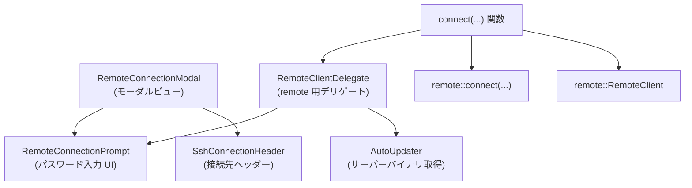
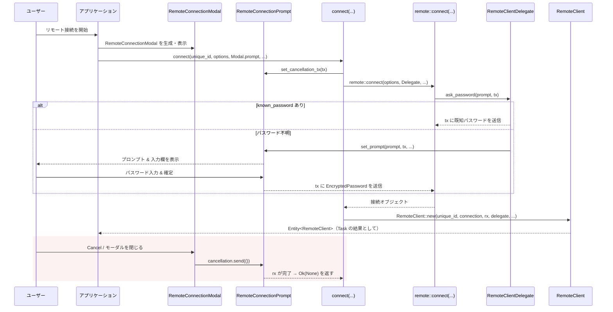

# remote_connection/ ディレクトリ解説

## 1. ざっくり一言

`remote_connection` クレートは、SSH / WSL / Docker などのリモート接続のために、

- パスワードや確認メッセージを表示する UI モーダル
- `remote` クレートの接続処理 (`remote::connect` / `RemoteClient`) との橋渡し

を行うためのモジュールです。

---

## 2. このモジュールの役割

### 2.1 概要

- このモジュールは、**リモート環境への接続時に必要なユーザーとの対話**（パスワード入力・ステータス表示・キャンセル）を UI 上で行い、その結果を `remote` クレートの接続処理に渡します。
- UI 部分は `gpui` / `ui` / `markdown` / `ui_input` などを用いて実装され、接続実行部分は `remote` クレートに委譲します。
- また、`auto_update` クレートの `AutoUpdater` を介して、リモートサーバーバイナリのダウンロードや URL 取得も行います。

### 2.2 アーキテクチャ内での位置づけ

このクレート内の主な型と、外部クレートとの関係を簡略図にすると次のようになります。



- アプリケーションは通常、
  1. `RemoteConnectionModal` をモーダルとして表示し、
  2. その内部の `RemoteConnectionPrompt` を `connect` 関数に渡して接続処理を開始します。
- `RemoteClientDelegate` は `remote::RemoteClientDelegate` トレイトの実装として、`remote` クレート側から呼び出され、UI の更新やバイナリダウンロードを担当します。

### 2.3 設計上のポイント

コードから読み取れる特徴は次のとおりです。

- **責務の分割**
  - `RemoteConnectionPrompt`: プロンプト文言・ステータス表示・パスワード入力フィールドの UI とその状態保持。
  - `RemoteConnectionModal`: ヘッダー＋`RemoteConnectionPrompt` を含むモーダル全体の表示と、キャンセル／確定アクションの管理。
  - `RemoteClientDelegate`: `remote` クレートのデリゲートとして、パスワード問い合わせやステータス更新、サーバーバイナリのダウンロードを実行。
- **状態管理**
  - 入力中のテキストや「パスワードかどうか」「マスクするかどうか」、接続状況メッセージなどを `RemoteConnectionPrompt` がフィールドとして保持します。
  - モーダルが閉じられたかどうかを `RemoteConnectionModal.finished` で追跡します。
- **キャンセル処理**
  - `futures::channel::oneshot` を用いたキャンセルチャネルを持ち、モーダルのキャンセル操作や `Drop` 時に接続処理へキャンセルを通知します。
- **エラーハンドリング**
  - `anyhow::Result` と `anyhow::Context` を利用し、特にサーバーバイナリのダウンロード時には OS / アーキテクチャ / バージョン情報をエラーメッセージに付加します。
  - `oneshot::Sender` の送信結果や UI 更新の戻り値は `ok()` で無視する方針になっています（失敗はログなどを通じて別途扱う想定と考えられますが、詳細はこのチャンクからは分かりません）。

---

## 3. 主要な機能一覧

このクレートが提供する主な機能は次のとおりです。

- **リモート接続モーダルの表示**
  - `RemoteConnectionModal`: 接続先情報（SSH / WSL / Docker / Mock）とパス一覧を表示し、パスワード入力用の `RemoteConnectionPrompt` を内包するモーダルを構築します。
- **パスワード／確認プロンプトの表示・入力**
  - `RemoteConnectionPrompt`: Markdown で表示されるプロンプト文言、Caps Lock 警告、マスク／非マスク切り替え付きの入力欄、接続ステータスメッセージを提供します。
- **キャンセル可能な接続処理の開始**
  - `connect(...)`: `remote::connect` を呼び出しつつ、キャンセルチャネルと UI を連携させた非同期接続を開始し、`RemoteClient` の `Entity` を返すタスクを生成します。
- **remote クレートへのデリゲート実装**
  - `RemoteClientDelegate`:
    - パスワード問い合わせ (`ask_password`)
    - ステータスメッセージ更新 (`set_status`)
    - リモートサーバーバイナリのローカルダウンロード (`download_server_binary_locally`)
    - ダウンロード URL の取得 (`get_download_url`)
- **接続先ヘッダーの表示**
  - `SshConnectionHeader`: 接続先（ホスト名／ニックネーム）と対象パス一覧のヘッダー UI を提供します。

---

## 4. 関数・構造体の解説

### 4.1 主要な構造体一覧

| 名前 | 種別 | 役割 / 用途 |
|------|------|-------------|
| `RemoteConnectionPrompt` | 構造体 | パスワード・確認メッセージ・接続ステータスを表示し、テキスト入力（エディタ）を管理する UI コンポーネントです。 |
| `RemoteConnectionModal`  | 構造体 | `RemoteConnectionPrompt` を内包したモーダルビューで、接続先情報のヘッダーとキャンセル UI を持ちます。 |
| `SshConnectionHeader`    | 構造体 | 接続先の表示（ニックネーム / 接続文字列 / WSL / Docker 等の種別アイコン / パス一覧）専用のヘッダーコンポーネントです。 |
| `RemoteClientDelegate`   | 構造体 | `remote::RemoteClientDelegate` を実装し、remote クレート側からの要求に応じて UI 更新やサーバーバイナリのダウンロードを行います。 |

このほか、外部クレートの型として `RemoteConnectionOptions`, `ConnectionIdentifier`, `RemotePlatform`, `RemoteClient`, `AutoUpdater` などを利用していますが、その定義はこのチャンクには含まれていません。

---

### 4.2 主要メソッド・関数の詳細

#### `RemoteConnectionPrompt::set_prompt(&mut self, prompt: String, tx: oneshot::Sender<EncryptedPassword>, window: &mut Window, cx: &mut Context<Self>)`

**概要**

- リモート側からのパスワード入力プロンプト（あるいは yes/no 確認プロンプト）を受け取り、UI に表示すると同時に、入力完了時に返すための `oneshot::Sender` を内部に保持します。

**引数**

| 引数名 | 型 | 説明 |
|--------|----|------|
| `prompt` | `String` | 画面に表示するプロンプト文言。`"yes/no"` を含む場合は確認プロンプトとみなされます。 |
| `tx` | `oneshot::Sender<EncryptedPassword>` | ユーザーが入力した値を送信するためのチャネル送信側です。 |
| `window` | `&mut Window` | UI ウィンドウ。フォーカス移動などに使用されます。 |
| `cx` | `&mut Context<Self>` | `RemoteConnectionPrompt` 用の UI コンテキストです。 |

**挙動の要点**

1. `prompt` に `"yes/no"` が含まれているかを判定し、含まれていなければ「パスワードプロンプト」として扱います。
   - パスワードプロンプト: `is_password_prompt = true`, `is_masked = true`（入力をマスク）。
   - yes/no プロンプト: `is_password_prompt = false`, `is_masked = false`（マスクなし、トグルボタンも表示しない）。
2. `editor.set_masked(self.is_masked, window, cx)` でエディタのマスク状態を更新します。
3. `cx.new` で `Markdown` エンティティを生成し、プロンプト文言を Markdown として表示できるようにします。
4. `(markdown, tx)` を `self.prompt` に保存し、既存のステータスメッセージをクリアします。
5. エディタにフォーカスを当て、`cx.notify()` で再描画をトリガーします。

**エッジケース**

- 既に `self.prompt` に別の `Sender` が入っている状態で呼び出すと、新しい `(markdown, tx)` で上書きされ、古い `Sender` はドロップされます。その結果、古い受信側では `oneshot` チャネルがキャンセルとして扱われます。
- `"yes/no"` の判定は単純な文字列検索です。大文字小文字やロケールなどは考慮されていません。

**使用上の注意点**

- `prompt` に `"yes/no"` を含めるかどうかで UI の振る舞い（マスク・アイコン表示）が変わるため、remote 側でのプロンプトメッセージ設計に影響します。
- `tx` は `confirm` 呼び出し時にだけ利用されるため、`set_prompt` の呼び出しごとに新しい `Sender` を渡す必要があります。

---

#### `RemoteConnectionPrompt::confirm(&mut self, window: &mut Window, cx: &mut Context<Self>)`

**概要**

- 現在表示中のプロンプトに対するユーザー入力を確定し、`EncryptedPassword` へ変換して `oneshot::Sender` に送信します。その後、入力欄をクリアします。

**引数**

| 引数名 | 型 | 説明 |
|--------|----|------|
| `window` | `&mut Window` | UI ウィンドウ。エディタのクリアなどに使用されます。 |
| `cx` | `&mut Context<Self>` | `RemoteConnectionPrompt` 用コンテキスト。 |

**戻り値**

- なし（`()`）。送信の成功／失敗は戻り値としては返りません。

**内部処理の流れ**

1. `self.prompt.take()` で `(Markdown の Entity, Sender)` を取り出し、`self.prompt` を `None` にします。
   - `None` の場合は何もせず終了します。
2. ステータスメッセージを `"Connecting"` に設定します。
3. `editor.text(cx)` でエディタに入力された文字列を取得します。
4. `EncryptedPassword::try_from(pw.as_ref())` を試み、成功した場合のみ `Sender` に送信します。
   - `tx.send(secure).ok()` で送信し、送信エラーは無視します。
5. `editor.clear(window, cx)` で入力欄をクリアします。

**エッジケース**

- `EncryptedPassword::try_from` に失敗した場合:
  - 送信は行われず、`Sender` はドロップされます。そのため、受信側では「チャネルがクローズされた」として扱われます。
  - ステータスメッセージは `"Connecting"` のまま設定されます。
- `self.prompt` が `None` のときに呼び出しても何も起こりません。

**使用上の注意点**

- 通常、このメソッドは「ユーザーが Enter を押した」「OK を押した」などのトリガーから呼び出される想定です。
- 1 回のプロンプトにつき 1 回だけ呼ぶのが前提です。複数回呼び出すと 2 回目以降は `self.prompt` が `None` のため何も起きません。

---

#### `RemoteConnectionModal::dismiss(&mut self, _: &menu::Cancel, _: &mut Window, cx: &mut Context<Self>)`

**概要**

- モーダルのキャンセル操作を処理し、接続処理にキャンセル通知を送ったうえでモーダルを閉じるための内部メソッドです。

**引数**

| 引数名 | 型 | 説明 |
|--------|----|------|
| `_` | `&menu::Cancel` | キャンセルアクションのトークン。具体的な値は使っていません。 |
| `_` | `&mut Window` | ウィンドウ。ここでは直接利用していません。 |
| `cx` | `&mut Context<Self>` | モーダル自身の UI コンテキスト。 |

**内部処理の流れ**

1. `self.prompt.update(cx, |prompt, _cx| prompt.cancellation.take())` により、
   - `RemoteConnectionPrompt` が保持しているキャンセル用 `oneshot::Sender<()>` を `take()` して取得します。
2. 取得できた場合は、
   - `log::debug!("cancelling remote connection");`
   - `tx.send(()).ok();` でキャンセル通知を送信します。
3. 最後に `self.finished(cx)` を呼び出し、
   - `self.finished = true` に設定し、
   - `cx.emit(DismissEvent);` でモーダルのクローズを通知します。

**エッジケース**

- `prompt.cancellation` が `None` の場合はキャンセル通知は送られず、そのまま `finished()` だけが呼ばれます。
- `tx.send(())` の結果は `ok()` で無視されます。受信側が既にドロップされている場合でもエラーにはなりません。

**使用上の注意点**

- このメソッドは `Render` 実装内で `on_action(cx.listener(Self::dismiss))` や「Cancel」ボタンの `on_click` から呼ばれるため、通常は直接呼び出す必要はありません。
- モーダルの `Drop` 時にも別経路でキャンセルが送信されるため、二重にキャンセル通知が飛ぶ可能性がありますが、`oneshot::Sender` は 1 回目以降の送信は失敗し、ここでは無視されます。

---

#### `RemoteClientDelegate::ask_password(&self, prompt: String, tx: oneshot::Sender<EncryptedPassword>, cx: &mut AsyncApp)`

**概要**

- `remote` クレート側からパスワード入力が必要になった際に呼び出され、既知のパスワードがあればそれを即座に返し、なければ UI 上でプロンプトを表示させます。

**引数**

| 引数名 | 型 | 説明 |
|--------|----|------|
| `prompt` | `String` | 表示するプロンプトメッセージ。 |
| `tx` | `oneshot::Sender<EncryptedPassword>` | 入力されたパスワードを返すためのチャネル送信側。 |
| `cx` | `&mut AsyncApp` | 非同期タスク側のアプリケーションコンテキストです。 |

**内部処理の流れ**

1. `self.known_password.clone()` をローカル変数にコピーし、`take()` で取り出そうとします。
2. ローカル変数にパスワードが入っていれば、それをそのまま `tx.send(password).ok()` で送信して終了します。
   - この場合、UI は表示されません。
3. ローカル変数が `None` の場合は、UI を更新します。
   - `self.window.update(cx, |_, window, cx| { ... })` を通じて UI スレッド側に処理を移します。
   - その中で `self.ui.update(cx, |modal, cx| { modal.set_prompt(prompt, tx, window, cx); })` を呼び出し、`RemoteConnectionPrompt` にプロンプト表示と `Sender` の登録を依頼します。
   - `WeakEntity` が解決できなかった場合などのエラーは `ok()` で無視されます。

**エッジケース**

- `self.ui` が既にドロップされている（`WeakEntity` の参照が無効）場合、`update` は失敗し、実際には UI が開かれない可能性があります。その場合の挙動は `remote` クレート側の実装に依存します。
- `known_password` は `clone` した上でローカルの `take` を行っているため、`self.known_password` 自体は変更されません（呼び出しごとに同じパスワードが使われる可能性があります）。

**使用上の注意点**

- ライブラリ利用者がこのメソッドを直接呼ぶことは想定されておらず、`remote::connect` から内部的に呼ばれます。
- 既知のパスワードを一度だけ使いたい場合などは、`known_password` の扱いを含めた設計を別途確認する必要がありますが、このチャンクだけでは意図は分かりません。

---

#### `RemoteClientDelegate::download_server_binary_locally(&self, platform: RemotePlatform, release_channel: ReleaseChannel, version: Option<Version>, cx: &mut AsyncApp) -> Task<anyhow::Result<PathBuf>>`

**概要**

- 指定されたプラットフォームとリリースチャンネル、バージョンに対応するリモートサーバーバイナリをローカルにダウンロードし、そのパスを返す非同期タスクを生成します。
- ダウンロード中の進捗やステータスを `set_status` 経由で UI に反映します。

**戻り値**

- `Task<anyhow::Result<PathBuf>>`:
  - 成功: ダウンロードされたバイナリファイルの `PathBuf`。
  - 失敗: `anyhow::Error`。バージョン / OS / アーキテクチャがエラーメッセージに含まれます。

**内部処理の流れ**

1. `let this = self.clone();` で自身をクローンします（`RemoteClientDelegate` は `Clone` 派生）。
2. `cx.spawn(async move |cx| { ... })` で非同期タスクを起動します。
3. タスク内で `AutoUpdater::download_remote_server_release(...)` を呼び出します。
   - `release_channel`, `version.clone()`, `platform.os.as_str()`, `platform.arch.as_str()` を引数に渡します。
   - 進捗コールバック `move |status, cx| this.set_status(Some(status), cx)` により、ステータスメッセージが UI に伝えられます。
4. `.await` した結果に対して `.with_context(|| format!(...))` を呼び出し、エラーメッセージに
   - バージョン（不明な場合は `"unknown"`）
   - OS 名
   - アーキテクチャ名
   を付加します。

**エッジケース**

- `version` が `None` の場合は `"unknown"` としてメッセージに表示されます。
- ステータスメッセージの更新は UI 側のエンティティが生きている場合にのみ行われます。更新が失敗してもダウンロード処理自体は継続します。

**使用上の注意点**

- タスクは `remote` クレート側から呼び出される想定であり、ライブラリ利用者が直接起動する必要はありません。
- 長時間のネットワーク I/O を伴うため、UI スレッドではなく `AsyncApp` 上で実行されるよう設計されています。

---

#### `connect(unique_identifier: ConnectionIdentifier, connection_options: RemoteConnectionOptions, ui: Entity<RemoteConnectionPrompt>, window: &mut Window, cx: &mut App) -> Task<Result<Option<Entity<RemoteClient>>>>`

**概要**

- UI 上の `RemoteConnectionPrompt` と `remote` クレートの接続処理を結びつけ、キャンセル可能なリモート接続を開始するためのエントリポイントです。
- 接続完了時には `RemoteClient` の `Entity` を返し、キャンセル時には `Ok(None)` を返します。

**引数**

| 引数名 | 型 | 説明 |
|--------|----|------|
| `unique_identifier` | `ConnectionIdentifier` | 接続を識別するための ID。`RemoteClient::new` に渡されます。 |
| `connection_options` | `RemoteConnectionOptions` | 接続方式（SSH / WSL / Docker / Mock）や接続情報を含むオプションです。 |
| `ui` | `Entity<RemoteConnectionPrompt>` | パスワード入力などの UI を表すエンティティ。ここにキャンセルチャネルがセットされます。 |
| `window` | `&mut Window` | ウィンドウハンドル。`AnyWindowHandle` へ変換して delegate に渡します。 |
| `cx` | `&mut App` | アプリケーション全体のコンテキスト。非同期タスクの生成などに使用されます。 |

**戻り値**

- `Task<Result<Option<Entity<RemoteClient>>>>`:
  - `Ok(Some(entity))`: 接続に成功し、`RemoteClient` のエンティティが生成された。
  - `Ok(None)`: ユーザー操作などにより接続がキャンセルされた。
  - `Err(anyhow::Error)`: 接続処理や `RemoteClient::new` でエラーが発生した。

**内部処理の流れ**

1. `window.window_handle()` から `AnyWindowHandle` を取得します。
2. `connection_options` が `RemoteConnectionOptions::Ssh` の場合、
   - `ssh_connection_options.password.as_deref().and_then(|pw| pw.try_into().ok())` によって、平文パスワードから `EncryptedPassword` への変換を試みます。
   - 成功すれば `known_password` として保持し、後で `RemoteClientDelegate` に渡します。
3. `oneshot::channel()` でキャンセル通知用の `(tx, rx)` を作成します。
4. `ui.update(cx, |ui, _cx| ui.set_cancellation_tx(tx));` により、`RemoteConnectionPrompt` 内にキャンセル送信用 `Sender` を登録します。
5. `RemoteClientDelegate` を `Arc` で包んで生成します。
6. `cx.spawn(async move |cx| { ... })` で非同期タスクを起動します。タスク内では:
   1. `remote::connect(connection_options, delegate.clone(), cx)` を呼び出し、接続処理用の Future を取得します。
   2. `select!` でキャンセルチャネルと接続 Future を競合させます。
      - `rx` が先に完了した場合: `return Ok(None)` で終了します。
      - `connection` が先に完了した場合: その結果に `?` を適用してエラーなら早期リターンします。
   3. 接続が成功した場合、`cx.update(|cx| remote::RemoteClient::new(unique_identifier, connection, rx, delegate, cx)).await` により、UI コンテキスト内で `RemoteClient` のエンティティを生成します。
   4. 上記の結果がそのまま `Task` の戻り値になります。

**エッジケース**

- ユーザーがモーダルをキャンセルまたは閉じた場合:
  - `RemoteConnectionPrompt` もしくは `RemoteConnectionModal` 側からキャンセルチャネルに `()` が送信され、`select!` 内の `rx` ブランチが選択されて `Ok(None)` が返ります。
- `remote::connect` がエラーを返した場合:
  - `?` によって `Err(anyhow::Error)` として送出されます。
- `RemoteClient::new` が非同期でエラーを返した場合も、同様に `Err` になります。

**使用上の注意点**

- 戻り値は `Task` であり、実際の接続結果を得るには適切な方法で待ち合わせ（`await` 相当）を行う必要があります（具体的な待ち方は `gpui::Task` の仕様に依存します）。
- キャンセルと成功の両方で `rx` の所有権は `RemoteClient::new` に渡されています。`RemoteClient` の実装がチャネルをどのように扱うかは、このチャンクには含まれていません。

---

### 4.3 その他の主なメソッド・実装

詳細説明は割愛しますが、役割をまとめると次のとおりです。

| 名称 | 役割（1 行） |
|------|--------------|
| `RemoteConnectionPrompt::new(...)` | エディタの生成を含め、プロンプト UI の初期状態を構築します。 |
| `RemoteConnectionPrompt::set_status(...)` | ステータスメッセージ（例: `"Connecting"`）を更新し、UI の再描画を通知します。 |
| `impl Render for RemoteConnectionPrompt` | プロンプト文言・エディタ・マスクトグル・Caps Lock 警告・ステータス表示を組み合わせた UI を描画します。 |
| `RemoteConnectionModal::new(...)` | `RemoteConnectionOptions` から接続表示用文字列やアイコン種別を決定し、`RemoteConnectionPrompt` を内包するモーダルを構築します。 |
| `impl Render for RemoteConnectionModal` | ヘッダー・本文（プロンプト）・フッター（Cancel 行）を含むモーダル全体の UI を描画します。 |
| `impl Focusable for RemoteConnectionModal` | フォーカスを内部のエディタに委譲します。 |
| `impl ModalView for RemoteConnectionModal` | モーダルとしての基本挙動（dismiss 前の確認、背景フェードなど）を定義します。 |
| `SshConnectionHeader::render` | 接続先アイコン、ニックネーム／接続文字列、パス一覧をヘッダーとして描画します。 |
| `RemoteClientDelegate::set_status` / `update_status` | `AutoUpdater` やその他処理からのステータスメッセージを UI の `RemoteConnectionPrompt` に反映します。 |
| `RemoteClientDelegate::get_download_url` | サーバーバイナリのダウンロード URL を取得するためのタスクを起動します。 |

---

## 5. データフロー

ここでは、典型的な「ユーザーが SSH 接続を開始し、パスワードを入力して接続する」シナリオのデータフローを説明します。

1. アプリケーションが `RemoteConnectionModal::new` を用いてモーダルを作成し、画面に表示します。
2. アプリケーションは `RemoteConnectionModal` が保持する `prompt: Entity<RemoteConnectionPrompt>` を取り出し、`connect(...)` に渡して接続処理を開始します。
3. `connect` 関数内で、
   - SSH 設定から既知のパスワードを `EncryptedPassword` に変換して `RemoteClientDelegate` に渡し、
   - キャンセル用 `oneshot` チャネルを `RemoteConnectionPrompt` にセットし、
   - `remote::connect(connection_options, delegate, cx)` を非同期タスクとして起動します。
4. `remote::connect` は、必要に応じて `delegate.ask_password(prompt, tx, cx)` を呼び出します。
5. `RemoteClientDelegate::ask_password` は、既知のパスワードがあれば即座に `tx` に送信し、なければ UI スレッドに切り替えて `RemoteConnectionPrompt::set_prompt` を呼び出し、プロンプトを表示します。
6. ユーザーがパスワードを入力し、Enter や OK により `RemoteConnectionPrompt::confirm` が呼ばれると、`EncryptedPassword` に変換されて `tx` に送信されます。
7. `remote::connect` はパスワードを受け取り、接続処理を完了して結果を返します。
8. `connect` のタスクは `select!` により、
   - キャンセルチャネル `rx` が先に完了した場合は `Ok(None)` を返し、
   - 接続が先に完了した場合は `remote::RemoteClient::new` を呼び出して `Entity<RemoteClient>` を生成し、それを返します。

これを簡単なシーケンス図で表すと次のようになります（remote クレート内部は抽象化しています）。



---

## 6. 使い方（How to Use）

### 6.1 基本的な使用方法

このクレートの外側からは、主に次の 2 つを利用する形になります。

- モーダル UI: `RemoteConnectionModal`
- 接続開始関数: `connect(...)`

以下は、概念的な利用例です（周辺のアプリケーション構造や `gpui` の詳細 API はこのチャンクからは分からないため、疑似コードも含みます）。

```rust
use std::path::PathBuf;
use gpui::{App, Entity};
use remote::{ConnectionIdentifier, RemoteConnectionOptions};
use remote_connection::{RemoteConnectionModal, RemoteConnectionPrompt, connect};

// 何らかの UI コンポーネント内から呼ばれる想定の関数
fn start_remote_connection(
    unique_id: ConnectionIdentifier,               // 接続 ID
    options: RemoteConnectionOptions,             // 接続オプション (SSH / WSL / Docker)
    paths: Vec<PathBuf>,                          // 開きたいパス
    window: &mut Window,                          // UI の Window
    app_cx: &mut App,                             // アプリケーションコンテキスト
) {
    // 1. モーダルを作成する（実際には Context<Self> 経由で生成するなど、
    //   アプリ側の構造に依存します）
    let modal: Entity<RemoteConnectionModal> = app_cx.new(|cx| {
        RemoteConnectionModal::new(&options, paths.clone(), window, cx)
    });

    // 2. モーダルが保持している RemoteConnectionPrompt を取得する
    let prompt: Entity<RemoteConnectionPrompt> = modal.read(app_cx).prompt.clone();

    // 3. 接続処理を開始する
    let task = connect(unique_id, options, prompt, window, app_cx);

    // 4. task の完了を待ち、結果の RemoteClient を利用する
    //    （具体的な待ち方は gpui::Task の仕様に依存）
    // app_cx.spawn(async move |_cx| {
    //     match task.await {
    //         Ok(Some(client_entity)) => { /* 接続成功 */ }
    //         Ok(None) => { /* ユーザーによるキャンセル */ }
    //         Err(err) => { /* エラー処理 */ }
    //     }
    // });
}
```

※ 上記の `app_cx.new(...)` や `task` の待ち方は、実際の `gpui` / アプリケーションの設計によって異なる可能性があります。このチャンクにはアプリ側のコードがないため、あくまで呼び出し順序のイメージとしての例です。

### 6.2 よくある使用パターン

1. **SSH 接続で事前にパスワードを渡す**

   - `RemoteConnectionOptions::Ssh` の `password` フィールドにパスワード文字列を設定しておくと、
     `connect` 内で `EncryptedPassword` への変換を試み、成功した場合は UI を出さずに `RemoteClientDelegate` から渡されます。
   - これにより、保存済みパスワードを用いた自動接続が可能になります（変換に失敗した場合は通常どおり UI のパスワード入力が要求されます）。

2. **ユーザーによるキャンセル**

   - モーダル下部の「Cancel」行をクリックすると `RemoteConnectionModal::dismiss` が呼ばれ、キャンセルチャネルに通知が送られます。
   - その結果、`connect` の `Task` は `Ok(None)` で終了し、接続は中断されます。
   - モーダルが `Drop` された場合も、`RemoteConnectionPrompt` の `Drop` 実装によりキャンセルチャネル経由で通知が送られます。

3. **yes/no 確認プロンプト**

   - `RemoteClientDelegate::ask_password` に渡される `prompt` に `"yes/no"` が含まれている場合、
     `RemoteConnectionPrompt::set_prompt` はこれを「パスワードではない確認プロンプト」とみなします。
   - この場合:
     - 入力欄はマスクされず、
     - 右側の「目のアイコン」（マスク切り替えボタン）は表示されません。
   - 具体的にどのような確認に使われるかは `remote` クレート側の実装によります。

### 6.3 使用上の注意点（まとめ）

- **コンテキストの種類**
  - UI スレッド側では `gpui::App` / `Context<T>` を使用し、非同期タスク側では `AsyncApp` を使用しています。
  - `RemoteClientDelegate` のメソッドは `AsyncApp` コンテキストで呼び出されるため、UI 更新が必要な場合は必ず `window.update(...)` や `cx.update(...)` を経由しています。

- **キャンセル処理**
  - `connect` がセットするキャンセルチャネル (`oneshot::Sender<()>`) は、
    - `RemoteConnectionModal::dismiss`
    - `RemoteConnectionPrompt` の `Drop`
    から送信されます。
  - 利用側は、`Task` の結果が `Ok(None)` の場合を「キャンセルされた接続」として扱うと分かりやすくなります。

- **パスワードの取り扱い**
  - 平文パスワードから `EncryptedPassword` への変換は `try_from(&str)` に依存しています。
  - 変換に失敗すると、`confirm` 時に送信が行われずチャネルがクローズされるため、remote 側では「キャンセル」や「エラー」として扱われる可能性があります。

- **UI の前提条件**
  - `RemoteConnectionPrompt::set_prompt` を呼び出す前に、`ERASED_EDITOR_FACTORY` が初期化されている必要があります（`new` で `expect("ErasedEditorFactory to be initialized")` を呼び出しているため）。
  - Caps Lock がオンの場合には明示的な警告が表示されますが、これに依存したロジックはありません。

- **AutoUpdater の利用**
  - サーバーバイナリのダウンロードや URL 取得は `AutoUpdater` に委譲されており、エラー時にはプラットフォーム情報が付加されます。
  - ネットワーク環境やファイルシステムの状態により時間がかかる可能性があるため、UI をブロックしないよう `AsyncApp` 上で実行されています。

---

## 7. 関連ファイル

このディレクトリおよび周辺で、本モジュールと密接に関係するファイル（またはクレート）は次のとおりです。

| パス / クレート名 | 役割 / 関係 |
|-------------------|------------|
| `remote_connection/Cargo.toml` | 本クレートの設定ファイル。`remote`, `auto_update`, `gpui`, `ui`, `ui_input`, `markdown`, `workspace` などへの依存関係と `test-support` フィーチャーを定義しています。 |
| `remote_connection/src/remote_connection.rs` | 本解説の対象となっているメイン実装ファイルです。 |
| `remote`（workspace クレート） | `RemoteConnectionOptions`, `ConnectionIdentifier`, `RemotePlatform`, `RemoteClient`, `remote::connect`, `RemoteClientDelegate` トレイトなど、実際のリモート接続ロジックを提供するクレートです（具体的なソース位置はこのチャンクからは分かりません）。 |
| `auto_update`（workspace クレート） | リモートサーバーバイナリのダウンロードおよび URL 取得ロジックを提供し、`RemoteClientDelegate` から利用されます。 |
| `ui`, `gpui`, `ui_input`, `markdown`, `theme_settings`, `workspace`（各 workspace クレート） | モーダル UI の構築、テキストエディタ（`ErasedEditor`）、Markdown 表示、テーマ設定、モーダル管理 (`ModalView`, `DismissDecision`) など、UI レイヤー全般の機能を提供します。 |

これらのクレートやファイルの具体的な実装内容は、このチャンクには含まれていないため、詳細はそれぞれのソースを参照する必要があります。
