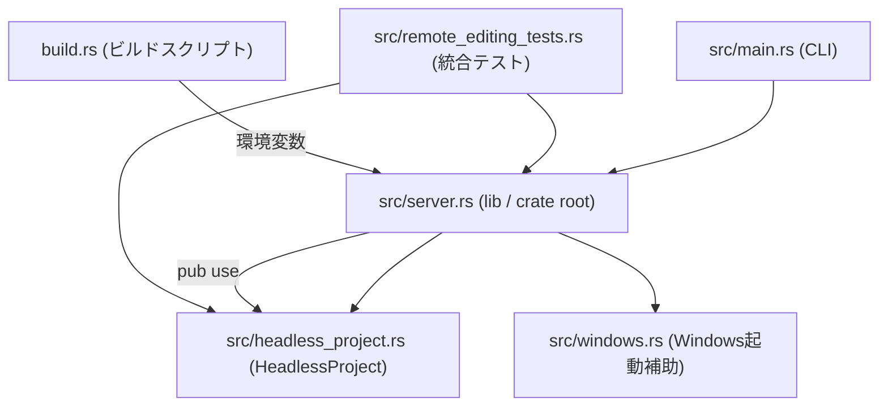
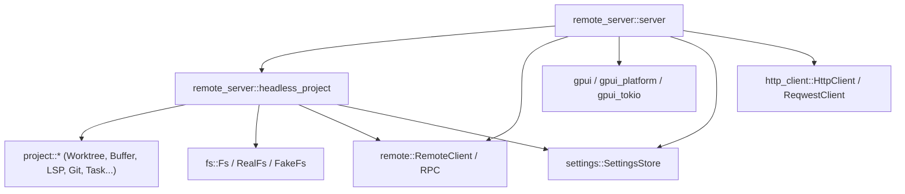
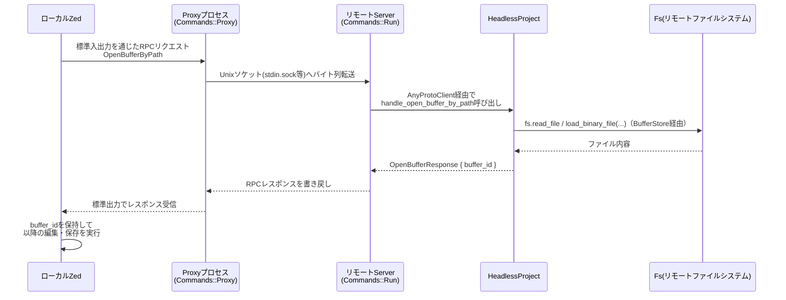

## 0. ざっくり一言

`remote_server` クレートは、Zed の「リモート編集」機能で使われるサーバープロセスです。  
ローカルの Zed から Unix ソケット経由で接続され、サーバー側で headless な Project / Worktree / Buffer / LSP / Git などを管理し、その状態を RPC でクライアントと同期します。

---

## 1. このモジュールの役割

### 1.1 概要

- このクレートは、Zed が SSH などを通じて接続する **リモート編集用デーモン** を実装します。
- サーバーは `HeadlessProject` を通じて、サーバー側のファイルシステム・Worktree・バッファ・LSP・Git・タスク・デバッガなどを管理し、RPC（`AnyProtoClient`）を介してクライアントとやり取りします。
- 別プロセスの「プロキシ」バイナリ（`Commands::Proxy`）が、ローカルの Zed とリモートサーバーの間で標準入出力/ソケットを橋渡しします。
- 設定ファイルとクラッシュレポート・プロファイリング・プロセス一覧など、周辺機能もまとめて担当します。

### 1.2 アーキテクチャ内での位置づけ

このディレクトリ内の主要モジュール間の依存関係は、おおまかに次のようになっています。



さらに外部クレートとの関係を簡略に示すと、次のようになります。



### 1.3 設計上のポイント

コードから読み取れる主な設計上の特徴は次のとおりです。

- **プロセス構成**
  - サーバープロセス本体：`Commands::Run` / `execute_run` により起動、Unix ソケットで I/O。
  - プロキシプロセス：`Commands::Proxy` / `execute_proxy` がローカル Zed から起動され、サーバープロセスとの間でバイト列を中継。
  - どちらも同じバイナリ（`remote_server`）内のサブコマンドとして実装されています。

- **状態管理の分離**
  - gpui の `Entity<T>` と `Context` / `AsyncApp` を用いて、`HeadlessProject` とその内部ストア（WorktreeStore/BufferStore/LspStore/...）をアプリ状態として管理。
  - ファイルシステム・ネットワーク・LSP などは専用のストア / サービスに委譲され、`HeadlessProject` はそれらを束ねる「ハブ」として振る舞います。

- **RPC ハンドラ駆動**
  - `AnyProtoClient` に対して `add_request_handler` / `add_entity_request_handler` / `add_entity_message_handler` を登録し、Proto 定義に対応した非同期ハンドラで処理。
  - ほぼすべての機能は「RPC リクエスト → ハンドラ → ストア操作 → 応答/イベント送信」というパターンで実装されています。

- **エラーハンドリング**
  - ほぼすべてのハンドラが `anyhow::Result<T>` を返し、`context` などでエラーに文脈を付与しています。
  - プロキシ側のエラーは `ExecuteProxyError` にまとめられ、`main.rs` でダウンキャストして適切な終了コードに変換されます。

- **プラットフォーム依存部分の切り出し**
  - Windows でのサーバー起動は `windows::shell_execute_from_explorer` に分離。
  - Unix 系では通常の `spawn_server_normal` を使うという、cfg による切り替えになっています。

---

## 2. 主要な機能一覧

このクレートが提供する主要な機能を列挙します。

- **リモートサーバー起動 (`Commands::Run` / `execute_run`)**
  - Unix ソケットを開き、gpui の headless アプリとしてサーバーを起動し、`HeadlessProject` を生成して RPC を受け付けます。

- **プロキシプロセス (`Commands::Proxy` / `execute_proxy`)**
  - ローカルの stdin/stdout/stderr と、サーバーの Unix ソケット（stdin.sock / stdout.sock / stderr.sock）を接続してバイト列を中継します。
  - 既存サーバーの PID チェックや、古いサーバーの kill / クリーンアップも担当します。

- **headless プロジェクト環境 (`HeadlessProject`)**
  - WorktreeStore / BufferStore / LspStore / GitStore / TaskStore / DapStore / AgentServerStore / ContextServerStore などを初期化し、サーバー側のプロジェクト状態を一元管理します。
  - LSP ログ・プロファイリング・設定同期（サーバー設定・ユーザー設定）・信頼済み Worktree の管理を含みます。

- **リモートファイル操作**
  - Worktree の追加/削除（`handle_add_worktree` / `handle_remove_worktree`）
  - パスから Buffer を開く・新規 Buffer（`handle_open_buffer_by_path` / `handle_open_new_buffer`）
  - 画像ファイルのロード（`handle_open_image_by_path`）
  - 任意ファイルのダウンロード（`handle_download_file_by_path`）

- **検索・ナビゲーション**
  - プロジェクト検索候補の取得・キャンセル（`handle_find_search_candidates` / `handle_find_search_candidates_cancel`）
  - リモートディレクトリ一覧・パスメタデータ取得（`handle_list_remote_directory` / `handle_get_path_metadata`）

- **信頼済み Worktree / セキュリティ関連**
  - Worktree の trust / restrict 操作（`handle_trust_worktrees` / `handle_restrict_worktrees`）
  - shell 環境付きディレクトリ環境の取得（`handle_get_directory_environment`）

- **実行環境・デバッグ・プロファイリング**
  - DAP / ブレークポイント / タスクストアの共有
  - リモートプロセス一覧取得（`handle_get_processes`）
  - リモートプロファイリング情報の取得（`handle_get_remote_profiling_data`）

- **設定・クラッシュレポート**
  - サーバー設定ファイルの監視と適用（`initialize_settings` / `handle_settings_file_changes`）
  - サーバー設定ファイルを開く（`handle_open_server_settings`）
  - クラッシュダンプ・panic ログファイルの取得（`handle_crash_files_requests`）

- **カーネル（Jupyter 風）管理**
  - カーネルの起動と Kill（`handle_spawn_kernel` / `handle_kill_kernel`）

- **その他ユーティリティ**
  - LSP ログのトグル（`handle_toggle_lsp_logs`）
  - Ping / シャットダウン RPC（`handle_ping` / `handle_shutdown_remote_server`）
  - バージョン情報表示 (`Commands::Version` / `VERSION`)

---

## 4. 関数・構造体の解説

### 4.1 主な構造体・列挙体

| 名前 | 種別 | 定義場所 | 役割 / 用途 |
|------|------|----------|-------------|
| `HeadlessProject` | 構造体 | `src/headless_project.rs` | サーバー側のプロジェクト全体状態を保持し、RPC ハンドラを実装する中核。 |
| `HeadlessAppState` | 構造体 | 同上 | `HeadlessProject::new` に渡される初期化に必要な依存オブジェクトの集合。 |
| `Commands` | 列挙体 | `src/server.rs` | CLI サブコマンドの定義（Run / Proxy / Version）。 |
| `ServerPaths` | 構造体 | `src/server.rs` | サーバー PID ファイル・ソケット・ログファイルのパス群。 |
| `ServerListeners` | 構造体 | `src/server.rs` | stdin/stdout/stderr 用 UnixListener の束。 |
| `ExecuteProxyError` | 列挙体 | `src/server.rs` | プロキシ処理で起こりうるエラーの分類。`main.rs` からダウンキャストされる。 |
| `SpawnServerError` | 列挙体 | 同上 | サーバープロセスの spawn に関するエラー。 |
| `CheckPidError` | 構造体 | 同上 | PID ファイル削除時のエラー。 |
| `VERSION` | `LazyLock<String>` | 同上 | リリースチャネルに応じたサーバーバージョン文字列。 |
| `HeadlessProject` 内のフィールド群 | 構造体フィールド | `headless_project.rs` | `fs`, `session`, 各種ストア (`worktree_store`, `buffer_store`, `lsp_store`, ...)、`profiling_collector` 等。 |

ここから、特に中心的な API / 処理を行う関数を 7 つ選び、少し詳しく説明します。

---

### 4.2 重要な関数の詳細

#### 1. `HeadlessProject::new(...) -> HeadlessProject`

```rust
pub fn new(
    HeadlessAppState { session, fs, http_client, node_runtime, languages, extension_host_proxy: proxy, startup_time }: HeadlessAppState,
    init_worktree_trust: bool,
    cx: &mut Context<Self>,
) -> Self
```

**概要**

- サーバー側で headless なプロジェクト環境を初期化し、`HeadlessProject` インスタンスを構築します。
- 各種ストア（Worktree/Buffer/LSP/Task/DAP/Git/Agent/Context/Settings）を作成・共有し、RPC ハンドラを `session` に登録します。

**主な引数**

| 引数名 | 型 | 説明 |
|--------|----|------|
| `HeadlessAppState` | 構造体 | セッション (`AnyProtoClient`)、FS、HTTP クライアント、`NodeRuntime`、`LanguageRegistry`、`ExtensionHostProxy`、起動時間を含む。 |
| `init_worktree_trust` | `bool` | 起動時にリモート Worktree の信頼状態トラッキングを開始するか。 |
| `cx` | `&mut Context<Self>` | gpui のエンティティコンテキスト。`Entity<T>` の生成や購読に使う。 |

**戻り値**

- 初期化済みの `HeadlessProject`。内部に各種ストアの `Entity` ハンドルを保持しています。

**内部処理の流れ（要約）**

1. 拡張や言語関連の初期化  
   `debug_adapter_extension::init` と `languages::init` を呼び、言語・デバッガ環境を整備。

2. Worktree / 環境ストアの構築
   - `WorktreeStore::local` を作成し `shared` モードにして RPC 経由で共有。
   - `init_worktree_trust` が `true` の場合、`trusted_worktrees::track_worktree_trust` を開始。
   - `ProjectEnvironment`, `ManifestTree`, `ToolchainStore` を作成。

3. Buffer / Debug / Git / Task / Settings / LSP ストア構築
   - `BufferStore::local` を作成し共有。
   - `BreakpointStore`, `DapStore`, `GitStore`, `PrettierStore`, `TaskStore`, `SettingsObserver`, `LspStore` を順に生成し、多くは `shared` でセッションと同期。

4. Agent / Context サーバーストア
   - `AgentRegistryStore::init_global` を呼び、グローバルレジストリを初期化。
   - `AgentServerStore`, `ContextServerStore` を local + shared で作成。

5. イベント購読・拡張の初期化
   - `cx.subscribe` で LSP ストアイベントを `on_lsp_store_event` へ接続。
   - `language_extension::init` を呼び、LSP 連携の拡張をセットアップ。
   - Buffer 追加イベントに対し、個々の `Buffer` へ `on_buffer_event` を購読。

6. 拡張機能ストアと RPC ハンドラ登録
   - `HeadlessExtensionStore` を生成し、拡張の同期・インストール用ハンドラを登録。
   - `session.add_request_handler` / `add_entity_request_handler` / `add_entity_message_handler` で、各種 `handle_*` 関数を RPC に紐づけ。

7. ストアの RPC 側初期化
   - `BufferStore::init(&session)` など、静的な初期化メソッド群を呼び出し、RPC 側に対応するエンティティを認識させる。

8. プロファイリング・カーネル管理などの初期化
   - `gpui::ProfilingCollector::new(startup_time)` をセット。
   - `kernels` マップは空で初期化（Jupyter カーネル管理用）。

**Examples（使用例）**

テストコードでの使用例（`init_test`）は以下のようになります。

```rust
// FakeFs などテスト用依存を作成
let server_fs = server_fs.clone();
server_cx.update(HeadlessProject::init); // 設定・ログストアの初期化

// HeadlessProject エンティティを生成
let headless = server_cx.new(|cx| {
    HeadlessProject::new(
        HeadlessAppState {
            session: ssh_server_client,     // RPC セッション
            fs: server_fs.clone(),          // サーバー側 FS
            http_client,                    // HTTP クライアント
            node_runtime,                   // NodeRuntime
            languages,                      // LanguageRegistry
            extension_host_proxy: proxy,    // ExtensionHostProxy
            startup_time: Instant::now(),   // 起動時間
        },
        false,  // init_worktree_trust = false
        cx,
    )
});
```

**Errors / Panics**

- 内部で `expect` を用いている箇所があります（例：`Toolchain store to be local`）。条件を満たさない場合は panic します。
- 多くのサブストア生成は `Entity::new` 内で panic する可能性がありますが、コードから詳細な条件はわかりません。

**Edge cases（エッジケース）**

- `init_worktree_trust = false` の場合、信頼 Worktree は自動追跡されません。
- `languages` や `node_runtime` が「利用不可」の形で渡された場合でも、それぞれのコンストラクタが対応していれば動作します（テストでは `NodeRuntime::unavailable()` を使用）。

**使用上の注意点**

- `HeadlessProject::new` は gpui の `Context<Self>` 内から呼ぶ必要があります。
- すべての RPC ハンドラがこの関数内で登録されるため、追加のハンドラを増やしたい場合はこの関数を拡張することになります。

---

#### 2. `HeadlessProject::handle_add_worktree(...)`

```rust
pub async fn handle_add_worktree(
    this: Entity<Self>,
    message: TypedEnvelope<proto::AddWorktree>,
    mut cx: AsyncApp,
) -> Result<proto::AddWorktreeResponse>
```

**概要**

- クライアントから送られてきたパスを基に、新しい Worktree をサーバー側に追加し、その Worktree ID と正規化されたパスを返します。
- パスが存在しない場合でも、親ディレクトリの正規化を試みるなど、ある程度ロバストに動作します。

**引数（要点）**

- `message.payload.path`：追加したい Worktree のパス（`~` 展開される）。
- `message.payload.visible`：初期の可視状態。

**戻り値**

- `AddWorktreeResponse { worktree_id, canonicalized_path }`。

**内部処理（簡略）**

1. `shellexpand::tilde` で `~` を展開し、`fs.canonicalize` を試みる。
2. 失敗した場合、親ディレクトリを canonicalize し、最後の要素を付け直すことで「期待されるパス」を生成。
3. `worktree_store.next_worktree_id()` で新しい ID を確保。
4. `Worktree::local(...)` を呼び出して Worktree インスタンスを生成。
5. 先にレスポンスを返せるよう、`worktree_store.add(&worktree, cx)` は別タスクで非同期に実行する。
6. 最終的に Worktree ID と正規化パスを返す。

**Examples（使用例）**

RPC 側からは直接 `AnyProtoClient::request` 経由で呼び出されます。テストでは `Project::find_or_create_worktree` が最終的にこのハンドラを使っています。

```rust
// クライアント側 (Project) の呼び出しイメージ
let (worktree, _) = project
    .update(cx, |project, cx| {
        project.find_or_create_worktree("/code/project1", true, cx)
    })
    .await
    .unwrap();
```

**Errors / Panics**

- `fs.canonicalize` が失敗し、親ディレクトリの canonicalize も失敗した場合などは `anyhow::Error` として返されます。
- `Worktree::local` の内部で発生したエラーは `Result` 経由で返されます。

**Edge cases**

- パスそのものが存在しないが、親ディレクトリは存在する場合：親を canonicalize し、子要素を足した形で扱います。
- ルート直下のように `parent()` が空になるパスでは、`home_dir` にフォールバックしています。

**使用上の注意点**

- クライアント側は `AddWorktreeResponse` を受け取ってから Worktree のハンドルを管理する必要があります。コメントにある通り、レスポンス前に UpdateProject が飛ぶと、参照の寿命と競合する可能性があるため、この関数はそれを避けるよう設計されています。

---

#### 3. `HeadlessProject::handle_open_buffer_by_path(...)`

```rust
pub async fn handle_open_buffer_by_path(
    this: Entity<Self>,
    message: TypedEnvelope<proto::OpenBufferByPath>,
    mut cx: AsyncApp,
) -> Result<proto::OpenBufferResponse>
```

**概要**

- 指定された Worktree ID と相対パスに対応するファイルを開き、サーバー側に `Buffer` を作成しつつ、クライアント用のリモートバッファ ID を返します。

**内部処理（要点）**

1. `WorktreeId::from_proto` と `RelPath::from_proto` で ID とパスをデコード。
2. `buffer_store.open_buffer(ProjectPath { worktree_id, path }, cx)` を呼んで `Buffer` エンティティを非同期に作成。
3. 完成した `Buffer` から `remote_id()` を取得。
4. `buffer_store.create_buffer_for_peer(&buffer, REMOTE_SERVER_PEER_ID, cx)` により、クライアントピア用のバッファを登録。
5. `OpenBufferResponse { buffer_id }` を返す。

**Examples（使用例）**

テストからの間接的な利用：

```rust
let buffer = project
    .update(cx, |project, cx| {
        project.open_buffer((worktree_id, rel_path("src/lib.rs")), cx)
    })
    .await
    .unwrap();
```

**Edge cases**

- 指定パスのファイルが存在しない場合、`BufferStore::open_buffer` 側の挙動に依存します（コード上ではここでのエラー処理は `?` でそのまま返却）。

**使用上の注意点**

- このハンドラは「クライアントのピア ID = `REMOTE_SERVER_PEER_ID`」としてバッファを共有します。他のピア ID と併用する設計は、コードからは見えません。

---

#### 4. `HeadlessProject::handle_find_search_candidates(...)`

```rust
pub async fn handle_find_search_candidates(
    this: Entity<Self>,
    envelope: TypedEnvelope<proto::FindSearchCandidates>,
    mut cx: AsyncApp,
) -> Result<proto::Ack>
```

**概要**

- リモートプロジェクト全体を対象に検索候補（適合する Buffer）を探し、そのバッファ ID をチャンクごとにクライアントへストリーミングします。
- 検索はバックグラウンドタスクとして実行され、キャンセル（`FindSearchCandidatesCancelled`）に対応できるようになっています。

**内部処理（簡略）**

1. クエリ文字列とパスマッチャから `SearchQuery` を生成。
2. `project::Search::local(...).into_handle(query, cx).matching_buffers(cx)` で検索結果ストリームを取得。
3. `AdaptiveBatcher` でバッファ ID を一定数ごとのバッチにまとめ、`FindSearchCandidatesChunk::Matches` RPC を送り続けるサブタスクを起動。
4. メインループでは、新しく見つかった Buffer について
   - `create_buffer_for_peer` でピア用バッファを共有
   - `remote_id().to_proto()` をバッチャに渡す。
5. 最後に Done チャンクを送り、`Ack` を返す。

**Examples（使用例）**

テストヘルパー `do_search_and_assert`:

```rust
let receiver = project.update(&mut cx, |project, cx| {
    project.search(
        SearchQuery::text(
            query,
            false,   // 大文字小文字などのフラグ
            true,    // 単語単位など
            false,
            files_to_include,
            Default::default(),
            match_full_paths,
            None,
        ).unwrap(),
        cx,
    )
});
```

**使用上の注意点**

- 検索結果はストリーミングされるため、クライアントは順次 `FindSearchCandidatesChunk` を処理する前提です。
- キャンセルは別メッセージ `FindSearchCandidatesCancelled` で処理され、`BufferStore::handle_find_search_candidates_cancel` に委譲されています。

---

#### 5. `HeadlessProject::handle_spawn_kernel(...)`

```rust
async fn handle_spawn_kernel(
    this: Entity<Self>,
    envelope: TypedEnvelope<proto::SpawnKernel>,
    cx: AsyncApp,
) -> Result<proto::SpawnKernelResponse>
```

**概要**

- Jupyter 互換の「カーネル」プロセスをローカル（サーバー側）で起動し、接続情報（ポート番号など）を JSON 文字列として返します。
- Python カーネル（`ipykernel_launcher`）を前提にした実装になっています。

**内部処理（要点）**

1. 5 つのランダムなポートを `TcpListener::bind("127.0.0.1:0")` で確保し、そのポート番号を接続情報に使う。
2. 接続情報（JSON）を構築し、テンポラリの `kernel-<id>.json` に保存（`fs.save`）。
3. `spawn_kernel` クロージャを用意：
   - `binary`（python など）と `args`（`{connection_file}` を JSON パスに置換）でコマンドラインを形成。
   - `PATH` に Python の bin ディレクトリを先頭追加。
   - `VIRTUAL_ENV` を設定（仮想環境用）。
   - 必要なら `current_dir` を設定。
4. `envelope.payload.command` が空でなければそれを使い、そうでなければ `"python3"` → `"python"` の順でフォールバックして起動。
5. 起動した `Child` を `self.kernels` に保存し、`SpawnKernelResponse { kernel_id, connection_file }` を返す。

**Edge cases**

- Python がインストールされていない環境では `python3` / `python` の spawn が失敗し、エラーになります。
- 使用するポートは即座に閉じられる（`TcpListener` を drop）ため、カーネル側が起動時にポートを開けないと競合の可能性がありますが、その詳細はこのコードからはわかりません。

**使用上の注意点**

- `kernels` マップに保持しているのは `smol::process::Child` であり、`handle_kill_kernel` が呼ばれない限りプロセスは残り続けます。
- `working_directory` が空文字列の場合、`std::env::current_dir()` を試みますが、失敗した際の詳細な挙動はここではわかりません。

---

#### 6. `execute_run(...) -> Result<()>`

```rust
pub fn execute_run(
    log_file: PathBuf,
    pid_file: PathBuf,
    stdin_socket: PathBuf,
    stdout_socket: PathBuf,
    stderr_socket: PathBuf,
) -> Result<()>
```

**概要**

- `remote_server run` サブコマンドのメイン処理です。
- ログファイル・PID ファイル・Unix ソケットをセットアップし、gpui の headless アプリを起動して `HeadlessProject` ベースのサーバーを実行します。

**内部処理（要点）**

1. `init_paths()` で各種ディレクトリ（config, extensions, logs, temp 等）を作成。
2. `gpui_platform::headless()` で headless App を生成。
3. `crashes::init` でクラッシュハンドラを初期化（`VERSION` や commit SHA を渡す）。
4. `init_logging_server(&log_file)` で JSON ロガーを初期化し、`log_rx` を受け取る。
5. PID ファイルを書き込み。
6. `ServerListeners::new(...)` で stdin/stdout/stderr ソケットをバインド。
7. Rayon threadpool を構築（CPU数の約半分のスレッド数）。
8. Unix の場合、ログインシェル環境ロードをバックグラウンドタスクで開始。
9. `run` クロージャ内で:
   - `settings::init` / `release_channel::init` / `gpui_tokio::init` / `HeadlessProject::init`.
   - WSL Interop 判定。
   - `start_server(listeners, log_rx, cx, is_wsl_interop)` で RPC セッションを構築。
   - `trusted_worktrees::init`, `GitHostingProviderRegistry::set_global`, `git_hosting_providers::init`, `dap_adapters::init`, `extension::init`, `json_schema_store::init`。
   - `HeadlessProject::new(...)` を生成。
   - `handle_crash_files_requests` を登録。
   - 古いバイナリ削除タスクをバックグラウンドで起動。
10. `app.run(run)` を `catch_unwind` でラップし、panic した場合はエラーを返却。

**使用上の注意点**

- この関数は通常、`main.rs` から `remote_server::run(Commands::Run { ... })` 経由で呼ばれます。直接呼ぶ場合も同様の引数を用意する必要があります。
- すでに他の global threadpool などを初期化しているプロセスで使うと、Rayon の `build_global` が失敗する可能性があります（このクレート単体ではそういう使い方はされていません）。

---

#### 7. `execute_proxy(identifier: String, is_reconnecting: bool) -> Result<(), ExecuteProxyError>`

```rust
pub(crate) fn execute_proxy(
    identifier: String,
    is_reconnecting: bool,
) -> Result<(), ExecuteProxyError>
```

**概要**

- `remote_server proxy` サブコマンドのメイン処理です。
- サーバープロセスの PID ファイルを確認し、必要なら kill や新規 spawn を行い、その後、ローカルの stdin/stdout/stderr とサーバーの Unix ソケットを双方向に中継します。

**内部処理（要点）**

1. `init_logging_proxy()` でプロキシ用ロガーを初期化。
2. `ServerPaths::new(&identifier)` で PID ファイル・ソケットパス・ログファイルパスを決定。
3. `crashes::init` でクラッシュハンドラを初期化。
4. `check_pid_file(&server_paths.pid_file)` で既存サーバーの PID を確認。
   - `is_reconnecting = true` かつ PID 不在 → `ServerNotRunning` エラー。
   - それ以外で PID が存在する場合は `kill_running_server` で kill & ファイル削除。
5. `spawn_server(&server_paths)` でサーバープロセスを起動（必要な場合のみ）。
6. `stdin_task` / `stdout_task` / `stderr_task` をそれぞれ `smol::spawn` で起動。
   - `handle_io` を用いて、サイズプレフィックス付きバイト列を転送。
   - `stderr_task` はログをバッファして `stderr` に書き出すループを実行。
7. `futures::select!` で、いずれかのタスクが終了したら落ちる。
   - その後 `check_server_running(server_pid)` を呼んで、サーバーが死んでいれば `ServerNotRunning` を返し、そうでなければ元のエラーを返す。

**使用上の注意点**

- この関数自体は `pub(crate)` ですが、`run(Commands::Proxy { .. })` 内からのみ呼び出されます。
- `ExecuteProxyError::to_exit_code()` を使うことで、サーバーが死んだ場合など特定の状況で専用の終了コードを返します。`main.rs` ではこれを利用して、クライアント側が「サーバー死」を検出できるようにしています。

---

### 4.3 その他の主なハンドラ一覧

`HeadlessProject` には多数の `handle_*` ハンドラがあります。ここでは役割だけをまとめます。

| 関数名 | 役割 |
|--------|------|
| `handle_remove_worktree` | 既存 Worktree の削除。 |
| `handle_open_new_buffer` | 新規（ファイルに紐づかない）バッファを作成し共有。 |
| `handle_open_image_by_path` | 画像ファイルを読み込み、`ImageState` + チャンクをクライアントへ送信。 |
| `handle_download_file_by_path` | 任意ファイルを読み込み、`FileState` + チャンクを送信。 |
| `handle_trust_worktrees` / `handle_restrict_worktrees` | 信頼済み Worktree のリストを更新。 |
| `handle_toggle_lsp_logs` | 指定 LSP のログ種別（Log / Trace / Rpc）をトグル。 |
| `handle_open_server_settings` | サーバー設定ファイルを開き、空であれば初期内容を書き込む。 |
| `handle_kill_kernel` | `handle_spawn_kernel` で起動したカーネルプロセスを kill。 |
| `handle_find_search_candidates_cancel` | 進行中の検索タスクをキャンセル。 |
| `handle_list_remote_directory` | ディレクトリのエントリ名（＋必要なら is_dir）を列挙。 |
| `handle_get_path_metadata` | パスの存在有無・ディレクトリかどうか・展開後のパス文字列を返す。 |
| `handle_shutdown_remote_server` | gpui アプリを shutdown / quit させる。 |
| `handle_ping` | 単純な疎通確認。 |
| `handle_get_processes` | `sysinfo` を使ってプロセス一覧を返す。 |
| `handle_get_remote_profiling_data` | gpui のプロファイリングデータを取得。 |
| `handle_get_directory_environment` | 指定ディレクトリでの環境変数一覧を取得。 |

---

## 5. データフロー

### 5.1 代表的なシナリオ：リモートファイルを開いて編集する

クライアント（Zed）は、プロキシ・サーバー・`HeadlessProject` を経由してファイルを開きます。その流れを簡略化すると以下のようになります。



保存時（`save_buffer`）なども同じパターンで、RPC → `HeadlessProject` → `Fs` → 応答、という流れになります。  
テスト `test_basic_remote_editing` では、この一連の往復（読み込み・編集・保存）が FakeFs を用いて検証されています。

---

## 6. 使い方（How to Use）

### 6.1 基本的な使用方法（CLI として）

このクレートは通常、バイナリ `remote_server` として使用されます。

```text
remote_server run \
  --log-file /path/to/log.json \
  --pid-file /path/to/server.pid \
  --stdin-socket /path/to/stdin.sock \
  --stdout-socket /path/to/stdout.sock \
  --stderr-socket /path/to/stderr.sock
```

- 上記の `run` サブコマンドは `execute_run` によって処理され、サーバーが起動します。
- 別プロセス（通常はローカルの Zed）が `proxy` サブコマンドを使って接続します。

```text
remote_server proxy \
  --identifier some-unique-id \
  --reconnect
```

- `identifier` はサーバーの状態ディレクトリ（PID, ソケット, ログ）の名前空間になります。
- `--reconnect` を付けた場合、既存サーバーがいなければエラー（特別な終了コード）になります。

### 6.1.1 ライブラリとしての基本的な使用例

他の Rust コードから `remote_server` を直接使う場合、`run` 関数を呼び出す形になります。

```rust
use remote_server::{Commands, run};

fn main() -> anyhow::Result<()> {
    // 実際にはパスは適宜変更する
    let cmd = Commands::Run {
        log_file: "/tmp/zed-remote.log".into(),
        pid_file: "/tmp/zed-remote.pid".into(),
        stdin_socket: "/tmp/zed-stdin.sock".into(),
        stdout_socket: "/tmp/zed-stdout.sock".into(),
        stderr_socket: "/tmp/zed-stderr.sock".into(),
    };

    // サーバープロセスを起動する
    run(cmd)
}
```

### 6.2 よくある使用パターン

#### 6.2.1 テスト用に HeadlessProject を直接使う

`remote_editing_tests.rs` では、`HeadlessProject` を直接生成して FakeFs と通信しています。  
簡略化したパターンは以下の通りです。

```rust
use std::sync::Arc;
use gpui::TestAppContext;
use fs::FakeFs;
use http_client::BlockedHttpClient;
use node_runtime::NodeRuntime;
use language::LanguageRegistry;
use extension::ExtensionHostProxy;
use remote::RemoteClient;
use remote_server::{HeadlessProject, HeadlessAppState};

async fn setup_test(server_cx: &mut TestAppContext) -> gpui::Entity<HeadlessProject> {
    let fs = Arc::new(FakeFs::new(server_cx.executor()));          // テスト用 FS
    let http_client = Arc::new(BlockedHttpClient);                 // HTTP はブロック
    let node_runtime = NodeRuntime::unavailable();                 // Node は無効
    let languages = Arc::new(LanguageRegistry::new(server_cx.executor()));
    let proxy = Arc::new(ExtensionHostProxy::new());

    // RemoteClient::fake_server などで SSH 風セッションを取得（詳細はテスト参照）
    let (_opts, ssh_server_client, _) = RemoteClient::fake_server(cx, server_cx);

    // HeadlessProject 初期化
    server_cx.update(HeadlessProject::init);
    let headless = server_cx.new(|cx| {
        HeadlessProject::new(
            HeadlessAppState {
                session: ssh_server_client,
                fs,
                http_client,
                node_runtime,
                languages,
                extension_host_proxy: proxy,
                startup_time: std::time::Instant::now(),
            },
            false, // init_worktree_trust
            cx,
        )
    });

    headless
}
```

このように、テストでは実際のサーバープロセスを立ち上げずに `HeadlessProject` を直接利用して動作検証を行っています。

#### 6.2.2 設定ファイルの監視と適用

サーバー起動時には `initialize_settings` が呼ばれ、サーバー設定ファイルの変更が反映されます。  
これは `SettingsStore` のグローバル状態を観察し、Node の設定変更に応じて `NodeRuntime` に渡す `NodeBinaryOptions` を更新するためのものです。

```rust
let node_settings_rx = initialize_settings(session.clone(), fs.clone(), cx);
// NodeRuntime::new(...) に node_settings_rx を渡して利用
```

### 6.3 使用上の注意点（まとめ）

- **RPC ハンドラは非同期であり、コンテキストの扱いに注意**
  - `Context<Self>` と `AsyncApp` を適切に使い分ける必要があります（`read_with` / `update` / `spawn` など）。
- **パス処理**
  - 多くのハンドラで `shellexpand::tilde` による `~` 展開を行います。クライアントからパスを送る際は、これを前提としてよいですが、Windows での挙動などは `Fs` 実装依存です。
- **外部プロセス起動**
  - `handle_spawn_kernel` は Python 前提であり、環境によっては失敗します。
  - サーバー起動（`spawn_server_*`）も、`current_exe` や Windows Shell COM API に依存しているため、特殊な環境では動作しない可能性があります。
- **PID / ソケットファイル**
  - `execute_proxy` は PID ファイルに基づいて既存サーバーを kill します。同じ `identifier` を使い回す場合は、この挙動を理解しておく必要があります。
- **設定のエラー**
  - サーバー設定ファイルにエラーがあると、`Toast` でクライアントに通知されます（`initialize_settings` 内の `settings_changed` クロージャ参照）。

---

## 7. 関連ファイル

このディレクトリ内のファイルと、その役割をまとめます。

| パス | 役割 / 関係 |
|------|------------|
| `remote_server/Cargo.toml` | クレートのメタデータと依存関係。`[lib] path = "src/server.rs"` により、`server.rs` がクレートルートになります。 |
| `remote_server/build.rs` | ビルド時に `zed/Cargo.toml` をパースし、`ZED_PKG_VERSION` や `ZED_COMMIT_SHA` などの環境変数を埋め込むビルドスクリプト。`VERSION` などで利用されます。 |
| `remote_server/src/main.rs` | 実行バイナリのエントリポイント。CLI フラグを解析し、`remote_server::run` を呼び出します。`askpass` や `crash_handler`、`printenv` の特殊モードもここで処理されます。 |
| `remote_server/src/server.rs` | クレートルート。`HeadlessProject` を re-export し、`Commands`, `run`, `execute_run`, `execute_proxy`, `initialize_settings` など、サーバーとプロキシの中核ロジックを実装しています。 |
| `remote_server/src/headless_project.rs` | サーバー側 headless プロジェクト (`HeadlessProject`) の実装。Worktree / Buffer / LSP / Git / Task / DAP / Agent / Context / Settings / プロファイル / カーネルなど、ほぼすべての機能の RPC ハンドラを持ちます。 |
| `remote_server/src/windows.rs` | Windows 専用のサーバープロセス起動ヘルパー (`shell_execute_from_explorer`)。`spawn_server_windows` から呼び出されます。 |
| `remote_server/src/remote_editing_tests.rs` | gpui テストを用いた統合テスト群。リモート編集（バッファ同期、検索、設定同期、LSP 動作、Git diff/branches/checkpoints、Agent サーバーなど）が期待通り動くか確認します。 |

この構成により、`remote_server` クレートは「リモート編集サーバープロセス＋プロキシ」という形で Zed のリモート機能を支えています。
