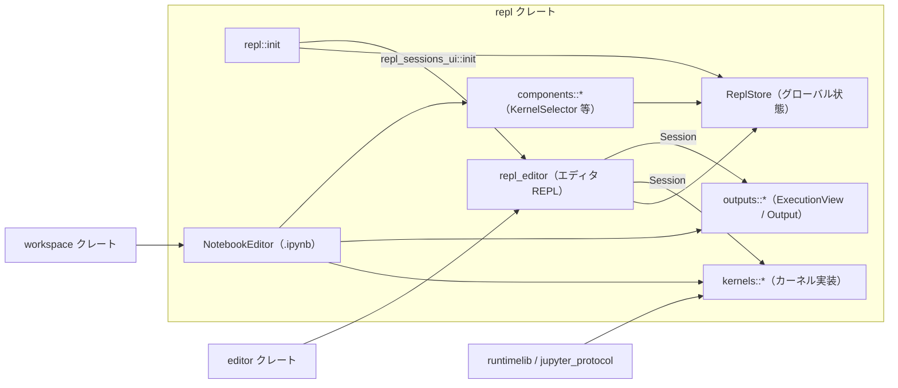
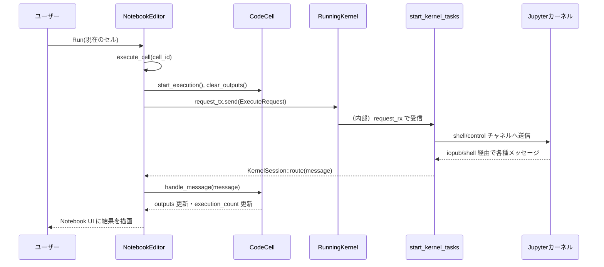

# repl/ ディレクトリ解説

## 1. ざっくり一言

Zed エディタに **Jupyter ベースの REPL とノートブック (.ipynb) 機能** を提供するクレートです。  
カーネルの検出・起動・メッセージ処理と、コードセル／出力の UI 表示までを一括で扱います。

---

## 2. このモジュールの役割

### 2.1 概要

この `repl` クレートは、Zed 内で Jupyter カーネルとやり取りするための基盤を提供します。

- **問題**: エディタから Python などのコードを対話的に実行し、その出力を見やすい形で表示したい。
- **提供する機能**:
  - ローカル／リモート／SSH／WSL 経由の **Jupyter カーネルの検出・起動・管理**
  - エディタ上での **REPL 実行 (選択範囲／セル単位)** とセッション管理
  - `.ipynb` ファイルの **ノートブックビューア＆エディタ**（セルの編集・実行・保存）
  - Jupyter メッセージを解釈し、テキスト／Markdown／画像／テーブル／JSON／エラーなどを描画する **出力サブシステム**

### 2.2 アーキテクチャ内での位置づけ

主要モジュール同士の関係は次のようになっています（repl クレート内部のみ・外部はまとめて表記）。



- `repl::init` が一度呼ばれることで、  
  - `ReplStore::init` により **カーネル検出やセッション管理のグローバル状態** が初期化され、
  - `repl_sessions_ui::init` により **UI やアクション (Run, Interrupt など)** が登録されます。
- `repl_editor` は通常の Editor 向けの REPL 実行を提供し、`Session` を通じて `kernels` と `outputs` を連携させます。
- `notebook::NotebookEditor` は `.ipynb` 専用の `KernelSession` 実装で、セルごとに出力を `outputs` に委譲します。
- `components` にはカーネル選択 UI（`KernelSelector`, `KernelPickerDelegate` 等）があり、`ReplStore` から候補を取得して表示します。

### 2.3 設計上のポイント

コードから読み取れる設計上の特徴は次の通りです。

- **カーネル抽象化**
  - `KernelSpecification` で「どの種類のカーネルか」（ローカル, PythonEnv, JupyterServer, SSH, WSL）を統一的に表現。
  - 実行中のカーネルは `RunningKernel` トレイトと `Kernel` enum で抽象化し、起動方法の違いを隠蔽しています。

- **メッセージ駆動・非同期設計**
  - `KernelSession` トレイト（`route`, `kernel_errored`）を実装したビュー (`NotebookEditor` や `Session`) に  
    `start_kernel_tasks` が Jupyter メッセージをコールバックする構造です。
  - `gpui::Task` と `AsyncWindowContext` を使い、IO やプロセス管理はすべて非同期で行われます。

- **出力の集約レイヤ**
  - 各種出力形式は `Output` enum と `ExecutionView` によって統一されます。
  - `OutputContent` トレイトを通じて、クリップボードコピーや「Open in Buffer」など共通 UI を提供します。

- **REPL と Notebook の共通化**
  - Notebook の CodeCell と REPL の ExecutionView は異なる UI ですが、  
    どちらも Jupyter メッセージを `handle_message` / `push_message` で受け取り、同じ MIME バンドル処理 (`Output::new`) を使います。

- **設定・有効化フラグ**
  - `JupyterSettings::enabled` により、エディタ側の設定 (`EditorSettings::jupyter_enabled`) を参照して  
    機能を有効／無効にします。
  - `ReplSettings` により、行数・列数・インライン出力の長さなど出力 UI の挙動を制御します。

---

## 3. 主要な機能一覧

このディレクトリ（クレート）が提供する主な機能を箇条書きで整理します。

- **カーネル検出・管理**
  - ローカル Jupyter kernelspec (`local_kernel_specifications`)
  - Python ツールチェーンからの仮想環境検出 (`python_env_kernel_specifications`)
  - リモート Jupyter サーバ (`list_remote_kernelspecs`, `launch_remote_kernel`)
  - SSH 経由のカーネル (`SshRunningKernel`)
  - WSL 内のカーネル (`wsl_kernel_specifications`, `WslRunningKernel`)

- **カーネル起動とメッセージ処理**
  - Jupyter 接続情報の生成と connection file の書き出し
  - ZMQ / WebSocket を使った Jupyter チャネル (iopub/shell/control/stdin) の接続
  - `start_kernel_tasks` によるメッセージの受信ループとルーティング

- **REPL セッション管理**
  - `Session`（別ファイル）と `ExecutionView` による 1 実行単位の出力管理
  - `repl_editor::run` による Editor 上からのコード実行
  - `assign_kernelspec` / `install_ipykernel_and_assign` によるカーネル割り当てと ipykernel インストール支援

- **ノートブック編集・実行 (.ipynb)**
  - `NotebookItem` による .ipynb 読み込み／保存／バージョン変換
  - `NotebookEditor` によるセル一覧・選択・移動・追加・実行
  - `NotebookEditor` が `KernelSession` を実装し、セルごとに Jupyter メッセージを `CodeCell` へルーティング

- **出力表示（outputs モジュール）**
  - テキスト: `TerminalOutput`（ANSI 対応の簡易ターミナル）
  - Markdown: `MarkdownView`
  - 画像: `ImageView`（Base64 画像のデコードとスケーリング）
  - JSON: `JsonView`（折り畳み可能なツリービュー）
  - テーブル: `TableView`（Tabular Data Resource 仕様の描画）
  - カーネルエラー: `ErrorView`＋`Output::ErrorOutput`

- **カーネル選択 UI**
  - `KernelSelector` と `KernelPickerDelegate` によるポップオーバーピッカー
  - `build_grouped_entries` による Python Environment / Jupyter / Remote / WSL のグルーピング
  - Notebook ステータスバーにおけるカーネル状態表示と切り替え

---

## 4. 関数・構造体の解説

### 4.1 主要な型一覧

公開・準公開されている代表的な型を役割別にまとめます。

#### カーネル仕様・実行状態

| 名前 | 種別 | 役割 / 用途 |
|------|------|-------------|
| `KernelSpecification` | enum | カーネルの種類と接続情報（ローカル / PythonEnv / JupyterServer / SSH / WSL）を表します。 |
| `PythonEnvKernelSpecification` | struct | Python ツールチェーン由来の仮想環境カーネル仕様（name, path, JupyterKernelspec, has_ipykernel, environment_kind）。 |
| `LocalKernelSpecification` | struct | ローカルファイルシステムにある Jupyter kernelspec 1 件を表します。 |
| `RemoteKernelSpecification` | struct | HTTP API で接続するリモート Jupyter サーバのカーネル仕様。 |
| `SshRemoteKernelSpecification` | struct | SSH 経由で起動するカーネルの仕様（name, path, kernelspec）。 |
| `WslKernelSpecification` | struct | WSL ディストリビューション内で動かすカーネル仕様（ディストロ名を含む）。 |
| `RunningKernel` | trait | 実行中カーネルへの共通インターフェース（リクエスト送信・状態・終了処理）。 |
| `NativeRunningKernel` | struct | ローカルプロセスとして起動したカーネルの `RunningKernel` 実装。 |
| `RemoteRunningKernel` | struct | WebSocket 越しに Jupyter サーバへ接続する `RunningKernel` 実装。 |
| `SshRunningKernel` | struct | SSH トンネル経由で接続する `RunningKernel` 実装。 |
| `WslRunningKernel` | struct | WSL 内プロセスとして起動したカーネルの `RunningKernel` 実装。 |
| `Kernel` | enum | 「起動中 / 起動中タスク / エラー / シャットダウン中」などの高レベルなカーネル状態。 |
| `KernelStatus` | enum | UI 表示用の簡略化されたカーネル状態（Idle/Busy/...）。 |
| `KernelSession` | trait | Jupyter メッセージの受け口となるビュー側インターフェース（`route`, `kernel_errored`）。 |

#### 出力表示

| 名前 | 種別 | 役割 / 用途 |
|------|------|-------------|
| `Output` | enum | 1 つの実行で得られた出力の 1 要素（Plain/Stream/Image/Table/Markdown/Json/Error など）。 |
| `OutputContent` | trait | 各出力ビューが備える「クリップボード／バッファ出力」機能の共通インターフェース。 |
| `ExecutionView` | struct | 1 回のコード実行に対する複数 `Output` と状態 (`ExecutionStatus`) を管理するビュー。 |
| `ExecutionStatus` | enum | Connecting/Executing/Finished/Queued 等、実行状態の UI 用ステータス。 |
| `TerminalOutput` | struct | ANSI 対応の疑似ターミナル。ストリームをパースし、テキスト表示・コピー・バッファ生成を行います。 |
| `ImageView` | struct | Base64 画像をデコードして表示／クリップボード転送するビュー。 |
| `JsonView` | struct | 折り畳み可能な JSON ツリー表示ビュー。 |
| `MarkdownView` | struct | Markdown テキストを `markdown` クレートで描画するビュー。 |
| `TableView` | struct | Tabular Data Resource (Frictionless Data) 仕様のテーブル表示ビュー。 |
| `ErrorView` | struct | `ename` / `evalue` / traceback をまとめて表示するユーザエラー用ビュー。 |

#### ノートブック関連

| 名前 | 種別 | 役割 / 用途 |
|------|------|-------------|
| `Cell` | enum | Notebook の 1 セル（Code / Markdown / Raw）を `Entity` として保持します。 |
| `CodeCell` | struct | コードセル本体。エディタ、出力、実行カウント、実行時間などを管理。 |
| `MarkdownCell` | struct | Markdown セル。エディタと Markdown 表示の二状態（編集／プレビュー）を持ちます。 |
| `RawCell` | struct | Raw セル。シンプルにテキストを表示するセル。 |
| `RenderableCell` | trait | 各セルが持つ共通の描画・選択・位置情報インターフェース。 |
| `RunnableCell` | trait | 実行可能なセル（CodeCell）のためのインターフェース。 |
| `NotebookEditor` | struct | `.ipynb` を表示・編集・実行するメインビュー。`KernelSession` を実装。 |
| `NotebookItem` | struct | プロジェクト内の `.ipynb` ファイルを表す `ProjectItem` 実装。 |

#### REPL 連携・設定

| 名前 | 種別 | 役割 / 用途 |
|------|------|-------------|
| `Session` | struct | Editor 1 つに紐づく REPL セッション（別ファイル）。メッセージルーティングと ExecutionView 管理を行います。 |
| `SessionEvent` | enum | `Session` のシャットダウンなどを通知するイベント。 |
| `ReplStore` | struct | グローバルな REPL 状態（利用可能なカーネル一覧・選択状態・Editor ごとの `Session`）を管理するストア。 |
| `ReplSettings` | struct | 出力の高さや列幅、インライン結果表示の長さなどを制御する設定。 |
| `JupyterSettings` | struct | カーネル選択の記録や、Jupyter 機能が有効かどうかのフラグを保持します。 |
| `KernelSelector<T>` | struct | Notebook ステータスバー等から使う、カーネル選択ポップオーバーのラッパー。 |
| `KernelPickerDelegate` | struct | `picker::Picker` のデリゲート実装。カーネル一覧のフィルタリング・選択管理を行います。 |

### 4.2 重要な関数・メソッドの詳細（抜粋）

#### `start_kernel_tasks<S: KernelSession>(session, iopub_socket, shell_socket, control_socket, stdin_socket, cx) -> (Sender<JupyterMessage>, Sender<JupyterMessage>)`

**概要**

- Jupyter カーネルとの **I/O ループを開始**し、呼び出し側に
  - 通常のリクエスト送信用
  - stdin 送信用  
  の 2 つの `mpsc::Sender<JupyterMessage>` を返します。
- 受信したメッセージは `KernelSession::route` / `kernel_errored` を通じてセッションビューに配送されます。

**引数**

| 引数名 | 型 | 説明 |
|--------|----|------|
| `session` | `Entity<S>` | メッセージを処理する `KernelSession` 実装（例: `NotebookEditor`, `Session`）。 |
| `iopub_socket` | `ClientIoPubConnection` | カーネルの iopub チャネル（出力・ステータスなど）。 |
| `shell_socket` | `ClientShellConnection` | シェルチャネル（実行リクエストなど）。 |
| `control_socket` | `ClientControlConnection` | 割り込み・シャットダウンなどの制御チャネル。 |
| `stdin_socket` | `ClientStdinConnection` | 標準入力チャネル。 |
| `cx` | `&mut AsyncWindowContext` | 非同期タスクを起動するための GPUI コンテキスト。 |

**戻り値**

- `(Sender<JupyterMessage>, Sender<JupyterMessage>)`
  - 1 つ目: 通常の実行リクエストを送るための送信側（shell/control に振り分け）。
  - 2 つ目: stdin メッセージを送るための送信側。

**内部処理の流れ**

1. 各 ZMQ 接続を `split()` し、送信側／受信側を分離します。
2. REPL からカーネルへのリクエスト用に `request_tx/request_rx`、stdin 用に `stdin_tx/stdin_rx` を作成します。
3. `recv_task`:
   - `futures::select!` を使って iopub/shell/control/stdin のいずれかからメッセージを待ち受けます。
   - 正常メッセージは `session.update_in(..., |session, window, cx| session.route(&message, ...))` に転送。
   - パース／シリアライズエラーは `kernel_errored` に通知し、ログを出力します。
4. `routing_task`:
   - `request_rx` からメッセージを受け取り、content の種類に応じて shell か control に送信します。
5. `stdin_routing_task`:
   - `stdin_rx` から stdin メッセージを受け取り、stdin ソケットにそのまま送信します。
6. 上記 3 つのタスクを `FuturesUnordered` でまとめ、どれかがエラーで終了した場合には `kernel_errored` を呼び出します。

**Examples（使用例）**

実際のコードでは `NativeRunningKernel::new` などから呼ばれます。

```rust
// KernelSession を実装した NotebookEditor から NativeRunningKernel を起動するとき
let (request_tx, stdin_tx) = start_kernel_tasks(
    session_entity.clone(), // NotebookEditor (Entity<NotebookEditor>)
    iopub_socket,
    shell_socket,
    control_socket,
    stdin_socket,
    cx,
);

// 後続で request_tx, stdin_tx を RunningKernel 実装に保存し、
// execute 時に JupyterMessage を送信します。
```

**Errors**

- 受信側で
  - `RuntimeError::ParseError`
  - `RuntimeError::SerdeError`  
  が発生した場合、`kernel_errored` が呼ばれますがタスク自体はループを継続します。
- それ以外の IO エラー等は `anyhow::bail!` によりタスク自体が `Err` で終了し、呼び出し元の `FuturesUnordered` から検知されます。

**Edge cases**

- どのソケットからもメッセージが来ない場合は単に待ち続けます。
- セッション側で `Entity` が既に破棄されている場合、`update_in` は `ok()` の結果が無視されるため、メッセージは捨てられます。

**使用上の注意点**

- この関数は **必ず非同期コンテキスト (`AsyncWindowContext`) 内** で呼び出す必要があります。
- 呼び出し側は返された `Sender` を `RunningKernel` 実装のフィールドとして保持し、ライフサイクル管理（close_channel 等）を適切に行います。

---

#### `python_env_kernel_specifications(project, worktree_id, cx) -> impl Future<Output = Result<Vec<KernelSpecification>>>`

**概要**

- プロジェクトが提供する Python ツールチェーン情報 (`Toolchains`) から、  
  各環境に対応する `KernelSpecification::PythonEnv` / `WslRemote` / `SshRemote` を生成します。
- `ipykernel` がインストールされているかをチェックし、その有無を `has_ipykernel` に格納します。

**引数**

| 引数名 | 型 | 説明 |
|--------|----|------|
| `project` | `&Entity<Project>` | カーネル検出対象となるプロジェクト。 |
| `worktree_id` | `WorktreeId` | 対象ワークツリー。 |
| `cx` | `&mut App` | GPUI アプリコンテキスト。 |

**戻り値**

- `Future<Output = Result<Vec<KernelSpecification>>>`
  - 成功時: 利用可能な Python 環境を表す `KernelSpecification` の配列（0 件もあり得ます）。
  - 失敗時: ツールチェーン取得やコマンド実行等のエラーが `anyhow::Error` として返ります。

**内部処理の流れ**

1. `Project::available_toolchains` で対象ワークツリーに対する Python ツールチェーン一覧を取得。
2. `Toolchains` が `None` の場合は空の `Vec` を返して終了。
3. 各ツールチェーンに対して並列 (`buffer_unordered(4)`) に処理:
   - リモートプロジェクトの場合:
     - `JupyterKernelspec` をローカルで組み立て、`WslRemote` か `SshRemote` の `KernelSpecification` を生成。
   - ローカルの場合:
     - `util::command::new_command(&python_path).args(&["-c", "import ipykernel"])` で `ipykernel` の有無をチェック。
     - `PATH` / `VIRTUAL_ENV` を含む環境変数を構築し、`JupyterKernelspec` の `env` に設定。
     - `KernelSpecification::PythonEnv(PythonEnvKernelSpecification { ... })` を返す。
4. Windows 環境 (`#[cfg(target_os = "windows")]`) では、ツールチェーンが 0 の場合かつワークツリーが WSL パスのとき、`.venv/bin/python` や `python3` を WSL 上で探し、`WslRemote` を追加生成します。

**Examples（使用例）**

`ReplStore` から呼ばれ、カーネルセレクタや自動選択に利用されます。雰囲気としては次のように使われます。

```rust
// ReplStore 内などから
let specs_task = python_env_kernel_specifications(&project_entity, worktree_id, cx);
cx.spawn(async move |_cx| {
    match specs_task.await {
        Ok(specs) => {
            // specs: Vec<KernelSpecification::PythonEnv / WslRemote / SshRemote>
            // ReplStore の内部状態に保存するなど
        }
        Err(err) => log::error!("failed to discover python env kernels: {err:?}"),
    }
});
```

**Errors**

- `Toolchains` の取得失敗
- `util::command` 実行失敗（`ipykernel` チェックや WSL コマンド）
- JSON 解析等はこの関数内では行っておらず、ツールチェーン側から渡される`as_json`を `extract_environment_kind` がパースするのみです。

**Edge cases**

- ツールチェーンが 0 件のとき: 空の `Vec` が返ります。
- リモートプロジェクトで WSL 接続情報がある場合: `WslRemote` として扱われ、`ipykernel` チェックはスキップされます (`has_ipykernel` は常に true 扱い)。
- Windows で WSL パスだが `.venv/bin/python` が存在しない場合、`python3` コマンドの存在を確認し、あれば System Python として登録します。

**使用上の注意点**

- 非同期関数なので、必ず `await` するか、`cx.spawn` でタスクとして起動してください。
- `is_remote` の場合は `ipykernel` の有無を厳密には確認していないため、実行時に ImportError になる可能性があります。

---

#### `NativeRunningKernel::new<S: KernelSession + 'static>(...) -> Task<Result<Box<dyn RunningKernel>>>`

**概要**

- ローカル環境で Jupyter カーネルプロセスを起動し、`RunningKernel` として制御するためのインスタンスを生成します。
- connection file (`kernel-zed-<entity_id>.json`) を生成し、それを元に runtimelib のクライアントソケットを開きます。

**引数（抜粋）**

| 引数名 | 型 | 説明 |
|--------|----|------|
| `kernel_specification` | `LocalKernelSpecification` | 起動対象カーネルの argv・env 情報。 |
| `entity_id` | `EntityId` | このカーネルに紐づくビューの ID（connection file 名に利用）。 |
| `working_directory` | `PathBuf` | カーネルプロセスのカレントディレクトリ。 |
| `fs` | `Arc<dyn Fs>` | ファイルシステム抽象（connection file の書き込みに使用）。 |
| `session` | `Entity<S>` | `KernelSession` 実装（メッセージの送り先）。 |
| `window`, `cx` | `&mut Window`, `&mut App` | タスク起動・ログ出力などに使用。 |

**戻り値**

- `Task<Result<Box<dyn RunningKernel>>>`
  - 成功時: `Box<NativeRunningKernel>` を `RunningKernel` として戻します。
  - 失敗時: connection file の生成、プロセス起動、ソケット接続などのエラーを含む `anyhow::Error`。

**内部処理の流れ（簡略）**

1. `peek_ports` で 5 つの空きポートを探す。
2. `ConnectionInfo` を組み立てて JSON として書き出し（`fs.atomic_write`）。
3. `LocalKernelSpecification::command` で `std::process::Command` を構築（`{connection_file}` プレースホルダを実パスに置換、`env` を適用）。
4. `util::process::Child::spawn` でカーネルプロセスを起動し、stdout/stderr をログ出力用に非同期で読み続けるタスクを起動。
5. runtimelib を用いて iopub/shell/control/stdin の各クライアントソケットを作成。
6. `start_kernel_tasks` を呼び出してメッセージループを開始し、`request_tx` / `stdin_tx` を取得。
7. プロセスの終了ステータスを監視する別タスクを起動し、異常終了時に `session.kernel_errored` を呼び出す。
8. 上記をまとめて `NativeRunningKernel` を生成し、`Ok(Box::new(...))` を返す。

**Examples（使用例）**

`NotebookEditor::launch_kernel_with_spec` から呼ばれています。

```rust
// NotebookEditor 内
let kernel_task = NativeRunningKernel::new(
    local_spec,   // LocalKernelSpecification
    entity_id,    // NotebookEditor の EntityId
    working_directory,
    fs,
    view,         // Entity<NotebookEditor>
    window,
    cx,
);

// 非同期で起動完了を待ち、成功したら Kernel::RunningKernel として保持
```

**Errors**

- connection file 用ディレクトリ作成失敗（`fs.create_dir`）。
- connection file 書き込み失敗（`fs.atomic_write`）。
- `LocalKernelSpecification::command` での argv 検証 (`Empty argv`, `{connection_file}` 欠如)。
- プロセス起動失敗（`Child::spawn`）。
- runtimelib による ZMQ クライアント接続の失敗。

**Edge cases**

- カーネルプロセスがすぐに終了した場合、プロセス監視タスクにより `kernel_errored` が呼ばれます。
- `kernelspec.env` が `None` の場合、追加環境変数は設定されず、ログには「no env in kernelspec」と出力されます。

**使用上の注意点**

- `LocalKernelSpecification` の `argv` には `{connection_file}` が必ず含まれている必要があります（そうでないと `ensure!` でエラー）。
- `NativeRunningKernel` の Drop 実装で connection file 削除と kill が行われるため、`Box<dyn RunningKernel>` のライフサイクル管理が重要です。

---

#### `WslRunningKernel::new<S: KernelSession + 'static>(...) -> Task<Result<Box<dyn RunningKernel>>>`

**概要**

- Windows 上で、WSL ディストリビューション内に Jupyter カーネルを起動する `RunningKernel` 実装です。
- Windows 側でポートを確保しつつ、WSL の `bash -l -c` を利用して Python を探索・実行します。

**主なポイント**

- Windows パスを `wslpath -u` で WSL パスに変換。
- 作業ディレクトリが WSL パスでない場合にも可能な限り変換を試みる。
- `.venv/bin/python` → `python3` → `python` の順に Python 実行ファイルを探します。

**使用上の注意点**

- WSL がインストールされていない環境では利用できません（`wsl` コマンドが失敗する）。
- `kernel_specification.kernelspec.argv` が絶対パスでない場合、内部でシェルスクリプトを生成し Python 実行ファイルを解決しています。

（処理フローは `NativeRunningKernel::new` とほぼ同じで、プロセス起動部分に WSL 固有の変換処理が入る形です。）

---

#### `ExecutionView::push_message(&mut self, message: &JupyterMessageContent, window, cx)`

**概要**

- 1 回の実行に対応する `ExecutionView` が、Jupyter カーネルから届いた **単一のメッセージ内容** を解釈し、`outputs` と `status` を更新します。
- MIME バンドル (`ExecuteResult` / `DisplayData`)、ストリーム、エラー、ステータスなど複数のメッセージ型を扱います。

**引数**

| 引数名 | 型 | 説明 |
|--------|----|------|
| `message` | `&JupyterMessageContent` | runtimelib 経由で受信した 1 メッセージの内容。 |
| `window` | `&mut Window` | 新しいビュー (`TerminalOutput` 等) の生成に利用。 |
| `cx` | `&mut Context<Self>` | `ExecutionView` 自身の更新・イベント発火に使用。 |

**戻り値**

- なし。`self.outputs`, `self.status`, `pending_input` を更新し、必要に応じて `cx.notify()` やイベント (`ExecutionViewFinishedEmpty` 等) を emit します。

**内部処理の流れ（主な分岐）**

1. `ExecuteResult` / `DisplayData`:
   - `Output::new(&result.data, display_id, window, cx)` で `Output::Plain/Markdown/Image/Table/Json/...` を生成し、`outputs` に push。
2. `StreamContent`:
   - 直前が `Output::Stream` の場合: 既存の `TerminalOutput` に `append_text` して結合。
   - それ以外: 新しい `Output::Stream` を生成して `outputs` に push。
3. `ErrorOutput`:
   - `TerminalOutput::from(traceback.join("\n"))` を作り、`Output::ErrorOutput(ErrorView { ... })` として追加。
4. `ExecuteReply`:
   - `reply.payload` 内の `Payload::Page { data, .. }` をそれぞれ `Output::new` で追加。
5. `ClearOutput`:
   - `wait == false`なら即座に `outputs.clear()`。
   - `wait == true`なら `Output::ClearOutputWaitMarker` を追加し、次の出力時に一括クリアするようマーク。
6. `Status`:
   - `ExecutionState` に応じて `ExecutionStatus` を更新。
   - `Idle` になったとき:
     - `pending_input = None` をクリア。
     - `outputs` が空なら `ExecutionViewFinishedEmpty` イベントを emit。
     - `ReplSettings::inline_output` が有効かつ短い単一行出力なら `ExecutionViewFinishedSmall` を emit。

**Examples（使用例）**

通常は `Session` 内から `ExecutionView` に対して呼び出されます。テストでは次のように使われています。

```rust
execution_view.update(cx, |view, cx| {
    let msg = JupyterMessageContent::StreamContent(StreamContent {
        name: Stdio::Stdout,
        text: "hello\n".to_string(),
    });
    view.push_message(&msg, window, cx);
});
```

**Edge cases**

- `ClearOutput(wait = true)` のあとに最初の出力が来た場合、その前に溜まっていた `outputs` はすべて消され、`ClearOutputWaitMarker` も削除されます。
- `Status(ExecutionState::Idle)` のとき、出力が 1 つで `Plain` かつ 1 行＆設定長以下の場合のみインライン出力イベントが飛びます。

**使用上の注意点**

- `push_message` は `JupyterMessageContent::InputRequest` を処理しません。  
  入力要求は `ExecutionView::handle_input_request`（後述）で、`JupyterMessage` 全体を渡す必要があります。

---

#### `ExecutionView::handle_input_request(&mut self, message: &JupyterMessage, window, cx)`

**概要**

- `JupyterMessageContent::InputRequest` を処理し、ユーザーに入力を促すエディタを `pending_input` にセットします。
- その後、ユーザーが Enter を押したとき `submit_input` により `InputReplyEvent` が emit されます。

**引数**

| 引数名 | 型 | 説明 |
|--------|----|------|
| `message` | `&JupyterMessage` | parent_header を含む Jupyter メッセージ。content が InputRequest の場合のみ処理。 |
| `window` | `&mut Window` | 単一行エディタの生成に利用。 |
| `cx` | `&mut Context<Self>` | `pending_input` の更新と通知に利用。 |

**内部処理**

1. `match &message.content` が `InputRequest` なら:
   - `prompt` と `password` フラグを取り出す。
   - `Editor::single_line(window, cx)` で 1 行エディタを作成し、プレースホルダテキストを設定。
   - `password == true` の場合は `editor.set_masked(true, cx)` で入力をマスク。
   - `PendingInput { prompt, password, editor, parent_message }` を `self.pending_input` にセット。
   - `cx.notify()` で再描画を促す。

**使用上の注意点**

- `submit_input` は `menu::Confirm` アクション（Enter キー）にバインドされています。  
  ユーザーが入力を終了したタイミングで `InputReplyEvent` が emit されることを前提に、上位層でメッセージ返信を行います。
- `ExecutionState::Idle` になったときには `pending_input` は強制的にクリアされます（入力途中で実行が終了したケース等）。

---

#### `repl_editor::run(editor: WeakEntity<Editor>, move_down: bool, window, cx) -> Result<()>`

**概要**

- 通常のエディタバッファから「実行可能な範囲」を抽出し、対応するカーネルへ送信する **REPL 実行エントリポイント** です。
- 選択範囲・Markdown コードブロック・Jupytext セルコメント (`# %%` 等) を解釈し、適切な範囲を送ります。

**引数**

| 引数名 | 型 | 説明 |
|--------|----|------|
| `editor` | `WeakEntity<Editor>` | 実行対象のエディタ。Drop されている場合は何もしません。 |
| `move_down` | `bool` | 実行後にカーソルを次のセル／ブロックに移動するかどうか。 |
| `window` | `&mut Window` | `Session` 生成時などに利用。 |
| `cx` | `&mut App` | グローバルストアやエディタ更新に利用。 |

**内部処理（把握できる範囲）**

1. `ReplStore::global(cx)` を取得し、`is_enabled()` を確認（無効なら早期 return）。
2. `store.ensure_kernelspecs(cx)` でカーネル仕様の検出を保証。
3. `editor.upgrade()` で強参照を取得し、現在の選択範囲を `selected_range` として得る。
4. `BufferSnapshot` を取り、`runnable_ranges(&snapshot, selected_range, cx)` で実行範囲と次のカーソル位置を計算。
   - Markdown の場合はコードブロック
   - それ以外は Jupytext セル (`%%`) など  
   （詳細ロジックの後半はこのチャンクでは省略されています）
5. 各 `runnable_range` ごとに:
   - `language_at(runnable_range.start)` から言語を取得。
   - `store.active_kernelspec(worktree_id, Some(language), cx)` で対応カーネルを決定。
   - エディタに対する既存 `Session` がなければ生成し、`ReplStore` に登録。
   - `snapshot.text_for_range(runnable_range)` から送信テキストを取得。
   - `Session::execute(selected_text, anchor_range, next_cursor, move_down, window, cx)` を呼び出し実行。

**Edge cases**

- エディタがプロジェクトに紐づいていない (`project_path` が `None`) 場合は何もせず終了します。
- 対応するカーネルが見つからない場合は `anyhow::Context` 付きでエラーを返します（`No kernel found for language: ...`）。

**使用上の注意点**

- この関数を呼び出す前に `repl::init` で `ReplStore` が初期化されている必要があります。
- Jupyter 機能が全体設定で無効 (`JupyterSettings::enabled == false`) の場合、内部で `ReplStore::is_enabled` が false になり、実行は行われません。
- 選択範囲を空にすると、実行単位の判定は `runnable_ranges` のデフォルト挙動（セルやブロック）に依存します。

---

### 4.3 その他の主な関数・メソッド一覧

| 関数 / メソッド | 役割（1 行） |
|-----------------|--------------|
| `KernelSpecification::name`, `type_name`, `path`, `language` | カーネルの表示名・種別・接続先・言語名を取得します。 |
| `KernelSpecification::has_ipykernel` | PythonEnv の場合に `ipykernel` がインストール済みかどうかを返します。 |
| `KernelSpecification::icon(&App)` | 言語名からファイルアイコンを引いて `ui::Icon` を生成します。 |
| `KernelStatus::is_connected` | Idle/Busy のときのみ true を返し、接続済みかどうかを簡易に判定します。 |
| `ExecutionView::update_display_data` | `display_id` を持つ `Output` を更新（`display_id` ベースの再描画）します。 |
| `TerminalOutput::from`, `append_text`, `full_text` | ANSI シーケンスを処理しつつテキストを蓄積／取得するユーティリティ。 |
| `JsonView::from_value` | `serde_json::Value` からルート展開済みの JSON ビューを作成します。 |
| `TableView::new` | 列ごとの最大幅を測定し、テーブル表示用のレイアウト情報を計算します。 |
| `NotebookEditor::execute_cell` | Notebook の特定セルを Jupyter カーネルに送信し、`execution_requests` に msg_id → cell_id を記録します。 |
| `NotebookEditor::restart_kernel`, `interrupt_kernel` | Notebook に紐づくカーネルの再起動／割り込みを行います。 |
| `KernelSelector::new` | カーネル選択ポップオーバー UI を構築し、選択時コールバックを登録します。 |

---

## 5. データフロー

ここでは、**Notebook のコードセルを実行して結果が UI に表示されるまで** の典型的なフローを示します。

1. ユーザーが NotebookEditor の「Run」（セル実行）を押す、またはキーボードショートカットを実行。
2. `NotebookEditor::run_current_cell` が呼ばれ、現在選択中の `Cell::Code` に対して `execute_cell` を呼ぶ。
3. `execute_cell` がセルのソースコードを取得し、`ExecuteRequest` を Jupyter メッセージ (`JupyterMessage`) に変換。
4. `Kernel::RunningKernel` 内部に保持されている `request_tx` (`mpsc::Sender<JupyterMessage>`) に送信。
5. `start_kernel_tasks` の `routing_task` がメッセージを shell/control チャネルへ送出。
6. カーネルプロセスが実行を行い、iopub/shell 経由で `ExecuteResult` / `StreamContent` / `ErrorOutput` などのメッセージを返す。
7. `start_kernel_tasks` の `recv_task` がこれを受信し、`NotebookEditor::route` を呼び出す。
8. `route` は `parent_header.msg_id` から該当セルの `CellId` を引き当て、その `CodeCell::handle_message` を呼び出し、`outputs` を更新。
9. `CodeCell::render` が再描画され、エディタの下部に出力が表示されます。

Mermaid のシーケンス図で表すと次のようになります。



- `Status(Busy/Idle)` メッセージは同じく `route` で受け取られ、`Kernel` の実行状態を更新し、ステータスバーに反映されます。
- `InputRequest` メッセージは Notebook ではなく REPL (`ExecutionView`) 側で扱われる設計ですが、同様に `KernelSession::route` → `ExecutionView::handle_input_request` の流れになります。

---

## 6. 使い方（How to Use）

### 6.1 基本的な使用方法

#### アプリケーション起動時の初期化

最初に、プロジェクトのファイルシステムと GPUI アプリコンテキストを使って `repl::init` を呼び出します。

```rust
use std::sync::Arc;
use project::Fs;
use repl; // crates/repl のクレート名
use gpui::App;

// アプリ起動時のどこか
fn init_repl(fs: Arc<dyn Fs>, app: &mut App) {
    // 非同期ディスパッチャと ReplStore、repl_sessions_ui を初期化する
    repl::init(fs, app);
}
```

- これにより
  - グローバルな `async_dispatcher` が Zed の `PlatformDispatcher` に紐づけられ
  - REPL/ノートブック UI やアクション (`Run`, `Interrupt`, etc.) が登録されます。

#### Editor に REPL アクションを登録する

エディタごとに、REPL セッションに関するアクション (Clear/Interrupt/Shutdown/Restart) を登録できます。

```rust
use gpui::{App, Window, Entity};
use editor::Editor;
use repl::repl_editor;

fn setup_editor_with_repl(editor: Entity<Editor>, window: &mut Window, cx: &mut App) {
    let weak = editor.downgrade();

    editor.update(cx, |editor, _cx| {
        // ClearOutputs / Interrupt / Shutdown / Restart などのアクションを登録する
        repl_editor::setup_editor_session_actions(editor, weak.clone());
    });
}
```

#### 選択範囲を REPL として実行する

何らかのアクションハンドラから `repl_editor::run` を呼び出します。

```rust
use repl::repl_editor;
use gpui::{App, Window, WeakEntity};
use editor::Editor;

fn run_selection(weak_editor: WeakEntity<Editor>, window: &mut Window, cx: &mut App) {
    // move_down = true にすると次のセル／ブロックへカーソルを移動
    if let Err(err) = repl_editor::run(weak_editor, true, window, cx) {
        log::error!("failed to run in REPL: {err:?}");
    }
}
```

- このとき、`ReplStore::is_enabled()` と `JupyterSettings::enabled(cx)` が true である必要があります。

#### Notebook を開く

`.ipynb` ファイルは `NotebookItem::try_open` を通じて `NotebookEditor` にマッピングされます。  
Zed 本体では `workspace::register_project_item::<NotebookEditor>` が `notebook::init` 内で呼ばれており、ユーザーは `.ipynb` を普通に開くだけで Notebook ビューが表示されます。

```rust
use repl::notebook;

fn init_notebook_support(app: &mut App) {
    notebook::init(app); // FeatureFlag によって登録されます
}
```

ユーザー操作としては「ノートブックを開く → 上部の Run ボタンやショートカットでセル実行」という形になります。

---

### 6.2 よくある使用パターン

#### パターン 1: Python 環境を選択して REPL 実行

1. `ReplStore` が `python_env_kernel_specifications` で検出した環境を **カーネルセレクタ (KernelSelector)** に表示。
2. ユーザーが環境を選ぶと `KernelSpecification::PythonEnv` が `assign_kernelspec` に渡され、そのエディタに紐づく `Session` が再構成されます。
3. 以降 `repl_editor::run` を呼ぶと、その Python 環境上でコードが実行されます。

コード側では、Notebook のステータスバーと同じように `KernelSelector` を使うことができます。

```rust
use repl::{KernelSpecification, ReplStore};
use repl::components::KernelSelector;
use picker::Picker;
use ui::{Button, Tooltip};
use project::WorktreeId;

// 簡略化例: 任意のビューでカーネルセレクタを埋め込む
fn render_kernel_selector(
    worktree_id: WorktreeId,
    window: &mut Window,
    cx: &mut gpui::Context<impl gpui::Render>,
) -> impl ui::IntoElement {
    let view = cx.entity().downgrade();

    KernelSelector::new(
        Box::new(move |spec: KernelSpecification, window, cx| {
            if let Some(view) = view.upgrade() {
                // view.update(...) で assign_kernelspec などを呼ぶ
            }
        }),
        worktree_id,
        Button::new("kernel-button", "Select Kernel"),
        Tooltip::text("Click to select kernel"),
    )
}
```

#### パターン 2: ipykernel が入っていない Python 環境に対して自動インストール

`python_env_kernel_specifications` の結果で `has_ipykernel == false` の環境は、カーネルセレクタ内で「ipykernel not installed」と表示されます。  
その場合、ユーザー操作から `install_ipykernel_and_assign` を呼ぶことで、自動で `pip install ipykernel` し、完了後にカーネルをその環境に切り替えることができます。

```rust
use repl::repl_editor::install_ipykernel_and_assign;
use repl::KernelSpecification;

fn on_select_env_without_ipykernel(
    spec: KernelSpecification,
    weak_editor: gpui::WeakEntity<editor::Editor>,
    window: &mut Window,
    cx: &mut App,
) {
    // spec が KernelSpecification::PythonEnv の場合に限り、
    // pip install ipykernel をバックグラウンドで実行してくれる
    let _ = install_ipykernel_and_assign(spec, weak_editor, window, cx);
}
```

#### パターン 3: Notebook で Run All / Clear Outputs

`NotebookEditor` は `RunAll` / `ClearOutputs` アクションを実装済みなので、Zed 側から `window.dispatch_action(RunAll)` 等を送るだけでノートブック全セル実行／出力クリアが行えます。

```rust
use zed_actions::notebook::RunAll;

// 任意の UI から
window.dispatch_action(Box::new(RunAll), cx);
```

---

### 6.3 よくある間違い

#### 間違い 1: ReplStore を初期化せずに `repl_editor::run` を呼ぶ

```rust
// NG: repl::init を呼んでいない状態で run を呼ぶ
fn bad_run(editor: gpui::WeakEntity<Editor>, window: &mut Window, cx: &mut App) {
    // ReplStore::global が期待通り初期化されておらず、何も実行されない
    let _ = repl::repl_editor::run(editor, true, window, cx);
}
```

```rust
// OK: アプリ起動時に repl::init を呼んでから run を使う
fn app_init(fs: Arc<dyn Fs>, app: &mut App) {
    repl::init(fs, app);
}

fn good_run(editor: gpui::WeakEntity<Editor>, window: &mut Window, cx: &mut App) {
    let _ = repl::repl_editor::run(editor, true, window, cx);
}
```

#### 間違い 2: プロジェクトに紐づいていないバッファで REPL 実行

`run` は `project_path` がないバッファ（Untitled ファイルなど）では何もせず終了します。

```rust
// NG: project_path がない Buffer に対して run を呼ぶ
// -> カーネル解決ができず無視される
```

プロジェクト配下のファイルであることが前提です。

#### 間違い 3: Python 環境なのにカーネルセレクタに出てこない

- `python_env_kernel_specifications` 内で `ipykernel` の存在をチェックしているため、
  - `pip install ipykernel` 等を行っていないと `PythonEnv` として表示されません。
- `install_ipykernel_and_assign` を利用するか、手動でインストールした後に ReplStore の再スキャンが必要です。

---

### 6.4 使用上の注意点（まとめ）

- **非同期前提**
  - カーネル起動・HTTP/WS 通信・プロセス監視はすべて `Task` による非同期処理です。  
    重い処理を UI スレッドでブロックしないように設計されています。
- **外部依存コマンド**
  - `python_env_kernel_specifications`, `WslRunningKernel`, `SshRunningKernel` は
    - `python` / `python3` / `wsl` / SSH コマンド
    - pip (`python -m pip`)  
    に依存します。これらが存在しない環境ではカーネル検出や起動が失敗します。
- **セッションライフサイクル**
  - `Session` は Editor / NotebookEditor と 1:1 で紐づけられます。  
    Editor が閉じられたときには `SessionEvent::Shutdown` を通じて `ReplStore` から削除されます。
- **ストリーム出力の結合**
  - 連続する `StreamContent` は 1 つの `Output::Stream` に結合されるため、  
    「いつ出力が来たか」というタイミング情報は保持されません（内容のみ）。
- **ClearOutput(wait=true) の扱い**
  - wait オプション付きのクリアは「次に任意の出力が届いたタイミングで過去を消す」という挙動を取るため、  
    UI 上の出力が一瞬残ることがあります。

---

## 7. 関連ファイル

このディレクトリ（`crates/repl`）内および外部クレートで、特に関連の強いファイル・モジュールをまとめます。

| パス | 役割 / 関係 |
|------|------------|
| `repl/src/repl.rs` | クレートのエントリポイント。`init` で `ReplStore` とセッション UI、ディスパッチャを初期化し、主要型を再エクスポートします。 |
| `repl/src/jupyter_settings.rs` | `JupyterSettings` の定義と `enabled` フラグ。エディタ設定 (`EditorSettings::jupyter_enabled`) に依存します。 |
| `repl/src/kernels/mod.rs` | カーネル仕様 (`KernelSpecification` など) と `Start_kernel_tasks`, `python_env_kernel_specifications` を定義する中核モジュール。 |
| `repl/src/kernels/native_kernel.rs` | ローカル Jupyter カーネル (`NativeRunningKernel` / `LocalKernelSpecification`) の起動・検出ロジック。 |
| `repl/src/kernels/remote_kernels.rs` | HTTP + WebSocket で接続するリモート Jupyter サーバ用の `RemoteRunningKernel` と kernelspec 取得処理。 |
| `repl/src/kernels/ssh_kernel.rs` | SSH トンネルを張ってリモートカーネルに接続する `SshRunningKernel`。 |
| `repl/src/kernels/wsl_kernel.rs` | WSL ディストリビューション上の Jupyter カーネル起動・検出 (`WslRunningKernel`, `wsl_kernel_specifications`)。 |
| `repl/src/components/kernel_list_item.rs` | カーネル一覧の 1 行を表示する UI コンポーネント。 |
| `repl/src/components/kernel_options.rs` | `KernelSelector` と `KernelPickerDelegate`。カーネル選択ポップオーバー UI を提供。 |
| `repl/src/notebook/cell.rs` | `CodeCell` / `MarkdownCell` / `RawCell` とその描画・Jupyter 出力処理。 |
| `repl/src/notebook/notebook_ui.rs` | `NotebookEditor` / `NotebookItem` とノートブックの UI / KernelSession 実装。 |
| `repl/src/notebook.rs` | `cell` と `notebook_ui` のモジュールエクスポート。 |
| `repl/src/outputs.rs` | `Output` / `ExecutionView` と MIME バンドルからの出力生成・描画・クリップボード処理。 |
| `repl/src/outputs/plain.rs` | `TerminalOutput` とテキスト出力用のレイアウトユーティリティ。 |
| `repl/src/outputs/markdown.rs` | `MarkdownView` の実装。 |
| `repl/src/outputs/image.rs` | `ImageView`（Base64 画像のデコードとスケーリング）。 |
| `repl/src/outputs/json.rs` | `JsonView`（折り畳み可能な JSON ビュー）。 |
| `repl/src/outputs/table.rs` | `TableView`（Tabular Data Resource 準拠のテーブル表示）。 |
| `repl/src/outputs/user_error.rs` | `ErrorView`（ユーザコードの例外表示）。 |
| `repl/src/repl_editor.rs` | Editor 向けの REPL 実行 (`run`, `assign_kernelspec`, `setup_editor_session_actions` など)。 |
| `repl/src/repl_sessions_ui.rs` | REPL セッション一覧ページやアクション (`Run`, `Interrupt` など) の UI。コードはこのチャンクには含まれていませんが、再エクスポートから読み取れます。 |
| `repl/src/repl_settings.rs` | `ReplSettings` の定義。`max_lines`, `max_columns`, `output_max_height_lines`, `inline_output` などを持つと推測されます。 |
| `repl/src/repl_store.rs` | `ReplStore` の実装。グローバルなカーネル仕様一覧と Editor ごとの `Session` を管理します（`global`, `init`, `ensure_kernelspecs` などの呼び出しから推測）。 |
| `repl/src/session.rs` | Editor に紐づく REPL セッション本体。`Session::new/execute/clear_outputs/interrupt/shutdown/restart` などを提供すると読み取れます。 |

外部クレートとの関係（抜粋）:

| クレート | 役割 |
|---------|------|
| `runtimelib` | Jupyter メッセージの型 (`JupyterMessage`, `ExecutionState` など) と ZMQ ベースのクライアント実装を提供。 |
| `jupyter_protocol` | `JupyterKernelspec` などの Jupyter プロトコル定義。 |
| `project` | ファイルシステム `Fs` 抽象や `Toolchains`、`ProjectItem` など、プロジェクト関連機能を提供。 |
| `workspace` | `Item` / `ProjectItem` / `Workspace` など、Zed のワークスペースとタブ／ペイン管理。 |
| `editor` | `Editor` 本体やバッファ管理 (`Buffer`, `MultiBuffer`) を提供し、REPL とノートブックの編集 UI の基盤になります。 |

このチャンクに含まれていないファイルについては、名前と参照箇所から読み取れる範囲のみを記載しています。
