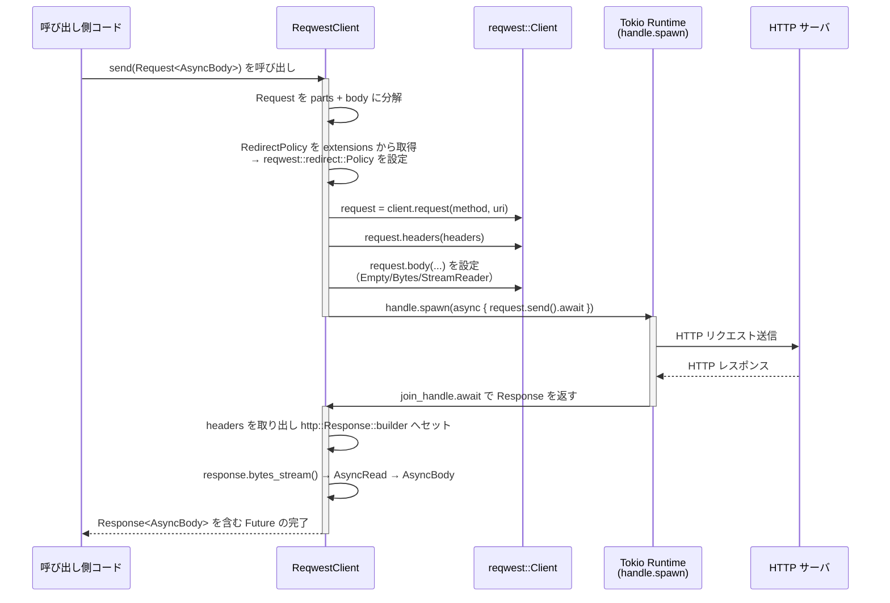

# reqwest_client/ ディレクトリ解説

## 1. ざっくり一言

`reqwest_client` は、`reqwest::Client` を内部に持ち、独自の `http_client::HttpClient` 抽象に適合させるための HTTP クライアントアダプタです。  
非同期実行のための Tokio ランタイム管理や、プロキシ設定・User-Agent 設定・エラー時のクレデンシャル隠しなどもまとめて扱います。

---

## 2. このモジュールの役割

### 2.1 概要

- このディレクトリは、`reqwest` ベースの HTTP クライアント実装を提供します。
- 目的は、アプリケーション側が依存する `http_client::HttpClient` トレイトを `reqwest` で実装し、HTTP 通信の詳細（TLS 設定・プロキシ・ランタイムなど）を隠蔽することです。
- 追加で、`futures::AsyncRead` ベースのボディを `reqwest` のストリームボディに変換するユーティリティ（`StreamReader` / `poll_read_buf`）も提供します。

### 2.2 アーキテクチャ内での位置づけ

全体の依存関係のイメージです（このディレクトリに含まれないクレートは外部コンポーネントとして描画しています）。

```mermaid
graph TD
    A["呼び出し側コード<br/>（http_client::HttpClient を使用）"]
    B["ReqwestClient<br/>(本クレートの型)"]
    C["reqwest::Client"]
    D["tokio::runtime::Runtime<br/>（RUNTIME 静的変数）"]
    E["http_client クレート<br/>(Request/Response, AsyncBody)"]
    F["http_client_tls クレート<br/>(TLS 設定)"]
    G["gpui_util::defer<br/>(Drop 時に処理実行)"]
    H["regex (REDACT_REGEX)<br/>URL パラメータのマスク"]

    A -->|HttpClient トレイト経由で send 呼び出し| B
    B -->|内部で HTTP リクエスト生成| C
    B -->|なければ生成して利用| D
    B -->|Request/Response 型を利用| E
    B -->|TLS 設定を取得| F
    B -->|Future ドロップ時に abort| G
    B -->|エラー内 URL のマスク| H
    C -->|"外部 HTTP サーバ":::ext

    classDef ext fill:#fdf2e9,stroke:#e67e22,color:#000;
```

- 呼び出し側は `http_client::HttpClient` トレイトに対してコードを書くだけでよく、具体的な実装として本クレートの `ReqwestClient` を差し込む構造になっています。
- 実際の HTTP 通信は `reqwest::Client` が行い、本クレートはその前後処理と型変換・ランタイム管理を担います。

### 2.3 設計上のポイント

- **責務の分割**
  - HTTP クライアント本体: `ReqwestClient`
  - Tokio ランタイム管理: 静的変数 `RUNTIME` と `runtime()` 関数
  - `AsyncRead` → `reqwest::Body` の変換: `StreamReader` と `poll_read_buf`
  - エラー中の機密情報マスキング: `REDACT_REGEX` と `redact_error`
- **状態管理**
  - `ReqwestClient` は内部に
    - `reqwest::Client`
    - 使用する `tokio::runtime::Handle`
    - 現在設定されているプロキシ URL（任意）
    - User-Agent ヘッダ（任意）
    を保持する状態付きオブジェクトです。
- **エラーハンドリング**
  - 外部 API は基本的に `anyhow::Result` でエラーを返します。
  - `reqwest::Error` の URL を書き換えて、`key=...` 形式のクエリパラメータを `key=REDACTED` に置き換え、ログ等への漏洩を抑制します。
- **ランタイムの扱い**
  - 既存の Tokio ランタイムがあればそれを使用し、なければワーカースレッド 1 本の軽量ランタイムを静的に生成して使い回します。
- **テスト**
  - プロキシ URL のパターン（http/https/socks4/socks4a/socks5/socks5h）が正しく扱われること、および不正なスキームの場合にプロキシが設定されないことをテストしています。

---

## 3. 主要な機能一覧

- `ReqwestClient` の生成:
  - デフォルト設定でクライアントを作成 (`ReqwestClient::new`)
  - User-Agent を指定して作成 (`ReqwestClient::user_agent`)
  - プロキシ + User-Agent をまとめて設定して作成 (`ReqwestClient::proxy_and_user_agent`)
- `http_client::HttpClient` トレイト実装:
  - 現在設定されているプロキシの参照取得 (`proxy`)
  - 現在設定されている User-Agent の参照取得 (`user_agent`)
  - `http::Request<http_client::AsyncBody>` を送信し、`http_client::AsyncBody` ベースのレスポンスを返却 (`send`)
- Tokio ランタイム管理:
  - グローバルなマルチスレッド Runtime の遅延初期化 (`runtime`)
  - ランタイム `Handle` を `ReqwestClient` に紐付け
- ボディのストリーミング変換:
  - `futures::AsyncRead` を `futures::Stream<Item = io::Result<Bytes>>` に変換する `StreamReader`
  - `BytesMut` バッファに非同期読み込みを行う `poll_read_buf`
- エラーメッセージのマスク:
  - URL クエリ中の `key=...` を `key=REDACTED` に置換する `redact_error`

---

## 4. 関数・構造体の解説

### 4.1 主な型一覧

| 名前 | 種別 | 役割 / 用途 |
|------|------|-------------|
| `ReqwestClient` | 構造体 | `reqwest::Client` をラップし、`http_client::HttpClient` トレイトを実装する HTTP クライアント本体 |
| `StreamReader` | 構造体 | `AsyncRead` を `Stream<Item = io::Result<Bytes>>` に変換する内部ユーティリティ |
| `RUNTIME` | `OnceLock<tokio::runtime::Runtime>` | 必要に応じて生成されるグローバル Tokio ランタイム |
| `REDACT_REGEX` | `LazyLock<Regex>` | クエリ文字列中の `key=` パラメータを検出・マスクする正規表現 |

### 4.2 重要な関数・メソッド

#### `ReqwestClient::new() -> ReqwestClient`

**概要**

- デフォルト設定（Rustls TLS・接続タイムアウト 10 秒）の `reqwest::Client` を生成し、それをラップした `ReqwestClient` を返します。

**内部処理**

1. `ReqwestClient::builder()` で `reqwest::ClientBuilder` を構築します。
   - `.use_rustls_tls()` と `.connect_timeout(Duration::from_secs(10))` が設定されます。
2. `.build()` で `reqwest::Client` を生成します。
3. 生成に失敗すると `expect("Failed to initialize HTTP client")` でパニックします。
4. `From<reqwest::Client>` 実装を通じて `ReqwestClient` に変換します。
   - この際に使用する Tokio ランタイム `Handle` が決定されます。

**戻り値**

- 初期化済みの `ReqwestClient`。プロキシ・User-Agent は未設定（`None`）です。

**Errors / Panics**

- クライアント生成に失敗した場合（構成不備等）、`expect` によりパニックします。
- `anyhow::Result` ではなくパニックなので、テストなどで確実に生成したい場合に向いています。

**使用上の注意点**

- 失敗時にパニックするため、エラーをハンドリングしたい場合は `ReqwestClient::user_agent` や `proxy_and_user_agent` を使う方が安全です。

---

#### `ReqwestClient::proxy_and_user_agent(proxy: Option<Url>, user_agent: &str) -> anyhow::Result<ReqwestClient>`

**概要**

- 任意のプロキシ URL と User-Agent を設定した `ReqwestClient` を作成します。
- プロキシの解析に失敗した場合は、ログにエラーを出しつつ「プロキシなし」のクライアントとして動作します。

**引数**

| 引数名 | 型 | 説明 |
|--------|----|------|
| `proxy` | `Option<Url>` | 使用したいプロキシの URL。`None` の場合はプロキシなし |
| `user_agent` | `&str` | User-Agent ヘッダに設定する文字列 |

**戻り値**

- 成功時: 設定済みの `ReqwestClient`
- 失敗時: `anyhow::Error`（User-Agent ヘッダの生成失敗や TLS 設定等によるビルド失敗）

**内部処理の流れ**

1. `HeaderValue::from_str(user_agent)` で User-Agent 用ヘッダ値を生成します。
2. デフォルトヘッダに User-Agent を設定した `reqwest::ClientBuilder` を作成します。
3. `proxy` が `Some` の場合は、`reqwest::Proxy::all(proxy_url.clone())` を試みます。
   - 失敗した場合は `log::error!` でエラーを記録し、プロキシなしとして続行します。
   - 成功した場合は `proxy.no_proxy(reqwest::NoProxy::from_env())` で `NO_PROXY` 環境変数を尊重する設定を行い、ビルダーに `.proxy(...)` を設定します。
4. `http_client_tls::tls_config()` を渡して `.use_preconfigured_tls(...)` を呼び出します。
5. `.build()?` で `reqwest::Client` を生成し、`ReqwestClient` に変換します。
6. `ReqwestClient` の `proxy` フィールドに、実際に有効なプロキシ URL を（有効な場合のみ）設定します。
7. `user_agent` フィールドにも設定します。

**Edge cases**

- `proxy` に不正なスキーム（例: `socks://`）が渡された場合:
  - `reqwest::Proxy::all` がエラーになり、ログにエラーが出力されます。
  - `client.proxy` フィールドは `None` のままとなります（テストで検証）。
- `proxy` が `None` の場合:
  - プロキシは設定されません。
  - `proxy()` メソッドも `None` を返します。

**使用上の注意点**

- プロキシ URL は `reqwest::Proxy::all` がサポートする形式のみ有効です。  
  テストでは `http`, `https`, `socks4`, `socks4a`, `socks5`, `socks5h` が利用されています。
- `http_client_tls::tls_config()` の詳細はこのチャンクからは分かりませんが、環境に依存する可能性があります。

---

#### `runtime() -> &'static tokio::runtime::Runtime`

**概要**

- グローバルな Tokio マルチスレッド・ランタイム（ワーカースレッド 1 本）を遅延初期化して返します。

**内部処理**

1. 静的変数 `RUNTIME: OnceLock<Runtime>` に対して `get_or_init` を呼び出します。
2. 未初期化の場合は、`Builder::new_multi_thread()` でランタイムを生成します。
   - `worker_threads(1)` でスレッド数を 1 に制限。
   - `enable_all()` で I/O やタイマーなどの全機能を有効化。
3. 生成に失敗すると `expect("Failed to initialize HTTP client")` でパニックします。
4. 初期化済みの `Runtime` への参照を返します。

**使用上の注意点**

- 一度生成されたランタイムはプログラム終了まで使われ続けます（`OnceLock` のため再初期化されません）。
- `From<reqwest::Client> for ReqwestClient` 内部でも、このランタイムの `handle()` が利用される場合があります。

---

#### `impl From<reqwest::Client> for ReqwestClient`

**概要**

- 既に構築済みの `reqwest::Client` から `ReqwestClient` を作るための変換実装です。
- 使用する Tokio ランタイム `Handle` もこのタイミングで決定されます。

**内部処理**

1. `tokio::runtime::Handle::try_current()` を呼び出します。
2. 成功した場合:
   - そのハンドルを `handle` フィールドに使用します。
3. 失敗した場合（実行中の Tokio ランタイムが存在しない場合）:
   - `log::debug!("no tokio runtime found, creating one for Reqwest...")` を出力。
   - `runtime().handle().clone()` でグローバルランタイムのハンドルを取得し使用します。
4. `ReqwestClient { client, handle, proxy: None, user_agent: None }` を返します。

**使用上の注意点**

- `ReqwestClient` のメソッドは、このとき取得した `Handle` 上でタスクを `spawn` します。
- `reqwest::Client` を外部でカスタム設定している場合でも、その設定はそのまま尊重されます（本実装では改変していません）。

---

#### `impl futures::Stream for StreamReader::poll_next(...)`

**概要**

- `AsyncRead` なリーダーから非同期に読み込み、`Bytes` のストリームとして出力する内部実装です。
- `reqwest::Body::wrap_stream` に渡すためのアダプタとして機能します。

**内部処理の流れ**

1. `self.reader.take()` で内部のリーダーを取り出します。
   - `None` の場合はすでに EOF なので `Poll::Ready(None)` を返します。
2. `self.buf.capacity()` が 0 の場合は `self.capacity`（デフォルトは 4096 バイト）を予約します。
3. `poll_read_buf(&mut reader, cx, &mut self.buf)` を呼び出します。
4. 結果に応じて分岐します:
   - `Poll::Pending`: そのまま `Poll::Pending`。
   - `Poll::Ready(Err(err))`: エラーを返しつつ、`reader` を `None` にして以降の呼び出しでは終了とします。
   - `Poll::Ready(Ok(0))`: EOF とみなし、`reader` を `None` にして `Poll::Ready(None)`。
   - `Poll::Ready(Ok(_n))`: `self.buf.split()` で読み込み済みバッファを切り出して `Bytes` にして返し、残りのバッファを新しい `BytesMut` として保ちます。

**使用上の注意点**

- この型自体は公開されていないため、外部コードから直接使用することは想定されていません。
- `AsyncRead` 実装（`http_client::Inner::AsyncReader`）から `reqwest::Body` を構成するときにのみ利用されます。

---

#### `poll_read_buf(io, cx, buf) -> Poll<std::io::Result<usize>>`

**概要**

- `futures::AsyncRead` な `io` から非同期に読み込み、`BytesMut` バッファに書き込む低レベルなユーティリティです。
- `tokio-util` の実装をベースに、このユースケースに合わせて簡略化されています。

**引数**

| 引数名 | 型 | 説明 |
|--------|----|------|
| `io` | `&mut Pin<Box<dyn AsyncRead + Send + Sync>>` | 読み込み元の非同期リーダー |
| `cx` | `&mut Context<'_>` | 非同期ポーリング用のコンテキスト |
| `buf` | `&mut BytesMut` | 読み込み先バッファ |

**戻り値**

- `Poll::Ready(Ok(n))` : `n` バイト読み込んだ（`n == 0` は EOF として扱われます）
- `Poll::Ready(Err(e))` : 読み込みエラー
- `Poll::Pending` : まだ読み込み準備ができていない

**内部処理の流れ**

1. `buf.has_remaining_mut()` が `false` の場合は、すぐに `Ok(0)` を返します。
2. `buf.chunk_mut()` で未初期化領域のポインタを取得します。
3. それを `tokio::io::ReadBuf::uninit` にラップし、`poll_read` に渡します。
4. `poll_read` 完了後、読み込まれた長さを `buf.advance_mut(n)` で反映します。
5. `Poll::Ready(Ok(n))` を返します。

**Edge cases**

- バッファに書き込み可能な領域がない場合 (`!buf.has_remaining_mut()`): 0 バイト読み込んだものとして `Ok(0)` を返します。
- `poll_read` がエラーを返した場合、そのまま `Err` として返されます。

**使用上の注意点**

- `unsafe` ブロックを使用しているため、バッファのサイズ管理は呼び出し側（ここでは `StreamReader`）が適切に行う前提になっています。
- 一般的なアプリケーションコードから直接使う想定ではなく、内部実装向けです。

---

#### `redact_error(mut error: reqwest::Error) -> reqwest::Error`

**概要**

- `reqwest::Error` に紐づいた URL のクエリ文字列から `key=...` の形式のパラメータを検出し、`key=REDACTED` に置き換えます。
- ログやエラーメッセージから API キーなどが漏れることを防ぐ目的で使用されます。

**内部処理**

1. `error.url_mut()` で内部に保持されている URL への可変参照を取得します（なければ何もしません）。
2. `url.query()` でクエリ文字列を取得します。
3. `REDACT_REGEX`（`Regex::new(r"key=[^&]+")`）で `key=...` の部分を `key=REDACTED` に置換します。
4. 置換結果が新しい `String`（`Cow::Owned`）の場合のみ `url.set_query(Some(&redacted))` を行い、URL を更新します。
5. 修正済み（または未修正）の `error` を返します。

**使用上の注意点**

- 置換対象はクエリ文字列中の `key=` だけです。その他の機密情報（例: `token=`）はこのコードからはマスクされません。
- 複数の `key=` パラメータがある場合も、正規表現にマッチした箇所がすべて `REDACTED` になります。

---

#### `impl http_client::HttpClient for ReqwestClient::send(...)`

**概要**

- `http::Request<http_client::AsyncBody>` を `reqwest` を使って送信し、レスポンスを `http_client::AsyncBody` として返します。
- リクエストボディ が空 / バイト列 / 非同期ストリーム のいずれにも対応します。
- リダイレクトポリシーを `RedirectPolicy` 拡張から読み取り、`reqwest` の設定に反映します。

**引数**

| 引数名 | 型 | 説明 |
|--------|----|------|
| `req` | `http::Request<http_client::AsyncBody>` | 送信する HTTP リクエスト |

**戻り値**

- `BoxFuture<'static, anyhow::Result<http_client::Response<http_client::AsyncBody>>>`
  - 非同期に完了する Future であり、成功時は `http_client::Response` を、失敗時は `anyhow::Error` を返します。

**内部処理の流れ（概略）**

1. `req.into_parts()` でヘッダなどの `parts` とボディ `body` に分解します。
2. `self.client.request(parts.method, parts.uri.to_string())` で `reqwest` のリクエストビルダーを作成します。
3. ヘッダをそのままコピーします: `request = request.headers(parts.headers)`.
4. `parts.extensions` から `RedirectPolicy` を取得できれば、それに応じて `reqwest::redirect::Policy` を設定します。
5. ボディの種類に応じて `reqwest::Body` を構築します:
   - `Inner::Empty` → `Body::default()`
   - `Inner::Bytes(cursor)` → 内部バイト列を取り出して `Body` に変換
   - `Inner::AsyncReader(stream)` → `StreamReader::new(stream)` を `Body::wrap_stream` に渡す
6. `self.handle.clone()` した Tokio ランタイム上で `request.send().await` を `spawn` します。
   - `join_handle.abort_handle()` を `gpui_util::defer` 経由で保持し、呼び出し側が Future をドロップしたときに abort されるようにします。
7. `join_handle.await?` で `reqwest::Response` を取得し、`redact_error` でエラー時の URL をマスクします。
8. レスポンスヘッダを取り出し、`http::Response::builder()` に設定します。
9. `response.bytes_stream()` を `futures::Stream` として取得し、`map_err(futures::io::Error::other)` → `into_async_read()` で `AsyncRead` に変換します。
10. `http_client::AsyncBody::from_reader(bytes)` でレスポンスボディを構築し、`builder.body(body)` で `Response` を組み立てます。

**Errors / Panics**

- ランタイム上のタスク `join_handle.await` がエラーを返した場合、そのエラーは `anyhow::Error` にラップされて呼び出し側に返ります。
- `http::Response::builder().body(body)` が失敗した場合も `anyhow!(e)` で `anyhow::Error` になります。
- `reqwest::Client::request` 構築などでパニックが起こる可能性はコードからは見えません（`unwrap` 等は使用していません）。

**Edge cases**

- `RedirectPolicy` が `NoFollow` の場合: リダイレクトは追跡されません。
- `RedirectPolicy::FollowLimit(limit)` の場合: `limit` 回までリダイレクトを追跡します。
- `RedirectPolicy::FollowAll` の場合: 上限 100 回で追跡します。
- ボディが空 (`Inner::Empty`) の場合: `reqwest::Body::default()` を使用します。
- 呼び出し側が `send` の戻り値 Future を途中でドロップした場合:
  - `gpui_util::defer` により、内部の `reqwest` タスクは abort されるようになっています。

**使用上の注意点**

- `send` 自体は非同期処理を表す `BoxFuture` を返すだけなので、呼び出し側で `.await` するための executor（Tokio など）が必要です。
- `ReqwestClient` が内部で保持している `tokio::runtime::Handle` と、呼び出し側が利用している executor が異なる場合でも、`handle.spawn` により内部タスクは `ReqwestClient` が持つランタイム上で動作します。

---

### 4.3 その他の関数・要素

| 名称 | 役割（1 行） |
|------|--------------|
| `ReqwestClient::builder()` | 共通のデフォルト設定（Rustls・タイムアウト 10 秒）を持つ `reqwest::ClientBuilder` を返す内部ヘルパー |
| `ReqwestClient::user_agent(agent: &str)` | User-Agent のみを指定して `ReqwestClient` を作るコンストラクタ（プロキシなし） |
| `ReqwestClient::proxy(&self)` | `http_client::HttpClient` トレイト実装。現在設定されているプロキシ URL を返す |
| `ReqwestClient::user_agent(&self)` | `http_client::HttpClient` トレイト実装。現在設定されている User-Agent ヘッダ値を返す |
| `tests::test_proxy_uri` | 各種プロキシスキーム（http, https, socks4, socks4a, socks5, socks5h）が `proxy_and_user_agent` で正しく保持されることを検証 |
| `tests::test_invalid_proxy_uri` | 不正な `socks://` スキームのプロキシ URL が無視される（`client.proxy.is_none()`）ことを検証 |

---

## 5. データフロー

代表的なシナリオとして、「`ReqwestClient` を通じて HTTP リクエストを送信し、レスポンスボディをストリームとして読み出す」流れを示します。



要点:

- リクエストの送信自体は `ReqwestClient` が保持する Tokio ランタイム上のタスク（`handle.spawn`）として実行されます。
- レスポンスボディは `reqwest::Response::bytes_stream()` → `into_async_read()` → `http_client::AsyncBody::from_reader` という流れで、`http_client` 側の抽象に変換されます。

---

## 6. 使い方（How to Use）

### 6.1 基本的な使用方法

ここでは、`ReqwestClient` を生成し、`http_client::HttpClient` トレイト経由で GET リクエストを送る例を示します。  
`http_client::AsyncBody` の具体的なコンストラクタはこのチャンクには含まれていないため、コメントで補っています。

```rust
use anyhow::Result;                                      // anyhow::Result を使ってエラーをまとめて扱う
use http_client::HttpClient;                             // HttpClient トレイトをインポート
use http::{Request, Method};                             // HTTP メソッドと Request 型
use reqwest_client::ReqwestClient;                       // 本クレートの ReqwestClient 型

#[tokio::main]                                           // Tokio ランタイム上で main を実行
async fn main() -> Result<()> {                          // エラーは anyhow::Result で返す
    // ReqwestClient をデフォルト設定で生成する
    let client = ReqwestClient::new();                   // プロキシ無し・User-Agent 未設定

    // 送信するボディを用意する（ここでは空ボディを想定）
    // 実際には http_client クレート側のコンストラクタを使用します。
    let body = {
        // 例: http_client::AsyncBody::from_reader(...) など
        // このチャンクには定義がないため、具体例はコメントに留めます。
        unimplemented!("AsyncBody の具体的な生成方法は http_client クレートに依存します");
    };

    // HTTP リクエストを組み立てる
    let req = Request::builder()                         // http::Request ビルダー
        .method(Method::GET)                             // GET メソッドを指定
        .uri("https://example.com")                      // URI を指定
        .body(body)                                      // AsyncBody をセット
        .expect("failed to build request");              // ビルド失敗時はパニック

    // HttpClient トレイトの send メソッドを await してレスポンスを取得する
    let resp = client.send(req).await?;                  // Future を await して送信

    // ステータスコードなどにアクセスする（具体的な API は http_client に依存）
    println!("status = {:?}", resp.status());            // ステータスコードを表示（想定コード）

    Ok(())                                               // 正常終了
}
```

- 上記では `#[tokio::main]` を使っていますが、既存ランタイムがある場合は `ReqwestClient` はそれを利用します。
- `AsyncBody` の具体的な利用方法は `http_client` クレートの API に依存するため、このチャンクだけからは詳細不明です。

### 6.2 よくある使用パターン

#### プロキシと User-Agent をまとめて設定する

```rust
use anyhow::Result;                                      // anyhow::Result をインポート
use http_client::{HttpClient, Url};                      // HttpClient トレイトと Url 型
use http::{Request, Method};                             // HTTP Request 関連
use reqwest_client::ReqwestClient;                       // ReqwestClient を利用する

async fn fetch_through_proxy() -> Result<()> {           // プロキシ経由で取得する関数
    // プロキシ URL をパースする
    let proxy = Url::parse("http://localhost:1080")?;    // プロキシサーバの URL

    // プロキシ + User-Agent を設定してクライアントを生成する
    let client = ReqwestClient::proxy_and_user_agent(    // プロキシと User-Agent を同時設定
        Some(proxy),                                     // 一つのプロキシ URL を指定
        "my-app/1.0",                                    // User-Agent の文字列
    )?;

    // AsyncBody の具体的な初期化は http_client クレートに依存
    let body = unimplemented!("AsyncBody を構築する");

    // リクエストを組み立てる
    let req = Request::builder()
        .method(Method::GET)
        .uri("https://example.com")
        .body(body)
        .expect("failed to build request");

    // プロキシ設定を効かせて送信する
    let resp = client.send(req).await?;                  // プロキシ経由で通信

    println!("status = {:?}", resp.status());            // ステータスコードを出力

    Ok(())
}
```

- テストコードと同様に、HTTP / HTTPS / 各種 SOCKS プロキシに対応します（`reqwest::Proxy::all` がサポートする範囲）。
- `NO_PROXY` 環境変数が設定されている場合、その設定も `reqwest` の `NoProxy::from_env` を通じて反映されます。

#### 既存の `reqwest::Client` を使う

`reqwest::Client` を外部でカスタマイズしている場合、そのクライアントを `ReqwestClient` に包み直して `HttpClient` として利用できます。

```rust
use anyhow::Result;                                      // anyhow::Result をインポート
use reqwest::Client;                                     // 生の reqwest::Client
use reqwest_client::ReqwestClient;                       // ラッパーとなる ReqwestClient 型

fn build_custom_client() -> Result<ReqwestClient> {      // カスタム設定で ReqwestClient を作る
    // 独自のタイムアウトやヘッダを設定した reqwest::Client を構築
    let inner = Client::builder()                        // ClientBuilder を取得
        .timeout(std::time::Duration::from_secs(30))     // タイムアウトを 30 秒に設定
        .build()?;                                       // Client をビルド（? でエラー伝播）

    // From 実装を通じて ReqwestClient に変換
    let client: ReqwestClient = inner.into();            // into() でラップ
    Ok(client)
}
```

- この場合も、Tokio ランタイムは `Handle::try_current()` で取得され、見つからなければ `runtime()` により生成されます。

### 6.3 使用上の注意点（まとめ）

- **ランタイム依存**
  - `ReqwestClient` は内部で `tokio::runtime::Handle` を保持し、そのハンドル上で `reqwest` タスクを `spawn` します。
  - クライアント生成時に紐付けられたランタイムが停止している状態で `send` を呼び出すと、Tokio の仕様上パニック等の問題が発生しうるため、ランタイムのライフタイム設計に注意が必要です（詳細は Tokio のドキュメントに依存します）。
- **エラーの扱い**
  - `ReqwestClient::new()` は失敗するとパニックします。エラーを扱いたい場合は `proxy_and_user_agent` など `anyhow::Result` を返すコンストラクタを利用する方が安全です。
- **機密情報のログ**
  - エラー中の URL クエリ文字列からは `key=` パラメータのみがマスクされます。他の名前のパラメータに機密情報を含める場合は別途対策が必要です。
- **プロキシ設定**
  - 不正な形式のプロキシ URL を指定した場合、ログにエラーが出力されますが、クライアント自体はプロキシなしで動作します。
- **ボディストリーミング**
  - `Inner::AsyncReader` を使用したストリーミングボディは、`StreamReader` → `reqwest::Body::wrap_stream` → ネットワーク という流れで処理されます。
  - 利用する `AsyncRead` 実装は、連続読み出しと EOF を正しく実装している必要があります。

---

## 7. 関連ファイル

| パス | 役割 / 関係 |
|------|------------|
| `reqwest_client/Cargo.toml` | クレート名・ライセンス・依存クレート（`reqwest`, `tokio`, `http_client`, `http_client_tls`, `gpui_util`, `regex` など）を定義します。ライブラリクレートとして `src/reqwest_client.rs` をエントリポイントに設定しています。 |
| `reqwest_client/src/reqwest_client.rs` | 本クレートの主要な実装ファイルです。`ReqwestClient` 構造体と `http_client::HttpClient` トレイト実装、ランタイム管理、ストリーミング変換 (`StreamReader` / `poll_read_buf`)、エラーマスキング (`redact_error`) およびプロキシ設定に関するテストが含まれます。 |

このディレクトリに現れない補助クレート（`http_client`, `http_client_tls`, `gpui_util` 等）の詳細な API は、このチャンクだけからは分かりませんが、`ReqwestClient` のインターフェースを通じて利用できるように設計されています。
