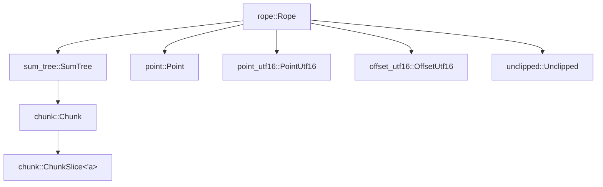
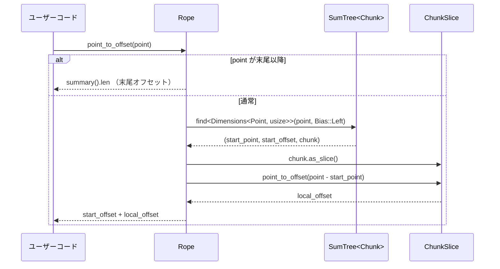

# crates/rope ディレクトリ解説

## 1. ざっくり一言

`rope` クレートは、UTF-8 テキストを効率よく編集・参照するための **ロープ（rope）データ構造**を提供します。  
バイトオフセット・行/列座標・UTF-16 オフセットの相互変換や、部分スライス、行単位の走査など、テキストエディタ実装に必要な操作を高速に行うための基盤です。

---

## 2. このモジュールの役割

### 2.1 概要

- このディレクトリは、大きなテキストバッファを効率よく扱うための **不変/半可変なロープ構造**を実装しています。
- 主な機能は次の通りです。
  - テキストの **追記・前方挿入・範囲置換・部分取得**（`Rope`）
  - **バイトオフセット ↔ 行・列 (`Point`) ↔ UTF-16 オフセット (`OffsetUtf16` / `PointUtf16`)** の変換
  - 行単位・チャンク単位・バイト単位のイテレータ提供（`Chunks`, `Lines`, `Bytes` など）
  - `sum_tree` によるテキスト全体の要約情報（`TextSummary`）の維持

### 2.2 アーキテクチャ内での位置づけ

内部モジュールと外部クレートとの関係は、概ね次のようになっています。



- `src/rope.rs` がライブラリ本体であり、他のモジュールを `mod` して再エクスポートしています。
- `sum_tree::SumTree<Chunk>` を内部で保持し、テキスト全体を複数の `Chunk` に分割して管理します。
- `Chunk` は最大 128 バイト程度の固定長バッファで、文字境界・改行・タブなどの位置をビットマップで持ちます。
- `Point` / `PointUtf16` / `OffsetUtf16` / `Unclipped<T>` は、さまざまな座標系と「クリップ前位置」の表現に使われます。

### 2.3 設計上のポイント

コードから読み取れる設計上の特徴は次の通りです。

- **チャンク分割＋木構造**
  - テキストは固定上限長の `Chunk` に分割され、`SumTree<Chunk>` に格納されます。
  - 木の各ノードは `ChunkSummary` / `TextSummary` を保持し、長さ・行数・UTF-16 長などを集約します。
- **複数の「次元（Dimension）」での検索**
  - `sum_tree::Dimension` と `TextDimension` を実装した型（`usize`, `OffsetUtf16`, `Point`, `PointUtf16` など）により、
    - 「バイト長ベースで検索」
    - 「UTF-16 長ベースで検索」
    - 「(行,列) ベースで検索」
    を同じ木構造上で切り替えて行えます。
- **ビットマップによる高速な局所計算**
  - `Chunk` / `ChunkSlice` は `u128` などのビットマップを使い、
    - UTF-8 文字境界
    - UTF-16 コードユニット境界（二単位文字の追加ビット）
    - 改行・タブ位置
    を一括で計算・保持し、行数や UTF-16 長の計算を高速にしています。
- **座標系の明確な分離**
  - `Point` は「**行 + 行内のバイトオフセット**」を表現します（列はバイト数）。
  - `PointUtf16` は「**行 + 行内の UTF-16 コードユニット数**」を表現します。
  - それぞれに対して `clip_*` 系の関数が用意され、無効な位置は左/右どちらに寄せるかを指定できます。
- **デバッグ時の検証**
  - 多くの関数が `debug_assert!` や `debug_panic!`、`assert!` を用いて、
    - 逆方向のシーク
    - 範囲外インデックス
    - 行をまたぐ不正な `Point`
    などをテスト時に検出するようになっています。

---

## 3. 主要な機能一覧

このクレート全体で提供される主な機能を列挙します。

- **テキスト構造**
  - `Rope`: テキスト全体を表すロープ構造
  - `Chunk` / `ChunkSlice`: 固定長チャンクとそのビュー
- **インデックス変換**
  - `Rope::offset_to_point` / `Rope::point_to_offset`
  - `Rope::offset_to_offset_utf16` / `Rope::offset_utf16_to_offset`
  - `Rope::offset_to_point_utf16` / `Rope::point_utf16_to_offset`
  - `Rope::point_to_point_utf16` / `Rope::point_utf16_to_point`
  - クリップ付きのバリアント `clip_offset*` / `clip_point*`
- **テキスト編集**
  - `Rope::push` / `push_front`: 末尾・先頭への文字列挿入
  - `Rope::append`: 別の `Rope` を結合
  - `Rope::replace`: 指定バイト範囲の置換
  - `Rope::slice` / `slice_rows`: 部分文字列の取得（新しい `Rope` として）
- **走査・イテレーション**
  - `Rope::chars`, `chars_at`, `reversed_chars_at`: 文字（`char`）単位のイテレータ
  - `Rope::chunks`, `chunks_in_range`, `reversed_chunks_in_range`: `&str` チャンク単位のイテレータ
  - `Rope::bytes_in_range`, `reversed_bytes_in_range`: バイトスライス単位のイテレータ / `io::Read` 実装
  - `Chunks::lines` / `Lines`: 行単位のイテレータ
  - `Chunks::next_line` / `prev_line`: 行頭へのナビゲーション
- **メタ情報・要約**
  - `Rope::summary`: 全体の `TextSummary`
  - `Rope::len`, `max_point`, `max_point_utf16`, `line_len`
  - `ChunkSlice::text_summary`: チャンク単位の `TextSummary`
- **補助型**
  - `Point`, `PointUtf16`, `OffsetUtf16`: 各種インデックス表現
  - `Unclipped<T>`: 「クリップ前」のインデックスを表すラッパー
  - `DimensionPair<K, V>`: 2 つの「次元」を同時に集計しつつ、比較は片方だけで行うための構造体
  - `TextDimension` トレイト: `TextSummary` からの変換と加算を規定

---

## 4. 関数・構造体の解説

### 4.1 型一覧（主要な公開型）

| 名前 | 種別 | 役割 / 用途 |
|------|------|-------------|
| `Rope` | 構造体 | テキスト全体のロープ構造。本クレートの中心となる型 |
| `Chunk` | 構造体 | 最大 `MAX_BASE` バイトのテキストチャンク。ビットマップ付き |
| `ChunkSlice<'a>` | 構造体 | `Chunk` 内部のスライスビュー。行数や UTF-16 長などを計算 |
| `Point` | 構造体 | 行とバイト列の位置を表す 0 始まりの座標（列はバイト数） |
| `PointUtf16` | 構造体 | 行と UTF-16 コードユニット数で表す座標 |
| `OffsetUtf16` | 構造体（newtype） | UTF-16 コードユニット数のオフセット。加算・減算に対応 |
| `Cursor<'a>` | 構造体 | `Rope` 上の範囲サマリ・スライス取得のためのカーソル |
| `Chunks<'a>` | 構造体 | 一定範囲内の文字列チャンク（`&str`）を順方向／逆方向に列挙するイテレータ |
| `ChunkBitmaps<'a>` | 構造体 | チャンクスライス + 文字/タブ/改行位置のビットマップ |
| `ChunkWithBitmaps<'a>` | イテレータラッパー | `Chunks` から `ChunkBitmaps` を取り出すイテレータ |
| `Bytes<'a>` | 構造体 | バイトスライス単位で範囲を走査するイテレータ (`io::Read` 実装) |
| `Lines<'a>` | 構造体 | 行単位でテキストを列挙するイテレータ |
| `ChunkSummary` | 構造体 | `Chunk` 1 個分の `TextSummary` を保持する `sum_tree` 用サマリ |
| `TextSummary` | 構造体 | 長さ・行数・UTF-16 長・最長行などテキスト統計情報 |
| `TextDimension` | トレイト | `TextSummary` からの変換と加算を定義し、`SumTree` の次元として使う |
| `DimensionPair<K, V>` | 構造体 | 比較キーと値をペアで管理するための「二次元」サマリ |
| `Unclipped<T>` | 構造体 | まだテキスト範囲にクリップされていないインデックスをラップする |

### 4.2 主要関数の詳細

以下では、よく使われる代表的なメソッドをピックアップして詳細に説明します。

---

#### 4.2.1 `Rope::push(&mut self, text: &str)`

```rust
impl Rope {
    pub fn push(&mut self, mut text: &str) { /* 省略 */ }
}
```

**概要**

- テキスト末尾に UTF-8 文字列 `text` を追加します。
- 既存の最後の `Chunk` に収まる部分はそこに追記し、残りは新しいチャンクとして `SumTree` に追加します。
- 大きなテキストの場合は `push_large` にフォールバックし、並列でチャンク化することもあります（`rayon` 使用）。

**内部処理の流れ（要約）**

1. `self.chunks.update_last` で最後のチャンクに追記できるだけ追記
   - チャンク長 + `text` 長が `chunk::MAX_BASE` 以下なら全て追記
   - それを超える場合は、最低 `MIN_BASE` を満たすような位置まで追記し、文字境界まで調整
2. なお `text` がまだ残っている場合:
   - 残り長が「大きい」場合は `push_large` を呼び出し、大きな `Vec<&str>` を作ってから `Chunk::new` で並列または直列にチャンク化
   - 残り長が小さい場合は `heapless::ArrayVec` に収まる範囲で分割し、`extend` で順にチャンク化
3. テスト時には `check_invariants` で「ほとんどのチャンクが `MIN_BASE` 以上」になっていることを確認

**Edge cases（エッジケース）**

- `text` が空文字列のとき
  - 既存チャンクへ何も追加されず早期に終了します。
- 文字の途中（マルチバイト文字内部）でチャンクを分割しないよう、
  - 必ず `str::is_char_boundary` で境界を調整しています。

**使用上の注意点**

- `Rope` のチャンク構造を直接操作する必要はなく、通常は `push` だけでチャンク分割を意識せずに使えます。
- 非 ASCII 文字（絵文字など）を含む文字列でも、文字境界が崩れないように実装されています。

**使用例**

```rust
use rope::Rope;                    // Rope 型をインポートする

fn main() {
    let mut rope = Rope::new();    // 空の Rope を作成
    rope.push("hello");           // "hello" を末尾に追加
    rope.push("\nworld");         // 改行と "world" を追加
    // rope.text() はテスト用のヘルパーなので、通常は Display 実装を使う
    println!("{}", rope);         // "hello\nworld" が出力される
}
```

---

#### 4.2.2 `Rope::append(&mut self, rope: Rope)`

```rust
impl Rope {
    pub fn append(&mut self, rope: Rope) { /* 省略 */ }
}
```

**概要**

- もう一つの `Rope` を末尾に結合します（右辺の `rope` はムーブされます）。
- 先頭・末尾チャンクが小さすぎる場合は、一部をマージしてチャンクの偏りを抑えます。

**内部処理の流れ（要約）**

1. 結合される側 `rope` の最初のチャンクを見て、
   - 自身 (`self`) の末尾チャンクか、
   - `rope` 先頭チャンク
   のどちらかが `chunk::MIN_BASE` 未満なら、それらを `push_chunk` で統合します。
2. その後、残りのチャンクを `self.chunks.append(rope.chunks, ())` でツリー末尾に追加します。
3. テスト時には `check_invariants` でチャンクサイズの条件を検証します。

**Edge cases**

- 結合先が空 (`self` が空) の場合でも、通常の append として動作します。
- 片方のロープが非常に小さい場合でも、できるだけチャンク数が増えすぎないように統合します。

**使用例**

```rust
use rope::Rope;

fn concat_example() {
    let mut a = Rope::from("Hello");      // "Hello"
    let b = Rope::from(", world!");       // ", world!"
    a.append(b);                          // a は "Hello, world!" になる
    println!("{}", a);                    // "Hello, world!"
}
```

---

#### 4.2.3 `Rope::replace(&mut self, range: Range<usize>, text: &str)`

```rust
impl Rope {
    pub fn replace(&mut self, range: Range<usize>, text: &str) { /* 省略 */ }
}
```

**概要**

- バイトオフセット範囲 `range` を新しい文字列 `text` で置き換えます。
- 内部的には新しい `Rope` を構築してから、最後に `*self = new_rope;` で差し替えます。

**引数**

| 引数名 | 型 | 説明 |
|--------|----|------|
| `range` | `Range<usize>` | 置換対象のバイト範囲（`start..end`） |
| `text` | `&str` | 差し込む新しい文字列 |

**内部処理の流れ**

1. `new_rope` を空で作成。
2. 元の `Rope` に対して `cursor(0)` でカーソルを作成。
3. `cursor.slice(range.start)` で先頭から `range.start` までの部分を `new_rope` に `append`。
4. `cursor.seek_forward(range.end)` で置換範囲の末尾にカーソルを進める。
5. `new_rope.push(text)` で新しいテキストを挿入。
6. `cursor.suffix()` で残り（`range.end` 以降）を `new_rope` に `append`。
7. 最後に `*self = new_rope` として差し替え。

**Edge cases**

- `range` が空 (`start == end`) の場合は挿入になります。
- `range` がテキスト先頭から末尾全体を覆う場合は、完全な置換になります。
- `range` の `start` / `end` がバイト境界だが文字境界でない場合、
  - `Cursor::slice` 内でチャンク境界が `Chunk::assert_char_boundary::<true>` によって検証されるため、
  - 文字の途中で切っているとテスト・デバッグ環境では panic します。
- 本コードでは `range` のクリップは行っていないため、呼び出し側であらかじめ `clip_offset` や `floor_char_boundary` を用いて整合性をとる必要があります。

**使用例**

```rust
use rope::Rope;

fn replace_example() {
    let mut rope = Rope::from("Hello, world!");
    // "world" の開始と終了を求める（固定文字列なので簡略化）
    let start = "Hello, ".len();  // 7
    let end = "Hello, world".len(); // 12

    rope.replace(start..end, "Rope");    // "Hello, Rope!"
    println!("{}", rope);               // "Hello, Rope!"
}
```

---

#### 4.2.4 `Rope::cursor` と `Cursor`

```rust
impl Rope {
    pub fn cursor(&self, offset: usize) -> Cursor<'_> { /* 省略 */ }
}

pub struct Cursor<'a> {
    rope: &'a Rope,
    chunks: sum_tree::Cursor<'a, 'static, Chunk, usize>,
    offset: usize,
}
```

**概要**

- `Cursor` は `Rope` 内の位置（バイトオフセット）を保ちつつ、そこから先の部分を
  - スライス（`Cursor::slice`）
  - 要約（`Cursor::summary`）
  として取得するための補助構造体です。
- 片方向（前方）にしか進めず、「前に戻る」ことはできません。

**主なメソッド**

- `Cursor::new(rope, offset)`: 指定オフセットからカーソルを作成
- `seek_forward(end_offset)`: カーソルを前方に進める（後退は不可）
- `slice(end_offset) -> Rope`: 現在位置から `end_offset` までを切り出した `Rope` を返す
- `summary<D: TextDimension>(end_offset) -> D`:
  - 現在位置から `end_offset` までのテキスト要約を `D` 型で返す
  - 例: `TextSummary`, `usize`（バイト数だけ）, `Point`（行/列情報）など
- `suffix() -> Rope`: 現在位置から末尾までを切り出した `Rope`
- `offset() -> usize`: 現在のバイトオフセット

**内部処理のポイント**

- `Cursor` は内部に `sum_tree::Cursor` を持ち、現在位置が属するチャンクと、そのチャンクの開始/終了オフセットを把握しています。
- `slice` / `summary` では、
  - 部分的にかかっている先頭チャンク
  - 真ん中の丸ごと含まれるチャンク
  - 部分的にかかっている末尾チャンク
  を処理するコードが共通パターンで現れます。

**Edge cases**

- `seek_forward` / `slice` / `summary` は、`end_offset` が現在の `offset` より小さい場合に `assert!` で panic します。
- `end_offset` が `rope.len()` より大きい場合も `assert!` で panic します。
- `Cursor::suffix` は現在位置から最後までを返すので、`offset == rope.len()` の場合は空の `Rope` になります。

**使用例：範囲をまとめてサマリする**

```rust
use rope::{Rope, TextSummary};

fn summarize_range(rope: &Rope, start: usize, end: usize) -> TextSummary {
    let mut cursor = rope.cursor(start);          // start にカーソルを置く
    cursor.summary::<TextSummary>(end)           // start..end の TextSummary を取得
}
```

---

#### 4.2.5 `Rope::offset_to_point` / `Rope::point_to_offset`

```rust
impl Rope {
    pub fn offset_to_point(&self, offset: usize) -> Point { /* 省略 */ }

    #[instrument(skip_all)]
    pub fn point_to_offset(&self, point: Point) -> usize { /* 省略 */ }
}
```

**概要**

- `offset_to_point`:
  - バイトオフセット `offset` を、行 (`row`) と行内バイト数 (`column`) から成る `Point` に変換します。
- `point_to_offset`:
  - `Point` をバイトオフセットに変換します。
- `Point` の `column` は「UTF-8 バイト数」であり、Unicode の「文字数」ではありません。

**内部処理の流れ（offset_to_point）**

1. `offset >= self.summary().len` の場合は、テキスト末尾の `summary().lines` を返す。
2. `sum_tree::SumTree` に対して

   ```rust
   self.chunks.find::<Dimensions<usize, Point>, _>((), &offset, Bias::Left);
   ```

   を呼び出し、
   - `start.0`: 該当チャンクの先頭バイトオフセット
   - `start.1`: そのチャンク先頭までの行数・列数 (`Point`)
   - `item`: 実際の `Chunk` への参照
   を得る。
3. チャンク内でのオフセット `overshoot = offset - start.0` を計算。
4. `chunk.as_slice().offset_to_point(overshoot)` でチャンク内の `Point` を求め、
   それを `start.1` に加算して全体の `Point` を返す。

**内部処理の流れ（point_to_offset）**

1. `point >= self.summary().lines` の場合は、末尾オフセット `summary().len` を返す。
2. `find::<Dimensions<Point, usize>>` を使って、指定行・列が属するチャンクとその開始オフセットを求める。
3. チャンク内の相対座標 `overshoot = point - start.0` を計算。
4. `chunk.as_slice().point_to_offset(overshoot)` を呼び出し、チャンク内バイトオフセットを得る。
5. 全体バイトオフセットとして `start.1 + local_offset` を返す。

**Edge cases**

- チャンク内で `Point.row` が行数を超えている場合、`ChunkSlice::point_to_offset` 側で `debug_panic!` を発火させ、`len()` を返すなどの処理をしています。
- そのため、`Rope` レベルでは「明らかに行数を超えている `Point`」は渡さない前提で使うのが安全です。
- 末尾以降の `offset` / `Point` は、それぞれ末尾にクリップされる挙動です。

**使用例：LSP の「(line, character) 位置 → バイトオフセット」**

```rust
use rope::{Rope, Point};

fn lsp_position_to_offset(rope: &Rope, line: u32, column_bytes: u32) -> usize {
    let point = Point::new(line, column_bytes);   // 行とバイト単位の列
    rope.point_to_offset(point)                  // バイトオフセットへ変換
}
```

---

#### 4.2.6 クリップ系 API：`clip_offset` / `clip_point` / `clip_point_utf16` / `clip_offset_utf16`

```rust
impl Rope {
    pub fn clip_offset(&self, offset: usize, bias: Bias) -> usize { /* 省略 */ }

    pub fn clip_offset_utf16(&self, offset: OffsetUtf16, bias: Bias) -> OffsetUtf16 { /* 省略 */ }

    pub fn clip_point(&self, point: Point, bias: Bias) -> Point { /* 省略 */ }

    pub fn clip_point_utf16(&self, point: Unclipped<PointUtf16>, bias: Bias) -> PointUtf16 { /* 省略 */ }
}
```

**概要**

- これらの関数は、**「文字の途中」や「テキスト範囲外」にあるインデックスを、最も近い有効な位置に寄せる** ためのユーティリティです。
- `Bias::Left` / `Bias::Right` で「左（手前）に寄せるか」「右（先へ）に寄せるか」を選びます。

**代表的な挙動（テストから確認できる例）**

- `"🧘"`（UTF-8 4 バイト、UTF-16 2 コードユニット）の場合:
  - `clip_offset(1, Left)  == 0`（文字の先頭にクリップ）
  - `clip_offset(1, Right) == 4`（文字の末尾にクリップ）
  - `clip_point(Point(0, 1), Left)  == Point(0, 0)`
  - `clip_point(Point(0, 1), Right) == Point(0, 4)`
  - `clip_point_utf16(Unclipped(PointUtf16(0, 1)), Left)  == PointUtf16(0, 0)`
  - `clip_point_utf16(Unclipped(PointUtf16(0, 1)), Right) == PointUtf16(0, 2)`

**実装のポイント**

- `clip_offset`:
  - バイトオフセットを UTF-8 文字境界にクリップします。
  - 内部では `floor_char_boundary` / `ceil_char_boundary` を使用。
- `clip_point`:
  - `ChunkSlice::clip_point` に処理を委譲し、`unicode_segmentation::GraphemeCursor` を使って **書記素クラスタ境界**（ユーザから見える「1文字」）単位でクリップします。
- `clip_offset_utf16` / `clip_point_utf16`:
  - 一度 UTF-16 オフセット → UTF-8 バイトオフセットに変換し、文字境界に揃えたのち、再び UTF-16 に戻すなどの処理を行っています。
  - `Unclipped<PointUtf16>` を受け取るバージョンは、「行を超えている」などのケースも扱い、必要に応じて末尾にクリップします。

**使用上の注意点**

- LSP や Windows API など、UTF-16 ベースの座標を受け取るコードと連携する場合、
  - `PointUtf16` と `OffsetUtf16` は、必ずこのクリップ系 API を通してから `Rope` に渡すと安全です。
- バイト単位の `offset` は、`clip_offset` を通して `Rope` 内の有効な文字境界に揃えてから使うと、デバッグ時の panic を避けられます。

---

#### 4.2.7 行走査：`Chunks::next_line` / `prev_line` と `Lines`

```rust
impl<'a> Chunks<'a> {
    pub fn next_line(&mut self) -> bool { /* 省略 */ }
    pub fn prev_line(&mut self) -> bool { /* 省略 */ }
    pub fn lines(self) -> Lines<'a> { /* 省略 */ }
}
```

**概要**

- `Chunks` は「バイト範囲に限定されたチャンクビュー」であり、その上で
  - 次の行頭に移動（`next_line`）
  - 前の行頭に移動（`prev_line`）
  を行えます。
- `lines()` は `Lines` イテレータを返し、指定範囲を行単位で読み出せます。
- 逆方向（`reversed_chunks_in_range` から作られた `Chunks`）でも `Lines` によって行を逆順で取得できます。

**内部処理のポイント**

- `next_line`:
  - 現在チャンク内で `'\n'` を探し、見つかればその直後のオフセットに移動。
  - 見つからなければ `search_forward` によって、1 個以上の改行を含む次のチャンクを探索し、そのチャンク内で改行位置を探します。
- `prev_line`:
  - 現在位置または一つ前の位置から逆向きに `'\n'` を探し、
    - まずは「同じチャンク内の前の改行」
    - なければ、「前のチャンクにさかのぼって改行を探す」
  - 必要に応じて `chunks.search_backward` を使います。
- `Lines::next`:
  - `Chunks::peek` で現在チャンクのスライスを取得し、`split('\n')` で分割しつつ、
  - 前後のチャンクにまたがる行を `current_line` バッファで連結して返します。
  - 逆方向モード（`reversed`）では、各チャンク内の行列挙も逆順にしてから結合します。

**使用例：範囲内の行を列挙する**

```rust
use rope::Rope;

fn print_lines_in_range(rope: &Rope, start: usize, end: usize) {
    let chunks = rope.chunks_in_range(start..end);   // 範囲内のチャンクイテレータ
    let mut lines = chunks.lines();                  // 行イテレータに変換

    while let Some(line) = lines.next() {            // 1 行ずつ取得
        println!("{}", line);                       // 行単位で処理する
    }
}
```

**使用上の注意点**

- `Chunks::new` は、開始オフセットがチャンク内で文字境界かどうかを `assert_char_boundary::<true>` で検証します。
  - `chunks_in_range` / `reversed_chunks_in_range` を呼び出す前に、`clip_offset` 等で境界に揃えておくと安全です。
- `prev_line` / `next_line` は、戻り値が `bool` で「行頭に移動できたか」を示します。
  - `false` の場合も `offset()` は更新されている可能性があるため、実際のオフセット値は `chunks.offset()` で確認します。

---

### 4.3 その他の補助的な型・関数

- `OffsetUtf16`
  - `Add`, `Sub`, `AddAssign` などが実装されており、`OffsetUtf16` 同士の加減算が可能です。
  - `debug_assert!` により、減算時のアンダーフローを検出しています（`Sub<&Self>`）。
- `Point` / `PointUtf16`
  - `Add` / `Sub` では、「行が 0 の場合は列だけ足し引き」「行が変わる場合は列を置き換える」というルールで実装されています。
  - `Ord` 実装により、`(row, column)` の辞書順で比較できます。
- `Unclipped<T>`
  - `sum_tree::Dimension` としても扱え、集約中はクリップせずに生の値を伝搬させる用途に使われます。
- `DimensionPair<K, V>`
  - `key` で比較しつつ、`value` を集約するための構造体です。
  - `TextDimension` としても実装されているので、例えば「バイト長」と「行数」を同時に追跡するような用途に使えます（実際の利用箇所は別クレート側の可能性があります）。

---

## 5. データフロー

ここでは、代表的な処理として **バイトオフセット → 行・列 (`Point`) への変換** のデータフローを示します。

### 5.1 `Rope::point_to_offset` のフロー



**要点**

- `SumTree` 上の検索 (`find`) により、「指定の行・列がどのチャンクに属するか」を **対数時間（ツリーの高さに比例）** で求めています。
- 個々のチャンク内では、`ChunkSlice::point_to_offset` がビットマップを用いて行の範囲を特定し、オフセットを計算します。
- これにより、テキスト全体の長さが大きくても、座標変換は比較的高速に実行できます。

---

## 6. 使い方（How to Use）

### 6.1 基本的な使用方法

#### 例1: 単純なテキスト構築と表示

```rust
use rope::Rope;                     // Rope 型をインポート

fn main() {
    let mut rope = Rope::new();     // 空の Rope を作成
    rope.push("Hello");            // "Hello" を追加
    rope.push("\nWorld");          // 改行と "World" を追加

    // Display 実装で中身を確認
    println!("{}", rope);          // "Hello\nWorld" が出力される
}
```

#### 例2: 行・列からオフセットを求めてスライス

```rust
use rope::{Rope, Point};

fn slice_first_line(rope: &Rope) -> Rope {
    // 2 行目の先頭 (0-based) に対応する Point
    let second_line_start = Point::new(1, 0);
    let offset = rope.point_to_offset(second_line_start); // バイトオフセットに変換

    // 先頭から 2 行目の先頭までを新しい Rope として取得
    rope.slice(0..offset)
}
```

### 6.2 よくある使用パターン

#### パターン1: 選択範囲の置換（テキストエディタの「置き換え」）

```rust
use rope::Rope;

fn replace_selection(rope: &mut Rope, start: usize, end: usize, new_text: &str) {
    // 必要に応じて文字境界にクリップ
    let start = rope.clip_offset(start, sum_tree::Bias::Left);
    let end   = rope.clip_offset(end,   sum_tree::Bias::Right);

    rope.replace(start..end, new_text); // 範囲置換
}
```

#### パターン2: UTF-16 ベースの座標（LSP など）との相互変換

```rust
use rope::{Rope, Point, PointUtf16, OffsetUtf16, Unclipped};

fn utf16_to_utf8_offset(rope: &Rope, row: u32, col_utf16: u32) -> usize {
    let p16 = PointUtf16::new(row, col_utf16);         // UTF-16 ベースの座標
    rope.point_utf16_to_offset(p16)                    // Rope 内のバイトオフセットに変換
}

fn utf8_offset_to_utf16(rope: &Rope, offset: usize) -> OffsetUtf16 {
    rope.offset_to_offset_utf16(offset)                // UTF-16 コードユニット数に変換
}
```

#### パターン3: ファイル出力やハッシュ計算のためのバイトイテレーション

```rust
use rope::Rope;
use std::io::{self, Write};

fn write_range<W: Write>(rope: &Rope, range: std::ops::Range<usize>, mut out: W) -> io::Result<()> {
    let mut bytes = rope.bytes_in_range(range);    // バイトスライス単位のイテレータ
    let mut buf = [0u8; 4096];

    loop {
        let n = bytes.read(&mut buf)?;            // Bytes は io::Read を実装
        if n == 0 { break; }
        out.write_all(&buf[..n])?;
    }
    Ok(())
}
```

#### パターン4: 行単位での処理（ログビューア・エディタなど）

```rust
use rope::Rope;

fn print_all_lines(rope: &Rope) {
    let chunks = rope.chunks();           // 全体範囲のチャンクイテレータ
    let mut lines = chunks.lines();       // 行イテレータに変換

    while let Some(line) = lines.next() { // 行を 1 行ずつ取得
        println!("{}", line);
    }
}
```

### 6.3 使用上の注意点

- **バイトオフセットと文字境界**
  - 多くの関数はバイトオフセットを受け取りますが、**UTF-8 文字の途中（マルチバイト文字中間）**のオフセットを渡すと、
    - テスト・デバッグ時に panic したり
    - 想定しない座標計算結果になる
    可能性があります。
  - 安全のため、外部からのバイトオフセットは `clip_offset` や `floor_char_boundary` / `ceil_char_boundary` を通すことが推奨されます。
- **`Chunks` / `Lines` の前提**
  - `Rope::chunks_in_range` / `reversed_chunks_in_range` の `range.start` は文字境界である必要があります。
    - そうでない場合、内部で `Chunk::assert_char_boundary::<true>` が呼ばれ panic します。
  - `next_line` / `prev_line` の戻り値 `bool` は「新しい行頭が見つかったか」を示すので、`false` のときも `offset()` を使って最終位置を確認する必要があります。
- **`Point` の列は「バイト数」**
  - `Point.column` は UTF-8 バイト数であり、ユーザが視覚的に認識する「文字数」とは必ずしも一致しません。
  - 見た目上のカーソル位置（書記素クラスタ）で動かしたい場合は、`clip_point` が `unicode-segmentation` を使ってクラスタ境界に揃える役割を持ちます。
- **UTF-16 座標の扱い**
  - `PointUtf16` / `OffsetUtf16` は UTF-16 コードユニット数を扱います。サロゲートペアを含む絵文字などは 2 コードユニットとして数えられます。
  - Windows・LSP など UTF-16 ベースの API とのやり取りの際は、必ずこれらの型を通して変換することで、一貫性を保てます。
- **`Rope` の変更とイテレータ**
  - Rust の借用規則により、「`&Rope` を借用中に `&mut Rope` で変更する」ことはできません。
  - したがって、`Chunks` や `Bytes` のイテレータを使っている間に、その `Rope` を変更するコードはコンパイル時に防がれます。

---

## 7. 関連ファイル

| パス | 役割 / 関係 |
|------|------------|
| `rope/Cargo.toml` | クレート定義。ライブラリのエントリポイントを `src/rope.rs` に設定し、依存クレート（`heapless`, `rayon`, `sum_tree`, `unicode-segmentation`, `util`, `ztracing`, `tracing` など）を宣言 |
| `rope/src/rope.rs` | クレート本体。`Rope` 型と関連するイテレータ・サマリ型・座標変換 API を実装し、他モジュールを `pub use` しています |
| `rope/src/chunk.rs` | 固定長チャンク `Chunk` と、チャンクビュー `ChunkSlice` を実装。ビットマップを使って文字境界・改行・タブ・UTF-16 長を管理 |
| `rope/src/point.rs` | 行 + バイト列を表す座標 `Point` を定義。加減算・比較・パースなどのユーティリティを提供 |
| `rope/src/point_utf16.rs` | 行 + UTF-16 コードユニット数を表す `PointUtf16` を定義。`Point` と同様の加減算・比較 API を提供 |
| `rope/src/offset_utf16.rs` | UTF-16 オフセット `OffsetUtf16` のラッパー型。加減算や `AddAssign` を実装し、`TextSummary` などで使用 |
| `rope/src/unclipped.rs` | クリップ前のインデックス `Unclipped<T>` を定義。`sum_tree::Dimension` として扱えるようにし、UTF-16 座標のクリップ処理で利用 |
| `rope/benches/rope_benchmark.rs` | `criterion` によるベンチマーク。`push`, `append`, `slice`, `bytes_in_range`, `chars`, `clip_point`, `point_to_offset`, `cursor`, `append many` など、代表的 API の性能評価を行う |

これらのファイル群が協調して、テキストエディタなどで必要となる高機能なテキストバッファ操作を提供しています。
