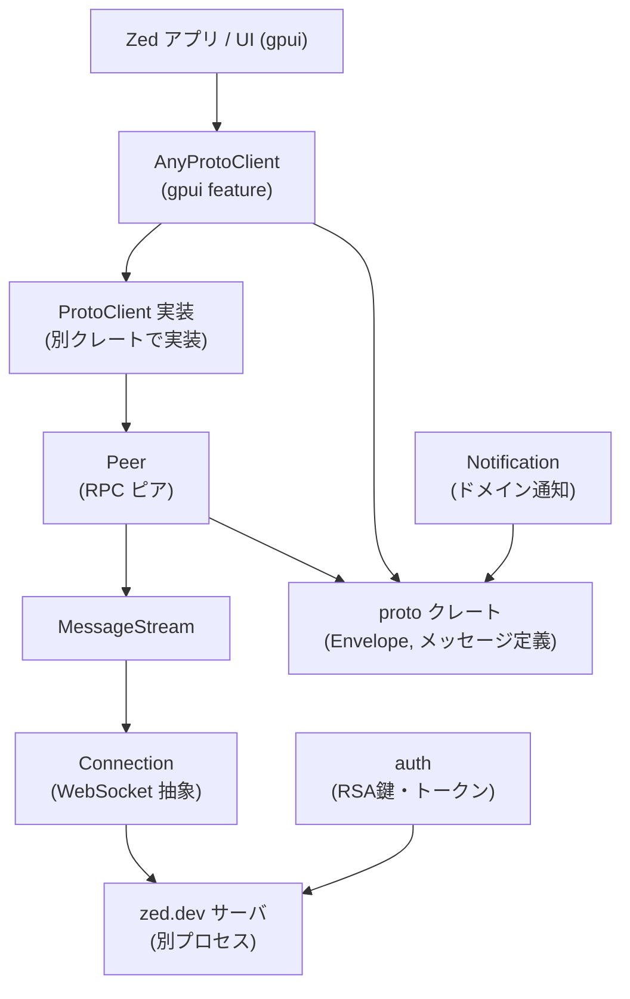
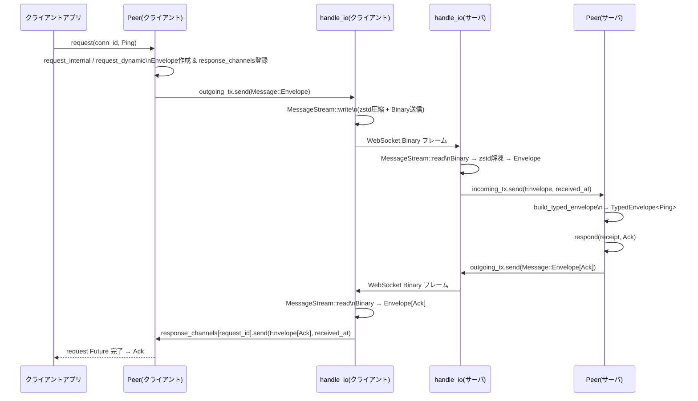

# crates/rpc

## 0. ざっくり一言

Zed アプリと zed.dev サーバの間で使う「RPC（Remote Procedure Call）レイヤ」をまとめたクレートです。  
WebSocket 上で protobuf メッセージを圧縮して送受信し、型安全なリクエスト／レスポンスや通知、LSP プロキシ、認証用の暗号化を提供します。

---

## 1. このモジュールの役割

### 1.1 概要

- このクレートは **Zed クライアントとサーバ間の RPC 通信**を扱うために存在し、次の機能を提供します。
  - WebSocket 接続を抽象化する `Connection`
  - protobuf `Envelope` ベースのメッセージストリーム `MessageStream`
  - 複数のリクエスト／レスポンスを 1 本の接続で多重化する `Peer`
  - gpui と統合されたメッセージハンドリング用クライアント `AnyProtoClient`（`gpui` feature 時）
  - 通知オブジェクト `Notification` の proto 変換
  - RSA ベースの公開鍵暗号とトークン生成（`auth`）

### 1.2 アーキテクチャ内での位置づけ

このクレート内の主要コンポーネントと周辺モジュールの関係は次のようになります。



- `rpc::proto` として **proto クレートを丸ごと再エクスポート**し、呼び出し側からは `rpc::proto::...` としてメッセージ型を利用できます。
- 実際の WebSocket ハンドシェイクや `ProtoClient` の実装は別クレート側ですが、このクレートがその上の **メッセージレベルの制御**を担当します。
- `macros::messages!` などのマクロにより、proto メッセージ型と `Envelope` との相互変換や型付きエンベロープ生成関数が（主に proto 側で）自動生成されます。

### 1.3 設計上のポイント

コードから読み取れる設計上の特徴は次の通りです。

- **レイヤ分離**
  - `Connection`: WebSocket の `Sink` / `Stream` を Box 化した最下層。
  - `MessageStream`: `Connection` 上で protobuf + zstd 圧縮 を行うストリーム。
  - `Peer`: `MessageStream` 上で request/response 多重化・タイムアウト・keepalive を管理。
  - `AnyProtoClient` / `ProtoClient`: gpui エンティティへのメッセージ配送とハンドラ登録を管理。
- **型安全なメッセージ処理**
  - `messages!` マクロと proto 側の実装により、`Envelope` から各メッセージ型への安全なデシリアライズ（`TypedEnvelope<T>`）を行います。
  - `RequestMessage` / `EnvelopedMessage` / `EntityMessage` などの trait で、リクエスト／レスポンスの対応付けやエンティティ単位のルーティングを表現します。
- **非同期・多重化**
  - `Peer` は 1 接続上で複数のリクエストを同時進行させるために、`message_id` ごとのレスポンス待ちチャネルを `HashMap` で管理します。
  - `request` / `request_stream` により、単発レスポンスとストリーミングレスポンスの両方をサポートします。
- **通信健全性の管理**
  - 定期的な `Ping` 送信（keepalive）と、受信／送信タイムアウト（`RECEIVE_TIMEOUT` / `WRITE_TIMEOUT`）により、ハングアップや半開き接続を検知します。
- **後方互換性を意識した設計**
  - `auth::EncryptionFormat` では新旧 2 種類の暗号化形式を扱い、復号側で両方を試すことでクライアント／サーバ間バージョン差を吸収します。
  - `Notification` は JSON を永続化フォーマットにしており、コメントで「後方互換性を壊さない変更」の注意が明記されています。

---

## 2. 主要な機能一覧

このクレートが提供する主な機能を列挙します。

- **RSA 鍵ペア生成とトークン暗号化 (`auth`)**
  - `keypair` による 2048bit RSA 鍵生成
  - OAEP-SHA256 / PKCS#1 v1.5 での文字列暗号化・復号
  - URL セーフなランダムトークン生成 `random_token`
- **WebSocket 接続の抽象化 (`Connection`)**
  - 任意の `Sink + Stream<WebSocketMessage>` を包む `Connection::new`
  - テスト用メモリ内接続 `Connection::in_memory`（`gpui` + test-support）
- **protobuf + zstd 圧縮メッセージストリーム (`MessageStream`)**
  - `MessageStream::write` で Envelope を zstd で圧縮して Binary フレーム送信
  - `MessageStream::read` で Binary フレームを解凍し、`Envelope` / `Ping` / `Pong` に復元
- **通知オブジェクトの proto 変換 (`Notification`)**
  - アプリ内通知 `Notification` enum と `proto::Notification` 間の相互変換
  - `kind` / `entity_id` を分離して保存する JSON 表現
- **RPC ピアと多重化されたメッセージ処理 (`Peer`)**
  - 接続追加 `add_connection` / `add_test_connection`
  - 型付きリクエスト `request` / `request_envelope`
  - ストリームレスポンス `request_stream`
  - 一方向送信 `send` / `forward_send`
  - レスポンス送信／ストリーム終了／エラー応答 `respond` / `end_stream` / `respond_with_error`
  - 未処理メッセージへの標準エラー応答 `respond_with_unhandled_message`
- **gpui 向け proto クライアント (`AnyProtoClient`, `ProtoClient`)**
  - 抽象インターフェース `ProtoClient`（実装は別クレート）
  - UI コード側から使う `AnyProtoClient::request` / `send` / `request_lsp`
  - LSP リクエストの集約・タイムアウト処理・レスポンス再構成
  - gpui エンティティへのメッセージディスパッチ `ProtoMessageHandlerSet::handle_message`
  - メッセージハンドラ登録 API:
    - `add_request_handler`
    - `add_entity_request_handler`
    - `add_entity_message_handler`
    - `subscribe_to_entity`
- **補助マクロ (`macros`)**
  - `messages!`: メッセージ型と `Envelope` の対応付け、`build_typed_envelope` の生成
  - `request_messages!`: リクエストとレスポンス型ペアの関連付け
  - `entity_messages!`: エンティティ関連メッセージの `remote_entity_id` 取得ロジック生成
- **プロトコルバージョン管理**
  - `PROTOCOL_VERSION: u32 = 68` によるプロトコル互換性識別（このチャンク内には利用箇所はありませんが、ハンドシェイク等で使われる想定です）。

---

## 3. 関数・構造体の解説

### 3.1 主な型一覧

| 名前 | 種別 | モジュール | 役割 / 用途 |
|------|------|-----------|-------------|
| `EncryptionFormat` | enum | `auth` | 公開鍵暗号のフォーマット（V0: PKCS#1 v1.5, V1: OAEP-SHA256）を表します。 |
| `PublicKey` | 構造体 | `auth` | RSA 公開鍵のラッパー。文字列暗号化とシリアライズ（base64）を提供します。 |
| `PrivateKey` | 構造体 | `auth` | RSA 秘密鍵のラッパー。暗号文（base64）の復号を行います。 |
| `Connection` | 構造体 | `conn` | WebSocket の `Sink` / `Stream` を Box 化した双方向接続抽象です。 |
| `MessageStream<S>` | 構造体 | `message_stream` | 型 `S` 上に protobuf + zstd 圧縮の送受信を提供するストリームラッパーです。 |
| `Message` | enum | `message_stream` | `Envelope` / `Ping` / `Pong` を表す内部メッセージ種別です。 |
| `Notification` | enum | `notification` | コラボ用の通知（例: `ContactRequest`）を表すアプリ内ドメイン型です。 |
| `ConnectionId` | 構造体 | `peer` | 接続を `owner_id`（epoch）と `id` で識別するための ID です。`PeerId` と相互変換可能です。 |
| `Peer` | 構造体 | `peer` | 複数接続と RPC リクエスト／レスポンスを管理する中核コンポーネントです。 |
| `ConnectionState` | 構造体 | `peer` | 単一接続に紐づく送信チャネル・メッセージ ID・レスポンス待ちチャネル群を保持します。 |
| `AnyProtoClient` | 構造体 | `proto_client` | 任意の `ProtoClient` 実装を包む、gpui 側から利用する高レベルクライアントです。 |
| `ProtoClient` | trait | `proto_client` | ネットワークレイヤ等で実装される抽象クライアントインターフェースです。 |
| `ProtoMessageHandlerSet` | 構造体 | `proto_client` | メッセージ型 → ハンドラ／エンティティへのマッピングを保持します。 |
| `ProtoMessageHandler` | 型エイリアス | `proto_client` | メッセージハンドラの関数型（`AnyEntity`, `AnyTypedEnvelope` など）です。 |
| `EntityMessageSubscriber` | enum | `proto_client` | リモートエンティティ ID ごとの購読状態（実体 or Pending キュー）を表します。 |
| `PROTOCOL_VERSION` | 定数 | `rpc` | プロトコルバージョン番号です。 |

※ `proto::Envelope`, `TypedEnvelope<T>`, `Receipt<T>`, `ErrorCode`, `RpcError` などは `proto` クレート側の型で、このクレートから再エクスポートされています。

---

### 3.2 重要関数・メソッドの詳細

ここではクレート全体の理解に重要な 7 つの関数／メソッドを取り上げます。

#### 1. `MessageStream::write(&mut self, message: Message) -> anyhow::Result<()>`

**概要**

- `MessageStream` に対して 1 つの `Message`（Envelope / Ping / Pong）を書き込み、基底の WebSocket `Sink` に送信します。
- `Envelope` の場合は protobuf でシリアライズし、zstd で圧縮した上で Binary フレームとして送信します。

**引数**

| 引数名 | 型 | 説明 |
|--------|----|------|
| `&mut self` | `MessageStream<S>` | 内部に WebSocket `Sink` を保持するストリームです。 |
| `message` | `Message` | 送信するメッセージ（Envelope or Ping/Pong）です。 |

**戻り値**

- `anyhow::Result<()>`
  - 送信が成功すれば `Ok(())`。
  - 基底の `Sink` がエラーを返した場合や、エンコード途中の I/O エラーがあれば `Err` になります。

**内部処理の流れ**

1. `COMPRESSION_LEVEL` をテスト時と本番時で切り替えます（テストは速い `-7`、本番は `4`）。
2. `match message` で種別ごとに処理します。
   - `Message::Envelope(message)`:
     1. `encoding_buffer.reserve(message.encoded_len())` でエンコードに必要な容量確保。
     2. `message.encode(&mut encoding_buffer)` で protobuf エンコード。
     3. `zstd::stream::encode_all` でバッファ全体を zstd 圧縮（`unwrap` しているため、この行で panic が起きる可能性があります）。
     4. `encoding_buffer.clear()` し、`encoding_buffer.shrink_to(MAX_BUFFER_LEN)` でバッファ容量を 1MiB 以下に戻します。
     5. 圧縮済みバイト列を `WebSocketMessage::Binary` として `self.stream.send(...)` で送信します。
   - `Message::Ping` / `Message::Pong`:
     - `WebSocketMessage::Ping(Default::default())` / `Pong` をそのまま送信します。
3. いずれもエラーがなければ `Ok(())` を返します。

**Examples（使用例）**

```rust
use rpc::{Connection, proto};
use rpc::message_stream::{MessageStream, Message};
use async_tungstenite::tungstenite::Message as WebSocketMessage;
use futures::SinkExt;

// 簡易的な送信例（テスト用の in_memory 接続を利用）
async fn send_ping(
    executor: gpui::BackgroundExecutor,
) -> anyhow::Result<()> {
    let (conn_a, _conn_b, _killed) = Connection::in_memory(executor.clone()); // テスト用接続
    let mut stream = MessageStream::new(conn_a.tx); // 送信側 Sink をラップ

    // Ping を送信する
    stream.write(Message::Ping).await?;

    Ok(())
}
```

**Errors / Panics**

- `Envelope` のエンコード (`encode`) や WebSocket 送信 (`send`) に失敗した場合は `Err(anyhow::Error)` を返します。
- `zstd::stream::encode_all` の失敗は `unwrap` により panic になります（このコードからはリカバリされません）。

**Edge cases（エッジケース）**

- 非常に大きなメッセージを続けて送信すると `encoding_buffer` の capacity が拡大しますが、送信毎に `shrink_to(MAX_BUFFER_LEN)` で 1MiB に抑制されます。
- `Message::Ping` / `Pong` では `encoding_buffer` は使用されません。

**使用上の注意点**

- 高頻度で呼び出される箇所に置くため、`MessageStream` インスタンスは使い回す前提の設計になっています（毎回作り直さない方が自然です）。
- panic を避けたい場合は、`encode_all` での `unwrap` を変更するなど、呼び出し側ではなく実装側での対処が必要になります（このチャンクでは変更されていません）。

---

#### 2. `MessageStream::read(&mut self) -> anyhow::Result<(Message, Instant)>`

**概要**

- 基底の WebSocket `Stream` からメッセージを 1 つ読み取り、`Message` と受信時刻 `Instant` を返します。
- Binary フレームは zstd で解凍してから `Envelope` としてデコードします。

**引数**

| 引数名 | 型 | 説明 |
|--------|----|------|
| `&mut self` | `MessageStream<S>` | WebSocket `Stream` を保持するストリームです。 |

**戻り値**

- `anyhow::Result<(Message, Instant)>`
  - `Ok((Message::Envelope(envelope), received_at))` など。
  - 接続が閉じられた場合やデコードエラー時には `Err(anyhow::Error)`。

**内部処理の流れ**

1. `while let Some(bytes) = self.stream.next().await` で WebSocket フレームを待ちます。
2. `let received_at = Instant::now();` で受信時刻を記録します。
3. `match bytes?` でエラーなら即 `Err` になります。
   - `WebSocketMessage::Binary(bytes)`:
     1. `copy_decode` で zstd 解凍し `encoding_buffer` に書き込みます。
     2. `Envelope::decode(encoding_buffer.as_slice())` で protobuf デコードします。
     3. バッファを `clear` & `shrink_to(MAX_BUFFER_LEN)` で整理します。
     4. `(Message::Envelope(envelope), received_at)` を返します。
   - `WebSocketMessage::Ping(_)` / `Pong(_)`:
     - `(Message::Ping | Message::Pong, received_at)` を返します。
   - `WebSocketMessage::Close(_)`:
     - ループを抜けて終了します。
   - それ以外（Text など）は無視します。
4. ループを抜けたら `anyhow::bail!("connection closed");` でエラー終了します。

**Examples（使用例）**

```rust
use rpc::message_stream::{MessageStream, Message};
use futures::StreamExt;

// Binary フレームを受け取って Envelope をデコードする簡単な例
async fn receive_one_message<S>(
    mut stream: MessageStream<S>,
) -> anyhow::Result<()>
where
    S: futures::Stream<Item = anyhow::Result<async_tungstenite::tungstenite::Message>> + Unpin,
{
    let (msg, received_at) = stream.read().await?; // 1 メッセージ読み取り
    match msg {
        Message::Envelope(envelope) => {
            // protobuf Envelope を処理
            println!("got envelope at {:?}: id={}", received_at, envelope.id);
        }
        Message::Ping => { /* Ping の処理 */ }
        Message::Pong => { /* Pong の処理 */ }
    }
    Ok(())
}
```

**Errors**

- WebSocket ストリームが `Err` を返した場合、そのまま `Err` になります。
- zstd 解凍や protobuf デコードに失敗した場合も `Err` になります。
- 接続が閉じられ `next()` が `None` になった場合は `"connection closed"` エラーを返します。

**Edge cases**

- `Close` フレームを受け取ると、その時点で `"connection closed"` 扱いになります。
- `Ping` / `Pong` しか飛んでこない場合でも、`read()` はそれらを `Message` として返します。

**使用上の注意点**

- `read()` は 1 メッセージごとに戻る設計なので、呼び出し側でループして使う想定です（`Peer::add_connection` の IO ループが典型例です）。

---

#### 3. `Peer::add_connection(&Arc<Self>, connection: Connection, create_timer: F)`

**シグネチャ（簡略化）**

```rust
pub fn add_connection<F, Fut, Out>(
    self: &Arc<Self>,
    connection: Connection,
    create_timer: F,
) -> (
    ConnectionId,
    impl Future<Output = anyhow::Result<()>> + Send,
    BoxStream<'static, Box<dyn AnyTypedEnvelope>>,
)
where
    F: Send + Fn(Duration) -> Fut,
    Fut: Send + Future<Output = Out>,
    Out: Send;
```

**概要**

- 新しい `Connection` を `Peer` に登録し、次の 3 つを返します。
  1. 接続識別子 `ConnectionId`
  2. WebSocket IO（送受信・keepalive・タイムアウト）の管理を行う非同期タスク
  3. この接続から受信する **型付きメッセージストリーム**（`BoxStream<Box<dyn AnyTypedEnvelope>>`）
- 外側のコードは、IO タスクを実行環境に流し、受信ストリームを処理することで RPC サーバ／クライアントを構成します。

**引数**

| 引数名 | 型 | 説明 |
|--------|----|------|
| `self` | `Arc<Peer>` | 複数接続を管理する `Peer` インスタンス。 |
| `connection` | `Connection` | `Connection::new` や `in_memory` で作った WebSocket 接続です。 |
| `create_timer` | `Fn(Duration) -> Fut` | 任意のタイマー生成関数。gpui の `executor.timer(...)` などが渡されます。 |

**戻り値**

1. `ConnectionId`  
   - この接続を識別する ID で、`request`/`send` の宛先に使います。
2. `impl Future<Output = anyhow::Result<()>>`  
   - IO ハンドラ。送受信にエラーやタイムアウトがあれば `Err` で終了します。
3. `BoxStream<'static, Box<dyn AnyTypedEnvelope>>`  
   - 他ピアから届いた **新規リクエスト／通知** を型付きエンベロープとして流すストリームです。

**内部処理の流れ（概要）**

1. **チャネルの準備**
   - 送信用：`mpsc::unbounded()` → `outgoing_tx`, `outgoing_rx`
   - 受信用：`mpsc::channel(INCOMING_BUFFER_SIZE)` → `incoming_tx`, `incoming_rx`
     - テスト時は 1 件、本番時は 256 件までバッファ。
2. **ConnectionId の採番**
   - `owner_id` は `self.epoch`（AtomicU32）から、
   - `id` は `next_connection_id.fetch_add(1)` で連番採番。
3. **ConnectionState の作成**
   - `outgoing_tx`, `next_message_id`, `response_channels`, `stream_response_channels` を初期化。
4. **MessageStream のラップ**
   - `connection.tx` / `connection.rx` から `MessageStream` を作成し、`writer` / `reader` として利用します。
5. **IO タスク（`handle_io`）**
   - `util::defer` で終了時に:
     - `response_channels` を `None` にして以降の応答を無効化。
     - `stream_response_channels` 内のストリームへ `Err("connection closed")` を流す。
     - `self.connections` からこの `ConnectionId` を削除。
   - ループ内で `select_biased!` により:
     - 送信キューから出てきたメッセージを `writer.write` で送信（2秒タイムアウト）。
     - keepalive タイマーが発火したら `Ping` を送信。
     - `reader.read()` で受信。Envelope の場合は `incoming_tx.send` で上位へ渡す（2秒タイムアウト）。
     - 一定時間受信がない場合（`RECEIVE_TIMEOUT`）はエラー終了。
6. **受信ストリーム（`incoming_rx`）の変換**
   - `filter_map` で `(Envelope, Instant)` を `Box<dyn AnyTypedEnvelope>` または `None` に変換します。
   - `responding_to` が `Some(id)` の場合:
     - これは既存リクエストへのレスポンスなので、`response_channels` または `stream_response_channels` から対応するチャネルを取得し、そちらに渡します（ストリーム外へ）。
   - `responding_to` が `None` の場合:
     - 新規メッセージとして `proto::build_typed_envelope` を呼び、成功すれば `Some(Box<dyn AnyTypedEnvelope>)` を返します。
     - 失敗した場合はエラーをログに出して `None`（ストリームには流さない）とします。

**Examples（使用例）**

テストコードと同様の簡略版です。

```rust
use rpc::{Peer, Connection, proto, TypedEnvelope};
use futures::StreamExt;
use std::sync::Arc;

async fn example(
    executor: gpui::BackgroundExecutor,
) -> anyhow::Result<()> {
    // Peer をクライアントとサーバ側に作成
    let server = Peer::new(0); // epoch 0
    let client = Peer::new(0);

    // テスト用 in-memory 接続を作成
    let (client_conn, server_conn, _killed) =
        Connection::in_memory(executor.clone());

    // Peer に接続を登録
    let (client_conn_id, client_io, mut client_incoming) =
        client.add_test_connection(client_conn, executor.clone());
    let (_server_conn_id, server_io, mut server_incoming) =
        server.add_test_connection(server_conn, executor.clone());

    // IO タスクを実行
    executor.spawn(client_io).detach();
    executor.spawn(server_io).detach();

    // サーバ側: Ping を受けたら Ack を返す
    {
        let server = server.clone();
        executor.spawn(async move {
            while let Some(envelope) = server_incoming.next().await {
                let envelope = envelope.into_any();
                if let Some(env) =
                    envelope.downcast_ref::<TypedEnvelope<proto::Ping>>()
                {
                    let receipt = env.receipt();
                    server.respond(receipt, proto::Ack {})?;
                }
            }
            Ok::<_, anyhow::Error>(())
        }).detach();
    }

    // クライアントから Ping を送って Ack を待つ
    let ack = client.request(client_conn_id, proto::Ping {}).await?;
    assert_eq!(ack, proto::Ack {});

    Ok(())
}
```

**Errors / Edge cases**

- 接続エラー・タイムアウトなどが起きると IO タスクは `Err` で終了し、`response_channels` がクリアされます。その後の `request` は `"connection was closed"` などのエラーになります。
- `INCOMING_BUFFER_SIZE` を超える速度でメッセージが来ると、送信元にバックプレッシャーがかかります（`incoming_tx.send` が詰まります）。

**使用上の注意点**

- `handle_io` は必ず適切な executor で実行する必要があります。実行しないとメッセージが送受信されません。
- 受信ストリーム（3番目の戻り値）は、処理し続けることで接続を維持する想定です。誰も `next()` しなくなるとリクエストが処理されません。

---

#### 4. `Peer::request<T: RequestMessage>(&self, receiver_id: ConnectionId, request: T)`

**概要**

- 指定した接続に対して 1 回のリクエストを送り、そのレスポンスを待つ高レベル API です。
- 型 `T` の `RequestMessage` trait により、対応するレスポンス型 `T::Response` が決まります（例: `Ping` → `Ack`）。

**引数**

| 引数名 | 型 | 説明 |
|--------|----|------|
| `&self` | `Peer` | 呼び出し元ピア。 |
| `receiver_id` | `ConnectionId` | 宛先の接続 ID。`add_connection` の戻り値です。 |
| `request` | `T` | 送信するリクエストメッセージ。 |

**戻り値**

- `impl Future<Output = Result<T::Response>>`
  - 成功時はレスポンス型 `T::Response` を返します。
  - エラー時は `anyhow::Error` または `RpcError`（`payload` が `Error` の場合）になります。

**内部処理の流れ**

1. `request_internal(None, receiver_id, request)` を呼び出し、`TypedEnvelope<T::Response>` を返す Future を得ます。
2. その Future の完了時に `map_ok` で `envelope.payload` を抽出して返します。

`request_internal` の中では:

1. `request.into_envelope(0, None, original_sender_id)` で Envelope を生成（id=0 は後で書き換え）。
2. `request_dynamic(receiver_id, envelope, T::NAME)` に渡し、レスポンス Envelope と `Instant` を待ちます。
3. `TypedEnvelope<T::Response>` を構築し、`T::Response::from_envelope(response)` で型チェックします。

**Examples（使用例）**

```rust
use rpc::{Peer, proto, Connection, TypedEnvelope};
use std::sync::Arc;

// Ping → Ack の単純なリクエスト
async fn ping_example(
    executor: gpui::BackgroundExecutor,
) -> anyhow::Result<()> {
    let server = Peer::new(0);
    let client = Peer::new(0);

    let (client_conn, server_conn, _kill) =
        Connection::in_memory(executor.clone());

    let (client_conn_id, client_io, _client_incoming) =
        client.add_test_connection(client_conn, executor.clone());
    let (_server_conn_id, server_io, mut server_incoming) =
        server.add_test_connection(server_conn, executor.clone());

    executor.spawn(client_io).detach();
    executor.spawn(server_io).detach();

    // サーバ側で Ping を処理
    {
        let server = server.clone();
        executor.spawn(async move {
            while let Some(envelope) = server_incoming.next().await {
                let env = envelope.into_any();
                if let Some(env) =
                    env.downcast_ref::<TypedEnvelope<proto::Ping>>()
                {
                    server.respond(env.receipt(), proto::Ack {})?;
                }
            }
            Ok::<_, anyhow::Error>(())
        }).detach();
    }

    // クライアントからリクエスト
    let ack = client.request(client_conn_id, proto::Ping {}).await?;
    assert_eq!(ack, proto::Ack {});

    Ok(())
}
```

**Errors / Edge cases**

- `receiver_id` に対応する接続が存在しない場合: `"no such connection: {id}"` というエラーになります。
- 接続が途中で閉じられた場合:
  - `request_dynamic` 内の `rx.await` が失敗し `"connection was closed"` エラーになります。
- レスポンスの `Envelope` が期待する型でない場合:
  - `T::Response::from_envelope` が `None` を返し、`"received response of the wrong type"` エラーになります。
- レスポンス `Envelope` の `payload` が `Error` の場合:
  - `RpcError::from_proto` により `Err(RpcError)` が返されます。

**使用上の注意点**

- `request` は Future を返すだけなので、必ず `.await` する（または executor で spawn する）必要があります。放置するとレスポンスチャネルがリークします。
- 高頻度に呼び出される場合、サーバ側の `handle_messages` ループがボトルネックにならないように注意します（このチャンクでは性能評価は行っていません）。

---

#### 5. `Peer::request_stream<T: RequestMessage>(&self, receiver_id: ConnectionId, request: T)`

**概要**

- ストリーミングレスポンスを持つリクエストを送信し、`Stream<Item = Result<T::Response>>` を返します。
- 内部的には、レスポンスごとに `message_id` を共有し、`EndStream` メッセージでストリーム終了を検知します。

**シグネチャ（簡略化）**

```rust
pub fn request_stream<T: RequestMessage>(
    &self,
    receiver_id: ConnectionId,
    request: T,
) -> impl Future<Output = Result<impl Unpin + Stream<Item = Result<T::Response>>>>;
```

**引数**

| 引数名 | 型 | 説明 |
|--------|----|------|
| `&self` | `Peer` | 呼び出し元ピア。 |
| `receiver_id` | `ConnectionId` | 宛先接続。 |
| `request` | `T` | ストリーミングレスポンスを期待するリクエスト。 |

**戻り値**

- Future が解決すると `Stream<Item = Result<T::Response>>` を返します。
  - 各要素は個々のストリームメッセージ（`T::Response`）です。
  - エラー時は `Err(anyhow::Error)` か `RpcError` を要素として流します。

**内部処理の流れ（概要）**

1. `mpsc::unbounded()` でレスポンス受信用チャネル `(tx, rx)` を用意します。
2. `connection_state` を取得し、`message_id` を採番。
3. `stream_response_channels` に `message_id -> tx` を登録します。
4. `request.into_envelope(message_id, None, None)` を `outgoing_tx` に送信します。
5. Future 部分では:
   - `rx` を `filter_map` し、個々の `(Result<Envelope>, oneshot::Sender<()>)` を `Result<T::Response>` に変換します。
   - `payload` が `Error` の場合は `RpcError` に変換。
   - `payload` が `EndStream` の場合は `stream_response_channels` から登録を削除し、その時点でストリームを終了（`None` を返す）します。

**Examples（使用例のイメージ）**

このクレート内には具体的なストリーミング RPC 型は見えていませんが、仮に `proto::MyStreamRequest` / `proto::MyStreamItem` というペアがあるとします（※あくまで例であり、実際の定義はこのチャンクからは分かりません）。

```rust
use rpc::{Peer, Connection, proto};
use futures::StreamExt;

// 仮のストリーミング RPC の利用例（型名は例）
async fn stream_example(
    peer: &Peer,
    conn_id: rpc::ConnectionId,
) -> anyhow::Result<()> {
    // ストリームを開始するリクエストを送る
    let stream = peer
        .request_stream(conn_id, proto::MyStreamRequest { /* ... */ })
        .await?; // ここで Stream を取得

    futures::pin_mut!(stream);

    // ストリームから順次レスポンスを受け取る
    while let Some(item) = stream.next().await {
        let item = item?; // 個々の Result<T::Response>
        // item を処理
        println!("{:?}", item);
    }

    Ok(())
}
```

**Errors / Edge cases**

- 接続が閉じられた場合、ストリーム内で `Err(anyhow!("connection closed"))` が流れます。
- `Error` ペイロードを受け取った場合、その時点で `Err(RpcError)` が要素として流れますが、ストリーム継続の有無はサーバ側の実装次第です。
- `EndStream` ペイロードを受け取った場合はチャネル登録を削除し、以降の要素は来ません。

**使用上の注意点**

- 戻り値のストリームを最後まで `next()` せずに捨てると、`stream_response_channels` の登録が残り続ける可能性があります（実装上は `connection` クローズ時にまとめてクリーンアップされますが、途中でのリークには注意が必要です）。
- ストリームを処理するタスクは、アプリ終了まで生き続けるケースもあるため、キャンセル戦略を設計する必要があります（このチャンクには具体例はありません）。

---

#### 6. `AnyProtoClient::request<T: RequestMessage>(&self, request: T)`

**概要**

- gpui 側のコードから、抽象化された `ProtoClient` を通じてリクエストを送り、レスポンスを待つラッパーです。
- `Peer::request` と似ていますが、接続や `ConnectionId` を意識せずに使えるのが特徴です。

**引数**

| 引数名 | 型 | 説明 |
|--------|----|------|
| `&self` | `AnyProtoClient` | 内部に `Arc<dyn ProtoClient>` を保持するクライアント。 |
| `request` | `T` | 送信するリクエストメッセージ。 |

**戻り値**

- `impl Future<Output = Result<T::Response>>`
  - `ProtoClient::request` の結果 Envelope を `T::Response` へ変換したもの。

**内部処理の流れ**

1. `request.into_envelope(0, None, None)` で Envelope を作成します。
2. 内部の `client.request(envelope, T::NAME)` を呼び、`BoxFuture<Result<Envelope>>` を取得します。
3. Await 後、`T::Response::from_envelope` で型チェックしてレスポンスを返します。
   - 型が誤っている場合は `"received response of the wrong type"` エラーになります。

**Examples（使用例）**

```rust
use rpc::{AnyProtoClient, proto};
use std::sync::Arc;

// ProtoClient 実装は別クレートで提供される想定
fn use_any_proto_client(
    client: AnyProtoClient,
) {
    // 例として Ping → Ack を送る
    let fut = client.request(proto::Ping {});
    // gpui の AsyncApp や executor から spawn して利用する
}
```

※ 実際には gpui の `AsyncApp` コンテキストから `spawn` して使われることが多いと考えられますが、その詳細はこのチャンクには含まれていません。

**Errors / Edge cases**

- 基底の `ProtoClient::request` がエラーを返した場合、そのエラーが `anyhow::Error` として伝播します。
- レスポンスの型が期待と違う場合、`"received response of the wrong type"` エラーになります。

**使用上の注意点**

- `ProtoClient` 実装側で `request_type` 文字列（`T::NAME`）を利用している前提なので、proto 側のメッセージ定義と名前が一致している必要があります。

---

#### 7. `AnyProtoClient::request_lsp<T: LspRequestMessage>(...)`

**シグネチャ（簡略化）**

```rust
pub fn request_lsp<T>(
    &self,
    project_id: u64,
    server_id: Option<u64>,
    timeout: Duration,
    executor: BackgroundExecutor,
    request: T,
) -> impl Future<
    Output = Result<
        Option<TypedEnvelope<Vec<proto::ProtoLspResponse<T::Response>>>>,
    >,
>
where
    T: LspRequestMessage;
```

**概要**

- LSP（Language Server Protocol）関連のリクエストを proto 経由で送信し、複数サーバからのレスポンスを 1 つの `TypedEnvelope<Vec<_>>` にまとめて取得するための高レベル API です。
- タイムアウト付きで待機し、間に合わなければ `Ok(None)` を返します。

**引数**

| 引数名 | 型 | 説明 |
|--------|----|------|
| `project_id` | `u64` | LSP を実行するプロジェクト ID。 |
| `server_id` | `Option<u64>` | 特定のサーバ ID を指定する場合に使用（`None` ならブロードキャスト的な扱いと推測されますが、詳細はこのチャンクからは不明です）。 |
| `timeout` | `Duration` | LSP 応答を待つ最大時間。 |
| `executor` | `BackgroundExecutor` | タイムアウト付き待機に使う gpui の executor。 |
| `request` | `T` | `LspRequestMessage` を実装した LSP リクエスト型。 |

**戻り値**

- `Result<Option<TypedEnvelope<Vec<proto::ProtoLspResponse<T::Response>>>>>`
  - `Ok(Some(envelope))`: レスポンスが届いた場合。`payload` は `ProtoLspResponse<T::Response>` のベクタ。
  - `Ok(None)`: タイムアウトまたはレスポンスチャネルが閉じられた場合。
  - `Err(e)`: リクエスト送信時やレスポンス変換時にエラーが起きた場合。

**内部処理の流れ**

1. グローバルな `NEXT_LSP_REQUEST_ID` から新しい `LspRequestId` を採番します。
2. `oneshot::channel()` を作り、`REQUEST_IDS`（グローバルな `RequestIds`）に `request_id -> tx` を登録します。
3. `proto::LspQuery` を組み立てて通常の `self.request(query)` で送信します。
   - 送信に失敗した場合は `request_ids` からエントリを削除し、エラーを返します。
4. `rx.with_timeout(timeout, &executor).await` でレスポンスを待ちます。
5. `handle_lsp_response` 側から `tx.send(Ok(Some(...)))` されれば `Ok(Some(...))` として返します。
6. タイムアウト・チャネルクローズなどの場合は `Ok(None)` を返します。

**レスポンス側（`handle_lsp_response`）との連携**

- 任意の場所で `AnyProtoClient::handle_lsp_response(envelope)` が呼ばれると、
  - `LspQueryResponse` の `lsp_request_id` から `REQUEST_IDS` 内の対応する `tx` を探します。
  - 各 `LspResponse` を適切な `ProtoLspResponse` に変換し、`TypedEnvelope<Vec<_>>` にラップして `tx.send(Ok(Some(...)))` します。

**使用上の注意点**

- `request_lsp` と `handle_lsp_response` はセットで使われる前提です。後者を呼ばないと、`REQUEST_IDS` のエントリが残り続けます。
- タイムアウト後にレスポンスが到着しても、そのレスポンスは破棄される設計になっています（`REQUEST_IDS` からは既に削除済み）。

---

### 3.3 その他の主な関数・メソッド（概要のみ）

| 関数 / メソッド | モジュール | 役割（1 行） |
|-----------------|-----------|--------------|
| `auth::keypair` | `auth` | 2048bit の RSA 公開鍵／秘密鍵ペアを生成します。 |
| `auth::random_token` | `auth` | 48 バイトのランダム値を URL セーフな base64 文字列（64 文字）として返します。 |
| `PublicKey::encrypt_string` | `auth` | 文字列を RSA 公開鍵で暗号化し、base64 文字列として返します（V0/V1 対応）。 |
| `PrivateKey::decrypt_string` | `auth` | base64 文字列を復号し、UTF-8 文字列として返します（新方式→旧方式の順に試行）。 |
| `Connection::new` | `conn` | 任意の `Sink+Stream<WebSocketMessage>` から `Connection` を構築します。 |
| `Connection::send` | `conn` | 基底の `tx` に WebSocket メッセージを送信します。 |
| `Connection::in_memory` | `conn` | テスト用に 2 つの `Connection` をメモリ内チャネルで接続します（ランダムディレイ／半開きシミュレーション付き）。 |
| `Notification::to_proto` | `notification` | `Notification` enum を `proto::Notification` に変換します（`kind`/`entity_id` 分離）。 |
| `Notification::from_proto` | `notification` | `proto::Notification` から `Notification` enum を復元します。 |
| `Notification::all_variant_names` | `notification` | 全てのバリアント名のスライスを返します（`strum::VariantNames`）。 |
| `Peer::send` | `peer` | 応答不要なメッセージを Envelope として送信します。 |
| `Peer::forward_request` | `peer` | 異なる `sender_id` を付けてリクエストをフォワードします。 |
| `Peer::respond` | `peer` | `Receipt<T>` をもとにリクエストへの通常レスポンスを送信します。 |
| `Peer::respond_with_error` | `peer` | エラー用 proto メッセージでリクエストに応答します。 |
| `Peer::respond_with_unhandled_message` | `peer` | 「このメッセージはハンドルされなかった」という標準エラーを送信します。 |
| `Peer::disconnect` / `teardown` | `peer` | 接続単位・全体の接続状態をクリアします（map から削除）。 |
| `ProtoMessageHandlerSet::handle_message` | `proto_client` | メッセージ型とエンティティに応じて適切なハンドラを呼び出します。 |
| `AnyProtoClient::add_request_handler` | `proto_client` | 特定メッセージ型に対するリクエストハンドラを 1 つのエンティティに紐づけて登録します。 |
| `AnyProtoClient::add_entity_request_handler` | `proto_client` | エンティティ ID ごとにルーティングされるリクエストハンドラを登録します。 |
| `AnyProtoClient::add_entity_message_handler` | `proto_client` | 応答を返さないエンティティメッセージのハンドラを登録します。 |
| `AnyProtoClient::subscribe_to_entity` | `proto_client` | リモートエンティティ ID とローカルエンティティとの対応付けを登録します。 |

---

## 4. データフロー

ここでは、最も典型的な「クライアントが `Ping` を送り、サーバが `Ack` を返す」ケースのデータフローを説明します。

### 4.1 処理の要点

1. クライアントアプリは `Peer::request(conn_id, proto::Ping {})` を呼ぶ。
2. `Peer` は `Ping` を `Envelope` に包み、`message_id` を採番して送信キューに積む。
3. `handle_io` タスクが `MessageStream::write` を通じて WebSocket に Binary フレームを出力する。
4. サーバ側 `handle_io` がそれを `MessageStream::read` で受信し、`Envelope` として上位へ渡す。
5. サーバ側のメッセージハンドラが `TypedEnvelope<proto::Ping>` を `proto::Ack` で `Peer::respond` する。
6. 同様にレスポンス `Envelope` がクライアントに届き、`response_channels` で待っていた oneshot チャネルへ届けられ、`request` Future が完了する。

### 4.2 シーケンス図



この図から分かるように:

- `Peer` は **Envelope レベルの送受信**と**レスポンス待ちの対応表**を管理し、
- `MessageStream` はその下で **バイト列 ↔ Envelope** の変換と圧縮を行い、
- WebSocket 接続（`Connection`）はさらにその下で実際の I/O を担当しています。

---

## 5. 使い方（How to Use）

### 5.1 基本的な使用方法

ここでは、テスト用の in-memory 接続を使って、`Ping` → `Ack` の往復を行う最小構成の例を示します。  
実際のアプリでは、`Connection::new` に WebSocket ストリームを渡す形になりますが、その部分はこのチャンクには含まれていません。

```rust
use rpc::{Peer, Connection, TypedEnvelope, proto};
use futures::StreamExt;
use std::sync::Arc;

// Ping を送って Ack を受け取る基本的なフロー
async fn basic_ping(
    executor: gpui::BackgroundExecutor,
) -> anyhow::Result<()> {
    // 1. Peer をクライアント側とサーバ側に作る
    let server = Peer::new(0); // epoch=0
    let client = Peer::new(0);

    // 2. in-memory 接続を作成（テスト／test-support 用）
    let (client_conn, server_conn, _killed) =
        Connection::in_memory(executor.clone());

    // 3. Peer に接続を登録し、IO タスクと受信ストリームを取得
    let (client_conn_id, client_io, _client_incoming) =
        client.add_test_connection(client_conn, executor.clone());
    let (_server_conn_id, server_io, mut server_incoming) =
        server.add_test_connection(server_conn, executor.clone());

    // 4. IO タスクを実行
    executor.spawn(client_io).detach();
    executor.spawn(server_io).detach();

    // 5. サーバ側のメッセージループを起動
    {
        let server = server.clone();
        executor
            .spawn(async move {
                while let Some(envelope) = server_incoming.next().await {
                    let envelope = envelope.into_any();
                    // Ping メッセージだけを処理
                    if let Some(env) =
                        envelope.downcast_ref::<TypedEnvelope<proto::Ping>>()
                    {
                        let receipt = env.receipt(); // 返信に必要な情報
                        server.respond(receipt, proto::Ack {})?; // Ack を返す
                    }
                }
                Ok::<_, anyhow::Error>(())
            })
            .detach();
    }

    // 6. クライアントから Ping を送り、Ack を待つ
    let ack = client.request(client_conn_id, proto::Ping {}).await?;
    assert_eq!(ack, proto::Ack {});

    Ok(())
}
```

ポイント:

- `add_test_connection` は `#[cfg(any(test, feature = "test-support"))]` なので、実際のアプリでは `add_connection` を使い、別途 `Connection::new` で WebSocket を包む必要があります。
- 受信ストリーム（ここでは `server_incoming`）側でメッセージを処理しないと、リクエストがたまるだけになってしまいます。

---

### 5.2 よくある使用パターン

#### パターン 1: 応答不要メッセージの送信 (`Peer::send`)

サーバ側が「通知」的なメッセージを送る例です。

```rust
use rpc::{Peer, ConnectionId, proto};

fn send_notification(
    peer: &Peer,
    conn_id: ConnectionId,
) -> anyhow::Result<()> {
    // proto::Test { id: 42 } を送る（応答は期待しない）
    peer.send(conn_id, proto::Test { id: 42 })
}
```

- リクエスト／レスポンスではなく、単純な「イベント通知」に適しています。

#### パターン 2: AnyProtoClient で gpui エンティティにハンドラを登録

UI エンティティ `E` が `proto::Ping` を処理するリクエストハンドラを登録する例です。

```rust
use rpc::{AnyProtoClient, proto, TypedEnvelope};
use gpui::{Entity, AsyncApp};
use std::sync::Arc;

// エンティティの定義（例）
struct MyEntity;

// Ping を受け取って Ack を返すハンドラ
async fn handle_ping(
    _entity: Entity<MyEntity>,
    envelope: TypedEnvelope<proto::Ping>,
    _cx: AsyncApp,
) -> anyhow::Result<proto::Ack> {
    println!("got ping with id={}", envelope.message_id());
    Ok(proto::Ack {})
}

fn register_handler(
    client: AnyProtoClient,
    entity: &Entity<MyEntity>,
) {
    client.add_request_handler::<proto::Ping, MyEntity, _, _>(
        entity.downgrade(), // WeakEntity に変換
        handle_ping,        // ハンドラ関数
    );
}
```

- その後、`client.request(proto::Ping {})` を呼ぶと、このハンドラが呼ばれ、`Ack` が返されます。

#### パターン 3: Notification の保存／復元

`Notification` enum と proto との相互変換です。

```rust
use rpc::{Notification, proto};

fn notification_roundtrip() {
    // 連絡先リクエスト通知を作成
    let n = Notification::ContactRequest { sender_id: 1 };

    // proto::Notification に変換
    let msg: proto::Notification = n.to_proto();

    // データベース等に保存する場合、msg.content は JSON 文字列
    assert_eq!(msg.kind, "ContactRequest");

    // 復元
    let restored = Notification::from_proto(&msg).unwrap();
    assert_eq!(restored, n);
}
```

- JSON には `kind` と `entity_id` は含まれず、proto のフィールドに分離される点が特徴です。

---

### 5.3 使用上の注意点

クレート全体としての共通の注意点をまとめます。

- **接続と IO タスクのライフサイクル**
  - `add_connection` / `add_test_connection` で得られる IO タスクを実行しないと、メッセージは一切送受信されません。
  - `Peer::disconnect` や接続エラーにより `response_channels` がクリアされると、その接続に対する未完了の `request` は `"connection was closed"` に近いエラーで失敗します。

- **TypedEnvelope とダウンキャスト**
  - 受信ストリームは `Box<dyn AnyTypedEnvelope>` を流すため、`downcast_ref::<TypedEnvelope<T>>()` で型を絞り込む必要があります。
  - ダウンキャストが失敗した場合は `None` が返るので、そのケースを考慮する必要があります（テストコードでは `unwrap()` しており、型が合わないと panic します）。

- **暗号化フォーマットの移行**
  - `auth::EncryptionFormat::V0` はコメントにある通り「古い形式」であり、`PrivateKey::decrypt_string` は新形式（V1）→旧形式（V0）の順に試行します。
  - 新規実装では基本的に `EncryptionFormat::V1` を用いることが想定されますが、古いクライアントとの互換性のために V0 も残されています。

- **Notification の後方互換性**
  - `Notification` enum は JSON を永続化フォーマットとして使用するため、バリアント名やフィールドの変更は慎重に行う必要があります。
  - コメントにある通り、名称変更などの際は `serde` の `alias` を使うなど、既存データとの互換性を意識する必要があります。

- **LSP リクエストのタイムアウト**
  - `AnyProtoClient::request_lsp` はタイムアウト時に `Ok(None)` を返すため、呼び出し側は「タイムアウトなのか、そもそもレスポンスがなかったのか」を含めて扱う設計が必要です。
  - タイムアウト後に遅れて到着したレスポンスは無視されます（`REQUEST_IDS` からは既に削除済みです）。

- **マクロ利用時の前提**
  - `messages!` / `request_messages!` / `entity_messages!` は、`Envelope`, `PeerId`, `MessagePriority`, `RequestMessage`, `EntityMessage` などがスコープ内にある前提で展開されます。
  - どのモジュールでこれらのマクロが使われているかはこのチャンクには含まれていませんが、proto 定義側で利用される設計になっています。

---

## 6. 変更の仕方（How to Modify）

### 6.1 新しい機能を追加する場合

ここでは「既存設計を尊重しつつ、このクレートに機能を追加する場合」の入り口を整理します。

- **新しい RPC メッセージを追加したい場合**
  1. `proto` クレート側で新しいメッセージ型・`Envelope` の `Payload` バリアント・`RequestMessage` 実装などを追加します（このチャンクには `proto` の定義は含まれていません）。
  2. 必要に応じて `messages!` / `request_messages!` / `entity_messages!` マクロの呼び出しに新しいメッセージ型を追加します（通常は proto 側）。
  3. サーバ／クライアント側では、`Peer` から流れてくる `TypedEnvelope<NewType>` に対するハンドラを追加します。
  4. gpui 統合が必要な場合は、`AnyProtoClient::add_request_handler` などを使って UI エンティティへのハンドラを登録します。

- **新しい Notification バリアントを追加したい場合**
  1. `Notification` enum にバリアントとフィールドを追加します。
  2. `#[serde(rename = "entity_id")]` を付けるフィールドを選び、`entity_id` カラムに何を保存するか決めます。
  3. `Notification::to_proto` / `from_proto` は JSON オブジェクトをそのままシリアライズ／デシリアライズしているため、通常は追加に伴う特別な変更は不要です。
  4. 既存の永続化データとの互換性が要件になる場合は、`serde(alias)` などで旧フィールド名も受け入れるようにします。

- **新しい暗号化方式を追加したい場合**
  1. `EncryptionFormat` enum に新しいバリアントを追加します。
  2. `PublicKey::encrypt_string` の `match format` ブロックに新方式を追加します。
  3. `PrivateKey::decrypt_string` での復号順序をどうするか（新方式→旧方式→さらに旧方式など）を検討します。

### 6.2 既存の機能を変更する場合

変更時に確認すべきポイントを整理します。

- **`Peer` 周りの変更**
  - `ConnectionState` のフィールドや `response_channels` / `stream_response_channels` の挙動を変える場合は、リクエスト／レスポンスのマッチングやストリーム終了条件に影響します。
  - `KEEPALIVE_INTERVAL` / `WRITE_TIMEOUT` / `RECEIVE_TIMEOUT` を変更すると、接続の安定性やタイムアウト挙動が変わります。テストコードではこれらを前提にしたシナリオが書かれているため、併せて見直す必要があります。

- **`MessageStream` の変更**
  - 圧縮方式やバッファサイズ（`MAX_BUFFER_LEN`）を変えると、サーバ・クライアント間の互換性に影響します。双方で同じ方式を使う前提の設計です。
  - `encode_all(...).unwrap()` をエラー返却に変えると、呼び出し側のエラーハンドリングも合わせて変更する必要があります。

- **`Notification` のスキーマ変更**
  - 永続化される JSON フォーマットを変更する場合は、「既存の JSON を新しい enum 定義で問題なくデシリアライズできるか」を必ず確認します。
  - テスト `test_notification` はシリアライズ／デシリアライズの往復と `content` の中身（`{}`）を前提にしているため、仕様変更に応じてテストを更新する必要があります。

- **`AnyProtoClient` / LSP 周りの変更**
  - `request_lsp` のタイムアウトや `REQUEST_IDS` の扱いを変えると、LSP クライアント側の期待する挙動に影響します。
  - `handle_lsp_response` は LSP レスポンス種別ごとに `match` しており、新しい LSP レスポンス型を追加する場合はここにも分岐を増やす必要があります。

---

## 7. 関連ファイル

このクレートと密接に関係する他ファイル・ディレクトリをまとめます。

| パス / クレート | 役割 / 関係 |
|----------------|------------|
| `crates/proto` | このクレートが `pub use proto;` で再エクスポートしている proto 定義クレートです。`Envelope`, 各種メッセージ型, `RequestMessage`, `EnvelopedMessage`, `EntityMessage`, `TypedEnvelope`, `Receipt`, `ErrorCode`, `RpcError` などが定義されています。 |
| `crates/util` | `Peer::add_connection` 内で使用している `util::defer` を提供するユーティリティクレートです（スコープ終了時のクリーンアップに利用）。 |
| `crates/collections` | `HashMap` などのコレクション型を提供するクレートで、`Peer` や `ProtoMessageHandlerSet` の内部状態管理に使用されています。 |
| `crates/gpui` | `AnyProtoClient` やテストコードで利用される GUI フレームワークです。`BackgroundExecutor`, `AsyncApp`, `Entity`, `WeakEntity` など、メッセージハンドリングの実行環境を提供します。 |
| `crates/zlog` | テスト内の `init_logger` で使用されるログ初期化クレートです（`rpc` 自体の動作には必須ではありません）。 |
| `rpc/src/macros.rs` | `messages!`, `request_messages!`, `entity_messages!` を定義し、proto 側のメッセージ型と `Envelope` の橋渡しを行うマクロ群です。 |
| `rpc/src/proto_client.rs` | `gpui` feature 時にのみコンパイルされる Proto クライアント統合モジュールです。`AnyProtoClient`, `ProtoClient`, `ProtoMessageHandlerSet` などが定義されています。 |

このレポートは、このチャンクに含まれるコードのみを根拠に記述しています。それ以外の振る舞い（実際の WebSocket 接続確立、`ProtoClient` の具体実装、`proto` クレート内のメッセージ定義など）は、このチャンクからは詳細が分かりません。
