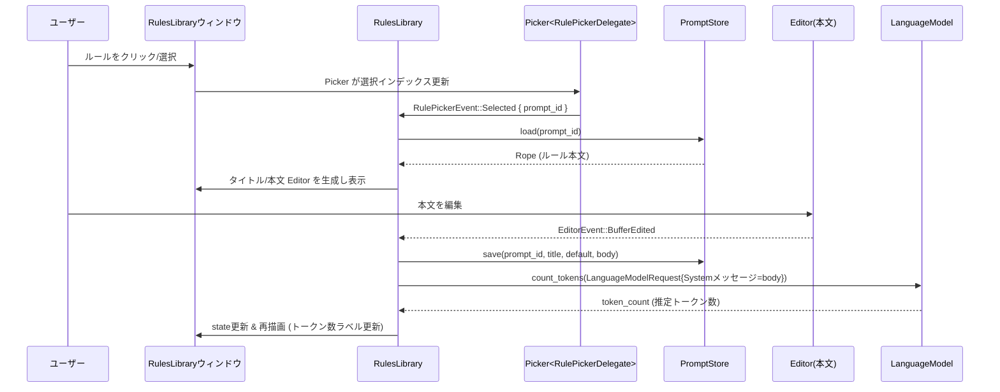

# rules_library/ ディレクトリ解説

## 1. ざっくり一言

`rules_library` クレートは、Zed 内で「ルール（LLM 用システムプロンプト）」を管理する **Rules Library ウィンドウ** を実装するモジュールです。  
ルールの検索・新規作成・編集・複製・削除・「デフォルトルール」指定・ビルトイン内容への復元・トークン数の表示などを、専用ウィンドウとエディタ UI を通して行います。

---

## 2. このモジュールの役割

### 2.1 概要

- このモジュールは **AI アシスタント用の「ルール」(prompt_store に保存されたプロンプト)** を管理するために存在します。
- `PromptStore` に保存されているルールを検索・選択し、タイトルと本文をエディタで編集できるウィンドウを提供します。
- ルール本文のトークン数を、現在のデフォルト LLM モデルを使って非同期に計測し、ヘッダーに表示します。
- さらに、ルール本文に対して inline assistant（インライン補助）を呼び出すためのフック (`InlineAssistDelegate`) を提供します。

### 2.2 アーキテクチャ内での位置づけ

このクレートは GPUI アプリケーションの 1 つのウィンドウ（`RulesLibrary`）として動き、他のクレートと連携します。

```mermaid
graph LR
  subgraph rules_library crate
    RL[RulesLibrary\n(ウィンドウルート)]
    RPD[RulePickerDelegate\n(検索/一覧)]
  end

  RL -->|保存/検索| PS[PromptStore\n(prompt_storeクレート)]
  RL -->|言語情報| LR[LanguageRegistry\n(languageクレート)]
  RL -->|トークン数計測| LMR[LanguageModelRegistry\n(language_modelクレート)]
  RL -->|テキスト編集| ED[Editor\n(editorクレート)]
  RL -->|検索UI| PK[Picker\n(pickerクレート)]
  RL -->|タイトルバー| PTB[PlatformTitleBar]
  RL -->|設定| WS[WorkspaceSettings\n(workspace/settings)]
  RL -->|インライン補助の委譲| IAD[InlineAssistDelegate\n(アプリ側実装)]
```

- `RulesLibrary` はウィンドウ全体の状態と UI を持つルートコンポーネントです。
- ルールの永続化や検索は、別クレートの `PromptStore` に委譲されています（詳細実装はこのチャンクには含まれません）。
- LLM 連携（トークン数カウント・インライン補助）は `LanguageModelRegistry` と `InlineAssistDelegate` 経由で行われます。

### 2.3 設計上のポイント

コードから読み取れる特徴を列挙します。

- **状態管理**
  - 1 ウィンドウ 1 `RulesLibrary` インスタンスという構造になっています。
  - 各ルールごとに `RuleEditor` 構造体を持ち、タイトル用エディタ・本文用エディタ・保存/トークン数計測のタスク状態をまとめています。
- **ウィンドウ管理**
  - `open_rules_library` は、既に `RulesLibrary` ウィンドウが存在する場合はそれを再利用し、なければ新規ウィンドウを開きます（単一の Rules Library ウィンドウを維持する設計です）。
- **非同期処理**
  - ルールの読み込み・保存・トークン数計測は `Task` を使った非同期処理として実装されています。
  - 保存は 500ms の間隔でまとめて行うスロットル処理、トークン数計測は 1 秒のデバウンス処理が入っています。
- **UI 構成**
  - 左側にルール一覧と検索 (`Picker`)、右側に選択中ルールのエディタという 2 ペイン構成です。
  - ビルトインルールは基本的に読み取り専用で、編集・削除の UI は出さず、「複製」「デフォルト内容へ復元」のみを提供します。
- **LLM 連携**
  - 現在選択中のルール本文に対して、デフォルト LLM モデルでトークン数を計測し、ヘッダに表示します。
  - Inline Assist アクションが発火した際には、`InlineAssistDelegate` へ処理を委譲します。

---

## 3. 主要な機能一覧

このクレートが提供する主な機能を列挙します。

- Rules Library ウィンドウの起動 / 既存ウィンドウへのフォーカス (`open_rules_library`)
- ルール一覧の検索・絞り込み (`RulePickerDelegate` + `Picker`)
- ルールの新規作成 (`NewRule` アクション / `RulesLibrary::new_rule`)
- ルールの削除 (`DeleteRule` アクション / `RulesLibrary::delete_rule`)
- ルールの複製 (`DuplicateRule` アクション / `RulesLibrary::duplicate_rule`)
- ルールの「デフォルト」フラグの切り替え (`ToggleDefaultRule` / `RulesLibrary::toggle_default_for_rule`)
- ビルトインルールの内容の復元 (`RestoreDefaultContent` / `RulesLibrary::restore_default_content`)
- ルールタイトル・本文エディタの表示・編集 (`RuleEditor` + `Editor`)
- ルール変更の自動保存（スロットル付き） (`RulesLibrary::save_rule`)
- ルール本文の LLM トークン数計測と表示 (`RulesLibrary::count_tokens`)
- Inline Assist アクションのハンドリング (`RulesLibrary::inline_assist`)

---

## 4. 関数・構造体の解説

### 4.1 型一覧（構造体・列挙体・トレイト）

| 名前 | 種別 | 役割 / 用途 |
|------|------|-------------|
| `RulesLibrary` | 構造体 | Rules Library ウィンドウ全体の状態と UI を表すルートコンポーネント |
| `RuleEditor` | 構造体 | 1 つのルールに対応するタイトル/本文エディタと、保存・トークン数計測の状態を保持する |
| `RulePickerEntry` | 列挙体 | ルール一覧（Picker）の 1 行を表す。ヘッダー・ルール・区切り線の 3 種類 |
| `RulePickerDelegate` | 構造体 | `PickerDelegate` を実装し、検索クエリに応じたルール一覧の構築や選択状態の管理を行う |
| `RulePickerEvent` | 列挙体 | Picker から `RulesLibrary` へ伝えるイベント（選択・確定・削除・デフォルト切り替え） |
| `InlineAssistDelegate` | トレイト | Inline Assist アクション発生時に、実際の AI パネルや補助 UI を開くためのフック |
| `NewRule` ほか | アクション型 | `actions!` マクロで定義されたアクション。NewRule / DeleteRule / DuplicateRule / ToggleDefaultRule / RestoreDefaultContent |

#### `InlineAssistDelegate` トレイト

```rust
pub trait InlineAssistDelegate {
    fn assist(
        &self,
        prompt_editor: &Entity<Editor>,
        initial_prompt: Option<String>,
        window: &mut Window,
        cx: &mut Context<RulesLibrary>,
    );

    fn focus_agent_panel(
        &self,
        workspace: &mut Workspace,
        window: &mut Window,
        cx: &mut Context<Workspace>,
    ) -> bool;
}
```

- `assist`: 選択中ルールの本文エディタと任意の初期プロンプトを受け取り、インラインアシスタントを起動するために呼び出されます。
- `focus_agent_panel`: 認証されていない場合に、ワークスペース側の Agent パネルへフォーカスを移すかどうかを決めるために呼び出されます。`true` を返すと「フォーカスを当てられた」と解釈されます。

### 4.2 関数詳細（代表的な 7 件）

#### `pub fn open_rules_library(...) -> Task<Result<WindowHandle<RulesLibrary>>>`

```rust
pub fn open_rules_library(
    language_registry: Arc<LanguageRegistry>,
    inline_assist_delegate: Box<dyn InlineAssistDelegate>,
    prompt_to_select: Option<PromptId>,
    cx: &mut App,
) -> Task<Result<WindowHandle<RulesLibrary>>>
```

**概要**

- Rules Library ウィンドウを開くためのエントリポイントです。
- 既に Rules Library ウィンドウが存在する場合はそれを再利用し、指定されたルールにフォーカスしてウィンドウをアクティブ化します。
- 存在しない場合は新しいウィンドウを開き、`RulesLibrary` コンポーネントを初期化します。

**引数**

| 引数名 | 型 | 説明 |
|--------|----|------|
| `language_registry` | `Arc<LanguageRegistry>` | エディタで使用する言語（Markdown など）を解決するためのレジストリ |
| `inline_assist_delegate` | `Box<dyn InlineAssistDelegate>` | Inline Assist アクション発生時の処理を外部に委譲するためのデリゲート |
| `prompt_to_select` | `Option<PromptId>` | ウィンドウを開いた際に選択しておきたいルール ID（任意） |
| `cx` | `&mut App` | アプリケーション全体の GPUI コンテキスト |

**戻り値**

- 非同期タスク `Task<Result<WindowHandle<RulesLibrary>>>` を返します。
  - 成功時: Rules Library ウィンドウのハンドル。
  - 失敗時: `anyhow::Error` を含む `Err`（PromptStore 初期化失敗など）。詳細なエラー理由はこのチャンクからは読み取れません。

**内部処理の流れ**

1. `PromptStore::global(cx)` を呼び出し、グローバルな `PromptStore` の Entity を非同期に取得する Task を準備します。
2. `cx.spawn` で非同期タスクを開始し、その中で現在開いているウィンドウの中から `RulesLibrary` を持つものを検索します。
3. 既存ウィンドウが見つかった場合:
   - 必要に応じて `load_rule(prompt_to_select, true, ...)` を呼び出し、そのルールを選択・フォーカス。
   - `window.activate_window()` でウィンドウを前面に出し、そのハンドルを返します。
4. 見つからない場合:
   - `PromptStore::global` の結果を `await` し、ストアの Entity を取得。
   - `ReleaseChannel` や `WorkspaceSettings` からウィンドウタイトルやデコレーションを決定。
   - `cx.open_window` で新しいウィンドウを開き、そのルートとして `RulesLibrary::new` を呼び出します。

**Examples（使用例）**

Rules Library を開く最小限の例です（実際にはアプリ固有の初期化が必要です）。

```rust
use std::sync::Arc;
use language::LanguageRegistry;
use rules_library::open_rules_library;

// アプリ側で用意した InlineAssistDelegate の実装
struct MyInlineAssistDelegate;
impl rules_library::InlineAssistDelegate for MyInlineAssistDelegate {
    fn assist(
        &self,
        editor: &gpui::Entity<editor::Editor>,
        initial_prompt: Option<String>,
        window: &mut gpui::Window,
        cx: &mut gpui::Context<rules_library::RulesLibrary>,
    ) {
        // ここで editor / initial_prompt を使って独自 UI を開く
    }

    fn focus_agent_panel(
        &self,
        workspace: &mut workspace::Workspace,
        window: &mut gpui::Window,
        cx: &mut gpui::Context<workspace::Workspace>,
    ) -> bool {
        // Agent パネルを前面に出せた場合に true を返す
        false
    }
}

fn show_rules_library(
    language_registry: Arc<LanguageRegistry>,  // 共有の LanguageRegistry
    cx: &mut gpui::App,                        // アプリケーションコンテキスト
) {
    let delegate: Box<dyn rules_library::InlineAssistDelegate> =
        Box::new(MyInlineAssistDelegate);      // デリゲートを Box 化

    // 特定のルールを選ばずにウィンドウを開く
    let _task = open_rules_library(language_registry, delegate, None, cx);
    // Task は GPUI が管理し、完了時にウィンドウハンドルが得られます
}
```

**Errors / Panics**

- `PromptStore::global(cx)` の内部エラーや、ウィンドウのオープンに失敗した場合に `Err` を返す可能性があります。
- この関数内で `panic!` を明示的に呼び出している箇所はありません。

**Edge cases（エッジケース）**

- 既に Rules Library ウィンドウが存在する場合、常に最初に見つかったウィンドウ 1 つが再利用されます（複数同時には開かれません）。
- `prompt_to_select` に存在しない `PromptId` を渡した場合の挙動は、このファイル単体からは断定できません（`load_rule` 内でメタデータが見つからなければ何もしないため、選択されないと考えられます）。

**使用上の注意点**

- 実行前に `rules_library::init(cx)` で `PromptStore` を初期化しておくことが前提です（`init` は `prompt_store::init` を呼ぶラッパーです）。
- GPUI のスレッドモデル上、`cx` はメインスレッドの UI コンテキストである必要があります。

---

#### `fn RulesLibrary::new(...) -> Self`

**概要**

- `cx.open_window` のルートとして呼ばれ、`RulesLibrary` インスタンスを構築します。
- ルール検索用の `Picker` と、そのデリゲート `RulePickerDelegate` を作成し、Picker からのイベント購読を設定します。

**引数（主要なもの）**

| 引数名 | 型 | 説明 |
|--------|----|------|
| `store` | `Entity<PromptStore>` | ルールデータを読み書きするグローバルストア |
| `language_registry` | `Arc<LanguageRegistry>` | ルール本文エディタの言語設定に使用 |
| `inline_assist_delegate` | `Box<dyn InlineAssistDelegate>` | Inline Assist 連携用デリゲート |
| `rule_to_select` | `Option<PromptId>` | 初期選択したいルール（未使用のインデックス計算のみ） |
| `window` | `&mut Window` | この Rules Library の属するウィンドウ |
| `cx` | `&mut Context<Self>` | `RulesLibrary` 用のコンテキスト |

**内部処理の流れ**

1. `rule_to_select` が指定されていれば、`store.read(cx).all_prompt_metadata()` からインデックスを計算していますが、現状 `_selected_index` として捨てられています。
2. `RulePickerDelegate` に `store` を渡して初期化します（選択インデックス 0、空のエントリ）。
3. `Picker::list(picker_delegate, window, cx)` で Picker UI を作成し、モーダルを無効化 (`modal(false)`)、高さ制限なし (`max_height(None)`) に設定します。
4. 非 macOS では `PlatformTitleBar` を作成して `title_bar` に保持します。
5. `cx.subscribe_in(&picker, window, Self::handle_picker_event)` で Picker からの `RulePickerEvent` を購読します。

**使用上の注意点**

- `RulesLibrary::new` は通常アプリケーションコードから直接呼ぶことはなく、`open_rules_library` 経由で呼ばれます。
- `RulePickerDelegate` の初期 `filtered_entries` は空なので、実際の一覧表示には `update_matches` で検索を走らせる必要があります（Picker 側が自動で呼び出します）。

---

#### `pub fn new_rule(&mut self, window: &mut Window, cx: &mut Context<Self>)`

**概要**

- 新しいルールを作成し、そのルールを選択・編集状態にします。
- 既に「タイトルなし」のルールが 1 つ存在する場合は、それを再利用します。

**内部処理の流れ**

1. `self.store.read(cx).first()` で最初のルールのメタデータを取得。
   - そのタイトルが `None`（無題）であれば、それを再利用し `load_rule(metadata.id, true, ...)` を呼び出して終了します。
2. 再利用できるルールがない場合:
   - `PromptId::new()` で新しい ID を作成。
   - `store.save(prompt_id, None, false, "".into(), cx)` を呼び、タイトルなし・デフォルトフラグ false・空本文のルールを保存する Future を得ます。
   - `picker.refresh(window, cx)` を呼んで一覧を更新。
   - 非同期タスクで `save.await` 完了後に `load_rule(prompt_id, true, ...)` を呼び、エディタを開きます。

**Examples（使用例）**

この関数自体は UI アクションから呼ばれる想定で、直接呼び出すことは少ないです。  
ウィンドウ内では `NewRule` アクションに紐付いています。

```rust
// Render 実装内（一部抜粋）
.on_action(cx.listener(|this, &NewRule, window, cx| this.new_rule(window, cx)))
```

**Edge cases**

- `store.first()` が `None`（ルールが 1 つもない）場合は、必ず新規作成ルートに入ります。
- 既存ルールが多くても、無題ルールが 1 つあればそれを再利用するので、「Untitled」ルールが増えすぎないようになっています。

**使用上の注意点**

- ビルトインルールにはタイトルがある前提で、この再利用ロジックの対象にはならないと考えられます（コード中でビルトインかどうかはチェックしていないため、正確な仕様は PromptStore 側に依存します）。

---

#### `pub fn load_rule(&mut self, prompt_id: PromptId, focus: bool, window: &mut Window, cx: &mut Context<Self>)`

**概要**

- 指定された `PromptId` のルールを読み込み、タイトル/本文エディタを準備して `active_rule_id` として選択します。
- 既に `rule_editors` に存在する場合は再利用し、必要であれば本文エディタへフォーカスだけ行います。

**引数**

| 引数名 | 型 | 説明 |
|--------|----|------|
| `prompt_id` | `PromptId` | 読み込むルールを識別する ID |
| `focus` | `bool` | 読み込み後に本文エディタへフォーカスするかどうか |
| `window` | `&mut Window` | ウィンドウコンテキスト |
| `cx` | `&mut Context<Self>` | `RulesLibrary` のコンテキスト |

**内部処理の流れ**

1. `self.rule_editors.get(&prompt_id)` をチェック。
   - 既にエディタが存在する場合:
     - `focus == true` であれば本文エディタのフォーカスを取得。
     - `set_active_rule(Some(prompt_id), ...)` を呼び出して選択状態を更新。
2. エディタが未作成だが、`store.read(cx).metadata(prompt_id)` が存在する場合:
   - `self.store.read(cx).load(prompt_id, cx)` で本文の読み込みタスクを取得。
   - 非同期タスク `pending_load` を起動し、その中で:
     - ルール本文の読み込み (`rule.await`) と Markdown 言語の取得を行う。
     - 成功時に:
       - タイトル用 `Editor::single_line` を作成し、ビルトインのときは読み取り専用に設定。
       - 本文用 `Editor::for_buffer` を作成し、`Buffer::local(rule, cx)` に Markdown 言語をセット。
       - `prompt_id.can_edit()` が `false` の場合は本文エディタを読み取り専用に設定。
       - タイトル/本文エディタにイベント購読を設定（`handle_rule_title_editor_event` / `handle_rule_body_editor_event`）。
       - `rule_editors.insert(prompt_id, RuleEditor { ... })` で保存。
       - `set_active_rule(Some(prompt_id), ...)` と `count_tokens(prompt_id, ...)` を呼びます。
     - エラー時は `log::error!` でログ出力のみ行います。

**Examples（使用例）**

この関数も UI・Picker イベントから内部的に呼ばれます。

```rust
// Picker からのイベントハンドラ
fn handle_picker_event(&mut self, _, event: &RulePickerEvent, window: &mut Window, cx: &mut Context<Self>) {
    match event {
        RulePickerEvent::Selected { prompt_id } => {
            self.load_rule(*prompt_id, false, window, cx);
        }
        RulePickerEvent::Confirmed { prompt_id } => {
            self.load_rule(*prompt_id, true, window, cx);
        }
        // ...
    }
}
```

**Edge cases**

- `PromptStore` にメタデータが存在しない `PromptId` を渡した場合は何も行いません。
- ルール本文の読み込みに失敗した場合（`rule.await` が `Err`）、エラーはログ出力されますが UI 上には表示されません（コメントにも TODO が記載されています）。

**使用上の注意点**

- この関数を直接呼び出す場合は、事前に `PromptStore` に該当する `PromptId` のメタデータが存在することが前提です。
- `focus` を `true` にすると本文エディタにフォーカスが移るため、呼び出し元のフォーカス制御と競合しないように注意が必要です。

---

#### `pub fn delete_rule(&mut self, prompt_id: PromptId, window: &mut Window, cx: &mut Context<Self>)`

**概要**

- 指定されたルールを削除する UI 操作です。
- 確認ダイアログを表示し、ユーザーが "Delete" を選択した場合に `PromptStore` から削除し、内部状態を更新します。

**内部処理の流れ**

1. `self.store.read(cx).metadata(prompt_id)` でメタデータを取得。
   - 見つからなければ何もしません。
2. `window.prompt(...)` で Warning レベルの確認ダイアログを表示。
   - メッセージは `"Are you sure you want to delete {タイトル}"`。
3. 非同期タスクで `confirmation.await` の結果を待ちます。
   - `Ok(0)`（最初のボタン "Delete" が選択された）ときのみ削除処理を実行。
4. 削除処理:
   - `active_rule_id` が当該 `prompt_id` であれば `set_active_rule(None, ...)` で選択を解除。
   - `self.rule_editors.remove(&prompt_id)` でエディタ状態を破棄。
   - `store.update(... store.delete(prompt_id, cx))` を呼び、`PromptStore` から削除。
   - `picker.refresh(window, cx)` で一覧を更新し、`cx.notify()` で再描画を促します。

**Edge cases**

- ビルトインルールに対してこの関数を呼ぶかどうかは UI に依存します。
  - このファイルでは、ビルトインルールには削除ボタンを表示していないため、通常の操作では呼ばれない設計になっています。
- `window.prompt` がキャンセルされた場合（"Cancel" ボタンなど）、削除は行われません。

**使用上の注意点**

- 内部で非同期処理を行うため、呼び出し直後にはまだ削除が完了していない可能性があります。
- 削除後に他の UI にも影響がある場合は（たとえば選択中のスレッドに紐づく等）、`PromptStore` 側の挙動も確認する必要があります（このチャンクには記載がありません）。

---

#### `pub fn inline_assist(&mut self, action: &InlineAssist, window: &mut Window, cx: &mut Context<Self>)`

**概要**

- 選択中ルールの本文に対して Inline Assist アクションを実行するためのエントリです。
- LLM のプロバイダが認証済みの場合は `InlineAssistDelegate::assist` を呼び出し、認証されていない場合は Agent パネルへのフォーカスを試みます。

**引数**

| 引数名 | 型 | 説明 |
|--------|----|------|
| `action` | `&InlineAssist` | ユーザーが起動した Inline Assist アクション。初期プロンプト等を含む |
| `window` | `&mut Window` | Rules Library ウィンドウ |
| `cx` | `&mut Context<Self>` | RulesLibrary コンテキスト |

**内部処理の流れ**

1. `active_rule_id` が設定されているか確認。
   - なければ `cx.propagate()` して、自分では処理せず他のリスナへ委ねます。
2. `LanguageModelRegistry::read_global(cx).inline_assistant_model()` からインラインアシスタント用モデル設定を取得。
   - 見つからなければ何もせず終了。
3. `action.prompt.clone()` を `initial_prompt` として取得。
4. `provider.is_authenticated(cx)` が `true` の場合:
   - `self.inline_assist_delegate.assist(rule_editor, initial_prompt, window, cx)` を呼び出し、実際の補助 UI をデリゲートに任せます。
5. 認証されていない場合:
   - `cx.windows()` で全ウィンドウを列挙。
   - `window.downcast::<MultiWorkspace>()` できるウィンドウを探し、その中の `Workspace` に対して `focus_agent_panel` を呼び出します。
   - いずれかが `true` を返した場合、その時点で処理を終了します。

**Examples（使用例）**

Inline Assist はアクションとしてバインドされており、UI から自動的に呼び出されます。

```rust
// ルール本文エリアのラッパーでアクションを捕捉
div()
    .on_action(cx.listener(Self::focus_picker))
    .on_action(cx.listener(Self::inline_assist))    // InlineAssist を処理
    .on_action(cx.listener(Self::move_up_from_body))
    // ...
```

**Edge cases**

- `active_rule_id` がない状態で Inline Assist をトリガーすると、Rules Library は処理を行わず、他のアクションリスナへ伝播します。
- `inline_assistant_model` が設定されていない場合や、`provider.is_authenticated` が `false` の場合は、Agent パネルへフォーカスしようと試みるだけで、実際のアシストは行われません。

**使用上の注意点**

- 実際のアシスタント動作は `InlineAssistDelegate` の実装次第です。このトレイトを実装する側で、エディタ内容・初期プロンプトの扱いを決める必要があります。
- この関数は UI アクションの一部として呼ばれる想定であり、通常はアプリコードから直接呼び出す必要はありません。

---

#### `fn count_tokens(&mut self, prompt_id: PromptId, window: &mut Window, cx: &mut Context<Self>)`

**概要**

- 指定されたルールの本文から LLM 用のメッセージを組み立て、現在のデフォルトモデルでトークン数を計測し、`RuleEditor.token_count` に保存します。
- 計測は 1 秒のデバウンスをかけて非同期に行われ、結果は UI に表示されます。

**内部処理の流れ**

1. `LanguageModelRegistry::read_global(cx).default_model()` でデフォルトモデルを取得。
   - 見つからなければ何もせず終了。
2. `self.rule_editors.get_mut(&prompt_id)` から対象ルールのエディタを取得。
3. 本文エディタのバッファから `Rope` をクローン (`body`)。
4. `cx.spawn_in(window, async move |this, cx| { ... })` で非同期タスクを起動し、`rule.pending_token_count` に保存。
5. タスク内で:
   - `DEBOUNCE_TIMEOUT`（1 秒）だけ待機。
   - `model.count_tokens(LanguageModelRequest { ... })` を `cx.update` 経由で呼び出し、`await` してトークン数を取得。
   - `this.update` で `rule_editor.token_count = Some(token_count)` に設定し、`cx.notify()` で再描画を促進。

**Edge cases**

- デフォルトモデルが設定されていない場合は何も行いません。
- 連続した編集によるトークン数計測の呼び出しは、デバウンスにより一定時間まとめられますが、厳密なキャンセル制御の有無はこのコードだけでは分かりません。
- `model.count_tokens` のエラーは `.log_err().await` によってログ出力されますが、UI には表示されません。

**使用上の注意点**

- 計測コストはモデルに依存します。頻繁な呼び出しを想定してデバウンスが入っていますが、非常に大きなルール本文や重いモデルを使う場合は応答性への影響を考慮する必要があります。
- `PromptId` に対応する `RuleEditor` が存在しない状態で呼び出すと、何も行わずに終了します。

---

### 4.3 その他の関数（代表的なもの）

ここでは、詳細説明を省略したがよく使われるメソッドをまとめます（すべてを網羅しているわけではありません）。

| 関数名 | 役割（1 行） |
|--------|--------------|
| `init(cx: &mut App)` | `prompt_store::init(cx)` を呼び出すラッパー。Rules Library 利用前の初期化を行う |
| `save_rule(&mut self, prompt_id, window, cx)` | タイトル/本文の変更を 500ms ごとにまとめて `PromptStore::save` する自動保存ロジック |
| `delete_active_rule(&mut self, window, cx)` | 現在選択中のルールに対して `delete_rule` を適用する |
| `duplicate_rule(&mut self, prompt_id, window, cx)` | 指定ルールをコピーし、タイトルに `" copy"`（および連番）を付けた新ルールを作成する |
| `duplicate_active_rule(&mut self, window, cx)` | 現在選択中ルールの複製 |
| `toggle_default_for_rule(&mut self, prompt_id, window, cx)` | ルールのメタデータの `default` フラグをトグルし、一覧を更新する |
| `toggle_default_for_active_rule(&mut self, window, cx)` | 選択中ルールに対して `toggle_default_for_rule` を適用する |
| `restore_default_content(&mut self, prompt_id, window, cx)` | ビルトインルールの本文を `default_content()` で上書きする |
| `restore_default_content_for_active_rule(&mut self, window, cx)` | 選択中のビルトインルールの内容をデフォルトに戻す |
| `handle_rule_title_editor_event` / `handle_rule_body_editor_event` | 編集エディタからの `EditorEvent` を受け取り、自動保存・トークン数計測・選択状態の整形を行う |
| `render_rule_list(&mut self, cx)` | 左側のルール一覧ペインを描画する |
| `render_active_rule(&mut self, cx)` | 右側の選択中ルール編集ペインを描画する |
| `impl Render for RulesLibrary::render(...)` | ウィンドウ全体のレイアウトとアクションバインドを組み立てる |

---

## 5. データフロー

ここでは、ユーザーがルールを選択・編集し、トークン数が更新されるまでの典型的な流れを示します。

### 5.1 概要

1. ユーザーが Rules Library ウィンドウを開き、一覧からルールを選択します。
2. Picker が `RulePickerEvent::Selected` を `RulesLibrary` に送信し、`load_rule` が呼ばれます。
3. ルールの本文が `PromptStore` から読み込まれ、タイトル/本文エディタが生成されます。
4. ユーザーが本文を編集すると `EditorEvent::BufferEdited` が発生し、自動保存とトークン数計測が非同期で行われます。
5. モデルから返ってきたトークン数が UI に表示されます。

### 5.2 シーケンス図



このように、Rules Library は `PromptStore` と `LanguageModel` の両方を非同期に呼び出しながら、エディタの状態と UI を同期させています。

---

## 6. 使い方（How to Use）

### 6.1 基本的な使用方法

外部からこのクレートを利用する際の最小構成は次の 2 点です。

1. アプリ起動時に `rules_library::init(cx)` を呼び、`PromptStore` を初期化する。
2. ユーザー操作に応じて `open_rules_library` を呼び、ウィンドウを開く。

```rust
use std::sync::Arc;
use gpui::App;
use language::LanguageRegistry;
use rules_library::{init as init_rules_library, open_rules_library, InlineAssistDelegate};

// 1. 起動時の初期化
fn init_app(cx: &mut App) {
    // PromptStore など Rules Library が依存するリソースを初期化
    init_rules_library(cx);
}

// 2. Rules Library を開くハンドラ
fn on_open_rules_library(
    language_registry: Arc<LanguageRegistry>, // 共有している LanguageRegistry
    cx: &mut App,                             // アプリケーションコンテキスト
) {
    // アプリ側で InlineAssistDelegate を実装しておく
    struct MyDelegate;
    impl InlineAssistDelegate for MyDelegate {
        fn assist(
            &self,
            _editor: &gpui::Entity<editor::Editor>,
            _initial_prompt: Option<String>,
            _window: &mut gpui::Window,
            _cx: &mut gpui::Context<rules_library::RulesLibrary>,
        ) {}
        fn focus_agent_panel(
            &self,
            _workspace: &mut workspace::Workspace,
            _window: &mut gpui::Window,
            _cx: &mut gpui::Context<workspace::Workspace>,
        ) -> bool { false }
    }

    let delegate: Box<dyn InlineAssistDelegate> = Box::new(MyDelegate);

    // 任意のタイミング（メニュー/ショートカットなど）で呼び出す
    let _task = open_rules_library(language_registry, delegate, None, cx);
}
```

Rules Library ウィンドウ内部での操作（新規/削除など）は、すべてアクション (`NewRule`, `DeleteRule`, …) とボタンにバインドされているため、外部から直接メソッドを呼び出す必要はありません。

### 6.2 よくある使用パターン

#### 特定のルールを選択した状態で開く

例えば、別の画面から「このルールを編集したい」というケースで、`prompt_to_select` に `PromptId` を渡します。

```rust
fn edit_specific_rule(
    language_registry: Arc<LanguageRegistry>, // LanguageRegistry
    delegate: Box<dyn InlineAssistDelegate>,  // InlineAssistDelegate 実装
    prompt_id: PromptId,                      // 編集したいルール ID
    cx: &mut App,                             // App コンテキスト
) {
    let _task = open_rules_library(
        language_registry,
        delegate,
        Some(prompt_id),  // このルールを選んだ状態で開く
        cx,
    );
}
```

#### Inline Assist の活用

Inline Assist 自体はこのクレートの外側（`InlineAssistDelegate` 実装）で行いますが、Rules Library 側では本文エディタと optional な初期プロンプトを提供してくれます。  
たとえば「このルールをもっと短く要約して」というようなアクションを実装するときに利用できます。

### 6.3 よくある間違い

- **`rules_library::init` を呼び忘れる**
  - `PromptStore::global(cx)` を呼ぶ前に、`prompt_store::init(cx)` 相当の初期化が必要です。`rules_library::init(cx)` はそのラッパーなので、アプリ起動時に一度呼んでおく必要があります。
- **`InlineAssistDelegate` を未実装のままにする**
  - `open_rules_library` の呼び出しに `InlineAssistDelegate` 実装が必要です。適当なダミー実装でもよいので、`assist` / `focus_agent_panel` を実装する必要があります。
- **デフォルトモデル未設定でトークン数を期待する**
  - `count_tokens` は `LanguageModelRegistry::default_model()` が `Some` のときだけ動きます。モデルが未設定の場合、UI にトークン数は表示されません。

### 6.4 使用上の注意点（まとめ）

- **前提条件**
  - `rules_library::init(cx)` をアプリ起動時に呼ぶこと。
  - `LanguageRegistry` と `LanguageModelRegistry` が適切に初期化されていること。
- **ビルトインルールの扱い**
  - `PromptId::is_built_in()` が `true` のルールは基本的に読み取り専用です。
  - ビルトインルールは UI 上で削除ボタンが表示されず、「複製」と「デフォルト内容への復元」のみ提供されます。
- **自動保存のタイミング**
  - タイトル/本文編集時、保存は即時ではなく 500ms スロットル付きで行われます。そのため、直後にストア側の状態を参照すると、まだ更新されていない可能性があります。
- **非同期処理と UI**
  - ルールの読み込み/保存/トークン数計測はすべて非同期で行われるため、短時間に多数の操作を行うと結果の反映タイミングにラグが生じることがあります。
- **スレッド安全性**
  - `Entity<T>` や `Context<T>` は GPUI のルールに従って使用する必要があり、通常 UI スレッド以外から直接操作してはいけません（このファイル内でもすべて `cx.update` / `cx.spawn_in` 経由で操作されています）。

---

## 7. 関連ファイル

このクレートおよびその周辺で密接に関係するファイル・クレートをまとめます。

| パス / クレート | 役割 / 関係 |
|-----------------|------------|
| `rules_library/Cargo.toml` | 本クレートの定義。`anyhow`, `editor`, `gpui`, `language`, `language_model`, `prompt_store`, `workspace` などへの依存を宣言しています。 |
| `rules_library/src/rules_library.rs` | 本レポートで解説した Rules Library ウィンドウと関連ロジックの実装ファイルです。 |
| `prompt_store` クレート（パスはこのチャンクには未登場） | `PromptStore`, `PromptId`, `PromptMetadata` などを提供し、ルールの保存・検索・削除・メタデータ管理を担います。 |
| `language` クレート | `LanguageRegistry`, `Buffer`, `SoftWrap` などを提供し、ルール本文エディタの言語設定や表示に関与します。 |
| `language_model` クレート | `LanguageModelRegistry`, `ConfiguredModel`, `LanguageModelRequest` などを提供し、トークン数計測および Inline Assist 用モデル構成を扱います。 |
| `workspace` / `multi_workspace` 関連クレート | `MultiWorkspace`, `Workspace`, `WorkspaceSettings`, `client_side_decorations` などを提供し、ウィンドウ装飾や Agent パネルへのフォーカス制御に利用されています。 |
| `zed_actions` クレート | `InlineAssist` や `zed_actions::editor::MoveDown/MoveUp` などのアクション型を提供し、Rules Library 内でのキーボード操作やアシスト呼び出しに使われます。 |

このクレートを理解・変更する際には、特に `prompt_store` と `language_model` の API がどのように使われているかを合わせて確認すると、データの流れと LLM 連携の全体像を把握しやすくなります。
