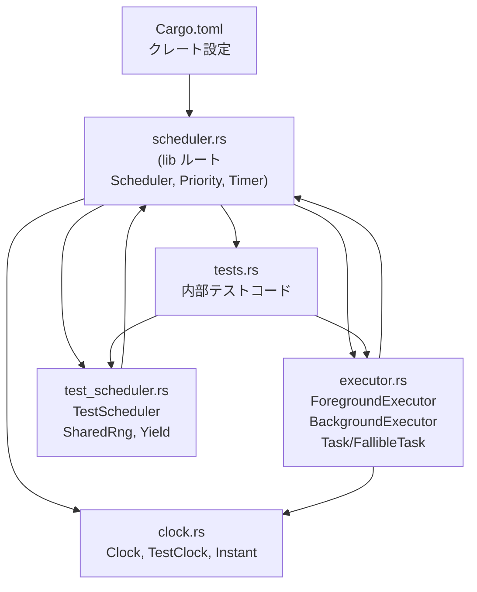
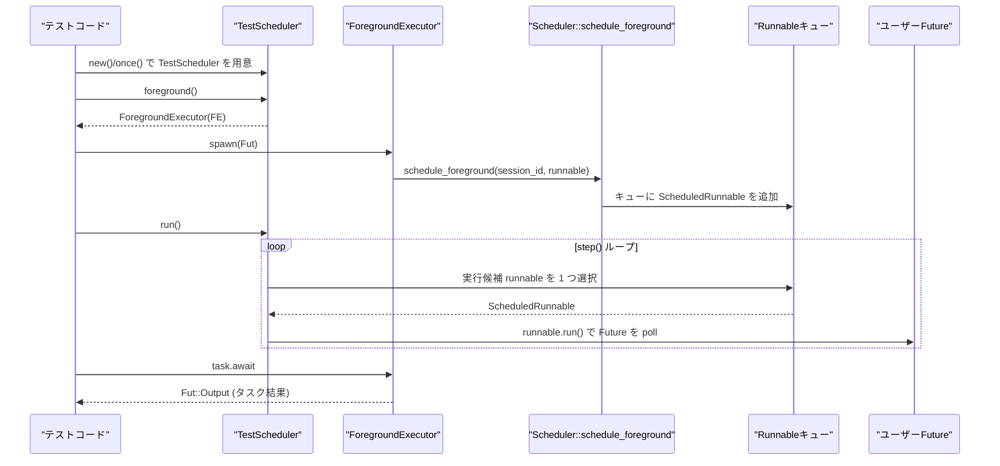

# scheduler/ ディレクトリ解説

## 1. ざっくり一言

`scheduler` クレートは、

- 抽象的なスケジューラ用トレイト (`Scheduler`)
- それを使う実行器 (`ForegroundExecutor` / `BackgroundExecutor`)
- 時刻抽象 (`Clock` / `TestClock`)
- テスト用の決定論的スケジューラ (`TestScheduler`)

を提供する、非同期タスク実行とテスト向けのユーティリティ群です。

---

## 2. このモジュールの役割

### 2.1 概要

- このディレクトリは、非同期タスクを「セッション単位」や「優先度付き」でスケジューリングするための基盤を提供します。
- プロダクションコードからは `Scheduler` トレイトを経由して利用し、テストではその具象実装である `TestScheduler` を使って決定論的な実行を行います。
- 時刻やタイマーを差し替え可能な `Clock` 抽象により、「時間が進む」ことも制御しながらテストできます。

### 2.2 アーキテクチャ内での位置づけ

主要ファイル間の依存関係は次のようになっています。



- `scheduler.rs` が lib ルートで、トレイトや基本型を定義し、他モジュールを再エクスポートします。
- `executor.rs` は `Scheduler` トレイトに依存してタスクの spawn / block を提供します。
- `test_scheduler.rs` は `Scheduler` を実装したテスト専用スケジューラです。
- `clock.rs` は `Clock` 抽象とテスト用 `TestClock` を提供します。
- `tests.rs` はこのクレート自身の動作確認用テストです。

### 2.3 設計上のポイント

- **インターフェースと実装の分離**  
  - `Scheduler` トレイトと `ForegroundExecutor` / `BackgroundExecutor` は実装に依存せず、任意のスケジューラ実装に乗せ替え可能です。
  - 本チャンクでは具象実装として `TestScheduler` のみが登場します。

- **時間抽象 (`Clock`) の導入**  
  - 実行時刻 (`Instant`) と UTC 時刻 (`DateTime<Utc>`) を抽象化し、`TestClock` で自由に進めたり固定したりできます。
  - タイマー (`Timer`) はこの `Clock` に基づき、テストでは「時間をジャンプさせる」ことが可能です。

- **決定論的かつランダム化可能なスケジューリング**  
  - セッション単位の順序保証（同一セッション内は順序維持）と、優先度 (`Priority`) による重み付きランダム選択に対応しています。
  - `TestSchedulerConfig` により「順序ランダム化のオン・オフ」「タイムアウトのチック数」などを制御します。

- **非決定性検出**  
  - スケジューラ生成スレッドを記録し、別スレッドからの waker 操作を検出して「テストが非決定的である」と報告します。
  - 必要に応じて `allow_parking` や環境変数 `PENDING_TRACES` で挙動とトレース収集を切り替えます。

- **テスト専用の実行器**  
  - `ForegroundExecutor` は `Rc` を使ったマーカーにより `Send` ではなく、単一スレッド（たとえば UI スレッド風）専用であることを型レベルで表現しています。
  - `BackgroundExecutor` は `Send` なタスクを別スレッドやリアルタイムスレッドに乗せるための実行器です。

---

## 3. 主要な機能一覧

- `Clock` トレイト / `TestClock`:
  - 現在の `Instant` と UTC 時刻を提供する抽象と、そのテスト用実装。
- `Priority`:
  - 背景タスクの優先度と、その重み（確率的スケジューリング用）を表す列挙体。
- `RunnableMeta`:
  - タスクのスパン元ソース位置（`Location`）を保持するメタデータ。
- `Scheduler` トレイト:
  - `block`, `schedule_foreground`, `schedule_background_with_priority`, `spawn_realtime`, `timer`, `clock` など、スケジューラに必要な操作のインターフェース。
- `Timer`:
  - 指定時間経過で完了する `Future<Output = ()>` 型。内部的には oneshot チャネルで実装されています。
- `ForegroundExecutor`:
  - 「セッション ID」付きで非 `Send` なタスクを `Scheduler` 上に spawn し、`block_on` / `block_with_timeout` でそれを待ち合わせるための実行器。
- `BackgroundExecutor`:
  - `Send` なタスクを優先度付きでバックグラウンドスケジューリングしたり、専用リアルタイムスレッドで実行したりするための実行器。
- `Task<T>` / `FallibleTask<T>`:
  - `async_task` クレートのタスクをラップした `Future`。
  - ドロップでキャンセル、`detach` でバックグラウンド継続といった操作を提供します。
- `TestScheduler` / `TestSchedulerConfig`:
  - テスト用の決定論的スケジューラ実装と、その設定（シード、ランダム化有無、パーキング許可など）。
  - `once` / `many` ヘルパーで簡易にテストを実行できます。
- `SharedRng` / `Yield`（`test_scheduler.rs` 内）:
  - 共有 RNG の薄いラッパーと、「指定回数だけ Pending を返して yield する」テスト用 Future。

---

## 4. 関数・構造体の解説

### 4.1 主な型一覧

| 名前 | 種別 | 定義ファイル | 役割 / 用途 |
|------|------|--------------|-------------|
| `Clock` | トレイト | `clock.rs` | 現在時刻 (`Instant`) と UTC 時刻を取得する抽象。 |
| `TestClock` | 構造体 | `clock.rs` | 時刻を任意に進められるテスト用 `Clock` 実装。 |
| `Priority` | 列挙体 | `scheduler.rs` | 背景タスク用の優先度（RealtimeAudio/High/Medium/Low）。 |
| `RunnableMeta` | 構造体 | `scheduler.rs` | spawn 元ソース位置（`Location`）を保持するメタ情報。 |
| `Scheduler` | トレイト | `scheduler.rs` | スケジューラの基本操作（ブロック、スケジューリング、タイマー等）。 |
| `SessionId` | 構造体 | `scheduler.rs` | フォアグラウンドタスクの「セッション」を識別する ID。 |
| `Timer` | 構造体 + `Future` | `scheduler.rs` | 指定時間後に Ready になる Future。 |
| `ForegroundExecutor` | 構造体 | `executor.rs` | 非 `Send` なタスクをセッション単位で spawn / block する実行器。 |
| `BackgroundExecutor` | 構造体 | `executor.rs` | `Send` なタスクをバックグラウンドスレッドで実行する実行器。 |
| `Task<T>` | 構造体 + `Future` | `executor.rs` | バックグラウンド or ローカルタスクを表す Future。ドロップでキャンセル。 |
| `FallibleTask<T>` | 構造体 + `Future` | `executor.rs` | キャンセル時に panic せず `Option<T>` を返すタスク。 |
| `TestScheduler` | 構造体 | `test_scheduler.rs` | テスト用 `Scheduler` 実装。決定論的／ランダム化スケジューリングを提供。 |
| `TestSchedulerConfig` | 構造体 | `test_scheduler.rs` | `TestScheduler` の設定値（seed や allow_parking など）。 |
| `SharedRng` | 構造体 | `test_scheduler.rs` | `Arc<Mutex<StdRng>>` の薄いラッパー。簡易な乱数 API を提供。 |
| `Yield` | 構造体 + `Future` | `test_scheduler.rs` | 指定回数だけ Pending を返してスケジューラに制御を戻すテスト用 Future。 |

※ `tests.rs` 内にもテスト専用の `Yield` 構造体がありますが、これはテストモジュール内ローカルであり、公開 API ではありません。

---

### 4.2 重要な関数 / メソッド詳細（7件）

#### 4.2.1 `ForegroundExecutor::spawn<F>(&self, future: F) -> Task<F::Output>`

**概要**

- フォアグラウンド（セッションに紐づく）タスクを現在のスレッド向けに spawn します。
- タスクは `Send` である必要はなく、`Rc` などスレッドローカルな値を安全に扱えます。

**シグネチャ**

```rust
impl ForegroundExecutor {
    #[track_caller]
    pub fn spawn<F>(&self, future: F) -> Task<F::Output>
    where
        F: Future + 'static,
        F::Output: 'static,
    { /* ... */ }
}
```

**引数**

| 引数名 | 型 | 説明 |
|--------|----|------|
| `future` | `F` | 実行したい非同期処理。`'static` だが `Send` ではなくてよい。 |

**戻り値**

- `Task<F::Output>`  
  spawn されたタスクを表す Future。
  `.await` すると `F::Output` が得られます。
- `Task` をドロップすると、その時点でタスクはキャンセルされます。
  継続させたい場合は `detach()` を呼びます。

**内部処理の流れ**

1. `session_id` と `Arc<dyn Scheduler>` をローカルにコピーします。
2. `Location::caller()` で呼び出し元のソース位置を取得し、`RunnableMeta` に詰めます。
3. `spawn_local_with_source_location` を呼び出し、`async_task::Runnable` と `async_task::Task` を生成します。
   - このとき `schedule` クロージャには `scheduler.schedule_foreground(session_id, runnable)` を渡します。
4. `runnable.schedule()` を呼び出して、スケジューラにこのタスクを登録します。
5. `TaskState::Spawned(task)` でラップした `Task` を返します。

**使用例**

単純に値を返すフォアグラウンドタスクを spawn して待ちます。

```rust
use scheduler::{TestScheduler, ForegroundExecutor};          // 本クレートの型をインポート
use std::sync::Arc;

#[test]
fn example_foreground_spawn() {
    // TestScheduler::once で一度だけテストを走らせる                      // once でテストスケジューラを1回実行
    let result = TestScheduler::once(async |scheduler: Arc<TestScheduler>| {
        let foreground = scheduler.foreground();             // フォアグラウンド実行器を取得
        let task = foreground.spawn(async { 42 });           // 非同期に 42 を返すタスクを spawn
        task.await                                          // タスク完了まで待つ
    });
    assert_eq!(result, 42);                                 // 結果を検証
}
```

**Errors / Panics**

- 内部で使用する `spawn_local_with_source_location` は、タスクが spawn されたスレッドと異なるスレッドで poll / drop された場合に panic します。
  - これにより `ForegroundExecutor` が本来想定していないスレッドから利用された場合のバグを検出します。

**Edge cases**

- タスク内で panic が起きた場合の挙動は `async_task` クレートの仕様に依存します（このチャンクには詳細な記述はありません）。
- `Task` を `.await` せずにドロップした場合、そのタスクはキャンセルされ、その後の結果取得はできません。

**使用上の注意点**

- `ForegroundExecutor` 自体が `Send` ではないため、別スレッドにムーブして使うことはできません。
- 同一 `session_id` 内ではタスクは順序を保って実行されますが、セッション間や背景タスクとの順序はランダム化設定や優先度により変化します。

---

#### 4.2.2 `ForegroundExecutor::block_on<Fut>(&self, future: Fut) -> Fut::Output`

**概要**

- 渡された Future が完了するまでスケジューラを回しながらブロックし、結果を同期的に取得します。
- 内部的には `Scheduler::block` を使用します。

**シグネチャ**

```rust
impl ForegroundExecutor {
    pub fn block_on<Fut: Future>(&self, future: Fut) -> Fut::Output { /* ... */ }
}
```

**引数**

| 引数名 | 型 | 説明 |
|--------|----|------|
| `future` | `Fut` | 完了を待ちたい Future。 |

**戻り値**

- `Fut::Output`  
  Future の完了結果。

**内部処理の流れ**

1. `Cell<Option<Fut::Output>>` を用意し、結果を格納するためのスロットとします。
2. `future` をラップした補助 Future を作り、`future.await` の結果を `Cell` に格納します。
3. その補助 Future を `Pin<&mut dyn Future<Output = ()>>` に変換し、`scheduler.block(Some(self.session_id), ...)` に渡します。
4. `Scheduler::block` が Future を完了させて戻ることを前提に、`Cell` から値を取り出して返します。
   - `None` の場合は `expect("block_on future did not complete")` で panic します。

**使用例**

```rust
use scheduler::{TestScheduler};
use std::sync::Arc;

#[test]
fn example_block_on() {
    let scheduler = Arc::new(TestScheduler::new(Default::default())); // デフォルト設定で TestScheduler を生成
    let foreground = scheduler.foreground();                          // フォアグラウンド実行器を取得

    let value = foreground.block_on(async {
        // ここは通常の async コンテキストと同様に書ける                     // ブロック中に実行される非同期処理
        1 + 2
    });

    assert_eq!(value, 3);                                             // 非同期計算結果を同期的に検証
}
```

**Errors / Panics**

- Future が完了しなかった場合（`Scheduler::block` の実装が途中で戻った場合）、`"block_on future did not complete"` というメッセージで panic します。
- デフォルト設定の `TestScheduler` で、完了しない Future を渡すと、`park` 中に `"Parking forbidden..."` 系の panic が発生します（`test_parking_panics` 参照）。

**Edge cases**

- `allow_parking` が `false` で、Future が一切進捗せずタイマーも存在しない場合、決定論的モードの仕様により即座に panic します。
- `allow_parking` が `true` の場合、最大 15 秒まで実時間でブロックする可能性があります（`park` のハードタイムアウト）。

**使用上の注意点**

- テストで「永久に Pending の Future」を扱う場合は、`block_on` ではなく `block_with_timeout` を使用するか、`TestSchedulerConfig` で `allow_parking` を有効化する必要があります。
- `block_on` 内部で `session_id` をブロック中セッションとして登録しているため、「同じセッションのフォアグラウンドタスク」が勝手に進むことはありません。

---

#### 4.2.3 `ForegroundExecutor::block_with_timeout`

```rust
pub fn block_with_timeout<Fut: Future>(
    &self,
    timeout: Duration,
    future: Fut,
) -> Result<Fut::Output, impl Future<Output = Fut::Output> + use<Fut>>
```

**概要**

- Future を指定時間だけブロックし、完了すれば結果を返します。
- タイムアウトした場合は、元の Future をそのまま返し、後で再度 await できるようにします（キャンセルしません）。

**引数**

| 引数名 | 型 | 説明 |
|--------|----|------|
| `timeout` | `Duration` | ブロックの最大時間。 |
| `future` | `Fut` | 完了を待ちたい Future。 |

**戻り値**

- `Ok(Fut::Output)`  
  タイムアウト前に Future が完了した場合。
- `Err(impl Future<Output = Fut::Output>)`  
  タイムアウトした場合。返された Future はブロック中の進捗を保持したまま、後で続きを実行できます。

**内部処理の流れ**

1. 結果格納用 `Cell<Option<Fut::Output>>` を用意します。
2. `future` を `Box::pin` して保持しつつ、`future_ref.await` の結果を `Cell` に書き込むラッパー Future を生成します。
3. ラッパー Future を `scheduler.block(Some(session_id), ..., Some(timeout))` に渡して一定時間だけ実行させます。
4. 戻り後、`Cell` から結果を読み取り、`Some` なら `Ok(value)`、`None` なら `Err(future)` を返します。
   - `Err` の `future` は、`Box::pin` された元の Future です。

**使用例**

タイムアウト時に後から時間を進めて完了させる例です（`tests.rs` のパターンを簡略化しています）。

```rust
use scheduler::{TestScheduler};
use std::{sync::Arc, time::Duration};

#[test]
fn example_block_with_timeout_and_resume() {
    let scheduler = Arc::new(TestScheduler::new(Default::default())); // スケジューラ生成
    let background = scheduler.background();                          // バックグラウンド実行器
    let foreground = scheduler.foreground();                          // フォアグラウンド実行器

    // タイマー完了後に 123 を返すタスク                                 // 100ms 後に 123 を返す
    let task = background.spawn({
        let scheduler = scheduler.clone();                             // scheduler をクローン
        async move {
            scheduler.timer(Duration::from_millis(100)).await;        // 100ms のタイマーを待つ
            123                                                       // 値を返す
        }
    });

    // 50ms のタイムアウトでブロック（必ずタイムアウトする）                // 50ms ではタイマーがまだ発火しない
    let timed_out = foreground.block_with_timeout(Duration::from_millis(50), task);
    assert!(timed_out.is_err());                                      // タイムアウトしたことを確認

    // 戻ってきた Future を取り出し、時間を進めてから完了させる           // 100ms 進めてから改めて実行
    let mut future = timed_out.err().unwrap();                        // タイムアウトしたタスク Future
    scheduler.advance_clock(Duration::from_millis(100));              // テスト時計を 100ms 進める
    scheduler.run();                                                  // スケジューラを回してタイマーを処理

    let result = foreground.block_on(&mut future);                    // 再び同期的に待つ
    assert_eq!(result, 123);                                          // 最終結果を検証
}
```

**Errors / Panics**

- デフォルト設定で、タイムアウト前に `Scheduler::block` が `Parking forbidden` の理由で panic するケースがありますが、その場合はテストが失敗します。
  - テストで意図的にタイムアウトを検証する場合は、`set_timeout_ticks(0..=0)` などで挙動を調整しています（`tests.rs` 参照）。

**Edge cases**

- `timeout` より前に `scheduler.block` 内の「ランダムな step 数」が上限に達すると、タイムアウト扱いになる可能性があります（`timeout_ticks` に依存）。
- タイムアウト後に返された Future は、同じスレッド上で再度 poll されることを前提としています（別スレッドで poll すると、内部の async コード次第では安全でない場合があります）。

**使用上の注意点**

- タイムアウト = Future のキャンセルではありません。返された Future を忘れずに `.await` して完了させないと、中途半端な状態でリソースが取り残される可能性があります。
- タイムアウトの挙動を安定させたい場合、テストでは `TestScheduler::set_timeout_ticks` により `timeout_ticks` を固定するとよいです。

---

#### 4.2.4 `BackgroundExecutor::spawn_with_priority`

```rust
impl BackgroundExecutor {
    #[track_caller]
    pub fn spawn_with_priority<F>(&self, priority: Priority, future: F) -> Task<F::Output>
    where
        F: Future + Send + 'static,
        F::Output: Send + 'static,
    { /* ... */ }
}
```

**概要**

- `Send` な Future をバックグラウンドタスクとして spawn し、優先度を指定します。
- `Priority` は後続のスケジューリングで「どのタスクが選ばれやすいか」を制御します。

**引数**

| 引数名 | 型 | 説明 |
|--------|----|------|
| `priority` | `Priority` | High/Medium/Low/RealtimeAudio のいずれか。 |
| `future` | `F` | `Send + 'static` な非同期処理。 |

**戻り値**

- `Task<F::Output>`  
  spawn されたタスクのハンドル。

**内部処理の流れ**

1. `Arc<dyn Scheduler>` をクローンし、`location` を取得します。
2. `async_task::Builder::new().metadata(RunnableMeta { location })` でビルダーを作成します。
3. `.spawn` に
   - `move |_| future`（Future の生成）
   - `move |runnable| scheduler.schedule_background_with_priority(runnable, priority)`（スケジューリング）
   を渡します。
4. `runnable.schedule()` でスケジューラに登録し、`Task` として返します。

**使用例**

```rust
use scheduler::{TestScheduler, Priority};
use std::sync::Arc;

#[test]
fn example_background_priority() {
    let scheduler = Arc::new(TestScheduler::new(Default::default()));  // テストスケジューラ
    let background = scheduler.background();                           // バックグラウンド実行器

    let high = background
        .spawn_with_priority(Priority::High, async { "high".to_string() }); // 高優先度タスク
    let low = background
        .spawn_with_priority(Priority::Low, async { "low".to_string() });   // 低優先度タスク

    scheduler.run();                                                   // すべてのタスクが完了するまで回す

    let h = scheduler.foreground().block_on(high);                     // high タスクの結果を取得
    let l = scheduler.foreground().block_on(low);                      // low タスクの結果を取得

    assert_eq!(h, "high");
    assert_eq!(l, "low");
}
```

（実際の実行順序はランダム化設定とシードに依存しますが、高優先度のタスクは統計的に先に選ばれやすくなります。）

**Errors / Panics**

- `Scheduler::schedule_background_with_priority` の実装でスレッドチェックに失敗すると panic する可能性があります（`assert_correct_thread`）。

**Edge cases**

- `Priority::RealtimeAudio` は weight が 0 に設定されているため、確率的スケジューリング（重み付き選択）の対象外になります。
  - この優先度は `spawn_realtime` との組み合わせなど、別の経路で扱うことを想定していると考えられます（コードから読み取れる範囲）。

**使用上の注意点**

- Future とその出力は両方とも `Send + 'static` である必要があります。
- 実行順序を厳密に決めたいテストでは、`randomize_order: false` にした `TestSchedulerConfig` を使用すると、FIFO ベースの決定論的挙動になります。

---

#### 4.2.5 `TestScheduler::once`

```rust
impl TestScheduler {
    /// Run a test once with default configuration (seed 0)
    pub fn once<R>(f: impl AsyncFnOnce(Arc<TestScheduler>) -> R) -> R { /* ... */ }
}
```

**概要**

- アシンクテストを `seed = 0` の `TestScheduler` 上で 1 回だけ実行し、その結果を返します。
- テスト関数内では `Arc<TestScheduler>` を受け取り、`foreground()` / `background()` を使ってタスクを spawn できます。

**引数**

| 引数名 | 型 | 説明 |
|--------|----|------|
| `f` | `impl AsyncFnOnce(Arc<TestScheduler>) -> R` | `Arc<TestScheduler>` を受け取り `Future` を返す非同期関数。`AsyncFnOnce` はこのチャンクには定義がなく、外部で定義されています。 |

**戻り値**

- `R`  
  非同期関数 `f` の戻り値。

**内部処理の流れ**

1. `with_seed(0, f)` を呼び出します。
2. `with_seed` 内で `TestScheduler::new(TestSchedulerConfig::with_seed(seed))` により新しいスケジューラを作成します。
3. `f(scheduler.clone())` で Future を得て、`scheduler.foreground().block_on(future)` で完了まで実行します。
4. その後 `scheduler.run()` を呼び出し、spawn された残りのタスクをすべて実行し切ります。
5. 最終的に `f` の結果を返します。

**使用例**

```rust
use scheduler::TestScheduler;
use std::sync::Arc;

#[test]
fn example_test_scheduler_once() {
    let result = TestScheduler::once(async |scheduler: Arc<TestScheduler>| {
        let background = scheduler.background();                       // バックグラウンド実行器
        background.spawn(async { 10 }).await                           // タスクを await して 10 を返す
    });

    assert_eq!(result, 10);                                            // once の戻り値として 10 が得られる
}
```

**Errors / Panics**

- `f` 内の処理で panic すると、それがテストの panic としてそのまま伝播します。
- `with_seed` 内で `panic::catch_unwind` が使われるのは `many` の方で、`once` は単純に 0 のシードで一度だけ実行します。

**Edge cases**

- `f` 内で `TestScheduler` を使って生成したタスクが `f` の完了後も残っている場合でも、`scheduler.run()` によりそれらを完了させてから戻ります。

**使用上の注意点**

- `AsyncFnOnce` / `AsyncFnMut` は本チャンクには定義がないため、どのクレートから提供されているかはこの情報からは分かりません（呼び出し側は通常 `async |scheduler| { ... }` の形で書けます）。
- 多数のシードで同じテストを走らせたい場合は `many` の方を使用します。

---

#### 4.2.6 `TestScheduler::run(&self)`

**概要**

- キューにある runnable やタイマーを処理し、実行可能なすべてのタスクが完了するまでスケジューラを回し続けます。
- 1 ステップあたり最大 1 タスク or タイマー処理という粒度で進みます。

**シグネチャ**

```rust
impl TestScheduler {
    pub fn run(&self) {
        while self.step() {
            // Continue until no work remains
        }
    }
}
```

**内部処理の流れ（`step` を含めた概要）**

1. `step()` を呼び出し、以下のいずれかを行います。
   - 期限切れのタイマーがあれば、それらをすべて取り出し、ドロップして oneshot の送信側を解放し、待機中の Timer Future を wake する。
   - そうでなければ、ルールに従って 1 つの runnable タスクを選び `runnable.run()` する。
2. 何か処理した場合は `true`、何も処理すべきものがない場合は `false` を返します。
3. `run()` は `step()` が `false` を返すまでループするため、タスクとタイマーが尽きるまで実行を続けます。

**使用例**

```rust
use scheduler::TestScheduler;
use std::{sync::Arc, time::Duration};

#[test]
fn example_run() {
    let scheduler = Arc::new(TestScheduler::new(Default::default()));  // スケジューラ生成
    let background = scheduler.background();                           // バックグラウンド実行器

    // タイマー後に何か副作用を行うタスク                              // 50ms 後に実行されるタスク
    background
        .spawn({
            let scheduler = scheduler.clone();                          // scheduler をクローン
            async move {
                scheduler.timer(Duration::from_millis(50)).await;      // 50ms のタイマーを待つ
                // ここで何か処理を行う                                   // ここで副作用を実行
            }
        })
        .detach();                                                     // バックグラウンドで継続

    scheduler.run();                                                   // すべてのタスクとタイマーが完了するまで回す
}
```

**Errors / Panics**

- 実行中のタスクが panic した場合、その panic はタスクの中で発生します。スケジューラ自体がどのように扱うかはタスクの実装と `async_task` の動作に依存します。
- タスクが再びタスクを spawn し続けるなどで常に新しい仕事が発生する場合、`run()` は終了しません。

**Edge cases**

- キューが空でも、タイマーが将来の時刻に存在する場合、`run()` だけではタイマーは自動的には発火しません。
  - そのようなケースで時間を進めたい場合は `run_with_clock_advancement` や `advance_clock` を組み合わせます。

**使用上の注意点**

- 「タイマーがあるが時間を進めたくない」テストでは、`run()` は現在時刻までに到達したタイマーだけを処理します。
- 反対に「タイマーが発火するまで時間をジャンプさせたい」場合は `run_with_clock_advancement` または `advance_clock_to_next_timer` を使う必要があります。

---

#### 4.2.7 `TestScheduler::advance_clock(&self, duration: Duration)`

**概要**

- テスト用クロック (`TestClock`) を指定時間だけ進めつつ、その間に発火するタイマーやタスクを順次処理します。
- 「時間を飛ばしながら、その途中で起こるべきイベントをすべて処理する」用途向けです。

**シグネチャ**

```rust
impl TestScheduler {
    pub fn advance_clock(&self, duration: Duration) { /* ... */ }
}
```

**内部処理の流れ**

1. `start = self.clock.now()` と `next_now = start + duration` を計算します。
2. デバッグフラグ `DEBUG_SCHEDULER` が有効なら、ログを出力します。
3. ループ:
   - `self.run()` で現時点で実行可能なタスクと、期限切れタイマーを処理します。
   - 次に到来するタイマーが現在時刻以下 (`<= next_now`) であれば、そのタイマーの `expiration` に合わせて `self.clock.advance(...)` でクロックを進めます。
   - これ以上 `next_now` までに到来するタイマーがなければループを抜けます。
4. 最後に `next_now - self.clock.now()` だけクロックを進めて、ちょうど `start + duration` の時刻に揃えます。

**使用例**

```rust
use scheduler::TestScheduler;
use std::{sync::Arc, time::Duration};

#[test]
fn example_advance_clock() {
    let scheduler = Arc::new(TestScheduler::new(Default::default()));  // スケジューラ生成
    let background = scheduler.background();                           // バックグラウンド実行器
    let foreground = scheduler.foreground();                           // フォアグラウンド実行器

    let task = background.spawn({
        let scheduler = scheduler.clone();                             // scheduler をクローン
        async move {
            scheduler.timer(Duration::from_millis(100)).await;        // 100ms のタイマーを待つ
            7                                                         // 7 を返す
        }
    });

    scheduler.advance_clock(Duration::from_millis(100));              // クロックを 100ms 進める
    scheduler.run();                                                  // タスクを実行

    let result = foreground.block_on(task);                            // 結果を同期的に取得
    assert_eq!(result, 7);
}
```

**Errors / Panics**

- `DEBUG_SCHEDULER` 環境変数がセットされている場合は、`eprintln!` でログを出力します。
- `advance_clock` 自体は panic 条件を持ちませんが、内部で実行されるタスクが panic すると、そのタスクの中で panic します。

**Edge cases**

- `duration` が 0 の場合でも、内部で `run()` を呼ぶため、すでに期限切れのタイマーやキューにあるタスクは処理されます。
- `duration` が非常に大きい場合でも、実際にクロックを進めるのは「タイマー発火時刻」と「最終時刻」のみなので、ループ回数はタイマーの数に依存します。

**使用上の注意点**

- 「タイムアウト前にタスクが進むかどうか」など、時間に依存するテストを書く際は、`advance_clock` を使って明示的に時間を進めると安定したテストになります。
- `advance_clock` 中にも `run()` が呼ばれるため、副作用を伴うタスクの実行タイミングに注意が必要です。

---

### 4.3 その他の主な関数・メソッド（一覧）

| 関数 / メソッド名 | 定義場所 | 役割（1 行） |
|-------------------|----------|--------------|
| `Priority::weight` | `scheduler.rs` | 優先度に応じた重み（High:60, Medium:30, Low:10, RealtimeAudio:0）を返す。 |
| `Scheduler::block` | `scheduler.rs` / `test_scheduler.rs` | Future をブロックしながら実行し、任意のタイムアウトで停止する基本操作。 |
| `Scheduler::schedule_foreground` | `scheduler.rs` / `test_scheduler.rs` | セッション ID 付きタスクをフォアグラウンドキューに登録する。 |
| `Scheduler::schedule_background_with_priority` | 同上 | 優先度付きで背景タスクを登録する。 |
| `Scheduler::spawn_realtime` | 同上 | 専用 OS スレッド上でクロージャを実行する。 |
| `Scheduler::timer` | 同上 | Future として await 可能なタイマー (`Timer`) を生成する。 |
| `Scheduler::clock` | 同上 | スケジューラが使用している `Clock` の共有参照を返す。 |
| `Scheduler::as_test` | 同上 | `TestScheduler` としてダウンキャストしたい場合に利用する（デフォルトは `None`）。 |
| `Task::ready` | `executor.rs` | 即座に `Ready` な `Task<T>` を生成するヘルパ。 |
| `Task::detach` | 同上 | タスクをバックグラウンドで最後まで動かし、ハンドルを捨てる。 |
| `Task::fallible` | 同上 | キャンセル時に panic ではなく `Option<T>` を返す `FallibleTask<T>` に変換する。 |
| `FallibleTask::ready` | 同上 | 即座に `Ready` な `FallibleTask<T>` を生成する。 |
| `TestScheduler::many` | `test_scheduler.rs` | シードを変えながら同じテストを複数回繰り返すヘルパ。 |
| `TestScheduler::tick` | 同上 | 1 ステップだけスケジューラを進める。 |
| `TestScheduler::tick_background_only` | 同上 | フォアグラウンドタスクを無視して背景タスクのみ 1 ステップ実行する。 |
| `TestScheduler::has_pending_tasks` | 同上 | キュー上に未処理タスクまたはタイマーが残っているか確認する。 |
| `TestScheduler::pending_task_counts` | 同上 | (フォアグラウンド, バックグラウンド) の待機タスク数を返す。 |
| `TestScheduler::drain_tasks` | 同上 | すべての runnable とタイマーをドロップし、参照サイクルなどを解消する。 |
| `TestScheduler::allow_parking` / `forbid_parking` | 同上 | 実時間での park を許可するか、決定論的に禁止するかを切り替える。 |
| `TestScheduler::set_timeout_ticks` | 同上 | `block_with_timeout` 等で使用する内部のチック数範囲を設定する。 |
| `SharedRng::random_range` / `random_bool` / `random` / `random_ratio` | 同上 | 内部の `StdRng` をロックして各種乱数を生成する。 |

---

## 5. データフロー

ここでは、代表的な「フォアグラウンドタスクを spawn して `run` で実行する」ケースのデータフローを示します。

### 5.1 処理の要点（文章）

1. テストコードが `TestScheduler::once` あるいは `TestScheduler::new` でスケジューラを作成します。
2. `scheduler.foreground()` で `ForegroundExecutor` を取得し、`spawn` に Future を渡します。
3. `ForegroundExecutor::spawn` は `Scheduler::schedule_foreground` を呼び、内部キュー (`SchedulerState.runnables`) に runnable を登録します。
4. `TestScheduler::run` が `step()` を繰り返し、キューから runnable を取り出して `Runnable::run()` を呼び、Future を poll します。
5. Future が完了すると、`Task` を `.await` して結果を受け取れます。

### 5.2 シーケンス図



この図は、`ForegroundExecutor::spawn` から `TestScheduler::run` に至る基本的な制御フローを表しています。
セッション ID や優先度、ランダム化設定は、`Q` の中からどの runnable を選ぶかという部分に影響します。

---

## 6. 使い方（How to Use）

### 6.1 基本的な使用方法

最も単純なパターンは、`TestScheduler::once` を使って 1 回のテストを決定論的に実行する方法です。

```rust
use scheduler::TestScheduler;                           // クレートの TestScheduler をインポート
use std::sync::Arc;                                     // Arc を使ってスケジューラを共有

#[test]
fn basic_async_test_with_once() {
    // once に async クロージャを渡し、非同期テストを 1 回実行する         // once で非同期テストを1回だけ実行
    let result = TestScheduler::once(async |scheduler: Arc<TestScheduler>| {
        let foreground = scheduler.foreground();        // フォアグラウンド実行器を取得
        let background = scheduler.background();        // バックグラウンド実行器を取得

        // バックグラウンドで値を送るタスク                                 // oneshot チャネルで値を送るタスクを spawn
        let (tx, rx) = futures::channel::oneshot::channel::<i32>();
        background
            .spawn(async move {
                tx.send(42).unwrap();                   // 42 を送信して終了
            })
            .detach();                                  // バックグラウンドで継続させる

        // フォアグラウンドで受信するタスクを spawn                           // 受信して値を返すタスク
        let task = foreground.spawn(async move {
            rx.await.unwrap()                          // oneshot から値を受信
        });

        task.await                                     // 最終的に 42 を返す
    });

    assert_eq!(result, 42);                            // once の戻り値として 42 が得られる
}
```

ポイント:

- `once` 内で `Arc<TestScheduler>` を受け取り、`foreground()` / `background()` から実行器を取得します。
- `spawn(...).detach()` で「結果を待たないバックグラウンドタスク」を作成できます。
- `task.await` で spawn したタスクの結果を受け取れます。

---

### 6.2 よくある使用パターン

#### パターン 1: 複数シードでのランダム化テスト (`many`)

同じテストをシードを変えながら何度も実行し、「スケジューリング順序」に依存するバグを見つけたい場合に使います。

```rust
use scheduler::{TestScheduler, TestSchedulerConfig};
use std::sync::Arc;

#[test]
fn many_seeds_example() {
    // 3 回分の結果を収集する                                            // 3 回テストを実行し結果を集める
    let results = TestScheduler::many(3, async |scheduler: Arc<TestScheduler>| {
        let background = scheduler.background();        // バックグラウンド実行器を取得
        background.spawn(async { 10 }).await           // 10 を返すタスクを実行
    });

    assert_eq!(results, vec![10, 10, 10]);             // すべて同じ結果になっていることを確認
}
```

環境変数 `ITERATIONS` と `SEED` を設定すると、ループ回数と初期シードを上書きできます。

---

#### パターン 2: タイムアウト付きブロックと再試行

`block_with_timeout` を使うと、「指定時間内に終われば結果を使い、ダメなら後で続きを実行する」といったパターンが書けます。

```rust
use scheduler::TestScheduler;
use std::{sync::Arc, time::Duration};

#[test]
fn timeout_and_retry_pattern() {
    let scheduler = Arc::new(TestScheduler::new(Default::default())); // スケジューラ生成
    let foreground = scheduler.foreground();                          // フォアグラウンド実行器

    // 終了に時間がかかる仮想的な Future                                // あとで進捗させたい Future
    let slow_future = async {
        // 実際には何らかの I/O や計算処理がある想定                    // テストでは中身は適当でよい
        99                                                             // 99 を返す
    };

    // ここではタイムアウトして Err を返してほしいケースを想定          // 非常に短いタイムアウトを設定して即タイムアウトさせる
    let result = foreground.block_with_timeout(Duration::from_millis(0), slow_future);

    if let Err(mut future) = result {
        // 後で改めて時間を進めてから実行する                           // 必要ならここで時計を進めるなどの処理を挟む
        let value = foreground.block_on(&mut future);                   // もう一度同期的に待つ
        assert_eq!(value, 99);                                         // 最終的な結果を確認
    } else {
        unreachable!("この例では必ずタイムアウトする想定です");          // この分岐には来ない想定
    }
}
```

---

#### パターン 3: 決定論的な優先度付きスケジューリング

`randomize_order: false` とした `TestSchedulerConfig` を使うと、優先度の違いはあっても実行順序は決定論的になります（このチャンクでは具体的なルールは `step` 実装に依存します）。

```rust
use scheduler::{TestScheduler, TestSchedulerConfig, Priority};
use std::sync::Arc;

#[test]
fn deterministic_order_example() {
    let config = TestSchedulerConfig {
        randomize_order: false,                        // ランダム化を無効にする
        ..Default::default()
    };
    let scheduler = Arc::new(TestScheduler::new(config)); // 決定論的な設定で生成
    let background = scheduler.background();           // バックグラウンド実行器
    let order = Arc::new(parking_lot::Mutex::new(Vec::new())); // 実行順を記録するベクタ

    // 低優先度タスク                                               // 低優先度タスクを spawn
    for i in 0..3 {
        let order = order.clone();
        background
            .spawn_with_priority(Priority::Low, async move {
                order.lock().push(format!("low-{i}")); // 実行時に "low-i" を記録
            })
            .detach();
    }

    // 高優先度タスク                                               // 高優先度タスクを spawn
    for i in 0..3 {
        let order = order.clone();
        background
            .spawn_with_priority(Priority::High, async move {
                order.lock().push(format!("high-{i}")); // 実行時に "high-i" を記録
            })
            .detach();
    }

    scheduler.run();                                    // すべてのタスクが完了するまで実行

    let order = order.lock().clone();                  // 実行順を取得
    // テストコード側で順序を検証する                            // 必要に応じて順序を検証
}
```

---

### 6.3 使用上の注意点（まとめ）

- **ForegroundExecutor は `Send` ではない**
  - 内部に `PhantomData<Rc<()>>` を含むため、別スレッドにムーブして使うことを想定していません。
  - UI スレッドやメインスレッドに対応する「フォアグラウンドコンテキスト」として扱うのが前提です。

- **タスクをドロップするとキャンセルされる**
  - `Task<T>` / `FallibleTask<T>` は、`detach` せずにドロップすると underlying Future がキャンセルされます。
  - 「終了まで動作させたいバックグラウンドタスク」は `detach()` を必ず呼びます。

- **`block_on` / `block_with_timeout` とパーキング**
  - デフォルトでは `allow_parking = false` なので、進捗できない Future を `block_on` すると `"Parking forbidden..."` で panic します。
  - 非決定的な I/O を含むテストなどで実時間での待機を許可したい場合は、`TestSchedulerConfig { allow_parking: true, .. }` とするか、`TestScheduler::allow_parking()` を呼び出します。
  - `allow_parking = true` の場合でも、最大 15 秒のハードタイムアウトがあり、それを超えると panic します。

- **非決定性の検出**
  - `assert_correct_thread` により、スケジューラ生成スレッドとは別スレッドから waker を使うと「非決定的なテスト」としてエラーが記録されます。
  - `end_test` 呼び出し時に panic し、メッセージに「Your test is not deterministic」が含まれます。
  - `allow_parking` を有効にすると、このチェックが緩和されます（`parking_allowed_once` フラグ）。

- **タイマーはスケジューラを回さないと発火しない**
  - `timer(Duration)` で取得した `Timer` は、`TestScheduler::run` / `tick` / `advance_clock` / `block` 等でスケジューラを進めない限り Ready になりません。
  - 時間を明示的にコントロールしたい場合は `advance_clock` や `advance_clock_to_next_timer` を利用します。

- **環境変数による挙動変更**
  - `ITERATIONS`, `SEED` は `TestScheduler::many` のループ回数・シードを上書きします。
  - `PENDING_TRACES` が `"1"` または `"true"` の場合、未解決の waker に関するスタックトレースがキャプチャされ、`Parking forbidden. Pending traces:` のエラーメッセージに含まれます。
  - `DEBUG_SCHEDULER` がセットされていると、タイマーの発火や時計進行のデバッグログを標準エラー出力に出します。

---

## 7. 関連ファイル

| パス | 役割 / 関係 |
|------|------------|
| `scheduler/Cargo.toml` | クレート名や依存関係、lib パス (`src/scheduler.rs`) などの設定。 |
| `scheduler/src/scheduler.rs` | クレートの lib ルート。`Priority`, `RunnableMeta`, `Scheduler` トレイト、`SessionId`, `Timer` を定義し、サブモジュールを再エクスポートする。 |
| `scheduler/src/clock.rs` | 時刻抽象 `Clock` トレイトとテスト用実装 `TestClock`、および `web_time::Instant` の再エクスポートを提供する。 |
| `scheduler/src/executor.rs` | `ForegroundExecutor`, `BackgroundExecutor`, `Task<T>`, `FallibleTask<T>` を定義し、`Scheduler` に依存したタスク実行インターフェースを提供する。 |
| `scheduler/src/test_scheduler.rs` | `Scheduler` トレイトのテスト用実装 `TestScheduler` およびその設定 `TestSchedulerConfig`、内部状態管理構造体、waker トレース機構などを実装する。 |
| `scheduler/src/tests.rs` | 本クレートの動作確認用テスト。フォアグラウンド/バックグラウンド spawn、タイマー順序、タイムアウト、非決定性検出などの挙動を検証する。 |

このディレクトリのコードは、主に「非同期タスクのテストを決定論的かつ柔軟に行う」ための基盤として構成されており、他クレート（コメント中では `GPUI` など）から `Scheduler` / `TestScheduler` / `Executors` を経由して利用される構造になっています。
