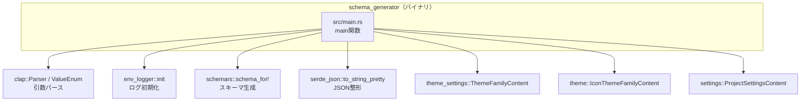
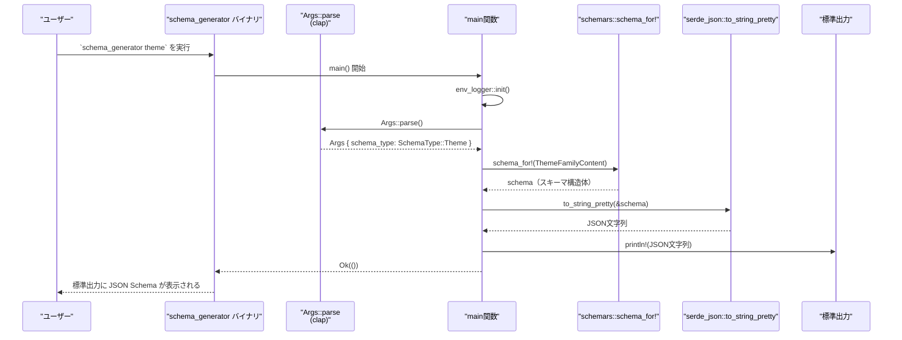

# schema_generator ディレクトリ

## 1. ざっくり一言

`schema_generator` は、Zed 関連クレートで定義されている各種設定用構造体から JSON Schema を生成し、標準出力に表示するコマンドラインツールです。

---

## 2. このモジュールの役割

### 2.1 概要

- このクレートは、Zed のテーマ・アイコンテーマ・プロジェクト設定などのスキーマ（JSON Schema）を生成するための **バイナリツール** です。
- コマンドライン引数でスキーマ種別（`theme` / `icon_theme` / `project`）を指定し、対応する Rust 型から `schemars` を用いてスキーマを生成します。
- 生成されたスキーマは `serde_json` によって整形済みの JSON 文字列として標準出力に出力されます。

### 2.2 アーキテクチャ内での位置づけ

このクレートは他の設定／テーマ関連クレートに依存し、それらが持つ設定構造体を対象にスキーマを生成します。主要な依存関係は次のとおりです。



- `schema_generator` は **CLI フロントエンド**の役割を持ち、実際の設定定義は `theme_settings` / `theme` / `settings` クレート側に存在します（このチャンクには定義が含まれていません）。
- `schemars` が JSON Schema の生成を担い、`serde_json` が JSON への変換と整形を行います。

### 2.3 設計上のポイント

- **単機能バイナリ**  
  - スキーマの生成と出力のみを行い、状態を保持しません。
- **CLI 駆動**  
  - `clap` の `derive` 機能で引数を構造体にマッピングし、`ValueEnum` による列挙値選択でスキーマ種別を切り替えます。
- **エラー処理**  
  - `main` は `anyhow::Result<()>` を返し、`serde_json::to_string_pretty` などのエラーを `?` で上位に伝播させます。
- **ログ出力**  
  - `env_logger::init()` を呼び出しており、必要に応じてログを利用できる構造になっています。  
    （具体的なログ出力箇所はこのファイル内にはありません。）

---

## 3. 主要な機能一覧

- **スキーマ生成（テーマ）**  
  - `ThemeFamilyContent`（`theme_settings` クレート）の JSON Schema を生成し、標準出力へ出力します。
- **スキーマ生成（アイコンテーマ）**  
  - `IconThemeFamilyContent`（`theme` クレート）の JSON Schema を生成します。
- **スキーマ生成（プロジェクト設定）**  
  - `ProjectSettingsContent`（`settings` クレート）の JSON Schema を生成します。
- **コマンドライン引数のパース**  
  - `clap` による `schema_type` のパースと、`snake_case` 名での指定をサポートします。
- **ログ初期化**  
  - `env_logger` によるログ環境の初期化を行います。

---

## 4. 関数・構造体の解説

### 4.1 型一覧（構造体・列挙体）

`src/main.rs` に定義されている主要な公開型は次の 2 つです。

| 名前 | 種別 | 役割 / 用途 |
|------|------|-------------|
| `Args` | 構造体 | コマンドライン引数（スキーマ種別）を保持する |
| `SchemaType` | 列挙体 | 生成するスキーマの種類を表す |

#### `Args` 構造体

```rust
#[derive(Parser, Debug)]
pub struct Args {
    #[arg(value_enum)]
    pub schema_type: SchemaType,
}
```

- `clap::Parser` を `derive` しており、この構造体自体がコマンドライン引数定義になっています。
- フィールド:
  - `schema_type: SchemaType`  
    - `#[arg(value_enum)]` によって、`SchemaType` の各バリアントが CLI の **位置引数**として解釈されます。
    - 実行時には `theme` / `icon_theme` / `project` のいずれかを渡す想定です。

**使用上のポイント**

- 引数はフラグ形式ではなく **位置引数** です（`--schema-type theme` のような形式は定義されていません）。
- 不正な値が渡された場合のエラーメッセージ表示や終了コードなどの詳細な挙動は `clap` 側に委ねられており、このコード内には明示されていません。

#### `SchemaType` 列挙体

```rust
#[derive(Debug, Copy, Clone, PartialEq, Eq, PartialOrd, Ord, ValueEnum)]
#[clap(rename_all = "snake_case")]
pub enum SchemaType {
    Theme,
    IconTheme,
    Project,
}
```

- 生成可能なスキーマ種別を表す列挙体です。
- `ValueEnum` を `derive` しており、`clap` がこの列挙体を CLI 引数として扱えるようになっています。
- `#[clap(rename_all = "snake_case")]` により、CLI 上では次の文字列で指定します。
  - `Theme` → `"theme"`
  - `IconTheme` → `"icon_theme"`
  - `Project` → `"project"`

**使用上のポイント**

- CLI の引数は **必ず小文字の `snake_case`** で指定する必要があります（`Theme` や `ICON_THEME` などはマッチしません）。
- 列挙体自体は `Copy` / `Clone` などが実装されていますが、このファイル内ではコピー性・順序性は特に利用されていません。

---

### 4.2 関数詳細

#### `fn main() -> Result<()>`

```rust
fn main() -> Result<()> {
    env_logger::init();

    let args = Args::parse();

    match args.schema_type {
        SchemaType::Theme => {
            let schema = schema_for!(ThemeFamilyContent);
            println!("{}", serde_json::to_string_pretty(&schema)?);
        }
        SchemaType::IconTheme => {
            let schema = schema_for!(IconThemeFamilyContent);
            println!("{}", serde_json::to_string_pretty(&schema)?);
        }
        SchemaType::Project => {
            let schema = schema_for!(ProjectSettingsContent);
            println!("{}", serde_json::to_string_pretty(&schema)?);
        }
    }

    Ok(())
}
```

**概要**

- ログを初期化し、コマンドライン引数をパースした後、指定されたスキーマ種別に応じて JSON Schema を生成・出力するエントリポイントです。

**引数**

- なし（OS から渡される引数列は `clap::Parser` により内部的に処理されます）。

**戻り値**

- `anyhow::Result<()>`  
  - 成功時: `Ok(())` を返却し、プロセスは正常終了します。
  - 失敗時: `Err(anyhow::Error)` を返し、エラー内容は `?` で伝播されます。実際にエラーを返しうるのは `serde_json::to_string_pretty` の呼び出し部分です。

**内部処理の流れ**

1. `env_logger::init()` でログシステムを初期化します。
2. `Args::parse()` によってコマンドライン引数をパースし、`schema_type` を取得します。
3. `match args.schema_type` により、指定されたスキーマ種別ごとに処理を分岐します。
   - `SchemaType::Theme` の場合:
     - `schema_for!(ThemeFamilyContent)` により、`ThemeFamilyContent` の JSON Schema を生成します。
   - `SchemaType::IconTheme` の場合:
     - `schema_for!(IconThemeFamilyContent)` でアイコンテーマ用のスキーマを生成します。
   - `SchemaType::Project` の場合:
     - `schema_for!(ProjectSettingsContent)` でプロジェクト設定用のスキーマを生成します。
4. 各分岐で得られたスキーマを `serde_json::to_string_pretty(&schema)?` に渡し、整形済み JSON 文字列に変換します。
5. `println!` で標準出力に JSON 文字列を出力します。
6. 最後に `Ok(())` を返して終了します。

**Examples（使用例）**

この関数自体を直接呼び出すというより、バイナリとして実行されます。README に沿った実行例は次のとおりです。

```sh
# ヘルプメッセージの表示
cargo run -p schema_generator -- --help

# テーマスキーマの出力
cargo run -p schema_generator -- theme

# アイコンテーマスキーマの出力
cargo run -p schema_generator -- icon_theme

# プロジェクト設定スキーマの出力
cargo run -p schema_generator -- project
```

各コマンドは、標準出力に JSON Schema を表示します。

**Errors / Panics**

- `serde_json::to_string_pretty(&schema)?`  
  - JSON へのシリアライズに失敗すると `Err` を返します。
  - 典型的には、スキーマ型が `serde::Serialize` に非対応であったり、内部で不正な構造を持つ場合が想定されますが、具体的な条件は `schemars` / `serde_json` の実装に依存し、このチャンク内からは詳細は分かりません。
- `env_logger::init()`  
  - 通常は `()` を返し、失敗してもパニックせずエラーを返す形ですが、このコードでは戻り値を使用していないため、失敗時の扱いは `env_logger` 側の仕様に依存します。

**Edge cases（エッジケース）**

- **引数未指定**  
  - `schema_type` は必須の位置引数なので、未指定の場合は `clap` によるエラーメッセージとともに終了する挙動になると考えられます（詳細は `clap` のデフォルト挙動に依存し、このチャンクからは正確な内容は分かりません）。
- **不正なスキーマ種別**  
  - 例: `cargo run -p schema_generator -- unknown`  
    - `SchemaType` にマッピングできないため、`clap` がエラーを表示しプロセスを終了します（挙動の詳細は `clap` に依存）。
- **出力先が閉じている場合**  
  - 標準出力がパイプやファイルにリダイレクトされており、途中で閉じられた場合などは、`println!` の結果として OS レベルのエラーが発生しうる可能性がありますが、このコード内ではハンドリングされません。

**使用上の注意点**

- 生成結果は標準出力に直接書き出されるため、大きなスキーマを扱う場合はリダイレクトでファイルに保存する運用が想定しやすいです。
- `env_logger` のデフォルト設定では、多くの場合ログは標準エラーに出力されます。そのため、標準出力の JSON をそのままファイルへリダイレクトしてもログが混ざりにくい構成になっています（ただし、詳細な挙動は `env_logger` の設定に依存します）。

---

## 5. データフロー

ここでは `theme` スキーマを生成する場合の典型的なデータフローを示します。



- 入力はコマンドライン引数（`theme` など）であり、`clap` がそれを `SchemaType` に変換します。
- `schemars::schema_for!` が Rust 型 (`ThemeFamilyContent` など) からスキーマ構造体を生成し、`serde_json` が JSON 文字列へ変換します。
- 最終的に、JSON Schema は標準出力に書き出されます。

---

## 6. 使い方（How to Use）

### 6.1 基本的な使用方法

README に記載されている基本的な使用方法は次のとおりです。

```sh
# ヘルプメッセージを表示
cargo run -p schema_generator -- --help

# テーマスキーマを標準出力に表示
cargo run -p schema_generator -- theme

# アイコンテーマスキーマを標準出力に表示
cargo run -p schema_generator -- icon_theme

# プロジェクト設定スキーマを標準出力に表示
cargo run -p schema_generator -- project
```

- `--` より後ろの部分が `schema_generator` バイナリに渡される引数です。
- 引数には `theme` / `icon_theme` / `project` のいずれかを指定します。

生成結果をファイルに保存したい場合の一例です。

```sh
# テーマスキーマをファイルに保存
cargo run -p schema_generator -- theme > theme.schema.json

# アイコンテーマスキーマをファイルに保存
cargo run -p schema_generator -- icon_theme > icon_theme.schema.json
```

これにより、生成された JSON Schema を他のツールやエディタに読み込ませやすくなります。

### 6.2 よくある使用パターン

1. **設定ファイルのバリデーション用スキーマ生成**

   ```sh
   # プロジェクト設定用スキーマを出力
   cargo run -p schema_generator -- project > project_settings.schema.json

   # 生成したスキーマを別の JSON Schema 対応ツールで利用
   # （具体的なツール名や利用方法はこのチャンクからは分かりません）
   ```

2. **エディタの補完・検証用にスキーマを利用**

   ```sh
   # テーマスキーマを生成
   cargo run -p schema_generator -- theme > zed-theme.schema.json

   # 生成したスキーマをエディタ設定に登録して JSON の補完等に利用
   # （具体的な設定方法はエディタ側の仕様に依存し、このチャンクからは分かりません）
   ```

### 6.3 使用上の注意点

- **引数の形式**
  - `schema_type` は必須の位置引数であり、`theme` / `icon_theme` / `project` のいずれかを `snake_case` で指定する必要があります。
  - 誤った綴りや大文字・小文字の違いがあると `clap` によってエラー扱いになります。
- **標準出力とログ**
  - スキーマは標準出力に書き出されます。
  - ログ出力（`env_logger` が扱うもの）は通常標準エラーに出力されるため、スキーマだけをファイルに保存したい場合でも、`>` によるリダイレクトで問題が生じにくい構成です（詳細は `env_logger` の設定に依存します）。
- **スキーマの内容**
  - 実際のスキーマ構造は `ThemeFamilyContent` / `IconThemeFamilyContent` / `ProjectSettingsContent` の定義と `schemars` の設定に依存しており、このチャンクには定義が含まれていません。
  - スキーマのバージョン（JSON Schema Draft どれに相当するか）などの詳細も、このコードだけからは分かりません。
- **パフォーマンス**
  - 通常は単回のスキーマ生成であり、大きな負荷は発生しにくい構成です。
  - 非常に大きなスキーマが生成される場合、生成・整形・出力に要する時間が長くなる可能性があります。

---

## 7. 関連ファイル

このディレクトリおよび関連クレートとの関係をまとめます。

| パス / クレート | 役割 / 関係 |
|----------------|------------|
| `schema_generator/Cargo.toml` | このバイナリクレートのパッケージ定義と依存関係（`anyhow`, `clap`, `env_logger`, `schemars`, `serde`, `serde_json`, `settings`, `theme`, `theme_settings`）を定義します。 |
| `schema_generator/README.md` | `schema_generator` の簡単な説明と基本的な CLI の使用例を提供します。 |
| `schema_generator/src/main.rs` | 本クレートのエントリポイントであり、引数パース・スキーマ生成・出力のすべての処理を実装します。 |
| `theme_settings` クレート（別ディレクトリ） | `ThemeFamilyContent` 型を定義し、テーマ設定のスキーマ生成対象を提供します（このチャンクには定義が含まれていません）。 |
| `theme` クレート（別ディレクトリ） | `IconThemeFamilyContent` 型を定義し、アイコンテーマ設定のスキーマ生成対象を提供します。 |
| `settings` クレート（別ディレクトリ） | `ProjectSettingsContent` 型を定義し、プロジェクト設定のスキーマ生成対象を提供します。 |

このディレクトリ単体では、スキーマの具体的な中身は分かりませんが、上記の関連クレートがスキーマ対象の型を提供し、それを `schema_generator` が JSON Schema として外部に公開する構造になっています。
