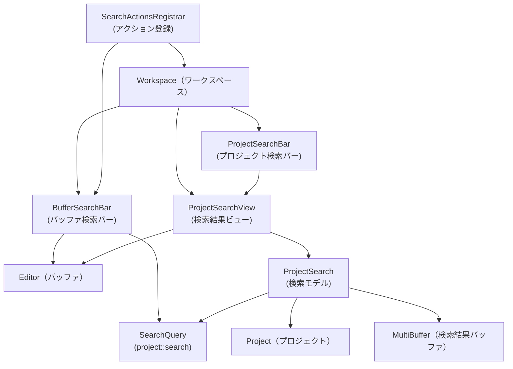
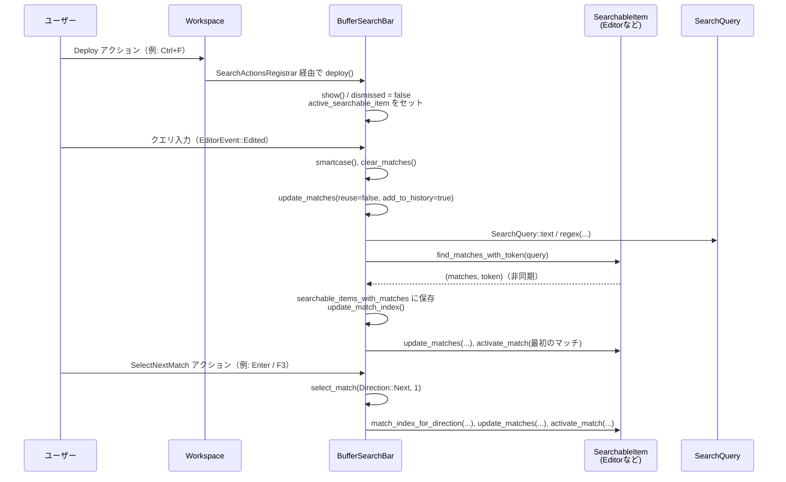
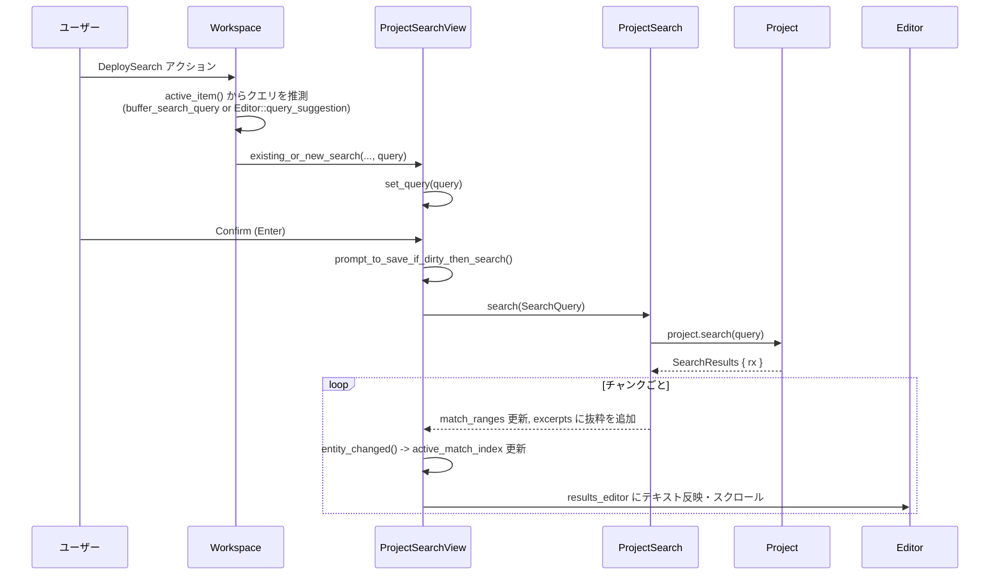

## 1. ざっくり一言

Zed エディタの「検索」機能（バッファ内検索・プロジェクト全体検索）の UI とロジックをまとめたクレートです。  
検索バー、検索結果ビュー、検索オプションや履歴、ワークスペースへのアクション登録までを一括で扱います。

---

## 2. このモジュールの役割

### 2.1 概要

- このクレートは **エディタ内のテキスト検索と置換を扱うフロントエンド** を提供します。
- 主な機能は次の通りです。
  - アクティブなエディタ／ビューに対する **バッファ内検索・置換**（`BufferSearchBar`）
  - プロジェクト全体のファイルを対象にした **プロジェクト検索・置換**（`ProjectSearchView`/`ProjectSearchBar`）
  - キーボードショートカットなどから検索 UI を起動・操作するための **アクション登録機構**
  - 検索オプション（大文字小文字、単語単位、正規表現、無視ファイルを含めるなど）の管理と検索履歴

### 2.2 アーキテクチャ内での位置づけ

クレート内の主なコンポーネント間の関係を概略図で示します。



高レベルの位置づけ:

- `search::init`  
  - メニュー・バッファ検索・プロジェクト検索をアプリ (`App`) に登録する初期化エントリポイントです。
- `buffer_search` モジュール  
  - エディタや検索結果ビューなど「1つの検索対象」に対する検索バー・置換バーとそのロジック。
- `project_search` モジュール  
  - プロジェクト全体を対象にした検索結果モデル (`ProjectSearch`) と結果ビュー (`ProjectSearchView`)、そのツールバー (`ProjectSearchBar`)。
- `buffer_search::registrar`  
  - ワークスペースやツールバー上の `Div` に対して検索関連アクションを登録する汎用仕組み。
- `search_bar.rs`, `search_status_button.rs`  
  - このチャンクにソースは含まれていませんが、ファイル名から検索バー共通 UI やステータスボタンの表示を担うと推測されます（詳細は不明です）。

### 2.3 設計上のポイント

コードから読み取れる特徴を整理します。

- **UI とロジックの分離**
  - `BufferSearchBar` / `ProjectSearchView` は `gpui::Render` を実装し、UI を生成すると同時に検索ロジックも内部に持ちます。
  - プロジェクト検索では、検索結果そのものは `ProjectSearch`（モデル）に集約し、`ProjectSearchView` がそれを表示します。

- **アクションベースの操作**
  - `zed_actions`・`workspace` の `Action` を通じて、検索の起動・オプション切り替え・次／前マッチの選択などを一元的に扱います。
  - `SearchActionsRegistrar` / `ActionExecutor` によって「検索バーが表示中か」「結果があるか」といった条件付きでアクションを処理します。

- **非同期検索と UI 更新**
  - バッファ検索もプロジェクト検索も `SearchQuery` を使った非同期検索を行い、完了後に UI を更新します。
  - 結果は `oneshot::Receiver<()>` や `Task` を通じて通知され、完了後にマッチのアクティベートやハイライトが行われます。

- **検索オプションの統合管理**
  - `SearchOptions`（bitflags）で大文字小文字、単語単位、正規表現、無視ファイルを含めるかなどを管理します。
  - Editor の設定 (`EditorSettings::search`) から初期値を取得し、トグル操作や「スマートケース検索」で動的に変更します。

- **履歴とドラフトの管理**
  - バッファ検索は `SearchHistory` をローカルに持ち、プロジェクト検索は `Project` の `search_history` を共有します。
  - 「まだ検索を実行していない入力」をドラフトとして扱い、履歴移動後に戻せるようにしています。

- **マルチバッファ対応**
  - `MultiBuffer`（1つのビューに複数ファイルの抜粋を表示）に対しても検索できるよう、`SearchableItemHandle` 経由で抽象化されています。
  - 必要に応じて「すべて折りたたむ／展開」ボタンを検索バーに表示します。

---

## 3. 主要な機能一覧

クレートが提供する主な機能を列挙します。

- バッファ検索バー (`BufferSearchBar`)
  - アクティブなエディタ／検索結果ビューに対する検索・置換 UI
  - 正規表現／単語単位／大文字小文字／選択範囲内などのオプション切り替え
  - 検索履歴の保存・前後移動
  - 選択範囲内のみ検索（`FilteredSearchRange`）

- プロジェクト検索 (`ProjectSearchView`, `ProjectSearchBar`)
  - プロジェクト内の複数ファイルを対象とした検索
  - 検索結果を `MultiBuffer` でまとめて表示し、そこから置換を実行
  - include/exclude グロブパターンや「開いているファイルだけ検索」などのフィルタ
  - 検索結果の折りたたみ・展開

- アクション登録とワークスペース連携
  - `search::init` による検索機能全体の初期化
  - `register_pane_search_actions`, `SearchActionsRegistrar` によるペイン／ワークスペースへの検索アクション登録
  - `DeploySearch`, `NewSearch`, `Deploy` などのアクションで検索 UI を起動・再利用

- 検索オプションとスマートケース
  - `SearchOptions` による検索モードのビットフラグ管理
  - 入力文字列に大文字が含まれている場合のみ CASE_SENSITIVE を有効にする「スマートケース」

- 検索履歴
  - バッファ検索: `SearchHistory` + `SearchHistoryCursor`
  - プロジェクト検索: `Project::search_history`（クエリ・include・exclude を別々に管理）

- エディタとの同期
  - バッファ検索中は、エディタ側の `select_next`/`select_prev` が検索バーの大文字小文字オプションに従うよう同期
  - 検索バーを閉じると同期を解除し、エディタの設定に戻す

---

## 4. 関数・構造体の解説

このセクションでは、ディレクトリ全体の中で特に重要な構造体・関数を中心に役割と挙動を整理します。

### 4.1 バッファ検索まわり (`buffer_search`)

#### 4.1.1 `BufferSearchBar`

**役割**

- アクティブな「検索可能アイテム」（通常は `Editor` や `ProjectSearchView` の結果エディタ）に対する検索・置換 UI とロジックを担当します。
- 検索クエリ、検索オプション、検索履歴、現在のマッチインデックスなどを保持し、マッチのハイライトや選択を行います。

**主なフィールド（グループ単位）**

- UI 要素
  - `query_editor: Entity<Editor>`  
    検索クエリ入力用のエディタ。
  - `replacement_editor: Entity<Editor>`  
    置換テキスト入力用。
  - `scroll_handle: ScrollHandle`  
    検索バー自体のスクロール追跡。

- 状態管理
  - `active_searchable_item: Option<Box<dyn SearchableItemHandle>>`  
    現在検索対象となっているアイテム（エディタや結果ビュー）。
  - `active_match_index: Option<usize>`  
    現在アクティブなマッチのインデックス。
  - `searchable_items_with_matches: HashMap<WeakSearchableItemHandle, (AnyVec<dyn Send>, SearchToken)>`  
    各検索対象ごとのマッチ一覧とトークン。
  - `search_options`, `default_options`, `configured_options`  
    現在／デフォルト／設定から読み取った検索オプション。
  - `search_history: SearchHistory`, `search_history_cursor: SearchHistoryCursor`  
    検索クエリの履歴とカーソル。
  - `dismissed: bool`  
    バーが閉じているかどうか。
  - `replace_enabled`, `selection_search_enabled`  
    置換 UI や「選択範囲内のみ検索」が有効かどうか。

- 正規表現サポート
  - `regex_language: Option<Arc<Language>>`  
    正規表現用の構文ハイライトに使用する言語。
  - `pending_external_query`（macOS のみ）  
    システムの「検索ペーストボード」から受け取ったクエリを保持。

**主なメソッド**

1. `pub fn new(...) -> Self`

   - クエリエディタと置換エディタを `Editor::auto_height` で作成します。
   - エディタのイベント（フォーカス・編集）を購読し、クエリ編集で自動的に検索・マッチ更新を行います。
   - `EditorSettings::search` から `SearchOptions` を初期化します。
   - 言語レジストリが渡された場合、非同期に `"regex"` 言語をロードし、正規表現モード時にクエリエディタへ適用します。

   **エッジケース**

   - クエリ用バッファは `as_singleton` を前提にしており、そうでない場合は `expect` でパニックする設計です（テストコード含め、クエリは常に単一バッファで運用される前提）。

2. `pub fn register(registrar: &mut impl SearchActionsRegistrar)`

   - 検索バーに対して扱われるべきアクション群（`FocusSearch`, `ToggleCaseSensitive`, `SelectNextMatch`, `Deploy`, `Dismiss` など）を全てここで登録します。
   - 重要な点として、アクションごとに「どの状態で反応するか」をラッパー型で制御します。
     - `ForDeployed` … バーが展開（表示）されており、かつターゲットが有効なときだけ実行。
     - `ForDismissed` … バーが閉じているときだけ実行。
     - `WithResultsOrExternalQuery` … 結果がある、または macOS の外部クエリがペンディング状態のときだけ実行。

   **使用上の注意**

   - このメソッドは「アクションの定義」を行うだけで、実際にワークスペースへ登録するのは `SearchActionsRegistrar` の実装側です（後述）。
   - 新しいアクションを検索バーにひもづけたい場合、この関数に追加することになります。

3. `pub fn search(&mut self, query: &str, options: Option<SearchOptions>, add_to_history: bool, ...) -> oneshot::Receiver<()>`

   **処理の流れ**

   1. `options` が指定されていれば採用し、なければ `default_options` を使います。
   2. 現在のクエリやオプションと異なる場合、クエリエディタの内容を書き換え、`search_options` を更新します。
   3. 既存のマッチをクリアし、macOS では `update_find_pasteboard` を呼んでシステムの検索ペーストボードを更新します。
   4. `update_matches(reuse_existing_query, add_to_history, ...)` を呼び出し、その完了を表す `oneshot::Receiver<()>` を返します。

   **エッジケース**

   - クエリが空文字列の場合は実際の検索は行わず、アクティブな検索対象のマッチをクリアします。
   - 正規表現モードで `SearchQuery::regex` の構築に失敗した場合、`query_error` にメッセージを保存し、マッチをクリアして UI をエラー表示にします。

4. `fn update_matches(&mut self, reuse_existing_query: bool, add_to_history: bool, ...) -> oneshot::Receiver<()>`

   **概要**

   - 現在の `active_searchable_item` に対して非同期検索を実行し、マッチ結果とハイライトを更新する中核の関数です。

   **アルゴリズム**

   1. `SearchQuery` を構築  
      - `reuse_existing_query` が true かつ `active_search` が存在すればそれを再利用。
      - そうでなければ `SearchOptions::REGEX` の有無に応じて `SearchQuery::regex` または `SearchQuery::text` を構築し、`with_replacement` で現在の置換テキストを埋め込みます。
   2. `active_search` を更新し、`active_searchable_item.find_matches_with_token(...)` を呼び、将来の `(matches, token)` を待つ `Task` を生成。
   3. 結果が返ってきたら:
      - `searchable_items_with_matches` に結果を保存。
      - `update_match_index` でアクティブマッチのインデックスを更新。
      - `add_to_history` が true ならクエリテキストを `search_history` に追加。
      - 検索バーが展開中 (`!dismissed`) であれば、検索対象に対して `update_matches` / `clear_matches` を呼び、ハイライトを更新。

   **エッジケース**

   - `active_searchable_item` が `WeakSearchableItemHandle` 経由で解決できない場合（破棄済み）は、その検索対象の結果を破棄します。
   - マッチが 0 件の場合は `clear_matches` を呼び、ハイライトを消します。

5. `pub fn select_match(&mut self, direction: Direction, count: usize, ...)`

   **概要**

   - 現在の `active_match_index` と方向に基づいて次のマッチを選択し、検索対象に対して `activate_match` を呼びます。

   **ポイント**

   - `EditorSettings::get_global(cx).search_wrap` が false の場合、最初／最後のマッチを超えて移動しようとすると `crate::show_no_more_matches` を呼び出してトーストを表示し、移動しません。
   - macOS の場合、まだ `pending_external_query` が残っていれば最初にそれを検索してからマッチを移動します。

6. `fn smartcase(&mut self, ...)`

   **役割**

   - グローバル設定 `use_smartcase_search` が有効な場合に、クエリ内に大文字が含まれているかどうかで `CASE_SENSITIVE` オプションを自動トグルします。

   **エッジケース**

   - クエリが空文字列の場合は何もしません。
   - ユーザーが手動でオプションを切り替えた直後もこのロジックが走るため、「大文字を含むクエリ」に変更した時点で自動で大文字小文字区別が有効になります。

#### 4.1.2 `SearchActionsRegistrar` と関連型（`buffer_search::registrar`）

**`trait SearchActionsRegistrar`**

- 目的:  
  検索バー本体と「アクションを発行する側」（`Div` や `Workspace`）の依存関係を逆転させるためのインターフェースです。
- メソッド:
  - `fn register_handler<A: Action>(&mut self, callback: impl ActionExecutor<A>);`  
    任意の `Action` とそれに対応する検索バー側のコールバックを登録します。

**`DivRegistrar<'a, 'b, T>`**

- 役割:  
  任意のコンポーネント `T` の `Context` 上で `Div` に対して検索アクションを紐付ける実装です。
- コンストラクタ:
  - `pub fn new(search_getter: GetSearchBar<T>, cx: &mut Context<T>)`  
    `T` から `BufferSearchBar` を取得するクロージャと `Context` を受け取り、内部に `Div` を作成します。
- 処理:
  - `register_handler` 内で `div.on_action` を設定し、アクションが発生したときに:
    1. `search_getter` で `BufferSearchBar` を取得。
    2. 取得できれば `update` 経由で `callback.execute(...)` を呼び、戻り値で `cx.notify()` or `cx.propagate()` を切り替えます。

**`PaneDivRegistrar`**

- 役割:  
  `workspace::Pane` に紐づくツールバー上の `BufferSearchBar` に対して、`Div` 経由でアクションを登録する実装です。
- `register_pane_search_actions(div, pane)`  
  - ペインのツールバーにある `BufferSearchBar` 用にアクションを登録しなおした `Div` を返します。
  - ペインの `toolbar().item_of_type::<BufferSearchBar>()` から検索バーを見つけます。

**`impl SearchActionsRegistrar for Workspace`**

- 役割:  
  ワークスペース全体に対して検索アクションを登録し、アクティブペインの検索バーへ転送します。
- 動作:
  1. モーダルが開いている場合は、先にモーダルを閉じるか、閉じられなければ `cx.propagate()`。
  2. `active_pane()` を取得し、そのツールバー内の `BufferSearchBar` を探す。
  3. 見つかれば `callback.execute` を呼び、`should_notify` に応じて `cx.notify()`/`cx.propagate()` を決めます。

**`trait ActionExecutor<A: Action>` とその実装**

- 共通のインターフェース:

  ```rust
  fn execute(
      &self,
      search_bar: &mut BufferSearchBar,
      action: &A,
      window: &mut Window,
      cx: &mut Context<BufferSearchBar>,
  ) -> bool;
  ```

  - 戻り値は「このアクションを処理したかどうか」を表します。

- `ForDismissed<A>`  
  - `search_bar.is_dismissed()` のときだけコールバックを実行します。
- `ForDeployed<A>`  
  - `search_bar.is_dismissed()` が false かつ `active_searchable_item` が Some のときだけ実行します。
- `WithResultsOrExternalQuery<A>`  
  - macOS では `pending_external_query.is_some()` も許容し、それ以外では `active_match_index.is_some()` のときだけ実行します。

**使用上の注意**

- `ActionExecutor` 自体が `Clone` を要求されているため、クロージャは `Clone` 可能なラッパー（`ForDeployed(...)` など）で扱います。
- 「検索バーが無い状態でアクションが押される」ケースもあり得るため、`execute` 内で false を返すことで `cx.propagate()` される設計になっています。

---

### 4.2 プロジェクト検索まわり (`project_search`)

#### 4.2.1 `ProjectSearch`

**役割**

- プロジェクト全体に対する検索のモデル（データ保持と非同期処理）です。
- 検索対象となるファイルの抜粋を `MultiBuffer` に構築し、そのアンカー範囲を `match_ranges` として保持します。

**主なフィールド**

- `project: Entity<Project>`  
  対象プロジェクト。
- `excerpts: Entity<MultiBuffer>`  
  検索結果を抜粋として格納するバッファ。
- `match_ranges: Vec<Range<Anchor>>`  
  検索マッチのアンカー範囲。
- `pending_search: Option<Task<Option<()>>>`  
  実行中の検索タスク。
- `active_query: Option<SearchQuery>` / `last_search_query_text: Option<String>`  
  現在の検索クエリと最後に実行したクエリ文字列。
- `search_history_cursor` / `search_included_history_cursor` / `search_excluded_history_cursor`  
  各種入力欄（クエリ・include・exclude）の履歴カーソル。
- `_excerpts_subscription`  
  `MultiBuffer` の `FileHandleChanged` を監視し、削除されたファイルを結果から除外するための購読。

**重要メソッド: `fn search(&mut self, query: SearchQuery, cx: &mut Context<Self>)`**

- 処理の流れ:
  1. プロジェクトの `search_history_mut` を介して、クエリ・include・exclude を履歴に追加。
  2. `project.search(query.clone(), cx)` を呼び出して `SearchResults { rx, _task_handle }` を取得。
  3. 自身の状態を更新:
     - `last_search_query_text`, `active_query`, `search_id`, `match_ranges.clear()`, `pending_search = Some(...)`。
  4. 非同期タスク内で:
     - `rx.ready_chunks(1024)` から順次結果を受け取り、`SearchResult::Buffer { buffer, ranges }` を `MultiBuffer::set_anchored_excerpts_for_path` 経由で挿入。
     - 生成されたアンカー範囲を `match_ranges` に追加。
     - `SearchResult::LimitReached` が来た場合には `limit_reached` を true に。
     - すべてのチャンク処理後 `no_results` や `pending_search` を更新し、`cx.notify()`。

**エッジケース**

- 対象ファイルが後から削除された場合、`remove_deleted_buffers` によりそのバッファとマッチ範囲が自動的に削除されます。
- `match_ranges` が空のときは `no_results` が true になります。`ProjectSearchView` の UI 側では「No Results」表示に利用されます。

#### 4.2.2 `ProjectSearchView`

**役割**

- `ProjectSearch` の結果を表示し、ユーザー入力（クエリ・フィルタ・置換）を受け付けるビューです。
- `workspace::Item` としてタブに表示され、`results_editor` を通じて検索結果を編集・保存できます。

**主なフィールド（抜粋）**

- `entity: Entity<ProjectSearch>`  
  検索モデル。
- `query_editor`, `replacement_editor`, `results_editor`  
  クエリ・置換・結果表示用エディタ。
- `included_files_editor`, `excluded_files_editor`  
  include/exclude パターン入力用エディタ。
- `search_options: SearchOptions`  
  現在の検索オプション。
- `panels_with_errors: HashMap<InputPanel, String>`  
  正規表現エラーやパスパターンエラーなどを入力欄ごとに保持。
- `active_match_index: Option<usize>`  
  現在選択されているマッチの番号。
- `filters_enabled`, `replace_enabled`, `included_opened_only` など。

**重要メソッド**

1. `fn search(&mut self, cx: &mut Context<Self>)`

   - `included_opened_only` が true の場合、`open_buffers` で現在開いているバッファを収集して `open_buffers` 引数としてクエリに埋め込みます。
   - `build_search_query` で `SearchQuery` を構築し、`entity.search(query, cx)` を呼び出します。

2. `fn build_search_query(&mut self, cx: &mut Context<Self>, open_buffers: Option<Vec<Entity<Buffer>>>) -> Option<SearchQuery>`

   **処理の要点**

   - クエリ文字列: `search_query_text(cx)` から取得。
   - include/exclude:
     - `filters_enabled` が true の場合、`included_files_editor` / `excluded_files_editor` のテキストを `parse_path_matches` に渡して `PathMatcher` を生成。
     - パースに失敗した場合は対応する `InputPanel` にエラー文字列を登録し、`panels_with_errors` を通して UI に反映。エラーが残っている場合は `None` を返して検索を行いません。
   - `match_full_paths`:
     - プロジェクトに複数の visible worktree がある場合は、フルパスでパターンマッチするために true にします。
   - 実際のクエリ生成:
     - `REGEX` フラグの有無により `SearchQuery::regex` / `SearchQuery::text` を呼び分け。
     - `WHOLE_WORD`, `CASE_SENSITIVE`, `INCLUDE_IGNORED`, `ONE_MATCH_PER_LINE` などのオプションを `SearchOptions` から読み出して渡します。
     - エラーが発生した場合は `InputPanel::Query` にエラー文字列を登録し、`None` を返します。
   - 最終的に、`query.is_empty()` の場合は `None` を返して検索を実行しません。

3. `fn select_match(&mut self, direction: Direction, ...)`

   - `active_match_index` と `match_ranges` を使って次のマッチを決定し、`results_editor` に対して:
     - マッチ範囲周辺を展開 (`unfold_ranges`)。
     - オートスクロール（設定で center_on_match が有効なら中央に、それ以外はフィット）。
     - 選択範囲を変更。
   - その後 `highlight_matches` でマッチ全体の背景色を更新します。

   **エッジケース**

   - `EditorSettings::search_wrap` が false の場合、最初／最後を超える移動は行わず、`crate::show_no_more_matches` を表示します。
   - `match_ranges` が空、または `active_match_index` が `None` の場合は何もしません。

4. `fn replace_all(&mut self, _: &ReplaceAll, ...)`

   - まだ検索中 (`pending_search.is_some()`) の場合:
     - `pending_replace_all = true` としてフラグだけ立てて戻り、検索完了後に `entity_changed` 内で `replace_all` が呼ばれます。
   - クエリテキストが `last_search_query_text` と異なる場合:
     - クエリが古いと判断し `pending_replace_all = true; search(cx)` を呼んだ上で、検索完了後に改めて置換を実行します。
   - すべてのチェックに通った場合:
     - `match_ranges` を `mem::take` によって一時的に抜き出し、`results_editor.replace_all` で一括置換します。
     - その後 `entity.match_ranges` に元のベクタを戻します。

   **使用上の注意**

   - 置換対象のテキストはクエリの `replacement` に含まれるため、`replacement_editor` を更新せずに `search_options` だけ変更しても置換内容は変わりません。

5. `fn entity_changed(&mut self, window: &mut Window, cx: &mut Context<Self>)`

   - `ProjectSearch` モデルに変化があったときに呼ばれます。
   - 主な処理:
     - `match_ranges` が空なら `active_match_index = None` とし、ハイライトをクリア。
     - マッチがある場合:
       - `active_match_index = Some(0)` として最初のマッチを選択状態に。
       - 以前の `search_id` と比較して新規検索かどうか判断し、新規であれば結果を先頭にスクロール。
       - クエリエディタにフォーカスがある状態で新規検索が完了した場合、結果ビューへフォーカスを移す。
     - `pending_replace_all` が立っていて、かつ `pending_search` が終わっていれば `replace_all` を呼ぶ。

#### 4.2.3 `ProjectSearchBar`

**役割**

- ワークスペースのツールバーに表示される「プロジェクト検索バー」です。
- `ProjectSearchView` の状態を参照・操作しつつ、アクションや Tab 移動・履歴操作などを受け持ちます。

**重要なメソッド**

- `fn confirm(&mut self, _: &Confirm, ...)`
  - Enter 相当のアクションをハンドリングし、置換エディタにフォーカスがない場合に `prompt_to_save_if_dirty_then_search` を起動します。
- `fn toggle_search_option(&mut self, option: SearchOptions, ...) -> bool`
  - `active_project_search` がある場合に `SearchOptions` をトグルし、既に検索クエリがある場合は再検索（保存／確認付き）を行います。
- `fn toggle_filters(&mut self, ...) -> bool`
  - フィルタパネルのオン／オフを切り替え、include/exclude エディタを更新します。
- `fn next_history_query` / `fn previous_history_query`
  - 現在フォーカスされているエディタ（クエリ／include／exclude）に応じて、対応する履歴カーソルを進めたり戻したりします。
  - バッファ検索と同様、ドラフトの保存・復元にも対応します。

**ToolbarItemView 実装**

- `set_active_pane_item` で、ペインのアクティブアイテムが `ProjectSearchView` のときにだけ自身を表示 (`PrimaryLeft`)、それ以外では隠す (`Hidden`) ようにしています。
- 同時に `ProjectSearchView` への `Subscription` を張っておき、状態変化のたびに `cx.notify()` で再描画を促します。

#### 4.2.4 `project_search::init(cx: &mut App)`

**役割**

- 新しい `Workspace` が生成されたときに、プロジェクト検索関連のアクションをワークスペースに登録します。

**登録される主なアクション**

- 検索バー操作:
  - `Deploy` / `FocusSearch` / `ToggleFilters` / `ToggleCaseSensitive` / `ToggleWholeWord` / `ToggleRegex` / `ToggleReplace`
  - `SelectPreviousMatch` / `SelectNextMatch`
- 検索タブ操作:
  - `SearchInNew` … 既存の検索結果を新しいタブとして複製。
  - `DeploySearch` … アクティブアイテムから検索クエリを推測して検索タブを表示。
  - `NewSearch` … 空の検索タブを追加。
  - `ToggleAllSearchResults` … 結果を全て折りたたむ／展開。
- 検索バー・結果ビュー間のフォーカス切り替え:
  - `ToggleFocus` … 検索バーと結果ビュー間のフォーカスをトグル。
- モーダルとの連携:
  - モーダルが表示中の場合は、検索アクションの前にモーダルを閉じようとし、閉じられない場合は `cx.propagate()` します。

---

### 4.3 その他の補助的な関数

- `fn split_glob_patterns(text: &str) -> Vec<&str>`
  - include/exclude のパターン文字列をカンマ区切りで分割します。
  - `{}` 内のカンマやバックスラッシュでエスケープされたカンマは区切りと見なさないようにしています。

- `fn buffer_search_query(...) -> Option<String>`
  - アクティブなアイテムと同じペインのツールバーから `BufferSearchBar` を探し、クエリエディタにフォーカスがあるかつ非空であればそのクエリ文字列を返します。
  - プロジェクト検索を起動する際に、バッファ検索のクエリを再利用するために使われます。

---

## 5. データフロー

ここでは代表的な 2 つのシナリオを簡潔に説明します。

### 5.1 バッファ検索のフロー

**シナリオ:** ユーザーがエディタ上で検索バーを展開し、クエリを入力して次のマッチに移動する。



**ポイント**

- クエリ編集後の検索は非同期で行われますが、`update_matches` の戻り値の `Receiver` を待つことで「完了後にマッチをアクティベートする」処理を追加で行えます（テストコードで利用）。
- エディタが `SearchableItemHandle` を実装しているため、バッファ検索バーからは抽象化された API だけを呼べばよい構造になっています。

### 5.2 プロジェクト検索のフロー

**シナリオ:** アクティブなバッファからプロジェクト検索を起動し、結果を表示する。



**ポイント**

- `DeploySearch` では、まずアクティブなバッファ検索バーからクエリを再利用しようとし、それがない場合にエディタの選択テキストなどからクエリを推測します。
- ProjectSearchView の結果は `MultiBuffer` を通じて 1 つのエディタに集約されますが、各マッチの `Anchor` 範囲が `match_ranges` として保持されるため、個別のマッチ選択・ハイライトが可能です。

---

## 6. 使い方（How to Use）

### 6.1 基本的な使用方法

#### 6.1.1 クレート全体の初期化

アプリケーションの初期化時に `search::init` を呼び出すことで、バッファ検索・プロジェクト検索・メニューがワークスペースに組み込まれます。

```rust
use gpui::App;
use search; // このクレート

fn init_app(cx: &mut App) {
    // 他のモジュール初期化
    editor::init(cx);
    workspace::init(cx);
    // 検索機能を登録
    search::init(cx);
}
```

- これにより:
  - バッファ検索バー (`BufferSearchBar`) が各 `Workspace` 新規作成時に登録されます（`buffer_search::init` 内）。
  - プロジェクト検索 (`ProjectSearchView` / `ProjectSearchBar`) に関連するアクションが各 `Workspace` に登録されます（`project_search::init` 内）。

#### 6.1.2 ペインツールバーにバッファ検索バーを組み込む

ペイン内コンポーネントから検索アクションを扱いたい場合、`register_pane_search_actions` を利用して `Div` に検索アクションを付与できます。

```rust
use gpui::{Div, IntoElement};
use workspace::Pane;
use search::buffer_search::register_pane_search_actions;

// ペインのツールバー内で呼び出される想定の関数
fn toolbar_content(pane: gpui::Entity<Pane>) -> impl IntoElement {
    let base_div = gpui::div();                              // ツールバーのベースとなる Div
    let div_with_search = register_pane_search_actions(
        base_div,
        pane,                                               // このペインの BufferSearchBar を自動的に探す
    );

    div_with_search                                        // 検索アクション付きの Div を返す
}
```

- これにより、`Div` 上で発生する検索関連のアクション（ショートカットなど）が、ペインの `BufferSearchBar` にルーティングされます。

#### 6.1.3 コードからバッファ検索を実行する

テストやユーティリティコードから `BufferSearchBar` を直接操作して検索を実行する例です。

```rust
use gpui::{Window, App};
use search::BufferSearchBar;
use editor::Editor;

fn run_simple_search(
    search_bar: &gpui::Entity<BufferSearchBar>,           // 既にペインに結びついていると仮定
    query: &str,
    window: &mut Window,
    cx: &mut App,
) {
    // 検索を開始し、結果が出るまで待つ
    let rx = search_bar.update(cx, |bar, cx| {
        bar.search(query, None, true, window, cx)          // オプションなしで検索
    });

    // 非同期完了待ち
    cx.executor().block_on(async move {
        let _ = rx.await;                                  // エラーはここでは無視
    });

    // 検索バー側で active_match_index やハイライトが更新されている
}
```

- 実際のコードベースでは `smol` の実行ループや `gpui::TestAppContext` を利用して `await` していますが、ここでは概念的な流れのみ示しています。

### 6.2 よくある使用パターン

#### パターン 1: バッファ検索からプロジェクト検索へ引き継ぐ

1. バッファ検索バーを使って検索クエリを決める（`BufferSearchBar` のクエリエディタにフォーカスがある状態）。
2. `DeploySearch` アクションを発行（ショートカットやメニュー経由）。
3. `ProjectSearchView::deploy_search` により:
   - バッファ検索バーからクエリ文字列を取得。
   - 既存のプロジェクト検索タブがあればそれを再利用、なければ新しく作成。
   - クエリを設定し、検索バーにフォーカスを移す。

#### パターン 2: 選択範囲内のみ検索

1. エディタで検索対象の範囲を選択。
2. バッファ検索バーに対して `Deploy { selection_search_enabled: true, .. }` で展開。
3. `selection_search_enabled` が `Some(FilteredSearchRange::Default)` となり、`set_search_within_selection` により検索対象が選択範囲だけに制限されます。

#### パターン 3: プロジェクト検索でディレクトリごと検索

テストコードの `ProjectSearchView::new_search_in_directory` を簡略化すると、次のような流れです。

1. 対象のディレクトリを `RelPath` として取得。
2. `new_search_in_directory` を呼ぶことで:
   - 新しい検索ビューを作成。
   - `included_files_editor` にそのディレクトリパスをセット。
   - フィルタを有効化 (`filters_enabled = true`)。
   - クエリエディタにフォーカス。

### 6.3 使用上の注意点

- **非同期検索の完了タイミング**
  - `BufferSearchBar::search` や `ProjectSearchView::search` は検索完了前に戻ります。
  - 検索結果に依存した処理（たとえばすぐ次のマッチに移動する）の場合、戻り値の `Receiver` や `Task` を `await` してから行う必要があります（テスト内のパターンを参照）。

- **`active_searchable_item` がない場合**
  - バッファ検索バーを表示していても、アクティブな検索対象が `None` なら検索は行われません。
  - `set_active_pane_item` でアイテムがセットされるのはペインのアクティブアイテム変更時なので、独立した `BufferSearchBar` を作る場合は必ず紐付け処理が必要です。

- **検索オプションの永続性と更新**
  - 検索バーが表示されている間に検索オプションを変更しても、エディタの設定が更新されるとは限りません。
  - プロジェクト検索では `ActiveSettings` によりプロジェクトごとの設定を保持しているため、ワークスペースをまたいでも最後の検索オプションが引き継がれます。

- **ラップなし検索 (`search_wrap = false`)**
  - バッファ検索・プロジェクト検索とも、「ファイル末尾で次へ」「先頭で前へ」を実行した時にラップしません。
  - この場合は `crate::show_no_more_matches(window, cx)` によりトースト表示のみ行われ、マッチ位置は変化しません。

- **正規表現／パスパターンのエラー**
  - クエリや include/exclude パターンが無効な正規表現だった場合、対応する入力欄に赤枠＋エラー文字列が表示され、検索自体は行われません。
  - エラーが解消されるまで `build_search_query` は `None` を返します。

- **結果ビューの編集と保存**
  - プロジェクト検索結果の `results_editor` は通常のエディタと同様に編集・保存が可能です。
  - 再検索前には `prompt_to_save_if_dirty_then_search` により「保存する／保存しない／キャンセル」のダイアログが表示される可能性があります。

- **このチャンクに含まれない部分**
  - `search.rs` の後半や `search_bar.rs`, `search_status_button.rs` の具体的な実装はこのチャンクに含まれていません。
  - それらが提供する関数や UI コンポーネント（たとえば検索ステータスアイコンや共通検索バー部品）については、この情報だけから詳細な挙動を断定することはできません。

---

## 7. 関連ファイル

クレート内のファイルと役割を表にまとめます。

| パス | 役割 / 関係 |
|------|------------|
| `search/Cargo.toml` | クレート定義。`editor`, `workspace`, `project`, `gpui`, `zed_actions` などへの依存関係が定義されています。ライブラリエントリポイントは `src/search.rs`。 |
| `search/src/search.rs` | クレートのメインモジュール。`BufferSearchBar` / `ProjectSearchView` の re-export、`search::init`、検索用アクション (`FocusSearch`, `ToggleWholeWord` など) の定義を行います。後半はこのチャンクに含まれておらず詳細不明です。 |
| `search/src/buffer_search.rs` | バッファ内検索バー `BufferSearchBar` の実装。検索 UI の描画 (`Render`)、検索ロジック（`search`, `update_matches` など）、検索履歴、置換操作、スマートケース等を含みます。 |
| `search/src/buffer_search/registrar.rs` | `SearchActionsRegistrar`, `DivRegistrar`, `PaneDivRegistrar`, `ActionExecutor` とその実装 (`ForDeployed`, `ForDismissed`, `WithResultsOrExternalQuery`) を提供し、検索バーとワークスペース／ペイン／Div の間のアクション連携を実現します。 |
| `search/src/project_search.rs` | プロジェクト全体検索の実装。モデル `ProjectSearch`、ビュー `ProjectSearchView`、ツールバー `ProjectSearchBar`、`project_search::init` などを含みます。パスフィルタや検索履歴、置換、検索結果の折りたたみもここで扱います。 |
| `search/src/search_bar.rs` | このチャンクには中身が含まれていませんが、名前と他ファイルからの import から、検索バー UI の共通部品（`input_base_styles`, `render_text_input`, `render_action_button` 等）や履歴ナビゲーション補助関数を定義していると推測されます。 |
| `search/src/search_status_button.rs` | このチャンクには中身が含まれていませんが、`SEARCH_ICON` の re-export から、ステータスバーやツールバーに表示される検索アイコンボタンを定義していると推測されます。 |

必要に応じて、`editor`, `workspace`, `project`, `zed_actions` といった外部クレートの API（`SearchableItemHandle`, `SearchQuery`, `Workspace::register_action` など）を参照すると、より詳細な挙動を追いやすくなります。
