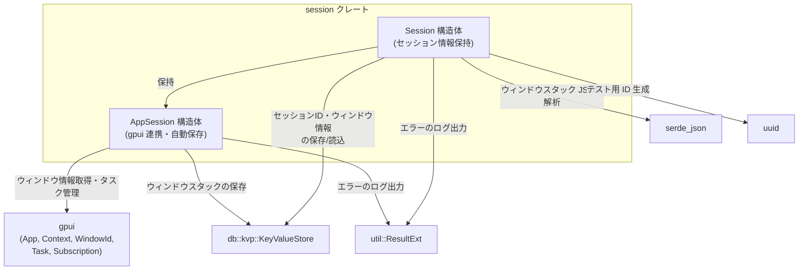
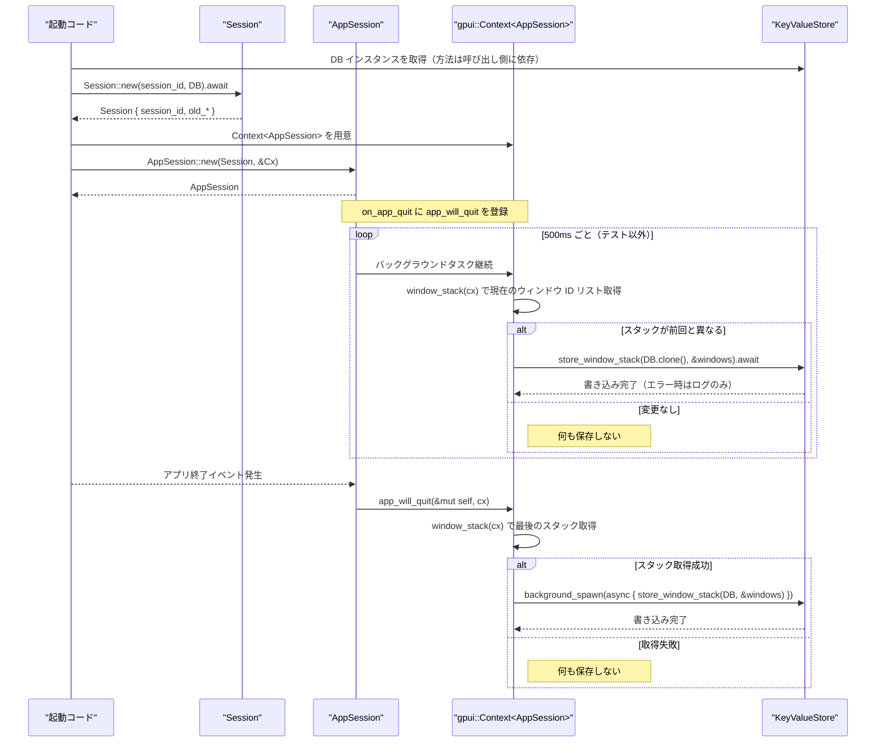

# session/ コード解説

## 1. ざっくり一言

`session` クレートは、アプリケーションのセッション ID とウィンドウの並び順（ウィンドウスタック）をキーバリューストアに保存・復元するための小さなヘルパーです。`gpui` アプリケーションのライフサイクルにフックし、前回起動時の情報を簡単に取得できるようにします。

---

## 2. このモジュールの役割

### 2.1 概要

- このモジュールは **アプリケーション起動ごとのセッション情報を永続化し、前回の状態を復元したい** という問題を扱います。
- 具体的には、以下の情報を `db::kvp::KeyValueStore` を介して保存・取得します。
  - 現在のセッション ID と前回のセッション ID
  - 前回のウィンドウスタック（`WindowId` の順序付きリスト）
- また、`gpui` の `Context` と連携する `AppSession` を提供し、アプリ終了時やバックグラウンドで自動的にウィンドウスタックを保存します。

### 2.2 アーキテクチャ内での位置づけ

`session` クレートは、UI フレームワーク `gpui` とストレージ層 `db` の間に位置し、セッションに関する情報の読み書きを担当します。



- `Session` はストレージとの I/O を行い、前回の情報を読み出して保持します。
- `AppSession` は `gpui` の `Context` / `App` と結びつき、バックグラウンドタスクでウィンドウスタックを監視・保存します。
- `KeyValueStore` の実装内容は別クレート `db` 側にあり、このチャンクからは詳細は分かりません。

### 2.3 設計上のポイント

- **責務の分離**
  - `Session`: セッション ID と前回情報の取得・保持（構築時に一度だけ DB とやり取り）
  - `AppSession`: `gpui` と連携し、アプリライフサイクルに応じてウィンドウスタックを自動保存
- **状態の扱い**
  - `Session` は不変データのコンテナに近く、構築後はフィールドを更新しません。
  - `AppSession` は内部に `Session` を保持しつつ、バックグラウンドタスク (`Task<()>`) とサブスクリプション (`Subscription`) を管理します。
- **エラーハンドリング**
  - DB 読み込み・書き込みの失敗は基本的にログ出力 (`log_err`) のみにとどめ、API の戻り値ではエラーを返しません。
  - 読み込み失敗や JSON パース失敗時は、前回情報が `None` になるように設計されています。
- **テストとの分離**
  - 無限ループでウィンドウスタックを監視するタスクは、`#[cfg(not(any(test, feature = "test-support")))]` でテストから除外されています。
  - テストや `test-support` 機能有効時には、即座に完了する `Task::ready(())` が使われ、テストがハングしないようにされています。

---

## 3. 主要な機能一覧

- セッション ID の永続化: 現在のセッション ID を `KeyValueStore` に保存し、前回のセッション ID を取得する。
- ウィンドウスタックの復元: `KeyValueStore` に保存された前回のウィンドウ ID のリストを `WindowId` として復元する。
- ウィンドウスタックの自動保存:
  - バックグラウンドタスクで 500ms ごとにウィンドウスタックの変化を監視し、変化があれば保存。
  - アプリ終了時 (`on_app_quit`) にも最後のウィンドウスタックを保存。
- セッション情報の公開 API:
  - 現在のセッション ID の取得 (`id`)
  - 前回のセッション ID の取得 (`last_session_id`)
  - 前回のウィンドウスタックの取得 (`last_session_window_stack`)
- テスト支援機能 (`test-support` feature / `#[cfg(test)]`):
  - DB に依存しない `Session::test`, `Session::test_with_old_session`
  - `AppSession::replace_session_for_test` によるセッション差し替え

---

## 4. 関数・構造体の解説

### 4.1 型一覧（構造体など）

| 名前 | 種別 | 役割 / 用途 | 主なフィールド |
|------|------|-------------|----------------|
| `Session` | 構造体 | セッション ID と「前回セッション」の情報（ID とウィンドウスタック）を保持する | `session_id: String`, `old_session_id: Option<String>`, `old_window_ids: Option<Vec<WindowId>>` |
| `AppSession` | 構造体 | `Session` を `gpui` アプリケーションに結びつけ、ウィンドウスタックの自動保存や終了時保存を行う | `session: Session`, `_serialization_task: Task<()>`, `_subscriptions: Vec<Subscription>` |

補助的な関数（`window_stack`, `store_window_stack`）は自由関数として同じファイル内に定義されています。

---

### 4.2 関数詳細（主要 API）

#### `Session::new(session_id: String, db: KeyValueStore) -> Session`（`pub async fn`）

**概要**

- 指定された `session_id` を現在のセッション ID として `KeyValueStore` に保存しつつ、前回保存されていたセッション ID とウィンドウスタックを読み込み、`Session` 構造体を初期化します。

**引数**

| 引数名 | 型 | 説明 |
|--------|----|------|
| `session_id` | `String` | 現在の起動に対して割り当てるセッション ID。呼び出し側で生成します。 |
| `db` | `KeyValueStore` | セッション情報を保存・取得するキーバリューストア。`db` クレート由来です。 |

**戻り値**

- `Session`  
  現在のセッション ID と、前回のセッション ID (`old_session_id`) および前回のウィンドウスタック (`old_window_ids`) を保持した構造体です。

**内部処理の流れ**

1. `db.read_kvp(SESSION_ID_KEY)` を呼び出し、前回保存されたセッション ID を読み込みます。
   - 戻り値が `Result<Option<String>, _>` のような型だと仮定されており、`.ok().flatten()` で「成功した場合だけ `Option<String>` にする」処理を行っています。
2. 読み込んだ値（存在しないか・エラーの場合は `None`）を `old_session_id` として保持します。
3. 現在の `session_id` を `db.write_kvp(SESSION_ID_KEY.to_string(), session_id.clone())` で保存します。
   - 非同期に書き込みを行い、結果に対して `.log_err()` を呼び出してエラーをログ出力します。
4. 同様に `db.read_kvp(SESSION_WINDOW_STACK_KEY)` で前回のウィンドウスタックを文字列として読み込みます。
5. 読み込めた文字列（JSON と想定）を `serde_json::from_str::<Vec<u64>>` で `Vec<u64>` に変換し、各要素を `WindowId::from` で `WindowId` に変換して `Vec<WindowId>` を作成します。
6. 上記がすべて成功した場合にだけ `old_window_ids: Some(Vec<WindowId>)`、途中でエラーがあれば `None` になります。
7. 最後に `Session { session_id, old_session_id, old_window_ids }` を返します。

**Examples（使用例）**

現在の起動用に新しいセッション ID を生成し、DB から前回情報を読み込んだ `Session` を作る例です。

```rust
use db::kvp::KeyValueStore;                    // KeyValueStore 型をインポートする
use session::Session;                          // このクレートの Session 型をインポートする
use uuid::Uuid;                                // ランダムな UUID を生成するために利用する

// セッションを初期化する非同期関数の例
async fn init_session(db: KeyValueStore) -> Session {
    let session_id = Uuid::new_v4().to_string();   // 新しいセッション ID を生成する
    Session::new(session_id, db).await             // DB に書き込みつつ Session を構築する
}
```

**Errors / Panics**

- この関数は戻り値としてエラーを返しません。
  - `read_kvp` の失敗や `serde_json::from_str` の失敗はすべて `Option` の `None` に落とし込まれます。
  - `write_kvp` の失敗は `.log_err()` でログ出力されますが、呼び出し側には伝播しません。
- コード中に `unwrap` や `expect` は使われていないため、この関数自体が明示的にパニックするケースはありません。

**Edge cases（エッジケース）**

- `KeyValueStore` に `SESSION_ID_KEY` が存在しない場合:
  - `old_session_id` は `None` になります。
- `SESSION_WINDOW_STACK_KEY` が存在しない、または読み込みに失敗した場合:
  - `old_window_ids` は `None` になります。
- `SESSION_WINDOW_STACK_KEY` の値が JSON として不正な場合:
  - `serde_json::from_str` が失敗し、`old_window_ids` は `None` になります。
- `SESSION_WINDOW_STACK_KEY` が空配列 (`[]`) の JSON の場合:
  - `old_window_ids` は `Some(vec![])` になります。

**使用上の注意点**

- 非同期関数なので、呼び出し側は `async` コンテキストから `Session::new(...).await` として呼び出す必要があります。
- DB への書き込み失敗を呼び出し側で検知したい場合、この API だけでは判定できません（ログを見る必要があります）。
- 「前回情報が必ず取得できる」とは限らないため、`old_session_id` や `old_window_ids` を使う側では `Option` を前提に処理する必要があります。

---

#### `AppSession::new(session: Session, cx: &Context<Self>) -> AppSession`

**概要**

- 既に構築された `Session` を受け取り、`gpui` の `Context` と結びついた `AppSession` を生成します。
- アプリ終了時イベントへの購読と、ウィンドウスタック自動保存用のバックグラウンドタスクをここでセットアップします。

**引数**

| 引数名 | 型 | 説明 |
|--------|----|------|
| `session` | `Session` | 事前に構築されたセッション情報。`Session::new` などで作成します。 |
| `cx` | `&Context<Self>` | `gpui` のコンテキスト。`on_app_quit` や `spawn` などの API を提供します。 |

**戻り値**

- `AppSession`  
  - 内部に `Session` を保持し、アプリ終了時のハンドラとウィンドウスタック自動保存タスクを持つ構造体です。

**内部処理の流れ**

1. `cx.on_app_quit(Self::app_will_quit)` を呼び出し、アプリ終了時に `app_will_quit` メソッドが呼び出されるように `Subscription` を登録します。
2. 非テストビルド（`#[cfg(not(any(test, feature = "test-support")))]`）では:
   1. `KeyValueStore::global(cx)` を使ってグローバルな `KeyValueStore` インスタンスを取得します。
   2. `cx.spawn` で非同期タスクを起動し、無限ループで以下の処理を繰り返します。
      - `cx.update(|cx| window_stack(cx))` で現在のウィンドウスタックを `Option<Vec<u64>>` として取得。
      - 前回取得した `current_window_stack` と異なる場合のみ `store_window_stack(db.clone(), &windows).await` で DB に保存。
      - `cx.background_executor().timer(Duration::from_millis(500)).await` で 500ms スリープ。
3. テストビルドまたは `feature = "test-support"` の場合:
   - `_serialization_task` には `Task::ready(())` を入れ、バックグラウンドタスクの起動を省略します。
4. 最終的に `AppSession { session, _subscriptions, _serialization_task }` を返します。

**Examples（使用例）**

`Session` を受け取って `AppSession` を構築する単純な例です（`cx` の取得方法は `gpui` 側のコードに依存します）。

```rust
use gpui::Context;                               // gpui の Context 型をインポートする
use session::{Session, AppSession};             // Session と AppSession をインポートする

// AppSession を生成する関数の例（cx は呼び出し側から渡されると仮定）
fn create_app_session(session: Session, cx: &Context<AppSession>) -> AppSession {
    AppSession::new(session, cx)                 // on_app_quit 購読とバックグラウンドタスクをセットする
}
```

**Errors / Panics**

- この関数自体はエラーを返しません。
- バックグラウンドタスクで発生した DB 書き込みエラーは `.log_err()` によりログ出力されますが、`AppSession` の API からは観測できません。
- 明示的な `unwrap` や `expect` は使用されておらず、通常利用ではパニックは発生しない設計です。

**Edge cases（エッジケース）**

- テストビルド・`test-support` 有効時:
  - 無限ループのバックグラウンドタスクは起動されず、ウィンドウスタックの自動保存は行われません（終了時の `app_will_quit` は有効です）。
- 同じアプリケーション内で複数の `AppSession` を生成した場合:
  - それぞれが `on_app_quit` に登録され、同様のバックグラウンドタスクを保持するため、意図せず重複した保存処理が走る可能性があります。

**使用上の注意点**

- 通常はアプリケーション全体で 1 つの `AppSession` を持つことを前提に設計されていると考えられます（複数作成すると保存タスクが増えます）。
- テストコードでは、バックグラウンドタスクが起動しない点を理解した上で、必要に応じて `app_will_quit` を明示的に呼ぶ、あるいは `store_window_stack` を直接呼ぶなどの工夫が必要になる場合があります。

---

#### `AppSession::app_will_quit(&mut self, cx: &mut Context<Self>) -> Task<()>`

**概要**

- アプリケーション終了時に呼び出され、最後のウィンドウスタックを `KeyValueStore` に保存するためのメソッドです。
- `AppSession::new` 内で `on_app_quit` に登録され、通常はユーザーコードから直接呼ばれることはありません。

**引数**

| 引数名 | 型 | 説明 |
|--------|----|------|
| `cx` | `&mut Context<Self>` | `gpui` のコンテキスト。ウィンドウスタックの取得やバックグラウンドタスク起動に使用します。 |

**戻り値**

- `Task<()>`  
  - バックグラウンドで実行される保存処理を表すタスク。ウィンドウスタックが取得できない場合は、即完了の `Task::ready(())` を返します。

**内部処理の流れ**

1. `window_stack(cx)` を呼び出して、現在のウィンドウスタック（`Option<Vec<u64>>`）を取得します。
2. `Some(window_stack)` の場合:
   1. `KeyValueStore::global(cx)` でグローバルな `KeyValueStore` を取得します。
   2. `cx.background_spawn(async move { store_window_stack(db, &window_stack).await })` を呼び、バックグラウンドで JSON 変換と書き込みを行うタスクを起動します。
   3. 起動した `Task<()>` を戻り値として返します。
3. `None` の場合:
   - `Task::ready(())` を返し、何も保存しません。

**Examples（使用例）**

通常は `gpui` フレームワークによって呼び出されますが、手動で呼び出すテストのイメージです。

```rust
use gpui::Context;
use session::AppSession;

// app_will_quit を手動で呼ぶテスト用の関数例
fn simulate_quit(app_session: &mut AppSession, cx: &mut Context<AppSession>) {
    let task = app_session.app_will_quit(cx);  // 終了時の保存処理タスクを取得する
    // task を待つかどうかはテストの文脈に依存する（ここでは単に取得のみ）
    drop(task);                                // ここでは特に何もせず破棄している
}
```

**Errors / Panics**

- 保存処理での JSON 変換や DB 書き込みエラーは `store_window_stack` 内で処理され、ログ出力されるのみです。
- `app_will_quit` 自体はエラーを返さず、パニックを明示的に起こすコードも含まれていません。

**Edge cases（エッジケース）**

- `window_stack(cx)` が `None` を返した場合（例えば、ウィンドウ情報が取得できない状況）:
  - 保存処理は実行されず、`Task::ready(())` が返ります。
- すでにバックグラウンドタスクで最新のウィンドウスタックが保存されている場合:
  - ここでもう一度保存が行われる可能性がありますが、上書きされるだけで特別な問題は生じにくいと考えられます。

**使用上の注意点**

- 通常はフレームワーク側から呼ばれる前提で設計されており、手動で多重に呼び出すと、その分だけ保存タスクが立ち上がります。

---

#### `AppSession::last_session_id(&self) -> Option<&str>`

**概要**

- 前回のセッション ID を参照として取得します。
- 前回情報がない（初回起動など）場合や、読み込み・保存に失敗していた場合は `None` を返します。

**引数**

- なし（メソッドレシーバ `&self` のみ）

**戻り値**

- `Option<&str>`  
  - `Some(id)` : 前回のセッション ID が存在する場合  
  - `None` : 前回の情報が存在しないか、取得・保存に失敗していた場合

**内部処理の流れ**

1. `self.session.old_session_id.as_deref()` を呼び出し、`Option<String>` を `Option<&str>` に変換して返すだけです。

**Examples（使用例）**

```rust
use session::AppSession;

// AppSession から前回のセッション ID を取り出して表示する関数例
fn show_last_session_id(app_session: &AppSession) {
    if let Some(prev_id) = app_session.last_session_id() {       // Option<&str> をパターンマッチする
        println!("前回のセッション ID: {}", prev_id);           // 存在する場合は表示する
    } else {
        println!("前回のセッション情報はありません。");          // 存在しない場合のフォールバック
    }
}
```

**Errors / Panics**

- このメソッドは単なるフィールド参照であり、エラーもパニックも発生しません。

**Edge cases（エッジケース）**

- `Session::new` 呼び出し時に DB 読み込みに失敗した場合や、そもそもセッション ID が保存されていなかった場合:
  - `None` が返ります。

**使用上の注意点**

- `None` を返す可能性が常にあるため、「必ず前回セッションが存在する」という前提でコードを書かないようにする必要があります。

---

#### `AppSession::last_session_window_stack(&self) -> Option<Vec<WindowId>>`

**概要**

- 前回のウィンドウスタック（ウィンドウの並び順）を `Vec<WindowId>` として取得します。
- 返されるベクタはクローンであり、呼び出し側で自由に所有できます。

**引数**

- なし（メソッドレシーバ `&self` のみ）

**戻り値**

- `Option<Vec<WindowId>>`  
  - `Some(vec)` : 前回のウィンドウ ID 群が保存されていた場合  
  - `None` : 保存されていなかった、あるいは読み込み・パースに失敗していた場合

**内部処理の流れ**

1. `self.session.old_window_ids.clone()` をそのまま返します。
   - `Option<Vec<WindowId>>` 自体をクローンしているため、所有権を呼び出し側に渡せます。

**Examples（使用例）**

```rust
use gpui::WindowId;
use session::AppSession;

// 前回のウィンドウスタックを使って何らかの復元処理を行う例
fn restore_last_window_stack(app_session: &AppSession) {
    if let Some(stack) = app_session.last_session_window_stack() {  // Option<Vec<WindowId>> を取得する
        for window_id in stack {                                     // 各 WindowId を順番に処理する
            println!("前回のウィンドウ ID: {:?}", window_id);       // ここで実際には再表示などを行う想定
        }
    } else {
        println!("前回のウィンドウスタックは見つかりませんでした。"); // 情報がない場合の処理
    }
}
```

**Errors / Panics**

- 単なるクローンと返却処理のみであり、エラーやパニックは発生しません。

**Edge cases（エッジケース）**

- ウィンドウが 1 つもない状態で終了していた場合:
  - 保存されている JSON が空配列であれば `Some(vec![])` になり得ますが、保存処理側の `window_stack` の挙動にも依存します（詳細はその関数を参照してください）。
- 大量のウィンドウが存在していた場合:
  - ベクタのクローンコストが高くなる可能性があります。

**使用上の注意点**

- 戻り値は新しいベクタのクローンであり、書き換えても `AppSession` 側には影響しません。
- ウィンドウが多い場合、頻繁にこのメソッドを呼ぶとメモリコピーのコストが増える可能性があります。

---

#### `window_stack(cx: &App) -> Option<Vec<u64>>`（自由関数）

**概要**

- `gpui::App` の現在のウィンドウスタックを取得し、それぞれの `WindowId` を `u64` に変換して返すヘルパー関数です。

**引数**

| 引数名 | 型 | 説明 |
|--------|----|------|
| `cx` | `&App` | `gpui` のアプリケーションインターフェース。`window_stack()` メソッドを提供します。 |

**戻り値**

- `Option<Vec<u64>>`  
  - `Some(vec)` : ウィンドウスタックが取得できた場合。各要素はウィンドウの ID を `u64` に変換したものです。  
  - `None` : ウィンドウスタックが取得できなかった場合（`cx.window_stack()` が `None` を返した場合）。

**内部処理の流れ**

1. `cx.window_stack()?` を呼び出します。
   - ここで `?` 演算子が使われており、`Option` が `None` の場合はこの関数全体も `None` を返します。
2. 取得したウィンドウコレクションに対し、`into_iter()` でイテレータ化します。
3. 各ウィンドウに対し `window.window_id().as_u64()` を呼び、`WindowId` から `u64` への変換を行います。
4. それらを `collect()` で `Vec<u64>` にまとめ、`Some` で包んで返します。

**Examples（使用例）**

```rust
use gpui::App;
use session::window_stack;

// App 実装のなかでウィンドウスタックをログに出す例
fn log_window_stack(app: &impl App) {
    if let Some(stack) = window_stack(app) {                  // Option<Vec<u64>> を取得する
        println!("現在のウィンドウスタック: {:?}", stack);    // ウィンドウ ID の順序を表示する
    } else {
        println!("ウィンドウスタックを取得できませんでした。"); // None の場合の処理
    }
}
```

**Errors / Panics**

- `cx.window_stack()` の戻り値に従うだけであり、関数内でエラーやパニックは発生しません。

**Edge cases（エッジケース）**

- ウィンドウが 0 個の場合:
  - `cx.window_stack()` の具体的な仕様によりますが、空コレクションであれば `Some(vec![])` になることが期待されます。
- アプリケーションの状態によっては `cx.window_stack()` が `None` を返す場合があり、その場合この関数も `None` を返します。

**使用上の注意点**

- `WindowId` の型ではなく `u64` の ID として返されるため、再度 `WindowId` に戻す場合は `WindowId::from` などの変換が必要です（`Session::new` では逆方向の変換が行われています）。

---

#### `store_window_stack(db: KeyValueStore, windows: &[u64])`（`async fn`）

**概要**

- `windows` で与えられたウィンドウ ID のリストを JSON 文字列にシリアライズし、`SESSION_WINDOW_STACK_KEY` というキーで `KeyValueStore` に保存します。

**引数**

| 引数名 | 型 | 説明 |
|--------|----|------|
| `db` | `KeyValueStore` | 書き込み対象のキーバリューストア。通常は `KeyValueStore::global` から取得されます。 |
| `windows` | `&[u64]` | 保存したいウィンドウ ID のスライス。スタック順に並んでいることが期待されます。 |

**戻り値**

- なし（`async fn` であり、`()` を返します）。

**内部処理の流れ**

1. `serde_json::to_string(windows)` を呼び出し、`&[u64]` を JSON 文字列に変換します。
2. `to_string` が `Ok(window_ids_json)` の場合のみ、以降の処理を行います（`Err` の場合は何もせず終了）。
3. `db.write_kvp(SESSION_WINDOW_STACK_KEY.to_string(), window_ids_json).await` を実行し、JSON 文字列を保存します。
4. `write_kvp` の結果に対して `.log_err()` を呼び出し、エラーがあればログ出力します。

**Examples（使用例）**

```rust
use db::kvp::KeyValueStore;
use session::store_window_stack;

// ウィンドウ ID を明示的に保存する非同期関数の例
async fn save_windows(db: KeyValueStore, windows: Vec<u64>) {
    store_window_stack(db, &windows).await;               // JSON にシリアライズして DB に保存する
}
```

**Errors / Panics**

- JSON 変換に失敗した場合:
  - 何も書き込まず、ログも出さずに関数を終了します。
- DB 書き込みに失敗した場合:
  - `.log_err()` によってログ出力されますが、呼び出し側には通知されません。
- 関数内にパニックを明示的に起こすコードは含まれていません。

**Edge cases（エッジケース）**

- `windows` が空スライス (`&[]`) の場合:
  - JSON としては `"[]"` が生成され、それがそのまま保存されます。
- 非常に大きな `windows` を渡した場合:
  - シリアライズおよび書き込みのコストが大きくなります。

**使用上の注意点**

- エラーは呼び出し側に返されないため、「必ず保存できた」とはみなさない方が安全です。
- `KeyValueStore` がクローン可能な前提で設計されており、バックグラウンドタスクからも `db.clone()` で渡されています。

---

### 4.3 その他の関数・メソッド

補助的または単純なラッパーの関数・メソッドを一覧にします。

| 関数名 / メソッド名 | 役割（1 行） |
|---------------------|--------------|
| `Session::test()` | テスト用のコンストラクタ。ランダムな `session_id` を持ち、前回情報はすべて `None` で初期化します（`#[cfg(any(test, feature = "test-support"))]`）。 |
| `Session::test_with_old_session(old_session_id: String)` | テスト用コンストラクタ。`old_session_id` のみ指定し、DB を介さずに前回情報付き `Session` を構築します。 |
| `Session::id(&self) -> &str` | 現在の `session_id` を返す単純なアクセサです。 |
| `AppSession::id(&self) -> &str` | 内部の `Session` から現在の `session_id` を取り出して返すラッパーです。 |
| `AppSession::replace_session_for_test(&mut self, session: Session)` | テスト用に内部の `Session` を差し替えるためのメソッドです（`#[cfg(any(test, feature = "test-support"))]`）。 |

---

## 5. データフロー

代表的なシナリオとして、「アプリケーションの起動から終了までの間にウィンドウスタックがどのように保存されるか」を示します。  
ポイントは次のとおりです。

- 起動時に `Session::new` が前回セッション ID とウィンドウスタックを読み込みます。
- `AppSession::new` によってバックグラウンドタスクが起動し、ウィンドウスタックの変化を 500ms ごとに監視し、変化があったときだけ DB に書き込みます。
- アプリ終了時には `app_will_quit` が呼ばれ、最後のスタックを保存します。



このように、セッション ID は起動時に一度だけ書き込まれ、ウィンドウスタックはバックグラウンドと終了時の両方で保存されます。

---

## 6. 使い方（How to Use）

### 6.1 基本的な使用方法

基本的な流れは次のとおりです。

1. アプリケーション起動時に、現在のセッション ID を生成する。
2. `KeyValueStore` インスタンスを用意する。
3. `Session::new` を呼び出し、前回情報を読み込みつつ `Session` を構築する。
4. `AppSession::new` を呼び出し、`gpui` コンテキストと結びつける。
5. 必要に応じて `last_session_id` や `last_session_window_stack` を用いて前回状態を復元する。

イメージコードは次のようになります（`cx` の取得方法などは簡略化しています）。

```rust
use db::kvp::KeyValueStore;                      // KeyValueStore 型をインポートする
use gpui::Context;                               // gpui の Context 型
use session::{Session, AppSession};             // Session と AppSession をインポートする
use uuid::Uuid;                                  // セッション ID 生成に利用する

// AppSession を初期化する非同期関数のイメージ
async fn init_app_session(cx: &Context<AppSession>) -> AppSession {
    let db = KeyValueStore::global(cx);          // gpui からグローバルな KeyValueStore を取得する
    let session_id = Uuid::new_v4().to_string(); // 新しいセッション ID を生成する
    let session = Session::new(session_id, db).await; // 前回情報を読み込みつつ Session を構築する
    AppSession::new(session, cx)                 // AppSession を作成し、自動保存タスクを開始する
}
```

この `AppSession` をアプリケーションのルート状態などに保持しておくことで、アプリ全体からセッション情報にアクセスできます。

---

### 6.2 よくある使用パターン

#### パターン1: 「前回から再開しています」の表示に使う

```rust
use session::AppSession;

// 前回セッション ID を使ってメッセージを出す例
fn show_resume_message(app_session: &AppSession) {
    if let Some(prev_id) = app_session.last_session_id() {    // 前回の ID があるか確認する
        println!("前回のセッション ({}) から再開しています。", prev_id); // 情報がある場合の表示
    } else {
        println!("新しいセッションを開始します。");             // 初回起動など、情報がない場合
    }
}
```

#### パターン2: 前回のウィンドウ構成を復元する

```rust
use gpui::WindowId;
use session::AppSession;

// 前回のウィンドウスタックを元に復元処理を行う例（復元方法自体はアプリ固有）
fn restore_windows(app_session: &AppSession) {
    if let Some(stack) = app_session.last_session_window_stack() {   // Option<Vec<WindowId>> を取得する
        for window_id in stack {                                     // 前回の順序通りにループする
            println!("復元対象ウィンドウ ID: {:?}", window_id);     // 実際にはここでウィンドウを再生成する
        }
    } else {
        println!("復元可能なウィンドウスタックはありません。");      // 情報がない場合の処理
    }
}
```

#### パターン3: テストでセッション状態を差し替える

`test` または `feature = "test-support"` が有効な場合、DB や実際のウィンドウに依存しない形でテストを構築できます。

```rust
#[cfg(test)]
mod tests {
    use super::*;
    use session::{Session, AppSession};

    // Session::test と replace_session_for_test を使ったテストの例
    #[test]
    fn test_appsession_with_fake_session() {
        let mut app_session = AppSession {
            // 実際には AppSession::new を使う形になるが、
            // ここではフィールドを直接初期化するか、モックを用いることを想定
            session: Session::test(),              // ランダムな ID で Session を用意する
            _serialization_task: gpui::Task::ready(()),
            _subscriptions: Vec::new(),
        };

        let fake_session = Session::test_with_old_session("old".to_string()); // old_session_id を埋めた Session を作る
        app_session.replace_session_for_test(fake_session);                   // テスト用 API で差し替える

        assert_eq!(app_session.last_session_id(), Some("old"));              // 前回 ID が取得できることを確認する
    }
}
```

（上記のフィールド直接初期化部分は、実際にはアプリ固有の構成に合わせて調整する必要があります。）

---

### 6.3 使用上の注意点

- **非同期 API の利用**
  - `Session::new` と `store_window_stack` は `async fn` です。必ず `await` 可能なコンテキストから呼び出す必要があります。
- **前回情報の存在は保証されない**
  - `last_session_id` や `last_session_window_stack` は常に `Option` を返します。
  - DB の状態や読み込み・書き込みエラーによっては `None` になるため、「必ず復元できる」と仮定しない設計が必要です。
- **バックグラウンドタスクの存在**
  - 通常ビルドでは、`AppSession::new` によって無限ループのタスクが 1 つ起動します。
  - 複数の `AppSession` を生成すると、その分バックグラウンドタスクも増え、余計な負荷・重複保存が発生する可能性があります。
- **キー名の固定**
  - セッション ID は `"session_id"`、ウィンドウスタックは `"session_window_stack"` というキーで保存されます。
  - 他のコードで同じキーを使っている場合、値が上書きされるため注意が必要です。
- **テスト時の挙動**
  - `#[cfg(test)]` または `feature = "test-support"` 有効時には、ウィンドウスタック自動保存のバックグラウンドタスクが起動しません。
  - テストでウィンドウスタック保存を検証したい場合は、`app_will_quit` や `store_window_stack` を直接利用するなどの工夫が必要になる可能性があります。
- **エラーの扱い**
  - DB I/O や JSON 変換の失敗はログに出るのみで、呼び出し側には返りません。
  - 保存が確実であることが重要な箇所では、この設計が適しているかを検討する必要があります（このクレートのコードからは変更できませんが、利用時の前提として意識する必要があります）。

---

## 7. 関連ファイル

| パス | 役割 / 関係 |
|------|------------|
| `session/Cargo.toml` | `session` クレートのメタデータ・依存関係・機能（`test-support`）を定義します。ライブラリのエントリポイントは `src/session.rs` に設定されています。 |
| `session/src/session.rs` | 本レポートで解説した `Session` 構造体、`AppSession` 構造体、および関連する補助関数（`window_stack`, `store_window_stack`）が定義されています。 |

このチャンクにはテストコードや `KeyValueStore` の実装、`gpui` 側の詳細なコードは含まれていないため、それらの具体的な挙動は外部クレートの実装に依存します。
