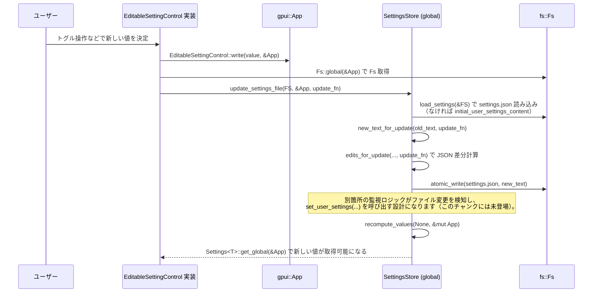

## 1. ざっくり一言

この `settings` クレートは、Zed エディタ全体の **設定・キーマップ・EditorConfig・VS Code 互換設定** を一括で扱うための中核モジュールです。  
JSON 設定ファイル群を型安全な Rust API にマッピングし、複数ファイル・プロジェクト階層・プロファイルを統合して「いま有効な設定値」を提供します。

---

## 2. このモジュールの役割

### 2.1 概要

- `default.json` やユーザー設定、プロジェクト設定など複数の JSON 設定ファイルを読み取り、マージして扱う「設定ストア」を提供します。
- キーバインド（keymap）の JSON をパースし、`gpui::KeyBinding` の列に変換したり、JSON スキーマを生成したりします。
- `.editorconfig` の探索・パース・適用ロジックをカプセル化します。
- VS Code / Cursor の設定ファイルから Zed の設定 (`SettingsContent`) を構築するインポータを提供します。
- 設定 JSON から UI やフォント設定を GPUI の型へ変換するユーティリティ、設定編集用 UI コンポーネントの基盤なども含みます。

### 2.2 アーキテクチャ内での位置づけ

主なモジュール間の関係を簡略化すると、次のようになります。

```mermaid
graph TD
    subgraph settings crate
        S[SettingsStore<br>(settings_store.rs)]
        F[settings_file.rs<br>watch_config_*]
        K[KeymapFile<br>(keymap_file.rs)]
        E[EditorconfigStore<br>(editorconfig_store.rs)]
        V[VsCodeSettings<br>(vscode_import.rs)]
        B[BaseKeymap<br>(base_keymap_setting.rs)]
        G[IntoGpui<br>(content_into_gpui.rs)]
    end

    App[gpui::App] --> S
    App --> F
    App --> K
    App --> E

    Fs[fs::Fs] --> F
    Fs --> S
    Fs --> K
    Fs --> V
    Fs --> E

    settings_content[settings_content crate] --> S
    settings_content --> K
    settings_content --> V
    settings_content --> B
    settings_content --> G

    S -->|update_settings_file| F
    S -->|editorconfig_store(Entity)| E
    S -->|Keymap関連型 re-export| K

    V -->|settings_content()| S
    B --> S
    G --> gpui_types[GPUI型]
```

ポイント:

- `SettingsStore` が「設定の事実上の中枢」で、`gpui::Global` としてアプリ全体から参照されます。
- `settings_file` はファイルシステムの監視を行い、外部コードから `SettingsStore::set_*_settings` などを呼び出す入口になります。
- `KeymapFile`・`EditorconfigStore`・`VsCodeSettings` は、それぞれ特定の設定形式の読み書きや統合を担当します。

### 2.3 設計上のポイント

コードから読み取れる特徴を整理します。

- **設定値は型ごとに分離して管理**
  - `Settings` トレイトを実装した型ごとに `SettingValue<T>` を持ち、グローバル値＋ローカル値（ワークツリーごと／ディレクトリごと）を管理します。
  - 実際の JSON 構造 (`SettingsContent`) からは都度 `from_settings` で読み出します。

- **設定ファイルは複数レイヤをマージ**
  - `default` → extension → global → user → profile → server → local(project) の順でマージ（`SettingsStore::recompute_values`）。
  - ローカル設定は `(WorktreeId, RelPath)` ごとにツリー状に積み重ねて解決します。

- **変更は JSON 差分編集で行う**
  - 設定更新時、文字列としての JSON に対する差分 (`Range<usize>, String`) を計算してから書き戻します（`edits_for_update` / `update_value_in_json_text`）。
  - 未知のキーやコメント、整形スタイルを極力保持します。

- **エディタ周辺の設定は別フォーマットも統合**
  - `.editorconfig`、VS Code / Cursor 設定、キーマップ JSON など複数フォーマットを Zed の `SettingsContent` として統合します。

- **非同期・監視**
  - 設定ファイル更新は `BackgroundExecutor` 経由のタスクで実行し、`fs::watch` による監視と連携します。
  - `.editorconfig` 用の検出タスク・監視タスクを `EditorconfigStore` が持ちます。

---

## 3. 主要な機能一覧

このディレクトリが提供する主な機能を列挙します。

- 設定ストア (`SettingsStore`)
  - 複数設定ファイル（デフォルト／ユーザー／グローバル／サーバー／プロジェクト）のマージ
  - 型付き設定 API（`Settings` トレイト）の提供
  - JSON 設定ファイルの差分更新・マイグレーション

- 設定ファイル監視 (`settings_file.rs`)
  - 単一ファイルの監視 (`watch_config_file`)
  - ディレクトリ内の複数設定ファイル監視 (`watch_config_dir`)
  - テスト用の標準設定 JSON 生成 (`test_settings`, `visual_test_settings`)

- キーマップ (`keymap_file.rs`)
  - ユーザー／組み込み keymap JSON のパース・検証・ロード
  - `gpui` アクションに基づく JSON スキーマ生成
  - キーバインドの追加・置換・削除と JSON テキスト編集 (`update_keybinding`)
  - キーバインドのバリデーション拡張ポイント (`KeyBindingValidator`)

- EditorConfig (`editorconfig_store.rs`)
  - `.editorconfig` のパース・ワークツリーごとの管理
  - 親ディレクトリに存在する外部 `.editorconfig` の探索と監視
  - 対象ファイルパスに対する EditorConfig プロパティ解決 (`properties`)

- VS Code / Cursor 設定インポート (`vscode_import.rs`)
  - VS Code / Cursor の設定ファイル検出・読込 (`load_user_settings`)
  - VS Code の各設定キーから `SettingsContent` へのマッピング (`settings_content`)

- 基本キーマップ選択 (`base_keymap_setting.rs`)
  - VSCode / JetBrains / Emacs などのベースキーマップ種別 (`BaseKeymap`)
  - OS ごとの組み込み keymap 資産パス取得 (`asset_path`)

- GPUI 変換ユーティリティ (`content_into_gpui.rs`)
  - `settings_content` 内のフォント・背景・修飾キー表現を GPUI 型に変換する `IntoGpui` 実装群

- 設定編集 UI 向けトレイト (`editable_setting_control.rs`)
  - 任意の設定値に対する UI コントロールの共通インターフェース
  - UI から設定ファイルへ安全に書き戻すための `write` 実装

---

## 4. 関数・構造体の解説

ここでは、このディレクトリで特に中核となる型・関数をまとめて解説します。

### 4.1 主な構造体・列挙体

| 名前 | 定義ファイル | 種別 | 役割 / 用途 |
|------|--------------|------|-------------|
| `SettingsStore` | `settings_store.rs` | 構造体 | 全設定のマージ・保持・型付きアクセスを行う中枢ストア |
| `Settings` | `settings_store.rs` | トレイト | 各種設定型が実装するインターフェース。`from_settings` で `SettingsContent` から値を構築 |
| `SettingsLocation` | `settings_store.rs` | 構造体 | ローカル設定を解決する際のコンテキスト（`WorktreeId`＋相対パス） |
| `SettingsFile` | `settings_store.rs` | enum | Default / User / Project など、設定ファイルの種別を表す |
| `LocalSettingsPath` | `settings_store.rs` | enum | 設定ファイルがワークツリー内か／外かを表す |
| `EditorconfigStore` | `editorconfig_store.rs` | 構造体 | `.editorconfig` の内容をワークツリー単位で保持し、設定解決を行う |
| `KeymapFile` | `keymap_file.rs` | 構造体（ラッパ） | キーマップ JSON（セクション配列）のトップレベル型 |
| `KeymapSection` | `keymap_file.rs` | 構造体 | 1 つの context（条件）＋bindings/unbind セットを表す |
| `KeymapFileLoadResult` | `keymap_file.rs` | enum | Keymap ロードの成否と部分成功の情報を表す |
| `KeybindUpdateOperation` | `keymap_file.rs` | enum | キーバインドの追加／置換／削除操作を表現 |
| `KeybindUpdateTarget` | `keymap_file.rs` | 構造体 | 1 つのキーバインド（コンテキスト＋キー列＋アクション）を記述 |
| `KeybindSource` | `keymap_file.rs` | enum | キーバインドの由来（User / Default / Vim / Base 等） |
| `ActionSequence` | `keymap_file.rs` | 構造体 | 複数アクションを順に実行する特殊アクション |
| `Editorconfig` | `editorconfig_store.rs` | 構造体 | 1 つの `.editorconfig` の解析結果（is_root とセクション群） |
| `EditorconfigEvent` | `editorconfig_store.rs` | enum | EditorConfig 関連ファイルの更新イベント |
| `VsCodeSettings` | `vscode_import.rs` | 構造体 | VS Code / Cursor 設定ファイルの読込結果 |
| `BaseKeymap` | `base_keymap_setting.rs` | enum | VS Code / JetBrains などのベースキーマップ種別 |
| `IntoGpui` | `content_into_gpui.rs` | トレイト | settings_content の型を GPUI の型に変換するための共通インターフェース |
| `EditableSettingControl` | `editable_setting_control.rs` | トレイト | UI から設定値の読み取り・書き戻しを行うためのインターフェース |

以降では、実際によく使われる代表的な関数やメソッドを絞って解説します。

---

### 4.2 SettingsStore と Settings トレイト

#### `pub trait Settings`

**概要**

- 任意の設定型に実装され、`SettingsContent` から「その型に対応する設定値」を構築するためのトレイトです。
- `SettingsStore` に登録すると、型ごとにグローバル／ローカルの値が保持されます。

**主なメソッド**

| メソッド | 説明 |
|---------|------|
| `fn from_settings(content: &SettingsContent) -> Self` | `default.json` 等をマージした `SettingsContent` から値を構築します。ここで必要なフィールドを自由に読むことができます。 |
| `fn register(cx: &mut App)` | 現在の `App` の `SettingsStore` にこの型の設定を登録します。 |
| `fn get(path: Option<SettingsLocation>, cx: &App) -> &Self` | グローバル or 特定ファイルコンテキストにおける設定値を取得します（未登録なら panic）。 |
| `fn get_global(cx: &App) -> &Self` | グローバル設定値を取得します。 |
| `fn override_global(settings: Self, cx: &mut App)` | グローバル値を直接上書きします（ファイルからの再読込で上書きされうる点に注意）。 |

**使用例（簡略）**

```rust
// 例: auto_update 設定を表す型
#[derive(Debug, PartialEq)]
struct AutoUpdateSetting {
    auto_update: bool,
}

impl settings::Settings for AutoUpdateSetting {
    fn from_settings(content: &settings::SettingsContent) -> Self {
        AutoUpdateSetting {
            auto_update: content.auto_update.unwrap(), // default.json に必須である前提
        }
    }
}

// どこかの初期化コード
fn init_settings(cx: &mut gpui::App) {
    settings::init(cx);                       // SettingsStore をグローバルに登録
    AutoUpdateSetting::register(cx);          // AutoUpdateSetting をストアに登録
}

// 利用側
fn should_auto_update(cx: &gpui::App) -> bool {
    AutoUpdateSetting::get_global(cx).auto_update
}
```

#### `impl SettingsStore`

`SettingsStore` には多数のメソッドがありますが、典型的な流れに関わるものを中心に説明します。

##### `pub fn new(cx: &mut App, default_settings: &str) -> Self`

- `default_settings` 文字列（通常は `settings/default.json` の内容）を `SettingsContent` としてパースし、`DefaultSemanticTokenRules` も設定したうえで `SettingsStore` を構築します。
- `inventory` で収集した `RegisteredSetting`（`Settings` を実装した型）をすべて登録し、初期値をセットします。

##### `pub fn set_user_settings(&mut self, user_settings_content: &str, cx: &mut App)`

- ユーザー設定 JSON（`settings.json` 相当）をパース・マイグレーションして `UserSettingsContent` として保持します。
- 成功時には `recompute_values` を呼び、すべての `Settings` 型のグローバル値とローカル値を再計算します。
- 解析エラーやマイグレーション結果は `SettingsParseResult` として返されます。

##### `pub fn set_local_settings(&mut self, root_id: WorktreeId, path: LocalSettingsPath, kind: LocalSettingsKind, settings_content: Option<&str>, cx: &mut App)`

- プロジェクト／ワークツリー配下の `settings.json`（や `editorconfig`）からのローカル設定を受け取り、ストアに反映します。
- `LocalSettingsKind::Settings` の場合に `ProjectSettingsContent` としてパースされ、`local_settings: BTreeMap<(WorktreeId, Arc<RelPath>), SettingsContent>` に格納されます。
- 追加・更新・削除に応じて `recompute_values(Some((root_id, &directory_path)))` が呼ばれ、そのディレクトリ配下の設定が再計算されます。

##### `pub fn update_settings_file(&self, fs: Arc<dyn Fs>, update: impl 'static + Send + FnOnce(&mut SettingsContent, &App))`

- 実際に **ユーザー設定ファイルを書き換える**ためのユーティリティです。
- 内部で `update_settings_file_inner` を呼び出し、以下の流れで更新します：
  1. `load_settings(fs)` で現在の `settings.json` を読み込み（存在しなければ初期内容を使用）。
  2. `SettingsStore::new_text_for_update` に旧テキストと `update` クロージャを渡し、新しい JSON テキストを生成。
  3. `fs.atomic_write` で設定ファイルを原子的に書き換え。

この関数は UI コンポーネントからも利用され、`EditableSettingControl::write` 経由で呼ばれます。

##### `fn recompute_values(&mut self, changed_local_path: Option<(WorktreeId, &RelPath)>, cx: &mut App)`

- マージされた設定 (`merged_settings: SettingsContent`) と、各 `Settings` 型のグローバル値／ローカル値を再計算する中核処理です。
- `changed_local_path` が `None` の場合は、default → extension → global → user（＋プロファイル）→ server を順にマージし、その上に「全ローカル設定の `disable_ai`」だけを集約してグローバル値に反映します。
- その後、`local_settings` を `(WorktreeId, RelPath)` の順で走査し、ディレクトリ階層毎に `SettingsContent` を積み上げていきます。

---

### 4.3 設定ファイル監視（settings_file.rs）

#### `pub fn watch_config_file(...) -> (mpsc::UnboundedReceiver<String>, gpui::Task<()>)`

- 単一の設定ファイルパスに対して `fs.watch` を開始し、最初の内容＋以降の変更内容を `String` として送出するストリームを返します。
- ファイル削除時は空文字列が送られます。

#### `pub fn watch_config_dir(...) -> mpsc::UnboundedReceiver<String>`

- ディレクトリ全体を監視し、指定された `config_paths` に含まれるファイルに対する変更イベントを検知します。
- `PathEventKind` に応じて、削除なら空文字列、作成／変更ならファイル内容を読み出して送出します。
- `Rescan` イベント時は対象ファイルをすべて再読み込みします。

このレイヤーでは `SettingsStore` には触れず、「どの設定ファイルがどう変わったか」を `String` として上位レイヤに通知する責務にとどまっています。

---

### 4.4 KeymapFile とキーバインド更新

#### `KeymapFile`

- `#[serde(transparent)] pub struct KeymapFile(Vec<KeymapSection>)` という薄いラッパーです。
- 主なメソッド:

  - `pub fn parse(content: &str) -> anyhow::Result<Self>`
    - コメント付き JSON をパースし、空白のみなら空配列として扱います。
  - `pub fn load(content: &str, cx: &App) -> KeymapFileLoadResult`
    - 各セクションの `context` を `KeyBindingContextPredicate` としてパースし、`bindings` と `unbind` を `KeyBinding` に変換します。
    - パースエラーや無効な keystroke などを収集し、成功・部分成功・パース失敗の 3 パターンで返します。
  - `pub fn load_asset(asset_path: &str, source: Option<KeybindSource>, cx: &App)`
    - `RustEmbed` された組み込み keymap を読み込み、必要なら `KeyBinding` に `KeybindSource` メタデータを付与して返します。

#### `pub fn update_keybinding(...) -> Result<String>`

**概要**

- JSON テキストとしての keymap 内容に対して、1 件のキーバインド追加・置換・削除を行い、新しい JSON テキストを返します。
- コメントや整形（インデント）を保持するため、構文木ではなくテキスト編集ベースで動作します。

**内部処理（簡略）**

1. `KeybindUpdateOperation` の種別とターゲット keymap の由来 (`KeybindSource`) に基づき、必要なら suppression 用の `unbind` を準備。
2. `KeymapFile::parse` で keymap をパースし、ターゲットバインドの位置を `find_binding` で探索。
3. 操作種別ごとに JSON テキストの一部を `append_top_level_array_value_in_json_text` / `replace_top_level_array_value_in_json_text` で置き換え。
4. suppression が必要な場合は `unbind` セクションを追記。

**エッジケース（テストより読み取れるもの）**

- ターゲットがユーザー由来 (`KeybindSource::User`) の場合、削除は元のエントリを JSON から実際に取り除きます。
- ターゲットが組み込み由来の場合は、削除・置換によって `unbind` セクションが追加され、元のバインドを上書きします。
- 同じセクション内に 1 つしかバインドがない場合、コンテキスト変更を伴う置換ではセクション全体の `context` を更新します。

---

### 4.5 EditorconfigStore

#### `pub struct EditorconfigStore`

- 各ワークツリー単位に以下を保持します。

  - `internal_configs`: ワークツリー内（`LocalSettingsPath::InWorktree`）の `.editorconfig` 内容とパース結果。
  - `external_configs`: ワークツリーの親ディレクトリにある外部 `.editorconfig` の内容とパース結果。
  - `external_config_paths`: そのワークツリーが参照している外部 `.editorconfig` のディレクトリパス集合。
  - 監視タスク (`Task<()>`) 群。

#### `pub(crate) fn set_configs(...) -> Result<(), InvalidSettingsError>`

- 1 つの `.editorconfig` ファイル（ワークツリー内 or 外部）の内容を受け取り、ストアに反映します。
- 内容が `None` の場合は削除として扱い、使われなくなった外部設定は `external_configs` からも削除します。
- パースエラー時には `InvalidSettingsError::Editorconfig` を返し、パース結果は `None` のまま保存されます。

#### `pub fn properties(&self, for_worktree: WorktreeId, for_path: &RelPath) -> Option<EditorconfigProperties>`

**概要**

- 指定ワークツリー・ファイルパスに対して、有効な `.editorconfig` プロパティを計算して返します。
- 外部 `.editorconfig` → 内部 `.editorconfig` の順に適用し、`is_root` セクションで適用範囲をリセットします。

**ポイント**

- 内部 root `.editorconfig` が存在して `is_root` の場合、外部 `.editorconfig` は無視されます。
- `for_path.ancestors()` を辿りながら、親ディレクトリにある `.editorconfig` を近い順に適用していきます。

---

### 4.6 VsCodeSettings

#### `pub struct VsCodeSettings`

- `source`: VS Code 由来か Cursor 由来か。
- `path`: 実際に読み込んだ設定ファイルのパス。
- `content`: パース済みの `serde_json::Map<String, Value>`。

#### `pub async fn load_user_settings(source: VsCodeSettingsSource, fs: Arc<dyn Fs>) -> Result<Self>`

- `vscode_settings_file_paths()` または `cursor_settings_file_paths()` で候補パス群を取得し、存在する最後のパスを設定ファイルとして採用します。
- ファイル読み込み・パース時には `source` と `path` を含むエラーメッセージを付加します。

#### `pub fn settings_content(&self) -> SettingsContent`

**概要**

- VS Code 設定の各キー（`editor.*`, `workbench.*`, `git.*` 等）から Zed の `SettingsContent` を構築します。
- `skip_default` ヘルパを用いて、デフォルト値と同じ内容は `None` にして JSON への書き出しを抑制します。

**例**

- `editor.fontFamily` → `ThemeSettingsContent.buffer_font_family` / `buffer_font_fallbacks`
- `editor.tabSize` → `ProjectSettingsContent.all_languages.defaults.tab_size`
- `git.decorations.enabled` → `project_panel.git_status`, `outline_panel.git_status`, `tabs.git_status` など

`SettingsStore::get_vscode_edits` では、この `SettingsContent` を `SettingsContent::merge_from` でマージして、元のユーザー設定 JSON に対する差分を生成します。

---

### 4.7 その他のユーティリティ

#### `BaseKeymap`（`base_keymap_setting.rs`）

- `VSCode`, `JetBrains`, `SublimeText`, `Atom`, `TextMate`, `Emacs`, `Cursor`, `None` などのベースキーマップ種別を表す enum です。
- `impl Settings for BaseKeymap` により、`SettingsContent.base_keymap` から設定値として読み出されます。
- OS ごとに `OPTIONS`（UI に表示する名称＋値のリスト）と、組み込み keymap 資産のパス（`asset_path`）が変わります。

#### `IntoGpui`（`content_into_gpui.rs`）

- `FontStyleContent` → `gpui::FontStyle`
- `FontWeightContent` → `gpui::FontWeight`
- `FontFeaturesContent` → `gpui::FontFeatures`
- `WindowBackgroundContent` → `gpui::WindowBackgroundAppearance`
- `ModifiersContent` → `gpui::Modifiers`
- `FontSize` → `gpui::Pixels`
- `FontFamilyName` → `gpui::SharedString`

など、`settings_content` 内の構造体を GPUI の描画用型に変換するためのトレイト実装群です。

#### `EditableSettingControl`（`editable_setting_control.rs`）

- 任意の設定値に対応する UI コントロールが実装するトレイトです。

```rust
pub trait EditableSettingControl: RenderOnce {
    type Value: Send;
    fn name(&self) -> SharedString;
    fn read(cx: &App) -> Self::Value;
    fn apply(settings: &mut SettingsContent, value: Self::Value, cx: &App);
    fn write(value: Self::Value, cx: &App) {
        let fs = <dyn Fs>::global(cx);
        update_settings_file(fs, cx, move |settings, cx| {
            Self::apply(settings, value, cx);
        });
    }
}
```

- `write` メソッドは `update_settings_file` を通じてユーザー設定ファイルを書き換えます。
- これにより、「UI → SettingsContent → JSON ファイル」という流れが共通化されています。

---

## 5. データフロー

### 5.1 代表的な処理シナリオ：UI から設定を変更する

ここでは「UI からタブの表示設定（例として `tabs.git_status`）を変更する」ケースを例に、データがどう流れるかを示します。



要点:

- UI 側は `SettingsContent` の詳細を知らず、`apply` クロージャ内で `SettingsContent` に対する書き込みのみを記述します。
- 実際の JSON 編集・ファイル書き込みは `SettingsStore` の責務です。
- ファイル変更を再度 `SettingsStore` に反映する監視／再読込ロジックは別モジュールで実装されています（このチャンクには含まれていません）。

---

## 6. 使い方（How to Use）

### 6.1 基本的な使用方法

#### 6.1.1 初期化とグローバル登録

```rust
use settings::{self, SettingsStore};
use gpui::App;

fn init_settings(cx: &mut App) {
    // assets/settings/default.json を読み込んで SettingsStore を構築し、
    // gpui::Global として登録する。
    settings::init(cx);

    // 自前の設定型を追加したい場合は Settings トレイトを実装し、register を呼ぶ。
    MySetting::register(cx);
}

// 例: ある設定値を表す型
#[derive(Debug, PartialEq)]
struct MySetting {
    auto_update: bool,
}

impl settings::Settings for MySetting {
    fn from_settings(content: &settings::SettingsContent) -> Self {
        MySetting {
            auto_update: content.auto_update.unwrap(),
        }
    }
}
```

#### 6.1.2 設定値の取得

```rust
use settings::{Settings, SettingsLocation, WorktreeId};
use util::rel_path::rel_path;

// グローバル値
fn use_global_setting(cx: &gpui::App) {
    let s = MySetting::get_global(cx);
    println!("auto_update = {}", s.auto_update);
}

// ファイルコンテキスト付き
fn use_local_setting(cx: &gpui::App) {
    let loc = SettingsLocation {
        worktree_id: WorktreeId::from_usize(1),
        path: rel_path("project/src/main.rs"),
    };
    let s = MySetting::get(Some(loc), cx);
    // ローカル settings.json があればそれを、なければ上位の設定を見た結果になります。
}
```

### 6.2 よくある使用パターン

#### 6.2.1 Keymap の JSON から `KeyBinding` をロードする

```rust
use settings::{KeymapFile, KeymapFileLoadResult};
use gpui::App;

fn load_user_keymap(cx: &mut App, json: &str) -> Vec<gpui::KeyBinding> {
    match KeymapFile::load(json, cx) {
        KeymapFileLoadResult::Success { key_bindings } => key_bindings,
        KeymapFileLoadResult::SomeFailedToLoad {
            key_bindings,
            error_message,
        } => {
            eprintln!("Keymap 部分ロード: {}", error_message.0);
            key_bindings
        }
        KeymapFileLoadResult::JsonParseFailure { error } => {
            eprintln!("Keymap JSON エラー: {error}");
            Vec::new()
        }
    }
}
```

#### 6.2.2 Keymap を 1 件だけ編集する

```rust
use settings::{KeymapFile, KeybindUpdateOperation, KeybindUpdateTarget};
use gpui::{DummyKeyboardMapper, KeybindingKeystroke, Keystroke};

fn parse_keystrokes(s: &str) -> Vec<KeybindingKeystroke> {
    s.split(' ')
        .map(|k| {
            KeybindingKeystroke::new_with_mapper(
                Keystroke::parse(k).unwrap(),
                false,
                &DummyKeyboardMapper,
            )
        })
        .collect()
}

fn add_binding(json: String) -> anyhow::Result<String> {
    let op = KeybindUpdateOperation::add(KeybindUpdateTarget {
        context: Some("Editor"),
        keystrokes: &parse_keystrokes("ctrl-k ctrl-u"),
        action_name: "editor::ConvertToUpperCase",
        action_arguments: None,
    });

    KeymapFile::update_keybinding(op, json, 4, &DummyKeyboardMapper)
}
```

#### 6.2.3 VS Code 設定を取り込む

```rust
use settings::{SettingsStore, VsCodeSettings, VsCodeSettingsSource};
use gpui::App;

async fn import_vscode_settings(cx: &mut App, fs: std::sync::Arc<dyn fs::Fs>) -> anyhow::Result<()> {
    let vscode = VsCodeSettings::load_user_settings(VsCodeSettingsSource::VsCode, fs.clone()).await?;
    let store = SettingsStore::global(cx);

    // settings.json の内容を書き換える非同期操作
    let rx = store.import_vscode_settings(fs, vscode);
    rx.await??;
    Ok(())
}
```

### 6.3 よくある間違い

```rust
// 誤り例: SettingsStore がまだ init されていないのに get_global する
fn bad_use(cx: &gpui::App) {
    let _ = MySetting::get_global(cx); // SettingsStore が未登録なら panic
}

// 正しい例: settings::init を呼んだ後に利用する
fn good_use(cx: &mut gpui::App) {
    settings::init(cx);
    MySetting::register(cx);

    let s = MySetting::get_global(cx);
    println!("{s:?}");
}
```

```rust
// 誤り例: settings.json の文字列を直接書き換えてしまう
fn bad_edit(json: &mut String) {
    *json = r#"{ "auto_update": "not_bool" }"#.to_string(); // 型不整合
}

// 正しい例: SettingsStore::new_text_for_update を通して差分編集する
fn good_edit(store: &SettingsStore, old: String) -> anyhow::Result<String> {
    store.new_text_for_update(old, |c| {
        c.auto_update = Some(true);
    })
}
```

### 6.4 使用上の注意点（まとめ）

- **Settings 型の登録順序**
  - `SettingsStore` 初期化後に `Settings::register` を呼ぶ必要があります。  
    先に設定 JSON を読み込み、後から型を登録するパターンはテストコードでサポートされていますが、通常は `settings::init` 直後に登録する構成が分かりやすいです。

- **パースエラー／マイグレーションエラー**
  - `set_*_settings` は `SettingsParseResult` を返し、パースエラーやマイグレーション失敗を保持します。
  - `requires_user_action()` が `true` の場合、ユーザーにエラー表示や手動修正を促す必要があります。

- **Keymap JSON の整合性**
  - `KeymapFile::update_keybinding` は、元 JSON がパースできる前提で動作します。  
    JSON が壊れている場合は更新を行わずエラーになります。
  - キー列は `Keystroke::parse` に通る形にする必要があります（テストから `"\\ a"` のような特殊ケースもハンドリングされていることがわかります）。

- **EditorConfig の扱い**
  - ワークツリー外の `.editorconfig` は `LocalSettingsPath::OutsideWorktree` として扱われます。  
    この種別で `LocalSettingsKind::Settings` などを渡すとログ出力され、処理は行われません（EditorConfig 専用です）。

- **非同期更新と競合**
  - `update_settings_file` や `import_vscode_settings` は内部で非同期タスクを起動し、実際のファイル書き込み結果は `oneshot::Receiver<Result<()>>` 経由で返されます。
  - 複数箇所から同時に設定ファイルを書き換えると、FS レベルで競合する可能性があるため、上位レイヤーでの排他やキューイングが前提となっていると考えられます（このチャンクでは詳細不明）。

---

## 7. 関連ファイル

このディレクトリ内の各ファイルと役割の対応を表にまとめます。

| パス | 役割 / 関係 |
|------|------------|
| `settings/Cargo.toml` | クレートのメタデータと依存関係の定義。`lib.path = "src/settings.rs"` により `settings.rs` がクレートルートになります。 |
| `settings/src/settings.rs` | クレートの公開 API 集約。サブモジュールの宣言と re-export、`SettingsAssets` の定義、デフォルト設定・キーマップの読み込み関数、`WorktreeId` 定義など。 |
| `settings/src/settings_store.rs` | 設定ストア本体。`Settings` トレイト・ローカル設定管理・JSON 更新・スキーマ生成・VS Code インポートなど、設定周りの中核がここに集約されています。 |
| `settings/src/settings_file.rs` | 設定ファイル／ディレクトリの監視ロジック。テスト用の設定 JSON 生成、`watch_config_file` / `watch_config_dir`、`update_settings_file` の薄いラッパーを提供します。 |
| `settings/src/keymap_file.rs` | キーマップ JSON のパース・検証・スキーマ生成・更新ロジック。`KeymapFile`、`KeybindUpdateOperation`、`ActionSequence` などを定義し、`settings.rs` から re-export されています。 |
| `settings/src/editorconfig_store.rs` | `.editorconfig` のパース・ワークツリーごとの保持・外部ファイル探索と監視・プロパティ解決を担当します。`SettingsStore` のフィールドとして保持されます。 |
| `settings/src/vscode_import.rs` | VS Code / Cursor 設定ファイルの読み込みと、Zed の `SettingsContent` へのマッピングロジック。`SettingsStore::get_vscode_edits` から利用されます。 |
| `settings/src/base_keymap_setting.rs` | `BaseKeymap` enum と `Settings` 実装。UI で選択されるベースキーマップ種別と、組み込み keymap 資産のパス解決を提供します。 |
| `settings/src/content_into_gpui.rs` | `settings_content` の各種型（フォント・背景・修飾キーなど）から GPUI の型への変換トレイト `IntoGpui` の実装群。UI 側で利用されます。 |
| `settings/src/editable_setting_control.rs` | 設定編集用 UI コントロールの共通インターフェース `EditableSettingControl` を定義し、`update_settings_file` を用いた書き戻し処理をカプセル化します。 |

このディレクトリ全体として、**設定・キーマップ・EditorConfig・VS Code 互換設定を一元的に扱うための「設定サービスレイヤ」** を構成していると解釈できます。
