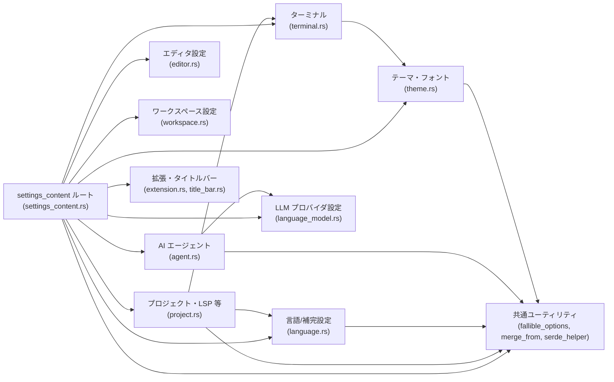
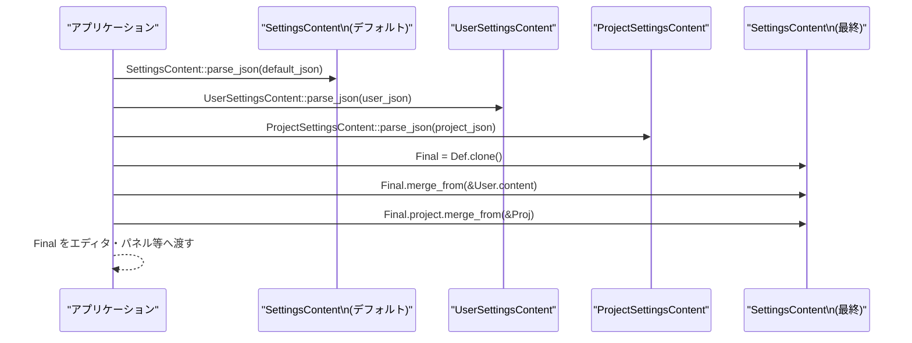

# settings_content/ ディレクトリ

## 1. ざっくり一言

Zed の設定ファイル（JSON）を **型安全に表現・パース・マージ** するための構造体・enum・ユーティリティ群をまとめたクレートです。  
エディタ・テーマ・言語サーバ・AI エージェント・ターミナルなど、ほぼすべてのユーザー設定がここで定義されています。

---

## 2. このモジュールの役割

### 2.1 概要

- このディレクトリは、Zed の設定システム全体を表す **設定ドメインモデル** を提供します。
- 具体的には:
  - JSON 設定ファイル → Rust 構造体への **パース**（コメント付き JSON / lenient JSON 対応）
  - 既定値・ユーザー設定・プロジェクト設定・プロファイル設定などの **多層マージ**
  - UI 用の **JSON Schema 出力**（`schemars`）と、きれいな JSON シリアライズ（特に `f32`）
- ほぼすべてのフィールドが `Option<T>` になっており、「未指定か／明示的な値か」を区別して扱える設計です。

### 2.2 アーキテクチャ内での位置づけ

クレートのルート `settings_content.rs` が各サブモジュールを `pub use` で再エクスポートし、  
アプリケーションからは単一のクレートとして利用できる構造になっています。



- `SettingsContent`（ルート設定構造体）が各サブ設定（`ProjectSettingsContent`, `EditorSettingsContent` など）をフィールドとして保持します。
- `merge_from::MergeFrom` トレイトと `ExtendingVec`, `SaturatingBool` などが **設定のマージポリシー** を定義しています。
- `fallible_options` と `with_fallible_options` マクロが、設定の「部分的なパース成功＋エラー収集」を実現します。

### 2.3 設計上のポイント

- **多層マージを前提にした設計**
  - `MergeFrom` トレイトで「オブジェクトは深くマージ、スカラー/Vec は上書き、Option は None を無視」といったルールを統一。
  - `AllLanguageSettingsContent` など、一部は独自のマージロジック（グローバルと per-language の優先順位）を実装。
- **部分的パース（Fallible Options）**
  - `with_fallible_options` 付きの型では、フィールド単位のパース失敗を飲み込みつつ、エラー文字列を集約して返せるようになっています。
- **Schema 主導設計**
  - `schemars::JsonSchema` 実装や `#[schemars(...)]` 属性により、設定 UI や補完のための JSON Schema を自動生成。
- **新しい型で意味を明示**
  - `FontSize`, `DelayMs`, `MinimumContrast`, `CenteredPaddingSettings` など、素の `f32`/`u64` ではなく意味付きの newtype を多用。
  - 値域チェックを JsonSchema あるいはデシリアライズ時に行うものもあります。
- **外部サービス設定のモデル化**
  - Anthropic / OpenAI / Ollama など複数の LLM プロバイダ設定を、共通パターン＋プロバイダ固有フィールドで表現。

---

## 3. 主要な機能一覧

- **ルート設定表現**
  - `SettingsContent`, `UserSettingsContent`, `ProjectSettingsContent` など、Zed 全体／ユーザー／プロジェクト単位の設定構造体。
- **設定ファイルのパース**
  - `RootUserSettings::parse_json`, `parse_json_with_comments` による JSON / コメント付き JSON の読み込み。
  - `fallible_options::parse_json` による lenient JSON パースとエラー収集。
- **設定のマージ**
  - `merge_from::MergeFrom` トレイトとその実装（Option, Vec, HashMap, serde_json::Value 他）。
  - 特殊なマージ動作を持つ `ExtendingVec<T>`, `SaturatingBool`.
- **個別領域ごとの設定モデル**
  - エディタ: `EditorSettingsContent`, `LanguageSettingsContent`
  - ワークスペース/UI: `WorkspaceSettingsContent`, `ThemeSettingsContent`, `ProjectPanelSettingsContent` など
  - LSP/DAP/Diagnostics: `GlobalLspSettingsContent`, `LspSettingsMap`, `DiagnosticsSettingsContent`
  - ターミナル: `TerminalSettingsContent`, `ProjectTerminalSettingsContent`
  - AI/エージェント: `AgentSettingsContent`, `AllLanguageModelSettingsContent`, `ToolPermissionsContent`
  - リモート接続: `RemoteSettingsContent`, `SshConnection`, `DevContainerConnection`
- **JSON シリアライズ補助**
  - `serialize_f32_with_two_decimal_places`, `serialize_optional_f32_with_two_decimal_places`
  - 各種 newtype の `Display` 実装と Schema 定義。

---

## 4. 関数・構造体の解説

### 4.1 代表的な構造体・列挙体一覧

| 型名 | 定義ファイル | 役割 / 用途 |
|------|--------------|-------------|
| `SettingsContent` | `settings_content.rs` | すべての設定を 1 つの構造体にまとめたルート。`project`, `theme`, `workspace`, `editor`, `agent`, `terminal` などをフィールドとして持つ。 |
| `UserSettingsContent` | `settings_content.rs` | ユーザー設定一式。`content: Box<SettingsContent>` に加え、リリースチャネル別・プラットフォーム別のオーバーライドと任意のプロファイル群を含む。 |
| `ProjectSettingsContent` | `project.rs` | プロジェクト単位の設定。言語設定(`AllLanguageSettingsContent`)、LSP/DAP/ターミナル/コンテキストサーバ/Git/Diagnostics などを含む。 |
| `AllLanguageSettingsContent` | `language.rs` | 共通の言語設定と、言語ごとの `LanguageSettingsContent`、`file_types` マッピング等をまとめた構造体。独自の `merge_from` 実装あり。 |
| `LanguageSettingsContent` | `language.rs` | 1 言語あたりのエディタ/フォーマッタ/補完/インレイヒント等の細かな設定。 |
| `ThemeSettingsContent` | `theme.rs` | UI・バッファのフォント、行間、テーマ/アイコンテーマ選択、テーマオーバーライド等。 |
| `WorkspaceSettingsContent` | `workspace.rs` | ウィンドウ・タブ・プロジェクトパネル・ステータスバーなど、ワークスペース全体の挙動と見た目の設定。 |
| `EditorSettingsContent` | `editor.rs` | エディタのカーソル・スクロール動作・ミニマップ・検索・Jupyter 等の設定。 |
| `TerminalSettingsContent` | `terminal.rs` | ターミナルのフォント・行高さ・シェル・スクロールバックなどの設定。 |
| `AgentSettingsContent` | `agent.rs` | AI エージェントパネルの有効/無効、モデル選択、サイドバー位置、ツール権限など。 |
| `AllLanguageModelSettingsContent` | `language_model.rs` | Anthropic, OpenAI, Ollama 他、各種 LLM プロバイダの API URL・利用可能モデル一覧など。 |
| `GitSettings` | `project.rs` | Git 連携の有効/無効、インライン blame、ワークツリーディレクトリ等。 |
| `DiagnosticsSettingsContent` | `project.rs` | プロジェクト診断パネル、LSP pull diagnostics、インライン診断表示の設定。 |
| `RemoteSettingsContent` | `settings_content.rs` | SSH / WSL / DevContainer 接続設定。 |
| `ThemeStyleContent` | `theme.rs` | カラー・シンタックスハイライト・ステータス色など、テーマスタイルそのもの。 |
| `FontSize`, `FontWeightContent`, `BufferLineHeight` | `theme.rs` | フォントサイズ・ウェイト・行高の newtype / enum。シリアライズとバリデーションを内包。 |
| `DelayMs`, `InactiveOpacity`, `CenteredPaddingSettings` | `settings_content.rs`, `editor.rs` | ミリ秒・不透明度・センタリングパディングを表す newtype。JsonSchema/表示のためのラッパー。 |
| `ExtendingVec<T>` | `settings_content.rs` | 設定のマージ時に「追記のみ」を行う特殊なベクタ（例: private_files の追加など）。 |
| `SaturatingBool` | `settings_content.rs` | 一度 `true` になると `false` に戻せない bool（例: `disable_ai`）。 |

この他にも細かい enum（`ScrollBeyondLastLine`, `SoftWrap`, `AutosaveSetting`, `DockPosition`, `SemanticTokens` など）が非常に多く定義されていますが、いずれも「設定値のドメインを限定するための列挙体」として機能しています。

### 4.2 重要な関数・メソッドの詳細（抜粋）

#### `fallible_options::parse_json<T>(json: &str) -> (Option<T>, ParseStatus)`

**概要**

- コメントなしの JSON 文字列を `T` にパースします。
- `with_fallible_options` 付きの構造体では、フィールド単位の型エラーを蓄積しつつ、可能な限り値を構築します。
- 全体として致命的なパースエラーがあれば `Option<T>` が `None` になり、`ParseStatus::Failed` にエラーメッセージが入ります。

**引数 / 戻り値**

| 引数名 | 型 | 説明 |
|--------|----|------|
| `json` | `&str` | 入力 JSON 文字列 |

戻り値:

- `Option<T>`: パースに成功した場合は `Some(T)`。致命的エラー時は `None`。
- `ParseStatus`:
  - `Success`: エラーなし。
  - `Failed { error: String }`: フィールド単位のエラーを含むエラーメッセージ。

**内部処理の流れ**

1. スレッドローカルの `ERRORS` に空の `Vec<anyhow::Error>` をセット。
2. `serde_json_lenient::Deserializer::from_str` で lenient JSON デシリアライザを生成。
3. `T::deserialize(&mut deserializer)` を実行。
   - `with_fallible_options` 付きのフィールドは、`fallible_options::deserialize` を通じ、エラー発生時に
     - エラーを `ERRORS` に記録
     - フィールドには `Default::default()`（多くは `None`）を入れる
4. もし `T::deserialize` 自体が失敗した場合は、すぐに `None + ParseStatus::Failed` を返す。
5. そうでなければ、`ERRORS` に溜まったエラーを文字列に連結し、空でなければ
   - `(Some(value), ParseStatus::Failed { error })`
   を返す。
6. エラーがなければ `(Some(value), ParseStatus::Success)` を返す。

**使用例**

```rust
use settings_content::{fallible_options, ParseStatus};

#[derive(Debug, PartialEq, serde::Deserialize)]
struct MySettings {
    // with_fallible_options を使っていれば、Option フィールドの型エラーは落とさずに保持できる
    foo: Option<String>,
    bar: Option<u32>,
}

let json = r#"{ "foo": "ok", "bar": "not a number" }"#;
let (parsed, status) = fallible_options::parse_json::<MySettings>(json);

let settings = parsed.unwrap();
assert_eq!(settings.foo, Some("ok".into()));
assert_eq!(settings.bar, None);

match status {
    ParseStatus::Success => {}
    ParseStatus::Failed { error } => {
        eprintln!("設定の一部にエラーがあります:\n{error}");
    }
}
```

**エッジケース**

- JSON 構文が壊れている場合 → `parsed` は `None`、`ParseStatus::Failed`。
- `with_fallible_options` でない型（素の `Deserialize` のみ）を `T` に指定すると、フィールドエラーも即座に致命的エラーになります。
- `fallible_options::deserialize` は、`ERRORS` が `None` のとき（`parse_json` を通っていない場合）はエラーを貯めず、そのまま `Err(e)` を返します。

**使用上の注意点**

- 「部分的成功」を使いたい場合は、必ず `with_fallible_options` を derive した設定構造体を使い、この `parse_json` を経由する必要があります。
- 呼び出し側は **常に `ParseStatus` を確認する** 前提になっています。

---

#### `merge_from::MergeFrom::merge_from(&mut self, other: &Self)`

**概要**

- 設定を「下層（既定値） ← 上層（ユーザー設定）」のように段階的に重ねるための共通トレイトです。
- 実装は型ごとに異なり、やや特殊な挙動 (`Option`, `ExtendingVec`, `SaturatingBool` など) を持つものがあります。

**代表的な実装パターン**

- スカラー (`u32`, `bool`, `String` 等)・`Vec<T>`:
  - `*self = other.clone()`（上層完全上書き）
- `Option<T>`（`T: MergeFrom + Clone`）:
  - `other` が `None` → 何もしない（下層値を保持）
  - `other` が `Some`:
    - `self` も `Some` → 中身同士を `merge_from`
    - `self` が `None` → `self` に `other.clone()` を設定
- `HashMap<K, V>` / `IndexMap<K, V>` / `BTreeMap<K, V>`（`V: MergeFrom`）:
  - キーごとに、存在すれば値を `merge_from`、なければ `clone()` して追加。
- `ExtendingVec<T>`:
  - `self.0.extend_from_slice(other.0.as_slice())`（下層に追記）。
- `SaturatingBool`:
  - `self.0 |= other.0`（一度 `true` になったものは戻らない）。

**使用例（設定レイヤのマージ）**

```rust
use settings_content::{SettingsContent, UserSettingsContent, MergeFromTrait, RootUserSettings, ParseStatus};

fn merge_layers(
    default_json: &str,
    user_json: &str,
) -> anyhow::Result<SettingsContent> {
    // デフォルト設定（エラーは無視した例）
    let (mut merged, _) = SettingsContent::parse_json(default_json);
    let mut merged = merged.unwrap_or_default();

    // ユーザー設定
    let (user, status) = UserSettingsContent::parse_json(user_json);
    if let ParseStatus::Failed { error } = status {
        eprintln!("ユーザー設定にエラーがあります:\n{error}");
    }
    if let Some(user) = user {
        // UserSettingsContent は SettingsContent を Box で持っている
        merged.merge_from(&user.content);
    }

    Ok(merged)
}
```

**使用上の注意点**

- `Option<T>` は「`None` で元の値を消す」ことはできません（`None` は「未指定」を意味し、マージ時は無視される）。  
  → 既定値を「消す」動作はサポートされません。
- `ExtendingVec` や `SaturatingBool` のような特殊型は「上から上書き」にならないので、設定 UI やドキュメント側で意味を明示する必要があります。

---

#### `SettingsContent::languages_mut(&mut self) -> &mut HashMap<String, LanguageSettingsContent>`

**概要**

- ルート設定構造体から、言語ごとの `LanguageSettingsContent` マップに直接アクセスするためのショートカットです。
- `settings.project.all_languages.languages.0` へのエイリアスです。

**内部処理**

```rust
pub fn languages_mut(&mut self) -> &mut HashMap<String, LanguageSettingsContent> {
    &mut self.project.all_languages.languages.0
}
```

**使用例**

```rust
use settings_content::{SettingsContent, LanguageSettingsContent};

let mut settings = SettingsContent::default();

// Rust 言語の設定を上書き
settings
    .languages_mut()
    .entry("Rust".to_string())
    .or_insert_with(LanguageSettingsContent::default)
    .tab_size = Some(4.try_into().unwrap());
```

**使用上の注意点**

- このメソッドは **既定のマージロジックをバイパス** します。  
  すでに複数レイヤをマージした結果に対し、直接ミューテーションする用途向けです。

---

#### `VenvSettings::as_option(&self) -> Option<VenvSettingsContent<'_>>`（`terminal.rs`）

**概要**

- `VenvSettings` enum（`Off` / `On{...}`）を、使いやすい `VenvSettingsContent` に変換します。
- 呼び出し側は `Option` を見て、「仮想環境を有効にするかどうか」と具体的な設定を同時に取得できます。

**挙動**

```rust
pub fn as_option(&self) -> Option<VenvSettingsContent<'_>> {
    match self {
        VenvSettings::Off => None,
        VenvSettings::On { activate_script, venv_name, directories, conda_manager } => {
            Some(VenvSettingsContent {
                activate_script: activate_script.unwrap_or(ActivateScript::Default),
                venv_name: venv_name.as_deref().unwrap_or(""),
                directories: directories.as_deref().unwrap_or(&[]),
                conda_manager: conda_manager.unwrap_or(CondaManager::Auto),
            })
        }
    }
}
```

**使用上の注意点**

- `VenvSettings::On` の内部フィールドはすべて `Option` なので、ここでデフォルト値が埋められます。
- 仮想環境を探すロジック自体はこのクレートには存在せず、呼び出し側（ターミナル実装側）が `VenvSettingsContent` を使って実装します。

---

#### `SemanticTokens::enabled` / `use_tree_sitter`（`workspace.rs`）

**概要**

- LSP の semantic tokens を使うか、tree-sitter を併用／専用で使うかを判定するユーティリティです。

```rust
pub fn enabled(&self) -> bool {
    self != &Self::Off
}

pub fn use_tree_sitter(&self) -> bool {
    self != &Self::Full
}
```

**使用例**

- `Combined` → `enabled() == true`, `use_tree_sitter() == true`
- `Full` → `enabled() == true`, `use_tree_sitter() == false`

---

#### `CloseWindowWhenNoItems::should_close(&self) -> bool`（`workspace.rs`）

**概要**

- 「タブがなくなったときにウィンドウを閉じるか」の最終判定を行います。
- `PlatformDefault` の挙動は `cfg!(target_os = "macos")` に依存します。

```rust
pub fn should_close(&self) -> bool {
    match self {
        CloseWindowWhenNoItems::PlatformDefault => cfg!(target_os = "macos"),
        CloseWindowWhenNoItems::CloseWindow => true,
        CloseWindowWhenNoItems::KeepWindowOpen => false,
    }
}
```

---

#### `AutosaveSetting::should_save_on_close(&self) -> bool`（`workspace.rs`）

**概要**

- ウィンドウクローズ時に自動保存を行うべきかどうかの簡易判定です。

```rust
pub fn should_save_on_close(&self) -> bool {
    matches!(
        &self,
        AutosaveSetting::OnFocusChange
            | AutosaveSetting::OnWindowChange
            | AutosaveSetting::AfterDelay { .. }
    )
}
```

**使用上の注意点**

- `Off` 以外すべて `true` になる仕様なので、「クローズ時は必ず保存したくない」場合は `Off` を選ぶ必要があります。

---

### 4.3 その他の代表的な関数・メソッド

| 関数 / メソッド名 | 定義 | 役割（1 行） |
|------------------|------|--------------|
| `GitEnabledSettings::is_git_status_enabled` | `project.rs` | `disable_git` / `enable_status` の組み合わせから Git ステータス取得を有効か判定。 |
| `GitEnabledSettings::is_git_diff_enabled` | `project.rs` | 同様に、Git diff 表示を有効か判定。 |
| `PlaySoundWhenAgentDone::should_play(&self, visible: bool)` | `agent.rs` | エージェントパネルの可視状態に応じて、完了音を鳴らすべきかを判定。 |
| `TerminalLineHeight::value(&self) -> f32` | `terminal.rs` | `Comfortable`/`Standard`/`Custom` から実際に使う行高さの数値を返却（`Custom` は 1.0 未満を 1.0 にクランプ）。 |
| `ContextServerSettingsContent::set_enabled(&mut self, enabled: bool)` | `project.rs` | Stdio/Http/Extension の各 variant に対して、一括で `enabled` フラグを更新。 |
| `SemanticTokenRule::no_style_defined(&self) -> bool` | `project.rs` | ルールにスタイル指定が一切ないかを判定し、空ルールのフィルタリングに利用。 |
| `FontFeaturesContent::deserialize` | `theme.rs` | フォント機能タグ（4 文字の英数字）と bool/integer を受け取り、`IndexMap<String, u32>` に変換。 |

---

## 5. データフロー

ここでは、「デフォルト設定・ユーザー設定・プロジェクト設定を読み込んでマージする」典型的なフローを簡略化して説明します。

1. Zed 本体は、ビルトインの `default.json` を `SettingsContent` として読み込み（`parse_json_with_comments` 等）、`default_settings` とする。
2. ユーザーの `settings.json` を `UserSettingsContent` としてパースし、`default_settings` に `MergeFrom` でマージ。
3. 現在開いているプロジェクトの `project.json` を `ProjectSettingsContent` としてパースし、`SettingsContent.project` 以下にマージ。
4. マージ後の `SettingsContent` が、UI や各機能に渡される最終的な設定となる。



- このフローの中で、各 `parse_json` は `fallible_options::parse_json` を呼び、  
  型エラーを集約しつつ、可能な範囲で `*_SettingsContent` を構築します。
- `MergeFrom` の実装により、**Option は None 無視、マップは深いマージ、Vec/スカラーは上書き** といったルールが一貫して適用されます。

---

## 6. 使い方（How to Use）

### 6.1 基本的な使用方法

ここでは、「デフォルト設定にユーザー設定を重ねる」最小限の例を示します。

```rust
use std::fs;
use settings_content::{
    SettingsContent, UserSettingsContent, RootUserSettings, MergeFromTrait, ParseStatus,
};

fn load_settings() -> anyhow::Result<SettingsContent> {
    // 1. デフォルト設定（組み込み or ファイル）
    let default_json = fs::read_to_string("default_settings.json")?;
    let (default_settings, _) = SettingsContent::parse_json(&default_json);
    let mut merged = default_settings.unwrap_or_default();

    // 2. ユーザー設定（存在しない場合はスキップ）
    if let Ok(user_json) = fs::read_to_string("~/.config/zed/settings.json") {
        let (user_settings, status) = UserSettingsContent::parse_json(&user_json);

        if let ParseStatus::Failed { error } = status {
            eprintln!("ユーザー設定の一部にエラーがあります:\n{error}");
        }

        if let Some(user) = user_settings {
            // UserSettingsContent は SettingsContent を Box で保持している
            merged.merge_from(&user.content);
        }
    }

    Ok(merged)
}
```

- `ParseStatus::Failed` であっても `Option<T>` が `Some` であれば、  
  パースできた分だけを使った部分的な設定として続行できます。

### 6.2 よくある使用パターン

#### 言語設定の上書き

```rust
use settings_content::{SettingsContent, LanguageSettingsContent, MergeFromTrait};

fn tweak_rust_settings(mut settings: SettingsContent) -> SettingsContent {
    // Rust 言語用の特定設定を後からマージ
    let mut rust_override = LanguageSettingsContent::default();
    rust_override.soft_wrap = Some(settings_content::SoftWrap::EditorWidth);

    settings
        .project
        .all_languages
        .languages
        .0
        .entry("Rust".to_string())
        .or_default()
        .merge_from(&rust_override);

    settings
}
```

#### プロジェクト設定だけを別に読み込む

```rust
use settings_content::{ProjectSettingsContent, RootUserSettings, ParseStatus};

fn load_project_settings(path: &str) -> ProjectSettingsContent {
    let json = std::fs::read_to_string(path).unwrap_or_default();
    let (settings, status) = ProjectSettingsContent::parse_json(&json);

    if let ParseStatus::Failed { error } = status {
        eprintln!("project.json にエラーがあります:\n{error}");
    }

    settings.unwrap_or_default()
}
```

#### AI エージェントのツール権限をプログラムから変更

```rust
use std::sync::Arc;
use settings_content::{AgentSettingsContent, ToolPermissionMode};

fn configure_agent(mut agent: AgentSettingsContent) -> AgentSettingsContent {
    // terminal ツールを常に許可
    agent.set_tool_default_permission("terminal", ToolPermissionMode::Allow);

    // `rm` コマンドは禁止
    agent.add_tool_deny_pattern("terminal", "^rm\\s".to_string());

    agent
}
```

### 6.3 使用上の注意点（まとめ）

- **Option フィールドの意味**
  - ほぼすべての設定フィールドが `Option<T>` です。
  - `None` は「未指定」であり、マージ時には基本的に **下層を上書きしません**。
  - 実際のデフォルト値（コメントで書かれている値）は、このクレートでは「ドキュメント」としてのみ存在し、多くは実行時ロジック側で適用されます。
- **ExtendingVec / SaturatingBool**
  - `ExtendingVec` は「削除できないリスト」です。上位レイヤから項目を除去することはできません（たとえば `private_files` のように「追加のみ許可」したいケース向け）。
  - `SaturatingBool` は一度 `true` にすると、下層や他レイヤで `false` に戻せません。
- **Regex ベース設定の蓄積**
  - `ToolRulesContent::always_allow/always_deny/always_confirm`（`ExtendingVec<ToolRegexRule>`）は、レイヤをまたいで **常に追記** されます。高優先度レイヤから既存パターンを消すことはできません。
- **Fallible Options の前提**
  - フィールド単位のエラーを集約する仕組みは、`with_fallible_options` で生成されたコードと `fallible_options::parse_json` の組み合わせで機能します。
  - これ以外の経路で `serde_json::from_str` などを使うと、通常の serde と同じく 1 個目のエラーで失敗します。
- **値域チェック**
  - `BufferLineHeight::Custom` は 1.0 未満の値をデシリアライズ時にエラーにします。
  - `CenteredPaddingSettings` は JsonSchema 上で `[0.0, 0.4]` に制限されています（実際のチェックは利用側に依存）。
  - 浮動小数のシリアライズは `serialize_f32_with_two_decimal_places` 系で桁数が固定され、IEEE754 のノイズが出ないように配慮されています。

---

## 7. 関連ファイル

| パス | 役割 / 関係 |
|------|------------|
| `settings_content/src/settings_content.rs` | クレートのルート。`SettingsContent` / `UserSettingsContent` / `RootUserSettings` / 共通ユーティリティ型（`ExtendingVec`, `SaturatingBool`, `DelayMs` など）を定義し、他モジュールを `pub use`。 |
| `settings_content/src/project.rs` | プロジェクト単位設定（LSP, DAP, Git, Diagnostics, Context Server など）と `ProjectSettingsContent`、`GlobalLspSettingsContent` を定義。`RootUserSettings` 実装もここ。 |
| `settings_content/src/editor.rs` | エディタまわりの詳細設定（カーソル、スクロール、ミニマップ、検索、Jupyter、Diff 表示など）と関連 enum/newtype 群。 |
| `settings_content/src/workspace.rs` | ワークスペース/ウィンドウ/タブ/プロジェクトパネル/ステータスバーなどの UI レイアウト・挙動設定。 |
| `settings_content/src/theme.rs` | テーマ・フォント・行高さ・シンタックスハイライト・ステータス色など、見た目全般の設定。 |
| `settings_content/src/terminal.rs` | プロジェクト単位およびグローバルなターミナル設定（シェル、フォント、行高さ、スクロールバック、仮想環境検出など）。 |
| `settings_content/src/agent.rs` | AI エージェントパネルと外部エージェントサーバ、ツール権限（`ToolPermissionsContent`）などの設定。 |
| `settings_content/src/language.rs` | 言語ごとのエディタ挙動（インデント、フォーマット、補完、インレイヒント、編集予測など）と `AllLanguageSettingsContent`。 |
| `settings_content/src/language_model.rs` | Anthropic, OpenAI, Ollama 等の LLM プロバイダ設定と利用可能モデル一覧。 |
| `settings_content/src/extension.rs` | 拡張機能の自動インストール/アップデートと、拡張に与える権限（プロセス実行、ファイルダウンロード、npm install）。 |
| `settings_content/src/title_bar.rs` | タイトルバーのボタンレイアウト（Linux のみ）や表示要素（ブランチ名、ユーザーアイコン等）の設定。 |
| `settings_content/src/fallible_options.rs` | `with_fallible_options` と連携する、部分的パースとエラー収集の中核実装。 |
| `settings_content/src/merge_from.rs` | `MergeFrom` トレイトと各種標準型の実装。設定レイヤのマージ戦略を一元管理。 |
| `settings_content/src/serde_helper.rs` | `f32` / `Option<f32>` を小数 2 桁でシリアライズするヘルパー関数。多くの設定フィールドで利用。 |
| `settings_content/src/terminal.rs` | ターミナル関連設定と、フォント・カーソル・スクロール・仮想環境検出設定。 |
| `settings_content/src/Cargo.toml` | クレートメタデータと依存関係定義（`schemars`, `serde`, `settings_macros`, `settings_json` など）。 |

このディレクトリ全体を通して、「設定 JSON ⇔ 型付き設定オブジェクト ⇔ 多層マージ」という一連の処理をサポートする基盤となっています。
