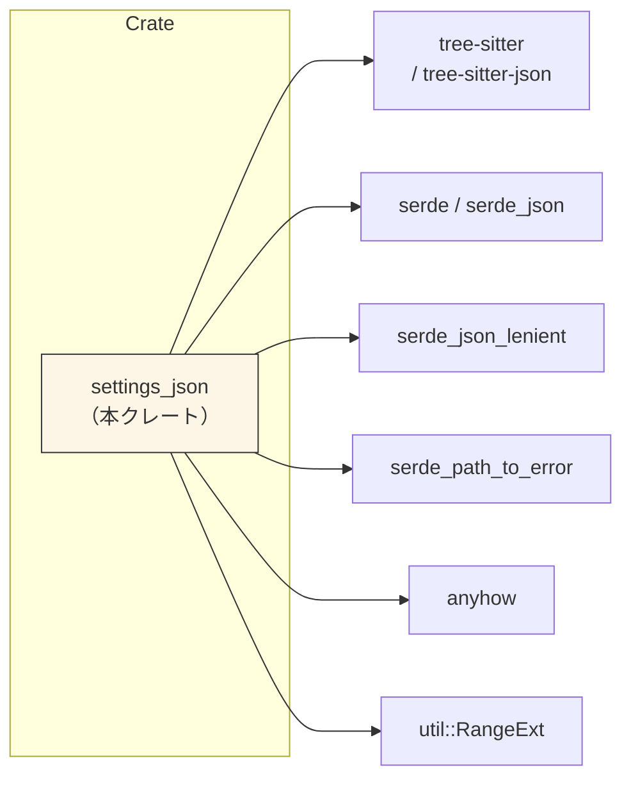
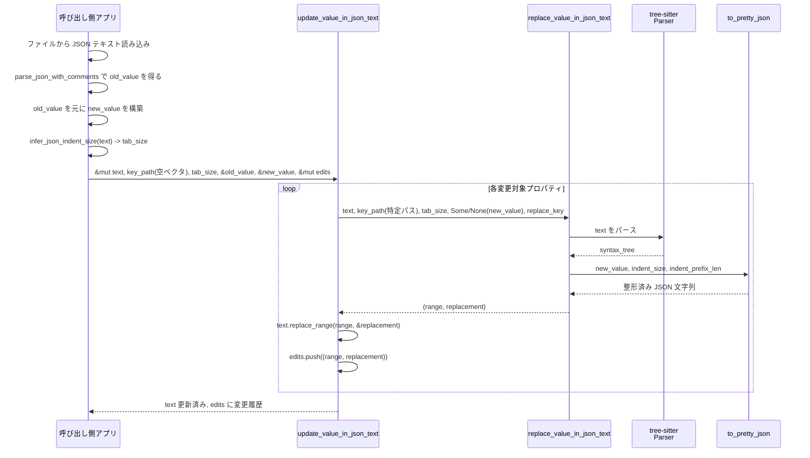

## 1. ざっくり一言

`settings_json` は、**既存の JSON（コメント付き JSON も含む）テキストを、構造を理解しながら部分的に書き換えるユーティリティ**です。  
値の差分更新や配列要素の追加・削除を行いつつ、可能な範囲で元のインデントやコメント、トレーリングカンマを維持します。

---

## 2. このモジュールの役割

### 2.1 概要

- このクレートは、**設定ファイルなどの JSON テキストを「丸ごと再フォーマットせずに」編集する**ための関数群を提供します。
- 具体的には、
  - オブジェクトのキー／値の追加・更新・削除
  - 配列要素の追加・更新・削除
  - JSON に含まれる `//` / `/* */` コメントやインデントの維持
  - コメント付き JSON のパース
  を行います。
- パースには `tree-sitter-json`、シリアライズ／デシリアライズには `serde_json` 系のクレートを利用しています。

### 2.2 アーキテクチャ内での位置づけ

このクレートは「テキストベースの JSON 編集レイヤー」として機能し、下記のような依存関係になっています。



- 上位レイヤー（エディタやツール）は `settings_json` を呼び出し、JSON テキストに対する編集パッチ（`Range` と置換文字列）を得て、バッファに適用する想定です。
- `tree-sitter-json` により JSON の構文木を取得し、**構造に基づいて**編集位置と内容を決定します。

### 2.3 設計上のポイント

コードから読み取れる設計上の特徴は次のとおりです。

- **構造編集 + テキスト保持**
  - パースは構造を理解するために行いますが、編集は「元のテキストの一部を置き換える」形で行い、全体の再整形はしません。
  - コメント（`//` や `/* ... */`）やトレーリングカンマ、インデント幅をできるだけ維持します。

- **キー・パスベースの操作**
  - オブジェクトはキー名の列（`["root", "child", "name"]`）で指定します。
  - 配列は `"#0"`, `"#1"` のような **インデックス付きキー** で指定します。
  - 一部のケースでは `"1"` のような通常の文字列を使うことで、配列をオブジェクトに置き換える動作もあります（テスト参照）。

- **オブジェクト差分更新**
  - `update_value_in_json_text` は古い JSON 値と新しい JSON 値を比較し、オブジェクト同士の場合はキー単位で再帰的に差分更新します。
  - 新しいオブジェクト内の `null` 値はフィルタされ、**「削除」の意味で扱われます**。

- **エラーハンドリング**
  - `parse_json_with_comments` など一部は `anyhow::Result` を返し、パースエラーを呼び出し元に返します。
  - `tree-sitter` のパースやシリアライズに対しては `unwrap()` を多用しており、「入力は JSON として parse できる」という前提で動作します（構文的に壊れたテキストに対する安全性は考慮されていません）。

---

## 3. 主要な機能一覧

このクレートが提供する主な機能は次のとおりです。

- **オブジェクトの差分適用**
  - `update_value_in_json_text`: 古い JSON 値と新しい JSON 値を比較し、テキストに差分を適用しながら、変更のパッチを収集します。

- **オブジェクト内のキー／値の置換・削除・追加**
  - `replace_value_in_json_text`: キー・パスで指定した位置の値（および場合によりキー）を入れ替える／削除するための基本関数です。

- **トップレベル配列の要素置換／削除**
  - `replace_top_level_array_value_in_json_text`: テキスト全体が配列、あるいは配列から始まる JSON であるとみなし、指定インデックスの要素を更新／削除します。

- **トップレベル配列への要素追加**
  - `append_top_level_array_value_in_json_text`: 配列の末尾に要素を追加します。配列が存在しない場合は新たに配列を構築します。

- **インデント幅の推定**
  - `infer_json_indent_size`: 既存 JSON テキストからインデント幅（スペース数）を推定し、整形に利用できるようにします。

- **整形付き JSON 文字列生成**
  - `to_pretty_json`: 指定したインデント幅と先頭インデント長に従って、値を JSON 文字列として整形出力します。

- **コメント付き JSON のパース**
  - `parse_json_with_comments`: `//` や `/* ... */` を含む JSON 風テキストを、`serde` でデシリアライズします。

---

## 4. 関数・構造体の解説

### 4.1 公開 API 一覧（型）

このクレートは構造体や列挙体などの公開型を定義していません。主に **関数ベースのユーティリティ**として設計されています。

### 4.2 公開関数の詳細（7件）

#### 4.2.1 `update_value_in_json_text`

```rust
pub fn update_value_in_json_text<'a>(
    text: &mut String,
    key_path: &mut Vec<&'a str>,
    tab_size: usize,
    old_value: &'a serde_json::Value,
    new_value: &'a serde_json::Value,
    edits: &mut Vec<(Range<usize>, String)>,
)
```

**概要**

- `old_value` と `new_value`（どちらも `serde_json::Value`）を比較し、差分を `text` に適用します。
- オブジェクト同士の場合は **キー単位で再帰的に更新**し、コメントやフォーマットを維持します。
- 変更のたびに `(置換範囲, 置換文字列)` のタプルを `edits` に蓄積します。

**引数**

| 引数名      | 型                            | 説明 |
|-----------|-------------------------------|------|
| `text`    | `&mut String`                 | 編集対象となる JSON テキストです。関数内で直接書き換えられます。 |
| `key_path`| `&mut Vec<&'a str>`           | 現在処理中のキーの経路（パス）を保持するためのバッファです。呼び出し元は通常、空ベクタを渡します。 |
| `tab_size`| `usize`                       | インデントに使うスペース数です（例: 2 または 4）。新しく挿入する JSON 片の整形に用いられます。 |
| `old_value` | `&Value`                    | 変更前の JSON 構造です。通常 `text` からパースした値を渡します。 |
| `new_value` | `&Value`                    | 変更後の JSON 構造です。 |
| `edits`   | `&mut Vec<(Range<usize>, String)>` | 実際に適用した変更のパッチを追加します。 |

**戻り値**

- `()`（戻り値なし）。  
  書き換え結果は `text` と `edits`（変更履歴）に反映されます。

**内部処理の流れ**

1. `old_value` と `new_value` の両方が **オブジェクト (`Value::Object`)** の場合:
   - `old_object` の各キーについて:
     - `key_path` にキーを push し、`new_object` に同じキーがあれば再帰的に `update_value_in_json_text` を呼び出します。
     - `new_object` にキーがなければ、そのキーは削除対象として `replace_value_in_json_text(..., new_value=None, ...)` を呼び出し、該当のキーごと削除します。
     - 処理後に `key_path` からキーを pop します。
   - 次に `new_object` の各キーについて:
     - `old_object` に存在しないキーであれば、新規追加として `old_value = Null` を渡して再帰呼び出しし、値を挿入します。

2. それ以外（オブジェクトでない、またはオブジェクトでも等価でない）の場合:
   - `old_value != new_value` のときのみ更新を行います。
   - `new_value` をクローンし、オブジェクトであれば **値が `null` のプロパティを削除**します。
   - `replace_value_in_json_text` を使って該当位置の範囲と置換文字列を計算し、`text.replace_range` で差し替え、`edits` に変更を記録します。

**Edge cases（エッジケース）**

- `old_value`・`new_value` がオブジェクト以外（数値、文字列、配列など）の場合は、単純な「等価比較 → 違えば丸ごと置換」という動作になります。
- `new_value` がオブジェクトで、その中に `null` 値を含むキーがある場合、そのキーは最終的な JSON から除去されます（= 削除とみなす）。
- `key_path` は関数内で push / pop されるので、呼び出し元は **毎回空ベクタを渡す**のが前提です。途中で変更するとパス解決がずれます。

**使用上の注意点**

- `text` と `old_value` は同じ JSON 内容を表している必要があります。そうでない場合、差分計算とテキスト編集位置が一致しません。
- `tab_size` には `infer_json_indent_size(text)` の結果を渡すと、既存のインデントに近い形に整形できます。
- この関数は内部で `replace_value_in_json_text` を呼び出しており、構造の解釈には `tree-sitter-json` を使用します。構文的に大きく壊れた JSON テキストに対する動作は保証されません。

**簡単な使用例**

```rust
use serde_json::Value;
use settings_json::{
    parse_json_with_comments,
    infer_json_indent_size,
    update_value_in_json_text,
};

fn main() -> anyhow::Result<()> {
    // コメント付き JSON 設定ファイル例
    let mut text = r#"{
        // Theme settings
        "theme": "dark",
        "font_size": 14
    }"#.to_string();

    // 旧値（ファイル内容）をパース
    let old_value: Value = parse_json_with_comments(&text)?;

    // 新しい設定を構築（ここでは font_size を 16 に変更）
    let mut new_value = old_value.clone();
    if let Some(obj) = new_value.as_object_mut() {
        obj.insert("font_size".to_string(), Value::from(16));
    }

    // インデント幅を推定
    let tab_size = infer_json_indent_size(&text);

    // 差分を適用
    let mut path = Vec::new();
    let mut edits = Vec::new();
    update_value_in_json_text(&mut text, &mut path, tab_size, &old_value, &new_value, &mut edits);

    println!("updated text:\n{}", text);
    println!("edits: {:?}", edits);
    Ok(())
}
```

---

#### 4.2.2 `replace_value_in_json_text`

```rust
pub fn replace_value_in_json_text<T: AsRef<str>>(
    text: &str,
    key_path: &[T],
    tab_size: usize,
    new_value: Option<&serde_json::Value>,
    replace_key: Option<&str>,
) -> (Range<usize>, String)
```

**概要**

- `key_path` で指定されたキー・パスに対応する JSON の値、あるいはキーごとペアを、**新しい値に置き換える／削除する**ための中心的な関数です。
- 実際には `text` は変更せず、代わりに「どの範囲を」「何の文字列に」置き換えるかを返します。

**引数**

| 引数名      | 型               | 説明 |
|-----------|------------------|------|
| `text`    | `&str`           | 編集対象の JSON テキストです。 |
| `key_path`| `&[T]`           | キーのパス（例: `["root", "child", "name"]`）。配列要素は `"#0"`, `"#1"` のように指定します。 |
| `tab_size`| `usize`          | 新しく整形する値のインデント幅（スペース数）です。 |
| `new_value` | `Option<&Value>` | 新しい値です。`None` を指定すると削除動作になります。 |
| `replace_key` | `Option<&str>` | パスに一致したキー名そのものを置き換える場合に、新しいキー名を指定します。使わない場合は `None`。 |

**戻り値**

- `(Range<usize>, String)`  
  - `Range<usize>`: `text` 内で置き換えるべきバイト範囲（半開区間）です。
  - `String`: その範囲と入れ替える新しい内容です（空文字列の場合は削除を意味します）。

**内部処理の流れ**

1. **JSON のパースと `(pair)` ノードの列挙**
   - `tree_sitter::Parser` と JSON 言語定義を使用し、`text` を構文木にします。
   - 事前に定義された `PAIR_QUERY`（`(pair key: (string) @key value: (_) @value)`）で、オブジェクト内のすべての `key: value` ペアを走査します。

2. **キー・パスのマッチング**
   - `depth` で現在一致しているパスの深さを追跡します。
   - 各 `pair` の `key` テキストを `serde_json::to_string` でシリアライズしたキー（`"key"` のような形）と比較し、`key_path[depth]` と一致するかどうかを判定します。
   - 一度マッチした値の範囲 `existing_value_range` より内側のノードは、`RangeExt::contains_inclusive` を使ってスキップし、意図しない深い階層への潜り込みを防ぎます。

3. **配列インデックスキーの扱い**
   - 途中のパス要素が `"#0"` のようなインデックスキーであれば、`handle_possible_array_value` に処理を委譲します。
   - これにより、オブジェクト内の配列に対する更新を行います（内部では後述の `replace_top_level_array_value_in_json_text` を呼び出します）。

4. **完全に一致するパスが見つかった場合**
   - `depth == key_path.len()` となった時点で、目的の値に到達しています。
   - `new_value` が `Some` の場合:
     - `to_pretty_json` によって `tab_size` と階層深度に基づくインデントを付与した JSON 文字列を生成します。
     - `replace_key` が `Some` の場合は、既存のキー位置を文字列レベルで探索し、新しいキー名で `"new_key": value` を形成します。
   - `new_value` が `None` の場合（削除）:
     - 対象の値の範囲から前後の `"` や `,` を検査し、**キー名 + 値 + 必要なカンマや空白**を含めた削除範囲を計算します。
     - オブジェクト内の位置（先頭要素／中間／末尾）に応じて、前のカンマを削除するか、後ろのカンマを削除するかを選択します。

5. **完全一致するパスが見つからなかった場合**
   - `depth < key_path.len()` のまま終了した場合、状況に応じて次のように動作します。
   - `first_key_start`（同じオブジェクトレベル内での最初のキー位置）が存在する場合:
     - まだ存在しないキーを、同じ階層に **新規追加** します。
     - 追加する値は `construct_json_value(&key_path[(depth+1)..], new_value)` によってネストを構築します。
       - 例: `key_path = ["config", "nested", "#0"]`, `depth == 1` の場合、`"nested": [value]` のようなオブジェクト／配列が作られます。
   - `first_key_start` が `None` の場合:
     - `existing_value_range`（最後にマッチした値の範囲、もしくはテキスト全体）を丸ごと置き換える形で、`construct_json_value(&key_path[depth..], new_value)` を適用し、新たなネスト構造を構築します。
     - 差し替え時に元のテキスト中の `//` コメントを走査し、新しい JSON の先頭付近に **コメントを差し戻す**処理も行います。

**Edge cases**

- パスの途中で配列が登場し、`key_path` が `"1"` のような数値文字列であっても `"#1"` でない場合:
  - `parse_index_key` は `None` を返すため、配列として扱わず、オブジェクトとしてネスト構造を構築します。  
    → テストのとおり、`"items": [1, 2, 3]` に対して `["items", "1"]` を指定すると、`"items": { "1": ... }` のように変換されます。
- `new_value` が `None` で、指定パス自体が存在しないケースについては、コード上に明示的な処理はなく、結果として「何も変更しない」範囲を返すことが想定されます（テストケースは存在しません）。
- コメントやトレーリングカンマを完全に保存する保証はなく、「できる限り維持する」ベストエフォート方式です。

**使用上の注意点**

- 実際のテキスト書き換えは呼び出し側で `String::replace_range` などを用いて行う必要があります。
- `key_path` は `AsRef<str>` 制約付きのジェネリックなので、`&[&str]` だけでなく `&[String]` なども渡せます。
- `tab_size` とキーの深さに応じてインデントが変わるため、既存のインデントスタイルに合わせたい場合は `infer_json_indent_size` の利用が推奨されます。

**基本的な使用例（オブジェクトのキー更新）**

```rust
use serde_json::json;
use settings_json::replace_value_in_json_text;

fn main() {
    let mut text = r#"{
        "theme": "dark",
        "font_size": 14
    }"#.to_string();

    // "font_size" を 16 に変更
    let (range, replacement) = replace_value_in_json_text(
        &text,
        &["font_size"],      // キー・パス
        4,                   // インデント幅
        Some(&json!(16)),    // 新しい値
        None,                // キー名は変えない
    );

    text.replace_range(range, &replacement);

    println!("{}", text);
}
```

**配列要素の更新例（オブジェクト内の配列）**

```rust
use serde_json::json;
use settings_json::replace_value_in_json_text;

fn main() {
    let mut text = r#"{
        "items": [1, 2, 3]
    }"#.to_string();

    // items[1] (= 2) を 20 に変更
    let (range, replacement) = replace_value_in_json_text(
        &text,
        &["items", "#1"],    // "#1" で配列インデックス指定
        4,
        Some(&json!(20)),
        None,
    );

    text.replace_range(range, &replacement);

    println!("{}", text);
}
```

---

#### 4.2.3 `replace_top_level_array_value_in_json_text`

```rust
pub fn replace_top_level_array_value_in_json_text(
    text: &str,
    key_path: &[impl AsRef<str>],
    new_value: Option<&serde_json::Value>,
    replace_key: Option<&str>,
    array_index: usize,
    tab_size: usize,
) -> (Range<usize>, String)
```

**概要**

- **トップレベル配列**（あるいは JSON テキスト内の最初の配列）について、指定インデックスの要素を置換／削除します。
- 必要に応じて、その要素の内部に対しても `key_path` を使ってオブジェクト置換を行います。
- トップレベルに配列が存在しない場合は、新しく配列を構築して返します。

**引数**

| 引数名        | 型                      | 説明 |
|-------------|-------------------------|------|
| `text`      | `&str`                  | 編集対象の JSON テキストです。 |
| `key_path`  | `&[impl AsRef<str>]`    | 対象要素内でさらにオブジェクトアクセスする場合のキー・パスです。空なら要素そのものを操作します。 |
| `new_value` | `Option<&Value>`        | 新しい値。`None` なら削除動作です。 |
| `replace_key` | `Option<&str>`        | 要素がオブジェクトで、その中のキー名を変更したい場合に利用されます（内部的に `replace_value_in_json_text` に伝播）。 |
| `array_index` | `usize`              | 対象とする配列インデックス（0 始まり）です。 |
| `tab_size`  | `usize`                 | インデント幅です。 |

**戻り値**

- `(Range<usize>, String)` — `text` のどの範囲をどの文字列で置き換えるか。

**内部処理の流れ**

1. `tree_sitter::Parser` で `text` を解析し、最初の `array` ノードを探索します。
   - もし見つからない場合、`construct_json_value(key_path, new_value)` で JSON 値を作り、それを単一要素とする配列 `[...]` を生成し、テキスト全体をその配列で置き換える範囲を返します。

2. 配列ノードの最初の子（`[`）に移動し、その兄弟ノードを走査して **実際の要素ノード** をカウントします。
   - コメントや `[` `]` `,` などは「要素ではない」としてスキップします。
   - `array_index` に達するまで進み、該当要素ノードの `range` を取得します。

3. `new_value` と `key_path` に応じた処理:
   - `new_value.is_none()` かつ `key_path` が空の場合:
     - 単純な削除として、その要素の範囲に加えて前後の `,` や空白、行末の改行などを含めた削除範囲を計算します。
     - 先頭要素／末尾要素ごとに、どのカンマを削除するかを調整します。
   - それ以外の場合:
     - 要素のテキスト部分を切り出し、`replace_value_in_json_text` で要素内部を編集します（`key_path` は要素内に対するキー・パス）。
     - 返ってきた範囲を元のテキスト上のバイトオフセットに補正し、インデントや改行を調整します。
     - インライン配列の場合は改行をスペースに変換し、多行配列の場合は改行ごとにインデント幅を揃えます。

**Edge cases**

- `array_index` が配列の実際の要素数より大きい場合:
  - `new_value` が `Some` であれば、`append_top_level_array_value_in_json_text` を呼び出し、末尾に要素を追加します。
  - `new_value` が `None` の場合は、削除対象が存在しないため、空範囲＋空文字列（≒何もしない）を返します（コード上では `(0..0, String::new())` が返りうる箇所があります）。
- テキストが空文字列のときにも、配列を新規構築する挙動がテストで確認されています。

**使用上の注意点**

- この関数は「トップレベルの配列」を前提としているため、オブジェクトの中にある配列を直接操作したい場合は、通常 `replace_value_in_json_text` + `"#N"` インデックスキーを使います。
- コメントの位置が複雑な場合（要素間に多段のコメントがあるなど）は、完全に元通りになる保証はありませんが、多数のテストで一般的なケースに対応していることが確認されています。

---

#### 4.2.4 `append_top_level_array_value_in_json_text`

```rust
pub fn append_top_level_array_value_in_json_text(
    text: &str,
    new_value: &serde_json::Value,
    tab_size: usize,
) -> (Range<usize>, String)
```

**概要**

- トップレベルの配列の末尾に `new_value` を追加するためのヘルパー関数です。
- 配列が存在しない場合は、新たに `[ new_value ]` 形式の配列を構築します。

**引数**

| 引数名      | 型            | 説明 |
|-----------|---------------|------|
| `text`    | `&str`        | 編集対象の JSON テキストです。 |
| `new_value` | `&Value`    | 配列に追加したい値です。 |
| `tab_size` | `usize`      | インデント幅です。 |

**戻り値**

- `(Range<usize>, String)` — 配列の閉じ括弧位置付近に対して、カンマと `new_value` を挿入するための範囲・文字列を返します。

**内部処理のポイント**

- `tree_sitter` によりトップレベル配列を見つけ、その末尾（`]`）の直前に移動します。
- 直前の要素の有無、行数、インデント幅、既存のトレーリングカンマの有無などを確認し、最も自然な形になるように文字列を組み立てます。
  - インライン配列であれば `, new_value` のように 1 行で追加。
  - 多行配列であれば改行とインデントを揃えて追加。
- テキストが空、または配列が見つからない場合は、`[ new_value ]` 形式の配列を新たに構築します。

**使用上の注意点**

- 戻り値の範囲は「挿入位置」なので、`replace_range` ではなく `insert_str` 的に使うイメージですが、実装上は `(start..start, replacement)` の形式で返されるため、`replace_range` にそのまま渡せます。
- コメントやトレーリングカンマが既にある場合、それらを尊重して挿入位置を調整しますが、非常に複雑なコメントレイアウトには対応しきれない可能性があります。

---

#### 4.2.5 `infer_json_indent_size`

```rust
pub fn infer_json_indent_size(text: &str) -> usize
```

**概要**

- JSON テキストの構造（オブジェクトと配列）から、**1 レベルのインデントで何個のスペースが使われているか**を推定します。
- 推定結果が得られない場合は 2 を返します（実装上、パース失敗時のみ 4 が返るパスもありますが、正常系では 2 または 4, 8 等）。

**引数 / 戻り値**

| 項目      | 型     | 説明 |
|---------|--------|------|
| `text`  | `&str` | 対象の JSON テキストです。 |
| 戻り値  | `usize`| 推定されたインデントサイズ（スペース数）。 |

**内部処理の流れ**

1. `tree_sitter-json` で `text` をパースし、構文木を取得します。
2. 深さ 3 までのノードを再帰的に探索し、オブジェクト（`object`）や配列（`array`）について:
   - その開始位置（行・列）と、最初の「中身の子」（オブジェクトなら `pair`, 配列なら値ノード）の開始位置を比較します。
   - 両者の列差 `child_column - container_column` をインデントサイズ候補としてカウントします。
3. インデント候補の出現回数を集計し、最も頻度の高い値を採用します。
4. 何も検出できなければ 2 を返します。

**使用上の注意点**

- すべて 1 行の JSON（`{"key": "value"}` のようなもの）の場合も、2 が返るように実装されています（テストで確認済み）。
- インデントが不均一な JSON では、**最も頻出するインデント幅**が返されるため、一部の行とは一致しない場合があります。

---

#### 4.2.6 `to_pretty_json`

```rust
pub fn to_pretty_json(
    value: &impl serde::Serialize,
    indent_size: usize,
    indent_prefix_len: usize,
) -> String
```

**概要**

- `serde_json::Serializer` の Pretty フォーマッタを用いて、`value` を整形済み JSON 文字列に変換します。
- 各行の先頭に `indent_prefix_len` 個のスペースを追加することで、「呼び出し位置に応じたインデント」を実現します。

**引数**

| 引数名            | 型                       | 説明 |
|-----------------|--------------------------|------|
| `value`         | `&impl Serialize`        | シリアライズ対象の値です。 |
| `indent_size`   | `usize`                  | 1 階層あたりのインデント幅（スペース数）。 |
| `indent_prefix_len` | `usize`              | この JSON ブロック全体の先頭につけるインデント長（スペース数）。 |

**戻り値**

- 整形された JSON 文字列です（末尾に余計な改行は追加されません）。

**内部処理のポイント**

- `PrettyFormatter::with_indent` に `indent_size` のスペースを渡し、基本的なインデントを指定します。
- 生成された文字列を行単位に分割し、2 行目以降の先頭に `indent_prefix_len` 個のスペースを挿入してから結合し直します。

**使用上の注意点**

- この関数そのものはコメント・トレーリングカンマの保持機能を持ちません。あくまで「新しく構築する値」を整形する目的で使われています。
- `value.serialize(&mut ser)` や UTF-8 変換で `unwrap()` を使っているため、失敗時は panic します（通常の `Serialize` 実装では問題になりません）。

---

#### 4.2.7 `parse_json_with_comments`

```rust
pub fn parse_json_with_comments<T: DeserializeOwned>(content: &str) -> anyhow::Result<T>
```

**概要**

- `serde_json_lenient` を用いて、**コメントやトレーリングカンマを含む JSON 風テキスト**を `T` にデシリアライズします。
- エラー時には `serde_path_to_error` を利用して、どのキー・インデックスでエラーが起きたか含むエラー情報を返します。

**引数 / 戻り値**

| 項目     | 型                             | 説明 |
|--------|--------------------------------|------|
| `content` | `&str`                       | パース対象の JSON 文字列（コメント可）です。 |
| 戻り値   | `anyhow::Result<T>`           | 成功時は `T`、失敗時はエラーを返します。 |

**使用例**

```rust
use serde::Deserialize;
use settings_json::parse_json_with_comments;

#[derive(Deserialize, Debug)]
struct Config {
    theme: String,
    font_size: u32,
}

fn main() -> anyhow::Result<()> {
    let text = r#"{
        // UI settings
        "theme": "dark",      // current theme
        "font_size": 14,      // px
    }"#;

    let config: Config = parse_json_with_comments(text)?;
    println!("{:?}", config);

    Ok(())
}
```

**使用上の注意点**

- `serde_json_lenient` の仕様により、標準 JSON では許されない書式（コメント、末尾カンマ）にも対応しますが、全ての「壊れた JSON」を受け入れるわけではありません。
- 失敗時には `anyhow::Error` になって返るため、呼び出し側でエラー文言とパスをログ出力すると、ユーザーにとって原因が分かりやすくなります。

---

### 4.3 その他の内部関数

| 関数名 | 役割（1 行） |
|--------|--------------|
| `construct_json_value` | `key_path` の残り部分から、必要なネスト（オブジェクト／配列）を包んだ `serde_json::Value` を構築します。`"#N"` 形式のキーを配列インデックスとして扱います。 |
| `parse_index_key` | `"#3"` のような文字列から `3usize` を取り出します。 |
| `handle_possible_array_value` | オブジェクト内の値が配列であり、次のキーが `"#N"` 形式のときに、配列要素の置換／削除を行う補助関数です。 |
| `is_error_of_kind`（`append_top_level_array_value_in_json_text` 内部） | `tree-sitter` の `ERROR` ノードの下に、特定の kind を持つノードがあるかどうかを確認するヘルパーです。 |

---

## 5. データフロー

ここでは、典型的なシナリオとして「設定ファイル JSON の一部の値を差分更新する」場合のデータフローを説明します。

1. 呼び出し側はファイルから JSON テキストを読み込みます。
2. `parse_json_with_comments` でコメント付き JSON を `serde_json::Value`（または構造体）としてパースします。
3. アプリケーションのロジックに基づいて、新しい設定値を含む `new_value` を構築します。
4. `infer_json_indent_size` でインデント幅を推定します。
5. `update_value_in_json_text` に `text`, `old_value`, `new_value`, `tab_size` を渡します。
6. `update_value_in_json_text` は必要な箇所で `replace_value_in_json_text` を呼び出し、さらにそこから `tree_sitter` を使って編集位置を特定し、`to_pretty_json` で新しい JSON 片を生成します。
7. `text` が書き換えられ、同時に `(Range, String)` のペアが `edits` に蓄積されます。

これをシーケンス図で表すと次のようになります。



---

## 6. 使い方（How to Use）

### 6.1 基本的な使用方法

#### オブジェクトのプロパティを 1 つ更新する

```rust
use serde_json::json;
use settings_json::{
    replace_value_in_json_text,
    infer_json_indent_size,
};

fn main() {
    // 既存の設定 JSON（コメントなしでも可）
    let mut text = r#"{
        "theme": "dark",
        "font_size": 14
    }"#.to_string();

    // インデント幅を推定（必須ではないが推奨）
    let tab_size = infer_json_indent_size(&text);

    // "font_size" を 16 に更新するパッチを計算
    let (range, replacement) = replace_value_in_json_text(
        &text,
        &["font_size"],     // キー・パス
        tab_size,
        Some(&json!(16)),   // 新しい値
        None,               // キー名は変更しない
    );

    // 実際にテキストを更新
    text.replace_range(range, &replacement);

    println!("{}", text);
}
```

#### 配列要素を更新する（オブジェクト内の配列）

```rust
use serde_json::json;
use settings_json::replace_value_in_json_text;

fn main() {
    let mut text = r#"{
        "items": [1, 2, 3]
    }"#.to_string();

    // items[1] を 20 に変更
    let (range, replacement) = replace_value_in_json_text(
        &text,
        &["items", "#1"],    // "#1" で配列インデックス指定
        4,
        Some(&json!(20)),
        None,
    );

    text.replace_range(range, &replacement);

    println!("{}", text);
}
```

#### トップレベル配列に要素を追加する

```rust
use serde_json::json;
use settings_json::append_top_level_array_value_in_json_text;

fn main() {
    let mut text = r#"[
        1,
        2,
        3
    ]"#.to_string();

    let (range, replacement) = append_top_level_array_value_in_json_text(
        &text,
        &json!(4),
        4,
    );

    text.replace_range(range, &replacement);

    println!("{}", text);
}
```

#### コメント付き JSON を読み書きする

```rust
use serde::{Deserialize, Serialize};
use serde_json::json;
use settings_json::{
    parse_json_with_comments,
    update_value_in_json_text,
    infer_json_indent_size,
};

#[derive(Deserialize, Serialize, Clone)]
struct Config {
    theme: String,
    font_size: u32,
}

fn main() -> anyhow::Result<()> {
    let mut text = r#"{
        // UI config
        "theme": "dark",
        "font_size": 14,
    }"#.to_string();

    // コメント付き JSON をパース
    let old_cfg: Config = parse_json_with_comments(&text)?;
    let mut new_cfg = old_cfg.clone();
    new_cfg.font_size = 16;

    // Value に変換
    let old_value = serde_json::to_value(&old_cfg)?;
    let new_value = serde_json::to_value(&new_cfg)?;

    let tab_size = infer_json_indent_size(&text);
    let mut path = Vec::new();
    let mut edits = Vec::new();

    update_value_in_json_text(
        &mut text,
        &mut path,
        tab_size,
        &old_value,
        &new_value,
        &mut edits,
    );

    println!("{}", text);
    Ok(())
}
```

### 6.2 よくある使用パターン

- **単一キーの置換**
  - `replace_value_in_json_text` を直接利用し、`&["key"]` のように単一キーを指定して値を変える。
- **配列の編集**
  - オブジェクト内の配列: `["array_key", "#index"]` のパスで `replace_value_in_json_text` を使用。
  - トップレベル配列: `replace_top_level_array_value_in_json_text` か `append_top_level_array_value_in_json_text` を使用。
- **全体差分の適用**
  - ファイル全体を `serde_json::Value` として持ち、ロジックで新しい `Value` を構築した上で `update_value_in_json_text` を呼び出し、オブジェクト差分を適用する。
- **パッチとしての利用**
  - `update_value_in_json_text` が集める `edits: Vec<(Range<usize>, String)>` を、エディタのバッファに対するパッチとして利用する。  
    （同時に `text` も更新されていますが、別途「変更箇所だけ適用したい」場合に役立ちます。）

### 6.3 使用上の注意点

- **JSON の構文前提**
  - `tree-sitter-json` でパース可能な JSON であることが前提です。  
    コメントやトレーリングカンマを含んでいても構いませんが、構文的に大きく壊れている場合の挙動は保証されません。
- **インデックス指定**
  - 配列要素にアクセスする場合は、`"#0"`, `"#1"` といった **シャープ付きインデックス**を使います。
  - `"0"`, `"1"` のような文字列を使うと、「配列をオブジェクトに置き換える」ような挙動になるテストケースが存在します（意図的に利用する場合を除き、混同に注意が必要です）。
- **インデント幅**
  - `tab_size` が 0 でも動作しますが、望ましい整形結果が得られない可能性があります。  
    既存のファイルに合わせたい場合は `infer_json_indent_size` の利用が推奨されます。
- **コメントの保持はベストエフォート**
  - 多くのテストでコメント保持の挙動は検証されていますが、すべてのパターンで完全に期待どおりになる保証はありません。
  - 特に複雑なネストや連続するコメントがある場合は、変更結果を目視確認することが望ましいです。
- **パニックの可能性**
  - パーサやシリアライザに対して `unwrap()` が使われている箇所があります。  
    通常の JSON 入力では問題になりませんが、「極端に巨大な値」や「シリアライズ不能な型」を流し込むような使い方は避けるべきです。

---

## 7. 関連ファイル

| パス | 役割 / 関係 |
|------|------------|
| `settings_json/Cargo.toml` | クレート `settings_json` のマニフェストです。`tree-sitter-json` や `serde_json_lenient` などの依存関係が定義されています。 |
| `settings_json/src/settings_json.rs` | 本クレートのすべての実装コードおよびテストコード（`mod tests`）が含まれています。公開 API はここに定義されています。 |

このクレート単体で完結しており、他にソースファイルはありませんが、実行時には `tree-sitter-json` の言語定義や `util::RangeExt` など、依存クレートに定義された機能を利用します。
