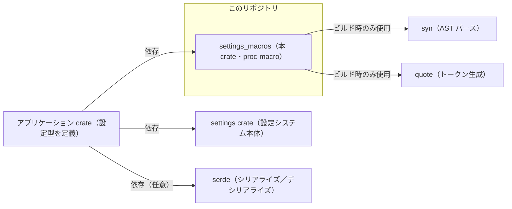

# settings_macros/ ディレクトリ解説

## 1. ざっくり一言

`settings_macros` は、設定用の型に対して

- フィールドごとのマージ処理を自動実装する `#[derive(MergeFrom)]`
- 設定ストアに型を登録する `#[derive(RegisterSetting)]`
- `Option<T>` フィールドに serde 用属性を一括付与する `#[with_fallible_options]`

といった **プロシージャルマクロ** を提供する crate です。

---

## 2. このモジュールの役割

### 全体像

- `settings_macros` は `proc-macro = true` なライブラリ crate で、他の crate からインポートされて使われます。
- `syn` で Rust の構造体・列挙体定義をパースし、`quote` でコードを生成する典型的なプロシージャルマクロ構成になっています。
- 設定システム本体（`settings` crate）や、その設定型を定義するアプリケーションクレートから利用される位置づけです。

### アーキテクチャ内での位置づけ（依存関係）

この図は、`settings_macros` がどのような crate と関係するかの概略です。



- アプリケーション側 crate（B）が設定型を定義し、そこにこの crate のマクロを付与します。
- `#[derive(RegisterSetting)]` は `settings::private::...` に依存するため、**マクロを使う側で `settings` crate が `settings` というパスで利用可能であること**が前提です。
- `#[with_fallible_options]` は serde の属性を付けるため、**マクロを使う側で serde を導入していること**が実質的に前提になります（このチャンク内では serde 自体は直接依存に含まれていません）。

### 設計上のポイント

コードから読み取れる特徴を列挙します。

- **責務の分割**
  - `settings_macros/src/settings_macros.rs` に、公開されるすべてのプロシージャルマクロがまとまっています。
  - 各マクロ内部で、フィールド操作用の小さなヘルパー関数（`apply_on_fields` / `add_if_option`）を定義して局所化しています。
- **状態を持たない**
  - すべてのマクロは純粋関数的に入力トークンから出力トークンを生成しており、グローバル状態は持っていません。
- **エラーハンドリング**
  - 構文解析には `syn::parse_macro_input!` / `syn::parse` を用い、パース失敗時はコンパイルエラーとして報告されます。
  - サポートしていない対象（`MergeFrom` の union、`with_fallible_options` の struct / enum 以外）には `panic!` を使って **コンパイル時パニック** を発生させます（つまりビルドが失敗します）。

---

## 3. 主要な機能一覧

このディレクトリが提供する主な機能は次の 3 つです。

- `#[derive(MergeFrom)]`  
  構造体・列挙体に対して、`crate::merge_from::MergeFrom` トレイトの `merge_from` 実装を自動生成します。
- `#[derive(RegisterSetting)]`  
  設定用の型を `settings::private::RegisteredSetting` として inventory に登録するコードを生成します。
- `#[with_fallible_options]`（属性マクロ）  
  struct / enum の各フィールドのうち `Option<T>` 型のものに対して、serde の  
  `#[serde(default, skip_serializing_if = "Option::is_none", deserialize_with = "...")]`  
  属性を自動付与します。

---

## 4. 関数・構造体の解説

### 4.1 `derive_merge_from`（`#[derive(MergeFrom)]`）

```rust
#[proc_macro_derive(MergeFrom)]
pub fn derive_merge_from(input: TokenStream) -> TokenStream { ... }
```

#### 概要

- 対象の `struct` または `enum` に対し、`crate::merge_from::MergeFrom` トレイトの実装を自動生成します。
- 構造体の場合は、**全フィールドに対して `merge_from` を順に呼び出す実装**を生成します。
- 列挙体の場合は、`*self = other.clone();` という、**丸ごと置き換える実装**を生成します。
- union はサポートせず、使用するとコンパイル時に `panic!("MergeFrom cannot be derived for unions");` によるエラーになります。

#### 入力・出力

- 入力: `TokenStream`（`DeriveInput` としてパースされる struct / enum 定義）
- 出力: `TokenStream`（生成された `impl MergeFrom for <Type>`）

#### 生成されるコードの形

コードから読み取れる生成コードのおおまかな形は次のとおりです（簡略化表現です）。

```rust
impl <impl_generics> crate::merge_from::MergeFrom for TypeName<ty_generics> where_clause {
    fn merge_from(&mut self, other: &Self) {
        use crate::merge_from::MergeFrom as _;
        /* マージ本体（構造体と列挙体で異なる） */
    }
}
```

- `impl_generics`, `ty_generics`, `where_clause` は元の型のジェネリクス定義をそのまま引き継ぎます。
- `use crate::merge_from::MergeFrom as _;` により、フィールド型の `merge_from` をアンビエントに解決しやすくしています。

##### 構造体の場合（`Data::Struct`）

- フィールドが **名前付き**（`Fields::Named`）の場合:

  ```rust
  self.field_name.merge_from(&other.field_name);
  ```

  を全フィールドに対して生成します。

- フィールドが **タプル構造体**（`Fields::Unnamed`）の場合:

  ```rust
  self.0.merge_from(&other.0);
  self.1.merge_from(&other.1);
  // ...
  ```

  のように、インデックスベースで全フィールドを処理します。

- **ユニット構造体**（`Fields::Unit`）の場合:

  - マクロ側では「処理なし」の本体（実質何もしない `merge_from`）を生成します。

##### 列挙体の場合（`Data::Enum`）

- 本体は次の 1 行です。

  ```rust
  *self = other.clone();
  ```

- つまり「`MergeFrom` は **enum の variant ごとの細かいマージは行わず、常に `other` を丸ごとコピーする**」という方針になっています。

#### 使用例（イメージ）

`MergeFrom` トレイトの定義自体はこのチャンクには含まれていませんが、説明用に簡略化した例を示します。

```rust
// 説明用の仮の MergeFrom トレイト定義（実際の定義は別ファイルにあります）
trait MergeFrom {
    fn merge_from(&mut self, other: &Self); // 2 つの値をマージするメソッド
}

// 設定用の構造体を定義し、MergeFrom を派生させる
#[derive(Clone, MergeFrom)]                          // Clone と MergeFrom を派生
struct AppSettings {
    theme: Option<String>,                           // テーマ名（省略可）
    nested: OtherSettings,                           // 別の設定構造体（こちらも MergeFrom 実装が必要）
}

// 使う側のコード（runtime）
fn merge_example() {
    let mut base = AppSettings {                     // 既存の設定
        theme: Some("light".into()),
        nested: OtherSettings { /* ... */ },
    };
    let overlay = AppSettings {                      // 上書きしたい設定
        theme: None,
        nested: OtherSettings { /* ... */ },
    };

    base.merge_from(&overlay);                       // 各フィールドに対して merge_from が呼ばれる
                                                     // enum であればまるごと上書き
}
```

> 上記はあくまで挙動イメージのための簡略例です。実際の `MergeFrom` トレイトの定義は、このチャンクからは分かりません。

#### Edge cases（エッジケース）

- **フィールド型が `MergeFrom` を実装していない場合**
  - 派生時にコンパイルエラーとなります（生成された `self.field.merge_from(...)` が解決できないため）。
- **ジェネリック型**
  - 型にジェネリクスが付いていても、そのまま `impl` に転写されるため対応できます。
  - ただし、各フィールド型に必要なトレイト境界（`T: MergeFrom` など）が無い場合、コンパイルエラーになります。
- **列挙体**
  - どの variant か、どのフィールドが `Some` かなどの情報に関係なく、常に丸ごと `other.clone()` で置き換えられます。
- **union**
  - `panic!("MergeFrom cannot be derived for unions");` が呼ばれ、コンパイル失敗となります。

#### 使用上の注意点

- マクロが生成するコードでは `crate::merge_from::MergeFrom` を参照します。
  - **マクロを使う側の crate に `merge_from` モジュールと `MergeFrom` トレイトが存在すること**が前提です。
- 列挙体のマージは「丸ごとコピー」のみで、フィールドレベルのマージは行いません。
- union には使用できません。
- フィールドの数が多い・ネストが深い場合、`merge_from` の呼び出し回数も増えるため、実行コストはその分増加します。

---

### 4.2 `derive_register_setting`（`#[derive(RegisterSetting)]`）

```rust
#[proc_macro_derive(RegisterSetting)]
pub fn derive_register_setting(input: TokenStream) -> TokenStream { ... }
```

#### 概要

- 対象の型を **設定システムに登録するためのコード** を自動生成します。
- 具体的には `settings::private::inventory::submit!` マクロを用いて、`settings::private::RegisteredSetting` の値を登録するコードを出力します。
- 型は `settings::Settings` トレイトを実装していることが前提になっています（`from_settings` にそのトレイトメソッドを使うコードが生成されるため）。

#### 入力・出力

- 入力: `TokenStream`（`DeriveInput` としてパースされる struct / enum 定義など）
- 出力: `TokenStream`（`settings::private::inventory::submit!` 呼び出しを含むコード）

#### 生成されるコードの形

おおまかな生成コードは次のようになります（簡略表現）。

```rust
settings::private::inventory::submit! {
    settings::private::RegisteredSetting {
        settings_value: || {
            Box::new(settings::private::SettingValue::<TypeName> {
                global_value: None,
                local_values: Vec::new(),
            })
        },
        from_settings: |content| {
            Box::new(<TypeName as settings::Settings>::from_settings(content))
        },
        id: || std::any::TypeId::of::<TypeName>(),
    }
}
```

- `TypeName` にはマクロを付けた型名が入ります。
- `settings_value` は設定値のコンテナを初期化するクロージャです。
- `from_settings` は `settings::Settings` トレイトの `from_settings` メソッドで値を復元するクロージャです。
- `id` は型ごとの `TypeId` を返すクロージャです。

#### 使用例（イメージ）

`settings` crate の詳細はこのチャンクにはありませんが、典型的な利用イメージです。

```rust
use settings_macros::RegisterSetting;                // 本 crate のマクロをインポート

#[derive(RegisterSetting)]                           // この型を設定システムに登録する
struct MySettings {
    // フィールド定義（詳細は省略）
}

// どこかで settings::Settings を実装していると仮定
impl settings::Settings for MySettings {
    // from_settings などのメソッド実装（ここでは省略）
}
```

> `settings::Settings` トレイトや `settings::private::RegisteredSetting` の実際の定義は、このチャンクには含まれていません。

#### Edge cases（エッジケース）

- `settings` crate が依存に入っていない、または `settings` という名前で参照できない場合
  - 生成されたコード内の `settings::...` 参照が解決できず、コンパイルエラーになります。
- 対象型が `settings::Settings` を実装していない場合
  - `<TypeName as settings::Settings>::from_settings` の呼び出しが解決できず、コンパイルエラーになります。
- マクロは型の中身（フィールド）に依存した処理は行っていないため、構造体・列挙体などの違いには影響されません。

#### 使用上の注意点

- `settings` crate を **マクロを使う側** の `Cargo.toml` の `[dependencies]` に追加しておく必要があります。
- `settings` crate は `settings` というクレート名／ルートモジュール名で参照される前提です（別名で依存している場合はそのままでは動きません）。
- 対象型は `settings::Settings` トレイトを実装している必要があります。

---

### 4.3 `with_fallible_options`（属性マクロ）

```rust
#[proc_macro_attribute]
pub fn with_fallible_options(_args: TokenStream, input: TokenStream) -> TokenStream { ... }
```

#### 概要

- struct / enum 定義に付ける属性マクロです。
- 対象の struct / enum のフィールドのうち、`Option<T>` 型のものに対して自動的に **serde の属性** を付与します。
- コメントには

  > `deserialize_with = "settings::deserialize_fallible"`

  と書かれていますが、実際に付与される属性は

  ```rust
  #[serde(
      default,
      skip_serializing_if = "Option::is_none",
      deserialize_with = "crate::fallible_options::deserialize"
  )]
  ```

  です。

#### 処理内容

内部ヘルパー関数とあわせて見ると、動きは次のようになります。

1. `input` をまず `ItemStruct` としてパースしようとします。
   - 成功した場合はその struct の `fields` に対して `apply_on_fields` を呼び出し、加工後の struct を `quote!(#input)` で返します。
2. struct としてパースできなかった場合、`ItemEnum` としてパースを試みます。
   - 成功した場合は、各 variant の `fields` に対して `apply_on_fields` を呼び出します。
3. どちらにもパースできなかった場合は

   ```rust
   panic!("with_fallible_options can only be applied to struct or enum definitions.");
   ```

   によりコンパイル時エラーとなります。

`apply_on_fields` の動作:

- `Fields::Named`（名前付きフィールド）・`Fields::Unnamed`（タプルフィールド）の両方で、各フィールドに `add_if_option` を適用します。
- `Fields::Unit` の場合は何もしません。

`add_if_option` の動作:

- フィールドの型が次の条件をすべて満たす場合にのみ、serde 属性を追加します。

  ```rust
  Type::Path(syn::TypePath { qself: None, path })
    && path.leading_colon.is_none()   // 先頭に :: が付いていない
    && path.segments.len() == 1       // セグメントが 1 つだけ
    && path.segments[0].ident == "Option"
  ```

  つまり、ソース上で **ちょうど `Option<...>` と書かれている場合だけ** 対象になります。

- それ以外（`std::option::Option<...>`、型エイリアス経由、`Option` に似た別名タイプなど）は対象外です。

#### 使用例（イメージ）

```rust
use settings_macros::with_fallible_options;          // 属性マクロをインポート
use serde::{Serialize, Deserialize};                 // serde を導入

#[with_fallible_options]                             // Option フィールドに serde 属性を自動付与
#[derive(Serialize, Deserialize)]
struct AppConfig {
    name: String,                                    // そのまま（属性は付かない）
    theme: Option<String>,                           // serde 属性が自動付与される
    retries: Option<u32>,                            // 同上
}
```

この例では、コンパイル後の `AppConfig` は概ね次のような形（イメージ）になります。

```rust
#[derive(Serialize, Deserialize)]
struct AppConfig {
    name: String,

    #[serde(
        default,
        skip_serializing_if = "Option::is_none",
        deserialize_with = "crate::fallible_options::deserialize"
    )]
    theme: Option<String>,

    #[serde(
        default,
        skip_serializing_if = "Option::is_none",
        deserialize_with = "crate::fallible_options::deserialize"
    )]
    retries: Option<u32>,
}
```

> `crate::fallible_options::deserialize` 関数の中身・シグネチャはこのチャンクには登場しません。

#### Edge cases（エッジケース）

- **`Option` の書き方**
  - ちょうど `Option<T>` と書いたフィールドのみ対象です。
  - `std::option::Option<T>` や `type Maybe<T> = Option<T>` 経由のフィールドなどは、この判定条件では対象になりません。
- **ユニット struct / enum variant**
  - `Fields::Unit` はスキップされるため、何も変更されません。
- **属性マクロの適用対象**
  - struct / enum 以外（関数、モジュールなど）に付けた場合は、`panic!("with_fallible_options can only be applied to struct or enum definitions.");` によりコンパイル時エラーになります。

#### 使用上の注意点

- マクロを使う側の crate に、`crate::fallible_options::deserialize` というパスで到達できる関数が存在している必要があります。
  - そうでない場合、serde の `deserialize_with` 属性がコンパイル時に解決できずエラーになります。
- serde の属性を追加するだけなので、**serde 自体はマクロの依存には含まれていません**。使う側で `serde` を導入し、`Serialize` / `Deserialize` を derive する必要があります。
- `Option<T>` に対して `default` を付けているため、デシリアライズ時にフィールドが欠けていても `None` として扱われます。

---

### 4.4 内部ヘルパー関数

これらはマクロ内部でのみ使われる関数ですが、挙動理解の補助として簡単に記載します。

#### `apply_on_fields(fields: &mut Fields)`

- 役割: `struct` や `enum` の `Fields`（`Named` / `Unnamed` / `Unit`）に対し、各フィールドに `add_if_option` を適用します。
- `Fields::Named` と `Fields::Unnamed` の両方に対応しています。

#### `add_if_option(field: &mut Field)`

- 役割: フィールドの型が `Option<T>` の場合、serde 属性を 1 つ追加します。
- `Type::Path` であり、上記の条件を満たしたときのみ `field.attrs.push(attr)` を行います。

---

## 5. データフロー

ここでは、`#[derive(MergeFrom)]` を使って設定構造体をマージするケースを例に、**コンパイル時〜実行時のデータフロー**を示します。

```mermaid
sequenceDiagram
    participant U as ユーザーコード
    participant C as Rustコンパイラ
    participant M as settings_macros::MergeFrom 派生マクロ
    participant I as 生成された impl MergeFrom
    participant R as 実行時

    U->>C: #[derive(MergeFrom)] struct AppSettings { ... }
    C->>M: DeriveInput（AppSettings の AST）を渡してマクロを実行
    M-->>C: impl MergeFrom for AppSettings { fn merge_from(&mut self, other: &Self) { ... } }
    C-->>U: バイナリを生成（AppSettings::merge_from 実装を含む）

    U->>R: let mut base = AppSettings { ... }; let overlay = AppSettings { ... };
    U->>R: base.merge_from(&overlay);
    R->>I: 生成された merge_from 実装を呼び出す
    I-->>R: 各フィールドについて self.field.merge_from(&other.field) を実行
```

要点:

- コンパイル時に、ユーザーが書いた struct 定義から AST が作られ、プロシージャルマクロがそれを解析して実装コードを生成します。
- 実行時には、ユーザーコードからは普通のメソッド呼び出しとして `merge_from` が使われます。
- 列挙体の `merge_from` の場合は、上記フローの中で `*self = other.clone();` が 1 回実行されるだけになります。

---

## 6. 使い方（How to Use）

### 6.1 基本的な使用方法

#### 1. Cargo.toml に依存を追加する（例）

ワークスペース内で本 crate を参照する典型例です（パスはプロジェクト構成にあわせて調整が必要です）。

```toml
[dependencies]
settings_macros = { path = "crates/settings_macros" }  # この質問で示された構成に合わせた例
settings = { path = "crates/settings" }                # RegisterSetting を使う場合
serde = { version = "1", features = ["derive"] }       # with_fallible_options を使う場合
```

#### 2. MergeFrom を使ったマージ処理の一例

```rust
use settings_macros::MergeFrom;                        // #[derive(MergeFrom)] を使うためにインポート

// 説明用の簡易 MergeFrom トレイト（実際の定義は別ファイルにあります）
trait MergeFrom {
    fn merge_from(&mut self, other: &Self);           // 2 つの値をマージするメソッド
}

#[derive(Clone, MergeFrom)]                           // Clone と MergeFrom を自動実装
struct LoggingSettings {
    level: Option<String>,                            // ログレベル（オプション）
}

fn main() {
    let mut base = LoggingSettings {                  // 既存の設定
        level: Some("info".into()),
    };
    let overlay = LoggingSettings {                   // 上書き設定
        level: Some("debug".into()),
    };

    base.merge_from(&overlay);                        // マクロが生成した merge_from が呼ばれる
                                                      // → base.level.merge_from(&overlay.level)
}
```

> 上記は挙動イメージ用であり、実際には `crate::merge_from::MergeFrom` の定義に従って動作します。

### 6.2 よくある使用パターン

#### パターン A: 設定型を SettingsStore に登録する

```rust
use settings_macros::RegisterSetting;                 // #[derive(RegisterSetting)] を使用
use settings;                                         // settings crate を依存に追加していると仮定

#[derive(RegisterSetting)]                           // 設定システムに登録
struct EditorSettings {
    // ここに設定項目を定義
}

// 別の場所で settings::Settings を実装していると仮定
impl settings::Settings for EditorSettings {
    // from_settings 等の実装（詳細は省略）
}
```

- `RegisterSetting` を付けることで、`settings` 側の inventory にこの型が自動登録されます。
- その結果、「定義済みの設定型を一括して列挙する」といった処理が可能になると考えられます（詳細な挙動は `settings` crate 側の実装次第です）。

#### パターン B: serde 対応の設定型で `with_fallible_options` を使う

```rust
use settings_macros::with_fallible_options;           // with_fallible_options 属性をインポート
use serde::{Serialize, Deserialize};                  // serde の derive を使う

#[with_fallible_options]                              // Option フィールドに serde 属性を付与
#[derive(Serialize, Deserialize)]
struct NetworkSettings {
    timeout_ms: Option<u64>,                          // 欠けていても OK、None はシリアライズ時に省略
    proxy: Option<String>,                            // 同上
    endpoint: String,                                 // Option ではないのでそのまま
}
```

- これにより、JSON 等で `timeout_ms` や `proxy` フィールドが省略されていても `None` で復元でき、また `None` の値はシリアライズ時に出力されなくなります（`skip_serializing_if = "Option::is_none"` による）。
- デシリアライズは `crate::fallible_options::deserialize` を通して行われるため、例えば「不正な値をエラー扱いではなく `None` として扱う」など、より柔軟な挙動を実現している可能性があります（詳細はこのチャンクには含まれていません）。

### 6.3 使用上の注意点（まとめ）

- **`#[derive(MergeFrom)]`**
  - マクロを使う側の crate に `crate::merge_from::MergeFrom` トレイトが存在する必要があります。
  - フィールドの型も `MergeFrom` を実装していることが前提です（そうでないとコンパイルエラー）。
  - enum では `*self = other.clone();` という単純な置き換えしか行われません。
  - union には使用できません。

- **`#[derive(RegisterSetting)]`**
  - `settings` crate を依存に持ち、`settings` という名前で参照できる必要があります。
  - 対象型は `settings::Settings` トレイトを実装している必要があります。
  - 登録処理は `settings::private::inventory::submit!` に依存しており、これは通常、静的な初期化タイミングで設定型を収集するための仕組みです。

- **`#[with_fallible_options]`**
  - struct / enum 以外に付けるとコンパイル時に `panic!` で失敗します。
  - `Option<T>` 型と判定されるのは、ソースコード上で **単に `Option<...>` と書かれているフィールドのみ** です。
  - 生成される serde 属性では `deserialize_with = "crate::fallible_options::deserialize"` を指定するため、  
    マクロを使う側の crate でこのパスが解決できるようにしておく必要があります。
  - serde の derive や `serde` クレートを使うのは **マクロを使う側** です（本 crate の依存には含まれていません）。

---

## 7. 関連ファイル

| パス                                     | 役割 / 関係 |
|------------------------------------------|-------------|
| `settings_macros/Cargo.toml`             | 本 crate の定義ファイルです。`proc-macro = true` なライブラリとして設定され、`syn` / `quote` を依存に持ちます。`settings` crate は `dev-dependencies` に入っており、`RegisterSetting` マクロが参照するパスの存在確認などに使われていると考えられます。 |
| `settings_macros/src/settings_macros.rs` | 本 crate が公開するすべてのプロシージャルマクロ（`derive_merge_from` / `derive_register_setting` / `with_fallible_options`）の実装がまとめられているファイルです。 |

このディレクトリにはテストコードや補助モジュールは含まれておらず、プロシージャルマクロの実装に専念した構成になっています。
