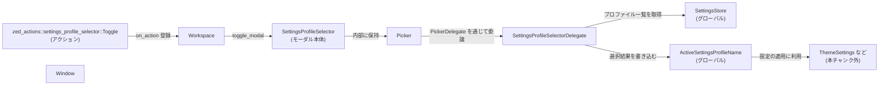
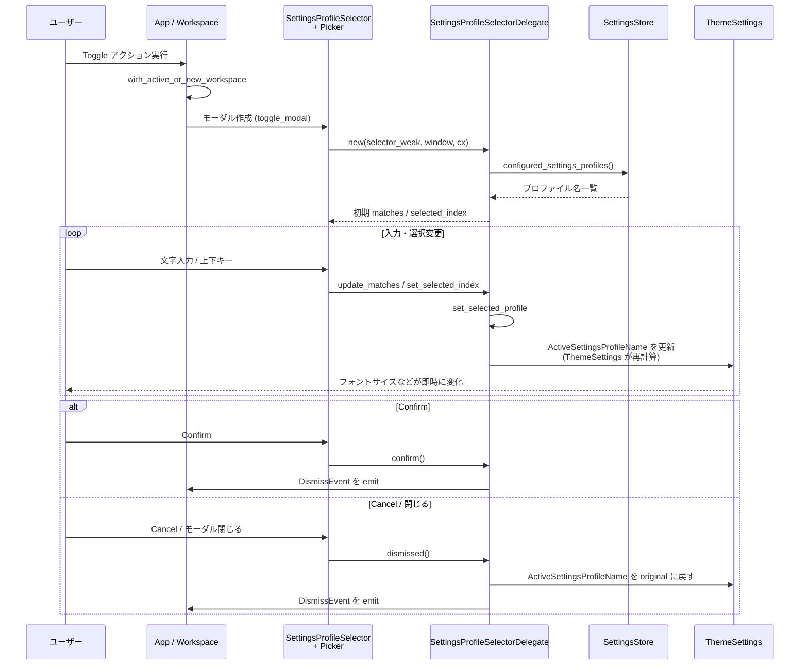

# settings_profile_selector/

## 1. ざっくり一言

設定ファイルに定義された「設定プロファイル」を、ファジー検索付きのピッカー（モーダルダイアログ）で選択し、その選択結果をグローバルな `ActiveSettingsProfileName` として反映・プレビューするためのクレートです。  
選択中は即時に設定が適用され、キャンセルすると元のプロファイルに戻る挙動になっています。

---

## 2. このモジュールの役割

### 2.1 概要

- このクレートは **ユーザー設定プロファイルの切り替え** を行う UI（モーダル）と、その裏側のロジックを提供します。
- 設定プロファイルの一覧は `SettingsStore` から取得し、`Picker` コンポーネントを使ってファジー検索・選択します。
- 選択状態はグローバルな `ActiveSettingsProfileName` として保持され、他クレート（例: `ThemeSettings`）がそれを参照して実際の見た目の設定を決定します。
- モーダルを閉じるとき、**Confirm で確定 / Cancel で元に戻す** という明確な契約を持っています。

### 2.2 アーキテクチャ内での位置づけ

このクレートが他クレート・コンポーネントとどう繋がるかを概略図で示します。



説明:

- `init` 関数で、`zed_actions::settings_profile_selector::Toggle` アクションに対するハンドラーを `App` に登録します。
- アクションが発火すると `workspace::with_active_or_new_workspace` を通じて `Workspace` がアクティブになり、その上に `SettingsProfileSelector` モーダルが開きます。
- モーダル内部には `Picker<SettingsProfileSelectorDelegate>` があり、表示や選択に関する処理を `SettingsProfileSelectorDelegate` に委譲しています。
- デリゲートは `SettingsStore` からプロファイル名一覧を取得し、選択中のプロファイル名を `ActiveSettingsProfileName` としてグローバルに保持します。
- `ThemeSettings` など他モジュールは `ActiveSettingsProfileName` を参照して実際の設定（例: フォントサイズ）を決定します。

### 2.3 設計上のポイント

コードから読み取れる主な設計の特徴は次のとおりです。

- **責務の分割**
  - `SettingsProfileSelector`: モーダルビュー（UI コンテナ）として `Picker` エンティティを保持し、`Focusable` / `Render` / `ModalView` を実装するだけの薄いラッパーです。
  - `SettingsProfileSelectorDelegate`: プロファイル一覧の保持、ファジーマッチング、選択状態の管理、グローバル状態の更新など、実質的なロジックを担当します。
- **状態管理**
  - プロファイル一覧とマッチ結果、選択中インデックス、元のプロファイル名などはすべてデリゲートのフィールドとして保持します。
  - 現在有効なプロファイルは `ActiveSettingsProfileName` として `gpui` のグローバル状態に保存されます。
- **プレビューとロールバック**
  - リストの選択を動かした時点で `ActiveSettingsProfileName` が更新され、設定が即座にプレビューされます。
  - モーダルが `Cancel` や閉じる操作で終了した場合は、モーダル表示前のプロファイル (`original_profile_name`) に戻します。
  - `Confirm` の場合は戻さず、その時点の選択が次回以降の「元の状態」になります。
- **非同期ファジー検索**
  - `update_matches` で `fuzzy::match_strings` をバックグラウンドエグゼキュータ上で実行し、その結果を `Picker` に反映します。
- **特別な「Disabled」エントリ**
  - `None` のプロファイル名を 1 件追加し、これを「Disabled」と表示することで「プロファイルを使わない」状態を表現しています（インデックス 0）。
- **ユーザー設定順の維持**
  - テストから、表示順は設定ファイル中の記述順（+ 先頭の "Disabled"）であることが確認できます。

---

## 3. 主要な機能一覧

このクレートが提供する主な機能は次のとおりです。

- 設定プロファイルセレクタの初期化 (`init`):  
  `App` のアクションシステムに、プロファイルセレクタを開閉する `Toggle` ハンドラーを登録します。
- 設定プロファイル用モーダルビュー (`SettingsProfileSelector`):  
  `Workspace` 上に表示されるモーダルとして `Picker` をラップします。
- プロファイル一覧の構築・管理 (`SettingsProfileSelectorDelegate::new`):  
  `SettingsStore::configured_settings_profiles()` からプロファイル名を取得し、先頭に「Disabled」を追加したリストと初期マッチ情報を生成します。
- ファジー検索と候補更新 (`update_matches`):  
  入力クエリに合わせてプロファイル名のマッチ結果を更新し、ハイライト位置とスコアを持つ `StringMatch` のリストとして管理します。
- 選択状態の管理 (`set_selected_index`, `set_selected_profile`):  
  現在選択されているインデックスに応じて `ActiveSettingsProfileName` を更新し、即座に設定がプレビューされるようにします。
- Confirm / Cancel 時の挙動制御 (`confirm`, `dismissed`):  
  Confirm 時は選択を確定し、Cancel / 閉じる時には元のプロファイルにロールバックします。
- UI レンダリング (`render`, `render_match`):  
  ピッカー全体と各候補行を `ListItem` / `HighlightedLabel` を使って描画します。

---

## 4. 関数・構造体の解説

### 4.1 型一覧（構造体）

| 名前 | 種別 | 役割 / 用途 | 主な関連メソッド / トレイト |
|------|------|-------------|-----------------------------|
| `SettingsProfileSelector` | 構造体 | 設定プロファイル選択用モーダルビュー。内部に `Entity<Picker<SettingsProfileSelectorDelegate>>` を 1 つ保持します。 | `new`, `impl ModalView`, `impl Focusable`, `impl Render`, `impl EventEmitter<DismissEvent>` |
| `SettingsProfileSelectorDelegate` | 構造体 | `PickerDelegate` 実装。プロファイル名一覧、ファジーマッチ結果、選択状態、元のプロファイル名、モーダルへの弱参照などを持ち、ロジックを担当します。 | `new`, `update_matches`, `set_selected_profile`, `confirm`, `dismissed`, `render_match`, `select_if_matching` |

> `ActiveSettingsProfileName`, `SettingsStore`, `Picker`, `Workspace` などは他クレートで定義されています。このチャンクには実装が含まれていません。

---

### 4.2 主要関数（詳細）

#### `pub fn init(cx: &mut App)`

**概要**

- アプリケーションの `App` に対し、「設定プロファイルセレクタをトグルする」アクションハンドラーを登録します。
- 以後、`zed_actions::settings_profile_selector::Toggle` アクションが発火すると、アクティブな（または新しい）`Workspace` 上にモーダルが開きます。

**引数**

| 引数名 | 型 | 説明 |
|--------|----|------|
| `cx` | `&mut App` | アプリケーション全体の `gpui` コンテキスト。アクションハンドラ登録に使用します。 |

**戻り値**

- なし。

**内部処理の流れ**

1. `cx.on_action` で `zed_actions::settings_profile_selector::Toggle` を受け取るクロージャを登録します。
2. クロージャ内で `workspace::with_active_or_new_workspace` を呼び出し、アクティブな `Workspace` と `Window` を取得（なければ新規作成）します。
3. 取得した `Workspace` / `Window` / `Context<Workspace>` を使って `toggle_settings_profile_selector` を呼び出します。

**Examples（使用例）**

テストコードと同様の初期化例です（テスト用コンテキストを利用）。

```rust
use gpui::TestAppContext;
use settings::SettingsStore;
use theme_settings;
use settings_profile_selector;
use zed_actions::settings_profile_selector as sps_actions;

#[gpui::test]
async fn init_and_toggle_profile_selector(cx: &mut TestAppContext) {
    cx.update(|cx| {
        // SettingsStore をグローバル登録（本番コードでも同様に事前初期化が必要）
        let settings_store = SettingsStore::test(cx);
        cx.set_global(settings_store);

        // 他の設定関連モジュールを初期化
        settings::init(cx);
        theme_settings::init(theme::LoadThemes::JustBase, cx);

        // このクレートの初期化
        settings_profile_selector::init(cx);
    });

    // 登録したアクションをディスパッチするとモーダルが開く
    cx.dispatch_action(sps_actions::Toggle);
}
```

**Errors / Panics**

- この関数自体は明示的なパニックを含みません。
- ただし、後続でモーダルを開くタイミングで `SettingsStore` グローバルが存在しない場合、`SettingsProfileSelectorDelegate::new` 内の `cx.global::<SettingsStore>()` がパニックする可能性があります（後述）。

**Edge cases（エッジケース）**

- `init` を複数回呼び出すと、`on_action` がその回数分登録される可能性があります。このチャンク内には二重登録防止ロジックはありません。

**使用上の注意点**

- アプリケーションの初期化フェーズで一度だけ呼び出すことが前提と考えられます。
- この関数を呼ぶ前に、`SettingsStore` のグローバル登録および `settings::init` / `theme_settings::init` など、設定に関わる初期化を済ませておく必要があります（テストコードでもこの順序になっています）。

---

#### `pub fn new(delegate: SettingsProfileSelectorDelegate, window: &mut Window, cx: &mut Context<Self>) -> SettingsProfileSelector`

**概要**

- `SettingsProfileSelector` モーダルのインスタンスを作成し、その内部に `Picker<SettingsProfileSelectorDelegate>` エンティティを初期化して保持します。

**引数**

| 引数名 | 型 | 説明 |
|--------|----|------|
| `delegate` | `SettingsProfileSelectorDelegate` | ピッカーの振る舞いを定義するデリゲート。すでにプロファイル一覧などが初期化済みです。 |
| `window` | `&mut Window` | モーダルをぶら下げるウィンドウ。`Picker::uniform_list` のコンテキストとして使用します。 |
| `cx` | `&mut Context<Self>` | `SettingsProfileSelector` 用の gpui コンテキスト。内部エンティティ生成に使われます。 |

**戻り値**

- 初期化済みの `SettingsProfileSelector`。

**内部処理の流れ**

1. `cx.new(|cx| Picker::uniform_list(delegate, window, cx))` を呼び出し、`Picker<SettingsProfileSelectorDelegate>` エンティティを生成します。
2. 生成した `picker` をフィールドとして保持した `SettingsProfileSelector` を返します。

**Examples（使用例）**

直接呼ぶ必要はほとんどなく、通常は `toggle_settings_profile_selector` 経由で `Workspace::toggle_modal` の中から呼ばれます。

```rust
// Workspace::toggle_modal のクロージャ内での利用例（実際の呼び出し元）
workspace.toggle_modal(window, cx, |window, cx| {
    let delegate = SettingsProfileSelectorDelegate::new(cx.entity().downgrade(), window, cx);
    SettingsProfileSelector::new(delegate, window, cx)
});
```

**Errors / Panics**

- この関数内に明示的なパニックはありません。
- `Picker::uniform_list` の挙動はこのチャンクでは不明ですが、通常の利用では安全に呼び出せる前提です。

**Edge cases（エッジケース）**

- `delegate` は所有権付きで渡され、その後 `Picker` に移されます。作成後に同じ `delegate` を他で再利用することはできません。

**使用上の注意点**

- 通常は `Workspace::toggle_modal` のようなモーダル管理関数からのみ呼び出す前提のメソッドです。
- `SettingsProfileSelector` を手動で生成・管理する場合も、`Window` / `Context` のライフサイクルと整合するように使用する必要があります。

---

#### `fn SettingsProfileSelectorDelegate::new(selector: WeakEntity<SettingsProfileSelector>, _: &mut Window, cx: &mut Context<SettingsProfileSelector>) -> Self`

**概要**

- プロファイル一覧と初期マッチ情報、元のアクティブプロファイル名などを読み取り、`SettingsProfileSelectorDelegate` の初期状態を構築します。
- もし既にアクティブなプロファイルが存在する場合、そのプロファイルが選択された状態でピッカーを開きます。

**引数**

| 引数名 | 型 | 説明 |
|--------|----|------|
| `selector` | `WeakEntity<SettingsProfileSelector>` | モーダル本体への弱参照。`confirm` / `dismissed` 時に `DismissEvent` を発火するために使用します。 |
| `_` | `&mut Window` | ウィンドウ。現状は未使用（プレースホルダ）です。 |
| `cx` | `&mut Context<SettingsProfileSelector>` | モーダル用コンテキスト。グローバル状態 (`SettingsStore`, `ActiveSettingsProfileName`) にアクセスするために使用します。 |

**戻り値**

- 初期化済みの `SettingsProfileSelectorDelegate`。

**内部処理の流れ**

1. `cx.global::<SettingsStore>()` でグローバルな `SettingsStore` を取得します。
2. `settings_store.configured_settings_profiles()` から設定ファイルに定義されたプロファイル名を列挙し、`Vec<Option<String>>` として格納します（ここでは `Some(name)`）。  
   その後 `profile_names.insert(0, None)` を行い、インデックス 0 に「Disabled」を表す `None` を追加します。
3. `profile_names` をもとに、各要素に対する初期 `StringMatch` を作成します。  
   - `candidate_id`: `enumerate` のインデックス（`profile_names` のインデックスと一致）  
   - `string`: `display_name(profile_name)`（`None` の場合は `"Disabled"`）  
   - `score`: 0.0  
   - `positions`: デフォルト値
4. `cx.try_global::<ActiveSettingsProfileName>()` で現在のアクティブプロファイル名（あれば）を取得し、`original_profile_name` に保存します。
5. `selected_index` を 0（「Disabled」）で初期化しつつ、もし `ActiveSettingsProfileName` が存在すれば `select_if_matching` でその名前に一致するエントリを選択済みにします。

**Examples（使用例）**

通常は `SettingsProfileSelector` の生成時にのみ呼ばれます。

```rust
let selector_weak = cx.entity().downgrade(); // SettingsProfileSelector の WeakEntity
let delegate = SettingsProfileSelectorDelegate::new(selector_weak, window, cx);
```

**Errors / Panics**

- `cx.global::<SettingsStore>()` は、`SettingsStore` がグローバルに登録されていない場合にパニックする可能性があります。
  - テストでは `SettingsStore::test(cx)` を作成し、`cx.set_global(settings_store);` を先に呼び出しています。

**Edge cases（エッジケース）**

- `configured_settings_profiles()` が 0 件でも、`profile_names` には常に `None` が 1 件追加されるため、候補数は最低 1 件になります。
- 既存の `ActiveSettingsProfileName` が `configured_settings_profiles()` のどれにも一致しない場合、`select_if_matching` の `position` が `None` になり、`selected_index` は 0 のまま（"Disabled"）になります。

**使用上の注意点**

- このメソッドがパニックしないようにするため、呼び出し前に `SettingsStore` を必ずグローバル登録しておく必要があります。
- `selector` に渡す `WeakEntity` は、後で `confirm` / `dismissed` から `DismissEvent` を送るために必須です。

---

#### `fn SettingsProfileSelectorDelegate::update_matches(&mut self, query: String, window: &mut Window, cx: &mut Context<Picker<Self>>) -> Task<()>`

**概要**

- ユーザーが入力した検索クエリに基づいて、プロファイル名のファジーマッチ結果（`self.matches`）を非同期に更新します。
- 検索クエリが空なら全件をスコア 0.0 / 空の `positions` で表示し、非空なら `fuzzy::match_strings` でマッチングします。

**引数**

| 引数名 | 型 | 説明 |
|--------|----|------|
| `query` | `String` | 現在の検索クエリ。空文字列の場合は全件表示になります。 |
| `window` | `&mut Window` | このピッカーが属するウィンドウ。非同期タスクのスコープとして利用されます。 |
| `cx` | `&mut Context<Picker<Self>>` | `Picker` 用コンテキスト。バックグラウンドエグゼキュータや `spawn_in` に利用されます。 |

**戻り値**

- 非同期タスクを表す `Task<()>`。呼び出し側は通常これを直接扱う必要はありません。

**内部処理の流れ**

1. `cx.background_executor().clone()` でバックグラウンドエグゼキュータを取得します。
2. `self.profile_names` から `StringMatchCandidate` のベクタを作成します。  
   - `candidate_id` = `enumerate` のインデックス（`profile_names` のインデックス）
   - `string` = `display_name(profile_name)`（"Disabled" 含む）
3. `cx.spawn_in(window, async move |this, cx| { ... })` で非同期タスクを起動します。
4. タスク内:
   - `query` が空なら、候補を列挙し直して `StringMatch` を `score = 0.0`, `positions = Vec::new()` として構築します。
   - 空でなければ `match_strings(&candidates, &query, false, true, 100, &Default::default(), background).await` を実行し、その結果を `matches` とします。
5. `this.update_in(cx, |this, _, cx| { ... })` で UI スレッド上の状態を更新します。
   - `this.delegate.matches = matches;`
   - `selected_index` を、新しい `matches.len().saturating_sub(1)` との `min` でクランプします（範囲外インデックスを防ぐ）。
   - `selected_profile_name = this.delegate.set_selected_profile(cx);` を呼び、グローバルの `ActiveSettingsProfileName` とローカルの `selected_profile_name` を更新します。

**Examples（使用例）**

`Picker` からユーザー入力のたびに自動的に呼び出される想定であり、直接呼び出すケースは通常ありません。  
挙動の確認には、`test_settings_profile_selector_state` で `SelectNext` / `SelectPrevious` を使った遷移が参考になります。

**Errors / Panics**

- このメソッド自体に明示的なパニックはありません。
- 非同期タスク内で `this.update_in` が失敗した場合（エンティティが既にドロップされているなど）、`ok()` によりエラーは無視されます。

**Edge cases（エッジケース）**

- `profile_names` は最低 1 要素（"Disabled"）を持つため、`matches` が完全に空になるケースは通常ありません。
- クエリを空文字に戻したとき、`matches` は「Disabled + 全プロファイル」を元の順序で再構築します。
- `selected_index` は `matches` の長さ以内にクランプされるため、候補数が減った場合でもインデックス外アクセスは避けられます。

**使用上の注意点**

- ファジーマッチはバックグラウンドで行われるため、非常に短時間にクエリが変化し続けると、完了順が前後する可能性があります（このチャンク内では特別な対処は行われていません）。
- `set_selected_profile` を通じて毎回 `ActiveSettingsProfileName` が更新されるため、検索中も設定のプレビューがリアルタイムに変化します。

---

#### `fn SettingsProfileSelectorDelegate::set_selected_profile(&self, cx: &mut Context<Picker<Self>>) -> Option<String>`

**概要**

- 現在の `selected_index` に対応するプロファイル名を取得し、それをグローバルな `ActiveSettingsProfileName` に反映します。
- 実際には `update_active_profile_name_global` を呼び出し、その戻り値（`Option<String>`）を返します。

**引数**

| 引数名 | 型 | 説明 |
|--------|----|------|
| `cx` | `&mut Context<Picker<Self>>` | `Picker` のコンテキスト。グローバル状態 (`ActiveSettingsProfileName`) の操作に使用します。 |

**戻り値**

- `Some(profile_name)`：選択されたプロファイル名（"Disabled" 以外）。  
- `None`：選択が「Disabled」（`None`）か、インデックスが不正でプロファイル名を取得できなかった場合。

**内部処理の流れ**

1. `self.matches.get(self.selected_index)?` で現在選択中の `StringMatch` を取得します（範囲外なら `None` 返却）。
2. `self.profile_names.get(mat.candidate_id)?` で対応する `Option<String>`（`None` または `Some(name)`）を取得します。
3. `Self::update_active_profile_name_global(profile_name.clone(), cx)` を呼び出し、グローバル状態を更新し、その戻り値を返します。

**Errors / Panics**

- インデックス取得に `get` を使っているため、範囲外アクセスでパニックすることはありません。
- `update_active_profile_name_global` 内にも明示的なパニックはありません。

**Edge cases（エッジケース）**

- `selected_index` が `matches.len()` 以上の場合、`get` が `None` を返し、そのまま `None` を返します（グローバル状態は変更されません）。
- `mat.candidate_id` が `profile_names.len()` 以上の場合も同様です。
- 「Disabled」が選択された場合、`profile_name` は `None` になり、`update_active_profile_name_global` によって `ActiveSettingsProfileName` グローバルは削除されます。

**使用上の注意点**

- `set_selected_profile` は副作用としてグローバル状態を書き換えるため、単なる「取得」用途には注意が必要です。
- 現在の値を参照したいだけの場合は、`selected_profile_name` フィールド（テストでの利用例あり）を読む方が安全です。

---

#### `fn SettingsProfileSelectorDelegate::confirm(&mut self, _: bool, _: &mut Window, cx: &mut Context<Picker<Self>>)` （`PickerDelegate` 実装）

**概要**

- ユーザーが Confirm（通常は Enter キーなど）を押したときに呼び出されるメソッドです。
- `selection_completed` を `true` にし、モーダル本体に `DismissEvent` を送ってモーダルを閉じます。
- Confirm 時点の選択はそのまま有効なプロファイルとして残ります。

**引数**

| 引数名 | 型 | 説明 |
|--------|----|------|
| `_` | `bool` | 使用されていないフラグ（PickerDelegate のインターフェース上の引数）。 |
| `_` | `&mut Window` | 使用されていないウィンドウ参照。 |
| `cx` | `&mut Context<Picker<Self>>` | `Picker` コンテキスト。`selector.update` に必要です。 |

**戻り値**

- なし。

**内部処理の流れ**

1. `self.selection_completed = true;` をセットします。
2. `self.selector.update(cx, |_, cx| { cx.emit(DismissEvent); }).ok();` を呼び出し、モーダル本体に `DismissEvent` を送信します。

**Errors / Panics**

- `selector.update` は `Result` を返しますが、`.ok()` によってエラーは無視されるため、ここでパニックすることはありません。

**Edge cases（エッジケース）**

- `selector` がすでにドロップされているなどで `update` に失敗した場合、モーダルが閉じられない可能性はありますが、エラーは無視されます（このチャンクの範囲では特別な扱いはありません）。
- Confirm 時点での `selected_index` / `selected_profile_name` はそれ以前の `set_selected_profile` 呼び出しで既にグローバルに反映済みです。Confirm 自体は値を変えません。

**使用上の注意点**

- Cancel との違いは、「Confirm したときは `selection_completed = true` のため、後続の `dismissed` でロールバックが行われない」点です。

---

#### `fn SettingsProfileSelectorDelegate::dismissed(&mut self, _: &mut Window, cx: &mut Context<Picker<Self>>)` （`PickerDelegate` 実装）

**概要**

- モーダルが閉じられたときに呼び出されます。  
  Confirm の後にも呼ばれますが、`selection_completed` の値によって処理が変化します。
- Confirm せずに閉じられた場合（Cancel / Esc / ウィンドウ閉じるなど）は、モーダルを開く前のプロファイル (`original_profile_name`) に戻すロールバック処理を行います。

**引数**

| 引数名 | 型 | 説明 |
|--------|----|------|
| `_` | `&mut Window` | 使用されていないウィンドウ参照。 |
| `cx` | `&mut Context<Picker<Self>>` | `Picker` コンテキスト。グローバル状態の更新と `selector.update` に使用します。 |

**戻り値**

- なし。

**内部処理の流れ**

1. `if !self.selection_completed { ... }` で Confirm 済みかどうかを判定します。
2. Confirm されていない場合:
   - `SettingsProfileSelectorDelegate::update_active_profile_name_global(self.original_profile_name.clone(), cx);` を呼び出し、`ActiveSettingsProfileName` を元の状態に戻します（`None` の場合はグローバルから削除）。
3. 最後に `self.selector.update(cx, |_, cx| cx.emit(DismissEvent)).ok();` を呼び、モーダル本体に `DismissEvent` を送信します。

**Errors / Panics**

- `update_active_profile_name_global` はパニックを含みません。
- `selector.update` のエラーは無視されます。

**Edge cases（エッジケース）**

- Confirm 後にも `dismissed` は呼ばれますが、`selection_completed == true` のためロールバックは行われません。
- モーダルを開いた後、何も選択変更を行わずに Cancel した場合でも、`original_profile_name` に戻す処理が走ります（結果的には何も変わりません）。

**使用上の注意点**

- 「モーダルを閉じる＝必ず `ActiveSettingsProfileName` が元に戻る」わけではなく、Confirm 済みかどうかで挙動が変わる点に注意が必要です。
- Cancel 時に元に戻る挙動はテスト (`test_settings_profile_selector_state`) で明示的に検証されています。

---

### 4.3 その他の関数・メソッド

#### 4.3.1 ライブラリ内部の補助的な関数

| 関数名 | 役割（1 行） |
|--------|--------------|
| `toggle_settings_profile_selector(workspace, window, cx)` | アクティブな `Workspace` に対して `SettingsProfileSelector` モーダルを開く／閉じる。`Workspace::toggle_modal` を利用します。 |
| `SettingsProfileSelectorDelegate::select_if_matching(&mut self, profile_name: &str)` | 現在の `matches` から `string == profile_name` の要素を探し、そのインデックスを `selected_index` に設定します（見つからなければ変更なし）。 |
| `SettingsProfileSelectorDelegate::update_active_profile_name_global(profile_name: Option<String>, cx)` | `ActiveSettingsProfileName` グローバルを設定／削除する共通処理。`None` が渡された場合は削除します。 |
| `impl PickerDelegate for SettingsProfileSelectorDelegate::placeholder_text` | ピッカーの入力欄に表示されるプレースホルダー文字列 `"Select a settings profile..."` を返します。 |
| `impl PickerDelegate for SettingsProfileSelectorDelegate::match_count` | 現在の `matches.len()` を返し、ピッカーに候補数を知らせます。 |
| `impl PickerDelegate for SettingsProfileSelectorDelegate::selected_index` | 現在の選択インデックスを返します。 |
| `impl PickerDelegate for SettingsProfileSelectorDelegate::set_selected_index` | 選択インデックスを更新し、即座に `set_selected_profile` を呼び出してプレビューを更新します。 |
| `impl PickerDelegate for SettingsProfileSelectorDelegate::render_match` | 指定インデックスの `StringMatch` を `ListItem` + `HighlightedLabel` として描画します。 |
| `fn display_name(profile_name: &Option<String>) -> String` | `Some(name)` はそのまま `name` を返し、`None` の場合は `"Disabled"` を返します。UI 表示用のヘルパーです。 |

#### 4.3.2 テストモジュールのヘルパー

`#[cfg(test)] mod tests` 内の関数はライブラリの挙動を検証するためのものです。

| 関数名 | 役割（1 行） |
|--------|--------------|
| `init_test(user_settings_json, cx)` | テスト用 `AppState` / `SettingsStore` / `ThemeSettings` / `Workspace` / `Project` をまとめて初期化し、`Workspace` エンティティと `VisualTestContext` を返します。 |
| `active_settings_profile_picker(workspace, cx)` | アクティブモーダルとして開いている `SettingsProfileSelector` から内部の `Entity<Picker<SettingsProfileSelectorDelegate>>` を取得します。 |

テスト本体（`test_settings_profile_selector_state` など）は、プロファイル選択による `ThemeSettings::buffer_font_size` の変化や、`base: "user" / "default"` の意味などを検証しています（`base` の解釈自体は `settings` / `theme_settings` クレート側の責務です）。

---

## 5. データフロー

ここでは、「ユーザーが設定プロファイルを選択し、設定がプレビューされてから確定／キャンセルする」までの代表的な流れを示します。

### 5.1 処理の概要（文章）

1. アプリ起動時に `SettingsStore` / `ThemeSettings` などが初期化され、このクレートの `init` が呼ばれます。
2. ユーザーが `Toggle` アクションを発火すると（キーボードショートカット／メニューなど）、アクティブな `Workspace` 上に `SettingsProfileSelector` モーダルが開きます。
3. モーダル生成時に `SettingsProfileSelectorDelegate::new` が呼ばれ、`SettingsStore::configured_settings_profiles()` からプロファイル名一覧が読み込まれ、"Disabled" を先頭に付加したリストが `matches` として初期表示されます。
4. ユーザーが上下移動（`SelectNext` / `SelectPrevious`）や文字入力を行うと、`Picker` が `set_selected_index` / `update_matches` を通じてデリゲートに通知し、`ActiveSettingsProfileName` がリアルタイムに更新されます。
5. `ThemeSettings` など他クレートは `ActiveSettingsProfileName` と `SettingsStore` を組み合わせて、実際の設定（例: フォントサイズ）を再計算し、UI に反映します。
6. ユーザーが Confirm すると、その時点の `ActiveSettingsProfileName` が確定し、モーダルが閉じます。Cancel するとモーダルを開く前の `ActiveSettingsProfileName` に戻されます。

### 5.2 シーケンス図



---

## 6. 使い方（How to Use）

### 6.1 基本的な使用方法

テストコードに基づく、典型的な初期化・利用の流れです。

```rust
use gpui::{TestAppContext, UpdateGlobal};
use project::{FakeFs, Project};
use settings::{SettingsStore};
use settings_profile_selector;
use theme_settings;
use workspace::{AppState, MultiWorkspace};
use zed_actions::settings_profile_selector as sps_actions;
use serde_json::json;

#[gpui::test]
async fn use_settings_profile_selector(cx: &mut TestAppContext) {
    // 1. アプリケーション状態と設定ストアなどを初期化する
    cx.update(|cx| {
        let state = AppState::test(cx);                     // Workspace などを含むテスト用アプリ状態
        let settings_store = SettingsStore::test(cx);       // テスト用 SettingsStore を作成
        cx.set_global(settings_store);                      // SettingsStore をグローバル登録
        settings::init(cx);                                 // settings クレート側の初期化
        theme_settings::init(theme::LoadThemes::JustBase, cx); // ThemeSettings の初期化
        settings_profile_selector::init(cx);                // ← このクレートの init を呼ぶ
        state                                               // state を返して TestAppContext に保持
    });

    // 2. ユーザー設定 JSON を登録する
    let user_settings_json = json!({
        "buffer_font_size": 10.0,
        "profiles": {
            "Classroom / Streaming": { "settings": { "buffer_font_size": 20.0 } },
            "Demo Videos": { "settings": { "buffer_font_size": 15.0 } },
        }
    });
    cx.update(|cx| {
        SettingsStore::update_global(cx, |store, cx| {
            store.set_user_settings(&user_settings_json.to_string(), cx).unwrap();
        });
    });

    // 3. Workspace / Window を作成する（簡略化）
    let fs = FakeFs::new(cx.executor());
    let project = Project::test(fs, ["/test".as_ref()], cx).await;
    let window = cx.add_window(|window, cx| MultiWorkspace::test_new(project, window, cx));

    // 4. Toggle アクションをディスパッチすると、アクティブ Workspace 上にモーダルが開く
    cx.dispatch_action(sps_actions::Toggle);

    // 以降、ユーザーは UI 上で検索・上下キーでプロファイルを選択し、
    // Confirm / Cancel によって設定を確定または元に戻します。
}
```

実際のアプリケーションでも、概ね以下の前提が必要です。

- `SettingsStore` をグローバル登録していること
- `settings::init` / `theme_settings::init` が呼ばれていること
- `settings_profile_selector::init` がアプリ初期化フェーズで一度呼ばれていること

### 6.2 よくある使用パターン

#### パターン 1: プロファイルをプレビューしてから Cancel で元に戻す

`test_settings_profile_selector_state` の一部を簡略化した流れです。

```rust
use menu::{SelectNext, Cancel};
use theme_settings::ThemeSettings;
use zed_actions::settings_profile_selector as sps_actions;

// モーダルを開く
cx.dispatch_action(sps_actions::Toggle);

// Picker エンティティを取得（ヘルパー関数を利用）
let picker = active_settings_profile_picker(&workspace, cx);

// 1つ下のプロファイルに移動（例: "Classroom / Streaming"）
cx.dispatch_action(SelectNext);

// この時点で ActiveSettingsProfileName と ThemeSettings は新しいプロファイルの値を反映
picker.read_with(cx, |picker, cx| {
    assert_eq!(picker.delegate.selected_profile_name.as_deref(), Some("Classroom / Streaming"));
    assert_eq!(ThemeSettings::get_global(cx).buffer_font_size(cx), px(20.0)); // プレビュー
});

// Cancel でモーダルを閉じる
cx.dispatch_action(Cancel);

// 元の設定（例: user 設定の 10px）に戻っていることが保証される
cx.update(|_, cx| {
    assert_eq!(cx.try_global::<ActiveSettingsProfileName>(), None);
    assert_eq!(ThemeSettings::get_global(cx).buffer_font_size(cx), px(10.0));
});
```

このように、モーダルを開いた状態で選択を変更するとプレビューが反映されますが、Cancel すればモーダルを開く前の状態に戻ります。

#### パターン 2: `base: "user"` / `"default"` の違いを活かしたプロファイル切り替え

`test_settings_profile_with_user_base` / `test_settings_profile_with_default_base` から読み取れる利用イメージです。

- `base: "user"` または `base` 未指定:
  - ユーザー設定をベースに、プロファイルの `settings` が上書きされます。
  - 例: ユーザー設定 `buffer_font_size = 10.0`、プロファイル `settings.buffer_font_size = 20.0` → 有効値は 20.0。
- `base: "default"`:
  - 工場出荷時のデフォルト設定をベースに、プロファイルの `settings` が上書きされます（ユーザー設定は無視）。
  - 例: デフォルト `buffer_font_size = 15.0`、プロファイル `settings.buffer_font_size = 30.0` → 有効値は 30.0。

このクレート自身は `ActiveSettingsProfileName` の設定のみを行い、`base` の解釈や最終的な設定値の決定は `settings` / `theme_settings` クレート側で行われます。

#### パターン 3: ユーザー設定通りの順序でプロファイルを表示する

`test_settings_profile_selector_is_in_user_configuration_order` では、JSON の `profiles` に記述した順序（先頭に "Disabled" 追加）でピッカーに表示されることを確認しています。

- `SettingsStore::configured_settings_profiles()` が定義ファイルの順序を保持している前提で、`SettingsProfileSelectorDelegate::new` はそれをそのまま `profile_names` / `matches` に変換します。
- そのため、ユーザーは設定ファイル上の並び順に意味を持たせることができます（例: 使用頻度順）。

### 6.3 使用上の注意点

- **グローバル依存関係**
  - `SettingsProfileSelectorDelegate::new` は `cx.global::<SettingsStore>()` を前提としており、未登録だとパニックします。
  - 事前に `SettingsStore` のグローバル登録と `settings::init` の呼び出しを行う必要があります。
- **`ActiveSettingsProfileName` の扱い**
  - このクレートは `ActiveSettingsProfileName` を「モーダルでの選択状態」と「確定したアクティブなプロファイル」の両方に使用しています。
  - Cancel 時に元の値へ戻すため、他のモジュールでこの値を書き換える場合は、モーダルとの競合に注意が必要です。
- **プロファイル名の一意性**
  - テストのコメントに「Must be unique names (HashMap)」とあるように、プロファイル名は一意である前提です。
  - 重複名がある場合の挙動は、このチャンクだけでは保証できません。
- **Disabled エントリ**
  - インデックス 0 の `None` は UI 上では `"Disabled"` と表示されます。この項目を選択して Confirm すると `ActiveSettingsProfileName` は削除され、「プロファイル未選択」状態になります。
- **Confirm と Cancel の意味**
  - Confirm: 現在の選択が以降の「デフォルト」になります（`original_profile_name` が更新される形）。
  - Cancel / 閉じる: モーダルを開いた時点の `original_profile_name` に戻します（プレビュー中に動いていた設定も元に戻る）。
- **ファジーマッチの非同期性**
  - `update_matches` はバックグラウンドエグゼキュータを利用します。大量のプロファイルがある環境では、クエリ入力から結果反映までにわずかな遅延が発生する可能性があります。

---

## 7. 関連ファイル

このディレクトリと密接に関係するファイル・クレートの一覧です。

| パス / クレート名 | 役割 / 関係 |
|-------------------|------------|
| `settings_profile_selector/Cargo.toml` | このクレートのメタデータと依存関係の定義。`fuzzy`, `gpui`, `picker`, `settings`, `ui`, `workspace`, `zed_actions` などへの依存が宣言されています。 |
| `settings_profile_selector/src/settings_profile_selector.rs` | 本体実装ファイル。`SettingsProfileSelector` モーダルと `SettingsProfileSelectorDelegate`、およびそれらのテストを含みます。 |
| `settings` クレート（パスはこのチャンクには含まれない） | `SettingsStore`, `ActiveSettingsProfileName`, `Settings` 型などを提供し、このクレートのプロファイル一覧取得とグローバル状態管理の中核となっています。 |
| `theme_settings` クレート（同上） | `ThemeSettings` を提供し、`ActiveSettingsProfileName` と `SettingsStore` をもとにフォントサイズなどの実際の設定値を計算します。テストで挙動確認に利用されています。 |
| `workspace` クレート（同上） | `Workspace`, `MultiWorkspace`, `ModalView`, `AppState` などを提供し、このクレートのモーダル表示・管理に直接関わります。 |
| `picker` クレート（同上） | `Picker` コンポーネントと `PickerDelegate` トレイトを提供し、プロファイル一覧の表示・選択・検索 UI を構成します。 |
| `fuzzy` クレート（同上） | `StringMatch`, `StringMatchCandidate`, `match_strings` を提供し、プロファイル名のファジー検索に利用されています。 |

このチャンクにはこれら外部クレートの実装は含まれていませんが、テストコードと型名から、上記のような役割で連携していることが分かります。
