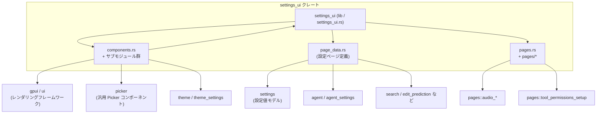
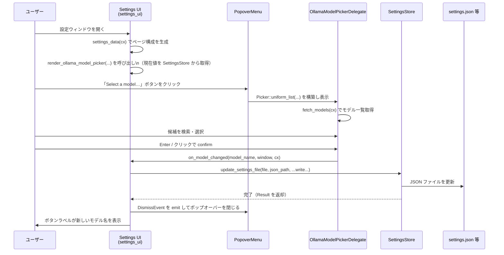

## 1. ざっくり一言

`settings_ui` クレートは、Zed の「設定」ウィンドウを構成する **UI コンポーネント** と、各種設定ページ（General / Appearance / Editor / …）の **データ定義** をまとめたモジュールです。

---

## 2. このモジュールの役割

### 2.1 概要

- このクレートは Zed の設定編集機能のために存在し、次の二つを提供します。
  - 設定画面で使う汎用 UI 部品（ドロップダウン、数値入力、フォント/テーマ/モデルピッカー等）
  - それらの部品を使って構成される、各カテゴリごとの設定ページ定義（`SettingsPage` / `SettingsPageItem` 群）

コード上では、実際の設定値構造体（`settings::SettingsContent` 等）と UI の橋渡しを、`SettingField` の `pick` / `write` クロージャで行っています。

### 2.2 アーキテクチャ内での位置づけ

このチャンクから分かる範囲での主要モジュール間の関係です。



- `settings_ui`（ライブラリ本体）は、`components` と `page_data` を組み合わせて実際の UI を構築していると考えられます（本チャンクにはその UI 組立コードは含まれていません）。
- `components` は gpui / ui / picker / theme など UI 系クレートに依存し、純粋な UI 部品を提供します。
- `page_data` は `settings` クレートの設定データ構造と `SettingsPage` 系型を用いて、画面に表示する項目ツリーを定義しています。

### 2.3 設計上のポイント

コードから読み取れる特徴を箇条書きで示します。

- **データ駆動な設定画面**
  - 各ページは `SettingsPage { title, items }` の形で定義され、`items` は `SettingsPageItem`（`SettingItem`, `DynamicItem`, `SubPageLink`, `ActionLink`, `SectionHeader` 等）の配列として記述されます。
  - 各設定項目は `SettingField { json_path, pick, write }` を通じて、実際の `settings::SettingsContent` 上の値に紐付きます。

- **汎用コンポーネントの再利用**
  - 列挙型用ドロップダウン `EnumVariantDropdown<T>`、数値入力 `NumberField<T>`、テキスト入力 `SettingsInputField`、検索付きピッカー類（フォント/テーマ/アイコンテーマ/Ollama モデル）などを共通コンポーネントとして提供し、ページ定義側から使い回せるようになっています。

- **gpui の状態管理との統合**
  - `window.use_state` / `window.use_keyed_state` / `cx.entity()` / `Entity<T>` / `WeakEntity<T>` を用いて、フォーカス・テキスト内容・コールバック等の状態を UI コンポーネント内部で持ちます。
  - フォーカスアウト時の確定処理や、外部からの設定値更新との同期などを、Entity 状態を通じて行っています。

- **設定スコープの明確化**
  - 各 `SettingItem` に `files: USER | PROJECT` のようなビットフラグがあり、「ユーザー設定」「プロジェクト設定」など、どの設定ファイルに属するかが明示されています。

- **多数の新型ラッパーに対する共通処理**
  - `NumberFieldType` トレイトおよび各種マクロ（`impl_newtype_numeric_stepper_*`、`impl_numeric_stepper_*`）を使って、`FontSize`, `DelayMs`, `InactiveOpacity` など多くの newtype／数値型に一括でインクリメント・デクリメント・クランプ処理を実装しています。

---

## 3. 主要な機能一覧

このディレクトリが提供している主な機能を挙げます。

- **EnumVariantDropdown**: strum 対応列挙型の値を選択する汎用ドロップダウンコンポーネント
- **Font / Theme / Icon Theme Picker**: 検索可能なリストからフォント・テーマ・アイコンテーマを選択する UI
- **Ollama モデルピッカー**: Ollama モデル一覧を取得して設定ファイルに書き戻す専用ピッカー
- **SettingsInputField**: 設定値の編集に使う単行テキスト入力（Confirm / Clear ボタン付き）
- **NumberField<T>**: ±ボタン＋（任意で）直接編集用のエディタ付き数値入力
- **SettingsSectionHeader**: 設定ページ内のセクション見出し（ラベル＋アイコン＋区切り線）
- **設定ページデータ生成 (`settings_data`)**:
  - General / Appearance / Keymap / Editor / Languages & Tools / Search & Files / Window & Layout / Panels / Debugger / Terminal / Version Control / Collaboration / AI / Network
  - 各ページ内のセクション（例: 「Theme」「Buffer Font」「Gutter」等）の詳細な項目群
- **言語別設定ヘルパー**
  - `language_settings_field` / `language_settings_field_mut` で「現在アクティブな言語」または「全言語の defaults」に対する読み書きを共通化
  - `language_settings_data` でインデント・ラップ・インデントガイド・フォーマットなど言語毎の設定項目をまとめて構成

---

## 4. 関数・構造体の解説

### 4.1 型一覧（構造体・列挙体など）

このチャンク内で定義されている主な公開型です。

| 名前 | 種別 | 役割 / 用途 |
|------|------|-------------|
| `EnumVariantDropdown<T>` | 構造体 | strum 対応列挙型 `T` の値を選択するドロップダウン。ラベル配列と値配列から UI を構築します。 |
| `FontPickerDelegate` | 構造体 | フォント選択 `Picker` 用デリゲート。フォント一覧のフィルタリング・選択状態管理を担当します。 |
| `ThemePickerDelegate` | 構造体 | テーマ選択用デリゲート。テーマ一覧のフィルタリング・選択状態管理を担当します。 |
| `IconThemePickerDelegate` | 構造体 | アイコンテーマ選択用デリゲート。 |
| `OllamaModelPickerDelegate` | 構造体（非公開） | Ollama モデル選択用デリゲート。モデル一覧からフィルタリング／選択し、変更コールバックを呼び出します。 |
| `SettingsInputField` | 構造体 | 設定編集用の単行テキスト入力。プレースホルダ、Confirm/Clear ボタン、任意アクションスロット等を持ちます。 |
| `NumberFieldMode` | enum | `NumberField` の表示モード。`Read`（ボタンのみ）/ `Edit`（テキスト入力可能）の 2 種類。 |
| `NumberFieldType` | トレイト | 数値入力コンポーネントに必要な振る舞い（ステップ量・クランプ・フォーマット）を抽象化します。 |
| `NumberField<T>` | 構造体 | 汎用数値入力コンポーネント。±ボタン、（Edit モード時の）エディタ、on_change コールバックなどを保持します。 |
| `SettingsSectionHeader` | 構造体 | セクション見出し表示用コンポーネント（テキストと任意アイコン＋ Divider）。 |

`page_data.rs` で使用される以下の型は、このチャンクには定義がありませんが、利用方法から役割を推測できます（名前はいずれも `crate` からインポートされています）。

| 名前 | 種別 | 役割 / 用途（コードからの推測） |
|------|------|--------------------|
| `SettingsPage` | 構造体 | 1 つの設定ページ（タブ）を表す。`title` と `items` を持つ。 |
| `SettingsPageItem` | enum | ページ内の要素（`SectionHeader`, `SettingItem`, `DynamicItem`, `SubPageLink`, `ActionLink` 等）を表す。 |
| `SettingItem` | 構造体 | 単一の設定項目（タイトル・説明・`SettingField` 等）を表す。 |
| `SettingField<T>` | 構造体 | `settings::SettingsContent` と UI を結びつける。`pick`（読み出し）/ `write`（書き込み）クロージャと `json_path` を持つ。 |
| `DynamicItem` | 構造体 | 列挙型の discriminant に応じて複数のフィールド群を切り替える動的設定セクション。 |
| `SubPageLink` | 構造体 | 「詳細設定」などのサブページへのリンクを表す。 |
| `ActionLink` | 構造体 | 「Open Keymap」など、ボタン押下で何らかのアクションを行う項目。 |

※ これらの具体的な定義は別ファイル（`src/settings_ui.rs` など）に存在し、本チャンクからは参照のみとなっています。

---

### 4.2 関数詳細（代表的な 7 件）

#### 1. `EnumVariantDropdown::new(id, current_value, variants, labels, on_change) -> EnumVariantDropdown<T>`

**概要**

- 列挙型 `T` の現在値と候補リストから、汎用的なドロップダウンコンポーネントを構築するためのコンストラクタです。
- 変更時に呼び出される `on_change` コールバックを受け取り、内部で `Rc` に包んで保持します。

**引数**

| 引数名 | 型 | 説明 |
|--------|----|------|
| `id` | `impl Into<ElementId>` | ドロップダウンに紐付ける UI 要素 ID。 |
| `current_value` | `T` | 現在選択されている値。 |
| `variants` | `&'static [T]` | 値の候補リスト。`current_value` を必ず含む前提です。 |
| `labels` | `&'static [&'static str]` | 各候補に対応する表示ラベル配列。`variants` と同じ長さである必要があります。 |
| `on_change` | `impl Fn(T, &mut ui::Window, &mut App) + 'static` | ユーザーが値を変更したときに呼ばれるコールバック。 |

**戻り値**

- `EnumVariantDropdown<T>` インスタンス。後続のビルダーメソッド（`title_case`, `tab_index`）を経て `RenderOnce` としてレンダリングされます。

**内部処理の要点（`render` 実装含む）**

- `variants` 内から `current_value` と一致する要素のインデックスを検索し、対応する `current_value_label` を取得します（`position(...).unwrap()` を使用）。
- ラベル文字列をキーにして `window.use_keyed_state` を呼び、`ContextMenu` を構築します。
  - メニュー内には `(value, label)` のペアごとに `menu.toggleable_entry(...)` が追加され、クリック時に `on_change(value, window, cx)` が呼ばれます。
- `DropdownMenu::new(...)` でドロップダウン本体を作成し、タイトル文言に `current_value_label` を使用します。
- `.title_case(true/false)` に応じてラベルを TitleCase に変換するかを制御します。
- `.tab_index` が設定されていればキーボードフォーカス順を指定します。

**Edge cases（エッジケース）**

- `variants` 内に `current_value` が存在しない場合、`position(...).unwrap()` が panic します。
- `variants.len() != labels.len()` の場合も、インデックスがずれて意図しないラベル表示になります（コード上で検証はしていません）。

**使用上の注意点**

- `variants` と `labels` は 1 対 1 に対応し、`current_value` が必ず `variants` に含まれるようにする必要があります。
- `T` には `strum::VariantArray + strum::VariantNames + Copy + PartialEq + Send + Sync + 'static` 制約があるため、主に strum で派生した列挙型向けです。

**使用例**

```rust
// 例: Vim モードの有効/無効を切り替える簡単なドロップダウン
#[derive(strum::EnumIter, strum::VariantArray, strum::VariantNames, Copy, Clone, PartialEq)]
enum VimMode {
    Enabled,
    Disabled,
}

fn vim_mode_dropdown(
    id: ElementId,
    current: VimMode,
) -> impl gpui::IntoElement {
    // 列挙値と表示ラベルの配列
    const VARIANTS: &[VimMode] = VimMode::VARIANTS;
    const LABELS: &[&str] = &["Enabled", "Disabled"];

    EnumVariantDropdown::new(
        id,
        current,
        VARIANTS,
        LABELS,
        |new_value, _window, _cx| {
            // ここで settings_content などを更新する
        },
    )
}
```

---

#### 2. `font_picker(current_font, on_font_changed, window, cx) -> Picker<FontPickerDelegate>`

**概要**

- 利用可能なフォントファミリ一覧を `FontFamilyCache` から取得し、検索付きのフォント選択ダイアログ（`Picker`）を構築して返す関数です。

**引数**

| 引数名 | 型 | 説明 |
|--------|----|------|
| `current_font` | `SharedString` | 現在選択中のフォントファミリ名。 |
| `on_font_changed` | `impl Fn(SharedString, &mut Window, &mut App) + 'static` | フォント変更確定時に呼ばれるコールバック。 |
| `window` | `&mut Window` | gpui のウィンドウコンテキスト。 |
| `cx` | `&mut Context<FontPicker>` | `Picker` 用のコンテキスト。 |

**戻り値**

- `Picker<FontPickerDelegate>`（別名 `FontPicker`）。呼び出し元で `.into_any_element()` などを通じて UI に組み込めます。

**内部処理（FontPickerDelegate::new / update_matches / confirm）**

- `FontFamilyCache::global(cx)` からフォント一覧を取得し、`fonts: Vec<SharedString>` に格納します。取得に失敗した場合は `current_font` のみを候補にします。
- `filtered_fonts` には `StringMatch` のリストとして候補を保持し、`update_matches` で検索クエリに応じてフィルタリングします（現状、部分一致＋小文字化比較で実装）。
- `confirm` では `selected_index` に対応する `StringMatch` を取得し、`on_font_changed` を呼び出します。

**Edge cases**

- 検索結果が空の場合、`confirm` は何も行いません（`get(self.selected_index)` が `None`）。
- フォント一覧取得に失敗した場合でも、`current_font` を候補として保持するため完全な空リストにはなりません。

**使用上の注意点**

- `on_font_changed` の中で設定ファイルを書き換える場合は、`settings` クレートや `SettingsStore` を用いた適切な更新処理を行う必要があります（このチャンクにはその実装は含まれていません）。
- `Picker` 自体の表示タイミングやトリガー（ボタンなど）は呼び出し側で制御します。

**使用例**

```rust
// 設定項目「Editor Buffer Font」を変更するためのフォントピッカー例
fn render_buffer_font_picker(
    current: SharedString,
    window: &mut Window,
    cx: &mut Context<FontPicker>,
) -> FontPicker {
    font_picker(
        current.clone(),
        move |new_font, _window, _app| {
            // ここで SettingsContent.theme.buffer_font_family を更新するなど
        },
        window,
        cx,
    )
}
```

---

#### 3. `theme_picker(current_theme, on_theme_changed, window, cx) -> ThemePicker`

`icon_theme_picker` もほぼ同様の構造なので、共通の説明をします。

**概要**

- `ThemeRegistry` からテーマ名（またはアイコンテーマ名）の一覧を取得し、検索可能なピッカーを構築する関数です。
- 選択確定時に `on_theme_changed` コールバックが呼ばれます。

**引数/戻り値**

- 引数構造は `font_picker` と同様で、`current_theme: SharedString` とコールバック／`Window`／`Context<ThemePicker>` を受け取り、`Picker<ThemePickerDelegate>` を返します。

**内部処理の流れ**

- Delegate の `new` で:
  - `ThemeRegistry::global(cx)` 経由でテーマ一覧を取得。
  - `current_theme` のインデックスを求めて `selected_index` に設定。
  - `filtered_themes` に全テーマを `StringMatch` として格納。
- `update_matches` でクエリ文字列に応じて部分一致フィルタリング。
- `confirm` で選択テーマ名を `on_theme_changed` に渡す。

**Edge cases**

- `current_theme` が一覧にない場合、`selected_index` は 0 にフォールバックします。
- フィルタリング結果が空のときは `confirm` が何もしない可能性があります（テーマピッカーは `if let Some(...)` で guard しています）。

**使用例**

```rust
// Appearance ページの「Theme Name」用のテーマピッカーを表示するイメージ
fn render_theme_name_picker(
    current: SharedString,
    window: &mut Window,
    cx: &mut Context<ThemePicker>,
) -> ThemePicker {
    theme_picker(
        current.clone(),
        move |new_theme, _window, _app| {
            // settings_content.theme.theme の書き換えなどを行う
        },
        window,
        cx,
    )
}
```

---

#### 4. `render_ollama_model_picker(field, file, _metadata, _window, cx) -> AnyElement`

**概要**

- `settings::OllamaModelName` 用の専用 UI を構築し、現在のモデル名の表示と、Popover 内のモデル選択 `Picker` をまとめて返す関数です。
- モデル選択の確定時には `update_settings_file` を通じて設定ファイルが更新されます。

**引数**

| 引数名 | 型 | 説明 |
|--------|----|------|
| `field` | `SettingField<settings::OllamaModelName>` | 対象設定フィールド（JSON パス `json_path` と read/write クロージャを含む）。 |
| `file` | `SettingsUiFile` | どの設定ファイル（User / Project 等）を編集するか。 |
| `_metadata` | `Option<&SettingsFieldMetadata>` | UI 表示に関するメタ情報（この関数内では未使用）。 |
| `_window` | `&mut Window` | 使用されていません（引数にはあるが未参照）。 |
| `cx` | `&mut App` | アプリケーションコンテキスト。 |

**戻り値**

- `AnyElement`：トリガーボタン＋Popover メニュー（中にモデルピッカー）が一体化した UI 要素。

**内部処理の流れ**

1. `SettingsStore::global(cx)` から `file` に対応する現在値を取得し、`current_value: SharedString` として保持。
2. `PopoverMenu::new("ollama-model-picker")` を作成し、`render_picker_trigger_button` で生成したボタンをトリガーに設定。
3. `.menu(...)` クロージャ内部で `OllamaModelPickerDelegate::new` を呼び、`Picker::uniform_list(delegate, window, cx)` によりモデル選択 UI を生成。
4. Delegate の `new` では:
   - `edit_prediction::ollama::fetch_models(cx)` でモデル一覧を取得。
   - 現在値が一覧に無ければ先頭に追加。
   - `filtered_models` を `StringMatch` のリストとして初期化。
5. Delegate の `confirm` では:
   - 選択されたモデル名を `on_model_changed` に渡す。
   - `on_model_changed` 内で `update_settings_file(file.clone(), field.json_path, ...)` を呼び、`field.write` クロージャを通じて `settings::OllamaModelName` を設定に反映。
   - `cx.emit(DismissEvent)` によりメニューを閉じる。

**Edge cases**

- `fetch_models` の結果に `current_model` が存在しなかった場合、`current_model` は先頭に追加されます（ユーザーが手入力した未知のモデルを保持する目的と考えられます）。
- フィルタ後にリストが空の場合、`confirm` は何も行わず `DismissEvent` も発火しません（コード上では `Some(...)` チェックで guard しています）。

**使用上の注意点**

- `field.json_path` と `field.write` の組み合わせが正しい設定フィールドを指していることが前提です。
- `update_settings_file` の実装はこのチャンクに含まれていないため、I/O の失敗時の挙動などは不明です（`log_err()` でログ出力されることのみ分かります）。

**使用例**

`render_ollama_model_picker` 自体が SettingItem 用の「レンダラ」として使われる想定なので、通常は直接呼び出す必要はありません。  
（`settings_ui` 本体が `SettingField` の型情報に応じてこの関数を選択していると解釈できますが、詳細はこのチャンクからは分かりません。）

---

#### 5. `SettingsInputField::render(self, window, cx) -> impl IntoElement`

**概要**

- 設定値編集用の単行テキスト入力コンポーネントをレンダリングします。
- バッファフォント／通常フォントの切り替え、Confirm/Clear ボタン、外部からの値更新との同期などを含む比較的高機能な入力フィールドです。

**主な内部処理**

1. **スタイル決定**
   - `ThemeSettings::get_global(cx)` からテーマ設定を取得し、`use_buffer_font` に応じて `TextStyleRefinement` を組み立てます。
   - `self.color` が指定されていれば文字色として適用します。

2. **Editor の生成**
   - `self.id` がある場合: `window.use_keyed_state(id, ...)` を用いて Editor を生成・キャッシュ。
   - `id` がない場合: `window.use_state(...)` で匿名の状態として Editor を保持。
   - 初期テキストやプレースホルダを設定し、スタイルを適用。

3. **外部設定変更との同期**
   - `self.initial_text` が存在し、Editor がフォーカスされていない場合に限り、Editor のテキストと `initial_text` が異なっていれば Editor を更新します。
   - これにより、settings.json の外部編集などで値が変わった際も、ユーザー入力を上書きしないように配慮しています。

4. **ボタン付きコンテナの構築**
   - 外枠として `h_flex()` を用い、枠線・背景色などを設定。
   - フォーカス可能にし、フォーカス時に枠線色を変更（`track_focus` + `.focus(...)`）。
   - 右側に絶対配置されたボタングループを追加し：
     - Clear ボタン: 編集内容が非空かつフォーカス中のときのみ表示、クリックで Editor を空文字に。
     - Confirm ボタン: `self.confirm` がある場合に表示、クリックで `confirm(new_value, window, cx)` を呼び、`clear_on_confirm` に応じて入力をクリア。
     - 任意の `action_slot` があればそれも右側に表示。

5. **キーボード操作での Confirm**
   - `self.confirm` が Some の場合、`on_action::<menu::Confirm>` を設定。
   - これにより Enter キー操作などで Confirm を発火させられます。

**Edge cases**

- `initial_text` と Editor 内容の差分同期は「Editor がフォーカスされていないとき」に限定されます。フォーカス中に外部変更があってもユーザー入力を尊重します。
- `confirm` コールバックは `Option<String>` を受け取ります。空文字列の場合は `None` が渡されるため、呼び出し側で「空なら値を削除」といった扱いを実装できます。

**使用上の注意点**

- 同じ設定を複数箇所で編集する場合は、一意な `ElementId` を `with_id` で指定しておくと、`use_keyed_state` によるキャッシュが効きます。
- `clear_on_confirm` を有効にすると、ユーザーが Confirm 後にフィールドがクリアされる挙動になるため、プレースホルダやラベルで意図を明示するのが安全です。

**使用例**

```rust
fn project_name_input(
    initial: String,
    window: &mut Window,
    cx: &mut App,
) -> impl ui::IntoElement {
    SettingsInputField::new()
        .with_id("project-name-input")
        .with_initial_text(initial)
        .with_placeholder("Project Name")
        .on_confirm(|value_opt, _window, _cx| {
            // value_opt: Some(String) または None（空文字の場合）
            if let Some(name) = value_opt {
                // settings_content.project.worktree.project_name = Some(name);
            } else {
                // None にするなど
            }
        })
}
```

---

#### 6. `NumberField::new(id, value, window, cx) -> NumberField<T>`

**概要**

- 数値入力コンポーネント `NumberField<T>` のインスタンスを生成し、関連する状態（モード、フォーカスハンドル、エディタ参照、on_change 状態など）を gpui の `Entity` として初期化します。

**引数**

| 引数名 | 型 | 説明 |
|--------|----|------|
| `id` | `impl Into<ElementId>` | コンポーネントの UI ID。 |
| `value` | `T` (`NumberFieldType`) | 初期値。 |
| `window` | `&mut Window` | 状態初期化用のウィンドウ。 |
| `cx` | `&mut App` | アプリケーションコンテキスト。 |

**戻り値**

- `NumberField<T>`：`min` / `max` / `mode` / `on_change` 等のビルダーメソッドで設定した後 `RenderOnce` としてレンダリングします。

**内部処理（主なポイント）**

- `window.with_id(id.clone(), |window| { ... })` の中で:
  - `mode: Entity<NumberFieldMode>`（初期値は `Read`）、
  - `focus_handle: Entity<FocusHandle>`、
  - `edit_editor: Entity<Option<WeakEntity<Editor>>>`,
  - `on_change_state: Entity<Option<OnChangeCallback<T>>>`,
  - `last_synced_value: Entity<Option<T>>`
  を初期化。
- `NumberField` 自体はこれら `Entity` をフィールドとして保持し、`render` 時に読み書きします。
- `format` にはデフォルトで `T::default_format` が設定され、必要であれば独自フォーマット関数に差し替えることも可能です（このチャンクでは差し替え用のメソッドは見当たりませんが、フィールド型は `Box<dyn FnOnce(&T) -> String>` になっています）。

**`render` の挙動（概要）**

- `NumberFieldMode::Read` の場合:
  - 真ん中にラベル表示（`format(&self.value)`）＋左右に ± ボタン。
- `NumberFieldMode::Edit` の場合:
  - 中央に `Editor` を配置し、数値を直接入力可能。
  - `MoveUp` / `MoveDown` アクションによりキーボードで ± 操作。
  - フォーカスアウト時に `on_change_state` に保存されたコールバックで確定値を渡します。
- ± ボタン押下時:
  - 現在値（エディタモードでは editor.text() を parse）を取得。
  - `Modifiers`（Shift, Alt）に応じて `large_step` / `step` / `small_step` を選択。
  - `ValueChangeDirection` に応じて `saturating_add` / `saturating_sub` を呼び出し、`min_value` / `max_value` でクランプ。
  - `on_change` コールバックを呼び、エディタモードならエディタテキストも更新。

**Edge cases**

- 編集モードで、ユーザーがパース不能な文字列を入力してフォーカスアウトした場合:
  - `parse::<T>()` が失敗した場合は何も変更されず、そのままになります。
- `NonZero*` 型などの場合、`NumberFieldType` 実装が 1 以上に保つようにしているため、0 以下にはなりません。
- `mode()` メソッドで `Edit` に切り替えない限り、中央部はラベル表示のままで直接編集はできません。

**使用上の注意点**

- `min` / `max` はインスタンス生成後すぐに設定するのが分かりやすいです。`value` が範囲外でも即時にはクランプされず、ボタン操作やフォーカスアウト時に論理的にクランプされる場面があります。
- `on_change` は実際の設定モデル（`settings::SettingsContent` 等）を更新するための唯一のフックになることが多いため、必ず設定しておくべきです（デフォルトは何もしないクロージャ）。

**使用例**

```rust
// Appearance ページなどでフォントサイズを編集する NumberField の例
fn buffer_font_size_field(
    current: f32,
    window: &mut Window,
    cx: &mut App,
) -> impl ui::IntoElement {
    NumberField::new("buffer-font-size", current, window, cx)
        .min(6.0.into())   // FontSize 型であれば newtype だが、ここでは簡略化
        .max(72.0.into())
        .mode(NumberFieldMode::Edit, cx)
        .on_change(|new_value, _window, _cx| {
            // settings_content.theme.buffer_font_size = Some(*new_value);
        })
}
```

---

#### 7. `settings_data(cx: &App) -> Vec<SettingsPage>`

**概要**

- 設定 UI 全体のページ構成（General / Appearance / Editor / …）をまとめて生成するエントリポイント関数です。
- ここで返された `Vec<SettingsPage>` をもとに、設定ウィンドウ全体がレンダリングされると解釈できます（実際のレンダリング処理は本チャンクには含まれていません）。

**引数**

| 引数名 | 型 | 説明 |
|--------|----|------|
| `cx` | `&App` | アプリケーションコンテキスト。Feature Flag の判定や言語一覧取得に利用されます。 |

**戻り値**

- `Vec<SettingsPage>`：各ページ（タブ）を表す構造体の配列。

**内部処理の流れ**

- 固定順序で各ページ用の関数を呼び出しています。

```rust
vec![
    general_page(),
    appearance_page(),
    keymap_page(),
    editor_page(),
    languages_and_tools_page(cx),
    search_and_files_page(),
    window_and_layout_page(),
    panels_page(),
    debugger_page(),
    terminal_page(),
    version_control_page(),
    collaboration_page(),
    ai_page(cx),
    network_page(),
]
```

- 各 `*_page` 関数は `SettingsPage { title, items }` を構築し、その中でさらに `concat_sections!` マクロを用いてセクション毎の `SettingsPageItem` 配列を結合しています。

**使用上の注意点**

- `languages_and_tools_page`, `ai_page` など一部のページは `cx` を受け取り、Feature Flag（`AgentV2FeatureFlag`）や利用可能な言語一覧などに応じて構成を変えています。
- 新しいページを追加する場合は、この関数の `vec![...]` に新ページ関数を追加する必要があると考えられます。

---

### 4.3 その他の関数・マクロ

#### UI コンポーネント関連

| 関数 / メソッド名 | 役割（1 行） |
|-------------------|--------------|
| `EnumVariantDropdown::title_case` | ラベル表示を TitleCase にするかどうかを設定します。 |
| `EnumVariantDropdown::tab_index` | キーボードフォーカス順序を設定します。 |
| `SettingsInputField::with_id` / `with_initial_text` / `with_placeholder` | 入力フィールドの ID、初期値、プレースホルダを設定するビルダーメソッドです。 |
| `SettingsInputField::display_confirm_button` / `display_clear_button` | 右側に Confirm / Clear ボタンを表示するかどうかを設定します。 |
| `SettingsInputField::clear_on_confirm` | Confirm 後に入力をクリアするかどうかを設定します。 |
| `SettingsInputField::with_buffer_font` | 編集テキストにバッファフォントを使用するよう設定します。 |
| `NumberField::min` / `max` | 入力値の下限・上限を設定します。 |
| `NumberField::mode` | `Read` / `Edit` の表示モードを切り替えます。 |
| `NumberField::tab_index` | フォーカス順を設定します。 |
| `NumberField::on_change` | 値変更時に呼び出すコールバックを設定します。 |

#### 数値型トレイト実装用マクロ

| マクロ名 | 役割（1 行） |
|----------|--------------|
| `impl_newtype_numeric_stepper_float!` | `FontSize`, `CodeFade` など内部に浮動小数を持つ newtype に `NumberFieldType` を実装します。 |
| `impl_newtype_numeric_stepper_int!` | 整数 newtype に対してステップ・クランプ処理を実装します。 |
| `impl_numeric_stepper_int!` | 組み込み整数型（`i32`, `u64` 等）に `NumberFieldType` を実装します。 |
| `impl_numeric_stepper_nonzero_int!` | `NonZeroU32` 等の非ゼロ整数型に対し、1 以上を維持するステップ処理を実装します。 |
| `impl_numeric_stepper_float!` | `f32`, `f64` に小数ステップ & クランプを実装します。 |

#### 設定ページ構成関連（page_data.rs）

非常に多数の `*_page` / セクション関数がありますが、代表的なものを表にまとめます。

| 関数名 | 役割（1 行） |
|--------|--------------|
| `general_page()` | 「General」ページ（プロジェクト名・ウィンドウクローズ時の挙動・テレメトリ等）の `SettingsPage` を構築します。 |
| `appearance_page()` | 「Appearance」ページ（テーマ・フォント・カーソル・ハイライト等）を構築します。 |
| `keymap_page()` | 「Keymap」ページ（キーバインド編集リンク、Vim/Helix モード等）。 |
| `editor_page()` | 「Editor」ページ（オートセーブ、スクロール、ホバー、gutter、minimap、Vim 設定など幅広い項目）を構築します。 |
| `languages_and_tools_page(cx)` | 「Languages & Tools」ページ（言語ごとの設定サブページや診断設定等）を構築します。 |
| `search_and_files_page()` | 「Search & Files」ページ（検索条件・ファイルスキャン設定等）。 |
| `window_and_layout_page()` | 「Window & Layout」ページ（ステータスバー、タイトルバー、タブバー、レイアウトなど）。 |
| `panels_page()` | 「Panels」ページ（プロジェクトパネル、ターミナルパネル、Git パネルなど各種パネルの設定）。 |
| `debugger_page()` | 「Debugger」ページ（ステッピング粒度、タイムアウト、ログ設定等）。 |
| `terminal_page()` | 「Terminal」ページ（シェル、フォント、表示・挙動・レイアウト・スクロール履歴等）。 |
| `version_control_page()` | 「Version Control」ページ（Git 統合、Git gutter、inline blame 等）。 |
| `collaboration_page()` | 「Collaboration」ページ（通話設定・オーディオデバイス等）。 |
| `ai_page(cx)` | 「AI」ページ（Agent 設定、コンテキストサーバ設定、Edit Prediction 等）。 |
| `network_page()` | 「Network」ページ（Proxy / Server URL）。 |

その他、言語別設定のためのヘルパー:

| 関数名 | 役割（1 行） |
|--------|--------------|
| `language_settings_field` | 「アクティブ言語」または「defaults」から設定値を読み出す共通ヘルパー。 |
| `language_settings_field_mut` | アクティブ言語（なければ defaults）に対して値を書き込む共通ヘルパー。 |
| `language_settings_data` | 言語ごとの Indentation / Wrapping / Indent Guides / Formatting / Autoclose / Whitespace / Completions 等をまとめた `SettingsPageItem` 配列を構築します。 |

---

## 5. データフロー

ここでは代表的なシナリオとして、「Ollama モデル設定を変更する」場合のデータの流れを説明します。

### シナリオ概要

1. 設定 UI が `settings_data(cx)` → `ai_page(cx)` → `edit_prediction_language_settings_section` 等を通じて、`render_ollama_model_picker` を含む `SettingItem` をレンダリングする。
2. ユーザーがピッカーのトリガーボタンをクリックすると、`PopoverMenu` が開き、`OllamaModelPicker` が表示される。
3. ユーザーがモデルを選択して確定すると、`SettingField::write` を通じて `settings::SettingsContent` が更新され、`SettingsStore` を介して該当 JSON ファイルに保存される。

### シーケンス図



### ポイント

- 「どの設定ファイルに書くか」は `SettingsUiFile`（`file` 引数）と `field.json_path` で決まります。
- 実際の書き込みは `update_settings_file` に隠蔽されており、この関数は `SettingsStore` を使って `settings::SettingsContent` を読み・書きし、最終的に JSON ファイルへ反映していると解釈できます（実装はこのチャンクにはありません）。
- 同様のデータフローパターンが、多くの `SettingItem` + `SettingField` に共通して使われています（数値入力やドロップダウン等も、最終的には `write` クロージャ内で設定モデルを書き換える）。

---

## 6. 使い方（How to Use）

### 6.1 基本的な使用方法

#### 6.1.1 設定ページ全体の取得

外部からこのモジュールを利用する場合、最上流の入口は `settings_data` です。

```rust
use settings_ui::settings_data;
use gpui::App;

// 例: 設定ウィンドウを構築する側のコード（擬似コード）
fn build_settings_ui(app: &App) {
    let pages = settings_data(app); // 各 SettingsPage の配列

    for page in pages {
        // page.title をタブ名として表示し、
        // page.items を走査して各 SectionHeader / SettingItem 等を描画する
        // 実際の描画ロジックはこのチャンクには含まれていません
    }
}
```

> 注: 実際にどのように `SettingsPageItem` を UI に変換しているかは、このチャンクには定義がありません。そのため、「このような形で利用されている」と推測するに留まります。

#### 6.1.2 単純な設定項目（文字列）の追加例

新しい設定項目を追加する際は、対象ページ内のセクション関数に `SettingItem` を 1 つ増やす形で実装するのが自然です。

```rust
fn my_section() -> [SettingsPageItem; 2] {
    [
        SettingsPageItem::SectionHeader("My Section"),
        SettingsPageItem::SettingItem(SettingItem {
            title: "Custom Greeting",
            description: "A greeting message shown on startup.",
            field: Box::new(SettingField {
                json_path: Some("custom_greeting"),
                pick: |settings_content| {
                    settings_content
                        .workspace
                        .custom_greeting
                        .as_ref()
                },
                write: |settings_content, value| {
                    settings_content.workspace.custom_greeting = value;
                },
            }),
            metadata: None,
            files: USER, // ユーザー設定として保存
        }),
    ]
}
```

- `pick` は `Option<&T>` を返し、UI 側が現在値として使用します。
- `write` は `Option<T>` を受け取り、`None` の場合は削除（もしくはデフォルトに戻す）として扱うかどうかを決めます。

#### 6.1.3 UI コンポーネントの利用例（NumberField + SettingsInputField）

```rust
use settings_ui::{NumberField, NumberFieldMode, SettingsInputField};
use gpui::{App, Window};

// フォントサイズとプロジェクト名を編集する簡易 UI（擬似コード）
fn render_example(window: &mut Window, cx: &mut App) -> impl ui::IntoElement {
    let font_size = 12.0_f32;

    v_flex()
        .gap_4()
        .child(
            SettingsSectionHeader::new("General")
                .icon(IconName::Settings),
        )
        .child(
            SettingsInputField::new()
                .with_placeholder("Project Name")
                .on_confirm(|value_opt, _window, _cx| {
                    // value_opt に基づき設定モデルを更新する
                }),
        )
        .child(
            NumberField::new("buffer-font-size", font_size, window, cx)
                .min(6.0)
                .max(72.0)
                .mode(NumberFieldMode::Edit, cx)
                .on_change(|new_value, _window, _cx| {
                    // buffer_font_size を更新する
                }),
        )
}
```

### 6.2 よくある使用パターン

1. **単純な bool / enum 設定**
   - `SettingField<bool>` や `SettingField<Enum>` を使い、`json_path` と simple な `pick` / `write` を定義する。
   - UI は `EnumVariantDropdown` やフラグ専用コンポーネント（このチャンクには未登場）を組み合わせて構築されると考えられます。

2. **DynamicItem による列挙型の variant 切り替え**
   - 例えば `AutosaveSetting` など、「Off / AfterDelay / OnFocusChange / ...」といったモードに応じて追加フィールドが変わる場合に、`DynamicItem` が使われます。
   - `discriminant` 用 `SettingItem` と `pick_discriminant`、variant ごとの `fields: Vec<Vec<SettingItem>>` を用意するパターンが繰り返し登場します。

3. **言語ごとの設定**
   - `language_settings_field` / `language_settings_field_mut` を使い、アクティブ言語 or defaults を透過的に扱う。
   - `json_path` には `"languages.$(language).tab_size"` のようなプレースホルダ形式の文字列が設定されており、UI 側で実際の言語名に展開されていると考えられます（このチャンクには展開ロジックはありません）。

### 6.3 よくある間違い

コードから想定される誤用例と、その修正例を示します。

#### 6.3.1 EnumVariantDropdown で variants に current_value を含めない

```rust
// 誤り例: current_value が VARIANTS に含まれていない
const VARIANTS: &[VimMode] = &[VimMode::Enabled]; // Disabled がない
EnumVariantDropdown::new(
    "vim-mode",
    VimMode::Disabled,
    VARIANTS,
    &["Enabled"],
    |_new, _, _| {},
); // render 時に unwrap() で panic の可能性
```

```rust
// 正しい例: current_value を必ず variants に含める
const VARIANTS: &[VimMode] = &[VimMode::Enabled, VimMode::Disabled];
const LABELS: &[&str] = &["Enabled", "Disabled"];

EnumVariantDropdown::new(
    "vim-mode",
    VimMode::Disabled,
    VARIANTS,
    LABELS,
    |_new, _, _| {},
);
```

#### 6.3.2 NumberField で on_change を設定し忘れる

```rust
// 誤り例: on_change を設定していないため、UI 操作しても設定が変わらない
let field = NumberField::new("scroll-sensitivity", 1.0, window, cx);
// ... render だけしている
```

```rust
// 正しい例: on_change で settings_content を必ず更新する
let field = NumberField::new("scroll-sensitivity", 1.0, window, cx)
    .on_change(|value, _window, _cx| {
        // settings_content.editor.scroll_sensitivity = Some(*value);
    });
```

#### 6.3.3 SettingsInputField の initial_text 同期を誤解する

- 外部から `initial_text` を変更しても、Editor がフォーカス中の間は即座には反映されません。
- そのため、「外部変更を即座に UI に反映させたい」場合は、フォーカス状態も含めた UX を検討する必要があります（仕様としてそう実装されているため）。

### 6.4 使用上の注意点（まとめ）

- **スレッドモデル**
  - `Rc` や `WeakEntity` を多用しており、基本的に single-threaded な UI スレッド上での使用を前提としています。マルチスレッドから直接これらのコンポーネントを操作するのは避けるべきです。

- **設定値との同期**
  - UI コンポーネント（`NumberField`, `SettingsInputField`, 各 Picker 等）は、内部の状態と `settings::SettingsContent` を自動で双方向同期するわけではありません。  
    多くの場合、`on_change` や `write` クロージャの中で明示的にモデルを書き換える必要があります。

- **`.unimplemented()` を付けた SettingField**
  - いくつかの `SettingField` は `.unimplemented()` でラップされています。これらは UI 上でどう扱われるか（無効化されるのか、JSON 直接編集へのリンクになるのか等）は、このチャンクからは分かりません。
  - ただし、少なくとも「まだ専用 UI コンポーネントが用意されていない設定項目」であることは分かります。

- **Feature Flag**
  - `ai_page` の一部機能は `cx.has_flag::<AgentV2FeatureFlag>()` で存在有無が切り替わります。  
    別バイナリ／ビルド構成では項目が表示されない可能性があります。

---

## 7. 関連ファイル

このディレクトリおよび周辺で、`settings_ui` と密接に関係するファイルを列挙します。

| パス | 役割 / 関係 |
|------|------------|
| `settings_ui/src/settings_ui.rs` | ライブラリ本体 (`[lib] path` で指定)。`settings_data` や `components` を用いて実際の設定ウィンドウを構築するエントリポイントと推測されます（本チャンクには定義がありません）。 |
| `settings_ui/src/components.rs` | サブモジュール `dropdown`, `font_picker`, `icon_theme_picker`, `input_field`, `number_field`, `ollama_model_picker`, `section_items`, `theme_picker` を集約し、`pub use` しています。外部からはこのファイル経由で各コンポーネントを利用します。 |
| `settings_ui/src/pages.rs` | `pages` ディレクトリ内の個別ページ（オーディオ設定、ツール権限設定など）をまとめるモジュール。`page_data.rs` の `pages::{...}` インポート先です。 |
| `settings_ui/src/pages/audio_input_output_setup.rs` | コラボレーションページの「Test Audio」等で利用される、オーディオ入出力セットアップ画面の UI 実装。 |
| `settings_ui/src/pages/audio_test_window.rs` | `open_audio_test_window` で呼ばれるオーディオテストウィンドウの UI。 |
| `settings_ui/src/pages/edit_prediction_provider_setup.rs` | Edit Prediction 関連の設定サブページをレンダリングするモジュール。 |
| `settings_ui/src/pages/tool_permissions_setup.rs` | 「Tool Permissions」サブページ（AI エージェントが使うツールのホワイト/ブラックリスト設定）の UI 実装。 |
| `settings` クレート（別ディレクトリ） | `SettingsContent`, 多数の設定用 newtype / enum（`FontSize`, `AutosaveSetting`, `Shell` 等）を定義している設定モデルの中心。`page_data.rs` から広範に利用されています。 |
| `theme` / `theme_settings` クレート | テーマ・フォント関連の設定値・キャッシュ（`FontFamilyCache`, `ThemeRegistry` など）を提供し、ピッカー系コンポーネントから参照されています。 |
| `gpui`, `ui`, `picker` クレート | UI フレームワークおよび汎用 Picker コンポーネント。`components` 内のすべての UI 要素で使用されます。 |

このチャンクにはテストコードやログ出力専用モジュールは含まれていませんが、`Cargo.toml` の `dev-dependencies` から、`fs`, `gpui`, `project`, `settings`, `workspace` などのテストサポートが別途用意されていることが分かります。
