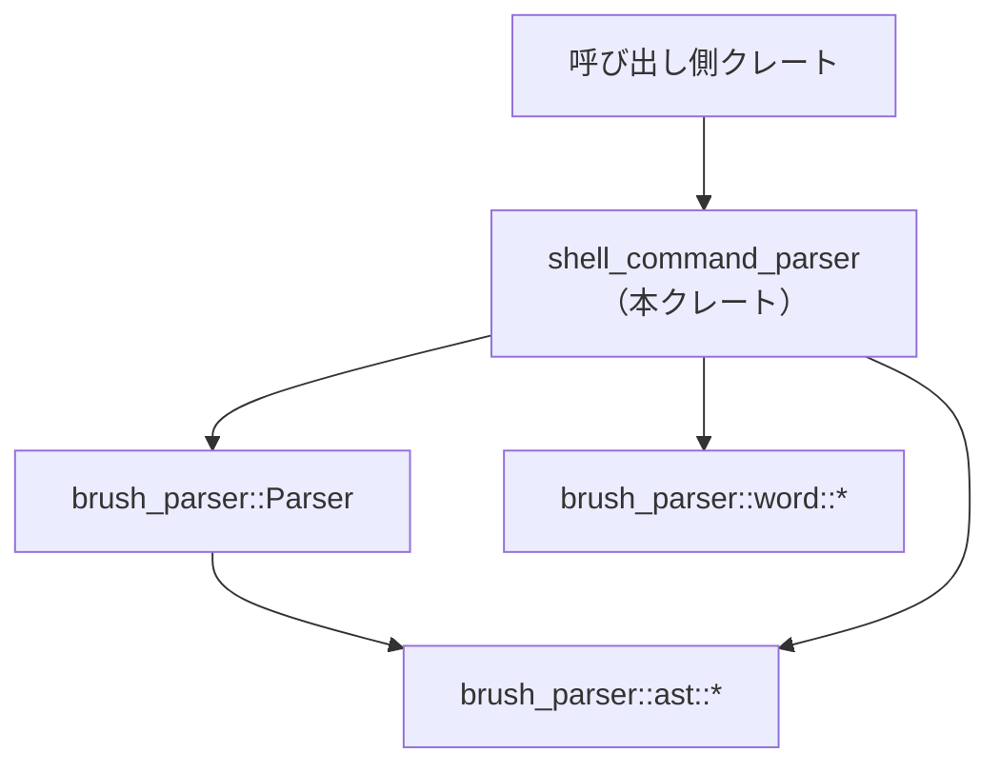
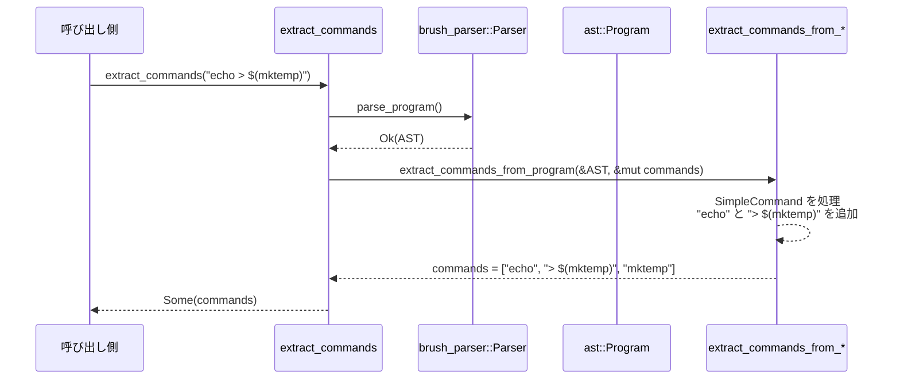

# shell_command_parser/ ディレクトリ解説

## 1. ざっくり一言

`shell_command_parser` クレートは、シェルコマンド文字列を `brush_parser` で AST（抽象構文木）にパースし、

- 正規化されたコマンド列の抽出
- ターミナル表示用のコマンドプレフィックス情報の抽出
- コマンドの「安全性」チェック

を行うユーティリティ群を提供します。

---

## 2. このモジュールの役割

### 2.1 概要

このディレクトリ（クレート）は、シェルコマンド文字列から次の情報を取り出すことを目的にしています。

- **コマンド抽出**  
  `ls | xargs rm -rf` や `echo $(whoami)` のような入力から、実行される個々のコマンドを正規化して列挙します。
- **ターミナル用プレフィックス抽出**  
  `PAGER=less git log --oneline` のような行から  
  `PAGER=less git log` という「環境変数 + コマンド + サブコマンド」部分を切り出します。
- **安全性（Static Safety）の検査**  
  `$HOME` や `$(rm -rf /)` のような動的構文が含まれるかどうかを検査し、  
  `Safe / Unsafe / Unsupported` の 3 区分で判定します。

いずれの機能も、文字列を自前でパースするのではなく、外部クレート `brush_parser` の AST をベースに実装されています。

### 2.2 アーキテクチャ内での位置づけ

このクレートは、呼び出し側と `brush_parser` の間に入る薄いラッパ層として設計されています。



- 呼び出し側は **生のシェル文字列** を本クレートの関数に渡します。
- 本クレートは `brush_parser::Parser` で構文解析し、`ast::Program` などの AST を得ます。
- その AST を再帰的にたどりながら、
  - コマンド列の抽出（`extract_commands_from_*` 系）
  - 安全性検査（`*_validation` 系）
  - プレフィックス抽出（`extract_terminal_command_prefix`）
  を行う構造になっています。

### 2.3 設計上のポイント

コードから読み取れる設計上の特徴は次のとおりです。

- **完全に関数ベース・ステートレス**
  - グローバル状態や保持型を持たず、すべて `&str` や AST を受け取る関数として実装されています。
  - 複数スレッドから同時に呼び出しても、少なくとも本クレート側で共有可変状態はありません。
- **AST ベースの厳密な解析**
  - コマンド抽出・安全性判定ともに、AST の構造（`Program → CompoundList → AndOrList → Pipeline → Command` …）を正しくたどっています。
  - 正規表現による単純な文字列解析ではなく、シェル構文に沿った解析です。
- **エラーハンドリングの方針が明確**
  - **安全性判定** は `Safe / Unsafe / Unsupported` の 3 値を取り、「分からない（解析できない）」状態を `Unsupported` として区別します。
  - **コマンド抽出** は `Option<Vec<String>>` を返し、解析途中で扱えない構造に遭遇した場合は **全体を `None`** にして「抽出不能」としています。
- **正規化と表示を明確に分離**
  - `TerminalCommandPrefix` では、内部的に使いやすい `normalized` と、ユーザー向けに見せる `display` を分けて持っています。
  - リダイレクトや配列代入などは、正規化結果からは除外する一方で、表示には含まれる場合があります。

---

## 3. 主要な機能一覧

このクレートが提供する主な機能を列挙します。

- **`extract_commands`**:  
  シェルコマンド文字列から、正規化された「コマンド単位」の文字列一覧を抽出する。
- **`extract_terminal_command_prefix`**:  
  ターミナル行の先頭から、環境変数代入 + コマンド名 + サブコマンド名を抽出し、表示用情報としてまとめる。
- **`validate_terminal_command`**:  
  コマンド中にパラメータ展開・コマンド置換・算術展開などの「動的構文」が含まれていないか検査し、`Safe / Unsafe / Unsupported` を返す。
- **単語の正規化 (`normalize_word`)**:  
  引用符やバックスラッシュを取り除き、意味的に同じ値を同一の文字列にそろえる。
- **リダイレクトの正規化 (`normalize_io_redirect`)**:  
  `> /etc/passwd` や `2> /tmp/err` などのリダイレクトを標準化した文字列に変換し、一部（`/dev/null` 向きなど）は安全なので出力から除外する。
- **AST ベースの安全性判定 (`*_validation` 系)**:  
  `ast::Program` 以下の各ノードを再帰的に検査し、危険な構文が含まれるかを判定する。
- **ネストしたコマンドの抽出 (`extract_commands_from_*` 系)**:  
  コマンド置換 `$(...)` / バッククォート `` `...` `` / プロセス置換 `<(cmd)` やヒアドキュメント内のコマンドなども再帰的に抽出する。

---

## 4. 関数・構造体の解説

### 4.1 型一覧（構造体・列挙体など）

| 名前 | 種別 | 公開 | 役割 / 用途 |
|------|------|------|-------------|
| `TerminalCommandPrefix` | 構造体 | `pub` | ターミナル入力行の先頭にある「環境変数代入 + コマンド名 + サブコマンド名」の情報をまとめて保持する |
| `TerminalCommandValidation` | 列挙体 | `pub` | `validate_terminal_command` の結果を表し、`Safe / Unsafe / Unsupported` の 3 区分を持つ |
| `TerminalProgramValidation` | 列挙体 | crate 内部 | AST 全体の安全性を表す内部用列挙体。`Safe / Unsafe / Unsupported` |
| `NormalizedAssignment` | 列挙体 | crate 内部 | 環境変数代入をプレフィックスに含めるかどうか（`Included(String)` / `Skipped`）を表す |
| `RedirectNormalization` | 列挙体 | crate 内部 | リダイレクトを正規化した文字列（`Normalized(String)`）か、無視するか（`Skip`）を表す |

`TerminalCommandPrefix` のフィールド構成は次のとおりです。

```rust
pub struct TerminalCommandPrefix {
    pub normalized: String,      // 正規化された "PAGER=less git log" のような文字列
    pub display: String,         // 元の入力から切り出した表示用文字列
    pub tokens: Vec<String>,     // ["PAGER=less", "git", "log"] のようなトークン列
    pub command: String,         // コマンド名（例: "git"）
    pub subcommand: Option<String>, // 最初の非オプション引数（例: Some("log")）
}
```

`TerminalCommandValidation` は次の 3 値です。

- `Safe` – 危険な構文を含まないと判定された場合
- `Unsafe` – パラメータ展開・コマンド置換・算術展開・プロセス置換など危険な構文を含む場合
- `Unsupported` – 構文解析に失敗したり、本クレートがカバーしていない構文が含まれる場合

### 4.2 主要関数の詳細（7 件）

#### `extract_commands(command: &str) -> Option<Vec<String>>`

**概要**

シェルコマンド文字列をパースし、実行されるコマンドを正規化した文字列として列挙します。  
パイプ・制御演算子・サブシェル・コマンド置換・プロセス置換・リダイレクトなどを考慮し、ネストしたコマンドもすべて抽出します。

**引数**

| 引数名    | 型      | 説明 |
|----------|---------|------|
| `command` | `&str` | シェルコマンド全体の文字列 |

**戻り値**

- `Some(Vec<String>)`  
  抽出に成功した場合。ベクタの各要素は、引用符やエスケープを取り除いた **正規化済みコマンドまたはリダイレクト** です。
- `None`  
  コマンド全体、またはネストした部分のどこかでパースに失敗したり、扱えない構造（二項算術コマンドにリダイレクトだけ付いているなど）があった場合。

**内部処理の流れ（ざっくり）**

1. `command.as_bytes()` を `BufReader` でラップし、`brush_parser::Parser` を `ParserOptions::default()`、`SourceInfo::default()` で初期化します。
2. `parser.parse_program()` で `ast::Program` を構築します。失敗した場合は `None` を返します。
3. `extract_commands_from_program(&program, &mut commands)` を呼び、AST を再帰的にたどりながらコマンドを抽出します。
   - `CompoundList → AndOrList → Pipeline → Command` と下り、
   - `Command::Simple` は `extract_commands_from_simple_command` で 1 行分を正規化。
   - `Command::Compound` や `Command::Function` は内部のリストを再帰処理。
   - コマンド置換・プロセス置換・ヒアドキュメントなどはそれぞれ専用の `extract_commands_from_*` で再帰的に抽出。
4. 途中で `normalize_word` や `normalize_io_redirect` が `None` を返した場合、`?` 演算子により全体が `None` になります。
5. 成功した場合は `Some(commands)` を返します。

**Examples（使用例）**

基本的な使い方の例です。

```rust
use shell_command_parser::extract_commands;

fn main() {
    // シンプルなコマンドの例
    let cmds = extract_commands("ls -la /tmp").expect("parse failed"); // パースに失敗したら panic
    assert_eq!(cmds, vec!["ls -la /tmp"]); // 引用符や余分なスペースは正規化されている

    // パイプとコマンド置換を含む例
    let cmds = extract_commands("echo $(whoami) | xargs echo").expect("parse failed");
    // 例: ["echo $(whoami)", "whoami", "xargs echo"] のような形になる
    println!("commands = {cmds:?}");

    // 解析不能な入力に対しては None が返る
    let none = extract_commands("ls &&"); // 不完全な AND
    assert!(none.is_none());
}
```

**Errors / Panics**

- 本関数は `Result` ではなく `Option` を返すため、パースエラーや内部で扱えない構造は `None` で表現されます。
- このファイル内では `unwrap` を直接呼んでいないため、`brush_parser` 側が正常であれば、入力に対して panic しない設計になっています。

**Edge cases（エッジケース）**

- 空文字列 `""`  
  → `Some(vec![])`（テスト `test_empty_command`）
- シンタックスエラー（例: `"ls &&"`）  
  → `None`（`test_invalid_syntax_returns_none`）
- サブコマンド内のパースエラー（例: `"echo $(ls &&)"`）  
  → ネストした `extract_commands` が `None` を返し、全体も `None`（`test_unparsable_nested_substitution_returns_none`）
- 「リダイレクトのみ」のような裸のリダイレクト（例: `"> /etc/passwd"`）  
  → `None`（`test_bare_redirect_returns_none`）
- 算術コマンドにリダイレクトのみが付いた場合（`"(( x = 1 )) > /tmp/file"`）  
  → `None`（`test_arithmetic_with_redirect_returns_none`）
- リダイレクト先が `/dev/null` の場合は **コマンド列からはスキップ** されます  
  → `"cmd > /dev/null"` → `["cmd"]`（`test_redirect_to_dev_null_skipped` など）

**使用上の注意点**

- `None` は「コマンドが 0 個」という意味ではなく、**「解析・正規化ができなかった」** ことを意味します。  
  → その場合は、元の文字列に対する別の処理（生文字列のマッチングなど）にフォールバックする必要があります。
- 戻り値の `Vec<String>` には、`"> /tmp/out"` のようなリダイレクトも含まれます。  
  コマンドとして扱う対象をフィルタリングするかどうかは、呼び出し側の責務です。
- コマンド置換やプロセス置換など、ネストしたコマンドもベクタ内に入る点に注意が必要です。

---

#### `extract_terminal_command_prefix(command: &str) -> Option<TerminalCommandPrefix>`

**概要**

ターミナルでユーザーが入力する 1 行のシェルコマンドから、

- 先頭の環境変数代入（スカラーのみ）
- コマンド名
- 最初のサブコマンド（最初の「非オプション」引数）

を抽出し、正規化済みの `TerminalCommandPrefix` として返します。

**引数**

| 引数名    | 型      | 説明 |
|----------|---------|------|
| `command` | `&str` | 1 行分のシェル入力文字列 |

**戻り値**

- `Some(TerminalCommandPrefix)` – 抽出に成功した場合
- `None` – パースエラー、または AST 上で最初の構文単位が単純コマンドでない場合など

**内部処理の流れ**

1. `extract_commands` と同様に `Parser` で `ast::Program` を構築します。
2. `first_simple_command(&program)` で、一番最初の `SimpleCommand` を取り出します。  
   - 最初の complete command の、最初の compound list item の、最初の pipeline 要素が `Command::Simple` の場合のみ対象。
3. プレフィックス（`simple_command.prefix`）を走査し、`AssignmentWord` だけを対象に `normalize_assignment_for_command_prefix` で正規化します。
   - スカラー代入のみ含め、配列代入はスキップ。
   - 引用符が不要な値は引用符を落とし、必要な値は元の引用付きのまま保持。
   - 含めた単語の `SourceLocation` を使って表示範囲（`display_start` / `display_end`）を更新。
4. `simple_command.word_or_name` をコマンド名として `normalize_word` し、トークンに追加、表示範囲も更新。
5. サフィックス（`simple_command.suffix`）から、
   - 最初に現れる `Word` で、正規化後に `-` で始まらないものをサブコマンドとみなします。
   - それを `subcommand` としてトークンに追加し、表示範囲も更新。
   - リダイレクトなどはプレフィックス同様、トークンには含めません。
6. 決定した `display_start..display_end` で元の `command` から部分文字列を取り出し、`display` とします。

**Examples（使用例）**

代表的なテストケースに相当する使用例です。

```rust
use shell_command_parser::{extract_terminal_command_prefix, TerminalCommandPrefix};

fn main() {
    // 環境変数 + git サブコマンドの例
    let prefix = extract_terminal_command_prefix("PAGER=blah git log --oneline")
        .expect("expected terminal command prefix");

    assert_eq!(prefix.normalized, "PAGER=blah git log");
    assert_eq!(prefix.display,    "PAGER=blah git log");
    assert_eq!(prefix.tokens,     vec!["PAGER=blah", "git", "log"]);
    assert_eq!(prefix.command,    "git");
    assert_eq!(prefix.subcommand, Some("log".to_string()));

    // リダイレクトは normalized/tokens からは除外されるが、display には含まれる例
    let prefix = extract_terminal_command_prefix("git 2>/dev/null log --oneline")
        .expect("expected terminal command prefix");

    assert_eq!(prefix.normalized, "git log");
    assert_eq!(prefix.tokens,     vec!["git", "log"]);
    assert_eq!(prefix.display,    "git 2>/dev/null log");
}
```

**Errors / Panics**

- パースエラー時や、最初のコマンドが `SimpleCommand` でない場合は `None` を返します。
- この関数自体にはユーザー入力に対する `unwrap` はありません。

**Edge cases（エッジケース）**

- 先頭が環境変数配列代入（`FOO=(a b)`）の場合  
  → プレフィックスには含めず、`tokens` には出てきません。
- コマンドの前にリダイレクトのみが並ぶような行（`> out git log`）  
  → コマンド名が見つからない場合は `None` になり得ます。
- `SourceLocation` が取れない単語が含まれる場合（`word.location()` が `None`）  
  → 表示用の切り出しができないため、`None` になります。

**使用上の注意点**

- `display` は、含めた最初の単語の開始位置から最後の単語の終端までを単純に切り出しているため、  
  その間にあるリダイレクトなども表示上は含まれます（`git 2>/dev/null log` の例）。
- `normalized` は、後続の処理（コマンド履歴のキー、補完用キーなど）で利用しやすいよう、  
  引用符を最低限にしたうえでトークンを空白区切りで連結した文字列です。

---

#### `validate_terminal_command(command: &str) -> TerminalCommandValidation`

**概要**

シェルコマンド文字列に対して静的な安全性チェックを行い、

- 危険な構文が一切含まれなければ `Safe`
- 確実に危険とみなすべき構文が含まれていれば `Unsafe`
- 解析に失敗したり、対応していない構文が含まれて安全かどうか判断できない場合は `Unsupported`

を返します。

**引数**

| 引数名    | 型      | 説明 |
|----------|---------|------|
| `command` | `&str` | シェルコマンド全体の文字列 |

**戻り値**

- `TerminalCommandValidation::Safe`
- `TerminalCommandValidation::Unsafe`
- `TerminalCommandValidation::Unsupported`

**内部処理の流れ**

1. `Parser` を使って `command` を `ast::Program` にパースします。
   - ここで失敗した場合は `TerminalCommandValidation::Unsupported` を返します。
2. `program_validation(&program)` を呼び出し、AST 全体を再帰的に走査します。
3. 各レベルで以下のような検査を行います。
   - `word_validation` で `ast::Word` を `brush_parser::word::parse` にかけ、`WordPiece` 列に分解。
   - `word_piece_validation` で各 `WordPiece` をチェックし、
     - `Text` / `SingleQuotedText` / `AnsiCQuotedText` / `EscapeSequence` / `TildePrefix` などは `Safe`
     - `DoubleQuotedSequence` / `GettextDoubleQuotedSequence` は内側を再帰的に検査
     - `ParameterExpansion`（`$HOME` や `${HOME}` など）・`ArithmeticExpression`（`$((1+1))` など）は `Unsafe`
     - `CommandSubstitution` / `BackquotedCommandSubstitution` は、内部コマンドを再パースして `Unsafe` または `Unsupported`
   - プロセス置換（`<(cmd)` / `>(cmd)`）や算術 for なども `Unsafe` として扱う。
4. `combine_validations` で複数の検査結果を集約し、  
   どこか 1 つでも `Unsafe` があれば全体を `Unsafe`、それ以外で `Unsupported` があれば `Unsupported` として返します。
5. 最後に `TerminalProgramValidation` を `TerminalCommandValidation` に変換して返します。

**Examples（使用例）**

```rust
use shell_command_parser::{validate_terminal_command, TerminalCommandValidation};

fn main() {
    // 単純な echo は Safe
    assert_eq!(
        validate_terminal_command("echo hello"),
        TerminalCommandValidation::Safe
    );

    // パラメータ展開は Unsafe
    assert_eq!(
        validate_terminal_command("echo $HOME"),
        TerminalCommandValidation::Unsafe
    );

    // コマンド置換も Unsafe
    assert_eq!(
        validate_terminal_command("echo $(whoami)"),
        TerminalCommandValidation::Unsafe
    );

    // パース不能なコマンドは Unsupported
    assert_eq!(
        validate_terminal_command("echo $(ls &&)"),
        TerminalCommandValidation::Unsupported
    );
}
```

**Errors / Panics**

- パース失敗は `Unsupported` として返されます。
- この関数自体は panic を想定していません（`unwrap` などは使用していません）。

**Edge cases（エッジケース）**

- 特殊パラメータ（`$?`, `$$`, `$@` など）は `ParameterExpansion` として扱われ、`Unsafe` になります（テスト参照）。
- 環境変数代入部分に展開が含まれる場合（`PAGER=$HOME git log`, `PAGER=$(whoami) git log`）も Unsafe（`test_validate_terminal_command_rejects_forbidden_constructs_in_env_var_assignments`）。
- 算術 for ループ（`for ((...)); do ...; done`）は、内容に関わらず `Unsafe`（`test_validate_terminal_command_rejects_arithmetic_for_clause_unconditionally`）。
- case 文のパターンや算術 for の条件部など、構文のさまざまな位置での展開も検査対象です。

**使用上の注意点**

- `Safe` は「構文上、危険な展開が含まれていない」という意味であり、  
  コマンド自体が安全（例: `rm -rf /` は依然として危険）という保証ではありません。
- `Unsupported` は「安全 / 危険を判定できない」状態なので、  
  セキュリティ用途では `Safe` 以外はすべてブロックする、といった扱いが妥当です。

---

#### `normalize_word(word: &ast::Word) -> Option<String>`

**概要**

`ast::Word` を構成する `WordPiece` の列から、引用・エスケープを取り除いた **意味上の値** を構築します。  
ただし、パラメータ展開やコマンド置換などは元のソース文字列をそのまま温存します。

**引数**

| 引数名 | 型          | 説明 |
|--------|-------------|------|
| `word` | `&ast::Word` | AST 上の単語ノード |

**戻り値**

- `Some(String)` – 正規化に成功した場合
- `None` – `brush_parser::word::parse` が失敗したなど、内部で処理できない場合

**内部処理の流れ**

1. `brush_parser::word::parse(&word.value, &ParserOptions::default())` で `Vec<PieceWithSource>` を得ます。
2. 各ピースについて `normalize_word_piece_into` を呼び、結果文字列 `result` に追記します。
   - `Text` / `SingleQuotedText` / `AnsiCQuotedText` は中身のテキストをそのまま追加（引用記号は落とされる）。
   - `EscapeSequence` は先頭の `\` を削って中身を追加。
   - `DoubleQuotedSequence` / `GettextDoubleQuotedSequence` は内側を再帰的に処理（引用記号は落とされる）。
   - `TildePrefix` は `'~'` + プレフィックス文字列として追加。
   - `ParameterExpansion` / `CommandSubstitution` / `BackquotedCommandSubstitution` / `ArithmeticExpression` は、  
     元の `raw_value[start_index..end_index]` スライスをそのまま追加（`$HOME` や `$(cmd)` といった表記自体を保持）。
3. すべて成功したら `Some(result)` を返します。

**Examples（使用例）**

```rust
// この関数は crate 内部専用ですが、動作イメージとしての擬似例です。
use brush_parser::ast;
use shell_command_parser::extract_commands; // normalize_word は直接は公開されていない

fn example() {
    // 実際には ast::Word は brush_parser の Parser から得られます。
    // ここでは挙動イメージだけ示します。

    let cmds = extract_commands("rm -rf '/'").expect("parse failed");
    assert_eq!(cmds, vec!["rm -rf /"]); // 引用符が落ちている

    let cmds = extract_commands("rm -rf ${HOME}").expect("parse failed");
    assert_eq!(cmds, vec!["rm -rf ${HOME}"]); // ${HOME} はそのまま保たれる
}
```

**Edge cases（エッジケース）**

- パラメータ展開やコマンド置換、算術展開は「元の文字列そのまま」を残すため、  
  正規化しても `$HOME` と `'${HOME}'` のような違いは残ります。
- `raw_value.get(start_index..end_index)` が `None` になるようなインデックス不整合があれば、`None` を返します。

**使用上の注意点**

- この関数は内部用であり、外部ユーザーは通常 `extract_commands` や `extract_terminal_command_prefix` を通じて間接的に利用する形になります。
- 引用を完全に落としてしまうため、**元の入力とバイト単位で同一の文字列を再現する用途には適しません**。  
  あくまで「パターンマッチしやすい正規化文字列」を得るための関数です。

---

#### `normalize_io_redirect(redirect: &ast::IoRedirect) -> Option<RedirectNormalization>`

**概要**

AST 上の I/O リダイレクトを、正規化された文字列（例: `"> /etc/passwd"`、`"2> /tmp/err"`）として取り出すか、  
安全と見なされるもの（`/dev/null` 向きなど）は出力からスキップするための内部関数です。

**引数**

| 引数名    | 型                  | 説明 |
|----------|---------------------|------|
| `redirect` | `&ast::IoRedirect` | AST 上のリダイレクトノード |

**戻り値**

- `Some(RedirectNormalization::Normalized(String))` – 正規化されたリダイレクト文字列
- `Some(RedirectNormalization::Skip)` – 抽出結果から除外すべき（安全とみなせる）リダイレクト
- `None` – 正規化できない場合（ターゲットの `normalize_word` が失敗したなど）

**内部処理の流れ（代表的な分岐）**

1. `IoRedirect::File(fd, kind, target)` の場合
   - `target` が `IoFileRedirectTarget::Filename(word)` のときだけ処理対象。
   - `kind` に応じて演算子文字列（`<`, `>`, `>>`, `<>`, `>|`, `<&`, `>&`）を選択。
   - `fd` が `Some(n)` なら `"n"` をプレフィックスとして付与。
   - `normalize_word(target_word)` でパスを正規化。
   - `/dev/null` であれば `Skip`（安全なリダイレクト）を返す。
   - それ以外は `"{}{} {}"` 形式で `Normalized` を返す。
2. `IoRedirect::OutputAndError(word, append)` の場合
   - `append` に応じて `"&>"` または `"&>>"` を選択。
   - `normalize_word(word)` を使ってターゲットを正規化。
   - `/dev/null` なら `Skip`、それ以外は `"{} {}"` 形式の `Normalized`。
3. `IoRedirect::HereDocument` / `IoRedirect::HereString`
   - ここでは常に `Skip` を返し、正規化されたリダイレクト文字列としては出力しません  
     （コマンド抽出自体は別の関数で行われます）。

**Examples（使用例のイメージ）**

```rust
use shell_command_parser::extract_commands;

fn main() {
    // 書き込みリダイレクトは別エントリとして抽出される
    let cmds = extract_commands("echo hello > /etc/passwd").expect("parse failed");
    assert_eq!(cmds, vec!["echo hello", "> /etc/passwd"]);

    // /dev/null 向きリダイレクトはスキップされる
    let cmds = extract_commands("cmd 2>/dev/null").expect("parse failed");
    assert_eq!(cmds, vec!["cmd"]);
}
```

**Edge cases（エッジケース）**

- `/dev/null` へのリダイレクトはすべてスキップ対象  
  （`> /dev/null`、`2> /dev/null`、`&>/dev/null` 等、テスト多数）。
- FD→FD の複製（`2>&1` など）は AST 上では `IoFileRedirectTarget::Duplicate` として扱われ、  
  本関数では `Skip` になります（防御的に `Duplicate*` の kind もカバーしています）。
- `normalize_word` が `None` の場合（パース不能など）は `None` を返し、上位の `extract_commands` 全体も `None` になります。

**使用上の注意点**

- この関数の戻り値は **「表示用の文字列としてどう扱うか」** を決めるためのものであり、  
  実行時の I/O 動作そのものを評価するものではありません。
- `/dev/null` が特別扱いされているため、**「危険なファイルへのリダイレクトだけを検知したい」などの用途では  
  `/dev/null` 向きリダイレクトは別途扱う必要があります**。

---

#### `program_validation(program: &ast::Program) -> TerminalProgramValidation`

**概要**

トップレベルの AST (`ast::Program`) から開始して、  
全体の安全性を `TerminalProgramValidation`（Safe / Unsafe / Unsupported）として判定します。  
`validate_terminal_command` からのみ直接呼ばれます。

**引数**

| 引数名   | 型             | 説明 |
|---------|----------------|------|
| `program` | `&ast::Program` | シェルプログラム全体の AST |

**戻り値**

- `TerminalProgramValidation::Safe / Unsafe / Unsupported`

**内部処理の流れ**

1. `program.complete_commands` を `compound_list_validation` で順に検査します。
2. `compound_list_validation` は `and_or_list_validation` に委譲し、  
   `AndOrList → Pipeline → Command` へと下りながら `command_validation` を呼びます。
3. `command_validation` は `Command` のバリアントごとに  
   `simple_command_validation`・`compound_command_validation`・`function_body_validation`・`extended_test_expr_validation` に分岐します。
4. 各検査関数で `word_validation`・`word_piece_validation` を呼び出し、  
   パラメータ展開やコマンド置換などをチェックします。
5. すべての結果を `combine_validations` で集約し、最終的な `Safe / Unsafe / Unsupported` を返します。

**使用上の注意点**

- この関数は内部専用であり、外部から直接呼ぶ必要はありません。  
  代わりに `validate_terminal_command` を用いてください。

---

#### `extract_commands_from_simple_command(simple_command: &ast::SimpleCommand, commands: &mut Vec<String>) -> Option<()>`

**概要**

1 つの `SimpleCommand`（環境変数代入 + コマンド + 引数 + リダイレクト）から、  
正規化された 1 行分のコマンド文字列と関連するリダイレクトを `commands` ベクタに追加します。  
さらに、この simple command 内部に含まれるコマンド置換なども再帰的に抽出します。

**引数**

| 引数名          | 型                      | 説明 |
|----------------|-------------------------|------|
| `simple_command` | `&ast::SimpleCommand`   | 対象の単純コマンド AST |
| `commands`       | `&mut Vec<String>`      | ここに抽出結果を追加 |

**戻り値**

- `Some(())` – 抽出に成功した場合
- `None` – 正規化途中で失敗した場合（`normalize_word` 失敗、禁止構造など）

**内部処理の流れ（概要）**

1. 一時ベクタ `words` と `redirects` を用意。
2. プレフィックス（`prefix`）中のアイテムを走査。
   - `IoRedirect` は `normalize_io_redirect` で正規化し `redirects` に。
   - `AssignmentWord` は `normalize_assignment_for_command_prefix` の `Included` のものだけ `words` に。
   - `Word` は `normalize_word` して `words` に。
   - `ProcessSubstitution` は `None` を返し、全体の抽出を中止。
3. `word_or_name`（コマンド名）があれば `normalize_word` して `words` に追加。
4. サフィックス（`suffix`）でも同様に、
   - `Word` → `normalize_word` → `words`
   - `IoRedirect` → `normalize_io_redirect` → `redirects`
   - `AssignmentWord` → スカラーだけ `words` に
   - `ProcessSubstitution` → ここでは抽出中止にはせず、後続の `extract_commands_from_command_suffix` で処理。
5. `words` が空で `redirects` だけある場合（裸リダイレクト）は `None` を返す。
6. `words.join(" ")` を 1 行分のコマンドとして `commands` に追加（空ならスキップ）。
7. `commands` に `redirects` を追加。
8. さらに `prefix` / `word_or_name` / `suffix` を `extract_commands_from_*` 系で走査し、  
   コマンド置換やプロセス置換を再帰的に抽出して `commands` に追加。

**Examples（使用例のイメージ）**

この関数は内部専用なので、直接呼び出す代わりに `extract_commands` 経由で使います。

```rust
use shell_command_parser::extract_commands;

fn main() {
    let cmds = extract_commands("PAGER=less git log > /tmp/out").expect("parse failed");
    // ["PAGER=less git log", "> /tmp/out"]
    println!("{cmds:?}");
}
```

**Edge cases（エッジケース）**

- プレフィックス・サフィックスに配列代入がある場合は無視されます（`FOO=(a b)`）。
- prefix-only redirect（`> /etc/passwd`）は `None` を返します（テスト参照）。
- 算術コマンドとリダイレクトの組み合わせなど、ボディが空でリダイレクトだけになる compound は `None` になります（上位の処理と連携）。

**使用上の注意点**

- `Option<()>` の `None` は、呼び出し元でその `Program` 全体の抽出を諦める合図として使われています。  
  → `extract_commands` 全体が `None` になります。

---

#### `extract_commands_from_program`, `*_from_compound_list`, `*_from_and_or_list`, `*_from_pipeline`, `*_from_command`, `*_from_word` など

**概要**

`extract_commands` を支える一連の再帰関数群で、AST の各ノード種別に対応しています。

**役割（まとめ）**

| 関数名（群） | 役割（1 行） |
|--------------|--------------|
| `extract_commands_from_program` | `ast::Program` からすべての complete command をたどり、コマンド抽出の起点となる |
| `extract_commands_from_compound_list`, `extract_commands_from_and_or_list`, `extract_commands_from_pipeline` | AND/OR やパイプ、セミコロン・改行区切りを処理し、各 `Command` に到達する |
| `extract_commands_from_command` | `Simple` / `Compound` / `Function` / `ExtendedTest` ごとに適切な抽出関数へディスパッチする |
| `extract_commands_from_compound_command` | ブレースグループ・サブシェル・for / while / if / case / arithmetic など複合構文の本体からコマンドを抽出 |
| `extract_commands_from_io_redirect` | リダイレクト先に含まれるコマンド（プロセス置換・ヒアストリング・ヒアドキュメントの展開部など）を抽出 |
| `extract_commands_from_assignment` | 環境変数代入の値に含まれるコマンド置換などを抽出 |
| `extract_commands_from_word`, `extract_commands_from_word_piece` | 単語中のコマンド置換（`$(...)`、`` `...` ``）を再帰的に抽出 |

---

### 4.3 その他の関数

その他、補助的な関数は次のような役割を持ちます。

| 関数名 | 役割（1 行） |
|--------|--------------|
| `first_simple_command` | `ast::Program` の先頭から最初の `SimpleCommand` を見つけ、プレフィックス抽出に利用する |
| `update_display_bounds` | `TerminalCommandPrefix.display` 用に、単語ごとの `SourceLocation` から開始・終了インデックスを更新する |
| `normalize_assignment_for_command_prefix` | 環境変数代入のうちプレフィックスとして含めるもの（スカラー）とスキップするもの（配列）を判定し、必要に応じて引用を維持する |
| `shell_value_requires_quoting` | 値に空白や一部記号が含まれるかどうかを見て、「引用が必要か」を判定する |
| `word_validation`, `word_piece_validation` | `validate_terminal_command` 用に各単語・ピースの安全性を評価する |
| `compound_command_validation` 以下 `*_validation` 系 | if / while / case / for / 関数定義など複合構文ごとの安全性検査を行う |
| `combine_validations` | 個別の判定結果を集約し、`Unsafe` 優先 / 次に `Unsupported`、最後に `Safe` というルールでまとめる |

---

## 5. データフロー

ここでは、代表的なシナリオとして

```sh
echo > $(mktemp)
```

というコマンド文字列に対する `extract_commands` の処理の流れを示します。

1. 呼び出し側が `extract_commands("echo > $(mktemp)")` を呼ぶ。
2. 本クレートが `brush_parser::Parser` を使って文字列を `ast::Program` に変換する。
3. `extract_commands_from_program` → `..._from_simple_command` とたどり、
   - `words` として `"echo"` を収集。
   - `redirects` として `"> $(mktemp)"` を正規化して収集。
4. リダイレクトのターゲット単語 `$(mktemp)` 内の `WordPiece::CommandSubstitution` を検出し、  
   再帰的に `extract_commands("mktemp")` を呼んで `"mktemp"` を抽出。
5. 最終的な結果ベクタは `["echo", "> $(mktemp)", "mktemp"]` となり、呼び出し側に返されます。

これをシーケンス図で表すと次のようになります。



このように、

- **1 回の呼び出しで元のコマンドと、その中で実行される補助コマンド（ここでは `mktemp`）の両方を抽出** する設計になっています。

---

## 6. 使い方（How to Use）

### 6.1 基本的な使用方法

典型的な利用フローは、

1. ユーザー入力のシェル行を受け取る
2. `validate_terminal_command` で動的構文の有無をチェック
3. 問題なさそうであれば `extract_commands` や `extract_terminal_command_prefix` で正規化情報を取得

という流れになります。

```rust
use shell_command_parser::{
    extract_commands,
    extract_terminal_command_prefix,
    validate_terminal_command,
    TerminalCommandPrefix,
    TerminalCommandValidation,
};

fn handle_user_input(line: &str) {
    // 1. 安全性チェック
    match validate_terminal_command(line) {
        TerminalCommandValidation::Safe => {
            // 2. コマンド抽出
            if let Some(cmds) = extract_commands(line) {
                println!("normalized commands: {cmds:?}");
            } else {
                // 解析不能な場合は生文字列に対する処理にフォールバックするなど
                eprintln!("could not normalize commands, fallback to raw handling");
            }

            // 3. プレフィックス抽出（UI 用など）
            if let Some(prefix) = extract_terminal_command_prefix(line) {
                println!("prefix: {:?}", prefix.normalized);
            }
        }
        TerminalCommandValidation::Unsafe => {
            eprintln!("command contains unsafe constructs, rejecting: {line}");
        }
        TerminalCommandValidation::Unsupported => {
            eprintln!("command syntax unsupported, cannot safely analyze: {line}");
        }
    }
}
```

### 6.2 よくある使用パターン

**パターン 1: 危険なコマンド検知・ログ**

- `extract_commands` で正規化されたコマンド列を得て、  
  その中に `rm -rf /` のようなパターンが含まれるかを検査する用途です。

```rust
use shell_command_parser::extract_commands;

fn contains_dangerous_rm(line: &str) -> bool {
    if let Some(cmds) = extract_commands(line) {
        cmds.iter().any(|cmd| cmd == "rm -rf /")
    } else {
        // 正規化できない場合は「判断不能」として別扱いする
        false
    }
}
```

**パターン 2: ターミナル UI でのプレフィックス表示**

- `extract_terminal_command_prefix` で `PAGER=less git log` のようなプレフィックスだけを  
  上部に固定表示したり、履歴検索のキーに使うといった用途が考えられます。

```rust
use shell_command_parser::extract_terminal_command_prefix;

fn show_prefix(line: &str) {
    if let Some(prefix) = extract_terminal_command_prefix(line) {
        println!("command key: {}", prefix.normalized); // 例: "git log"
    }
}
```

**パターン 3: セーフモード実行のフィルタ**

- ある機能では `Safe` なコマンドだけを許可し、それ以外は明示的な確認を要求する、といった使い方です。

```rust
use shell_command_parser::{validate_terminal_command, TerminalCommandValidation};

fn can_run_without_prompt(line: &str) -> bool {
    validate_terminal_command(line) == TerminalCommandValidation::Safe
}
```

### 6.3 使用上の注意点（まとめ）

- **`extract_commands` の `None` は「解析不能」**
  - `Some(vec![])` と `None` は意味が異なります。  
    - `Some(vec![])` … 空のプログラム（何もコマンドがない）  
    - `None` … パースエラーや対応していない構造のため、**正規化に失敗** した
- **リダイレクトやネストしたコマンドもベクタに含まれる**
  - `["echo hello", "> /tmp/out", "mktemp"]` のように、  
    1 つの入力から複数の要素が得られるため、用途に応じてフィルタリングが必要です。
- **`validate_terminal_command` の `Safe` は「展開がない」だけ**
  - コマンドそのものの危険性はチェックしていません。  
    安全性ポリシーでは、`Safe` であっても意味的に危険なコマンドを別途フィルタする必要があります。
- **`Unsupported` をどう扱うかはポリシー次第**
  - セキュアな用途では `Safe` 以外は拒否するのが無難です。
- **マルチバイト文字と `display`**
  - `display` は `SourceLocation` の `start.index` / `end.index` でスライスした文字列です。  
    インデックスの意味（バイト単位かコードポイント単位か）は `brush_parser` の実装に依存しますが、  
    通常は元の入力と対応した部分文字列が得られます。

---

## 7. 関連ファイル

| パス | 役割 / 関係 |
|------|-------------|
| `shell_command_parser/Cargo.toml` | クレート名・ライセンス・依存関係 (`brush_parser`) などを定義するマニフェスト |
| `shell_command_parser/src/shell_command_parser.rs` | 本クレートの実装本体。API・内部関数・テストがすべてこのファイルに含まれる |

外部依存としては、

- `brush_parser` クレート  
  – シェル構文のパーサと AST 型 (`ast::Program` など)、および単語パーサ (`word::parse`, `WordPiece`) を提供し、  
    本クレートはその上にコマンド抽出・安全性検査・プレフィックス抽出機能を構築しています。

この 1 ファイル・1 クレート構成のため、本クレートの挙動は `src/shell_command_parser.rs` を読むことでほぼ把握できます。
