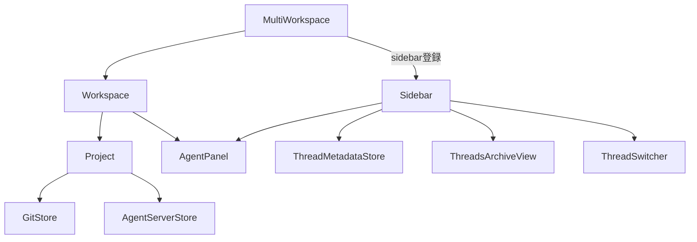
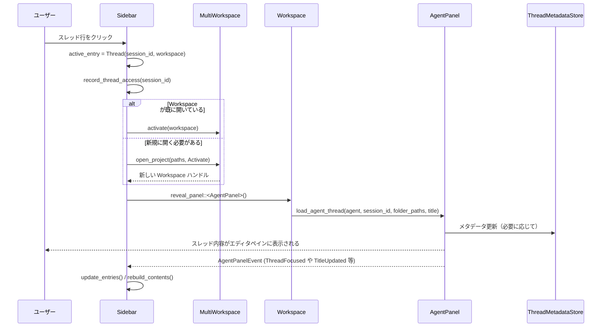

# sidebar/ ディレクトリ全体

## 0. ざっくり一言

`sidebar` クレートは、マルチワークスペース環境で **エージェントスレッド一覧／検索／アーカイブ／スレッド切り替え** を行うサイドバー UI と、その振る舞いを実装するモジュール群です。

---

## 1. このモジュールの役割

### 1.1 概要

- このクレートは、複数プロジェクト・複数ワークツリーを扱うエディタにおいて、
  - プロジェクトごとにエージェントスレッドを一覧表示し
  - キーボード操作・検索・アーカイブ・通知・スレッド切り替え
  を一手に引き受ける **「エージェントスレッド用サイドバー」** を提供します。
- スレッド状態は `ThreadMetadataStore`（永続メタデータ）と `AgentPanel`（ライブ状態）から再構成され、サイドバー自体は **毎回フルリビルド** される設計になっています。

### 1.2 アーキテクチャ内での位置づけ

- `Sidebar` は `MultiWorkspace` にぶら下がる「ワークスペース用サイドバー」であり、以下のコンポーネントと連携します。
  - `MultiWorkspace` / `Workspace`：プロジェクトグループ管理・アクティブワークスペース切り替え
  - `AgentPanel`：エージェントスレッド UI（実際の会話ビュー）
  - `ThreadMetadataStore`：スレッドの保存済みメタデータ（タイトル・パス・アーカイブ状態など）
  - `project::git_store`：Git リポジトリと linked worktree 情報
  - `ThreadsArchiveView`：アーカイブ済みスレッド一覧 UI
  - `ThreadSwitcher`（`thread_switcher.rs`）：MRU スレッド切り替えポップアップ

依存関係の概要は次の通りです（10 ノード以内に簡略化）:



### 1.3 設計上のポイント

- **完全リビルド指向**
  - コメントにもある通り、サイドバーのエントリ（スレッド一覧）は **毎回 `rebuild_contents` で完全再構成** されます。
  - 「インクリメンタルな状態」は極力持たず、現時点の世界状態（ワークスペース・メタデータ・ライブスレッド）から計算する方針です。

- **永続状態とライブ状態のマージ**
  - DB 由来の `ThreadMetadata` に対して、`AgentPanel` から取れるライブな `ActiveThreadInfo` を `ThreadEntry::apply_active_info` で上書きし、タイトル・ステータス・アイコン等を最新化します。

- **プロジェクトグループ単位の表示**
  - `MultiWorkspace::project_groups` が返す `ProjectGroupKey` ごとにヘッダ行 (`ProjectHeader`) を作り、その直下にスレッド・ドラフト・「New Thread」行などを並べます。
  - Git linked worktree を「チップ（`WorktreeInfo`）」としてスレッド行に表示することで、どのワークツリーに属するスレッドかが分かるようになっています。

- **検索時の振る舞い**
  - 検索クエリが空でない場合は、グループが折りたたまれていてもスレッドをロードし、  
    - ワークスペース名
    - スレッドタイトル
    - worktree 名  
    のいずれかに部分的にマッチするスレッドだけを表示します（`fuzzy_match_positions`）。

- **通知モデル**
  - 「バックグラウンドで走っていたスレッドが完了した」ときに通知フラグを立て、サイドバーに `(!)` を表示します。
  - 通知は、次にそのスレッドをアクティブにしたり、スレッドがバックグラウンドでなくなったときに消えます。

- **スレッドスイッチャ**
  - `thread_switcher` モジュールに分離されたポップアップ UI に MRU 順（最終アクセス時刻優先）でスレッドを並べ、キーボードで高速切り替えできるようにしています。
  - ただし、スレッドを **プレビュー** しただけの場合は `last_accessed` を更新せず、「ユーザーが確定した操作」をログに残す設計です。

- **View More によるページング**
  - 各グループはデフォルト 5 件 (`DEFAULT_THREADS_SHOWN`) だけ表示し、残りは `ViewMore` 行からバッチ単位に追加表示します。
  - ただし、**実行中／確認待ち／通知あり／アクティブなスレッド** はページ外でも「昇格」させて表示するので見落としにくくなっています。

- **Git worktree 吸収ロジック**
  - linked worktree※ が存在する場合でも、スレッドは「メインリポジトリのグループ」の下にまとめて表示されます（詳しくは後述の `worktree_info_from_thread_paths` とテスト群参照）。
  - ※`git::repository::Worktree` として `snapshot.linked_worktrees()` から得られるワークツリー。

---

## 2. 主要な機能一覧

- プロジェクトグループごとのスレッド一覧表示（`ProjectHeader` + `Thread` 行）
- スレッドの状態表示（Running, Completed, Error, WaitingForConfirmation）
- バックグラウンドスレッド完了時の通知表示
- プロジェクトグループの折りたたみ／展開 (`collapsed_groups`)
- `View More` によるスレッド一覧のページング (`expanded_groups`)
- 検索ボックスによるスレッド／ワークスペース／worktree 名のファジーマッチ検索
- アクティブドラフト表示 (`DraftThread`) と「New Thread」行 (`NewThread`)
- キーボードによる選択移動・決定・折りたたみ／展開（`SelectNext` / `SelectPrevious` など）
- スレッドの停止（生成中止）／アーカイブ (`stop_thread`, `archive_thread`)
- アーカイブビュー (`ThreadsArchiveView`) の表示／閉じる／unarchive→再アクティブ化
- MRU スレッドスイッチャ (`ThreadSwitcher`) の表示・プレビュー・確定
- プロジェクトの追加／削除・フォルダ追加などのコンテキストメニュー
- リモートプロジェクト（WSL／Docker 等）のアイコン表示
- サイドバー幅・折りたたみ状態・表示モードの永続化／復元（JSON 経由）
- ACP thread import 用オンボーディングとインポートモーダルの起動
- 開発用の `DumpWorkspaceInfo` アクションで、マルチワークスペース状態をテキストとしてダンプ

---

## 3. 関数・構造体の解説

### 3.1 型一覧（主要な型）

| 名前 | 種別 | 役割 / 用途 |
|------|------|-------------|
| `SerializedSidebarView` | enum | シリアライズ用のビュー種別（`ThreadList` / `Archive`） |
| `SerializedSidebar` | struct | サイドバーの永続状態（幅・折りたたみ・ページング・ビュー種別） |
| `SidebarView` | enum | 実行時のビュー状態（スレッドリスト or アーカイブビューの Entity） |
| `ActiveEntry` | enum | サイドバー上で「アクティブ」とみなされる項目（スレッド or ドラフト） |
| `ActiveThreadInfo` | struct | ライブスレッドから得た動的情報（タイトル・ステータス・diff など） |
| `ThreadEntryWorkspace` | enum | スレッドが属するワークスペース（開いている or パスだけ既知） |
| `WorktreeInfo` | struct | worktree の表示用情報（短い名前・フルパス・ハイライト位置） |
| `ThreadEntry` | struct | 1 行分のスレッド表示情報（メタデータ + ライブ情報 + UI 状態） |
| `ListEntry` | enum | サイドバーの 1 行を表現する総称型（ヘッダ／スレッド／ViewMore／Draft／NewThread） |
| `SidebarContents` | struct | 再構成済みのエントリ一覧＋通知フラグ等のキャッシュ |
| `Sidebar` | struct | サイドバー本体。`WorkspaceSidebar` と `Render` を実装 |
| `ThreadSwitcherEntry` | struct | スレッドスイッチャに渡す 1 件分の情報（`thread_switcher.rs` 定義） |
| `ThreadSwitcherEvent` | enum | スイッチャからサイドバーに送られるイベント（プレビュー／確定／閉じる） |
| `DumpWorkspaceInfo` | action 型 | 開発用アクション。`dump_workspace_info` のトリガー |

※ `ThreadSwitcherEntry`, `ThreadSwitcherEvent`, `ThreadSwitcher` の実装本体は `src/thread_switcher.rs` にあります。このチャンクには含まれていないため、詳細な実装は不明ですが、イベント名・フィールドから上記の用途が読み取れます。

---

### 3.2 主要な関数（詳細）

#### `Sidebar::new(multi_workspace: Entity<MultiWorkspace>, window: &mut Window, cx: &mut Context<Self>) -> Self`

**概要**

- `Sidebar` インスタンスを生成し、`MultiWorkspace` や各 `Workspace` / `AgentPanel` / `ThreadMetadataStore` 等への購読をセットアップします。
- フィルタ用の `Editor` やフォーカスハンドル、リスト状態など UI の初期化も行います。

**引数**

| 引数名 | 型 | 説明 |
|--------|----|------|
| `multi_workspace` | `Entity<MultiWorkspace>` | このサイドバーが属するマルチワークスペース |
| `window` | `&mut Window` | 作成対象のウィンドウ |
| `cx` | `&mut Context<Self>` | gpui のコンテキスト |

**戻り値**

- 初期化済みの `Sidebar` インスタンス。

**内部処理の流れ**

1. 自身用の `FocusHandle` を作成し、`focus_in` ハンドラを登録。
2. 1 行入力の `Editor` を生成し、「Search…」プレースホルダや Vim モード設定等を行う。
3. `MultiWorkspace` のイベントに購読:
   - `ActiveWorkspaceChanged`：ドラフトエディタの監視を更新し、`update_entries`。
   - `WorkspaceAdded`：新ワークスペースへの購読設定後、`update_entries`。
   - `WorkspaceRemoved`：`update_entries`。
4. フィルタエディタの `BufferEdited` に購読し、テキスト変更で `update_entries` & 選択位置調整。
5. グローバルな `ThreadMetadataStore` に対する observer 登録（メタデータ更新で `update_entries`）。
6. `AgentV2FeatureFlag` フラグの変化に対して `update_entries`。
7. 既存ワークスペース一覧を取得し、`subscribe_to_workspace` を遅延実行で設定。
8. デフォルト幅や各種フィールドを初期値で構築。

**Examples（使用例）**

テストコードと同様に、`MultiWorkspace` 作成後にサイドバーを生成・登録します。

```rust
// window ルートに MultiWorkspace を作成済みと仮定
let (multi_workspace, cx) =
    cx.add_window_view(|window, cx| MultiWorkspace::test_new(project.clone(), window, cx));

// Sidebar を作成して MultiWorkspace に登録する
let sidebar = {
    let mw = multi_workspace.clone();
    cx.update(|window, cx| cx.new(|cx| Sidebar::new(mw.clone(), window, cx)))
};

multi_workspace.update(cx, |mw, cx| {
    mw.register_sidebar(sidebar.clone(), cx);
});
```

**Edge cases（エッジケース）**

- `MultiWorkspace::multi_workspace_enabled(cx)` が `false` の場合、`update_entries` は何も行わないため、サイドバーは事実上無効になります（通常はテスト・フラグ設定に依存）。
- `MultiWorkspace` がすでに破棄されている場合は `upgrade()` が `None` になり、その後の更新はスキップされます。

**使用上の注意点**

- 初期化前に `ThreadStore::init_global`, `ThreadMetadataStore::init_global` など関連グローバルをセットする必要があります（テストでは `init_test` で行っています）。
- `Sidebar::new` 自体は `update_entries` を直接は呼びませんが、`defer_in` で後続処理中に呼ばれるため、呼び出し直後には `contents` が空なタイミングがあります。

---

#### `Sidebar::rebuild_contents(&mut self, cx: &App)`

**概要**

- 現在の `MultiWorkspace` 状態・スレッドメタデータ・ライブスレッド情報から、サイドバーの `SidebarContents.entries` を **完全に再構成** します。
- 通知フラグや MRU 用タイムスタンプの整合もここで保ちます。

**引数**

| 引数名 | 型 | 説明 |
|--------|----|------|
| `cx` | `&App` | 読み取り専用のグローバルコンテキスト |

**戻り値**

- なし。`self.contents` と通知関連マップを更新します。

**内部処理の流れ (簡略)**

1. `MultiWorkspace` を `upgrade` し、全ワークスペースとアクティブワークスペースを取得。
2. アクティブワークスペースの `AgentPanel` から現在のアクティブスレッド or ドラフトを読み取り、`self.active_entry` を更新。
3. 直前の `SidebarContents` を退避し、ライブ状態だったスレッドのステータスを `old_statuses` としてマップ化。
4. `MultiWorkspace::project_groups(cx)` でプロジェクトグループごとにループ:
   - グループの `ProjectGroupKey` から `PathList` と表示名を取得。
   - 折りたたみ状態・アクティブグループか・スレッド読み込みが必要かを判定。
   - `AgentPanel` 経由で `ActiveThreadInfo` を収集し、`has_running_threads / waiting_thread_count` を算出。
   - 必要に応じて `ThreadMetadataStore` からメタデータをクエリ:
     - `entries_for_main_worktree_path(&path_list)`（新形式）
     - `entries_for_path(&path_list)`（レガシー）
     - `linked_worktrees` 用のパス一覧からのレガシークエリ
   - `ThreadEntryWorkspace` を決定（開いているワークスペース or 閉じたパス）。
   - `ThreadEntry` を作り、ライブ情報があれば `apply_active_info` で上書き。
   - `Running → Completed` への遷移を検知してバックグラウンドスレッドなら通知を追加。
   - スレッドを「最終送信時刻 or 作成／更新時刻」でソート。
5. 検索クエリありの場合:
   - ワークスペース名・スレッドタイトル・worktree 名に対して `fuzzy_match_positions` し、マッチするスレッドだけを残す。
   - マッチしたグループのみヘッダ + スレッドを追加。`Draft/NewThread/ViewMore` は出さない。
6. 検索クエリなしの場合:
   - グループヘッダを追加。
   - 折りたたまれていなければ、ドラフト行／New Thread 行の挿入条件を判定した上でスレッド一覧を追加。
   - ページングロジックにより `DEFAULT_THREADS_SHOWN` + 昇格スレッド + `ViewMore` を挿入。
7. すべてのグループを処理後、`notified_threads` および MRU 用マップから、存在しないセッション ID を削除。
8. `self.contents` を新しい値に差し替え。

**Edge cases**

- プロジェクトグループの `PathList` が空（ワークスペースにルートパスがない）場合は、そのグループはスキップされます。
- 検索クエリがある場合は、折りたたまれたグループでもスレッドをロードし、マッチしないグループは丸ごと非表示になります。
- linked worktree スレッドは、メインリポジトリのグループのヘッダの下に統合されるようにクエリされています（テスト `test_linked_worktree_threads_not_duplicated_across_groups` など）。

**使用上の注意点**

- `rebuild_contents` は `update_entries` からのみ呼ばれており、スクロール位置や通知状態の調整とセットで使われます。外部から直接呼ぶ必要は通常ありません。
- 計算量は「プロジェクトグループ数 × スレッド数 + ソート O(T log T)」程度で、設計コメントにも「余計な二度引きを避ける」方針が書かれています。

---

#### `impl Render for Sidebar::render(&mut self, window: &mut Window, cx: &mut Context<Self>) -> impl IntoElement`

**概要**

- サイドバー全体の UI を構築し返す `Render` 実装です。
- ヘッダ（検索バー）／リストビュー／アーカイブビュー／下部ボトムバー／ACP インポートオンボーディングなどを組み立てます。

**主要な処理の流れ**

1. テーマとフォント（`theme_settings::setup_ui_font`）をセット。
2. Sticky ヘッダ（スクロールに応じて固定されるプロジェクトヘッダ）の描画要否を `render_sticky_header` で判定。
3. `v_flex()` に対して:
   - `id("workspace-sidebar")`
   - `key_context(self.dispatch_context(...))` でキーコンテキストを設定（`ThreadsSidebar` / `menu` / `searching` / `not_searching`）。
   - 各種 `on_action` でキーイベントをハンドル（選択移動、Fold、Cancel、archive、新規スレッドなど）。
   - 背景色・幅・左右ボーダーを設定。
4. `self.view` に応じて:
   - `SidebarView::ThreadList` の場合:
     - `render_sidebar_header` で検索ボックス付きヘッダを表示（プロジェクトが全くない場合は「Open Project / Clone Repository」の empty state）。
     - プロジェクトがある場合は、`list(self.list_state.clone(), cx.processor(Self::render_list_entry))` でエントリリストを構築し、検索結果がゼロなら `render_no_results` を重ねる。
     - 必要に応じて `sticky_header` をオーバーレイ表示。
   - `SidebarView::Archive(archive_view)` の場合:
     - `archive_view` の `AnyView` をそのまま child として描画。
5. ACP インポートオンボーディングが必要なら `render_acp_import_onboarding` を追加。
6. 最後に `render_sidebar_bottom_bar`（サイドバー開閉ボタン・アーカイブ切り替えボタン・最近のプロジェクトボタン）を描画。

**Errors / Panics**

- 明示的な `panic!` 呼び出しはありませんが、`downcast::<AgentPanel>()` などが `Err` を返す可能性があります（その場合は `if let Ok(...)` で安全にスキップされています）。

**使用上の注意点**

- レンダリングは gpui により差分更新されるため、状態更新後には `cx.notify()` を呼んで再描画を促しています（`update_entries`, `toggle_collapse` など）。

---

#### `Sidebar::activate_thread(&mut self, metadata: ThreadMetadata, workspace: &Entity<Workspace>, window: &mut Window, cx: &mut Context<Self>)`

**概要**

- 指定されたスレッド（メタデータ）を指定ワークスペースでアクティブにし、`AgentPanel` にロードします。
- 同一ウィンドウ内か別ウィンドウ内かで処理を分岐します。

**引数**

| 引数名 | 型 | 説明 |
|--------|----|------|
| `metadata` | `ThreadMetadata` | アクティブ化したいスレッドのメタデータ |
| `workspace` | `&Entity<Workspace>` | このスレッドに紐づくワークスペース |
| `window` | `&mut Window` | 現在のウィンドウ |
| `cx` | `&mut Context<Self>` | サイドバーのコンテキスト |

**戻り値**

- なし。

**内部処理の流れ**

1. `find_workspace_in_current_window` で、現在のウィンドウに同じ `workspace` が存在するか確認。
   - 存在するなら `activate_thread_locally` を呼ぶ。
2. 現在のウィンドウに存在しない場合は `find_workspace_across_windows` で全ウィンドウを走査し、該当ワークスペースを持つ `MultiWorkspace` ウィンドウを探す。
   - 見つかれば `activate_thread_in_other_window` を呼ぶ。
3. `activate_thread_locally` の内部では:
   - `active_entry` を即座に `ActiveEntry::Thread` に更新（UI ハイライトをすぐ反映）。
   - `record_thread_access` で MRU 情報を更新。
   - `MultiWorkspace::activate` で対象ワークスペースをアクティブにする。
   - `load_agent_thread_in_workspace` を通じて `AgentPanel` にスレッドをロード。
   - `update_entries` でサイドバーを再構成。

**Examples（使用例）**

```rust
// ある ThreadMetadata を sidebar から明示的にアクティブにする例
sidebar.update_in(cx, |sidebar, window, cx| {
    // ここでは適当な metadata と workspace を取得していると仮定
    let metadata: ThreadMetadata = /* ... */;
    let workspace: Entity<Workspace> = /* ... */;
    sidebar.activate_thread(metadata, &workspace, window, cx);
});
```

**Edge cases**

- 対応する `Workspace` がどのウィンドウにも存在しない場合、この関数は何もせずに終了します（新規ワークスペースの作成は `open_workspace_and_activate_thread` の役割）。
- 別ウィンドウでアクティブにした場合、**そのウィンドウ側のサイドバー** の `active_entry` と MRU が更新され、元ウィンドウ側はアクティブスレッドを主張しないようになっています（テスト `test_activate_archived_thread_reuses_workspace_in_another_window...` 参照）。

**使用上の注意点**

- メタデータに含まれる `folder_paths` は、`AgentPanel::load_agent_thread` に渡され、後続でメタデータ再保存時のパスにも影響します。誤った `PathList` を渡すとスレッドが別プロジェクトに紐付いてしまうので注意が必要です。

---

#### `Sidebar::archive_thread(&mut self, session_id: &acp::SessionId, window: &mut Window, cx: &mut Context<Self>)`

**概要**

- 指定スレッドをアーカイブし、サイドバーから非表示にします。
- もしそのスレッドが現在アクティブだった場合、同じプロジェクトグループ内の最も近い別スレッドにフォーカスを移すか、新規ドラフトスレッドを開きます。

**引数**

| 引数名 | 型 | 説明 |
|--------|----|------|
| `session_id` | `&acp::SessionId` | アーカイブ対象スレッドのセッション ID |
| `window` | `&mut Window` | ウィンドウ |
| `cx` | `&mut Context<Self>` | コンテキスト |

**内部処理の流れ**

1. `ThreadMetadataStore::archive(session_id)` を呼び、メタデータの `archived` フラグを立てる。
2. `active_entry` がこの `session_id` を指しているか確認。
3. サイドバーの `contents.entries` で該当スレッドの位置 `current_pos` を探す。
4. 当該スレッドより上にある直近の `ProjectHeader` を探し、そのヘッダの `key.path_list()` から `workspace_for_group` を呼んで「グループの代表 Workspace」を得る（`group_workspace`）。
5. 同じグループ内で「直前のスレッド」→「直後のスレッド」の順で次の候補を探し、見つかれば:
   - そのスレッドの `ThreadEntryWorkspace` を見て、`Open(ws)` ならその `ws`、`Closed(_)` なら `group_workspace` を使って `AgentPanel` にロード。
   - `active_entry` と `record_thread_access` を更新。
6. グループ内に他のスレッドがなければ:
   - `group_workspace` が存在する場合、`active_entry` を `Draft` にして `AgentPanel::new_thread` を呼び、新規スレッドを開く。
7. アクティブでないスレッドをアーカイブする場合は `active_entry` は変えず、単にメタデータと表示から取り除かれます。

**Edge cases**

- 実行中／確認待ちスレッドは `remove_selected_thread` 側で弾かれ、`archive_thread` は呼ばれません（テスト `test_archive_thread_keeps_metadata_but_hides_from_sidebar` など）。
- 連結 worktree スレッドの次候補がメインワークスペースではなく worktree ワークスペースに属していた場合、必ず `ThreadEntryWorkspace::Open` 側のワークスペースを優先してロードするように修正されています（回帰テスト `test_archive_thread_uses_next_threads_own_workspace`）。

**使用上の注意点**

- アーカイブされたスレッドは `ThreadMetadataStore` に残りますが、通常のサイドバー一覧からは除外されます（`test_archived_threads_excluded_from_sidebar_entries`）。
- アーカイブされたスレッドを表示・復元したい場合は、`ThreadsArchiveView` 経由で操作する想定です。

---

#### `Sidebar::toggle_thread_switcher_impl(&mut self, select_last: bool, window: &mut Window, cx: &mut Context<Self>)`

**概要**

- MRU スレッドスイッチャの表示／選択循環／閉じるを司る内部関数です。
- 既にスイッチャが開いていれば単に選択を進め、開いていなければ MRU リストを生成してポップアップを開きます。

**引数**

| 引数名 | 型 | 説明 |
|--------|----|------|
| `select_last` | `bool` | `true` なら「最後の項目を選ぶ」（Shift+Ctrl-Tab 的な挙動） |
| `window` | `&mut Window` | ウィンドウ |
| `cx` | `&mut Context<Self>` | コンテキスト |

**戻り値**

- なし。

**内部処理の流れ**

1. 既に `self.thread_switcher` が存在する場合:
   - `select_last` が `true` なら `ThreadSwitcher::select_last` を、そうでなければ `cycle_selection` を呼んで終了。
2. 存在しない場合:
   - `mru_threads_for_switcher` でエントリを生成。2 件未満なら何もしない。
   - 現在の `active_entry` が `Thread` の場合、その `metadata` と `workspace` を `original_*` として保存。
   - `ThreadSwitcher::new(entries, select_last, window, cx)` でスイッチャの `Entity<ThreadSwitcher>` を作成。
   - `ThreadSwitcherEvent` と `gpui::DismissEvent` に対して購読を設定:
     - `Preview { metadata, workspace }`:
       - 対象ワークスペースをアクティブにし、`active_entry` を更新し、スレッドをフォーカス **せず** に（`focus=false`）ロード。
       - スイッチャ自身にフォーカスを当てる。
     - `Confirmed { metadata, workspace }`:
       - ワークスペースをアクティブにし、`record_thread_access` と `active_entry` を更新。
       - スレッドをロードした後、スイッチャを閉じ、`AgentPanel` にフォーカス。
     - `Dismissed`:
       - ウィンドウとワークスペースを `original_workspace` に戻し、`original_metadata` があればそのスレッドを再プレビュー。
       - スイッチャを閉じる。
   - `MultiWorkspace::set_sidebar_overlay(Some(overlay_view))` でオーバーレイとして表示。
   - スイッチャ構築直後に emit された初期プレビューを再現して、最初の選択状態を UI に反映。
   - 最後にスイッチャの `focus_handle` にフォーカスを移す。

**Edge cases**

- MRU リストが 2 件未満の場合（スレッドが 0〜1 件）のときはスイッチャを表示しません（テスト `test_thread_switcher_ordering` では複数スレッド前提）。
- スイッチャを閉じたとき、**元のサイドバー側の `active_entry` は「確定操作が行われたかどうか」で更新有無が変わります**。プレビューだけでは MRU 順は変わりません。

**使用上の注意点**

- 外部から直接呼ぶのではなく、`WorkspaceSidebar::toggle_thread_switcher` 経由で、`ToggleThreadSwitcher` アクションにマップして使われます。
- MRU 並び順の仕様はテスト `test_thread_switcher_ordering` に詳しく書かれている通り、以下の優先度でソートされます:
  1. `thread_last_accessed`（確定操作でのみ更新）
  2. `thread_last_message_sent_or_queued`（送信／キュー時）
  3. `created_at` / `updated_at`（メタデータ由来）

---

#### `Sidebar::activate_archived_thread(&mut self, metadata: ThreadMetadata, window: &mut Window, cx: &mut Context<Self>)`

**概要**

- アーカイブビューから「Unarchive」されたスレッドを、適切なワークスペースで開きます。
- 既存ワークスペース or 別ウィンドウのワークスペースを優先し、なければ新しいワークスペースを開きます。

**主なアルゴリズム**

1. `ThreadMetadataStore::unarchive(&metadata.session_id)` を呼んでアーカイブフラグを消す。
2. `metadata.folder_paths.paths()` が非空なら:
   - まず **現在のウィンドウ** で `folder_paths` と一致するワークスペースを `find_current_workspace_for_path_list` で探し、見つかれば `activate_thread_locally`。
   - そうでなければ、**全ウィンドウ** を `find_open_workspace_for_path_list` で走査して一致するワークスペースを探し、見つかれば `activate_thread_in_other_window`。
   - どちらにも存在しなければ `open_workspace_and_activate_thread` で新しいワークスペースを開き、そこにスレッドをロード。
3. `folder_paths` が空の場合:
   - `MultiWorkspace` のアクティブワークスペースを取得し、そこにスレッドをロード（なければ何もせず）。

**テストで確認されている振る舞いの一例**

- `test_activate_archived_thread_with_saved_paths_activates_matching_workspace`  
  → `folder_paths` のパスに一致するワークスペースが同じウィンドウ内にあれば、そのワークスペースをアクティブにする。
- `test_activate_archived_thread_saved_paths_opens_new_workspace`  
  → 一致するワークスペースがどこにも無ければ、新しいワークスペースを開いてそこにロード。
- `test_activate_archived_thread_reuses_workspace_in_another_window`  
  → 他ウィンドウに既に該当ワークスペースがある場合はそちらのウィンドウをアクティブにし、そのウィンドウ側のサイドバーで `active_entry` を更新。

**使用上の注意点**

- この関数は主に `ThreadsArchiveViewEvent::Unarchive` のハンドラから呼ばれます。  
  アーカイブビュー側で `ThreadMetadata` 一式を持っている前提です。
- `folder_paths` が空のメタデータを渡すと、アクティブワークスペースにロードされるため、「どのプロジェクトに属するべきか」の情報が失われているケースでは注意が必要です。

---

#### `dump_workspace_info(workspace: &mut Workspace, _: &DumpWorkspaceInfo, window: &mut Window, cx: &mut Context<Workspace>)`

**概要**

- 開発者向けアクション。マルチワークスペース全体の状態（プロジェクトグループ・ワークツリー・アクティブスレッドなど）をテキストにまとめ、新しい読み取り専用エディタバッファとして表示します。

**引数**

| 引数名 | 型 | 説明 |
|--------|----|------|
| `workspace` | `&mut Workspace` | アクションを受け取ったワークスペース |
| `_` | `&DumpWorkspaceInfo` | アクション引数（未使用） |
| `window` | `&mut Window` | ウィンドウ |
| `cx` | `&mut Context<Workspace>` | ワークスペース用コンテキスト |

**戻り値**

- なし。副作用として新しいエディタタブを開きます。

**内部処理の流れ**

1. `workspace.multi_workspace()` から `MultiWorkspace` を取得し、全ワークスペースリストとアクティブインデックスを取得。
2. `MultiWorkspace` があれば、その `project_group_keys` を列挙して出力。
3. 各ワークスペースごとに `dump_single_workspace` を呼び、以下を出力:
   - Workspace DB ID
   - プロジェクトのワークツリー一覧（パス、branch、linked worktree かどうか）
   - `AgentPanel` があれば:
     - パネルのワークスペース ID と Workspace DB ID の不一致警告（あれば）
     - アクティブスレッドのタイトル、セッション ID、ステータス
     - バックグラウンドスレッド一覧
4. プロジェクトの `create_buffer` で新しいバッファを作成し、出力テキストをセット。
5. 読み取り専用の `Editor` に包んで、アクティブペインに新規タブとして追加。

**使用上の注意点**

- あくまで開発／デバッグ用のユーティリティであり、ユーザー向け機能ではありません。
- 実行には `gpui` の非同期タスクを利用しているため、呼び出し後すぐにはタブが開かない一瞬のラグがあり得ます。

---

### 3.3 その他の関数（代表例）

| 関数名 | 役割（1 行） |
|--------|--------------|
| `fuzzy_match_positions(query, candidate)` | クエリ文字列が候補文字列にサブシーケンスとして含まれるかを判定し、マッチ開始位置リストを返す（ケースインセンシティブ）。 |
| `workspace_path_list(workspace, cx)` | ワークスペースのルートパス一覧から `PathList` を構築。 |
| `worktree_info_from_thread_paths(folder_paths, group_key)` | スレッドの `folder_paths` とプロジェクトグループのメインパスを比較し、linked worktree の表示情報を生成。 |
| `all_thread_infos_for_workspace(workspace, cx)` | 指定ワークスペースの `AgentPanel` から親スレッドのライブ情報 (`ActiveThreadInfo`) を列挙。 |
| `Sidebar::render_thread` | 1 スレッド行の見た目とクリック／ホバー／アクションボタン（停止・アーカイブ）を組み立てる。 |
| `Sidebar::render_project_header` | プロジェクトヘッダ行（折りたたみトグル、New Thread ボタン、コンテキストメニューなど）を描画。 |
| `Sidebar::show_archive` / `show_thread_list` | アーカイブビューとスレッドビューの切り替えと、それに伴う購読のセットアップ／解放。 |
| `Sidebar::clean_mention_links` | `[@foo.rs](file://...)` のようなメンションリンクからリンク部分だけを取り除き、`@foo.rs` のみ残す。 |

---

## 4. データフロー

ここでは代表的なシナリオとして **「サイドバーからスレッドをクリックして開く」** ときのデータフローを示します。

### シナリオ: サイドバーからスレッドを開く

1. ユーザーがサイドバーの `Thread` 行をクリック。
2. 該当 `ThreadEntry` から `ThreadMetadata` と `ThreadEntryWorkspace` が取得される。
3. `ThreadEntryWorkspace` が `Open(ws)` なら、その `Workspace` を使って `Sidebar::activate_thread` を呼ぶ。`Closed(path_list)` なら `open_workspace_and_activate_thread` で新規ワークスペースを開く。
4. `activate_thread` 内で:
   - `active_entry` を `ActiveEntry::Thread` に更新。
   - `record_thread_access` で MRU 更新。
   - `MultiWorkspace::activate` でワークスペースをアクティブ化。
   - `load_agent_thread_in_workspace` で `AgentPanel` に会話スレッドをロード。
5. `AgentPanel` 側でスレッドがロードされると、タイトル変更やステータス更新などに応じて `AgentPanelEvent` が発火し、サイドバーが `update_entries` を通じて UI を再構成します。

Mermaid のシーケンス図で表すと次の通りです。



ポイント:

- 「どのワークスペースで開くか」は、メタデータの `folder_paths` と既存 `Workspace` の `PathList` を比較して決まります。
- ライブ状態（Running／Completed 等）は、`AgentPanel` 側からの情報を再度吸い上げてサイドバー表示を更新します。

---

## 5. 使い方（How to Use）

### 5.1 基本的な使用方法

最小構成として、`MultiWorkspace` をウィンドウルートに持ち、そのサイドバーとして `Sidebar` を登録して使います。テストコードに近い例:

```rust
use gpui::{App, Window};
use workspace::MultiWorkspace;
use sidebar::Sidebar;
use project::Project;

fn setup_window(app: &mut App) {
    app.add_window(|window, cx| {
        // プロジェクトを用意する（テスト用 API。実環境ではユーザが開いたプロジェクトを使う）
        let fs = /* fs 実装 */;
        let project = cx.blocking(async {
            Project::test(fs, ["/my-project".as_ref()], cx).await
        });

        // MultiWorkspace をルートビューとして作成
        let (multi_workspace, cx) =
            cx.add_window_view(|window, cx| MultiWorkspace::test_new(project.clone(), window, cx));

        // Sidebar を作成して MultiWorkspace に登録
        let sidebar = {
            let mw = multi_workspace.clone();
            cx.update(|window, cx| cx.new(|cx| Sidebar::new(mw.clone(), window, cx)))
        };
        multi_workspace.update(&cx, |mw, cx| {
            mw.register_sidebar(sidebar.clone(), cx);
        });

        // 以降は gpui が描画とイベントを管理する
        Ok(())
    });
}
```

ユーザー側から見ると:

- サイドバーは自動的に MultiWorkspace からワークスペース・スレッドメタデータを購読し、一覧を構築します。
- スレッドをダブルクリック／Enter で開く、`Cmd-Shift-A` のようなショートカットでアーカイブビューを開く、といった操作は `gpui::actions!` によるアクションとキーバインドにより実現されます。

---

### 5.2 よくある使用パターン

#### 5.2.1 スレッド一覧と検索

- ユーザーはサイドバー上部の検索ボックスにキーワードを入力します。
- 入力がある間は、各プロジェクトヘッダとスレッドタイトル・worktree 名に対して `fuzzy_match_positions` が適用され、マッチするスレッドだけが表示されます。
- テスト `test_search_narrows_visible_threads_to_matches` などにある通り:
  - ヘッダ＋マッチするスレッドのみ表示
  - マッチが無い場合はリストが空になり、UI 上は「No threads match your search.」が表示される構造です。

ショートコード例（テストから簡略）:

```rust
// 検索クエリを直接セットするヘルパ
sidebar.update_in(cx, |sidebar, window, cx| {
    // 検索エディタにフォーカス
    window.focus(&sidebar.filter_editor.focus_handle(cx), cx);
    // テキストを設定するとサブスクリプション経由で update_entries が呼ばれる
    sidebar.filter_editor.update(cx, |editor, cx| {
        editor.set_text("diff", window, cx);
    });
});
```

#### 5.2.2 アーカイブビューと Unarchive

- 下部のアーカイブボタン or `ToggleArchive` アクションで、通常のスレッドリストとアーカイブビューをトグルします。
- アーカイブビュー (`ThreadsArchiveView`) 上でスレッドを選び `Unarchive` すると、`ThreadsArchiveViewEvent::Unarchive` を通じて `Sidebar::activate_archived_thread` が呼ばれます。

```rust
// アクション経由でアーカイブ表示に切り替える例
sidebar.update_in(cx, |sidebar, window, cx| {
    sidebar.toggle_archive(&ToggleArchive, window, cx);
});
```

#### 5.2.3 スレッドスイッチャによる高速切り替え

- `ToggleThreadSwitcher` アクションにキーバインドを割り当てることで、最近アクセスしたスレッドを MRU 順にポップアップで選択できます。
- 一般的には `Ctrl+Tab` / `Ctrl+Shift+Tab` のように `select_last` フラグの有無で挙動を分けます。

```rust
// 例: Ctrl+Tab でスレッドスイッチャを開く/次に進める
sidebar.update_in(cx, |sidebar, window, cx| {
    let action = ToggleThreadSwitcher { select_last: false };
    sidebar.on_toggle_thread_switcher(&action, window, cx);
});
```

---

### 5.3 使用上の注意点（まとめ）

- **状態の信頼元**
  - サイドバーは `ThreadMetadataStore` と `AgentPanel` からの情報をもとに毎回リストを再構成します。  
    スレッドの永続状態を信頼したい場合は `ThreadMetadataStore` を直接参照するのが適切です。
- **アーカイブの意味**
  - アーカイブ済みスレッドはサイドバーの通常ビューには一切出ませんが、メタデータは残ります。  
    同じセッション ID のスレッドを再度ロードするときは `unarchive` を通す必要があります。
- **PathList と worktree の前提**
  - スレッドに紐づく `folder_paths` と `main_worktree_paths` は、Git の worktree 構成と整合している必要があります。  
    テスト群では多くのパターン（メイン＋ワークツリー、複数リポジトリ、マルチルートなど）が検証されています。
- **複数ウィンドウ環境**
  - `activate_thread` / `activate_archived_thread` は、現在のウィンドウだけでなく他のウィンドウも探索します。  
    「どのウィンドウで開くか」のロジックを変更したい場合は `find_workspace_in_current_window` / `find_workspace_across_windows` の利用箇所を確認する必要があります。
- **テストとの整合**
  - `sidebar_tests.rs` は非常に多くのシナリオ（キーボードナビゲーション、検索、worktree 吸収、アーカイブ、複数ウィンドウなど）を網羅しており、振る舞い仕様の準拠性を確認する上で有用です。  
    仕様変更時は、既存テストがどの振る舞いを前提にしているかを先に確認するのが安全です。

---

## 7. 関連ファイル

| パス | 役割 / 関係 |
|------|------------|
| `sidebar/Cargo.toml` | クレート名・依存関係・feature 定義。`gpui`, `workspace`, `agent_ui`, `project`, `git` 等の UI / プロジェクト・エージェント関連クレートに依存します。 |
| `sidebar/src/sidebar.rs` | サイドバー本体の実装。リスト構築、レンダリング、キーボード操作、アーカイブビュー切り替え、スレッドスイッチャ連携、`DumpWorkspaceInfo` など多くのロジックが集約されています。 |
| `sidebar/src/thread_switcher.rs` | MRU スレッドスイッチャ UI の実装。`ThreadSwitcher`, `ThreadSwitcherEntry`, `ThreadSwitcherEvent` を定義し、サイドバーからオーバーレイとして利用されます（このチャンクには実装本体は含まれていません）。 |
| `sidebar/src/sidebar_tests.rs` | `gpui::test` を用いた包括的なテスト群。サイドバーの表示・検索・キーボード操作・worktree 吸収・複数ウィンドウでのスレッドアクティベーションなど、ほぼすべての振る舞いをカバーしています。 |

このディレクトリのコードを読む際は、まず `sidebar.rs` で全体像を掴み、具体的な UI 挙動や仕様は `sidebar_tests.rs` の各テストケースを「仕様書」として参照すると理解しやすくなります。`thread_switcher.rs` は MRU 切り替え周りに関心がある場合に併読するとよい位置付けです。
