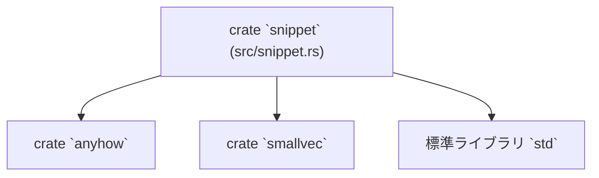

# snippet ディレクトリ解説

## 1. ざっくり一言

`snippet` クレートは、LSP / VSCode 互換のスニペット文字列（`$1`, `${1:foo}`, `${1|a,b|}` など）をパースして、  
展開後のプレーンテキストと「タブストップ（カーソルが移動する位置）」の情報に変換するためのモジュールです。

---

## 2. このモジュールの役割

### 2.1 概要

- このディレクトリは **スニペット文字列を解釈するパーサ** を提供します。
- スニペット内の
  - タブストップ（`$1`, `$2`, `$0` など）
  - プレースホルダ（`${1:default}`）
  - 選択式プレースホルダ（`${1|i32, u32|}`）
  - エスケープ（`\$`, `\\`, `\}` など）
  を解析します。
- 解析結果は `Snippet` 構造体として返され、編集機能などから「次のタブストップへ移動する」動作に利用できる形になります。

### 2.2 アーキテクチャ内での位置づけ

このクレートは単一ファイルのライブラリで、外部からは主に `Snippet::parse` が呼び出される想定です。  
外部依存はエラーハンドリング用の `anyhow` と、小さなベクタ最適化のための `smallvec` のみです。



このチャンクには `snippet` クレートをどこから呼び出しているかは含まれていないため、  
上位の呼び出し元（エディタ本体など）はコードからは分かりません。

### 2.3 設計上のポイント

- **純粋な文字列パーサ**
  - I/O やグローバル状態を持たず、入力文字列から `Snippet` を構築するだけの純粋な関数群です。
- **タブストップの順序管理**
  - 一旦 `BTreeMap<usize, TabStop>` に集約することで、タブストップ番号の昇順（1, 2, 3, …, 0）に並ぶようにしています。
  - LSP 仕様上の「最終タブストップ（`$0`）」を特別扱いし、最後に移動する位置として末尾に配置します。
- **自動的な「末尾タブストップ」の追加**
  - `$0` が明示されていない場合も、常にテキスト末尾にタブストップを 1 つ追加します（ただし、すでに末尾にタブストップがある場合は追加しません）。
- **インデックスはバイトオフセット**
  - `Range<isize>` の開始・終了位置は `String::len()` の結果（UTF-8 バイト長）に基づきます。
  - そのため、マルチバイト文字を含む場合、文字数ではなく「バイト単位の範囲」として扱われます。
- **SmallVec による軽量な複数レンジ管理**
  - 1 つのタブストップ番号が複数箇所に現れるケース（例: ループ変数 `i` が何度も出てくる）に対応するため、`TabStop.ranges` は `SmallVec<[Range<isize>; 2]>` で表現されています。

---

## 3. 主要な機能一覧

このモジュールが提供する主な機能は次のとおりです。

- スニペット文字列のパースと `Snippet` 構造体への変換（`Snippet::parse`）
- タブストップ（`$1`, `$2`, `$0`）およびプレースホルダ（`${1:default}`）の解析
- 選択式プレースホルダ（`${1|i32, u32|}`）の
  - デフォルト選択肢のテキストへの展開
  - 全候補リストの保持
- エスケープシーケンス（`\$`, `\\`, `\}`）の処理
- ネストしたプレースホルダ（`${1:var ${2:i} = 0; ...}`）の解析と位置計算

---

## 4. 関数・構造体の解説

### 4.1 型一覧（構造体など）

| 名前      | 種別     | 役割 / 用途 |
|-----------|----------|------------|
| `Snippet` | 構造体   | 展開後テキストとタブストップ一覧を保持するメインの結果型です。 |
| `TabStop` | 構造体   | 1 つのタブストップ番号に対応するレンジ群と、選択肢リスト（あれば）を保持します。 |

補足:

- `TabStop.ranges: SmallVec<[Range<isize>; 2]>`
  - 同じ番号のタブストップが複数回出現したとき、それぞれの位置を範囲として保持します。
- `TabStop.choices: Option<Vec<String>>`
  - `${1|a,b|}` のような選択式プレースホルダに対して、その全候補を `Some(vec![...])` として保持します。
  - 通常のタブストップや `${1:default}` のような単一プレースホルダでは `None` になります。

### 4.2 重要な関数の詳細

#### `Snippet::parse(source: &str) -> Result<Snippet>`

**概要**

- LSP / VSCode スタイルのスニペット文字列 `source` を解析し、  
  展開後のテキストとタブストップ情報を持つ `Snippet` を返します。

**引数**

| 引数名  | 型        | 説明 |
|--------|-----------|------|
| `source` | `&str`  | 解析対象のスニペット文字列です。 |

**戻り値**

- `Result<Snippet>`  
  - `Ok(Snippet)` : 正しくパースできた場合の結果です。  
  - `Err(anyhow::Error)` : 構文不正などによりパースに失敗した場合です。

**内部処理の流れ**

1. `text`（展開後テキスト）を `source.len()` に合わせた容量で初期化します。
2. タブストップを格納する `BTreeMap<usize, TabStop>` を用意します。
3. 内部関数 `parse_snippet(source, false, &mut text, &mut tabstops)` を呼び出して、全文を解析します。
4. 解析後、`text.len()` を末尾位置として記録します。
5. タブストップ番号 `0`（最終タブストップ）が存在すれば取り出して別扱いにします。
6. 残りのタブストップ（1,2,3,...）を `Vec<TabStop>` に変換します（BTreeMap により番号順）。
7. タブストップ 0 があれば最後に追加し、なければ
   - `text` の末尾位置にレンジ `len..len` を持つタブストップを自動的に生成し、
   - すでに同じ位置のタブストップが末尾に存在しない場合だけ追加します。
8. `Snippet { text, tabstops }` を `Ok` で返します。

**Examples（使用例）**

シンプルなプレースホルダと選択式プレースホルダを含む例です。

```rust
use anyhow::Result;               // エラー処理に anyhow を使用
use snippet::Snippet;             // このクレートの Snippet 型をインポート

fn main() -> Result<()> {
    // VSCode 互換のスニペット文字列
    let src = "println!(${1:hello}, ${2|world,world!|});";

    // スニペットをパースして構造化情報を得る
    let snippet = Snippet::parse(src)?;

    // 展開後のプレーンテキスト（デフォルト値・デフォルト選択肢が展開される）
    assert_eq!(snippet.text, "println!(hello, world);");

    // タブストップの位置情報（バイトオフセットの Range<isize>）
    for (idx, ts) in snippet.tabstops.iter().enumerate() {
        println!("tabstop {} ranges = {:?}", idx, ts.ranges);
    }

    Ok(())
}
```

**Errors / Panics**

- `Err` になる主な条件
  - タブストップ番号が整数として読めない場合（`${a:foo}` など）
  - タブストップ番号の整数が `usize` としてパース不能なほど大きい場合
  - `${1:...}` に対応する `}` が見つからない場合
  - `${1|...}` で閉じる `|` が見つからないなど、選択式プレースホルダが不完全な場合
- パニック
  - この関数自体には `panic!` や `unwrap()` は含まれておらず、正常な UTF-8 文字列であれば想定外パニックは起こらない構造です。

**Edge cases（エッジケース）**

- タブストップを一切含まない入力（例: `"one-two-three"`）
  - テキストはそのまま `"one-two-three"` となり、
  - `tabstops` には末尾位置 `13..13` のタブストップが 1 つだけ入ります。
- 末尾にタブストップが存在する場合（例: `"foo.$1"`）
  - `$0` がなくても `$1` がテキスト末尾なら、それを末尾タブストップとみなし、新規の末尾タブストップは追加されません。
- 明示的な最終タブストップ `$0` がある場合
  - `$0` の位置に対応する `TabStop` が最後に配置され、それ以外の末尾用タブストップは追加されません。
- 無効な構文
  - 上記のような不正スニペットは `Err(anyhow::Error)` として返されます。

**使用上の注意点**

- `Snippet::parse` は `Result` を返すため、呼び出し側でエラー処理（`?` 演算子など）を必ず行う必要があります。
- 得られる `Range<isize>` は **バイトオフセット** であり、文字数オフセットではありません。  
  マルチバイト文字列上でカーソル位置を扱う場合は、`char_indices` などで変換が必要になります。
- `Snippet.tabstops` の各要素には「タブストップ番号」が直接は含まれていません。  
  配列の順序が「移動順（1, 2, 3, ..., 0）」を表すと解釈する設計になっています。

---

#### `parse_snippet<'a>(source: &'a str, nested: bool, text: &mut String, tabstops: &mut BTreeMap<usize, TabStop>) -> Result<&'a str>`

**概要**

- 内部用の再帰的なパーサで、スニペット文字列またはプレースホルダ内部の部分文字列を走査し、
  - プレーンテキストを `text` に追記し、
  - `$` を見つけたら `parse_tabstop` を呼び出してタブストップを登録します。
- `nested` が `true` のときは、`}` が現れたところでいったん処理を終了し、その位置を含む残りの文字列を返します。

**引数**

| 引数名      | 型                                    | 説明 |
|------------|---------------------------------------|------|
| `source`   | `&'a str`                             | 現在解析中の部分文字列です。 |
| `nested`   | `bool`                                | プレースホルダ内部かどうかのフラグです。 |
| `text`     | `&mut String`                         | 展開後テキストを蓄積するバッファです。 |
| `tabstops` | `&mut BTreeMap<usize, TabStop>`       | タブストップ情報を蓄積するマップです。 |

**戻り値**

- `Ok(残りの &str)`  
  - `nested == false` の場合: 通常は空文字列 `""` が返ります（最後まで解析したため）。
  - `nested == true` の場合: 対応する `}` を含む残りの文字列が返ります。
- `Err(anyhow::Error)` : 内部で呼び出している他関数（`parse_tabstop` など）のエラーをそのまま返します。

**内部処理の流れ（概要）**

1. `source.chars().next()` で先頭文字を見て分岐します。
2. 先頭が
   - `$` の場合: `parse_tabstop` を呼び、戻り値を新しい `source` とします。
   - `\` の場合: エスケープ処理を行います（`\$`, `\\`, `\}` は特殊解釈、それ以外は `\` をそのまま出力）。
   - `}` の場合:
     - `nested == true` なら、ここで `Ok(source)` を返し、呼び出し側に `}` の処理を委ねます。
     - `nested == false` なら、通常の文字として `}` を出力し、先に進みます。
   - その他の文字の場合: 次の `$`, `}`, `\` が現れるまでを一括でテキストとして `text` に追記します。
3. `source` が空になったら `Ok("")` を返します。

**Errors / Panics**

- この関数自身は `anyhow::bail!` や `ensure!` を使っておらず、エラーは `parse_tabstop`・`parse_choices`・`parse_int` から伝播してきます。

**Edge cases（エッジケース）**

- `\` が行末にある場合（例: `"a\\"`）
  - `\` はエスケープ対象を持たないため、単に `\` がそのままテキストに出力されます。
- `\` の次の文字が `$` / `\` / `}` 以外の場合（例: `"a\\b"`）
  - `\` はそのまま出力され、次の文字は通常のテキストとして扱われます。
- ルートレベルで `}` が現れた場合（`nested == false`）
  - 特別扱いされず、通常の文字として `}` がテキストに入ります（LSP スニペット仕様に合わせた挙動です）。

**使用上の注意点**

- ライブラリ利用者は通常この関数を直接呼び出しません。
- `source` の一部を解析し、残りを返す「ストリーム的」な設計であることを理解しておくと、ネストプレースホルダの挙動が読みやすくなります。

---

#### `parse_tabstop<'a>(source: &'a str, text: &mut String, tabstops: &mut BTreeMap<usize, TabStop>) -> Result<&'a str>`

**概要**

- `$` の直後から呼び出され、タブストップを 1 つ解析します。
- 次の 2 系統の構文に対応します。
  - シンプル: `$1`, `$23`
  - 拡張: `${1}`, `${1:default}`, `${1|a,b|}`, `${1|a,b|:nested}` など

**引数**

| 引数名      | 型                              | 説明 |
|------------|---------------------------------|------|
| `source`   | `&'a str`                       | `$` の直後から始まる部分文字列です。 |
| `text`     | `&mut String`                   | 展開後テキストバッファです。         |
| `tabstops` | `&mut BTreeMap<usize, TabStop>` | 既存タブストップ情報を蓄積するマップです。 |

**戻り値**

- `Ok(残りの &str)` : このタブストップの解析が終わった位置以降の文字列です。
- `Err(anyhow::Error)` : 構文不正などのエラーです。

**内部処理の流れ**

1. 現在の `text.len()` を `tabstop_start` として記録します（開始位置）。
2. 構文を判定します。
   - `source.starts_with('{')` の場合: 拡張構文
     1. `parse_int(&source[1..])` でタブストップ番号を取得。
     2. 続きが `|` で始まれば `parse_choices` を呼び、選択肢とデフォルトテキストを処理。
     3. 続きが `:` で始まれば、`parse_snippet(&source[1..], true, ...)` を呼んでプレースホルダ内部のスニペットを解析。
     4. 最後に `}` が存在することを確認し、なければ `anyhow::bail!("expected a closing brace")` でエラー。
   - それ以外: シンプル構文
     1. `parse_int(source)` でタブストップ番号を取得。
3. `tabstops.entry(tabstop_index)` を取得し、存在しなければ `TabStop { ranges: ..., choices }` を挿入します。
   - すでに同じ番号のタブストップがある場合、`choices` は最初に出現したもののみが保持されます。
4. その `TabStop` に対して、`tabstop_start as isize..text.len() as isize` のレンジを `ranges` に追加します。

**Errors / Panics**

- エラー条件
  - タブストップ番号が整数として読めない、または空の場合（`$` の直後に数字も `{` もないなど）
  - `${n:...}` で閉じる `}` がない場合
- パニック
  - `parse_int` が `parse()` の結果で `Err` を返す場合でも、ここでは `?` 経由で `Err` として伝播します（`panic!` ではありません）。

**Edge cases（エッジケース）**

- 同一番号のタブストップが複数回現れる場合
  - `TabStop.ranges` に複数の `Range` が追加されます。
  - 番号ごとのタブ移動時に、そのすべての位置をハイライトする、といった用途に向いた構造です。
- 拡張構文 `${1}`（デフォルトも選択肢もない）もサポートされます。
  - この場合、タブストップは空レンジ（`start == end`）になります。

**使用上の注意点**

- ライブラリ利用者が直接呼び出すことは想定されていません。
- `choices` は最初に現れた定義だけが保持されるため、同一番号タブストップに複数の異なる選択肢を混在させることはできません。

---

#### `parse_int(source: &str) -> Result<(usize, &str)>`

**概要**

- 文字列の先頭から連続する ASCII 数字を読み取り、`usize` として返すヘルパ関数です。

**引数**

| 引数名  | 型     | 説明 |
|--------|--------|------|
| `source` | `&str` | 先頭に整数があることが期待される部分文字列です。 |

**戻り値**

- `Ok((value, rest))`
  - `value` : 先頭の数字部分を `usize` にパースした値。
  - `rest`  : 数字部分を取り除いた残りの文字列（元の `source` のサブスライス）。
- `Err(anyhow::Error)` : 先頭に数字がない、または `usize` に変換できない場合。

**内部処理の流れ**

1. `source.find(|c: char| !c.is_ascii_digit())` で最初の「非数字文字」の位置を探索します。
2. 見つからなければ `len = source.len()` とみなし、文字列全体を数字とします。
3. `len == 0` なら `anyhow::ensure!(len > 0, "expected an integer")` によりエラー。
4. `source.split_at(len)` で `prefix`（数字部分）と `suffix`（それ以降）に分割します。
5. `prefix.parse::<usize>()?` で整数値に変換し、`Ok((value, suffix))` を返します。

**Errors / Panics**

- 数字が 1 文字もない場合  
  → `"expected an integer"` というメッセージを持つエラーになります。
- 桁数が非常に大きく、`usize` の範囲を超える場合  
  → `parse()` からのエラーとして伝播します。

**Edge cases**

- `"123abc"` → `Ok((123, "abc"))`
- `"0foo"` → `Ok((0, "foo"))`
- `"abc"` → エラー（整数がないため）

---

#### `parse_choices<'a>(source: &'a str, text: &mut String) -> Result<(&'a str, Option<Vec<String>>)>`

**概要**

- `${1|a,b,c|}` のような **選択式プレースホルダ** の内部（最初の `|` の直後）を解析します。
- 最初の選択肢を「デフォルト」とみなし、その内容を `text` に書き込みます。
- すべての選択肢を `Vec<String>` として返します。

**引数**

| 引数名  | 型          | 説明 |
|--------|-------------|------|
| `source` | `&'a str` | `|` の直後から始まる部分文字列です。 |
| `text`   | `&mut String` | デフォルト選択肢の内容を追記する出力バッファです。 |

**戻り値**

- `Ok((rest, Some(choices)))`
  - `rest`   : 閉じる `|` の次の位置以降の文字列。
  - `choices`: 全候補を格納した `Vec<String>`。
- この実装では常に `Some(choices)` が返されており、`None` は使われていません。

**内部処理の流れ**

1. `found_default_choice = false` とし、`current_choice` に文字を蓄積しながら走査します。
2. `source.chars().next()` で先頭文字を見て分岐:
   - `None` : 入力が途中で終わった場合。`Ok(("", Some(choices)))` を返します。
   - `'\\'` : 次の 1 文字をエスケープして扱います。
     - `\` 自体は出力せず、次の文字だけを `current_choice` に追加します。
     - `found_default_choice == false` の間は `text` にも同じ文字を追加します。
   - `','` : 選択肢の区切り。
     - `found_default_choice = true` に設定。
     - それまでの `current_choice` を `choices` に追加し、`current_choice` を空にリセット。
   - `'|'` : 選択肢リストの終端。
     - `current_choice` を `choices` に追加し、`source` を 1 文字進めて `Ok((source, Some(choices)))` を返します。
   - その他の文字:
     - 次に出現する `','` / `'|'` / `'\\'` のいずれかまでをまとめて `chunk` として取得します。
     - `found_default_choice == false` であれば `text` に `chunk` を追記します。
     - `current_choice` に `chunk` を追加し、残りを次のループで処理します。
3. `chunk_end` が見つからない場合（`,` / `|` / `\` が存在しない）には
   - `anyhow::ensure!(chunk_end.is_some(), "Placeholder choice doesn't contain closing pipe-character '|'")` によりエラーになります。

**Errors / Panics**

- 終了の `|` がない選択式プレースホルダ（`"${1|a,b}"` など）では、
  - 特定のパターンで `"Placeholder choice doesn't contain closing pipe-character '|'"` というエラーが返されます。
- エスケープシーケンス自体はここではエラーになりません（`\` の直後の文字は何でも 1 文字として扱われます）。

**Edge cases（エッジケース）**

テストコードにある例:

- `Snippet::parse("type ${1|i32, u32|} = $2")`
  - `text` には `"type i32 = "` が入り、`choices` は `["i32", " u32"]` となります。
  - 最初の選択肢 `"i32"` がデフォルトとしてテキストに展開されています。
- `Snippet::parse(r"${1|\$\{1\|one\,two\,tree\|\}|}")`
  - `text` は `"${1|one,two,tree|}"` になります。
  - `choices` は `["${1|one,two,tree|}"]` という 1 要素のみです。
  - 多重エスケープ（`\$`, `\{`, `\|`, `\,` など）を含んだケースでも、意図した文字列がデフォルトとして展開されています。

**使用上の注意点**

- ライブラリ利用者から直接呼び出すことは想定されていません。
- エスケープ可能な文字かどうか（`$`, `{`, `}`, `,`, `|` など）はこの関数内では区別されず、  
  `\` の直後の 1 文字を無条件にエスケープ対象として扱う点に注意が必要です。

---

### 4.3 その他の関数

テストモジュール内のみで使用されるヘルパ関数が 2 つ定義されています。

| 関数名            | 役割（1 行） |
|-------------------|--------------|
| `tabstops`        | `Snippet.tabstops` から `Vec<Vec<Range<isize>>>` を取り出すテスト用ヘルパです。 |
| `tabstop_choices` | `Snippet.tabstops` から `choices` の参照を並べた `Vec<&Option<Vec<String>>>` を作るテスト用ヘルパです。 |

これらは `#[cfg(test)]` 内にあり、ライブラリ利用者からは見えません。

---

## 5. データフロー

ここでは代表的なシナリオとして、ネストと選択式プレースホルダを含むスニペットの解析フローを示します。

例:  
`"for (${1:var ${2:i} = 0; ${2:i} < ${3:${4:array}.length}; ${2:i}++}) {$0}"`

- 呼び出し側は `Snippet::parse` に上記文字列を渡します。
- `parse_snippet` が先頭から文字列を走査し、
  - プレーンテキスト部分 (`"for ("` など) を `text` に追記。
  - `$` を見つけるたびに `parse_tabstop` に処理を委譲。
- `parse_tabstop` は
  - タブストップ番号を取得し、
  - 必要に応じて `parse_snippet(nested = true)` でプレースホルダ内部を再帰的に解析します。
- 解析が進むにつれ、`text` には展開後テキストが構築され、`tabstops` には各番号ごとのレンジが集約されます。

```mermaid
sequenceDiagram
    participant User as 呼び出し側
    participant Snip as Snippet::parse
    participant PS as parse_snippet
    participant PT as parse_tabstop
    participant PC as parse_choices

    User->>Snip: parse("for (${1:var ${2:i} = 0; ...}) {$0}")
    Snip->>PS: parse_snippet(source, nested=false, text, tabstops)
    PS->>PS: プレーンテキスト "for (" を text に追加
    PS->>PT: '$' 検出 → parse_tabstop(source, text, tabstops)
    PT->>PS: ':' 検出 → parse_snippet(nested=true, ...) で ${1:...} 内を解析
    PS->>PT: ${2:i} に到達 → parse_tabstop(...)
    PT-->>PS: タブストップ 2 のレンジを登録
    PS-->>PT: '}' に到達 → nested=true なので return
    PT-->>PS: タブストップ 1 のレンジを登録
    PS->>PT: さらに $0 に到達 → parse_tabstop(...)
    PT-->>PS: タブストップ 0 のレンジを登録
    PS-->>Snip: 解析完了（残り source は空）
    Snip-->>User: Snippet { text, tabstops }
```

ポイント:

- `nested = true` の `parse_snippet` は、対応する `}` に到達すると呼び出し元に制御を返します。
- タブストップ番号ごとに `BTreeMap` にレンジが蓄積され、最後に `Vec<TabStop>` に変換されます。
- タブストップ 0 は「最後に移動する位置」として特別扱いされます。

---

## 6. 使い方（How to Use）

### 6.1 基本的な使用方法

最も基本的な使い方は、スニペット文字列を `Snippet::parse` に渡し、  
展開後テキストとタブストップ位置を利用する形です。

```rust
use anyhow::Result;       // エラー処理用
use snippet::Snippet;     // このクレートのメイン型

fn main() -> Result<()> {
    // ユーザーが定義したスニペット文字列
    let src = "fn ${1:name}(${2:args}) {\n    $0\n}";

    // スニペットを解析して構造情報を得る
    let snippet = Snippet::parse(src)?;

    // 展開後テキスト（デフォルト値が埋め込まれた状態）
    println!("expanded text:\n{}", snippet.text);

    // タブストップ位置（バイトオフセットの Range<isize>）
    for (order, ts) in snippet.tabstops.iter().enumerate() {
        println!("tabstop {}: {:?}", order, ts.ranges);
    }

    Ok(())
}
```

この例では:

- `snippet.text` は `fn name(args) {\n    \n}` のような形になります。
- `snippet.tabstops` の 0 番目が「1 番目に移動するタブストップ（`$1`）」、  
  1 番目が `$2`、最後の要素が `$0` に対応する順序になります。

### 6.2 よくある使用パターン

#### パターン 1: 選択式プレースホルダで型候補を提示する

```rust
use anyhow::Result;
use snippet::Snippet;

fn main() -> Result<()> {
    // 型を選択させるスニペット
    let src = "type ${1|i32, u32, f64|} = ${2:default};";

    let snippet = Snippet::parse(src)?;

    // デフォルト選択肢 "i32" が展開されたテキスト
    assert_eq!(snippet.text, "type i32 = default;");

    // 最初のタブストップの候補一覧
    let first = &snippet.tabstops[0];
    println!("choices for first tabstop: {:?}", first.choices);

    Ok(())
}
```

- `first.choices` には `Some(vec!["i32", " u32", " f64"])` のような値が入っています。
- エディタ側ではこのリストを用いて UI での選択肢表示を実装できます。

#### パターン 2: 同じ番号のタブストップを複数箇所に配置する

```rust
use anyhow::Result;
use snippet::Snippet;

fn main() -> Result<()> {
    // 同じ変数名を複数箇所で使う JavaScript 風 for 文
    let src = "for (${1:var ${2:i} = 0; ${2:i} < ${3:array}.length; ${2:i}++}) { $0 }";

    let snippet = Snippet::parse(src)?;

    // 2 番目のタブストップ（変数名 i に対応）のレンジは複数個になる
    let second = &snippet.tabstops[1]; // 順序上の 2 番目のタブストップ
    println!("ranges for ts2: {:?}", second.ranges);

    Ok(())
}
```

- `second.ranges` には `i` が出現するすべての位置（`var i = 0;`, `i < ...`, `i++`）のレンジが入ります。
- エディタ側で 2 番目のタブストップにジャンプした際、これら全てを同時に編集するような実装が可能です。

### 6.3 使用上の注意点

- **結果のインデックスはバイトオフセット**
  - `Range<isize>` の値は `String::len()` を基準にしているため、UTF-8 文字列の場合、  
    1 文字 = 1 オフセットとは限りません。カーソル位置や選択範囲を文字単位で扱う場合には変換が必要です。
- **タブストップ番号そのものは公開されていない**
  - `TabStop` にはタブストップ番号（1, 2, 3, 0）が直接含まれていません。
  - `Snippet.tabstops` の並び順がそのまま「タブ移動の順番」として設計されています。
- **無効なスニペット文字列は `Err` になる**
  - 閉じられていない `{` / `}` や `|` を含む場合、`Snippet::parse` はエラーを返します。
  - ユーザー入力を扱う場合は、エラー表示などの UX を設計する必要があります。
- **エスケープ対象は仕様に依存**
  - バックスラッシュによるエスケープの扱いは LSP スニペット仕様に準拠しており、  
    `\` の後ろの文字が常に 1 文字まとめて処理される箇所があります。
- **常にタブストップが 1 つ以上存在する**
  - タブストップを含まない文字列でも、末尾に自動でタブストップが追加されます。
  - 「タブストップが 0 個である」という状態は起こらない前提になります。

---

## 7. 関連ファイル

| パス                       | 役割 / 関係 |
|----------------------------|------------|
| `snippet/Cargo.toml`       | `snippet` クレートのパッケージ定義。ライブラリターゲットとして `src/snippet.rs` を指定し、`anyhow`・`smallvec` への依存関係を宣言しています。 |
| `snippet/src/snippet.rs`   | スニペットパーサ本体。`Snippet` / `TabStop` 構造体と、パースロジック（`Snippet::parse`、`parse_snippet` など）およびテストコードが定義されています。 |

このチャンクには、`snippet` クレートを実際に利用している他クレート・バイナリは含まれていないため、  
エディタ本体などとの統合部分については別ファイルで定義されていると考えられますが、詳細はここからは分かりません。
