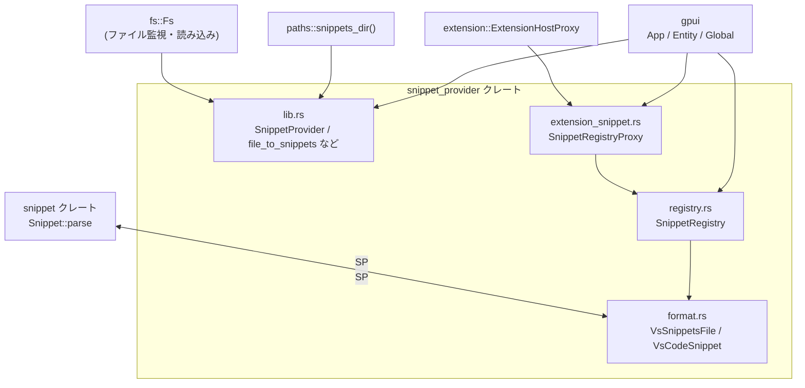
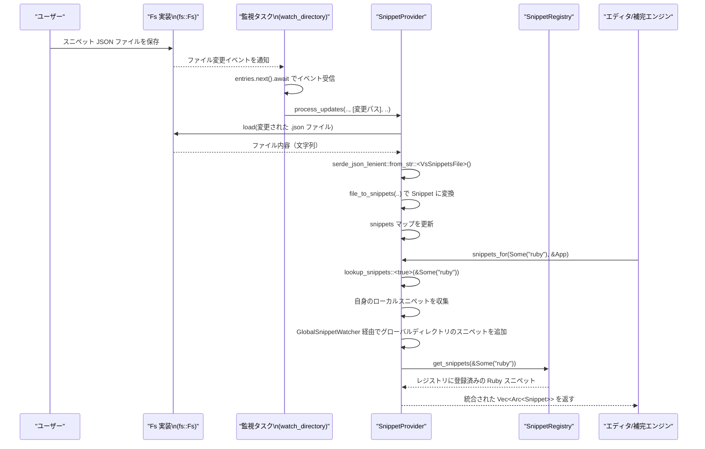

# snippet_provider/ ディレクトリ コード解説

## 1. ざっくり一言

VS Code 互換形式のスニペット JSON ファイルを読み込み・監視し、言語ごとのスニペット一覧を提供するクレートです。  
グローバルなスニペットディレクトリ・プロジェクト内ディレクトリ・拡張機能からの登録をすべて統合して扱います。

---

## 2. このモジュールの役割

### 2.1 概要

このクレートは **「複数の場所（ファイル／拡張機能）に散らばったスニペット定義を一元管理する」問題** を解決するために存在し、主に次の機能を提供します。

- VS Code 形式のスニペット JSON のパースと内部表現 (`Snippet`) への変換
- ファイルシステムの監視によるスニペットファイルの自動リロード
- グローバル／プロジェクトローカルなスニペット収集・検索
- 拡張機能からのスニペット登録 (`ExtensionSnippetProxy` 経由)
- JSON スキーマ生成によるスニペット定義のバリデーション支援

### 2.2 アーキテクチャ内での位置づけ

ディレクトリ内の主要モジュールと外部依存の関係は、概ね次のようになっています。



- `SnippetProvider` は `fs::Fs` を使ってディレクトリを監視し、`format` モジュールの型（`VsSnippetsFile` 等）にパースします。
- その後 `snippet` クレートの `Snippet::parse` で実行時スニペットとして妥当か検証し、内部の `Snippet` 構造体として保持します。
- `SnippetRegistry` はグローバルなスニペットストアで、拡張機能側と `extension_snippet` モジュール経由でつながっています。
- これらのコンポーネントは `gpui` の `Global` / `Entity` としてアプリケーション全体に公開されます。

### 2.3 設計上のポイント

コードから読み取れる範囲での設計上の特徴は次の通りです。

- **責務の分割**
  - `format.rs`: スニペット JSON フォーマットの定義と JSON スキーマ生成。
  - `lib.rs`: スニペットの読み込み・監視・検索の中核ロジック。
  - `registry.rs`: グローバルなスニペットレジストリ（拡張機能用の API）。
  - `extension_snippet.rs`: 拡張ホストと `SnippetRegistry` の橋渡し。
- **状態管理**
  - `SnippetProvider` は `fs::Fs` とスニペット一覧（言語・ファイルパスごとのマップ）を持つ状態fulなエンティティです。
  - `SnippetRegistry` は `RwLock<HashMap<..>>` でスニペットを守るスレッドセーフなグローバルストアです。
- **エラーハンドリング**
  - JSON のパースに `serde_json_lenient` を使い、多少ゆるい形式（例: 末尾カンマ）を許容しています。
  - 各スニペットのパース結果は `Result::log_err` で `Option` に変換され、エラーになったスニペットだけをログに流しつつスキップする形になっています（`ResultExt` の実装はこのチャンクにはありませんが、名前と使われ方からそのように推測できます）。
  - `Fs` からの I/O エラーや無効な JSON は、基本的に「そのファイルを無視する」「エラーを返す」のどちらかの形で扱われています。
- **グローバル vs プロジェクトローカル**
  - 言語ごとのキーは `type SnippetKind = Option<String>` で表現され、`None` が「グローバルスニペット」、`Some("ruby")` のような値が言語名付きスニペットを表します。
  - グローバルな監視 (`GlobalSnippetWatcher`) は 1 回だけ作成され、複数プロジェクトの `SnippetProvider` から再利用されます。

---

## 3. 主要な機能一覧

このクレートが提供する主な機能を挙げます。

- VS Code 形式スニペット JSON のパース（`VsSnippetsFile`, `VsCodeSnippet`, `ListOrDirect`）
- スニペット JSON 用の JSON Schema の生成（`VsSnippetsFile::generate_json_schema`）
- JSON ファイルから内部表現 `Snippet` への変換（`file_to_snippets`）
- ファイルシステム監視によるスニペットファイルの自動読み込み・更新（`SnippetProvider::watch_directory` とバックグラウンドタスク）
- プロジェクトディレクトリおよびグローバルディレクトリからのスニペット収集（`SnippetProvider` / `GlobalSnippetWatcher`）
- 拡張機能からのスニペット登録（`SnippetRegistry`, `SnippetRegistryProxy`）
- 言語名（またはグローバル）を指定したスニペット一覧取得（`SnippetProvider::snippets_for`, `SnippetRegistry::get_snippets`）

---

## 4. 関数・構造体の解説

### 4.1 型一覧（構造体・列挙体など）

| 名前 | 種別 | 定義 | 役割 / 用途 |
|------|------|------|-------------|
| `SnippetKind` | 型エイリアス | `lib.rs` | `Option<String>`。`Some("rust")` のように言語名、`None` はグローバルスニペットを表します。 |
| `Snippet` | 構造体 | `lib.rs` | パース済みスニペットのメタデータ（プレフィックス、本文、説明、名称）を保持します。 |
| `SnippetProvider` | 構造体 | `lib.rs` | ファイルシステムを監視し、言語＋ファイルパスごとにスニペット一覧を保持・提供するエンティティです。 |
| `GlobalSnippetWatcher` | 構造体 | `lib.rs` | グローバルスニペットディレクトリ用の `SnippetProvider` を包む `gpui::Global` 実装です。アプリ全体で 1 つだけ作られます。 |
| `VsSnippetsFile` | 構造体 | `format.rs` | VS Code のスニペットファイル全体を表す型です。トップレベルのオブジェクトを `HashMap<String, VsCodeSnippet>` として保持します。 |
| `VsCodeSnippet` | 構造体 | `format.rs` | 単一スニペット（`prefix`/`body`/`description`）の JSON 表現です。 |
| `ListOrDirect` | 列挙体 | `format.rs` | VS Code の仕様に合わせ、文字列または文字列配列（どちらか一方）を表すユーティリティ enum です。 |
| `SnippetRegistry` | 構造体 | `registry.rs` | 拡張機能などから登録されたスニペットを言語ごとに保持するグローバルレジストリです。 |
| `GlobalSnippetRegistry` | 構造体 | `registry.rs` | `SnippetRegistry` を包む `gpui::Global` 実装です（外部 API としては直接使わない内部型です）。 |
| `SnippetRegistryProxy` | 構造体 | `extension_snippet.rs` | `ExtensionSnippetProxy` を実装し、拡張ホストからの登録要求を `SnippetRegistry` に中継します。 |

### 4.2 重要な関数の詳細

#### `file_to_snippets(file_contents: VsSnippetsFile, source: &Path) -> impl Iterator<Item = Result<Arc<Snippet>>>`

**概要**

- VS Code 形式のスニペットファイル（`VsSnippetsFile`）から、内部表現の `Snippet` を生成するイテレータを返します。
- 各スニペットの本文を `snippet::Snippet::parse` で検証し、無効なスニペットは `Err` として扱います。

**引数**

| 引数名 | 型 | 説明 |
|--------|----|------|
| `file_contents` | `VsSnippetsFile` | JSON をパースしたスニペットファイル全体。名前→`VsCodeSnippet` のマップです。 |
| `source` | `&Path` | このスニペットファイルの元パス。エラーメッセージに含められます。 |

**戻り値**

- `Iterator<Item = Result<Arc<Snippet>>>`  
  各要素は 1 つのスニペットを表し、パース成功時は `Ok(Arc<Snippet>)`、失敗時はエラー内容付きの `Err(..)` になります。

**内部処理の流れ**

1. `file_contents.snippets`（`HashMap<String, VsCodeSnippet>`）を `into_iter()` で走査します。
2. 各 `(name, snippet)` について:
   - `snippet.prefix` が `Some` なら `ListOrDirect` から `Vec<String>` に変換し、`prefix` とする。
   - `snippet.prefix` が `None` の場合は、スニペット名（`name`）を 1 要素だけ持つベクタをプレフィックスとして使います。
   - `snippet.description` は `Option<ListOrDirect>` なので、`to_string()` で文字列化し `Option<String>` に変換します。
   - `snippet.body` は `ListOrDirect` で、`to_string()` により複数行の場合は `\n` で結合された 1 つの文字列になります。
3. 生成した本文 `body` を `snippet::Snippet::parse(&body)` に渡し、スニペットとして妥当か検査します。
4. パース成功時は `Snippet { prefix, body, description, name }` を `Arc` で包んで `Ok` として返し、失敗時は `anyhow::anyhow!` でエラーを生成して `Err` として返します。

**Examples（使用例）**

ここでは、既に JSON を `VsSnippetsFile` にパース済みと仮定した簡単な例を示します。

```rust
use std::path::Path;                                           // Path 型のインポート
use std::sync::Arc;                                            // Arc のインポート
use snippet_provider::{format::VsSnippetsFile, file_to_snippets, Snippet}; // このクレートの型/関数をインポート

fn load_from_parsed(file: VsSnippetsFile, path: &Path) -> Vec<Arc<Snippet>> {
    file_to_snippets(file, path)                               // VsSnippetsFile からイテレータを生成
        .filter_map(|res| res.ok())                            // エラーになったスニペットは捨てる（ここではログ等は取らない例）
        .collect()                                             // Vec<Arc<Snippet>> にまとめる
}
```

**Errors / Panics**

- `snippet::Snippet::parse` が失敗した場合、`Err(anyhow::Error)` を返します。
- この関数自体は `panic` を起こすコードは含んでいません（ただし、`anyhow!` の内部などについてはこのチャンクからは分かりません）。

**Edge cases（エッジケース）**

- `prefix` が指定されていないスニペットは、自動的に「スニペット名」をプレフィックスとして扱われます。
- `body` が `["line1", "line2"]` のような配列の場合、内部表現の `body` は `"line1\nline2"` という 1 つの文字列になります。
- `description` が配列で渡された場合も、`Display` 実装により改行区切りの 1 つの文字列にまとめられます。
- 無効な本文（`snippet::Snippet::parse` でエラーになるもの）はイテレータ内で `Err` となり、呼び出し側でフィルタされる前提です。

**使用上の注意点**

- 典型的には `filter_map(Result::log_err)` のように使われ、エラーはログ出力に残しつつスキップされます。エラーを見逃したくない場合は、自前で `Result` をチェックする必要があります。
- `source` パスは主にエラーメッセージ用であり、その他の用途には使われていません。

---

#### `SnippetProvider::new(fs: Arc<dyn Fs>, dirs_to_watch: BTreeSet<PathBuf>, cx: &mut App) -> Entity<Self>`

**概要**

- プロジェクトごとの `SnippetProvider` エンティティを生成し、指定されたディレクトリ群を監視するように初期化します。
- 同時に、グローバルスニペット用の `GlobalSnippetWatcher` が存在しなければそれも作成します。

**引数**

| 引数名 | 型 | 説明 |
|--------|----|------|
| `fs` | `Arc<dyn Fs>` | ファイルシステム操作を提供するオブジェクト。`watch`, `read_dir`, `load`, `metadata` などを持つトレイトと推測されます（実装はこのチャンクにはありません）。 |
| `dirs_to_watch` | `BTreeSet<PathBuf>` | この `SnippetProvider` が監視するプロジェクトローカルのスニペットディレクトリ集合です。 |
| `cx` | `&mut App` | `gpui` のアプリケーションコンテキスト。エンティティ生成とグローバル値登録に使われます。 |

**戻り値**

- `Entity<SnippetProvider>`  
  `gpui` におけるエンティティハンドルで、後から `cx.update_entity` などを通じて `SnippetProvider` にアクセスできます。

**内部処理の流れ**

1. `cx.has_global::<GlobalSnippetWatcher>()` で、グローバルスニペットウォッチャがすでに存在するかチェックします。
2. 存在しなければ `GlobalSnippetWatcher::new(fs.clone(), cx)` を呼んで作成し、`cx.set_global` で登録します。
3. `cx.new` で `SnippetProvider` エンティティを生成します。このとき:
   - `fs` を保持し、`snippets` は空のマップ、`watch_tasks` は空のベクタとして初期化します。
   - `dirs_to_watch` 内の各ディレクトリに対して `watch_directory` を呼び、監視タスクを登録します。
4. 生成した `Entity<SnippetProvider>` を呼び出し元に返します。

**Examples（使用例）**

以下は、アプリケーション起動時にスニペットをセットアップするイメージ例です。

```rust
use std::{collections::BTreeSet, path::PathBuf, sync::Arc};    // 必要な標準ライブラリ型をインポート
use fs::RealFs;                                                // 実際のファイルシステム実装（実装詳細はこのチャンクにはありません）
use gpui::App;                                                 // gpui の App 型
use snippet_provider::{SnippetProvider, init as init_snippets}; // このクレートの型と初期化関数をインポート

fn setup_snippet_provider(cx: &mut App) {
    init_snippets(cx);                                         // グローバルな SnippetRegistry と拡張プロキシを初期化

    let fs = Arc::new(RealFs::new(/* 実行コンテキストなど */)); // Fs 実装を用意（詳細は Fs クレート側）

    let mut dirs = BTreeSet::new();                            // 監視対象ディレクトリ集合を作成
    dirs.insert(PathBuf::from("/path/to/project/.zed/snippets")); // プロジェクト固有スニペットディレクトリを追加

    let provider = SnippetProvider::new(fs, dirs, cx);         // SnippetProvider エンティティを生成

    // provider は cx.update_entity(&provider, |provider, cx| { ... }) などで利用します
}
```

**Errors / Panics**

- この関数自体は `Result` を返さず、内部で明示的な `panic!` も行っていません。
- ただし、`cx.new` や `GlobalSnippetWatcher::new`、`watch_directory` 内の非同期タスクで I/O エラーが発生しうる点には注意が必要です（発生時の詳細な挙動は Fs 実装や `process_updates` などに依存し、このチャンクのみからは完全には分かりません）。

**Edge cases（エッジケース）**

- `dirs_to_watch` が空の場合でも、グローバルスニペットディレクトリは `GlobalSnippetWatcher` によって監視されます。
- `fs` がテスト用の `FakeFs` であっても同じ API で動作します（テストコードで利用されています）。

**使用上の注意点**

- `init_snippets(cx)`（`lib.rs` の `pub fn init`）を呼ばないと、グローバルな `SnippetRegistry` が初期化されず、拡張機能からのスニペット登録が正常に動作しません。
- `dirs_to_watch` のディレクトリパスは存在している必要があります。存在しない場合の挙動は `Fs::watch` / `Fs::read_dir` の実装に依存します。

---

#### `SnippetProvider::watch_directory(&mut self, path: &Path, cx: &Context<Self>)`

**概要**

- 指定ディレクトリに対する監視タスクを生成し、初期状態の読み込みとその後の変更検知を行います。
- 内部で `initial_scan` と `process_updates` を呼び出し、`.json` ファイルの増減・更新に応じて `snippets` マップを更新します。

**引数**

| 引数名 | 型 | 説明 |
|--------|----|------|
| `path` | `&Path` | 監視するディレクトリパスです。 |
| `cx` | `&Context<SnippetProvider>` | このエンティティに対する `gpui` コンテキストで、非同期タスクの起動などに使われます。 |

**戻り値**

- なし（`()`）。  
  ただし、副作用として `watch_tasks` に監視タスク (`Task<Result<()>>`) が追加されます。

**内部処理の流れ**

1. `path` を `Arc<Path>` に変換してクロージャ内にムーブ可能な形にします。
2. `cx.spawn` で非同期タスクを起動し、`watch_tasks` にその `Task<Result<()>>` を保存します。
3. タスク内で:
   1. `this.read_with` で `fs: Arc<dyn Fs>` を取得します。
   2. `fs.watch(&watched_path, Duration::from_secs(1))` を呼び出し、ディレクトリ監視を開始します（戻り値は `(entries, _)` のようなタプルで、`entries` は変更イベントのストリームです）。
   3. `initial_scan(this.clone(), path, cx.clone()).await?` により、最初にディレクトリ内の既存ファイルを読み込みます。
   4. `while let Some(entries) = entries.next().await` ループで、監視ストリームから変更イベントを受け取り:
      - 各イベントの `event.path` を取り出し、`process_updates(this.clone(), paths, cx.clone()).await?` に渡します。
4. タスクはエラー時に `Err` を返す可能性がありますが、その扱いはこのチャンクでは明示されていません（`Task<Result<()>>` 側の処理に依存します）。

**Errors / Panics**

- `initial_scan` や `process_updates` は `Result<()>` を返すため、I/O エラーや JSON パースエラーなどで `Err` になる可能性があります。
- この関数自体は `panic` を行いません。

**Edge cases（エッジケース）**

- 監視ディレクトリ配下で `.json` 拡張子以外のファイルが変更されても、`process_updates` 側で早期 continue されるため無視されます。
- ディレクトリ自体の削除やアクセス権変更など、特殊なファイルシステムイベントの扱いは `Fs::watch` の実装に依存し、このチャンクからは詳細不明です。

**使用上の注意点**

- 通常は `SnippetProvider::new` からのみ呼ばれ、外部から直接呼ぶ必要はありません。
- 監視タスクは `watch_tasks` ベクタに保持されますが、明示的なキャンセル処理はこのチャンク内には見当たりません。ライフサイクル管理は `gpui` 側の `Entity` とタスク管理に依存します。

---

#### `SnippetProvider::snippets_for(&self, language: SnippetKind, cx: &App) -> Vec<Arc<Snippet>>`

**概要**

- 指定された言語（またはグローバル）のスニペット一覧を取得します。
- プロジェクトローカル・グローバルディレクトリ・拡張機能レジストリをすべて含めた統合結果を返します。

**引数**

| 引数名 | 型 | 説明 |
|--------|----|------|
| `language` | `SnippetKind` | `Some("rust".to_owned())` のように言語名、`None` なら「グローバル」スニペットを指定します。 |
| `cx` | `&App` | `gpui` のアプリケーションコンテキスト。グローバルウォッチャやレジストリへのアクセスに使われます。 |

**戻り値**

- `Vec<Arc<Snippet>>`  
  指定言語および（必要に応じて）グローバルスニペットの一覧です。

**内部処理の流れ**

1. `lookup_snippets::<true>(&language, cx)` を呼び出し、以下を含むスニペットを収集します。
   - この `SnippetProvider` が保持する、指定言語用のスニペット（監視しているローカルディレクトリ由来）。
   - `GlobalSnippetWatcher` 内部の `SnippetProvider` が持つ、同じ言語用のスニペット。
   - `SnippetRegistry`（拡張機能によるグローバルレジストリ）が持つ、同じ言語用のスニペット。
2. `language.is_some()` の場合（例: `Some("ruby")`）は、さらに `lookup_snippets::<true>(&None, cx)` を呼び出し「グローバルスニペット」も収集し、結果に追加します。
3. 最終的な `Vec<Arc<Snippet>>` を返します。

**Examples（使用例）**

```rust
use std::sync::Arc;                                            // Arc をインポート
use gpui::{App, AppContext};                                   // gpui の App / AppContext
use snippet_provider::{SnippetKind, SnippetProvider};          // このクレートの型をインポート

fn use_snippets(provider: &SnippetProvider, cx: &App) {
    // Ruby 用スニペット（Ruby + グローバル）を取得
    let ruby_snippets = provider.snippets_for(Some("ruby".to_owned()), cx);
    // グローバルスニペットのみを取得
    let global_snippets = provider.snippets_for(None, cx);

    // ここで補完メニューの構築などに利用できます
    for snippet in ruby_snippets {
        // snippet.prefix, snippet.body, snippet.description などを参照
    }
}
```

**Errors / Panics**

- この関数は `Result` を返さず、内部でも明示的な `panic` を行っていません。
- `lookup_snippets` の中で `SnipperRegistry::try_global(cx)` が `None` を返した場合は、その時点のレジストリスニペットは無視されますが、それは正常なケースとして扱われています。

**Edge cases（エッジケース）**

- `language == None` の場合は、グローバルスニペットのみが対象です（このとき `lookup_snippets::<true>(&None, cx)` が 1 回だけ呼ばれます）。
- `SnippetRegistry` や `GlobalSnippetWatcher` がまだ初期化されていない場合、それらからのスニペットは単に含まれません。
- 同じスニペットが複数のソース（プロジェクトディレクトリ／グローバルディレクトリ／レジストリ）に存在する場合、ベクタ内に重複して入る可能性があります。このコードでは重複排除は行っていません。

**使用上の注意点**

- `language` に渡す文字列は、エディタ側で扱う言語名・ID と一致させる必要があります。どの値が対応しているかは、このクレート外の設計に依存します。
- `Arc<Snippet>` を返すため、呼び出し側でクローンしてもコピーコストは小さいですが、スニペット数が多い場合には `Vec` のサイズ増加にも注意が必要です。

---

#### `SnippetRegistry::register_snippets(&self, file_path: &Path, contents: &str) -> Result<()>`

**概要**

- 拡張機能などから渡されたスニペット JSON 文字列をパースし、`SnippetRegistry` に登録します。
- 1 回の呼び出しで 1 つのファイル相当のスニペット群を登録し、その言語に対する既存エントリを丸ごと置き換えます。

**引数**

| 引数名 | 型 | 説明 |
|--------|----|------|
| `file_path` | `&Path` | このスニペットセットに対応するパス。ファイル名（拡張子なし）から言語名を推定するために使われます。 |
| `contents` | `&str` | VS Code 形式のスニペット JSON 文字列です。 |

**戻り値**

- `Result<()>`  
  - 正常にパース・登録できれば `Ok(())`。
  - JSON が無効な場合や I/O 以外のパースエラーがあれば `Err(anyhow::Error)` になります。

**内部処理の流れ**

1. `serde_json_lenient::from_str::<VsSnippetsFile>(contents)?` で JSON をパースします。
2. `file_path.file_stem()` からファイル名（拡張子なし）を取り出し、`file_stem_to_key` を通して `SnippetKind`（言語名または `None`）を決定します。
   - `"snippets.json"` → `None`（グローバル）
   - `"ruby.json"` → `Some("ruby".to_owned())`
3. `crate::file_to_snippets(snippets_in_file, file_path)` により `Result<Arc<Snippet>>` のイテレータを取得します。
4. `filter_map(Result::log_err)` で無効なスニペットをスキップしつつ `Vec<Arc<Snippet>>` に収集します。
5. `self.snippets.write().insert(kind, collected)` で、その言語のスニペット一覧をレジストリに登録します（既存の同じ `kind` の値は上書きされます）。

**Examples（使用例）**

```rust
use std::{path::Path, sync::Arc};                              // Path, Arc をインポート
use gpui::App;                                                // gpui の App 型
use snippet_provider::SnippetRegistry;                        // このクレートの SnippetRegistry をインポート

fn register_extension_snippets(cx: &mut App) {
    // グローバルレジストリを初期化（通常は snippet_provider::init 内で行われます）
    SnippetRegistry::init_global(cx);

    let registry = SnippetRegistry::global(cx);               // Arc<SnippetRegistry> を取得
    let path = Path::new("ruby.json");                        // 言語名はファイル名から推定される

    let contents = r#"
    {
      "Log to console": {
        "prefix": "log",
        "body": ["console.log($1)", "$0"],
        "description": "Logs to console"
      }
    }
    "#;

    registry.register_snippets(path, contents).unwrap();      // パースと登録を実行
}
```

**Errors / Panics**

- `serde_json_lenient::from_str` が失敗した場合は、そのまま `Err` が返ります。
- `file_to_snippets` 内でのスニペット個別のパースエラー（`snippet::Snippet::parse` の失敗）は `Result::log_err` でログとともにスキップされますが、この関数の `Result` には反映されません。
- 明示的な `panic` はありません。

**Edge cases（エッジケース）**

- `file_path` のファイル名が `"snippets"` の場合は `SnippetKind` が `None` となり、グローバルスニペットとして扱われます。
- ファイル名が UTF-8 で解釈できない場合や、`file_stem` が取得できない場合の挙動は、このコード片のみからは完全には分かりませんが、その場合は `kind` が `None` として扱われる可能性があります。
- 既に同じ `kind` に対してスニペットが登録されている場合、今回の登録で丸ごと置き換えられます。

**使用上の注意点**

- 1 言語につき 1 ファイル相当の JSON を想定しているように見えます。同じ言語に複数ファイルから登録したい場合は、この設計だと最後の呼び出しだけが残る点に注意が必要です。
- `contents` は VS Code 互換形式である必要があります。`format.rs` の型に従った形（トップレベルがスニペット名→オブジェクトのマップ）で渡す必要があります。

---

#### `SnippetRegistry::get_snippets(&self, kind: &SnippetKind) -> Vec<Arc<Snippet>>`

**概要**

- 指定された `SnippetKind`（言語名または `None`）に対応するスニペット一覧を返します。

**引数**

| 引数名 | 型 | 説明 |
|--------|----|------|
| `kind` | `&SnippetKind` | `Some("rust")` のような言語名、または `None`（グローバル）です。 |

**戻り値**

- `Vec<Arc<Snippet>>`  
  登録されているスニペット一覧。該当するエントリがなければ空ベクタを返します。

**内部処理の流れ**

1. `self.snippets.read()` で読み取りロックを取得します。
2. `get(kind)` で対応するベクタを取り出します。
3. 存在すれば `cloned()` でクローンし、`unwrap_or_default()` で `Vec<Arc<Snippet>>` を返します。存在しなければ空ベクタを返します。

**使用上の注意点**

- 戻り値はコピーではなく `Arc` のクローンなので、スニペット本体を共有して扱えます。
- 書き込み（`register_snippets`）との並行アクセスに対しては `RwLock` で守られており、呼び出し側で特別な同期処理を行う必要はありません。

---

#### `VsSnippetsFile::generate_json_schema() -> serde_json::Value`

**概要**

- `VsSnippetsFile`（＝スニペット JSON 全体）の JSON Schema を生成し、`serde_json::Value` として返します。
- スニペット定義ファイルの検証・補完などに利用できるスキーマをプログラムから取得するためのユーティリティです。

**引数**

- なし（関連する設定はコード内にハードコードされています）。

**戻り値**

- `serde_json::Value`  
  JSON Schema（Draft 2019-09 準拠）のオブジェクトです。

**内部処理の流れ**

1. `schemars::generate::SchemaSettings::draft2019_09()` でスキーマ設定を作成します。
2. `.with_transform(DefaultDenyUnknownFields)` と `.with_transform(AllowTrailingCommas)` を適用し、未知フィールドの扱いや末尾カンマの許容などのルールを設定します（両トランスフォームの詳細な挙動は `util::schemars` 側の実装に依存し、このチャンクにはありません）。
3. `.into_generator().root_schema_for::<Self>()` で `VsSnippetsFile` 用のルートスキーマを生成します。
4. `serde_json::to_value(schema).unwrap()` でスキーマを JSON に変換し、返します。

**Examples（使用例）**

```rust
use snippet_provider::format::VsSnippetsFile;                  // VsSnippetsFile をインポート

fn dump_schema() {
    let schema_json = VsSnippetsFile::generate_json_schema();  // JSON Schema を生成
    println!("{}", serde_json::to_string_pretty(&schema_json).unwrap()); // 見やすく出力
}
```

**Errors / Panics**

- `serde_json::to_value(schema).unwrap()` を使用しているため、変換に失敗した場合は `panic` します。
  - ただし、通常の `schemars` の利用パターンではこの変換が失敗することは稀です。
- それ以外に `Result` は返しません。

**使用上の注意点**

- スキーマの内容は `VsCodeSnippet` や `ListOrDirect` の `JsonSchema` 実装に依存します。型定義を変更した場合はスキーマにも影響します。
- エディタや外部ツールでスニペットファイルを検証する際に、このスキーマを配布・利用することが想定されています。

---

### 4.3 その他の主な関数・メソッド

| 関数名 / メソッド名 | 定義 | 役割（1 行） |
|---------------------|------|--------------|
| `pub fn init(cx: &mut App)` | `lib.rs` | グローバルな `SnippetRegistry` を初期化し、拡張ホスト向けスニペットプロキシを登録します。 |
| `async fn process_updates(..)` | `lib.rs` | 監視イベントから `.json` ファイルの追加・更新・削除を検出し、`snippets` マップを更新します。 |
| `async fn initial_scan(..)` | `lib.rs` | 初期状態でディレクトリ内の `.json` ファイルを読み込み、`process_updates` に渡します。 |
| `impl From<ListOrDirect> for Vec<String>` | `format.rs` | 単一文字列または配列を共通の `Vec<String>` へ正規化します。 |
| `impl Display for ListOrDirect` | `format.rs` | スニペット本文や説明を文字列に変換するときのフォーマット（複数行は改行結合）を定義します。 |
| `SnippetRegistry::global / try_global / init_global` | `registry.rs` | `gpui::Global` として `SnippetRegistry` を取得・初期化するためのユーティリティです。 |
| `SnippetRegistryProxy::register_snippet` | `extension_snippet.rs` | 拡張ホストから渡された内容をそのまま `SnippetRegistry::register_snippets` に委譲します。 |

---

## 5. データフロー

ここでは、代表的なシナリオとして「プロジェクト内のスニペットファイルを編集して保存し、その後エディタがスニペット一覧を取得するまで」の流れを示します。

### 5.1 処理の流れ（概要）

1. アプリ起動時に `SnippetProvider::new` が呼ばれ、プロジェクト内のスニペットディレクトリ（例: `.zed/snippets`）が監視対象として登録されます。
2. 監視タスクが `initial_scan` を通じて既存の `.json` スニペットファイルを読み込み、`file_to_snippets` 経由で `Snippet` に変換して内部マップに格納します。
3. ユーザーがスニペット JSON ファイルを編集・保存すると、`Fs::watch` のイベントが発火し、`process_updates` が再度読込みとパースを行い、該当ファイルのスニペット一覧を更新します。
4. 補完エンジンなどがスニペットを要求すると、`SnippetProvider::snippets_for` が呼ばれ、プロジェクトローカル・グローバル・拡張機能レジストリのスニペットを統合して返します。

### 5.2 シーケンス図



- 拡張機能からの登録フローは、`ExtensionHostProxy` → `SnippetRegistryProxy::register_snippet` → `SnippetRegistry::register_snippets` という経路で `Registry` に追加され、上記最後の `get_snippets` 呼び出しで利用されます。

---

## 6. 使い方（How to Use）

### 6.1 基本的な使用方法

ここでは、アプリケーション側がこのクレートを利用してスニペットを読み込み、特定言語のスニペット一覧を取得するまでの基本的なコードフローを示します。

```rust
use std::{collections::BTreeSet, path::PathBuf, sync::Arc};    // 標準ライブラリの型をインポート
use fs::RealFs;                                                // 実際のファイルシステム実装（このチャンクには定義がありません）
use gpui::{App, AppContext};                                   // gpui の App / AppContext
use snippet_provider::{SnippetProvider, SnippetKind, init};    // このクレートの型と初期化関数をインポート

fn setup(cx: &mut App) {
    // 1. グローバルレジストリと拡張ホストプロキシの初期化
    init(cx);                                                  // SnippetRegistry::init_global と extension_snippet::init を呼び出す

    // 2. Fs 実装を用意
    let fs = Arc::new(RealFs::new(/* 実装固有の引数 */));      // 実際の Fs 実装を生成

    // 3. プロジェクト内スニペットディレクトリを指定
    let mut dirs = BTreeSet::new();                            // 監視対象ディレクトリ集合を作成
    dirs.insert(PathBuf::from("/path/to/project/.zed/snippets")); // .json スニペットファイルを配置するディレクトリ

    // 4. SnippetProvider エンティティを作成（監視タスクが起動される）
    let provider = SnippetProvider::new(fs, dirs, cx);         // Entity<SnippetProvider> が返る

    // 5. どこかのタイミングでスニペット一覧を取得
    cx.update_entity(&provider, |provider, cx| {               // provider にアクセスするために cx.update_entity を使用
        let snippets = provider.snippets_for(                  // SnippetProvider::snippets_for でスニペット一覧を取得
            Some("ruby".to_owned()),                           // 言語名（ここでは Ruby）を指定
            cx,                                                // App コンテキスト
        );
        // snippets を補完メニューなどに利用
        for snippet in snippets {
            println!("prefix = {:?}, body = {:?}",             // prefix と body を表示
                     snippet.prefix, snippet.body);
        }
    });
}
```

### 6.2 よくある使用パターン

#### パターン 1: VS Code 互換 JSON ファイルの配置

- プロジェクトローカルのスニペットディレクトリ内に、VS Code 互換形式の `.json` ファイルを配置します。
  - `snippets.json` → グローバルスニペット (`SnippetKind = None`)
  - `ruby.json` → Ruby 用スニペット (`SnippetKind = Some("ruby")`)
- ファイルの内容例（VS Code 形式／このクレートも同じ形式を期待）:

```json
{
  "Log to console": {
    "prefix": "log",
    "body": ["console.log($1);", "$0"],
    "description": "Logs to console"
  }
}
```

このファイルは、`SnippetProvider` によって自動的に検出・パースされ、`snippets_for(Some("ruby"))` で取得できます。

#### パターン 2: 拡張機能からのスニペット登録

- 拡張ホスト側では `ExtensionSnippetProxy::register_snippet(&PathBuf, &str)` が呼ばれる設計になっており、このクレートでは `SnippetRegistryProxy` がその実装を提供します。
- 実際には、`SnippetRegistryProxy::register_snippet` が `SnippetRegistry::register_snippets` を呼び出し、レジストリに反映されます。
- その後、`SnippetProvider::snippets_for` でレジストリ内のスニペットも統合して返されます。

（拡張ホスト側のコードはこのチャンクには含まれていないため、ここでは呼び出しのイメージのみ記述しています。）

#### パターン 3: JSON Schema を使ったスニペットファイルの検証

- `VsSnippetsFile::generate_json_schema` を使って JSON Schema を取得し、外部の JSON バリデータやエディタのスキーマ機能に渡すことで、スニペット定義ファイルの構造チェックや補完を行うことができます。

```rust
use snippet_provider::format::VsSnippetsFile;                  // VsSnippetsFile をインポート

fn export_snippet_schema() {
    let schema = VsSnippetsFile::generate_json_schema();       // JSON Schema を生成
    std::fs::write("snippets.schema.json",                     // ファイルに書き出し
                   serde_json::to_string_pretty(&schema).unwrap())
        .unwrap();
}
```

### 6.3 使用上の注意点（まとめ）

- **JSON 形式**
  - トップレベルは「スニペット名 → スニペット定義オブジェクト」のマップである必要があります。
  - 各スニペット定義は `prefix`（省略可）, `body`（必須）, `description`（省略可）を持ちます。
  - `prefix`, `body`, `description` はいずれも「文字列」または「文字列配列（`ListOrDirect`）」で指定できます。
- **ファイル名とスニペット種別**
  - `snippets.json` というファイル名は「グローバルスニペット」として扱われます（`SnippetKind = None`）。
  - その他の `xxx.json` はファイル名 `xxx` が言語名として `SnippetKind = Some("xxx")` に対応します。
- **対象ファイル**
  - 監視の対象は `.json` 拡張子のファイルのみです。それ以外の拡張子の変更は無視されます。
  - ディレクトリ（`is_dir == true`）は `process_updates` 内でスキップされます。
- **無効なスニペットの扱い**
  - JSON 自体が無効な場合（パースエラー）は、そのファイル全体が登録されません。
  - JSON は有効だが個別スニペットの本文などが `snippet::Snippet::parse` で無効と判断された場合、そのスニペットだけが `Result::log_err` によってスキップされます。
- **重複**
  - 同じ内容のスニペットが複数ソース（プロジェクトディレクトリ／グローバルディレクトリ／レジストリ）に存在しても、このクレート側では特に重複排除を行っていないため、呼び出し側で必要に応じて重複処理を行う必要があります。
- **スレッド安全性**
  - `SnippetRegistry` は `RwLock<HashMap<..>>` で保護されており、複数スレッドからの `register_snippets` / `get_snippets` 呼び出しを想定した設計になっています。
  - `SnippetProvider` 自体は `gpui::Entity` を通じてアクセスされ、`gpui` のスレッドモデルに従って扱われます。

---

## 7. 関連ファイル

このディレクトリ内の各ファイルと、その役割をまとめます。

| パス | 役割 / 関係 |
|------|------------|
| `snippet_provider/Cargo.toml` | クレートの設定ファイル。依存関係として `fs`, `gpui`, `extension`, `snippet`, `serde_json_lenient`, `schemars` などが指定されています。`test-support` フィーチャも定義されています。 |
| `snippet_provider/src/lib.rs` | クレートのメインモジュール。`Snippet` 構造体、`SnippetProvider`、ディレクトリ監視ロジック、スニペット検索 API (`snippets_for`) などの中核実装が含まれます。 |
| `snippet_provider/src/format.rs` | VS Code 形式のスニペットファイル構造 (`VsSnippetsFile`, `VsCodeSnippet`, `ListOrDirect`) と、その JSON Schema 生成ロジックを定義します。 |
| `snippet_provider/src/registry.rs` | グローバルスニペットレジストリ (`SnippetRegistry`) と、その `gpui::Global` ラッパー (`GlobalSnippetRegistry`) を定義します。拡張機能や外部コードからスニペットを直接登録する入口です。 |
| `snippet_provider/src/extension_snippet.rs` | `extension::ExtensionHostProxy` に対して `ExtensionSnippetProxy` を登録し、拡張ホストからのスニペット登録要求を `SnippetRegistry` に橋渡しします。 |
| （外部クレート）`fs` | このチャンクには実装がありませんが、`Fs` トレイトを通じてディレクトリ監視 (`watch`)、ファイル読み込み (`load`)、メタデータ取得 (`metadata`)、ディレクトリ列挙 (`read_dir`) などを提供していると考えられます。 |
| （外部クレート）`snippet` | `Snippet::parse` を提供し、スニペット本文の構文検証や内部表現への変換を行います。 |
| （外部クレート）`extension` | `ExtensionHostProxy` と `ExtensionSnippetProxy` を定義し、このクレートの `SnippetRegistryProxy` がその実装として利用されます。 |

この解説をもとに、必要な機能をどこから呼べばよいか、またスニペットファイルの形式や監視の仕組みを把握できるはずです。
