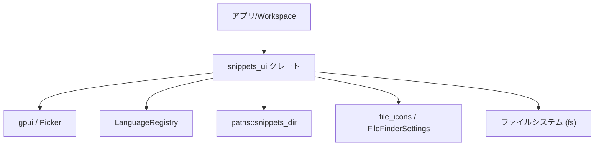
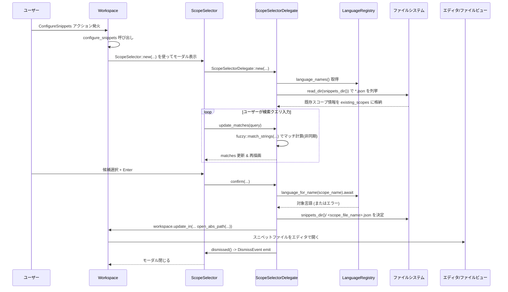

## 1. ざっくり一言

`snippets_ui` クレートは、Zed 内で **スニペットのスコープ（言語）を選択して、そのスコープに対応するスニペット設定ファイルを開くための UI** と、**スニペットフォルダを開くためのアクション** を提供するモジュールです。

---

## 2. このモジュールの役割

### 2.1 概要

- このモジュールは、**スニペットを言語ごと（スコープごと）に整理・編集したい** というニーズに対して、
  - スニペットスコープを選択するモーダル UI（`ScopeSelector`）
  - 選択に応じて適切な JSON ファイルを開く処理
  - スニペットフォルダをファイルマネージャで開く処理  
  を提供します。
- 言語名の一覧と「global」スコープを候補として表示し、**ファジーマッチ検索**で絞り込みながら選択できるようになっています。

### 2.2 アーキテクチャ内での位置づけ

このクレートは、主に **Workspace / UI 周辺のクレート** と連携して動作します。

- `Workspace` … アクションの登録・モーダルの表示・ファイルオープンを行う中核
- `gpui` … UI フレームワーク（`App`, `Entity`, `Render`, `Picker` など）
- `language::LanguageRegistry` … 利用可能な言語名と LSP ID の取得
- `paths::snippets_dir` … スニペット用のディレクトリパスを提供
- `file_icons`, `FileFinderSettings` … 言語ごとのアイコン表示のための情報
- ファイルシステム (`std::fs`) … 既存スコープ（既に存在する JSON ファイル）の検出に利用

依存関係の概要は次のようになります。



- アプリ側からは `snippets_ui::init` が呼ばれ、`Workspace` にアクションが登録されます。
- `ConfigureSnippets` アクションが発火すると `ScopeSelector` モーダルが表示されます。

### 2.3 設計上のポイント

- **スコープ名とファイル名のマッピング**
  - `"global"` スコープだけ特別扱いし、ファイル名は `"snippets.json"` にマップします。
  - それ以外のスコープは、言語の `lsp_id()` をベースに `<lsp_id>.json` というファイル名で扱います。
- **UI と状態の分離**
  - `ScopeSelector` は UI コンポーネント本体で、実際のロジックや状態は `ScopeSelectorDelegate` に集約されています。
  - `ScopeSelectorDelegate` が `PickerDelegate` を実装し、候補生成・絞り込み・選択確定などの処理を担当します。
- **非同期処理の活用**
  - ファジーマッチ（`match_strings`）はバックグラウンドエグゼキュータで非同期実行されます。
  - スコープ確定後のファイルオープンも `cx.spawn_in` により非同期で行われます。
- **エラー処理**
  - ファイルシステムや UI 更新の失敗は `ResultExt::log_err` や `NotifyResultExt::notify_err` でログ・通知され、基本的にアプリ全体がパニックしないようになっています。
  - スニペットディレクトリが読み取れない場合は「既存スコープ表示」が欠落するだけで、UI 自体は動作します。

---

## 3. 主要な機能一覧

- **アクション登録**
  - `ConfigureSnippets`: スニペット設定ファイル（スコープ選択モーダル）を開くアクション
  - `OpenFolder`: スニペットフォルダをファイルマネージャで開くアクション
- **モーダル UI 表示**
  - `ScopeSelector`: スニペットスコープ（global + 各言語）を一覧・検索するモーダル
- **スニペットスコープ候補の生成**
  - `LanguageRegistry` から取得した言語名 と `"global"` を統合して候補リストを構築
- **既存スコープの検出**
  - `snippets_dir()` 以下の `*.json` ファイルを走査し、対応するスコープ名を記録
  - 既存スコープには候補行にファイル名ラベルを表示
- **ファジーマッチ検索**
  - `fuzzy::match_strings` を用いて、ユーザー入力に応じたスコープ候補の絞り込みを行う
- **スニペットファイルのオープン**
  - 選択されたスコープに応じて `<snippets_dir>/<scope_file_name>.json` を `Workspace` から開く
- **スニペットフォルダのオープン**
  - スニペットディレクトリを作成（なければ）し、OS のファイルマネージャで開く

---

## 4. 関数・構造体の解説

### 4.1 型一覧

| 名前 | 種別 | 役割 / 用途 |
|------|------|-------------|
| `ScopeName` | 構造体（newtype） | 内部的なスコープ名（`"global"` など）を `Cow<'static, str>` で保持し、`HashSet` のキーとして利用する |
| `ScopeFileName` | 構造体（newtype） | スニペットファイルのベース名（拡張子なし）を保持し、`.json` を付けてファイル名を生成する |
| `ScopeSelector` | 構造体 | スニペットスコープ選択モーダルのルートビュー。内部に `Picker<ScopeSelectorDelegate>` を保持する |
| `ScopeSelectorDelegate` | 構造体 | `PickerDelegate` 実装。候補リスト、マッチ結果、選択インデックス、既存スコープ情報などの状態を持つ |
| `ConfigureSnippets` | アクション型（`actions!` マクロ生成） | スニペット設定モーダルを開くためのアクション |
| `OpenFolder` | アクション型（`actions!` マクロ生成） | スニペットフォルダを OS のファイルマネージャで開くためのアクション |

#### `ScopeFileName::with_extension(self) -> String`

- `ScopeFileName("snippets")` から `"snippets.json"` のような文字列を生成する簡易ユーティリティです。

---

### 4.2 主要関数の詳細

ここでは特に重要な 7 つの関数・メソッドを取り上げます。

#### `pub fn init(cx: &mut App)`

**概要**

- アプリケーションの初期化時に呼び出され、`Workspace` に対して **スニペット関連アクションの登録処理 (`register`) を監視登録** します。

**引数**

| 引数名 | 型 | 説明 |
|--------|----|------|
| `cx` | `&mut App` | アプリケーションコンテキスト。新しい `Workspace` が生成された際のフックを登録するために使用されます。 |

**戻り値**

- なし。

**内部処理の流れ**

1. `cx.observe_new(register)` を呼び出し、新しい `Workspace` が生成されたときに `register` が実行されるように設定します。
2. 戻り値（おそらく購読ハンドル）に対して `.detach()` を呼び出し、ライフサイクル管理を `App` に委ねます。

**Examples（使用例）**

```rust
use gpui::App;
use snippets_ui;

// アプリ初期化時にスニペット UI を組み込む例
fn init_plugins(app: &mut App) {
    // snippets_ui が Workspace にアクションを登録できるようにする
    snippets_ui::init(app);
}
```

**使用上の注意点**

- `init` はアプリの初期化フェーズで一度だけ呼び出す想定の関数です。
- ここで登録されるのは **アクションのハンドラ** であり、実際の UI はアクションが発火したときに動的に生成されます。

---

#### `fn configure_snippets(workspace: &mut Workspace, _: &ConfigureSnippets, window: &mut Window, cx: &mut Context<Workspace>)`

**概要**

- `ConfigureSnippets` アクションが発火したときに呼ばれ、**スニペットスコープを選択するモーダル (`ScopeSelector`) を表示** します。

**引数**

| 引数名 | 型 | 説明 |
|--------|----|------|
| `workspace` | `&mut Workspace` | 現在のワークスペース。言語レジストリの取得やモーダル表示に利用されます。 |
| `_` | `&ConfigureSnippets` | アクションインスタンス。中身は参照されません。 |
| `window` | `&mut Window` | 現在のウィンドウ。モーダル表示に必要です。 |
| `cx` | `&mut Context<Workspace>` | `Workspace` 用の UI コンテキスト。 |

**戻り値**

- なし。

**内部処理の流れ**

1. `workspace.app_state().languages.clone()` で `LanguageRegistry` を取得します。
2. `workspace.weak_handle()` を取得し、後続の非同期処理から `Workspace` にアクセスできるようにします。
3. `workspace.toggle_modal(window, cx, move |window, cx| { ... })` を呼び出し、
   - クロージャ内で `ScopeSelector::new(language_registry, workspace_handle, window, cx)` を呼び出してモーダルビューを構築します。
   - モーダルの表示／非表示をトグルします。

**Examples（使用例）**

この関数はアクションハンドラとして `register` 内で登録されているため、外部から直接呼び出すことは通常ありません。アプリ側からは「アクションを発火する」形になります（アクションの具体的なディスパッチ API はこのチャンクからは不明です）。

**Edge cases（エッジケース）**

- `LanguageRegistry` が空でも、最低限 `"global"` スコープは候補として表示されます（`ScopeSelectorDelegate::new` の実装から分かります）。
- `Workspace` や `Window` が正常に作られていれば、ここでの処理でパニックする分岐はコード上では見当たりません。

**使用上の注意点**

- スニペットスコープ選択 UI を利用したい場合は、アプリ側でアクションを適切にバインド（ショートカット・メニューなど）しておく必要があります。

---

#### `fn open_folder(workspace: &mut Workspace, _: &OpenFolder, _: &mut Window, cx: &mut Context<Workspace>)`

**概要**

- `OpenFolder` アクションが発火したときに呼ばれ、**スニペット用ディレクトリを作成（必要なら）し、OS のファイルマネージャでそのフォルダを開く** 関数です。

**引数**

| 引数名 | 型 | 説明 |
|--------|----|------|
| `workspace` | `&mut Workspace` | エラー通知などに利用されます（フォルダ作成時のエラー通知）。 |
| `_` | `&OpenFolder` | アクションインスタンス。中身は参照されません。 |
| `_` | `&mut Window` | 使用していません。 |
| `cx` | `&mut Context<Workspace>` | システムのファイルマネージャを開くためのコンテキスト。 |

**戻り値**

- なし。

**内部処理の流れ**

1. `fs::create_dir_all(snippets_dir())` でスニペットディレクトリを作成（既に存在する場合は何もしません）。
2. その結果に対して `.notify_err(workspace, cx)` を呼び出し、エラーがあれば `Workspace` 経由でユーザーに通知します（詳細な通知内容はこのチャンクからは不明です）。
3. `cx.open_with_system(snippets_dir().borrow())` を呼び出し、OS のファイルマネージャでスニペットディレクトリを開きます。

**Examples（使用例）**

こちらもアクションハンドラとして利用されるため、通常は直接呼び出しません。

**Edge cases（エッジケース）**

- ディレクトリ作成に失敗した場合でも、その後 `open_with_system` を実行しようとします。
  - ディレクトリが存在しない／アクセス権限がない場合の挙動は `open_with_system` の実装依存です。
- エラーは `notify_err` によってユーザーに通知されるため、静かに失敗することは避けられています。

**使用上の注意点**

- 大量のディレクトリを連続して作成する用途ではなく、単発でのフォルダオープン用です。
- `snippets_dir()` の返すパスはこのクレート外で定義されており、変更するとここで開かれる場所も変わります。

---

#### `impl ScopeSelector`

##### `fn new(language_registry: Arc<LanguageRegistry>, workspace: WeakEntity<Workspace>, window: &mut Window, cx: &mut Context<Self>) -> Self`

**概要**

- `ScopeSelector` モーダルビューを初期化し、内部に `Picker<ScopeSelectorDelegate>` を生成します。

**引数**

| 引数名 | 型 | 説明 |
|--------|----|------|
| `language_registry` | `Arc<LanguageRegistry>` | 利用可能な言語名・LSP ID を取得するためのレジストリ。 |
| `workspace` | `WeakEntity<Workspace>` | スコープ確定後に `Workspace` を更新するための弱参照。 |
| `window` | `&mut Window` | Picker の初期化に必要なウィンドウ。 |
| `cx` | `&mut Context<Self>` | `ScopeSelector` 用の UI コンテキスト。 |

**戻り値**

- 初期化済みの `ScopeSelector` インスタンス。

**内部処理の流れ**

1. `ScopeSelectorDelegate::new` を呼び出し、デリゲートを生成します。
2. `cx.entity().downgrade()` で `ScopeSelector` 自身への弱参照を `ScopeSelectorDelegate` に渡します（dismiss イベント通知用）。
3. `cx.new(|cx| Picker::uniform_list(delegate, window, cx))` で `Picker` インスタンスを生成します。
4. `ScopeSelector { picker }` を返します。

**使用上の注意点**

- 通常は `Workspace::toggle_modal` の中からのみ呼び出されます。
- 外部コードから直接 `ScopeSelector` を生成しても、アクションやライフサイクル連携が取れない可能性があります。

---

#### `impl ScopeSelectorDelegate`

##### `fn new(workspace: WeakEntity<Workspace>, scope_selector: WeakEntity<ScopeSelector>, language_registry: Arc<LanguageRegistry>) -> Self`

**概要**

- スコープ候補一覧・既存スコープ情報など、`ScopeSelectorDelegate` に必要な初期状態を構築します。

**引数**

| 引数名 | 型 | 説明 |
|--------|----|------|
| `workspace` | `WeakEntity<Workspace>` | ファイルオープン時に `Workspace` を更新するための弱参照。 |
| `scope_selector` | `WeakEntity<ScopeSelector>` | モーダルを閉じる（`DismissEvent` を送る）ために使用します。 |
| `language_registry` | `Arc<LanguageRegistry>` | 言語名一覧の取得に利用します。 |

**戻り値**

- 初期化済みの `ScopeSelectorDelegate`。

**内部処理の流れ**

1. `language_registry.language_names()` で言語名の一覧を取得します。
2. 先頭に `"global"` を表す `LanguageName::new(GLOBAL_SCOPE_NAME)` を追加し、`StringMatchCandidate` のベクタに変換します。
   - `candidate_id` は 0 からの連番です。
3. `existing_scopes` を空の `HashSet<ScopeName>` として用意します。
4. `fs::read_dir(snippets_dir())` でスニペットディレクトリを読み、`.json` 拡張子のファイルを列挙します（エラーは `.log_err()` でログ記録されます）。
5. 各 JSON ファイルについて、拡張子を除いたファイル名を `ScopeFileName` として取り出し、`ScopeName::from(ScopeFileName)` でスコープ名に変換して `existing_scopes` に登録します。
   - `"snippets.json"` → `"global"` スコープとして扱われます。
6. これらをフィールドにセットし、`ScopeSelectorDelegate` を返します。

**Edge cases（エッジケース）**

- `snippets_dir()` が存在しない／読めない場合
  - `fs::read_dir()` がエラーになり、`.log_err()` によりログは残りますが、`existing_scopes` は空のままになります。
  - その場合でも UI は表示されますが、既存ファイル名ラベルは表示されません。
- `.json` 以外の拡張子は無視されます。
- ファイル名が UTF-8 として解釈できない場合（`into_string()` が `Err` の場合）も無視されます。

**使用上の注意点**

- `existing_scopes` は「候補を絞り込む」ためではなく、「すでにスニペットファイルが存在するスコープにマークを付ける」ためにのみ使われています。

---

##### `fn confirm(&mut self, _: bool, window: &mut Window, cx: &mut Context<Picker<Self>>)`

**概要**

- 現在選択されているスコープに対応するスニペットファイルを **非同期に開き**、モーダルを閉じます。

**引数**

| 引数名 | 型 | 説明 |
|--------|----|------|
| `_` | `bool` | 引数名 `_` から分かる通り未使用です（たとえば「フォース確定」フラグなどの可能性がありますが、コードからは不明です）。 |
| `window` | `&mut Window` | 非同期タスクを起動するために渡されます。 |
| `cx` | `&mut Context<Picker<Self>>` | Picker 用のコンテキスト。タスク起動および Workspace 更新に利用されます。 |

**戻り値**

- なし。

**内部処理の流れ**

1. `self.matches.get(self.selected_index)` で現在選択されているマッチを取得します。
   - マッチが存在しない場合は何もせず `dismissed` に進みます。
2. マッチから `scope_name`（候補文字列）を取得します。
3. `language_registry.language_for_name(&scope_name)` で非同期に言語情報を取得する Future を作成します。
4. `self.workspace.upgrade()` に成功した場合、`cx.spawn_in(window, async move |_, cx| { ... })` で非同期タスクを起動します。
5. 非同期タスク内では：
   - `scope_name.to_lowercase()` が `"global"` と一致するかをチェックし、一致する場合は `ScopeFileName("snippets")` を使用します。
   - それ以外の場合は `language.await?.lsp_id()` を呼び出し、その値を `ScopeFileName` にします。
   - `snippets_dir().join(scope_file_name.with_extension())` でスニペットファイルのパスを決定します。
   - `workspace.update_in(cx, |workspace, window, cx| { ... })` を呼び、`workspace.with_local_workspace(...)` → `workspace.open_abs_path(...)` でファイルを開きます。
     - `OpenOptions { visible: Some(OpenVisible::None), ..Default::default() }` で、表示方法を指定しています（詳細は他クレートの実装依存）。
6. タスク起動後、`.detach_and_log_err(cx)` でタスクのエラーをログに残しつつ切り離します。
7. 最後に `self.dismissed(window, cx)` を呼び出し、モーダルを閉じます。

**Errors / Panics**

- `language.await?` によって、言語取得が失敗した場合はエラーが `?` で伝播します。
  - 戻り値の型やエラー処理の詳細は `cx.spawn_in` と `detach_and_log_err` の実装依存ですが、エラーはログに記録される設計と推測できます（`.detach_and_log_err` という名前から）。
- `workspace.update_in` や `open_abs_path` がエラーを返した場合も同様にログ経由で処理されると解釈できますが、詳細はこのチャンクからは分かりません。

**Edge cases（エッジケース）**

- `self.matches` が空、または `selected_index` が範囲外の場合：
  - `self.matches.get(self.selected_index)` が `None` となり、ファイルオープン処理は実行されません。
  - その後 `dismissed` が呼ばれ、モーダルのみ閉じられます。
- `Workspace` の弱参照が `upgrade()` に失敗した場合（`Workspace` が既に破棄されているなど）：
  - 非同期タスクは起動されず、ファイルは開かれませんが、モーダルは閉じられます。
- `language_for_name` が指定した `scope_name` に対応する言語を見つけられない場合：
  - `language.await?` でエラーになり、ファイルは開かれません（エラー処理はタスク側に依存）。

**使用上の注意点**

- `ScopeSelectorDelegate` を手動で操作するケースはほぼなく、`Picker` を通じてのみこのメソッドが呼ばれます。
- `"global"` スコープは大小文字を区別せず、`scope_name.to_lowercase()` で比較されています。

---

##### `fn update_matches(&mut self, query: String, window: &mut Window, cx: &mut Context<Picker<Self>>) -> gpui::Task<()>`

**概要**

- ユーザーの入力文字列 `query` に応じて、スコープ候補をファジーマッチし、`self.matches` と `self.selected_index` を更新します。

**引数**

| 引数名 | 型 | 説明 |
|--------|----|------|
| `query` | `String` | ファジーマッチ対象の検索クエリ。空文字列の場合は全候補を表示します。 |
| `window` | `&mut Window` | 非同期タスク起動のために使用されます。 |
| `cx` | `&mut Context<Picker<Self>>` | Picker コンテキスト。バックグラウンドエグゼキュータと UI 更新に利用されます。 |

**戻り値**

- `gpui::Task<()>` … 起動した非同期タスクのハンドルです。

**内部処理の流れ**

1. `let background = cx.background_executor().clone();` でバックグラウンド実行用のエグゼキュータを取得します。
2. `let candidates = self.candidates.clone();` で候補リストをコピーします（`StringMatchCandidate` の `Arc` 共有などを想定）。
3. `cx.spawn_in(window, async move |this, cx| { ... })` で非同期タスクを起動します。
4. タスク内では：
   - `query` が空の場合：
     - `candidates` 全件を `StringMatch` に変換し、`score = 0.0`, `positions = Vec::new()` としてリストを作成します。
   - `query` が非空の場合：
     - `match_strings(&candidates, &query, false, true, 100, &Default::default(), background).await` を呼び出し、結果の `Vec<StringMatch>` を取得します。
5. `this.update(cx, |this, cx| { ... })` でデリゲートの状態を更新します：
   - `delegate.matches = matches;`
   - `delegate.selected_index = delegate.selected_index.min(delegate.matches.len().saturating_sub(1));`
     - これにより、マッチ数が減った場合でも `selected_index` が範囲外にならないように調整されます。
   - `cx.notify();` で UI に再描画を通知します。
6. 更新処理全体に対して `.log_err()` が呼ばれており、失敗時にはログが残るようになっています。

**Edge cases（エッジケース）**

- `query` が空文字列の場合：
  - 全候補が表示されますが、ハイライト位置 (`positions`) は空ベクタになります。
- マッチ数が 0 になった場合：
  - `delegate.matches.len()` は 0 で、`saturating_sub(1)` により 0 のままです。
  - `selected_index` は `min(selected_index, 0)` となるため、結果として 0 かそれ以下に調整されます。
  - `confirm` で `matches.get(selected_index)` を呼ぶと `None` になり、何も実行されません（モーダルは閉じられます）。

**使用上の注意点**

- `match_strings` はバックグラウンドで実行されるため、大量の候補があっても UI スレッドのブロッキングは抑えられますが、極端に頻繁なクエリ更新はそれなりの負荷になります。
- `self.candidates` をコピーしているため、候補数が非常に多い環境ではメモリ・コピーコストに注意が必要です（通常の言語数程度であれば問題になりにくいと考えられます）。

---

##### `fn render_match(&self, ix: usize, selected: bool, _window: &mut Window, cx: &mut Context<Picker<Self>>) -> Option<ListItem>`

**概要**

- `Picker` に表示する 1 行分の UI 要素を生成します。
- 言語名・既存スニペットファイル名・言語アイコン（設定に応じて）を組み合わせて `ListItem` を構築します。

**引数**

| 引数名 | 型 | 説明 |
|--------|----|------|
| `ix` | `usize` | 表示するマッチのインデックス。 |
| `selected` | `bool` | この行が選択状態かどうか。 |
| `_window` | `&mut Window` | 未使用です。 |
| `cx` | `&mut Context<Picker<Self>>` | 設定およびアイコン取得のために使用されます。 |

**戻り値**

- `Option<ListItem>` … `ix` に対応するマッチが存在する場合は `Some(ListItem)`、存在しない場合は `None`。

**内部処理の流れ**

1. `let mat = &self.matches.get(ix)?;` でインデックスに対応するマッチを取得します（なければ `None` を返します）。
2. `name_label = mat.string.clone();` で表示用のスコープ名を取得します（`global` や言語名など）。
3. `scope_name` を `LanguageName::new(...).lsp_id()` から構築し、`ScopeName` として保持します。
4. `file_label` を次の条件で決定します：
   - `existing_scopes.contains(&scope_name)` が `true` の場合：
     - `ScopeFileName::from(scope_name).with_extension()` を使ってファイル名文字列（例: `"snippets.json"`, `"typescript.json"`）を作成し `Some(...)` とします。
   - そうでなければ `None`。
5. `language_icon` を設定します：
   - `FileFinderSettings::get_global(cx).file_icons` が `true` の場合のみアイコンを表示します。
   - `available_language_for_name` → `scope_icon` 経由で言語ごとのアイコンを取得しようとします。
   - 取得できなかった場合は `IconName::ToolWeb` に対応する汎用アイコンを利用します（取得方法の詳細な型はこのチャンクからは不明ですが、`Icon::from_path` と `color(Color::Muted)` によってアイコンが生成されています）。
6. 最後に `ListItem::new(ix)` から始めて、以下を設定します：
   - `.inset(true)`
   - `.spacing(ListItemSpacing::Sparse)`
   - `.toggle_state(selected)`
   - `.start_slot::<Icon>(language_icon)`
   - `.child(...)` として、
     - `HighlightedLabel::new(name_label, mat.positions.clone())` （マッチ位置のハイライト）
     - 必要に応じてファイル名ラベル（`Label::new(path_label).color(Color::Muted).size(LabelSize::Small)`）を追加します。

**Edge cases（エッジケース）**

- `ix` が `self.matches.len()` 以上の場合：
  - `self.matches.get(ix)` が `None` を返し、結果として `render_match` も `None` を返します。
- 対応する `LanguageMatcher` やアイコンが見つからない場合：
  - 設定が許せば汎用アイコン（`ToolWeb`）が表示されます。
  - アイコン取得にも失敗した場合、`language_icon` は `None` となり、アイコンなしの行になります。

**使用上の注意点**

- `render_match` は UI レイヤー専用の関数であり、ロジックとして再利用するものではありません。
- アイコン表示の有無はユーザー設定（`FileFinderSettings::file_icons`）に依存するため、テスト等で見た目の差異が出る点に注意が必要です。

---

### 4.3 その他の主なメソッド・実装

- `ScopeSelector: ModalView` 実装
  - モーダルとして扱われるためのマーカー用途です。
- `ScopeSelector: EventEmitter<DismissEvent>`
  - `DismissEvent` を emit してモーダルを閉じるための仕組みです。
- `ScopeSelector: Focusable`
  - `focus_handle` を `picker` に委譲し、モーダル内のフォーカス管理を統一します。
- `ScopeSelector: Render`
  - 幅 34 rem の縦フレックスコンテナの中に `picker` を配置するレイアウトを定義します。
- `ScopeSelectorDelegate::scope_icon`
  - `LanguageMatcher.path_suffixes` から拡張子に対応するアイコンを取得し、見つからなければ `"default"` タイプのアイコンを利用します。

---

## 5. データフロー

ここでは、「ユーザーがスニペットスコープを選択し、そのスコープのスニペットファイルを開く」までのデータフローを説明します。

### 5.1 処理の流れ（概要）

1. アプリ初期化時に `snippets_ui::init` が呼ばれ、`ConfigureSnippets` / `OpenFolder` アクションが `Workspace` に登録されます。
2. ユーザーが（キーボードショートカットやメニューなどで）`ConfigureSnippets` を発火します。
3. `configure_snippets` が呼ばれ、`ScopeSelector` モーダルが `Workspace::toggle_modal` によって表示されます。
4. `ScopeSelectorDelegate::new` が呼ばれ、`LanguageRegistry` から取得した言語名＋`global` を候補として準備し、既存の `*.json` ファイルから `existing_scopes` を構築します。
5. ユーザーが検索クエリを入力するたびに `update_matches` が呼ばれ、ファジーマッチで候補が更新されます。
6. ユーザーが候補の一つを選択して確定すると `confirm` が呼ばれ、対応するスニペットファイルが `Workspace::open_abs_path` によって開かれます。
7. 最後に `ScopeSelector` が `DismissEvent` によって閉じられます。

### 5.2 シーケンス図



---

## 6. 使い方（How to Use）

### 6.1 基本的な使用方法

アプリケーション側からは、主に **初期化時に `snippets_ui::init` を呼び出す** ことで、この機能を組み込みます。

```rust
use gpui::App;
use snippets_ui;

// アプリケーションの初期化コードの一部という想定
fn init_app(app: &mut App) {
    // ここで snippets_ui のアクションとモーダルが Workspace に統合される
    snippets_ui::init(app);
}
```

- その後、`ConfigureSnippets` / `OpenFolder` アクションをキーバインドやメニューにアサインすることで、
  - 「スニペットスコープを選んで、対応する JSON ファイルを開く」
  - 「スニペットフォルダを開く」  
  という操作が可能になります。

### 6.2 よくある使用パターン

1. **global スニペットの編集**

   - `ConfigureSnippets` アクションを起動
   - 検索欄に何も入力しないか、`global` を選択
   - `"snippets.json"` が `snippets_dir()` 以下に開かれます
   - ここでエディタ上からグローバルスニペットを編集できます。

2. **特定言語のスニペット編集**

   - `ConfigureSnippets` を起動
   - 検索欄に `"ts"`・`"rust"` 等、対象言語の名前の一部を入力
   - ファジーマッチされた候補から目的の言語を選択
   - 選択すると `<language_lsp_id>.json` が開かれ、その言語専用のスニペットを編集できます。

3. **スニペットフォルダ全体の確認**

   - `OpenFolder` アクションを起動
   - OS のファイルマネージャが `snippets_dir()` を開くので、全スニペットファイルを一覧できます。
   - バックアップや手動編集・コピーなどが行いやすくなります。

### 6.3 よくある間違い

```rust
// ❌ 直接 ScopeSelector を作ってどこかに差し込む
// let selector = ScopeSelector::new(...); // Workspace や actions との連携が切れる可能性

// ✅ snippets_ui::init を通じて、Workspace に正しく統合する
fn init_app(app: &mut App) {
    snippets_ui::init(app);
    // その後、ConfigureSnippets / OpenFolder アクションにショートカットなどを割り当てる
}
```

- `ScopeSelector` は単体で使うのではなく、`Workspace.toggle_modal` と `Picker` を通じて動作する前提で実装されています。
- 直接インスタンス化すると、`DismissEvent` の連携や `Workspace` との更新フローが崩れる可能性があります。

### 6.4 使用上の注意点（まとめ）

- **アクションの登録**
  - 必ずアプリ初期化時に `snippets_ui::init` を呼び出し、`ConfigureSnippets` / `OpenFolder` が `Workspace` に登録されるようにする必要があります。
- **スニペットディレクトリの存在**
  - `OpenFolder` はディレクトリを自動作成しますが、読み取り専用ファイルシステムなどで失敗した場合は通知されるのみです。
  - `ScopeSelectorDelegate::new` でも `snippets_dir()` を読み取るため、権限の問題があると既存スコープのラベル表示が行えなくなります。
- **言語レジストリの内容**
  - 表示されるスコープ候補は `LanguageRegistry::language_names()` に依存します。
  - 特定の言語をスニペット対象にしたい場合、その言語が `LanguageRegistry` に登録されている必要があります。
- **ファイル名とスコープの対応**
  - `"global"` スコープ → `"snippets.json"`
  - その他のスコープ → `language.lsp_id()` に `".json"` を付けたもの
  - 既存のファイル名とこの規則が一致していないと、`existing_scopes` の検出結果が期待通りにならない可能性があります。
- **アイコン表示の設定依存**
  - 言語アイコンの表示は `FileFinderSettings::file_icons` によってオン／オフされます。
  - テーマや UI 一貫性の観点で、ほかのファイルピッカと合わせて設定するのが自然です。

---

## 7. 関連ファイル

| パス / クレート名 | 役割 / 関係 |
|-------------------|------------|
| `snippets_ui/Cargo.toml` | このクレートのパッケージ定義。依存クレート（`gpui`, `workspace`, `language`, `picker`, `paths` など）を宣言しています。 |
| `snippets_ui/src/snippets_ui.rs` | 本レポートで解説したメイン実装ファイル。アクション定義、`ScopeSelector`、`ScopeSelectorDelegate` などが含まれます。 |
| `workspace` クレート（パスはこのチャンクから不明） | `Workspace`, `OpenOptions`, `OpenVisible`, `ModalView` などを提供し、スニペットファイルのオープンやモーダル表示を担います。 |
| `gpui` クレート | `App`, `Context`, `Entity`, `Render`, `actions!` マクロなど UI フレームワークの中核を提供します。 |
| `language` クレート | `LanguageRegistry`, `LanguageName`, `LanguageMatcher` など言語関連の情報を提供し、スコープ候補とファイル名の決定に利用されます。 |
| `paths` クレート | `snippets_dir()` 関数を提供し、スニペットファイルの保存場所を一元管理します。 |
| `picker` クレート | `Picker`, `PickerDelegate` を提供し、スコープ選択 UI のリスト部分を実装する基盤となっています。 |
| `open_path_prompt::file_finder_settings` | `FileFinderSettings` を提供し、ファイルアイコン表示のオン／オフ設定を参照します。 |
| `file_icons` クレート | 言語や拡張子に対応するアイコンパスを提供し、`ScopeSelector` のリストにアイコンを表示する際に利用されます。 |

このディレクトリ内では `snippets_ui/src/snippets_ui.rs` のみが実装ファイルですが、実際の振る舞いは上記の関連クレートとの連携によって成立しています。
