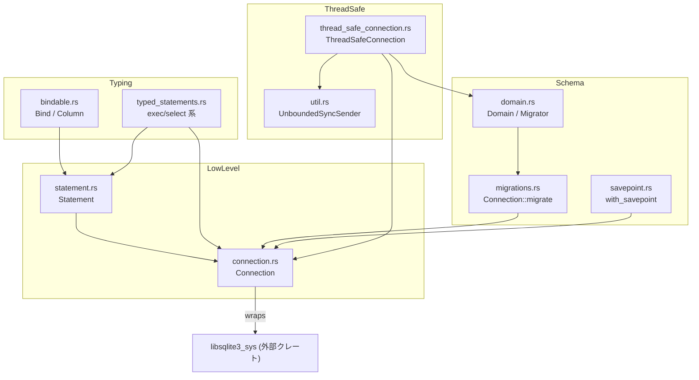

# sqlez/ クレート解説

## 1. ざっくり一言

`sqlez` は、`libsqlite3-sys` を直接利用して SQLite を叩くための **薄いラッパークレート**です。  
型クラス（`Bind`/`Column`）で Rust 型と SQLite の値を対応付け、簡易マイグレーション、セーブポイント、スレッドセーフな接続ラッパなどを提供します。

---

## 2. このモジュールの役割

### 2.1 概要

- このディレクトリは `sqlez` クレートのコード一式です。
- 主な目的は:
  - SQLite C API（`libsqlite3_sys`）を **安全にラップ**した `Connection` / `Statement` API を提供すること
  - Rust の型（`bool`, `String`, `Vec<u8>`, `uuid::Uuid`, パスなど）と SQLite の値を相互変換する **`Bind` / `Column` トレイト**を提供すること
  - アプリケーションごとの **マイグレーション機構**（`Domain`/`Migrator` + `Connection::migrate`）を提供すること
  - 1 DB ファイルあたり 1 本のワーカースレッドなどで書き込みを直列化する **`ThreadSafeConnection`** を提供すること

### 2.2 アーキテクチャ内での位置づけ

`sqlez` クレート内の主要モジュール同士の依存関係は、概ね次のようになっています。



- **中心**は `connection.rs` と `statement.rs` で、SQLite 接続とプリペアドステートメントを担当します。
- `bindable.rs` と `typed_statements.rs` が「型安全な API」を提供する層です。
- `migrations.rs` / `domain.rs` / `savepoint.rs` がスキーマ管理とトランザクション境界を扱います。
- `thread_safe_connection.rs` / `util.rs` が、複数スレッドから安全に扱えるラッパを提供します。

### 2.3 設計上のポイント

コードから読み取れる設計上の特徴をまとめると、次のようになります。

- **低レベルラッパ + 型安全な薄い層**  
  - `Connection` / `Statement` が `libsqlite3_sys` を直接叩く薄い層です。
  - `Bind` / `Column` / `typed_statements` が、その上に乗る高レベル API です。
- **トレイトベースの型マッピング**
  - `Bind` トレイトで「Rust の値 → SQLite のプレースホルダ」へのバインドを統一し、
  - `Column` トレイトで「SQLite の列 → Rust の値」への読み出しを統一しています。
  - `StaticColumnCount` により、1 つの Rust 型が複数カラムを占有するケース（タプルなど）も扱えます。
- **マイグレーションのバージョン管理**
  - マイグレーション自体を DB 内の `migrations` テーブルに保存し、変更検出も行います。
  - 変更が許可されない限り、過去に保存された SQL 文字列と異なるマイグレーションはエラーになります。
- **セーブポイントとリトライによる堅牢化**
  - `with_savepoint` / `with_savepoint_rollback` で局所的なロールバック範囲を定義します。
  - `ThreadSafeConnectionBuilder::build` では、マイグレーションをセーブポイント + リトライで実行します。
- **スレッドセーフな書き込み制御**
  - 各データベース URI ごとに 1 つの書き込みキュー (`WriteQueue`) を用意し、
  - `ThreadSafeConnection::write` による書き込みを、そのキュー経由で **直列化**しています。
  - 実際の SQLite 接続はスレッドローカルに保持しつつ、書き込みだけが専用キューを通る構造です。
- **エラー処理**
  - C API 呼び出し直後に `Connection::last_error` を呼び、`anyhow::Error` としてラップします。
  - 一部のバインド・カラム読み出しは `.with_context` で「どのカラム/インデックスで失敗したか」を付加しています。

---

## 3. 主要な機能一覧

このクレートが提供する主な機能を列挙します。

- SQLite 接続管理
  - `Connection::open_file`, `Connection::open_memory` でファイル / メモリ DB をオープン
  - `Connection::backup_main`, `backup_main_to` によるバックアップ
  - `Connection::sql_has_syntax_error` による SQL の構文チェック
- プリペアドステートメント操作
  - `Statement::prepare` で複数ステートメントを含む SQL もまとめてプリペア
  - `Statement::bind_*` / `column_*` で低レベルなバインド・読み出し
  - `Statement::exec`, `rows`, `row`, `maybe_row` などの高レベル API
- 型安全なバインド・結果取得
  - `Bind` / `Column` / `StaticColumnCount` トレイト
  - 標準的な型への実装（`bool`, 整数各種, `f32`/`f64`, `String`/`Arc<str>`, `Vec<u8>`, `[u8; N]`, `PathBuf`, `Arc<Path>`, `uuid::Uuid` など）
  - `Option<T>`, タプル、配列などの複合型サポート
- 型付きステートメントヘルパ
  - `Connection::exec` / `exec_bound`
  - `Connection::select` / `select_bound`
  - `Connection::select_row` / `select_row_bound`
- マイグレーション機構
  - `Domain` トレイトによるドメインごとのマイグレーション定義
  - `Connection::migrate` によるマイグレーション実行と差分検出
  - 外部キー制約無効化 + 孤児行削除 + `PRAGMA foreign_key_check` による整合性チェック
- セーブポイントユーティリティ
  - `Connection::with_savepoint`
  - `Connection::with_savepoint_rollback`
- スレッドセーフな接続ラッパ
  - `ThreadSafeConnection` と `ThreadSafeConnectionBuilder`
  - DB 初期化クエリ / 接続初期化クエリ（`PRAGMA` など）の実行
  - 書き込みキュー（バックグラウンドスレッド / ミューテックス）での直列化
- ユーティリティ
  - `UnboundedSyncSender<T>` によるスレッドローカルな `Sender` ラッパ（スレッド間送信のため）

---

## 4. 関数・構造体の解説

### 4.1 主な型・トレイト一覧

| 名前 | 種別 | 役割 / 用途 |
|------|------|-------------|
| `Connection` | 構造体 (`connection.rs`) | 生の `sqlite3*` を保持する同期用接続オブジェクトです。ステートメント準備や直接的な SQL 実行、マイグレーションの入口になります。 |
| `Statement<'a>` | 構造体 (`statement.rs`) | `sqlite3_stmt*` の配列を保持するプリペアドステートメントです。複数の SQL 文を 1 つにまとめて扱います。 |
| `StepResult` | 列挙体 | `Statement::step` の結果（`Row` / `Done`）を表します。 |
| `SqlType` | 列挙体 | 列の型（`Text`, `Integer`, `Blob`, `Float`, `Null`）を表します。`Statement::column_type` の戻り値です。 |
| `StaticColumnCount` | トレイト (`bindable.rs`) | 型が結果セット上で占めるカラム数（例: タプルなら複数）を静的に返します。 |
| `Bind` | トレイト | Rust 値をステートメントのプレースホルダにバインドする共通インターフェースです。 |
| `Column` | トレイト | ステートメントの現在行から値を読み出し、Rust 型に変換する共通インターフェースです。 |
| `Domain` | トレイト (`domain.rs`) | アプリケーション側が実装するマイグレーション定義用トレイトです。`NAME` と `MIGRATIONS` を定義します。 |
| `Migrator` | トレイト | `Domain` の組み合わせに対し `migrate(&Connection)` を提供する抽象トレイトです。タプル実装で複数ドメインをまとめてマイグレーション可能です。 |
| `ThreadSafeConnection` | 構造体 | クローン可能・`Send` + `Sync` な接続ラッパです。各スレッドに `Connection` を持ちつつ、書き込みをキューを通じて直列化します。 |
| `ThreadSafeConnectionBuilder<M>` | 構造体 | `ThreadSafeConnection` を構築するときに、マイグレーションや初期化クエリ、書き込みキュー方式を指定するビルダです。 |
| `UnboundedSyncSender<T>` | 構造体 (`util.rs`) | `std::sync::mpsc::Sender<T>` をスレッドローカルに複製して扱うためのラッパです。バックグラウンドスレッドへのキュー挿入に利用されます。 |

主要な型のほとんどは公開 API（`pub`）であり、アプリケーションコードから利用されます。

---

### 4.2 重要なメソッド / 関数の詳細

#### 4.2.1 `Statement::prepare(connection: &Connection, query: T) -> Result<Statement<'_>>`

```rust
impl<'a> Statement<'a> {
    pub fn prepare<T: AsRef<str>>(connection: &'a Connection, query: T) -> Result<Self> {
        // 省略（実装は statement.rs を参照）
    }
}
```

**概要**

- 与えられた SQL 文字列を **1 つ以上の SQLite ステートメント**に分割してプリペアし、そのポインタ群を `Statement` として包みます。
- 文字列中にセミコロン区切りで複数のステートメントがある場合、それぞれを順に `sqlite3_prepare_v2` で準備します。

**主な処理の流れ**

1. `CString::new(query.as_ref())` で SQL を C 文字列に変換します。
2. `remaining_sql`（`&CStr`）をトリムしながらループし、
   - 空文字列 / `";"` のみになったら終了します。
3. 各ループで
   - `sqlite3_prepare_v2` を呼び出し、1 つの `sqlite3_stmt*` と「残りの SQL」へのポインタを取得します。
   - `connection.last_error()` を呼んで C API 呼び出し結果をチェックします。
   - 準備した `raw_statement` を `raw_statements` ベクタに push します。
   - 接続が書き込み不可 (`connection.can_write() == false`) なのに `sqlite3_stmt_readonly` が 0 の場合（書き込みステートメントの場合）は `bail!` でエラーにします。
4. すべてのステートメントを準備し終わったら `Statement` を返します。

**使用例（低レベル API）**

```rust
use sqlez::connection::Connection;
use sqlez::statement::{Statement, StepResult};
use anyhow::Result;

fn low_level_example() -> Result<()> {
    // メモリ上の DB を開く
    let connection = Connection::open_memory(Some("low_level_example"));

    // 2 つの文を含む SQL をプリペアする
    let mut stmt = Statement::prepare(
        &connection,
        "CREATE TABLE t (id INTEGER); INSERT INTO t (id) VALUES (1);",
    )?;

    // すべてのステートメントを順に実行
    while stmt.step()? == StepResult::Row {
        // この例では Row は返らない
    }
    stmt.reset();

    Ok(())
}
```

**エラー / エッジケース**

- SQL が不正（構文エラーなど）の場合
  - `sqlite3_prepare_v2` の後に `connection.last_error()` が `anyhow::Error` を返します。
- 書き込み不可の `Connection` 上で、書き込みステートメントを準備しようとした場合
  - `"Write statement prepared with connection that is not write capable."` というメッセージでエラーになります。
- SQL 文字列が空、またはセミコロンのみの場合
  - `raw_statements` が空の `Statement` が返ります（以後の `step` で `unwrap` によるパニックの可能性があるため、通常はこの状態で使わない前提です）。

**使用上の注意点**

- マイグレーションのように **依存関係のある複数ステートメントをまとめて実行したい場合**は、`Connection::migrate` や `eager_exec` を使う設計になっています（`typed_statements` にも同様の注意書きがあります）。
- `Statement` は `Drop` で `sqlite3_finalize` を呼ぶため、ライフタイムを超えて C レベルのリソースが残ることはありません。

---

#### 4.2.2 `Statement::rows` / `Statement::maybe_row` / `Statement::row`

代表的な結果取得 API をまとめて説明します。

```rust
impl<'a> Statement<'a> {
    pub fn rows<R: Column>(&mut self) -> Result<Vec<R>> { /* ... */ }

    pub fn maybe_row<R: Column>(&mut self) -> Result<Option<R>> { /* ... */ }

    pub fn row<R: Column>(&mut self) -> Result<R> { /* ... */ }
}
```

**概要**

- `rows::<R>`: すべての行を `Vec<R>` として取得します。
- `maybe_row::<R>`: 0 行または 1 行を許容し、0 行なら `Ok(None)`、1 行なら `Ok(Some(R))` を返します。2 行以上はエラーです。
- `row::<R>`: 必ず 1 行だけ返すことを期待し、0 行または 2 行以上ならエラーを返します。

すべて `Column` トレイトを通じて行を Rust 型に変換します。

**主な処理の流れ（`rows` の場合）**

1. 内部で `map` を呼び出し、行ごとにクロージャ `|s| s.column::<R>()` を実行します。
2. `column::<R>` は `R: Column` の `Column::column(statement, start_index)` を呼び出して 1 行分を構築します（複数カラムをまとめて読むことも可）。
3. `step()` が `Row` を返す限りループし、`Vec<R>` に push します。
4. ループ終了後 `reset()` を呼び、ステートメントを再利用可能な状態に戻します。

**使用例**

```rust
use sqlez::connection::Connection;
use anyhow::Result;

fn read_rows_example() -> Result<()> {
    let connection = Connection::open_memory(Some("rows_example"));

    // テーブル作成とデータ投入
    let mut create = connection.exec("CREATE TABLE nums (value INTEGER)")?;
    create()?;
    let mut insert = connection.exec_bound::<i64>("INSERT INTO nums (value) VALUES (?)")?;
    insert(1)?;
    insert(2)?;
    insert(3)?;

    // 低レベル API を直接使って読み出す例
    use sqlez::statement::Statement;
    let mut stmt = Statement::prepare(&connection, "SELECT value FROM nums ORDER BY value")?;
    let values: Vec<i64> = stmt.rows()?;
    assert_eq!(values, vec![1, 2, 3]);

    Ok(())
}
```

**エッジケース**

- `maybe_row`:
  - 0 行の場合: `Ok(None)` を返します。
  - 1 行の場合: `Ok(Some(R))` を返します。
  - 2 行以上の結果がある場合: `"maybe called with a query that returns more than one row."` というエラーになります。
- `row`:
  - 0 行または 2 行以上の場合にエラーになります。

**使用上の注意点**

- `rows` / `row` / `maybe_row` を呼び出した後、`Statement` は自動的に `reset` されるため、同じ `Statement` を再利用して同じクエリを再実行することができます。
- 返り値の型 `R` に対して適切な `Column` 実装が必要です（`bindable.rs` に多くの型が定義されています）。

---

#### 4.2.3 Connection の「型付きステートメント」ヘルパ群

`typed_statements.rs` では、`Connection` に対して次のようなメソッドが追加されています。

- `exec(&self, &str) -> Result<impl FnMut() -> Result<()>>`
- `exec_bound<B: Bind>(&self, &str) -> Result<impl FnMut(B) -> Result<()>>`
- `select<C: Column>(&self, &str) -> Result<impl FnMut() -> Result<Vec<C>>>`
- `select_bound<B: Bind, C: Column>(&self, &str) -> Result<impl FnMut(B) -> Result<Vec<C>>>`
- `select_row<C: Column>(&self, &str) -> Result<impl FnMut() -> Result<Option<C>>>`
- `select_row_bound<B: Bind, C: Column>(&self, &str) -> Result<impl FnMut(B) -> Result<Option<C>>>`

**概要**

- これらは `Statement::prepare` ＋ `Bind` / `Column` の組み合わせを **クロージャに閉じ込めたヘルパ**です。
- 1 回の `prepare` で生成した `Statement` を、クロージャ経由で複数回呼び出せるようにしています。

**典型的な使用例**

```rust
use sqlez::connection::Connection;
use anyhow::Result;

fn typed_api_example() -> Result<()> {
    let connection = Connection::open_memory(Some("typed_api_example"));

    // テーブル作成
    let mut create = connection.exec(
        "CREATE TABLE users (id INTEGER PRIMARY KEY, name TEXT NOT NULL)",
    )?;
    create()?; // 実行

    // バインド付き INSERT
    let mut insert = connection.exec_bound::<(i64, String)>(
        "INSERT INTO users (id, name) VALUES (?, ?)",
    )?;
    insert((1, "Alice".to_string()))?;
    insert((2, "Bob".to_string()))?;

    // 全件取得
    let mut select_all = connection.select::<(i64, String)>(
        "SELECT id, name FROM users ORDER BY id",
    )?;
    let rows = select_all()?;
    assert_eq!(rows.len(), 2);

    // 1 行だけ取得
    let mut select_one = connection.select_row::<String>(
        "SELECT name FROM users WHERE id = 1",
    )?;
    let name = select_one()?.unwrap();
    assert_eq!(name, "Alice".to_string());

    Ok(())
}
```

**内部の動き（共通）**

- 各メソッドで `Statement::prepare(self, query)?` を呼び出し、`Statement` をローカル変数として捕捉したクロージャを返します。
- クロージャ内では
  - `with_bindings(&bindings)?` で `Bind` を通じてパラメータをバインドし、
  - `exec` / `rows` / `maybe_row` などを呼び出します。
- エラー時には `anyhow::Context` でメッセージを追加する場合があります（例: `select_row_bound`）。

**エッジケース / 使用上の注意点**

- **複数ステートメントかつ依存関係のあるクエリ**  
  - これらのメソッドは、複数ステートメントを含むクエリにも使えますが、
  - ドキュメントにある通り、**スキーマ変更などでステートメント同士の依存関係がある場合**は `prepare` の時点で失敗する可能性があります。
  - そのような用途では `Connection::migrate` など「マイグレーション用」の経路を使う前提です。
- バインド値の型 `B` と戻り値の型 `C` には、`Bind` / `Column` 実装がある必要があります。  
  例えばタプル `(String, usize, Vec<u8>)` のような型には、`bindable.rs` 内で実装済みです。

---

#### 4.2.4 `Connection::migrate(domain, migrations, should_allow_migration_change)`

```rust
impl Connection {
    pub fn migrate(
        &self,
        domain: &'static str,
        migrations: &[&'static str],
        should_allow_migration_change: &mut dyn FnMut(usize, &str, &str) -> bool,
    ) -> Result<()> {
        // 実装は migrations.rs を参照
    }
}
```

**概要**

- 指定された `domain` 名と `migrations`（SQL 文字列の配列）に基づいて、DB をマイグレーションします。
- 過去に実行されたマイグレーションの SQL 文を `migrations` テーブルに保存しており、再実行時に **内容が変わっていないか** を検証します。
- マイグレーションは `SAVEPOINT` 内で実行され、必要に応じてロールバックされます。

**引数**

| 引数名 | 型 | 説明 |
|--------|----|------|
| `domain` | `&'static str` | ドメイン名（アプリケーション側の論理名）。`Domain::NAME` と一致させます。 |
| `migrations` | `&[&'static str]` | マイグレーション SQL の配列。インデックスがステップ番号として利用されます。 |
| `should_allow_migration_change` | `&mut dyn FnMut(usize, &str, &str) -> bool` | 既存ステップの SQL が変わっている場合に、許可するかどうかを判断するコールバックです。 |

**内部処理の流れ（簡略）**

1. `with_savepoint("migrating", || { ... })` でセーブポイント内に処理を閉じ込めます。
2. `CREATE TABLE IF NOT EXISTS migrations (...)` を実行し、マイグレーション管理テーブルを用意します。
3. 既存の完了済みマイグレーションを  
   `SELECT domain, step, migration FROM migrations WHERE domain = ? ORDER BY step`  
   で読み出します。
4. `migrations` 引数の各要素（index: `index`, SQL: `migration`）について:
   - `sqlformat::format` で正規化（インデントなど）した上で比較します。
   - `completed_migrations.get(index)` が存在する場合:
     - 保存済み `completed_migration` を同様に `sqlformat` で再フォーマット。
     - 一致すれば「既に実行済み」とみなしてスキップ。
     - 不一致なら `should_allow_migration_change(index, &completed_migration, &migration)` を呼び、`true` ならスキップ、`false` ならエラーを返します。
   - 既存エントリがない場合:
     - `eager_exec(&migration)` で SQL を即時実行します。
     - 成功したら `INSERT INTO migrations (domain, step, migration) VALUES (?, ?, ?)` を実行して履歴に保存します。
5. 一度でもマイグレーションを実行した場合（`did_migrate == true`）:
   - `delete_rows_with_orphaned_foreign_key_references()` で孤児行を削除します。
   - `PRAGMA foreign_key_check;` を実行して整合性を確認します。

**使用例（`Domain` トレイト経由）**

アプリケーション側では通常、直接 `Connection::migrate` を呼ぶのではなく、`Domain` トレイトを実装した型を経由して使います。

```rust
use sqlez::connection::Connection;
use sqlez::domain::Domain;

// アプリケーションのドメインを定義
enum AppDomain {}
impl Domain for AppDomain {
    const NAME: &str = "app";

    const MIGRATIONS: &[&str] = &[
        // ステップ 0
        r#"CREATE TABLE kv (key TEXT PRIMARY KEY, value TEXT NOT NULL) STRICT;"#,
        // ステップ 1
        r#"CREATE INDEX kv_value_idx ON kv(value);"#,
    ];

    fn should_allow_migration_change(_index: usize, _old: &str, _new: &str) -> bool {
        // 通常は false のまま（変更禁止）
        false
    }
}

fn run_migrations(connection: &Connection) -> anyhow::Result<()> {
    // Domain の Migrator 実装経由で migrate を呼び出す
    AppDomain::migrate(connection)
}
```

**エッジケース / 使用上の注意点**

- すでに存在するステップの SQL を変更した場合
  - `should_allow_migration_change` が `false` を返すとエラーになります。
  - この挙動により「過去のマイグレーションを改ざんしていないか」が検出されます。
- `migrations` 配列の途中に新しいステップを挿入する場合
  - インデックス（ステップ番号）がずれるため、過去のステップとの不一致が検出されます。
  - 一般には「末尾に追加する」運用を想定した設計です。
- マイグレーション中は外部キー制約を無効化し、終了後に `delete_rows_with_orphaned_foreign_key_references` と `PRAGMA foreign_key_check` を行うため、マイグレーション中に一時的な不整合があっても許容されます。

---

#### 4.2.5 `Connection::with_savepoint` / `with_savepoint_rollback`

```rust
impl Connection {
    pub fn with_savepoint<R, F>(&self, name: impl AsRef<str>, f: F) -> Result<R>
    where
        F: FnOnce() -> Result<R>,
    { /* ... */ }

    pub fn with_savepoint_rollback<R, F>(
        &self,
        name: impl AsRef<str>,
        f: F,
    ) -> Result<Option<R>>
    where
        F: FnOnce() -> Result<Option<R>>,
    { /* ... */ }
}
```

**概要**

- `with_savepoint`:
  - `SAVEPOINT name` ～ `RELEASE name` の範囲でコールバック `f` を実行します。
  - `f()` が `Err` なら `ROLLBACK TO name; RELEASE name` でロールバックします。
- `with_savepoint_rollback`:
  - `f()` が `Ok(None)` または `Err(_)` の場合はロールバック、
  - `Ok(Some(_))` の場合のみ `RELEASE` してコミットします。

**使用例**

```rust
use sqlez::connection::Connection;
use anyhow::Result;
use indoc::indoc;

fn savepoint_example() -> Result<()> {
    let connection = Connection::open_memory(Some("savepoint_example"));

    // テーブル作成
    connection.exec(indoc! {"
        CREATE TABLE items (name TEXT, qty INTEGER);
    "})?()?;

    // 途中の失敗をセーブポイントで巻き戻す
    connection.with_savepoint("insert_items", || {
        let mut insert = connection.exec_bound::<(String, i64)>(
            "INSERT INTO items (name, qty) VALUES (?, ?)",
        )?;
        insert(("apple".to_string(), 1))?;
        insert(("banana".to_string(), 2))?;

        // ここでエラーを返すと、上記 2 件ともロールバックされる
        anyhow::bail!("something went wrong");
        #[allow(unreachable_code)]
        Ok(())
    })?;

    // ロールバックされているので 0 行
    let mut count = connection.select_row::<i64>("SELECT COUNT(*) FROM items")?;
    assert_eq!(count()?.unwrap(), 0);

    Ok(())
}
```

**使用上の注意点**

- `with_savepoint` / `with_savepoint_rollback` 内部で `exec` を使っているため、セーブポイント名を SQL にそのまま埋め込んでいます。SQL 予約語や特殊文字を含む名前は利用しない前提です。
- 同一コネクション内でネストしたセーブポイントを使う場合も、テストコードのように問題なく動作します。

---

#### 4.2.6 `ThreadSafeConnectionBuilder<M>::build()`

```rust
impl<M: Migrator> ThreadSafeConnectionBuilder<M> {
    pub async fn build(self) -> anyhow::Result<ThreadSafeConnection> {
        // 実装は thread_safe_connection.rs を参照
    }
}
```

**概要**

- `ThreadSafeConnection` を構築し、必要であれば
  - DB 初期化クエリ（`db_initialize_query`）
  - マイグレーション（`M: Migrator`）
  を実行します。
- これらの処理は `ThreadSafeConnection::write` 経由で実行されるため、他の書き込みと同様にシリアライズされます。

**内部処理の流れ（簡略）**

1. `self.connection.initialize_queues(self.write_queue_constructor)`:
   - DB URI ごとの書き込みキュー (`WriteQueue`) を登録します。
   - 指定がなければ `background_thread_queue` を使います。
2. `self.connection.write(move |connection| { ... }).await?`:
   - `write` によりバックグラウンドスレッド（またはロック付き同期キュー）で処理を実行します。
3. `db_initialize_query` がある場合:
   - `connection.exec(db_initialize_query)?()?` を実行します。
   - 失敗した場合は `anyhow::Context` でエラーメッセージが付与されます。
4. 外部キーの有効/無効状態を `PRAGMA foreign_keys` から取得し、一時的に `PRAGMA foreign_keys = OFF` にします。
5. `MIGRATION_RETRIES` 回（定数で 10 回）まで `M::migrate(connection)` を `with_savepoint` の中でリトライします。
6. 外部キーが元々有効だった場合は最後に `PRAGMA foreign_keys = ON` を実行します。
7. マイグレーションが成功すれば `Ok(ThreadSafeConnection)` を返します。

**使用例**

```rust
use sqlez::domain::Domain;
use sqlez::thread_safe_connection::ThreadSafeConnection;
use anyhow::Result;
use indoc::indoc;

// アプリケーションのドメイン
enum AppDomain {}
impl Domain for AppDomain {
    const NAME: &str = "app";
    const MIGRATIONS: &[&str] = &[
        indoc! {"
            CREATE TABLE kv (
                key TEXT PRIMARY KEY,
                value TEXT NOT NULL
            ) STRICT;
        "},
    ];
}

async fn open_thread_safe() -> Result<ThreadSafeConnection> {
    let builder = ThreadSafeConnection::builder::<AppDomain>("app.db", true)
        .with_db_initialization_query("PRAGMA journal_mode=WAL")
        .with_connection_initialize_query(indoc! {"
            PRAGMA foreign_keys=ON;
            PRAGMA busy_timeout=5000;
        "});

    let conn = builder.build().await?;
    Ok(conn)
}
```

**使用上の注意点**

- `build` は `async fn` であり、`smol` など任意の async ランタイムから `.await` する必要があります。
- `db_initialize_query` / `connection_initialize_query` ともに **失敗するとパニックまたはエラー** になる可能性があるため、原則として `PRAGMA` など **決して失敗しないクエリ**を想定しています。

---

#### 4.2.7 `ThreadSafeConnection::write(callback) -> impl Future<Output = T>`

```rust
impl ThreadSafeConnection {
    pub fn write<T: 'static + Send + Sync>(
        &self,
        callback: impl 'static + Send + FnOnce(&Connection) -> T,
    ) -> impl Future<Output = T> {
        // 実装は thread_safe_connection.rs を参照
    }
}
```

**概要**

- 書き込み可能な `Connection` を引数として受け取るコールバックを、**キューを通じて直列実行**します。
- 戻り値 `T` は `Future<Output = T>` を通じて呼び出し元スレッドに返されます（`T` 自体は `Send + Sync` が必要）。

**処理の流れ**

1. グローバルな `QUEUES: LazyLock<RwLock<HashMap<Arc<str>, WriteQueue>>>` から、URI に対応する `WriteQueue` を取得します。
2. `futures::channel::oneshot::channel()` で結果受信用のチャネルを作成します。
3. `write_channel`（`WriteQueue`）に `QueuedWrite`（`FnOnce()`）を投げます。このクロージャは:
   - `thread_safe_connection.deref()` を呼び出してスレッドローカルな `Connection` を取得します。
   - `connection.with_write(|connection| callback(connection))` を実行します（`with_write` の間だけ `can_write() == true` になります）。
   - 結果を `sender.send(result)` で `oneshot` チャネルに送信します。
4. 呼び出し元は `receiver.map(...)` で結果を受け取る Future を得ます。

**使用例（`anyhow::Result<()>` を返す書き込み）**

```rust
use sqlez::thread_safe_connection::ThreadSafeConnection;
use sqlez::connection::Connection;
use anyhow::Result;

async fn write_example(conn: &ThreadSafeConnection) -> Result<()> {
    // クロージャの戻り値型を明示しておくとエラー処理がシンプルになります
    conn.write(|c: &Connection| -> Result<()> {
        // ここは書き込み可能なコンテキスト（with_write 内）
        let mut insert = c.exec_bound::<(String, i64)>(
            "INSERT INTO kv (key, value) VALUES (?, ?)",
        )?;
        insert(("answer".to_string(), 42))?;
        Ok(())
    })
    .await?; // Future<Output = Result<()>> を待つ

    Ok(())
}
```

**エッジケース / 使用上の注意点**

- `callback` は `'static + Send` なので、**ローカル変数への非同期な参照キャプチャ**はできません（所有権を move するなどで対応する必要があります）。
- `ThreadSafeConnection` の `Deref` 実装を通じて直接 `Connection` メソッド（`select`, `exec` など）を呼び出すと、その接続は **読み取り専用** として扱われます。書き込みを行いたい場合は必ず `write` 経由にする必要があります。
- `WriteQueue` の実装により、書き込み処理は
  - デフォルトでは **専用バックグラウンドスレッド**（`background_thread_queue`）上で実行されるか、
  - `locking_queue` を使用した場合は **呼び出しスレッド**上でミューテックスにより直列化されます。

---

## 5. データフロー

ここでは、代表的なシナリオとして

> `ThreadSafeConnectionBuilder` で DB を初期化し、その後 `ThreadSafeConnection::write` でデータを書き込む

までのデータ／制御フローを図示します。

```mermaid
sequenceDiagram
    participant App as アプリコード
    participant Builder as Builder<M>
    participant TSC as ThreadSafeConnection
    participant Q as WriteQueue
    participant Worker as ワーカースレッド
    participant Conn as Connection

    App->>Builder: builder::<Domain>("app.db", true)
    App->>Builder: .with_db_initialization_query(...)
    App->>Builder: .with_connection_initialize_query(...)
    App->>Builder: build().await
    Builder->>TSC: initialize_queues(...)
    Builder->>TSC: write(|conn| { init + migrate })
    TSC->>Q: enqueue(QueuedWrite)
    Q->>Worker: queued_write()
    Worker->>TSC: deref() // ThreadLocal<Connection> から取得
    TSC->>Conn: create_connection(...)

    Worker->>Conn: with_write(|c| { db_init; migrate })
    Conn->>Conn: exec("PRAGMA ...")
    Conn->>Conn: migrate(domain, MIGRATIONS, ...)
    Conn-->>Worker: Result<()>
    Worker-->>App: Result<ThreadSafeConnection>

    App->>TSC: write(|conn| { INSERT ... })
    TSC->>Q: enqueue(QueuedWrite)
    Q->>Worker: queued_write()
    Worker->>TSC: deref() // 同じ URI の Connection を取得
    TSC->>Conn: with_write(|c| { INSERT ... })
    Conn-->>Worker: T
    Worker-->>App: T（Future の出力）
```

**要点**

- `ThreadSafeConnectionBuilder::build` の時点で
  - 書き込みキューの構築
  - DB 初期化クエリの実行
  - `Domain` を通じたマイグレーション
  が一度だけ行われます。
- 以降の `write` 呼び出しはすべて同じ `WriteQueue` を通じて直列化され、
  それぞれの書き込み処理は `Connection::with_write` によって「書き込み可能な状態」に切り替えられます。
- 読み取り（`select`, `select_row` など）は `ThreadSafeConnection` のデリファレンスを通じて直接 `Connection` に対して行われ、書き込みフラグを変更しないため、読み取り専用のまま保持されます。

---

## 6. 使い方（How to Use）

### 6.1 基本的な使用方法

ここでは次の 2 段階で説明します。

1. シンプルな `Connection` を直接使う方法（単スレッド / テスト向き）
2. `Domain` + `ThreadSafeConnection` を使う方法（本番向き）

#### 6.1.1 単純な Connection の利用例

```rust
use sqlez::connection::Connection;              // Connection 型をインポート
use anyhow::Result;

fn main() -> Result<()> {
    // メモリ上の SQLite DB を開く（同じ名前を使うと他接続と共有される）
    let connection = Connection::open_memory(Some("basic_example"));

    // 1. テーブル作成クエリを準備
    let mut create = connection.exec(
        "CREATE TABLE users (id INTEGER PRIMARY KEY, name TEXT NOT NULL)",
    )?;
    create()?;                                   // 実行（Result<()>）

    // 2. バインド付き INSERT 文を準備
    let mut insert = connection.exec_bound::<(i64, String)>(
        "INSERT INTO users (id, name) VALUES (?, ?)",
    )?;
    insert((1, "Alice".to_string()))?;          // 1 行目を挿入
    insert((2, "Bob".to_string()))?;            // 2 行目を挿入

    // 3. 1 行だけ取得する SELECT 文を準備
    let mut select_row = connection.select_row::<(i64, String)>(
        "SELECT id, name FROM users WHERE id = 1",
    )?;
    let row = select_row()?;                    // Result<Option<(i64, String)>>

    assert_eq!(row, Some((1, "Alice".to_string())));

    Ok(())
}
```

- ここでは `Bind` / `Column` の実装を意識せずに、タプル `(i64, String)` をそのまま使っています。
- `exec` / `exec_bound` / `select` / `select_row` は `Statement` を内部でキャプチャしているため、クエリを何度も再利用できます。

#### 6.1.2 Domain + ThreadSafeConnection の利用例

非同期環境で、マイグレーション付きのスレッドセーフ接続を用いる例です。

```rust
use sqlez::domain::Domain;                       // Domain トレイト
use sqlez::thread_safe_connection::ThreadSafeConnection;
use sqlez::connection::Connection;
use anyhow::Result;
use indoc::indoc;

// アプリケーションのドメイン
enum AppDomain {}
impl Domain for AppDomain {
    const NAME: &str = "app";
    const MIGRATIONS: &[&str] = &[
        indoc! {"
            CREATE TABLE kv (
                key   TEXT PRIMARY KEY,
                value TEXT NOT NULL
            ) STRICT;
        "},
    ];
}

async fn open_db() -> Result<ThreadSafeConnection> {
    let builder = ThreadSafeConnection::builder::<AppDomain>("app.db", true)
        .with_db_initialization_query("PRAGMA journal_mode=WAL") // DB ファイルに対する一度きりの初期化
        .with_connection_initialize_query(indoc! {               // 各 Connection オープン時に実行される PRAGMA 群
            "PRAGMA foreign_keys=ON;
             PRAGMA busy_timeout=5000;"
        });

    let conn = builder.build().await?;                           // マイグレーションもここで実行
    Ok(conn)
}

async fn write_and_read_example(conn: &ThreadSafeConnection) -> Result<()> {
    // 書き込み（シリアライズされる）
    conn.write(|c: &Connection| -> Result<()> {
        let mut insert = c.exec_bound::<(String, String)>(
            "INSERT INTO kv (key, value) VALUES (?, ?)",
        )?;
        insert(("answer".to_string(), "42".to_string()))?;
        Ok(())
    })
    .await?;                                                      // Future<Output = Result<()>> を待つ

    // 読み取り（読み取り専用 Connection を直接利用）
    let mut select = conn.select_row::<String>(
        "SELECT value FROM kv WHERE key = 'answer'",
    )?;
    let value = select()?.unwrap();
    assert_eq!(value, "42".to_string());

    Ok(())
}
```

- 書き込みは必ず `ThreadSafeConnection::write` を通して行います。
- 読み取りは `ThreadSafeConnection` を `Deref` した `Connection` に対して直接 `select` 等を呼びます。

---

### 6.2 よくある使用パターン

1. **テスト用のメモリ DB**
   - `Connection::open_memory(Some("test_name"))` を使うと、同名の接続間でデータを共有できます。
   - テストコードには既にこのパターンが多用されています。

2. **複数ドメインのマイグレーション**
   - `domain.rs` の `Migrator` 実装はタプルに対しても用意されているため、複数ドメインをまとめてマイグレーションできます。

   ```rust
   use sqlez::domain::{Domain, Migrator};
   use sqlez::connection::Connection;

   enum DomainA {}
   enum DomainB {}

   impl Domain for DomainA { /* NAME, MIGRATIONS を定義 */ }
   impl Domain for DomainB { /* 同上 */ }

   fn migrate_all(conn: &Connection) -> anyhow::Result<()> {
       <(DomainA, DomainB) as Migrator>::migrate(conn)
   }
   ```

3. **書き込みキューのカスタマイズ**
   - デフォルトはバックグラウンドスレッドですが、同一スレッド内でロックを使って直列化したい場合は `locking_queue` を使えます。

   ```rust
   use sqlez::thread_safe_connection::{ThreadSafeConnection, locking_queue};

   let builder = ThreadSafeConnection::builder::<AppDomain>("app.db", true)
       .with_write_queue_constructor(locking_queue());
   ```

4. **カスタム型への Bind / Column 実装**

   ```rust
   use sqlez::bindable::{StaticColumnCount, Bind, Column};
   use sqlez::statement::Statement;
   use anyhow::Result;

   #[derive(Debug, Clone)]
   struct UserId(u64);

   impl StaticColumnCount for UserId {}                         // カラム数は 1

   impl Bind for UserId {
       fn bind(&self, stmt: &Statement, start: i32) -> Result<i32> {
           self.0.bind(stmt, start)                             // 既存の u64 実装を再利用
       }
   }

   impl Column for UserId {
       fn column(stmt: &mut Statement, start: i32) -> Result<(Self, i32)> {
           let (raw, next) = u64::column(stmt, start)?;         // u64 の Column 実装を再利用
           Ok((UserId(raw), next))
       }
   }
   ```

   こうしておくと、`UserId` を直接バインド・取得できるようになります。

---

### 6.3 使用上の注意点（まとめ）

- **書き込みと読み取りの分離**
  - `Connection` には内部に `write: RefCell<bool>` があり、`with_write` の間だけ `true` になります。
  - `Statement::prepare` はこのフラグと `sqlite3_stmt_readonly` を見て、「読み取り専用接続で書き込みステートメントを作ろうとしていないか」をチェックします。
  - `ThreadSafeConnection` 経由で書き込む場合は、必ず `write` メソッドを使う必要があります。
- **`u64` などの整数型と SQLite の型**
  - SQLite の整数は 64bit 符号付き（`i64`）です。
  - `u64` や `usize` の `Bind` 実装は `as i64` で単純変換しているため、**2^63 以上の値は正しく扱えません**。
- **`Option<T>` と複数カラム型**
  - `Option<T>` の `StaticColumnCount` は `T` と同じカラム数を返します。
  - `Column` 実装は「先頭カラムが `NULL` なら None、それ以外なら `Some(T)`」という判定をしているため、`T` が複数カラムを占有する場合、**先頭カラムだけが `NULL` かどうか**で判定されます。
- **パスの保存形式**
  - `&Path` / `PathBuf` / `Arc<Path>` は BLOB として保存・読み出ししています。
  - 文字コードや OS 依存のバイト列をそのまま保存する設計のため、他環境との互換性には注意が必要です。
- **マイグレーションの変更**
  - 過去に実行済みのステップの SQL を変更すると、基本的にはエラーとして扱われます。
  - 特別な事情があり変更を許したい場合は、
    - `Domain::should_allow_migration_change` をオーバーライドするか、
    - `Connection::migrate` に渡すコールバックで `true` を返す必要があります。
- **複数ステートメントの typed API 利用**
  - `exec` や `select` などの typed API は、ドキュメントの通り「スキーマ変更を含む複数ステートメント」を扱うのには向きません。
  - その場合は `Connection::migrate` または `eager_exec` の使用が前提とされています。

---

## 7. 関連ファイル

| パス | 役割 / 関係 |
|------|------------|
| `sqlez/Cargo.toml` | クレート名・バージョン・ライセンス・依存クレート（`libsqlite3-sys`, `anyhow`, `sqlformat`, `smol`, `uuid` など）の定義です。 |
| `sqlez/src/lib.rs` | クレートのルートモジュール。`bindable`, `connection`, `domain`, `migrations`, `savepoint`, `statement`, `thread_safe_connection`, `typed_statements` を公開し、`anyhow` を再エクスポートします。 |
| `sqlez/src/connection.rs` | `Connection` 構造体の定義と、SQLite 接続のオープン、バックアップ、エラーハンドリング、構文チェック (`sql_has_syntax_error`) などの実装があります。 |
| `sqlez/src/statement.rs` | `Statement<'a>` 構造体と、プリペアドステートメントの準備・バインド・実行・行取得 (`rows`, `row`, `maybe_row`) の低レベル API が定義されています。 |
| `sqlez/src/bindable.rs` | `StaticColumnCount`, `Bind`, `Column` トレイトと、多数の組み込み型（数値・文字列・バイト列・パス・UUID・タプルなど）への実装が含まれます。型安全なバインド／結果取得の中核です。 |
| `sqlez/src/typed_statements.rs` | `Connection` に対する高レベルヘルパメソッド（`exec`, `exec_bound`, `select`, `select_row` など）を提供するモジュールです。`Statement` と `Bind` / `Column` を内部で利用します。 |
| `sqlez/src/migrations.rs` | `Connection::migrate` と関連するヘルパ（`eager_exec`, `delete_rows_with_orphaned_foreign_key_references`）の実装ファイルです。マイグレーションテーブル管理もここに含まれます。 |
| `sqlez/src/domain.rs` | アプリケーション側が実装する `Domain` トレイトと、`Domain` から `Migrator` へのブリッジ、および複数ドメイン向けのタプル実装が定義されています。 |
| `sqlez/src/savepoint.rs` | `Connection` に対する `with_savepoint` / `with_savepoint_rollback` の実装です。部分的なトランザクションロールバックを簡便に扱うためのユーティリティです。 |
| `sqlez/src/thread_safe_connection.rs` | `ThreadSafeConnection` とそのビルダ、書き込みキュー（背景スレッド or ミューテックス）など、スレッドセーフな接続管理を提供します。マイグレーションのリトライロジックも含まれます。 |
| `sqlez/src/util.rs` | `UnboundedSyncSender<T>` の実装ファイルです。`ThreadSafeConnection` のバックグラウンドスレッドへのキューイングで利用されています。 |

この構成を踏まえると、用途に応じて次の入口を見るのが分かりやすいです。

- **単純な DB 操作**: `connection.rs` + `typed_statements.rs`
- **マイグレーション関連**: `domain.rs` + `migrations.rs`
- **スレッドセーフな利用**: `thread_safe_connection.rs`
- **型変換の拡張**: `bindable.rs`（`Bind` / `Column` の実装を追加）
