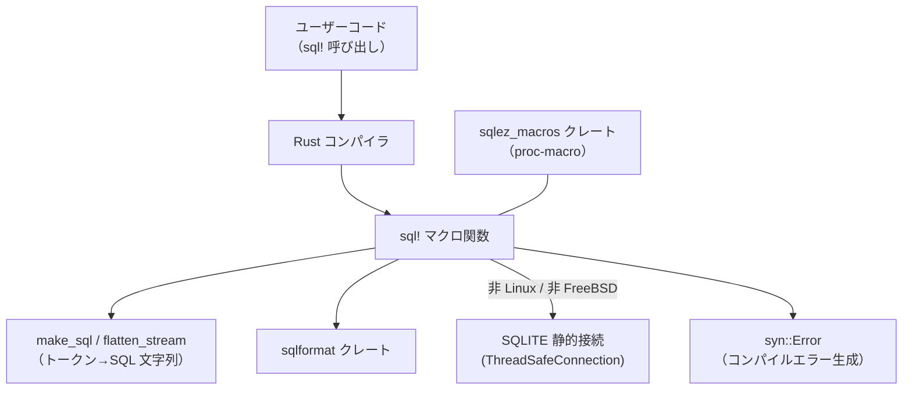
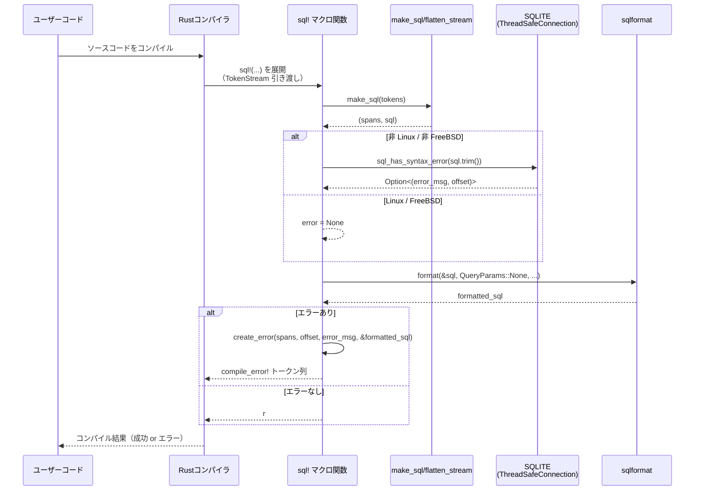

# sqlez_macros/ ディレクトリ解説

## 0. ざっくり一言

`sqlez_macros` は、SQL 文を受け取って **コンパイル時にフォーマットし、（一部環境では）SQLite を使って構文チェックする `sql!` プロシージャルマクロ**を提供するクレートです。

---

## 1. このモジュールの役割

### 1.1 概要

- このクレートは、アプリケーションコード中に埋め込まれた SQL 文を扱いやすくするために存在します。
- 主な機能は、`sql!` マクロで受け取ったトークン列から SQL 文字列を組み立て、
  - 必要に応じて SQLite で構文チェックし、
  - 見やすい形にフォーマットした **文字列リテラル** に展開することです。
- 構文エラーが見つかった場合は、**コンパイルエラーとしてフィードバック**します（非 Linux / 非 FreeBSD 環境）。

### 1.2 アーキテクチャ内での位置づけ

このクレートは、ワークスペース内の `sqlez` クレートと組み合わされて動作します。依存関係の概要は次のとおりです。

- ユーザーコード → `sql!` マクロ（本クレート）
- `sql!` マクロ内部
  - トークン列の整形: `make_sql` / `flatten_stream`
  - SQL フォーマット: 外部クレート `sqlformat`
  - 構文チェック（非 Linux / 非 FreeBSD）: 外部クレート `sqlez` の `thread_safe_connection::ThreadSafeConnection`
  - エラー生成: `syn::Error` を使ったコンパイルエラー生成

Mermaid で表すと次のようになります。



### 1.3 設計上のポイント

コードから読み取れる設計上の特徴は次のとおりです。

- **責務の分割**
  - マクロ本体 (`sql`) は、全体の流れ（組み立て → チェック → フォーマット → 結果 or エラー生成）を担います。
  - トークン列から SQL 文字列と位置情報を作る処理は `make_sql` / `flatten_stream` に分離されています。
  - エラー位置の特定とコンパイルエラー生成は `create_error` に分離されています。
- **状態管理**
  - SQLite 接続は、非 Linux / 非 FreeBSD 環境では `static LazyLock<ThreadSafeConnection>` として 1 つだけ保持し、複数回のマクロ呼び出しで再利用しています。
  - それ以外の処理は、基本的に関数内ローカルなデータで状態を持たない構造です。
- **エラーハンドリング**
  - SQL 構文エラーは、`syn::Error::new(...).into_compile_error()` を通じて **コンパイルエラー**として報告します。
  - マクロの成功時は `format!(...)` → `.parse().unwrap()` で `TokenStream` を生成しており、
    この `.unwrap()` により、生成したソースが Rust 的に不正な場合はパニックしうる実装になっています。
- **プラットフォーム依存の挙動**
  - `#[cfg(not(any(target_os = "linux", target_os = "freebsd")))]` により、
    **Linux / FreeBSD では構文チェックを行わずフォーマットのみ**を行います。
  - 非 Linux / 非 FreeBSD では、コンパイル時に SQLite を通じた構文チェックが有効になります。

---

## 2. 主要な機能一覧

このディレクトリ（クレート）が提供する主な機能は次のとおりです。

- `sql!` マクロ:  
  トークン列から SQL 文字列を構成し、（環境に応じて）SQLite で構文チェックし、フォーマットした文字列リテラルに展開する。
- SQL 文字列の構築:  
  `make_sql` / `flatten_stream` により、トークン列から SQL のテキストと、そのテキスト中のオフセットと元トークンの `Span` の対応関係を作る。
- エラー位置の特定とコンパイルエラー生成:  
  SQLite から返されたバイトオフセットを `Span` に対応付け、適切な位置にコンパイルエラーを出す (`create_error`)。
- 括弧などグループトークンの正規化:  
  `open_delimiter` / `close_delimiter` により、グループの前後にスペース入りの括弧文字列を挿入し、トークン列から文字列化する際の曖昧さを避ける。

---

## 3. 公開 API と詳細解説

### 3.1 型一覧（構造体・列挙体など）

このファイル内で定義されている、外部的に重要な型（あるいは静的値）は次のとおりです。

| 名前 | 種別 | 役割 / 用途 |
|------|------|-------------|
| `SQLITE` | `static LazyLock<sqlez::thread_safe_connection::ThreadSafeConnection>`（非 Linux / 非 FreeBSD でのみ定義） | コンパイル時の SQL 構文チェックに使用する SQLite 接続を、遅延初期化されたグローバルとして保持する。 |

`ThreadSafeConnection` 型自体の定義は `sqlez` クレート側にあり、このチャンクには登場しません。名前から、スレッドセーフな SQLite 接続を表すものであると考えられますが、詳細な挙動や API はコードからは分かりません。

### 3.2 関数詳細（最大 7 件）

#### `sql(tokens: TokenStream) -> TokenStream`

**概要**

- 本クレートが提供するメインの **プロシージャルマクロ**です。
- マクロ引数として渡された `TokenStream` から SQL テキストを生成し、
  - （非 Linux / 非 FreeBSD）では SQLite による構文チェックを行い、
  - `sqlformat` で整形した SQL を生文字列リテラル `r#"..."#` として展開します。
- 構文エラーがあれば `compile_error!` 相当のトークン列を返します。

**引数**

| 引数名 | 型 | 説明 |
|--------|----|------|
| `tokens` | `proc_macro::TokenStream` | マクロ呼び出し部（`sql!(...)` 内）のトークン列です。SQL 文に相当する部分が含まれます。 |

**戻り値**

- `proc_macro::TokenStream`  
  成功時は、`r#"..."#` 形式の生文字列リテラル 1 個からなるトークン列です。  
  利用側から見ると、`&'static str` 型の文字列リテラルとして振る舞います。  
  構文エラー時は、`syn::Error::into_compile_error()` によるコンパイルエラー式に展開されます。

**内部処理の流れ**

1. `make_sql(tokens)` を呼び出し、  
   - SQL テキスト文字列 `sql` と、  
   - そのテキスト中の各位置（バイトオフセット）と元トークンの `Span` を対応付けたベクタ `spans`  
   を作ります。
2. 非 Linux / 非 FreeBSD の場合のみ、`SQLITE.sql_has_syntax_error(sql.trim())` を呼び出し、  
   構文エラーの有無を `Option<(String, usize)>` として受け取ります。  
   - `String`: エラーメッセージ  
   - `usize`: エラー位置のバイトオフセット
3. Linux / FreeBSD の場合は、構文チェックを行わず `error: Option<(String, usize)> = None` とします。
4. `sqlformat::format(&sql, &sqlformat::QueryParams::None, Default::default())` を呼び出し、  
   SQL テキストを整形した文字列 `formatted_sql` を取得します。
5. `error` が `Some((error, error_offset))` の場合:
   - `create_error(spans, error_offset, error, &formatted_sql)` を呼び出し、  
     コンパイルエラーを表す `TokenStream` を返します。
6. `error` が `None` の場合:
   - `format!("r#\"{}\"#", &formatted_sql)` で生文字列リテラルのソースコードを組み立て、
   - `.parse().unwrap()` で `TokenStream` に変換して返します。

**Examples（使用例）**

他クレートから `sql!` を呼び出して、整形済み SQL の `&'static str` を得る例です。

```rust
// Cargo.toml で以下のように依存を追加している前提:
// [dependencies]
// sqlez_macros = { path = "../sqlez_macros" }

fn main() {                                                   // エントリポイント
    // sql! マクロで SQL 文を指定する                       // マクロ呼び出し
    let query: &str = sqlez_macros::sql!(                     // 展開後は &str 型のリテラル
        SELECT id, name                                       // SQL 本文（複数行でも可）
        FROM users
        WHERE id = 1
    );

    println!("query = {query}");                              // 整形された SQL が出力される
}
```

非 Linux / 非 FreeBSD 環境で、構文エラーのある SQL を書いた場合は、コンパイルエラーになります。

```rust
fn main() {
    // 例えば FROM が抜けているなど、明らかな構文エラー
    let _ = sqlez_macros::sql!(
        SELECT id, name users  -- "FROM" が無いと仮定
    ); // コンパイル時に "Sql Error: ..." を含むエラーが発生する
}
```

（実際のエラーメッセージの文言や位置は、`sqlez` クレート側の `sql_has_syntax_error` の実装と SQLite に依存します。）

**Errors / Panics**

- 非 Linux / 非 FreeBSD 環境:
  - `SQLITE.sql_has_syntax_error(...)` が `Some((msg, offset))` を返した場合、  
    `create_error` によりコンパイルエラー（`compile_error!` に相当）となります。
- 全環境共通:
  - `format!("r#\"{}\"#", &formatted_sql).parse().unwrap()` で `.unwrap()` を使用しているため、  
    生成された文字列が Rust のトークン列として不正な場合（例: 生文字列リテラルとして閉じ方に問題がある場合など）、  
    マクロ展開中にパニックする可能性があります。

**Edge cases（エッジケース）**

- 入力トークン列が空の場合:
  - `make_sql` により空文字列の SQL が生成されます。  
    その後の挙動（構文チェックの結果など）は `sqlez` / SQLite 側の実装に依存します。
- Linux / FreeBSD 環境:
  - 構文チェックは一切行われず、常に `error = None` として扱われます。
  - したがって、構文が不正な SQL でも、マクロ自体はコンパイルエラーを発生させません。
- 非 Linux / 非 FreeBSD 環境で、`error_offset` が `spans` に存在しない（全てのオフセットより大きい）場合:
  - `create_error` 内で該当 `Span` が見つからず、`Span::call_site()` が使われます。  
    つまり、マクロ呼び出し位置全体に対してエラーが紐づきます。

**使用上の注意点**

- このマクロは **コンパイル時に SQLite を起動・使用**します（非 Linux / 非 FreeBSD）。  
  そのため、大量の SQL をマクロで処理するとコンパイル時間が伸びる可能性があります。
- Linux / FreeBSD では構文チェックが行われないことに注意が必要です。  
  この場合、構文エラーは実行時にのみ発覚する可能性があります。
- 展開結果は単なる `&'static str` のリテラルであり、プレースホルダやバインドはこのマクロの範囲外です。

---

#### `create_error(spans: Vec<(usize, Span)>, error_offset: usize, error: String, formatted_sql: &String) -> TokenStream`

**概要**

- SQLite から返されたエラー位置（バイトオフセット）をもとに、  
  最も近い `Span` を求め、`syn::Error` を使ってコンパイルエラー用の `TokenStream` を生成する関数です。

**引数**

| 引数名 | 型 | 説明 |
|--------|----|------|
| `spans` | `Vec<(usize, Span)>` | `make_sql` が生成した「SQL テキストの末尾オフセット」と「元トークンの `Span`」のペア一覧です。 |
| `error_offset` | `usize` | SQLite 側が報告したエラー位置のバイトオフセットです。 |
| `error` | `String` | エラーメッセージ文字列です。 |
| `formatted_sql` | `&String` | 整形済み SQL テキストです。エラーメッセージ内に含められます。 |

**戻り値**

- `TokenStream`  
  `syn::Error::into_compile_error()` により生成された、`compile_error!` 相当のトークン列です。

**内部処理の流れ**

1. `spans.into_iter()` で `(offset, span)` の列挙を開始します。
2. `.skip_while(|(offset, _)| offset <= &error_offset)` により、  
   エラー位置以下のオフセットをスキップし、**最初に `error_offset` より大きいオフセット**に対応する `Span` を取り出します。
3. 見つかった `Span` を `error_span` とし、見つからなかった場合は `Span::call_site()` を使います。
4. `"Sql Error: {}\nFor Query: {}"` というフォーマットで `error_text` を組み立てます。
5. `syn::Error::new(error_span.into(), error_text).into_compile_error()` を `TokenStream::from(...)` で包んで返します。

**Examples（使用例）**

この関数は内部専用で、直接呼び出されることは想定されていません。  
`sql` マクロ内から、構文エラーが発生した場合にのみ利用されます。

**Errors / Panics**

- `spans` が空であってもパニックはしません。その場合 `Span::call_site()` が使われます。
- `error` や `formatted_sql` の内容に依存した例外的な挙動は、コード上はありません。

**Edge cases（エッジケース）**

- `error_offset` が最初のトークンよりも小さい場合:
  - `skip_while` がすぐに終了し、最初の `Span` が `error_span` として使われます。
- `error_offset` が全ての `offset` より大きい場合:
  - イテレータから `Span` が得られず、`Span::call_site()` が使用されます。

**使用上の注意点**

- `spans` 内のオフセットは「トークン末尾位置」で管理されており、  
  エラー位置がトークン中間にあっても、次のトークンの位置に紐づく可能性があります。
- エラーメッセージには **整形済み SQL (`formatted_sql`) が埋め込まれる**ため、  
  元の書き方と多少異なるレイアウトで表示されます。

---

#### `make_sql(tokens: TokenStream) -> (Vec<(usize, Span)>, String)`

**概要**

- マクロに渡されたトークン列から、SQL テキストと各トークンの末尾オフセットと `Span` の対応表を作る関数です。
- この関数の結果を使って、後続の構文チェックやエラー位置特定を行います。

**引数**

| 引数名 | 型 | 説明 |
|--------|----|------|
| `tokens` | `TokenStream` | `sql!` マクロに渡された生のトークン列です。 |

**戻り値**

- `(Vec<(usize, Span)>, String)` のタプル
  - `Vec<(usize, Span)>`: SQL 文字列中の「現在の長さ（バイト数）」と、それに対応するトークンの `Span` のペア一覧です。
  - `String`: トークン列から構築された SQL テキストです。

**内部処理の流れ**

1. 空の `sql_tokens: Vec<(String, Span)>` を用意します。
2. `flatten_stream(tokens, &mut sql_tokens)` を呼び出し、  
   各トークン（およびグループの開閉）を文字列と `Span` のペアとしてフラット化します。
3. 空の `spans: Vec<(usize, Span)>` と空文字列 `sql` を用意します。
4. `sql_tokens` を順にたどりながら、
   - `sql.push_str(&token_text)` でテキストを連結し、
   - `spans.push((sql.len(), span))` で「現在の文字列長」と `Span` を記録します。
5. `(spans, sql)` を返します。

**Examples（使用例）**

- この関数も内部用で、直接呼び出されません。
- `sql` マクロの動作を理解する際の補助としての関数です。

**Errors / Panics**

- コード上、この関数内でパニックを引き起こす処理は見当たりません。
- `flatten_stream` からの入力が不正であっても（`TokenStream` 自体が不正な場合など）、  
  そのようなケースは通常コンパイラ側で検出されます。

**Edge cases（エッジケース）**

- トークン列が空:
  - `sql_tokens` は空のままになり、結果として `spans` も空、`sql` は空文字列になります。
- 非 ASCII 文字を含む SQL:
  - `sql.len()` はバイト数であり、UTF-8 のマルチバイト文字を含む場合もバイトオフセットとして扱われます。  
    SQLite のエラー位置もバイトオフセットで返される想定のため、整合性を取る目的と考えられます。

**使用上の注意点**

- SQL テキスト中のオフセットは「`flatten_stream` で生成した文字列」に基づいています。  
  元のソースコードの見た目（スペースの数など）とは異なる可能性があります。

---

#### `flatten_stream(tokens: TokenStream, result: &mut Vec<(String, Span)>)`

**概要**

- `TokenStream` に含まれる `TokenTree`（グループ、識別子、その他リーフ）を再帰的に走査し、  
  **括弧や識別子の周囲にスペースを挿入した文字列列**に変換する関数です。
- これにより、`(tokens)` と `( token )` のような表記ゆれを吸収し、  
  SQLite のバイトオフセットと対応させやすくしています。

**引数**

| 引数名 | 型 | 説明 |
|--------|----|------|
| `tokens` | `TokenStream` | フラット化対象のトークン列です。 |
| `result` | `&mut Vec<(String, Span)>` | 生成された `(文字列表現, Span)` のペアが詰められる可変ベクタです。 |

**戻り値**

- なし（`result` に出力を書き込みます）。

**内部処理の流れ**

1. `tokens.into_iter()` で各 `TokenTree` を列挙します。
2. 各トークンに対して `match` で分岐します。
   - `TokenTree::Group(group)` の場合:
     1. `open_delimiter(group.delimiter())` で開き括弧の文字列を生成し、`group.span()` とともに `result` に追加します。
     2. `flatten_stream(group.stream(), result)` を再帰呼び出しし、グループ内のトークンをフラット化します。
     3. `close_delimiter(group.delimiter())` で閉じ括弧の文字列を生成し、`group.span()` とともに `result` に追加します。
   - `TokenTree::Ident(ident)` の場合:
     1. `format!("{} ", ident)` で識別子の後ろにスペースを 1 つ付け、`ident.span()` とともに `result` に追加します。
   - それ以外のトークン（リテラル、記号など）の場合:
     1. `leaf_tree.to_string()` で文字列化し、そのまま `result` に追加します。

**Examples（使用例）**

- 直接呼び出すことは想定されていませんが、イメージとしては次のような変換を行います（簡略化した例）:

```text
入力トークン: (SELECT * FROM users)
↓
flatten_stream による文字列列:
["( ", "SELECT ", "*", "FROM ", "users", " ) "]
```

**Errors / Panics**

- この関数内に明示的なパニック要因はありません。

**Edge cases（エッジケース）**

- グループのデリミタが `Delimiter::None` の場合:
  - `open_delimiter` / `close_delimiter` は空文字列を返すため、括弧文字は追加されません。
- 識別子以外のトークン（例えば文字列リテラル `"foo"`）には、追加のスペースを付けていません。  
  そのため、識別子と他のトークンで空白の扱いが異なる点に注意が必要です。

**使用上の注意点**

- この関数の出力は、そのまま最終的な SQL として使われる前提になっています。  
  スペースの入れ方が SQL 文の解釈に影響しないように設計されていますが、  
  詳細な整形は最終的に `sqlformat` に委ねられています。

---

#### `open_delimiter(delimiter: Delimiter) -> String`

**概要**

- `proc_macro::Delimiter`（グループの区切り記号）に対応する **開き側の文字列**を生成する関数です。
- 括弧類の後ろにスペースを入れた文字列を返します。

**引数**

| 引数名 | 型 | 説明 |
|--------|----|------|
| `delimiter` | `Delimiter` | グループのデリミタ種別（Parenthesis / Brace / Bracket / None）です。 |

**戻り値**

- `String`  
  デリミタに応じた開き側の文字列です。コード上では次の対応が定義されています。

  - `Delimiter::Parenthesis` → `"( "`  
  - `Delimiter::Brace` → `"[ "`  
  - `Delimiter::Bracket` → `"{ "`  
  - `Delimiter::None` → `""`（空文字列）

  実際にどの括弧記号を SQL 中で利用するかは、`TokenStream` 内のトークン構造と用途に依存します。

**内部処理の流れ**

- `match delimiter { ... }` による単純な分岐です。

**Examples（使用例）**

この関数も内部でのみ使用され、`flatten_stream` から呼び出されます。

**Errors / Panics**

- ありません（全ての `Delimiter` 列挙値を網羅しています）。

**Edge cases（エッジケース）**

- `Delimiter::None` の場合は空文字列となり、グループの開き記号は挿入されません。

**使用上の注意点**

- `Delimiter` と実際の括弧文字との対応関係は、コードに書かれているとおりです。  
  どのデリミタがどの SQL 構文に対応するかは、この関数の外側（マクロの利用方法）に依存します。

---

#### `close_delimiter(delimiter: Delimiter) -> String`

**概要**

- `open_delimiter` と対になる関数で、`Delimiter` に対応する **閉じ側の文字列**を生成します。
- 括弧類の前後にスペースを含む文字列を返します。

**引数**

| 引数名 | 型 | 説明 |
|--------|----|------|
| `delimiter` | `Delimiter` | グループのデリミタ種別です。 |

**戻り値**

- `String`  
  デリミタに応じた閉じ側の文字列です。コード上では次の対応が定義されています。

  - `Delimiter::Parenthesis` → `" ) "`  
  - `Delimiter::Brace` → `" ] "`  
  - `Delimiter::Bracket` → `" } "`  
  - `Delimiter::None` → `""`（空文字列）

**内部処理の流れ**

- `match delimiter { ... }` による単純な分岐です。

**Examples（使用例）**

- `flatten_stream` 内でグループ処理の最後に呼び出されます。

**Errors / Panics**

- ありません。

**Edge cases（エッジケース）**

- `Delimiter::None` の場合は空文字列を返し、閉じ記号は追加されません。

**使用上の注意点**

- `open_delimiter` と組み合わせて使うことで、グループ全体を括弧で囲む表現になります。  
  括弧の種類と SQL 文の構造との対応は、利用パターンに依存します。

---

### 3.3 その他の関数

このファイルには、上記で解説した以外の関数や公開 API はありません。

---

## 4. データフロー

ここでは、ユーザーコードが `sql!` マクロを呼び出してから、最終的にコンパイル結果が得られるまでの代表的なデータフローを示します。

1. ユーザーコードが `sql!` マクロを含むソースをコンパイルします。
2. コンパイラは `sqlez_macros::sql` プロシージャルマクロを起動し、マクロ引数の `TokenStream` を渡します。
3. `sql` 関数は `make_sql` / `flatten_stream` を用いて SQL テキストと `Span` 対応表を生成します。
4. 非 Linux / 非 FreeBSD の場合、`SQLITE.sql_has_syntax_error` で SQL 構文をチェックします。
5. `sqlformat::format` で SQL を整形します。
6. 構文エラーがあれば `create_error` で `compile_error!` を生成し、なければ整形済み SQL の生文字列リテラルを返します。
7. コンパイラは、この展開結果を用いて最終的なコード生成を行います。

これをシーケンス図で表すと次のようになります。



---

## 5. 使い方（How to Use）

### 5.1 基本的な使用方法

ここでは、`sqlez_macros` クレートを別クレートから利用し、`sql!` マクロで SQL を整形・（環境により）構文チェックする基本的な例を示します。

```toml
# 別クレート側の Cargo.toml の例                        # sqlez_macros を依存に追加
[dependencies]
sqlez_macros = { path = "../sqlez_macros" }                 # 同一ワークスペース内のパス例
```

```rust
// main.rs など                                         // 実行バイナリのエントリポイント
fn main() {                                             // main 関数
    // sql! マクロをパス付きで呼び出す                 // プロシージャルマクロのパス呼び出し
    let query: &str = sqlez_macros::sql!(               // 展開後は &str 型のリテラル
        SELECT id, name                                 // SQL 文（改行やインデントは自由）
        FROM users
        WHERE id = 1
    );

    // 整形済み SQL を使用する                          // 例えばログやクエリ発行に使う
    println!("query = {query}");
}
```

- 非 Linux / 非 FreeBSD 環境では、このコンパイル時に SQLite による構文チェックが行われます。
- Linux / FreeBSD 環境では構文チェックは行われませんが、SQL の整形は同様に実行されます。

### 5.2 よくある使用パターン

#### パターン 1: 定数として SQL を保持する

コンパイル時に整形された SQL を定数として定義し、複数箇所で再利用するパターンです。

```rust
// SQL を定数として定義する                             // モジュールレベルの定数
pub const FIND_USER_BY_ID: &str = sqlez_macros::sql!(    // 展開結果は &'static str
    SELECT id, name, email
    FROM users
    WHERE id = ?1
);

// どこか別の関数で使う                                 // 実際のクエリ実行部分
fn find_user(id: i64) {                                  // 引数にユーザーIDを取る
    println!("query = {FIND_USER_BY_ID}, id = {id}");    // ログ出力などに利用
    // 実際の DB 実行は別クレート・別コードで行う       // このチャンクには登場しない
}
```

#### パターン 2: ロングクエリの可読性を保つ

長い SQL 文を複数行に分けて書き、最終的には整形された 1 本の SQL として使用するパターンです。

```rust
pub const REPORT_QUERY: &str = sqlez_macros::sql!(       // レポート用の複雑なクエリ
    SELECT
        u.id,
        u.name,
        COUNT(o.id) AS order_count
    FROM users u
    LEFT JOIN orders o ON o.user_id = u.id
    GROUP BY u.id, u.name
    ORDER BY order_count DESC
    LIMIT 100
);
```

- 元の記述ではインデントや改行を自由に行えます。
- 実際に埋め込まれる文字列は `sqlformat` により整形されたものになります。

### 5.3 使用上の注意点

- **プラットフォームによる挙動差**
  - 非 Linux / 非 FreeBSD:
    - SQLite による構文チェックが行われ、エラーはコンパイルエラーとして検出されます。
  - Linux / FreeBSD:
    - 構文チェックは行われません。SQL の正当性確認は実行時・別レイヤーで行う必要があります。
- **コンパイル時間への影響**
  - 多数の `sql!` マクロや非常に長い SQL 文を多用すると、  
    コンパイル時に SQLite と `sqlformat` を何度も呼び出すことになり、ビルド時間が増加する可能性があります。
- **展開結果の型**
  - マクロ展開結果は `r#"..."#` 形式のリテラルであり、`&'static str` として扱われます。  
    `String` が必要な場合は `query.to_string()` などで変換する必要があります。
- **OS による静的接続の有無**
  - `SQLITE` の静的接続は非 Linux / 非 FreeBSD でのみ定義されます。  
    Linux / FreeBSD でこのクレートをビルドする場合、`SQLITE` はコンパイル対象に含まれません（`cfg` による切り替え）。

---

## 6. 変更の仕方（How to Modify）

### 6.1 新しい機能を追加する場合

このクレートに新しいマクロや機能を追加したい場合、コード構造から考えられる一般的な手順は次のとおりです。

1. **新しいマクロエントリーポイントの追加**
   - `sqlez_macros/src/sqlez_macros.rs` に `#[proc_macro] pub fn ...` を追加します。
   - 既存の `sql` 関数と同様に、`TokenStream` の受け渡しと戻り値を定義します。
2. **トークン処理ロジックの共有**
   - SQL 文字列を扱う新機能であれば、`make_sql` / `flatten_stream` を再利用できます。
   - 例えば「構文チェックだけを行うマクロ」「フォーマットだけを行うマクロ」などを構成できます。
3. **エラー報告の統一**
   - 位置付きエラーを報告したい場合は、`create_error` のロジックを流用すると一貫したエラーメッセージ形式になります。
4. **外部ライブラリの利用**
   - 追加で `sqlformat` の設定を変えたいなどの要件がある場合も、`Cargo.toml` で既に依存が宣言されているため、  
     既存の呼び出し例を参考に実装できます。

### 6.2 既存の機能を変更する場合

既存の `sql` マクロの挙動を変更する際に意識すべき点は次のとおりです。

- **フォーマットスタイルを変えたい場合**
  - `sqlformat::format(&sql, &sqlformat::QueryParams::None, Default::default())` の呼び出し部分を変更します。
  - `QueryParams` やフォーマット設定の詳細は `sqlformat` クレート側の仕様に依存します。
- **エラーメッセージの形式を変えたい場合**
  - `create_error` 内の `error_text` のフォーマットを変更します。
  - 変更すると、すべての構文エラーのメッセージ形式に影響します。
- **エラー位置の特定方法を改善したい場合**
  - `make_sql` の「オフセットの計算方法」や `create_error` の「オフセットから `Span` を選ぶロジック」を調整します。
  - これらを変更する際は、`spans` と SQLite のオフセットの整合性に注意する必要があります。
- **プラットフォーム依存の条件を変えたい場合**
  - `#[cfg(not(any(target_os = "linux", target_os = "freebsd")))]` の条件を変更すると、
    どの OS で構文チェックを行うかが変わります。
  - 条件変更時には、対応 OS で SQLite が利用可能かどうか（ビルド環境含む）を確認する必要があります。

---

## 7. 関連ファイル

`sqlez_macros` ディレクトリと密接に関係するファイル・モジュールは次のとおりです。

| パス | 役割 / 関係 |
|------|------------|
| `sqlez_macros/Cargo.toml` | このクレートのパッケージ定義ファイルです。`proc-macro = true` によってプロシージャルマクロクレートであることを表し、`sqlez`・`sqlformat`・`syn` への依存を宣言しています。 |
| `sqlez_macros/src/sqlez_macros.rs` | 本レポートで解説した、`sql` マクロとその補助関数・静的接続 `SQLITE` が定義されているメインのソースファイルです。 |
| `sqlez` クレート（ワークスペース内、パス不明） | `sqlez::thread_safe_connection::ThreadSafeConnection` 型および `locking_queue` 関数、`sql_has_syntax_error` メソッドを提供していると考えられるクレートです。このチャンクにはコードは含まれていませんが、コンパイル時構文チェックの中核部分を担います。 |
| `sqlformat` クレート（外部依存） | SQL 文字列を整形するために使用される外部ライブラリです。フォーマットスタイルの詳細はこのクレートの仕様に依存します。 |
| `syn` クレート（外部依存） | `syn::Error` を通じてコンパイルエラーを構築するために利用されています。 |

このディレクトリは小さいながらも、ワークスペース全体では SQL 関連機能の「コンパイル時補助レイヤー」として重要な位置づけを持つモジュールとなっています。
