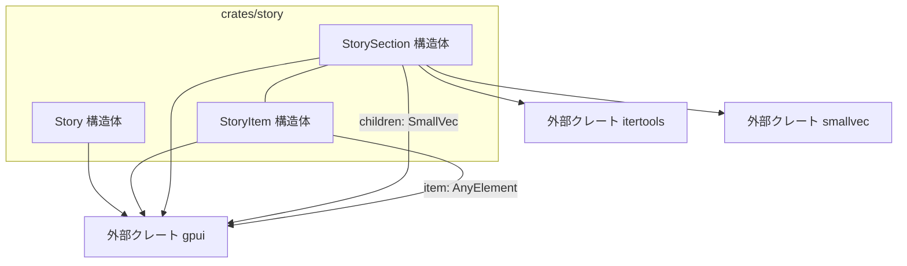
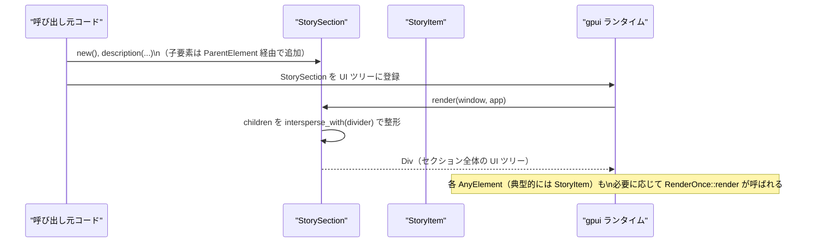

# crates/story ディレクトリ

## 1. ざっくり一言

`story` クレートは、`gpui` ベースのアプリケーションで「コンポーネントのカタログ画面（Storybook 的なもの）」を構築するためのヘルパーをまとめたモジュールです。  
スタイル済みのコンテナ、セクション、項目表示（ラベル + サンプル + 説明 + 使用例コード）を簡潔に組み立てられるようになっています。

---

## 2. このモジュールの役割

### 2.1 概要

- `story` は、UI コンポーネントのサンプルを一覧・整理して表示するための **レイアウト部品** を提供します。
- 解決する問題は「毎回 Story 用のレイアウトを手書きするのが面倒」という点で、共通のスタイルを持つ
  - ルートコンテナ (`Story::container`)
  - セクション (`StorySection`)
  - 個々のサンプル項目 (`StoryItem`)
  を一貫した API で構築できるようにします。
- レンダリング処理はすべて `gpui` の `Div` や `AnyElement` を中心に組み立てられ、テーマ（色）も `App::default_colors()` に合わせて決まります。

### 2.2 アーキテクチャ内での位置づけ

このディレクトリには 1 つの Rust ファイル（`src/story.rs`）があり、その中で以下の 3 型が定義されています。

- `Story`: 空の構造体。主に **名前空間** として振る舞い、スタイル済みの `Div` やテキスト要素を返す関連関数群を持ちます。
- `StoryItem`: 1 つのコンポーネントサンプルを表現します（ラベル + 実際の UI 要素 + 説明 + 使用例コード）。
- `StorySection`: 複数の `AnyElement`（典型的には `StoryItem`）をまとめ、セクションとして表示します。`ParentElement` を実装しており、子要素コンテナとして使われます。

外部クレートとして以下に依存します。

- `gpui`: UI 要素 (`Div`, `AnyElement`, `App`, `Window` など) とスタイル用メソッド、`RenderOnce`/`IntoElement` などのトレイト。
- `itertools`: `Itertools::intersperse_with` により、子要素間に区切り線を挿入する処理を簡潔に記述。
- `smallvec`: 子要素リストを `SmallVec<[AnyElement; 2]>` で保持し、少数の要素ではヒープ確保を避ける構造。

依存関係のイメージは次のようになります。



### 2.3 設計上のポイント

コードから読み取れる設計上の特徴は以下のとおりです。

- **空構造体による名前空間化**
  - `Story` 自体は状態を持たず、関連関数のみを提供する「ユーティリティ集」として設計されています。
- **ビルダーパターンによる宣言的 UI 構築**
  - `div().flex().flex_col().child(...).bg(...)` のように、`gpui` のビルダーをチェーンしてレイアウトを組み立てます。
- **`RenderOnce` による一回限りのレンダリング**
  - `StoryItem` と `StorySection` は `RenderOnce` を実装し、所有権を消費しながら一度だけ UI ツリーに展開されます。
- **オプション情報は `Option` で明示**
  - 説明 (`description`) や使用例コード (`usage`) が無い場合、UI 要素を全く生成しないよう `Option<SharedString>` と `when_some` で制御しています。
- **軽量な子要素保持**
  - `StorySection.children` は `SmallVec<[AnyElement; 2]>` で管理され、子要素が 2 個程度まではスタック上に格納されます。
- **他の UI クレートへの依存を避ける**
  - コメントにあるように、「`ui::v_flex` に依存しない形で `Story::v_flex` を自前で用意」することで、`story` クレートは `ui` クレートとは独立しています。

---

## 3. 主要な機能一覧

このディレクトリ（クレート）が提供する主な機能は次のとおりです。

- Story 全体のコンテナ生成: `Story::container`
  - スクロール可能・フルサイズのルートコンテナを生成します。
- セクション枠の生成: `Story::section`
  - 余白・ボーダー付きのセクションコンテナを返します。
- セクション/項目のタイトル表示:
  - `Story::title`, `Story::title_for`, `Story::section_title`, `Story::label`
- 説明文表示用の要素: `Story::description`
- 使用例コード表示用のコードブロック: `Story::code_block`
- 項目間の区切り線（divider）: `Story::divider`
- 縦方向のフレックスレイアウトコンテナ:
  - `Story::v_flex`（`ui::v_flex` 互換の簡易版）
- Story の 1 項目を表すコンポーネント:
  - `StoryItem`（ラベル・実際の UI 要素・説明・使用例をまとめて表示）
- 複数項目をまとめるセクションコンポーネント:
  - `StorySection`
    - セクションの説明文
    - 子要素（`AnyElement`）のリスト
    - 子要素間に自動的に divider を挿入

---

## 4. 関数・構造体の解説

### 4.1 型一覧

| 名前 | 種別 | 役割 / 用途 |
|------|------|-------------|
| `Story` | 構造体（空） | Story 画面全体で共有されるスタイル済みコンテナやテキスト要素を生成するための名前空間 |
| `StoryItem` | 構造体（`IntoElement`, `RenderOnce`） | 1 つの UI コンポーネントサンプル（ラベル・プレビュー・説明・使用例コード）を表現する |
| `StorySection` | 構造体（`IntoElement`, `RenderOnce`, `ParentElement`, `Default`） | 複数の `AnyElement`（典型的には `StoryItem`）とセクション説明をまとめるコンテナ |

フィールドの概要:

- `StoryItem`
  - `label: SharedString` – 項目名（UI コンポーネントの名前など）
  - `item: AnyElement` – 実際の UI コンポーネント本体
  - `description: Option<SharedString>` – 項目の説明文（任意）
  - `usage: Option<SharedString>` – 使用例コードを表す文字列（任意）
- `StorySection`
  - `description: Option<SharedString>` – セクション全体の説明文（任意）
  - `children: SmallVec<[AnyElement; 2]>` – セクション内に並べる子要素（`StoryItem` 等）

### 4.2 主要な関数・メソッドの詳細

#### `Story::container(cx: &App) -> gpui::Stateful<Div>`

**概要**

- Story 画面全体のルートとして使う、スクロール可能なフルサイズのコンテナを生成します。
- テキスト色と背景色は `cx.default_colors()`（アプリ全体のテーマ）に追従します。

**引数**

| 引数名 | 型 | 説明 |
|--------|----|------|
| `cx` | `&App` | `gpui` アプリケーションコンテキスト。テーマ色の取得に使用します。 |

**戻り値**

- `gpui::Stateful<Div>`（型名のみコードから読み取れます）
  - `id = "story_container"` を持つ、縦方向レイアウト (`flex_col`) のスクロールコンテナです。

**内部処理の流れ**

1. `div()` で `Div` ビルダーを生成。
2. `.id("story_container")` でコンテナに ID を付与。
3. `.overflow_y_scroll()` で縦方向スクロールを有効化。
4. `.w_full().min_h_full()` で幅・最小高さを画面いっぱいに。
5. `.flex().flex_col()` で縦方向のフレックスレイアウトを設定。
6. `.text_color(cx.default_colors().text)`、`.bg(cx.default_colors().background)` でテーマに従った色を設定。

**Examples（使用例）**

```rust
use gpui::{App, Element};
use story::Story;

// Story 画面全体のルートコンテナを構築する例
fn build_story_root(cx: &App) -> impl Element {
    Story::container(cx)           // ルートコンテナを作成
        .child(Story::title("Components", cx))  // タイトルを追加
    // .child(...) で StorySection などを追加していく想定
}
```

**Errors / Panics**

- コード上には `panic!` や `unwrap` など明示的なパニック要因はありません。
- 実際のエラーやパニックの可能性は、`gpui` ライブラリ内部の実装に依存します。

**Edge cases（エッジケース）**

- 子要素が 0 個の場合でも、空のスクロールコンテナとして表示されます。
- テキスト色・背景色が取得できない場合の挙動は `App::default_colors()` の実装に依存し、このファイルからは分かりません。

**使用上の注意点**

- ID `"story_container"` は固定で付与されるため、同じ ID の要素を他で定義しないほうが分かりやすい構成になります。
- Story 用 UI の最上位に 1 つだけ使用することを前提とした命名になっています。

---

#### `Story::code_block(code: impl Into<SharedString>, cx: &App) -> Div`

**概要**

- 使用例コードなどを表示するための、スタイル済みコードブロックコンテナを生成します。

**引数**

| 引数名 | 型 | 説明 |
|--------|----|------|
| `code` | `impl Into<SharedString>` | 表示するコード文字列。任意の型を `SharedString` に変換して使用可能です。 |
| `cx` | `&App` | テーマ色の取得に使用します。 |

**戻り値**

- `Div` – 最大幅 36rem、コンテナ背景色、角丸、小さめの文字サイズを持ったコード表示用コンテナ。

**内部処理の流れ**

1. `div()` で `Div` ビルダーを生成。
2. `.size_full()` で親のサイズに合わせて広がるよう設定。
3. `.p_2()` でパディングを付与。
4. `.max_w(rems(36.))` で横幅の最大値を 36rem に制限。
5. `.bg(cx.default_colors().container)` でコンテナ背景色を設定。
6. `.rounded_sm()` で角を少し丸くする。
7. `.text_sm().text_color(cx.default_colors().text)` で小さめの文字サイズとテキスト色を設定。
8. `.overflow_hidden()` であふれた内容を非表示にする。
9. `.child(code.into())` でコード文字列を子要素として追加。

**Examples（使用例）**

```rust
use gpui::{App, Element};
use story::Story;

fn show_code_example(cx: &App) -> impl Element {
    Story::code_block(
        r#"let button = Button::new("Click me");"#, // 表示したいコード
        cx,
    )
}
```

**Errors / Panics**

- 明示的なエラー・パニック要因はありません。

**Edge cases**

- `code` が空文字列の場合、背景だけの小さなボックスになります。
- 長いコードは `.overflow_hidden()` によりコンテナ境界を超えた部分が表示されません。

**使用上の注意点**

- 横幅は `max_w(rems(36.))` に制限されているため、長い 1 行のコードは途中で折り返されるか、非表示になる可能性があります。
- シンタックスハイライトなどは行っておらず、単純なテキスト表示です。

---

#### `StoryItem::new(label: impl Into<SharedString>, item: impl IntoElement) -> StoryItem`

**概要**

- 1 つの Story 項目（ラベル + プレビュー用 UI 要素）を構築するためのコンストラクタです。
- 説明文と使用例コードは、このあと `description` / `usage` メソッドで追加設定します。

**引数**

| 引数名 | 型 | 説明 |
|--------|----|------|
| `label` | `impl Into<SharedString>` | 項目のラベル（コンポーネント名など） |
| `item` | `impl IntoElement` | 実際に表示したい UI コンポーネント。`gpui::IntoElement` を実装している必要があります。 |

**戻り値**

- `StoryItem` – `description` と `usage` は `None` に初期化された状態の項目。

**内部処理の流れ**

1. `label.into()` で `SharedString` に変換。
2. `item.into_any_element()` で汎用的な `AnyElement` にラップ。
3. `description` / `usage` を `None` にセットして構造体を返す。

**Examples（使用例）**

```rust
use gpui::Element;
use story::StoryItem;

// 仮の UI コンポーネント。実際には何らかの gpui コンポーネントを使う想定です。
fn my_button() -> impl Element {
    // Button::new("Click me") などを想定
    todo!()
}

fn make_story_item() -> StoryItem {
    StoryItem::new("Basic button", my_button())  // ラベルとコンポーネントを指定
}
```

**Errors / Panics**

- コンストラクタ自体に明示的なエラー・パニック要因はありません。

**Edge cases**

- `label` を空文字列にしても、そのまま空のラベルとして表示されます。

**使用上の注意点**

- `item` は `IntoElement` を実装している必要があります。プリミティブ型（`i32` など）を直接渡すことはできません。
- このメソッドは説明や使用例コードを設定しないため、必要に応じて後述の `description` / `usage` と組み合わせて使用する前提です。

---

#### `StoryItem::description(self, description: impl Into<SharedString>) -> StoryItem`

**概要**

- 項目に説明文を付与するためのビルダーメソッドです。

**引数**

| 引数名 | 型 | 説明 |
|--------|----|------|
| `description` | `impl Into<SharedString>` | 項目の説明文 |

**戻り値**

- `StoryItem` – `description` フィールドに値が設定された新しいインスタンス。

**内部処理**

1. `description.into()` で `SharedString` に変換。
2. `self.description = Some(...)` として `Option` を更新。
3. 更新された `self` を返す。

**Edge cases / 使用上の注意点**

- すでに説明文が設定されている `StoryItem` に対して呼び出すと、値が上書きされます。
- メソッドは `self` を消費するため、ビルダーチェーン（`StoryItem::new(...).description(...).usage(...)`）での利用が前提です。

---

#### `StoryItem::usage(self, code: impl Into<SharedString>) -> StoryItem`

**概要**

- 項目に「使用例コード」を付与します。レンダリング時には右側のカラムに `Story::code_block` で表示されます。

**引数・戻り値・内部処理**

- `description` と同様のパターンで `self.usage = Some(code.into())` を設定し、更新した `self` を返します。

**Edge cases / 使用上の注意点**

- `usage` が `None` の場合、右側の「Example Usage」カラム自体がレンダリングされません（`when_some` による条件付き処理）。
- 長いコード文字列の場合、表示は `Story::code_block` の制約（`max_w` と `overflow_hidden`）に従います。

---

#### `StorySection::new() -> StorySection`

**概要**

- セクションコンポーネントの空インスタンスを作成します。

**戻り値**

- `StorySection` – `description = None`、`children` は空の `SmallVec` で初期化されています。

**内部処理**

- `SmallVec::new()` で子要素リストを空に初期化し、それをフィールドにセットします。

**使用上の注意点**

- 子要素の追加は `ParentElement` トレイトを通じて行われる想定です。
  - このチャンクには、`StorySection` に子要素を足す具体的な呼び出しコードは含まれていませんが、
    `ParentElement::extend` 実装から「gpui のマクロ/ヘルパーがこのメソッドを通じて要素を追加する」という前提が読み取れます。

---

#### `impl RenderOnce for StorySection::render(self, _window: &mut Window, cx: &mut App) -> impl IntoElement`

**概要**

- セクションを実際の UI ツリー（`Div` の組み合わせ）に変換します。
- セクション説明の有無や、子要素の間に divider を挿入する処理をここで行っています。

**引数**

| 引数名 | 型 | 説明 |
|--------|----|------|
| `self` | `StorySection` | 描画対象のセクション。所有権を消費します。 |
| `_window` | `&mut Window` | `gpui` のウィンドウコンテキスト（この実装では未使用）。 |
| `cx` | `&mut App` | テーマ色などのコンテキスト。 |

**戻り値**

- `impl IntoElement` – `Story::section(cx)` をベースにした `Div` ツリー。

**内部処理の流れ**

1. `self.children.into_iter()` で子要素のイテレータを取得。
2. `Itertools::intersperse_with(..., || Story::divider(cx).into_any_element())` を適用し、
   子要素の間に divider (`Story::divider`) を挿入したイテレータを作る。
3. `SmallVec::from_iter(...)` で intersperse 後の要素列を `SmallVec<[AnyElement; 2]>` に格納。
4. `Story::section(cx)` でベースのセクションコンテナ（枠付き `Div`）を生成。
5. `.py_2()` で上下パディングを調整。
6. `.when_some(self.description, |section, description| { section.child(Story::description(description, cx)) })`
   でセクション説明があれば先頭に追加。
7. `.child(div().flex().flex_col().gap_2().children(children))` で intersperse 済みの子要素群を縦に並べる。
8. `.child(Story::divider(cx))` でセクション末尾に divider を追加。

**Edge cases（エッジケース）**

- `children` が 0 個の場合
  - `intersperse_with` で生成されるイテレータも空になり、`children` は空のままです。
  - 描画結果としては「セクション説明（あれば）」と末尾の divider のみが表示されます。
- `children` が 1 個の場合
  - divider は子要素間にのみ挿入されるため、1 つだけの場合は挿入されません（先頭と末尾の間に挟む要素がないため）。
- `description` が `None` の場合
  - セクション説明ブロックは一切描画されません。

**使用上の注意点**

- `RenderOnce` の実装は `self` の所有権を消費するため、同じ `StorySection` インスタンスを複数回 UI に使い回すことはできません。
- `children` に何を追加するかはこのファイルでは定義されておらず、`AnyElement` であれば何でも追加できますが、
  一般的には `StoryItem` など同じ Story 系コンポーネントを入れることになります。

---

### 4.3 その他の関数・メソッド

補助的な関数・シンプルなラッパー関数一覧です。

| 関数名 / メソッド名 | 役割（1 行） |
|---------------------|--------------|
| `Story::title` | 小さめのテキストサイズでタイトル文字列を表示する要素を生成します。 |
| `Story::title_for<T>` | 型名 `T` のフルパスをタイトルとして表示する要素を生成します。 |
| `Story::section` | パディング・マージン・ボーダー付きのセクション枠 `Div` を生成します。 |
| `Story::section_title` | 大きめのテキストサイズのセクションタイトル用 `Div` を生成します。 |
| `Story::group` | セクション内でのグルーピングに使う背景付き `Div` を生成します。 |
| `Story::divider` | 高さ 1px の水平線（セパレータ）を生成します。 |
| `Story::description` | 小さめの文字サイズ・最小幅付きの説明文表示要素を生成します。 |
| `Story::label` | 極小テキストサイズのラベル用要素を生成します。 |
| `Story::v_flex` | `flex` + `flex_col` + `gap_1` を設定した縦方向フレックスコンテナを生成します。 |
| `StoryItem::description` | 項目に説明文を設定するビルダーメソッドです。 |
| `StoryItem::usage` | 項目に使用例コードを設定するビルダーメソッドです。 |
| `StorySection::description` | セクションに説明文を設定するビルダーメソッドです。 |
| `StorySection::default` | `StorySection::new()` を呼び出す `Default` 実装です。 |
| `StorySection::extend` (`ParentElement`) | `AnyElement` のイテレータを受け取り、`children` にまとめて追加します。 |

---

## 5. データフロー

ここでは、「1 つの Story セクションに複数の StoryItem を並べる」処理の流れを概観します。

1. 呼び出し元コードで `StoryItem` を複数生成し、それらを `StorySection` に子要素として追加します（実際の追加方法は `gpui` のマクロ/ヘルパーに依存し、このチャンクには登場しません）。
2. その `StorySection` を `Story::container` などの親コンテナの子として UI ツリーに登録します。
3. `gpui` のランタイムが `RenderOnce::render` を呼び出し、`StorySection` の内部で divider 挿入などの処理が行われ、最終的な `Div` ツリーが返されます。
4. 返されたツリーの中で、`StoryItem` も `RenderOnce` を通じて実際の UI に展開されます。

これをシーケンス図で表すと次のようになります（API 名は概念レベルです）。



このように、`StorySection` は「**子要素リストを整形して 1 つのセクションの UI ツリーにまとめる役割**」を担い、`StoryItem` は「その中に入る単位要素」という関係になっています。

---

## 6. 使い方（How to Use）

### 6.1 基本的な使用方法

ここでは、単純な Story 画面の骨格を構築する例を示します。  
実際の UI コンポーネント（ボタンなど）はダミーとしています。

```rust
use gpui::{App, Element};
use story::{Story, StoryItem, StorySection};

// 仮の UI コンポーネント。実際には何らかの gpui コンポーネントを返す想定です。
fn my_button() -> impl Element {
    // 例: Button::new("Click me")
    todo!()
}

fn build_story(cx: &App) -> impl Element {
    // 1. StoryItem を組み立てる
    let button_item = StoryItem::new("Basic button", my_button())    // 項目のラベルと UI 本体
        .description("標準的なボタンの見た目と挙動を確認するサンプルです。") // 説明文
        .usage(r#"let button = Button::new("Click me");"#);          // 使用例コード

    // 2. StorySection を作る（子要素の追加は gpui のマクロ/ヘルパー経由になる想定）
    let section = StorySection::new()
        .description("ボタンコンポーネントに関するセクションです。");
    // この段階では section.children に `button_item` を追加する必要がありますが、
    // その具体的なコードは gpui 側の DSL / マクロに依存し、このチャンクには現れていません。

    // 3. ルートコンテナにタイトルとセクションを載せる
    Story::container(cx)
        .child(Story::title("Components", cx))    // 画面タイトル
        .child(section)                           // セクション全体を 1 要素として追加
}
```

この例では、「Story 用のルートコンテナ」「タイトル」「1 つのセクション」を組み合わせる基本的な流れを示しています。

### 6.2 よくある使用パターン

#### パターン 1: 型名をそのままタイトルに使う

`Story::title_for<T>` を用いると、型名を自動的にストーリータイトルとして表示できます。

```rust
use gpui::{App, Element};
use story::Story;

struct FancyButton; // 例としてのコンポーネント

fn header_for_component(cx: &App) -> impl Element {
    // "path::to::FancyButton" のようなフルパスの型名がタイトルとして表示される
    Story::title_for::<FancyButton>(cx)
}
```

#### パターン 2: グループコンテナで複数項目をまとめる

`Story::group` は背景付きの `Div` を返すため、関連する StoryItem を視覚的にまとめるのに使えます。

```rust
use gpui::{App, Element};
use story::{Story, StoryItem};

fn group_example(cx: &App) -> impl Element {
    let item1 = StoryItem::new("Primary", /* 何らかの UI */ todo!());
    let item2 = StoryItem::new("Secondary", /* 何らかの UI */ todo!());

    Story::group(cx)
        .child(item1)   // グループ内に項目を追加
        .child(item2)
}
```

> `Story::group` は単なる `Div` なので、`child` や `children` をそのまま利用できます。

#### パターン 3: 使用例コード付きの StoryItem

`usage` を指定した場合、右側カラムに「Example Usage」というラベルとコードブロックが表示されます。

```rust
use story::StoryItem;

fn item_with_usage() -> StoryItem {
    StoryItem::new("Outlined button", /* UI 部品 */ todo!())
        .usage(r#"let button = Button::new("Click me").outlined(true);"#)
}
```

### 6.3 使用上の注意点（まとめ）

- **`StoryItem` / `StorySection` は「一度きり」の使用が前提**
  - `RenderOnce` を実装しており、`render` は `self` の所有権を消費します。
  - 同じインスタンスを複数箇所で再利用するのではなく、必要な数だけ新たに構築する前提です。

- **`AnyElement` と `IntoElement` の関係**
  - `StoryItem::new` の `item` 引数は `IntoElement` を実装している必要があります。
  - `StorySection.children` は `AnyElement` を保持するため、`IntoElement` から `.into_any_element()` で変換されることが前提です。

- **長い説明文・コードの扱い**
  - `Story::description` と `Story::code_block` は共に `.overflow_hidden()` を使用しているため、コンテナからはみ出た部分は表示されません。
  - 特にコードブロックは `max_w(rems(36.))` に制限されているため、長い 1 行コードは見切れる可能性があります。

- **`StorySection` への子要素追加方法**
  - このディレクトリのコードだけでは、`StorySection` に `StoryItem` を追加する具体的な呼び出しパターンは示されていません。
  - ただし `ParentElement::extend` が実装されていることから、`gpui` のマクロ（例: `ui!` 的なもの）やヘルパーが `extend` を通じて子要素を追加する設計であると解釈できます。

- **外部クレートへの依存**
  - `gpui`・`itertools`・`smallvec` に依存しているため、それらの API 仕様やバージョン変更の影響を受けます。
  - 特に `itertools::intersperse_with` の挙動（空の列では何も挿入しないなど）に依存して、divider の挿入が行われます。

---

## 7. 関連ファイル

このディレクトリ内で `story` クレートに直接関係するファイルは次の 2 つです。

| パス | 役割 / 関係 |
|------|------------|
| `story/Cargo.toml` | クレート名（`story`）と依存関係（`gpui`, `itertools`, `smallvec`）を定義するマニフェストです。`[lib]` セクションでライブラリのエントリポイントを `src/story.rs` に設定しています。 |
| `story/src/story.rs` | 本クレートの主要な実装ファイルであり、`Story`, `StoryItem`, `StorySection` の定義と、それらのレンダリングロジックを提供します。 |

このチャンクにはテストコードや他の補助モジュールは含まれていません。そのため、`StorySection` に子要素を追加するための具体的な UI DSL や他クレートからの利用例は、この情報からは分かりません。
