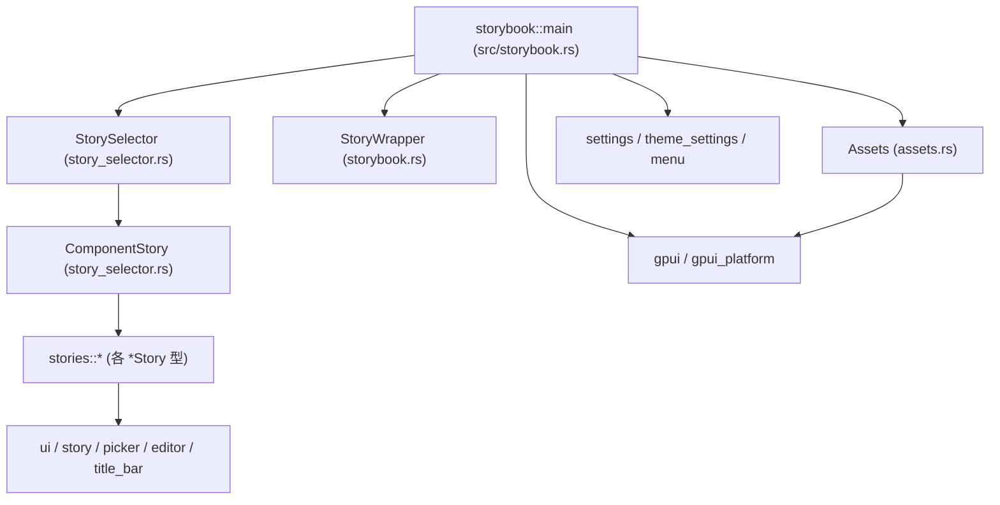
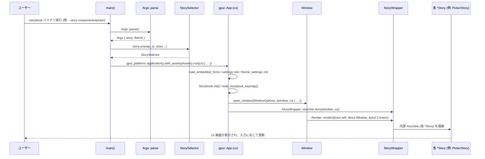

# crates/storybook ディレクトリ解説

## 0. ざっくり一言

`crates/storybook` は、Zed エディタで使われている `gpui` / `ui` コンポーネントを「ストーリー」として起動・確認するための **デスクトップ Storybook バイナリ** です。  
コマンドラインや対話式メニューからストーリーを選び、`gpui_platform` 上でウィンドウを立ち上げて各種 UI サンプルを表示します。

---

## 1. このモジュールの役割

### 1.1 概要

- このディレクトリは **UI コンポーネントの挙動を確認するための実行可能アプリケーション** を提供します。
- CLI（`clap`）でストーリー名やテーマを指定し、`gpui_platform` アプリケーションを立ち上げて、選択されたストーリーのビューを表示します。
- フォントやアイコンなどのアセットは `rust-embed` でバイナリに埋め込み、`gpui::AssetSource` 実装 (`Assets`) 経由でロードします。
- 各 UI サンプル（Editor, Cursor, Picker, Scroll, Text など）は `stories` モジュール以下の `*Story` 型として実装され、`ComponentStory` / `StorySelector` を通じて選択されます。

### 1.2 アーキテクチャ内での位置づけ

この crate 内の主要モジュールの依存関係を簡略化して示します。



- `src/storybook.rs` の `main` がエントリポイントで、CLI 解釈・テーマ設定・gpui アプリケーション起動・ウィンドウ生成を行います。
- `StorySelector` / `ComponentStory` が「どのストーリーを表示するか」を決定し、`stories` モジュール配下の各 `*Story` 型をインスタンス化します。
- `StoryWrapper` がウィンドウのルートビューとして実際のストーリー (`AnyView`) を包みます。
- `Assets` は `gpui::AssetSource` を実装し、フォントなどを `gpui_platform::application().with_assets(Assets)` に提供します。
- 実際の UI 要素の構築は `gpui`, `ui`, `story`, `picker`, `editor`, `title_bar` などワークスペース内の他 crate に委ねられています。

### 1.3 設計上のポイント

コードから読み取れる設計上の特徴は次の通りです。

- **責務の分割**
  - エントリポイントとアプリケーション初期化: `src/storybook.rs`
  - CLI からストーリー名を解釈するロジック: `src/story_selector.rs`
  - 個々の UI サンプル（ストーリー）の実装: `src/stories/*.rs`
  - アクション定義とアプリケーションメニュー: `src/actions.rs`, `src/app_menus.rs`
  - アセットの埋め込みとロード: `src/assets.rs`
- **状態の扱い**
  - 各ストーリーは専用の構造体（例えば `PickerStory`, `FocusStory` など）に状態を保持し、`gpui::Render` トレイトの `render` メソッド内で UI を構築します。
  - 一部ストーリー (`PickerStory`, `IndentGuidesStory` など) は `Entity<T>` や `FocusHandle` など gpui の状態管理オブジェクトを内部に持ちます。
- **エラーハンドリング**
  - `main` 内の初期化は多くが `unwrap` / `expect` で失敗時に panic する方針で、開発用ツールとしてのシンプルさを優先しています。
  - アセットロード (`load_embedded_fonts`, `Assets::load`, `Assets::list`) は `anyhow::Result` を使い、呼び出し元にエラーを伝播しますが、一部で `expect` による非 `None` 前提があります。
- **ストーリー追加の容易さ**
  - 新しいストーリーは `stories` サブモジュールに `*Story` 型を追加し、`stories.rs` で `pub use`、`ComponentStory` に列挙子追加・`story` メソッドに分岐追加するだけで CLI/GUI から選択可能になります。

---

## 2. 主要な機能一覧

この crate が提供する主要な機能を列挙します。

- **ストーリー選択用 CLI インターフェース**
  - `clap::Parser` で `StorySelector` / `--theme` を受け取り、起動するストーリーとテーマを選択します。
  - ストーリー未指定時は `dialoguer::FuzzySelect` による対話式選択 UI を起動します。

- **gpui アプリケーションの初期化とウィンドウ生成**
  - `gpui_platform::application().with_assets(Assets).run(...)` でアプリケーションを起動し、フォント・テーマ・HTTP クライアント・設定・キーマップ・メニューなどを設定してウィンドウを開きます。

- **アセットの埋め込みと提供**
  - `Assets` 構造体が `rust-embed` を利用して `assets/` 以下（フォント・アイコン・画像・テーマ・サウンド・Markdown）をバイナリに埋め込み、`gpui::AssetSource` として `load` / `list` を提供します。
  - `load_embedded_fonts` が `fonts` ディレクトリ内の `.ttf` をまとめて読み込み、`text_system` に登録します。

- **アプリケーションメニューと Quit アクション**
  - `actions!(storybook, [Quit])` により `Quit` アクションを定義し、`init` / `quit` でアプリケーション終了処理を定義します。
  - `app_menus::app_menus` が「Storybook」メニューと `Quit` メニューアイテムを構築します。

- **コンポーネントストーリーの集合**
  - `ComponentStory` 列挙体として次のようなストーリーを提供します:
    - `ApplicationMenu`（`title_bar` crate 側のストーリー）
    - `AutoHeightEditor`（高さ自動調整 Editor）
    - `ContextMenu`（`ui` crate 側のストーリー）
    - `Cursor`（カーソルスタイル一覧）
    - `Focus`（フォーカス/キーボードイベントの伝播）
    - `OverflowScroll`（X/Y の `overflow_scroll`）
    - `Picker`（汎用 Picker コンポーネント + fuzzy 検索）
    - `Scroll`（2D スクロール + ネストしたスクロール）
    - `Text`（テキストレイアウト・折返し・インタラクティブテキスト）
    - `ViewportUnits`（vw/vh 単位）
    - `WithRemSize`（rem サイズの影響）
    - `IndentGuides`（インデントガイド装飾）

- **Kitchen Sink ストーリー**
  - `KitchenSinkStory` が全 `ComponentStory` を一つのスクロールビュー内で一覧表示する「総合カタログ」画面を提供します。

- **UI スタイリング・インタラクションに関する設計メモ**
  - `docs/thoughts.md` には、`Styled` / `Interactive` / `Interactions` などのトレイト設計案が記述されており、スタイリング/インタラクション API の検討メモとして機能します（実際のコードからは利用されていません）。

---

## 3. 公開 API と詳細解説

### 3.1 型一覧（構造体・列挙体など）

主要な型と役割を整理します。

| 名前 | 種別 | 定義ファイル | 役割 / 用途 |
|------|------|--------------|-------------|
| `StoryWrapper` | 構造体 | `src/storybook.rs` | `AnyView` なストーリーを保持し、ウィンドウのルートビューとして共通のレイアウト（縦方向フレックス・フォントファミリ）を適用します。 |
| `StorySelector` | 列挙体 | `src/story_selector.rs` | CLI から選択されるトップレベルのストーリー。`Component(ComponentStory)` または `KitchenSink` を表します。 |
| `ComponentStory` | 列挙体 | `src/story_selector.rs` | 個々のコンポーネントストーリー（ApplicationMenu, Picker など）の列挙。`story` メソッドで対応するビューを生成します。`strum` で `snake_case` の文字列表現を持ちます。 |
| `Assets` | 構造体 | `src/assets.rs` | `RustEmbed` で `../../assets` 以下を埋め込む `gpui::AssetSource` 実装。`load` と `list` で gpui にアセットを供給します。 |
| `AutoHeightEditorStory` 他 | 構造体 | `src/stories/*.rs` | 各 UI デモ画面の本体。`Render`（または関連トレイト）を実装し、gpui UI ツリーを構築します。 |
| `PickerStory` | 構造体 | `src/stories/picker.rs` | `Picker<Delegate>` エンティティを内包する Picker デモストーリー。キー操作バインディングと fuzzy 検索を設定します。 |
| `Delegate` | 構造体 | `src/stories/picker.rs` | `PickerDelegate` 実装。候補一覧 (`StringMatchCandidate` の配列)、現在のマッチ結果インデックス、選択中インデックスを保持します。 |
| `FocusStory` | 構造体 | `src/stories/focus.rs` | `FocusHandle` を 3 つ（親＋子2つ）管理し、フォーカス/ブラー/キーイベント/アクションの振る舞いを観察するストーリーです。 |
| `IndentGuidesStory` | 構造体 | `src/stories/indent_guides.rs` | 各行のインデント深度を保持し、`uniform_list` + `ui::indent_guides` でインデントガイドを描画するストーリーです。 |
| `KitchenSinkStory` | 構造体 | `src/stories/kitchen_sink.rs` | すべての `ComponentStory` を一画面に並べるストーリー。 |
| `ViewportUnitsStory` | 構造体 | `src/stories/viewport_units.rs` | `vw` / `vh` ユーティリティを使ったビューポート単位のデモストーリー。 |
| `WithRemSizeStory` | 構造体 | `src/stories/with_rem_size.rs` | `WithRemSize` ユーティリティで rem サイズを変えながら子要素を表示するストーリー。 |
| `Example` | 構造体 | `src/stories/with_rem_size.rs` | `WithRemSizeStory` 内部で使用。`IntoElement` / `ParentElement` / `RenderOnce` を実装し、特定の rem サイズと枠線付きコンテナを作成します。 |
| `TextStory` | 構造体 | `src/stories/text.rs` | テキスト折り返しや `InteractiveText` の挙動を確認するストーリー。 |
| `ScrollStory` / `OverflowScrollStory` | 構造体 | `src/stories/scroll.rs`, `overflow_scroll.rs` | スクロールコンテナ、ネストしたスクロール、ツールチップなどの挙動を確認するストーリー。 |
| `CursorStory` | 構造体 | `src/stories/cursor.rs` | 各種カーソルスタイルを一覧表示するストーリー。 |
| `FocusStory` | 構造体 | `src/stories/focus.rs` | フォーカスハンドラ・キーボードイベント・アクションディスパッチを確認するストーリー。 |

このほか、`docs/thoughts.md` 内には `Styled` / `Interactive` / `Interactions` / `Stylable` などのトレイト案が記述されていますが、実際のビルド対象コードには影響しません。

### 3.2 関数詳細（代表 7 件）

#### `fn main()`

**概要**

- バイナリのエントリポイントです。
- ロガー・メニュー・テーマ・設定・HTTP クライアント・キーマップなどを初期化し、選択されたストーリーを含む gpui ウィンドウを起動します。

**引数**

- なし（通常の `fn main()`）。

**戻り値**

- なし（`()`）。異常時には一部で `panic!` する可能性があります。

**内部処理の流れ**

1. `SimpleLogger::init(LevelFilter::Info, ...)` でログ出力を初期化します（失敗時は `expect` で panic）。
2. `menu::init()` を呼び、メニューシステムを初期化します。
3. `Args::parse()` で `clap` による CLI 解析を行います。
   - `story: Option<StorySelector>`  
   - `theme: Option<String>`
4. ストーリーが指定されていない場合:
   - `ComponentStory::iter()` で全コンポーネントストーリーを収集。
   - `ctrlc::set_handler` を設定して Ctrl-C を無視する（FuzzySelect 中の挙動を制御）。
   - `FuzzySelect::new().with_prompt(...).items(&stories).interact()` で対話式選択 UI を表示。
   - キャンセルまたはエラー時は `dialoguer::console::Term::stderr().show_cursor().unwrap();` でカーソル表示を復元し、`std::process::exit(0)` で終了。
   - 正常に選択された場合 `StorySelector::Component(stories[selection])` を得ます。
5. `theme_name` を `Args.theme` から決定し、指定がなければ `"One Dark"` をデフォルトとします。
6. `gpui_platform::application().with_assets(Assets).run(move |cx| { ... })` を実行し、gpui アプリケーションを開始します。クロージャ内では:
   - `load_embedded_fonts(cx)?` で埋め込みフォントを text_system に登録。
   - `cx.set_global(GlobalColors(Arc::new(Colors::default())))` でグローバルカラーを設定。
   - `ReqwestClient::user_agent("zed_storybook")?` を生成し、HTTP クライアントとして `cx.set_http_client` に渡します。
   - `settings::init(cx)` / `theme_settings::init(...)` で設定・テーマを初期化。
   - テーマ選択を `ThemeSettings::override_global` で上書き。
   - `editor::init(cx)` でエディタ関連コンポーネントを初期化。
   - `init(cx)` で `Quit` アクションハンドラを登録。
   - `load_storybook_keymap(cx)` でストーリーブック用キーマップを読み込み・バインド。
   - `cx.set_menus(app_menus())` でアプリケーションメニューを設定。
   - ウィンドウサイズ・位置を計算 (`size(px(1500.), px(780.))`, `Bounds::centered(...)`)。
   - `cx.open_window(WindowOptions { ... }, move |window, cx| { ... })` でウィンドウを開き、`StoryWrapper::new(selector.story(window, cx))` をルートビューとして登録。
   - `cx.activate(true)` でアプリケーションをアクティブにします。

**Errors / Panics**

- ロガー初期化失敗時: `expect("could not initialize logger")` により panic。
- `ctrlc::set_handler` 失敗時: `unwrap()` により panic。
- `load_embedded_fonts(cx)` 内部の `?` によりエラーが発生した場合、`run` のクロージャから `anyhow::Result` として伝播し、実行環境側の扱いに従います。
- 他の多くの初期化（HTTP クライアント生成、設定・テーマの初期化など）は `unwrap` を使っているため、依存 crate 内部でのエラーがあれば panic し得ます。

**Edge cases（エッジケース）**

- ストーリー未指定かつ FuzzySelect でキャンセルした場合、プロセスはエラー扱いではなく `exit(0)` で正常終了します。
- `load_embedded_fonts` が `.ttf` を一つも見つけられなかった場合の挙動は、`cx.text_system().add_fonts` の実装に依存します（このチャンクからは詳細不明）。

**使用上の注意点**

- `main` の初期化パスは Storybook 専用に設計されており、ライブラリとして再利用する前提では書かれていません。  
  ユーザー定義の gpui アプリケーションで参考にする場合は、`unwrap` / `expect` を適宜エラー処理に置き換える必要があります。

---

#### `impl ComponentStory { pub fn story(&self, window: &mut Window, cx: &mut App) -> AnyView }`

**概要**

- `ComponentStory` の各バリアントに対応するストーリーのビューを生成し、`AnyView` として返します。
- `cx.new` や `*Story::model` / `*Story::new` を通じて `gpui::Entity` を作成し、それを `AnyView` に変換します。

**引数**

| 引数名 | 型 | 説明 |
|--------|----|------|
| `&self` | `&ComponentStory` | どのコンポーネントストーリーを生成するかを表す列挙子です。 |
| `window` | `&mut Window` | `gpui` の `Window`。ストーリー生成時に必要なコンテキストを提供します。 |
| `cx` | `&mut App` | アプリケーションコンテキスト。エンティティ作成・リソースアクセスに使用します。 |

**戻り値**

- `AnyView`  
  - 選択されたストーリーのビューを型消去して保持する `gpui::AnyView` です。

**内部処理の流れ**

- `match self` で各バリアントごとに以下を行います（一部抜粋）:
  - `ApplicationMenu`:
    - `cx.new(|cx| title_bar::ApplicationMenuStory::new(window, cx))` で外部 crate `title_bar` のストーリーを作成。
  - `AutoHeightEditor`:
    - `AutoHeightEditorStory::new(window, cx)` を呼び出し。
  - `ContextMenu`:
    - `cx.new(|_| ui::ContextMenuStory)` を生成。
  - `Cursor`:
    - `cx.new(|_| crate::stories::CursorStory)` を生成。
  - `Focus`:
    - `FocusStory::model(window, cx)` を呼び出し。
  - `OverflowScroll` / `Scroll` / `Text` / `ViewportUnits` / `WithRemSize` / `IndentGuides`:
    - それぞれ対応する `*Story` の `model` / `new` を呼び出し。
- 各エンティティは `.into()` 呼び出しで `AnyView` に変換され、最終的に関数から返されます。

**Examples（使用例）**

`KitchenSinkStory::render` では、すべての `ComponentStory` を一括して生成しています。

```rust
// src/stories/kitchen_sink.rs より抜粋
let component_stories = ComponentStory::iter()
    .map(|selector| selector.story(window, cx)) // 各 ComponentStory から AnyView を生成
    .collect::<Vec<_>>();

Story::container(cx)
    .child(Story::title("Kitchen Sink", cx))
    .child(div().flex().flex_col().children(component_stories));
```

**使用上の注意点**

- 新しいコンポーネントストーリーを追加する場合は、`ComponentStory` に列挙子を追加した上で、この `story` メソッドに必ず対応する `match` 分岐を追加する必要があります。  
  追加を忘れると、そのストーリーは CLI では指定できても実行時にパスが存在しない状態になります。

---

#### `impl FromStr for StorySelector { fn from_str(raw_story_name: &str) -> Result<Self, anyhow::Error> }`

**概要**

- 任意の文字列を `StorySelector` に変換する実装です。
- `"kitchen_sink"` または `"components/<component_name>"` 形式の文字列を解釈します。

**引数**

| 引数名 | 型 | 説明 |
|--------|----|------|
| `raw_story_name` | `&str` | CLI 引数などから渡されるストーリー名の文字列表現です。 |

**戻り値**

- `Result<StorySelector, anyhow::Error>`  
  - 成功時: `StorySelector::KitchenSink` または `StorySelector::Component(ComponentStory)` を返します。  
  - 失敗時: `anyhow::Error` にラップされたエラーを返します。

**内部処理の流れ**

1. `raw_story_name.to_ascii_lowercase()` で小文字化した文字列 `story` を作成。
2. `story == "kitchen_sink"` の場合は `Ok(Self::KitchenSink)` を返す。
3. そうでなければ、`story.split_once("components/")` で `"components/"` プレフィックスを探す。
   - 見つかった場合、その後ろの文字列 `story` を取り出し、`ComponentStory::from_str(story)` を試みる。
   - ここで `ComponentStory::from_str` は `strum::EnumString` によって自動生成されたパーサで、`snake_case` の文字列を `ComponentStory` に変換します。
   - 失敗した場合: `with_context(|| format!("story not found for component '{story}'"))?` により原因付きの `anyhow::Error` を返します。
4. `"components/"` が含まれない場合、もしくは上記で失敗した場合は `anyhow::bail!("story not found for '{raw_story_name}'")` でエラーを返します。

**Examples（使用例）**

この実装は `ValueEnum` 用というより、汎用的なパース用として書かれています。  
同じ crate 内での利用例（擬似コード）は次のようになります。

```rust
use crate::story_selector::StorySelector;

let selector: StorySelector = "components/picker".parse()?;
// selector は StorySelector::Component(ComponentStory::Picker) になる想定です。
```

**Edge cases（エッジケース）**

- 大文字・小文字は `to_ascii_lowercase` で無視されます。
- `"components/"` の後ろが空文字列の場合、`ComponentStory::from_str` が失敗し `"story not found for component ''"` というメッセージになります。
- `"components/unknown_story"` のように列挙体に存在しない名前を指定すると、同じくコンポーネント名付きのエラーメッセージが生成されます。

**使用上の注意点**

- 実際の CLI では `ValueEnum` 実装を通じて `clap` がバリデーションを行うため、`FromStr` の挙動は `clap` によるパース前提では直接使われていない可能性があります。  
  ただし、同じ文字列表現のルールに従っている点は一貫しています。

---

#### `impl PickerStory { pub fn new(window: &mut Window, cx: &mut App) -> Entity<Self> }`

**概要**

- Picker コンポーネントのストーリー本体を生成します。
- Picker 用のキーバインドを登録し、`Picker<Delegate>` エンティティを初期化・フォーカス設定した上で `Entity<PickerStory>` を返します。

**引数**

| 引数名 | 型 | 説明 |
|--------|----|------|
| `window` | `&mut Window` | Picker の初期化時に渡される `gpui` ウィンドウ。 |
| `cx` | `&mut App` | アプリケーションコンテキスト。エンティティ生成・キー割り当てに使用されます。 |

**戻り値**

- `Entity<Self>` = `Entity<PickerStory>`  
  - `PickerStory` をラップした gpui のエンティティです。後の `Render` 呼び出しで UI ツリーに組み込まれます。

**内部処理の流れ**

1. `cx.new(|cx| { ... })` で `PickerStory` エンティティを作成。
2. クロージャ内で `cx.bind_keys([...])` により `Some("picker")` というキーコンテキストに対して以下のキーバインドを登録します（一部抜粋）:
   - `"up"` / `"ctrl-p"` / `"pageup"` / `"cmd-up"` など → `menu::SelectPrevious` / `menu::SelectFirst`
   - `"down"` / `"ctrl-n"` / `"pagedown"` / `"cmd-down"` など → `menu::SelectNext` / `menu::SelectLast`
   - `"enter"` → `menu::Confirm`
   - `"ctrl-enter"` / `"cmd-enter"` → `menu::SecondaryConfirm`
   - `"escape"` / `"ctrl-c"` → `menu::Cancel`
3. `picker` フィールドの初期化:
   - `cx.new(|cx| { ... })` で `Entity<Picker<Delegate>>` を作成。
   - その中で:
     - `Delegate::new(&[ "Baguette (France)", "Baklava (Turkey)", ... ])` で候補リストを生成。
     - `delegate.update_matches("".into(), window, cx).detach();` を呼び、空クエリでマッチリストを初期化（`Task<()>` を即座に detach）。
     - `let picker = Picker::uniform_list(delegate, window, cx);` で Picker エンティティを生成。
     - `picker.focus(window, cx);` で Picker にフォーカスを当てる。
     - 最後に `picker` を返す。
4. こうして生成された `picker` エンティティをフィールドに持つ `PickerStory` が返されます。

**Examples（使用例）**

`Render` 実装は非常に単純で、`picker` エンティティを背景色付きの全画面コンテナに入れて返します。

```rust
impl Render for PickerStory {
    fn render(&mut self, _: &mut Window, cx: &mut Context<Self>) -> impl IntoElement {
        div()
            .bg(cx.theme().styles.colors.background)
            .size_full()
            .child(self.picker.clone()) // new() で生成した Picker エンティティを描画
    }
}
```

Picker ストーリーだけを実行する CLI 例（この crate 内からではなく、実行時の利用例）:

```bash
cargo run -p storybook -- components/picker
```

**Edge cases（エッジケース）**

- `Delegate::new` に渡している候補リストは固定で、空文字列クエリ (`""`) に対する `update_matches` もストーリーの初期化時に一度だけ呼ばれます。
- `update_matches` は `foreground_executor().block_on(...)` を使って同期的に fuzzy マッチングを行います。候補数が非常に多い場合は UI スレッドをブロックし得ますが、現在のコードでは候補数は固定の配列に限定されています。

**使用上の注意点**

- キーバインドは `"picker"` というキーコンテキストに紐付けられています。Picker コンポーネントを他のコンテキストで再利用する場合は、別途キーコンテキスト名を検討する必要があります。
- `Delegate::confirmed` / `SecondaryConfirm` / `Cancel` の挙動は `eprintln!` / `cx.quit()` に直結しており、ストーリーとしては十分ですが、実アプリへの転用時には適切なアクションに差し替える必要があります。

---

#### `impl FocusStory { pub fn model(window: &mut Window, cx: &mut App) -> Entity<Self> }`

**概要**

- フォーカスハンドルとフォーカスイベント購読を設定した `FocusStory` エンティティを生成します。
- 親ビューと 2 つの子ビューに対するフォーカス/ブラー・キーイベント・アクションディスパッチを標準出力にログ出力するデモです。

**引数**

| 引数名 | 型 | 説明 |
|--------|----|------|
| `window` | `&mut Window` | フォーカスイベント購読に必要な `gpui::Window`。 |
| `cx` | `&mut App` | `FocusHandle` の取得・イベント購読・キー割り当てを行うコンテキスト。 |

**戻り値**

- `Entity<FocusStory>`  
  - フォーカスデモ用のストーリーモデルです。

**内部処理の流れ**

1. `cx.bind_keys([...])` で次のキーアクションを登録します。
   - `"cmd-a"` + `"parent"` コンテキスト → `ActionA`
   - `"cmd-a"` + `"child-1"` コンテキスト → `ActionB`
   - `"cmd-c"`（コンテキストなし） → `ActionC`
2. `cx.new(|cx| { ... })` で `FocusStory` を生成。
3. クロージャ内で:
   - `let parent_focus = cx.focus_handle();`
   - `let child_1_focus = cx.focus_handle();`
   - `let child_2_focus = cx.focus_handle();`
   - `let _focus_subscriptions = vec![ ... ]` として、`cx.on_focus` / `cx.on_blur` を用いて各ハンドルに対しフォーカス/ブラーイベントハンドラを登録。
     - ハンドラはシンプルに `"Parent focused"` などを `println!` します。
4. 以上をフィールドに詰めて `Self { ... }` を返します。

`Render` 実装では、この 3 つの `FocusHandle` を `div().track_focus(&self.parent_focus)` などでビューに紐付け、`active` / `focus` / `in_focus` スタイルや `on_action` / `on_key_down` / `on_key_up` を設定しています。

**使用上の注意点**

- `_focus_subscriptions` フィールドは未使用変数を避けつつ、**サブスクリプションを生存させておくため**に保持されています（このフィールドを削除すると、`Drop` により購読が解除される可能性があります）。
- キーコンテキスト (`key_context("parent")`, `"child-1"`, `"child-2"`) と `cx.bind_keys` で指定したコンテキスト名が一致していることが前提です。

---

#### `impl IndentGuidesStory { pub fn model(_window: &mut Window, cx: &mut App) -> Entity<Self> }`

**概要**

- 行ごとのインデント深度を格納した `IndentGuidesStory` を生成します。
- インデント深度に応じて左パディングを変えつつ `uniform_list` で行を描画し、`ui::indent_guides` デコレーションでインデントガイドを表示するストーリーです。

**引数**

| 引数名 | 型 | 説明 |
|--------|----|------|
| `_window` | `&mut Window` | 現状は未使用です。将来的な拡張のためのプレースホルダと見なせます。 |
| `cx` | `&mut App` | エンティティ生成に使用されます。 |

**戻り値**

- `Entity<IndentGuidesStory>`  
  - インデントガイドデモ用の状態を持つエンティティです。

**内部処理の流れ**

1. `let mut depths = Vec::new();` で空のベクタを準備。
2. 深度パターンを構築:
   - `depths.push(0);`
   - `depths.push(1);`
   - `depths.push(2);`
   - `for _ in 0..LENGTH - 6 { depths.push(3); }` でほぼ全体を深度 3 に。
   - `depths.push(2); depths.push(1); depths.push(0);`
   - これにより長さ `LENGTH`（100） の対称的な深さパターンが得られます。
3. `cx.new(|_cx| Self { depths })` で `IndentGuidesStory` を生成して返却。

`Render` 実装では、次のような構造で表示を行います。

- `Story::container(cx)` → タイトル `"Indent guides"` → `v_flex().size_full()` → `uniform_list`。
- `uniform_list` の `processor` クロージャで、`depths` の `[range.start, range.end)` をスライスし、`pl(...)` でパディング + `Label::new(format!("Item {}", i))` を付ける。
- `.with_decoration(ui::indent_guides(...).with_compute_indents_fn(...))` で、各行のインデント深度を `depths` ベクタから計算させています。

**使用上の注意点**

- `LENGTH` の定数値と `depths` の生成ロジックは厳密に対応しているため、どちらかを変更する際は、もう片方も合わせて更新する必要があります。
- `with_compute_indents_fn(cx.entity(), |this, range, ...| { ... })` は `this.depths` を参照しているため、`IndentGuidesStory` に他のフィールドを追加する場合も、このクロージャが正しく動くように注意が必要です。

---

#### `fn load_embedded_fonts(cx: &App) -> anyhow::Result<()>`

**概要**

- 埋め込みアセット（`Assets`）内の `fonts` ディレクトリから `.ttf` フォントファイルをすべてロードし、`cx.text_system().add_fonts` に登録します。
- `main` のアプリケーション初期化時に一度呼び出されます。

**引数**

| 引数名 | 型 | 説明 |
|--------|----|------|
| `cx` | `&App` | `asset_source` および `text_system` にアクセスするための `gpui::App` 参照です。 |

**戻り値**

- `anyhow::Result<()>`  
  - フォント一覧取得・ロード・登録のいずれかでエラーがあれば、そのまま `anyhow` エラーとして返します。

**内部処理の流れ**

1. `let font_paths = cx.asset_source().list("fonts")?;`
   - `AssetSource::list` を使って `"fonts"` をプレフィックスに持つパス一覧を取得します。
2. `let mut embedded_fonts = Vec::new();` で空のバッファを用意。
3. `for font_path in font_paths` のループ内で:
   - `if font_path.ends_with(".ttf") { ... }` で TrueType フォントのみを対象とする。
   - `let font_bytes = cx.asset_source().load(&font_path)?` で該当アセットをロード。
   - `.expect("Should never be None in the storybook")` で `Option` をアンラップ（`None` は想定していない）。
   - `embedded_fonts.push(font_bytes);`
4. `cx.text_system().add_fonts(embedded_fonts)` を呼び、その戻り値（`anyhow::Result<()>`）をそのまま返します。

**Errors / Panics**

- `asset_source().list("fonts")` / `asset_source().load(...)` がエラーを返した場合、そのまま `?` で伝播します。
- `load` が `Ok(None)` を返した場合は `expect("Should never be None in the storybook")` で panic します。
- `add_fonts` の内部エラーも `anyhow::Result` として返ります。

**使用上の注意点**

- この関数は `gpui_platform::application().with_assets(Assets)` を呼んだ後で実行される前提です。`Assets` 以外の `AssetSource` を使う場合は、`list("fonts")` の結果が異なる可能性があります。
- フォントの追加場所を変更した場合は、`Assets` の `#[folder = "../../assets"]` / `#[include = "fonts/**/*"]` とこの関数の `"fonts"` プレフィックスの両方を更新する必要があります。

---

### 3.3 その他の関数

補助的な関数や単純なラッパー関数をまとめます。

| 関数名 | 定義ファイル | 役割（1 行） |
|--------|--------------|--------------|
| `app_menus::app_menus() -> Vec<Menu>` | `src/app_menus.rs` | 「Storybook」メニューに `Quit` アクションメニュー項目を追加した `Vec<Menu>` を返します。 |
| `Assets::load(&self, path: &str)` | `src/assets.rs` | `RustEmbed::get(path)` でアセットを検索し、見つかった場合に `Cow<[u8]>` を `Some` として返します。 |
| `Assets::list(&self, path: &str)` | `src/assets.rs` | 埋め込みパス一覧から `path` で始まるものだけを `SharedString` にして返します。 |
| `StoryWrapper::new(story: AnyView) -> StoryWrapper` | `src/storybook.rs` | ルートビュー用に `AnyView` を保持するラッパー構造体を生成します。 |
| `impl Render for StoryWrapper::render(...)` | `src/storybook.rs` | フレックスレイアウト + フォントファミリ `.ZedMono` を設定し、内部の `story` を描画します。 |
| `load_storybook_keymap(cx: &mut App)` | `src/storybook.rs` | `KeymapFile::load_asset("keymaps/storybook.json", None, cx)?` を読み込み、`cx.bind_keys(...)` で適用します。 |
| `init(cx: &mut App)` | `src/storybook.rs` | `cx.on_action(quit);` を登録し、`Quit` アクション発火時に `quit` が呼ばれるようにします。 |
| `quit(_: &Quit, cx: &mut App)` | `src/storybook.rs` | `cx.spawn(async move |cx| { cx.update(|cx| cx.quit()); }).detach();` で非同期にアプリケーションを終了させます。 |
| `AutoHeightEditorStory::new(window, cx)` | `src/stories/auto_height_editor.rs` | `Editor::auto_height(1, 3, window, cx)` を生成し、ソフトラップ設定を行うエディタストーリーを作成します。 |
| `ScrollStory::model(cx)` | `src/stories/scroll.rs` | スクロールデモ用の `ScrollStory` エンティティを生成します。 |
| `KitchenSinkStory::model(cx)` | `src/stories/kitchen_sink.rs` | `ComponentStory::iter()` を使って全コンポーネントストーリーをまとめるエンティティを生成します。 |

---

## 4. データフロー

ここでは「ストーリーブックを起動して一つのストーリーを表示する」までのデータフローを整理します。

1. ユーザーが `storybook` バイナリを実行し、オプションで `story` と `--theme` を指定します。
2. `main` が `Args::parse()` で CLI を解析し、`StorySelector` とテーマ名を決定します（未指定なら対話的に `ComponentStory` を選択）。
3. `gpui_platform::application().with_assets(Assets).run(...)` でアプリケーションを開始し、クロージャ内でフォント・色・設定・テーマ・キー配置・メニューを初期化します。
4. `StorySelector::story(window, cx)` が呼ばれ、`ComponentStory::story(...)` を通じて具体的な `*Story` エンティティが `AnyView` として生成されます。
5. `StoryWrapper::new(AnyView)` がルートビューとしてウィンドウにセットされ、`Render::render` が繰り返し呼ばれます。
6. ユーザーの入力（マウス/キーボード）は gpui によって各ストーリーのハンドラ（`on_action`, `on_key_*`, など）に配送されます。

この流れを簡単な sequence diagram で示します。



この図は、Storybook 起動時にどのモジュールがどのタイミングで関わるかを示しています。  
個々のストーリー内のデータフロー（例: `PickerStory` での `update_matches` → fuzzy 検索 → `matches` 更新）は、それぞれの `Render` 実装・デリゲート実装の中に閉じています。

---

## 5. 使い方（How to Use）

### 5.1 基本的な使用方法

Storybook はワークスペース内でバイナリとしてビルドされる想定です。  
ワークスペースルート（`Cargo.toml` がある場所）から次のように実行します。

```bash
# コンポーネントストーリーを一つ指定して起動
cargo run -p storybook -- components/picker

# テーマを指定してテキストストーリーを起動
cargo run -p storybook -- --theme "One Dark" components/text

# Kitchen Sink（すべてのコンポーネントストーリーを一覧表示）を起動
cargo run -p storybook -- kitchen_sink
```

- `-p storybook` はワークスペース内の `storybook` パッケージを指定しています。
- `--` の後ろが `storybook` の CLI 引数になります。
- `story` 引数は `ValueEnum` として `StorySelector` にマッピングされます。  
  有効な値は `StorySelector::value_variants` と `to_possible_value` より、以下の形式です。
  - `kitchen_sink`
  - `components/application_menu`
  - `components/auto_height_editor`
  - `components/context_menu`
  - `components/cursor`
  - `components/focus`
  - `components/overflow_scroll`
  - `components/picker`
  - `components/scroll`
  - `components/text`
  - `components/viewport_units`
  - `components/with_rem_size`
  - `components/indent_guides`

`story` を省略した場合は `dialoguer::FuzzySelect` による対話式選択 UI が立ち上がり、上下キー／入力による絞り込みでストーリーを選択できます。

### 5.2 よくある使用パターン

#### 1. 特定コンポーネントのデバッグ

コンポーネントのスタイルや動きを確認したい場合、対応するコンポーネントストーリーを指定して起動します。

```bash
# カーソルスタイルの確認
cargo run -p storybook -- components/cursor

# フォーカス挙動の確認
cargo run -p storybook -- components/focus
```

`CursorStory` では、複数の `Div` 要素に `cursor_*` スタイルが適用され、ホバーすることで OS カーソルが変化します。  
`FocusStory` では、異なる `key_context` のビュー間でフォーカス／キーイベント／アクションがどのように伝播するかを確認できます。

#### 2. Kitchen Sink で一覧確認

複数のコンポーネントを一度に眺めたいときは `kitchen_sink` を使用します。

```bash
cargo run -p storybook -- kitchen_sink
```

`KitchenSinkStory` が `ComponentStory::iter()` を用いて全ストーリーを縦に並べて表示するため、スクロールしながら各コンポーネントを比較できます。

#### 3. Picker ストーリーでの操作

`components/picker` を起動すると、fuzzy 検索付き Picker UI が表示されます。  
キー操作は `PickerStory::new` のキーバインディングから次のように読み取れます。

- 選択移動:
  - 上へ: `up`, `ctrl-p`, `pageup`, `cmd-up`
  - 下へ: `down`, `ctrl-n`, `pagedown`, `cmd-down`
  - 先頭へ: `pageup`, `shift-pageup`, `cmd-up`
  - 末尾へ: `pagedown`, `shift-pagedown`, `cmd-down`
- 決定:
  - 通常決定: `enter`
  - セカンダリ決定: `ctrl-enter`, `cmd-enter`
- キャンセル:
  - `escape`, `ctrl-c`

実際の動作は `Delegate::confirm` / `Delegate::dismissed` の実装に依存しており、このストーリーでは `eprintln!` と `cx.quit()` によってログ出力とアプリ終了が行われます。

### 5.3 よくある間違い

コードから推測できる、起こりやすそうな誤用をまとめます。

```bash
# よくある誤り: components/ プレフィックスを付け忘れる
cargo run -p storybook -- picker   # ← ValueEnum に存在しない

# 正しい指定
cargo run -p storybook -- components/picker
```

- `StorySelector` は `ValueEnum` として `to_possible_value` を実装しており、コンポーネントストーリーは必ず `components/` プレフィックス付きで指定する必要があります。
- 大文字・小文字は `FromStr` 実装側では無視されますが、`clap` がどのように前処理するかはこのチャンクからは分かりません。`components/picker` のように小文字 + `snake_case` を使うのが安全です。

また、Storybook を他のアプリケーションに組み込む際に起こりそうなミスとして:

- `load_embedded_fonts` を `with_assets(Assets)` を設定する前に呼び出す。  
  → この場合、`asset_source().list("fonts")` が期待通りの結果を返さない可能性があります。
- 新しいストーリーを `stories` サブモジュールに追加したが、`ComponentStory` や `stories.rs` の `pub use` を更新し忘れる。  
  → CLI から指定できなかったり、Kitchen Sink に現れなかったりします。

### 5.4 使用上の注意点（まとめ）

このディレクトリに含まれるモジュールを利用する際（特にコードを再利用・改造する場合）の注意点です。

- **gpui / ui への依存**
  - すべてのストーリーは `gpui` と `ui` crate のプリミティブ（`div()`, `v_flex()`, `Styled`, `IntoElement` など）を前提としており、これらが存在するワークスペース前提で設計されています。

- **アセットの構造**
  - `Assets` は `../../assets` フォルダを埋め込み対象とし、`fonts/**/*`, `icons/**/*`, `images/**/*`, `themes/**/*`, `sounds/**/*`, `*.md` を含めています。  
    フォルダ構成を変更する場合は、`#[folder]` / `#[include]` / `#[exclude]` 属性と `load_embedded_fonts` の `"fonts"` プレフィックスを合わせて更新する必要があります。

- **非同期処理とブロッキング**
  - `PickerStory::Delegate::update_matches` は `foreground_executor().block_on(...)` を呼び出します。  
    Storybook 内のデモとしては簡潔ですが、同様のコードを実アプリにコピーする場合は UI スレッドのブロッキングに注意が必要です。
  - `quit` 関数は `cx.spawn(async move |cx| cx.update(|cx| cx.quit()))` で非同期に終了処理を行います。  
    即座に終了するように見えますが、あくまで gpui のイベントループ上で処理されます。

- **購読ハンドラのライフタイム**
  - `FocusStory` のように `cx.on_focus` / `cx.on_blur` の戻り値（`Subscription`）をフィールドに保持している箇所では、このフィールドを削除すると購読が解除される可能性があります。  
    サブスクリプションを意図せず破棄しないよう注意が必要です。

---

## 7. 関連ファイル

このディレクトリと密接に関係するファイル・ディレクトリを一覧します。

| パス | 役割 / 関係 |
|------|------------|
| `storybook/Cargo.toml` | `storybook` パッケージの定義。依存 crate（`gpui`, `ui`, `editor`, `picker`, `story`, `theme_settings` など）とバイナリターゲット (`src/storybook.rs`) を指定します。 |
| `storybook/build.rs` | Windows + MSVC 環境でスタックサイズを `8 * 1024 * 1024` バイトに設定するビルドスクリプトです。 |
| `storybook/docs/thoughts.md` | スタイリング・インタラクション API (`Styled`, `Interactive`, `Interactions`, `Stylable` など) に関する設計メモ。コンパイル対象のコードからは直接参照されていません。 |
| `storybook/src/storybook.rs` | エントリポイント `main`、アプリケーション初期化ロジック、`StoryWrapper`、`load_embedded_fonts`、`init` / `quit` など Storybook 全体を立ち上げる中核ファイルです。 |
| `storybook/src/story_selector.rs` | `ComponentStory` / `StorySelector` 列挙体と、そのストーリー生成 (`story`)・CLI からのパース (`FromStr`, `ValueEnum`) ロジックを提供します。 |
| `storybook/src/stories.rs` | 各ストーリーモジュール（`auto_height_editor`, `cursor`, `focus`, など）を `mod` 宣言し、`pub use` でまとめて再公開するファイルです。 |
| `storybook/src/assets.rs` | `RustEmbed` を使った `Assets` 構造体と `AssetSource` 実装を提供し、フォント・画像・テーマなどをバイナリに埋め込みます。 |
| `storybook/src/actions.rs` | `actions!(storybook, [Quit]);` により `Quit` アクション型を定義します。`init` / `quit` / `app_menus` で使用されます。 |
| `storybook/src/app_menus.rs` | `app_menus()` 関数で「Storybook」アプリケーションメニューと `Quit` メニュー項目を構築します。 |
| `storybook/src/stories/auto_height_editor.rs` | `Editor::auto_height` を用いたエディタの高さ自動調整ストーリー。 |
| `storybook/src/stories/cursor.rs` | `cursor_default` など 19 種類のカーソルスタイルを `Div` 要素で一覧表示するストーリーです。 |
| `storybook/src/stories/focus.rs` | フォーカスハンドル・キーイベント・アクションディスパッチの挙動を確認するストーリーです。 |
| `storybook/src/stories/indent_guides.rs` | `uniform_list` と `ui::indent_guides` デコレーションを用いたインデントガイド表示のストーリーです。 |
| `storybook/src/stories/kitchen_sink.rs` | 全 `ComponentStory` を一覧表示する「Kitchen Sink」ストーリーです。 |
| `storybook/src/stories/overflow_scroll.rs` | `overflow_x_scroll` / `overflow_y_scroll` プロパティの挙動を確認するストーリーです。 |
| `storybook/src/stories/picker.rs` | `PickerStory` とその `Delegate` を定義し、Picker コンポーネントの fuzzy 検索・キー操作を確認するストーリーです。 |
| `storybook/src/stories/scroll.rs` | 大きな 2D スクロール領域とその一部にネストしたスクロールコンテナを持つストーリーです。 |
| `storybook/src/stories/text.rs` | テキストの折返し、フレックスレイアウト内での挙動、`InteractiveText` のクリックハンドラなどを示すストーリーです。 |
| `storybook/src/stories/viewport_units.rs` | `vw` / `vh` 単位を使った要素サイズ指定のストーリーです。 |
| `storybook/src/stories/with_rem_size.rs` | `WithRemSize` ユーティリティで rem サイズを変えながら枠付きコンテナを入れ子にするストーリーです。 |

この解説を基に、必要なストーリーの挙動を追いかけたり、新しいストーリーやテーマを追加する際の入口として各ファイルを参照できるようになっています。
