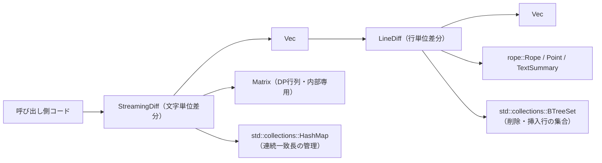
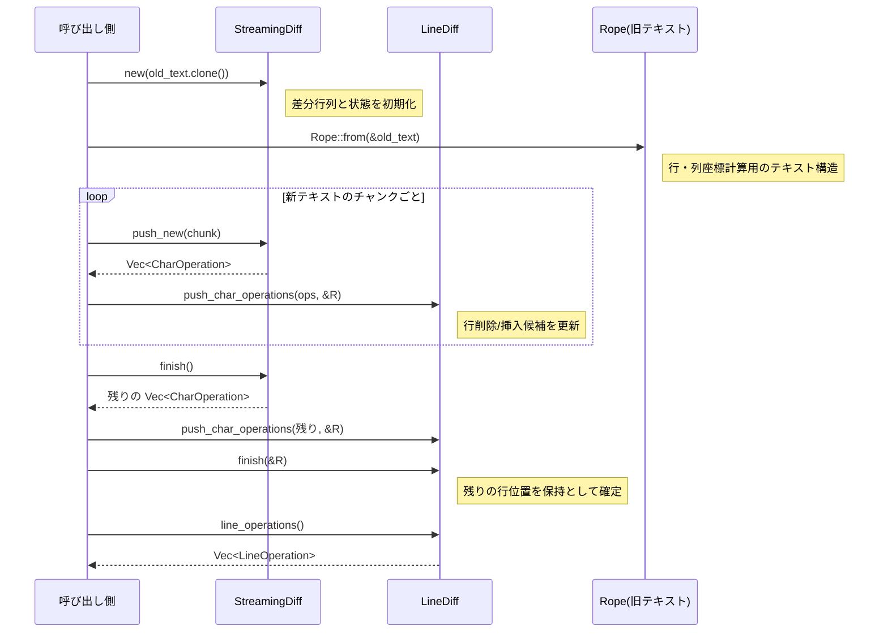

# streaming_diff/ ディレクトリ解説

## 1. ざっくり一言

`streaming_diff` クレートは、**文字列の差分をストリーミングに計算するアルゴリズム**と、得られた文字単位の差分を**行単位の差分に変換するロジック**を提供します。

---

## 2. このモジュールの役割

### 2.1 概要

- このディレクトリは、テキスト編集（エディタなど）における  
  **「元テキスト」→「新テキスト」への変更差分を、逐次的に・効率よく求める**ための機能を提供します。
- 具体的には次の 2 段階の処理を担います。
  - `StreamingDiff`: 文字列の追加をストリームとして受け取り、**文字単位の差分（挿入・削除・保持）**を生成する。
  - `LineDiff`: 文字単位の差分と元テキストを基に、**行単位の挿入・削除・保持**に集約する。

### 2.2 アーキテクチャ内での位置づけ

このクレート内部と外部依存の関係は、概ね次のようになります。



- 呼び出し側は、`StreamingDiff` に旧テキストと新テキストのチャンクを渡し、`CharOperation` を受け取ります。
- 行単位で扱いたい場合は、その `CharOperation` 列を `LineDiff` に渡し、`LineOperation` 列として利用します。
- `Matrix` は動的計画法のスコアを保持する内部構造で、外部には公開されません。
- 行単位処理は `rope` クレートの `Rope` / `Point` / `TextSummary` に依存します。

### 2.3 設計上のポイント

- **ストリーミング対応**
  - `StreamingDiff` は `push_new` で新しいテキスト断片を受け取り、その都度差分を更新します。
  - 全体の新テキストを一度に持たなくても差分が計算できます。
- **動的計画法 + 連続一致の強調**
  - 内部の `Matrix` でスコア行列を保持し、挿入・削除・一致に重み付けしたスコアを計算します。
  - 連続する一致（同じ文字が続く部分）は指数的に高いスコアを与え、**長い連続一致を優先**する設計になっています。
- **文字単位差分 → 行単位差分の分離**
  - 低レベルな差分（バイト/文字単位）は `CharOperation` で表現し、
  - 行単位の編集（`LineOperation`）は別構造 `LineDiff` で変換する二層構造です。
- **Rope ベースの座標系**
  - 行単位処理では `Rope` の `Point(row, column)` を使い、  
    削除・挿入行の集合（`BTreeSet<u32>`）として結果を保持します。
- **エッジケースの明示的な扱い**
  - 行頭・行末での挿入/削除、末尾の改行の有無、共通接尾辞の扱いなどを、専用ロジックで調整しています。

---

## 3. 主要な機能一覧

- `StreamingDiff::new`: 旧テキストからストリーミング差分計算器を初期化する。
- `StreamingDiff::push_new`: 新テキストのチャンクを追加し、そのチャンク分の `CharOperation` を返す。
- `StreamingDiff::finish`: 残りの差分をまとめて `CharOperation` として返す。
- `CharOperation`: 文字単位の挿入/削除/保持を表現する列挙体。
- `LineDiff::push_char_operation` / `push_char_operations`:
  - `CharOperation` と旧テキスト (`Rope`) を読み取り、行単位の変更情報を内部状態に反映する。
- `LineDiff::finish`: 文字単位差分の入力を終えたことを伝え、残りの状態を確定させる。
- `LineDiff::line_operations`: 行単位の `LineOperation` 列として結果を取得する。
- `LineOperation`: 行数ベースの挿入/削除/保持を表現する列挙体。

---

## 4. 関数・構造体の解説

### 4.1 主な型一覧

| 名前 | 種別 | 公開 | 役割 / 用途 |
|------|------|------|-------------|
| `Matrix` | 構造体 | 非公開 | 差分スコア行列（`rows x cols` の `f64`）を保持する内部ユーティリティ |
| `CharOperation` | enum | 公開 | 文字列の差分を「挿入 / 削除 / 保持」として表現する |
| `StreamingDiff` | 構造体 | 公開 | 旧テキストを基準に、新テキストをストリーミングで受け取り `CharOperation` を生成する |
| `LineOperation` | enum | 公開 | 行数ベースの「挿入 / 削除 / 保持」を表現する |
| `LineDiff` | 構造体 | 公開 | `CharOperation` と `Rope` を元に `LineOperation` を計算する |
| `is_line_start` | 関数 | 非公開 | `Point` が行頭かどうかを判定する |
| `is_line_end` | 関数 | 非公開 | `Point` が行末かどうかを判定する（`Rope` を利用） |

以下では特に重要な 6 つのメソッドについて詳しく説明します。

---

### 4.2 `StreamingDiff`（文字単位のストリーミング差分）

`StreamingDiff` は次のフィールドを持ちます（すべて非公開）:

- `old: Vec<char>`: 旧テキストを Unicode スカラ値（`char`）の配列として保持します。
- `new: Vec<char>`: これまでに受け取った新テキストの全文（同じく `char` ベクタ）。
- `scores: Matrix`: 差分スコア行列。行が旧テキスト位置、列が（ストリーミングの区切りからの）新テキスト位置です。
- `old_text_ix: usize`: これまでに処理済みの旧テキスト長（`old` ベクタ上のインデックス）。
- `new_text_ix: usize`: これまでに処理済みの新テキスト長（`new` ベクタ上のインデックス）。
- `equal_runs: HashMap<(usize, usize), u32>`:
  - `(i, j)` という旧・新インデックス対に対して、**その位置までの連続一致の長さ**を保持します。
  - これにより、連続一致に対して指数的なボーナススコアを与えられます。

#### 4.2.1 `StreamingDiff::new(old: String) -> Self`

**概要**

- 旧テキスト全体を受け取り、差分計算に必要な内部状態を初期化します。

**引数**

| 引数名 | 型 | 説明 |
|--------|----|------|
| `old` | `String` | 差分の基準となる旧テキスト全文 |

**戻り値**

- `StreamingDiff` の新しいインスタンス。まだ新テキストは一文字も読み込まれていません。

**内部処理の流れ**

1. `old` を `Vec<char>` に展開して `self.old` に保存します。
2. `Matrix::new` で空の行列を作成し、`old.len() + 1` 行・`1` 列に `resize` します。
3. 先頭列（`col = 0`）には、旧テキストを先頭から順にすべて削除した場合のスコアを設定します。
   - `scores[i, 0] = i as f64 * DELETION_SCORE`（`DELETION_SCORE = -20.0`）。
4. `new` は空、`old_text_ix` / `new_text_ix` は 0 に初期化されます。
5. `equal_runs` は空の `HashMap` です。

**エッジケース**

- `old` が空文字列でも動作します。その場合、初期行列は 1 行 (`i = 0`) のみになります。

**使用上の注意点**

- 1 つの `StreamingDiff` インスタンスは、**1 組の（旧テキスト, 新テキスト）ペアだけ**に使う前提です。
  - 別の旧テキストを使いたい場合は、新しいインスタンスを作成する必要があります。

---

#### 4.2.2 `StreamingDiff::push_new(&mut self, text: &str) -> Vec<CharOperation>`

**概要**

- 新テキストの一部（チャンク）を受け取り、そのチャンクにより確定した範囲までの `CharOperation` を返します。
- 既に以前のチャンクを処理済みである前提で、**増分のみ**を計算します。

**引数**

| 引数名 | 型 | 説明 |
|--------|----|------|
| `text` | `&str` | 新たに追加された新テキストのチャンク（UTF-8 文字列） |

**戻り値**

- 今回のチャンクにより新たに確定した部分の差分を表す `Vec<CharOperation>`。

**内部処理の流れ（簡略）**

1. `self.new` に `text.chars()` を追加します。
2. スコア行列の列入れ替えと拡張
   - 直前までの最終列（`new_text_ix` 時点）を列 0 にスワップ（`swap_columns`）。
   - 新しく追加された文字数に応じて、列数を `self.new.len() - self.new_text_ix + 1` に `resize`。
3. `equal_runs` を現在の境界に合わせてクリーニング
   - `retain(|(_i, j), _| *j == self.new_text_ix)` により、直前の境界で終わる連続一致だけを残します。
4. 新しい列のスコアを計算
   - `j` を `self.new_text_ix + 1..=self.new.len()` で走査し、相対列インデックス `relative_j` を計算。
   - 各 `i`（旧側インデックス）に対して:
     - 挿入スコア = 左セル + `INSERTION_SCORE`（-1.0）
     - 削除スコア = 上セル + `DELETION_SCORE`（-20.0）
     - 一致スコア:
       - `old[i-1] == new[j-1]` のとき、`equal_runs[(i, j)]` を更新し、
       - 連続一致長に応じた指数的ボーナス `EQUALITY_BASE.powi(exponent)` を付与。
5. 今回のチャンク処理後に最もスコアが高くなる `i`（旧テキスト位置）を探索し、  
   そこまでを `next_old_text_ix` として選択します（`next_new_text_ix` は `self.new.len()`）。
6. `backtrack(next_old_text_ix, next_new_text_ix)` を呼び出し、
   - 前回の境界 `(self.old_text_ix, self.new_text_ix)` から今回の境界までの最適経路を辿り、
   - その区間の `CharOperation` 列を生成します。
7. `self.old_text_ix` / `self.new_text_ix` を更新し、生成した `CharOperation` を返します。

**生成される `CharOperation` の性質**

- `Insert { text }`
  - 新テキスト側の連続した挿入をまとめて 1 つにまとめます（`pending_insert` による集約）。
- `Delete { bytes }` / `Keep { bytes }`
  - 旧テキストの `char` 長から `len_utf8()` を用いてバイト数を積算しています。
  - したがって `bytes` は常に UTF-8 の文字境界に揃った値になります。

**エッジケース**

- 新チャンクが空文字列の場合でも、内部の状態更新はされますが、基本的に空ベクタが返ります。
- 差分は **必ず前回の境界から今回の境界まで**の操作に対応します。チャンクをスキップしたり順番を変えることは想定されていません。

**使用上の注意点**

- `text` は **新テキストの末尾にそのまま連結される**前提で渡す必要があります。
  - 途中のチャンクを後から修正するような使い方はサポートしていません。
- `CharOperation` の `bytes` は **旧テキストに対するオフセット**として解釈すべきであり、  
  適用時にも同じ旧テキストを使う必要があります。

---

#### 4.2.3 `StreamingDiff::finish(self) -> Vec<CharOperation>`

**概要**

- それまでのストリーミング入力で処理しきれていない残りの差分をまとめて計算し、`CharOperation` として返します。
- `self` を消費する（`self` 取り）メソッドです。

**引数**

- なし（`self` を所有権ごと消費）

**戻り値**

- 最後の境界 (`self.old.len()`, `self.new.len()`) までの差分 `Vec<CharOperation>`。

**内部処理の流れ**

1. 内部的には `backtrack(self.old.len(), self.new.len())` を呼び出します。
2. これまでの `old_text_ix` / `new_text_ix` から、テキストの末尾までの最適経路を辿り、  
   その区間の `CharOperation` 列を生成して返します。

**エッジケース**

- `push_new` を一度も呼んでいない場合でも、`old` と `new` が同じ（どちらも空）なので、空ベクタが返ります。

**使用上の注意点**

- `finish` を呼んだあとは `StreamingDiff` インスタンスは使えません（所有権が消費されるため）。
- 全差分が欲しい場合は、`push_new` で全チャンクを流してから `finish` を一度だけ呼びます。

---

### 4.3 `LineDiff`（文字差分から行差分への変換）

`LineDiff` は、旧テキストを `Rope` で受け取り、`CharOperation` を逐次解釈して  
「どの行が削除され / 挿入されたか」を次のような形で内部に保持します。

- `old_end: Point` / `new_end: Point`:
  - これまでに処理済みの旧/新テキストの末尾位置（行・列）。
- `deleted_rows: BTreeSet<u32>`:
  - 旧テキスト上で削除とみなされた行番号の集合。
- `inserted_rows: BTreeSet<u32>`:
  - 新テキスト上で挿入とみなされた行番号の集合。
- `buffered_insert: String` / `buffered_delete: usize`:
  - 行の判定をする前に一時的に溜めておく挿入文字列と削除バイト数。
- `inserted_newline_at_end: bool`:
  - 直前に末尾に改行を挿入したかどうかのフラグ。

#### 4.3.1 `LineDiff::push_char_operation(&mut self, operation: &CharOperation, old_text: &Rope)`

**概要**

- 単一の `CharOperation` を受け取り、`LineDiff` の内部状態（`old_end`, `new_end`, `deleted_rows`, `inserted_rows` など）を更新します。
- 文字単位操作の組み合わせから、**行単位でどの行が削除・挿入されたと見なせるか**を判断するためのコアメソッドです。

**引数**

| 引数名 | 型 | 説明 |
|--------|----|------|
| `operation` | `&CharOperation` | 適用する文字単位の操作（挿入 / 削除 / 保持） |
| `old_text` | `&Rope` | 旧テキスト全体。`Point` とバイトオフセットの変換に使用 |

**戻り値**

- なし（`self` の内部状態を更新）

**内部処理の流れ（概要）**

1. `Insert { text }` の場合
   - まず `flush_delete` を呼んで、溜まっている削除を処理します。
   - 現在位置 `old_end` が行頭かどうかで分岐します。
     - 行頭であれば、`text` の中に含まれる改行位置（とくに最後の改行）を見て、
       - 丸ごと新しい行として扱える部分は即座に `flush_insert` で行挿入として扱う、
       - 残りは `buffered_insert` に貯めて、後続の操作とまとめて判断します。
     - 行中での挿入で、末尾が改行で終わっていない場合は、`flush_insert` で即座に判定します。
2. `Delete { bytes }` の場合
   - `buffered_delete` に削除バイト数を加算します。
   - `trim_buffered_end` で、現在 `buffered_insert` に溜まっている挿入テキストとの**共通接尾辞**を取り除きます。
     - 共通部分は「削除→挿入」ではなく「保持」扱いにできます。
   - その後 `flush_insert` を呼び、挿入バッファを確定させます。
   - 共通接尾辞が存在する、または `old_end` が行末でない場合は、
     - `flush_delete` を呼んで削除を確定させ、
     - 共通接尾辞のバイト数を `keep` で「保持」として進めます。
3. `Keep { bytes }` の場合
   - 現在溜まっている削除・挿入を先に `flush_delete` / `flush_insert` で処理し、
   - 残りの `bytes` を `keep` で旧・新の `Point` を同じだけ進めます。

**エッジケース**

- 行頭・行末での挿入・削除は、**行全体を削除→挿入とみなすか、一部編集とみなすか**で分岐が複雑です。
  - `is_line_start` / `is_line_end`、`inserted_newline_at_end` などを組み合わせて評価しています。
- `trim_buffered_end` により、`Delete` と `Insert` がほぼ同じテキストを扱う場合、  
  改行をまたいだ置換などでも「本当に変わった部分」だけが行操作として反映されます。

**使用上の注意点**

- 渡す `CharOperation` の列は、**同じ `old_text` を前提として StreamingDiff 等で生成されたもの**である必要があります。
  - バイト数が `old_text` と不整合な場合、`Rope` のオフセット計算が失敗または破綻する可能性があります。
- 通常はこのメソッドを直接繰り返し呼び出すよりも、`push_char_operations`（イテレータをまとめて処理するメソッド）を使う方が自然です。

---

#### 4.3.2 `LineDiff::finish(&mut self, old_text: &Rope)`

**概要**

- これ以上 `CharOperation` が来ないことを `LineDiff` に伝え、未処理の挿入・削除をすべて確定させます。

**引数**

| 引数名 | 型 | 説明 |
|--------|----|------|
| `old_text` | `&Rope` | 旧テキスト。残りの「保持」部分の行位置を計算するために使用 |

**戻り値**

- なし（内部状態を確定させる）

**内部処理の流れ**

1. `flush_insert` と `flush_delete` を呼び出して、バッファ中の挿入・削除をすべて処理します。
2. 現在位置 `old_end` から `old_text.max_point()` までを「保持」と見なし、
   - `old_end` をテキスト末尾まで進め、
   - `new_end` も同じ差分だけ進めます（旧・新テキストの末尾位置を揃えます）。

**エッジケース**

- `CharOperation` 列の最後が挿入や削除で終わっている場合、それらをここで確定します。
- 旧テキスト末尾まで何も差分がなかった場合は、単に `old_end` と `new_end` が末尾まで進むだけです。

**使用上の注意点**

- `line_operations()` を呼ぶ前には必ず `finish()` を呼び、状態を確定させる必要があります。
- `finish` を複数回呼んでも、大きな副作用はありませんが、通常は一度だけ呼ぶことが想定されています。

---

#### 4.3.3 `LineDiff::line_operations(&self) -> Vec<LineOperation>`

**概要**

- `deleted_rows` / `inserted_rows` に基づいて、行単位の操作列（`LineOperation`）を生成します。

**引数**

- なし（`&self`）

**戻り値**

- 行単位の挿入・削除・保持を表す `Vec<LineOperation>`。

  - `LineOperation::Keep { lines }`  
    行番号が揃ったまま変更がない連続行数。
  - `LineOperation::Delete { lines }`  
    旧テキスト側で削除された連続行数。
  - `LineOperation::Insert { lines }`  
    新テキスト側で挿入された連続行数。

**内部処理の流れ（概要）**

1. `deleted_rows` / `inserted_rows` をそれぞれ `peekable` イテレータにします。
2. `old_row` / `new_row` を 0 からスタート。
3. 両集合に要素がある間ループし、次の優先順位で処理します。
   - 現在の `old_row` が `deleted_rows` の次の要素であれば、`Delete` を 1 行追加し、`old_row` を 1 増やします。
   - そうでなく、現在の `new_row` が `inserted_rows` の次の要素であれば、`Insert` を 1 行追加し、`new_row` を 1 増やします。
   - それ以外の場合は、「次の削除 or 挿入が来るまで」の行数を見て、少なくとも 1 行を `Keep` として追加します。
4. ループ終了後、`old_row` が `old_end.row + 1` に達していなければ、残りをまとめて `Keep` として追加します。

**エッジケース**

- 削除と挿入が入り交じる場合でも、削除・挿入・保持が最小限のまとまりになるように連続行をマージします。
- 末尾に変更がない行が残っている場合、それらが最後の `Keep` にまとめて反映されます。

**使用上の注意点**

- `deleted_rows` / `inserted_rows` は `push_char_operation` / `finish` の呼び出し時に構築されるため、  
  `line_operations` を呼ぶ前にそれらが正しく構築されていることが前提です。
- 行番号は 0 起算（`row: u32`）です。  
  テストのヘルパである `apply_line_operations` では、`split('\n')` を前提にしていますが、これはあくまでテスト側の例です。

---

### 4.4 その他の関数・メソッド一覧

重要度は低いですが、内部で利用されている補助メソッドを一覧します。

| 関数 / メソッド名 | 所属 | 役割（1 行） |
|-------------------|------|--------------|
| `Matrix::new` | `Matrix` | 空の行列を作成する |
| `Matrix::resize` | `Matrix` | 行数・列数を変更し、要素を 0.0 で埋める |
| `Matrix::swap_columns` | `Matrix` | 2 つの列を入れ替える（`unsafe` を用いたブロックコピー） |
| `Matrix::get` / `set` | `Matrix` | 行列の要素を取得 / 設定する（範囲外アクセス時に `panic!`） |
| `StreamingDiff::backtrack` | `StreamingDiff` | スコア行列から最適な操作列（`CharOperation`）を復元する |
| `LineDiff::push_char_operations` | `LineDiff` | `IntoIterator<Item=&CharOperation>` をまとめて処理するラッパー |
| `LineDiff::flush_insert` | `LineDiff` | `buffered_insert` を行単位に解釈して `inserted_rows` 等を更新する |
| `LineDiff::flush_delete` | `LineDiff` | `buffered_delete` を行単位に解釈して `deleted_rows` 等を更新する |
| `LineDiff::keep` | `LineDiff` | 指定バイト数分、旧・新の `Point` を同じだけ前進させる |
| `LineDiff::trim_buffered_end` | `LineDiff` | `buffered_insert` と削除対象部分の共通接尾辞を削る |
| `is_line_start` | モジュール関数 | `Point.column == 0` かどうかを判定する |
| `is_line_end` | モジュール関数 | `Rope::line_len(row) == column` かどうかを判定する |

---

## 5. データフロー

ここでは、**旧テキストから新テキストへの変更をストリーミングに受け取り、最終的に行単位の差分を得る**典型的な流れを示します。

1. 呼び出し側は旧テキスト `old_text: String` を持っている。
2. `StreamingDiff::new(old_text.clone())` で差分計算器を初期化する。
3. 新テキスト `new_text` を任意サイズのチャンクに分割し、`push_new` に順番に渡す。
4. 各 `push_new` の戻り値（`Vec<CharOperation>`）をどこかに蓄積する。
5. 最後に `finish` を呼んで残りの `CharOperation` を受け取る。
6. こうして得られた `CharOperation` 列と、`Rope::from(&old_text)` を用いて `LineDiff` を構築し、
   - `push_char_operations` → `finish` → `line_operations` で `Vec<LineOperation>` を取得する。

この流れをシーケンス図で表すと次のようになります。



---

## 6. 使い方（How to Use）

### 6.1 基本的な使用方法（文字単位差分 → 行単位差分）

ここでは、**旧テキストと新テキストが既にどちらも手元にある**場合の、最も単純な利用例を示します。

```rust
use streaming_diff::{StreamingDiff, CharOperation, LineDiff, LineOperation}; // クレートの公開APIをインポートする
use rope::Rope;                                                              // 行単位座標管理のための Rope をインポートする

// 旧テキストと新テキスト
let old_text = "Hello, world!\nSecond line".to_string();                     // 旧テキストを String として用意する
let new_text = "Hello, Rust!\nSecond line".to_string();                      // 新テキストを String として用意する

// 1. StreamingDiff で文字単位の差分を計算する
let mut diff = StreamingDiff::new(old_text.clone());                         // 旧テキストを渡して差分計算器を初期化する

let mut char_ops: Vec<CharOperation> = Vec::new();                           // CharOperation を蓄積するベクタ
char_ops.extend(diff.push_new(&new_text));                                   // 新テキスト全体を 1 回のチャンクとして渡し、差分を追加で取得する
char_ops.extend(diff.finish());                                              // 残りの差分を取得し、すべての CharOperation を集める

// 2. CharOperation を適用して本当に new_text になることを確認する（参考：テストと同じロジック）
fn apply_char_operations(old_text: &str, ops: &[CharOperation]) -> String {  // CharOperation を適用して新テキストを生成する補助関数
    let mut result = String::new();                                          // 結果文字列を初期化する
    let mut old_ix = 0;                                                      // 旧テキスト側の現在位置（バイトオフセット）

    for op in ops {                                                          // すべての CharOperation を順に処理する
        match op {                                                           // 種類ごとに分岐する
            CharOperation::Keep { bytes } => {                               // 旧テキストをそのまま保持する場合
                result.push_str(&old_text[old_ix..old_ix + bytes]);         // 指定バイト数分を結果にコピーする
                old_ix += bytes;                                             // 旧テキスト側の位置を進める
            }
            CharOperation::Delete { bytes } => {                             // 旧テキストを削除する場合
                old_ix += bytes;                                             // 指定バイト数分だけ旧テキスト側の位置を飛ばす
            }
            CharOperation::Insert { text } => {                              // 新テキストを挿入する場合
                result.push_str(text);                                       // 挿入テキストをそのまま結果に追加する
            }
        }
    }

    result                                                                   // 最終的な新テキストを返す
}

let patched = apply_char_operations(&old_text, &char_ops);                   // 旧テキストに CharOperation を適用する
assert_eq!(patched, new_text);                                               // StreamingDiff の結果が正しいことを確認する

// 3. LineDiff で行単位の差分を計算する
let old_rope = Rope::from(old_text.as_str());                                // 旧テキストから Rope を作成する
let mut line_diff = LineDiff::default();                                     // 行単位差分計算器を初期化する

for op in &char_ops {                                                        // 文字単位の操作列を順に処理する
    line_diff.push_char_operation(op, &old_rope);                            // 各 CharOperation を LineDiff に反映する
}

line_diff.finish(&old_rope);                                                 // 残りの状態を確定させる
let line_ops: Vec<LineOperation> = line_diff.line_operations();              // 行単位の操作列を取得する

println!("{:?}", line_ops);                                                  // 例として結果をデバッグ出力する
```

この例では、テストコード中の `apply_char_operations` と同等のロジックを利用して  
`StreamingDiff` の結果確認も行っています。

### 6.2 よくある使用パターン

#### パターン 1: ストリーミング入力（チャンク単位）

新テキストがネットワークやプロセス間通信などで **チャンク単位**で届く場合のパターンです。

```rust
use streaming_diff::{StreamingDiff, CharOperation};                          // 差分計算器と操作型をインポートする

let old_text = /* 旧テキスト */ String::from("...");                        // 旧テキストを用意する
let mut diff = StreamingDiff::new(old_text.clone());                         // StreamingDiff を初期化する

let mut all_ops: Vec<CharOperation> = Vec::new();                            // 全チャンク分の CharOperation を蓄積する

// 仮想的なチャンク列を表すイテレータ
let chunks: Vec<String> = vec!["part1".into(), "part2".into(), "part3".into()]; // 例として 3 つのチャンクに分割された新テキスト

for chunk in chunks {                                                        // 各チャンクを順に処理する
    let ops = diff.push_new(&chunk);                                         // そのチャンクによって確定した差分を取得する
    all_ops.extend(ops);                                                     // 差分をまとめて蓄積する
}

all_ops.extend(diff.finish());                                               // 残りの差分をまとめて追加する
// ここで all_ops が最終的な文字単位差分になる
```

ポイント:

- `push_new` を呼ぶ順番は、新テキストの順序そのものです。
- 各回の戻り値は「これまでに確定した区間」のみであり、後続のチャンクと合わせて最終差分になります。

#### パターン 2: 行単位差分だけ欲しい場合

文字単位差分を中間結果として利用せず、行単位の変化だけが欲しいケースです。

```rust
use streaming_diff::{StreamingDiff, LineDiff, CharOperation, LineOperation}; // 必要な型をインポートする
use rope::Rope;                                                              // Rope をインポートする

let old_text = String::from("line1\nline2\nline3");                          // 旧テキストを用意する
let new_text = String::from("line1\nchanged2\nline3");                       // 新テキストを用意する

let mut sd = StreamingDiff::new(old_text.clone());                           // StreamingDiff を初期化する
let mut char_ops: Vec<CharOperation> = Vec::new();                           // CharOperation の蓄積用ベクタ
char_ops.extend(sd.push_new(&new_text));                                     // 新テキスト全体を 1 回のチャンクとして差分計算する
char_ops.extend(sd.finish());                                                // 残りの差分を追加する

let old_rope = Rope::from(old_text.as_str());                                // 旧テキストから Rope を生成する
let mut ld = LineDiff::default();                                            // LineDiff を初期化する
ld.push_char_operations(&char_ops, &old_rope);                               // CharOperation の列を一括で適用する
ld.finish(&old_rope);                                                        // 状態を確定させる

let line_ops: Vec<LineOperation> = ld.line_operations();                     // 行単位の差分を取得する
println!("{:?}", line_ops);                                                  // 結果を確認する
```

### 6.3 よくある間違い

```rust
use streaming_diff::StreamingDiff;

let old_text = String::from("old");
let mut diff = StreamingDiff::new(old_text);             // OK: 旧テキストを渡す

// 間違いの例: 途中で new_text の内容を変えている
let mut new_text = String::from("new1");                 // 最初の新テキスト
let _ = diff.push_new(&new_text);                        // ここまでは OK

new_text = String::from("completely different");         // 別の新テキストを上書きしてしまう
let _ = diff.push_new(&new_text);                        // NG: 前回までのチャンクと連続していない
```

- このように、`StreamingDiff` は「**単一の旧テキスト vs 単一の新テキスト**」の前提で設計されています。
- チャンクごとにテキスト全体を入れ替えると、内部状態との整合性が取れなくなります。

```rust
use streaming_diff::{LineDiff, CharOperation};
use rope::Rope;

let old_text = String::from("line1\nline2\nline3");
let old_rope = Rope::from(old_text.as_str());

let mut ld = LineDiff::default();

// 間違いの例: finish を呼ばずに line_operations を使う
ld.push_char_operation(&CharOperation::Delete { bytes: 6 }, &old_rope); // 何らかの削除操作を適用する
// ld.finish(&old_rope);                                                // ← これを呼ばずに
let line_ops = ld.line_operations();                                    // 状態が未確定のまま結果を取得してしまう
```

- `finish` を呼ばないと、内部バッファに残っている挿入・削除が `line_operations` に反映されない可能性があります。

### 6.4 使用上の注意点（まとめ）

- **StreamingDiff の前提**
  - 1 インスタンス = 1 組の旧/新テキスト。
  - `push_new` は新テキスト末尾に順に追記されるチャンクだけを渡す。
  - `finish` は最終的に一度だけ呼ぶ。
- **CharOperation の `bytes`**
  - UTF-8 のバイト数であり、「旧テキストの何バイトを削除/保持するか」を表します。
  - 自前で `CharOperation` を作る場合は、必ず文字境界に揃ったバイト数を使う必要があります。
- **LineDiff の前提**
  - 渡す `CharOperation` 列は、必ず同じ `old_text: Rope` と整合している必要があります。
  - `push_char_operation(s)` で全操作を渡したあと、`finish` を呼んでから `line_operations` を呼ぶ。
- **行の扱い**
  - 改行文字は `'\n'` を前提として処理されています（テストも `split('\n')` を使用）。
  - 行頭 (`column == 0`) / 行末 (`line_len(row) == column`) の判定に基づき、行単位の削除・挿入が決まります。
- **パニックの可能性**
  - `Matrix::get` / `set` は範囲外アクセスで `panic!` しますが、これは内部実装でのみ使用されます。
  - 呼び出し側が不整合な `CharOperation` を渡すと、`Rope` のオフセット計算で問題が発生する可能性があります。

---

## 7. 関連ファイル

| パス | 役割 / 関係 |
|------|------------|
| `streaming_diff/Cargo.toml` | クレート名（`streaming_diff`）、依存クレート (`ordered-float`, `rope`) の宣言。ライブラリのエントリポイントを `src/streaming_diff.rs` に指定。 |
| `streaming_diff/src/streaming_diff.rs` | 本レポートで説明したすべての型・関数が定義されているメイン実装ファイル。`Matrix`, `StreamingDiff`, `CharOperation`, `LineDiff`, `LineOperation` など。 |

このディレクトリ内にはテストコードも同じファイル内の `#[cfg(test)] mod tests` として定義されており、  
`StreamingDiff` と `LineDiff` の組み合わせが、ランダムなテキスト編集を含む多様なケースで整合することが検証されています。
