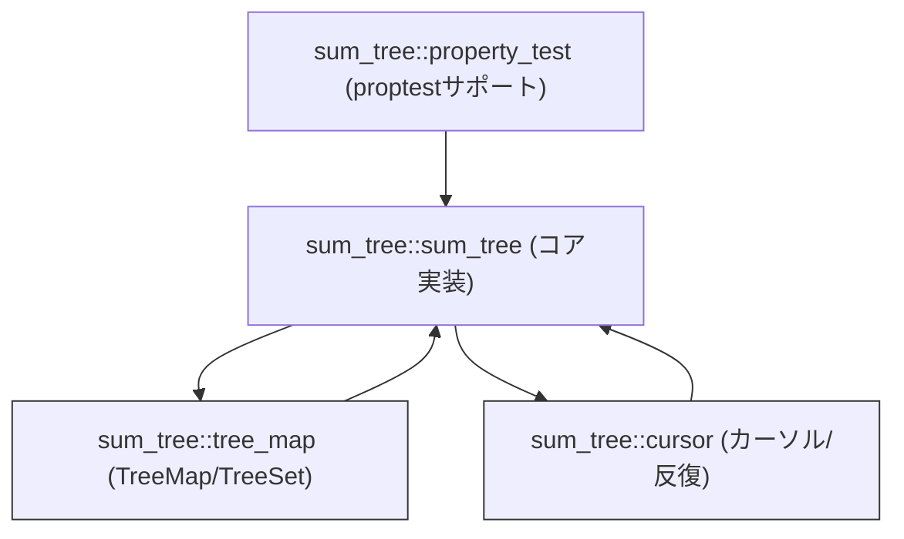
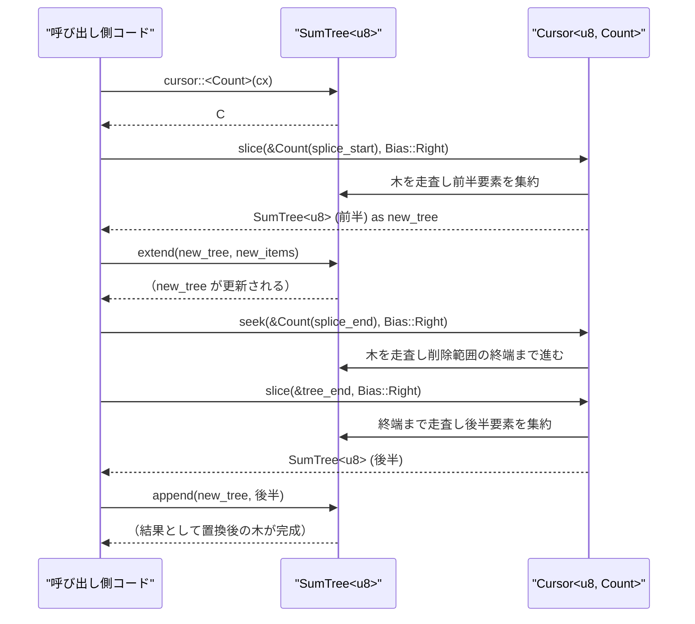

# sum_tree/ ディレクトリ解説

## 1. ざっくり一言

- 任意の要素列を B+ 木で管理し、要素の「集約情報（Summary）」に基づいて高速に探索・スライスできる、コピーオンライト型の木構造を提供するクレートです。
- この木構造の上に、`TreeMap` / `TreeSet` という順序付きマップ・セット実装も載っています。

---

## 2. このモジュールの役割

### 2.1 概要

- このクレートは **順序付きシーケンスやマップを効率的に管理したい** という問題に対して、
  - B+ 木ベースの `SumTree<T>`（並列構築・コピーオンライト対応）
  - 汎用的な「要約」インターフェイス（`Summary`, `Dimension`, `SeekTarget`）
  - それを利用したカーソル走査（`Cursor`, `FilterCursor`, `Iter`）
  - その上に構築された `TreeMap<K, V>` / `TreeSet<K>`
  を提供します。
- Summary と Dimension をうまく設計すると、「文字数」「行数」「バイト数」など複数の指標でシーケンスを横断的に走査・スライスできます（コメント中で Zed の rope を想定した例が挙げられています）。

### 2.2 アーキテクチャ内での位置づけ

このクレート内のモジュール同士の関係は概ね次のようになっています。



- `sum_tree::sum_tree`
  - **クレートの中核**です。
  - B+ 木本体 `SumTree<T>` とノード型 `Node<T>` の実装
  - 要素インターフェイス `Item`, `KeyedItem`
  - 集約情報インターフェイス `Summary`, `Dimension`, `SeekTarget`
  - 位置解決のための `Bias`
  - `SumTree` を用いた key ベース操作（`insert_or_replace`, `edit`, `get` など）
- `sum_tree::cursor`
  - `SumTree` 上を走査・検索するためのカーソル (`Cursor`, `FilterCursor`) と単純イテレータ (`Iter`) を定義します。
  - `Cursor::seek` / `slice` / `summary` など、Summary/Dimension を利用した高度な走査ロジックを持ちます。
- `sum_tree::tree_map`
  - `SumTree<MapEntry<K,V>>` をラップして、**順序付きマップ (`TreeMap`) とセット (`TreeSet`)** を提供します。
  - キーに対するシーク機能のための補助型 `MapKey`, `MapKeyRef`, `MapSeekTarget`, `MapSeekTargetAdaptor` を定義します。
- `sum_tree::property_test`
  - proptest 用に `SumTree<T>` の `Arbitrary` 実装および `sum_tree` ストラテジを提供します。
  - `test` もしくは `test-support` feature 有効時のみ公開されます。

### 2.3 設計上のポイント

コードから読み取れる特徴を整理すると、次のようになります。

- **B+ 木構造**
  - ノード型 `Node<T>` は `Internal` / `Leaf` の 2 種類です。
  - 各ノードの要素数は `TREE_BASE`〜`2 * TREE_BASE` の範囲で保たれます（テスト時は小さく 2、本番時は 6）。
  - 葉ノードに実データ `items` とその `item_summaries` が入り、内部ノードは子ノードの `child_trees` と `child_summaries` を持ちます。
- **Summary / Dimension による汎用的な位置表現**
  - `Summary` は部分木の集約情報（例: 件数、合計、最大値など）を表現します。
  - `Dimension<'a, S>` は Summary を「どの観点で」足し合わせるかを定義します（例: 行数・バイト数など）。
  - `SeekTarget` は「現在位置（Dimension）と比較して目的位置に達したかどうか」を定義するインターフェイスです。
  - これらを組み合わせることで、任意の基準で木をシークできます。
- **コピーオンライトと並行性を意識した設計**
  - `SumTree<T>` は内部に `Arc<Node<T>>` を持ち、`Clone` が安価です。
  - 変更操作では `Arc::make_mut` を通じて必要な部分だけコピーしつつ更新します。
  - 読み取り専用のクローンはノードを共有するため、スレッド間共有（`T`/`Summary` が `Send`/`Sync` な場合）との相性が良い構造です。
- **固定長配列ベースのノード**
  - `heapless::Vec` を `ArrayVec` として利用し、各ノードの子数・要素数に静的上限を設けています。
  - `CapacityResultExt::unwrap_oob` により、容量オーバーは早期の panic で検知されます。
- **並列構築**
  - `from_par_iter` は `rayon` を使って葉ノード・内部ノードの構築をチャンク単位で並列化します。
- **カーソルによる双方向走査**
  - `Cursor` はスタック（`stack: ArrayVec<StackEntry>`）で「現在どのノードの何番目か」を保持し、前後方向に効率よく移動します。
  - `FilterCursor` はノードの summary を使って「条件を満たす部分だけ」を飛びながら走査します。
- **KeyedItem ベースのマップ操作**
  - `KeyedItem` は `Item` に「キー取得メソッド」を足したトレイトで、`SumTree<T>` 上に map 的操作（insert / remove / edit）を実装するために使われます。
  - `tree_map.rs` はこれを汎用化し、`TreeMap<K, V>` / `TreeSet<K>` として公開します。

---

## 3. 主要な機能一覧

このディレクトリ（クレート）が提供する主な機能をまとめます。

- **SumTree 本体**
  - 任意の `Item` を格納する B+ 木 `SumTree<T>`
  - イテレーション（`iter` / `Iter`）と双方向カーソル（`Cursor` / `FilterCursor`）
  - 連結・拡張（`append`, `extend`, `par_extend`, `push`, `from_iter`, `from_par_iter`）
  - 要約情報の取得（`summary`, `extent`）
  - 木の末尾更新（`update_first`, `update_last`）
  - 高速な探索（`find`, `find_exact`, `find_with_prev`）
- **SumTree 上のキー操作（KeyedItem 向け）**
  - `insert_or_replace`, `remove`, `edit`, `get` など、キー付き要素に対する挿入・削除・一括編集
- **カーソル関連**
  - 任意の Dimension でのシーク（`Cursor::seek`, `seek_forward`）
  - 区間を木として切り出す（`Cursor::slice`, `suffix`）
  - 区間サマリの取得（`Cursor::summary`）
  - 現在・直前・直後の要素取得（`item`, `prev_item`, `next_item`）
- **TreeMap / TreeSet**
  - `TreeMap<K, V>`: `insert`, `insert_or_replace`, `get`, `contains_key`, `remove`, `remove_range`, `closest`, `iter`, `iter_from`, `retain`, `clear`, `insert_tree`, `extend` など
  - `TreeSet<K>`: `insert`, `remove`, `contains`, `extend`, `iter`, `iter_from`
  - 柔軟な範囲操作のための `MapSeekTarget` / `MapSeekTargetAdaptor`
- **テスト・プロパティテスト用**
  - `property_test::sum_tree`: 任意の `Item` を使った `SumTree` を生成する proptest ストラテジ
  - `impl Arbitrary for SumTree<T>`（`test-support` feature / `test` 時）

---

## 4. 関数・構造体の解説

### 4.1 主要な型・トレイト一覧

| 名前 | 種別 | 役割 / 用途 |
|------|------|-------------|
| `Item` | トレイト | `SumTree` に格納できる要素を表します。各要素は `Summary` によって要約されます。 |
| `KeyedItem` | トレイト | `Item` にキー（`Key`）を付与したもの。キーによる map 的な操作に利用されます。 |
| `Summary` | トレイト | 部分木全体の要約情報（例: 個数、合計、フラグなど）を表します。 |
| `ContextLessSummary` | トレイト | `Context` を持たない単純な `Summary` 向けヘルパーです。 |
| `Dimension<'a, S>` | トレイト | Summary を「どの観点で積み上げるか」を表す軸（例: 個数、バイト数）です。 |
| `SeekTarget<'a, S, D>` | トレイト | 「現在位置（D）と比較して、目的地に対してどの位置か」を定義する比較インターフェイスです。 |
| `Bias` | enum | シーク時に「左に寄せるか / 右に寄せるか」を決めるバイアスです。 |
| `SumTree<T>` | 構造体 | B+ 木本体。`Arc<Node<T>>` を包んだコピーオンライト構造です。 |
| `Node<T>` | enum | B+ 木のノード（内部ノード / 葉ノード）です。内部実装用で公開されていません。 |
| `Cursor<'a, 'b, T, D>` | 構造体 | `SumTree` 上を任意の `Dimension` でシーク・部分スライス・サマリ取得するためのカーソルです。 |
| `Iter<'a, T>` | 構造体 | 木全体を前方向に走査する単純イテレータです。 |
| `FilterCursor<'a, 'b, F, T, D>` | 構造体 | ノードの `Summary` に対するフィルタ関数付きカーソルです。 |
| `Edit<T>` | enum | `KeyedItem` 用の編集指示（挿入 or 削除）を表します。`SumTree::edit` で使用します。 |
| `TreeMap<K, V>` | 構造体 | `SumTree<MapEntry<K, V>>` を使った順序付きマップです。 |
| `TreeSet<K>` | 構造体 | 内部的に `TreeMap<K, ()>` を用いた順序付きセットです。 |
| `MapEntry<K, V>` | 構造体 | `TreeMap` 内部で使う 1 エントリ（`key`, `value`）です。 |
| `MapKey<K>` | 構造体 | `MapEntry` の `Summary` 型。部分木の中で「最後のキー」を保持します。 |
| `MapKeyRef<'a, K>` | 構造体 | `MapKey<K>` に対する `Dimension` 型として使われる、`Option<&K>` のラッパです。 |
| `MapSeekTarget<K>` | トレイト | `TreeMap` 用の柔軟な範囲指定を行うための比較インターフェイスです。 |

以下、特に重要なメソッド/関数を 7 個まで詳細に説明します。

---

### 4.2 代表的な関数・メソッド詳細

#### `SumTree::from_iter<I: IntoIterator<Item = T>>(iter, cx) -> Self`

**概要**

- `IntoIterator` から要素を読み出し、それらをまとめて B+ 木 `SumTree` に構築します。
- 要素は最大 `2 * TREE_BASE` 個ずつまとめて葉ノードを作り、それを上に積み上げて内部ノードを形成します。

**引数**

| 引数名 | 型 | 説明 |
|--------|----|------|
| `iter` | `I: IntoIterator<Item = T>` | 木に格納する要素列です。順序はそのまま保持されます。 |
| `cx` | `<T::Summary as Summary>::Context<'_>` | Summary 計算に必要なコンテキスト。`ContextLessSummary` の場合は `()` です。 |

**戻り値**

- `Self`（`SumTree<T>`）: `iter` の要素をすべて含んだ B+ 木です。要素が空なら `SumTree::new(cx)` と同じく空の葉ノードになります。

**内部処理の流れ**

1. `iter.into_iter().fuse().peekable()` でイテレータを用意します。
2. 最大 `2 * TREE_BASE` 件ずつ `ArrayVec` に詰めて葉ノードを作成します。
   - 各要素について `item.summary(cx)` を呼び、`item_summaries` を作成。
   - `item_summaries` を足し合わせて葉ノードの `summary` を計算します。
3. 葉ノードを `nodes: Vec<SumTree<T>>` に積み上げます。
4. `nodes.len() > 1` の間、次を繰り返します。
   - `height` を 1 ずつ増やしながら、最大 `2 * TREE_BASE` 個の `nodes` をまとめて内部ノードを作ります。
   - 子ノードの `summary` を足し合わせて内部ノードの `summary` を作成し、`child_summaries` / `child_trees` を設定します。
5. 最後に `nodes` が 1 つならそれを返し、空なら `Self::new(cx)` を返します。

**Examples（使用例）**

`u32` を単純に「総和だけを持つ Summary」として扱う例です。

```rust
use sum_tree::{ContextLessSummary, Item, SumTree, Summary}; // SumTree とトレイトをインポート

// 要約用の型。値の合計だけを持つ                                 // 各要素の合計値を保持する Summary 型
#[derive(Clone, Default)]
struct SumSummary(u32);                                         // 合計値を格納する構造体

impl ContextLessSummary for SumSummary {                        // Context を持たない Summary として実装
    fn zero() -> Self { SumSummary(0) }                         // ゼロ値は 0
    fn add_summary(&mut self, other: &Self) {                   // 合計値を加算
        self.0 += other.0;
    }
}

impl Summary for SumSummary {                                   // Summary トレイトの実装
    type Context<'a> = ();                                      // コンテキストは () で固定
    fn zero<'a>((): ()) -> Self { SumSummary::zero() }          // zero は上の実装を利用
    fn add_summary<'a>(&mut self, s: &Self, (): ()) {           // add_summary も同様
        self.add_summary(s);
    }
}

// 要素は単純な u32 とし、その要約を SumSummary とする                 // u32 を SumTree に格納するための Item 実装
impl Item for u32 {
    type Summary = SumSummary;
    fn summary(&self, _cx: ()) -> Self::Summary {               // 要約は自分自身の値
        SumSummary(*self)
    }
}

// ベクタから SumTree を構築                                        // Vec から SumTree を構築
let values = vec![1, 2, 3, 4];                                  // 4 つの値
let tree = SumTree::from_iter(values, ());                      // () をコンテキストにして SumTree を作成

assert_eq!(tree.items(()), vec![1, 2, 3, 4]);                   // 元の順序で格納されている
```

**Errors / Panics**

- ノードあたりの要素数が `2 * TREE_BASE` を超えるような追加は行っていないため、`ArrayVec::collect` では panic しません。
- イテレータから 0 個も要素が得られなかった場合は空の木が返ります（panic はしません）。

**Edge cases（エッジケース）**

- **空のイテレータ**: `nodes` ベクタが空になり、`Self::new(cx)` にフォールバックします。
- **イテレータが `None` を返したあと再度要素を返す場合**:
  - テスト `test_from_iter` にあるように、`fuse()` と `peekable()` を使うことで、「いったん `None` を返したあとに再度 `Some` を返すイテレータ」でも、`None` 以降の要素は無視されます。

**使用上の注意点**

- `Item::summary` が高コストな場合、大きな入力に対しては `from_par_iter`（並列版）の利用を検討できます。
- `cx` は Summaries を足し合わせる際に一貫して同じものを使う必要があります（同じ木の中で mix しない前提です）。

---

#### `SumTree::append(&mut self, other: Self, cx)`

**概要**

- `self` の末尾に別の `SumTree`（`other`）を連結します。
- ノードの容量を超える場合は B+ 木として適切に分割・高さ調整を行いながら連結します。

**引数**

| 引数名 | 型 | 説明 |
|--------|----|------|
| `other` | `Self` | `self` の末尾に連結する木です。 |
| `cx` | `<T::Summary as Summary>::Context<'_>` | Summary の加算に必要なコンテキストです。 |

**戻り値**

- 返り値はありませんが、`self` が更新されます。必要なら内部で木の高さや構造が変化します。

**内部処理の流れ（概要）**

1. `self` が空なら単純に `*self = other` で置き換えます。
2. `other` が空葉（要素なし）なら何もせず終了します。
3. `self` と `other` の高さを比較します。
   - `self.height() < other.height()` の場合: `append_large(self.clone(), &mut other, cx)` を呼び、結果に応じて新しい親ノード（`from_child_trees`）を作成します。
   - それ以外の場合: `self.push_tree_recursive(other, cx)` で `self` の右端に木を再帰的に挿入し、分割が発生した場合は `from_child_trees` で親ノードを作ります。

**Examples（使用例）**

```rust
use sum_tree::{ContextLessSummary, Item, SumTree, Summary};     // 先ほどと同じ Summary/Item 実装を利用

// 1..=3 を持つ木と 10..=11 を持つ木を作る                            // 2 つの木を作成
let tree1 = SumTree::from_iter(vec![1u32, 2, 3], ());           // [1,2,3]
let tree2 = SumTree::from_iter(vec![10u32, 11], ());            // [10,11]

let mut merged = tree1.clone();                                 // tree1 をコピー（安価な Arc クローン）
merged.append(tree2, ());                                       // tree2 を末尾に連結

assert_eq!(merged.items(()), vec![1, 2, 3, 10, 11]);            // [1,2,3,10,11] となる
assert_eq!(tree1.items(()), vec![1, 2, 3]);                     // 元の tree1 は変更されていない
```

**Errors / Panics**

- 内部で `ArrayVec::push` などを利用しており、実際の要素数は容量制約内に収まるよう設計されているため、正常な使用では panic は起きない想定です。
- `Arc::make_mut` による書き換えの際、`Node` のバリアントが期待と異なる場合には `unreachable!()` が呼ばれますが、正常な操作では起こりません。

**Edge cases**

- どちらか、または両方の木が空の場合は単純な代入で終わります。
- 連結後にノードが `2 * TREE_BASE` を超える場合には分割が発生し、木の高さ（`height`）が上がる可能性がありますが、呼び出し側のインターフェイスには影響しません。

**使用上の注意点**

- `append` 後、`other` は所有権がムーブされるため使用できません。
- 非常に大きな木同士を頻繁に連結する場面では、必要に応じて `from_par_iter` などのバッチ構築と組み合わせて使うとよいです（設計上は順序を保つため、1 要素ずつ `push` するより `append` の方が効率的です）。

---

#### `SumTree::find<'a, 'slf, D, Target>(&self, cx, target, bias) -> (D, D, Option<&T>)`

**概要**

- `Cursor::seek` + `Cursor::item` 相当の処理を、カーソルを構築せずに効率よく行うヘルパーです。
- 木全体を走査して、指定された `SeekTarget` に最初にマッチする要素を探します（バイアス付き）。

**引数**

| 引数名 | 型 | 説明 |
|--------|----|------|
| `cx` | `<T::Summary as Summary>::Context<'a>` | Summary のコンテキストです。 |
| `target` | `&Target` | 探索対象の位置を決定する `SeekTarget` 実装です。 |
| `bias` | `Bias` | 位置がちょうど境界上にある場合に、左寄せ/右寄せのどちらとみなすかを決めます。 |

`D` と `Target` の制約:

- `D: Dimension<'slf, T::Summary>`
- `Target: SeekTarget<'slf, T::Summary, D>`

**戻り値**

- `(start, end, item)` のタプル:
  - `start: D` — 見つかった要素の開始位置の Dimension 値。
  - `end: D` — その要素を含めた終端位置。
  - `item: Option<&T>` — 見つかった要素（なければ `None`）。

**内部処理の流れ（概略）**

1. 木全体の終端位置 `tree_end` を `D::zero(cx).with_added_summary(self.summary(), cx)` で計算し、`target` がそれを超えていないかを事前チェックします。
2. `position: D` を `D::zero(cx)` で初期化します。
3. 内部関数 `find_iterate::<D, Target, false>(cx, target, bias, &mut position, self)` を呼びます。
4. `find_iterate` では再帰を使わず `loop` で `Node::Internal` / `Node::Leaf` をたどり、
   - 各子ノード・アイテムに対して `target.cmp(&child_end, cx)` を評価し、
   - `Ordering::Less` または `Ordering::Equal`（かつ Bias::Left）であれば、その位置で見つかったとみなします。
5. 見つかった場合は `(position, end, Some(item))` を返し、見つからなければ `(position.clone(), position, None)` を返します。

**Examples（使用例）**

`TreeMap` では内部的に `find` を利用していますが、直接呼び出すこともできます。以下はインデックス（件数）でシークする例です。

```rust
use sum_tree::{ContextLessSummary, Dimension, Item, SeekTarget, SumTree, Summary, Bias};
use std::cmp::Ordering;

// Summary / Item 実装は簡略化して「要素数のカウント」のみとする                // 要素数だけをカウントする Summary
#[derive(Clone, Default)]
struct CountSummary(usize);

impl ContextLessSummary for CountSummary {
    fn zero() -> Self { CountSummary(0) }                      // ゼロ要約
    fn add_summary(&mut self, other: &Self) {                  // 要約同士を加算
        self.0 += other.0;
    }
}

impl Summary for CountSummary {
    type Context<'a> = ();
    fn zero<'a>((): ()) -> Self { CountSummary::zero() }       // ContextLessSummary を委譲
    fn add_summary<'a>(&mut self, s: &Self, (): ()) {          // 同上
        self.add_summary(s);
    }
}

impl Item for u8 {
    type Summary = CountSummary;
    fn summary(&self, _cx: ()) -> Self::Summary {              // 各要素のカウントは 1
        CountSummary(1)
    }
}

// Dimension として「何個目か」を表す型                                   // 何件目かを表す Dimension
#[derive(Clone, Default, PartialEq, Eq, PartialOrd, Ord, Debug)]
struct Count(usize);

impl<'a> Dimension<'a, CountSummary> for Count {
    fn zero(_cx: ()) -> Self { Count(0) }                      // ゼロ位置
    fn add_summary(&mut self, summary: &'a CountSummary, _: ()) {
        self.0 += summary.0;                                   // Summary のカウントを加算
    }
}

// Count 自身を SeekTarget として利用                                    // SeekTarget として Count を使用
impl<'a> SeekTarget<'a, CountSummary, Count> for Count {
    fn cmp(&self, cursor_location: &Count, _: ()) -> Ordering {
        self.0.cmp(&cursor_location.0)                         // 件数同士の比較
    }
}

let tree = SumTree::from_iter(vec![10u8, 20, 30, 40], ());     // 4 件の u8 を格納
let cx = ();                                                   // コンテキストは ()

let target = Count(2);                                         // 「2 件目まで進んだ位置」をターゲットとする
let (start, end, item) = tree.find::<Count, _>(cx, &target, Bias::Left);

assert_eq!(start.0, 1);                                       // 1 件進んだところが開始位置
assert_eq!(end.0, 2);                                         // 見つかった要素を含めると 2 件
assert_eq!(item, Some(&20));                                  // 2 番目の要素（0 始まり）= 20
```

**Errors / Panics**

- `tree_end` より大きい位置を指定しても panic にはならず、`item` が `None` になります。
- 内部の `find_iterate` は `Node` の構造に依存しますが、実装の前提が崩れた場合以外に `unreachable!()` は呼ばれません。

**Edge cases**

- **木が空の場合**: `start` / `end` はゼロ、`item` は `None` になります。
- **target が木の終端を超える場合**:
  - 事前チェックでその場合は `(tree_end.clone(), tree_end, None)` が返されます。
- **EXACT 版との違い**:
  - `find` は `<` または `=`（Bias::Left）を許容するのに対し、`find_exact` は `=` のみをマッチとします。

**使用上の注意点**

- 通常は `TreeMap` などの高レベル API から利用する方が安全で、直接 `find` を使うのは Summary/Dimension の設計に慣れた場合が適しています。
- `Cursor` ベースの操作（`slice`, `suffix`）と組み合わせる場合は、`find` ではなくカーソル API を使った方がコードが一貫しやすいです。

---

#### `SumTree::cursor<'a, 'b, D>(&'a self, cx) -> Cursor<'a, 'b, T, D>`

**概要**

- 指定した `Dimension` で `SumTree` をナビゲートする `Cursor` を生成します。
- `Cursor` を使うと、シーケンスの途中でスライスを切り出したり、サマリを計算したり、前後に 1 ステップずつ移動したりできます。

**引数**

| 引数名 | 型 | 説明 |
|--------|----|------|
| `cx` | `<T::Summary as Summary>::Context<'b>` | Summary/Dimension の計算に必要なコンテキストです。 |

`D` の制約:

- `D: Dimension<'a, T::Summary>`

**戻り値**

- `Cursor<'a, 'b, T, D>` — `self` を基にしたカーソルです。

**内部処理の流れ**

- `Cursor::new(self, cx)` を呼び出し:
  - `stack` を空に初期化
  - `position` を `D::zero(cx)` に
  - `did_seek = false`
  - `at_end = tree.is_empty()`

**Examples（使用例）**

以下は「Count という Dimension でシークして、特定範囲を切り出す」パターンです。

```rust
use sum_tree::{Bias, SumTree};

// （Summary / Dimension / Item の定義は前の例を再利用すると仮定）           // ここでは前述の Count/CountSummary を利用

let mut tree = SumTree::from_iter(vec![10u8, 20, 30, 40, 50], ()); // 5 要素を持つ木
let mut cursor = tree.cursor::<Count>(() );                        // Count でカーソルを作成

cursor.seek(&Count(1), Bias::Right);                               // 1 件目の直後にシーク（Bias::Right）
let slice = cursor.slice(&Count(3), Bias::Right);                  // [20,30] を含む範囲をスライス

assert_eq!(slice.items(()), vec![20, 30]);                         // [20,30] のみが入った新しい木
```

**Errors / Panics**

- `cursor` 自体を作る段階では panic はありません。
- ただし、後述の `Cursor::item` / `Cursor::next` などのメソッドは、「事前に `seek` / `next` / `prev` を呼んでいること」を前提にしており、守らないと `assert!` による panic が発生します。

**Edge cases**

- 空の木に対してカーソルを作ると、`at_end = true` となり、`next` や `slice` を呼んでも要素は得られません。

**使用上の注意点**

- 複数スレッドから読むだけであれば、`SumTree` を `Clone` してそれぞれで `cursor` を構築する形が自然です（内部ノードは `Arc` 共有されます）。
- `D` に `()` を指定すると、「Summary を一切見ない単純な前方向イテレーション」が `Cursor` からも可能ですが、範囲指定付きのシークはできません。

---

#### `Cursor::seek<Target>(&mut self, pos, bias) -> bool`

**概要**

- カーソルを `pos` で指定される位置まで前進させます（前進のみ）。
- その位置に要素がちょうど存在していれば `true`、そうでなければ `false` を返します。

**引数**

| 引数名 | 型 | 説明 |
|--------|----|------|
| `pos` | `&Target` | 探索対象の位置を表す `SeekTarget` 実装。 |
| `bias` | `Bias` | 境界上のときに左/右どちらに結びつけるか。 |

制約:

- `Target: SeekTarget<'a, T::Summary, D>`

**戻り値**

- `bool` — `pos` で指定された位置に対応する要素が見つかったかどうか。

**内部処理の流れ（概略）**

1. `reset()` を呼び出し、カーソル状態を初期化します。
2. 内部メソッド `seek_internal(pos, bias, &mut ())` を呼び出します。
   - `&mut ()` は `SeekAggregate` のダミー実装で、スライスなどを作らずに位置だけを進めます。
3. `seek_internal` では `Node::Internal` / `Node::Leaf` をたどりつつ、
   - `target.cmp(&child_end, cx)` の結果と Bias をもとに「子ノード/アイテムに降りるか、スキップして summary を積算するか」を決めていきます。
4. 最終的に「現在の `position` とバイアスを考慮した `end`」が `target` と等しいかどうかを返します。

**Examples（使用例）**

```rust
// CountSummary / Count の定義は前と同じとする                                  // Count/CountSummary を前と同様に定義済みと仮定
use sum_tree::{Bias, SumTree};

let tree = SumTree::from_iter(vec![10u8, 20, 30], ());           // [10,20,30]
let mut cursor = tree.cursor::<Count>(() );                      // Count を Dimension とするカーソル

let found = cursor.seek(&Count(1), Bias::Left);                  // 1 件目の位置を左バイアスでシーク
assert!(found);                                                  // ちょうど 1 件目に対応する要素がある

assert_eq!(cursor.item(), Some(&10));                            // Bias::Left のため、左の要素 (10) に対応
```

**Errors / Panics**

- `seek_internal` 冒頭で `assert!(target.cmp(&self.position, self.cx).is_ge(), "cannot seek backward")` を行っているため、
  - **現在位置より前（小さい）位置にシークしようとすると panic** します。
- `Cursor` の状態が壊れていない限り、それ以外の panic は `unreachable!()` 以外で現れません。

**Edge cases**

- まだ一度も `seek` / `next` / `prev` を呼んでいない状態で `seek_forward` を呼ぶと、`seek` と違って `reset` されないことに注意が必要です（`seek_forward` は継続探索用です）。
- `Bias::Right` を指定した場合、「境界上の要素に対して右側の位置」とみなされるため、`item` が `None` になるケースがあります。

**使用上の注意点**

- **常に前方向に単調増加する位置だけを渡す必要があります**。減少する位置を渡すと panic します。
- `seek` 直後は `did_seek = true` になり、`item` / `item_summary` / `next_item` / `prev_item` を呼べる状態になります。

---

#### `Cursor::slice<Target>(&mut self, end, bias) -> SumTree<T>`

**概要**

- カーソルの現在位置から `end` までに含まれる要素を、新しい `SumTree` として切り出します。
- 内部では `SeekAggregate` 実装（`SliceSeekAggregate`）を使って、通過したノード・アイテムを新しい木に集約します。

**引数**

| 引数名 | 型 | 説明 |
|--------|----|------|
| `end` | `&Target` | 切り出し終端を表す `SeekTarget` 実装です。 |
| `bias` | `Bias` | 終端位置が境界上のときの寄せ方です。 |

制約:

- `Target: SeekTarget<'a, T::Summary, D>`

**戻り値**

- `SumTree<T>` — 現在位置から `end` までに含まれる要素のコピーを持つ新しい木です。

**内部処理の流れ（概略）**

1. `SliceSeekAggregate` を初期化します。
   - 内部に `tree: SumTree<T>`、`leaf_items`、`leaf_item_summaries`、`leaf_summary` を持つ。
2. `seek_internal(end, bias, &mut slice)` を呼び出します。
   - 子ノードを丸ごと通過する場合は `push_tree` でその部分木全体を `tree.append` します。
   - 葉ノード内を部分的に通過する場合は、`begin_leaf` → `push_item`（アイテムと summary を追加） → `end_leaf`（1 枚の葉ノードとして `tree.append`）を繰り返します。
3. `slice.tree` を返します。

**Examples（使用例）**

テストコードで行っている「splice」を簡略化した例です。

```rust
use sum_tree::{Bias, SumTree};

// CountSummary/Count は前と同じと仮定                                       // Count/CountSummary を利用

let mut tree = SumTree::from_iter(vec![1u8, 2, 3, 4, 5, 6], ()); // [1,2,3,4,5,6]
let mut cursor = tree.cursor::<Count>(() );                      // Count でカーソル

// 先頭から 2 件を切り出す                                                   // 先頭から 2 要素 [1,2] を取り出す
let left = cursor.slice(&Count(2), Bias::Right);                 // [1,2]

// 続けて 2..4 件目を切り出す                                                // 続きから [3,4] を取り出す
let middle = cursor.slice(&Count(4), Bias::Right);               // [3,4]

// 残りの要素を suffix で取得                                                // 残り [5,6] を取得
let right = cursor.suffix();                                     // [5,6]

assert_eq!(left.items(()), vec![1, 2]);
assert_eq!(middle.items(()), vec![3, 4]);
assert_eq!(right.items(()), vec![5, 6]);
```

**Errors / Panics**

- `seek_internal` 内の「後退シーク禁止」の制約は `slice` からも適用されます。
- `SliceSeekAggregate` の `ArrayVec` 容量を超えて葉ノードにアイテムを詰め込もうとすると panic しますが、設計上 `2 * TREE_BASE` を上限としているため通常は起こりません。

**Edge cases**

- 空の木もしくは現在位置がすでに終端の場合は、空の `SumTree` が返ります。
- `end` が木全体の終端より後になるような指定をした場合、カーソルは終端まで進み、残りすべてを含んだ木が返ります。

**使用上の注意点**

- `slice` は **要素をコピーして新しい木を作ります**。元の木は変更されません。
- 連続した `slice` と `suffix` の組み合わせを利用すると、テスト中のように「部分列の置換」や「複雑な編集」を関数型スタイルで記述できます。

---

#### `TreeMap::remove_range(&mut self, start: &impl MapSeekTarget<K>, end: &impl MapSeekTarget<K>)`

**概要**

- `TreeMap` から、`start`〜`end` で定義されるキー範囲に含まれる要素を一括削除します。
- `MapSeekTarget` を利用することで、単純なキー範囲だけでなく「あるパス配下の子孫」など、柔軟な範囲指定が可能です（テスト `test_remove_between_and_path_successor` 参照）。

**引数**

| 引数名 | 型 | 説明 |
|--------|----|------|
| `start` | `&impl MapSeekTarget<K>` | 範囲の開始位置を表す `MapSeekTarget` 実装です。 |
| `end` | `&impl MapSeekTarget<K>` | 範囲の終了位置を表す `MapSeekTarget` 実装です。 |

**戻り値**

- 返り値はなく、`self` が破壊的に更新されます。

**内部処理の流れ（概要）**

1. `MapSeekTargetAdaptor(start)` / `MapSeekTargetAdaptor(end)` で `MapSeekTarget` を `SeekTarget` 互換に変換します。
2. `cursor = self.0.cursor::<MapKeyRef<'_, K>>(())` を作成します。
3. `new_tree = cursor.slice(&start, Bias::Left)` で、開始位置より前の要素を `new_tree` にコピーします。
4. `cursor.seek(&end, Bias::Left)` で削除終端までカーソルを進めます。
5. `new_tree.append(cursor.suffix(), ())` で終端以降の要素を連結します。
6. `self.0 = new_tree` として置き換えます。

**Examples（使用例）**

単純にキー範囲 `[start, end)` を削除する例（`K: Ord` の場合）:

```rust
use sum_tree::{TreeMap, MapSeekTarget};
use std::cmp::Ordering;

let mut map = TreeMap::default();                               // 空の TreeMap を作成
map.insert(1, "a");
map.insert(2, "b");
map.insert(3, "c");
map.insert(4, "d");

// MapSeekTarget<K> は K にデフォルト実装がある                            // K 自体を範囲指定に使える
map.remove_range(&2, &4);                                       // 2 <= key < 4 の範囲を削除（2,3 を削除）

assert_eq!(map.get(&1), Some(&"a"));
assert_eq!(map.get(&2), None);
assert_eq!(map.get(&3), None);
assert_eq!(map.get(&4), Some(&"d"));
```

より柔軟な例として、テストでは「ある `PathBuf` の子孫パス」を範囲として扱う `MapSeekTarget` が実装されています。

**Errors / Panics**

- カーソル内部の前提が崩れない限り、通常使用での panic は想定されていません。
- `start` / `end` の `MapSeekTarget::cmp_cursor` 実装によっては、想定と異なる範囲が削除される可能性がありますが、これは論理バグであり、ライブラリ側で検出は行っていません。

**Edge cases**

- `start` と `end` を同じ位置にしても、`slice` と `suffix` の組み合わせにより、何も削除されないか、`MapSeekTarget` の比較ロジックに応じた最小範囲だけ削除されます。
- 木が空の場合や、範囲外にしか要素がない場合は、`TreeMap` はそのままです。

**使用上の注意点**

- `MapSeekTarget::cmp_cursor` は「カーソル位置のキーに対してどのような順序関係を返すか」を正しく定義する必要があります。特に
  - 「範囲の開始」「範囲の終了」をどう解釈するか
  - 子孫範囲（`PathDescendants` のような）をどう扱うか
  を慎重に設計する必要があります。
- 範囲指定が複雑な場合は、テスト（`tree_map.rs` の `test_remove_between_and_path_successor`）のように挙動を確認することが重要です。

---

### 4.3 その他の関数（概要）

| 関数名 / メソッド名 | 役割（1 行） |
|---------------------|--------------|
| `SumTree::items` | カーソルを使って木中の要素を `Vec<T>` として収集します（テスト用ユーティリティ）。 |
| `SumTree::iter` / `Iter` | 木全体を前方向に反復するイテレータを提供します。 |
| `SumTree::extent<D>` | 任意の `Dimension` で木全体の合計値を計算します。 |
| `SumTree::summary` | 木全体の `Summary` 参照を返します。 |
| `SumTree::is_empty` | 要素が 0 かどうかを判定します。 |
| `SumTree::update_first` / `update_last` | 先頭/末尾要素を更新し、それに合わせて summary を再計算します。 |
| `SumTree::filter` / `FilterCursor` | ノード summary に対する述語でフィルタしながらカーソル走査を行います。 |
| `TreeMap::get` / `contains_key` | 指定キーの取得と存在確認を行います。 |
| `TreeMap::closest` | 「指定キー以下で最大のキー」を持つエントリを返します。 |
| `TreeMap::iter` / `values` | キー・値、または値のみのイテレーションを提供します。 |
| `TreeMap::iter_from` | 指定キー以上のエントリを順に返すイテレータを返します。 |
| `TreeMap::update` | 指定キーの値をクロージャで更新し、その戻り値を返します。 |
| `TreeMap::retain` | 述語に合致したエントリだけを残します。 |
| `TreeSet` のメソッド群 | `TreeMap` と同様の操作（`insert`, `remove`, `contains`, `iter` 等）をキーだけに対して提供します。 |
| `property_test::sum_tree` | 特定サイズで `SumTree<T>` を生成する proptest ストラテジを返します。 |

---

## 5. データフロー

ここでは、代表的な「部分シーケンスの置換（splice）」のデータフローを説明します。これはテスト `test_random` 内で多用されているパターンです。

シナリオ:  
`SumTree<u8>` から `[splice_start, splice_end)` 範囲の要素を削除し、そこに `new_items` を挿入した新しい木を作る。

1. 呼び出し側が `tree: SumTree<u8>` と `splice_start`, `splice_end`, `new_items` を用意する。
2. `cursor = tree.cursor::<Count>(())` で `Count` Dimension に基づくカーソルを作る。
3. `new_tree = cursor.slice(&Count(splice_start), Bias::Right)` で前半部分を切り出す。
4. `new_tree.extend(new_items, ())` で新しい要素列を挿入する。
5. `cursor.seek(&Count(splice_end), Bias::Right)` で削除範囲の終端までカーソルを進める。
6. `new_tree.append(cursor.slice(&tree_end, Bias::Right), ())` で後半部分を連結する。

これを sequence diagram で表すと次のようになります。



ポイント:

- `Cursor` は一度作ったあと、複数回の `slice` / `seek` を組み合わせて「前半」「後半」を作り出しています。
- 各 `slice` は新しい `SumTree` を生成しますが、内部では既存の部分木を丸ごと `append` する場合もあり、深さ方向の共有が保たれます。

---

## 6. 使い方（How to Use）

### 6.1 基本的な使用方法

#### 6.1.1 `TreeMap` / `TreeSet` を使ったシンプルな例

`TreeMap` は `BTreeMap` に近いインターフェイスを持ちつつ、内部で `SumTree` を使っています。

```rust
use sum_tree::TreeMap;                                          // TreeMap をインポート

// 文字列キーから整数へのマップを作成                                   // String -> i32 の TreeMap
let mut map: TreeMap<String, i32> = TreeMap::default();         // 空のマップを作る

map.insert("a".to_string(), 1);                                 // キー "a" に 1 を挿入
map.insert("c".to_string(), 3);                                 // キー "c" に 3 を挿入
map.insert("b".to_string(), 2);                                 // キー "b" に 2 を挿入（順序は自動ソート）

assert_eq!(map.get(&"a".to_string()), Some(&1));                // get で値を取得
assert!(map.contains_key(&"b".to_string()));                    // contains_key で存在確認

// すべての要素をキー順で走査                                           // キー順にイテレートする
for (k, v) in map.iter() {                                      // &K, &V のペアを得る
    println!("{k} -> {v}");
}

// あるキー以上の要素だけを走査                                         // "b" 以上のキーだけを走査
for (k, v) in map.iter_from(&"b".to_string()) {
    println!(">= b: {k} -> {v}");
}
```

`TreeSet` の基本的な使い方はさらに単純です。

```rust
use sum_tree::TreeSet;                                          // TreeSet をインポート

let mut set: TreeSet<u32> = TreeSet::default();                 // 空の TreeSet
set.insert(3);                                                  // 3 を追加
set.insert(1);                                                  // 1 を追加
set.insert(2);                                                  // 2 を追加

assert!(set.contains(&1));                                      // 要素の存在確認
set.remove(&2);                                                 // 2 を削除

let items: Vec<_> = set.iter().cloned().collect();              // ソート済みの順序で取得
assert_eq!(items, vec![1, 3]);
```

#### 6.1.2 `SumTree` と `Cursor` を直接使う例

Summary/Dimension を自前で定義し、`Cursor` でシーケンスを編集する例です（`CountSummary`/`Count` を利用）。

```rust
use sum_tree::{Bias, ContextLessSummary, Dimension, Item, SeekTarget, SumTree, Summary};
use std::cmp::Ordering;

// ---- Summary / Dimension / Item 実装（簡略版） -----------------------------
#[derive(Clone, Default)]
struct CountSummary(usize);                                     // 要素数だけを持つ Summary

impl ContextLessSummary for CountSummary {
    fn zero() -> Self { CountSummary(0) }                       // ゼロ要約
    fn add_summary(&mut self, other: &Self) {                   // 要約同士を加算
        self.0 += other.0;
    }
}

impl Summary for CountSummary {
    type Context<'a> = ();
    fn zero<'a>((): ()) -> Self { CountSummary::zero() }        // zero
    fn add_summary<'a>(&mut self, s: &Self, (): ()) {           // add_summary
        self.add_summary(s);
    }
}

impl Item for u8 {
    type Summary = CountSummary;
    fn summary(&self, _cx: ()) -> Self::Summary {               // 各要素はカウント 1
        CountSummary(1)
    }
}

#[derive(Clone, Default, PartialEq, Eq, PartialOrd, Ord, Debug)]
struct Count(usize);                                            // 何件目かを表す Dimension

impl<'a> Dimension<'a, CountSummary> for Count {
    fn zero(_cx: ()) -> Self { Count(0) }                       // ゼロ位置
    fn add_summary(&mut self, summary: &'a CountSummary, _: ()) {
        self.0 += summary.0;                                    // Summary のカウントを加算
    }
}

impl<'a> SeekTarget<'a, CountSummary, Count> for Count {
    fn cmp(&self, cursor_location: &Count, _: ()) -> Ordering {
        self.0.cmp(&cursor_location.0)                          // 件数同士を比較
    }
}

// ---- SumTree と Cursor の利用 ----------------------------------------------
let mut tree = SumTree::from_iter(vec![1u8, 2, 3, 4, 5, 6], ()); // [1,2,3,4,5,6]
let mut cursor = tree.cursor::<Count>(() );                      // Count でカーソル

// [2,3] を [20,30,40] に置き換える                                     // インデックス 1..3 の要素を 20,30,40 に置換
cursor.seek(&Count(1), Bias::Right);                             // 1 件目の直後に移動
let mut new_tree = cursor.slice(&Count(3), Bias::Right);         // [2,3] を取得（削除対象）

// ここで new_tree には [2,3] が入っているが、今回は破棄し、              // 実際には [2,3] は使わない
// その代わりに新しい要素を挿入する
new_tree = SumTree::from_iter(vec![20u8, 30, 40], ());           // 新しい部分列を作る

// 元の tree の [1] と [4,5,6] を利用して最終結果を作る                    // tree を再構築
let mut final_tree = SumTree::from_iter(vec![1u8], ());          // 先頭 [1]
final_tree.append(new_tree, ());                                 // [20,30,40] を連結

cursor.seek(&Count(3), Bias::Right);                             // 元の [2,3] の終端まで進む
final_tree.append(cursor.suffix(), ());                          // 残り [4,5,6] を連結

assert_eq!(final_tree.items(()), vec![1, 20, 30, 40, 4, 5, 6]);  // 期待通りの結果
```

### 6.2 よくある使用パターン

- **シーケンスの部分置換 / スプライス**
  - 上記のように `Cursor::slice` + `suffix` + `append` を組み合わせて「ある範囲を別の列で置換」するのが典型です。
  - テスト `test_random` でも同じパターンが多数回使われています。
- **条件付きフィルタ（FilterCursor）**
  - Summary に「フラグ」を入れておき、`FilterCursor` でそのフラグを見ながら該当要素だけをたどる、という使い方ができます。
  - 例（テストより）:
    - Summary に `contains_even: bool` を持たせ、FilterCursor のフィルタ関数で `summary.contains_even` を見て「偶数を含む部分だけ」を走査する。
- **TreeMap / TreeSet による辞書順管理**
  - `TreeMap::iter_from` を利用すると、`&str` や `PathBuf` の辞書順に基づいた「接頭辞検索」などが書きやすくなります。
  - `MapSeekTarget` を自作すれば、「あるパス配下の子孫をすべて消す」といったパターンも `remove_range` で表現できます。

### 6.3 使用上の注意点（まとめ）

- **Seek / Cursor 関連**
  - `Cursor::item` / `item_summary` / `next_item` / `prev_item` は、必ず事前に `seek` / `next` / `prev` のいずれかを呼んでから使う必要があります。呼ばずに使うと `assert!(self.did_seek)` により panic します。
  - `seek` / `seek_forward` / `slice` / `summary` は「**後退シーク禁止**」の制約があります。常に現在位置以上のターゲットしか指定できません。
- **Summary / Dimension / SeekTarget の一貫性**
  - `Summary` と `Dimension` の設計を誤ると、シーク結果やスライス結果が直感に合わない可能性があります。
  - 1 つの木の中では、同じ Summary/Context を用いて一貫して要約を足し合わせる必要があります。
- **容量と性能**
  - ノードの最大容量は静的に `2 * TREE_BASE` に制限されます。`TREE_BASE` の値はテスト時と本番時で異なるため、テストで観測される分割頻度は実行環境によって変わります。
  - `from_par_iter` は `T` と `T::Summary`、および `Context` が `Send` + `Sync` の場合のみ利用できます。
- **コピーオンライト**
  - `SumTree` は `Clone` が安価な一方、`append` や `edit` などの破壊的操作では `Arc::make_mut` により必要なノードをコピーします。
  - 大量の共有クローンに対して頻繁に破壊的操作を行うと、その分だけノードの複製コストが発生します。

---

## 7. 関連ファイル

このディレクトリに含まれるファイルと、それぞれの役割をまとめます。

| パス | 役割 / 関係 |
|------|------------|
| `sum_tree/Cargo.toml` | クレート `sum_tree` の設定。ライブラリエントリを `src/sum_tree.rs` に指定し、`heapless`, `rayon`, `log`, `tracing`, `proptest` などへの依存を定義しています。 |
| `sum_tree/src/sum_tree.rs` | クレートの中核となるファイル。`SumTree<T>` 本体、`Item` / `KeyedItem` / `Summary` / `Dimension` / `SeekTarget` / `Bias`、内部ノード `Node<T>`、編集用 `Edit<T>`、および多数のテストを含みます。 |
| `sum_tree/src/cursor.rs` | `Cursor`, `Iter`, `FilterCursor` など、`SumTree` 上の走査ロジックを集約したモジュールです。`SeekAggregate` / `SliceSeekAggregate` / `SummarySeekAggregate` といった内部ヘルパーもここにあります。 |
| `sum_tree/src/tree_map.rs` | `TreeMap<K, V>` / `TreeSet<K>` の実装ファイルです。`MapEntry`, `MapKey`, `MapKeyRef`, `MapSeekTarget`, `MapSeekTargetAdaptor` など、キーに基づくシークを `SumTree` に適用するための型群も定義されています。 |
| `sum_tree/src/property_test.rs` | `SumTree<T>` の proptest 用 `Arbitrary` 実装と `sum_tree` ストラテジを提供するファイルです。`test` または `test-support` feature 有効時に利用されます。 |

この構成により、`SumTree` のコアロジック（`sum_tree.rs`）と走査ロジック（`cursor.rs`）、高レベルなマップ API（`tree_map.rs`）が明確に分離されており、目的に応じて必要なレイヤーだけを利用できるようになっています。
