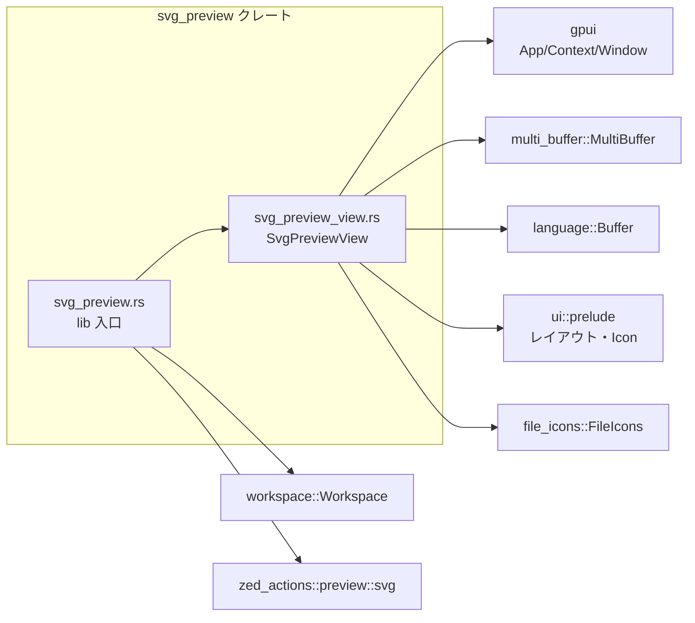
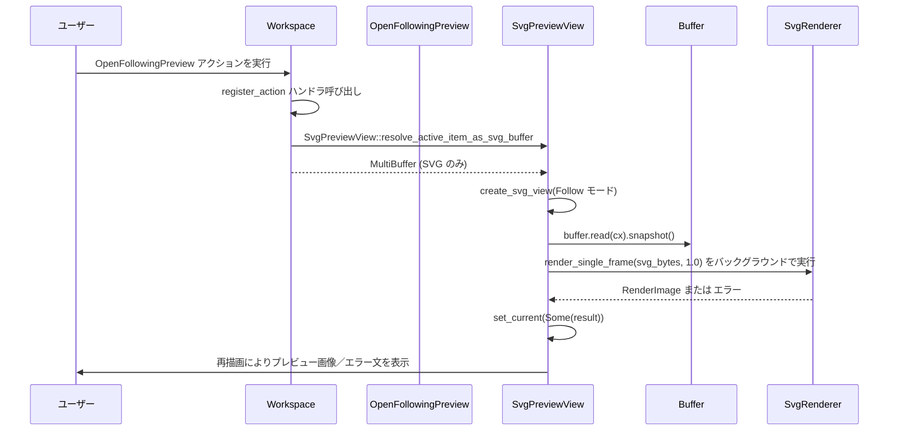

# svg_preview/ ディレクトリ解説

## 0. ざっくり一言

`svg_preview` は、テキストバッファ内の SVG ファイルを UI 上で画像としてプレビュー表示するためのクレートです。  
ワークスペースのアクションに紐づいた「SVG プレビュー」ビューを提供し、編集中の SVG を自動でレンダリングします。

---

## 1. このモジュールの役割

### 1.1 概要

このディレクトリは、UI フレームワーク `gpui` とワークスペース管理クレート `workspace` の上で動作する **SVG プレビュー機能**をまとめたクレートです。

- テキストバッファ（`MultiBuffer` / `Buffer`）に紐づく SVG ファイルを解析し、画像として描画します。
- ワークスペースのアクション（`OpenPreview`, `OpenPreviewToTheSide`, `OpenFollowingPreview`）からプレビュービューを開きます。
- バッファの編集・保存に応じて自動的に再レンダリングし、プレビューを常に最新状態に保ちます。

### 1.2 アーキテクチャ内での位置づけ

このクレートは、アプリケーション全体の `App` に対して `init` 関数でフックされ、  
新しく作成される `Workspace` ごとに `SvgPreviewView` のアクション登録を行います。

主要な依存関係とファイルの関係は、次のようになります。



- `svg_preview.rs`  
  - クレートエントリーポイント  
  - `SvgPreviewView::register` を各 `Workspace` に対して呼び出す `init` を定義します。
- `svg_preview_view.rs`  
  - 実際のプレビュービュー `SvgPreviewView` と関係するメソッド・アクション登録処理をまとめています。

### 1.3 設計上のポイント

コードから読み取れる設計上の特徴は次の通りです。

- **明確な責務分離**
  - クレート全体の初期化 (`init`) は `src/svg_preview.rs` に集約。
  - ビューの実装やワークスペースとの連携は `SvgPreviewView` に集約。
- **状態を持つ UI コンポーネント**
  - `SvgPreviewView` は現在対象としている `Buffer` や、レンダリング済みの `RenderImage` を内部状態として保持します。
- **イベント駆動・購読型の更新**
  - `BufferEvent`（編集・保存）や `workspace::Event::ActiveItemChanged` に対して購読 (`Subscription`) を行い、イベント発生時にプレビューを更新します。
- **非同期バックグラウンドレンダリング**
  - SVG の描画処理は `cx.background_spawn` でバックグラウンドスレッドにオフロードし、完了後に UI スレッドへ結果を反映します。
- **リソース管理**
  - 新しい画像に差し替える際に `window.drop_image` を通じて前の `RenderImage` を明示的に破棄し、画像リソースを解放しています。
- **拡張可能なモード**
  - `SvgPreviewMode` により、「特定エディタ固定表示」と「アクティブエディタを追従する表示」の 2 モードを切り替え可能にしています。

---

## 2. 主要な機能一覧

このクレートが提供する主な機能は次の通りです。

- **SVG プレビュービュー `SvgPreviewView`**
  - SVG コンテンツを画像として表示するワークスペースアイテム（タブ）です。
- **アクション登録とプレビューパネルの生成**
  - `OpenPreview`: 現在の SVG を同一ペインにプレビューとして開きます。
  - `OpenPreviewToTheSide`: 右側のペインに SVG プレビューを開きます（なければペインを分割）。
  - `OpenFollowingPreview`: アクティブな SVG エディタを自動追従するプレビューを開きます。
- **アクティブアイテムの SVG 判定**
  - 現在アクティブなアイテムが SVG ファイルかどうかを判定し、プレビュー対象にします。
- **バッファ編集／保存に対する自動再レンダリング**
  - `BufferEvent::Edited` および `BufferEvent::Saved` を契機に SVG を再描画します。
- **既存プレビュービューの再利用**
  - 同じ `MultiBuffer` に対するプレビューがすでに存在すれば、新しいビューは作らず既存タブをアクティブ化します。
- **タブのアイコン・タイトルの生成**
  - `file_icons::FileIcons` を用いてアイコンを決定し、`"Preview {ファイル名}"` 形式のタブタイトルを付与します。

---

## 3. 関数・構造体の解説

### 3.1 型一覧（構造体・列挙体・アクション）

| 名前 | 種別 | 役割 / 用途 |
|------|------|-------------|
| `SvgPreviewView` | 構造体 | 単一の SVG プレビューパネル（ワークスペースアイテム）を表現します。 |
| `SvgPreviewMode` | 列挙体 | プレビューの追従モードを表現します（`Default` / `Follow`）。 |
| `OpenPreview` | アクション型 | `zed_actions::preview::svg` から提供されるアクション。`Workspace::register_action` のキーとして使用され、SVG プレビューを開くトリガーになります（詳細実装はこのチャンクにはありません）。 |
| `OpenPreviewToTheSide` | アクション型 | 同上。右側ペインにプレビューを開くアクションとして利用されます。 |
| `OpenFollowingPreview` | アクション型 | `actions!` マクロでこのクレート内に定義されるアクション。アクティブな SVG エディタを追従するプレビューを開く際に利用されます。 |

※ `OpenPreview` / `OpenPreviewToTheSide` の具体的なコマンド名やキーバインドは、このチャンクのコードからは分かりません。

---

### 3.2 重要な関数・メソッドの詳細

ここでは、このディレクトリで特に重要な 7 つの関数／メソッドを取り上げます。

#### `init(cx: &mut App)`

**概要**

- アプリケーション起動時に一度呼び出される想定の初期化関数です。
- 新しい `Workspace` が生成されたタイミングで `SvgPreviewView::register` を呼び出し、SVG プレビュー用のアクションをそのワークスペースに登録します。

**引数**

| 引数名 | 型 | 説明 |
|--------|----|------|
| `cx` | `&mut App` | アプリケーション全体のコンテキスト。新規 `Workspace` 生成時のフック登録に使用されます。 |

**戻り値**

- なし（`()`）。副作用として `App` にオブザーバを登録します。

**内部処理の流れ**

1. `cx.observe_new` を呼び出し、新しい `Workspace` が生成されるたびにコールバックが呼ばれるように登録する。
2. コールバックの引数として `workspace: &mut Workspace`, `window`, `cx: &mut Context<Workspace>` を受け取る。
3. `window` が `None` の場合は何もしないで早期リターン。
4. `SvgPreviewView::register(workspace, window, cx)` を呼び出して、アクションハンドラを登録。
5. `observe_new` から返されるハンドルに対して `.detach()` を呼び出し、オブザーバを保持します（キャンセルせず有効なままにする）。

**Examples（使用例）**

アプリケーションの初期化処理から呼び出す想定の例です。

```rust
use gpui::App;                   // App 型（アプリケーションコンテキスト）をインポート
use svg_preview::init as init_svg_preview; // このクレートの init をインポート

pub fn init(app: &mut App) {     // アプリ全体の init 関数（例）
    // ここで SVG プレビュー機能を有効化する
    init_svg_preview(app);

    // 他のクレートの初期化もここで行う想定
    // foo::init(app);
    // bar::init(app);
}
```

**Edge cases / 使用上の注意点**

- `window` が `None` の `Workspace` にはプレビュー機能は登録されません。
- `init` は原則アプリ起動時に一度だけ呼び出される前提の実装になっています。同じ `App` に対して複数回呼ぶと、同一のオブザーバが重複登録される可能性があります（コードから明示はされていませんが、通常は 1 回呼び出しを前提と考えるのが自然です）。

---

#### `SvgPreviewView::new(mode, active_buffer, workspace_handle, window, cx) -> Entity<SvgPreviewView>`

**概要**

- 指定された `MultiBuffer` を元に、新しい `SvgPreviewView` エンティティを生成します。
- `SvgPreviewMode` に応じて、ワークスペースのアクティブアイテム変更を購読するかどうかを切り替えます。

**引数**

| 引数名 | 型 | 説明 |
|--------|----|------|
| `mode` | `SvgPreviewMode` | プレビューのモード（固定表示か、アクティブエディタ追従か）。 |
| `active_buffer` | `Entity<MultiBuffer>` | ベースとなるエディタのバッファ。`as_singleton()` で 1 つの `Buffer` を取得します。 |
| `workspace_handle` | `WeakEntity<Workspace>` | フォローモード時にアクティブアイテム変更イベントを購読するための弱い参照。 |
| `window` | `&mut Window` | 画像リソースの管理やタスクの実行に利用されるウィンドウコンテキスト。 |
| `cx` | `&mut Context<Workspace>` | `Workspace` に紐づいた UI コンテキスト。エンティティ生成や購読登録に使用されます。 |

**戻り値**

- `Entity<SvgPreviewView>`  
  生成されたプレビュービューを指すエンティティハンドルです。

**内部処理の流れ**

1. `cx.new(|cx| { ... })` で新しい `SvgPreviewView` を生成するクロージャを渡す。
2. `mode` が `SvgPreviewMode::Follow` かつ `workspace_handle.upgrade()` に成功した場合に限り、`subscribe_to_workspace` でワークスペースイベント購読を行う。
3. `active_buffer.read_with` を用いて `MultiBuffer` から `.as_singleton()` を取得し、`Option<Entity<Buffer>>` として `buffer` フィールドに格納。
4. `buffer` が `Some` の場合は、`create_buffer_subscription` で `BufferEvent` を購読。
5. `current_svg` を `None` に初期化し、`Task::ready(())` で `_refresh` を初期化。
6. 生成直後に `this.render_image(window, cx)` を呼び出し、初回の SVG レンダリングをトリガー。
7. 完成した `SvgPreviewView` を返す。

**Examples（使用例）**

通常は `SvgPreviewView::register` 経由で呼び出されますが、概念的には次のような使い方になります。

```rust
fn open_svg_preview_for_buffer(
    workspace: &mut Workspace,                 // 現在のワークスペース
    buffer: Entity<multi_buffer::MultiBuffer>, // 対象の MultiBuffer
    window: &mut Window,                       // ウィンドウ
    cx: &mut Context<Workspace>,               // Workspace コンテキスト
) -> Entity<SvgPreviewView> {
    let workspace_handle = workspace.weak_handle(); // ワークスペースへの弱参照を取得

    SvgPreviewView::new(
        SvgPreviewMode::Default,              // 固定モードでプレビューを作成
        buffer,
        workspace_handle,
        window,
        cx,
    )
}
```

**Edge cases / 使用上の注意点**

- `active_buffer.read_with(...).as_singleton()` が `None` の場合
  - `buffer` フィールドは `None` になり、`render_image` 内で即リターンします。
  - その結果、UI 上には `"No SVG file selected"` と表示されます。
- `mode` が `Follow` でも `workspace_handle.upgrade()` に失敗すると、フォローモード用の購読は設定されません（結果として固定モードのような動作になります）。
- このメソッドを直接使う場合は、`buffer` が実際に SVG ファイルを指していることを呼び出し側で保証する必要があります（このメソッド内では拡張子チェックを行っていません）。

---

#### `SvgPreviewView::render_image(&mut self, window: &Window, cx: &mut Context<Self>)`

**概要**

- 現在の `buffer` の内容から SVG テキストを取得し、バックグラウンドでレンダリングして `current_svg` を更新する内部メソッドです。

**引数**

| 引数名 | 型 | 説明 |
|--------|----|------|
| `window` | `&Window` | `cx.spawn_in` や画像リソース管理に使われるウィンドウ。 |
| `cx` | `&mut Context<Self>` | `SvgPreviewView` 自身に紐づく UI コンテキスト。 |

**戻り値**

- なし。副作用として `self.current_svg` と `_refresh` を更新します。

**内部処理の流れ**

1. `self.buffer` が `None` の場合は何もせずリターン。
2. `cx.svg_renderer()` で SVG レンダラーを取得。
3. `buffer.read(cx).snapshot()` でバッファのスナップショットを取り、`content.text().as_bytes()` をレンダラーに渡す。
4. `cx.background_spawn(async move { ... })` でバックグラウンドタスクを起動し、`render_single_frame` を呼び出して `Result<Arc<RenderImage>, _>` を得る。
5. `cx.spawn_in(window, async move |this, cx| { ... })` で UI コンテキスト上にタスクを起動し、`background_task.await` の結果を受け取る。
6. 結果を `result.map_err(|e| e.to_string().into())` で `Result<Arc<RenderImage>, SharedString>` に変換。
7. `view.set_current(Some(current), window, cx)` を呼び出し、`current_svg` の入れ替えと通知を行う。
8. このタスクハンドルを `self._refresh` に保存する。

**Errors / Edge cases / 使用上の注意点**

- レンダリング中にエラーが発生した場合
  - エラーは `SharedString` メッセージとして `current_svg` に保存されます。
  - `render` メソッド内では、このメッセージを UI 上に表示します。
- バッファが `None` の場合
  - このメソッドは何も行わずに終了します（プレビュー表示は変化しません）。
- このメソッドは内部利用前提であり、外部から直接呼び出す必要は通常ありません。

---

#### `SvgPreviewView::subscribe_to_workspace(workspace, window, cx) -> Subscription`

**概要**

- `SvgPreviewMode::Follow` モード向けに、`Workspace` の `ActiveItemChanged` イベントを購読するための内部メソッドです。
- アクティブアイテムが SVG ファイルに変わるたびに、プレビュー対象のバッファと購読を切り替えます。

**引数**

| 引数名 | 型 | 説明 |
|--------|----|------|
| `workspace` | `Entity<Workspace>` | 監視対象のワークスペース。 |
| `window` | `&Window` | UI タスク実行用ウィンドウ。 |
| `cx` | `&mut Context<Self>` | `SvgPreviewView` のコンテキスト。 |

**戻り値**

- `Subscription`  
  ワークスペースイベント購読のハンドルです。

**内部処理の流れ（ActiveItemChanged 時）**

1. イベント種別が `workspace::Event::ActiveItemChanged` でなければ何もしない。
2. `workspace.read(cx)` でワークスペース状態を読み、`workspace.active_item(cx)` でアクティブアイテムを取得。
3. アクティブアイテムが `MultiBuffer` にダウンキャストでき、かつ `is_svg_file(&buffer, cx)` が `true` の場合:
   - `buffer.read(cx).as_singleton()` で単一の `Buffer` を取得（取得できない場合は早期リターン）。
   - 現在の `self.buffer` と異なる場合のみ、新しいバッファに対する購読を `create_buffer_subscription` で作成し、`self.buffer` を更新。
   - `self.render_image(window, cx)` で新しいバッファからプレビューをレンダリング。
   - `cx.notify()` で再描画をリクエスト。
4. 上記条件を満たさない場合（アクティブアイテムが非 SVG など）は、`self.set_current(None, window, cx)` を呼び出し、プレビューを空にする。

**Edge cases / 使用上の注意点**

- `active_item` が `MultiBuffer` であっても、`buffer.read(cx).as_singleton()` が `None` の場合はプレビュー対象の切り替えは行われず、既存のプレビューが残ります。
- SVG 以外のファイルがアクティブになった場合は、プレビューはクリアされ `"No SVG file selected"` 表示になります。

---

#### `SvgPreviewView::resolve_active_item_as_svg_buffer(workspace, cx) -> Option<Entity<MultiBuffer>>`

**概要**

- 現在のアクティブアイテムが SVG ファイルを含む `MultiBuffer` かどうかを判定し、条件に合う場合のみその `MultiBuffer` を返すヘルパーです。
- アクションハンドラ（`OpenPreview` / `OpenPreviewToTheSide` / `OpenFollowingPreview`）で共通に利用されています。

**引数**

| 引数名 | 型 | 説明 |
|--------|----|------|
| `workspace` | `&Workspace` | 判定対象のワークスペース。 |
| `cx` | `&mut Context<Workspace>` | ワークスペース用コンテキスト。 |

**戻り値**

- `Option<Entity<MultiBuffer>>`  
  - アクティブアイテムが SVG ファイルであれば、その `MultiBuffer` を返します。
  - それ以外の場合（アクティブアイテムなし／非 SVG）は `None`。

**内部処理の流れ**

1. `workspace.active_item(cx)?` でアクティブアイテムを取得し、なければ `None` を返す。
2. `.act_as::<MultiBuffer>(cx)` により `MultiBuffer` として扱えるかを判定。
3. `Self::is_svg_file(&buffer, cx)` で SVG 判定を行い、`true` の場合のみ `Some(buffer)` を返す。

**Edge cases / 使用上の注意点**

- この関数自体がすでに SVG 拡張子チェックを行っているため、呼び出し側で同一チェックを繰り返す必要はありません（コード上は念のため再チェックしている箇所がありますが、機能としては冗長です）。
- アクティブアイテムがタイトルなし（`file()` が `None` のようなケース）や拡張子無しの場合、`is_svg_file` が `false` を返すため、結果は `None` になります。

---

#### `SvgPreviewView::is_svg_file(buffer, cx) -> bool`

**概要**

- 渡された `MultiBuffer` が実ファイル名ベースで SVG ファイルとみなせるかどうかを判定します。

**引数**

| 引数名 | 型 | 説明 |
|--------|----|------|
| `buffer` | `&Entity<MultiBuffer>` | 判定対象のバッファ。 |
| `cx` | `&App` | アプリケーションコンテキスト。ファイル名取得に利用されます。 |

**戻り値**

- `bool`  
  - `true`: `file.file_name(cx)` の拡張子が `"svg"`（大文字小文字問わず）の場合。
  - `false`: それ以外。

**内部処理の流れ**

1. `buffer.read(cx).as_singleton()` で単一の `Buffer` を取得できなければ `false` を返す。
2. `buffer.read(cx).file()` でファイル情報を取得。`None` の場合は `false`。
3. `file.file_name(cx)` を `std::path::Path::new(...)` に渡し、`.extension()` を取得。
4. 拡張子が存在し、かつ `ext.eq_ignore_ascii_case("svg")` が `true` なら `true`、それ以外は `false`。

**Examples（使用例）**

```rust
fn is_active_item_svg(workspace: &Workspace, app: &App, cx: &mut Context<Workspace>) -> bool {
    if let Some(mb) = workspace.active_item(cx).and_then(|item| item.act_as::<MultiBuffer>(cx)) {
        SvgPreviewView::is_svg_file(&mb, app)
    } else {
        false
    }
}
```

**Edge cases / 使用上の注意点**

- 拡張子だけを見ているため、中身が SVG 形式であるかどうかの検証は行っていません。中身が不正な場合は後段の `render_single_frame` でエラーになり、そのエラーメッセージがプレビューに表示されます。
- アンタイトルドバッファやメモリ上のみのバッファなど、`file()` を持たないバッファはすべて `false` 扱いになります。

---

#### `SvgPreviewView::find_existing_preview_item_idx(pane, buffer, cx) -> Option<usize>`

**概要**

- 指定された `Pane` 内に、同じ `MultiBuffer` に対する `SvgPreviewView` がすでに存在するかを探し、そのインデックスを返す内部メソッドです。
- プレビューの重複生成を防ぎ、既存タブを再利用するために用いられます。

**引数**

| 引数名 | 型 | 説明 |
|--------|----|------|
| `pane` | `&Pane` | 検索対象のペイン。 |
| `buffer` | `&Entity<MultiBuffer>` | 比較対象のバッファ。 |
| `cx` | `&App` | エンティティ ID の取得に利用されるアプリケーションコンテキスト。 |

**戻り値**

- `Option<usize>`  
  - 同じ `Buffer` を参照する `SvgPreviewView` が存在すれば、そのアイテムインデックス。
  - 存在しなければ `None`。

**内部処理の流れ**

1. `buffer.read(cx).as_singleton()?` で単一 `Buffer` を取得し、その `entity_id()` を `buffer_id` とする。取得できなければ `None` を返す。
2. `pane.items_of_type::<SvgPreviewView>()` でペイン内のすべての `SvgPreviewView` を列挙。
3. 各ビューについて、`view.read(cx).buffer` が `Some` で、その `entity_id()` が `buffer_id` と一致するものを探す。
4. 一致するビューが見つかった場合、`pane.index_for_item(&view)` でインデックスを取得して返す。

**Edge cases / 使用上の注意点**

- `buffer` がシングルトンでない場合（`as_singleton()` が `None`）は、常に `None` を返すため、既存プレビューがあっても検出できません。
- ペイン内に同じバッファを参照する複数のビューが存在するケースは前提としていないため、最初に見つかったものを返します。

---

#### `SvgPreviewView::register(workspace, _window, _cx)`

**概要**

- `Workspace` に SVG プレビュー関連のアクションハンドラを登録するメソッドです。
- 3 種類のアクション（`OpenPreview`, `OpenPreviewToTheSide`, `OpenFollowingPreview`）に対応したハンドラをセットアップします。

**引数**

| 引数名 | 型 | 説明 |
|--------|----|------|
| `workspace` | `&mut Workspace` | 対象となるワークスペース。ここにアクションが登録されます。 |
| `_window` | `&mut Window` | このメソッド内では使用されていません（引数としては受け取ります）。 |
| `_cx` | `&mut Context<Workspace>` | このメソッド内では直接は使用されていません（登録されるクロージャ内で `cx` が使われます）。 |

**戻り値**

- なし。副作用として `workspace.register_action` が 3 回呼ばれます。

**内部処理の流れ**

1. **`OpenPreview` 用ハンドラの登録**
   - アクティブアイテムから `resolve_active_item_as_svg_buffer` で SVG の `MultiBuffer` を取得。
   - buffer が見つかれば `create_svg_view(SvgPreviewMode::Default, ...)` でビューを生成。
   - `workspace.active_pane().update(...)` で現在のペインを更新し、`find_existing_preview_item_idx` で既存プレビューを探す。
   - 見つかれば `pane.activate_item` でそのタブをアクティブ化。見つからなければ `pane.add_item` で新しいタブを追加。
   - 最後に `cx.notify()` で UI 更新を通知。

2. **`OpenPreviewToTheSide` 用ハンドラの登録**
   - `resolve_active_item_as_svg_buffer` で `MultiBuffer` を取得。
   - 右方向のペインを `workspace.find_pane_in_direction(SplitDirection::Right, cx)` で探す。
   - 見つからなければ `workspace.split_pane(..., SplitDirection::Right, ...)` でアクティブペインを右分割して新しいペインを作成。
   - そのペインに対して `pane.update(...)` を行い、`find_existing_preview_item_idx` で既存プレビューを再利用、なければ `pane.add_item` で追加する。
   - 最後に `cx.notify()` で UI 更新を通知。

3. **`OpenFollowingPreview` 用ハンドラの登録**
   - `resolve_active_item_as_svg_buffer` で `MultiBuffer` を取得。
   - `create_svg_view(SvgPreviewMode::Follow, ...)` でフォローモードビューを生成。
   - `workspace.active_pane().update(...)` でアクティブペインに `pane.add_item` で追加（既存フォロービューを探して再利用する処理はありません）。
   - 最後に `cx.notify()` を呼び出す。

**Examples（使用例）**

通常はクレート外から直接呼ぶ必要はなく、`init` 経由で呼ばれます。概念的には次のような利用になります。

```rust
fn setup_workspace_preview(
    workspace: &mut Workspace,      // 新しく作られた Workspace
    window: &mut Window,            // 対応する Window
    cx: &mut Context<Workspace>,    // Workspace 用コンテキスト
) {
    SvgPreviewView::register(workspace, window, cx); // SVG プレビュー用のアクションを登録
}
```

**Edge cases / 使用上の注意点**

- 3 つのアクションすべてにおいて、アクティブアイテムが SVG でなければ何も起こりません（ビューは作られません）。
- `OpenFollowingPreview` は既存のフォロービューを探さないため、同じ SVG を追従するフォロービューが複数作成される可能性があります。
- `OpenPreview` / `OpenPreviewToTheSide` は同じ `MultiBuffer` に対するビューがすでに存在する場合、常にそれを再利用します。

---

### 3.3 その他の関数・メソッド（概要のみ）

| 関数 / メソッド名 | 役割（1 行） |
|-------------------|--------------|
| `SvgPreviewView::set_current` | `current_svg` を更新し、古い画像があれば `window.drop_image` で解放して UI 更新を通知します。 |
| `SvgPreviewView::create_svg_view` | `SvgPreviewView::new` をラップし、`Workspace` から弱参照ハンドルを生成して渡します。 |
| `SvgPreviewView::create_buffer_subscription` | `BufferEvent::Edited` / `Saved` に対する購読を作成し、イベント発生時に `render_image` を呼び出します。 |
| `Render for SvgPreviewView::render` | `current_svg` の状態に応じて画像／エラーメッセージ／「No SVG file selected」のいずれかを描画します。 |
| `Focusable for SvgPreviewView::focus_handle` | フォーカス管理に使われる `FocusHandle` を返します。 |
| `Item::tab_icon` | 関連ファイルのアイコンを `file_icons` から取得し、タブアイコンとして表示します。 |
| `Item::tab_content_text` | `"Preview {ファイル名}"` または `"SVG Preview"` をタブタイトルとして返します。 |

---

## 4. データフロー

ここでは、「フォローモードの SVG プレビューを開く」というシナリオにおけるデータフローを示します。

- ユーザーが `OpenFollowingPreview` アクションを発火すると、アクティブな SVG エディタに対する `SvgPreviewView` が生成されます。
- その後、バッファ内容が `SvgRenderer` に渡されて画像化され、`SvgPreviewView` の `current_svg` に保存されます。
- ファイルの編集やアクティブアイテムの変更に応じて、同様の流れで再レンダリング・切り替えが行われます。



このように、データの主な流れは「`MultiBuffer` → `Buffer` → SVG テキスト → `SvgRenderer` → `RenderImage` → `SvgPreviewView`」となっています。

---

## 5. 使い方（How to Use）

### 5.1 基本的な使用方法

このクレートをアプリケーションに統合する最低限の手順は次の通りです。

1. アプリケーション起動時の初期化処理で `svg_preview::init` を呼び出し、`Workspace` にアクションを登録できるようにします。
2. `OpenPreview` / `OpenPreviewToTheSide` / `OpenFollowingPreview` に対応するアクションを発火できるように（コマンド／ショートカットなどで）結びつけます（この部分は他クレート側の責務です）。

初期化のコード例は次のようになります。

```rust
use gpui::App;                          // アプリケーションコンテキスト
use svg_preview::init as init_svg_preview; // このクレートの init

pub fn init(app: &mut App) {
    // SVG プレビュー機能をワークスペースに組み込む
    init_svg_preview(app);

    // 他機能の初期化もここに並べる想定
    // ...
}
```

この初期化を行うと、以降新しく生成される `Workspace` で SVG プレビュー関連アクションが利用可能になります。

---

### 5.2 よくある使用パターン

#### パターン 1: 現在のペインで SVG プレビューを開く（`OpenPreview`）

- 前提: アクティブなエディタが `.svg` 拡張子のファイルを開いている。
- 動作:
  - すでに同じファイルの SVG プレビューが同じペインに存在する場合、そのタブがアクティブ化される。
  - 存在しない場合、新しい `SvgPreviewView` タブが同じペインに追加され、アクティブになります。

#### パターン 2: 右側ペインに SVG プレビューを開く（`OpenPreviewToTheSide`）

- 前提: 同上（アクティブなエディタが SVG ファイル）。
- 動作:
  - 右方向にペインが存在すればそこにプレビュータブを配置。
  - 存在しなければ、アクティブペインを右分割して新しいペインを作り、そこにプレビューを追加。
  - 同じファイルに対するプレビューがすでに右ペインにある場合は、それをアクティブ化します。

#### パターン 3: フォローモードの SVG プレビューを開く（`OpenFollowingPreview`）

- 前提: 実行時点でアクティブなエディタが SVG ファイル。
- 動作:
  - 新しい `SvgPreviewView`（`SvgPreviewMode::Follow`）がアクティブペインに追加される。
  - 以降、アクティブアイテムが変わるたびに、そのアイテムが SVG ならプレビュー対象が切り替わり、SVG でなければプレビューはクリア（「No SVG file selected」表示）されます。

---

### 5.3 よくある間違い

```rust
// 間違い例: init を呼ばずに SVG プレビューアクションを期待する
fn init_app(app: &mut App) {
    // svg_preview::init(app); を呼び忘れている
    // その結果、Workspace に OpenPreview などのアクションが登録されない
}

// 正しい例: app 初期化時に svg_preview::init を呼ぶ
fn init_app(app: &mut App) {
    svg_preview::init(app); // これにより、新規 Workspace で SVG プレビューアクションが有効になる
}
```

```rust
// 間違い例: SVG 以外のファイルでプレビューを開こうとする
// アクティブファイルが example.txt の状態で OpenPreview を発火しても、ビューは作られない

// 正しい使用: アクティブファイルが example.svg の状態でアクションを実行する
// → SvgPreviewView が生成され、プレビュータブが開く
```

```rust
// 間違い例: MultiBuffer がシングルトンでないケースで new を直接呼ぶ
fn open_preview_directly(
    workspace: &mut Workspace,
    mb: Entity<MultiBuffer>,
    window: &mut Window,
    cx: &mut Context<Workspace>,
) {
    // mb が as_singleton() を持たない（複数 Buffer を抱える）場合、
    // SvgPreviewView::new 内で buffer は None となり、プレビューは表示されない
    let workspace_handle = workspace.weak_handle();
    let _view = SvgPreviewView::new(SvgPreviewMode::Default, mb, workspace_handle, window, cx);
}

// 正しい例: 通常は register 済みアクション経由で開く
// → resolve_active_item_as_svg_buffer が SVG / シングルトンの MultiBuffer のみを対象にしてくれる
```

---

### 5.4 使用上の注意点（まとめ）

- **拡張子ベースの判定**
  - `is_svg_file` は拡張子 `"svg"` のみを見ています。中身が不正な場合は、プレビュー側でエラーメッセージが表示されます。
- **未保存ファイルの扱い**
  - `Buffer::file()` が `None` のようなバッファ（ファイル名を持たないもの）は SVG と判定されないため、プレビュー対象にはなりません。
- **シングルトンバッファ前提**
  - `MultiBuffer` が `as_singleton()` を返さない場合、そのバッファはプレビューの対象外になります。
- **フォローモードの挙動**
  - `SvgPreviewMode::Follow` のビューはアクティブアイテムに応じて自動で対象を切り替えますが、SVG 以外のファイルがアクティブの場合はプレビューが空になります。
- **リソース解放**
  - プレビュー画像は差し替え時に `window.drop_image` で解放されます。`SvgPreviewView` エンティティを適切に破棄しない限り、最新の画像は保持され続ける前提です。

---

## 6. 関連ファイル

このディレクトリ内で、SVG プレビュー機能に直接関係するファイルは次の通りです。

| パス | 役割 / 関係 |
|------|------------|
| `svg_preview/Cargo.toml` | クレートのメタデータ・依存関係設定を行います。`multi_buffer`, `file_icons`, `gpui`, `language`, `ui`, `workspace`, `zed_actions` など、この機能に必要なクレートを依存として宣言しています。 |
| `svg_preview/src/svg_preview.rs` | クレートのエントリーポイント。`svg_preview_view` モジュールを公開し、`OpenPreview` / `OpenPreviewToTheSide` を再公開します。また、`OpenFollowingPreview` アクションを定義し、`init` で `Workspace` への登録処理をセットアップします。 |
| `svg_preview/src/svg_preview_view.rs` | `SvgPreviewView` 本体と、その生成・イベント購読・レンダリング・ワークスペースアクション登録などを実装する中核ファイルです。 |

外部クレートとの関係（このチャンクのコードから読み取れる範囲）は次の通りです。

| パス / クレート名 | 役割 / 関係 |
|-------------------|------------|
| `workspace` | `Workspace`, `Pane`, `SplitDirection`, `item::Item` などを通じて、タブ／ペイン管理やアクション登録の基盤を提供します。このクレートの詳細実装はこのチャンクには登場しません。 |
| `gpui` | `App`, `Context`, `Window`, `Entity`, `Task`, `Subscription` などの UI / エンティティ管理の基盤を提供します。 |
| `multi_buffer` / `language` | テキストバッファ（`MultiBuffer`, `Buffer`）とそのイベント（`BufferEvent`）を提供し、SVG テキスト読み取りと更新検知に利用されます。 |
| `ui::prelude` | `v_flex`, `h_flex`, `div`, `img`, `Icon`, `IconName` など、UI コンポーネントやスタイル関連のヘルパーを提供します。 |
| `file_icons` | ファイルパスから適切なアイコンを得るために使われます（タブアイコン生成）。 |
| `zed_actions::preview::svg` | `OpenPreview`, `OpenPreviewToTheSide` のアクション型を提供し、本クレート内のアクション登録に利用されます。 |

以上が、`svg_preview` ディレクトリに含まれるコードの構造と実用的な使い方の概要です。
