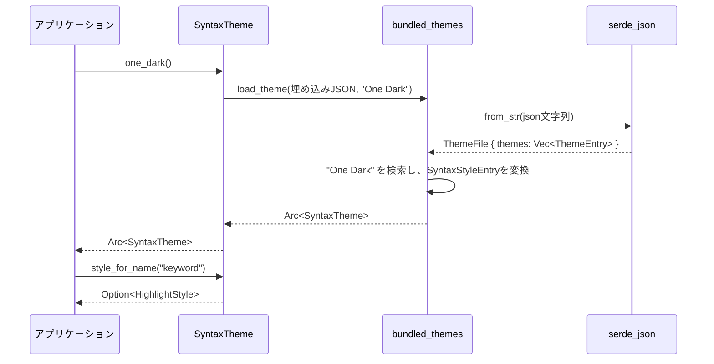

# syntax_theme/ ディレクトリ解説

## 1. ざっくり一言

構文ハイライト用の「テーマ（色やフォントスタイルのセット）」を表現し、  
名前やインデックスでスタイルを引いたり、ユーザー定義のテーマをマージしたり、JSON からテーマを読み込むためのクレートです。

---

## 2. このモジュールの役割

### 2.1 概要

- このクレートは、**構文要素名（例: `"keyword"`, `"string.special"`）とハイライトスタイルを対応付ける**ための `SyntaxTheme` 構造体を提供します。
- スタイルは `gpui::HighlightStyle` で表現され、色やフォントウェイト／スタイルなどを含みます。
- さらに、ユーザー定義テーマとのマージ機能や、JSON ファイルからテーマを読み込む機能（`bundled-themes` feature）を提供します。

### 2.2 アーキテクチャ内での位置づけ

このディレクトリには、単一のライブラリクレート `syntax_theme` があり、その中に:

- `SyntaxTheme` 構造体（メイン API）
- オプションの `bundled_themes` モジュール（feature 有効時）

が含まれます。外部には `gpui` と `serde`/`serde_json` に依存します。

```mermaid
graph TD
  subgraph Crate["syntax_theme クレート"]
    ST["SyntaxTheme 構造体"]
    BT["bundled_themes モジュール\n(feature = \"bundled-themes\")"]
  end

  ST -->|スタイル型を使用| GPUI["gpui::HighlightStyle, Hsla"]
  BT -->|テーマ読み込みに使用| ST
  BT -->|JSONデシリアライズ| SERDE["serde / serde_json"]
  BT -->|埋め込みJSON| ASSETS["assets/themes/one/one.json\n(文字列としてinclude)"]
```

### 2.3 設計上のポイント

- **名前→インデックス→スタイル** という二段階構造  
  - `Vec<HighlightStyle>` にスタイルを格納し、`BTreeMap<String, usize>` で名前からインデックスへマップしています。
- **BTreeMap による階層的な名前解決**  
  - `"foo"`, `"foo.bar"` のような階層名に対して、`highlight_id` で「もっとも長くマッチするプレフィックス」を検索する仕組みになっています。
- **共有とマージのための `Arc` 利用**  
  - テーマは `Arc<SyntaxTheme>` で共有され、`merge` でユーザー定義スタイルをマージする際に `Arc::try_unwrap` で再利用可能な場合は中身を再利用します。
- **feature で機能を分割**  
  - `bundled-themes` が有効なときのみ JSON からのテーマロード (`one_dark`) をコンパイルします。
  - `test-support` でテスト用の簡易生成関数（`new_test`, `new_test_styles`）が有効になります。

---

## 3. 主要な機能一覧

- `SyntaxTheme::new`: 名前と `HighlightStyle` のペアからテーマを構築する。
- `SyntaxTheme::get`: インデックス（`usize`）でスタイルを取得する。
- `SyntaxTheme::style_for_name`: キャプチャ名（例: `"keyword"`, `"foo.bar"`）からスタイルを取得する。
- `SyntaxTheme::get_capture_name`: インデックスから対応するキャプチャ名を逆引きする。
- `SyntaxTheme::highlight_id`: 階層的なキャプチャ名から、最も適合するハイライト ID（インデックス）を取得する。
- `SyntaxTheme::merge`: 基本テーマとユーザー定義スタイルをマージした新しい `Arc<SyntaxTheme>` を生成する。
- `SyntaxTheme::one_dark`（`bundled-themes` feature）: バンドルされた JSON から "One Dark" テーマを読み込む。
- `bundled_themes::SyntaxStyleEntry::to_highlight_style`: JSON で表現されたスタイルを `HighlightStyle` に変換する。
- `bundled_themes::hex_to_hsla`: `"#RRGGBB"` / `"#RRGGBBAA"` 形式の色コードを `Hsla` に変換する。

---

## 4. 関数・構造体の解説

### 4.1 型一覧

| 名前 | 種別 | 役割 / 用途 |
|------|------|-------------|
| `SyntaxTheme` | 構造体 | 構文キャプチャ名と `HighlightStyle` の対応関係を保持し、問い合わせ・マージ機能を提供するメイン型です。 |
| `bundled_themes::ThemeFile` | 構造体 | JSON ファイル全体（`themes` 配列）をデシリアライズするための内部用型です。 |
| `bundled_themes::ThemeEntry` | 構造体 | 個々のテーマ (`name` と `style`) を表す内部用型です。 |
| `bundled_themes::ThemeStyle` | 構造体 | テーマの `syntax` 部分（名前→`SyntaxStyleEntry` のマップ）を表します。 |
| `bundled_themes::SyntaxStyleEntry` | 構造体 | 各構文要素に対する色・フォント設定を JSON から受け取るための型です。 |

`ThemeFile` 系は `bundled-themes` feature 有効時のみ使用されます。外部 API として直接使うのは `SyntaxTheme` が中心です。

---

### 4.2 主要な関数

#### `SyntaxTheme::new(highlights: impl IntoIterator<Item = (String, HighlightStyle)>) -> SyntaxTheme`

**概要**

- `(キャプチャ名, ハイライトスタイル)` の列から `SyntaxTheme` を構築します。
- 内部でキャプチャ名→インデックスのマップを自動的に作成します。

**引数**

| 引数名 | 型 | 説明 |
|--------|----|------|
| `highlights` | `impl IntoIterator<Item = (String, HighlightStyle)>` | キャプチャ名とスタイルのペアの列。順番がそのままインデックス（ID）になります。 |

**戻り値**

- `SyntaxTheme`  
  キャプチャ名マップとスタイル配列を持つ新しいインスタンスです。

**内部処理の流れ**

1. `highlights.into_iter().unzip()` により、`Vec<String>`（名前）と `Vec<HighlightStyle>`（スタイル）に分割します。
2. `create_capture_name_map` で `Vec<String>` から `BTreeMap<String, usize>` を生成します。インデックスは列挙順序に基づきます。
3. そのマップとスタイル配列をフィールドに格納して返します。

**Examples（使用例）**

```rust
use std::sync::Arc;
use gpui::{HighlightStyle, Hsla};
use syntax_theme::SyntaxTheme;

fn main() {
    // "keyword" 用のスタイルを定義する
    let keyword_style = HighlightStyle {
        color: Some(Hsla::new(220.0, 0.8, 0.6, 1.0)), // 適当な色
        ..Default::default()
    };

    // テーマを構築する（インデックス0が "keyword" になります）
    let theme = SyntaxTheme::new(vec![
        ("keyword".to_string(), keyword_style),
    ]);

    // Arc で共有したい場合
    let theme = Arc::new(theme);

    // 後続処理で `theme` を使う…
}
```

**Errors / Panics**

- この関数自体はエラーや panic を発生させません。

**Edge cases（エッジケース）**

- 空のイテレータを渡した場合、  
  - `highlights` は空ベクタ  
  - `capture_name_map` も空  
  になります（何もスタイルが定義されていないテーマ）。

**使用上の注意点**

- 同じ名前を複数回渡した場合、`BTreeMap` には最後に出てきたインデックスだけが登録されます（前のものは上書きされる形になります）。
- インデックス値は渡した順序に依存するため、**既存バイナリとインデックスの契約がある場合は順序を変えない**ことが重要です。

---

#### `SyntaxTheme::style_for_name(&self, name: &str) -> Option<HighlightStyle>`

**概要**

- キャプチャ名を指定して対応する `HighlightStyle` を取得します。
- 見つかった場合はスタイルのコピー（クローン）を返します。

**引数**

| 引数名 | 型 | 説明 |
|--------|----|------|
| `name` | `&str` | 取り出したいキャプチャ名（例: `"keyword"`, `"string.special"`）。 |

**戻り値**

- `Option<HighlightStyle>`  
  - 対応する名前が存在すれば `Some(スタイル)`  
  - 見つからなければ `None` です。

**内部処理の流れ**

1. `capture_name_map.get(name)` で名前に対応するインデックス（`&usize`）を取得します。
2. そのインデックスで `self.highlights` をインデックスアクセスし、対応する `HighlightStyle` を取り出します。
3. スタイルをコピーして `Some(...)` で返します。

**Examples（使用例）**

```rust
use gpui::{HighlightStyle, Hsla};
use syntax_theme::SyntaxTheme;

fn main() {
    let theme = SyntaxTheme::new(vec![
        ("keyword".to_string(), HighlightStyle {
            color: Some(Hsla::new(220.0, 0.8, 0.6, 1.0)),
            ..Default::default()
        }),
    ]);

    // 既知の名前なら Some で取得できる
    if let Some(style) = theme.style_for_name("keyword") {
        // style.color などを使って描画スタイルを決定する
        println!("keyword color: {:?}", style.color);
    }

    // 未定義の名前は None
    assert!(theme.style_for_name("unknown").is_none());
}
```

**Errors / Panics**

- マップとベクタの整合性が保たれている限り panic はしません。
- `SyntaxTheme` の API 経由でのみ構築／変更している前提では panic は起きない設計になっています。

**Edge cases（エッジケース）**

- 同名が存在しない場合: `None` を返します。
- 名前が空文字列 `""` でも、生成時にその名前で登録されていれば問題なく動作します。

**使用上の注意点**

- 返り値はコピーされた `HighlightStyle` であり、**変更しても `SyntaxTheme` 内部には反映されません**。テーマを書き換えたい場合は `merge` を用いる必要があります。

---

#### `SyntaxTheme::highlight_id(&self, capture_name: &str) -> Option<u32>`

**概要**

- 階層的なキャプチャ名（例: `"foo.bar.baz"`）に対し、  
  **もっとも長くマッチするプレフィックス** を持つエントリのインデックスを返します。
- 例: `"foo"` と `"foo.bar"` が登録されていて `"foo.bar.baz"` を問い合わせると、`"foo.bar"` に対応する ID を返します。

**引数**

| 引数名 | 型 | 説明 |
|--------|----|------|
| `capture_name` | `&str` | 検索対象のキャプチャ名（階層付きを想定）。 |

**戻り値**

- `Option<u32>`  
  - マッチするエントリが見つかればそのインデックス（0 ベース）を `Some` で返します。
  - 何もマッチしなければ `None` です。

**内部処理の流れ**

1. `capture_name` を `"."` で分割し、先頭要素（例: `"foo.bar.baz"` → `"foo"`）を取り出します。
2. BTreeMap の `range` を使い、  
   - 下限: 先頭要素（ドットがない場合は `capture_name` 自体）  
   - 上限: `capture_name`  
   の範囲でキーを列挙します。
3. その範囲を `.rfind(...)` し、以下の条件を満たす最後の要素（最長マッチ）を探します:
   - `capture_name` が `prefix` をプレフィックスとして持つ  
   - 残りが空文字か `"."` 始まり (`""` または `".bar.baz"` など)
4. 見つかったエントリのインデックスを `u32` にキャストして返します。

**Examples（使用例）**

```rust
use gpui::HighlightStyle;
use syntax_theme::SyntaxTheme;

fn main() {
    let theme = SyntaxTheme::new(vec![
        ("foo".to_string(), HighlightStyle::default()),
        ("foo.bar".to_string(), HighlightStyle::default()),
    ]);

    // もっとも長いマッチが返される
    let id_foo = theme.highlight_id("foo").unwrap();
    let id_foo_bar = theme.highlight_id("foo.bar.baz").unwrap();

    assert_ne!(id_foo, id_foo_bar);
}
```

**Errors / Panics**

- panic は発生しません。

**Edge cases（エッジケース）**

- `capture_name_map` が空の場合: 常に `None` を返します。
- 完全一致するキーがなくても、プレフィックスがあればマッチします。  
  例: `"foo"` が登録されている状態で `"foo.baz"` を問い合わせると `"foo"` にマッチします。
- `.` を含まない名前（例: `"foo"`）を渡した場合は、通常の完全一致と同様に扱われます（範囲は `"foo"`〜`"foo"`）。

**使用上の注意点**

- 「もっとも詳細なスタイルを適用し、なければより一般的なスタイルへフォールバックする」といった用途に向いています。
- フォールバックを行いたくない場合は、`style_for_name` の方が分かりやすいです（完全一致のみ）。

---

#### `SyntaxTheme::merge(base: Arc<Self>, user_syntax_styles: Vec<(String, HighlightStyle)>) -> Arc<Self>`

**概要**

- 既存の `SyntaxTheme` とユーザー定義のスタイルをマージし、  
  新しい `Arc<SyntaxTheme>` を返します。
- 同じ名前が存在する場合は、ユーザー側のスタイルの `Some(...)` フィールドだけが上書きされ、`None` のフィールドは元の値を維持します。

**引数**

| 引数名 | 型 | 説明 |
|--------|----|------|
| `base` | `Arc<SyntaxTheme>` | ベースとなるテーマ。 |
| `user_syntax_styles` | `Vec<(String, HighlightStyle)>` | ユーザー定義のスタイル群。 |

**戻り値**

- `Arc<SyntaxTheme>`  
  - ユーザースタイルが空の場合は `base` をそのまま返します。
  - そうでない場合はマージ済みの新しい `Arc` を返します。

**内部処理の流れ**

1. `user_syntax_styles` が空なら即座に `base` を返す。
2. `Arc::try_unwrap(base)` を試み、他に参照がなければ中身をそのまま可変 `SyntaxTheme` として取得する。  
   参照がある場合は `(*base).clone()` でテーマをコピーする。
3. ユーザースタイルをループし、`BTreeMap::entry(name)` によって:
   - **既存エントリ (`Occupied`)**:  
     - 元の `HighlightStyle` を取得し、`color`, `font_weight`, `font_style`, `background_color`, `underline`, `strikethrough`, `fade_out` を  
       `new_value.or(existing_value)` で統合する。
   - **新規エントリ (`Vacant`)**:  
     - `capture_name_map` に新規エントリとして `base.highlights.len()` を登録。
     - `base.highlights.push(highlight)` でスタイルを追加。
4. 最後に `Arc::new(base)` を返す。

**Examples（使用例）**

```rust
use std::sync::Arc;
use gpui::{HighlightStyle, Hsla};
use syntax_theme::SyntaxTheme;

fn main() {
    // ベーステーマ（keyword のみ定義）
    let base = Arc::new(SyntaxTheme::new(vec![
        ("keyword".to_string(), HighlightStyle {
            color: Some(Hsla::new(220.0, 0.8, 0.6, 1.0)),
            ..Default::default()
        }),
    ]));

    // ユーザーが keyword と string に色を指定
    let user_styles = vec![
        ("keyword".to_string(), HighlightStyle {
            color: Some(Hsla::new(200.0, 0.9, 0.7, 1.0)), // これで上書き
            ..Default::default()
        }),
        ("string".to_string(), HighlightStyle {
            color: Some(Hsla::new(120.0, 0.9, 0.7, 1.0)), // 新規エントリ
            ..Default::default()
        }),
    ];

    let merged = SyntaxTheme::merge(base, user_styles);

    // merged を使って以降の描画に反映
}
```

**Errors / Panics**

- この関数自体は panic を発生させません。

**Edge cases（エッジケース）**

- `user_syntax_styles` が空の場合: 元の `Arc<SyntaxTheme>` をそのまま返します（新しい `Arc` は作られません）。
- 同名エントリが複数個 `user_syntax_styles` に含まれている場合: 最後のものが最終的な結果になります（ループの仕様に依存）。
- `HighlightStyle` のフィールドがすべて `None` のスタイルをマージしても何も変化しません。

**使用上の注意点**

- `base` の `Arc` が他所で共有されている場合でも、**元の `Arc` の中身は変更されません**。  
  常に「マージ済みの新しいテーマ」が返される仕様です（`try_unwrap` に失敗した場合はクローンしてから変更しています）。
- 既存の値を「消す」（例: 色を未設定に戻す）ことはできません。`None` を渡すと「元の値を保持する」挙動になるためです。

---

#### `bundled_themes::SyntaxStyleEntry::to_highlight_style(&self) -> HighlightStyle`

**概要**

- JSON から読み込んだ `SyntaxStyleEntry` を `gpui::HighlightStyle` に変換します。
- 色・フォントウェイト・フォントスタイルのうち、指定されているものだけを `Some` でセットします。

**引数 / 戻り値**

- 引数: `&self`（`SyntaxStyleEntry` インスタンス）
- 戻り値: `HighlightStyle`（他フィールドは `Default::default()` に基づきます）

**内部処理の流れ**

1. `color`: `Option<String>` を `as_deref()` → `Option<&str>` に変換し、`hex_to_hsla` で `Hsla` へ変換。
2. `font_weight`: `Option<f32>` を `FontWeight` にラップ。
3. `font_style`: `Option<String>` を `&str` にし、  
   - `"italic"` → `Some(FontStyle::Italic)`  
   - `"normal"` → `Some(FontStyle::Normal)`  
   - `"oblique"` → `Some(FontStyle::Oblique)`  
   - その他 → `None`  
   に変換。
4. `HighlightStyle` の該当フィールドに上記をセットし、その他のフィールドは `Default` のまま返す。

**Examples（使用例）**

この関数は通常 `load_theme` 経由で利用されるため、単体で呼ぶ場面は少ないですが、概念的には次のように動きます。

```rust
use gpui::HighlightStyle;
use syntax_theme::SyntaxTheme; // 実際には bundled_themes 内の内部実装

fn example(entry: &syntax_theme::bundled_themes::SyntaxStyleEntry) -> HighlightStyle {
    entry.to_highlight_style()
}
```

**Errors / Panics**

- 直接の panic はありません。内部で呼ぶ `hex_to_hsla` は不正な値でも panic しない設計です。

**Edge cases（エッジケース）**

- `font_style` が `"italic"`, `"normal"`, `"oblique"` 以外の文字列の場合: `font_style` は `None` になります。
- `color` が `None` の場合: `HighlightStyle::color` は `None` のままです（後で他のテーマで上書き可能）。

**使用上の注意点**

- 色文字列のフォーマットチェックなどは行っていません。不正な色は `hex_to_hsla` 側で「黒」にフォールバックされます。

---

#### `bundled_themes::hex_to_hsla(hex: &str) -> Hsla`

**概要**

- `"#RRGGBB"` または `"#RRGGBBAA"` 形式の 16 進カラーコードを `gpui::Hsla` に変換します。
- 不正な形式やパース失敗時には黒 (`rgb(0)`) にフォールバックします。

**引数**

| 引数名 | 型 | 説明 |
|--------|----|------|
| `hex` | `&str` | 色コード文字列。先頭に `#` が付いていてもいなくても構いません。 |

**戻り値**

- `Hsla`  
  変換された色。エラー時は黒に相当します。

**内部処理の流れ**

1. `trim_start_matches('#')` で先頭の `#` を除去します。
2. 残りの長さに応じて分岐:
   - 長さ 6: `u32::from_str_radix(hex, 16).unwrap_or(0)` を `gpui::rgb` に渡し、`Rgba` を得る。
   - 長さ 8: 同じく `from_str_radix` して `Rgba { r, g, b, a }` を手動で構築。
   - その他: `rgb(0)`（黒）を使用。
3. 最終的に `Rgba` から `Hsla` へ `into()` で変換して返します。

**Examples（使用例）**

```rust
use gpui::Hsla;
use syntax_theme::bundled_themes::hex_to_hsla;

fn main() {
    let color = hex_to_hsla("#ff0000"); // 赤
    println!("{:?}", color);
}
```

**Errors / Panics**

- `u32::from_str_radix` の失敗時には `unwrap_or(0)` を使用しているため panic しません。

**Edge cases（エッジケース）**

- 長さが 6 でも 8 でもない場合: 常に黒として扱われます。
- 不正な 16 進文字（例: `"zzzzzz"`）を含む場合: パースに失敗し `0` になり、結果として黒になります。

**使用上の注意点**

- 不正な入力を検出してエラーにしたい用途には向きません。あくまで「適当に色に変換し、分からなければ黒にする」挙動です。

---

#### `SyntaxTheme::one_dark() -> Arc<Self>`（`bundled-themes` feature）

**概要**

- `assets/themes/one/one.json` にバンドルされたテーマファイルから `"One Dark"` という名前のテーマを読み込み、`Arc<SyntaxTheme>` として返します。

**引数 / 戻り値**

- 引数: なし
- 戻り値: `Arc<SyntaxTheme>`（"One Dark" テーマ）

**内部処理の流れ**

1. `include_str!("../../../assets/themes/one/one.json")` で JSON ファイルを文字列として埋め込みます。
2. `load_theme(json, "One Dark")` を呼び出します。
3. `load_theme` 内で:
   - `serde_json::from_str` により `ThemeFile` にデシリアライズ（失敗時は `expect` で panic）。
   - `themes` 配列から `name == "One Dark"` のエントリを検索（見つからない場合も panic）。
   - その `ThemeEntry` の `style.syntax` を `SyntaxTheme::new` に渡し、`Arc<SyntaxTheme>` を返す。
4. `one_dark` はその `Arc` をそのまま返します。

**Examples（使用例）**

```rust
use std::sync::Arc;
use syntax_theme::SyntaxTheme;

// Cargo.toml で syntax_theme に `bundled-themes` feature を有効にしている前提
fn main() {
    let theme: Arc<SyntaxTheme> = SyntaxTheme::one_dark();

    // 例: "keyword" のスタイルを取得
    if let Some(style) = theme.style_for_name("keyword") {
        println!("keyword style: {:?}", style);
    }
}
```

**Errors / Panics**

- `include_str!` のパスに対応するファイルが存在しない場合はコンパイルエラーになります（このチャンクにはファイル自体は含まれませんが、パス文字列として参照されています）。
- 実行時には、以下の場合に panic します（`load_theme` 内）:
  - JSON のパースに失敗した場合（`expect("failed to parse theme JSON")`）。
  - `"One Dark"` という名前のテーマが JSON 内に存在しない場合。

**Edge cases（エッジケース）**

- JSON 内容が壊れている場合、アプリケーション起動時（`one_dark` 呼び出し時）に panic しうる点に注意が必要です。

**使用上の注意点**

- `bundled-themes` feature を有効にしないとこの関数はコンパイルされません。
- 本番アプリケーションで使用する場合、panic が許容できるかどうかを検討する必要があります。

---

### 4.3 その他の関数（概要のみ）

| 関数名 | 役割（1 行） |
|--------|--------------|
| `SyntaxTheme::get` | インデックス（`usize` もしくは `Into<usize>`）でスタイルへの参照を取得します。 |
| `SyntaxTheme::get_capture_name` | インデックスから対応するキャプチャ名（`&str`）を逆引きします（線形探索）。 |
| `SyntaxTheme::new_test`（test-support） | `(&'static str, Hsla)` の列からテスト用の `SyntaxTheme` を構築します。 |
| `SyntaxTheme::new_test_styles`（test-support） | `(&'static str, HighlightStyle)` の列からテスト用テーマを構築します。 |
| `bundled_themes::load_theme` | 任意の JSON 文字列とテーマ名から `Arc<SyntaxTheme>` をロードします。 |
| `tests::test_syntax_theme_merge` | `merge` の挙動（追加・上書き・部分上書き）を確認するユニットテストです。 |

---

## 5. データフロー

ここでは、「バンドルされた One Dark テーマを読み込み、キャプチャ名からスタイルを取得する」という代表的なフローを説明します。

### シーケンス図



### 要点

- テーマロード時:
  - JSON テキストはビルド時に `include_str!` で埋め込まれ、実行時にはファイル I/O なしで `serde_json` に渡されます。
  - JSON → `ThemeFile` → `SyntaxTheme` の順でデータが変換されます。
- スタイル取得時:
  - `style_for_name` は内部の `BTreeMap` で名前を引き、対応する `HighlightStyle` を返します。
  - 実行時にはテーマのデータ構造へのアクセスだけで、再度 JSON を読むことはありません。

---

## 6. 使い方（How to Use）

### 6.1 基本的な使用方法

ここでは、`bundled-themes` feature を有効にして One Dark テーマを使う例を示します。

```rust
// Cargo.toml 側の設定例:
//
// [dependencies]
// syntax_theme = { path = "crates/syntax_theme", features = ["bundled-themes"] }

use std::sync::Arc;
use syntax_theme::SyntaxTheme;

fn main() {
    // バンドルされた "One Dark" テーマを読み込む
    let theme: Arc<SyntaxTheme> = SyntaxTheme::one_dark();

    // キャプチャ名からスタイルを取得する
    if let Some(style) = theme.style_for_name("keyword") {
        println!("keyword style: {:?}", style);
    }

    // 階層名に対する ID を取得する例
    if let Some(id) = theme.highlight_id("variable.parameter") {
        if let Some(style) = theme.get(id as usize) {
            println!("parameter style: {:?}", style);
        }
    }
}
```

### 6.2 よくある使用パターン

#### パターン1: Tree-sitter のキャプチャ名からスタイルを引く

多くの構文ハイライトでは、パーサから `"keyword"`, `"function.name"` といったキャプチャ名が得られます。  
その場合は `highlight_id` と `get` を組み合わせて使用できます。

```rust
use std::sync::Arc;
use gpui::HighlightStyle;
use syntax_theme::SyntaxTheme;

// Tree-sitter などから来るキャプチャ名を想定
fn style_for_capture(theme: &Arc<SyntaxTheme>, capture_name: &str) -> Option<HighlightStyle> {
    theme
        .highlight_id(capture_name)   // 階層的にIDを解決
        .and_then(|id| theme.get(id as usize).cloned()) // &HighlightStyle をクローンして返す
}
```

#### パターン2: ベーステーマにユーザー設定をマージする

ユーザーが設定ファイルなどで独自色を指定できる場合、`merge` を使ってベーステーマに上乗せします。

```rust
use std::sync::Arc;
use gpui::{HighlightStyle, Hsla};
use syntax_theme::SyntaxTheme;

fn build_user_theme(base: Arc<SyntaxTheme>) -> Arc<SyntaxTheme> {
    // ユーザー設定から読み取ったと仮定
    let user_styles = vec![
        ("keyword".to_string(), HighlightStyle {
            color: Some(Hsla::new(200.0, 0.9, 0.7, 1.0)),
            ..Default::default()
        }),
        ("string".to_string(), HighlightStyle {
            color: Some(Hsla::new(120.0, 0.9, 0.7, 1.0)),
            ..Default::default()
        }),
    ];

    SyntaxTheme::merge(base, user_styles)
}
```

#### パターン3: テスト用の簡易テーマの構築

`test-support` feature（もしくはテストビルド）では、`new_test` / `new_test_styles` で簡単にテーマを構築できます。

```rust
#[cfg(any(test, feature = "test-support"))]
mod test_utils {
    use gpui::{Hsla, HighlightStyle};
    use syntax_theme::SyntaxTheme;

    pub fn simple_test_theme() -> SyntaxTheme {
        SyntaxTheme::new_test([
            ("keyword", Hsla::new(220.0, 0.8, 0.6, 1.0)),
            ("string", Hsla::new(120.0, 0.8, 0.6, 1.0)),
        ])
    }
}
```

### 6.3 使用上の注意点（まとめ）

- **feature の有効化**
  - `SyntaxTheme::one_dark` や JSON 読み込みは `bundled-themes` feature がないと利用できません。
  - テスト用コンストラクタ（`new_test`, `new_test_styles`）は `test-support` feature またはテストビルド時にのみ利用できます。
- **panic の可能性**
  - `one_dark` → `load_theme` では JSON パース失敗やテーマ名不一致で panic します。本番環境で利用する場合は、JSON が正しくバンドルされている前提が必要です。
- **マージの挙動**
  - `SyntaxTheme::merge` はユーザー側の `Some(...)` だけを上書きし、`None` は元の値を保持します。値を消したい用途にはそのままでは対応していません。
- **ID と名前の対応**
  - インデックス（ID）は、`SyntaxTheme::new` に渡した順番や、`merge` による新規追加で決まります。  
    既存の ID と意味の対応を固定したい場合は、順序や追加の仕方に注意が必要です。
- **逆引きコスト**
  - `get_capture_name` は `BTreeMap` を線形検索してインデックスを探すため、インデックス→名前の逆引きは O(n) です。通常は頻繁に呼ぶ用途には向きません。

---

## 7. 関連ファイル

| パス | 役割 / 関係 |
|------|------------|
| `syntax_theme/Cargo.toml` | クレート名・ライブラリ設定・features（`bundled-themes`, `test-support`）・依存関係（`gpui`, `serde`, `serde_json`）を定義します。 |
| `syntax_theme/src/syntax_theme.rs` | `SyntaxTheme` 本体の実装、および `bundled_themes` モジュールとテストコードが含まれるメインのソースファイルです。 |
| `assets/themes/one/one.json` | `include_str!("../../../assets/themes/one/one.json")` で参照される One Dark テーマ定義 JSON です（このディレクトリチャンクには含まれていませんが、パス文字列として利用されています）。 |

このクレートを理解・利用する際は、主に `SyntaxTheme` の API と features の有効化条件を把握することが重要になります。
