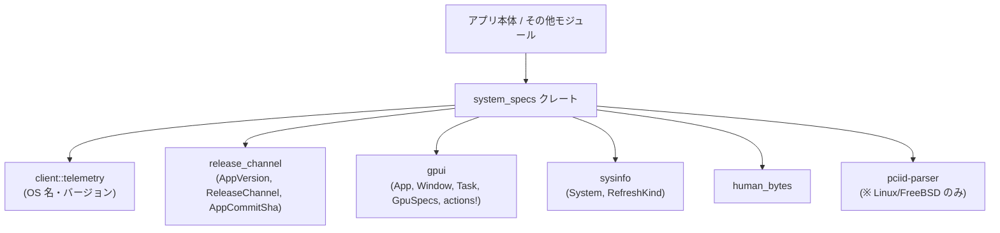

# system_specs ディレクトリ解説

## 1. ざっくり一言

`system_specs` クレートは、Zed エディタ（または同系アプリ）の **システム情報（OS・メモリ・GPU など）を収集し、人間が読みやすい文字列に整形するためのモジュール** です。  
バグ報告用にクリップボードへコピーする機能や、Linux/FreeBSD での詳細な GPU 情報取得も扱います。

---

## 2. このモジュールの役割

### 2.1 概要

- このクレートは、アプリケーションと実行環境に関する情報（アプリのバージョン、リリースチャネル、OS、メモリ、アーキテクチャ、GPU など）を収集し、`SystemSpecs` 構造体にまとめます。
- `SystemSpecs` は `Display` 実装により、バグ報告などに貼り付けやすい **複数行のテキスト** として出力できます。
- GUI 文脈（`gpui::App` / `Window` の上）から非同期に作るパスと、テストや CLI から使える **状態を持たない（stateless）同期パス** の 2 系統が用意されています。
- Linux/FreeBSD では `/sys/class/drm` や `vulkaninfo` を用いて、より詳細な GPU 情報を取得する補助 API も提供します。

### 2.2 アーキテクチャ内での位置づけ

このクレートは、次のようなクレート・モジュールに依存して動作します。

- `client::telemetry`  
  OS 名・OS バージョンなどのテレメトリ情報取得を担当します。
- `release_channel`  
  アプリのバージョン・リリースチャネル・コミット SHA などのメタ情報を提供します。
- `gpui`  
  ウィンドウ (`Window`) やアプリケーションコンテキスト (`App`)、GPU 情報 (`GpuSpecs`) の取得、アクション定義 (`actions!`) など、GUI レイヤーを提供します。
- `sysinfo`  
  システムメモリなどのハードウェア情報を収集します。
- `human_bytes`  
  バイト数を人間が読みやすい単位（KB/MB/GB など）に変換します。
- `pciid-parser`（Linux/FreeBSD のみ）  
  PCI ID からベンダ名やデバイス名を引くために利用されます。

主要な依存関係を Mermaid 図で表すと、次のようになります。



この図は、「system_specs クレートが各種情報源を統合して、最終的に `SystemSpecs` の文字列表現を提供する」という位置づけを示しています。

### 2.3 設計上のポイント

コードから読み取れる設計上の特徴は次の通りです。

- **同期/非同期の両対応**
  - GUI 文脈用に `SystemSpecs::new(window, cx)` が `gpui::Task` を返す非同期 API として用意されています。
  - テストや CLI など GUI 依存を避けたい場合は、`SystemSpecs::new_stateless` で同期的に `SystemSpecs` を構築できます。
- **環境依存コードの明確な切り分け**
  - `cfg(any(target_os = "linux", target_os = "freebsd"))` で Linux/FreeBSD 向けの GPU 情報取得コードを分岐し、他 OS ではコンパイルされないようになっています。
- **エラーに対する「可能な限り情報を返す」方針**
  - `/sys/class/drm` の走査や `vulkaninfo` の実行に失敗しても、可能な範囲の情報を返し、全体の処理を止めない構造になっています（多くの箇所で `continue` や `ok()` を使いエラーを握りつぶします）。
- **バグ報告向けの情報フォーマット**
  - `Display` 実装では、OS、Zed のバージョンとリリースチャネル、メモリ、CPU アーキテクチャ、GPU などの情報を、1 行ごとに分けて出力するようになっています。
  - Linux/FreeBSD では `vulkaninfo --summary` の結果を Markdown の `<details>` ブロックとして埋め込むなど、GitHub Issue などへの貼り付けを意識したフォーマットになっています。

---

## 3. 主要な機能一覧

このクレートが提供する主な機能は次の通りです。

- `SystemSpecs` の構築（GUI 文脈向け）：  
  `SystemSpecs::new(window, cx)` で、`gpui::App` / `Window` からアプリ・OS・GPU 情報を集め、バックグラウンドタスクとして `SystemSpecs` を生成します。
- `SystemSpecs` の構築（状態を持たないコンテキスト向け）：  
  `SystemSpecs::new_stateless(app_version, app_commit_sha, release_channel)` で、`gpui` に依存せずにシステム情報を同期的に収集します。
- `SystemSpecs` の整形出力：  
  `Display` 実装により、`SystemSpecs` をバグ報告にそのまま貼れるテキスト形式に変換します。
- GPU 情報の Markdown 化（Linux/FreeBSD）：  
  `try_determine_available_gpus()` で `vulkaninfo --summary` の出力を Markdown `<details>` ブロックとして埋め込みます。
- `/sys/class/drm` からの GPU 情報取得（Linux/FreeBSD）：  
  `read_gpu_info_from_sys_class_drm()` で PCI ID とドライバ情報から `GpuInfo` の一覧を組み立てます。
- PCI ID 文字列のパース（Linux/FreeBSD）：  
  `read_pci_id_from_path()` で `/sys/class/drm/.../device` などから読み取った `"0xXXXX"` 形式の文字列を `u16` に変換します。
- バンドル種別の取得：  
  `bundle_type()` でコンパイル時/実行時の `ZED_BUNDLE_TYPE` 環境変数からバンドルタイプを取得します（flatpak, snap 用など）。
- アクション定義：  
  `actions!` マクロにより `CopySystemSpecsIntoClipboard` アクションを定義し、UI から「システム情報をクリップボードにコピーする」操作を呼び出せるようにします（実際のハンドラは別ファイルにあります）。

---

## 4. 関数・構造体の解説

### 4.1 主な型一覧

| 名前 | 種別 | 公開範囲 | 役割 / 用途 |
|------|------|----------|-------------|
| `SystemSpecs` | 構造体 | `pub` | アプリとシステムの仕様情報をまとめた中心的なデータ構造です。OS 名・バージョン、メモリ量、アーキテクチャ、アプリのバージョンとリリースチャネル、コミット SHA、バンドル種別、GPU 情報などを保持します。 |
| `GpuInfo` | 構造体 | `pub` | Linux/FreeBSD で `/sys/class/drm` から取得した GPU 情報（ベンダ名/ID、デバイス名/ID、ドライバ名/バージョン）を表します。シリアライズ/デシリアライズ可能です。 |
| `GpuSpecs` | 構造体（`gpui` から再公開） | `pub use gpui::GpuSpecs` | GPU の仕様情報を表す型です。このコードでは `Window::gpu_specs()` から得られ、デバイス名・ドライバ名・ドライバ情報を `SystemSpecs` へ格納するために使われます。定義自体は `gpui` クレート側にあり、このチャンクには現れません。 |
| `CopySystemSpecsIntoClipboard` | アクション型（`actions!` マクロ生成） | 公開（`zed` 名前空間下） | 「システムスペックをクリップボードへコピーする」という UI アクションを表す型です。このファイルでは定義のみで、実際の処理は別のモジュールに実装されます。 |

`SystemSpecs` のフィールド構成（非公開フィールド）：

- `app_version: String`
- `release_channel: &'static str`
- `os_name: String`
- `os_version: String`
- `memory: u64`
- `architecture: &'static str`
- `commit_sha: Option<String>`
- `bundle_type: Option<String>`
- `gpu_specs: Option<String>`

### 4.2 重要な関数・メソッドの詳細

#### `SystemSpecs::new(window: &mut Window, cx: &mut App) -> Task<SystemSpecs>`

**概要**

- `gpui` の `Window` と `App` コンテキストから、アプリとシステム情報を取得し、バックグラウンドタスクとして `SystemSpecs` を構築します。
- OS バージョンの取得など一部処理を非同期タスク内で行います。

**引数**

| 引数名 | 型 | 説明 |
|--------|----|------|
| `window` | `&mut Window` | 現在のウィンドウオブジェクトです。`Window::gpu_specs()` から GPU 情報を取得します。 |
| `cx` | `&mut App` | `gpui` のアプリケーションコンテキストです。`AppVersion::global` や `ReleaseChannel::global` などのグローバル情報取得に使われます。 |

**戻り値**

- `Task<SystemSpecs>`  
  `gpui` のタスク型で、非同期に生成される `SystemSpecs` を表します。`Task` の具体的な扱い方はこのチャンクには現れませんが、「バックグラウンドで `SystemSpecs` を組み立てる処理をスケジュールした結果」として利用されます。

**内部処理の流れ**

1. `AppVersion::global(cx)` からアプリのバージョンを取得し、文字列化します。
2. `ReleaseChannel::global(cx)` からリリースチャネル（Stable/Dev/Nightly など）を取得します。
3. `telemetry::os_name()` で OS 名（例: "macOS", "Linux" など）を取得します。
4. `System::new_with_specifics(RefreshKind::nothing().with_memory(MemoryRefreshKind::everything()))` により `sysinfo` の `System` を構築し、`system.total_memory()` からメモリ量を取得します。
5. `env::consts::ARCH` で CPU アーキテクチャ（`"x86_64"` など）を取得します。
6. リリースチャネルが `Dev` または `Nightly` の場合のみ、`AppCommitSha::try_global(cx)` からコミット SHA を取得し、その `full()` 表現を `commit_sha` としてセットします。その他のチャネルでは `None` になります。
7. `bundle_type()` を呼び出し、コンパイル時 / 実行時の `ZED_BUNDLE_TYPE` 環境変数からバンドルタイプを取得します。
8. `window.gpu_specs()` で `Option<GpuSpecs>` を取得し、  
   `"{device_name} || {driver_name} || {driver_info}"` という 1 行の文字列に整形して `Option<String>` として保持します。
9. 上記で収集した情報をクロージャにキャプチャし、`cx.background_spawn(async move { ... })` で非同期タスクを生成します。
10. タスク内では `telemetry::os_version()` を呼び出して OS バージョン（例: "14.4.1", "6.8.0-rc1" など）を取得し、`SystemSpecs` インスタンスを組み立てて返します。

**Examples（使用例）**

`gpui` のアプリケーション内で、システム情報を集めてログに出す簡略例です（実際の `Task` のポーリング方法は `gpui` 側の API に依存します）。

```rust
use system_specs::SystemSpecs;                           // このクレートの SystemSpecs をインポート
use gpui::{App, Window};                                // gpui の App と Window

fn collect_specs(window: &mut Window, cx: &mut App) {    // どこかの UI ハンドラ内の関数
    let task = SystemSpecs::new(window, cx);             // 非同期タスクとして SystemSpecs の取得を開始

    // 具体的な待ち方やコールバック登録方法は gpui に依存するため、
    // ここでは「task から最終的に SystemSpecs を受け取る」とだけ示します。
    // 例: cx.spawn(task.map(|specs| log::info!("{specs}")));
}
```

**Errors / Panics**

- `System::new_with_specifics` や `System::total_memory` などは通常エラーを返さない API です。
- `AppVersion::global` や `ReleaseChannel::global` がどのようなエラー動作をするかはこのチャンクからは分かりませんが、ここではエラー処理が行われていないため、これらがパニックする可能性がある場合はその挙動に従います。
- GPU 情報取得 (`window.gpu_specs()`) が失敗した場合は `None` が返る想定で、そのまま `None` として扱われるためパニックにはつながりません。

**Edge cases（エッジケース）**

- GPU 情報なし：  
  `window.gpu_specs()` が `None` の場合、`SystemSpecs` の `gpu_specs` も `None` になり、表示時に「GPU: ...」行は出力されません。
- Dev/Nightly 以外のリリースチャネル：  
  `commit_sha` は常に `None` となり、表示文字列ではリリースチャネル名のみが表示されます。
- `ZED_BUNDLE_TYPE` 未設定：  
  コンパイル時・実行時ともに環境変数が無ければ `bundle_type` は `None` になり、表示時にもバンドル種別は出力されません。

**使用上の注意点**

- `SystemSpecs::new` は `gpui::App` / `Window` に依存しているため、**GUI コンテキスト外（テストや CLI ツール）では使えません**。
- OS バージョン取得は非同期タスク内で行われるため、タスク完了前には `os_version` が利用できません。`Task` からの結果取得方法は `gpui` のドキュメントを確認する必要があります。

---

#### `SystemSpecs::new_stateless(app_version: Version, app_commit_sha: Option<AppCommitSha>, release_channel: ReleaseChannel) -> SystemSpecs`

**概要**

- `gpui` に依存せずに、同期的に `SystemSpecs` を構築するためのコンストラクタです。
- 主にテストコードや、Zed 以外の文脈でこのクレートを利用する場面を想定した API と考えられます（あくまで命名からの推測であり、このチャンクには利用例はありません）。

**引数**

| 引数名 | 型 | 説明 |
|--------|----|------|
| `app_version` | `semver::Version` | アプリケーションのバージョン（SemVer 型）。 |
| `app_commit_sha` | `Option<AppCommitSha>` | アプリケーションのコミット SHA。Dev/Nightly などで利用されます。 |
| `release_channel` | `ReleaseChannel` | Stable/Dev/Nightly などのリリースチャネル。 |

**戻り値**

- `SystemSpecs`  
  バージョンやチャネルは引数から取りつつ、OS 名・OS バージョン・メモリ・アーキテクチャ・バンドル種別・GPU 情報等を環境から取得して埋め込んだ構造体です。

**内部処理の流れ**

1. `telemetry::os_name()` で OS 名を取得します。
2. `telemetry::os_version()` で OS バージョンを同期的に取得します。
3. `sysinfo::System::new_with_specifics(...).total_memory()` でメモリ量を取得します。
4. `env::consts::ARCH` でアーキテクチャを取得します。
5. リリースチャネルが `Dev` または `Nightly` の場合のみ、`app_commit_sha.map(|sha| sha.full())` でコミット SHA を文字列化します。それ以外では `commit_sha` は `None` です。
6. `bundle_type()` でバンドルタイプを取得します。
7. `try_determine_available_gpus()` を呼び出し、GPU 情報を文字列として取得します（Linux/FreeBSD では `vulkaninfo` の出力、他 OS では `None`）。
8. 引数や取得した値を元に `SystemSpecs` を組み立てて返します。

**Examples（使用例）**

`gpui` を使わない簡単な CLI ツールからシステム情報を出力する例です。

```rust
use system_specs::SystemSpecs;                                  // SystemSpecs をインポート
use release_channel::ReleaseChannel;                            // リリースチャネル型
use semver::Version;                                            // セマンティックバージョン

fn main() {
    // アプリバージョンを手動で指定（例として "0.1.0"）
    let app_version = Version::parse("0.1.0").unwrap();         // "0.1.0" を SemVer としてパース

    // Dev/Nightly でなければ通常はコミット SHA は不要なので None を渡す
    let commit_sha = None;                                      // AppCommitSha が無い前提の例

    // Stable リリースとして扱う
    let channel = ReleaseChannel::Stable;                       // Stable チャネルを指定

    let specs = SystemSpecs::new_stateless(                     // 同期的に SystemSpecs を構築
        app_version,
        commit_sha,
        channel,
    );

    println!("{specs}");                                        // Display 実装で整形表示
}
```

**Errors / Panics**

- `telemetry::os_name` / `telemetry::os_version` の内部挙動はこのチャンクからは分かりませんが、ここではエラー戻り値は考慮されていません。
- `System::new_with_specifics` や `total_memory` は通常エラーを返しません。
- `bundle_type` 内で `env::var` を呼びますが、エラーは `ok()` で無視されます。
- `try_determine_available_gpus` 内での失敗は `"Failed to run ..."` のような文字列に変換されるため、ここでのパニックは発生しません。

**Edge cases（エッジケース）**

- Linux/FreeBSD 以外の OS：  
  `try_determine_available_gpus()` は `None` を返すため、`SystemSpecs` の `gpu_specs` は `None` になります。
- Dev/Nightly 以外で `app_commit_sha` に値を渡した場合：  
  呼び出し側が値を渡しても、`match release_channel` により `commit_sha` は強制的に `None` になります。
- `ZED_BUNDLE_TYPE` が設定されていない場合：  
  `bundle_type` は `None` となり、表示にも出ません。

**使用上の注意点**

- `SystemSpecs::new_stateless` は `gpui` には依存しませんが、`client::telemetry`, `sysinfo` などには依存します。そのため、これらのクレートがサポートしていない環境では挙動が制限される可能性があります。
- `app_commit_sha` を渡しても、リリースチャネルが Dev/Nightly 以外の場合は無視される点に注意が必要です。

---

#### `impl Display for SystemSpecs`

**概要**

- `SystemSpecs` をバグ報告などに貼り付けやすい複数行のテキストへ変換します。
- OS・Zed のバージョン・リリースチャネル・メモリ・アーキテクチャ・GPU 情報などをまとめて 1 つの文字列に連結します。

**出力フォーマットの概要**

1. **OS 行**  
   `"OS: {os_name} {os_version}"` という形式。
2. **Zed 行**  
   `"Zed: v{app_version} ({release_channel[ + commit_sha]}) ({bundle_type})[ (Taylor's Version)]"` という形式に近い表現です。
   - `commit_sha` が `Some` の場合：`"Dev <commit_sha>"` のようにチャネルと SHA が続きます。
   - `bundle_type` が `Some` の場合：`"(flatpak)"` のような括弧付きで追加されます。
   - `cfg!(debug_assertions)` が有効なビルドでは、末尾に `"(Taylor's Version)"` が追加されます。
3. **メモリ行**  
   `"Memory: {human_bytes(memory as f64)}"`。  
   `human_bytes` によりバイト数を人間に読みやすい単位へ変換します（`sysinfo::System::total_memory` の返す単位に依存します）。
4. **アーキテクチャ行**  
   `"Architecture: {architecture}"`。
5. **GPU 行（任意）**  
   `gpu_specs` が `Some` の場合のみ `"GPU: {gpu_specs}"` を追加します。

これらの行を `\n` でつなぎ、最終的な文字列として書式化します。

**Examples（使用例）**

```rust
use system_specs::SystemSpecs;

// すでに SystemSpecs インスタンス `specs` があると仮定
fn print_specs(specs: &SystemSpecs) {
    println!("{specs}");   // Display 実装により、複数行の仕様情報が出力される
}
```

**Edge cases（エッジケース）**

- `gpu_specs` が `None` の場合、GPU 行はまったく出力されません。
- `bundle_type` が `None` の場合、Zed 行にバンドル種別の括弧は追加されません。
- `commit_sha` が `None` の場合、リリースチャネル名のみが括弧内に表示されます。

**使用上の注意点**

- 出力フォーマットはバグ報告フォームや Issue への貼り付けを想定したものです。機械可読な形式（JSON など）が必要な場合は、`SystemSpecs` を `Serialize` して別途出力する必要があります。

---

#### `fn try_determine_available_gpus() -> Option<String>`

**概要**

- Linux/FreeBSD では `vulkaninfo --summary` を実行し、その出力を Markdown の `<details>` ブロックとして整形して返します。
- その他の OS では `None` を返します。

**OS ごとの動作**

- `#[cfg(any(target_os = "linux", target_os = "freebsd"))]`  
  - `std::process::Command::new("vulkaninfo").args(&["--summary"]).output()` を実行します。
  - 成功時：標準出力の内容を UTF-8 として（lossy に）文字列化し、以下のような Markdown テキストを作ります。

    ```text
    <details><summary>`vulkaninfo --summary` output</summary>

    ```

    (ここに vulkaninfo の出力)

    ```
    </details>
    ```

    これを `Some(String)` として返します。
  - 失敗時（コマンド起動や実行に失敗した場合）：  
    `"Failed to run`vulkaninfo --summary`"` という文字列を `Some` で返します。
- `#[cfg(not(any(target_os = "linux", target_os = "freebsd")))]`  
  - 常に `None` を返します。

**Examples（使用例）**

Linux/FreeBSD 上で、Markdown テキストを標準出力に出す例です。

```rust
#[cfg(any(target_os = "linux", target_os = "freebsd"))]
fn main() {
    if let Some(gpu_markdown) = system_specs::try_determine_available_gpus() {  // GPU 情報を Markdown として取得
        println!("{gpu_markdown}");                                            // そのまま出力
    } else {
        println!("No GPU info available.");                                    // 他 OS ではこちらになる
    }
}

#[cfg(not(any(target_os = "linux", target_os = "freebsd")))]
fn main() {
    println!("GPU detection via vulkaninfo is not supported on this OS.");
}
```

**Errors / Panics**

- `Command::new("vulkaninfo").output()` のエラーは `ok()` によって `None` に変換されます。
- その後 `.map(...)` が `None` の場合でも `.or(Some("Failed to run ..."))` により `Some` が返るため、Linux/FreeBSD では常に `Some` を返します（実行結果かエラーメッセージのどちらか）。
- パニックを起こすコードは含まれていません。

**Edge cases（エッジケース）**

- `vulkaninfo` コマンドがインストールされていない場合：  
  `output()` がエラーになり、`"Failed to run`vulkaninfo --summary`"` という文字列が返されます。
- `vulkaninfo` の出力が巨大な場合：  
  そのまま `<details>` ブロックの中身として埋め込まれるため、出力文字列が大きくなる可能性があります。

**使用上の注意点**

- Linux/FreeBSD 以外では必ず `None` になるため、呼び出し側は `Option` を前提に処理する必要があります。
- 実際に GPU 情報が取得できたかどうかは、返ってきた文字列を見て判断する必要があります（`"Failed to run ..."` という文字列も `Some` として返るため）。

---

#### `#[cfg(any(target_os = "linux", target_os = "freebsd"))] pub fn read_gpu_info_from_sys_class_drm() -> anyhow::Result<Vec<GpuInfo>>`

**概要**

- Linux/FreeBSD の `/sys/class/drm` ディレクトリを走査し、GPU デバイスごとの情報を `GpuInfo` として収集する関数です。
- PCI ID（`device`, `vendor` ファイル）とドライバ情報（`driver`, `/sys/module/{driver}/version`）を組み合わせ、さらに `pciid-parser` でベンダ名・デバイス名を解決します。

**戻り値**

- `Ok(Vec<GpuInfo>)`  
  見つかった GPU ごとに 1 要素の `GpuInfo` が入ったベクタ。
- `Err(anyhow::Error)`  
  主に `/sys/class/drm` のディレクトリ読み込みに失敗した場合などに返されます。

**内部処理の流れ**

1. `std::fs::read_dir("/sys/class/drm")` を行い、失敗した場合は `anyhow::Context` を付与して `Err` を返します。
2. `pciid_parser::Database::read().ok()` により PCI ID データベースを読み込みます。失敗した場合は `None` として扱われ、ベンダ/デバイス名の解決はスキップされます。
3. ディレクトリエントリごとに以下を行います。
   - エントリ取得に失敗した場合は `continue` します。
   - `entry.path().join("device")` を `device_path` とし、`device_path.read_link()` でシンボリックリンク先を取得します。
   - シンボリックリンクのファイル名を文字列化し、トリムしたものを PCI アドレス文字列として保持します（例: `"0000:01:00.0"`）。これを `pci_addresses` ベクタに対して重複チェックに使います。
   - `device_path.join("device")` と `device_path.join("vendor")` の両方について `read_pci_id_from_path` を呼び、`u16` のデバイス ID・ベンダ ID を取得します。どちらかでも失敗した場合は `continue` します。
   - `device_path.join("driver")` のシンボリックリンクからドライバ名（モジュール名）を取得します（失敗時は `None`）。
   - ドライバ名がある場合は `/sys/module/{driver_name}/version` を読み込んでドライババージョンを取得します（失敗時は `None`）。
4. すでに同じ `pci_address`・`driver_name`・`driver_version` の組み合わせを持つ `GpuInfo` が `gpus` ベクタに存在する場合は、重複とみなして `continue` します。
5. `pciid_parser::Database` が利用可能な場合、`vendor_pci_id` からベンダを、さらに `device_pci_id` からデバイス名を取得します（どちらも見つからなければ `None`）。
6. 上記情報をまとめて `GpuInfo` を構築し、`gpus` ベクタに push し、対応する PCI アドレスを `pci_addresses` に push します。
7. すべてのエントリ処理が終わったら `Ok(gpus)` を返します。

**Examples（使用例）**

```rust
#[cfg(any(target_os = "linux", target_os = "freebsd"))]
fn main() -> anyhow::Result<()> {
    use system_specs::read_gpu_info_from_sys_class_drm;     // GPU 情報取得関数をインポート

    let gpus = read_gpu_info_from_sys_class_drm()?;         // /sys/class/drm から GPU 情報を取得

    for gpu in gpus {                                       // 見つかった GPU を列挙
        println!("Vendor ID: {:04x}", gpu.vendor_pci_id);   // ベンダ PCI ID を 16 進数で表示
        println!("Device ID: {:04x}", gpu.device_pci_id);   // デバイス PCI ID を表示
        println!("Vendor name: {:?}", gpu.vendor_name);     // ベンダ名（あれば）を表示
        println!("Device name: {:?}", gpu.device_name);     // デバイス名（あれば）を表示
        println!("Driver: {:?} ({:?})",                     // ドライバ名とバージョン
                 gpu.driver_name, gpu.driver_version);
        println!("---");
    }

    Ok(())
}
```

**Errors / Panics**

- `/sys/class/drm` のディレクトリ読み込みに失敗した場合：  
  `anyhow::Context("Failed to read /sys/class/drm")` により、コンテキスト付きの `Err` が返ります。
- 個々のエントリで発生するエラー（`read_link` や `read_pci_id_from_path` など）は `continue` でスキップされるため、関数全体としてはエラーになりません。
- `read_pci_id_from_path` 内で `anyhow::ensure!` によるバリデーションエラーがおきた場合、そのエラーは `Err` としてこの関数に伝播しますが、呼び出し側では `let Ok(...) = ... else { continue; }` のパターンマッチで握りつぶされます。

**Edge cases（エッジケース）**

- `/sys/class/drm` が存在しない/空の場合：  
  `Ok(vec![])` もしくはディレクトリ読み込みエラーとして `Err` が返ります。  
  （ディレクトリ自体が存在しなければ `read_dir` の時点で `Err`。存在して空なら `Ok(vec![])`。）
- PCI ID データベースの読み込み失敗：  
  ベンダ名・デバイス名は `None` になりますが、`GpuInfo` 自体は `vendor_pci_id` / `device_pci_id` を持った状態で返されます。
- `/sys/module/{driver}/version` 不存在：  
  `driver_version` は `None` のままですが、それ以外の情報は保持されます。

**使用上の注意点**

- Linux/FreeBSD 以外の OS ではこの関数自体がコンパイルされません（`cfg` 属性）。
- `/sys/class/drm` の構造に依存しているため、特殊な環境（chroot, コンテナ, 特殊なカーネル設定）では結果が空になる可能性があります。
- ディレクトリ内のすべてのエラーを厳密に扱うわけではなく、多くを「スキップ」で処理するため、「一部の GPU が検出されない」ケースがありえます。

---

### 4.3 その他の関数・ヘルパー

| 関数名 | シグネチャ | 役割（1 行） |
|--------|-----------|--------------|
| `read_pci_id_from_path` | `#[cfg(any(target_os = "linux", target_os = "freebsd"))] fn read_pci_id_from_path(path: impl AsRef<Path>) -> anyhow::Result<u16>` | `"0x1234"` のような PCI ID 文字列を読み込み、`u16` の数値に変換するヘルパー関数です。 |
| `bundle_type` | `fn bundle_type() -> Option<String>` | コンパイル時の `option_env!("ZED_BUNDLE_TYPE")` と実行時の `env::var("ZED_BUNDLE_TYPE")` を確認し、バンドル種別（flatpak, snap など）を文字列として返します。 |

#### `read_pci_id_from_path` の補足

- `std::fs::read_to_string(path)?` でファイルから文字列を読み込みます。
- `trim().strip_prefix("0x").context("Not a device ID").context(id.clone())?` により、`"0x"` プレフィックスの有無をチェックし、不正な形式にはコンテキスト付きのエラーを返します。
- `anyhow::ensure!(id.len() == 4, ...)` により、4 桁の 16 進数であることを保証します。
- `u16::from_str_radix(id, 16)` で 16 進数としてパースし、失敗時は `"Failed to parse device ID"` というコンテキスト付きエラーを返します。

#### `bundle_type` の補足

- `option_env!` はコンパイル時の環境変数値を `Option<&'static str>` として埋め込むマクロです。
- まずコンパイル時に設定された `ZED_BUNDLE_TYPE` を確認し、あればそれを使用します。
- それが無い場合は、`env::var("ZED_BUNDLE_TYPE").ok()` を用いてランタイム環境変数から取得します。

---

## 5. データフロー

ここでは代表的なシナリオとして、**GUI アプリケーションからシステム情報を取得し、テキストとして扱う流れ**を説明します。

1. ユーザーが UI から「システム情報をクリップボードへコピー」操作を実行します（`CopySystemSpecsIntoClipboard` アクション）。
2. アプリケーションは `SystemSpecs::new(window, cx)` を呼び出し、`Task<SystemSpecs>` を取得します。
3. バックグラウンドタスク内で、OS・アプリバージョン・メモリ・GPU などの情報が収集され、`SystemSpecs` が生成されます。
4. タスク完了後、`SystemSpecs` の `Display` 実装を用いて文字列に整形し、その文字列がクリップボードにコピーされます（クリップボード操作自体はこのファイルには記述されていません）。

この流れを Mermaid のシーケンス図で表すと次のようになります。

```mermaid
sequenceDiagram
    participant U as ユーザー
    participant UI as UI/コマンドハンドラ
    participant App as gpui::App
    participant Win as gpui::Window
    participant Sys as SystemSpecs::new
    participant Tel as client::telemetry
    participant SI as sysinfo::System

    U ->> UI: 「システム情報をコピー」操作<br/>(CopySystemSpecsIntoClipboard)
    UI ->> Sys: SystemSpecs::new(&mut Win, &mut App)
    activate Sys
    Sys ->> App: AppVersion::global / ReleaseChannel::global
    Sys ->> Tel: os_name()
    Sys ->> SI: System::new_with_specifics(...).total_memory()
    Sys ->> Win: gpu_specs()
    Sys ->> App: background_spawn(async { os_version(); ... })
    deactivate Sys
    App -->> UI: Task<SystemSpecs>

    note over App: タスク完了後、<br/>SystemSpecs が生成される

    UI ->> UI: SystemSpecs を待ち受ける<br/>（Task の完了を待つ）
    UI ->> UI: format!("{specs}") で文字列化
    UI ->> UI: クリップボードへコピー<br/>(別モジュールの機能)
```

この図は、`SystemSpecs` の収集自体は非同期に行われ、UI からは `Task` を通じて結果を受け取る構造になっていることを示しています。

---

## 6. 使い方（How to Use）

### 6.1 基本的な使用方法

#### パターン 1: `new_stateless` を使って CLI ツールからシステム情報を出力

`gpui` に依存しない場合の最も簡単な利用方法です。

```rust
use system_specs::SystemSpecs;                                  // SystemSpecs をインポート
use release_channel::ReleaseChannel;                            // リリースチャネル型
use semver::Version;                                            // セマンティックバージョン型

fn main() {
    // アプリバージョンを SemVer で指定（ここではハードコード）
    let app_version = Version::parse("0.1.0").unwrap();         // "0.1.0" をパース

    // Dev/Nightly 以外ならコミット SHA は None でよい
    let app_commit_sha = None;                                  // AppCommitSha を持たない例

    // Stable チャネルを指定
    let release_channel = ReleaseChannel::Stable;               // 安定版として扱う

    // stateless な SystemSpecs を構築
    let specs = SystemSpecs::new_stateless(                     // 同期的に情報収集
        app_version,
        app_commit_sha,
        release_channel,
    );

    // バグ報告などに貼り付け可能な形式で標準出力へ
    println!("{specs}");                                        // Display 実装で整形出力
}
```

### 6.2 よくある使用パターン

#### パターン 2: GUI アプリケーション内で `SystemSpecs::new` を利用

`gpui` ベースのアプリ内で、ユーザー操作に応じてシステム情報を表示またはコピーしたい場合のパターンです。  
実際の `Task` の扱い方は `gpui` の API に依存するため、ここでは概念的な例にとどめます。

```rust
use system_specs::SystemSpecs;                             // SystemSpecs
use gpui::{App, Window};                                  // App と Window

fn on_copy_specs(window: &mut Window, cx: &mut App) {      // UI のコマンドハンドラを想定
    let task = SystemSpecs::new(window, cx);               // 非同期タスクを取得

    // 実際には gpui のタスク管理 API を使って、task の完了時に
    // SystemSpecs を受け取り、クリップボードへコピーする処理を登録する。
    // ここでは疑似コードとしてコメントで示す。
    //
    // cx.spawn(task.map(|specs| {
    //     clipboard::set_contents(specs.to_string());
    // }));
}
```

#### パターン 3: Linux/FreeBSD で GPU 一覧を取得する

`read_gpu_info_from_sys_class_drm` を用いて、より詳細な GPU 情報を得るパターンです。

```rust
#[cfg(any(target_os = "linux", target_os = "freebsd"))]
fn print_gpu_list() -> anyhow::Result<()> {
    use system_specs::read_gpu_info_from_sys_class_drm;    // GPU 情報取得関数

    let gpus = read_gpu_info_from_sys_class_drm()?;        // GPU 一覧を取得

    for (i, gpu) in gpus.iter().enumerate() {
        println!("GPU #{i}:");
        println!("  Vendor: {:04x} ({:?})",                // ベンダ ID と名前
                 gpu.vendor_pci_id, gpu.vendor_name);
        println!("  Device: {:04x} ({:?})",                // デバイス ID と名前
                 gpu.device_pci_id, gpu.device_name);
        println!("  Driver: {:?} ({:?})",                  // ドライバ名とバージョン
                 gpu.driver_name, gpu.driver_version);
    }

    Ok(())
}
```

### 6.3 使用上の注意点

このディレクトリ（`system_specs` クレート）全体を利用する際の共通の注意点をまとめます。

- **プラットフォーム依存**
  - `read_gpu_info_from_sys_class_drm` や `try_determine_available_gpus` は **Linux/FreeBSD でのみコンパイルされる** 関数です。他 OS では存在しないため、`cfg` 属性で呼び出しを分岐する必要があります。
- **環境変数依存**
  - `bundle_type` は `ZED_BUNDLE_TYPE` 環境変数に依存しています。  
    - flatpak など一部の配布形態ではコンパイル時に設定される想定です。
    - snap などではランタイムの環境変数として設定される想定です。
- **外部コマンド依存（Linux/FreeBSD）**
  - `try_determine_available_gpus` は `vulkaninfo` コマンドを利用します。インストールされていない場合は `"Failed to run ..."` という文字列になるため、**「コマンドが存在しない」という状態も正常系として扱われる**ことに注意が必要です。
- **sysfs 構造への依存（Linux/FreeBSD）**
  - `/sys/class/drm` の構造に依存して GPU 情報を取得しています。コンテナ環境やカスタムカーネル設定では期待通りの結果が得られない可能性があります。
- **エラー処理の粒度**
  - 多くの I/O エラーは「そのデバイスをスキップする」方針で処理されます。  
    完全性よりも「落ちないこと」「可能な範囲の情報を返すこと」が優先されている設計と解釈できます。
- **非同期タスクのライフサイクル**
  - `SystemSpecs::new` が返す `Task<SystemSpecs>` のライフサイクル管理（キャンセル、タイムアウトなど）は `gpui` 側の責務です。`system_specs` からは制御できません。

---

## 7. 関連ファイル

このディレクトリに含まれるファイルと、その役割は次の通りです。

| パス | 役割 / 関係 |
|------|------------|
| `system_specs/Cargo.toml` | `system_specs` クレートのメタ情報と依存クレートの定義です。`client`, `gpui`, `release_channel`, `sysinfo`, `pciid-parser` など本モジュールの挙動に重要なクレートがここで宣言されています。 |
| `system_specs/src/system_specs.rs` | 本ディレクトリの中核となる実装ファイルで、`SystemSpecs` 構造体とそのコンストラクタ、GPU 情報取得関数、`CopySystemSpecsIntoClipboard` アクションなどが定義されています。 |

外部の、密接に関係するモジュール（コードはこのチャンクには含まれていません）：

| モジュール / クレート | 推定される役割 |
|----------------------|----------------|
| `client::telemetry` | OS 名・OS バージョンなどのテレメトリ情報を取得する機能を提供し、`SystemSpecs` の `os_name` / `os_version` を埋めるために使われます。 |
| `release_channel` クレート | `AppVersion`, `AppCommitSha`, `ReleaseChannel` など、アプリケーションのリリースメタ情報を提供します。 |
| `gpui` クレート | `App`, `Window`, `Task`, `GpuSpecs`, `actions!` マクロなど、GUI アプリケーションフレームワークを提供し、本クレートはそこからアプリ・GPU 情報を取得します。 |
| `sysinfo` クレート | `System` 構造体を通じてメモリ量などのシステム情報を提供し、`SystemSpecs` の `memory` を埋めるために使われます。 |
| `pciid-parser` クレート（Linux/FreeBSD のみ） | `/usr/share/hwdata/pci.ids` などから PCI ID データベースを読み込み、`GpuInfo` の `vendor_name` / `device_name` を解決するために使われます。 |

このように `system_specs` クレートは、複数の情報源クレートの上に薄い統合レイヤーを構成し、「バグ報告向けのシステム情報テキスト」を一括で生成する役割を担っています。
