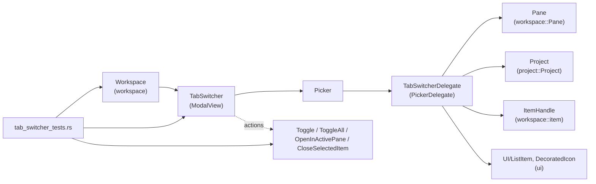
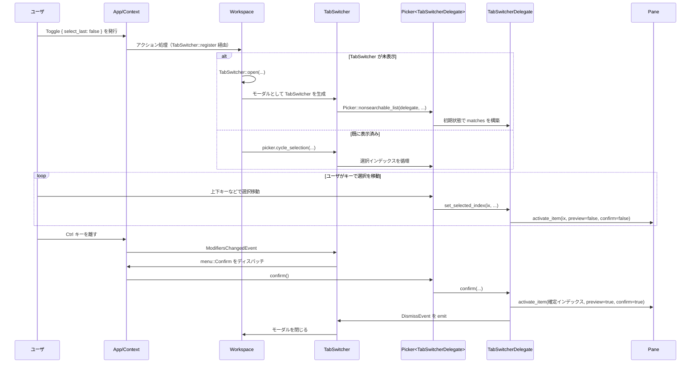

# tab_switcher/ ディレクトリ解説

## 1. ざっくり一言

`tab_switcher` クレートは、エディタ内で開いているタブ（ワークスペースのアイテム）を素早く切り替えたり、検索したり、閉じたりするための **モーダルなタブ・スイッチャ UI** を提供します。  
単一ペイン内と全ペイン横断の両方に対応し、`Ctrl+Tab` 風の操作やグローバル検索が行えるようになっています。

---

## 2. このモジュールの役割

### 2.1 概要

- このモジュールは **ワークスペース内の「タブ」（`ItemHandle`）を一覧し、選択して切り替える UI** を実装しています。
- 主な機能は:
  - 現在のペイン内のタブを「最近使った順」に並べ替えて切り替える
  - ワークスペース全体のタブを対象に **文字列検索（ファジー検索）** する
  - 選択中のタブを閉じる／アクティブなペインへ移動・複製する
- UI 部分は `picker::Picker` コンポーネントに委譲され、その挙動を `TabSwitcherDelegate` が制御する構成になっています。

### 2.2 アーキテクチャ内での位置づけ

このディレクトリ内の主要コンポーネントと、外部モジュールとの関係を簡略化した図です。



- `TabSwitcher` は `Workspace` のモーダルビューとして開かれ、内部に `Picker<TabSwitcherDelegate>` を保持します。
- `TabSwitcherDelegate` は、`Picker` から呼び出されるデリゲートとして、タブ一覧の作成・ソート・選択・確定・閉じる処理を実装します。
- タブの中身は `ItemHandle` として抽象化されており、その背後には `Editor` などの具体的なビューがあります（このディレクトリには実装は現れません）。

### 2.3 設計上のポイント

コードから読み取れる設計上の特徴を整理します。

- **責務分割**
  - `TabSwitcher`:
    - モーダルビューとしての枠組み（フォーカス、レンダリング、モディファイアキーの監視）を担当します。
    - 実際のリスト表示やタブ操作のロジックは `Picker`＋`TabSwitcherDelegate` に委譲されています。
  - `TabSwitcherDelegate`:
    - タブ候補（`TabMatch`）の構築・ソート・検索・選択・確定・削除など、ビジネスロジックを担当します。
    - `PickerDelegate` トレイトを実装することで、`Picker` の UI をカスタマイズしています。
- **状態管理**
  - `TabSwitcherDelegate` は `matches: Vec<TabMatch>` と `selected_index` によって現在の候補と選択状態を保持します。
  - `original_items: Vec<(Entity<Pane>, usize)>` により、タブスイッチャを開いた時点での各ペインのアクティブタブを記録し、閉じるときに復元できます。
  - ワークスペースやペインは `WeakEntity` で保持され、破棄済みの場合は安全に何もしないようになっています。
- **入力・イベント処理**
  - `Toggle` / `ToggleAll` / `OpenInActivePane` / `CloseSelectedItem` というアクションで操作されます。
  - `ModifiersChangedEvent` を使って `Ctrl` 等の修飾キーの押下状態を追跡し、「キーを離したら確定」という `Ctrl+Tab` 風の挙動を実現しています（ローカルモードのみ）。
  - `WorkspaceEvent::ItemAdded / ItemRemoved / PaneRemoved` を購読し、タブの追加・削除・ペイン削除に追従して候補リストを更新します。
- **エラーハンドリング**
  - 多くの更新処理は `.update` / `.update_in` のクロージャ内で行われ、戻り値のエラーは `util::ResultExt::log_err` や `detach_and_log_err` でログ出力のみにとどめています。
  - `WeakEntity` の `upgrade` 失敗や、`Pane` が既に存在しないケースは `if let Some(...)` で静かに無視する実装になっています。

---

## 3. 主要な機能一覧

このモジュールが提供する主な機能を列挙します。

- `Toggle` アクション:  
  現在アクティブなペインのタブを対象にタブスイッチャを開く／既に開いていれば選択を循環させる。
- `ToggleAll` アクション:  
  全ペインのタブを対象にしたグローバルなタブスイッチャ（検索付き）を開く／選択を循環させる。
- `OpenInActivePane` アクション:  
  全ペインのタブを対象にしつつ、**選択したタブをアクティブなペインに集約** するモードでタブスイッチャを開く。
- `CloseSelectedItem` アクション:  
  タブスイッチャ上で選択されているタブを閉じる（`OpenInActivePane` モードでは同じパスのタブを全ペインから閉じる）。
- ペイン内タブの「最近使った順」リスト:
  - `Pane::activation_history` を利用して、直近にアクティブだった順に並び替えます。
- ワークスペース全体のタブ検索:
  - `fuzzy::match_strings` を用いてタブ名に対しファジー検索を行い、一致度順に候補を表示します。
- Git・診断情報を反映したアイコン表示:
  - `TabMatch::icon` で、Git ステータスに応じた色、診断結果に応じたデコレーション（エラー・警告マークなど）を付与したアイコンを生成します。
- プレビューと確定の分離:
  - `open_in_active_pane = false` の場合、選択を移動するだけで該当タブをプレビュー表示し、モディファイアキーを離すか `Confirm` アクションで確定します。
  - `open_in_active_pane = true` の場合はプレビューせず、確定時にのみペインへ移動・複製します。

---

## 4. 関数・構造体の解説

### 4.1 型一覧（構造体など）

| 名前 | 種別 | 公開範囲 | 役割 / 用途 |
|------|------|----------|-------------|
| `Toggle` | 構造体 (`Action`) | `pub` | タブスイッチャを開く／選択を循環させるアクション。`select_last` フラグで初期選択位置を制御します。 |
| `TabSwitcher` | 構造体 | `pub` | モーダルビュー本体。内部に `Picker<TabSwitcherDelegate>` を保持し、UI イベントのフックを行います。 |
| `TabMatch` | 構造体 | `crate` 内 | 1 件のタブ候補を表す内部構造体。所属ペイン、アイテム、詳細情報、プレビュー状態を保持します。 |
| `TabSwitcherDelegate` | 構造体 | `pub` | `PickerDelegate` 実装。タブの列挙・ソート・検索・選択・確定・削除などのロジックを担当します。 |
| `CloseSelectedItem` / `ToggleAll` / `OpenInActivePane` | アクション型（マクロ生成） | `pub` | タブスイッチャの補助アクション群。選択タブのクローズ、全ペインモード、アクティブペイン集約モードを制御します。 |

テストファイル内には以下の補助関数も定義されています（型は外部モジュール由来のため省略します）。

- `init_test` / `open_tab_switcher` / `open_buffer` など: テスト用の環境構築・タブオープン・タブスイッチャ取得のヘルパです。

### 4.2 重要な関数の詳細

#### `init(cx: &mut App)`

**概要**

- アプリケーション起動時に呼び出され、`Workspace` に対してタブスイッチャ関連アクションの登録を行います。
- これを呼び出しておかないと、`Toggle` などのアクションをディスパッチしても何も起こりません。

**引数**

| 引数名 | 型 | 説明 |
|--------|----|------|
| `cx` | `&mut App` | アプリケーション全体のコンテキスト。新規 `TabSwitcher` の監視登録に使用します。 |

**戻り値**

- なし。

**内部処理の流れ**

1. `cx.observe_new(TabSwitcher::register).detach();` を呼び出します。
2. これにより、新しい `Workspace` が生成されるたびに `TabSwitcher::register` が呼ばれ、アクション登録が行われるようになります。

**Examples（使用例）**

アプリケーション初期化時に他のモジュールと一緒に登録する例です。

```rust
use gpui::App;                          // アプリケーションコンテキスト
use tab_switcher;                       // 本クレート
use editor;                             // エディタモジュール（外部）

fn main() {
    App::run(|cx| {                     // アプリケーションのエントリポイント
        tab_switcher::init(cx);         // タブスイッチャのアクションを登録
        editor::init(cx);               // エディタ関連のアクションも登録（テストと同様のパターン）
        // 他モジュールの init もここで呼ぶ想定です
    });
}
```

**Edge cases（エッジケース）**

- 特に複雑なエッジケースはありませんが、`init` を複数回呼んだ場合でも `observe_new` の挙動上、各 `Workspace` に対して `TabSwitcher::register` が重複して呼ばれる可能性があります。この点についてコード上の明確な防止ロジックはありません。

**使用上の注意点**

- テストコード `init_test` では、`AppState::test` やテーマの初期化と一緒に `super::init(cx)`（= `tab_switcher::init`）が呼ばれており、実際のアプリでも同様に「起動時一度だけ」呼ぶ想定の設計になっています。

---

#### `TabSwitcher::open(...)`

```rust
fn open(
    workspace: &mut Workspace,
    select_last: bool,
    is_global: bool,
    open_in_active_pane: bool,
    window: &mut Window,
    cx: &mut Context<Workspace>,
)
```

**概要**

- 実際にタブスイッチャ・モーダルを開く関数です。
- 現在の「アクティブペイン」を特定し、`TabSwitcherDelegate` を初期化し、`Workspace::toggle_modal` を通じて `TabSwitcher` を表示します。

**引数**

| 引数名 | 型 | 説明 |
|--------|----|------|
| `workspace` | `&mut Workspace` | タブ一覧やペイン情報を取得し、モーダル表示を行う対象ワークスペースです。 |
| `select_last` | `bool` | 初期選択位置の指定。`true` なら最後のタブを選択済みにします。 |
| `is_global` | `bool` | 全ペインを対象にするか（ファジー検索付き）どうかを表します。 |
| `open_in_active_pane` | `bool` | `true` の場合、選択したアイテムをアクティブなペインに集約するモードになります。 |
| `window` | `&mut Window` | ウィンドウコンテキスト。モーダル表示や入力状態の参照に使用します。 |
| `cx` | `&mut Context<Workspace>` | `Workspace` 用のコンテキスト。エンティティ操作に用います。 |

**戻り値**

- なし。副作用としてモーダルな `TabSwitcher` が開かれます。

**内部処理の流れ**

1. 現在のアクティブペインを決定します。
   - `workspace.active_pane()` を基準にしつつ、左／右／下ドックのアクティブパネルがフォーカスを持っている場合には、そのパネルのペインを優先します。
2. `weak_workspace` として `Workspace` の `WeakEntity` を保持し、強い参照循環を避けます。
3. `project` を `workspace.project().clone()` で取得します。
4. `original_items` として、各ペインとそのアクティブアイテムのインデックスを `Vec<(Entity<Pane>, usize)>` に記録します。
5. `workspace.toggle_modal(window, cx, |window, cx| { ... })` を呼び出し、モーダルを開きます。
   - クロージャ内で `TabSwitcherDelegate::new(...)` を生成。
   - それを `TabSwitcher::new(delegate, window, is_global, cx)` に渡して `TabSwitcher` 本体を作成します。

**Examples（使用例）**

通常は直接呼び出さず、`Toggle` などのアクション経由で `register` から使われます。テストコードではアクションをディスパッチすることで間接的に利用されています。

```rust
use tab_switcher::Toggle;                        // トグルアクション
use workspace::Workspace;                        // ワークスペース
use gpui::TestAppContext;                        // テスト用コンテキスト

fn open_from_action(cx: &mut TestAppContext) {
    // どこかで tab_switcher::init(cx) 済みであることが前提です
    cx.dispatch_action(Toggle { select_last: false });  // タブスイッチャを開く
    // Workspace 側で TabSwitcher::open が内部的に呼ばれます
}
```

**Edge cases**

- アクティブペインが存在しない場合でも、コード上では `workspace.active_pane()` を前提としているため、「ペインゼロ」状態はワークスペース側で起きない前提の設計と解釈できます。
- 各ペインにアクティブアイテムが存在しないケースでは、`active_item_index()` の仕様に依存しますが、この関数の内部では特別な対処は行っていません。

**使用上の注意点**

- ライブラリ利用者が直接 `open` を呼ぶよりも、`Toggle` / `ToggleAll` / `OpenInActivePane` アクションを通して開くのが前提の設計です（`register` 内でそのように扱われています）。

---

#### `TabSwitcherDelegate::update_matches(query: String, window: &mut Window, cx: &mut Context<Picker<Self>>)`

**概要**

- 単一ペインモード（`is_all_panes == false`）で、タブ候補 `matches` を更新し、`selected_index` を適切に設定し直します。
- タブはペイン内の「アクティブ履歴」に基づいてソートされます。
- 引数 `query` は現状の実装では使用されていません（非検索モード）。

**引数**

| 引数名 | 型 | 説明 |
|--------|----|------|
| `query` | `String` | 入力された検索クエリ。現在の実装では無視されます。 |
| `window` | `&mut Window` | ウィンドウコンテキスト。`tab_details` などの UI 情報取得で使用します。 |
| `cx` | `&mut Context<Picker<Self>>` | `Picker` 用コンテキスト。ペインの読み取り等に利用します。 |

**戻り値**

- なし。`self.matches` と `self.selected_index` が更新されます。

**内部処理の流れ**

1. 現在の選択アイテムの ID を `selected_item_id()` で取得します。
2. `self.matches.clear()` で候補リストを空にします。
3. `self.pane.upgrade()` で対象ペインを取得。失敗した場合は何もせず終了します。
4. `pane.activation_history()` を逆順に走査し、`history_indices`（`HashMap<EntityId, usize>`）に「最近使った順」のスコアを登録します。
5. `pane.items()` をすべて `Box<dyn ItemHandle>` にクローンし、`tab_details(&items, window, cx)` と組み合わせて `TabMatch` を生成し `matches` に詰めます。
6. `non_history_base = history_indices.len()` として、履歴に登場しないアイテムには `item_index + non_history_base` のスコアを付与します。
7. `self.matches.sort_by` でスコアに基づいて並び替えます（履歴にあるものが先、ないものは元の順）。
8. `compute_selected_index(selected_item_id, window, cx)` を呼び出して `self.selected_index` を決定します。

**Edge cases**

- ペインが既に破棄されている場合（`upgrade()` が失敗する場合）、候補は更新されずそのままになります。
- アイテムが一つしかない場合でも、ソートや選択処理はそのまま実行され、結果的に `selected_index` は 0 になります。
- `query` が空でも、また非空でも挙動は同じで、検索は行われません。

**使用上の注意点**

- この関数は `is_all_panes == false` のときにのみ呼び出されます（`is_all_panes` が `true` の場合は `update_all_pane_matches` が使用されます）。
- `query` を利用したい場合は、この関数の中でフィルタリング処理を追加する必要がありますが、現行コードにはそのロジックはありません。

---

#### `TabSwitcherDelegate::update_all_pane_matches(query: String, window: &mut Window, cx: &mut Context<Picker<Self>>)`

**概要**

- 全ペインモード（`is_all_panes == true`）で、ワークスペース内のすべてのタブを対象とした候補 `matches` を構築します。
- `query` が空の場合は最近アクティブだった順に、非空の場合は `fuzzy::match_strings` でファジー検索を行います。
- `open_in_active_pane` モードでは、同じパスを持つファイルを一意になるようにフィルタリングします。

**引数**

| 引数名 | 型 | 説明 |
|--------|----|------|
| `query` | `String` | 検索クエリ。空文字列の場合は履歴順、非空の場合はファジー検索を実行します。 |
| `window` | `&mut Window` | ウィンドウコンテキスト。`tab_details` などに使用します。 |
| `cx` | `&mut Context<Picker<Self>>` | `Picker` 用コンテキスト。`Workspace` の読み取りなどに使用します。 |

**戻り値**

- なし。`self.matches` と `self.selected_index` が更新されます。

**内部処理の流れ**

1. `self.workspace.upgrade()` で `Workspace` を取得。失敗した場合は何もせず終了します。
2. すべてのペインについて:
   - `pane.items()` を列挙し `Vec<Box<dyn ItemHandle>>` として保持します。
   - `tab_details(&items, window, cx)` と組み合わせて `TabMatch` を生成します。
   - `item_index` は全ペインを通してインクリメントし、タブ全体で一意になるようにしています。
3. `query` が空のとき:
   - `workspace.read(cx).recently_activated_items(cx)` を取得し、`all_items` を `(Reverse(history.get(...)), item_index)` でソートします。
4. `query` が非空のとき:
   - 各 `TabMatch` から `item.tab_content_text(0, cx)` を取り出し、`StringMatchCandidate` として `fuzzy::match_strings` に渡します。
   - 戻り値のマッチ結果から `candidate_id` を用いて `all_items` から対応する `TabMatch` を取り出し、新しい `matches` を構築します。
5. `open_in_active_pane` が `true` の場合:
   - `HashSet<project::ProjectPath>` を用いて、すでに見たパスはスキップし、同一ファイルが複数ペインに開かれていても 1 件にまとめます。
6. 直前に選択されていたアイテムの ID を `selected_item_id` から取得し、`self.matches` に格納し直した後、`compute_selected_index` で `selected_index` を決定します。

**Edge cases**

- ワークスペースが破棄されている場合は何も行われません。
- `fuzzy::match_strings` の結果が空の場合、`matches` は空になり、`compute_selected_index` は 0 を返します。
- `open_in_active_pane` かつパスを持たないアイテム（例: ターミナルなど）はそのまま残ります（重複排除の対象外です）。

**使用上の注意点**

- この関数は `update_matches` から `is_all_panes` 判定のもとで間接的に呼び出されています。
- `smol::block_on` によってファジーマッチ処理を同期的に待機しているため、大量のタブ・長いクエリで UI がブロックされる可能性があります（コード上そのような懸念が読み取れます）。

---

#### `TabSwitcherDelegate::compute_selected_index(prev_selected_item_id: Option<EntityId>, window: &mut Window, cx: &mut Context<Picker<Self>>) -> usize`

**概要**

- `matches` が更新された後に、どのインデックスを選択済みにするかを決定する関数です。
- 以前の選択をできる限り維持しつつ、`select_last` フラグや「最初のアイテムはすでにアクティブなので飛ばす」といったルールを適用します。

**引数**

| 引数名 | 型 | 説明 |
|--------|----|------|
| `prev_selected_item_id` | `Option<EntityId>` | 更新前に選択されていたアイテムの ID。なければ `None`。 |
| `window` | `&mut Window` | ウィンドウコンテキスト。`set_selected_index` 内で使用されます。 |
| `cx` | `&mut Context<Picker<Self>>` | `Picker` のコンテキスト。プレビュー表示などに利用されます。 |

**戻り値**

- 決定された選択インデックス（`usize`）。

**内部処理の流れ**

1. `matches` が空なら 0 を返します。
2. `prev_selected_item_id` が `Some` の場合:
   - 同じ ID を持つ `TabMatch` が `matches` 内に存在すればそのインデックスを返します。
   - 見つからない場合は、以前の `self.selected_index` を上限 `matches.len() - 1` でクリップした値を返します。
3. `prev_selected_item_id` が `None` で `select_last == true` の場合:
   - `item_index = matches.len() - 1` を計算し、`set_selected_index(item_index, window, cx)` を呼んでから `item_index` を返します。
4. `prev_selected_item_id` が `None` で `select_last == false` の場合:
   - 「初回オープン時のみ」のルールが適用され、`matches.len() > 1` なら `set_selected_index(1, ...)` を呼び、インデックス 1 を返します（インデックス 0 は既にアクティブなタブとみなされます）。
   - それ以外のときは 0 を返します。

**Edge cases**

- `matches.len() == 1` で `select_last == false` の場合は、インデックス 0 が選択されます（テスト `test_open_with_single_item` で確認されています）。
- `select_last == true` かつ `matches.len() == 0` の場合でも、冒頭の空チェックで 0 を返すのでパニックにはなりません。

**使用上の注意点**

- `set_selected_index` を内部で呼ぶパスがいくつかあり、その中でプレビュー表示（`Pane::activate_item`）が実行される点に注意が必要です。
- テストコードでは `picker.delegate.selected_index = 0;` のようにフィールドを書き換えていますが、一般的には `set_selected_index` を通すことでプレビュー更新と通知が行われる設計になっています。

---

#### `TabSwitcherDelegate::close_item_at(ix: usize, window: &mut Window, cx: &mut Context<Picker<TabSwitcherDelegate>>)`

**概要**

- `matches[ix]` に対応するタブ（アイテム）を閉じる関数です。
- 通常モードではそのペインから 1 つだけ閉じ、`open_in_active_pane` モードでは同じパスを持つタブをすべてのペインから閉じます。

**引数**

| 引数名 | 型 | 説明 |
|--------|----|------|
| `ix` | `usize` | 閉じたいタブのインデックス。 |
| `window` | `&mut Window` | ウィンドウコンテキスト。 |
| `cx` | `&mut Context<Picker<TabSwitcherDelegate>>` | `Picker` コンテキスト。`Workspace` / `Pane` の更新に利用します。 |

**戻り値**

- なし。該当するタブが存在すれば閉じ処理を行います。

**内部処理の流れ**

1. `self.matches.get(ix)` で `TabMatch` を取得。存在しなければ何もせず終了します。
2. `open_in_active_pane` かつ `tab_match.item.project_path(cx)` が `Some(path)` の場合:
   - `self.workspace.upgrade()` で `Workspace` を取得。
   - `workspace.update` 内で `workspace.close_items_with_project_path(&path, SaveIntent::Close, true, window, cx);` を呼び出し、同じパスを持つアイテムを全ペインから閉じます。
3. 上記以外の場合（通常モードなど）:
   - `tab_match.pane.upgrade()` でペインを取得。
   - `pane.update` 内で `pane.close_item_by_id(tab_match.item.item_id(), SaveIntent::Close, window, cx).detach_and_log_err(cx);` を呼び、対象のアイテムだけを閉じます。

**Edge cases**

- `ix` が範囲外の場合は何も行われません。
- `open_in_active_pane` モードでも、パスを持たないアイテム（ターミナル等）はプロジェクトパスでの一括クローズの対象にならず、通常モードと同様に `pane.close_item_by_id` が使われます。
- ペインやワークスペースが既に破棄されている場合 (`upgrade()` が失敗) も、何もせず終了します。

**使用上の注意点**

- この関数は:
  - `TabSwitcher` 本体の `handle_close_selected_item` によるアクション (`CloseSelectedItem`) から
  - `render_match` 内のクローズボタンのクリック・右クリックから  
  呼び出されます。
- 閉じた後の `matches` の更新は、`WorkspaceEvent::ItemRemoved` のイベントを通じて `subscribe_to_updates` 内で行われる設計になっています。

---

#### `impl PickerDelegate for TabSwitcherDelegate::confirm(...)`

```rust
fn confirm(
    &mut self,
    _secondary: bool,
    window: &mut Window,
    cx: &mut Context<Picker<TabSwitcherDelegate>>,
)
```

**概要**

- `Picker` から「選択が確定された」ときに呼ばれ、最終的にタブをアクティブにし、タブスイッチャを閉じる処理を行います。
- `original_items` に保存されている各ペインのアクティブアイテムを一旦復元した上で、選択されたタブをアクティブにします。

**引数**

| 引数名 | 型 | 説明 |
|--------|----|------|
| `_secondary` | `bool` | セカンダリ操作かどうかを表すフラグ。現実装では使用されていません。 |
| `window` | `&mut Window` | ウィンドウコンテキスト。 |
| `cx` | `&mut Context<Picker<TabSwitcherDelegate>>` | `Picker` コンテキスト。ペイン更新・タブスイッチャへのイベント送信に利用します。 |

**戻り値**

- なし。

**内部処理の流れ**

1. 現在の `selected_index` に対応する `TabMatch` を `cloned()` でコピーして取得します。存在しなければ何もせず終了します。
2. `self.restored_items = true` とし、「閉じる際に original_items を復元する必要がない」ことをマークします。
3. `for (pane, index) in self.original_items.iter()` として、すべてのペインに対して:
   - `pane.update` 内で `this.activate_item(*index, false, false, window, cx);` を呼び、タブスイッチャを開いた時点のアクティブタブに戻します。
4. `open_in_active_pane` が `true` の場合:
   - `confirm_open_in_active_pane(selected_match, window, cx);` を呼び、アクティブなペインにタブを移動／複製します。
5. `open_in_active_pane` が `false` の場合:
   - `selected_match.pane.update` 内で `pane.index_for_item(selected_match.item.as_ref())` を探し、見つかれば `pane.activate_item(index, true, true, window, cx);` を呼んでタブを最終的にアクティブ化します。

**Edge cases**

- 確定時に対象タブが既に閉じられており、`index_for_item` が `None` を返す場合、そのタブはアクティブ化されません。
- `original_items` に保存されているペインやアイテムが既に存在しない場合も、`update` 内で適宜無視されるため、パニックにはなりません。

**使用上の注意点**

- 「プレビュー中に一時的にアクティブタブが変わっていても、一度元に戻してから確定タブに切り替える」という挙動を実現するため、`original_items` を復元してから最終アクティブ化を行っています。
- タブスイッチャ自体のクローズは `dismissed` 内で `DismissEvent` を通じて行われます。`confirm` はあくまでタブの状態のみを確定する役割です。

---

### 4.3 その他の関数（一覧）

主要な補助関数やテスト用関数を簡単にまとめます。

| 関数名 / メソッド | 役割（1 行） |
|-------------------|--------------|
| `TabSwitcher::register` | 新しい `Workspace` ごとに `Toggle` / `ToggleAll` / `OpenInActivePane` / `CloseSelectedItem` アクションを登録します。 |
| `TabSwitcher::new` | `TabSwitcherDelegate` を受け取り、適切な種類の `Picker`（検索付き／なし）を生成します。 |
| `TabSwitcher::handle_modifiers_changed` | ローカルモード時に修飾キーの変化を監視し、キーが離されたときに `Confirm` または `DismissEvent` を発火します。 |
| `TabSwitcher::handle_close_selected_item` | `CloseSelectedItem` アクションを受け取り、現在選択中のタブを閉じます。 |
| `TabMatch::icon` | Git ステータスと診断情報に応じて色とデコレーションを付与したアイコンを生成します。 |
| `TabSwitcherDelegate::subscribe_to_updates` | `WorkspaceEvent` を購読し、アイテムの追加・削除・ペイン削除に応じて `matches` と `selected_index` を更新します。 |
| `TabSwitcherDelegate::selected_item_id` | 現在の `selected_index` に対応するアイテム ID を返します。 |
| `TabSwitcherDelegate::sync_selected_index` | ペインやワークスペースのアクティブアイテムと `selected_index` を同期させます。 |
| `TabSwitcherDelegate::confirm_open_in_active_pane` | `open_in_active_pane` モードで、選択タブをアクティブペインに移動・複製・再利用する挙動を実装します。 |
| `TabSwitcherDelegate::render_match` | 各タブ候補の行（ラベル、アイコン、インジケータ、クローズボタン）を構築して `ListItem` として返します。 |
| `init_test`（テスト） | テスト用の `AppState` とテーマ、エディタ、タブスイッチャを初期化します。 |
| `open_tab_switcher`（テスト） | `Toggle` アクションをディスパッチし、アクティブな `TabSwitcher` の `Picker` を取得します。 |
| `open_buffer`（テスト） | ファイルパスから `workspace.open_path` を呼び出し、エディタタブを開きます。 |
| `assert_match_selection` / `assert_match_at_position` / `assert_tab_switcher_is_closed`（テスト） | タブスイッチャの内部状態を検証するためのユーティリティ関数群です。 |

---

## 5. データフロー

ここでは、よくあるシナリオとして **「Ctrl+Tab 風の操作でタブを切り替える」** 場合のデータフローを説明します。

### 5.1 処理の要点

1. ユーザがショートカットを押すと `Toggle { select_last: false }` がディスパッチされます。
2. `Workspace` が `TabSwitcher::open` を通じて `TabSwitcher` モーダルを開き、内部で `Picker<TabSwitcherDelegate>` が生成されます。
3. `TabSwitcherDelegate` が現在のペインのタブを `matches` に列挙し、「最近使った順」にソートします。
4. ユーザがキー操作で選択を移動すると、`set_selected_index` を通じてプレビュー表示としてタブが切り替わります。
5. ユーザが Ctrl キーを離すと `ModifiersChangedEvent` が発火し、`TabSwitcher::handle_modifiers_changed` が `menu::Confirm` をディスパッチします。
6. `Picker` が `confirm` を呼び出し、`TabSwitcherDelegate` が最終的なタブアクティベーションを行い、`DismissEvent` によりモーダルが閉じます。

### 5.2 シーケンス図



- `preview=false/confirm=false` の `activate_item` が「プレビュー」の役割を果たし、`preview=true/confirm=true` が確定時のアクティベーションです（引数はコードから読み取れるブール値の意味に基づく解釈です）。

---

## 6. 使い方（How to Use）

### 6.1 基本的な使用方法

ここでは、アプリケーションに `tab_switcher` を組み込み、`Toggle` アクションでタブスイッチャを開く最小限の例を示します。

```rust
use gpui::{App, TestAppContext};        // App やテスト用コンテキスト
use tab_switcher::{self, Toggle};       // タブスイッチャのモジュールと Toggle アクション
use workspace::Workspace;               // ワークスペース
use editor;                             // エディタモジュール（外部）

fn main() {
    App::run(|cx| {                     // アプリケーション起動
        tab_switcher::init(cx);         // 1. タブスイッチャのアクションを登録する
        editor::init(cx);               // 2. エディタなど他モジュールも初期化する
        // 3. Workspace やウィンドウのセットアップはアプリケーション側で行う
    });
}

// どこかのイベントハンドラなどから:
fn open_switcher_example(cx: &mut TestAppContext) {
    // select_last = false の Toggle をディスパッチすると、
    // アクティブペインのタブを対象としたタブスイッチャが開く
    cx.dispatch_action(Toggle { select_last: false });
}
```

- 実際のアプリケーションでは、キーバインドなどに `Toggle` / `ToggleAll` / `OpenInActivePane` を割り当てることで操作する設計になります。
- テストコードでは `open_tab_switcher` ヘルパが `Toggle` をディスパッチしてからアクティブな `Picker<TabSwitcherDelegate>` を取得しています。

### 6.2 よくある使用パターン

#### パターン 1: 現在のペインのタブを Ctrl+Tab 風に切り替える

```rust
use tab_switcher::Toggle;               // Toggle アクション
use gpui::Modifiers;                    // 修飾キー

fn ctrl_tab_like_switch(cx: &mut gpui::TestAppContext) {
    cx.simulate_modifiers_change(Modifiers::control());  // Ctrl キーを押した状態にする
    cx.dispatch_action(Toggle { select_last: false });   // タブスイッチャを開く（先頭は現在タブなので 2 番目が選択される）
    // ユーザがキー操作で選択を移動すると想定

    cx.simulate_modifiers_change(Modifiers::none());     // Ctrl キーを離すと選択中タブが確定される
}
```

- ローカルモード（`is_global = false`）では、`TabSwitcher` が初期修飾キー (`init_modifiers`) を記憶し、修飾キーが離れたタイミングで `menu::Confirm` をディスパッチする実装になっています。

#### パターン 2: ワークスペース全体のタブを検索する

```rust
use tab_switcher::ToggleAll;            // 全ペイン対象のトグルアクション

fn open_global_search(cx: &mut gpui::TestAppContext) {
    // ToggleAll をディスパッチすると、全ペインのタブを対象にした
    // 検索付きタブスイッチャが開く
    cx.dispatch_action(ToggleAll);
    // ユーザが検索文字列を入力すると、update_all_pane_matches でファジー検索が行われる
}
```

- グローバルモードでは `is_global = true` となり、`Picker::list` が使われ、`update_all_pane_matches` でクエリに応じたファジーマッチが実行されます。
- このモードでは `init_modifiers` は `None` なので、修飾キーのリリースによる自動確定は行われません（コード上そう実装されています）。

#### パターン 3: アクティブなペインにファイルを集約する

```rust
use tab_switcher::OpenInActivePane;     // アクティブペイン集約モードのアクション
use menu::Confirm;                      // Picker の Confirm アクション

fn move_or_clone_to_active_pane(cx: &mut gpui::TestAppContext) {
    // すでに複数ペインにタブが開かれていると想定
    cx.dispatch_action(OpenInActivePane);   // タブスイッチャを開く（全ペインのタブをパスごとに一意に列挙）

    // テストコードと同様に、選択インデックスをプログラムから変更することも可能
    // 通常はユーザのキー操作で選択が変わる
    // ここでは例として「現在の選択をそのまま確定」する
    cx.dispatch_action(Confirm);           // 選択中タブをアクティブペインに移動・複製する
}
```

- `OpenInActivePane` モードでは `open_in_active_pane = true` となり、`update_all_pane_matches` 内でパスによる重複排除が行われます。
- `confirm_open_in_active_pane` によって、エディタなどパスを持つアイテムはクローンされ、それ以外（ターミナル等）は `move_item` によってペイン間移動します。

### 6.3 よくある間違い

このモジュールを利用する際に起こりそうな誤用と、その対処をコードから読み取れる範囲でまとめます。

```rust
// 間違い例: init を呼ばずに Toggle をディスパッチする
fn bad_usage(cx: &mut gpui::TestAppContext) {
    // tab_switcher::init(cx); を呼んでいない
    cx.dispatch_action(tab_switcher::Toggle { select_last: false });
    // Workspace 側に TabSwitcher::register が登録されておらず、何も起きない
}

// 正しい例: 起動時に init を呼んでからアクションを使う
fn good_usage(cx: &mut gpui::TestAppContext) {
    tab_switcher::init(cx);                               // 先にアクションを登録
    cx.dispatch_action(tab_switcher::Toggle { select_last: false });  // 正しくタブスイッチャが開く
}
```

```rust
// 間違い例: selected_index を直接書き換えてプレビュー更新を期待する
fn bad_change_selected(picker: &mut picker::Picker<TabSwitcherDelegate>, cx: &mut gpui::App) {
    picker.delegate.selected_index = 2;   // set_selected_index を通していない
    // この場合、Pane の activate_item や cx.notify() が呼ばれないため、
    // 画面上のプレビューや選択状態が同期しない
}

// 正しい例: set_selected_index を通じて選択変更する
fn good_change_selected(picker: &mut picker::Picker<TabSwitcherDelegate>, window: &mut gpui::Window, cx: &mut gpui::Context<_>) {
    picker.delegate.set_selected_index(2, window, cx);    // 内部で activate_item と cx.notify() が呼ばれる
}
```

### 6.4 使用上の注意点（まとめ）

- **初期化の必須性**
  - `tab_switcher::init(cx)` をアプリケーション起動時に呼び出しておく必要があります。これを行わない場合、`Toggle` 等のアクションは `Workspace` に登録されず何も起きません。
- **モードごとの挙動の違い**
  - ローカルモード（`Toggle`）は:
    - 単一ペインを対象
    - 検索なし（`query` 無視）
    - 修飾キーリリースで自動確定
  - グローバルモード（`ToggleAll`）は:
    - 全ペイン対象
    - ファジー検索あり
    - 修飾キーリリースによる自動確定なし
  - アクティブペイン集約モード（`OpenInActivePane`）は:
    - 全ペイン対象＋パスによる重複排除
    - 確定時にアクティブペインへ移動／複製
    - `CloseSelectedItem` で同一パスのタブを全ペインから閉じる
- **状態復元の挙動**
  - タブスイッチャを開いた時点の各ペインのアクティブタブは `original_items` に記録されます。
  - `confirm` では一度これを復元してから最終アクティブタブを決めます。
  - `dismissed`（ESC や閉じる操作）では、`confirm` が呼ばれていない場合に限り、`original_items` を復元します。
- **イベントとの同期**
  - `WorkspaceEvent::ItemRemoved` の発火により、`sync_selected_index` が呼ばれ、実際のペインのアクティブタブとタブスイッチャの選択状態が同期されます。
  - アイテム削除やペイン削除を別の UI から行っても、タブスイッチャ側のリストは再構築される設計です。

---

## 7. 関連ファイル

このディレクトリ内および外部モジュールとの関係をまとめます。

| パス | 役割 / 関係 |
|------|-------------|
| `tab_switcher/Cargo.toml` | ライブラリクレート `tab_switcher` の設定。`gpui`, `workspace`, `picker`, `project`, `ui`, `editor` などへの依存が宣言されています。 |
| `tab_switcher/src/tab_switcher.rs` | 本体実装ファイル。`TabSwitcher`, `Toggle`, `TabSwitcherDelegate` など全機能がここに定義されています。 |
| `tab_switcher/src/tab_switcher_tests.rs` | gpui のテストインフラを用いた統合テスト。タブの開閉やペイン分割を含む実際のワークスペース操作を通じてタブスイッチャの挙動を検証します。 |
| `workspace` クレート（外部） | `Workspace`, `Pane`, `ModalView`, `ItemHandle`, `SaveIntent` など、タブスイッチャが操作するワークスペース・ペイン・アイテムの抽象化を提供します。 |
| `picker` クレート（外部） | `Picker` UI コンポーネントと `PickerDelegate` トレイトを提供し、タブ一覧の表示と選択インターフェイスの基盤となります。 |
| `project` クレート（外部） | Git ステータスやファイルバッファなど、プロジェクトツリーやファイルに関する情報を提供し、アイコンの色付けや診断情報取得に利用されます。 |
| `editor` クレート（外部） | テスト内で実際に開くエディタタブ（`Editor`）を提供し、タブスイッチャが操作する具体的なアイテムの一例となっています。 |
| `ui` クレート（外部） | `ListItem`, `DecoratedIcon`, `IconButton` などの UI コンポーネントを提供し、タブスイッチャの見た目・操作要素（インジケータ・クローズボタン等）の描画に使われています。 |

以上が `tab_switcher` ディレクトリの構造と挙動の整理です。この情報をもとに、タブスイッチャの挙動理解や、ワークスペース周辺機能との連携・拡張に役立てることができます。
