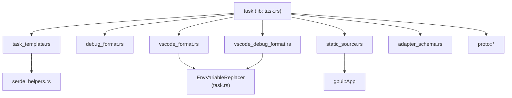
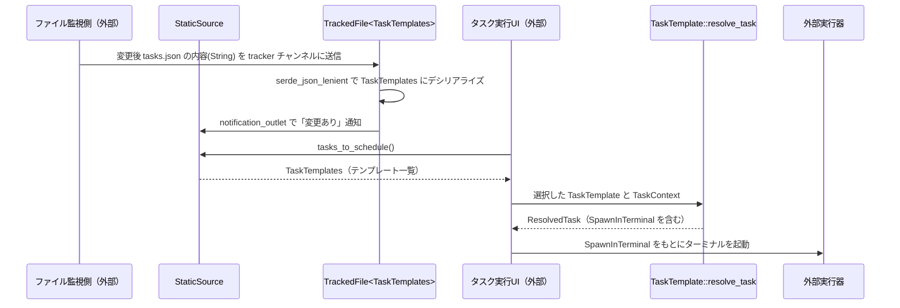

# task/

## 1. ざっくり一言

Zed の「タスク」機能（ビルド・テスト・任意コマンドやデバッグ構成）を、JSON 設定ファイルや VS Code 形式の設定から読み取り、テンプレートを変数で展開してターミナル実行・デバッグ実行に渡すためのクレートです。

---

## 2. このモジュールの役割

- `task` クレートは、Zed 内のあらゆる「タスク」の共通フォーマットと解決ロジックを提供します。
- 主な役割は次のとおりです。
  - タスクのテンプレート (`TaskTemplate`) とその解決結果 (`ResolvedTask`) の定義
  - エディタ状態（カレントファイル等）から環境変数を組み立てる仕組み (`VariableName`, `TaskVariables`)
  - VS Code の `tasks.json` / `launch.json` 形式から Zed のタスク・デバッグシナリオへの変換
  - デバッグアダプタ設定用 JSON Schema の生成
  - `tasks.json` 等の静的設定ファイルを監視し、パース済みオブジェクトとして提供するソース (`StaticSource`)

### モジュール間の位置づけ（依存関係）

このディレクトリ内の主要モジュール同士、および代表的な外部依存との関係は次のようになっています。



### 設計上のポイント（コードから読み取れる範囲）

- **テンプレート + コンテキスト方式**
  - 実行可能なタスクは、まず `TaskTemplate`（JSON からデシリアライズ可能な定義）として表現され、`TaskContext` と組み合わせて `ResolvedTask` に変換されます。
- **環境変数ベースのプレースホルダ**
  - `${ZED_FILE}` 等の変数名でテンプレート内にプレースホルダを記述し、`TaskVariables` からの値を埋め込む設計です。
- **厳格な Zed 変数と「自由な」環境変数を区別**
  - `ZED_` プレフィックスを持つ変数は `VariableName` 列挙体で管理され、未定義ならエラー扱い（ただしデフォルト値付きは使用可能）。
  - それ以外の変数名（例: `$PATH`）は通常の環境変数として扱われ、解決できなくてもそのまま残す方針です。
- **VS Code 互換フォーマットの取り込み**
  - `vscode_format.rs` / `vscode_debug_format.rs` で VS Code の `tasks.json` / `launch.json` と互換性のあるフォーマットを定義し、Zed 独自の構造体に変換します。
  - `EnvVariableReplacer` が VS Code 独自の `${workspaceFolder}` や `${command:pickMyProcess}` 等を Zed 流の `${ZED_...}` 形式に置き換えます。
- **JSON Schema の生成**
  - `TaskTemplates::generate_json_schema` と `DebugTaskFile::generate_json_schema` により、タスク JSON / デバッグ JSON のスキーマを動的に生成できます。
- **静的設定ファイルの監視**
  - `StaticSource` と `TrackedFile` で、チャンネル経由で受け取る JSON 文字列を非同期に `TaskTemplates`（等）へパースし、変更時のみ通知を発行します。

---

## 3. 主要な機能一覧

- タスクテンプレート定義:
  - `TaskTemplate` / `TaskTemplates`: JSON で記述する Zed タスクのテンプレートと、その配列。
- タスク解決と実行情報:
  - `TaskContext` / `SharedTaskContext`: タスク解決時のコンテキスト（カレントディレクトリや Zed 変数群）。
  - `ResolvedTask`: テンプレート + コンテキストから解決されたタスク。
  - `SpawnInTerminal`: ターミナルで実行するためのコマンド・引数・環境など。
  - `TaskId`: タスクインスタンスの識別子。
- 変数管理:
  - `VariableName`: `${ZED_FILE}` 等の Zed 固有変数の列挙。
  - `TaskVariables`: `VariableName` → 値 のマップ。
  - 変数展開ユーティリティ: `substitute_variables_in_str`, `substitute_variables_in_map` など。
- デバッグ構成:
  - `LaunchRequest`, `AttachRequest`, `DebugRequest`: デバッグアダプタへのリクエスト種別とパラメータ。
  - `ZedDebugConfig`, `DebugScenario`, `DebugTaskFile`: ユーザ定義のデバッグタスクとそのファイル形式。
  - `TcpArgumentsTemplate`: DAP を TCP で接続するための情報。
  - `BuildTaskDefinition`: デバッグ開始前に実行するビルドタスク（名前参照 or テンプレート）。
  - `AdapterSchema`, `AdapterSchemas`: 各デバッグアダプタ固有の JSON スキーマ定義。
- VS Code 互換フォーマット:
  - `VsCodeTaskFile`: VS Code の `tasks.json` 相当を表す型。
  - `VsCodeDebugTaskFile`: VS Code の `launch.json` 相当を表す型。
- 静的タスクソース:
  - `StaticSource`, `TrackedFile<T>`: `tasks.json` 等のファイル内容を非同期で追跡し、パース済みの `TaskTemplates` を提供。
- 補助機能:
  - `EnvVariableReplacer`: VS Code スタイルの `${workspaceFolder}` 等を Zed 変数に変換。
  - `non_empty_string_vec`: 空文字列を含まない `Vec<String>` をデシリアライズするヘルパ。
  - `shell_from_proto` / `shell_to_proto`: `proto::Shell` と `util::shell::Shell` の相互変換。

---

## 4. 関数・構造体の解説

### 4.1 タスクテンプレートと解決まわり

#### 主な型

| 型名 | 役割 |
|------|------|
| `TaskTemplate` | 1 個のタスク定義。ラベル・コマンド・引数・環境などを持つテンプレートです。 |
| `TaskTemplates` | `Vec<TaskTemplate>` のラッパー。`tasks.json` 全体を表現します。 |
| `TaskId` | 解決済みタスクの ID。テンプレート内容と変数値からハッシュで生成されます。 |
| `SpawnInTerminal` | ターミナルに渡す最終的な実行情報（コマンド・引数・環境・CWD など）。 |
| `ResolvedTask` | `TaskTemplate` を `TaskContext` で解決した結果。`SpawnInTerminal` を内包します。 |
| `VariableName` | `${ZED_FILE}` など Zed が提供する事前定義変数の列挙体です。 |
| `TaskVariables` | `VariableName` → `String` のマップ。タスク解決時の Zed 状態を表現します。 |
| `TaskContext` | CWD・`TaskVariables`・プロジェクト環境変数 (`project_env`) をまとめたコンテキスト。 |
| `SharedTaskContext` | `Arc<TaskContext>` の薄いラッパー。クローンして共有できます。 |

#### `TaskTemplate`

`TaskTemplate` は JSON から直接デシリアライズされるタスク定義です。主なフィールド:

- `label: String`  
  UI に表示されるタスク名。
- `command: String`  
  実行するコマンド。`"${ZED_FILE}"` のような変数を含めることができます。
- `args: Vec<String>`  
  コマンド引数。
- `env: HashMap<String, String>`  
  環境変数の上書き・追加。
- `cwd: Option<String>`  
  実行時の作業ディレクトリ。なければ `TaskContext.cwd` が使われます。
- `reveal`, `reveal_target`, `hide`, `shell`, `save`, `hooks` など  
  ターミナル UI の挙動やフック用の設定。
- `tags: Vec<String>`  
  特定の「タグ付き runnable」（テストや main 関数など）に紐づけるためのタグ。  
  デシリアライズ時、空文字は `non_empty_string_vec` によって拒否されます。

##### `TaskTemplate::resolve_task(&self, id_base: &str, cx: &TaskContext) -> Option<ResolvedTask>`

**概要**

`TaskTemplate` を `TaskContext` に基づいて変数展開し、実行可能な `ResolvedTask` を生成します。生成できない場合（必須情報不足や未知の Zed 変数など）は `None` を返します。

**引数**

| 引数名 | 型 | 説明 |
|--------|----|------|
| `id_base` | `&str` | タスク ID のプレフィックス。タスクの出自（設定ファイル名など）を区別する用途を想定しています。 |
| `cx` | `&TaskContext` | カレントディレクトリ・Zed 変数・プロジェクト環境を含むコンテキスト。 |

**戻り値**

- `Some(ResolvedTask)`  
  正常に解決できた場合。`ResolvedTask` 内に `SpawnInTerminal` や解決に使われた変数の集合が含まれます。
- `None`  
  解決できなかった場合（後述のエッジケースを参照）。

**内部処理の流れ（要約）**

1. `label` または `command` が空白のみなら早期に `None`。
2. `TaskContext.task_variables` から `HashMap<String, &str>` を作り、キーは `VariableName` の `Display` 表現（例: `"ZED_FILE"`）に変換。
3. 同時に `HashMap<String, VariableName>`（文字列表現 → 列挙体）も準備し、どの変数が使われたか追跡できるようにします。
4. `cwd`, `label`, `command`, `args`, `env` それぞれについて `substitute_all_template_variables_in_str` / `_in_vec` / `_in_map` を使って `${...}` を展開。
   - 展開時、使われた `VariableName` が `ResolvedTask.substituted_variables` に記録されます。
5. `label` については以下の 2 種類を生成:
   - `resolved_label`: 変数を「フル値」で置き換えたラベル（長くてもそのまま）。
   - `label`（`SpawnInTerminal` 内）: 長すぎる値は 1 つの変数ごとに 15 文字までにトリミングして短くした、人間に見せる用ラベル。
6. `TaskTemplate` 自身とタスク変数マップを JSON 化して SHA-256 ハッシュを取り、`TaskId("{id_base}_{task_hash}_{variables_hash}")` を生成。
7. 環境変数は次の順で構築:
   - `cx.project_env` をコピー。
   - それを `self.env` で上書き。
   - 上記をプレースホルダ展開。
   - さらに `${ZED_...}` 形式のタスク変数をそのままキー・値として追加。
8. 最終的な `SpawnInTerminal` を組み立て、`ResolvedTask` として `Some(...)` を返します。

**エッジケース**

- `label` または `command` が空文字 / 空白のみ → `None`。
- テンプレート内に `${ZED_*}` があるが、`TaskContext.task_variables` に値がない場合:
  - デフォルト値が指定されていれば `${ZED_VAR:default}` の `default` が使われます。
  - デフォルト値もない場合はエラー扱いとなり、解決全体が失敗し `None` になります。
- `ZED_` ではない変数（例: `${PATH}`）:
  - デフォルト値が付いていれば `${PATH:foo}` という文字列として残されます。
  - 付いていなければシステム環境変数の解決に委ねられます（ここではエラーにしません）。
- 変数のトリミング:
  - ラベル全体が 64 文字を超える場合のみ、「人間向け」ラベル用に各変数の値を最大 15 文字にトリミングして再展開します。
  - 実際のコマンドや環境変数の値はトリミングされません。

**使用上の注意点**

- `${ZED_*}` を使う場合は、`VariableName` に対応した名前のみを使う必要があります（`unknown_variables` で事前チェック可能）。
- `${ZED_CUSTOM_*}` 形式の変数は動的に追加される前提のため、`unknown_variables` ではエラー扱いされません。
- 1 つでも必須な `ZED_` 変数が解決できないとタスク全体が `None` になる点に注意が必要です。

##### `TaskTemplate::unknown_variables(&self) -> Vec<String>`

- テンプレート内に出現する `$ZED_*` 変数名（`ZED_CUSTOM_*` を除く）のうち、`VariableName` に存在しないものを列挙します。
- 変数が `${ZED_UNKNOWN:default}` のようにデフォルト付きでも「未知変数」として報告されます。
- 実行前にテンプレートの妥当性をチェックする用途を想定できます。

##### 変数展開ユーティリティ

- `substitute_variables_in_str(template: &str, context: &TaskContext) -> Option<String>`
  - 文字列中の `${...}` を `TaskContext` の変数で展開します。
  - 上記と同様、未知 ZED 変数があれば `None` になります。
- `substitute_variables_in_map(keys_and_values: &HashMap<String, String>, context: &TaskContext) -> Option<HashMap<String, String>>`
  - キー・値の両方を対象に展開します。

### 4.2 変数表現 (`VariableName`, `TaskVariables`)

#### `VariableName`

- Zed がタスク用に提供する「事前定義環境変数」を列挙した型です。
  - 例: `File` → `"ZED_FILE"`、`WorktreeRoot` → `"ZED_WORKTREE_ROOT"` など。
- `Display` 実装で `"ZED_..."` 形式へ変換されます。
- `template_value()` / `template_value_with_whitespace()` はテンプレート文字列内での `$ZED_*` 文字列を生成します。
- `FromStr` 実装では `"ZED_"` プレフィックスを期待してパースします。`ZED_CUSTOM_*` 形式は `VariableName::Custom` になります。

#### `TaskVariables`

- 内部に `HashMap<VariableName, String>` を持つラッパーです。
- 主なメソッド:
  - `insert`, `extend`, `get`, `iter` など `HashMap` 相当の操作。
  - `sweep()`  
    `VariableName::Custom` のうち名前が `'_'` で始まるものを削除します（ツリーシッターの一時変数のようなものをクリアする用途と解釈できます）。

### 4.3 ターミナル実行情報 (`SpawnInTerminal`, `ResolvedTask`, `TaskId`)

#### `SpawnInTerminal`

- ターミナルで実行するために必要な情報をまとめた構造体です。
- 主なフィールド:
  - `id: TaskId`
  - `full_label: String` / `label: String` / `command_label: String`
  - `command: Option<String>`
  - `args: Vec<String>`
  - `cwd: Option<PathBuf>`
  - `env: HashMap<String, String>`
  - ターミナル UI に関するフラグ（`use_new_terminal`, `reveal`, `hide`, `shell`, など）

追加のヘルパ:

- `to_proto(&self) -> proto::SpawnInTerminal`
- `from_proto(proto::SpawnInTerminal) -> Self`

いずれもコマンド・引数・環境・CWD を変換します。UI 関連のフィールドは `Default` から初期化されます。

#### `ResolvedTask`

- フィールド:
  - `id: TaskId`
  - `original_task: TaskTemplate`
  - `resolved_label: String`
  - `substituted_variables: HashSet<VariableName>`
  - `resolved: SpawnInTerminal`
- 主なメソッド:
  - `original_task()`, `substituted_variables()`, `display_label()`

`display_label()` は `SpawnInTerminal.label` を返し、UI 表示用の馴染みやすいラベルを取得できます。

### 4.4 デバッグ構成・アダプタスキーマ関連

#### 主な型

| 型名 | 役割 |
|------|------|
| `TcpArgumentsTemplate` | デバッグアダプタへの TCP 接続情報 (`port`, `host`, `timeout`) |
| `AttachRequest` | プロセスにアタッチする際の `process_id` を持つ型 |
| `LaunchRequest` | デバッグ対象プログラムのパス・CWD・引数・環境 |
| `DebugRequest` | `Launch(LaunchRequest)` または `Attach(AttachRequest)` |
| `ZedDebugConfig` | 新規プロセスモーダルから作られるデバッグ設定（`label`, `adapter`, `request` など） |
| `BuildTaskDefinition` | ビルドタスク指定。名前参照 or 埋め込み `TaskTemplate`。 |
| `DebugScenario` | ユーザ定義の 1 つのデバッグシナリオ。`adapter`, `label`, `build`, `config`, `tcp_connection`。 |
| `DebugTaskFile` | `Vec<DebugScenario>` のラッパー。デバッグ設定ファイル全体。 |
| `AdapterSchema` / `AdapterSchemas` | アダプタ名と、そのアダプタ専用 JSON スキーマの組み合わせ。 |

#### `AttachRequest` のデシリアライズ

`AttachRequest` はカスタム `Deserialize` 実装を持ちます。

- JSON に `process_id` がない (`null` / 未指定) 場合、`serde::de::Error::custom("process_id is required")` を返します。
- 構造体の型定義では `process_id: Option<u32>` ですが、「未指定の `AttachRequest`」は認めない意図の実装です。

#### `BuildTaskDefinition` のデシリアライズ

`BuildTaskDefinition` は `#[serde(untagged)]` で 2 つの形を許容します。

1. `"my_build_task"` → `ByName(SharedString)`
2. `{ "command": "...", "args": [...] }` → `Template { task_template: TaskTemplate { ... }, locator_name: None }`

カスタム `Deserialize` では次の挙動があります。

- まず値全体を `SharedString` としてパースできるか試し、成功したら `ByName`。
- 失敗したら一旦ヘルパ構造体で読み込み、`label` フィールドと `rest`（その他の属性）に分ける。
- `label` がなければ `"debug-build"` というデフォルトラベルを挿入してから、`TaskTemplate` としてパース。
- 最終的に `Template { task_template, locator_name: None }` となります。

#### `DebugTaskFile::generate_json_schema(schemas: &AdapterSchemas) -> serde_json::Value`

- `DebugTaskFile` 全体の JSON Schema を生成する関数です。
- 処理の概要:
  1. `schemars` のジェネレータで `BuildTaskDefinition` のスキーマを取得。
  2. その中の「テンプレート側」の選択肢から `label` プロパティを削除し、必須リストからも削ります。
     - これにより、ビルドタスクの埋め込み定義では `label` を書かなくてもよいスキーマになります。
  3. `AdapterSchemas` 内の各アダプタについて、`if adapter == "<name>"` のときに対応スキーマを適用する `allOf` 条件を組み立てます。
  4. `build` プロパティに `BuildTaskDefinition` のサブスキーマ参照を割り当てます。
  5. `$defs` にサブスキーマを詰めて JSON を返します。

### 4.5 VS Code タスク・デバッグフォーマットと変換

#### `EnvVariableReplacer`

- VS Code 形式の文字列内の `${...}` を Zed に適した形式に変換するヘルパです。
- コンストラクタ:
  - `EnvVariableReplacer::new(variables: HashMap<String, String>)`
    - 例: `"workspaceFolder" -> "ZED_WORKTREE_ROOT"`
  - `.with_commands(iter)`  
    - 例: `"pickMyProcess" -> "ZED_PICK_PID"`

主なメソッド:

- `replace(&self, input: &str) -> String`
  - 文字列内の `${workspaceFolder}`, `${env:FOO}`, `${command:pickMyProcess}` などを次のように変換します。
    - `${workspaceFolder}` → `"${ZED_WORKTREE_ROOT}"`
    - `${env:FOO}` → `"${FOO}"`
    - `${command:pickMyProcess}` → `"${ZED_PICK_PID}"`（コマンドマップにある場合）
  - 未知の変数名については、デフォルト付きなら `${VAR:default}` という文字列のまま残し、デフォルトがない場合はそのまま（あるいは実行環境で解決）になるようにしています。
- `replace_value(&self, input: serde_json::Value) -> serde_json::Value`
  - JSON 値を再帰的に走査し、`String` / `Array` / `Object` 内のキー・値すべてに `replace` を適用します。

#### `VsCodeTaskFile` と `TaskTemplates` への変換

- `VsCodeTaskFile`:
  - フィールド: `tasks: Vec<VsCodeTaskDefinition>`
- `VsCodeTaskDefinition`:
  - `label: String`
  - `command: Option<Command>`（`Npm` / `Shell` / `Gulp`）
  - `other_attributes: HashMap<String, serde_json_lenient::Value>`
  - `options: Option<TaskOptions>`（`cwd`, `env`）

`TryFrom<VsCodeTaskFile> for TaskTemplates` の流れ:

1. `EnvVariableReplacer` を `"workspaceFolder"`, `"file"`, `"lineNumber"`, `"selectedText"` などに対応させて生成。
2. 各 `VsCodeTaskDefinition` について `into_zed_format(&replacer)` を呼ぶ。
   - `dependsOn` があるタスクは警告ログだけ出して `None` を返し、スキップ。
   - `type` がない（＝`command` が `None`）場合はエラーにします。
   - `Command::Npm{script}` → `command = "npm"`, `args = ["run", script]`
   - `Command::Shell` → そのまま command/args 使用。
   - `Command::Gulp{task}` → `command = "gulp"`, `args = [task]`
   - `command` / `args` / `options.cwd` の文字列は `EnvVariableReplacer::replace` で変換されます。
3. エラーになったタスクは `log_err()` でログに記録しつつスキップ。
4. 成功したものだけを集めて `TaskTemplates(Vec<TaskTemplate>)` を返します。

#### `VsCodeDebugTaskFile` と `DebugTaskFile` への変換

- `VsCodeDebugTaskFile`:
  - フィールド: `version: Option<String>`, `configurations: Vec<VsCodeDebugTaskDefinition>`
- `VsCodeDebugTaskDefinition`:
  - `type: String`
  - `name: String`
  - `port: Option<u16>`
  - その他の属性は `other_attributes: serde_json::Value` にまとめて保持。

`TryFrom<VsCodeDebugTaskFile> for DebugTaskFile` の流れ:

1. `EnvVariableReplacer` を `"workspaceFolder"`, `"relativeFile"`, `"file"` 等に対応させ、「pickMyProcess」コマンドを `VariableName::PickProcessId` にマップ。
2. 各 `VsCodeDebugTaskDefinition` について `try_to_zed(&replacer)` を呼ぶ。
   - `label` は `name` に置き換え結果を使用。
   - `adapter` は `task_type_to_adapter_name(&self.type)` で「CodeLLDB」「JavaScript」などに変換。
   - `config` は `other_attributes` 全体に `replacer.replace_value` をかけた結果。
   - `adapter == "JavaScript"` の場合は `config.type = original type` と `port` を JSON に埋め直します。
   - `port` がある場合は `tcp_connection: Some(TcpArgumentsTemplate { port, host: None, timeout: None })` を設定。
3. `log_err()` でエラーをログに出しつつ、成功したものだけ `DebugScenario` として `DebugTaskFile(Vec<DebugScenario>)` に格納します。

### 4.6 静的タスクソース (`StaticSource`, `TrackedFile`)

#### `TrackedFile<T>`

- フィールド: `parsed_contents: Arc<RwLock<T>>`
- `new`:
  - `UnboundedReceiver<String>` に流れてくる JSON 文字列を非同期タスクで受け取り、`serde_json_lenient::from_str::<T>` でパースします。
  - パースに失敗した場合は `log_err()` してスキップ。
  - パース結果が前回と異なる場合のみ `parsed_contents` を更新し、`notification_outlet` に `()` を送出します。
  - `Arc::strong_count(&parsed_contents) == 1`（自分しか参照していない）になったらループを抜け、終了します。
- `new_convertible<U>`:
  - `U` としてデシリアライズし、`TryInto<T>` で変換してから同様に更新します。
  - このコンストラクタ内では `parsed_contents` を `Default::default()` で初期化して `Self` を返しています。

#### `StaticSource`

- フィールド: `tasks: TrackedFile<TaskTemplates>`
- `new(tasks: TrackedFile<TaskTemplates>) -> Self`
- `tasks_to_schedule(&self) -> TaskTemplates`
  - 内部の `Arc<RwLock<TaskTemplates>>` をクローンして返します。
  - 呼び出し時点での最新のタスクテンプレート一覧を得る用途です。

### 4.7 補助 (`serde_helpers::non_empty_string_vec`)

- `non_empty_string_vec<'de, D>(deserializer: D) -> Result<Vec<String>, D::Error>`
  - `Vec<String>` をデシリアライズする際、空文字列が含まれていたら `invalid_value` エラーを返します。
  - `TaskTemplate.tags` フィールドに適用されています。

---

## 5. データフロー

ここでは、`tasks.json` の変更からタスク実行用データが得られるまでの典型的な流れを示します。  
ファイル内容を `TrackedFile` に流し込む部分や、UI からタスクを選ぶ部分はこのディレクトリ外のコンポーネントですが、概念的な連携を示しています。



ポイント:

- `StaticSource` は「ファイルの文字列 → `TaskTemplates`」への変換と変更通知だけを担当し、実際のタスク選択や実行は外部に任されています。
- タスク実行時は必ず `TaskContext` が必要で、ここに Zed の状態（カレントファイル・シンボル・行番号など）が入ります。
- デバッグタスクについては、VS Code 形式や Zed 独自形式から `DebugScenario` / `DebugTaskFile` を経て、デバッグアダプタに渡す JSON 設定や `TcpArgumentsTemplate` に変換されます。

---

## 6. 使い方（How to Use）

### 6.1 基本的な使用方法

ここでは、最も基本的な「TaskTemplate と TaskContext から ResolvedTask を作り、SpawnInTerminal を得る」流れを示します。

```rust
use std::collections::HashMap;                             // 標準のマップ型
use task::{                                                // このクレートの公開 API をインポート
    TaskTemplate, TaskContext, TaskVariables, VariableName,
};

fn main() {
    // 1. TaskTemplate をコードから組み立てる（通常は JSON から読み込まれます）
    let template = TaskTemplate {
        label: "Run current file".to_string(),             // UI に表示するラベル
        command: "rustc".to_string(),                      // 実行するコマンド
        args: vec![                                        // 引数に Zed 変数を埋め込む
            "${ZED_FILE}".to_string(),
        ],
        ..TaskTemplate::default()                          // 他のフィールドはデフォルト
    };

    // 2. TaskContext を準備する（Zed 側で構築される想定）
    let mut vars = TaskVariables::default();               // 変数コンテナを作成
    vars.insert(                                          // 現在のファイルパスをセット
        VariableName::File,
        "/path/to/current.rs".to_string(),
    );

    let context = TaskContext {
        cwd: Some("/path/to/project".into()),              // 実行時のカレントディレクトリ
        task_variables: vars,                              // 先ほどの変数群
        project_env: HashMap::new(),                       // プロジェクト環境変数（ここでは空）
    };

    // 3. テンプレートを解決して ResolvedTask を得る
    let resolved = template
        .resolve_task("user_tasks", &context)              // id_base を "user_tasks" とする
        .expect("テンプレート解決に失敗しました");

    // 4. SpawnInTerminal を取り出して実行情報を参照する
    let spawn = &resolved.resolved;                        // ターミナルで実行すべき情報
    println!("label       = {}", spawn.label);             // 表示用ラベル
    println!("full_label  = {}", spawn.full_label);        // フルラベル
    println!("command     = {:?}", spawn.command);         // Some("rustc")
    println!("args        = {:?}", spawn.args);            // [" /path/to/current.rs"]
    println!("cwd         = {:?}", spawn.cwd);             // Some("/path/to/project")
}
```

### 6.2 よくある使用パターン

#### (1) VS Code の `tasks.json` から Zed の TaskTemplates に変換する

```rust
use std::fs;                                               // ファイル読み込み用
use task::{TaskTemplates, VsCodeTaskFile};                 // VS Code 形式と Zed 形式

fn load_tasks_from_vscode(path: &str) -> anyhow::Result<TaskTemplates> {
    let raw = fs::read_to_string(path)?;                   // tasks.json を文字列として読み込む
    let vscode: VsCodeTaskFile =
        serde_json_lenient::from_str(&raw)?;               // VS Code 形式にデシリアライズ
    let zed: TaskTemplates = vscode.try_into()?;           // TaskTemplates に変換
    Ok(zed)                                                // 以後は Zed 標準のテンプレート群として扱える
}
```

この変換過程で、`${workspaceFolder}` や `${file}` などの VS Code 固有プレースホルダは `${ZED_WORKTREE_ROOT}` や `${ZED_FILE}` に置き換えられます。

#### (2) VS Code の `launch.json` からデバッグタスクを読み込む

```rust
use std::fs;
use task::{DebugTaskFile, VsCodeDebugTaskFile};            // デバッグ関連の型

fn load_debug_scenarios(path: &str) -> anyhow::Result<DebugTaskFile> {
    let raw = fs::read_to_string(path)?;                   // launch.json を読み込む
    let vscode: VsCodeDebugTaskFile =
        serde_json_lenient::from_str(&raw)?;               // VS Code デバッグ形式へ
    let zed: DebugTaskFile = vscode.try_into()?;           // Zed 独自形式へ変換
    Ok(zed)
}
```

得られた `DebugTaskFile(Vec<DebugScenario>)` は、このクレート外でデバッグアダプタの起動に利用される前提です。

#### (3) デバッグ設定 JSON Schema を生成する

```rust
use std::fs;
use task::{AdapterSchema, AdapterSchemas, DebugTaskFile};  // アダプタスキーマとデバッグファイル

fn write_debug_schema(path: &str, adapter_schemas: AdapterSchemas) -> anyhow::Result<()> {
    // ここでは仮に adapter_schemas がどこか別から渡される前提
    let json_schema = DebugTaskFile::generate_json_schema(&adapter_schemas); // スキーマ生成
    let pretty = serde_json::to_string_pretty(&json_schema)?; // 整形して出力
    fs::write(path, pretty)?;                                // ファイルに書き出す
    Ok(())
}
```

### 6.3 使用上の注意点（まとめ）

- **テンプレート解決 (`TaskTemplate::resolve_task`)**
  - `label` / `command` が空白のみの場合は `None` が返されます。
  - `${ZED_*}` 変数がテンプレート内にあるにもかかわらず `TaskContext.task_variables` で値が渡されていない場合:
    - デフォルト値付き（`${ZED_VAR:default}`）なら `default` が使われます。
    - デフォルトなし（`${ZED_VAR}`）の場合はエラーとなり、解決全体が失敗します。
  - Zed 固有でない変数（`${PATH}` 等）はエラーにはなりませんが、期待どおりに展開されない可能性があるため、重要な値には `ZED_` 変数を使う必要があります。
- **変数名の検証**
  - `TaskTemplate::unknown_variables()` を使うと、`ZED_` プレフィックスを持つ未知の変数名を検出できます。
  - `${ZED_CUSTOM_*}` は検証対象外です（拡張機能等から動的に提供される前提）。
- **タグ (`TaskTemplate.tags`)**
  - `tags` フィールドは空文字列を許容しません。JSON 内で `""` が含まれるとデシリアライズエラーになります。
- **静的ソース (`StaticSource` / `TrackedFile`)**
  - チャンネルに流す文字列が空白のみの場合はスキップされます（パースされません）。
  - JSON としてパースできない文字列も `log_err()` によりログだけ記録され、スキップされます。
  - 観測側がすべて `Drop` されて `Arc::strong_count == 1` になったタイミングで監視ループが終了します。
- **デバッグ関連**
  - `AttachRequest` は JSON に `process_id` が必須です。省略するとデシリアライズ時にエラーになります。
  - `BuildTaskDefinition` でオブジェクト形式を書く場合、`label` を省略すると `"debug-build"` が自動的に付与されます。
- **VS Code 互換フォーマット**
  - `tasks.json` のタスクで `dependsOn` を持つものは、`VsCodeTaskDefinition::into_zed_format` 内でスキップされ、ログに警告が出ます。
  - 未知の `${...}` プレースホルダは原則として文字列のまま残ります。Zed 変数に変換したい場合は `EnvVariableReplacer` のマッピングを確認する必要があります。

---

## 7. 関連ファイル

このディレクトリ内および外部クレートの、`task` クレートと密接に関係するファイル・モジュールです。

| パス / モジュール | 役割 / 関係 |
|-------------------|------------|
| `task/src/task.rs` | このクレートのルート。公開 API (`pub use`) をまとめ、`SpawnInTerminal` や `ResolvedTask` 等の中心的な型を定義します。 |
| `task/src/task_template.rs` | タスクテンプレート (`TaskTemplate`, `TaskTemplates`) と変数展開ロジックの実装。 |
| `task/src/debug_format.rs` | デバッグ構成 (`DebugScenario`, `DebugTaskFile` 等) とアダプタ用 TCP 接続・ビルドタスク定義など。 |
| `task/src/adapter_schema.rs` | 各デバッグアダプタの JSON スキーマ (`AdapterSchema`, `AdapterSchemas`) の定義。 |
| `task/src/vscode_format.rs` | VS Code の `tasks.json` を `TaskTemplates` に変換するロジック。 |
| `task/src/vscode_debug_format.rs` | VS Code の `launch.json` を `DebugTaskFile` に変換するロジック。 |
| `task/src/static_source.rs` | `StaticSource` と `TrackedFile<T>` による静的タスク設定ソースの実装。 |
| `task/src/serde_helpers.rs` | `non_empty_string_vec` など、Serde でのデシリアライズ補助。 |
| `task/test_data/*.json` | VS Code 形式タスク・デバッグ設定のサンプル・テストデータ。変換ロジックの挙動を確認するのに利用されています。 |
| クレート `util`（このバッチ外） | `ResultExt`, `truncate_and_remove_front`, `schemars` 向けユーティリティ、`shell` 型などを提供します。 |
| クレート `proto`（このバッチ外） | `SpawnInTerminal` や `Shell` などの RPC / プロトコル用型を定義し、`shell_from_proto` / `to_proto` などで使用されています。 |
| クレート `gpui`（このバッチ外） | `StaticSource` 内でバックグラウンドタスクを起動する UI ランタイムを提供しています。 |

このレポートは、上記のファイルに含まれるコードのみを根拠としており、それ以外の実装詳細（`proto` や `util` クレートの内部など）は、このバッチに含まれないため記述していません。
