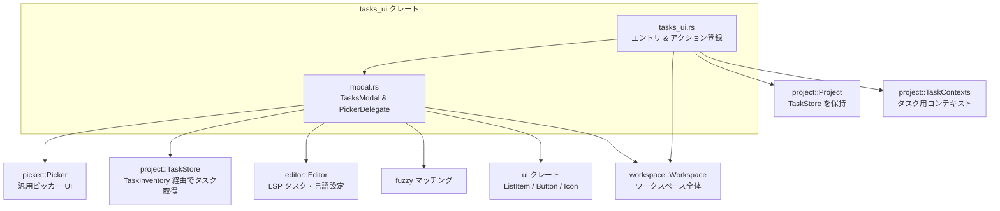

## 1. ざっくり一言

`tasks_ui` クレートは、プロジェクトのタスク（`.zed/tasks.json` や言語・LSP 由来のタスク）を検索・実行する **タスク起動モーダル（TasksModal）** と、そのための **コンテキスト収集・アクション登録** を提供するモジュール群です。

---

## 2. このモジュールの役割

### 2.1 概要

- このディレクトリは、Zed のようなエディタ内でタスクを
  - 一覧表示し
  - あいまい検索し
  - コンテキスト（開いているファイル・選択位置・ワークツリー）を解決した上で実行する  
 ための UI とロジックを提供します。
- ユーザーは `Spawn` / `Rerun` アクション経由でタスクを起動したり、タスク名・タグ・自由入力コマンド（ワンショット）でタスクを実行できます。

### 2.2 アーキテクチャ内での位置づけ

`tasks_ui` クレート内の 2 つの主要ファイルと、外部クレートとの関係を示す概略図です。



位置づけ:

- `tasks_ui.rs`  
  - アプリ起動時に `Workspace` に対して `Spawn` / `Rerun` アクションを登録する窓口です。
  - タスク実行のエントリポイント（`spawn_task_or_modal`, `spawn_tasks_filtered`, `toggle_modal`）と、エディタ状態から `TaskContexts` を組み立てる `task_contexts` を提供します。
- `modal.rs`  
  - 実際の UI コンポーネント（`TasksModal`, `TasksModalDelegate`）と、そのピッカー挙動（検索・選択・実行・ワンショット作成・履歴表示/削除）を実装します。

### 2.3 設計上のポイント

コードから読み取れる特徴を箇条書きでまとめます。

- **Picker ベースの UI**
  - 汎用 `picker::Picker` に対する `PickerDelegate` 実装 (`TasksModalDelegate`) としてタスク UI を構成しています。
- **TaskStore / TaskInventory との連携**
  - `TaskStore` の `TaskInventory` から
    - 最近実行したタスク
    - 現在のコンテキストで解決されたタスク
    - LSP / 言語由来タスク  
    をまとめて候補にします。
- **コンテキスト駆動**
  - `TaskContexts` には
    - アクティブなエディタのカーソル位置・選択範囲
    - アクティブ/その他ワークツリーのルートパス
    - LSP のタスク問い合わせ情報  
    が含まれ、タスクテンプレート中の `$ZED_FILE` などの変数解決に使われます。
- **履歴とワンショット**
  - 最近実行したタスクを先頭に表示し、セパレータで区切る UI を持ちます。
  - 入力欄に任意コマンドを打ち込んでワンショットタスクを作成・実行し、履歴に追加する機能があります（履歴に追加しない “without history” モードもあり）。
- **アクション駆動**
  - `Spawn`（ByName / ByTag / ViaModal）と `Rerun` を `Workspace` のアクションとして登録し、キーバインドなどから統一的に呼び出せるようになっています。
- **非同期処理**
  - `gpui::Task` と `cx.spawn_in` / `cx.background_spawn` を用いて
    - コンテキスト収集
    - タスク一覧の取得
    - fuzzy マッチング  
    をバックグラウンドで行い、UI スレッドのブロックを避けています。

---

## 3. 主要な機能一覧

このディレクトリが提供する主な機能です。

- **TasksModal**
  - タスクを一覧表示し、クエリで絞り込んで実行するモーダル UI。
  - 履歴タスクと現在のコンテキスト由来タスクを統合表示します。
- **ワンショットタスクの生成・実行**
  - 入力欄のテキストをそのまま `command` とする `UserInput` タスクを作り、即時実行できます（`Spawn Oneshot`）。
- **タスク履歴の管理**
  - `TaskInventory` の「最後に実行したタスク」「以前実行したタスク」を UI に反映し、履歴からの再実行や履歴エントリの削除ができます。
- **Rerun アクション**
  - 最後に実行したタスクを
    - 元のコンテキストのまま再実行
    - 現在のコンテキストで再解決して実行  
    の 2 パターンで再実行できます。
- **Spawn アクション**
  - タスク名 (`Spawn::ByName`) やタグ (`Spawn::ByTag`) でフィルタしてタスクを直接起動。
  - モーダルを開く (`Spawn::ViaModal`)。
- **task_contexts の構築**
  - アクティブエディタ・ワークツリーから `TaskContexts` を構築し、タスクの変数解決や LSP タスク取得に利用します。
- **LSP / 言語タスクとの統合**
  - `Editor::lsp_task_sources` / 言語ごとの `ContextProvider` と連携し、ファイルタイプに応じたタスクを自動列挙します。
  - 言語設定にある `prefer_lsp` フラグに応じて、LSP タスク vs 言語タスクの優先を切り替えます。

---

## 4. 関数・構造体の解説

### 4.1 主な型一覧

| 名前 | 種別 | 定義ファイル | 役割 / 用途 |
|------|------|--------------|-------------|
| `TasksModal` | 構造体 | `modal.rs` | タスク選択用モーダルのルート UI コンポーネント。内部で `Picker<TasksModalDelegate>` を保持します。 |
| `TasksModalDelegate` | 構造体 | `modal.rs` | `picker::Picker` のデリゲート。候補タスクの管理・検索・実行ロジックを実装します。 |
| `TaskOverrides` | 構造体 | `modal.rs` | タスクテンプレートに対する上書き設定。現在は `reveal_target`（結果をどこに表示するか）のみを保持します。 |
| `ShowAttachModal` | 構造体 | `modal.rs` | デバッガー用のアタッチモーダルを表示するためのイベントペイロード。`DebugScenario` を運びます。 |
| `Spawn` | アクション型 | `zed_actions`（再エクスポート） | タスクを起動するアクション。ByName / ByTag / ViaModal の 3 バリアントがあります。 |
| `Rerun` | アクション型 | `zed_actions`（再エクスポート） | 最後に実行したタスクを再実行するアクション。再解決や挙動変更のオプションを持ちます。 |
| `TaskContexts` | 構造体 | `project` クレート | タスク解決に必要なコンテキスト群。`task_contexts` 関数で構築され、タスクの変数展開等に利用されます。 |

### 4.2 重要な関数の詳細（最大 7 件）

#### 4.2.1 `init(cx: &mut App)`

```rust
pub fn init(cx: &mut App)
```

**概要**

- 新しく生成される `Workspace` ごとに
  - `Spawn` アクション
  - `Rerun` アクション  
  のハンドラを登録します。
- アプリ起動時に 1 回呼び出すことを前提とした初期化関数です。

**引数**

| 引数名 | 型 | 説明 |
|--------|----|------|
| `cx` | `&mut App` | アプリケーション全体のコンテキスト。`Workspace` 作成時のオブザーバ登録に使います。 |

**戻り値**

- なし。

**内部処理の流れ**

1. `cx.observe_new` で `Workspace` が生成されるタイミングをフック。
2. 各 `Workspace` に対して
   - `spawn_task_or_modal` をハンドラとする `Spawn` アクションを登録。
   - クロージャをハンドラとする `Rerun` アクションを登録。
3. `Rerun` ハンドラでは
   - `TaskInventory::last_scheduled_task` から対象タスクを取得。
   - `reevaluate_context` が `true` なら
     - 元の `TaskTemplate` を取り出し、オプションで `allow_concurrent_runs` / `use_new_terminal` を上書き。
     - 現在の `TaskContexts` を非同期に取得し、`Workspace::schedule_task` で再実行。
   - `reevaluate_context` が `false` なら
     - `ResolvedTask` 側のフラグを直接上書きし、`schedule_resolved_task` で再実行。
   - もし最後のタスクが見つからない場合は `Spawn::ViaModal` でタスクモーダルを開く。

**Examples（使用例）**

アプリ初期化コードでの利用例:

```rust
use gpui::App;
use tasks_ui;

fn main() {
    App::run(|cx| {
        // tasks_ui のアクションを Workspace に登録する
        tasks_ui::init(cx);

        // 他のモジュールの初期化もここで行う
        workspace::init(cx);
        editor::init(cx);
    });
}
```

**使用上の注意点**

- `init` はアプリ起動時に一度呼び出すことを前提としており、複数回呼ぶと同じアクションが重複登録される可能性があります。
- `Workspace` 側に `debugger_provider` がある場合、一部の `Spawn` 呼び出しはデバッガー側に委譲されます（`spawn_task_or_modal` 参照）。

---

#### 4.2.2 `spawn_task_or_modal(workspace, action, window, cx)`

```rust
fn spawn_task_or_modal(
    workspace: &mut Workspace,
    action: &Spawn,
    window: &mut Window,
    cx: &mut Context<Workspace>,
)
```

**概要**

- `Spawn` アクションに応じて
  - タスクを直接実行する (`ByName` / `ByTag`)
  - タスクモーダルを開閉する (`ViaModal`)  
  ロジックをまとめたエントリポイントです。

**引数**

| 引数名 | 型 | 説明 |
|--------|----|------|
| `workspace` | `&mut Workspace` | 対象ワークスペース。タスクのスケジュールやモーダルの表示先です。 |
| `action` | `&Spawn` | 実行された `Spawn` アクション（ByName / ByTag / ViaModal）。 |
| `window` | `&mut Window` | GUI ウィンドウ。モーダル表示やタスクスケジュール時に使用。 |
| `cx` | `&mut Context<Workspace>` | `Workspace` 用の UI コンテキスト。 |

**戻り値**

- なし（副作用としてタスクをスケジュールしたりモーダルを表示します）。

**内部処理の流れ**

1. `workspace.debugger_provider()` があれば  
   → `provider.spawn_task_or_modal(...)` に処理を委譲して終了。
2. `Spawn` のバリアントに応じて分岐:
   - `Spawn::ByName { task_name, reveal_target }`
     - `reveal_target` を `TaskOverrides` に変換。
     - `spawn_tasks_filtered` を呼び出し、`task.label == task_name` のタスクを実行。
   - `Spawn::ByTag { task_tag, reveal_target }`
     - 同様に `TaskOverrides` を生成。
     - `task.tags` に `task_tag` が含まれるタスクだけを `spawn_tasks_filtered` で実行。
   - `Spawn::ViaModal { reveal_target }`
     - `toggle_modal` を呼び出し、タスクモーダルの表示/非表示をトグル。

**Examples（使用例）**

`Spawn` アクションを手動でディスパッチする例:

```rust
// "example task" という label を持つタスクを現在のコンテキストで実行
cx.dispatch_action(tasks_ui::Spawn::ByName {
    task_name: "example task".to_string(),
    reveal_target: None,
});

// タグ "build" を持つタスクを実行
cx.dispatch_action(tasks_ui::Spawn::ByTag {
    task_tag: "build".to_string(),
    reveal_target: Some(RevealTarget::Center),
});

// タスクモーダルを開く
cx.dispatch_action(tasks_ui::Spawn::ViaModal {
    reveal_target: None,
});
```

**Edge cases（エッジケース）**

- 該当するタスクが 1 件もない場合:
  - `spawn_tasks_filtered` 内でモーダル (`Spawn::ViaModal`) を開くようになっています。
- デバッガーがタスク起動を扱う場合:
  - `debugger_provider` が存在すると、ここでのロジックは実行されず、デバッガー側の `spawn_task_or_modal` に完全に委譲されます。

**使用上の注意点**

- この関数は `Workspace` 用アクションのハンドラとして使われる前提であり、通常は直接呼び出さず `Spawn` アクションをディスパッチします。
- タスク名・タグによるフィルタは `TaskTemplate` 側の情報（ラベル・タグ）に対して行われるため、同名タスクが複数ある場合は全て実行されることがあります（`retain_mut` で `predicate` にマッチしたもの全てをスケジュールしています）。

---

#### 4.2.3 `toggle_modal(workspace, reveal_target, window, cx)`

```rust
pub fn toggle_modal(
    workspace: &mut Workspace,
    reveal_target: Option<RevealTarget>,
    window: &mut Window,
    cx: &mut Context<Workspace>,
) -> Task<()>
```

**概要**

- タスクモーダル (`TasksModal`) を表示 / 非表示するトグル操作を行います。
- 必要に応じて `TaskContexts` を非同期に構築し、それを `TasksModal` に渡します。

**引数**

| 引数名 | 型 | 説明 |
|--------|----|------|
| `workspace` | `&mut Workspace` | モーダルを表示するワークスペース。 |
| `reveal_target` | `Option<RevealTarget>` | タスク実行結果を表示するターゲット（例: 中央ペイン）を指定するオプション。 |
| `window` | `&mut Window` | 対象ウィンドウ。 |
| `cx` | `&mut Context<Workspace>` | `Workspace` 用 UI コンテキスト。 |

**戻り値**

- `Task<()>`  
  非同期にモーダルのトグルを完了するタスクオブジェクト。

**内部処理の流れ**

1. `task_store`（`Entity<TaskStore>`）と `workspace_handle`（`WeakEntity<Workspace>`）を取得。
2. プロジェクトがコラボセッション (`is_via_collab()`) 経由かどうかを確認:
   - `true` の場合 → モーダルを開かず `Task::ready(())` を返す。
3. `can_open_modal` が `true` の場合:
   - `task_contexts(workspace, window, cx)` を呼び、`Task<TaskContexts>` を得る。
   - `cx.spawn_in(window, async move |workspace, cx| { ... })` で非同期処理を開始。
   - 非同期ブロック内:
     1. `TaskContexts` を `await`。
     2. `workspace.update_in` で `workspace.toggle_modal` を呼び出し、
        `TasksModal::new(...)` でモーダルインスタンスを生成 / トグル。

**Examples（使用例）**

```rust
// コマンドから直接タスクモーダルをトグルする例
workspace.update_in(cx, |workspace, window, cx| {
    tasks_ui::toggle_modal(workspace, Some(RevealTarget::Center), window, cx)
})
.await;
```

**Edge cases**

- コラボレーションセッション (`project.is_via_collab() == true`) の場合はモーダルが開きません。
- `TaskStore` そのものが存在する前提で動きますが、コード上では `TaskStore` の存在チェックをここでは行っていません（`TaskStore::init` がどこかで呼ばれていることが前提）。

**使用上の注意点**

- `toggle_modal` 自体は `Task<()>` を返しますが、呼び出し側で `await` しなくてもモーダル自体は表示されます（内部でさらに `spawn_in` しているため）。
- テスト環境では `TestAppContext` の `run_until_parked` を呼び出さないと、バックグラウンドでの `TaskContexts` 構築が完了しない点に注意が必要です（テストコードがそうしています）。

---

#### 4.2.4 `spawn_tasks_filtered<F>(predicate, overrides, window, cx)`

```rust
pub fn spawn_tasks_filtered<F>(
    mut predicate: F,
    overrides: Option<TaskOverrides>,
    window: &mut Window,
    cx: &mut Context<Workspace>,
) -> Task<anyhow::Result<()>>
where
    F: FnMut((&TaskSourceKind, &TaskTemplate)) -> bool + 'static,
```

**概要**

- 現在のコンテキストに対して列挙されるタスクの中から、任意の条件 (`predicate`) にマッチするタスクだけを抽出して実行します。
- `Spawn::ByName` / `ByTag` から内部的に利用される汎用関数です。

**引数**

| 引数名 | 型 | 説明 |
|--------|----|------|
| `predicate` | `F` | `(TaskSourceKind, TaskTemplate)` に対して `true` / `false` を返すフィルタ関数。 |
| `overrides` | `Option<TaskOverrides>` | `reveal_target` などタスクテンプレートへの上書き設定。 |
| `window` | `&mut Window` | 対象ウィンドウ。 |
| `cx` | `&mut Context<Workspace>` | `Workspace` の UI コンテキスト。 |

**戻り値**

- `Task<anyhow::Result<()>>`  
  - 成功時：`Ok(())`
  - 例外（`Workspace::update` 等がエラーを返した場合）：`Err(...)`

**内部処理の流れ**

1. `cx.spawn_in(window, async move |workspace, cx| { ... })` で非同期処理を開始。
2. `task_contexts(workspace, window, cx)` を通じて `TaskContexts` を非同期取得。
3. `TaskInventory` から `list_tasks` を呼び出し、現在の
   - バッファ
   - 言語
   - ワークツリー  
   に対するタスク一覧（`Vec<(TaskSourceKind, TaskTemplate)>`）を取得。
4. `workspace.update_in` ブロックで:
   - `active_context` を `task_contexts.active_context().unwrap_or(&TaskContext::default())` として取得。
   - `tasks.retain_mut` により `predicate` にマッチしたタスクだけを残しつつ、各タスクに対して:
     - `overrides.reveal_target` があれば `target_task.reveal_target` を上書き。
     - `workspace.schedule_task(...)` を呼び出して実行。
   - 1 つでもタスクを実行した場合は `Some(())` を返し、そうでなければ `None`。
5. 実行したタスクが 0 件だった場合:
   - `Spawn::ViaModal` を用いてタスクモーダルを開く（`reveal_target` は `overrides` から引き継がれます）。

**Examples（使用例）**

ラベルに `"test"` を含むタスクだけを実行する例:

```rust
use tasks_ui::{spawn_tasks_filtered, TaskOverrides};
use project::TaskSourceKind;
use task::TaskTemplate;

// Workspace のコンテキスト内から "test" を含むタスクをすべて実行する
let task = workspace.update_in(cx, |workspace, window, cx| {
    spawn_tasks_filtered(
        |(_, tmpl): (&TaskSourceKind, &TaskTemplate)| tmpl.label.contains("test"),
        None,        // 特に override しない
        window,
        cx,
    )
})?;

// 非同期タスクの完了を待つ
task.await?;
```

**Edge cases**

- `TaskInventory` が存在しない場合
  - `Task::ready(Vec::new())` が返され、`did_spawn == false` となるため、モーダルが開くだけでタスクは実行されません。
- `predicate` にマッチするタスクが 1 件もない場合
  - 同様にモーダルが開きます（ユーザーに手動で選ばせる）。

**使用上の注意点**

- `predicate` は UI スレッド (`Workspace::update_in` 内) で実行されるため、あまり重い処理を書かないほうがよいです。
- `overrides` はタスクテンプレートそのものを上書きするため、`reveal_target` などの既定値を変えたい場合だけ渡すようにします。

---

#### 4.2.5 `task_contexts(workspace, window, cx)`

```rust
pub fn task_contexts(
    workspace: &Workspace,
    window: &mut Window,
    cx: &mut App,
) -> Task<TaskContexts>
```

**概要**

- 現在の `Workspace` 状態（アクティブなエディタ・選択範囲・ワークツリー）から、タスク解決用の `TaskContexts` を構築する関数です。
- タスクテンプレート中の `$ZED_FILE`, `$ZED_ROW`, `$ZED_WORKTREE_ROOT` などの変数を解決するための元データを生成します。

**引数**

| 引数名 | 型 | 説明 |
|--------|----|------|
| `workspace` | `&Workspace` | 対象ワークスペース。アクティブアイテムやワークツリー情報を参照します。 |
| `window` | `&mut Window` | アクティブエディタのコンテキスト取得に使用。 |
| `cx` | `&mut App` | アプリケーション全体のコンテキスト。 |

**戻り値**

- `Task<TaskContexts>`  
  バックグラウンドで `TaskContexts` を構築する非同期タスク。

**内部処理の流れ（要約）**

1. アクティブなアイテムから
   - `active_worktree`（ワークツリー ID）
   - `active_editor`（`Entity<Editor>`）  
   を特定します。
2. `active_editor` があれば:
   - `editor.task_context(window, cx)` による「エディタ文脈のタスクコンテキスト」を取得する `Task<_>` を `editor_context_task` として保持。
   - カーソル位置から `Location { buffer, range }` を構築し、`TaskContexts` の `location` に使えるようにします。
   - LSP タスク情報 `editor.lsp_task_sources(false, false, cx)` を取得。
   - 最新選択のアンカー (`latest_selection`) を取得。
3. `workspace.worktrees(cx)` から「表示中かつルートがディレクトリ」のワークツリーを列挙し、
   - 各ワークツリー ID と絶対パスを `HashMap` に格納。
4. `cx.background_spawn(async move { ... })` でバックグラウンドタスクを起動し、次を構築:
   - `task_contexts.lsp_task_sources`
   - `task_contexts.latest_selection`
   - `active_editor` のコンテキスト (`editor_context_task.await`) を `active_item_context` に格納。
   - アクティブワークツリーがあれば `active_worktree_context` に、なければワークツリーが 1 つだけの場合にそのワークツリーを `active_worktree_context` とする。
   - 残りのワークツリーは `other_worktree_contexts` に格納。
5. 完成した `TaskContexts` を返す。

**Examples（使用例）**

テストコードでは次のように利用されています。

```rust
// Workspace 内で task_contexts を非同期取得
let ctx = workspace
    .update_in(cx, |workspace, window, cx| {
        tasks_ui::task_contexts(workspace, window, cx)
    })
    .await;

// アクティブコンテキストから TaskContext を取り出す
let active = ctx
    .active_context()
    .expect("Should have an active context");

// 例: 取得される変数（抜粋）
assert_eq!(active.task_variables.get(&VariableName::Language), Some("Rust".into()));
assert_eq!(active.task_variables.get(&VariableName::Row), Some("1".into()));
```

**Edge cases**

- アクティブなエディタが存在しない場合:
  - `active_item_context` は `None` になります。
  - ただし、ワークツリーが 1 つだけ表示されている場合は、そのワークツリーのコンテキストが `active_worktree_context` に入ります。
- アクティブなワークツリーが存在しない場合:
  - `visible_worktrees` から最初のディレクトリワークツリーを `active_worktree` として選びます（存在する場合）。
- 選択範囲がある場合:
  - `SelectedText` や `Symbol` などの変数が `TaskContext` に含まれます（テストで確認されています）。

**使用上の注意点**

- 戻り値は `Task<TaskContexts>` なので、必ず `await` してから内部のコンテキストを利用します。
- `App` のバックグラウンドエグゼキュータが動作していないと、タスクが完了しません（テストでは `run_until_parked` を呼んでいます）。

---

#### 4.2.6 `TasksModalDelegate::update_matches(&mut self, query, window, cx)`

```rust
fn update_matches(
    &mut self,
    query: String,
    window: &mut Window,
    cx: &mut Context<picker::Picker<Self>>,
) -> Task<()>
```

**概要**

- 入力されたクエリ文字列に基づき、タスク候補一覧をあいまい検索して `matches` を更新します。
- `Picker` がクエリ変更時に呼び出すコアロジックです。

**引数**

| 引数名 | 型 | 説明 |
|--------|----|------|
| `query` | `String` | 現在の検索文字列。 |
| `window` | `&mut Window` | UI 更新のためのウィンドウ。 |
| `cx` | `&mut Context<Picker<Self>>` | ピッカーの UI コンテキスト。 |

**戻り値**

- `Task<()>`  
  非同期にマッチングを完了するタスク。

**内部処理の流れ（要約）**

1. まず `candidates`（`Vec<(TaskSourceKind, ResolvedTask)>`）が既にあるか確認。
   - ある場合: それを `string_match_candidates` で `Vec<StringMatchCandidate>` に変換し、即時 (`Task::ready`) で返す。
   - ない場合:
     1. `TaskStore` から `TaskInventory` を取得。
     2. `used_and_current_resolved_tasks(self.task_contexts.clone(), cx)` により
        - 最近使ったタスク (`used`)
        - 現在のコンテキストで解決されたタスク (`current`)  
        のペア (`TaskSourceKind`, `ResolvedTask`) を非同期で取得。
     3. 同時に
        - `workspace` から `editor::lsp_tasks(...)` を呼び出す `Task<_>` と、
        - アクティブエディタの `language_settings(tasks.prefer_lsp)`  
        を取得。
     4. これらを `cx.spawn(async move |picker, cx| { ... })` でバックグラウンド処理:
        - `used`, `current`, `lsp_tasks` を待ち合わせ。
        - `prefer_lsp` を元に `add_current_language_tasks` を計算。
        - `new_candidates` を構築:
          - 先頭に `used`
          - 次に `lsp_tasks`（位置付きタスクをラベル順にソート）
          - 最後に `current`（`add_current_language_tasks` に応じて Language タスクをフィルタ）
        - `picker.delegate.candidates` を `new_candidates` に差し替え。
        - `string_match_candidates` で `match_candidates` を返す。
2. 上記で得られた `match_candidates` に対し、さらに
   - `fuzzy::match_strings` でクエリに対するマッチングを実行。
   - 結果 `Vec<StringMatch>` を `delegate.matches` に格納。
   - `last_used_candidate_index` を元に
     - 履歴タスクが先頭に出るように `matches.sort_by_key(|m| m.candidate_id > index)` でソート。
     - 履歴部分とそれ以外の境目（セパレータ位置）を `divider_index` として計算。
   - `selected_index` を範囲内に収まるよう調整。

**Edge cases**

- `TaskInventory` が存在しない場合:
  - `Task::ready(Vec::new())` となり、`matches` は空のままになります。
- クエリが空文字列のとき:
  - fuzzy マッチ自体は「全件候補」を返しますが、履歴ソート (`last_used_candidate_index`) により最近使ったタスクが上位に並びます。
- `last_used_candidate_index` が `None` の場合:
  - セパレータは表示されません（`divider_index` が `None`）。

**使用上の注意点**

- すべて非同期タスクとして処理されるので、大量のタスクがあっても UI スレッドが長時間ブロックされない構造になっています。
- `TaskStore`・`TaskInventory` がない場合は空リストになるため、「タスクがない」状態を UI 側で許容する必要があります。

---

#### 4.2.7 `TasksModalDelegate::confirm` / `confirm_input`

```rust
fn confirm(
    &mut self,
    omit_history_entry: bool,
    window: &mut Window,
    cx: &mut Context<picker::Picker<Self>>,
)

fn confirm_input(
    &mut self,
    omit_history_entry: bool,
    window: &mut Window,
    cx: &mut Context<Picker<Self>>,
)
```

**概要**

- `confirm`  
  現在選択されている既存タスクを実行し、必要に応じて履歴に記録します。
- `confirm_input`  
  入力欄の文字列からワンショットタスクを作成・実行し、オプションで履歴に残します。

**引数（共通部分のみ記載）**

| 引数名 | 型 | 説明 |
|--------|----|------|
| `omit_history_entry` | `bool` | `true` の場合はタスク実行を履歴に残さない。 |
| `window` | `&mut Window` | 実行時のウィンドウ。 |
| `cx` | `&mut Context<Picker<Self>>` | ピッカーの UI コンテキスト。 |

**内部処理（概要）**

- `confirm`:
  1. `self.selected_index()` から選択中の `StringMatch` を取得。
  2. その `candidate_id` を元に `self.candidates` から `(TaskSourceKind, ResolvedTask)` を取得。
  3. `TaskOverrides` に `reveal_target` が設定されていれば `task.resolved.reveal_target` を上書き。
  4. `workspace.update` で `workspace.schedule_resolved_task(...)` を呼び出して実行。
  5. `DismissEvent` を発火してモーダルを閉じる。
- `confirm_input`:
  1. `spawn_oneshot()` を呼び出し、入力欄から `UserInput` タスクを生成・解決。
  2. `TaskOverrides` の `reveal_target` を反映。
  3. `workspace.schedule_resolved_task(...)` で実行。
  4. `DismissEvent` を発火。

**Edge cases**

- `confirm` で選択中インデックスが不正、または `candidates` が `None` の場合:
  - 何もせず return します。
- `confirm_input` で入力欄が空、または `spawn_oneshot()` の `resolve_task` が `None` を返した場合:
  - 何もせず return します。
- `omit_history_entry == true` の場合:
  - `schedule_resolved_task` に `omit_history_entry` が渡され、TaskInventory で履歴に残さない扱いになります（テストで確認されています）。

**使用上の注意点**

- これらは `Picker` 内部からアクション（`menu::Confirm`, `picker::ConfirmInput` など）によって呼ばれる想定であり、通常は直接呼び出しません。
- ワンショット入力を多用する場合、`omit_history_entry` をどう扱うかで履歴リストの見え方が大きく変わります。

---

### 4.3 その他の関数・メソッド（概要一覧）

| 関数 / メソッド名 | 定義場所 | 役割（1 行） |
|-------------------|----------|--------------|
| `TasksModal::new` | `modal.rs` | `TasksModalDelegate` を含む `Picker` を生成し、モーダルとして構成します。 |
| `TasksModal::tasks_loaded` | `modal.rs` | デバッガーなど外部から渡されたタスク群を `Picker` に流し込むための補助メソッドです。 |
| `TasksModalDelegate::spawn_oneshot` | `modal.rs` | `prompt` から `UserInput` タスクテンプレートを生成し、`TaskContext` で解決します。 |
| `TasksModalDelegate::delete_previously_used` | `modal.rs` | 指定インデックスのタスクを `candidates` から削除し、`TaskInventory` の「以前使ったタスク」リストからも削除します。 |
| `TasksModalDelegate::render_match` | `modal.rs` | 各タスク候補の行（アイコン・タグ・履歴アイコン・削除ボタン付き）を描画します。 |
| `TasksModalDelegate::render_footer` | `modal.rs` | 「Rerun Last Task」「Spawn / Rerun / Oneshot」ボタンなどを含むフッター UI を描画します。 |
| `string_match_candidates` | `modal.rs` | タスク候補から `StringMatchCandidate` のリストを作るヘルパーです。 |
| `is_visible_directory` | `tasks_ui.rs` | ワークツリーが表示中かつルートがディレクトリかを判定します。 |
| `worktree_context` | `tasks_ui.rs` | ワークツリールートパスから `TaskContext` を組み立てます（`cwd` と `$ZED_WORKTREE_ROOT` の設定など）。 |

---

## 5. データフロー

ここでは、代表的なシナリオである「ユーザーがタスクモーダルを開き、タスクを検索して実行する」までのデータフローを説明します。

### 5.1 フロー概要

1. ユーザーがキーバインドやコマンドから `Spawn::ViaModal` アクションを発行。
2. `Workspace` が `spawn_task_or_modal` を呼び出し、`toggle_modal` 経由で `TasksModal` を表示。
3. `TasksModal` 内の `Picker` が `update_matches` を通じてタスク候補を取得・絞り込み。
4. ユーザーが候補を選択して `Confirm`（Enter）または `ConfirmInput`（Oneshot）を実行。
5. `TasksModalDelegate::confirm` / `confirm_input` が `workspace.schedule_resolved_task` を呼び出し、タスクが実行される。

### 5.2 シーケンス図

```mermaid
sequenceDiagram
    participant User as ユーザー
    participant App as App/キーマップ
    participant WS as Workspace
    participant UI as TasksModal<br/>(Picker+Delegate)
    participant TS as TaskStore<br/>(TaskInventory)

    User->>App: Spawn::ViaModal を実行
    App->>WS: アクション Dispatch(Spawn::ViaModal)
    WS->>tasks_ui::spawn_task_or_modal: 呼び出し
    tasks_ui::spawn_task_or_modal->>WS: toggle_modal(...)
    WS->>tasks_ui::task_contexts: TaskContexts の Task を取得
    WS->>UI: TasksModal を作成してモーダル表示

    note over UI: Picker が query 変更に応じて<br/>update_matches を呼び出す

    UI->>TS: used_and_current_resolved_tasks(TaskContexts)
    TS-->>UI: (used, current) タスク
    UI->>WS: editor::lsp_tasks(...) / 言語設定 prefer_lsp
    WS-->>UI: LSP タスク + prefer_lsp
    UI->>UI: 候補マージ + fuzzy::match_strings で絞り込み
    UI-->>User: タスク候補リストを表示

    User->>UI: 1 行選択して Enter(Confirm) or Alt+Enter(ConfirmInput)
    alt 既存タスクの Confirm
        UI->>WS: schedule_resolved_task((Kind, ResolvedTask), omit_history)
    else 入力欄からの Oneshot(ConfirmInput)
        UI->>UI: spawn_oneshot() で TaskTemplate を解決
        UI->>WS: schedule_resolved_task((UserInput, ResolvedTask), omit_history)
    end
    WS-->>User: ターミナル等でタスク開始
    UI-->>User: モーダルを閉じる(DismissEvent)
```

---

## 6. 使い方（How to Use）

### 6.1 基本的な使用方法

アプリケーションに `tasks_ui` を組み込む最小構成の例です。

```rust
use gpui::App;
use workspace::Workspace;
use tasks_ui;

fn main() {
    App::run(|cx| {
        // Workspace など他のモジュール初期化前後で tasks_ui を初期化
        tasks_ui::init(cx);                // Spawn / Rerun アクションを Workspace に登録
        workspace::init(cx);               // Workspace 関連の初期化（仮想例）
        editor::init(cx);                  // Editor の初期化（テストと同様のパターン）

        // 以降、キーバインドやコマンドから Spawn / Rerun を使える
    });
}
```

タスクモーダルを開くには、`Spawn::ViaModal` をディスパッチします。

```rust
// どこかの UI ハンドラ内から
cx.dispatch_action(tasks_ui::Spawn::ViaModal {
    reveal_target: None,  // 実行結果の表示先を特に指定しない
});
```

### 6.2 よくある使用パターン

#### パターン 1: タスク名で直接実行（ByName）

```rust
// "build" という label を持つタスクを現在のコンテキストで実行する
cx.dispatch_action(tasks_ui::Spawn::ByName {
    task_name: "build".to_string(),
    reveal_target: Some(RevealTarget::Center), // 結果を中央ペインで表示したい場合など
});
```

- `.zed/tasks.json` や言語タスクに `"label": "build"` を持つタスクがあれば、フィルタされて実行されます。
- 該当タスクがなければ、モーダルが開きます。

#### パターン 2: タグでまとめて実行（ByTag）

```rust
// タグ "test" が付いたタスクをすべて実行
cx.dispatch_action(tasks_ui::Spawn::ByTag {
    task_tag: "test".to_string(),
    reveal_target: None,
});
```

- タグは `TaskTemplate::tags` に含まれる文字列に対してマッチします。
- 同じタグを持つタスクが複数ある場合、全てスケジュールされます。

#### パターン 3: カスタムフィルタでタスクを起動（spawn_tasks_filtered）

より柔軟なフィルタを行いたい場合は `spawn_tasks_filtered` を直接使えます。

```rust
use project::TaskSourceKind;
use task::TaskTemplate;
use tasks_ui::{spawn_tasks_filtered, TaskOverrides};

// 例: label が "lint" を含み、タグに "ci" が含まれるタスクだけを実行する
let task = workspace.update_in(cx, |workspace, window, cx| {
    spawn_tasks_filtered(
        |(_, task): (&TaskSourceKind, &TaskTemplate)| {
            task.label.contains("lint") && task.tags.iter().any(|t| t == "ci")
        },
        Some(TaskOverrides {
            reveal_target: Some(RevealTarget::Center),
        }),
        window,
        cx,
    )
})?;

// 非同期実行結果を待つ
task.await?;
```

#### パターン 4: 最後に実行したタスクを再実行（Rerun）

```rust
// もっとも最近のタスクを、コンテキストを再解決せずに再実行
cx.dispatch_action(tasks_ui::Rerun::default());

// 特定の TaskId を現在のコンテキストで再解決して再実行（オプション付き）
cx.dispatch_action(tasks_ui::Rerun {
    task_id: Some("some-task-id".into()),
    reevaluate_context: true,      // 現在のファイル・位置に合わせて再解決
    allow_concurrent_runs: Some(true),
    use_new_terminal: Some(true),
    ..Default::default()
});
```

### 6.3 使用上の注意点（まとめ）

- **TaskStore / TaskInventory の初期化**
  - `TaskStore::init(None)` などで `TaskStore` が初期化され、プロジェクトに紐づいていることが前提になっています（テストコード参照）。
  - 未初期化の場合、タスク一覧が空になり、モーダルは開いても候補が表示されません。

- **非同期処理とテスト**
  - `task_contexts` やタスク一覧取得は `Task` 経由の非同期処理です。
  - テスト環境 (`TestAppContext`) では `cx.executor().run_until_parked()` を呼ばないとバックグラウンドタスクが完了しない場合があります。

- **コラボレーションモード**
  - `project.is_via_collab()` が `true` の場合、`toggle_modal` はモーダルを開きません。
  - その場合でも `Spawn::ByName` / `ByTag` 等は `TaskInventory` が存在すれば動作します。

- **ワークツリー・ファイルコンテキスト**
  - `task_contexts` は
    - アクティブなエディタ
    - アクティブなワークツリー  
    に強く依存します。意図したコンテキストでタスクを走らせたい場合は、事前に正しいタブ/ワークツリーをアクティブにしておく必要があります。
  - 複数ワークツリーが見えている場合、アクティブタブに紐づくワークツリーが優先されます。

- **履歴操作**
  - ワンショットや実行済みタスクの履歴は、モーダルのリスト上部に表示されます。
  - 履歴項目やワンショットエントリには「×」ボタンが表示され、これを押すと `TaskInventory::delete_previously_used` を通じて履歴から削除されます。
  - `ConfirmInput { secondary: true }` を利用すると「履歴に残さず実行」が可能です。

- **LSP / 言語タスクの優先**
  - アクティブエディタの `language_settings(...).tasks.prefer_lsp` によって、LSP タスクを優先するか、言語タスクを併記するかが変わります。
  - このフラグは `TasksModalDelegate::update_matches` 内で `add_current_language_tasks` の計算に使われています。

---

## 7. 関連ファイル

このディレクトリと密接に関係するファイル・モジュールの一覧です。

| パス / モジュール | 役割 / 関係 |
|-------------------|-------------|
| `tasks_ui/Cargo.toml` | クレートメタデータ。ライブラリクレートとして `src/tasks_ui.rs` をエントリポイントに設定しています。 |
| `tasks_ui/src/tasks_ui.rs` | クレートルート。`init`, `spawn_task_or_modal`, `toggle_modal`, `spawn_tasks_filtered`, `task_contexts` などのエントリポイントと、`modal` モジュールの re-export を定義します。 |
| `tasks_ui/src/modal.rs` | タスクモーダル UI (`TasksModal`) と、そのデリゲート (`TasksModalDelegate`) を実装するメインモジュールです。 |
| `project::task_store::TaskStore` | タスク定義と履歴を管理するストア。`TaskInventory` への入口で、タスク一覧や履歴の取得に利用されます。 |
| `project::TaskContexts` | タスク解決に必要なコンテキストの集約構造体。`task_contexts` 関数で構築され、LSP タスク取得やテンプレート変数展開に使用されます。 |
| `workspace::Workspace` | モーダルの表示・非表示、タスクのスケジュール（`schedule_task`, `schedule_resolved_task`）を担う中心コンポーネントです。 |
| `editor::Editor` | アクティブエディタのカーソル位置・選択範囲・言語設定を提供し、`task_contexts` や LSP タスク取得に利用されます。 |
| `picker::Picker` / `picker::PickerDelegate` | 一般化されたリスト選択 UI コンポーネント。`TasksModalDelegate` がこれを実装し、タスク候補の表示・選択・実行ロジックを提供します。 |
| `zed_actions::{Spawn, Rerun}` | タスク UI / 実行関連のアクション型。`tasks_ui` から再エクスポートされ、キーバインドや UI アクションの対象となります。 |

このディレクトリに含まれるテストコード（両ファイルの `#[cfg(test)]` モジュール）は、上記機能が期待通りに動作することを確認するための実例として読むと、実際の使用イメージの把握に役立ちます。
