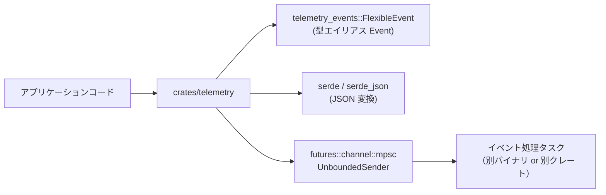
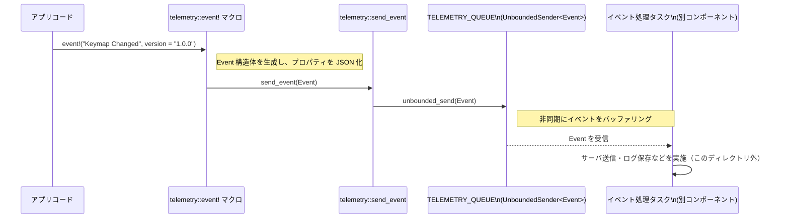

# telemetry/ ディレクトリ解説

## 1. ざっくり一言

`telemetry` クレートは、アプリケーションからテレメトリイベント（操作ログなど）を送るための **シンプルなイベント送信 API とマクロ** を提供し、内部ではグローバルな非同期キューにイベントを積む役割を持ちます。

---

## 2. このモジュールの役割

### 2.1 概要

- このディレクトリ（`telemetry` クレート）は、Zed の「Telemetry in Zed」ドキュメントに対応する **テレメトリ送信用フロントエンド** です。
- アプリケーションコードからは `event!` マクロを呼び出すだけで、`telemetry_events::FlexibleEvent` 型のイベントを生成し、内部キューに送信できます。
- イベントの実際の送信（サーバーへ送るなど）は、このクレート外（別タスクや別クレート）が担当し、このクレートは **キューへの投入まで** を担当します。

### 2.2 アーキテクチャ内での位置づけ

`telemetry` クレートは、アプリコードとテレメトリバックエンドの間にある薄いレイヤーとして機能します。



- アプリケーションは `telemetry::event!` マクロを使ってイベントを発行します。
- `telemetry` 内部では `Event`（= `FlexibleEvent`）構造体を生成し、`futures::channel::mpsc::UnboundedSender<Event>` に送信します。
- `UnboundedSender<Event>` は `init` 関数経由で一度だけ登録され、グローバルに共有されます。
- 実際に `UnboundedReceiver<Event>` 側でイベントを受信し処理するコードは、このディレクトリには含まれていません。

### 2.3 設計上のポイント

- **マクロベースの API**
  - `event!` マクロにより、文字列とプロパティを渡すだけでイベント送信ができます。
  - プロパティは `serde::Serialize` を実装する任意の型を渡せます。
- **グローバルキューによる疎結合**
  - `OnceLock<UnboundedSender<Event>>` により、送信キューを一度だけ設定し、どこからでも `send_event` / `event!` で利用できます。
  - 生の送信先（ネットワーク、ファイル等）には依存しておらず、イベントの処理方法を後段に委ねています。
- **失敗を極力表に出さない方針**
  - キュー未初期化時や送信失敗時も、関数はエラーを返さず黙って失敗を無視します。
  - プロパティの JSON 変換に失敗した場合も、デフォルト値（`()` の JSON）にフォールバックします。
- **再エクスポートによる一体的な API**
  - `telemetry_events::FlexibleEvent` を `Event` として再エクスポートし、`serde_json` も公開しています。
  - 利用側は `telemetry` クレートだけを意識すればイベント生成と JSON 変換を扱えます。

---

## 3. 主要な機能一覧

- `event!` マクロ: イベント名とプロパティから `Event` を生成し、テレメトリキューに送信します。
- `serialize_property!` マクロ: `event!` マクロ内部で、プロパティ指定（`key` / `key = value`）を実際の値に変換する補助マクロです。
- `send_event(event: Event)`: 既に初期化されたキューがあれば、`Event` を非同期キューに送信します。
- `init(tx: mpsc::UnboundedSender<Event>)`: グローバルなテレメトリキューを一度だけ初期化します。
- `TELEMETRY_QUEUE`: `OnceLock<UnboundedSender<Event>>` によるグローバルな送信キューの保持場所です。
- `pub use telemetry_events::FlexibleEvent as Event`: テレメトリイベント型 `Event` をこのクレートから直接利用できるようにします。
- `pub use serde_json`: JSON 変換用の `serde_json` クレートを再エクスポートします。

---

## 4. 関数・構造体の解説

### 4.1 型一覧

このディレクトリに直接定義されている、もしくは再エクスポートされている主な型です。

| 名前 | 種別 | 役割 / 用途 |
|------|------|-------------|
| `Event` | 型エイリアス (`telemetry_events::FlexibleEvent`) | テレメトリイベントの本体。少なくとも `event_type` と `event_properties` フィールドを持つ構造体として使われています。 |
| `TELEMETRY_QUEUE` | `static OnceLock<mpsc::UnboundedSender<Event>>` | グローバルなイベント送信キューの保持場所。`init` で設定され、`send_event` から参照されます。 |
| `serde_json` | クレート再エクスポート | イベントプロパティを JSON 値に変換するために使われます。利用側も同じクレートをそのまま使えます。 |

※ `FlexibleEvent` の定義本体は `telemetry_events` クレート側にあり、このチャンクからはそれ以上の詳細は分かりません。

---

### 4.2 マクロ・関数の詳細

#### 4.2.1 `event!` マクロ

```rust
#[macro_export]
macro_rules! event {
    ($name:expr) => { /* ... */ };
    ($name:expr, $($key:ident $(= $value:expr)?),+ $(,)?) => { /* ... */ };
}
```

**概要**

- テレメトリイベントを生成し、内部キューに送信するためのメイン API です。
- 第一引数にイベント名（`&str` など）、以降に任意個のプロパティを指定できます。
- プロパティは `key` もしくは `key = value` の形で指定し、`serde::Serialize` を実装した値を受け取ります。

**引数**

1. 単純なイベント名だけの形:

| 引数名 | 型 | 説明 |
|--------|----|------|
| `$name` | 任意の式（通常は `&str`） | イベントの種類を表す名前。`to_string()` されて `event_type` に入ります。 |

2. プロパティ付きの形:

| 引数名 | 型 | 説明 |
|--------|----|------|
| `$name` | 任意の式 | イベント名。上と同じ。 |
| `$key` | 識別子 | プロパティ名。`stringify!($key)` で文字列化され、JSON のキーになります。 |
| `$value` | 任意の式（省略可能） | プロパティの値。省略時は `$key` 自身が値として利用されます。 |

**戻り値**

- マクロ展開後のコード自体は、`()`（ユニット）を返す `send_event` 呼び出しで終わるため、 **有意な戻り値はありません**。
- 副作用として、内部キューに `Event` が送信されます（キュー未初期化時などは送信されない可能性があります）。

**内部処理の流れ**

1. 第一引数 `$name` を `String` に変換し、`event_type` フィールドに格納します。
2. プロパティなしのパターンでは、空の `HashMap` を `event_properties` にセットします。
3. プロパティありのパターンでは、各 `$key` / `$value` について:
   - キー: `stringify!($key).to_string()` により、識別子名をそのまま文字列キーとして使います。
   - 値: `$crate::serialize_property!($key $(= $value)?)` により、`key` か `value` のどちらかの式を取り出します。
   - 取り出した値を `serde_json::value::to_value(&...)` で `serde_json::Value` に変換します。
   - 変換に失敗した場合は、`serde_json::to_value(&())` を呼び出して、デフォルトの JSON 値にフォールバックします。
4. こうして構築した `Event` を `$crate::send_event(event)` に渡し、キューに送信します。

**Examples（使用例）**

基本的な使用例です。

```rust
use telemetry; // telemetry クレートを利用する

fn main() {
    // プロパティなしのイベントを送る
    telemetry::event!("Keymap Changed"); // "Keymap Changed" という種類のイベントを送信する

    // プロパティ付きのイベントを送る
    let url = "https://example.com/docs"; // イベントで送信したい URL
    telemetry::event!(
        "Documentation Viewed", // イベント名
        url,                    // キー "url"、値は変数 url の中身
        source = "Extension Upsell", // キー "source"、値はリテラル文字列
    );
}
```

**Errors / Panics**

- このマクロ自体は明示的に `panic!` を発生させるコードを含みません。
- 値の JSON 変換 (`to_value`) が失敗しても `unwrap_or_else` でフォールバックするため、そこで panic は発生しません。
- `send_event` 内部でもエラーはすべて無視されるため、通常の利用で panic にはつながりません。

**Edge cases（エッジケース）**

- **キュー未初期化の場合**:
  - `init` が呼ばれておらず `TELEMETRY_QUEUE` が空のとき、`send_event` は何もせずイベントは破棄されます。
- **プロパティがシリアライズできない場合**:
  - `serde_json::to_value` が失敗した場合、`()` の JSON 表現にフォールバックします（`serde_json` の仕様上、これは `null` になります）。
  - どのプロパティが失敗したかは外からは分かりません。
- **プロパティを `key` のみで指定した場合**:
  - 例: `telemetry::event!("Example", count)` の場合、キーは `"count"`、値は変数 `count` の中身になります。
- **同じキーを複数回指定した場合**:
  - `HashMap::from([...])` の挙動として、最後に指定されたエントリが有効になります（`HashMap` の `From` 実装に基づく一般的な動作）。

**使用上の注意点**

- `event!` を呼び出す前に、アプリケーション側で必ず一度 `init` を呼び出してキューをセットしておく必要があります。そうしないとイベントは捨てられます。
- プロパティの値は `serde::Serialize` を実装している必要があります。そうでない場合はコンパイルエラーになります。
- プロパティの JSON への変換はマクロ呼び出し時に行われるため、頻繁に呼ぶと CPU 負荷が高くなる可能性があります。
- コメントにある通り、開発時にログによるデバッグを行う場合は `RUST_LOG=telemetry=trace` を指定することが想定されていますが、このファイル内には `log` 呼び出しは含まれていません。実際のログ出力は他のファイル／クレートに依存します。

---

#### 4.2.2 `serialize_property!` マクロ

```rust
#[macro_export]
macro_rules! serialize_property {
    ($key:ident) => { $key };
    ($key:ident = $value:expr) => { $value };
}
```

**概要**

- `event!` マクロ内部でのみ使用されることを想定した補助マクロです。
- `key` だけで指定された場合はその識別子自体を値として扱い、`key = value` の形式の場合は `value` だけを取り出します。

**引数**

| 引数名 | 型 | 説明 |
|--------|----|------|
| `$key` | 識別子 | プロパティ名。`event!` 内でキーにも使われます。 |
| `$value` | 任意の式 | 実際のプロパティ値。省略可能です。 |

**戻り値**

- マクロ展開後の式として、`$key` または `$value` がそのまま残ります。

**内部処理の流れ**

1. `($key)` パターン:
   - そのまま `$key` を返します。
2. `($key = $value)` パターン:
   - `$value` を返します。
3. `event!` マクロでは、この戻り値を `serde_json::value::to_value(&...)` に渡すことで JSON に変換しています。

**Examples（使用例）**

通常は直接使う必要はありませんが、挙動のイメージのための例です。

```rust
use telemetry::serialize_property;

fn main() {
    let url = "https://example.com";          // 値として使いたい変数
    let v1 = telemetry::serialize_property!(url);       // v1 は url と同じ &str 型
    let v2 = telemetry::serialize_property!(url = 42);  // v2 は 42 という i32 型の式

    // 実際には event! マクロ内で使われるため、
    // これらはさらに serde_json::to_value に渡されます。
}
```

**Errors / Panics**

- このマクロ自体は単純な置換のみであり、エラーや panic の要因にはなりません。
- 実際のエラー発生の可能性は、このマクロの展開結果を使う側（`event!` 内の JSON 変換）にあります。

**Edge cases（エッジケース）**

- `key` と `value` の型に制約はありませんが、その後 `serde::Serialize` が要求されるため、シリアライズ可能な型でなければコンパイルできません。

**使用上の注意点**

- `#[macro_export]` されていますが、 **ほとんどの場合、利用者が直接呼び出す必要はありません**。`event!` マクロが内部で適切に利用します。
- 直接利用する場合は、あくまで「`key` または `value` をそのまま返す単純なマクロ」であることに注意してください。

---

#### 4.2.3 `send_event(event: Event)`

```rust
pub fn send_event(event: Event) {
    if let Some(queue) = TELEMETRY_QUEUE.get() {
        queue.unbounded_send(event).ok();
    }
}
```

**概要**

- 渡された `Event` を、初期化済みのグローバル送信キューに送信します。
- キューが未初期化の場合や送信に失敗した場合でも、エラーは返さず黙って無視します。

**引数**

| 引数名 | 型 | 説明 |
|--------|----|------|
| `event` | `Event` | 送信したいテレメトリイベント。`event!` マクロからも利用されます。 |

**戻り値**

- 返り値は `()`（ユニット）で、送信成功／失敗を呼び出し元からは判別できません。

**内部処理の流れ**

1. `TELEMETRY_QUEUE.get()` により、グローバルキューが初期化済みかどうかを確認します。
2. 初期化済みであれば、得られた `UnboundedSender<Event>` に対して `unbounded_send(event)` を呼び出します。
3. `unbounded_send` の戻り値（`Result`）に対して `.ok()` を呼び出し、成功・失敗を無視します。
4. キューが未初期化 (`None`) の場合は、`if let` の条件に入らず、何も行わずに終了します。

**Examples（使用例）**

`event!` を使わずに、明示的に `Event` を構築して送信する例です。

```rust
use std::collections::HashMap;
use telemetry::{self, Event};

fn send_custom_event_directly() {
    // イベント構造体を手動で構築する
    let event = Event {
        event_type: "Custom Event".to_string(),      // イベント名
        event_properties: HashMap::new(),            // プロパティなし
    };

    telemetry::send_event(event); // グローバルキューに送信（失敗時もエラーなし）
}
```

**Errors / Panics**

- `TELEMETRY_QUEUE.get()` は `OnceLock` の読み出しであり、panic を起こしません。
- `unbounded_send(event)` のエラー（たとえば受信側がドロップされているケース）は `.ok()` によって無視されるため、呼び出し側には伝播しません。
- この関数内部では panic の可能性はありません。

**Edge cases（エッジケース）**

- **`init` が未呼び出しのまま `send_event` を呼ぶ場合**:
  - 何も行われず、イベントは捨てられます。
- **受信側がすでにドロップされている場合**:
  - `unbounded_send` はエラーを返しますが、`.ok()` で無視され、関数はただ終了します。
- **大量のイベント送信**:
  - `UnboundedSender` は名前の通りバッファに上限がないため、受信側が十分に速く処理しないとメモリ使用量が増加します。この挙動は `futures::channel::mpsc` の仕様に依存します。

**使用上の注意点**

- この関数は **エラーを返さない** ため、「イベントが確実に送信されたか」を検知したい用途には向きません。
- 通常は直接 `send_event` を呼ぶのではなく、`event!` マクロを利用するほうがプロパティの JSON 化などを含めて簡潔に書けます。
- 信頼性が重要な場面では、受信側でのリトライや永続化など、より上位レイヤーでの制御が必要になります。

---

#### 4.2.4 `init(tx: mpsc::UnboundedSender<Event>)`

```rust
pub fn init(tx: mpsc::UnboundedSender<Event>) {
    TELEMETRY_QUEUE.set(tx).ok();
}
```

**概要**

- グローバルなテレメトリキュー（`TELEMETRY_QUEUE`）に、`UnboundedSender<Event>` を一度だけ登録します。
- 通常、アプリケーション起動時に 1 回だけ呼び出されます。

**引数**

| 引数名 | 型 | 説明 |
|--------|----|------|
| `tx` | `mpsc::UnboundedSender<Event>` | イベントを送信するための非同期送信側ハンドル。アプリケーション側で生成し、ここに渡します。 |

**戻り値**

- 返り値は `()` です。成功／失敗は返り値からは分かりません。

**内部処理の流れ**

1. `TELEMETRY_QUEUE.set(tx)` を呼び出し、`OnceLock` に送信キューを登録します。
2. `set` はすでに値が入っている場合 `Err` を返しますが、`.ok()` により無視されます。
3. したがって、 **最初に成功した 1 回だけが有効** で、それ以降の呼び出しは無視されます。

**Examples（使用例）**

アプリケーション起動時に一度だけキューを初期化する例です。

```rust
use futures::channel::mpsc;
use telemetry::{self, Event};

fn setup_telemetry() {
    // Event 用の非同期チャンネルを作成する
    let (tx, _rx) = mpsc::unbounded::<Event>(); // _rx は別タスクなどでイベント処理に使う

    // telemetry クレートのグローバルキューとして登録する
    telemetry::init(tx); // 最初の 1 回だけ有効
}
```

**Errors / Panics**

- `TELEMETRY_QUEUE.set(tx)` は、既に値が入っている場合 `Err` を返しますが、`.ok()` によって無視されます。
- `OnceLock::set` は、同時に複数スレッドから呼び出された場合でも安全に動作するよう設計されています（標準ライブラリの仕様）。
- この関数内で panic が発生する可能性はコード上はありません。

**Edge cases（エッジケース）**

- **複数回 `init` を呼び出した場合**:
  - 最初の 1 回だけが有効で、それ以降の `tx` は無視されます。
  - どの `tx` が採用されたかは、このクレートからは確認できません。
- **`init` が一度も呼ばれない場合**:
  - その後に呼ばれる `send_event` / `event!` はすべてイベントを破棄します。

**使用上の注意点**

- アプリケーションの起動処理の早いタイミングで、一度だけ `init` を呼び出す設計にしておくと、安全に利用できます。
- キューの差し替えや再初期化の機構は提供されていないため、必要であればアプリケーション側で別の仕組みを用意する必要があります。
- `tx` のクローンを他のスレッドやタスクに渡すことは可能ですが、その設計や寿命管理はこのクレートの外側の責務になります。

---

### 4.3 グローバル状態 `TELEMETRY_QUEUE`

```rust
static TELEMETRY_QUEUE: OnceLock<mpsc::UnboundedSender<Event>> = OnceLock::new();
```

- **役割**: イベント送信に用いる `UnboundedSender<Event>` をグローバルに保持します。
- **初期化**: `init` 関数から一度だけセットされます。
- **利用箇所**: `send_event` が `TELEMETRY_QUEUE.get()` を通じて参照します。
- **性質**:
  - `OnceLock` により、並行環境でも安全に「一度だけ初期化」が保証されます。
  - リセットや再設定の API はありません。

---

## 5. データフロー

このディレクトリ全体での代表的なフローは、「アプリが `event!` を呼ぶ → `Event` を生成 → グローバルキューへ送信 → 別タスクで消費」というものです。

1. アプリケーション起動時に `init` が呼ばれ、`TELEMETRY_QUEUE` に `UnboundedSender<Event>` が登録されます。
2. アプリケーションの任意の箇所から `telemetry::event!(...)` が呼び出されます。
3. `event!` マクロが `Event` を生成し、`send_event` に渡します。
4. `send_event` は `TELEMETRY_QUEUE` から送信キューを取り出し、`unbounded_send` でイベントを送信します。
5. 受信側（別タスク／別クレート）が `UnboundedReceiver<Event>` からイベントを取り出し、実際の送信処理やログ保存などを行います（この部分はこのディレクトリには含まれていません）。



---

## 6. 使い方（How to Use）

### 6.1 基本的な使用方法

ここでは、最小限の初期化とイベント送信の流れを示します。

```rust
use futures::channel::mpsc;          // 非同期チャンネルを提供するクレート
use telemetry::{self, Event};        // telemetry クレートと Event 型をインポート

fn main() {
    // 1. テレメトリ用のチャンネルを作成する
    let (tx, _rx) = mpsc::unbounded::<Event>(); // _rx は実際の処理側で使用する

    // 2. telemetry クレートを初期化する
    telemetry::init(tx); // これ以降、event! マクロがこのチャンネルを使う

    // 3. イベントを送信する
    telemetry::event!("Keymap Changed"); // プロパティなしのイベント

    let url = "https://example.com/docs"; // プロパティとして送りたい URL
    telemetry::event!(
        "Documentation Viewed",      // イベント名
        url,                         // キー "url"、値は変数 url
        source = "Extension Upsell", // キー "source"、値は文字列リテラル
    );

    // 4. _rx 側で Event を受信し、サーバ送信やログ保存などを行う処理を
    //    別スレッドや非同期タスクで実装する（この例では省略）
}
```

この例では受信側 `_rx` の処理を省略していますが、`Event` をどのように扱うかはアプリケーション側で自由に設計できます。

### 6.2 よくある使用パターン

#### パターン 1: 変数をそのままプロパティとして送る

```rust
use telemetry;

fn on_file_opened(path: &str) {
    // path 変数を "path" プロパティとして送る
    telemetry::event!(
        "File Opened", // イベント名
        path,          // キー "path"、値は変数 path の中身
    );
}
```

- `serialize_property!(path)` により、値として `path` がそのまま使われます。

#### パターン 2: 式の結果を別名のキーで送る

```rust
use telemetry;

fn on_project_loaded(project_name: &str, file_count: usize) {
    // プロパティ名と値の式を分けて指定する
    telemetry::event!(
        "Project Loaded",
        name = project_name,                    // キー "name" に project_name を入れる
        files = file_count as u64,             // キー "files" に u64 へ変換した数を入れる
        empty = Vec::<String>::new(),          // キー "empty" に空ベクタを入れる
    );
}
```

- `name = project_name` のように `key = value` と書くことで、キー名を自由に決めつつ任意の式を値にできます。

#### パターン 3: バージョン情報などの定数を一緒に送る

```rust
use telemetry;

fn send_startup_event() {
    telemetry::event!(
        "Application Started",
        version = env!("CARGO_PKG_VERSION"), // ビルド時定数のパッケージバージョン
        mode = "development",                // 任意のモード情報
    );
}
```

- ビルド時定数や環境情報をプロパティとして送るのに適しています。

### 6.3 使用上の注意点

- **初期化 (`init`) のタイミング**
  - `event!` を使う前に必ず `init` を 1 回だけ呼び出す必要があります。
  - `init` が呼ばれていない場合、イベントは静かに破棄されます。
- **`init` の多重呼び出し**
  - 最初の呼び出しのみ有効で、それ以降は無視されます。
  - どの送信キューが使われているかは `telemetry` クレート側からは確認できないため、アプリケーション側で `init` の呼び出し箇所を一本化しておくのが安全です。
- **キューのサイズとメモリ使用量**
  - 使用している `UnboundedSender` は基本的にバッファに上限がないため、受信側の処理が遅いとメモリ使用量が増える可能性があります。
  - 大量のイベントを高頻度で送る設計の場合は、受信側での処理速度や絞り込みも考慮する必要があります。
- **エラーの扱い**
  - 送信失敗や JSON 変換の失敗は、このクレートからは検知できません（すべて内部で無視されます）。
  - テレメトリは「補助情報」として扱われることが多く、これによりアプリケーション本体の動作に影響を与えない設計になっています。
- **プロパティの型**
  - プロパティに渡す値は `serde::Serialize` を実装している必要があります。
  - 複雑な型や外部リソースへの参照を持つ型を渡す場合は、適切なシリアライズ実装（または単純な値への変換）を用意する必要があります。
- **ログ出力によるデバッグ**
  - ドキュメントコメントにある通り、開発時には `RUST_LOG=telemetry=trace` を設定することで、どこかでログが出ることが想定されています。
  - 実際のログ出力コードはこのディレクトリには含まれていないため、挙動は他のクレート／ファイルに依存します。

---

## 7. 関連ファイル

このディレクトリに含まれるファイルと、その役割との関係です。

| パス | 役割 / 関係 |
|------|------------|
| `telemetry/Cargo.toml` | `telemetry` クレートのマニフェスト。ライブラリのエントリポイントを `src/telemetry.rs` に設定し、`serde` / `serde_json` / `telemetry_events` / `futures` などの依存関係を宣言しています。 |
| `telemetry/src/telemetry.rs` | このクレートの本体。`event!` / `serialize_property!` マクロ、`send_event` / `init` 関数、および `Event` 型の再エクスポートを提供します。 |
| `telemetry_events` クレート（ワークスペース内、別ディレクトリ） | `FlexibleEvent` 型（ここでは `Event` として再エクスポート）を定義するクレートです。イベントのフィールド構造などはそちらで定義されています（このチャンクには含まれていません）。 |

このディレクトリ単体では、イベントの受信・保存・送信処理は実装されておらず、あくまで「イベント生成とキュー投入」の責務に特化している構成になっています。
