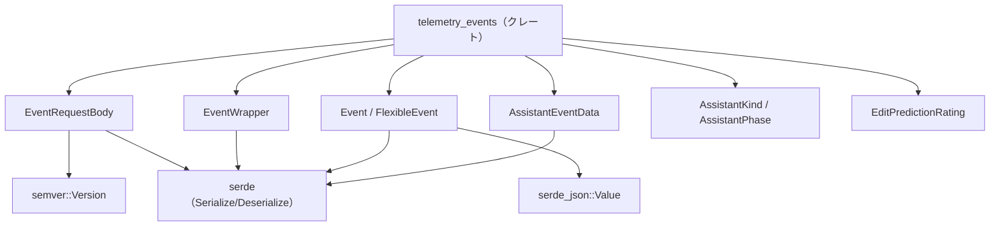
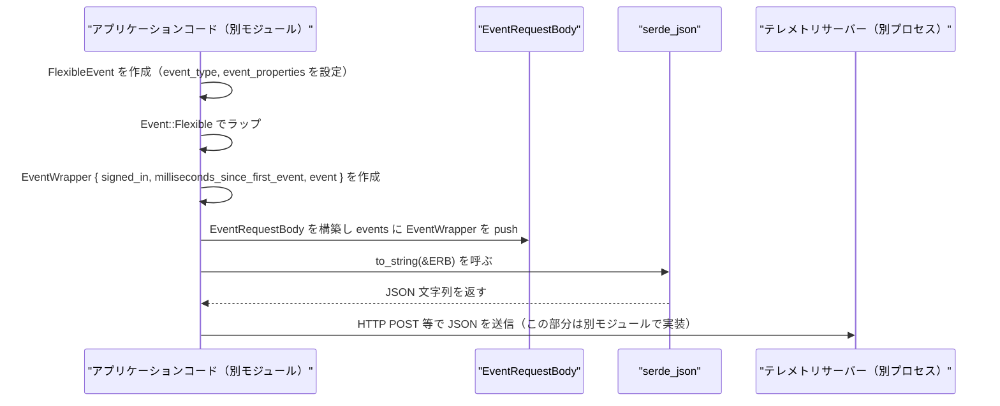

# telemetry_events/

## 1. ざっくり一言

Zed エディタが送信するテレメトリ（利用状況などのイベント）を表現するための **イベントデータ構造** を定義しているクレートです。  
イベントバッチのリクエストボディや、アシスタント機能に関連するイベント情報をシリアライズ可能な形で保持します。

---

## 2. このモジュールの役割

### 2.1 概要

- このディレクトリ（クレート）は、Zed のテレメトリイベントを **型安全に表現し、JSON にシリアライズ／デシリアライズする** ためのデータ型群を提供します。
- OS やアプリのバージョンなど、クライアント環境情報を含むイベントバッチ (`EventRequestBody`) と、その中に含まれる個々のイベント (`EventWrapper`, `Event`, `FlexibleEvent`) を定義します。
- AI アシスタント関連のイベント情報（どのモデルを使ったか、レスポンスのフェーズ、エラーなど）を表す補助的な型 (`AssistantEventData` など) も含みます。

### 2.2 アーキテクチャ内での位置づけ

このクレート自体は **純粋なデータ定義レイヤー** であり、実際の送信処理（HTTP リクエストなど）はこのチャンクには含まれていません。  
外部クレートとの関係も含めた依存関係のイメージを以下に示します。



- `semver::Version`: `EventRequestBody::semver` でアプリバージョンを構文解析するために使用します。
- `serde` / `serde_json`: すべてのイベント型を JSON と相互変換するための基盤です。
- 他のクレート（HTTP クライアントや上位アプリケーションロジック）は、このクレートの型を使ってイベントを構築し、送信する役割を持つと考えられます（送信処理自体はこのディレクトリには存在しません）。

### 2.3 設計上のポイント

コードから読み取れる特徴は次のとおりです。

- **データ定義専用**  
  - 関数ロジックは最小限 (`semver` と `Display` 実装のみ) で、ほぼ全てが構造体・列挙体定義です。
- **シリアライズ前提の設計**  
  - ほとんどの型が `Serialize` / `Deserialize` を derive しており、`serde` 属性で JSON 形式が明示されています（`rename_all = "snake_case"`, `tag = "type"`, `flatten` など）。
- **拡張性の確保**  
  - イベント本体を `Event`（現状は `FlexibleEvent` のみ）として抽象化し、柔軟な `event_properties: HashMap<String, serde_json::Value>` を持たせることで、種類の異なるイベントを同一フォーマットで扱えるようにしています。
- **オプションフィールドの多用**  
  - 利用可能な情報だけを送るために、多くのフィールドが `Option<T>` になっています。一部は `skip_serializing_if` により `None` の場合は JSON 出力から省略されます。

---

## 3. 主要な機能一覧

このクレートが提供する主な機能を箇条書きにします。

- **イベントバッチ本体の表現 (`EventRequestBody`)**
  - システム ID / インストール ID / セッション ID / OS / アーキテクチャ / アプリバージョンなどを含む、テレメトリのリクエストボディを表現します。
- **個々のイベントのラップ (`EventWrapper`)**
  - サインイン状態や、バッチ内の最初のイベントからの経過時間（ミリ秒）とセットでイベントを扱います。
- **柔軟なイベント本体 (`Event`, `FlexibleEvent`)**
  - `event_type` と任意の `event_properties`（JSON 値のマップ）の組み合わせとしてイベントを表現します。
- **AI アシスタント関連情報 (`AssistantKind`, `AssistantPhase`, `AssistantEventData`)**
  - アシスタントの種類（パネル／インライン）、フェーズ（応答・呼び出し・受理・拒否）、モデル名、プロバイダ、エラー情報などを構造化して表現します。
- **編集予測の評価 (`EditPredictionRating`)**
  - ポジティブ／ネガティブな評価を表現する小さな列挙体です。
- **アプリバージョンの semver 解析 (`EventRequestBody::semver`)**
  - `app_version` 文字列を `semver::Version` に変換し、より厳密なバージョン判定に利用可能な形式にします。

---

## 4. 関数・構造体の解説

### 4.1 型一覧

主要な型を一覧で整理します。

| 名前 | 種別 | 役割 / 用途 |
|------|------|-------------|
| `EventRequestBody` | 構造体 | テレメトリイベントのバッチ全体を表現するリクエストボディ。環境情報 + `events` 配列を持ちます。 |
| `EventWrapper` | 構造体 | 単一イベントに対して、サインイン状態やバッチ先頭からの経過時間を付与したラッパー。 |
| `Event` | 列挙体 | イベントのバリアントを表現する列挙体。現状は `Flexible(FlexibleEvent)` のみ。`serde(tag = "type")` で型タグを付加します。 |
| `FlexibleEvent` | 構造体 | `event_type` 文字列と任意の `event_properties` を持つ汎用イベント表現。 |
| `EditPredictionRating` | 列挙体 | 編集予測に対する「Positive」または「Negative」の評価。`Eq`, `Ord`, `Hash` 付きでマップのキーなどに利用可能。 |
| `AssistantKind` | 列挙体 | アシスタントの種類（`Panel`, `Inline`, `InlineTerminal`）。`snake_case` でシリアライズされます。 |
| `AssistantPhase` | 列挙体 | アシスタント処理のフェーズ（`Response`, `Invoked`, `Accepted`, `Rejected`）。`Default` は `Response`。 |
| `AssistantEventData` | 構造体 | アシスタント関連イベントの詳細情報（会話 ID、モデル名、レスポンス遅延、エラーなど）。 |

それぞれの型のフィールドの意味を、少し詳しく解説します。

#### `EventRequestBody`

- `system_id: Option<String>`  
  - Zed がインストールされた「システム」ごとの一意 ID（マシン単位の識別子）を表す想定です。未取得の場合は `None`。
- `installation_id: Option<String>`  
  - インストールごとの一意 ID。stable / preview / dev などの別インストールで異なる ID になるというコメントがあります。
- `session_id: Option<String>`  
  - Zed のセッションごとの一意 ID。Zed を起動するたびに別の ID になる想定です。
- `metrics_id: Option<String>`  
  - メトリクス用の識別子（詳細はこのチャンクからは分かりません）。
- `is_staff: Option<bool>`  
  - Zed スタッフかどうか。`#[serde(skip_serializing_if = "Option::is_none")]` により、`None` の場合はフィールド自体が JSON から省略されます。
- `app_version: String`  
  - Zed アプリのバージョン文字列。`semver()` で `semver::Version` にパースされます。
- `os_name: String` / `os_version: Option<String>` / `architecture: String`  
  - OS 名（例: "macOS"）、OS バージョン、CPU アーキテクチャ（例: "x86_64", "aarch64"）を表現します。
- `release_channel: Option<String>`  
  - Zed のリリースチャンネル（例: "stable", "preview", "dev"）を表します。
- `events: Vec<EventWrapper>`  
  - このリクエストに含める個々のイベントの配列です。

#### `EventWrapper`

- `signed_in: bool`  
  - イベント発生時にユーザーがサインインしていたかどうか。
- `milliseconds_since_first_event: i64`  
  - 「このバッチの最初のイベント」からの経過時間（ミリ秒）。  
    最初のイベントが `0`、以降が正の値になることが想定されますが、型は `i64` のため負値も技術的には保持可能です。
- `event: Event` (`#[serde(flatten)]`)  
  - 実際のイベント本体です。`flatten` により、JSON 上では `EventWrapper` のフィールドと同じ階層に展開されます。

#### `Event`

- `Flexible(FlexibleEvent)`  
  - 汎用イベント。今後、別種のイベント（例えば固定スキーマのもの）が追加される余地がありますが、このチャンクには他のバリアントは定義されていません。
- `#[serde(tag = "type")]`  
  - シリアライズ時は、`{"type": "Flexible", "event_type": "...", "event_properties": {...}}` のように `type` フィールドが追加されます。

#### `FlexibleEvent`

- `event_type: String`  
  - イベントの論理名（例: `"assistant_invoked"`, `"file_opened"` など）を表します。具体的な値はこのチャンクからは分かりません。
- `event_properties: HashMap<String, serde_json::Value>`  
  - イベント固有のプロパティを自由に格納するマップです。  
  - 値が `serde_json::Value` なので、数値・文字列・真偽値・配列・オブジェクトなど任意の JSON 値が表現できます。

#### `EditPredictionRating`

- `Positive` / `Negative`  
  - 編集予測（補完など）に対する評価を表す二値の列挙体です。
- `Eq, PartialOrd, Ord, Hash` が derive されているため、`BTreeSet`, `HashSet`, `BTreeMap`, `HashMap` のキーとしても利用できます。

#### `AssistantKind`

- `Panel` / `Inline` / `InlineTerminal`  
  - アシスタントの UI 形態を表します。
- `#[serde(rename_all = "snake_case")]` により、JSON では `"panel"`, `"inline"`, `"inline_terminal"` という小文字スネークケースで表現されます。
- `Display` 実装も同じ文字列を返します。

#### `AssistantPhase`

- `Response`（デフォルト） / `Invoked` / `Accepted` / `Rejected`  
  - アシスタントとの対話のどのフェーズのイベントかを表します。
- `#[derive(Default)]` + `#[default]` により、`AssistantPhase::default()` は `AssistantPhase::Response` になります。
- `#[serde(rename_all = "snake_case")]` なので、JSON では `"response"`, `"invoked"`, `"accepted"`, `"rejected"` になります。
- `AssistantEventData` 内の `phase` フィールドには `#[serde(default)]` が指定されており、JSON に `phase` が含まれていない場合は自動的に `Response` がセットされます。

#### `AssistantEventData`

- `conversation_id: Option<String>`  
  - 各アシスタントタブごとの一意な会話 ID。インラインアシストの場合は `None` の想定です。
- `message_id: Option<String>`  
  - サーバー側で生成されるメッセージ ID。一部のプロバイダのみ対応とコメントがあります。
- `kind: AssistantKind`  
  - アシスタントの種類（パネル／インライン／インラインターミナル）。
- `phase: AssistantPhase` (`#[serde(default)]`)  
  - アシスタントイベントのフェーズ。JSON に `phase` が無い場合、デフォルトで `Response` になります。
- `model: String`  
  - 使用した AI モデル名（例: `"gpt-4o"`, `"claude-3-5-sonnet"`）。
- `model_provider: String`  
  - モデルの提供元（例: `"openai"`, `"anthropic"` など）。
- `response_latency: Option<Duration>`  
  - リクエストからレスポンスまでの遅延時間。`None` の場合は計測不可などの意味合いになります。
- `error_message: Option<String>`  
  - エラーが発生した場合のメッセージ。成功時は `None`。
- `language_name: Option<String>`  
  - 対象言語名（例: `"Rust"`, `"TypeScript"`）など。未指定の場合は `None`。

### 4.2 重要な関数の詳細

このクレートにはロジックを持つ関数は 3 つ（`EventRequestBody::semver` と 2 つの `Display::fmt` 実装）です。

#### `EventRequestBody::semver(&self) -> Option<Version>`

**概要**

- `EventRequestBody.app_version` に格納されたバージョン文字列を `semver::Version` 型としてパースします。
- 解析に失敗した場合は `None` を返します。

**引数**

| 引数名 | 型 | 説明 |
|--------|----|------|
| `&self` | `&EventRequestBody` | 呼び出し対象のインスタンス参照。内部の `app_version` を使用します。 |

**戻り値**

- `Option<Version>`  
  - 成功時: `Some(Version)`（メジャー・マイナー・パッチなどに分割された構造化バージョン）。  
  - 失敗時: `None`（`app_version.parse::<Version>()` が `Err` を返した場合）。

**内部処理の流れ**

1. `self.app_version.parse()` を呼び出し、`semver::Version` への変換を試みます。
2. `Result<Version, _>` の `ok()` メソッドにより、成功時は `Some(Version)`, 失敗時は `None` に変換します。
3. そのまま `Option<Version>` を返します。

**Examples（使用例）**

```rust
use telemetry_events::EventRequestBody;
use semver::Version;

fn check_app_version(body: &EventRequestBody) {
    if let Some(version) = body.semver() {
        // メジャーバージョン 1 以上かどうかを確認する
        if version.major >= 1 {
            println!("安定版系列のバージョンです: {}", version);
        } else {
            println!("プレリリースに近い古いバージョンかもしれません: {}", version);
        }
    } else {
        // semver として解釈できない場合
        println!("app_version が semver として不正な形式です: {}", body.app_version);
    }
}
```

**Errors / Panics**

- パース失敗時にも panic は発生せず、単純に `None` を返します。
- `semver` クレートの `Version::parse` が内部で panic することは通常ありません（不正な入力に対しては `Err` を返します）。

**Edge cases（エッジケース）**

- 空文字列 (`""`)  
  - `parse()` が失敗するため `None` が返ります。
- セマンティックバージョンとして不正な文字列（例: `"1"`, `"v1.2.3"` など）  
  - `semver` が許容しない形式の場合、同様に `None` になります。
- プレリリースやビルドメタデータを含む文字列（例: `"1.2.3-beta.1+build.5"`）  
  - `semver` の仕様に沿った形式であれば `Some(Version)` が返ります。

**使用上の注意点**

- `None` が返る可能性があるため、呼び出し側では常に `Option` を扱う必要があります。
- クライアントから受け取った `app_version` が常に semver 形式であることを前提にすると、バージョン比較ロジックで思わぬ分岐（`None` ケース）が発生します。

---

#### `impl Display for AssistantKind`

**概要**

- `AssistantKind` を `"panel"`, `"inline"`, `"inline_terminal"` の文字列として表示するための `Display` 実装です。
- ログ出力やメッセージ内で人間が読みやすい形式として利用できます。

**引数 / 戻り値**

- `&self: &AssistantKind`  
- `f: &mut std::fmt::Formatter<'_>`  
- 戻り値: `std::fmt::Result`（`write!` の結果）。

**内部処理の流れ**

1. `match self` で `Panel`, `Inline`, `InlineTerminal` のいずれかを判定します。
2. 対応するリテラル文字列（`"panel"`, `"inline"`, `"inline_terminal"`）を書き込みます。
3. `write!` の結果（`fmt::Result`）をそのまま返します。

**Examples**

```rust
use telemetry_events::AssistantKind;

fn log_assistant_kind(kind: AssistantKind) {
    println!("assistant kind = {}", kind); // 例: "assistant kind = inline"
}
```

**Errors / Panics**

- `Display::fmt` 自体は panic しませんが、内部の `write!` がエラーを返す可能性があります（通常は I/O エラーなど）。  
  多くの場合、標準出力や `String` に書き込む限りは問題になりません。

**Edge cases**

- 列挙体に新しいバリアントが追加された場合、`match` がコンパイルエラーになります（Rust の exhaustiveness チェックにより、追加し忘れを防止できます）。

**使用上の注意点**

- `serde` 側でも `rename_all = "snake_case"` が指定されているため、JSON 表現と `Display` の文字列表現が一致します。  
  文字列を比較するときはこのフォーマットを前提にします。

---

#### `impl Display for AssistantPhase`

**概要**

- `AssistantPhase` を `"response"`, `"invoked"`, `"accepted"`, `"rejected"` の文字列として表示する `Display` 実装です。

**内部処理の流れ / Examples / 注意点**

- `AssistantKind` とほぼ同様の実装です。

```rust
use telemetry_events::AssistantPhase;

fn log_phase(phase: AssistantPhase) {
    println!("assistant phase = {}", phase); // 例: "assistant phase = rejected"
}
```

- `serde(rename_all = "snake_case")` と `Display` の出力が一致するため、ログと JSON で同じ文字列を扱えます。

### 4.3 その他のシリアライズ関連の挙動

このクレートでは `serde` 属性により JSON 形式が細かく制御されています。

- `#[serde(skip_serializing_if = "Option::is_none")]`（`EventRequestBody.is_staff`）
  - `is_staff: None` の場合、JSON フィールド自体が出力されません。
  - 他の `Option` フィールド（`system_id` など）は指定がないため、`None` の場合は `null` としてシリアライズされます。
- `#[serde(rename_all = "snake_case")]`（`AssistantKind`, `AssistantPhase`）
  - 列挙体のバリアント名が JSON 上ではスネークケースの文字列になります。
- `#[serde(tag = "type")]`（`Event`）
  - バリアントごとに `type` フィールドが追加され、バリアント名が文字列として入ります（現状 `"Flexible"`）。
- `#[serde(flatten)]`（`EventWrapper.event`）
  - `Event` のフィールド（`type`, `event_type`, `event_properties`）が `EventWrapper` と同じ JSON オブジェクトのトップレベルに展開されます。
- `#[serde(default)]`（`AssistantEventData.phase`）
  - JSON に `phase` が存在しない場合、自動的に `AssistantPhase::default()`（`Response`）がセットされます。

---

## 5. データフロー

### 5.1 代表的な処理シナリオの概要

このディレクトリ内には HTTP 送信処理は定義されていませんが、型やコメントから想定される典型的なフローは次のようになります。

1. アプリケーションコード（別モジュール）が、ユーザー操作などに応じて `FlexibleEvent` を組み立てます。
2. それを `Event::Flexible` として `EventWrapper` に包み、サインイン状態や経過時間を付与します。
3. 複数の `EventWrapper` を `EventRequestBody.events` に格納し、環境情報（`app_version`, `os_name` など）とともにバッチを構成します。
4. `EventRequestBody` を `serde_json` で文字列またはバイナリ JSON にシリアライズし、別モジュールの HTTP クライアントからテレメトリサーバーへ送信します。  
   （4 の送信部分はこのクレートには実装されておらず、あくまで想定です）

### 5.2 シーケンス図

上記の流れをシーケンス図として表します。



- 実際に `serde_json::to_string` や HTTP クライアントを呼び出すコードは、このディレクトリには含まれていません。
- `AssistantEventData` などの補助的な型は、`event_properties` 内の値として `serde_json::to_value` などで埋め込まれる形が想定されますが、具体的な利用コードはこのチャンクには存在しません。

---

## 6. 使い方（How to Use）

### 6.1 基本的な使用方法

ここでは、単純な `FlexibleEvent` を 1 件だけ含む `EventRequestBody` を作成し、JSON にシリアライズする例を示します。

```rust
use std::collections::HashMap;
use std::time::Duration;

use serde_json::json;
use telemetry_events::{
    AssistantEventData, AssistantKind, AssistantPhase,
    EventRequestBody, EventWrapper, Event, FlexibleEvent,
};

fn main() -> Result<(), Box<dyn std::error::Error>> {
    // 1. アシスタントイベントの詳細データを組み立てる
    let assistant_data = AssistantEventData {
        conversation_id: Some("conv-123".to_string()),
        message_id: Some("msg-456".to_string()),
        kind: AssistantKind::Panel,
        phase: AssistantPhase::Invoked,
        model: "gpt-4o".to_string(),
        model_provider: "openai".to_string(),
        response_latency: Some(Duration::from_millis(350)),
        error_message: None,
        language_name: Some("Rust".to_string()),
    };

    // 2. assistant_data を JSON 値に変換する
    let assistant_value = serde_json::to_value(&assistant_data)?;

    // 3. FlexibleEvent を作成する
    let mut event_properties: HashMap<String, serde_json::Value> = HashMap::new();
    event_properties.insert("assistant".to_string(), assistant_value);
    event_properties.insert("some_flag".to_string(), json!(true));

    let flexible_event = FlexibleEvent {
        event_type: "assistant_invoked".to_string(),
        event_properties,
    };

    // 4. EventWrapper でラップする
    let wrapped_event = EventWrapper {
        signed_in: true,
        milliseconds_since_first_event: 0, // 最初のイベントなので 0
        event: Event::Flexible(flexible_event),
    };

    // 5. EventRequestBody を構築する
    let body = EventRequestBody {
        system_id: Some("system-abc".to_string()),
        installation_id: Some("install-def".to_string()),
        session_id: Some("session-ghi".to_string()),
        metrics_id: None,
        is_staff: Some(false),
        app_version: "1.2.3".to_string(),
        os_name: "macOS".to_string(),
        os_version: Some("14.4".to_string()),
        architecture: "aarch64".to_string(),
        release_channel: Some("stable".to_string()),
        events: vec![wrapped_event],
    };

    // 6. バージョンを semver として扱う（必要な場合）
    if let Some(version) = body.semver() {
        println!("App semver: {}", version);
    }

    // 7. JSON 文字列に変換する（送信は別モジュールで行う想定）
    let json_body = serde_json::to_string_pretty(&body)?;
    println!("Telemetry JSON:\n{}", json_body);

    Ok(())
}
```

このコードを実行すると、`EventRequestBody` 全体が JSON にシリアライズされ、`assistant` プロパティに `AssistantEventData` の内容がネストされた形で出力されます。

### 6.2 よくある使用パターン

#### パターン 1: 複数イベントを 1 つのバッチで送信する

バッチングによりネットワーク回数を削減する用途が考えられます。

```rust
use telemetry_events::{EventRequestBody, EventWrapper, Event, FlexibleEvent};
use std::collections::HashMap;

fn make_batch() -> EventRequestBody {
    let make_simple_event = |event_type: &str, delta_ms: i64| {
        let event = FlexibleEvent {
            event_type: event_type.to_string(),
            event_properties: HashMap::new(),
        };
        EventWrapper {
            signed_in: true,
            milliseconds_since_first_event: delta_ms,
            event: Event::Flexible(event),
        }
    };

    EventRequestBody {
        system_id: None,
        installation_id: None,
        session_id: None,
        metrics_id: None,
        is_staff: None,
        app_version: "1.0.0".to_string(),
        os_name: "Linux".to_string(),
        os_version: None,
        architecture: "x86_64".to_string(),
        release_channel: Some("dev".to_string()),
        events: vec![
            make_simple_event("editor_opened", 0),
            make_simple_event("file_opened", 120),
            make_simple_event("assistant_invoked", 500),
        ],
    }
}
```

- `milliseconds_since_first_event` に経過時間を設定することで、サーバー側でイベントの相対的なタイミングを再構成できるようになります。

#### パターン 2: `AssistantKind` / `AssistantPhase` を文字列としてログに出す

`Display` 実装により簡単に文字列化できます。

```rust
use telemetry_events::{AssistantKind, AssistantPhase};

fn log_assistant(kind: AssistantKind, phase: AssistantPhase) {
    println!("assistant kind={}, phase={}", kind, phase);
    // 例: "assistant kind=inline, phase=response"
}
```

- JSON の `snake_case` 表現と一致するため、ログをそのまま解析に利用しやすくなります。

### 6.3 使用上の注意点（まとめ）

- **`app_version` の形式**
  - `semver()` を使う場合は、`app_version` が `semver` クレートで解釈可能な形式（例: `"1.2.3"`）であることが前提です。  
    不正な文字列の場合 `None` になるため、そのケースを考慮する必要があります。
- **`Option` フィールドのシリアライズ挙動**
  - `is_staff` のみ `None` でフィールドごと省略されます。その他の `Option` フィールドは、`None` の場合 `null` としてシリアライズされます。  
    サーバー側での扱い（「フィールド欠如」と「null」の違い）に注意する必要があります。
- **`milliseconds_since_first_event` の意味**
  - バッチ内の相対時間を表すため、最初のイベントを `0`、以降を正の値とするのが自然です。  
    型は `i64` なので負の値も格納可能ですが、その場合の意味はコードからは読み取れません。
- **`Duration` のシリアライズ**
  - `AssistantEventData.response_latency` は `Duration` で保持されます。  
    どのような JSON 形式にシリアライズされるかは `serde` の実装や設定に依存します。サーバー側の期待するフォーマットと一致しているか確認する必要があります（このチャンクから形式の詳細は分かりません）。
- **`Event` の拡張**
  - 現在 `Event` には `Flexible` バリアントしかありませんが、`#[serde(tag = "type")]` が使われているため、将来的にバリアントを追加する際には `type` の値が増えることになります。  
    サーバー側や解析処理が `type` フィールドに依存している場合、その影響範囲に注意が必要です。

---

## 7. 関連ファイル

このディレクトリ内のファイルと、それぞれの役割は次のとおりです。

| パス | 役割 / 関係 |
|------|------------|
| `telemetry_events/Cargo.toml` | クレート `telemetry_events` の設定ファイル。ライブラリのエントリポイントとして `src/telemetry_events.rs` を指定し、依存クレートとして `semver`, `serde`, `serde_json` を宣言しています。 |
| `telemetry_events/src/telemetry_events.rs` | このクレートのメインソースファイル。テレメトリイベント関連のすべてのデータ型（`EventRequestBody` など）を定義しています。 |

- このチャンクにはテストコードや補助ユーティリティモジュールは含まれていません。  
- 他のクレート（例: HTTP 送信を担うクレート、Zed 本体のアプリケーションロジック）は、ここで定義された型をインポートして利用する形になると考えられますが、その具体的な構造はこのチャンクからは分かりません。
