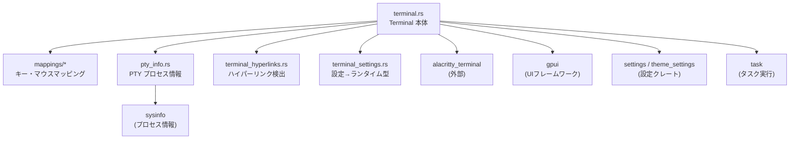
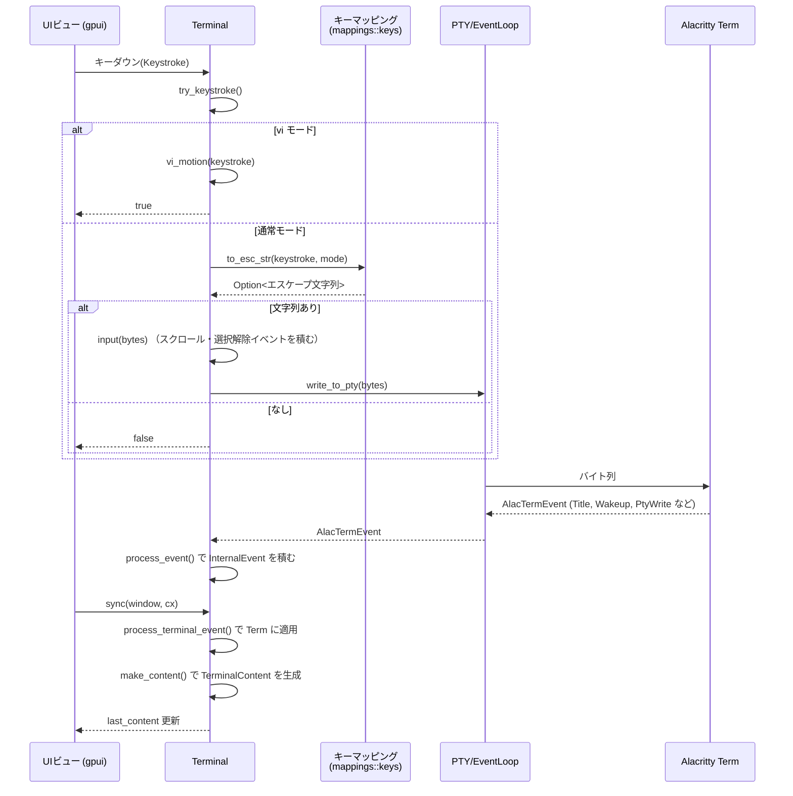

# terminal/ ディレクトリ解説

## 1. ざっくり一言

Zed 内で使われる **ターミナルウィジェット**を実装するクレートです。  
Alacritty のターミナルエンジン（`alacritty_terminal`）と `gpui` を橋渡しし、PTY ベースのシェル実行・表示専用ターミナル・キーボード/マウス入力・ハイパーリンク検出・設定との連携をまとめて扱います。

---

## 2. このモジュールの役割

### 2.1 概要

- このディレクトリは、Zed の UI から利用される **ターミナルビューの実装**を提供します。
- **PTY（疑似端末）を使った実ターミナル**と、**出力だけ描画する表示専用ターミナル**の両方を扱います。
- `gpui` の入力イベント（キーストローク・マウス・スクロール）を **ANSI エスケープ・xterm マウスシーケンス**に変換し、`alacritty_terminal` に渡します。
- ターミナル出力から **URL やファイルパスを検出してクリック可能にする処理**、設定（フォント・色・パスハイパーリンク正規表現）との橋渡しも行います。

### 2.2 アーキテクチャ内での位置づけ

主要モジュール間と依存クレートの関係を図示します。



- `terminal.rs` がクレートの lib かつ中心です。
- `mappings` は **UI イベント → ANSI / xterm シーケンス**の変換を担当します。
- `pty_info` は **PTY にぶら下がっているプロセスの情報・PID**を扱います。
- `terminal_hyperlinks` は **画面上の文字列から URL / パスを探す**専用ロジックです。
- `terminal_settings` は settings クレートの設定表現を実行時の `TerminalSettings` に変換します。

### 2.3 設計上のポイント

- **二段階のイベント処理**
  - 下り方向: UI からの入力は `Terminal` が受け取り、内部キュー `events: VecDeque<InternalEvent>` に積み、`sync` 時に `alacritty_terminal::Term` に反映します。
  - 上り方向: `alacritty_terminal::EventLoop` からの `AlacTermEvent` を `process_event` で受け、必要に応じて `InternalEvent` を積みなおします。
- **表示専用 / PTY 付きの両対応**
  - `TerminalType::Pty` と `TerminalType::DisplayOnly` を切り替えて扱い、表示専用では PTY を持たずに `write_output` で直接バッファを書き換えます。
- **入力マッピングの分離**
  - キー (`mappings::keys`)、マウス (`mappings::mouse`)、色 (`mappings::colors`) を別モジュールに分け、Alacritty と gpui の型の差を吸収しています。
- **ハイパーリンク検出の専用モジュール**
  - URL 正規表現＋設定由来のパス正規表現を使い、セル単位で URL / パス範囲を検出します。
  - 幅広文字やタブによるずれを考慮しつつ、パフォーマンスのためにタイムアウトも導入しています。
- **プロセス情報キャッシュ**
  - `PtyProcessInfo` が `sysinfo::System` をキャッシュし、非同期でプロセス情報を更新しつつ、変化時だけタイトル変更イベントを発火します。
- **設定との統合**
  - `TerminalSettings` が settings クレートの JSON-like 設定を実行時型に変換し、フォント・色・スクロール量・ハイパーリンク正規表現などをまとめて提供します。

---

## 3. 主要な機能一覧

このディレクトリが提供する主な機能です。

- PTY 付きターミナルの生成と管理（シェル or 任意コマンドの実行）
- 出力のみを描画する **表示専用ターミナル**の生成
- gpui の `Keystroke` を ANSI エスケープ列に変換して PTY へ送信
- gpui のマウス・スクロールイベントを xterm 互換のマウスレポートに変換
- スクロール・選択・コピー・ペースト・vi モードなどのターミナル操作
- ターミナルバッファから URL / ファイルパスを検出し、クリック／Ctrl+クリックで開く
- テーマの色 (`Theme`) から Alacritty の ANSI カラー値への変換
- PTY に接続されているプロセスの **cwd・argv・名前・PID** の取得と kill
- タスク実行結果（成功/失敗）をターミナル内にサマリとして追記
- `TerminalSettings` によるシェル・フォント・スクロール履歴・ハイパーリンク設定などの一元管理

---

## 4. 関数・構造体の解説

### 4.1 主要な型一覧

公開・準公開の主な型を一覧します（モジュールは `terminal` クレートのルートを基準）。

| 名前 | 種別 | 所在 | 公開 | 役割 / 用途 |
|------|------|------|------|-------------|
| `Terminal` | 構造体 | `terminal.rs` | 公開 | ターミナルビュー本体。入力処理・表示状態・PTY との連携をまとめて管理します。 |
| `TerminalBuilder` | 構造体 | `terminal.rs` | 公開 | `Terminal` を構築するためのビルダー。PTY 付き／表示専用のどちらも生成します。 |
| `Event` | 列挙体 | `terminal.rs` | 公開 | ターミナルから UI へ上向きに飛ぶイベント（タイトル変更・ベル・タブを閉じるなど）。 |
| `PathLikeTarget` | 構造体 | `terminal.rs` | 公開 | ターミナル内の文字列を「パス候補」として表現する型（パス文字列＋ターミナルの cwd）。 |
| `MaybeNavigationTarget` | 列挙体 | `terminal.rs` | 公開 | URL かパスか不明なナビゲーションターゲットを表す型。`Event::Open` 経由で UI に渡されます。 |
| `TerminalBounds` | 構造体 | `terminal.rs` | 公開 | 1 文字の幅・高さとビュー全体の `Bounds` を持ち、行数・列数を計算します。`Dimensions` を実装し Alacritty に渡します。 |
| `TerminalContent` | 構造体 | `terminal.rs` | 公開（コメントで「TODO: Un-pub」） | 描画用に集約されたターミナル表示状態（セル列・カーソル・選択範囲など）のスナップショット。 |
| `IndexedCell` | 構造体 | `terminal.rs` | 公開 | `AlacPoint` と 1 セル (`Cell`) をペアにしたラッパー。描画やヒットテストに利用します。 |
| `TaskState` | 構造体 | `terminal.rs` | 公開 | ターミナルで走っているタスク（`SpawnInTerminal`）の状態と終了コードの受信チャネルを保持します。 |
| `TaskStatus` | 列挙体 | `terminal.rs` | 公開 | タスクの状態を `Unknown` / `Running` / `Completed { success }` で表現します。 |
| `CursorShape` | 列挙体 | `terminal_settings.rs` | 公開 | ブロック・アンダーライン・バー・枠線など、カーソルの形状を指定します。Alacritty の `CursorShape` に変換されます。 |
| `TerminalSettings` | 構造体 | `terminal_settings.rs` | 公開 (`settings::Settings` 実装) | 設定ファイル中の `terminal` セクションを実行時設定へ変換したもの。フォント・シェル・スクロール・ハイパーリンク等を含みます。 |
| `ScrollbarSettings` | 構造体 | `terminal_settings.rs` | 公開 | ターミナルのスクロールバー表示条件を表す設定。 |
| `PtyProcessInfo` | 構造体 | `pty_info.rs` | クレート内 | PTY に紐づくプロセスの情報（`sysinfo::System` のラッパー）。タイトル更新や kill に利用。 |
| `ProcessInfo` | 構造体 | `pty_info.rs` | クレート内 | `name` / `cwd` / `argv` をまとめた PTY プロセス情報。 |
| `RegexSearches` | 構造体 | `terminal_hyperlinks.rs` | モジュール内 (`pub(super)`) | URL 正規表現＋パス用正規表現・タイムアウトをまとめたハイパーリンク検索のコンテナ。 |
| `Toolbar` | 構造体 | `terminal_settings.rs` | 公開 | ターミナル上のツールバー（パンくずの表示有無）設定。 |
| `ScrollbarSettings` | 構造体 | `terminal_settings.rs` | 公開 | スクロールバーの表示条件設定。 |

`mappings::*` 内の列挙体 (`AlacModifiers`, `AlacMouseButton`, `MouseFormat` など) は内部用の補助型です。

### 4.2 重要な関数の詳細（7 件）

#### 4.2.1 `insert_zed_terminal_env(env: &mut HashMap<String, String>, version: &impl Display)`

**概要**

Zed のターミナルであることを子プロセスに知らせるための **環境変数一式**を `env` に追加します。ローカルターミナルとリモートターミナル（SSH 経由）の両方で使われます。

**引数**

| 引数名 | 型 | 説明 |
|--------|----|------|
| `env` | `&mut HashMap<String, String>` | これから起動するシェル・コマンドに渡す環境変数マップ。上書き・追加されます。 |
| `version` | `&impl Display` | Zed のバージョン。`TERM_PROGRAM_VERSION` に文字列化して保存されます。 |

**戻り値**

- なし。`env` が in-place で変更されます。

**内部処理の流れ**

1. `ZED_TERM=true` を設定。
2. `TERM_PROGRAM=zed` を設定。
3. `TERM=xterm-256color` を設定。
4. `COLORTERM=truecolor` を設定。
5. `TERM_PROGRAM_VERSION` に `version.to_string()` を設定。

**Examples（使用例）**

```rust
use collections::HashMap;
use terminal::insert_zed_terminal_env;

fn prepare_env() -> HashMap<String, String> {
    let mut env = std::env::vars().collect::<HashMap<_, _>>(); // 既存の環境変数をコピー
    let version = "1.0.0"; // 実際は release_channel::AppVersion などを渡す
    insert_zed_terminal_env(&mut env, &version);               // Zed 用の変数を挿入
    env                                                      // 修正済みマップを返す
}
```

**Edge cases**

- 既に同名のキーが存在する場合は **上書き**されます。
- `version` にどのような文字列を渡しても、そのまま `TERM_PROGRAM_VERSION` になります（フォーマット制約はありません）。

**使用上の注意点**

- 他の環境変数を設定する前後どちらで呼んでもよいですが、**Zed 固有の値で上書きされる**ことを前提にしておく必要があります。
- `TerminalBuilder::new` 内でも `insert_zed_terminal_env` を呼び出しているため、通常は外部から再度呼ぶ必要はありません。

---

#### 4.2.2 `TerminalBuilder::new_display_only(...) -> Result<TerminalBuilder>`

**概要**

実際の PTY を持たず、**出力専用のターミナル**を作るためのビルダーを同期的に生成します。  
UI テストやタスク出力の表示など、「シェルを起動しない」用途向けです。

**シグネチャ（簡略）**

```rust
pub fn new_display_only(
    cursor_shape: CursorShape,
    alternate_scroll: AlternateScroll,
    max_scroll_history_lines: Option<usize>,
    window_id: u64,
    background_executor: &BackgroundExecutor,
    path_style: PathStyle,
) -> Result<TerminalBuilder>
```

**引数**

| 引数名 | 型 | 説明 |
|--------|----|------|
| `cursor_shape` | `CursorShape` | デフォルトのカーソル形状。 |
| `alternate_scroll` | `AlternateScroll` | Alacritty の Alternate Scroll モードを有効/無効にする設定。 |
| `max_scroll_history_lines` | `Option<usize>` | スクロールバックの最大行数。`None` ならデフォルト（`DEFAULT_SCROLL_HISTORY_LINES`）。 |
| `window_id` | `u64` | 所属するウィンドウ ID（イベントループとの結合に使われます）。 |
| `background_executor` | `&BackgroundExecutor` | 非同期タスク実行用のエグゼキュータ。`Terminal` 内にも保存されます。 |
| `path_style` | `PathStyle` | ローカル/リモートなどのパス表現スタイル（ハイパーリンク検出で使用）。 |

**戻り値**

- `Ok(TerminalBuilder)` : 正常にビルダーが生成された場合。
- `Err(anyhow::Error)` : 内部でエラーが起きた場合（この関数内ではほぼ発生しません）。

**内部処理の流れ**

1. `alacritty_terminal::term::Config` を組み立て（スクロール履歴とデフォルトカーソルスタイルを設定）。
2. `Term::new` を `TerminalBounds::default()` と `ZedListener(events_tx)` で初期化。
3. `AlternateScroll::Off` の場合は `term.unset_private_mode(AlternateScroll)` で無効化。
4. `Term` を `FairMutex` + `Arc` で包み、`Terminal` 構造体を初期化。
   - `terminal_type` は `TerminalType::DisplayOnly`。
   - `template` に各種設定（シェル・環境変数・ハイパーリンク設定など）を保存。
5. `TerminalBuilder { terminal, events_rx }` を返す。

**Examples（使用例）**

```rust
use gpui::{TestAppContext, px};
use terminal::{TerminalBuilder, TerminalBounds};
use terminal_settings::{CursorShape, AlternateScroll};
use util::paths::PathStyle;

// テストコンテキスト内で表示専用ターミナルを作る例
fn create_display_only_terminal(cx: &mut TestAppContext) {
    let terminal_entity = cx.new(|cx| {
        // ビルダーを作る
        let builder = TerminalBuilder::new_display_only(
            CursorShape::default(),               // デフォルトのカーソル
            AlternateScroll::On,                  // Alternate Scroll 有効
            None,                                 // デフォルトのスクロール履歴
            0,                                    // 仮の window_id
            cx.background_executor(),             // バックグラウンドエグゼキュータ
            PathStyle::local(),                   // ローカルパスとして扱う
        ).unwrap();

        // gpui の Entity と紐付け
        builder.subscribe(cx)
    });

    // 後は terminal_entity に対して update して操作する
}
```

**Errors / Panics**

- この関数自体では特にエラー源となる外部 I/O はありませんが、`Config::default()` や `Term::new` 内部のパニックが起きれば伝播します。

**Edge cases**

- `max_scroll_history_lines` が `Some` かつ `MAX_SCROLL_HISTORY_LINES` を超える値の場合は `min` で上限に切り詰められます。
- 表示専用なので `input` は PTY に何も送らず、**出力を増やしたい場合は `write_output` を使う必要があります**。

**使用上の注意点**

- 表示専用ターミナルでは PTY が無いため、`Terminal::input` を呼んでも実際には外部プロセスは起動しません。
- `TerminalBuilder::subscribe` を呼んで `Terminal` を `gpui::Entity` として登録しないと、イベントループは動作しません。

---

#### 4.2.3 `TerminalBuilder::new(...) -> Task<Result<TerminalBuilder>>`

**概要**

実際の PTY を生成し、指定したシェル/コマンドを実行する **本物のターミナル**を作るためのビルダーを非同期に生成します。

**シグネチャ（簡略）**

```rust
pub fn new(
    working_directory: Option<PathBuf>,
    task: Option<TaskState>,
    shell: Shell,
    mut env: HashMap<String, String>,
    cursor_shape: CursorShape,
    alternate_scroll: AlternateScroll,
    max_scroll_history_lines: Option<usize>,
    path_hyperlink_regexes: Vec<String>,
    path_hyperlink_timeout_ms: u64,
    is_remote_terminal: bool,
    window_id: u64,
    completion_tx: Option<Sender<Option<ExitStatus>>>,
    cx: &App,
    activation_script: Vec<String>,
    path_style: PathStyle,
) -> Task<Result<TerminalBuilder>>
```

**引数（主要なもののみ）**

| 引数名 | 型 | 説明 |
|--------|----|------|
| `working_directory` | `Option<PathBuf>` | シェル起動時の作業ディレクトリ。`None` なら OS のデフォルト。 |
| `task` | `Option<TaskState>` | タスク実行用ターミナルの場合のタスク状態。通常のインタラクティブシェルでは `None`。 |
| `shell` | `Shell` | 使用するシェル（System / Program / WithArguments）。 |
| `env` | `HashMap<String, String>` | 子プロセスに渡す環境変数。内部で `SHLVL` や `LANG`、Zed 用の変数が調整されます。 |
| `cursor_shape` | `CursorShape` | カーソル形状。 |
| `alternate_scroll` | `AlternateScroll` | Alternate Scroll モードの設定。 |
| `max_scroll_history_lines` | `Option<usize>` | スクロール履歴上限。タスク付きの場合は自動的に最大値を使います。 |
| `path_hyperlink_regexes` | `Vec<String>` | 追加のパスハイパーリンク正規表現（設定から渡される）。 |
| `path_hyperlink_timeout_ms` | `u64` | ハイパーリンク検出に使う正規表現処理のタイムアウト（ミリ秒）。 |
| `is_remote_terminal` | `bool` | リモートターミナルかどうか（cwd の扱いなどに影響）。 |
| `window_id` | `u64` | ウィンドウ ID。 |
| `completion_tx` | `Option<Sender<Option<ExitStatus>>>` | タスク終了コードを上位に通知するためのチャネル。 |
| `cx` | `&App` | `gpui::App` コンテキスト。タスクの spawn に使います。 |
| `activation_script` | `Vec<String>` | シェル起動直後に実行するコマンド列（環境の初期化など）。 |
| `path_style` | `PathStyle` | パス表現スタイル。 |

**戻り値**

- `Task<Result<TerminalBuilder>>`  
  - タスクを `await` すると、`Ok(TerminalBuilder)` か `Err(TerminalError)` が返ります。

**内部処理の流れ（簡略）**

1. `env` から `SHLVL` を削除し、必要なら `LANG` を `en_US.UTF-8` にセット。
2. `insert_zed_terminal_env` で Zed 用の環境変数を追加。
3. `shell` に応じて `alacritty_terminal::tty::Shell` を構築。
4. `alacritty_terminal::tty::Options` を組み立て、`tty::new` で PTY を作成。
   - 失敗時には `TerminalError` を構築して `bail!`。
5. `Term` を `TerminalBounds::default()` で初期化し、`AlternateScroll::Off` の場合は無効化。
6. `PtyProcessInfo::new(&pty)` を生成し、`EventLoop::new` で Alacritty のイベントループを構築し `spawn`。
7. `Terminal` 構造体を初期化 (`TerminalType::Pty`、`template`、`hyperlink_regex_searches` など)。
8. `activation_script` があればシェルに書き込んだ後、`clear_screen_command` を送信。
9. `TerminalBuilder { terminal, events_rx }` を `Ok` で返す。

**Examples（使用例）**

テストコードに近い形の例です（簡略化）。

```rust
use gpui::{App, TestAppContext};
use collections::HashMap;
use terminal::{TerminalBuilder, terminal_settings::CursorShape};
use terminal_settings::AlternateScroll;
use task::Shell;
use util::paths::PathStyle;
use smol::channel;

// シェルを起動するターミナルを作る例（TestAppContext 内）
async fn build_shell_terminal(cx: &mut TestAppContext) {
    let (completion_tx, completion_rx) = channel::unbounded();

    let builder_task = cx.update(|cx| {
        TerminalBuilder::new(
            None,                               // working_directory
            None,                               // task
            Shell::System,                      // システムデフォルトシェル
            HashMap::default(),                 // 追加 env
            CursorShape::default(),
            AlternateScroll::On,
            None,                               // 履歴行数はデフォルト
            vec![],                             // 追加ハイパーリンク正規表現なし
            0,                                  // タイムアウト無し
            false,                              // ローカルターミナル
            0,                                  // window_id
            Some(completion_tx),                // 終了コード用
            cx,
            vec![],                             // activation_script なし
            PathStyle::local(),
        )
    }).await;

    let builder = builder_task.unwrap().unwrap();  // Task<Result<...>> を取り出す
    let terminal = cx.new(|cx| builder.subscribe(cx)); // Entity 化

    // completion_rx で終了コードを受信可能
}
```

**Errors / Panics**

- `tty::new` 失敗時に `TerminalError` を `bail!` するため、`Err(anyhow::Error)` となります。
- バックグラウンドタスクの spawn 自体が失敗した場合も `Err` が返る可能性があります（`cx.spawn` / `cx.background_spawn` 依存）。

**Edge cases**

- `task` が `Some` の場合はスクロール履歴が強制的に `MAX_SCROLL_HISTORY_LINES` になります。
- `activation_script` が空でない & `task` が `None` の場合、起動直後にスクリプト＋画面クリアコマンドを送信します。
- Windows の場合は `resolve_path` でシェルパスの解決も行います。

**使用上の注意点**

- 返り値が `Task` なので、**必ず `await` してから `TerminalBuilder` を使う必要があります**。
- `completion_tx` を渡した場合は、`wait_for_completed_task` ではなくそのチャネル側で終了コードを待つ設計にしても構いませんが、二重で待つと競合します。
- リモートターミナル（SSH 等）の場合 `is_remote_terminal = true` とし、cwd の扱いが変わる点に注意してください。

---

#### 4.2.4 `TerminalBuilder::subscribe(self, cx: &Context<Terminal>) -> Terminal`

**概要**

`TerminalBuilder` から `Terminal` を作成し、`gpui` のエンティティとしてイベントループを開始します。

**引数**

| 引数名 | 型 | 説明 |
|--------|----|------|
| `self` | `TerminalBuilder` | 先ほど `new` / `new_display_only` で作ったビルダー。 |
| `cx` | `&Context<Terminal>` | gpui コンテキスト。`Terminal` のイベントループタスクを spawn するのに使用。 |

**戻り値**

- 初期化済みの `Terminal` 構造体。通常は `cx.new(|cx| builder.subscribe(cx))` のようにして Entity に格納します。

**内部処理の流れ**

1. `cx.spawn` でイベントループタスクを起動。
   - `events_rx` から `AlacTermEvent` を読み取り、優先度付き select でまとめて処理。
   - `Wakeup` が来たらまず `Wakeup` を処理し、その後キューに溜まったイベントを `terminal.process_event` に渡します。
2. `self.terminal.event_loop_task` に Task ハンドルを保存。
3. `self.terminal` を返す。

**Examples（使用例）**

```rust
use gpui::{Entity, TestAppContext};
use terminal::Terminal;

async fn make_terminal_entity(cx: &mut TestAppContext) -> Entity<Terminal> {
    // builder_task は前述の new/new_display_only から取得したものとする
    let builder = /* ... */;

    let terminal_entity = cx.new(|cx| {
        // subscribe で Terminal を作成し、イベントループを開始
        builder.subscribe(cx)
    });
    terminal_entity
}
```

**使用上の注意点**

- `subscribe` はイベントループタスクを spawn するため、**複数回呼ばない**ことが前提です（同じ builder を再利用しない）。
- 戻り値の `Terminal` は gpui の `Entity` 内でのみ正しく動作する設計で、通常は `Entity<Terminal>` を通して操作します。

---

#### 4.2.5 `Terminal::sync(&mut self, window: &mut Window, cx: &mut Context<Self>)`

**概要**

`Terminal` 内部のイベントキュー（`InternalEvent`）を `alacritty_terminal::Term` に反映し、その結果を `TerminalContent` にまとめて `last_content` に更新します。  
UI フレーム毎に呼び出される「同期ポイント」として機能します。

**引数**

| 引数名 | 型 | 説明 |
|--------|----|------|
| `window` | `&mut Window` | 現在のウィンドウ。スクロール・選択などで利用される場合があります。 |
| `cx` | `&mut Context<Self>` | `Terminal` 用の gpui コンテキスト。イベント発火などに利用します。 |

**戻り値**

- なし。`self.last_content` が更新されます。

**内部処理の流れ**

1. `self.term.lock_unfair()` で `Term` をロック。
2. `self.events` のキューから `InternalEvent` を順に取り出し、`process_terminal_event` で `term` に適用。
   - リサイズ・スクロール・選択更新・ハイパーリンク探索など。
3. `make_content(&term, &self.last_content)` を呼び出し、表示用の `TerminalContent` を構築。
   - `renderable_content()` のイテレータから `IndexedCell` ベクタを生成。
   - 選択文字列・カーソル位置・スクロール位置などを集約。
4. 結果を `self.last_content` に代入。

**Examples（使用例）**

テストでは、マウススクロール等の後に `sync` を呼び出して内容を反映させています。

```rust
use gpui::{TestAppContext, MouseMoveEvent, ScrollWheelEvent, ScrollDelta, point};
use terminal::Terminal;
use util::default;

// ウィンドウ内でのスクロール操作と sync
fn scroll_once(terminal: &mut Terminal, window: &mut gpui::Window, cx: &mut gpui::Context<Terminal>) {
    // 例えば scroll_wheel を呼び出す
    terminal.scroll_wheel(
        &ScrollWheelEvent {
            position: point(px(10.0), px(10.0)),   // マウス位置
            delta: ScrollDelta::Lines(point(0.0, 1.0)), // 1 行分スクロール
            ..default()
        },
        1.0,                                       // スクロール倍率
    );

    // sync で内部イベントを反映し last_content を更新
    terminal.sync(window, cx);
}
```

**Edge cases**

- `self.events` が空の場合は、`make_content` だけが実行されます（表示状態の再計算）。
- スクロールやリサイズにより、検索マッチやハイパーリンク位置が変わるため、`sync` 直後の `last_content` を常に描画に利用する必要があります。

**使用上の注意点**

- **表示更新のタイミングで必ず呼び出す**ことが前提です。呼ばないと `last_content` が更新されず、描画が古いままになります。
- `Window` と `Context` の組が必要なため、通常は `gpui` の `update_window_entity` 経由で呼び出します。

---

#### 4.2.6 `Terminal::try_keystroke(&mut self, keystroke: &Keystroke, option_as_meta: bool) -> bool`

**概要**

`gpui::Keystroke` をターミナル向けの入力として解釈し、必要なら **ANSI エスケープシーケンスに変換して PTY に送信**します。  
vi モード中かどうかや `TermMode` の状態に応じて挙動が切り替わります。

**引数**

| 引数名 | 型 | 説明 |
|--------|----|------|
| `keystroke` | `&Keystroke` | 押されたキー（修飾キー含む）。 |
| `option_as_meta` | `bool` | macOS の Option キーを Meta (ESC プレフィックス) として扱うかどうか。 |

**戻り値**

- `true` : この関数が入力を処理した場合（vi モード処理 or エスケープシーケンスを送信）。
- `false` : 処理せずに無視した場合（呼び出し元で別のショートカット処理に回すため）。

**内部処理の流れ**

1. vi モード有効 (`self.vi_mode_enabled`) の場合
   - `vi_motion(keystroke)` を呼んで vi 風移動・選択・コピー・モード切替を行い、`true` を返す。
2. 通常モードの場合
   - `mappings::keys::to_esc_str(keystroke, &self.last_content.mode, option_as_meta)` を呼び出し、`Option<Cow<'static, str>>` を取得。
   - `Some(esc)` の場合は `self.input(esc.as_bytes())` を呼び出して PTY に送信し `true`。
   - `None` の場合は何もせず `false` を返す。

**Examples（使用例）**

```rust
use gpui::Keystroke;
use terminal::Terminal;

// キーダウンイベントハンドラ内のイメージ
fn on_key_down(terminal: &mut Terminal, key: &str, option_as_meta: bool) -> bool {
    if let Ok(keystroke) = Keystroke::parse(key) {      // "ctrl-c" や "enter" などをパース
        terminal.try_keystroke(&keystroke, option_as_meta)
    } else {
        false
    }
}
```

**Edge cases**

- `to_esc_str` が `None` を返すケース:
  - サポート外の特殊キーや、UTF-8 絵文字など（テストの `"🖖🏻"` など）は `None` になります。
- macOS 以外では `option_as_meta` は無視され、`alt` 修飾のみで Meta として扱われます（`cfg!(target_os = "macos")` 判定あり）。
- vi モード中は `to_esc_str` ではなく vi コマンド（`h/j/k/l`, `w`, `b`, `^`, `$` 等）として解釈されます。

**使用上の注意点**

- 戻り値 `true` の場合は **他のショートカット処理と競合しないように**呼び出し元で処理を止める必要があります。
- `self.last_content.mode`（Alacritty の `TermMode`）に依存するため、モードが変化した直後は `sync` で `last_content` を更新しておくと挙動が一致します。

---

#### 4.2.7 `terminal_hyperlinks::find_from_grid_point(...) -> Option<(String, bool, Match)>`

**概要**

ターミナルのグリッド座標（`AlacPoint`）上にある文字列から、**URL またはファイルパスを検出**する関数です。  
結果として「文字列」「URL かパスかのフラグ」「一致範囲（`Match`）」を返します。

**シグネチャ（簡略）**

```rust
pub(super) fn find_from_grid_point<T: EventListener>(
    term: &Term<T>,
    point: AlacPoint,
    regex_searches: &mut RegexSearches,
    path_style: PathStyle,
) -> Option<(String, bool, Match)>
```

**引数**

| 引数名 | 型 | 説明 |
|--------|----|------|
| `term` | `&Term<T>` | Alacritty の `Term`。グリッド・検索 API を提供します。 |
| `point` | `AlacPoint` | 探索の基準となるグリッド座標（通常はマウスカーソル位置を `grid_point` したもの）。 |
| `regex_searches` | `&mut RegexSearches` | URL 用 `RegexSearch` とパス用 `Regex` 群・タイムアウト設定。 |
| `path_style` | `PathStyle` | Windows/UNIX やリモート環境に応じたパス表現スタイル。 |

**戻り値**

- `Some((word, is_url, range))`
  - `word`: 見つかった URL またはパス文字列。
  - `is_url`: `true` なら URL（`http://...` など）、`false` ならパス。
  - `range`: `Match`（開始・終了の `AlacPoint`）で表されるグリッド範囲。
- `None`
  - 対象位置に URL/パスらしき文字列が無いか、タイムアウトに達した場合。

**内部処理の流れ（概要）**

1. 該当セルに `hyperlink()` 属性があるか確認（OSC 8 等で埋め込まれたリンク）。
   - ある場合は同じハイパーリンク ID が続く最小/最大の範囲を探し、URL として返す。
2. ない場合は、`line_search_left` / `line_search_right` で行の範囲を求める。
3. URL 用の `RegexIter` で行を走査し、`point` を含むマッチがあれば
   - `term.bounds_to_string` で文字列を取り出し、
   - `sanitize_url_punctuation` で末尾の句読点や余分な括弧を削り、
   - `Some(url, true, match)` として返す。
4. URL が見つからなければ `path_match` を呼び、設定由来の `path_hyperlink_regexes` でパスを探索。
   - 行全体と「単語範囲」周辺を対象にキャプチャを試みる。
   - タイムアウト（`path_hyperlink_timeout`）を超えたら警告ログを出して `None`。
5. 最終的な結果が URL の場合、`file://` であれば `Url::to_file_path_ext(path_style)` によりパスへ変換し、`is_url = false` として返す。

**Examples（使用例）**

この関数自体は `terminal.rs` の内部からのみ呼ばれます。典型的には以下のような流れです。

```rust
// Terminal::process_terminal_event 内の一部
let point = grid_point(
    mouse_position,
    self.last_content.terminal_bounds,
    term.grid().display_offset(),
).grid_clamp(term, Boundary::Grid);

if let Some((word, is_url, range)) = terminal_hyperlinks::find_from_grid_point(
    term,
    point,
    &mut self.hyperlink_regex_searches,
    self.path_style,
) {
    // is_url に応じて Url / PathLikeTarget を作り、Event::Open などを発火
}
```

**Edge cases**

- 末尾が `.,:;` やバランスしない `()` の場合は `sanitize_url_punctuation` により切り落とされます。
- 幅広文字（全角）やタブを含む場合も、グリッド座標と文字列インデックスを対応付けるために専用ロジックが使われます。
- `path_hyperlink_regexes` が空、または `path_hyperlink_timeout_ms == 0` の場合はパス検出は行われません（URL のみ）。

**使用上の注意点**

- `RegexSearches` を毎回新しく作るのではなく、`Terminal` 内で共有・再利用している点がパフォーマンス上重要です。
- パスの検出挙動を変えたい場合は、`TerminalSettings.path_hyperlink_regexes` を通じて正規表現を追加・変更します。

---

### 4.3 その他の主な関数

代表的な補助関数・メソッドを用途別にまとめます。

| 関数/メソッド名 | 所在 | 役割（1 行） |
|----------------|------|--------------|
| `mappings::colors::to_alac_rgb` | `mappings/colors.rs` | `gpui::Rgba` から `alacritty_terminal::Rgb` へ変換し、アルファを乗算して 0–255 に丸めます。 |
| `mappings::keys::to_esc_str` | `mappings/keys.rs` | `Keystroke` と `TermMode` から適切な ANSI エスケープ列（`Cow<'static, str>`）を返します。Ctrl 系・ファンクションキーなど多数のマッピングを含みます。 |
| `mappings::mouse::grid_point` | `mappings/mouse.rs` | 画面座標 (`Point<Pixels>`) と `TerminalBounds` から Alacritty の `Point`（行・列）を計算します。 |
| `mappings::mouse::grid_point_and_side` | 同上 | グリッド座標に加えてセルの左右（`Side::Left/Right`）も返し、選択範囲更新などに使用します。 |
| `mappings::mouse::mouse_button_report` | 同上 | マウスボタン押下/解放を SGR/通常マウスレポートに変換し、必要なら `Vec<u8>` を返します。 |
| `mappings::mouse::scroll_report` | 同上 | スクロールホイールイベントを行数分のマウスレポート列（イテレータ）に変換します。 |
| `Terminal::input` | `terminal.rs` | 表示を最下部にスクロールし選択を解除した上で、バイト列を PTY に送信します（テスト時はログにも記録）。 |
| `Terminal::scroll_wheel` | 同上 | `ScrollWheelEvent` を受け、マウスモードや ALT_SCREEN モードに応じてマウスレポート送信 / 画面スクロール / AlternateScroll のいずれかを行います。 |
| `Terminal::paste` | 同上 | テキストをターミナルにペーストします。BRACKETED_PASTE モード時は `\x1b[200~`/`\x1b[201~` で囲みます。 |
| `Terminal::get_content` | 同上 | 現在のバッファ全体を文字列として取得します（`topmost_line` から `bottommost_line` まで）。 |
| `Terminal::last_n_non_empty_lines` | 同上 | 折り返しを考慮して末尾から N 個の非空論理行を取り出します。 |
| `Terminal::title` | 同上 | タスクラベル・タイトルオーバーライド・PTY プロセス情報からターミナルタイトル文字列を生成します。 |
| `Terminal::kill_active_task` | 同上 | 実行中タスクがある場合に、前景プロセスグループとシェルを順に kill します。 |
| `PtyProcessInfo::emit_title_changed_if_changed` | `pty_info.rs` | バックグラウンドでプロセス情報を更新し、cwd または name に変化があれば `Event::TitleChanged` を発火します。 |
| `get_color_at_index` | `terminal.rs` | ANSI 0–255 カラーインデックス＋拡張インデックス 256–268 を `Theme` の色にマップします。 |
| `rgb_for_index` | 同上 | 8bit ANSI カラーキューブ（16–231）から (r,g,b)∈[0,5]^3 を計算します。 |
| `rgba_color` | 同上 | 0–255 の RGB から `Hsla` を生成します。 |

---

## 5. データフロー

ここでは、典型的な **キーボード入力 → PTY → 描画更新** までの流れを説明します。

1. ユーザーがターミナルビュー上でキーを押すと、`gpui` が `Keystroke` イベントを生成。
2. UI コードがその `Keystroke` を `Terminal::try_keystroke` に渡す。
3. `try_keystroke` は vi モードかどうかを判定し、通常モードなら `mappings::keys::to_esc_str` でエスケープ文字列に変換。
4. 変換結果があれば `Terminal::input` で PTY に送信し、スクロール・選択解除などの `InternalEvent` もキューに追加。
5. `alacritty_terminal::EventLoop` が PTY からの出力を読み取り、`Term` を更新しつつ `AlacTermEvent` を `Terminal` に送り返す。
6. `Terminal` 側で `process_event` が `AlacTermEvent` を `InternalEvent` に変換（スクロール・タイトル更新・Wakeup など）。
7. UI 描画サイクルで `Terminal::sync` が呼ばれ、`InternalEvent` が `Term` に適用され、`TerminalContent` に集約。
8. 描画側は `Terminal::last_content()` を元にセル描画・カーソル描画・ハイパーリンクの hover 表示などを行います。

### シーケンス図



このほか、マウス移動・Ctrl を押しながらホバーしたときには

- `mouse_move` → `schedule_find_hyperlink` → `InternalEvent::FindHyperlink` が積まれ、
- `sync` 内で `process_terminal_event(FindHyperlink)` → `terminal_hyperlinks::find_from_grid_point` が呼ばれ、
- 見つかった場合 `Event::NewNavigationTarget` / `Event::Open` が UI に送られる、

という経路もあります。

---

## 6. 使い方（How to Use）

### 6.1 基本的な使用方法

#### 6.1.1 表示専用ターミナルを作り、テキストを表示する

テストコードに近い、最も簡単な表示専用利用の例です。

```rust
use gpui::{TestAppContext, Entity};
use terminal::{Terminal, TerminalBuilder};
use terminal_settings::{CursorShape, AlternateScroll};
use util::paths::PathStyle;

async fn basic_display_only_example(cx: &mut TestAppContext) {
    // ターミナル Entity を作成する
    let terminal: Entity<Terminal> = cx.new(|cx| {
        // 表示専用 TerminalBuilder を生成
        let builder = TerminalBuilder::new_display_only(
            CursorShape::default(),           // カーソル形状
            AlternateScroll::On,              // Alternate Scroll 有効
            None,                             // スクロール履歴はデフォルト
            0,                                // window_id（テストなので 0）
            cx.background_executor(),         // バックグラウンドエグゼキュータ
            PathStyle::local(),               // ローカルパススタイル
        ).unwrap();

        // subscribe して Terminal を Entity 内に構築
        builder.subscribe(cx)
    });

    // 少しテキストを注入する
    terminal.update(cx, |term, cx| {
        term.write_output(b"Hello from display-only terminal\n", cx);
    });

    // 描画サイクルを進める（テスト用）
    cx.run_until_parked();

    // 内容を確認
    let content = terminal.update(cx, |term, _cx| term.get_content());
    assert!(content.contains("Hello from display-only terminal"));
}
```

ポイント:

- 表示専用では **`input` ではなく `write_output`** を使います。
- `sync` は gpui 内部の update サイクル中に呼ばれます（`run_until_parked` で進む）。

#### 6.1.2 PTY 付きターミナルでシェルを起動する（概要）

実ターミナルを作る場合の典型的な流れは次の通りです（簡略化）。

```rust
use gpui::{TestAppContext, Entity};
use collections::HashMap;
use terminal::{Terminal, TerminalBuilder};
use terminal_settings::{CursorShape, AlternateScroll};
use task::Shell;
use util::paths::PathStyle;
use smol::channel;

async fn basic_pty_terminal(cx: &mut TestAppContext) {
    let (completion_tx, completion_rx) = channel::unbounded();

    // TerminalBuilder を非同期に生成
    let builder_task = cx.update(|cx| {
        TerminalBuilder::new(
            None,                     // working_directory
            None,                     // task (インタラクティブシェル)
            Shell::System,            // システムデフォルトシェル
            HashMap::default(),       // 追加 env
            CursorShape::default(),
            AlternateScroll::On,
            None,                     // 履歴はデフォルト
            vec![],                   // パスハイパーリンク正規表現はデフォルト
            0,                        // タイムアウトなし
            false,                    // ローカルターミナル
            0,                        // window_id
            Some(completion_tx),      // 終了コード送信用
            cx,
            vec![],                   // activation_script なし
            PathStyle::local(),
        )
    }).await;

    let builder = builder_task.unwrap().unwrap();

    // gpui Entity に登録
    let terminal: Entity<Terminal> = cx.new(|cx| builder.subscribe(cx));

    // 何かコマンドをタイプしてみる例
    terminal.update(cx, |term, _cx| {
        term.input(b"echo hello from shell\r".to_vec());
    });

    // 終了コードを待つ（適宜）
    let _exit_status = completion_rx.recv().await.ok().flatten();
}
```

実際の Zed 本体では、これをウィンドウ・レイアウトやキーバインドと結合しています。

---

### 6.2 よくある使用パターン

#### 6.2.1 キーボードイベントを Terminal に渡す

```rust
use gpui::{KeyDownEvent, Keystroke, Modifiers};
use terminal::Terminal;

fn on_key_down(terminal: &mut Terminal, e: &KeyDownEvent, option_as_meta: bool) -> bool {
    // e.keystroke は "ctrl-c" などの文字列パターンと仮定
    if let Ok(keystroke) = Keystroke::parse(&e.keystroke) {
        // try_keystroke が true を返したら他のショートカット処理を行わない
        terminal.try_keystroke(&keystroke, option_as_meta)
    } else {
        false
    }
}
```

- `option_as_meta` は `TerminalSettings.option_as_meta` から渡すのが自然です。
- vi モード中は `h/j/k/l` などの移動コマンドとして扱われます。

#### 6.2.2 マウス・スクロールとの連携

```rust
use gpui::{MouseMoveEvent, MouseDownEvent, MouseUpEvent, ScrollWheelEvent, Bounds};
use terminal::Terminal;

fn on_mouse_move(term: &mut Terminal, e: &MouseMoveEvent, cx: &mut gpui::Context<Terminal>) {
    term.mouse_move(e, cx); // マウスモードならマウスレポート送信、そうでなければハイパーリンク探索
}

fn on_mouse_down(term: &mut Terminal, e: &MouseDownEvent, cx: &mut gpui::Context<Terminal>) {
    term.mouse_down(e, cx); // 選択開始や Ctrl+クリックのハイパーリンク処理
}

fn on_mouse_up(term: &mut Terminal, e: &MouseUpEvent, cx: &gpui::Context<Terminal>) {
    term.mouse_up(e, cx);   // copy_on_select やハイパーリンククリック判定
}

fn on_scroll_wheel(term: &mut Terminal, e: &ScrollWheelEvent, scroll_multiplier: f32) {
    term.scroll_wheel(e, scroll_multiplier); // マウスモード/AlternateScroll/通常スクロールを切り替え
}
```

- シフト押下・`TermMode::MOUSE_MODE`・`TermMode::ALT_SCREEN` の組み合わせで挙動が変わります。
- Ctrl（secondary 修飾）押下の移動はハイパーリンク hover のトリガーになります。

#### 6.2.3 設定（TerminalSettings）との連携

設定クレートから読み出した `TerminalSettings` を使って `TerminalBuilder::new` に渡します。

```rust
use settings::Settings;
use terminal_settings::TerminalSettings;
use util::paths::PathStyle;

fn spawn_terminal_from_settings(cx: &gpui::App) {
    let settings_content = settings::SettingsStore::global().content();
    let term_settings = TerminalSettings::from_settings(&settings_content);

    // 例: ハイパーリンク用正規表現とタイムアウトを渡す
    let regexes = term_settings.path_hyperlink_regexes.clone();
    let timeout_ms = term_settings.path_hyperlink_timeout_ms;

    // TerminalBuilder::new に regexes, timeout_ms を渡す（他は省略）
    // ...
}
```

---

### 6.3 使用上の注意点（まとめ）

- **同期 (`sync`) を忘れない**
  - `InternalEvent` はキューに積まれるだけなので、`Terminal::sync` を定期的に呼ばないと `last_content` が更新されません。
- **表示専用と PTY 付きの違い**
  - 表示専用では PTY が存在しないため、外部プロセスは起動しません。`write_output` で直接バッファを書き換えます。
- **ハイパーリンク検出は設定依存**
  - パス検出は `TerminalSettings.path_hyperlink_regexes` と `path_hyperlink_timeout_ms` に依存します。重い正規表現を大量に設定するとタイムアウトしやすくなります。
- **タスク終了処理**
  - `Terminal::wait_for_completed_task` は `TaskStatus::Running` の場合のみブロック動作します。すでに終了している場合は `Task::ready` で即座に結果を返します。
  - `kill_active_task` は `TaskStatus::Running` 以外では何もしません（no-op）です。
- **Drop 時の挙動**
  - `Terminal` が Drop されると、`Msg::Shutdown` が PTY に送信され、その後 100ms 後に `kill_child_process` が呼ばれます。長時間生き残るプロセスを想定する場合、この挙動を前提にする必要があります。
- **改行処理**
  - `write_output` は `\n` の前に `\r` を挿入し、CRLF を強制します。これは VT 系端末の挙動と整合させるためで、単体の `\n` を送るとカーソルが列先頭に戻らない問題を回避しています。

---

## 7. 関連ファイル

このディレクトリと密接に関係するファイル・他クレートをまとめます。

| パス / クレート | 役割 / 関係 |
|----------------|------------|
| `terminal/src/terminal.rs` | クレートの lib かつ中核。`Terminal`・`TerminalBuilder`・`TerminalContent`・`Event` などの主要 API を定義します。 |
| `terminal/src/mappings/colors.rs` | `gpui::Rgba` と Alacritty の `Rgb` の相互変換を提供し、ANSI カラーインデックス→テーマ色にも利用されます。 |
| `terminal/src/mappings/keys.rs` | `gpui::Keystroke` と `TermMode` から ANSI エスケープシーケンスへのマッピングを実装しています。 |
| `terminal/src/mappings/mouse.rs` | マウス・スクロールイベントを xterm マウスレポートに変換し、画面座標→グリッド座標変換 (`grid_point*`) を提供します。 |
| `terminal/src/pty_info.rs` | PTY に紐づくプロセス情報を取得・キャッシュし、タイトル更新や kill 処理で `Terminal` から利用されます。 |
| `terminal/src/terminal_hyperlinks.rs` | ターミナルバッファから URL / パスハイパーリンクを検出するロジックとテスト群が含まれます。 |
| `terminal/src/terminal_settings.rs` | 設定クレート (`settings`) の `terminal` セクションを実行時の `TerminalSettings` に変換し、フォントやハイパーリンク正規表現を供給します。 |
| `alacritty_terminal`（依存クレート） | 端末エミュレーション本体（スクロールバッファ・カーソル・マウスモード・検索・TTY 接続など）を提供し、`Terminal` から全面的に利用されます。 |
| `gpui`（依存クレート） | UI フレームワーク。エンティティ・コンテキスト・イベント・タスク実行などを提供し、`Terminal` のライフサイクルを管理します。 |
| `settings` / `theme_settings` / `theme` | ユーザー設定とテーマ色を管理し、`TerminalSettings` や `get_color_at_index` で利用されます。 |
| `task` | ターミナル内で実行するタスク（ビルド・テストなど）の起動と状態管理を行い、`Terminal` はその結果を表示＆要約します。 |
| `sysinfo` | PTY にぶら下がるプロセスの情報を取得するために `PtyProcessInfo` が利用します。 |

このディレクトリのコードを変更する際は、上記のモジュール・クレート間の依存関係とデータフロー（特に `Terminal` ⇔ `alacritty_terminal` ⇔ `gpui` の三者関係）を意識すると把握しやすくなります。
