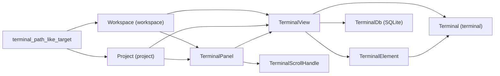
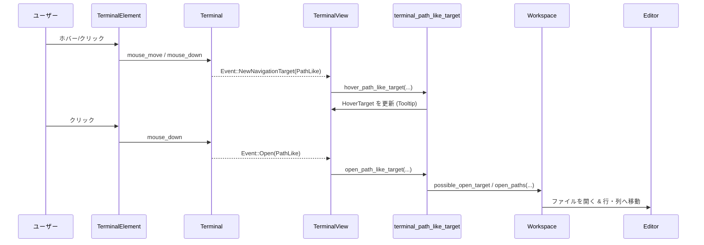

# terminal_view ディレクトリ解説

## 1. ざっくり一言

Zed の `terminal` モデル（Alacritty ベースのターミナル）を GPUI 上のビュー／パネルとして統合し、  
レイアウト・永続化・パスリンク・スクロールバー・タスク実行などを扱うクレートです。

---

## 2. このモジュールの役割

### 2.1 概要

- このクレートは **`terminal` クレートの `Terminal` モデル** を、Zed の **`workspace` / `project` / `ui` インフラストラクチャに統合する** ために存在します。
- 主な役割は次のとおりです。
  - エディタのアイテムとして振る舞う `TerminalView` の実装
  - ワークスペース下部や左右に停泊する `TerminalPanel`（ターミナル用ドックパネル）
  - 実際の描画・入力処理を行う `TerminalElement`（GPUI Element 実装）
  - パネルレイアウトと各ターミナルの **作業ディレクトリ／カスタムタイトルの DB 永続化**
  - ターミナル出力中の **パス風文字列のホバー／クリックでファイルやディレクトリを開く機能**
  - ターミナル専用スクロールバー（`TerminalScrollHandle`）の提供

README に書かれているとおり、Alacritty/PTY とのやりとり自体は別クレート（`terminal`）側にあり、  
このクレートは「それを GPUI/Workspace に組み込む側」です。

### 2.2 アーキテクチャ内での位置づけ

このクレート内の主要コンポーネントと、外部クレートとの関係を簡略化して示します。



- `Terminal`（`terminal` クレート）は **PTY と ANSI/Alacritty グリッド** を管理するモデルです。
- `TerminalView` は Workspace の `Item` として振る舞う UI モデルで、`Terminal` と GPUI/Workspace を橋渡しします。
- `TerminalElement` は GPUI の `Element` 実装で、`Terminal` のグリッドを実際に描画しマウス／IME入力を処理します。
- `TerminalPanel` は Workspace の `Panel` 実装で、複数ターミナル・スプリット・タブバー・ドック位置等を管理します。
- `TerminalDb` は SQLite（WorkspaceDb 上）にターミナルごとのメタ情報を保存します。
- `terminal_path_like_target` は `Terminal` から通知される「パスらしき文字列」を Workspace/Project に解決します。
- `TerminalScrollHandle` はターミナルのスクロール位置と GPUI のスクロールバー API を接続します。

### 2.3 設計上のポイント

コードから読み取れる主な設計方針を列挙します。

- **責務分割**
  - モデル (`Terminal`)、ビュー／アイテム (`TerminalView`)、描画要素 (`TerminalElement`)、パネル (`TerminalPanel`)、永続化 (`persistence.rs`) が分離されています。
  - ターミナル出力中のパス解決は `terminal_path_like_target.rs` に切り出され、テストしやすい純粋ロジックになっています。
- **状態管理**
  - `TerminalView` は `Entity<Terminal>` を保持し、`Workspace` / `Project` への参照は `WeakEntity` で循環参照を避けています。
  - カーソル点滅は独立した `BlinkManager` エンティティに委譲されます。
  - スクロール位置は `Terminal` 本体の `display_offset` に加えて、カーソル下のブロック表示用に `scroll_top` を追加管理します。
- **非同期処理**
  - ターミナルの生成／クローン、パス解決のためのファイルシステムアクセス、DB 書き込みなどは `Task` / `AsyncWindowContext` で非同期に行います。
  - パネルのレイアウト永続化は 50ms のディレイを入れてバッチングしています。
- **永続化の方針**
  - パネルのスプリット構成（`PaneGroup`）は独自シリアライズ型（`SerializedPaneGroup`）で JSON に保存されます。
  - 各ターミナルの **作業ディレクトリ** と **カスタムタイトル** は `TerminalDb` の `terminals` テーブルに保存されます。
  - 実行中のタスクに紐づくターミナルは復元対象から除外されています（再実行やログ収集が前提でないため）。
- **入力・アクセシビリティ**
  - キー入力は `Terminal::try_keystroke` に統一的に渡され、IME からの文字入力は `TerminalView::commit_text` に直送されます。
  - `KeyContext` にターミナルの各種モード（ALT_SCREEN / vi モード / DECCKM など）を埋め込み、キーバインド側で条件分岐できるようになっています。
- **描画最適化**
  - `TerminalElement::layout_grid` でセルをスタイル単位にまとめた `BatchedTextRun` に変換し、1セルずつではなくラン単位で描画します。
  - 背景矩形は `BackgroundRegion` をマージすることで描画矩形数を減らしています。
  - `window.content_mask()` との交差を使い、「ビュー外にある行は描画しない」最適化が入っています。

---

## 3. 主要な機能一覧

このクレートが提供する主な機能を列挙します。

- ターミナルビュー (`TerminalView`)
  - GPUI 上でのターミナル表示・入力処理
  - Workspace の `Item` / `SerializableItem` / `SearchableItem` としての統合
  - ターミナルタブのタイトル編集・ベル表示・検索ハイライト
- ターミナルパネル (`TerminalPanel`)
  - ドックパネルとしてのターミナル表示（Bottom/Left/Right）
  - PaneGroup によるスプリット（Split Up/Down/Left/Right）
  - タスク用ターミナルの生成・再利用／置き換え (`SpawnInTerminal`)
  - アイテム移動・Pane 間移動／スワップ・ズーム（pane の拡大）
- ターミナル描画 (`TerminalElement`)
  - Alacritty のセルグリッドを GPUI テキスト・矩形に変換して描画
  - マウス操作（選択、ドラッグ、ホイール、マウスモード）の `Terminal` への橋渡し
  - ハイライト（検索・選択）とカーソル描画、IME の候補文字列表示
- パス風ターゲットのホバー／オープン (`terminal_path_like_target`)
  - ターミナル出力中の `foo/bar.rs:10` や `a/b/file.txt` などの文字列を解析
  - Worktree（Project 内のツリー）や実ファイルシステムを探索して対象ファイル／ディレクトリを特定
  - 見つかったパスを Tooltip として表示し、クリックで Editor/Project panel を開く
- スクロールバー連携 (`TerminalScrollHandle`)
  - `Terminal` の `total_lines` / `viewport_lines` / `display_offset` からスクロール可能範囲を計算
  - GPUI の `ScrollableHandle` を実装し、`WithScrollbar` と統合
- 永続化 (`persistence.rs`, `TerminalDb`)
  - パネルの Pane 構成（スプリットツリー、アクティブPane、ピン留め数など）の JSON 永続化
  - 各ターミナルの作業ディレクトリとカスタムタイトルを SQLite テーブル `terminals` に保存・復元
  - Workspace ID 変更時の `WorkspaceId` 更新処理

---

## 4. 関数・構造体の解説

### 4.1 主な型一覧

| 名前 | 種別 | 主な役割 |
|------|------|----------|
| `TerminalView` | 構造体 | 単一ターミナルのビュー。Workspace の `Item` / `SerializableItem` / `SearchableItem` を実装し、`Terminal` モデルを UI にマッピングします。 |
| `TerminalPanel` | 構造体 | ターミナル用ドックパネル。複数 `Pane` を束ねた `PaneGroup` としてスプリット・ズーム・タスクターミナル管理を行います。 |
| `TerminalElement` | 構造体 | GPUI の `Element` 実装。セルグリッド描画・マウス入力・IME 連携などの低レベル描画処理を担当します。 |
| `LayoutState` | 構造体 | `TerminalElement` の `prepaint` で算出される、描画に必要な状態（ヒットボックス、バッチ化テキスト、背景矩形、カーソル情報など）を保持します。 |
| `BatchedTextRun` | 構造体 | 同一スタイルのセルを連結したテキストラン。1 セルずつでなくラン単位で描画するためのバッファです。 |
| `BackgroundRegion` | 構造体 | 同色の背景を持つ連続セル領域（複数行にまたがる場合もあり）を表現し、矩形描画を最小化します。 |
| `TerminalScrollHandle` | 構造体 | `ScrollableHandle` 実装。ターミナルのスクロール位置と GPUI のスクロールバーとの橋渡しを行います。 |
| `SerializedTerminalPanel` | 構造体 | パネル全体の永続化用データ。`SerializedItems`（スプリット無し or スプリット有り）を保持します。 |
| `SerializedPaneGroup` | enum | `PaneGroup` の再帰構造を Axis / Pane に分けて表現するシリアライズ用型です。 |
| `SerializedPane` | 構造体 | 単一 Pane 内のターミナル Item ID 群とアクティブ状態・ピン留め数を表します。 |
| `SerializedAxis` | newtype | `Axis`（Horizontal/Vertical） を `"horizontal"` / `"vertical"` という文字列でシリアライズするためのラッパーです。 |
| `TerminalDb` | 構造体 | SQLite バックエンドへの接続ラッパー。ターミナルの作業ディレクトリ／カスタムタイトルを保存・取得します。 |
| `TerminalMode` | enum | `Standalone`（従来のスクロール可能ビュー）と `Embedded`（インライン表示）を切り替えるモードです。 |
| `ContentMode` | enum | 現在の表示モードを `Scrollable` / `Inline { displayed_lines, total_lines }` のどちらかで表します。 |
| `HoverTarget` | 構造体 | 現在ホバー中の要素（Tooltip 文字列と `HoveredWord`）を表し、URL やパス風文字列の Tooltip に利用します。 |
| `OpenTarget` | enum（`terminal_path_like_target.rs`） | Worktree 内エントリ or ファイルシステム上のパスのどちらで見つかったかを保持します。 |

### 4.2 代表的な関数・メソッド

#### `TerminalView::new(terminal, workspace, workspace_id, project, window, cx) -> Self`

**概要**

- `Terminal` エンティティを受け取り、Workspace/Project への参照やフォーカスハンドル、スクロールハンドル、イベント購読などを初期化して `TerminalView` を生成します。

**引数（主なもの）**

| 引数名 | 型 | 説明 |
|--------|----|------|
| `terminal` | `Entity<Terminal>` | 表示対象となるターミナルモデル |
| `workspace` | `WeakEntity<Workspace>` | 所属する Workspace への弱参照 |
| `workspace_id` | `Option<WorkspaceId>` | 永続化用の Workspace ID（無い場合もあり） |
| `project` | `WeakEntity<Project>` | 所属する Project への弱参照 |
| `window` | `&mut Window` | GPUI ウィンドウコンテキスト |
| `cx` | `&mut Context<Self>` | `TerminalView` 用のコンテキスト |

**戻り値**

- 初期化された `TerminalView` インスタンス。

**内部処理の流れ**

- `subscribe_for_terminal_events` で `Terminal` からの `Event`（Wakeup, Bell, Open, NewNavigationTarget 等）購読を開始します。
- `focus_handle` を作成し、フォーカス IN/OUT 時のハンドラを登録します。
- `TerminalScrollHandle::new` でスクロールハンドルを初期化します。
- `BlinkManager` を生成し、カーソル点滅の管理をセットアップします。
- 設定 (`TerminalSettings` / `SettingsStore`) の変更監視を登録し、カーソル形状・ブレッドクラム表示などを初期状態に反映します。

**使用例**

```rust
// Workspace / Project / Terminal をすでに持っている前提の簡略例
fn create_terminal_view(
    workspace: &Workspace,
    project: &Entity<Project>,
    window: &mut Window,
    cx: &mut gpui::Context<Workspace>,
) -> Entity<terminal_view::TerminalView> {
    // ターミナルモデルを Project から生成する
    let terminal = project
        .update(cx, |project, cx| project.create_terminal_shell(None, cx))
        .expect("terminal creation task")
        .detach(); // 実コードでは .await が必要な箇所ですが、ここでは簡略化

    // View 自体は `cx.new` で生成される
    cx.new(|cx| {
        terminal_view::TerminalView::new(
            terminal,                       // Terminal モデル
            workspace.weak_handle(),        // Workspace への WeakEntity
            workspace.database_id(),        // WorkspaceId（あれば）
            project.downgrade(),            // Project への WeakEntity
            window,
            cx,
        )
    })
}
```

**Edge cases**

- `workspace` や `project` は `WeakEntity` なので、のちに `upgrade()` に失敗する可能性があります。その場合は `update` 呼び出しが `Err` を返し、関連処理はスキップされます。
- `workspace_id` が `None` の場合、そのターミナルは DB 永続化の対象になりません。

**使用上の注意点**

- `TerminalView::new` の呼び出しは必ず GPUI の `Context` の中で行う必要があります（`cx.new` を通す）。
- `Terminal` を `Project` から生成する場合は非同期 (`Task`) になるため、実際のアプリコードでは `.await` を含む非同期フローで扱います。

---

#### `TerminalView::content_mode(&self, window: &Window, cx: &App) -> ContentMode`

**概要**

- 現在のターミナル表示を **スクロール可能なビュー** として扱うか、あるいは **インライン行数制限付き表示** として扱うかを決定します。

**内部処理のポイント**

- `self.mode` が:
  - `TerminalMode::Standalone` の場合: 常に `ContentMode::Scrollable`。
  - `TerminalMode::Embedded` の場合:
    - `total_lines > MAX_EMBEDDED_LINES (1000)` のときは `Scrollable`
    - それ以外は `Inline { displayed_lines, total_lines }` とし、未フォーカス時には `max_lines_when_unfocused` で行数を制限します。

**Edge cases**

- 大量の出力（1000 行超）の場合は、自動的に `Scrollable` にフォールバックするため、インラインでの全行表示は行われません。
- `max_lines_when_unfocused` が `None` の場合は、フォーカスの有無にかかわらず `total_lines` をそのまま表示します。

**使用上の注意点**

- 埋め込み用のターミナル（例: エージェントパネル内）で「行数を抑えたい」ときは、`set_embedded_mode(Some(n), cx)` を呼び出してから `render` を行う必要があります。

---

#### `impl Render for TerminalView::render(&mut self, window, cx)`

**概要**

- `TerminalView` を GPUI の Element ツリーとして構築し、`TerminalElement` + スクロールバー + コンテキストメニューを配置します。

**処理の流れ（要約）**

1. `scroll_handle.update(self.terminal.read(cx))` でスクロール状態を更新。
2. `future_display_offset` がセットされていれば、`Terminal` の `display_offset` を変更（`scroll_up_by` / `scroll_down_by`）します。
3. `div().id("terminal-view")` を起点に、各種 `on_action` ハンドラ（コピー／ペースト／スクロール／クリア／vi モード切替／タスク再実行／リネームなど）を登録。
4. 子要素として `TerminalElement::new(...)` を配置し、`content_mode.is_scrollable()` のときは `custom_scrollbars(..., tracked_scroll_handle(&self.scroll_handle))` を付加。
5. 右クリックコンテキストメニューが開いていれば、`anchored` + `deferred` でオーバーレイとして描画。

**使用例（簡略）**

```rust
impl Render for TerminalView {
    fn render(&mut self, window: &mut Window, cx: &mut Context<Self>) -> impl IntoElement {
        // 実装はファイル内の通りですが、利用側は Workspace 側で
        // Pane / Panel にこの Render を委譲するだけです。
        // 直接呼ぶことは通常ありません。
        // （ここでは説明のみ）
        unimplemented!()
    }
}
```

**使用上の注意点**

- `render` の中でスクロール位置の更新や `Terminal` へのスクロール指示を行っているため、スクロール制御を外から直接いじる必要はありません。
- ターミナルの描画性能に関わるため、`TerminalElement` 側の最適化（バッチ描画・ビューポートクリッピング）を前提に設計されています。

---

#### `TerminalPanel::add_center_terminal(workspace, window, cx, create_terminal) -> Task<Result<WeakEntity<Terminal>>>`

**概要**

- アクティブな Workspace の **センターペイン** に、新しいターミナルを追加するヘルパーです。
- `create_terminal` クロージャで `Project` から `Terminal` を生成し、その結果を `TerminalView` としてセンターペインに追加します。

**引数（重要なもの）**

| 引数名 | 型 | 説明 |
|--------|----|------|
| `workspace` | `&mut Workspace` | 対象 Workspace |
| `create_terminal` | `impl FnOnce(&mut Project, &mut Context<Project>) -> Task<Result<Entity<Terminal>>>> + 'static` | `Project` から `Terminal` を生成するクロージャ |

**戻り値**

- `Task<Result<WeakEntity<Terminal>>>` — 生成された `Terminal` への弱参照を返す非同期タスク。

**内部処理の流れ**

- `is_enabled_in_workspace` を使ってターミナルが有効か（ローカル or 対応プロジェクトか）を確認し、無効なら `Err` を即座に返します。
- `project.downgrade()` を取得し、`cx.spawn_in(window, ...)` でバックグラウンドタスクを起動。
- タスク内で `project.update(cx, create_terminal)?.await?` として `Terminal` を生成。
- `workspace.update_in(cx, |workspace, window, cx| { ... })` 内で `TerminalView::new(...)` を作成し、`workspace.add_item_to_active_pane(...)` でセンターに追加します。

**使用例**

```rust
// Workspace アクションから、新しいセンターターミナルを開く例
TerminalPanel::add_center_terminal(workspace, window, cx, |project, cx| {
    // 設定に応じてローカル or シェルターミナルを生成
    project.create_terminal_shell(None, cx)
})
.detach_and_log_err(cx); // 戻り値 Task は fire-and-forget も可能
```

**使用上の注意点**

- この関数自体は `TerminalPanel` のメソッドですが、`&mut Workspace` を受け取る静的メソッドとして公開されているため、Workspace から直接呼ぶ設計になっています。
- ローカルプロジェクト以外では `Err("terminal not yet supported for remote projects")` となる場合があります。

---

#### `TerminalPanel::add_terminal_shell_internal(force_local, cwd, reveal_strategy, window, cx) -> Task<Result<WeakEntity<Terminal>>>`

**概要**

- TerminalPanel のアクティブペインに、ターミナルシェルを新規追加する内部ヘルパーです。
- `force_local` によりローカルシェルを強制するか、Project 設定に従うかを切り替えます。

**内部処理のポイント**

- Workspace がターミナルをサポートしない場合（コラボ中のゲストなど）はその場で `Err` を返します。
- `pending_terminals_to_add` カウンタをインクリメントし、追加完了後にデクリメントします。
- `Project::create_local_terminal` または `Project::create_terminal_shell(cwd, cx)` を非同期に呼び出します。
- 成功時:
  - Workspace にパネルを開く／フォーカスするかどうかを `RevealStrategy`（Always/NoFocus/Never）で制御します。
  - アクティブペインに `TerminalView` を追加し、`pending_terminals_to_add` を更新してから `serialize()` を呼びます。
- 失敗時:
  - `FailedToSpawnTerminal` という専用 `Item` をペインに追加し、ユーザーにエラー内容と設定編集 UI を提示します。

**Edge cases**

- `force_local` が `true` でも、Project 側がローカルターミナルをサポートしていない場合はエラーになります。
- `RevealStrategy::Never` の場合、パネルは開かれずターミナルタブのみ追加されます。

---

#### `deserialize_terminal_panel(workspace, project, database_id, serialized_panel, window, cx) -> Task<Result<Entity<TerminalPanel>>>`

**概要**

- JSON から復元された `SerializedTerminalPanel` を元に、`TerminalPanel` エンティティとその内部の PaneGroup / TerminalView 群を復元する関数です。

**引数（主なもの）**

| 引数名 | 型 | 説明 |
|--------|----|------|
| `workspace` | `WeakEntity<Workspace>` | 対象 Workspace への弱参照 |
| `project` | `Entity<Project>` | 対象 Project |
| `database_id` | `WorkspaceId` | 永続化に利用した Workspace ID |
| `serialized_panel` | `SerializedTerminalPanel` | JSON から読み込んだパネル状態 |
| `window` | `&mut Window` | ウィンドウコンテキスト |
| `cx` | `&mut App` | アプリケーションコンテキスト |

**戻り値**

- `Task<anyhow::Result<Entity<TerminalPanel>>>` — 復元された `TerminalPanel` エンティティ。

**内部処理の流れ（概要）**

- まず `TerminalPanel::new(workspace, window, cx)` で空のパネルを作成。
- `serialized_panel.items` が:
  - `SerializedItems::NoSplits(Vec<u64>)` の場合:
    - `deserialize_terminal_views` で各 Item ID から `TerminalView` を復元し、`active_pane` に追加。
  - `SerializedItems::WithSplits(SerializedPaneGroup)` の場合:
    - 再帰関数 `deserialize_pane_group` により `PaneGroup` ツリーを構築。
    - 各 Pane ごとに `deserialize_terminal_views` でターミナルを復元し、必要に応じて空 Pane には新規ターミナルを生成して追加。
- 最終的に `terminal_panel.center` と `terminal_panel.active_pane` を更新し、`Ok(terminal_panel)` を返します。

**Edge cases**

- 復元対象となるターミナルが一つもない場合、スプリット構成をスキップし `None` を返す分岐があります。
- ある Pane が復元後にアイテム数 0 の場合、空白のスプリットができないようにワーキングディレクトリ付きの新しい `TerminalView` を生成して追加します。

---

#### `possible_open_target(workspace, path_like_target, cx, ...) -> Task<Option<OpenTarget>>`（`terminal_path_like_target.rs`）

**概要**

- ターミナルから渡された「パスっぽい文字列」（例: `"main.rs"`, `"a/foo/bar.txt"`, `"~/tmp/log"`）を、
  - Workspace に紐づく **Worktree 内のエントリ** か、
  - ローカルファイルシステム上の **実際のファイル／ディレクトリ**
  
  に解決し、`OpenTarget` として返します。

**処理の流れ（簡略）**

1. `workspace.upgrade()` に失敗した場合は即座に `Task::ready(None)`。
2. `maybe_path` から `PathWithPosition`（行・列情報付きパス）を生成し、以下の候補リストを作成:
   - 元の文字列そのまま
   - `a/`, `b/`, `./` などの Git diff 由来のプレフィックスを取り除いたパス
   - 行・列情報付きと無しの両方
3. Workspace の Worktree を **「ターミナルの cwd に近い順」** にソートし、各候補パスについて:
   - Worktree ルートと一致する場合は `root_entry` を使って `OpenTarget::Worktree` を即決。
   - それ以外の場合は、cwd からの相対パスと元パスの両方を `entry_for_path` で探索。
4. ここまでで `open_target` が見つかれば保持しておく。
5. ローカルプロジェクトかどうかなどの条件に応じて「ファイルシステム背景チェック」を行う:
   - `cwd` + 候補パス
   - `~` 展開したホームディレクトリ
   - 各 Worktree ルート + 相対パス
   の組み合わせについて、`fs.canonicalize` + `fs.metadata` で存在チェック。
   - 見つかれば `OpenTarget::File` として返す。
6. それでも見つからない場合、最後の手段として Worktree 全体を traverse し、
   - `entry.path.ends_with(候補パス)` となるエントリを探して `OpenTarget::Worktree` として返す。

**Edge cases**

- リモートプロジェクト（実ファイルシステムが使えない）では **背景 FS チェックは無効** になり、Worktree だけで解決を試みます。
- Worktree が「単一ファイル」の場合（単一ファイルプロジェクト）、ルートエントリはファイルとして扱われます。
- テストでは多数のケース（兄弟ディレクトリ、入れ子構造、Git diff パス、`./` や `..` を含むパスなど）が検証されています。

**使用上の注意点**

- 位置情報（行・列）は `PathWithPosition` に保存され、ファイルオープン後に `Editor::go_to_singleton_buffer_point` でカーソル移動に利用されます。
- 実際の呼び出しは `TerminalView` 側のイベントハンドラ（`Event::NewNavigationTarget` / `Event::Open`）から行われるため、直接この関数を呼ぶ必要は通常ありません。

---

### 4.3 その他の主な関数・メソッド一覧

| 関数名 / メソッド | 役割（1 行） |
|-------------------|--------------|
| `TerminalView::deploy` | Workspace アクション `NewCenterTerminal` を処理し、センターペインにターミナルを開きます。 |
| `TerminalView::scroll_wheel` | マウスホイールイベントを `Terminal` か `scroll_top` に反映します（カーソル下ブロックの有無で挙動が変わります）。 |
| `TerminalView::should_show_cursor` | フォーカス状態・ALT_SCREEN・点滅設定に応じてカーソルを表示するかどうかを判定します。 |
| `TerminalView::serialize`（`SerializableItem` 実装） | `TerminalDb` に作業ディレクトリとカスタムタイトルを保存する `Task` を生成します。 |
| `TerminalScrollHandle::set_offset` | スクロールバーからのオフセットを `display_offset` 相当の値（行数）に変換し、`future_display_offset` に保存します。 |
| `TerminalElement::layout_grid` | `IndexedCell` のイテレータから背景矩形と `BatchedTextRun` を構築し、ログを出力します。 |
| `subscribe_for_terminal_events` | `Terminal` のイベントを購読し、`TerminalView` の状態（ベル、ブレッドクラム、マッチ、HoverTarget など）を更新します。 |

---

## 5. データフロー

### 5.1 代表シナリオ: ターミナル出力中のパスをクリックしてエディタを開く

このフローでは、ターミナル出力中のパス風文字列（例: `src/main.rs:10`）にマウスを乗せて Tooltip を表示し、その後クリックしてファイルを開きます。

1. ユーザーがターミナル上のテキストをホバー／クリックします。
2. `TerminalElement` が `mouse_move` / `mouse_down` イベントを受け取り、`Terminal` に転送します。
3. `Terminal` は内部ロジックでカーソル下の単語を解析し、URL なら `MaybeNavigationTarget::Url`、パス風なら `MaybeNavigationTarget::PathLike` として `Event::NewNavigationTarget` を発火します。
4. `TerminalView` のイベント購読（`subscribe_for_terminal_events`）がこのイベントを受け取り、`hover_path_like_target` を呼び出して Tooltip 文字列を非同期で計算します。
5. 同じくクリック時には `Event::Open`（Url or PathLike）が発火し、`open_path_like_target` から `possible_open_target` を呼び出して対象パスを解決します。
6. 見つかったパスがファイルであれば Workspace の `open_paths` でエディタを開き、行・列情報があればそこへジャンプします。ディレクトリなら Project パネルをアクティブにします。

Mermaid のシーケンス図で表すと以下のようになります。



---

## 6. 使い方（How to Use）

### 6.1 基本的な使用方法

#### 6.1.1 アプリ起動時にターミナル機能を有効化する

`terminal_view::init` を呼ぶことで、Workspace へのパネル登録や `TerminalView::deploy` のアクション登録が行われます。

```rust
use gpui::App;
use terminal_view;

fn init_app(cx: &mut App) {
    // ターミナルパネル・TerminalView を Workspace に統合
    terminal_view::init(cx);
}
```

#### 6.1.2 センターペインにターミナルを開く（`NewCenterTerminal`）

Workspace コンテキストから `TerminalView::deploy` を呼ぶか、対応するアクションを dispatch します。

```rust
use workspace::{Workspace, NewCenterTerminal};
use gpui::{Context, Window};

fn open_center_terminal(
    workspace: &mut Workspace,
    window: &mut Window,
    cx: &mut Context<Workspace>,
) {
    // 現在のプロジェクトディレクトリ or 設定に応じたディレクトリをワーキングディレクトリにする
    TerminalView::deploy(
        workspace,
        &NewCenterTerminal { local: false }, // true でローカルシェル
        window,
        cx,
    );
}
```

#### 6.1.3 パネルにターミナルを開く（`workspace::NewTerminal`）

ターミナルパネルが有効になっている場合、`workspace::NewTerminal` アクションでパネル側にターミナルを追加できます。

```rust
use workspace::{Workspace, NewTerminal};

fn open_panel_terminal(
    workspace: &mut Workspace,
    window: &mut Window,
    cx: &mut Context<Workspace>,
) {
    // NewTerminal は TerminalPanel::new_terminal 内で処理される
    workspace.dispatch_action(&NewTerminal::default(), window, cx);
}
```

### 6.2 よくある使用パターン

#### 6.2.1 ターミナルを埋め込み表示にする（エージェントパネルなど）

`TerminalView` を他のビュー内にインラインで埋め込み、スクロールではなく行数制限をかけて表示する場合は `set_embedded_mode` を使います。

```rust
use terminal_view::{TerminalView, TerminalMode};
use terminal::Terminal;
use gpui::{Window, Context};

fn embed_terminal(
    terminal: gpui::Entity<Terminal>,
    workspace: gpui::WeakEntity<workspace::Workspace>,
    project: gpui::WeakEntity<project::Project>,
    window: &mut Window,
    cx: &mut Context<SomeParentView>,
) -> gpui::Entity<TerminalView> {
    cx.new(|cx| {
        let mut view = TerminalView::new(
            terminal,
            workspace,
            None,
            project,
            window,
            cx,
        );
        // フォーカスが外れているときは最大 20 行だけ表示する
        view.set_embedded_mode(Some(20), cx);
        view
    })
}
```

#### 6.2.2 タスクをターミナルで実行する（`SpawnInTerminal`）

`Workspace` には `TerminalProvider` がセットされており、`SpawnInTerminal` を使ってタスクをターミナルで実行できます。

```rust
use task::{SpawnInTerminal, Shell};
use workspace::Workspace;
use gpui::{Window, App};

fn spawn_task_in_terminal(
    workspace: &Workspace,
    window: &mut Window,
    cx: &mut App,
) {
    let task = SpawnInTerminal {
        // 実行したいコマンド
        command: Some("cargo test".to_string()),
        shell: Shell::System,
        ..Default::default()
    };

    // TerminalProvider が TerminalPanel 経由でターミナルを用意し実行する
    workspace.spawn_in_terminal(task, window, cx);
}
```

#### 6.2.3 ドラッグ＆ドロップでファイルパスをターミナルに書き込む

`TerminalView::handle_drop` は、エクスプローラからのパスやタブ・選択項目のドラッグ＆ドロップを受け付け、パス文字列をターミナルに貼り付けます。

```rust
// 実際には Pane / Item の実装から呼び出されるため、利用者側が直接呼ぶことは少ないですが、
// 振る舞いとしては次のようになります:
//
// - ExternalPaths: ローカルプロジェクトであれば、そのパスを `' /path/to/file'` の形で paste
// - DraggedTab: タブに対応するファイルのパスを paste
// - DraggedSelection / ProjectEntryId: 選択中の複数ファイルのパスを paste
```

### 6.3 使用上の注意点（まとめ）

- **ローカル／リモートプロジェクト**
  - ターミナル機能全体 (`is_enabled_in_workspace`) は Project が `supports_terminal` を返す場合のみ有効です。
  - パス解決のファイルシステムチェックはローカルプロジェクトのみ有効です（リモートでは Worktree 情報のみ使用）。
- **永続化**
  - 実行中のタスクに紐づくターミナルはパネル・DB ともに「永続化対象外」です。再起動後に同じタスクのターミナルが復元されることはありません。
  - `TerminalView::serialize` は `needs_serialize` フラグが立っている場合にのみ DB 書き込みを行います。作業ディレクトリやカスタムタイトルを変更した直後にのみフラグが立ちます。
- **スクロール**
  - `TerminalScrollHandle` によるスクロールは `content_mode.is_scrollable()` のときのみ有効です。Embedded モードではスクロールバーは表示されません。
  - `scroll_top` は「カーソルの下にブロック UI を表示するためのローカルスクロール」として使われており、`Terminal` の `display_offset` とは別の概念です。
- **IME / 文字入力**
  - IME の「確定前テキスト」はターミナル上の文字とは別に描画されます（背景でターミナルテキストを隠す処理あり）。
  - `replace_text_in_range` などの IME コールバックは `TerminalView::commit_text` / `set_marked_text` / `clear_marked_text` を通じてターミナルと同期されます。
- **キーコンテキスト**
  - `dispatch_context` により、ターミナルのモード（ALT_SCREEN、vi モード、DECPAM など）に応じたキーバインド条件が付与されます。  
    キーマップ定義側で `"screen=alt"` や `"vi_mode"` などの条件を利用できます。

---

## 7. 関連ファイル

このクレート内のファイルと役割をまとめます。

| パス | 役割 / 関係 |
|------|------------|
| `terminal_view/Cargo.toml` | クレートメタデータと依存関係の定義。`terminal`, `workspace`, `project`, `gpui` など多数のワークスペースクレートに依存します。 |
| `terminal_view/README.md` | 設計メモ。Alacritty/PTY とのやりとり（`terminal` クレート側）と GPUI 統合（本クレート側）の二分構造や、入力経路（try_keystroke / input / IME / paste）の整理が記載されています。 |
| `terminal_view/scripts/print256color.sh` | 端末の 256 色表示を確認するためのテストスクリプト。ターミナルのカラーマッピング調整に利用できます。 |
| `terminal_view/scripts/truecolor.sh` | TrueColor 対応を確認するためのグラデーション表示スクリプト。 |
| `terminal_view/src/terminal_view.rs` | クレートのエントリポイント兼ライブラリ本体。`TerminalView` の定義、`init` 関数、`SerializableItem` / `SearchableItem` 実装、`default_working_directory` などを含みます。 |
| `terminal_view/src/terminal_element.rs` | `TerminalElement` の実装。ターミナルグリッド描画、背景矩形マージ、IME・マウスイベント処理など描画周りのロジックが集約されています。 |
| `terminal_view/src/terminal_panel.rs` | `TerminalPanel` の実装。パネル位置・サイズ・スプリット・タスク連携・アクション登録など、ターミナルのドック UI の中枢です。 |
| `terminal_view/src/persistence.rs` | パネルのスプリット構成とターミナルメタ情報（作業ディレクトリ・カスタムタイトル）の永続化ロジック。`TerminalDb` を含みます。 |
| `terminal_view/src/terminal_path_like_target.rs` | ターミナル出力中のパス風文字列の解析・解決・オープン処理のロジックと、その包括的なテスト群。 |
| `terminal_view/src/terminal_scrollbar.rs` | `TerminalScrollHandle` の定義。`ScrollableHandle` 実装を通じて GPUI のカスタムスクロールバーと連携します。 |

このクレートは Zed 全体のターミナル体験の UI 部分を担っているため、  
内部実装を理解すると「ターミナルの振る舞いをどこで拡張／変更すべきか」が把握しやすくなります。
