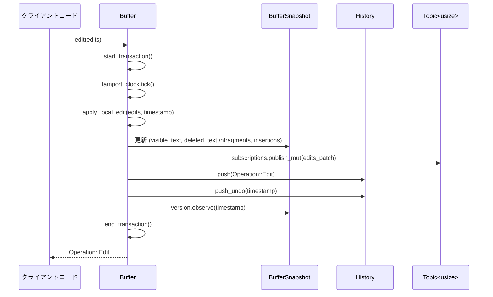

# C:\Drive\rust\zed-local\crates\text 解説

## 0. ざっくり一言

協調編集や高度な undo/redo に対応したテキストバッファを提供するクレートです。  
文字列本体だけでなく、フラグメント・アンカー・バージョン情報などを管理し、部分差分の取得やリモート操作の適用ができるようになっています。

---

## 1. このモジュールの役割

### 1.1 概要

- このクレートは、**テキスト編集状態を CRDT 的に保持するバッファ**を実装しています。
- 主な機能は次の通りです。
  - ローカル編集とリモート編集（`Operation`）の適用
  - Lamport 時計を用いた因果関係付きバージョン管理
  - undo/redo と、それに伴う「可視/不可視フラグメント」の管理
  - アンカー（`Anchor`）による編集耐性の高い位置表現
  - 差分（`Edit` / `Patch`）や購読（`Subscription`）による増分配信

### 1.2 アーキテクチャ内での位置づけ

モジュール同士の依存関係（簡略版）は次の通りです。

```mermaid
graph TD
    subgraph text crate
        Text[text.rs<br/>Buffer/BufferSnapshot 他]
        AnchorMod[anchor.rs<br/>Anchor/拡張]
        LocatorMod[locator.rs<br/>Locator]
        PatchMod[patch.rs<br/>Patch/Edit]
        SelMod[selection.rs<br/>Selection]
        SubMod[subscription.rs<br/>Topic/Subscription]
        OpQueueMod[operation_queue.rs<br/>OperationQueue]
        UndoMapMod[undo_map.rs<br/>UndoMap]
        NetMod[network.rs<br/>Network (テスト用)]
    end

    Text --> AnchorMod
    Text --> LocatorMod
    Text --> PatchMod
    Text --> SelMod
    Text --> SubMod
    Text --> OpQueueMod
    Text --> UndoMapMod
    Text --> NetMod

    AnchorMod --> Text
    LocatorMod --> Text
    SubMod --> PatchMod
    OpQueueMod --> Text
```

- `text.rs` が中心で、`Buffer` / `BufferSnapshot` / `Operation` など主要型を定義・再エクスポートします。
- `anchor.rs`, `locator.rs` は、フラグメントやアンカーの識別子を提供し、`Buffer` 内部でも利用されます。
- `patch.rs`, `subscription.rs` は、差分の合成や購読のために `Buffer` から利用されます。
- `undo_map.rs`, `operation_queue.rs` は、undo/redo と「未適用操作キュー」を SumTree ベースで管理します。
- `network.rs` はテストあるいは `feature="test-support"` 時のシミュレーション用ネットワークです。

### 1.3 設計上のポイント

コードから読み取れる特徴を挙げます。

- **不変スナップショットとミュータブル本体**
  - `Buffer` は編集 API・履歴・待機中操作など「状態」を持ちます。
  - 実際のテキスト・フラグメント・バージョン情報は `BufferSnapshot` に保持され、`Deref` により `Buffer` からも参照できます。
- **SumTree によるフラグメント管理**
  - `SumTree<Fragment>` を用いて、テキスト断片（長さ・可視/不可視・Lamport 時刻等）を木構造で管理します。
  - `Dimensions` / `Summary` 実装により、オフセットやバージョンに対する検索・集計を効率的に行います。
- **Lamport 時計と CRDT 的統合**
  - `clock::Lamport` / `clock::Global`（ベクター時計ライク）を用いて、操作の因果関係とバージョンを追跡します。
  - ローカル編集（`apply_local_edit`）とリモート編集（`apply_remote_edit`）で、並行挿入・削除を順序付きに統合します。
- **アンカーによる位置表現**
  - `Anchor` は「挿入操作の Lamport 時刻 + オフセット + Bias + BufferId」を持つ、編集に強い位置表現です。
  - `BufferSnapshot` はアンカーから現在のオフセット/行列位置を解決します。
- **UndoMap による undo/redo**
  - `UndoMap` が各 `EditOperation` に対する undo 回数を保管し、`Fragment::is_visible / was_visible` で可視性判定に使用します。
- **差分配信と購読**
  - `Topic<T>` / `Subscription<T>` を用いた簡易 pub/sub により、`Buffer` 内で発生した `Patch<usize>` を購読者へ配信します。
- **テストサポート**
  - `network::Network` や `Buffer::randomly_edit` など、テスト・シミュレーション用の補助機能が多数含まれています。

---

## 2. 主要な機能一覧

このクレート全体が提供する主な機能です。

- テキストバッファ:
  - `Buffer` / `BufferSnapshot`: テキスト本体と履歴・バージョン情報の管理
  - 行・列・UTF‑16 オフセットへの変換 (`Point`, `PointUtf16`, `OffsetUtf16` など)
- 編集操作:
  - ローカル編集の適用（`Buffer::edit`）
  - リモート操作（`Operation`）の適用（`Buffer::apply_ops`）
  - 過去バージョンへのオフセット変換（`BufferSnapshot::offsets_to_version`）
- Undo / Redo:
  - 取引（Transaction）単位の undo・redo・グルーピング（`History` 関連 API）
  - 任意のトランザクション ID に対する undo / redo / forget
- 差分取得・配信:
  - `Edit<D>` 型による「old/new 範囲」の表現
  - `BufferSnapshot::edits_since*` による部分差分の取得
  - `Patch<T>` / `Patch::compose` による差分の合成・座標変換
  - `Topic<T>` / `Subscription<T>` による差分（Patch）の購読
- 位置表現・選択範囲:
  - `Anchor` とアンカー方位（`Bias`）を使った編集耐性の高い位置指定
  - `Selection<T>` による汎用的な選択範囲モデル（アンカーやオフセットで利用可能）
- 操作キュー・ネットワーク:
  - 時刻順に整列された `OperationQueue<T>` （Lamport 時刻キー）
  - テスト用の `Network<T, R>` による遅延・重複・順不同なメッセージ配送のシミュレーション
- UndoMap:
  - 各 edit の undo 回数の保持と、「現在/過去バージョンで undo 済みか」の判定

---

## 4. 関数・構造体の解説

### 4.1 主要な型一覧

外部から直接使われる／理解に重要な型をまとめます。

| 名前 | 種別 | 役割 / 用途 |
|------|------|-------------|
| `Buffer` | 構造体 | 編集 API・履歴・未適用操作・購読など、バッファ全体を表現するメイン型 |
| `BufferSnapshot` | 構造体 | ロープ本体やフラグメント・バージョンを持つ不変ビュー。`Buffer` から参照される |
| `BufferId` | 構造体 | バッファ識別子（`NonZeroU64`）。0 は不可 |
| `Anchor` | 構造体 | Lamport 時刻・オフセット・Bias・BufferId からなるタイムスタンプ付き位置 |
| `Locator` | 構造体 | フラグメントの順序付けに使う ID。`between(lhs, rhs)` で間に挿入可能 |
| `Selection<T>` | 構造体 | 選択範囲。`start`/`end` と `reversed`・`SelectionGoal` を持ち、`T` は Anchor やオフセットなど |
| `SelectionGoal` | enum | キャレットの水平位置保持など、選択に関する「目標」情報 |
| `Edit<D>` | 構造体 | `old: Range<D>` / `new: Range<D>` からなる単一の編集の対応関係 |
| `Patch<T>` | 構造体 | `Vec<Edit<T>>` の薄いラッパー。差分の合成や座標変換用 |
| `Operation` | enum | `EditOperation`（挿入/削除）か `UndoOperation`（undo/redo） |
| `EditOperation` | 構造体 | 1 つの編集操作。Lamport 時刻・バージョン・`ranges: Vec<Range<FullOffset>>`・`new_text` |
| `UndoOperation` | 構造体 | undo 操作。Lamport 時刻・バージョン・`counts: HashMap<edit_id, undo_count>` |
| `OperationQueue<T>` | 構造体 | Lamport 時刻でソートされた操作キュー |
| `UndoMap` | 構造体 | 各 edit の undo 回数を管理する SumTree ラッパー |
| `Topic<T>` | 構造体 | `Patch<T>` 用の pub/sub トピック |
| `Subscription<T>` | 構造体 | `Patch<T>` を蓄積する購読ハンドル |
| `LineEnding` | enum | 行末コード（Unix / Windows）と正規化・検出 |
| `LineIndent` | 構造体 | 行頭インデント（タブ数・スペース数・blank フラグ） |
| `FullOffset` | 構造体 | 可視 + 不可視テキストを合わせたオフセット（挿入レンジ管理用） |
| `Network<T,R>` | 構造体 | テスト用疑似ネットワーク（遅延・重複・順不同配送） |
| `ToOffset`, `ToPoint`, `ToPointUtf16`, `ToOffsetUtf16`, `FromAnchor` | トレイト | Anchor / Point / usize など異なる座標系を相互変換するための統一インターフェース |

`rope::*` からは `Rope`, `Point`, `PointUtf16`, `OffsetUtf16`, `TextSummary`, `Chunks` などが再エクスポートされており、文字列本体と各種座標・集計型を提供します。

---

### 4.2 重要な関数・メソッド詳細（抜粋）

ここでは、特に全体の理解と利用に重要なものに絞って説明します。

#### `Buffer::new(replica_id: ReplicaId, remote_id: BufferId, base_text: impl Into<String>) -> Buffer`

**概要**

- 任意の文字列から新しいバッファを作成します。
- 行末コード（LF / CRLF）を検出して正規化し、内部ロープ（`Rope`）・フラグメントを初期化します。

**引数**

| 引数名 | 型 | 説明 |
|--------|----|------|
| `replica_id` | `ReplicaId` | このバッファが属するレプリカ（ピア）の ID。Lamport 時計の初期値に使用 |
| `remote_id` | `BufferId` | バッファ識別子。`BufferId::new` 経由で 0 でないことが保証される想定 |
| `base_text` | `impl Into<String>` | 初期テキスト。内部で行末正規化されたうえで `Rope` に変換 |

**戻り値**

- 編集可能な `Buffer` インスタンス。

**内部処理の流れ**

1. `base_text` を `String` に変換。
2. `LineEnding::detect` で CRLF/ LF を判定。
3. `LineEnding::normalize` で `\r\n` や `\r` を `\n` に変換。
4. `Rope::from` でロープに変換し、`new_normalized` に渡す。
5. `new_normalized` で:
   - `History::new(base_text)` を作り、`visible_text` を `base_text` で初期化。
   - `MAX_INSERTION_LEN` ごとにチャンクに分割し、各チャンクを `Fragment` として `fragments` / `insertions` に追加。
   - `lamport_clock` と `version` を `ReplicaId::LOCAL` の挿入時刻で観測済みにする。

**Examples（使用例）**

```rust
use text::{Buffer, BufferId, ReplicaId};

fn create_buffer() {
    // BufferId::new(0) は Err になるので 1 以上を渡す
    let buf_id = BufferId::new(1).unwrap();                    // バッファ ID を生成
    let mut buffer = Buffer::new(ReplicaId::LOCAL, buf_id, "hello\nworld"); // 初期テキスト付きで作成

    assert_eq!(buffer.text(), "hello\nworld");                 // 行末は内部的に LF に正規化される
}
```

**Errors / Panics**

- `Buffer::new` 自体は `Result` を返しませんが、呼び出し側で `BufferId::new(0)` を使うと `Err` になります。
- `new_normalized` 内には `assert!` は見当たらないため、通常の使用での panic 条件はコード上からは読み取れません。

**Edge cases（エッジケース）**

- `base_text` が空文字列でも問題なく動作します（`visible_text.is_empty()` の場合はフラグメントを作成しない）。
- `base_text` に CR/LF が混在していても、最初の 1000 文字以内で検出されたパターンに応じて Unix / Windows を選択し、その後正規化されます。

**使用上の注意点**

- 行末コードは内部的に `\n` に正規化されます。元の CRLF/CR を保持したい場合は、外部保存時に `LineEnding` を考慮する必要があります。

---

#### `Buffer::edit<R, I, S, T>(&mut self, edits: R) -> Operation`

**概要**

- 現在のテキストにローカル編集を適用します。
- 複数の `(Range<S>, T)` を一度に適用し、その結果として `Operation::Edit` を返します。

**型パラメータ・制約**

- `R: IntoIterator<IntoIter = I>`
- `I: ExactSizeIterator<Item = (Range<S>, T)>`
- `S: ToOffset` … 範囲指定をオフセットに変換できる型（`usize`, `Point`, `Anchor` など）
- `T: Into<Arc<str>>` … 挿入テキスト

**引数**

| 引数名 | 型 | 説明 |
|--------|----|------|
| `edits` | `R` | `(old_range, new_text)` の列。`old_range` は現在バッファの座標系で指定 |

**戻り値**

- `Operation::Edit(EditOperation)`  
  - `timestamp` … 新しい Lamport 時刻
  - `version` … 編集前の `clock::Global`
  - `ranges` … `FullOffset` ベースの削除レンジ列
  - `new_text` … 挿入テキスト列

**内部処理の流れ（簡略）**

1. `start_transaction()` でトランザクション開始。
2. `lamport_clock.tick()` で新しい Lamport 時刻を得る。
3. `apply_local_edit(edits, timestamp)` で:
   - `ToOffset` によって `Range<S>` → `Range<usize>` に変換。
   - フラグメント列を走査し、編集範囲前後のフラグメントを再利用しつつ、新しい挿入フラグメントを挿入。
   - 削除部分には `visible=false` なフラグメントを作成し、`deletions` に timestamp を追加。
   - `visible_text` / `deleted_text` ロープを `RopeBuilder` で再構築。
   - 各編集を `Patch<usize>`（`edits_patch`）として構成。
4. `history.push(operation.clone())` でヒストリに保存。
5. `history.push_undo(operation.timestamp())` で undo スタックに記録。
6. `snapshot.version.observe(operation.timestamp())` でバージョン更新。
7. `end_transaction()` でトランザクション終了。
8. 生成された `Operation::Edit` を返す。

**Examples（使用例）**

```rust
use std::ops::Range;
use text::{Buffer, BufferId, ReplicaId};

fn basic_edit_example() {
    let buf_id = BufferId::new(1).unwrap();               // バッファ ID
    let mut buffer = Buffer::new(ReplicaId::LOCAL, buf_id, "abc"); // 初期テキスト "abc"

    // 末尾に "def" を追加する (3..3 に挿入)
    let op = buffer.edit([(3..3, "def")]);                // ローカル編集を適用
    assert_eq!(buffer.text(), "abcdef");                  // テキスト更新を確認

    // op はリモートに送るための Operation::Edit として使える
    assert!(op.is_edit());
}
```

**Errors / Panics**

- `apply_local_edit` 内では、フラグメントの整合性に関する多くの `debug_assert!` が使われています。  
  正常な範囲指定（`ToOffset` 経由）であれば、リリースビルドでは問題なく動作する前提です。
- `LineEnding::normalize_arc` により行末は常に `\n` に正規化されます。

**Edge cases**

- `new_text` が空文字列のとき、その範囲は削除として扱われます。
- 複数編集が重なったり隣接する場合でも、`Patch` 側でマージされるように実装されています（`Patch::push`）。

**使用上の注意点**

- `Range<S>` の `S` はバイトオフセット（`usize`）だけでなく `Point` なども使えますが、すべて現在のテキスト状態に対する座標である必要があります。
- 開始・終了オフセットは UTF‑8 の文字境界であることが前提ですが、`ToOffset for usize` は境界外の場合に `floor_char_boundary` で丸め込みます。

---

#### `Buffer::apply_ops<I: IntoIterator<Item = Operation>>(&mut self, ops: I)`

**概要**

- 複数の `Operation`（ローカルまたはリモートから届いた編集/undo 操作）を適用します。
- 必要に応じて「まだ依存バージョンが満たされない操作」を `deferred_ops` に積み、後で再試行します。

**引数**

| 引数名 | 型 | 説明 |
|--------|----|------|
| `ops` | `I` | `Operation::Edit` または `Operation::Undo` の列 |

**戻り値**

- なし（バッファ内部状態を更新）。

**内部処理の流れ**

1. 各 `op` について `history.push(op.clone())` でヒストリに登録。
2. `can_apply_op(&op)` をチェック:
   - 既に `deferred_replicas` に入っているレプリカの操作は一旦 defer。
   - そうでなければ、`version.observed_all(op.version())` かどうかで依存関係を判定。
3. 適用可能なら `apply_op(op)` を呼ぶ:
   - `Operation::Edit` → `apply_remote_edit`
   - `Operation::Undo` → `apply_undo`
   - バージョンと Lamport 時計を更新し、`wait_for_version_txs` / `edit_id_resolvers` を解決。
4. 適用できなかったものは `deferred_replicas` にレプリカ ID を登録し、`deferred_ops.insert(...)` でキューに入れる。
5. 最後に `flush_deferred_ops()` を呼び、依存関係が解消されたものを再適用していく。

**Examples**

```rust
use text::{Buffer, BufferId, ReplicaId, Operation};

fn apply_remote_ops_example() {
    let buf_id = BufferId::new(1).unwrap();
    let mut local = Buffer::new(ReplicaId::new(1), buf_id, "abcdef");
    let mut remote = Buffer::new(ReplicaId::new(2), buf_id, "abcdef");

    // remote 側で 1..2 に "12" を挿入
    let op = remote.edit([(1..2, "12")]);

    // local 側にその Operation を適用
    local.apply_ops([op]);
    assert_eq!(local.text(), remote.text());
}
```

**Errors / Panics**

- `assert!` や `debug_assert!` を除き、明示的な panic 条件はありません。
- 依存バージョンが満たされていない操作は `deferred_ops` に回されるため、その場でエラーにはなりません。

**Edge cases**

- 操作列に同じ `timestamp` の `Operation` が重複して入っていても、`apply_op` 内部のバージョンチェック（`version.observed(..)`）で二重適用は防がれます。
- `UndoOperation` が届いた時点で、対応する `EditOperation` がまだ反映されていない場合は、その操作自体が `deferred_ops` に回される可能性があります。

**使用上の注意点**

- CRDT 的に整合性を保つため、必ず `Operation` の `version` フィールド（`clock::Global`）は「操作生成時点までに観測していたバージョン」をセットしておく必要があります。
- `Buffer::apply_ops` 自体は同期メソッドなので、大量の操作を一度に適用するときは呼び出し側で適切なバッチングが必要です。

---

#### `Buffer::undo(&mut self) -> Option<(TransactionId, Operation)>` および `Buffer::redo(&mut self)`

**概要**

- 直近のトランザクション単位で undo / redo を行います。
- 実際には `UndoOperation` を生成し、`apply_undo` を通じてフラグメントの可視性を更新します。

**引数・戻り値**

- `undo`:
  - 戻り値: `Some((transaction_id, op))` または `None`（undo 可能な履歴がない）。
- `redo`:
  - 同様に `Some((transaction_id, op))` または `None`。

**内部処理の流れ（undo）**

1. `history.pop_undo()` で最後の `HistoryEntry` を取り出し、`redo_stack` に移動。
2. そのトランザクションに含まれる `edit_ids` をもとに、`undo_or_redo(transaction)` を呼び出し。
3. `undo_or_redo` は `UndoOperation` を組み立てて `undo_operations(counts)` を呼び出し。
4. `undo_operations`:
   - 新しい Lamport 時刻を割り当て、現在の `version` を記録。
   - `UndoMap::insert` によって undo 回数を記録。
   - `apply_undo` で各フラグメントの `visible` フラグを更新。
5. 生成された `Operation::Undo` を返す。

redo は `history.pop_redo()` → `undo_or_redo()` で同様に動作します（偶数回の undo で「元に戻す」）。

**Examples**

```rust
use text::{Buffer, BufferId, ReplicaId};

fn undo_redo_example() {
    let buf_id = BufferId::new(1).unwrap();
    let mut buffer = Buffer::new(ReplicaId::LOCAL, buf_id, "1234");
    buffer.set_group_interval(std::time::Duration::from_secs(0)); // トランザクションを個別に扱う

    buffer.edit([(1..1, "ab")]);         // "1ab234"
    buffer.edit([(3..3, "cd")]);         // "1abcd234"
    assert_eq!(buffer.text(), "1abcd234");

    let (_tx_id, undo_op) = buffer.undo().unwrap();
    assert!(matches!(undo_op, text::Operation::Undo(_)));
    assert_eq!(buffer.text(), "1ab234"); // 最後の編集を取り消し

    buffer.redo();
    assert_eq!(buffer.text(), "1abcd234");
}
```

**Edge cases**

- `group_interval` によって複数トランザクションがグループ化されている場合、一度の `undo` でまとめて取り消されます。
- `history.finalize_last_transaction()` を呼び出すと、そのトランザクションはグルーピング対象から除かれます。

**使用上の注意点**

- 編集後に `start_transaction_at` / `end_transaction_at` を明示的に使うことで、トランザクション境界を細かく制御できます。
- `undo` / `redo` が返す `Operation` を他レプリカにブロードキャストすることで、リモート側でも undo/redo を再現できます。

---

#### `BufferSnapshot::anchor_before<T: ToOffset>(&self, position: T) -> Anchor` / `anchor_after`

**概要**

- 現在の内容に対して、指定位置の「前」または「後」にアンカーを張ります。
- アンカーは将来の編集による挿入・削除をまたいだ後でも「できる限り同じ位置」を追跡し続けます。

**引数**

| 関数 | 引数 | 説明 |
|------|------|------|
| `anchor_before` | `position: T` | バッファ内の位置（オフセット / Point / Anchor など `ToOffset` を実装する型） |
| `anchor_after` | 同上 | 同上 |

**戻り値**

- `Anchor`: `timestamp`, `offset`, `bias`, `buffer_id` を含む位置情報。

**内部処理（共通部分）**

- `position.to_offset(self)` でバイトオフセットに変換。
- `anchor_at_offset(offset, bias)` を呼び出し:
  - `offset == 0 && Bias::Left` → `Anchor::min_for_buffer`
  - `offset >= len && Bias::Right` → `Anchor::max_for_buffer`
  - それ以外は:
    1. 必要なら UTF‑8 境界に丸める（`floor_char_boundary` / `ceil_char_boundary`）。
    2. `fragments.find` で該当フラグメントを検索。
    3. フラグメントの `timestamp` と `insertion_offset + overshoot` から `Anchor::new` を構成。

**Examples**

```rust
use text::{Buffer, BufferId, ReplicaId, Point};

fn anchor_example() {
    let buf_id = BufferId::new(1).unwrap();
    let mut buffer = Buffer::new(ReplicaId::LOCAL, buf_id, "abc");
    buffer.edit([(1..1, "XYZ")]);                   // "aXYZbc"

    let snapshot = buffer.snapshot();
    let anchor = snapshot.anchor_before(Point::new(0, 4)); // 'b' の位置の前にアンカー

    // さらにテキストを編集しても…
    buffer.edit([(0..0, ">>")]);                    // ">>aXYZbc"

    // アンカーから現在の位置（オフセット・Point）を取れる
    let offset = anchor.to_offset(buffer.snapshot());
    let point = anchor.to_point(buffer.snapshot());
    assert_eq!(buffer.snapshot().offset_to_point(offset), point);
}
```

**Errors / Panics**

- `anchor_at_offset` で `fragments.find` の結果が無い場合、`debug_panic!` が呼ばれます。  
  これは通常「範囲外の offset を与えた」などが原因です。

**Edge cases**

- `offset == 0` かつ `Bias::Left` → `Anchor::min_for_buffer` が返ります（バッファの先頭を表す特別なアンカー）。
- `offset >= len` かつ `Bias::Right` → `Anchor::max_for_buffer` が返ります（末尾を表す特別なアンカー）。
- 半端な UTF‑8 境界を指定しても、`floor_char_boundary` / `ceil_char_boundary` で丸められます。

**使用上の注意点**

- `Anchor::min_for_buffer` / `max_for_buffer` は特別扱いされるため、比較・バージョン待ち（`wait_for_anchors`）などで注意が必要です。
- 異なる `BufferId` のアンカーを別バッファに渡すと `panic_bad_anchor` に繋がる可能性があります。

---

#### `BufferSnapshot::edits_since_in_range<'a, D>(&'a self, since: &'a clock::Global, range: Range<Anchor>) -> impl Iterator<Item = Edit<D>>`

**概要**

- 指定したバージョン `since` 以降に、このバッファで行われた編集を、指定のアンカーレンジ内に限って列挙します。
- 戻り値の `Edit<D>` の座標系は、`D: TextDimension + Ord` によって選べます（例: `usize` ならバイトオフセット）。

**引数**

| 引数名 | 型 | 説明 |
|--------|----|------|
| `since` | `&clock::Global` | どのバージョン以降の変更を取得するか |
| `range` | `Range<Anchor>` | 変更を調べる範囲（アンカーで指定） |

**戻り値**

- `Iterator<Item = Edit<D>>`  
  - 各 `Edit` は、「旧テキスト範囲」と「新テキスト範囲」を同じ座標系 `D` で表現。

**内部処理の概略**

1. `anchored_edits_since_in_range(since, range)` を呼び、`(Edit<D>, Range<Anchor>)` の列挙器を取得。
2. アンカー範囲部分を捨て、`Edit` だけを返す。

内部では `Edits<'_, D, F>` イテレータが:

- 変更が含まれるフラグメントのみをバージョン条件でフィルタリング。
- `Fragment::was_visible(since, &undo_map)` と `visible` を比較し、可視性の変化を `Edit` として構成。

**Examples**

```rust
use text::{Buffer, BufferId, ReplicaId, Anchor, Bias};

fn edits_since_example() {
    let buf_id = BufferId::new(1).unwrap();
    let mut buffer = Buffer::new(ReplicaId::LOCAL, buf_id, "abcdef");

    let before = buffer.version().clone();
    buffer.edit([(1..3, "XX")]);        // "aXXdef"

    let snapshot = buffer.snapshot();
    let start = Anchor::min_for_buffer(buf_id);
    let end   = Anchor::max_for_buffer(buf_id);

    // バイトオフセット座標系での差分取得
    let edits: Vec<_> = snapshot
        .edits_since_in_range::<usize>(&before, start..end)
        .collect();

    // edits[0].old/new に old/new の範囲が入っている
    assert!(!edits.is_empty());
}
```

**Edge cases**

- `since == self.version` の場合は何も変更がないため、空イテレータを返します。
- アンカー範囲が `min..max` ならバッファ全体の変更が対象になります。

**使用上の注意点**

- `D` を `Point` や `PointUtf16` にすれば、行/列または UTF‑16 コードユニット位置で差分を扱えますが、内部では `TextDimension` トレイトに依存しているため、`D` はそれを実装している型である必要があります。

---

#### `Patch<T>::compose(&self, new_edits_iter: impl IntoIterator<Item = Edit<T>>) -> Patch<T>`

**概要**

- 2 つのパッチを合成し、「元テキスト → 最終テキスト」のパッチを生成します。
- `self` が「古いパッチ」、`new_edits_iter` がそれに続くパッチ（2 段階編集）を表します。

**型パラメータ・制約**

```rust
T: 'static
  + Copy
  + Ord
  + Sub<T, Output = TDelta>
  + Add<TDelta, Output = T>
  + AddAssign<TDelta>
  + Default,
TDelta: Ord + Copy
```

**引数**

| 引数名 | 型 | 説明 |
|--------|----|------|
| `new_edits_iter` | `impl IntoIterator<Item = Edit<T>>` | `self` の後に適用された編集群 |

**戻り値**

- `Patch<T>`: `self` と `new` を順に適用したのと同じ効果を持つ単一パッチ。

**内部処理（要約）**

1. `self.0.iter().cloned()` と `new_edits_iter.into_iter()` を `peekable` にし、`old_edit` / `new_edit` を見比べながら進める。
2. 互いに非交差な部分はそのまま `composed` にコピー（`catchup` 計算）。
3. 交差部分は「どちらが先に始まるか」に応じて分割して合成し、`old` / `new` 範囲を調整。
4. どちらか片方が尽きるまで処理し、`composed` を返す。

**Examples**

```rust
use text::{Edit, Patch};

fn patch_compose_example() {
    // 1回目の編集: 1..3 -> 1..4
    let old = Patch::new(vec![Edit { old: 1u32..3, new: 1..4 }]);
    // 2回目の編集: 3..5 -> 3..6 (old 後のテキストに対する編集)
    let new = Patch::new(vec![Edit { old: 3u32..5, new: 3..6 }]);

    // 2つをまとめて1つのパッチにする
    let composed = old.compose(new.edits().to_vec());
    // テストコード中の例では old/new パッチから期待される composed が検証されています。
}
```

（実際には `tests::test_one_overlapping_edit` などで詳細な検証が行われています。）

**Edge cases**

- `Patch::new` はデバッグビルドで「`old`/`new` 範囲が互いに非交差か」を `assert!` で確認します。
- 空のパッチ同士の合成、完全に非交差なパッチ同士の合成、複数編集の交差など全般をテストが網羅しています。

**使用上の注意点**

- `T` はしばしば `u32`（バイトオフセット）として使われます。`TDelta` はその差（長さ）を表します。
- `compose` 自体は `self` を変更せず、新しい `Patch` を返します。

---

#### `Topic<T>::subscribe(&mut self) -> Subscription<T>` / `Topic<T>::publish*`

**概要**

- `Patch<T>` を購読するための単純な pub/sub 実装です（内部では `Arc<Mutex<Patch<T>>>` を共有）。
- `Buffer` は `Topic<usize>` を用いて、`Buffer::edit` / `apply_*` によって生じた `Patch<usize>` を購読者に通知します。

**関連型**

- `Topic<T>(Mutex<Vec<Weak<Mutex<Patch<T>>>>>)` … Weak 参照で購読者を保持。
- `Subscription<T>(Arc<Mutex<Patch<T>>>)` … パッチバッファへの共有ポインタ。

**主なメソッド**

- `Topic::subscribe` … 新しい `Subscription` を生成し、Weak 参照をトピックに登録。
- `Topic::publish` / `Topic::publish_mut` … 登録済み購読者に対し、`Patch::compose` でパッチを累積。
- `Subscription::consume` … 現在蓄積されている `Patch<T>` を取り出し、空にする（`mem::take`）。

**Examples**

```rust
use text::{Buffer, BufferId, ReplicaId};

fn subscription_example() {
    let buf_id = BufferId::new(1).unwrap();
    let mut buffer = Buffer::new(ReplicaId::LOCAL, buf_id, "hello");

    // 差分購読を開始
    let subscription = buffer.subscribe();

    // 何回か編集を行う
    buffer.edit([(5..5, " world")]);
    buffer.edit([(0..0, ">>")]);

    // これまでの編集の合成パッチを取得
    let patch = subscription.consume(); // Patch<usize>
    for edit in patch.edits() {
        // edit.old / edit.new にバイトオフセット範囲の対応が入っている
        println!("old: {:?}, new: {:?}", edit.old, edit.new);
    }
}
```

**使用上の注意点**

- `Topic::publish` は `Clone + IntoIterator<Item = Edit<T>>` を要求するため、大きなパッチを多くの購読者に配るときはコストに注意が必要です。
- `Subscription` がドロップされると、`Weak` 参照が `upgrade()` に失敗し、その購読者は `Topic::publish` 側で `retain` により自動的に削除されます。

---

### 4.3 その他の関数／補助型（概要のみ）

重要だが詳細説明を省略するものをまとめます。

| 名前 | 種別 | 役割（1 行） |
|------|------|--------------|
| `Selection<T>` メソッド群 | 構造体メソッド | `head`/`tail`/`set_head`/`set_tail` など、選択範囲操作 |
| `Selection<Anchor>::resolve` | メソッド | アンカー選択を `TextDimension`（例: `Point`）に解決 |
| `LineEnding::detect/normalize*` | 関数 | 行末コードの検出と LF への正規化 |
| `LineIndent` 関連メソッド | 構造体メソッド | 行頭インデントの解析・長さ計算 |
| `BufferSnapshot::point_from_external_input` | メソッド | 「行+文字数（UTF‑8 的）」な外部座標を内部バイトオフセットに変換 |
| `BufferSnapshot::offsets_to_version` | メソッド | 現在のオフセットを、過去バージョンのオフセットに変換 |
| `UndoMap::insert/is_undone/was_undone/undo_count` | メソッド | 各 edit の undo 状態を問い合わせる |
| `OperationQueue<T>::insert/drain/iter` | メソッド | Lamport 時刻順の操作キュー管理 |
| `network::Network<T,R>` の各メソッド | 構造体メソッド | テスト用のピア追加・切断・再接続・ブロードキャスト・受信等 |

---

## 5. データフロー

ここでは代表的なシナリオとして、「ローカル編集 → 差分配信 → リモート適用」の流れを示します。

### 5.1 ローカル編集と購読者へのパッチ配信



要点:

- `Buffer::edit` はトランザクション境界を自前で処理します。
- `apply_local_edit` 内でフラグメントツリーとロープが再構成されます。
- 編集内容は `Patch<usize>` (`edits_patch`) として `Topic<usize>` に公開され、購読者は `Subscription::consume` でまとめて受け取れます。
- 同時に、`History` / `UndoMap` が更新されることで undo/redo に備えます。

### 5.2 リモート操作の適用

リモートから届いた `Operation::Edit` / `Operation::Undo` については、`Buffer::apply_ops` → `apply_op` → `apply_remote_edit` / `apply_undo` という流れで適用されます。  
`version.observed_all` による因果関係チェックにより、依存関係を満たす順序で適用されるよう `deferred_ops` を用いて調整しています。

---

## 6. 使い方（How to Use）

### 6.1 基本的な使用方法

#### 例: 単一プロセスでの基本的な編集・undo/redo

```rust
use std::time::Duration;
use text::{Buffer, BufferId, ReplicaId, Point};

fn main() {
    // 1. バッファを作成する
    let buf_id = BufferId::new(1).unwrap();                 // 0 以外の ID を作成
    let mut buffer = Buffer::new(ReplicaId::LOCAL, buf_id, "hello\nworld");

    // 2. 現在のテキストを確認する
    println!("{}", buffer.text());                          // "hello\nworld"

    // 3. 行・列から位置を決めて編集する
    let snapshot = buffer.snapshot();
    let offset = Point::new(0, 5).to_offset(snapshot);      // 1 行目の末尾 (byte offset)

    // "hello" の後に ", Zed" を挿入する
    buffer.edit([(offset..offset, ", Zed")]);
    println!("{}", buffer.text());                          // "hello, Zed\nworld"

    // 4. undo / redo
    buffer.set_group_interval(Duration::from_secs(0));      // 各 edit を別トランザクション扱いに
    buffer.edit([(0..0, ">>> ")]);                          // 行頭に ">>> " を追加
    println!("{}", buffer.text());                          // ">>> hello, Zed\nworld"

    buffer.undo();                                          // 直前の ">>> " を取り消す
    println!("{}", buffer.text());                          // "hello, Zed\nworld"

    buffer.redo();                                          // もう一度 ">>> " を適用
    println!("{}", buffer.text());                          // ">>> hello, Zed\nworld"
}
```

### 6.2 よくある使用パターン

#### パターン1: レプリカ間で Operation を同期する

テスト用ネットワーク（`network::Network`）を使わずに、単純に 2 つのバッファ間で Operation をやり取りする例です。

```rust
use text::{Buffer, BufferId, ReplicaId};

fn sync_two_replicas() {
    let buf_id = BufferId::new(1).unwrap();
    let mut buf1 = Buffer::new(ReplicaId::new(1), buf_id, "abcdef");
    let mut buf2 = Buffer::new(ReplicaId::new(2), buf_id, "abcdef");

    // レプリカ1で編集し、Operation を得る
    let op1 = buf1.edit([(1..2, "12")]);                    // "a12cdef"
    // レプリカ2でも別の編集
    let op2 = buf2.edit([(3..4, "34")]);                    // "abc34ef"

    // Operation を交換して適用
    buf1.apply_ops([op2.clone()]);
    buf2.apply_ops([op1.clone()]);

    assert_eq!(buf1.text(), buf2.text());                   // 同じテキストになる
}
```

#### パターン2: 差分を取って外部ビューを更新する

ある時点の `version` を覚えておき、その後の変更だけを反映する例です。

```rust
use text::{Buffer, BufferId, ReplicaId, Anchor, Bias};

fn incremental_update_example() {
    let buf_id = BufferId::new(1).unwrap();
    let mut buffer = Buffer::new(ReplicaId::LOCAL, buf_id, "abcdef");

    let base_version = buffer.version().clone();            // 現在バージョンを保存

    buffer.edit([(2..4, "XX")]);                            // "abXXef"

    let snapshot = buffer.snapshot();
    let range = Anchor::min_for_buffer(buf_id)..Anchor::max_for_buffer(buf_id);

    // バイトオフセット座標系での差分を取得
    let edits = snapshot
        .edits_since_in_range::<usize>(&base_version, range)
        .collect::<Vec<_>>();

    // edits を使って、外部のテキストビューを差分更新できる
}
```

#### パターン3: アンカーを用いたカーソル位置追跡

```rust
use text::{Buffer, BufferId, ReplicaId, Point};

fn cursor_tracking_with_anchor() {
    let buf_id = BufferId::new(1).unwrap();
    let mut buffer = Buffer::new(ReplicaId::LOCAL, buf_id, "abc\nxyz");
    let snap = buffer.snapshot();

    // 'c' の直後にカーソルがあるとする
    let cursor_point = Point::new(0, 3);
    let cursor_anchor = snap.anchor_before(cursor_point);   // 位置をアンカーとして保存

    // 先頭に行を追加する
    buffer.edit([(0..0, "line0\n")]);

    // もう一度スナップショットを取り直す
    let snap = buffer.snapshot();
    let cursor_point_after = cursor_anchor.to_point(&snap); // 位置を Point に解決

    // カーソルは元の「c」の位置に近い場所（1 行目の同じ列）に追従する
    println!("cursor after edits: {:?}", cursor_point_after);
}
```

### 6.3 使用上の注意点（まとめ）

- **オフセットはバイト単位**  
  - `usize` で表されるオフセットは UTF‑8 バイトオフセットです。文字数（コードポイント数）ではありません。
  - `Point` や `PointUtf16` を使うことで、行・列や UTF‑16 ベースの座標を使えます。
- **UTF‑8 境界に丸められる**  
  - `ToOffset for usize` は、非境界（文字の途中）を指定した場合 `floor_char_boundary` で手前の境界に丸めます。
  - `anchor_at_offset` 内でも同様に境界調整が行われます。
- **行末コードの扱い**  
  - 内部では行末が `\n` に正規化されます。`LineEnding::as_str` を利用すると、外部出力時に LF/CRLF を選択できます。
- **トランザクションとグルーピング**  
  - `group_interval` によって、自動的に近い時間の編集が 1 つの undo 単位にグループ化されます。細かく制御したい場合は `start_transaction_at` / `end_transaction_at` と `group_until_transaction` を組み合わせて使う必要があります。
- **アンカーの有効性**  
  - `BufferSnapshot::can_resolve(anchor)` や `Anchor::is_valid` を利用することで、アンカーが現在のスナップショットで解決可能か確認できます。
  - 古いバージョンで取得したアンカーに対しては、`Buffer::wait_for_anchors` で必要な編集が到達するまで待つ非同期 API も用意されています。
- **スレッドセーフ性**  
  - `Buffer` 自体には `Mutex` などの内部ロックはありません。複数スレッドから同時に書き込む場合は、呼び出し側で排他制御を行う必要があります（コードからはスレッドセーフ性は読み取れません）。
- **テスト用 API**  
  - `randomly_edit`, `randomly_undo_redo`, `network::Network` はテストサポート向けであり、本番コードでの利用は想定されていないと考えられます（コード内コメントや `cfg(test)` より）。

---

## 7. 関連ファイル

このディレクトリに含まれるファイルとその役割です。

| パス | 役割 / 関係 |
|------|------------|
| `text/Cargo.toml` | クレート `text` のメタデータと依存関係定義。`rope`, `sum_tree`, `util` などに依存 |
| `text/src/text.rs` | メインモジュール。`Buffer` / `BufferSnapshot` / `Operation` / `History` / `Fragment` / `LineEnding` など、ほぼ全ての中核ロジックを実装 |
| `text/src/anchor.rs` | `Anchor` 構造体と `OffsetRangeExt` / `AnchorRangeExt` などの拡張トレイト。アンカー比較・範囲演算 |
| `text/src/locator.rs` | `Locator` 型とその SumTree 連携。フラグメント ID として使用され、`Locator::between` で挿入位置を生成 |
| `text/src/network.rs` | `Network<T, R>` 型。レプリカ間通信の遅延・重複・順不同配送をシミュレートするテスト用ユーティリティ |
| `text/src/operation_queue.rs` | `OperationQueue<T>` と `OperationSummary` など。Lamport 時刻でソートされた操作キューを SumTree で管理 |
| `text/src/patch.rs` | `Patch<T>` と関連メソッド（`compose`, `old_to_new`, `edit_for_old_position` など）。範囲変換パッチの表現と合成 |
| `text/src/selection.rs` | 汎用的な `Selection<T>` と `SelectionGoal`。アンカーやオフセットに対する選択範囲操作を提供 |
| `text/src/subscription.rs` | `Topic<T>` / `Subscription<T>` と `publish` 補助関数。`Patch<T>` の pub/sub 実装 |
| `text/src/undo_map.rs` | `UndoMap` と内部エントリ。各 edit の undo 回数・過去バージョンでの undo 状態を SumTree で管理 |
| `text/src/tests.rs` | `Buffer` の編集・アンカー・undo/redo・並行編集など、多数の統合テスト群。使用例としても参照可能 |

この構成により、`text` クレート全体が「高機能テキストバッファ + CRDT 風同期 + undo/redo + 差分配信」を一貫したデータ構造と API で提供するようになっています。
