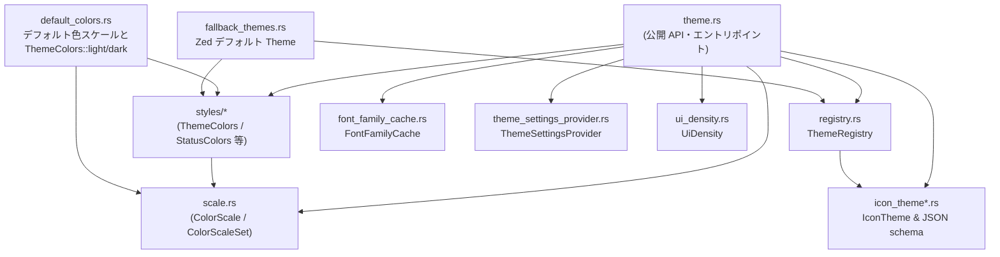
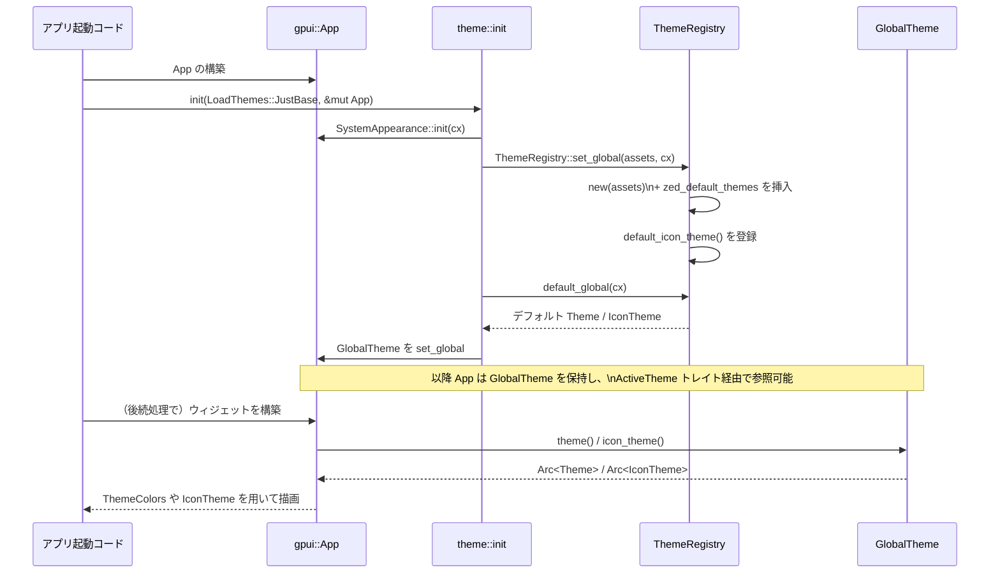

# theme/

## 1. ざっくり一言

Zed 全体の「見た目」を一括して扱うためのテーマシステムです。  
ライト/ダーク外観、UI カラーセット、ステータス色、アイコンテーマ、フォント・UI 密度設定などを定義し、`gpui::App` からグローバルに参照できるようにします。

---

## 2. このモジュールの役割

### 2.1 概要

- この crate は **Zed のテーマ定義とテーマ管理** を行うために存在し、次の機能を提供します。
  - ライト/ダーク向けのカラー・スケールと、それに基づくデフォルト UI カラー (`ThemeColors`)
  - ステータス/プレイヤー用の色 (`StatusColors`, `PlayerColors`, `AccentColors`)
  - テキスト/フォルダなどファイル種別に応じたアイコンテーマ (`IconTheme`)
  - テーマ/アイコンテーマのレジストリ (`ThemeRegistry`) とグローバルに有効なテーマ (`GlobalTheme`)
  - フォントファミリ一覧のキャッシュ (`FontFamilyCache`)
  - テーマ関連設定（フォント・サイズ・UI 密度）の提供インターフェース (`ThemeSettingsProvider`)
  - UI 密度設定 (`UiDensity`)

### 2.2 アーキテクチャ内での位置づけ

crate 内の主要モジュールどうしの依存関係は、概ね次のようになっています。



- 外部からは主に `theme` モジュール（`theme.rs`）を介して、この crate 全体の API を利用します（`pub use` による再エクスポート）。
- カラー定義は `scale.rs` の **12 段階 ColorScale** と、`default_colors.rs` の **命名済みスケール (gray, blue, ...)** を基盤に、`ThemeColors` / `StatusColors` / `PlayerColors` 等を組み立てています。
- `ThemeRegistry` が `Theme` / `IconTheme` を管理し、`GlobalTheme` から現在アクティブなテーマ・アイコンテーマを `App` 経由で取得します。
- フォントと UI 密度は `ThemeSettingsProvider` を通じて、別 crate（`theme_settings` など）が実装する具体的設定に間接的にアクセスします。

### 2.3 設計上のポイント

コードから読み取れる設計上の特徴をまとめます。

- **カラースケール中心の設計**
  - すべての色は `ColorScaleSet`（12 色× light/dark × alpha 付き/無し）を基盤にしており、「Step 1〜12」に各 UI 用途の意味付けがされています。
  - デフォルトテーマでは、これらスケールから `ThemeColors` や `StatusColors`, `PlayerColors`, `AccentColors` を組み立てています。

- **ライト/ダーク外観の明確な分離**
  - `Appearance`（ランタイム）と `AppearanceContent`（シリアライズ）で外観を表現します。
  - 各スケール／色定義に `light` / `dark` メソッドやフィールドが用意され、ライト/ダークで別の色を使い分けます。

- **Refineable による「差分オーバライド」**
  - `ThemeColors`, `StatusColors`, `ThemeStyles`, `PlayerColors` などは `refineable::Refineable` を derive しており、対応する `*Refinement` 型経由で「一部フィールドだけ上書き」できます。
  - デフォルト値からユーザテーマを作る時に差分だけ指定できるようになっています。

- **グローバルオブジェクトとレジストリ**
  - `ThemeRegistry`, `FontFamilyCache`, `SystemAppearance`, `GlobalTheme`, `ThemeSettingsProvider` は `gpui::Global` を実装したラッパーで `App` にグローバル登録されます。
  - アプリ側からは `cx.theme()`（`ActiveTheme`）や `theme_settings(cx)` で現在の設定にアクセスします。

- **デフォルトテーマとフォールバック**
  - crate 内に `zed_default_dark()` による One Dark 系デフォルトテーマが埋め込まれており、テストや初期状態で必ずテーマが 1 つ存在するようにしています。
  - アイコンについても `default_icon_theme()` で Zed 標準のアイコンテーマが用意され、ユーザテーマはこれをベースに拡張されます。

- **I/O や高コスト処理のキャッシュ**
  - 利用可能なフォントファミリ一覧（テキストシステムからの取得）は高コストとみなし、一度だけ取得して `FontFamilyCache` にキャッシュします。

---

## 3. 主要な機能一覧

この crate が提供する主な機能を列挙します。

- テーマシステム初期化:
  - `init` による `ThemeRegistry`, `GlobalTheme`, `SystemAppearance`, `FontFamilyCache` の初期化
- テーマ外観管理:
  - `Appearance`, `SystemAppearance` によるライト/ダーク判定とシステム外観との同期
- テーマ定義・色定義:
  - `Theme`, `ThemeFamily`, `ThemeStyles`, `ThemeColors`, `StatusColors`, `PlayerColors`, `AccentColors`, `SystemColors`
  - `ThemeColors::light()` / `ThemeColors::dark()`, `StatusColors::light()` / `StatusColors::dark()`
- カラースケール:
  - `ColorScaleStep`, `ColorScale`, `ColorScaleSet`, `ColorScales`
  - `default_color_scales()` による Radix 風の標準スケール群（gray, blue, ...）の提供
- テーマ/アイコンテーマレジストリ:
  - `ThemeRegistry` による `Theme` と `IconTheme` の登録・取得・一覧
  - `load_icon_theme` による JSON からのアイコンテーマロード
  - `ThemeMeta`, `ThemeNotFoundError`, `IconThemeNotFoundError`
- アイコンテーマ:
  - `IconThemeFamily`, `IconTheme`, `DirectoryIcons`, `ChevronIcons`, `IconDefinition`
  - `icon_theme_schema.rs` の `IconThemeFamilyContent` 等による JSON スキーマ
  - `default_icon_theme()` による組み込みのアイコンテーマ
- フォント関連:
  - `FontFamilyCache` によるフォントファミリ一覧のキャッシュと非同期プリフェッチ
- テーマ設定インターフェース:
  - `ThemeSettingsProvider` trait と `set_theme_settings_provider`, `theme_settings`
- UI 密度:
  - `UiDensity` と `spacing_ratio()` による Compact/Default/Comfortable の扱い
- 補助機能:
  - `try_parse_color` による文字列から `Hsla` への変換
  - `deserialize_icon_theme` によるアイコンテーマ JSON のパース
  - `apply_status_color_defaults`, `apply_theme_color_defaults` によるデフォルト値の補完
  - `all_theme_colors` による現在のテーマ色の列挙

---

## 4. 関数・構造体の解説

### 4.1 主要な型一覧

よく使う/理解の鍵になる型をまとめます。

| 名前 | 種別 | 定義ファイル | 役割 / 用途 |
|------|------|--------------|-------------|
| `Appearance` | enum | `theme.rs` | テーマのライト/ダーク外観を表す（ランタイム用）。 |
| `AppearanceContent` | enum | `schema.rs` | シリアライズされた外観（JSON 用）。 |
| `ThemeFamily` | struct | `theme.rs` | 複数の `Theme` をまとめたファミリ（「One Light」「One Dark」等）。 |
| `Theme` | struct | `theme.rs` | UI 全体の見た目（色・スタイル・外観）を表す中心的な型。 |
| `ThemeStyles` | struct | `styles/colors.rs` | `ThemeColors`, `StatusColors`, `PlayerColors`, `AccentColors`, `SyntaxTheme` などをひとまとめにしたスタイルセット。 |
| `ThemeColors` | struct | `styles/colors.rs` | ボーダー、テキスト、パネル、エディタ、ターミナルなど、UI の細かい色をすべて保持。 |
| `ThemeColorField` | enum | `styles/colors.rs` | `ThemeColors` の一部フィールドを列挙し、共通処理で列挙できるようにする。 |
| `StatusColors` | struct | `styles/status.rs` | created/deleted/error/warning など、ステータス表示用の色セット。 |
| `DiagnosticColors` | struct | `styles/status.rs` | LSP 診断などで使う error/warning/info の色 3 種をまとめたもの。 |
| `PlayerColor` | struct | `styles/players.rs` | 1 人分のプレイヤー色（cursor/background/selection）。 |
| `PlayerColors` | struct | `styles/players.rs` | 複数プレイヤーの色リスト。`local` や `color_for_participant` で参照。 |
| `AccentColors` | struct | `styles/accents.rs` | インデントガイドやレインボーブラケット等で使うアクセント色のリスト。 |
| `SystemColors` | struct | `styles/system.rs` | 透過色や macOS トラフィックライト色など、OS 由来の色。 |
| `ColorScaleStep` | newtype struct | `scale.rs` | スケール内のステップ 1〜12 を表すラッパー。 |
| `ColorScale` | struct | `scale.rs` | あるスケール（例: Blue）の 12 色を保持。`step_n()` で取得。 |
| `ColorScaleSet` | struct | `scale.rs` | 1 スケールの light/dark および alpha 付きバージョンをまとめたもの。 |
| `ColorScales` | struct | `scale.rs` | gray/blue/... など複数の `ColorScaleSet` をまとめたセット。 |
| `ThemeRegistry` | struct | `registry.rs` | `Theme` と `IconTheme` のグローバルレジストリ。 |
| `ThemeMeta` | struct | `registry.rs` | テーマの名前と外観だけを持つ軽量メタデータ。 |
| `ThemeNotFoundError` | struct | `registry.rs` | 名前でテーマ検索に失敗したときのエラー。 |
| `IconThemeFamily` | struct | `icon_theme.rs` | アイコンテーマのファミリ（複数の `IconTheme` をまとめる）。 |
| `IconTheme` | struct | `icon_theme.rs` | ファイル/ディレクトリ種別ごとのアイコン指定を含むアイコンテーマ。 |
| `DirectoryIcons` | struct | `icon_theme.rs` | ディレクトリの collapsed/expanded 用アイコンパス。 |
| `ChevronIcons` | struct | `icon_theme.rs` | 折りたたみ用の chevron アイコンパス。 |
| `IconDefinition` | struct | `icon_theme.rs` | 1 つのファイルアイコンのパス。 |
| `IconThemeFamilyContent` | struct | `icon_theme_schema.rs` | アイコンテーマファミリの JSON 表現。 |
| `IconThemeContent` | struct | `icon_theme_schema.rs` | アイコンテーマ 1 件の JSON 表現。 |
| `DirectoryIconsContent` / `ChevronIconsContent` | struct | `icon_theme_schema.rs` | ディレクトリアイコン/chevron アイコンの JSON 表現。 |
| `IconDefinitionContent` | struct | `icon_theme_schema.rs` | アイコン定義の JSON 表現。 |
| `FontFamilyCache` | struct | `font_family_cache.rs` | フォントファミリ一覧のキャッシュ。 |
| `ThemeSettingsProvider` | trait | `theme_settings_provider.rs` | フォント・サイズ・UI 密度を提供する抽象インターフェース。 |
| `UiDensity` | enum | `ui_density.rs` | Compact/Default/Comfortable の UI 密度設定。 |
| `SystemAppearance` | struct | `theme.rs` | システムのウィンドウ外観から導いた `Appearance` を保持。 |
| `GlobalTheme` | struct | `theme.rs` | 現在アクティブな `Theme` と `IconTheme` をまとめたグローバル。 |

### 4.2 重要な関数・メソッド詳細（7 件）

#### `init(themes_to_load: LoadThemes, cx: &mut App)`

**概要**

- テーマシステム全体を初期化します。
- `SystemAppearance`, `ThemeRegistry`, `FontFamilyCache`, `GlobalTheme` をセットアップし、以降 `cx.theme()` などでテーマを参照可能にします。

**引数**

| 引数名 | 型 | 説明 |
|--------|----|------|
| `themes_to_load` | `LoadThemes` | `JustBase` の場合は組み込みテーマのみ、`All(Box<dyn AssetSource>)` の場合は後続でバンドルテーマもロードできるように asset source を登録。 |
| `cx` | `&mut App` | `gpui` のアプリケーションコンテキスト。グローバルの登録に使用。 |

**戻り値**

- なし。副作用として `App` 内に各種グローバルが設定されます。

**内部処理の流れ**

1. `SystemAppearance::init(cx)` を呼び、OS のウィンドウ外観から `Appearance` を決定して `GlobalSystemAppearance` として登録。
2. `themes_to_load` に応じて `Box<dyn AssetSource>` を決定。
   - `JustBase` の場合はダミーの `()` を `AssetSource` として使用。
3. `ThemeRegistry::set_global(assets, cx)` を呼び、グローバルな `ThemeRegistry` を作成・登録。
4. `FontFamilyCache::init_global(cx)` を呼び、グローバルなフォントファミリキャッシュを登録。
5. `ThemeRegistry::default_global(cx)` から `ThemeRegistry` を取得。
6. レジストリから `DEFAULT_DARK_THEME`（"One Dark"）という名前のテーマを取得しようとする。
   - 取得できなければ、`list()` で先頭のテーマ名を取り出し、そのテーマを取得。
7. レジストリから `default_icon_theme()` を取得。
8. これらを用いて `GlobalTheme { theme, icon_theme }` を作成し、`cx.set_global` で登録。

**Examples（使用例）**

```rust
use gpui::App;
use theme::{init, LoadThemes};

// アプリケーションセットアップの一部として呼び出す例
fn setup_theme_system(app: &mut App) {
    // 組み込みの One Dark など「ベーステーマのみ」を使う場合
    init(LoadThemes::JustBase, app);

    // AssetSource を持っている場合は All(...) で渡せる（詳細はアプリ側の実装依存）
    // let assets: Box<dyn gpui::AssetSource> = ...;
    // init(LoadThemes::All(assets), app);
}
```

**Errors / Panics**

- `ThemeRegistry::new` 内で必ず 1 つ以上のテーマが登録される前提なので、`init` 内の `unwrap()` 群は通常パニックしません。
- もし何らかの理由で `ThemeRegistry` にテーマが 1 つも登録されていない状態に変更した場合、`list().into_iter().next().unwrap()` などでパニックが起こり得ます。

**Edge cases**

- `LoadThemes::JustBase` を指定した場合、外部 JSON 等からの追加テーマ読み込みはこの crate では行われません（別の crate 側の責務）。
- `ThemeRegistry::set_global` を事前に独自に呼び出していても、`init` が再度上書きする点に注意が必要です。

**使用上の注意点**

- 通常はアプリ起動時に一度だけ呼び出すことを前提とした設計です。
- `cx.theme()` や `ThemeRegistry::global(cx)` を使う前に `init` を呼び出しておく必要があります。

---

#### `ThemeRegistry::new(assets: Box<dyn AssetSource>) -> Self`

**概要**

- 与えられた `AssetSource` を保持する `ThemeRegistry` を作成し、デフォルトの Zed テーマとデフォルトアイコンテーマを登録します。

**引数**

| 引数名 | 型 | 説明 |
|--------|----|------|
| `assets` | `Box<dyn AssetSource>` | バンドル済みテーマやアイコンを読むためのアセットソース。現状この関数内では保存のみ。 |

**戻り値**

- `ThemeRegistry`: デフォルトテーマが 1 つ以上登録された状態のレジストリ。

**内部処理の流れ**

1. 内部状態 `ThemeRegistryState` を初期化。
   - `themes`, `icon_themes` は空の `HashMap`。
   - `extensions_loaded` は `false`。
2. `registry.insert_theme_families([crate::fallback_themes::zed_default_themes()]);`
   - `zed_default_themes()` は `ThemeFamily` を返し、その `themes` ベクタ内に `zed_default_dark()` 由来の `Theme` が 1 つ含まれます。
   - これにより少なくとも 1 テーマがレジストリに登録されます。
3. `default_icon_theme()` を呼び出し、Zed 標準のアイコンテーマを取得。
4. そのアイコンテーマを `icon_themes` のマップに `name` をキーにして登録。
5. 初期化済みの `ThemeRegistry` を返す。

**Examples（使用例）**

```rust
use theme::ThemeRegistry;
use gpui::AssetSource;

fn create_registry(assets: Box<dyn AssetSource>) -> ThemeRegistry {
    ThemeRegistry::new(assets)
}
```

通常は直接 `new` を呼ぶよりも、`ThemeRegistry::set_global` や `ThemeRegistry::default_global` を通じて利用します。

**Errors / Panics**

- この関数自体は `Result` を返さず、パニックも発生させません。

**Edge cases**

- 同じ名前のテーマを後から追加すると、`HashMap` により後勝ちで既存登録が上書きされます。
- `assets` はこの関数内では利用されず格納のみです。実際の JSON ロード等は別の箇所で行われる前提です（このチャンク内には登場しません）。

**使用上の注意点**

- `Default` 実装 (`ThemeRegistry::default()`) からもこの関数が呼ばれます。テストなどで `ThemeRegistry::default()` を使うと、同じく Zed デフォルトテーマが登録された状態で構築されます。

---

#### `ThemeRegistry::load_icon_theme(&self, icon_theme_family: IconThemeFamilyContent, icons_root_dir: &Path) -> Result<()>`

**概要**

- JSON 等から読み込んだ `IconThemeFamilyContent` をもとに、1 つ以上の `IconTheme` を構築してレジストリに登録します。
- すべてのアイコン定義は `icons_root_dir` を起点にパス解決されます。
- デフォルトアイコンテーマを基準にして、ユーザ定義を上書き・拡張する形で構築します。

**引数**

| 引数名 | 型 | 説明 |
|--------|----|------|
| `icon_theme_family` | `IconThemeFamilyContent` | シリアライズ済みのアイコンテーマファミリ。複数の `IconThemeContent` を含む。 |
| `icons_root_dir` | `&Path` | テーマ JSON で指定された相対パスを解決するルートディレクトリ。 |

**戻り値**

- `anyhow::Result<()>`。現状、関数内部では失敗パスがないため、常に `Ok(())` が返されます。

**内部処理の流れ**

1. `resolve_icon_path` というクロージャを定義。
   - `SharedString` で与えられた相対パスを `icons_root_dir.join(...)` し、`String` に変換して再度 `SharedString` に戻します。
2. `default_icon_theme()` を呼び出し、組み込みのデフォルトアイコンテーマを取得。
3. 書き込み用ロックを取得: `let mut state = self.state.write();`
4. `icon_theme_family.themes`（`IconThemeContent` の配列）をループ。
   - `file_stems`: デフォルトテーマの `file_stems` を `clone()` し、ファミリの `file_stems` を `extend` で追加。
   - `file_suffixes`: 同様にデフォルトをベースに `extend`。
   - `named_directory_icons`: デフォルトのものをコピーし、ユーザ定義を `DirectoryIconsContent` → `DirectoryIcons` に変換して上書き/追加。
   - `directory_icons`, `chevron_icons`: ユーザ定義の `Content` から `resolve_icon_path` を通じて `DirectoryIcons` / `ChevronIcons` を構築。
   - `file_icons`: 各キーごとに `IconDefinitionContent.path` を `resolve_icon_path` して `IconDefinition` を構築。
   - `appearance`: `AppearanceContent` を `Appearance` に変換。
   - `id`: `uuid::Uuid::new_v4()` で一意な ID を生成。
5. 構築した `IconTheme` を `state.icon_themes` に `name` をキーにして `Arc` で格納。

**Examples（使用例）**

```rust
use std::path::Path;
use gpui::App;
use theme::{deserialize_icon_theme, ThemeRegistry};

fn load_custom_icon_theme(cx: &mut App, json_bytes: &[u8]) -> anyhow::Result<()> {
    // JSON から IconThemeFamilyContent を復元
    let icon_family = deserialize_icon_theme(json_bytes)?;

    // グローバルレジストリを取得
    let registry = ThemeRegistry::default_global(cx);

    // アイコンファイルが置かれているルートディレクトリを指定
    let icons_root = Path::new("resources/icons");

    // ロードしてレジストリに登録
    registry.load_icon_theme(icon_family, icons_root)
}
```

**Errors / Panics**

- 現状関数内で `?` を使っていないため、`Err` が返るケースはありません。
- `icons_root_dir` のパスが実在しなくても、この関数自体はパス文字列を構築するだけで、ファイル存在チェックは行いません。

**Edge cases**

- デフォルトアイコンテーマに存在する `file_stems` / `file_suffixes` / `named_directory_icons` は、ユーザテーマ側で同じキーを指定すると上書きされます。
- `IconTheme` の `id` は毎回新しい UUID が割り当てられます。名前 (`name`) でレジストリに登録・取得するため、ID は実質内部用です。

**使用上の注意点**

- 実ファイルの存在チェックや読み込みは別のレイヤーで行われる前提です。ここではあくまで「パス文字列の組み立て」と「レジストリへの登録」のみ行います。
- `icon_theme_family.themes` に複数テーマが含まれている場合、それぞれが別々の `IconTheme` として登録されます。

---

#### `ColorScaleSet::step(&self, cx: &App, step: ColorScaleStep) -> Hsla`

（`step_alpha` も合わせて説明します）

**概要**

- 現在のテーマ外観（ライト/ダーク）に応じて、対応する `ColorScale` から指定されたステップの色を返します。
- `step_alpha` は同様に alpha付きバージョンのスケールから色を返します。

**引数**

| 引数名 | 型 | 説明 |
|--------|----|------|
| `self` | `&ColorScaleSet` | 対象となるカラースケールセット（例: Blue, Gray, ...）。 |
| `cx` | `&App` | `ActiveTheme` を通じて現在の `Theme` にアクセスするために使用。 |
| `step` | `ColorScaleStep` | 取得したいステップ（`ColorScaleStep::ONE`～`TWELVE`）。 |

**戻り値**

- `Hsla`: 外観（ライト/ダーク）に応じて `light` または `dark` スケールから取り出した色。

**内部処理の流れ**

`step`:

1. `cx.theme().appearance` で現在のテーマ外観を取得。
2. `Appearance::Light` の場合は `self.light().step(step)` を呼ぶ。
3. `Appearance::Dark` の場合は `self.dark().step(step)` を呼ぶ。

`step_alpha`:

1. 同様に外観を判定。
2. ライトの場合は `self.light_alpha.step(step)`、ダークの場合は `self.dark_alpha.step(step)` を呼ぶ。

**Examples（使用例）**

```rust
use gpui::App;
use theme::{ColorScaleSet, ColorScaleStep};

fn example(cx: &App, scale: &ColorScaleSet) {
    // 現在のテーマ外観に応じて Step 3 の色を取得
    let background = scale.step(cx, ColorScaleStep::THREE);

    // 透過版 Step 5 の色を取得
    let border = scale.step_alpha(cx, ColorScaleStep::FIVE);

    // これらを使って独自コンポーネントを描画することができます
}
```

**Errors / Panics**

- `ColorScale::step` は内部で `vec[index]` を行うため、`ColorScale` に 12 色未満しか入っていないとパニックします。
- この crate 内では `StaticColorScaleSet` 経由で常に 12 色の配列から構築しているため安全ですが、外部から `ColorScale::from_iter` で任意の長さのスライスを渡す場合には注意が必要です。

**Edge cases**

- `ColorScaleStep` は 1～12 以外の値を持ちません（コンストラクタを公開していない）。したがって `ColorScaleStep` を通じて不正なインデックスを指定することはできません。
- テーマ外観が変更された場合、同じ `ColorScaleSet` でも `step` が返す色は変わります。

**使用上の注意点**

- `step` / `step_alpha` は外観に依存するため、「ライト/ダークで別の色を使い分けたい」用途に適します。
- 「ライト/ダークに関係なく固定のスケールを使いたい」場合は `light()`/`dark()` を直接使う方が明示的です。

---

#### `FontFamilyCache::list_font_families(&self, cx: &App) -> Vec<SharedString>`

**概要**

- 利用可能なフォントファミリ名の一覧を返します。
- 初回呼び出し時に `text_system().all_font_names()` を実行し、その結果をキャッシュして以降はキャッシュを返します。

**引数**

| 引数名 | 型 | 説明 |
|--------|----|------|
| `self` | `&FontFamilyCache` | フォントファミリキャッシュ。通常は `FontFamilyCache::global(cx)` から取得。 |
| `cx` | `&App` | `text_system()` にアクセスするために使用。 |

**戻り値**

- `Vec<SharedString>`: フォントファミリ名の一覧。クローンされたベクタが返ります。

**内部処理の流れ**

1. 読み取りロックを取得し、`loaded_at` が `Some` かどうか確認。
   - `Some` の場合: すでに読み込み済みのため、そのまま `font_families.clone()` を返す。
2. `loaded_at` が `None` の場合:
   - 書き込みロックを取得。
   - `cx.text_system().all_font_names()` を呼び出し、全フォント名を取得。
   - `SharedString::from` によって `Vec<SharedString>` に変換し、`font_families` に保存。
   - `loaded_at = Some(Instant::now())` をセット。
   - 最後に `font_families.clone()` を返す。

**Examples（使用例）**

```rust
use gpui::App;
use theme::FontFamilyCache;

fn list_fonts(cx: &App) -> Vec<String> {
    let cache = FontFamilyCache::global(cx);
    cache
        .list_font_families(cx)
        .into_iter()
        .map(|s| s.to_string())
        .collect()
}
```

**Errors / Panics**

- `text_system().all_font_names()` がパニックするかどうかは `gpui` 側の実装に依存します。
- ロック取得に失敗した場合のパニック等は発生しません（`RwLock` の標準動作）。

**Edge cases**

- フォントファミリ一覧はプロセスのライフタイム中に変わらない前提でキャッシュされます。実行中に新規フォントがインストールされても、再起動するまで反映されない可能性があります。

**使用上の注意点**

- このメソッドは同期的に `text_system().all_font_names()` を呼びます。頻繁に呼び出す場合でもキャッシュによって負荷は軽減されますが、初回呼び出しは UI スレッド上で実行されることに注意が必要です。
- バックグラウンドでプリフェッチしたい場合は、次の `prefetch` メソッドを使用します。

---

#### `FontFamilyCache::prefetch(&self, cx: &gpui::AsyncApp)`

**概要**

- 非同期にフォントファミリ一覧をプリフェッチします。
- すでに読み込み済みの場合や、ロックが取れない場合は何もせずに戻ります。

**引数**

| 引数名 | 型 | 説明 |
|--------|----|------|
| `self` | `&FontFamilyCache` | 対象のキャッシュ。 |
| `cx` | `&gpui::AsyncApp` | バックグラウンド実行環境にアクセスするためのコンテキスト。 |

**戻り値**

- `()`（`async fn`）: 完了まで待つことも、`spawn` に任せることも可能。

**内部処理の流れ**

1. `self.state.try_read()` で読み取りロック取得を試みる。
2. `is_none_or(|state| state.loaded_at.is_some())` で次をチェック:
   - ロックに失敗 (`None`) した場合 → `true` → 何もせず `return`。
   - ロック成功かつ `loaded_at.is_some()` の場合 → すでに読み込み済み → `return`。
   - ロック成功かつ `loaded_at.is_none()` の場合 → `false` → プリフェッチを続行。
3. `cx.update(|cx| App::text_system(cx).clone())` で `text_system` を取得。
4. `state`（`Arc<RwLock<...>>`）のクローンをローカルに保持。
5. `cx.background_executor().spawn(async move { ... }).await;` でバックグラウンドタスクを起動し、次を実行:
   - 書き込みロックを取得。
   - `text_system.all_font_names()` を呼び出し `SharedString` ベクタに変換。
   - `font_families` と `loaded_at` を更新。

**Examples（使用例）**

```rust
use gpui::AsyncApp;
use theme::FontFamilyCache;

// 非同期コンテキスト内で呼び出す例
async fn prefetch_fonts(cx: &AsyncApp) {
    let cache = cx.update(|cx| theme::FontFamilyCache::global(cx));
    cache.prefetch(cx).await;
}
```

**Errors / Panics**

- バックグラウンドタスク内でのパニックは、`background_executor` の実装に依存しますが、通常はアプリケーションのクラッシュを引き起こす可能性があります。

**Edge cases**

- `try_read()` のタイミングによっては、別のスレッドで書き込みロックを保持しているためにプリフェッチが実行されないことがあります。この場合でも次回呼び出し時に再度プリフェッチを試みることができます。

**使用上の注意点**

- フォント一覧をUIレスポンスに影響させずに準備したい場合に有用です。
- すでに `list_font_families` を呼び出している場合は、`loaded_at` が `Some` になっているため、このメソッドは即座に何もせず終了します。

---

#### `apply_status_color_defaults(status: &mut StatusColorsRefinement)`

**概要**

- `StatusColorsRefinement`（ステータス色の差分指定）に対して、「前景色が指定されているが背景色が未指定」のフィールドに、やや透明な背景色を自動的に補完します。

**引数**

| 引数名 | 型 | 説明 |
|--------|----|------|
| `status` | `&mut StatusColorsRefinement` | 差分オーバライド用のステータス色定義。 |

**戻り値**

- なし。`status` がインプレースで更新されます。

**内部処理の流れ**

1. 次の `(fg_color, bg_color)` のペアに対してループ:
   - deleted / deleted_background
   - created / created_background
   - modified / modified_background
   - conflict / conflict_background
   - error / error_background
   - hidden / hidden_background
2. 各ペアごとに:
   - `bg_color` が `None` かつ `fg_color` が `Some(c)` であれば、`c.opacity(0.25)` を計算し、`bg_color` に `Some` としてセット。

**Examples（使用例）**

```rust
use theme::{StatusColorsRefinement, apply_status_color_defaults};
use gpui::Hsla;

fn fill_status_backgrounds(mut status: StatusColorsRefinement) -> StatusColorsRefinement {
    // 例: deleted の前景色だけ指定し、背景色は未指定
    status.deleted = Some(Hsla::new(0.0, 1.0, 0.5, 1.0));
    apply_status_color_defaults(&mut status);
    status
}
```

**Errors / Panics**

- パニック条件はありません。

**Edge cases**

- すでに `*_background` が `Some` の場合は上書きされません。
- `opacity(0.25)` は alpha 値だけを 0.25 にし、色相・彩度・輝度は変えません。

**使用上の注意点**

- 「ステータスの前景色だけ指定し、背景色は自動でよしなに調整してほしい」という場合に便利です。
- 明示的な背景色を指定したい場合は、`*_background` を `Some` に設定しておけばこの関数の影響を受けません。

---

#### `apply_theme_color_defaults(theme_colors: &mut ThemeColorsRefinement, player_colors: &PlayerColors)`

**概要**

- `ThemeColorsRefinement` に対して、`element_selection_background` が未指定であれば、ローカルプレイヤーの選択色をベースに適切な透明度で補完します。

**引数**

| 引数名 | 型 | 説明 |
|--------|----|------|
| `theme_colors` | `&mut ThemeColorsRefinement` | テーマ色の差分オーバライド。 |
| `player_colors` | `&PlayerColors` | プレイヤーごとの色定義。`local()` からローカルプレイヤーの色を取得。 |

**戻り値**

- なし。`theme_colors` がインプレースで更新されます。

**内部処理の流れ**

1. `element_selection_background` が `None` なら処理を行う（`Some` なら何もせず終了）。
2. `let mut selection = player_colors.local().selection;` でローカルプレイヤーの選択色を取得。
3. `selection.a == 1.0`（完全不透明）の場合は `selection.a = 0.25;` に下げる。
4. `theme_colors.element_selection_background = Some(selection);` として設定。

**Examples（使用例）**

```rust
use theme::{PlayerColors, ThemeColorsRefinement, apply_theme_color_defaults};

fn fill_selection_default(
    player_colors: &PlayerColors,
    mut colors: ThemeColorsRefinement,
) -> ThemeColorsRefinement {
    apply_theme_color_defaults(&mut colors, player_colors);
    colors
}
```

**Errors / Panics**

- `player_colors.local()` は内部で `self.0.first().unwrap()` を呼ぶため、`PlayerColors` の内部ベクタが空の場合はパニックします。
- デフォルト実装 (`PlayerColors::dark`/`light`) では 8 要素が用意されているため問題ありません。

**Edge cases**

- `selection.a` が 1.0 以外（もともと半透明）の場合、alpha 値は変更されません。

**使用上の注意点**

- `PlayerColors` をカスタマイズする際は、少なくとも 1 要素以上（`local` 用）を持つようにする必要があります。
- テーマ JSON 側で `element_selection_background` を明示的に指定している場合、この関数の影響を受けません。

---

### 4.3 その他の関数・メソッド（概要のみ）

| 関数 / メソッド名 | 役割（1 行） |
|--------------------|--------------|
| `ThemeColors::light()` / `ThemeColors::dark()` | デフォルトのライト/ダークテーマ用 `ThemeColors` を、`ColorScaleSet` 群から構築する。 |
| `StatusColors::light()` / `StatusColors::dark()` | ステータス表示用のデフォルト色セットを構築する。 |
| `PlayerColors::light()` / `PlayerColors::dark()` | プレイヤー用色セット（カーソル／背景／選択）を構築する。 |
| `AccentColors::light()` / `AccentColors::dark()` | インデントガイドなどに使うアクセント色リストを構築する。 |
| `PlayerColors::local()` / `agent()` / `absent()` | ローカルプレイヤー・エージェント・不在カラーを返す（いずれも内部ベクタから要素を取り出す）。 |
| `PlayerColors::color_for_participant(idx)` | 参加者インデックスに応じて 2 番目以降の色から循環的に選択する。 |
| `Theme::system()` / `accents()` / `players()` / `colors()` / `syntax()` / `status()` | `ThemeStyles` 内の各コンポーネントを取り出すアクセサ。 |
| `Theme::window_background_appearance()` | ウィンドウの背景外観（`WindowBackgroundAppearance`）を返す。 |
| `Theme::darken(color, light_amount, dark_amount)` | テーマ外観に応じて `Hsla` の輝度を減らし、色を暗くする。 |
| `ThemeRegistry::global()` / `default_global()` / `try_global()` | グローバルレジストリへのアクセス。 |
| `ThemeRegistry::insert_themes` / `insert_theme_families` | テーマ群をレジストリに追加登録する。 |
| `ThemeRegistry::list_names()` / `list()` | 登録済みテーマの名前やメタデータを列挙する。 |
| `ThemeRegistry::get(name)` | 名前から `Theme` を取得する。存在しない場合は `ThemeNotFoundError`。 |
| `ThemeRegistry::default_icon_theme()` / `get_icon_theme(name)` | デフォルト/指定名の `IconTheme` を取得する。 |
| `all_theme_colors(cx)` | 現在のテーマの `ThemeColorField` 群を `(Hsla, 名前)` のベクタとして返す。 |
| `try_parse_color(color: &str)` | `"#rrggbb"` などの文字列から `Hsla` を構築する。 |
| `deserialize_icon_theme(bytes)` | JSON から `IconThemeFamilyContent` を構築する。 |
| `set_theme_settings_provider(provider, cx)` | グローバルなテーマ設定プロバイダを登録する。 |
| `theme_settings(cx)` | 登録済みの `ThemeSettingsProvider` にアクセスする。 |
| `UiDensity::spacing_ratio()` | Compact/Default/Comfortable ごとのスケーリング係数を返す。 |

補足として、`ThemeColorField::iter()` / `ThemeColors::iter()` / `to_vec()` により、`ThemeColors` の **一部フィールド** を列挙できます。ただし、`ThemeColors` に含まれるすべてのフィールド（例: `version_control_word_*` など）が `ThemeColorField` に対応しているわけではないため、列挙されない色も存在します。その場合はフィールドに直接アクセスする必要があります。

---

## 5. データフロー

ここでは、「アプリ起動時にテーマシステムを初期化し、その後ウィジェットからテーマ色を参照する」一連の流れを説明します。

### 5.1 テーマ初期化〜利用までのシーケンス



**要点**

- 一度 `init` を呼び出すと、`ThemeRegistry` と `GlobalTheme` が `App` にグローバル登録されます。
- その後、任意の場所から `App`（または `ActiveTheme` を実装した型）経由で `theme()` を呼び出し、`Theme` → `ThemeColors` / `StatusColors` / `PlayerColors` 等にアクセスできます。
- アイコンも同様に `GlobalTheme::icon_theme(cx)` から取得できます（`theme::default_icon_theme()` ではなく、現在有効なもの）。

---

## 6. 使い方（How to Use）

### 6.1 基本的な使用方法

#### 6.1.1 テーマシステムの初期化

アプリケーション起動時に一度だけ `init` を呼びます。

```rust
use gpui::App;
use theme::{init, LoadThemes};

fn main() {
    // App のセットアップ（実際の初期化方法は gpui の使用方法に依存します）
    let mut app: App = /* ... */;

    // テーマシステムを初期化（組み込みテーマのみ）
    init(LoadThemes::JustBase, &mut app);

    // ここから先、app からテーマ情報にアクセスできます
}
```

#### 6.1.2 ウィジェットからテーマ色を参照する

`App` は `ActiveTheme` を実装しているため、`cx.theme()` で現在の `Theme` にアクセスできます。

```rust
use gpui::App;
use theme::ActiveTheme;

fn draw_something(cx: &App) {
    let theme = cx.theme();

    // エディタ前景色
    let fg = theme.colors().editor_foreground;

    // ステータスバー背景色
    let status_bg = theme.colors().status_bar_background;

    // ステータス色（例: エラー色）
    let error_color = theme.status().error;

    // これらの色を gpui の描画 API で使用します
}
```

#### 6.1.3 テーマ設定プロバイダからフォントや UI 密度を取得する

`ThemeSettingsProvider` は別 crate からグローバルに登録される想定です。

```rust
use gpui::App;
use theme::theme_settings;

fn draw_text(cx: &App) {
    let settings = theme_settings(cx);

    // UI フォントとサイズ
    let ui_font = settings.ui_font(cx);
    let ui_font_size = settings.ui_font_size(cx);

    // バッファ用フォントとサイズ
    let buffer_font = settings.buffer_font(cx);
    let buffer_font_size = settings.buffer_font_size(cx);

    // UI 密度
    let density = settings.ui_density(cx);
    let ratio = density.spacing_ratio();

    // ratio をレイアウト計算に使う、など
}
```

### 6.2 よくある使用パターン

#### 6.2.1 デフォルトテーマ色に対する部分的なオーバライド

`ThemeColors` は `Refineable` によって生成された `ThemeColorsRefinement` を使って差分オーバライドできます。

```rust
use gpui::Hsla;
use serde::Deserialize;
use theme::{ThemeColors, ThemeColorsRefinement};

fn custom_dark_theme_colors() -> ThemeColors {
    // デフォルトのダークテーマ色を取得
    let mut colors = ThemeColors::dark();

    // 特定の色だけ上書きする
    let overrides = ThemeColorsRefinement {
        text: Some(Hsla::new(0.0, 1.0, 0.5, 1.0)), // 例: マゼンタ
        background: Some(Hsla::new(0.0, 0.0, 0.0, 1.0)), // 例: 完全な黒背景
        ..Default::default()
    };

    colors.refine(&overrides);
    colors
}
```

#### 6.2.2 プレイヤーごとの色を使う

複数人コラボレーションなどで、参加者ごとに違う色を使う用途です。

```rust
use theme::PlayerColors;

fn player_cursor_color(players: &PlayerColors, participant_index: u32) -> (/* 略 */) {
    let color = players.color_for_participant(participant_index);

    // color.cursor / color.background / color.selection を使用
    color
}
```

#### 6.2.3 フォント一覧の利用とプリフェッチ

```rust
use gpui::{App, AsyncApp};
use theme::FontFamilyCache;

// 同期的に一覧を取得する
fn show_font_list(cx: &App) {
    let cache = FontFamilyCache::global(cx);
    for name in cache.list_font_families(cx) {
        println!("font: {}", name);
    }
}

// 非同期にプリフェッチする
async fn warm_up_font_cache(cx: &AsyncApp) {
    let cache = cx.update(|cx| FontFamilyCache::global(cx));
    cache.prefetch(cx).await;
}
```

### 6.3 よくある間違い

#### 間違い例 1: テーマシステム初期化前に `cx.theme()` を使う

```rust
// 間違い: init を呼ぶ前に theme() を使っている
fn build_ui(cx: &gpui::App) {
    let theme = cx.theme(); // GlobalTheme が未登録だとパニックの可能性
}
```

```rust
// 正しい例: アプリ起動時に init を呼んでから UI を構築する
fn main() {
    let mut app: gpui::App = /* ... */;
    theme::init(theme::LoadThemes::JustBase, &mut app);

    // ここで UI 構築を行う
}
```

#### 間違い例 2: `PlayerColors` を空で定義する

```rust
use theme::PlayerColors;

// 間違い: 空の PlayerColors を使うと local()/agent() がパニックする
let players = PlayerColors(vec![]);
// players.local(); // unwrap() によりパニック
```

```rust
// 正しい例: 少なくとも一つ以上の PlayerColor を入れておく
let players = theme::PlayerColors::dark(); // デフォルト実装を使う
```

#### 間違い例 3: `ThemeSettingsProvider` を登録せずに `theme_settings(cx)` を呼ぶ

```rust
use theme::theme_settings;

// 間違い: set_theme_settings_provider を呼んでいない状態で theme_settings(cx) を使用
fn draw(cx: &gpui::App) {
    let provider = theme_settings(cx); // Global が存在せずパニックの可能性
}
```

```rust
// 正しい例: アプリ初期化時にプロバイダを登録しておく
use gpui::App;
use theme::{set_theme_settings_provider, ThemeSettingsProvider};

struct MySettingsProvider;
impl ThemeSettingsProvider for MySettingsProvider {
    /* 必要なメソッドを実装 */
    // ...
}

fn init_settings(app: &mut App) {
    set_theme_settings_provider(Box::new(MySettingsProvider), app);
}
```

#### 間違い例 4: 独自 `ColorScale` に 12 色未満を入れる

```rust
use gpui::hsla;
use theme::{ColorScale, ColorScaleStep};

// 間違い: 3 色だけのスケールを作って step_4 を呼ぶとパニックする
let scale = ColorScale::from_iter([
    hsla(0.0, 0.0, 0.1, 1.0),
    hsla(0.0, 0.0, 0.2, 1.0),
    hsla(0.0, 0.0, 0.3, 1.0),
]);
// scale.step(ColorScaleStep::FOUR); // パニック
```

```rust
// 正しい例: 12 色スケールを作るか、既存の ColorScaleSet を利用する
let scales = theme::default_color_scales();
for scale_set in scales {
    let light_step1 = scale_set.light().step_1();
    // ...
}
```

### 6.4 使用上の注意点（まとめ）

- **初期化順序**
  - `init` を必ずアプリ起動時に呼び、`ThemeRegistry` / `GlobalTheme` / `FontFamilyCache` / `SystemAppearance` を初期化してからテーマ関連 API を利用します。
- **グローバル依存**
  - `ThemeRegistry::global`, `FontFamilyCache::global`, `theme_settings` 等は `gpui::Global` に依存しています。適切に `set_global` / `default_global` を行わないとパニックの可能性があります。
- **プレイヤー色ベクタのサイズ**
  - `PlayerColors` のメソッドはいくつか `unwrap` や `len()-1` を使っているため、カスタム定義時は最低 1 要素（実質 2 要素以上が望ましい）を持つようにします。
- **ColorScale の長さ**
  - `ColorScale` は 12 色を前提に `step_n()` を提供しているため、自前で構築する場合は 12 色を用意する必要があります。
- **ThemeColorField と ThemeColors の不一致**
  - `ThemeColorField` で列挙できるのは `ThemeColors` の一部フィールドのみです。`version_control_word_*` や `vim_*` 系フィールドなどは列挙されないため、必要に応じて直接フィールドにアクセスします。
- **I/O 負荷とキャッシュ**
  - フォント一覧の取得は高コストと想定されているため、`FontFamilyCache` を必ず経由します。頻繁に直接 `text_system().all_font_names()` を呼ぶとパフォーマンスに影響する可能性があります。
- **アイコンパスの解決**
  - `load_icon_theme` は `icons_root_dir` と JSON の相対パスを単純結合するだけで、ファイル存在チェックは行いません。実ファイルの存在確認・エラー処理は別レイヤーで行う必要があります。

---

## 7. 関連ファイル

この crate 内の各ファイルと役割をまとめます。

| パス | 役割 / 関係 |
|------|------------|
| `theme/Cargo.toml` | crate 名・依存関係の定義。`gpui`, `syntax_theme`, `refineable`, `schemars`, `serde` などに依存。 |
| `theme/src/theme.rs` | crate の公開 API とエントリポイント。`init`, `Theme`, `ThemeFamily`, `Appearance`, `SystemAppearance`, `GlobalTheme` などを定義し、各サブモジュールを `pub use` しています。 |
| `theme/src/default_colors.rs` | Radix 由来と思われる 12 ステップのカラー・スケールを定義し、`ThemeColors::light()` / `dark()` のデフォルト実装を構築します。多くの UI 色がここで決まります。 |
| `theme/src/fallback_themes.rs` | Zed の組み込みデフォルトテーマ (`zed_default_dark`) を `Theme` として定義し、`ThemeFamily`（`zed_default_themes`）を提供します。また、ステータス色/テーマ色のデフォルト補完関数 `apply_status_color_defaults`, `apply_theme_color_defaults` を実装します。 |
| `theme/src/font_family_cache.rs` | `FontFamilyCache` とそのグローバルラッパーを定義し、フォントファミリ一覧のキャッシュと非同期プリフェッチを実装します。 |
| `theme/src/icon_theme.rs` | ランタイム用のアイコンテーマ (`IconTheme`, `IconThemeFamily`, `DirectoryIcons`, `ChevronIcons`, `IconDefinition`) と、拡張子等からアイコンキーを導くためのマッピング、デフォルトアイコンテーマ (`default_icon_theme`) を定義します。 |
| `theme/src/icon_theme_schema.rs` | アイコンテーマを JSON シリアライズ/デシリアライズするためのスキーマ (`IconThemeFamilyContent`, `IconThemeContent`, `DirectoryIconsContent` など) を定義します。 |
| `theme/src/registry.rs` | `ThemeRegistry` と関連エラー型 (`ThemeNotFoundError`, `IconThemeNotFoundError`) を定義し、テーマ・アイコンテーマの登録/取得/一覧/削除、および `load_icon_theme` 実装を提供します。 |
| `theme/src/scale.rs` | `ColorScaleStep`, `ColorScale`, `ColorScaleSet`, `ColorScales` を定義し、「Step 1〜12」に意味づけされたカラースケール API を提供します。`ColorScaleSet::step` / `step_alpha` でライト/ダークを切り替えます。 |
| `theme/src/schema.rs` | `AppearanceContent`（シリアライズ用外観 enum）と、文字列から `Hsla` へ変換する `try_parse_color` を定義します。 |
| `theme/src/styles.rs` | `styles/*` サブモジュールの集約モジュール。`pub use` により `AccentColors`, `ThemeColors`, `StatusColors`, `PlayerColors`, `SyntaxTheme`, `SystemColors` などを外部に公開します。 |
| `theme/src/styles/accents.rs` | `AccentColors` を定義し、ライト/ダーク用のアクセント色リストを構築します。 |
| `theme/src/styles/colors.rs` | `ThemeColors`, `ThemeColorField`, `ThemeStyles`, および `all_theme_colors` を定義します。`ThemeColors` は UI の細かい色設定を一括管理する中心的な構造体です。 |
| `theme/src/styles/players.rs` | `PlayerColor`, `PlayerColors` を定義し、ライト/ダーク用のプレイヤー色セットや、参加者インデックスに応じた色選択ロジックを提供します。 |
| `theme/src/styles/status.rs` | `StatusColors` と `DiagnosticColors` を定義し、ステータス（conflict, created, error, warning など）の色セットをライト/ダーク別に提供します。 |
| `theme/src/styles/syntax.rs` | `syntax_theme::SyntaxTheme` を再エクスポートし、テーマ内で利用できるようにします。 |
| `theme/src/styles/system.rs` | `SystemColors` を定義し、OS レベルの色（透明色や macOS トラフィックライト色）を提供します。 |
| `theme/src/theme_settings_provider.rs` | `ThemeSettingsProvider` trait と、そのグローバル登録/取得関数 (`set_theme_settings_provider`, `theme_settings`) を定義します。実際の設定管理は別 crate が担当します。 |
| `theme/src/ui_density.rs` | `UiDensity` enum と `spacing_ratio` を定義し、UI のコンパクトさを調整する基礎情報を提供します。 |

この構成により、**色スケール → デフォルト色 → テーマ/ステータス/プレイヤー色 → テーマファミリ → レジストリ → グローバルテーマ** という流れで、Zed 全体の見た目を一貫して扱えるようになっています。
