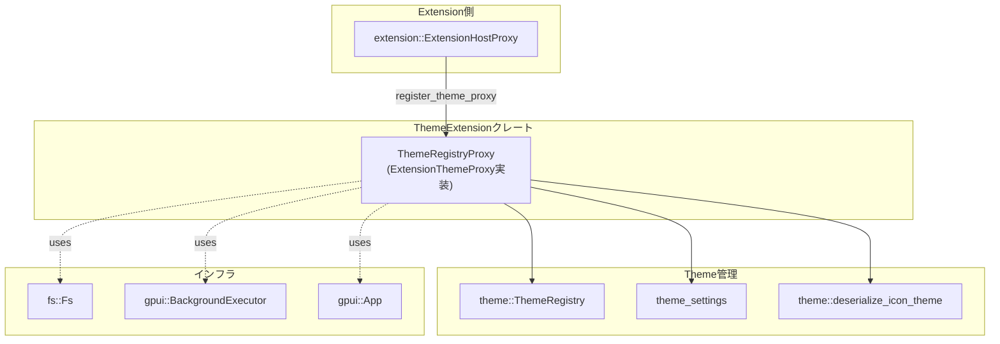
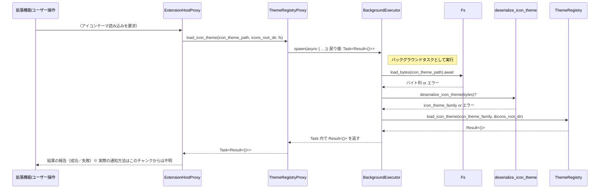

1. ざっくり一言

----------------

`theme_extension` クレートは、**拡張機能ホスト（extension host）からの「テーマ／アイコンテーマ」関連の呼び出しを受け取り、`ThemeRegistry` と `theme_settings` / `theme` クレートに橋渡しするためのプロキシ実装**を提供するモジュールです。

---

2. このモジュールの役割

-----------------------

### 2.1 概要

- このモジュールは、拡張機能システム側（`extension::ExtensionHostProxy`）とテーマ管理側（`theme::ThemeRegistry` および `theme_settings`）の間を仲介します。
- `ExtensionThemeProxy` トレイトを実装した `ThemeRegistryProxy` 構造体を用意し、テーマ名の列挙、ユーザーテーマ／アイコンテーマの読み込み・削除、現在のテーマ／アイコンテーマの再読み込みなどを非同期タスクとして実行します。
- ファイルシステムアクセスは `fs::Fs` トレイト経由で行い、実処理は `gpui::BackgroundExecutor` 上のバックグラウンドタスク (`gpui::Task`) として動かします。

### 2.2 アーキテクチャ内での位置づけ

このモジュールが、拡張機能ホスト・テーマレジストリ・設定／デシリアライズ処理・ファイルシステム・GUI アプリケーションとの間にどのように位置しているかを示します。



- `init` 関数が `ExtensionHostProxy` に `ThemeRegistryProxy` を登録します。
- `ThemeRegistryProxy` は `ExtensionThemeProxy` トレイトを実装し、拡張機能側からの呼び出しを受け取ります。
- テーマ／アイコンテーマの実体は `ThemeRegistry` と `theme_settings` / `theme::deserialize_icon_theme` によって管理・読み込みされます。
- ファイル読み込みは `fs::Fs` 経由、非同期実行は `gpui::BackgroundExecutor` 経由で行われます。
- テーマの再読み込みは `gpui::App` コンテキスト (`cx: &mut App`) を通じて行われます。

### 2.3 設計上のポイント

- **責務の分割**
  - このクレートは「拡張ホスト向け API 実装」に特化しており、テーマのパースロジックや詳細な管理ロジックは `theme_settings` / `theme` / `ThemeRegistry` に委譲しています。
- **状態管理**
  - 内部状態として保持するのは、`Arc<ThemeRegistry>` と `BackgroundExecutor` のみです。
  - テーマそのものの状態は `ThemeRegistry` 側が管理し、このモジュールはあくまで呼び出しの中継を行います。
- **非同期実行**
  - ファイルシステムからの読み込みやデシリアライズは `BackgroundExecutor::spawn` でバックグラウンドタスク (`Task<_>`) として実行されます。
  - CPU や I/O の重い処理を UI スレッドから切り離す意図が読み取れます。
- **エラーハンドリング**
  - 非同期メソッドは `Task<Result<...>>` を返し、`anyhow::Result` を使用しています。
  - エラーの具体的な種類は外部クレートに依存しますが、`?` 演算子により呼び出し元に `Err` を伝播する構造になっています。

---

3. 主要な機能一覧

-----------------

このクレートが提供する主な機能を箇条書きで整理します。

- 拡張ホストへの登録:
  - `init`: `ExtensionHostProxy` にテーマ関連のプロキシ (`ThemeRegistryProxy`) を登録する。
- 拡張ロード完了の通知:
  - `set_extensions_loaded`: テーマ側に「拡張機能ロード完了」を通知する。
- ユーザーテーマ関連:
  - `list_theme_names`: 指定されたパス上のユーザーテーマ定義ファイルを読み込み、含まれるテーマ名の一覧を返す。
  - `load_user_theme`: 指定パスのユーザーテーマ定義を読み込み、`ThemeRegistry` に登録する。
  - `remove_user_themes`: 指定されたユーザーテーマをレジストリから削除する。
  - `reload_current_theme`: 現在アクティブなテーマを再読み込みする。
- アイコンテーマ関連:
  - `list_icon_theme_names`: アイコンテーマ定義ファイルからアイコンテーマ名の一覧を返す。
  - `load_icon_theme`: アイコンテーマ定義ファイルを読み込み、`ThemeRegistry` に登録する。
  - `remove_icon_themes`: 指定されたアイコンテーマをレジストリから削除する。
  - `reload_current_icon_theme`: 現在アクティブなアイコンテーマを再読み込みする。

---

4. 関数・構造体の解説

---------------------

### 4.1 型一覧

このクレート内で定義されている主要な型は 1 つです。

| 名前               | 種別   | 役割 / 用途                                                                 |
|--------------------|--------|------------------------------------------------------------------------------|
| `ThemeRegistryProxy` | 構造体 | `ExtensionThemeProxy` トレイトを実装し、拡張ホストと `ThemeRegistry` の仲介を行う |

`ThemeRegistryProxy` はこのファイル内にのみ定義されており、フィールドは以下の 2 つです。

- `theme_registry: Arc<ThemeRegistry>`  
  テーマ／アイコンテーマの登録・削除・読み込みなどを行うコンポーネントへの共有参照です。
- `executor: BackgroundExecutor`  
  非同期タスク (`Task<_>`) を実行するための実行器です。

この構造体自体は `pub` ではなく、外部から直接利用するのではなく、`init` 経由で `ExtensionHostProxy` に登録される形で使われます。

---

### 4.2 主要な関数（詳細）

#### `init(extension_host_proxy: Arc<ExtensionHostProxy>, theme_registry: Arc<ThemeRegistry>, executor: BackgroundExecutor)`

**概要**

- 拡張ホスト (`ExtensionHostProxy`) に対して、テーマ関連機能を提供するプロキシ (`ThemeRegistryProxy`) を登録する初期化用関数です。
- この関数を呼び出すことで、拡張機能側からテーマ／アイコンテーマの操作が可能になります。

**引数**

| 引数名               | 型                              | 説明                                                                 |
|----------------------|---------------------------------|----------------------------------------------------------------------|
| `extension_host_proxy` | `Arc<ExtensionHostProxy>`        | 拡張ホストとのやり取りを行うためのプロキシ。`register_theme_proxy` を呼び出します。 |
| `theme_registry`     | `Arc<ThemeRegistry>`            | テーマやアイコンテーマの登録・削除などを行うレジストリ。                        |
| `executor`           | `BackgroundExecutor`            | バックグラウンドタスクを実行するための実行器。                                  |

**戻り値**

- ありません（`()`）。副作用として `ExtensionHostProxy` にプロキシが登録されます。

**内部処理の流れ**

1. `ThemeRegistryProxy` 構造体のインスタンスを生成します。
   - フィールド `theme_registry` と `executor` に、引数で受け取った値をそのまま格納します。
2. `extension_host_proxy.register_theme_proxy(...)` を呼び出し、生成した `ThemeRegistryProxy` をテーマプロキシとして登録します。

**Examples（使用例）**

アプリケーション起動時に一度だけ呼び出すことを想定した例です。

```rust
use std::sync::Arc;
use extension::ExtensionHostProxy;     // 別クレート: 拡張ホスト
use theme::ThemeRegistry;              // 別クレート: テーマレジストリ
use gpui::BackgroundExecutor;          // 別クレート: バックグラウンド実行器

fn setup_theme_extension(
    extension_host_proxy: Arc<ExtensionHostProxy>, // 拡張ホストのプロキシ
    theme_registry: Arc<ThemeRegistry>,           // 共有のテーマレジストリ
    executor: BackgroundExecutor,                 // 非同期実行器
) {
    // theme_extension クレートの init を呼んで、テーマ用プロキシを登録する
    theme_extension::init(extension_host_proxy, theme_registry, executor);
}
```

※ 上記では `theme_extension` がこのクレート名であることを `Cargo.toml` から根拠として利用しています。

**Errors / Panics**

- この関数自体は `Result` を返さず、内部でエラーや `panic!` を発生させていません。
- `register_theme_proxy` の実装詳細はこのチャンクにはないため、その内部でのエラーやパニックの可能性は不明です。

**Edge cases（エッジケース）**

- `extension_host_proxy` / `theme_registry` が `Arc::clone` による共有前提であるため、「すでに他の場所で使われている」状態でも問題なく使用できる設計になっています。
- `executor` が無効化されている／ドロップ済みといった状況が起こりうるかどうかはわかりませんが、その場合の挙動は `BackgroundExecutor` の実装に依存します。

**使用上の注意点**

- 拡張機能がテーマ機能を利用する前に `init` を呼び出しておく必要があります。
- `BackgroundExecutor` は、後続のテーマ読み込みタスクを動かすためにライフタイムを通じて有効である必要があります。

---

#### `list_theme_names(&self, theme_path: PathBuf, fs: Arc<dyn Fs>) -> Task<Result<Vec<String>>>`

**概要**

- 指定されたパス `theme_path` からユーザーテーマ定義ファイルを読み込み、その中に含まれるテーマ名 (`String`) の一覧を返す非同期タスクを生成します。

**引数**

| 引数名       | 型                 | 説明                                                                 |
|--------------|--------------------|----------------------------------------------------------------------|
| `theme_path` | `PathBuf`          | ユーザーテーマ定義ファイルへのパス。                                |
| `fs`         | `Arc<dyn Fs>`      | バイト列を読み込むためのファイルシステム抽象。`load_bytes` を非同期に使用します。 |

**戻り値**

- `Task<Result<Vec<String>>>`
  - 非同期に `Vec<String>`（テーマ名一覧）を計算するタスクです。
  - エラー時には `anyhow::Error` を含む `Err` を返す設計になっています。

**内部処理の流れ**

1. `executor.spawn(async move { ... })` で非同期タスクを生成します。
2. タスク内で `fs.load_bytes(&theme_path).await?` を呼び出し、指定ファイルからバイト列を読み込みます。
3. 読み込んだバイト列を `theme_settings::deserialize_user_theme(...)` に渡してパースします。
4. 返ってきた構造体の `themes` フィールドを `into_iter()` で走査し、それぞれの `theme.name` を `Vec<String>` に収集します。
5. `Ok(Vec<String>)` として結果を返します。

**Examples（使用例）**

タスクを取得するまでの最低限の呼び出し例です（タスクの実行方法は `Task` の実装に依存するため、このチャンクからは分かりません）。

```rust
use std::path::PathBuf;
use std::sync::Arc;
use fs::Fs; // ファイルシステム抽象

fn example_list_theme_names(proxy: &ThemeRegistryProxy, fs: Arc<dyn Fs>) {
    let theme_path = PathBuf::from("user_themes.json"); // ユーザーテーマ定義ファイルへのパス
    let task = proxy.list_theme_names(theme_path, fs);  // 非同期タスクを生成

    // task の実行や結果の取得方法は gpui::Task の実装に依存するため、
    // このチャンクからは不明です（UI フレームワーク側で管理されることが想定されます）。
}
```

**Errors / Panics**

- `fs.load_bytes(&theme_path).await?` が失敗した場合（ファイルが存在しない、権限がないなど）、`Err` が返されます。
- `theme_settings::deserialize_user_theme(...)` が失敗した場合（フォーマット不正など）、`Err` が返されます。
- 関数本体内で明示的に `panic!` は使用されていません。

**Edge cases（エッジケース）**

- **存在しないファイルパス**: `load_bytes` がエラーになり、タスクの `Result` は `Err` になります。
- **空ファイル／不正フォーマット**: デシリアライズが失敗し `Err` になります。
- **テーマ数 0**:
  - デシリアライズに成功し `themes` ベクタが空の場合は、空の `Vec<String>` が `Ok` で返されると考えられます（`collect()` の挙動から）。

**使用上の注意点**

- 呼び出し側は `Task<Result<...>>` の結果を受け取った際に、`Err` を適切に処理する必要があります。
- `theme_path` がユーザーテーマ定義ファイルの想定される形式を指していることが前提です。

---

#### `load_user_theme(&self, theme_path: PathBuf, fs: Arc<dyn Fs>) -> Task<Result<()>>`

**概要**

- 指定されたユーザーテーマ定義ファイルを読み込み、`ThemeRegistry` にユーザーテーマを登録するための非同期タスクを生成します。

**引数**

| 引数名       | 型                 | 説明                                                         |
|--------------|--------------------|--------------------------------------------------------------|
| `theme_path` | `PathBuf`          | ユーザーテーマ定義ファイルへのパス。                        |
| `fs`         | `Arc<dyn Fs>`      | ファイルからバイト列を読み込むファイルシステム抽象。       |

**戻り値**

- `Task<Result<()>>`
  - 成功時は `Ok(())` を返すタスクです。
  - 失敗時は `Err(anyhow::Error)` を返します。

**内部処理の流れ**

1. `self.theme_registry.clone()` で `Arc<ThemeRegistry>` をクローンし、タスクにムーブします。
2. `executor.spawn(async move { ... })` で非同期タスクを生成します。
3. タスク内で `fs.load_bytes(&theme_path).await?` によりファイルを読み込みます。
4. 読み込んだバイト列を `theme_settings::load_user_theme(&theme_registry, &bytes)` に渡します。
5. `load_user_theme` の戻り値（`Result<()>`）をそのまま返します。

**Examples（使用例）**

```rust
use std::path::PathBuf;
use std::sync::Arc;
use fs::Fs;

fn example_load_user_theme(proxy: &ThemeRegistryProxy, fs: Arc<dyn Fs>) {
    let theme_path = PathBuf::from("user_theme.json"); // 個別のユーザーテーマ定義ファイル
    let task = proxy.load_user_theme(theme_path, fs);  // 非同期タスクを生成

    // 実際の UI コードでは、このタスクを実行し、エラーがあれば通知するなどの処理をすることになります。
}
```

**Errors / Panics**

- `fs.load_bytes(&theme_path).await?` の失敗により `Err`。
- `theme_settings::load_user_theme(...)` 内部でのエラーにより `Err`。
- 本体内に明示的な `panic!` はありません。

**Edge cases**

- ファイルパス不正／権限不足など I/O エラー時は `Err`。
- テーマ定義が不正な場合は `load_user_theme` 側のエラーとして `Err`。
- 同名テーマの上書き可否などの挙動は `ThemeRegistry`／`theme_settings` 側の実装に依存し、このチャンクからは不明です。

**使用上の注意点**

- ユーザーテーマファイルの形式は `theme_settings::load_user_theme` が期待する形式に合わせる必要があります。
- 連続して多くのテーマを読み込むと、ファイル I/O とデシリアライズが多く発生するため、実行タイミングには注意が必要です（UI のレスポンスに影響しないようにするなど）。

---

#### `reload_current_theme(&self, cx: &mut App)`

**概要**

- 現在アクティブなテーマを再読み込みするための同期関数です。
- `theme_settings::reload_theme(cx)` を単純に呼び出します。

**引数**

| 引数名 | 型        | 説明                             |
|--------|-----------|----------------------------------|
| `cx`   | `&mut App` | `gpui` のアプリケーションコンテキスト。 |

**戻り値**

- ありません（`()`）。副作用としてアプリケーションのテーマ状態が更新されます。

**内部処理の流れ**

1. `theme_settings::reload_theme(cx)` を呼び出します。
2. `reload_theme` の内部処理詳細は不明ですが、コンテキストに紐づくテーマ設定を再読み込みする役割と推測されます（名前からの推測であり、コードからは詳細不明です）。

**Examples（使用例）**

```rust
use gpui::App;

fn example_reload_current_theme(proxy: &ThemeRegistryProxy, cx: &mut App) {
    // テーマ設定の変更後などに呼び出して、現在のテーマを再適用する
    proxy.reload_current_theme(cx);
}
```

**Errors / Panics**

- この関数自体は `Result` を返しません。
- `theme_settings::reload_theme` 内部でのエラーやパニックの有無は、このチャンクからは分かりません。

**Edge cases**

- `cx` がすでに破棄済み、あるいは UI が閉じられている場合の挙動は `gpui::App` の実装に依存します。

**使用上の注意点**

- UI スレッド上（または `App` が要求する適切なスレッド）で実行する必要があります。
- ファイル読み込みなどの重い処理が含まれているかどうかは不明ですが、同期関数である点には注意が必要です。

---

#### `list_icon_theme_names(&self, icon_theme_path: PathBuf, fs: Arc<dyn Fs>) -> Task<Result<Vec<String>>>`

**概要**

- アイコンテーマ定義ファイルから、含まれるアイコンテーマ名の一覧を取得する非同期タスクを生成します。
- 内部では `theme::deserialize_icon_theme` を使用します。

**引数**

| 引数名           | 型            | 説明                                                       |
|------------------|---------------|------------------------------------------------------------|
| `icon_theme_path`| `PathBuf`     | アイコンテーマ定義ファイルへのパス。                      |
| `fs`             | `Arc<dyn Fs>` | ファイルからバイト列を読み込むためのファイルシステム抽象。|

**戻り値**

- `Task<Result<Vec<String>>>`  
  アイコンテーマの名前一覧を非同期に返すタスク。

**内部処理の流れ**

1. `executor.spawn(async move { ... })` で非同期タスクを生成。
2. タスク内で `fs.load_bytes(&icon_theme_path).await?` を実行してファイル内容を読み込む。
3. そのバイト列を `theme::deserialize_icon_theme(...)` に渡してパースする。
4. 得られた `icon_theme_family.themes` から `theme.name` を抽出し `Vec<String>` に収集する。
5. `Ok(Vec<String>)` を返す。

**Examples（使用例）**

```rust
use std::path::PathBuf;
use std::sync::Arc;
use fs::Fs;

fn example_list_icon_theme_names(proxy: &ThemeRegistryProxy, fs: Arc<dyn Fs>) {
    let icon_path = PathBuf::from("icon_theme.json");   // アイコンテーマ定義ファイル
    let task = proxy.list_icon_theme_names(icon_path, fs);

    // 取得した task の結果を UI 側で待ち合わせ、一覧をメニューなどに表示することが想定されます。
}
```

**Errors / Panics**

- `fs.load_bytes` での I/O エラー。
- `theme::deserialize_icon_theme` でのパースエラー。
- 明示的な `panic!` はありません。

**Edge cases**

- ファイルが空または不正な場合、パースに失敗し `Err` になります。
- テーマ一覧が空の場合、空の `Vec<String>` が `Ok` で返ると考えられます。

**使用上の注意点**

- ファイル形式は `theme::deserialize_icon_theme` が期待する形式に合わせる必要があります。
- 呼び出し側は `Task<Result<...>>` のエラーを適切に処理する必要があります。

---

#### `load_icon_theme(&self, icon_theme_path: PathBuf, icons_root_dir: PathBuf, fs: Arc<dyn Fs>) -> Task<Result<()>>`

**概要**

- アイコンテーマ定義ファイルを読み込み、`ThemeRegistry` にアイコンテーマを登録する非同期タスクを生成します。

**引数**

| 引数名          | 型            | 説明                                                                             |
|-----------------|---------------|----------------------------------------------------------------------------------|
| `icon_theme_path` | `PathBuf`     | アイコンテーマ定義ファイルへのパス。                                            |
| `icons_root_dir` | `PathBuf`     | アイコンファイル群のルートディレクトリ（アイコン画像などの実ファイルのベースパス）。 |
| `fs`            | `Arc<dyn Fs>` | ファイルからバイト列を読み込むファイルシステム抽象。                           |

**戻り値**

- `Task<Result<()>>`  
  成功時は `Ok(())`、失敗時は `Err(anyhow::Error)` を返す非同期タスク。

**内部処理の流れ**

1. `self.theme_registry.clone()` で `Arc<ThemeRegistry>` をクローン。
2. `executor.spawn(async move { ... })` で非同期タスクを生成。
3. タスク内で `fs.load_bytes(&icon_theme_path).await?` により定義ファイルのバイト列を取得。
4. `deserialize_icon_theme(&bytes)?` を呼び出してアイコンテーマファミリーをパース。
5. `theme_registry.load_icon_theme(icon_theme_family, &icons_root_dir)` を呼び出し、レジストリに登録。
6. その戻り値（`Result<()>` と推測されますが、型はコードからは直接分かりません）をそのまま返す。

**Examples（使用例）**

```rust
use std::path::PathBuf;
use std::sync::Arc;
use fs::Fs;

fn example_load_icon_theme(proxy: &ThemeRegistryProxy, fs: Arc<dyn Fs>) {
    let def_path = PathBuf::from("icon_theme.json");   // アイコンテーマ定義ファイル
    let icons_root = PathBuf::from("icons/");          // アイコン画像群のルートディレクトリ
    let task = proxy.load_icon_theme(def_path, icons_root, fs);

    // task の完了後、UI 側でアイコンテーマが更新されていることが期待されます。
}
```

**Errors / Panics**

- `fs.load_bytes` の I/O エラーにより `Err`。
- `deserialize_icon_theme` のパースエラーにより `Err`。
- `theme_registry.load_icon_theme(...)` 内部でのエラーにより `Err`。
- この関数内に明示的な `panic!` はありません。

**Edge cases**

- `icons_root_dir` が実ディレクトリと一致しない場合の挙動は `ThemeRegistry::load_icon_theme` に依存します。
- すでに同名のアイコンテーマが登録されている場合の扱い（上書き可否）は、レジストリ側の挙動に依存し、このチャンクからは不明です。

**使用上の注意点**

- `icons_root_dir` は実際のアイコンファイルの存在するベースディレクトリを指す必要があります。
- 大量のアイコンファイルを扱う場合、読み込みコストを考えてタイミングを調整する必要があります。

---

#### `reload_current_icon_theme(&self, cx: &mut App)`

**概要**

- 現在アクティブなアイコンテーマを再読み込みするための同期関数です。
- `theme_settings::reload_icon_theme(cx)` を単純に呼び出します。

**引数**

| 引数名 | 型        | 説明                                |
|--------|-----------|-------------------------------------|
| `cx`   | `&mut App` | `gpui` のアプリケーションコンテキスト。 |

**戻り値**

- ありません（`()`）。

**内部処理の流れ**

1. `theme_settings::reload_icon_theme(cx)` を呼び出し、アイコンテーマ再読み込みを委譲します。

**Examples（使用例）**

```rust
use gpui::App;

fn example_reload_icon_theme(proxy: &ThemeRegistryProxy, cx: &mut App) {
    // アイコンテーマ関連の設定変更後などに呼び出し、アイコン描画を更新する
    proxy.reload_current_icon_theme(cx);
}
```

**Errors / Panics**

- この関数自身は `Result` を返さず、内部で明示的な `panic!` も使用していません。
- 実際のエラー処理の有無は `theme_settings::reload_icon_theme` の実装に依存します。

**Edge cases**

- UI が閉じている、または `App` が不正な状態のときの挙動は不明です（`gpui` の仕様に依存）。

**使用上の注意点**

- UI スレッドや適切なコンテキストで呼び出す必要があります。
- テーマ再読み込みによって UI のリビルドなどが発生する場合、頻繁な呼び出しはパフォーマンスに影響する可能性があります。

---

### 4.3 その他の関数

上で詳細を説明していない補助的なメソッドを一覧にします。

| 関数名                       | 役割（1 行）                                                                 |
|------------------------------|-------------------------------------------------------------------------------|
| `set_extensions_loaded(&self)` | `ThemeRegistry` に対して「拡張機能の読み込みが完了した」ことを通知する。         |
| `remove_user_themes(&self, themes: Vec<SharedString>)` | 指定されたユーザーテーマ名集合を `ThemeRegistry` から削除する。 |
| `remove_icon_themes(&self, icon_themes: Vec<SharedString>)` | 指定されたアイコンテーマ名集合を `ThemeRegistry` から削除する。 |

これらはいずれも、内部で `ThemeRegistry` のメソッド呼び出しを行う薄いラッパーです。削除対象が存在しない場合などの挙動は `ThemeRegistry` の実装に依存します。

---

5. データフロー

---------------

ここでは代表的なシナリオとして、「アイコンテーマを読み込む」処理のデータフローを示します。

### 5.1 アイコンテーマ読み込みのシーケンス



**要点**

- 実際の読み込み処理（ファイル I/O とデシリアライズ）は `BackgroundExecutor` 上で非同期に実行され、UI スレッドから切り離されています。
- 読み込みの成功／失敗は `Task<Result<()>>` を通じて拡張ホストに返されます。
- 同様のパターンで、ユーザーテーマの読み込みやテーマ名一覧取得も実装されています。

---

6. 使い方（How to Use）

-----------------------

### 6.1 基本的な使用方法

外部からこのクレートを利用する場合、直接触るのは基本的に `init` 関数だけです。その他のメソッドは `ExtensionHostProxy` から `ExtensionThemeProxy` として間接的に呼び出される設計です。

```rust
use std::sync::Arc;

use extension::ExtensionHostProxy; // 拡張ホストプロキシ（別クレート）
use gpui::BackgroundExecutor;      // バックグラウンド実行器（別クレート）
use theme::ThemeRegistry;          // テーマレジストリ（別クレート）

fn main() {
    // 1. 拡張ホスト、テーマレジストリ、実行器を用意する
    let extension_host_proxy: Arc<ExtensionHostProxy> = /* どこかで生成済み */;
    let theme_registry: Arc<ThemeRegistry> = /* アプリ共通のレジストリ */;
    let executor: BackgroundExecutor = /* UI フレームワークが提供する実行器 */;

    // 2. テーマ拡張を初期化し、拡張ホストに登録する
    theme_extension::init(
        extension_host_proxy.clone(), // Arc なので clone で共有
        theme_registry.clone(),
        executor,
    );

    // 3. 以降、拡張機能側からテーマ関連 API が利用可能になる
}
```

※ `ExtensionHostProxy`、`ThemeRegistry`、`BackgroundExecutor` の生成方法は、このチャンクには含まれていません。

### 6.2 よくある使用パターン

1. **アプリ起動時に一度だけ `init` を呼ぶ**

   - アプリケーションの初期化フェーズ（UI の立ち上げ直後など）で `theme_extension::init` を呼び出し、以降は拡張システムに任せる、というパターンが自然です。

2. **設定変更後にテーマを再読み込みする**

   - 設定 UI などでテーマを変更したときに、`reload_current_theme` / `reload_current_icon_theme` を通じて再読み込みを行うケースが想定されます（ただし、通常は拡張ホスト側がトリガーするはずであり、このクレートの外から直接 `ThemeRegistryProxy` を触ることは少ないと考えられます）。

3. **ユーザーテーマ／アイコンテーマの追加**

   - ユーザがテーマファイルを追加したタイミングで、拡張ホストが `load_user_theme` または `load_icon_theme` を呼び出し、`ThemeRegistry` に反映する、といったフローが想定されます。

   このレベルの具体的な呼び出しコードはこのチャンクには存在しませんが、`ThemeRegistryProxy` のメソッド構成からその用途が読み取れます。

### 6.3 使用上の注意点

- **`init` の呼び出しタイミング**
  - テーマ関連 API を拡張ホストが利用する前に、必ず `init` を呼び出しておく必要があります。
- **`BackgroundExecutor` のライフタイム**
  - テーマ／アイコンテーマの読み込み処理はすべて `BackgroundExecutor` 上で実行されるため、アプリケーションのライフタイム中は有効であることが前提です。
- **ファイル形式の整合性**
  - ユーザーテーマ／アイコンテーマの定義ファイルは、`theme_settings::deserialize_user_theme` および `theme::deserialize_icon_theme` が期待するフォーマットに従っている必要があります。不正なフォーマットは `Err` になります。
- **エラーハンドリング**
  - 非同期メソッドの戻り値は `Task<Result<...>>` であり、I/O エラーやパースエラーを `Err` として伝えます。呼び出し側（拡張ホスト／UI コード）は必ずエラーを処理する必要があります。
- **UI コンテキストでの再読み込み**
  - `reload_current_theme` と `reload_current_icon_theme` は `&mut App` を取り、UI コンテキストで実行されることを前提としています。スレッドセーフでない可能性もあるため、UI フレームワークの要求に従ったスレッドで呼び出す必要があります。

---

7. 関連ファイル

---------------

このディレクトリと密接に関係するファイル・モジュールをまとめます。

| パス / モジュール名                 | 役割 / 関係                                                                                 |
|-------------------------------------|--------------------------------------------------------------------------------------------|
| `theme_extension/Cargo.toml`        | このクレートの定義ファイル。ライブラリクレートとして `src/theme_extension.rs` をエントリポイントに設定。 |
| `theme_extension/src/theme_extension.rs` | 本レポートの対象ファイル。`init` と `ThemeRegistryProxy`（`ExtensionThemeProxy` 実装）を定義。         |
| `extension::ExtensionHostProxy`     | テーマプロキシを登録する拡張ホスト側のインターフェース。`init` から利用される。                     |
| `extension::ExtensionThemeProxy`    | テーマ関連の操作を定義するトレイト。`ThemeRegistryProxy` がこれを実装。                             |
| `theme::ThemeRegistry`             | テーマとアイコンテーマの実際の登録・削除・読み込みを行うレジストリ。                             |
| `theme_settings` クレート           | ユーザーテーマや現在のテーマ／アイコンテーマの再読み込みなど、テーマ設定関連の処理を提供。          |
| `theme::deserialize_icon_theme`     | アイコンテーマ定義ファイルのデシリアライズ関数。`list_icon_theme_names` / `load_icon_theme` で利用。  |
| `fs::Fs`                            | 非同期にバイト列を読み込むファイルシステム抽象。テーマ／アイコンテーマ定義ファイルの読み込みに使用。 |
| `gpui::{App, BackgroundExecutor, Task, SharedString}` | UI アプリケーションコンテキストと非同期タスク実行、文字列型などを提供。テーマ操作タスクの実行基盤となる。 |

外部クレート（`extension`, `theme`, `theme_settings`, `fs`, `gpui`）の詳細実装はこのチャンクには含まれていないため、ここでは名前と利用方法から読み取れる範囲にとどめています。
