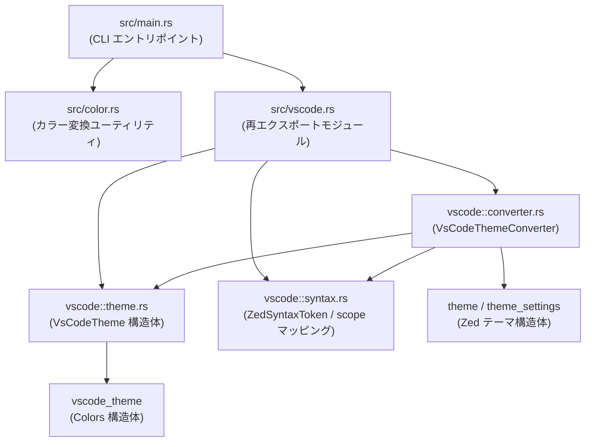
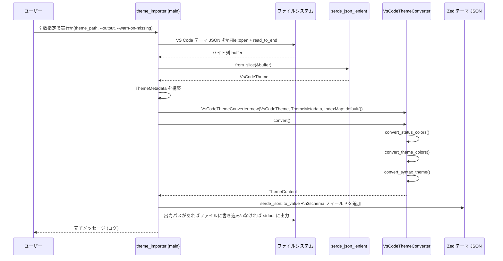

# theme_importer/ コード解説

## 1. ざっくり一言

VS Code のテーマ JSON ファイル（`colors` / `tokenColors`）を読み込み、Zed エディタ用のテーマ JSON（`theme_settings::ThemeContent` / Zed テーマスキーマ v0.2.0）に変換して出力する CLI ツールです。

---

## 2. このモジュールの役割

### 2.1 概要

- この crate は **VS Code テーマ → Zed テーマ** の一方向変換を行います。
- コマンドライン引数で VS Code テーマファイルのパスと出力先を受け取り、  
  `vscode_theme` crate が提供する構造体にパースしたあと、`theme_settings` crate の `ThemeContent` にマッピングします。
- シンタックスハイライトの色付けは、VS Code テーマの `tokenColors` の scope を Zed 独自の `ZedSyntaxToken` 列挙体にマッピングすることで実現します。

### 2.2 アーキテクチャ内での位置づけ

crate 内の主要モジュールと外部クレートとの依存関係は、概ね次のようになっています。



- `src/main.rs` が CLI のエントリポイントです。
- `src/vscode.rs` は `converter.rs`, `syntax.rs`, `theme.rs` をまとめて公開するモジュールです。
- 実際の VS Code テーマ JSON のパースは `VsCodeTheme`（`theme.rs`）を通じて `vscode_theme::Colors` を利用して行われます。
- `VsCodeThemeConverter` が中心となり、VS Code の `colors` / `tokenColors` から Zed の `ThemeContent` を組み立てます。
- `color.rs` は HSLA と HEX の変換ユーティリティですが、現状本番コードからは直接は呼ばれておらず、主にテストで使用されています。

### 2.3 設計上のポイント

- **CLI 指向・ stateless**
  - メインの処理は `main()` → `VsCodeThemeConverter::convert()` の一回きりのフローで完結し、永続的な状態は持ちません。
- **外部クレートへの依存を活用**
  - VS Code テーマのパースは `vscode_theme` / `serde_json_lenient` に委譲し、Zed テーマの構造は `theme` / `theme_settings` に従っています。
- **シンタックスハイライトのマッピングを列挙体で表現**
  - Zed 側のすべてのシンタックス種別を `ZedSyntaxToken` の enum として定義し、そこから VS Code の TextMate scope 文字列群へマッピングしています。
  - `strum::EnumIter` を利用して、すべての `ZedSyntaxToken` を列挙しながらマッチング処理を行っています。
- **ログベースのデバッグ**
  - `simplelog::TermLogger` で `LevelFilter::Trace` までのログを出力し、マッピングに失敗したトークンなどを `log::warn!` / `log::info!` で可視化しています。
- **柔軟な JSON パース**
  - `serde_json_lenient` を使うことで、コメントやトレーリングカンマを含む VS Code テーマ JSON でもパースしやすくなっています。

---

## 3. 主要な機能一覧

この crate が提供する主な機能は次の通りです。

- **VS Code テーマ JSON の読み込み**
  - `VsCodeTheme`（`colors` / `tokenColors`）へのデシリアライズ。
- **テーマメタデータの構築**
  - テーマ名や外観（Light/Dark）などを `ThemeMetadata` にまとめる。
- **Zed テーマ用ステータスカラーの生成**
  - VS Code の Git decoration, editor error/warning/info などから `StatusColorsContent` を構築。
- **Zed テーマ用 UI カラーの生成**
  - VS Code の `colors` を Zed の `ThemeColorsContent` にマッピング（エディタ背景、スクロールバー、タブ背景など）。
- **シンタックスハイライトテーマの生成**
  - `tokenColors` と TextMate scope をもとに、`IndexMap<String, HighlightStyleContent>` 形式の Zed シンタックステーマを生成。
- **フォントスタイル・フォントウェイトの解釈**
  - VS Code の `fontStyle` 文字列から Zed の `FontStyleContent` / `FontWeightContent` を推定。
- **カラー変換ユーティリティ（テスト用）**
  - HEX 文字列 ↔ HSLA 形式の相互変換と、そのラウンドトリップ性の検証。

---

## 4. 関数・構造体の解説

### 4.1 主要な構造体・列挙体

| 名前 | 種別 | 役割 / 用途 |
|------|------|------------|
| `ThemeAppearanceJson` | enum | JSON から読み込む Light/Dark フラグを表す（Zed 側の `Appearance` / `AppearanceContent` に変換される） |
| `ThemeMetadata` | struct | テーマ名・ファイル名・外観情報など、VS Code テーマに付随するメタ情報を保持する |
| `Args` | struct | CLI 引数定義（テーマファイルパス、`--warn-on-missing`、`--output`） |
| `VsCodeTheme` | struct | VS Code テーマ JSON 全体を表す（`colors`, `tokenColors` など） |
| `VsCodeTokenScope` | enum | `tokenColors[*].scope` の形式（単一文字列 or 文字列配列）を抽象化した enum |
| `VsCodeTokenColor` | struct | VS Code の 1 つの tokenColor エントリ（名前、scope、設定） |
| `VsCodeTokenColorSettings` | struct | tokenColor の `foreground`, `background`, `fontStyle` などの詳細設定 |
| `ZedSyntaxToken` | enum | Zed 側で使用されるシンタックス種別（`comment`, `string`, `type` など） |
| `VsCodeThemeConverter` | struct | `VsCodeTheme` + `ThemeMetadata` を Zed の `ThemeContent` に変換する中心的コンバータ |
| `Hsla`（外部） | struct | `gpui` crate の HSLA カラー表現（`color.rs` の変換対象） |

以下では、特に重要な関数・メソッドを取り上げて詳しく説明します。

---

### 4.2 主要な関数・メソッドの詳細

#### 4.2.1 `fn main() -> Result<()>`

**概要**

- CLI エントリポイントです。
- VS Code テーマファイルの読み込み → パース → Zed テーマへの変換 → JSON 出力、という一連の処理を行います。

**引数**

- なし（`clap::Parser` により `Args` 構造体へ自動的に詰められます）。

`Args` の中身:

| フィールド名 | 型 | 説明 |
|-------------|----|------|
| `theme_path` | `PathBuf` | 変換対象の VS Code テーマ JSON ファイルへのパス（必須の位置引数） |
| `warn_on_missing` | `bool` | 不足している値に関する警告ログを出すかどうか（`--warn-on-missing`） |
| `output` | `Option<PathBuf>` | 出力ファイルパス（`--output` / `-o`）。指定しない場合は標準出力に JSON を出す |

**戻り値**

- `anyhow::Result<()>`
  - ファイル I/O や JSON パースに失敗した場合は `Err` を返します。

**内部処理の流れ**

1. `Args::parse()` でコマンドライン引数をパースします。
2. `simplelog::ConfigBuilder` でロガー設定を行います。
   - `warn_on_missing` が `false` の場合、`"theme_printer"` というログターゲットをフィルタリングします。
3. `TermLogger::init(...)` でターミナルロガーを初期化します。
4. `File::open(theme_path)` → `read_to_end(&mut buffer)` で VS Code テーマファイルを全読み込みします。
   - 失敗した場合はログにパスを出しつつ、そのままエラーを返します。
5. `serde_json_lenient::from_slice(&buffer)` で `VsCodeTheme` にデシリアライズします。
   - 失敗時には `context("failed to parse theme ...")` を付与したエラーを返します。
6. `ThemeMetadata` を構築します。
   - `name`: `vscode_theme.name` を使い、なければ空文字列。
   - `appearance`: 現状 `ThemeAppearanceJson::Dark` に固定。
   - `file_name`: 空文字列（このチャンクではどこからも使われていません）。
7. `VsCodeThemeConverter::new(vscode_theme, theme_metadata, IndexMap::default())` でコンバータを構築します。
   - `syntax_overrides` は空の `IndexMap`（シンタックス上書きは現状 CLI からは指定されません）。
8. `converter.convert()?` で `ThemeContent` を生成します。
9. `serde_json::to_value(theme)` によって `serde_json::Value` に変換し、ルートに `$schema` フィールドを追加します。
   - 値は `https://zed.dev/schema/themes/v0.2.0.json` です。
10. `serde_json::to_string_pretty(&theme)` で整形済み JSON 文字列に変換します。
11. `output` 引数が指定されていればファイルに書き込み、無ければ標準出力に表示します。
12. `"Done!"` を `log::info!` で出力して終了します。

**Edge cases（エッジケース）**

- テーマファイルパスが存在しない / 読めない場合
  - `"Failed to open file at path: ..."` を `info` ログに出し、I/O エラーとして終了します。
- JSON の形式が `VsCodeTheme` の構造と合わない場合
  - `serde_json_lenient` のパースエラーとなり、`context` 付きで `Err` を返します。
- `vscode_theme.name` が `None` の場合
  - `ThemeMetadata.name` は空文字列になります。
- 出力パスが書き込み不可の場合
  - `File::create` / `write_all` がエラーになり、そのまま `Err` が返されます。

**使用上の注意点**

- `theme_path` には VS Code テーマ JSON（`"colors"`, `"tokenColors"` を含む）のパスを指定する前提です。
- JSON パースには lenient パーサが使われますが、VS Code テーマとして根本的に壊れているファイルは変換できません。
- 現状 `appearance` は常に `Dark` として扱われる点に注意が必要です（Light テーマをインポートしても、Zed 側では Dark として扱われます）。

---

#### 4.2.2 `impl VsCodeThemeConverter { pub fn convert(self) -> Result<ThemeContent> }`

**概要**

- VS Code テーマ全体（`VsCodeTheme`）とメタデータ（`ThemeMetadata`）から、Zed の `ThemeContent` を構築するメインの変換メソッドです。

**引数**

| 引数名 | 型 | 説明 |
|--------|----|------|
| `self` | `VsCodeThemeConverter` | VS Code テーマ本体、メタデータ、シンタックス上書き設定を含むコンバータ |

**戻り値**

- `Result<ThemeContent>`
  - Zed テーマ JSON にそのままシリアライズ可能な構造体です。

**内部処理の流れ**

1. `appearance` を `self.theme_metadata.appearance.into()` により `AppearanceContent` 型に変換します。
2. `convert_status_colors()` を呼び出し、`StatusColorsContent` を得ます。
3. `convert_theme_colors()` を呼び出し、`ThemeColorsContent` を得ます。
4. `convert_syntax_theme()` を呼び出し、`IndexMap<String, HighlightStyleContent>` 型のシンタックステーマを得ます。
5. それらをまとめて `ThemeContent` を構築します。

生成される `ThemeContent` の `style` フィールドは概ね次のようになります。

- `window_background_appearance`: `Some(WindowBackgroundContent::Opaque)`
- `accents`: 空の `Vec`（VS Code のどこから拾うかはまだ実装されていません）
- `colors`: `convert_theme_colors()` の結果
- `status`: `convert_status_colors()` の結果
- `players`: 空の `Vec`
- `syntax`: `convert_syntax_theme()` の結果

**Edge cases**

- 現在の実装では `convert_*` 内で `?` を使ったエラー伝播はしていないため、このメソッド自体は常に `Ok` を返します。
  - ただし、今後の変更で `Result` を返す処理が追加される可能性があります。
- `syntax` マップが空でもそのまま `ThemeContent` として返されます。
  - その場合でも UI カラーは設定されているため、Zed テーマとしては成立しますが、ハイライトが不足する可能性があります。

**使用上の注意点**

- `ThemeMetadata` 内の `appearance` と VS Code テーマ本体の実際の見た目が一致している保証はありません。呼び出し側が責任を持って設定する前提です。
- `syntax_overrides` を利用したい場合は、`VsCodeThemeConverter::new` に non-empty の `IndexMap` を渡す必要があります（現行の `main` は常に空を渡しています）。

---

#### 4.2.3 `fn convert_status_colors(&self) -> Result<StatusColorsContent>`

**概要**

- VS Code テーマの `colors` から、Zed テーマのステータス系カラー（エラー、警告、Git 差分など）を構築します。

**引数 / 戻り値**

- 引数: `&self`
- 戻り値: `Result<StatusColorsContent>`

**内部処理の流れ**

1. `let vscode_colors = &self.theme.colors;` で VS Code 側の Colors 構造体への参照を取得します。
2. `vscode_base_status_colors` として、`hint` にだけデフォルト値 `"#969696ff"` を持つ `StatusColorsContent` を作ります。
3. `StatusColorsContent` を構築し、各フィールドに VS Code の対応する色を割り当てます。
   - 例:
     - `conflict`: `vscode_colors.git_decoration.conflicting_resource_foreground.clone()`
     - `created`: `vscode_colors.editor_gutter.added_background.clone()`
     - `error`: `vscode_colors.editor_error.foreground.clone()`
     - `warning`: `vscode_colors.editor_warning.foreground.clone()`
   - `hint` は `editor_inlay_hint.foreground` があればそれを使い、無ければ `vscode_base_status_colors.hint` を使います。
4. `..Default::default()` で指定されていないフィールドには `Default` 実装に任せます。
5. 構築した `StatusColorsContent` を `Ok` で返します。

**Edge cases**

- 対応する VS Code 側のフィールドが `None` の場合、そのまま `None` として Zed 側に渡されます。
- `editor_inlay_hint.foreground` がない場合でも、`hint` には `"#969696ff"` が必ず入ります（このファイル内での唯一の強制デフォルトです）。

**使用上の注意点**

- `vscode_theme::Colors` のフィールドの存在有無に依存するため、テーマによっては Zed 側の一部ステータスカラーが `None` になる可能性があります。
- そうした不足については、この crate 内ではログ警告やエラーにはしていません。

---

#### 4.2.4 `fn convert_theme_colors(&self) -> Result<ThemeColorsContent>`

**概要**

- VS Code テーマの `colors` セクションを、Zed テーマの UI カラーセット `ThemeColorsContent` にマッピングします。

**引数 / 戻り値**

- 引数: `&self`
- 戻り値: `Result<ThemeColorsContent>`

**内部処理の流れ（要約）**

1. `vscode_colors` として `self.theme.colors` への参照を取得します。
2. よく参照するフィールドをローカル変数に保持します。
   - 例: `panel.border`, `tab.inactive_background`, `editor.foreground`, `editor.background`, `scrollbar_slider.background` など。
3. `vscode_token_colors_foreground` を求めます。
   - `token_colors` 配列から、`scope == None` かつ `settings.foreground` が設定されている最初のエントリの `foreground` を取得します。
   - これは「デフォルトのテキスト色」のような位置付けです。
4. `ThemeColorsContent` の各フィールドに VS Code 側の色を割り当てます。
   - 例:
     - `border`: `panel.border`
     - `background`: `editor.background`
     - `editor_foreground`: `editor.foreground` があればそれを使い、なければ `vscode_token_colors_foreground`
     - `editor_background`: `editor.background`
     - `terminal_ansi_*`: `terminal.ansi_*` をそのままコピー
     - `scrollbar_thumb_background`: `scrollbar_slider.background`
5. 一部フィールドでは `Option::or` でフォールバックを指定します。
   - 例: `toolbar_background` は `breadcrumb.background` がなければ `editor.background` にフォールバックします。
6. 指定されていないフィールドには `..Default::default()` でデフォルト値を適用します。

**Edge cases**

- `editor.foreground` も `vscode_token_colors_foreground` も `None` の場合
  - `editor_foreground` は `None` のままになります。
- VS Code テーマが特定の UI 要素用の色を定義していない場合
  - 対応する Zed 側のフィールドも `None` のまま（`Default` による値）になります。
- `vscode_token_colors_foreground` は `scope == None` の tokenColor を前提にしているため、テーマによっては存在しない可能性があります。

**使用上の注意点**

- ここでのマッピングは VS Code テーマの構造と Zed テーマの構造に依存しているため、VS Code テーマの色定義が不足していると、Zed での見た目も部分的にデフォルトや未設定になります。
- 色値は文字列としてそのままコピーされており、この crate 内では HEX 形式の妥当性検証などは行っていません（検証は VS Code テーマ作成側に委ねられています）。

---

#### 4.2.5 `fn convert_syntax_theme(&self) -> Result<IndexMap<String, HighlightStyleContent>>`

**概要**

- Zed 側のシンタックス種別 `ZedSyntaxToken` を、VS Code テーマの `tokenColors` と照らし合わせて `HighlightStyleContent` に変換し、  
  `syntax` 用のマップ（キー: `"comment"`, `"string"` 等）を構築します。

**引数 / 戻り値**

- 引数: `&self`
- 戻り値: `Result<IndexMap<String, HighlightStyleContent>>`
  - キー: `ZedSyntaxToken::to_string()` した文字列（例: `"comment"`, `"string.escape"`）
  - 値: 色・背景・フォントスタイルを含む `HighlightStyleContent`

**内部処理の流れ**

1. 空の `IndexMap`（`highlight_styles`）を作成します。
2. `ZedSyntaxToken::iter()` で全シンタックストークンを列挙します（`strum::EnumIter` の機能）。
3. 各 `syntax_token` について次を行います:
   1. `syntax_overrides` に同名キーがあるか確認します。
      - あれば、その値（`Vec<String>`）を `VsCodeTokenScope::Many` に包んだものと一致する `token_color` を `token_colors` 内から検索します。
   2. override が見つからなければ、`syntax_token.find_best_token_color_match(&self.theme.token_colors)` を呼び出します。
   3. それでも見つからなければ、`syntax_token.fallbacks()` に定義されたフォールバックトークンについて同様の探索を行います。
   4. いずれも見つからない場合、`log::warn!("No matching token color found for '{syntax_token}'")` を出して次のトークンに進みます。
4. マッチした `token_color` については、次のように `HighlightStyleContent` を構築します。
   - `color`: `token_color.settings.foreground.clone()`
   - `background_color`: `token_color.settings.background.clone()`
   - `font_style`: `token_color.settings.font_style.as_ref().and_then(try_parse_font_style)`
   - `font_weight`: `token_color.settings.font_style.as_ref().and_then(try_parse_font_weight)`
5. `highlight_style.is_empty()` が `true` の場合（いずれのプロパティも設定されていない）、マップには追加しません。
6. そうでなければ `highlight_styles.insert(syntax_token.to_string(), highlight_style);` でマップに登録します。
7. 全ての `ZedSyntaxToken` について処理したら、`Ok(highlight_styles)` を返します。

**Edge cases**

- `syntax_overrides` は `IndexMap<String, Vec<String>>` であり、`Vec<String>` の内容と順序が VS Code テーマの `tokenColors[*].scope` と完全一致する場合のみ override が適用されます。
  - この crate の `main` では常に空の `IndexMap` を渡しているため、現時点では override 機能は実質未使用です。
- 対応する `token_color` が見つからない `ZedSyntaxToken` については、ログに警告が出るだけでエラーにはなりません。
  - そのトークン種別は Zed テーマの `syntax` マップに含まれなくなります。
- `HighlightStyleContent` が空（色・背景・フォントスタイルのいずれも設定なし）の場合は、あえてマップに含めない設計になっています。

**使用上の注意点**

- `syntax_overrides` を活用したい場合、VS Code テーマの `scope` の表現方法（単一文字列か配列か、複数 scope をカンマ区切りで書いているか）を理解した上で、完全一致する `Vec<String>` を用意する必要があります。
- すべての `ZedSyntaxToken` に対してマッチングを試みますが、マッチしなかったからといってプログラムは失敗しません。ハイライトの抜けがあっても変換自体は成功します。

---

#### 4.2.6 `fn find_best_token_color_match(&self, token_colors: &[VsCodeTokenColor]) -> Option<&VsCodeTokenColor>`

`ZedSyntaxToken` に実装されているメソッドです。

**概要**

- 自身（`ZedSyntaxToken`）に最もよくマッチする VS Code の `VsCodeTokenColor` をヒューリスティックに 1 件選びます。

**引数**

| 引数名 | 型 | 説明 |
|--------|----|------|
| `&self` | `&ZedSyntaxToken` | 対象となる Zed 側のシンタックス種別 |
| `token_colors` | `&[VsCodeTokenColor]` | VS Code テーマの `tokenColors` 配列 |

**戻り値**

- `Option<&VsCodeTokenColor>`
  - マッチ候補があれば、その中で最もスコアが高いもの。
  - 無ければ `None`。

**内部処理の流れ**

1. 空の `IndexMap<usize, u32>`（`ranked_matches`）を用意します。
   - キー: `token_colors` 配列内のインデックス
   - 値: マッチスコア（`rank`）
2. `token_colors` をインデックス付きで走査します。
   1. `token_color.settings.foreground` が `None` のものはスキップします（色が設定されていない tokenColor は候補外）。
   2. `self.rank_match(token_color)` を呼び出してマッチスコアを計算します。
      - `scope` が `None` の場合などは `None` が返され、候補外になります。
   3. `rank > 0` のものだけを `ranked_matches` に追加します。
3. `ranked_matches` の中から、`rank` が最大のものを `max_by_key(|(_, rank)| *rank)` で選び、そのインデックスに対応する `&token_colors[ix]` を返します。

`rank_match` の概要:

- `VsCodeTokenScope` から候補 scope 群を `Vec<&str>` に展開します。
  - `"scope1, scope2"` のようなカンマ区切り文字列は分割され、個々の scope として扱われます。
- `self.to_vscode()` で「この `ZedSyntaxToken` が対応しうる TextMate scope 表現」のリストを取得します。
  - リストの先頭に近いものほど優先度が高い前提で、重み付けを行います。
- 各 scope ごとに `candidate_scopes.contains(&scope)` ならば、`matches += 1 + weight` を加算します。
  - `weight = (number_of_scopes_to_match - ix) as u32` により、リストの前の方にある scope のマッチほどスコアが高くなります。
- 最終的なスコア（`matches`）を `Some(matches)` として返します。

**Edge cases**

- `self.to_vscode()` が空のベクタを返すトークン（例: `Hint`, `Predictive`, `Primary`）では、マッチングスコアは常に 0 となり、候補には採用されません。
  - その場合は `fallbacks()` で別の `ZedSyntaxToken` に委ねる設計です。
- `VsCodeTokenScope::One` と `VsCodeTokenScope::Many` の両方に対応していますが、`Many` の要素が 1 つでも `"a, b"` のようにカンマ区切りで複数を書いている場合、それらも分割して個別 scope として扱われます。

**使用上の注意点**

- このメソッドは「最もそれらしい候補」を 1 つ返すだけであり、複数の候補を返すことはありません。
- `tokenColors` の順序はスコア計算に直接は使われませんが、同スコアの候補が複数ある場合にどちらが選ばれるかは `max_by_key` の実装依存です。

---

#### 4.2.7 `try_parse_color(color: &str) -> Result<Hsla>` / `pack_color(color: Hsla) -> u32`

`src/color.rs` に定義されているユーティリティ関数です。現状、本番コードからは直接は呼ばれておらず、テストで主に利用されています。

**概要**

- `try_parse_color` は HEX 文字列（例: `"#b4637aff"`）から `gpui::Hsla` 型への変換を行います。
- `pack_color` は `gpui::Hsla` から `u32` への変換を行い、`format!("#{:x}", packed)` のようにして HEX 文字列に戻せる形式を生成します。

**引数 / 戻り値**

`try_parse_color`:

| 引数名 | 型 | 説明 |
|--------|----|------|
| `color` | `&str` | `gpui::Rgba::try_from` が解釈できるカラー文字列（主に `#RRGGBBAA` 形式） |

- 戻り値: `Result<Hsla>`
  - 変換に成功すれば `Ok(Hsla)`、解釈できない文字列の場合はエラー。

`pack_color`:

| 引数名 | 型 | 説明 |
|--------|----|------|
| `color` | `Hsla` | Zed / gpui で利用される HSLA カラー（0〜1 の正規化値） |

- 戻り値: `u32`
  - ARGB などの 32bit 整数形式にパックされたカラー値（`format!("#{:x}", value)` で HEX 表現にできます）。

**内部処理の流れ（try_parse_color）**

1. `gpui::Rgba::try_from(color)?` で文字列から RGBA へ変換します。
2. `palette::rgb::Srgba::from_components((r, g, b, a))` で `palette` crate の `Srgba` に変換します。
3. `palette::Hsla::from_color(rgba)` で HSLA 空間に変換します。
4. `gpui::hsla(...)` 関数で、`hue` を度数（0〜360）から 0〜1 の値に正規化し、`gpui::Hsla` を構築します。

**内部処理の流れ（pack_color）**

1. `palette::Hsla::from_components((color.h * 360., color.s, color.l, color.a))` で `gpui::Hsla` を `palette::Hsla` に変換します。
2. `palette::rgb::Srgba::from_color(hsla)` で RGBA に変換します。
3. `rgba.into_format::<u8, u8>()` で 0〜255 の整数表現に変換します。
4. `u32::from(rgba)` で 32 bit 整数にパックします。

**テストコードの挙動**

```rust
#[test]
pub fn test_serialize_color() {
    let color = "#b4637aff";                       // 入力となる HEX カラー文字列
    let hsla = try_parse_color(color).unwrap();    // HSLA に変換
    let packed = pack_color(hsla);                 // 再び u32 にパック

    assert_eq!(format!("#{:x}", packed), color);   // 元の文字列と一致することを確認
}
```

このように、`try_parse_color` と `pack_color` を組み合わせると、HEX 文字列 → HSLA → HEX 文字列のラウンドトリップが成立することが確認されています。

**使用上の注意点**

- `gpui::Rgba::try_from` が解釈できない形式（例: 不正な長さ、文字）を渡すと `Err` になります。
- `Hsla` の `h`（色相）は 0〜1 の正規化値として期待されており、`pack_color` では内部的に `* 360.` されています。

---

### 4.3 その他の関数・メソッド（一覧）

| 関数名 / メソッド名 | 役割（1 行） |
|----------------------|-------------|
| `try_parse_font_weight(font_style: &str)` | `"bold"` を含む `fontStyle` 文字列から `FontWeightContent::BOLD` を返す |
| `try_parse_font_style(font_style: &str)` | `"italic"` / `"oblique"` を含む `fontStyle` 文字列から `FontStyleContent` を返す |
| `ZedSyntaxToken::fallbacks(&self)` | 特定のトークン（`CommentDoc`, `Number`, `VariableSpecial` 等）のフォールバック先トークンを返す |
| `ZedSyntaxToken::to_vscode(self)` | 各 `ZedSyntaxToken` が対応しうる VS Code の TextMate scope 文字列のリストを返す |

---

## 5. データフロー

ここでは、典型的な「VS Code テーマファイルを Zed テーマ JSON に変換する」処理のデータフローを説明します。

1. ユーザーが CLI で `theme_importer` を実行し、VS Code テーマファイルパスと出力パスを指定します。
2. `main()` がファイルを読み込み、`serde_json_lenient` で `VsCodeTheme` にパースします。
3. `ThemeMetadata` とともに `VsCodeThemeConverter` を生成し、`convert()` を呼び出します。
4. `convert()` は `convert_status_colors` / `convert_theme_colors` / `convert_syntax_theme` を順に呼び、`ThemeContent` を構築します。
5. `ThemeContent` は `serde_json::Value` に変換され、`$schema` フィールドが追加された後、整形済み JSON としてファイルまたは標準出力に書き出されます。

これを sequence diagram で表すと次のようになります。



---

## 6. 使い方（How to Use）

### 6.1 基本的な使用方法

README に記載されている通り、もっとも基本的な使い方は次のようになります。

```sh
cargo run -p theme_importer -- dark-plus-syntax-color-theme.json --output output-theme.json
# ^^^^^^^^^^^^^^^^^^^^^^^^^^  ^^^^^^^^^^^^^^^^^^^^^^^^^^^^^^^^   ^^^^^^^^^^^^^^^^^^^^^^^
# ワークスペース内の theme_importer バイナリを実行           # 入力 VS Code テーマ JSON  # 出力 Zed テーマ JSON のパス
```

このコマンドにより、`dark-plus-syntax-color-theme.json` を読み込み、対応する Zed テーマ JSON を `output-theme.json` に書き出します。

簡単に挙動を要約すると:

- `theme_path` 引数 → `dark-plus-syntax-color-theme.json`
- `--output` → `Some(PathBuf::from("output-theme.json"))`
- `--warn-on-missing` は指定されていないため `false`（ログフィルタが有効になります）

### 6.2 よくある使用パターン

**1. 標準出力に直接出したい場合**

`--output` を省略すると、結果の JSON が標準出力に出力されます。シェルのリダイレクト機能と組み合わせることもできます。

```sh
cargo run -p theme_importer -- my-theme.json > my-zed-theme.json
# --output を指定しない → main 内で println! される
# シェル側で標準出力をファイルにリダイレクト
```

**2. マッピングの警告を詳細に見たい場合**

`--warn-on-missing` を指定すると、`theme_printer` というログターゲットのフィルタが無効化され、より多くのログが表示される想定です（このチャンク内では `theme_printer` ログは登場していませんが、他モジュールとの連携が想定されます）。

```sh
cargo run -p theme_importer -- my-theme.json --warn-on-missing
# 不足している色やマッピングに関するログが、より多く表示される前提
```

**3. 複数テーマファイルを一括変換したい場合（シェルスクリプト側）**

Rust コードを変更しなくても、シェル側でループを書くことで複数テーマを変換できます。

```sh
for f in themes/*.json; do
  out="zed-$(basename "$f")"
  cargo run -p theme_importer -- "$f" --output "out-themes/$out"
done
```

### 6.3 使用上の注意点（まとめ）

- **入力ファイルの前提**
  - 入力の VS Code テーマは、`VsCodeTheme` および `vscode_theme::Colors` と互換の JSON 構造である必要があります。
  - `serde_json_lenient` を使用しているため、コメントや軽微なフォーマットの揺れには比較的寛容ですが、構造そのものが異なる JSON は変換できません。
- **Light / Dark の扱い**
  - 現在の `main` 実装では、テーマの Light/Dark 判定を自動では行っておらず、`ThemeMetadata.appearance` に `Dark` を固定しています。
- **未設定の色の扱い**
  - VS Code テーマにない色は、そのまま `None` または `Default` 値として Zed テーマに渡されます。  
    これにより、Zed 側で「デフォルトに落ちる」か、あるいは視覚的に期待と異なる挙動になる可能性があります。
- **シンタックスマッピングの不足**
  - すべての `ZedSyntaxToken` に対してマッチングが試みられますが、マッチしなかったトークンは単にログに警告が出るだけで、変換処理自体は続行されます。
- **ライブラリとしての利用**
  - この crate は `src/main.rs` を持つバイナリ crate であり、`src/lib.rs` がないため、他 crate から依存関係として `VsCodeThemeConverter` 等を直接利用する設計にはなっていません（利用したい場合はライブラリ化などの変更が必要です）。

---

## 7. 関連ファイル

この crate に含まれるファイルとその役割は次の通りです。

| パス | 役割 / 関係 |
|------|------------|
| `theme_importer/Cargo.toml` | crate 名・版数・依存クレート（`anyhow`, `clap`, `theme`, `theme_settings`, `vscode_theme` など）を定義する |
| `theme_importer/README.md` | 基本的な実行例（`cargo run -p theme_importer -- ...`）を示す簡易 README |
| `theme_importer/src/main.rs` | CLI エントリポイント。引数パース、ファイル I/O、`VsCodeThemeConverter` の呼び出し、および JSON 出力を行う |
| `theme_importer/src/color.rs` | HEX 文字列と `gpui::Hsla` との相互変換ユーティリティおよびそのテスト（現状、本番フローからは直接利用されていない） |
| `theme_importer/src/vscode.rs` | `vscode::converter`, `vscode::syntax`, `vscode::theme` をサブモジュールとして読み込み、`pub use` で再エクスポートするモジュール |
| `theme_importer/src/vscode/converter.rs` | `VsCodeThemeConverter` 本体と、フォントスタイル・フォントウェイトのパーサなどを定義。VS Code テーマから Zed テーマへの主変換ロジックを持つ |
| `theme_importer/src/vscode/syntax.rs` | VS Code の `tokenColors` を表す型 (`VsCodeTokenScope`, `VsCodeTokenColor`, `VsCodeTokenColorSettings`) と、Zed 側の `ZedSyntaxToken` および scope マッピング・マッチングロジックを定義 |
| `theme_importer/src/vscode/theme.rs` | VS Code テーマ全体 (`VsCodeTheme`) のデシリアライズ定義。`vscode_theme::Colors` を内包し、`tokenColors` 配列も保持する |

この構成を把握しておくことで、たとえば「UI カラーの変換ロジックを変更したい場合は `vscode/converter.rs` の `convert_theme_colors` を見る」といった形で、目的に応じて参照すべきファイルを特定しやすくなります。
