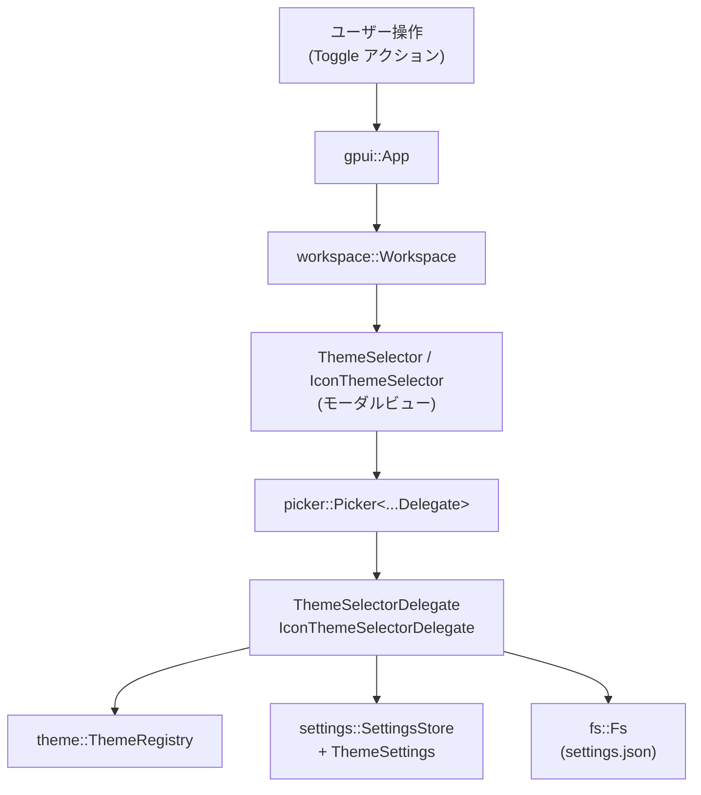
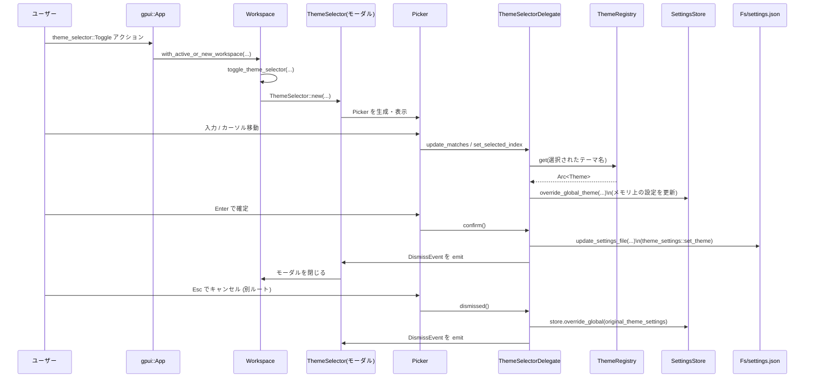

## 1. ざっくり一言

`theme_selector` クレートは、Zed エディタ内で「テーマ」と「アイコンテーマ」を選択するモーダル UI を提供し、  
選択内容をリアルタイムにプレビューしつつ、確定時に設定ファイルへ保存するためのロジックをまとめたモジュールです。

---

## 2. このモジュールの役割

### 2.1 概要

- このディレクトリは、エディタの **カラーテーマ** と **アイコンテーマ** を
  - モーダルダイアログで一覧表示し
  - ファジー検索で絞り込み
  - 選択中は即座にプレビューを反映し
  - 確定時に設定ファイル（`settings.json` 相当）へ書き戻す
  ための機能を提供します。
- テーマの「一時的な適用」と「キャンセル時のロールバック」を含む挙動を、このクレート内部で完結させています。

### 2.2 アーキテクチャ内での位置づけ

このクレートは、`gpui` の `App` / `Workspace` と、`theme` / `theme_settings` / `settings` / `fs` 等のクレートとの間に位置し、  
ユーザー操作（アクション）を起点に、テーマ選択 UI と設定の更新を仲介します。

主要コンポーネント間の依存関係は、次のようになっています。



- `init` 関数が `App` にアクションハンドラを登録します。
- アクションが発行されると `Workspace` 上にモーダル (`ThemeSelector` / `IconThemeSelector`) が開きます。
- モーダル内部では `Picker<...Delegate>` がリスト表示とファジーマッチングを担当し、`Delegate` がテーマ適用と設定更新を行います。

### 2.3 設計上のポイント

コードから読み取れる特徴を挙げます。

- **ビューとロジックの分離**
  - `ThemeSelector` / `IconThemeSelector` はほぼ「Picker を入れたコンテナ UI」に専念しています。
  - 実際の状態管理・設定更新・マッチングは、`ThemeSelectorDelegate` / `IconThemeSelectorDelegate` が担当します。
- **一時的なプレビューとロールバック**
  - カーソル移動や検索結果選択時点で、テーマを即時適用します（`show_selected_theme`）。
  - モーダルをキャンセル（dismiss）した場合は、元のテーマ設定に戻す処理があります。
- **グローバル設定とローカル選択状態の両立**
  - `ThemeSettings::get_global` / `SettingsStore::update_global` で「メモリ上のグローバル設定」を更新します。
  - `update_settings_file` と `fs::Fs` により、確定時にのみ設定ファイルを書き換えます。
- **ファジー検索の非同期処理**
  - `update_matches` で `fuzzy::match_strings` をバックグラウンド実行し、完了後に `this.update` で UI を更新する構造です。
- **動的テーマモードへの対応**
  - テーマについては `ThemeSelection::Dynamic` / `ThemeAppearanceMode` を考慮し、
    システム外観と新テーマの外観に応じてモードや light/dark ペアを更新する補助関数を提供します。
- **エクスポートされた API は最小限**
  - このクレートの外部から直接使うのは基本的に `init` 関数のみで、
    他は `Workspace` や `zed_actions` によって間接的に利用される構造になっています。

---

## 3. 主要な機能一覧

このディレクトリが提供する主な機能は次のとおりです。

- テーマセレクタ表示: カラーテーマを選択するモーダル UI (`ThemeSelector`) の表示・制御
- アイコンテーマセレクタ表示: アイコンテーマを選択するモーダル UI (`IconThemeSelector`) の表示・制御
- ファジー検索による絞り込み: ユーザーの入力に応じてテーマリストをファジーマッチで絞り込み
- リアルタイムプレビュー:
  - テーマ：カーソルを移動した時点で `ThemeRegistry` からテーマをロードし、グローバル設定を一時的に上書き
  - アイコンテーマ：選択変更ごとに `ThemeSettings.icon_theme` を更新
- キャンセル時のロールバック:
  - テーマ：モーダルオープン前の `ThemeSettings` 全体を復元
  - アイコンテーマ：モーダルオープン前の `IconThemeName` を復元
- 設定ファイルへの永続化:
  - テーマ：`theme_settings::set_theme` を通じてテーマ名・外観・システム外観を `settings.json` に書き込み
  - アイコンテーマ：`theme_settings::set_icon_theme` を通じてアイコンテーマ名を保存
- テレメトリ送信: テーマ変更時に `"Settings Changed"` イベントを発火
- ドキュメント／拡張インストーラへの導線:
  - テーマ・アイコンテーマのドキュメント URL を開くボタン
  - テーマ／アイコンテーマ拡張のインストールビューを開くボタン
- アクション定義:
  - `actions!` マクロにより `theme_selector::Reload` アクション型を定義（このチャンク内では未使用）

---

## 4. 関数・構造体の解説

### 4.1 主な構造体・型一覧

| 名前 | 種別 | 可視性 | 役割 / 用途 |
|------|------|--------|-------------|
| `ThemeSelector` | 構造体 | クレート内のみ | テーマ選択用モーダルビュー本体。内部で `Entity<Picker<ThemeSelectorDelegate>>` を保持します。 |
| `ThemeSelectorDelegate` | 構造体 | クレート内のみ | テーマセレクタのロジックを担当するデリゲート。テーマ一覧や選択状態、元の設定などを保持します。 |
| `IconThemeSelector` | 構造体 | `pub(crate)` | アイコンテーマ選択用モーダルビュー本体。構造は `ThemeSelector` とほぼ同様です。 |
| `IconThemeSelectorDelegate` | 構造体 | `pub(crate)` | アイコンテーマセレクタのロジック。アイコンテーマ一覧や元のアイコンテーマ名を管理します。 |
| `ThemeSelector::picker` | フィールド | - | `Picker<ThemeSelectorDelegate>` のエンティティ。リスト表示とキー操作を担当します。 |
| `ThemeSelectorDelegate::themes` | フィールド | - | `ThemeMeta` の一覧。テーマ候補のメタデータです。 |
| `ThemeSelectorDelegate::matches` | フィールド | - | ファジーマッチ済みの表示用 `StringMatch` の一覧です。 |
| `ThemeSelectorDelegate::original_theme_settings` | フィールド | - | モーダルオープン時点の `ThemeSettings`。キャンセル時の復元に使用します。 |
| `IconThemeSelectorDelegate::original_theme` | フィールド | - | モーダルオープン時点の `IconThemeName`。キャンセル時の復元に使用します。 |

この他、`override_global_theme` / `update_mode_if_new_appearance_is_different_from_system` /  
`retain_original_opposing_theme` といったヘルパー関数が、テーマ設定の更新ロジックをカプセル化しています。

### 4.2 主要関数の詳細

#### `pub fn init(cx: &mut App)`

**概要**

- `theme_selector` クレート全体の初期化関数です。
- `App` に対して、テーマセレクタとアイコンテーマセレクタを開くアクションハンドラを登録します。

**引数**

| 引数名 | 型 | 説明 |
|--------|----|------|
| `cx` | `&mut App` | `gpui` のアプリケーションコンテキスト。アクションハンドラの登録に使用します。 |

**戻り値**

- なし。

**内部処理の流れ**

1. `cx.on_action` を使って、`zed_actions::theme_selector::Toggle` アクションのハンドラを登録します。
2. ハンドラ内で `with_active_or_new_workspace` を呼び、アクティブな `Workspace`（なければ新規）を取得します。
3. 取得した `Workspace` に対して `toggle_theme_selector` を呼び出します。
4. 同様に、`zed_actions::icon_theme_selector::Toggle` アクションのハンドラも登録し、`toggle_icon_theme_selector` を呼び出すようにします。

**Edge cases（エッジケース）**

- この関数は何度でも呼ぶことが可能ですが、コード上で重複登録を防ぐ仕組みは見えません。
  - `App` 側が重複を許容するかどうかは、`gpui` の実装に依存します（このチャンクからは不明です）。

**使用上の注意点**

- 通常はアプリケーション起動時に一度だけ呼び出す前提で設計されていると考えられます（重複登録防止の仕組みがないため）。

---

#### `fn toggle_theme_selector(workspace: &mut Workspace, toggle: &zed_actions::theme_selector::Toggle, window: &mut Window, cx: &mut Context<Workspace>)`

**概要**

- テーマセレクタモーダルを開閉する内部関数です。
- すでに開いていれば閉じ、閉じていれば新たに `ThemeSelector` を生成して開きます。

**引数**

| 引数名 | 型 | 説明 |
|--------|----|------|
| `workspace` | `&mut Workspace` | モーダルを表示するワークスペース。 |
| `toggle` | `&zed_actions::theme_selector::Toggle` | 呼び出し元から渡されるアクション。`themes_filter` で候補テーマを絞り込みます。 |
| `window` | `&mut Window` | 表示対象のウィンドウ。 |
| `cx` | `&mut Context<Workspace>` | ワークスペース用 UI コンテキスト。エンティティやテーマへのアクセスに使用します。 |

**戻り値**

- なし。

**内部処理の流れ**

1. `workspace.app_state().fs.clone()` で `fs::Fs` の実装を取得します。
2. `workspace.toggle_modal(window, cx, |window, cx| { ... })` を呼び出します。
3. クロージャ内で
   - `ThemeSelectorDelegate::new` を呼び出し、`WeakEntity<ThemeSelector>`・`fs`・`toggle.themes_filter` からデリゲートを生成します。
   - `ThemeSelector::new(delegate, window, cx)` によりモーダルビューを生成し、`toggle_modal` に返します。
4. `toggle_modal` の挙動（開く / 閉じる）は `workspace` 側の実装に依存します（このチャンクからは詳細不明です）。

**使用上の注意点**

- `toggle.themes_filter` はオプションのフィルタとして使用され、`meta.name.to_string()` と比較されます。
  - 存在しないテーマ名を指定してもエラーにはならず、「その名前のテーマが候補に現れない」だけの挙動です。

---

#### `impl ThemeSelector { pub fn new(delegate: ThemeSelectorDelegate, window: &mut Window, cx: &mut Context<Self>) -> Self }`

**概要**

- テーマセレクタ用モーダルビュー `ThemeSelector` のコンストラクタです。
- 内部で `Picker::uniform_list` にデリゲートを渡し、`Entity<Picker<...>>` を生成します。

**引数**

| 引数名 | 型 | 説明 |
|--------|----|------|
| `delegate` | `ThemeSelectorDelegate` | テーマ選択ロジックを持つデリゲート。 |
| `window` | `&mut Window` | Picker を紐付けるウィンドウ。 |
| `cx` | `&mut Context<Self>` | `ThemeSelector` 用の UI コンテキスト。 |

**戻り値**

- `ThemeSelector` インスタンス。内部に `picker` エンティティを保持しています。

**内部処理の流れ**

1. `cx.new(|cx| Picker::uniform_list(delegate, window, cx))` を呼び出して、`Picker<ThemeSelectorDelegate>` の新しいエンティティを生成します。
2. 生成したエンティティを `picker` フィールドに格納し、`ThemeSelector` を返します。

**使用上の注意点**

- 外部から直接呼び出す想定ではなく、`toggle_theme_selector` 経由で利用されます。

---

#### `impl ThemeSelectorDelegate { fn new(selector: WeakEntity<ThemeSelector>, fs: Arc<dyn Fs>, themes_filter: Option<&Vec<String>>, cx: &mut Context<ThemeSelector>) -> Self }`

**概要**

- テーマセレクタのデリゲートを初期化し、利用可能なテーマ一覧とマッチ用データを構築します。

**引数**

| 引数名 | 型 | 説明 |
|--------|----|------|
| `selector` | `WeakEntity<ThemeSelector>` | 対応する `ThemeSelector` ビューへの弱い参照。Dismiss イベント送信等に使用します。 |
| `fs` | `Arc<dyn Fs>` | 設定ファイル更新時に利用するファイルシステム抽象。 |
| `themes_filter` | `Option<&Vec<String>>`（と解釈できる） | 表示対象テーマ名のフィルタリスト。`meta.name.to_string()` と比較されます。 |
| `cx` | `&mut Context<ThemeSelector>` | モーダルビュー用コンテキスト。 |

**戻り値**

- 初期化済みの `ThemeSelectorDelegate`。

**内部処理の流れ**

1. `cx.theme().clone()` により、現在適用中の `Arc<Theme>` を取得し `new_theme` として保持します。
2. `ThemeSettings::get_global(cx).clone()` で現在のテーマ設定全体を取得し、`original_theme_settings` に保存します。
3. `SystemAppearance::global(cx).0` で現在のシステム外観を取得し、`original_system_appearance` に保存します。
4. `ThemeRegistry::global(cx).list()` から全テーマのメタデータ一覧を取得し、`themes_filter` が指定されていれば `meta.name.to_string()` ベースでフィルタリングします。
5. `themes` を「明るいテーマ → 暗いテーマ」の順、その中を名前順にソートします。
6. `themes` から `StringMatch` の一覧 `matches` を構築します（初期スコア 0.0、ポジション空）。
7. 現在のテーマ名と一致する要素を `matches` から探し、そのインデックスを `selected_index` とします（見つからなければ 0）。
8. これらのフィールドを元に `ThemeSelectorDelegate` を構築し返します。

**Edge cases**

- 現在のテーマが `ThemeRegistry::list()` の戻り値に含まれていない場合、`selected_index` は 0 になります。
- `themes_filter` に一致するテーマが 1 つもない場合でも、空の `themes` / `matches` を持つデリゲートが生成されます。
  - その場合、リストは空のままです。

---

#### `impl ThemeSelectorDelegate { fn show_selected_theme(&mut self, cx: &mut Context<Picker<ThemeSelectorDelegate>>) -> Option<Arc<Theme>> }`

**概要**

- 現在の `selected_index` に対応するテーマを `ThemeRegistry` からロードし、グローバル設定を一時的に更新します。
- 成功時にはその `Arc<Theme>` を返します。

**引数**

| 引数名 | 型 | 説明 |
|--------|----|------|
| `cx` | `&mut Context<Picker<ThemeSelectorDelegate>>` | Picker 用コンテキスト。`ThemeRegistry::global` などを呼び出すために使用します。 |

**戻り値**

- ロードして適用した `Arc<Theme>` を `Some` で返します。
- `selected_index` が範囲外、または `ThemeRegistry::get` がエラーを返した場合は `None`。

**内部処理の流れ**

1. `self.matches.get(self.selected_index)` で現在選択中の `StringMatch` を取得します。
2. 取得できなければ `None` を返します。
3. `ThemeRegistry::global(cx)` からレジストリを取得し、`registry.get(&mat.string)` でテーマをロードします。
4. ロード成功時は `self.set_theme(theme.clone(), cx)` を呼び出し、メモリ上のグローバル設定を上書きします。
5. ロード失敗時は `log::error!` でエラーをログ出力し、`None` を返します。

**使用上の注意点**

- この関数は `set_selected_index` や `update_matches` 内部から呼び出され、「カーソル移動＝即プレビュー」の挙動を実現しています。
- `ThemeRegistry` に存在しないテーマ名が `matches` に含まれているとログにエラーが出ますが、それ以外の影響はありません。

---

#### `fn override_global_theme(store: &mut SettingsStore, new_theme: &Theme, original_theme: &ThemeSelection, system_appearance: Appearance)`

**概要**

- メモリ上の `ThemeSettings` を更新し、「プレビュー中のテーマ」を反映します。
- ただし **設定ファイルは書き換えません**（コメントにもその旨が明記されています）。

**引数**

| 引数名 | 型 | 説明 |
|--------|----|------|
| `store` | `&mut SettingsStore` | グローバル設定ストア。 |
| `new_theme` | `&Theme` | 新しく適用したいテーマ。 |
| `original_theme` | `&ThemeSelection` | モーダルを開いた時点のテーマ選択（静的／動的含む）。 |
| `system_appearance` | `Appearance` | 現在のシステム外観。 |

**戻り値**

- なし。

**内部処理の流れ**

1. `ThemeName(new_theme.name.clone().into())` で新しいテーマ名を `ThemeName` 型に包みます。
2. `new_theme.appearance()` で新テーマの外観を取得し、`new_theme_is_light` を計算します。
3. `store.get::<ThemeSettings>(None).clone()` で現在のテーマ設定を取得し、`curr_theme_settings` としてコピーします。
4. `match (original_theme, &curr_theme_settings.theme)` で、「モーダルオープン時の選択」と「現在の選択」の組み合わせを評価します。
   - 両方とも `Static` の場合：`ThemeSelection::Static(theme_name)` で静的テーマを上書き。
   - 両方とも `Dynamic` の場合：
     1. `update_mode_if_new_appearance_is_different_from_system` を呼び、モードの更新要否を判定。
     2. `retain_original_opposing_theme` で、新しいテーマの light/dark 側を更新しつつ、反対側（light or dark）は元のまま維持。
   - それ以外（モードが途中で変わった等）の場合：何もせず早期 return。
5. 更新された `curr_theme_settings` を `store.override_global(curr_theme_settings)` で適用します。

**Edge cases**

- モーダルを開いている間に別途設定ファイルが編集される等で `ThemeSelection` の形が変わった場合（`Static` → `Dynamic` など）、  
  パターンマッチの `_` に入り **何も更新しない** 仕様になっています。

**使用上の注意点**

- この関数は「プレビュー用」に限定されており、永続化は `ThemeSelectorDelegate::confirm` 側で行われる点に注意が必要です。

---

#### `impl PickerDelegate for ThemeSelectorDelegate { fn update_matches(&mut self, query: String, window: &mut Window, cx: &mut Context<Picker<ThemeSelectorDelegate>>) -> gpui::Task<()> }`

**概要**

- 入力クエリに対するファジーマッチ結果を非同期に計算し、`matches` と `selected_index` を更新します。
- 更新後、自動的に新しい選択に応じたテーマプレビューを適用します。

**引数**

| 引数名 | 型 | 説明 |
|--------|----|------|
| `query` | `String` | ユーザーの検索文字列。空文字の場合は全件表示。 |
| `window` | `&mut Window` | 非同期タスクを紐付けるウィンドウ。 |
| `cx` | `&mut Context<Picker<ThemeSelectorDelegate>>` | Picker 用コンテキスト。バックグラウンド実行などに使用。 |

**戻り値**

- `gpui::Task<()>`。非同期マッチング処理を表すタスクです。

**内部処理の流れ**

1. `cx.background_executor().clone()` でバックグラウンド実行用エグゼキュータを取得します。
2. `self.themes.iter().enumerate()` から `StringMatchCandidate` のベクタを構築します。
3. `cx.spawn_in(window, async move |this, cx| { ... })` で非同期タスクを起動します。
4. 非同期タスク内で:
   - クエリが空の場合：
     - `candidates` を順番通りに `StringMatch` に変換し、スコア 0.0 / positions 空でそのまま返します。
   - クエリが非空の場合：
     - `match_strings(&candidates, &query, false, true, 100, &Default::default(), background).await` を実行します。
5. マッチ結果 `matches` を `this.update(cx, |this, cx| { ... })` 内で `this.delegate.matches` に代入します。
6. `selected_index` を次のルールで更新します。
   - クエリが空 かつ `selected_theme` が `None` の場合：
     - 以前の `selected_index` を、`matches.len().saturating_sub(1)` 以下に切り詰めて採用。
   - `selected_theme` が `Some` の場合：
     - `matches` から `mtch.string == selected.name` に一致する要素を探し、そのインデックスを採用。
     - 見つからなければ `0`。
   - 上記以外（クエリ非空・`selected_theme` `None`）：
     - `selected_index = 0`。
7. 最後に `this.delegate.selected_theme = this.delegate.show_selected_theme(cx);` を呼び、  
   新しい選択に基づいたテーマプレビューを適用します。

**使用上の注意点**

- `match_strings` のパラメータ（`false, true, 100, &Default::default()`）は、このクレートからは意味の詳細は見えません。
  - `100` は最大候補数などの制限として使われている可能性があります。
- `this.update(...).log_err()` により、UI 更新時にエラーが発生した場合はログに残されますが、ここからは具体的なエラー内容は分かりません。

---

#### `impl IconThemeSelectorDelegate { pub fn new(selector: WeakEntity<IconThemeSelector>, fs: Arc<dyn Fs>, themes_filter: Option<&Vec<String>>, cx: &mut Context<IconThemeSelector>) -> Self }`

**概要**

- アイコンテーマセレクタ用デリゲートのコンストラクタです。
- 現在のアイコンテーマを取得し、アイコンテーマ一覧とマッチ用データを初期化します。

**引数 / 戻り値**

- 引数構造は `ThemeSelectorDelegate::new` とほぼ同じですが、`Context<IconThemeSelector>` を受け取り、  
  `ThemeRegistry::list_icon_themes()` を使用する点が異なります。
- 戻り値は `IconThemeSelectorDelegate`。

**特徴的な処理**

- `ThemeSettings::get_global(cx)` から現在の `icon_theme` を取得し、その名前（`IconThemeName`）を `original_theme` として保存します。
- `ThemeRegistry::list_icon_themes()` の結果に対してフィルタとソートを行い、`matches` を構築します。
- 初期 `selected_index` は 0 ですが、`this.select_if_matching(&original_theme.0);` によって  
  現在のアイコンテーマ名と一致する候補があればそのインデックスに変更されます。

---

### 4.3 その他の主な関数・メソッド一覧

| 関数 / メソッド名 | 役割（1 行） |
|-------------------|-------------|
| `toggle_icon_theme_selector` | アイコンテーマセレクタのモーダルを開閉します。 |
| `ThemeSelectorDelegate::set_theme` | `override_global_theme` を呼び出してメモリ上のテーマ設定を更新します。 |
| `IconThemeSelectorDelegate::show_selected_theme` | 選択されたアイコンテーマ名を `IconThemeName` として構築し、即時適用します。 |
| `IconThemeSelectorDelegate::set_icon_theme` | `ThemeSettings.icon_theme` を `Static` に設定し、グローバル設定を上書きします。 |
| `ThemeSelectorDelegate::confirm` | 現在の `new_theme` を元に `theme_settings::set_theme` を呼び、設定ファイルを更新します。 |
| `IconThemeSelectorDelegate::confirm` | 現在のグローバル `icon_theme` 名を取得し、`theme_settings::set_icon_theme` で設定ファイルを更新します。 |
| `ThemeSelectorDelegate::dismissed` | キャンセル時に `original_theme_settings` でグローバル設定を復元します。 |
| `IconThemeSelectorDelegate::dismissed` | キャンセル時に `original_theme` のアイコンテーマを再適用します。 |
| `update_mode_if_new_appearance_is_different_from_system` | 新テーマ外観とシステム外観に応じて `ThemeAppearanceMode` を決定します。 |
| `retain_original_opposing_theme` | 動的テーマモードで、新しい light/dark 片側だけを差し替え、反対側を元のテーマのまま保持します。 |
| `render_match`（両デリゲート） | `ListItem` と `HighlightedLabel` を使って、候補とマッチ位置を描画します。 |
| `render_footer`（両デリゲート） | ドキュメント表示ボタンと拡張インストールボタンを持つフッターを描画します。 |

---

## 5. データフロー

テーマセレクタ利用時の典型的なフローを示します。

1. ユーザーが「テーマ切り替え」ショートカットなどを押し、`Toggle` アクションが発行されます。
2. `init` で登録されたアクションハンドラが呼ばれ、`with_active_or_new_workspace` を通じて `Workspace` と `Window` を取得します。
3. `toggle_theme_selector` により `ThemeSelector` モーダルが開き、`Picker<ThemeSelectorDelegate>` がテーマ一覧を表示します。
4. ユーザーの入力に応じて `update_matches` が呼ばれ、ファジーマッチ結果が更新されます。
5. カーソル移動で `set_selected_index` → `show_selected_theme` が呼ばれ、即座にテーマがプレビューされます。
6. Enter キーで `confirm` が呼び出され、設定ファイルが更新され、モーダルが閉じます。
7. Esc キーなどでキャンセルした場合は `dismissed` が呼ばれ、元のテーマ設定が復元されます。

この流れを sequence diagram で表すと次のようになります。



- アイコンテーマセレクタでも、`ThemeRegistry::list_icon_themes` / `theme_settings::set_icon_theme` を使う点を除けばほぼ同じ流れです。

---

## 6. 使い方（How to Use）

### 6.1 基本的な使用方法

外部のクレートから `theme_selector` を利用する場合の最小構成は、「`App` 初期化時に `init` を呼び出す」です。

```rust
// 外部クレート側のコード例
use gpui::App;                      // gpui の App 型をインポート
use theme_selector;                 // このクレートを依存として追加している前提

// アプリケーションのセットアップ関数
fn setup_app(cx: &mut App) {        // gpui から渡される App コンテキスト
    theme_selector::init(cx);       // テーマ／アイコンテーマセレクタのアクションハンドラを登録する
    // ここで他の機能の初期化も行う
}
```

- このように `init` を呼んでおけば、`zed_actions::theme_selector::Toggle` や
  `zed_actions::icon_theme_selector::Toggle` アクションが発行されたときに、
  自動的に対応するモーダル UI が開くようになります。

アクションの発行例（概念的なコード）は次のようになります。

```rust
use gpui::{Window, Context};
use zed_actions::theme_selector; // zed_actions クレート側の名前空間

fn open_theme_selector(window: &mut Window, cx: &mut Context<()>) {
    // Toggle アクションのインスタンスを作る（実際のフィールドは zed_actions の定義を参照）
    let action = theme_selector::Toggle {
        themes_filter: None,      // None の場合は全テーマを候補にする
        // 他にフィールドがあればここに指定
    };

    // アクションをディスパッチすると、theme_selector::init で登録したハンドラが動き、
    // Workspace 上にテーマセレクタモーダルが表示される
    window.dispatch_action(Box::new(action), cx);
}
```

> 注: `Toggle` 型のフィールド構成はこのチャンクには含まれていないため、上記は概念的な例です。

### 6.2 よくある使用パターン

#### 6.2.1 特定のテーマだけを候補にする

`Toggle` アクションの `themes_filter` フィールドに、表示したいテーマ名のリストを渡すことで、  
候補を絞り込むことができます。

```rust
use gpui::{Window, Context};
use zed_actions::theme_selector;

fn open_filtered_theme_selector(window: &mut Window, cx: &mut Context<()>) {
    let action = theme_selector::Toggle {
        themes_filter: Some(vec![
            "Zed Dark".to_string(),
            "Zed Light".to_string(),
        ]),
        // 他のフィールドは zed_actions 側の定義に従う
    };

    // このアクションが処理されると、上記 2 つの名前に一致するテーマだけが候補として表示される
    window.dispatch_action(Box::new(action), cx);
}
```

- フィルタは `meta.name.to_string()` と `Vec<String>` の `contains` で比較されています。
- 一致しない名前を指定した場合、そのテーマはリストに現れませんがエラーにはなりません。

#### 6.2.2 テーマとアイコンテーマの両方をショートカットから開く

アプリケーション側で、異なるショートカットにそれぞれの `Toggle` アクションを割り当てることで、  
「テーマ切り替え」と「アイコンテーマ切り替え」を別々に開くことができます。

（ショートカットのバインディング自体はこのチャンクには含まれていませんが、  
`init` が両方の `Toggle` アクションに対してハンドラを登録している点が前提になります。）

### 6.3 使用上の注意点（まとめ）

- **`init` の呼び出しタイミング**
  - `init` は通常アプリケーション起動時に一度だけ呼び出す前提で設計されています。
  - 複数回呼び出すと、同じアクションに対して複数のハンドラが登録される可能性があります（`gpui` 側の仕様に依存）。

- **グローバル設定の依存**
  - テーマ／アイコンテーマの取得や更新には `ThemeSettings::get_global` / `SettingsStore::update_global` が使われています。
  - これらが使用可能な状態（設定システムの初期化が完了している状態）であることが前提です。

- **テーマレジストリの状態**
  - テーマ名は `ThemeRegistry::list` / `list_icon_themes` の結果と一致している必要があります。
  - 一致しない名前が `matches` に含まれると、`ThemeRegistry::get` がエラーになり、ログにエラーメッセージが出力されます。

- **プレビューと永続化の違い**
  - テーマセレクタでは、カーソル移動時に `override_global_theme` でメモリ上の設定だけが更新されます。
  - 設定ファイル更新は `confirm` 時にだけ行われます。キャンセル（`dismissed`）すると元の設定に戻ります。

- **非同期ファジーマッチング**
  - `update_matches` はバックグラウンド実行されます。
  - 極端に短い間隔でクエリが変化した場合、古いクエリに対する結果が後から返ってくる可能性がありますが、
    `this.update` 内で常に最新の状態に合わせてインデックスを再計算しているため、整合性は保たれるように実装されています。

---

## 7. 関連ファイル

このディレクトリおよび周辺の関係ファイルは次のとおりです。

| パス | 役割 / 関係 |
|------|------------|
| `theme_selector/Cargo.toml` | クレートメタデータ。ライブラリのエントリポイントを `src/theme_selector.rs` に設定し、`fs`・`gpui`・`theme`・`theme_settings`・`workspace` などの依存クレートを宣言しています。 |
| `theme_selector/src/theme_selector.rs` | クレートルート。テーマセレクタ UI とロジック（`ThemeSelector` / `ThemeSelectorDelegate`）、`init` 関数、`Reload` アクション定義などを含みます。 |
| `theme_selector/src/icon_theme_selector.rs` | アイコンテーマ用セレクタ UI とロジック（`IconThemeSelector` / `IconThemeSelectorDelegate`）を定義し、`theme_selector.rs` から `mod icon_theme_selector;` 経由で利用されます。 |
| `crates/theme`（別ディレクトリ） | `Theme` / `ThemeMeta` / `ThemeRegistry` などを提供すると思われますが、このチャンクには定義が含まれていません。 |
| `crates/theme_settings`（別ディレクトリ） | `ThemeSettings` / `ThemeSelection` / `IconThemeSelection` など、テーマ関連設定の型と補助関数（`set_theme` / `set_icon_theme`）を提供します（詳細はこのチャンク外）。 |
| `crates/workspace`（別ディレクトリ） | `Workspace` 型や `toggle_modal`、`with_active_or_new_workspace` など、ワークスペース・モーダル管理機能を提供します。 |
| `crates/zed_actions`（別ディレクトリ） | `theme_selector::Toggle` / `icon_theme_selector::Toggle` などのアクション型を定義し、このクレートの `init` から参照されています。 |

> ここで挙げた他クレートの中身は、このチャンクには含まれていないため、詳細な実装は不明です。  
> ただし、型名やメソッド名から「テーマ・設定・ワークスペース管理」といった役割を推測できます。
