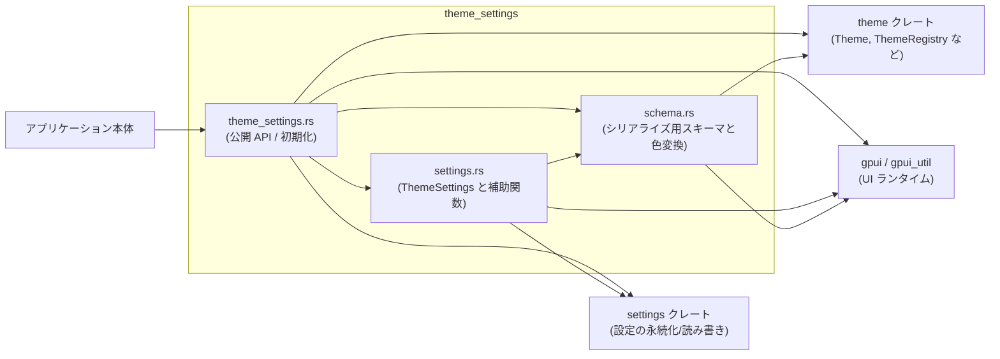
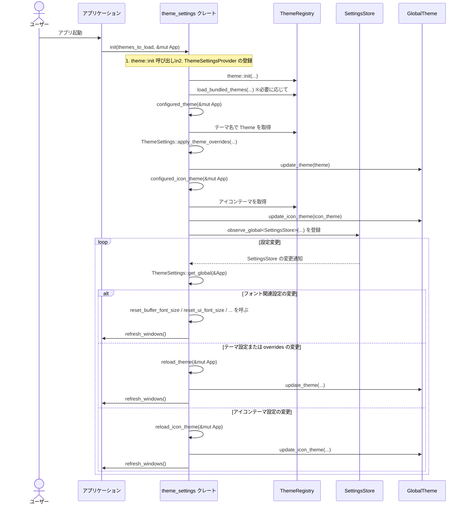

# theme_settings/

## 1. ざっくり一言

Zed の「テーマ」と「設定」をつなぐクレートです。  
JSON などで定義されたテーマファイルを `theme` クレートの `Theme` 型へ変換し、設定値（フォント、テーマ選択、UI 密度など）と統合して、アプリ全体の見た目を制御します。

---

## 2. このモジュールの役割

### 2.1 概要

- このディレクトリは **Zed のテーマシステムとユーザー設定システムを統合**するために存在します。
- 主な機能は次の通りです。
  - JSON でシリアライズされたテーマ (`ThemeFamilyContent`, `ThemeContent`) のスキーマ定義とパース。
  - その JSON 表現から `theme::Theme` / `ThemeFamily` への変換（refine）。
  - 設定 (`settings::SettingsContent`) から `ThemeSettings` を構築し、フォントやテーマ選択、UI 密度を提供。
  - `SettingsStore` の変化を監視し、テーマやアイコンテーマ、フォントサイズを自動で再反映。

### 2.2 アーキテクチャ内での位置づけ

`theme_settings` クレート内部のモジュールと、外部クレートとの依存関係は次のようになります。



- アプリケーションは主に `theme_settings::init` や re-export された API を利用します。
- 実際のテーマオブジェクト (`Theme`, `ThemeFamily`) やレジストリ (`ThemeRegistry`) は `theme` クレートで定義されており、ここから利用します。
- 設定値は `settings` クレートの `SettingsContent` / `SettingsStore` から取得され、`ThemeSettings` を通じて UI 側に提供されます。

### 2.3 設計上のポイント

コードから読み取れる設計上の特徴をまとめます。

- **責務分割**
  - `schema.rs`: JSON などのシリアライズ表現 → 色オブジェクト (`Hsla`) への変換、refinement 用のヘルパー。
  - `settings.rs`: 設定 (`SettingsContent.theme` セクション) → ランタイム設定 (`ThemeSettings`) への変換とフォント関連の操作。
  - `theme_settings.rs`: 初期化 (`init`)・テーマ/アイコンテーマのロード、再読み込みのトリガー、ユーザー/バンドルテーマの読み込み。
- **状態管理**
  - 設定値の多くは `ThemeSettings` に保持されますが、一時的なフォントサイズ変更は `gpui::Global` を実装した
    `BufferFontSize`, `UiFontSize`, `AgentFontSize` で管理します。
- **エラーハンドリング**
  - テーマ JSON の読み込み:
    - 解析に失敗した場合は `log::error` / `log::warn` でログを出しつつ、そのテーマをスキップします。
  - 色文字列のパース:
    - パースに失敗した場合は `Option::None` として扱い、既定値や他のフィールドにフォールバックします。
  - アセット一覧の取得 (`load_bundled_themes`) は `expect` を使用しており、失敗するとパニックします。

---

## 3. 主要な機能一覧

このクレートが提供する主な機能を列挙します。

- **テーマ設定のランタイム表現**
  - `ThemeSettings`: UI フォント/バッファフォント、行間、テーマ/アイコンテーマ選択、UI 密度などを保持。
- **テーマ/アイコンテーマ選択**
  - `ThemeSelection`, `IconThemeSelection`: 静的/動的（ライト・ダーク・システムに応じた）テーマ選択ロジック。
  - `set_theme`, `set_icon_theme`, `set_mode`: 設定内容 (`SettingsContent`) を更新する高レベル API。
- **フォントサイズの調整**
  - `buffer_font_size`, `ui_font_size`, `agent_ui_font_size`, `agent_buffer_font_size`: 設定値と一時的な調整値を統合してフォントサイズを決定。
  - `adjust_*_font_size`, `reset_*_font_size`: 一時的なフォントサイズ変更とリセット。
- **テーマ JSON の読み込みと refine**
  - `ThemeFamilyContent`, `ThemeContent`: シリアライズされたテーマファミリー/テーマの構造。
  - `deserialize_user_theme`, `load_user_theme`, `load_bundled_themes`: JSON からテーマファミリーを読み込み、レジストリへ登録。
  - `refine_theme_family`, `refine_theme`: シリアライズ表現 → `ThemeFamily` / `Theme` への変換。
- **色・スタイルの refine**
  - `status_colors_refinement`, `theme_colors_refinement`: 設定から `StatusColorsRefinement` / `ThemeColorsRefinement` を構築。
  - `syntax_overrides`: `ThemeStyleContent.syntax` から `SyntaxTheme` に適用するハイライトスタイルの一覧を生成。
  - `merge_player_colors`, `merge_accent_colors`: プレイヤーカラー/アクセントカラーのユーザーオーバーライドをマージ。
- **テーマシステムと設定の初期化連携**
  - `init`: `theme::init` のラッパーとして、`ThemeSettings` を使ったテーマ/アイコンテーマ/フォントの自動更新をセットアップ。
  - `reload_theme`, `reload_icon_theme`: 設定変更に応じて現在のテーマ/アイコンテーマを再読み込み。

---

## 4. 関数・構造体の解説

### 4.1 主な構造体・列挙体

| 名前 | 種別 | 定義ファイル | 役割 / 用途 |
|------|------|--------------|-------------|
| `ThemeFamilyContent` | 構造体 | `schema.rs` | シリアライズされたテーマファミリー（名前・作者・複数テーマ）を表現します。ユーザー/バンドルテーマの JSON 形式用です。 |
| `ThemeContent` | 構造体 | `schema.rs` | シリアライズされた 1 つのテーマ（名前、外観種別、スタイル一式）を表現します。 |
| `ThemeSettings` | 構造体 | `settings.rs` | UI/バッファフォント、行間、テーマ選択、アイコンテーマ選択、UI 密度など「テーマに関する設定値」をまとめたランタイム構造体です。`settings::Settings` を実装します。 |
| `ThemeSelection` | enum | `settings.rs` | テーマ選択（単一テーマか、ライト/ダーク/システムに応じて切り替える動的テーマ）を表現します。 |
| `IconThemeSelection` | enum | `settings.rs` | アイコンテーマの選択（静的/動的）を表現します。 |
| `BufferLineHeight` | enum | `settings.rs` | バッファの行間設定。`Comfortable`/`Standard`/任意値 (`Custom(f32)`) の 3 パターンです。 |
| `AgentFontSize` | 構造体 (newtype) | `settings.rs` | エージェントパネル用フォントサイズの一時オーバーライド値を `gpui::Global` として保持するための型です。 |
| `ThemeSettingsProviderImpl` | 構造体 | `theme_settings.rs` | `theme::ThemeSettingsProvider` を実装し、`ThemeSettings` からフォントや UI 密度を引き出すブリッジです（外部には公開されていません）。 |
| `FontStyleContent` ほか各種 `*Content` 型 | 構造体 | `schema.rs` (re-export) | テーマ JSON の一部として使われるフォントスタイル/カラーなどの設定内容を表現します（定義自体は `settings` クレート）。 |
| `FontFamilyName`, `IconThemeName`, `ThemeName`, `ThemeAppearanceMode` | 構造体/enum | `settings.rs` (re-export) | テーマやフォント、アイコンテーマの名称やモードを表す型です（定義は `settings` クレート）。 |

### 4.2 重要な関数の詳細

#### `ThemeSettings::apply_theme_overrides(&self, arc_theme: Arc<Theme>) -> Arc<Theme>`

**概要**

- 現在の `ThemeSettings` に含まれるオーバーライド情報を、渡された `Theme` に適用した新しい `Theme` を返します。
- `experimental_theme_overrides`（全テーマ共通）と `theme_overrides`（テーマ名ごと）の 2 種類のオーバーライドを順番に適用します。

**引数**

| 引数名 | 型 | 説明 |
|--------|----|------|
| `self` | `&ThemeSettings` | 現在のテーマ設定。オーバーライド情報を含みます。 |
| `arc_theme` | `Arc<Theme>` | ベースとなるテーマ。必要に応じてクローンされます。 |

**戻り値**

- `Arc<Theme>`: オーバーライド適用後のテーマ。オーバーライドがなければ元の `arc_theme` がそのまま返ります。

**内部処理の流れ**

1. `experimental_theme_overrides` が `Some` の場合:
   - `arc_theme` をクローンして `Theme` を得る。
   - `ThemeSettings::modify_theme` を使ってこのテーマにオーバーライドを適用。
   - 新しい `Arc<Theme>` に包み直して `arc_theme` を更新。
2. `theme_overrides` に、`arc_theme.name`（文字列）に対応するエントリがあれば同様にクローンして適用。
3. 最終的な `arc_theme` を返す。

**Examples（使用例）**

通常は `configured_theme` 内部から呼ばれるため、直接呼ぶ場面は少ないですが、挙動イメージとして:

```rust
use std::sync::Arc;                                         // Arc を使うためにインポート
use theme::{Theme, ThemeRegistry};                          // Theme とレジストリ
use theme_settings::ThemeSettings;                          // このクレートの設定型

fn apply_overrides_example(registry: &ThemeRegistry, cx: &gpui::App) {
    let theme_settings = ThemeSettings::get_global(cx);      // 現在の ThemeSettings を取得
    let theme = registry.get("My Theme").unwrap();          // ベースとなるテーマを取得（エラー処理は簡略化）
    let refined = theme_settings.apply_theme_overrides(theme); // オーバーライドを適用
    // refined を GlobalTheme::update_theme に渡すなどして利用する
}
```

**Errors / Panics**

- この関数自体は `Result` を返さず、内部でパニックを起こす可能性も見当たりません。
- カラー文字列のパース失敗などは、下層の関数で `None` として扱われ、既定値や元の色が使われます。

**Edge cases**

- `experimental_theme_overrides` も `theme_overrides` も空の場合: 単に入力の `Arc<Theme>` が返ります（クローンもされません）。
- テーマ名に対応する `theme_overrides` がない場合: 全体用オーバーライドだけが適用されます。
- 同じプロパティが両方で指定されている場合:
  - 先に `experimental_theme_overrides`、後に `theme_overrides` が適用されるため、**テーマごとのオーバーライドが最終的に優先**されます。

**使用上の注意点**

- `ThemeSettings::apply_theme_overrides` はテーマをクローンするため、頻繁に大量のテーマに対して呼ぶとコストが増えます。
  - 通常は「現在アクティブなテーマ」に対してのみ呼び出す前提の構造になっています。
- `theme_overrides` のキーはテーマ名 (`theme.name.as_ref()`) であり、ID ではない点に注意が必要です。

---

#### `set_theme(current: &mut SettingsContent, theme_name: impl Into<Arc<str>>, theme_appearance: Appearance, system_appearance: Appearance)`

**概要**

- 設定 (`SettingsContent`) 内の「現在のテーマ選択」を、指定したテーマ名に変更します。
- 静的選択 (`Static`) と動的選択 (`Dynamic`) の両方に対応し、必要に応じて `ThemeAppearanceMode`（ライト/ダーク/システム）も変更します。

**引数**

| 引数名 | 型 | 説明 |
|--------|----|------|
| `current` | `&mut SettingsContent` | 変更対象となる設定内容。`current.theme.theme` を更新します。 |
| `theme_name` | `impl Into<Arc<str>>` | 新しく選択するテーマ名。 |
| `theme_appearance` | `Appearance` | 新しいテーマの外観（`Light` / `Dark`）。 |
| `system_appearance` | `Appearance` | 現在のシステムの外観。`ThemeAppearanceMode::System` の扱いに影響します。 |

**戻り値**

- なし。`current` をインプレースで更新します。

**内部処理の流れ**

1. `theme_name` を `ThemeName` に変換。
2. `current.theme.theme` が `None` の場合:
   - `Some(settings::ThemeSelection::Static(theme_name))` を設定して終了。
3. それ以外（`Some(selection)`）の場合:
   - `selection` が `Static` なら、その中身を新しい `theme_name` に置き換え。
   - `selection` が `Dynamic` なら、`theme_appearance` に応じて `light` または `dark` に `theme_name` をセット。
   - さらに `mode` の更新が必要か判定:
     - `mode == System` かつ `theme_appearance == system_appearance` のときはモードを変更しない。
     - それ以外のときは `mode = appearance_to_mode(theme_appearance)` に更新。

**Examples（使用例）**

設定編集 UI などでテーマを選択し直す場面を想定した例です（`SettingsContent` の取得方法は省略します）。

```rust
use std::sync::Arc;                                         // Arc を使う
use theme::Appearance;                                      // テーマの明暗
use theme_settings::set_theme;                              // この関数
use settings::SettingsContent;                              // 設定全体の型（定義は settings クレート）

fn choose_dark_theme(content: &mut SettingsContent) {
    let system_appearance = Appearance::Dark;                // 実際は SystemAppearance::global(cx).0 を使う想定
    set_theme(
        content,                                             // 更新対象の設定
        Arc::<str>::from("My Dark Theme"),                   // 新しいテーマ名
        Appearance::Dark,                                    // テーマの外観
        system_appearance,                                   // 現在のシステム外観
    );
}
```

**Errors / Panics**

- `SettingsContent` の構造に依存しており、この関数自身はパニックしない前提のコードになっています。
- `SettingsContent` のフィールド構造が変化した場合は、その型定義側で整合性を保つ必要があります（このクレートからは見えません）。

**Edge cases**

- これまでテーマが未設定 (`current.theme.theme == None`) の場合、静的テーマ選択で初期化されます。
- `Dynamic` 選択かつ `mode == System` のときに、システム外観と新テーマの外観が一致する場合、モードは `System` のまま維持されます。
- システム外観と新テーマの外観が異なる場合は、モードが `Light` または `Dark` に強制的に変更されます。

**使用上の注意点**

- `set_theme` は **設定オブジェクトを直接書き換える関数** です。実際に UI に反映するには、`SettingsStore` への保存や `ThemeSettings::get_global` の更新が別途必要です（settings クレート側の仕組みに依存）。
- テーマ名と `theme_appearance` の対応が誤っていると、`ThemeAppearanceMode` の切り替えロジックが意図しない動作をする可能性があります。

---

#### `pub fn init(themes_to_load: LoadThemes, cx: &mut App)`

**概要**

- `theme::init` を呼び出してテーマシステムを初期化し、`ThemeSettings` と連携させます。
- 必要に応じてバンドル済みテーマを読み込み、現在の設定に基づいてテーマとアイコンテーマを選択・適用します。
- さらに、`SettingsStore` を監視し、設定変更に応じてテーマ/アイコンテーマ/フォントサイズを自動で再反映します。

**引数**

| 引数名 | 型 | 説明 |
|--------|----|------|
| `themes_to_load` | `LoadThemes` | `theme::init` に渡すテーマ読み込み方針。`LoadThemes::All(_)` の場合にバンドルテーマを読み込みます。 |
| `cx` | `&mut App` | gpui のアプリケーションコンテキスト。グローバル状態の登録やウィンドウの再描画に使用します。 |

**戻り値**

- なし。アプリケーションのグローバル状態（テーマ、アイコンテーマ、フォントサイズ監視など）を設定します。

**内部処理の流れ**

1. `load_user_themes` を `matches!(&themes_to_load, LoadThemes::All(_))` で判定。
2. `theme::init(themes_to_load, cx)` を呼んでテーマシステムを初期化。
3. `theme::set_theme_settings_provider(Box::new(ThemeSettingsProviderImpl), cx)` により、このクレートをテーマ設定プロバイダとして登録。
4. `load_user_themes` が真なら:
   - `ThemeRegistry::global(cx)` を取得。
   - `load_bundled_themes(&registry)` でバンドルされた JSON テーマを読み込み。
5. 現在の設定からテーマとアイコンテーマを決定:
   - `configured_theme(cx)` と `configured_icon_theme(cx)` を呼び出し、`GlobalTheme::update_theme/update_icon_theme` で適用。
6. `ThemeSettings::get_global(cx)` から、直前の設定値（フォントサイズやテーマ名、オーバーライドなど）をキャプチャ。
7. `cx.observe_global::<SettingsStore>(move |cx| { ... })` で設定ストアの変化を監視:
   - フォントサイズ関連の設定が変われば対応する `reset_*_font_size` を呼び、一時オーバーライドをリセット。
   - テーマ名またはテーマオーバーライドが変われば `reload_theme(cx)`。
   - アイコンテーマ名が変われば `reload_icon_theme(cx)`。
8. 生成した `Subscription` に対して `.detach()` を呼び、ライフサイクルを gpui に任せます。

**Examples（使用例）**

初期化の最も基本的な使い方のイメージです（`App::new` や `LoadThemes` の構築方法は実際の API に依存します）。

```rust
use gpui::App;                                              // アプリケーションコンテキスト
use theme_settings::init;                                   // このクレートの初期化関数
use theme::LoadThemes;                                      // テーマ読み込み方針

fn main() {
    // 実際の App の初期化方法は gpui クレートのドキュメントに従ってください。
    let mut app = App::new();                               // 仮のコード

    // LoadThemes の具体的な値も theme クレートの定義に依存します。
    let themes_to_load = /* LoadThemes の値を構築 */;

    // テーマ設定との連携を含めたテーマシステムの初期化
    theme_settings::init(themes_to_load, &mut app);
}
```

**Errors / Panics**

- `load_bundled_themes` 内で、`assets().list("themes/")` が失敗すると `expect` によりパニックします。
- テーマ JSON の読み込み/パースに失敗した場合はログにエラーや警告が出るだけで、`init` 自体は続行します。

**Edge cases**

- `LoadThemes` が `All(_)` 以外の場合:
  - バンドル済みテーマはロードされません（レジストリに既に登録済みのテーマや拡張からのテーマを使う形になります）。
- 設定が不完全な場合:
  - `ThemeSettings::from_settings` 内の `unwrap()` 群がパニックを引き起こす可能性がありますが、そこは `settings` クレート側の検証に依存します。

**使用上の注意点**

- `init` は通常アプリケーション起動時に 1 回だけ呼び出されることを前提とした設計になっています。
- テーマ/設定関連のグローバル状態（`ThemeSettings`, `ThemeRegistry`, `GlobalTheme` など）を内部で扱うため、複数回呼び出す前提の使用は避けた方が安全です。

---

#### `pub fn refine_theme_family(theme_family_content: ThemeFamilyContent) -> ThemeFamily`

**概要**

- シリアライズされたテーマファミリー (`ThemeFamilyContent`) から、実際に使用される `theme::ThemeFamily` を生成します。
- 各 `ThemeContent` を `refine_theme` で `Theme` に変換し、ファミリー全体に ID とカラースケールを付与します。

**引数**

| 引数名 | 型 | 説明 |
|--------|----|------|
| `theme_family_content` | `ThemeFamilyContent` | JSON などからパースされたテーマファミリーの内容。 |

**戻り値**

- `ThemeFamily`: `ThemeRegistry` に登録して使うテーマファミリーオブジェクト。

**内部処理の流れ**

1. `uuid::Uuid::new_v4().to_string()` によりファミリー ID を新規に生成。
2. `name`, `author` を `theme_family_content` からコピー。
3. `theme_family_content.themes` の各 `ThemeContent` について `refine_theme` を呼び、`Vec<Theme>` を生成。
4. `default_color_scales()` を呼んでカラースケールを取得。
5. 上記の情報から `ThemeFamily` を構築して返却。

**Examples（使用例）**

通常は `deserialize_user_theme` や `load_user_theme` を通じて使われますが、手動で呼ぶ例です。

```rust
use theme::ThemeRegistry;                                   // レジストリ
use theme_settings::{deserialize_user_theme, refine_theme_family};

fn load_user_theme_bytes(registry: &ThemeRegistry, bytes: &[u8]) -> anyhow::Result<()> {
    let family_content = deserialize_user_theme(bytes)?;    // JSON → ThemeFamilyContent
    let family = refine_theme_family(family_content);       // ThemeFamilyContent → ThemeFamily
    registry.insert_theme_families([family]);               // レジストリに登録
    Ok(())
}
```

**Errors / Panics**

- この関数は `Result` を返さず、内部でも `unwrap` などは使っていません。
- UUID 生成失敗の可能性は事実上無視できるレベルで、ここでは考慮されていません。

**Edge cases**

- `theme_family_content.themes` が空の場合:
  - `themes` が空の `ThemeFamily` が生成されます。レジストリ側の扱いに依存します。

**使用上の注意点**

- ファミリー ID は毎回新規に生成されるため、同じ JSON を読み込んでも毎回異なる ID になります。  
  ID を永続化して後から参照するような用途には向きません（名前をキーにする設計が前提です）。

---

#### `pub fn refine_theme(theme: &ThemeContent) -> Theme`

**概要**

- 1 つのシリアライズテーマ (`ThemeContent`) から `Theme` を構築します。
- 明暗 (`AppearanceContent`) に応じてベースとなる `StatusColors` / `ThemeColors` / `PlayerColors` / `AccentColors` を選び、設定された色やスタイルを refine とマージで上書きしていきます。

**引数**

| 引数名 | 型 | 説明 |
|--------|----|------|
| `theme` | `&ThemeContent` | JSON などからパースされた 1 テーマ分の内容。 |

**戻り値**

- `Theme`: エディタで実際に使用されるテーマオブジェクト。

**内部処理の流れ（簡略）**

1. **Appearance の決定**
   - `AppearanceContent::Light` → `Appearance::Light`
   - `AppearanceContent::Dark` → `Appearance::Dark`
2. **ステータスカラーの refine**
   - 明暗に応じて `StatusColors::light()` / `StatusColors::dark()` をベースとして取得。
   - `status_colors_refinement(&theme.style.status)` で `StatusColorsRefinement` を生成。
   - `theme::apply_status_color_defaults` で不足値にデフォルトを適用（実装は外部）。
   - `refined_status_colors.refine(&status_colors_refinement)` で適用。
3. **プレイヤーカラーのマージ**
   - `PlayerColors::light()` / `PlayerColors::dark()` をベースとして取得。
   - `merge_player_colors(&mut refined_player_colors, &theme.style.players)` でユーザー定義をインデックス順にマージ。
4. **テーマカラーの refine**
   - `ThemeColors::light()` / `ThemeColors::dark()` をベースとして取得。
   - `theme_colors_refinement(&theme.style.colors, &status_colors_refinement)` で `ThemeColorsRefinement` を生成。
   - `theme::apply_theme_color_defaults(&mut theme_colors_refinement, &refined_player_colors)` でデフォルト補完。
   - `refined_theme_colors.refine(&theme_colors_refinement)` で適用。
5. **アクセントカラーのマージ**
   - `AccentColors::light()` / `AccentColors::dark()` をベースとして取得。
   - `merge_accent_colors(&mut refined_accent_colors, &theme.style.accents)` でユーザー定義のアクセントに差し替え。
6. **シンタックスハイライトの構築**
   - `theme.style.syntax.iter()` を辿り、各トークンに対して `HighlightStyle` を組み立て。
   - `SyntaxTheme::new` に渡し、`Arc<SyntaxTheme>` を生成。
7. **ウィンドウ背景アピアランス**
   - `theme.style.window_background_appearance` を `into_gpui()` で gpui の型に変換。
   - `None` の場合は `Default::default()`。
8. **Theme の構築**
   - 新規 UUID を ID として採番。
   - 上記の情報と `SystemColors::default()` を使って `Theme` を組み立てて返却。

**Examples（使用例）**

通常は `refine_theme_family` から呼ばれます。単体で使う場合は、既に `ThemeFamilyContent` があることが前提になります。

```rust
use theme_settings::{deserialize_user_theme, refine_theme};

fn first_theme_from_bytes(bytes: &[u8]) -> anyhow::Result<theme::Theme> {
    let family = deserialize_user_theme(bytes)?;             // JSON → ThemeFamilyContent
    let theme_content = family.themes.first().expect("no theme"); // 1 つ目の ThemeContent を取得
    Ok(refine_theme(theme_content))                         // Theme に変換して返す
}
```

**Errors / Panics**

- この関数内に `unwrap` はなく、パニックの可能性は低いです。
- 色文字列のパースに失敗した場合は、`None` として扱われ、ベースカラーやデフォルト値にフォールバックします。

**Edge cases**

- `theme.style.syntax` が空の場合:
  - 空の `SyntaxTheme` が生成されます。
- 設定されていない色が多い場合:
  - ベースの `StatusColors`/`ThemeColors`/`PlayerColors`/`AccentColors` と `theme` クレートのデフォルト埋め (apply\_*) により補われます。

**使用上の注意点**

- `ThemeContent` 自体の組み立てはかなり多くのフィールドを必要とします。通常は JSON との往復（`deserialize_user_theme` 経由）を前提に利用することが多い構造になっています。

---

#### `pub fn merge_player_colors(player_colors: &mut PlayerColors, user_player_colors: &[::settings::PlayerColorContent])`

**概要**

- ベースの `PlayerColors` に対して、ユーザー定義のプレイヤーカラーをインデックス順にマージします。
- 既存プレイヤーがあればそのカラーを部分的に上書きし、なければ新規追加します。

**引数**

| 引数名 | 型 | 説明 |
|--------|----|------|
| `player_colors` | `&mut PlayerColors` | ベースとなるプレイヤーカラー。ここに上書き/追加されます。 |
| `user_player_colors` | `&[::settings::PlayerColorContent]` | 設定（JSON）から来たプレイヤーカラーの配列。 |

**戻り値**

- なし。`player_colors` をインプレースで更新します。

**内部処理の流れ**

1. `user_player_colors` が空なら何もせず return。
2. 各 `user_player_colors` を `enumerate()` でインデックス付きでループ。
3. 各要素について:
   - `cursor`, `background`, `selection` を文字列から `Hsla` にパース (`try_parse_color`)。
   - `player_colors.0.get_mut(idx)` が `Some` の場合:
     - 既存の `PlayerColor` の各フィールドを、ユーザー指定が `Some` の場合にだけ上書き。
   - `None` の場合（ベースに該当インデックスがない場合）:
     - 新規 `PlayerColor` を `push`。指定されていないフィールドは `Default::default()`。

**Examples（使用例）**

```rust
use theme::PlayerColors;                                   // ベースのプレイヤーカラー
use theme_settings::merge_player_colors;                   // この関数

fn apply_user_players(base: &mut PlayerColors, user: &[settings::PlayerColorContent]) {
    merge_player_colors(base, user);                       // ユーザー定義で上書き/追加
}
```

**Errors / Panics**

- パニックを起こすような処理は含まれていません。
- 色のパースに失敗した場合は、そのフィールドを更新せずに元の色かデフォルト値が使われます。

**Edge cases**

- インデックスの大きいプレイヤーだけが定義されている場合（例: index 3 のみ）:
  - 足りないインデックス分は `Default::default()` を使った新規 `PlayerColor` が順に追加されます。
- 一部のフィールドだけが指定されている場合:
  - 未指定のフィールドは既存の値が保持されます。

**使用上の注意点**

- インデックスベースのマージであり、「ID や名前でのマージ」ではない点に注意が必要です。  
  プレイヤーの順序が変わると、意図しない色が適用される可能性があります。

---

#### `pub fn merge_accent_colors(accent_colors: &mut AccentColors, user_accent_colors: &[::settings::AccentContent])`

**概要**

- アクセントカラーの配列に対して、ユーザー定義のアクセントカラーを適用します。
- 有効な色が 1 つでもあれば、ベースの配列全体をユーザー定義の色の配列に差し替えます。

**引数**

| 引数名 | 型 | 説明 |
|--------|----|------|
| `accent_colors` | `&mut AccentColors` | ベースとなるアクセントカラー配列。上書きされる可能性があります。 |
| `user_accent_colors` | `&[::settings::AccentContent]` | ユーザー定義のアクセントカラー。 |

**戻り値**

- なし。`accent_colors` をインプレースで更新します。

**内部処理の流れ**

1. `user_accent_colors` が空なら何もせず return。
2. `user_accent_colors.iter()` をループし、`accent_color.0` が `Some` かつ色パース成功 (`try_parse_color`) のものだけを `collect`。
3. 有効な色配列が空でなければ、`accent_colors.0 = Arc::from(colors);` として丸ごと差し替え。

**Examples（使用例）**

```rust
use theme::AccentColors;                                   // ベースのアクセントカラー
use theme_settings::merge_accent_colors;                   // この関数

fn apply_user_accents(base: &mut AccentColors, user: &[settings::AccentContent]) {
    merge_accent_colors(base, user);                       // ユーザー定義のアクセントに差し替え
}
```

**Errors / Panics**

- パニック要因はありません。
- 色文字列のパース失敗は、そのエントリを単に無視するだけです。

**Edge cases**

- 1 件も有効な色が存在しない場合（全部 `None` かパース失敗）:
  - ベースの `accent_colors` は変更されません。
- ユーザー定義のアクセント数がベースより少ない場合:
  - 差し替え後の配列長はユーザー定義の長さになり、ベースの余分な色は破棄されます。

**使用上の注意点**

- 「部分的に上書き」ではなく、「有効色が 1 つでもあれば配列全体を差し替え」という動作です。  
  ベースの色と混ぜたい場合は、あらかじめ両者をマージした配列を自前で作って渡す必要があります。

---

### 4.3 その他の関数（概要）

代表的な補助関数を簡単にまとめます。

| 関数名 | 定義ファイル | 役割（1 行） |
|--------|--------------|--------------|
| `syntax_overrides` | `schema.rs` | `ThemeStyleContent.syntax` から `(トークン名, HighlightStyle)` のベクタを生成します。 |
| `status_colors_refinement` | `schema.rs` | `StatusColorsContent` から `StatusColorsRefinement` を構築します。 |
| `theme_colors_refinement` | `schema.rs` | `ThemeColorsContent` と `StatusColorsRefinement` を元に `ThemeColorsRefinement` を構築し、各種フォールバックを設定します。 |
| `clamp_font_size` | `settings.rs` | フォントサイズを `MIN_FONT_SIZE`～`MAX_FONT_SIZE` にクランプします。 |
| `ui_density_from_settings` | `settings.rs` | `settings::UiDensity` を `theme::UiDensity` に変換します。 |
| `appearance_to_mode` | `settings.rs` | `Appearance` (`Light`/`Dark`) を `ThemeAppearanceMode` に変換します。 |
| `ThemeSelection::name` | `settings.rs` | システム外観に応じて実際に使うテーマ名を返します。 |
| `IconThemeSelection::name` | `settings.rs` | システム外観に応じて実際に使うアイコンテーマ名を返します。 |
| `ThemeSettings::buffer_font_size` など | `settings.rs` | 一時的なオーバーライドを含めた実際のフォントサイズを計算します。 |
| `ThemeSettings::line_height` | `settings.rs` | `BufferLineHeight` から実際の行間値（最小 1.0）を返します。 |
| `observe_buffer_font_size_adjustment` | `settings.rs` | `BufferFontSize` グローバルへの変更を監視する `Subscription` を作成します。 |
| `adjusted_font_size` | `settings.rs` | バッファフォントサイズの調整量に応じて任意のフォントサイズを連動させるための補助関数です。 |
| `adjust_*_font_size`, `reset_*_font_size` | `settings.rs` | バッファ/UI/エージェントのフォントサイズを一時的に増減/リセットします。 |
| `setup_ui_font` | `settings.rs` | 現在の UI フォントとサイズを取得し、`Window::set_rem_size` に設定します。 |
| `deserialize_user_theme` | `theme_settings.rs` | lenient な JSON パーサでバイト列から `ThemeFamilyContent` を読み込み、非推奨プロパティ使用時に警告を出します。 |
| `load_bundled_themes` | `theme_settings.rs` | バイナリにバンドルされた `themes/*.json` を列挙・読み込み・refine してレジストリに登録します。 |
| `load_user_theme` | `theme_settings.rs` | ユーザー提供の JSON バイト列を読み込み、refine してレジストリに登録します。 |
| `configured_theme` / `configured_icon_theme` | `theme_settings.rs` | `ThemeSettings` と `ThemeRegistry` の両方を見て、現在使うべきテーマ/アイコンテーマを決定します。 |
| `reload_theme` / `reload_icon_theme` | `theme_settings.rs` | 現在の設定に基づきテーマ/アイコンテーマを再取得し、`GlobalTheme` に反映します。 |

---

## 5. データフロー

代表的なシナリオとして、「アプリ起動時の初期化」と「設定変更時のテーマ更新」の流れを示します。



このように、`ThemeSettings` は設定ストアとテーマレジストリの間に立ち、ユーザー設定の変化を UI に反映する役割を担っています。

---

## 6. 使い方（How to Use）

### 6.1 基本的な使用方法

アプリケーションから `theme_settings` を利用する基本的な流れは次の通りです。

1. アプリ起動時に `theme_settings::init` を呼び出し、テーマシステムと設定の橋渡しを初期化する。
2. フォントや UI 密度などが必要になったときは `ThemeSettings::get_global` を通して取得する。
3. 必要に応じて、`adjust_*_font_size` や `set_theme` などのヘルパー関数で設定を操作する。

#### 初期化のコード例（概念的）

```rust
use gpui::App;                                              // アプリケーションコンテキスト
use theme_settings::init;                                   // 初期化関数
use theme::LoadThemes;                                      // テーマ読み込み方針

fn main() {
    // 実際の App 初期化は gpui の API に依存します
    let mut app = App::new();                               // 仮のコード

    // 読み込むテーマの種類を指定（具体的な構築方法は theme クレートを参照）
    let themes_to_load = /* LoadThemes の値を構築 */;

    // テーマシステム + 設定との連携を初期化
    theme_settings::init(themes_to_load, &mut app);

    // 以降、ThemeSettings::get_global(&app) などが利用可能になります
}
```

#### フォントや UI 密度の取得

```rust
use gpui::App;                                              // アプリケーションコンテキスト
use theme_settings::ThemeSettings;                          // このクレートの設定型
use theme::UiDensity;                                       // UI 密度の列挙体

fn render_ui(app: &App) {
    let settings = ThemeSettings::get_global(app);          // 現在のテーマ設定を取得

    let ui_font = &settings.ui_font;                        // UI フォント（gpui::Font）
    let buffer_font = &settings.buffer_font;                // バッファフォント
    let ui_font_size = settings.ui_font_size(app);          // UI フォントサイズ（オーバーライド込み）
    let buffer_font_size = settings.buffer_font_size(app);  // バッファフォントサイズ
    let ui_density: UiDensity = settings.ui_density;        // UI 密度

    // これらの値を使ってウィジェットの描画やレイアウトを行う
}
```

### 6.2 よくある使用パターン

#### パターン 1: バッファフォントの一時的な拡大/縮小（ズーム）

設定値を変えずに一時的にフォントサイズを変更するには、`adjust_buffer_font_size` を使います。

```rust
use gpui::{App, px};                                       // アプリケーションと px ユーティリティ
use theme_settings::adjust_buffer_font_size;               // フォント変更関数

fn zoom_in_buffer(app: &mut App) {
    // 現在のバッファフォントサイズを 1px 分大きくする
    adjust_buffer_font_size(app, |size| size + px(1.0));
}

fn zoom_out_buffer(app: &mut App) {
    // 現在のバッファフォントサイズを 1px 分小さくする
    adjust_buffer_font_size(app, |size| size - px(1.0));
}
```

この変更は `SettingsContent` には書き込まれず、`BufferFontSize` という `gpui::Global` にのみ保持されます。  
`SettingsStore` 側のフォントサイズ設定が変わると、自動で `reset_buffer_font_size` が呼ばれてオーバーライドが消えます。

#### パターン 2: テーマの選択 UI から設定を更新する

設定編集 UI などで、ユーザーがテーマを選んだときに `SettingsContent` を更新するイメージです。

```rust
use std::sync::Arc;                                         // Arc を使う
use theme::Appearance;                                      // テーマの明暗
use theme_settings::set_theme;                              // テーマ更新関数
use settings::SettingsContent;                              // 設定全体

fn choose_theme(content: &mut SettingsContent, name: &str, appearance: Appearance) {
    // 実際には SystemAppearance::global(cx).0 などで取得する
    let system_appearance = appearance;

    set_theme(
        content,                                            // 更新対象の設定
        Arc::<str>::from(name),                            // ユーザーが選んだテーマ名
        appearance,                                        // テーマの明暗
        system_appearance,                                 // システムの明暗（例として同じ値を渡す）
    );

    // SettingsContent を SettingsStore に保存する処理は settings クレート側に依存します
}
```

#### パターン 3: ユーザー提供のテーマ JSON を読み込んで登録する

外部から渡されたバイト列をテーマファミリーとしてレジストリに登録するパターンです。

```rust
use theme::ThemeRegistry;                                   // テーマレジストリ
use theme_settings::load_user_theme;                        // ユーザーテーマ読み込み関数

fn load_user_theme_from_bytes(registry: &ThemeRegistry, bytes: &[u8]) {
    if let Err(err) = load_user_theme(registry, bytes) {    // JSON → ThemeFamily → レジストリ登録
        eprintln!("failed to load user theme: {err}");      // エラー処理（ここでは標準エラー出力）
    }
}
```

### 6.3 使用上の注意点

- **色文字列のフォーマット**
  - `try_parse_color`（ローカル/`theme` 双方）でパースしていますが、パースに失敗した場合はその色は無視されます。
  - 無効な色を指定してもパニックしませんが、意図した色が適用されないため、フォーマットは `gpui::Rgba::try_from` や `theme::try_parse_color` が受け付ける形式を使う必要があります。
- **フォントサイズの範囲**
  - すべてのフォントサイズは `clamp_font_size` により `6px` ～ `100px` の範囲に制限されます。
  - これより小さい/大きい値を設定しても、自動的にこの範囲に収まるよう補正されます。
- **行間 (`BufferLineHeight`)**
  - `Custom(f32)` で 1.0 未満の値を設定した場合でも、`ThemeSettings::line_height` で最小 1.0 に補正されます。
  - 極端に詰まった行間を期待していると意図と異なる可能性があります。
- **`ThemeSettings::from_settings` の前提**
  - 多くのフィールドを `unwrap()` しているため、`settings::SettingsContent` 側で必須フィールドが `Some` であることが前提になっています。
  - 設定スキーマやバリデーションを変更する場合は、この前提が崩れないよう注意が必要です。
- **プレイヤーカラー/アクセントカラーのマージの前提**
  - `merge_player_colors` はインデックスベース、`merge_accent_colors` は配列全体差し替えという挙動です。
  - 「部分的に上書きして残りは元のまま」という期待をする場合は、あらかじめマージ後の配列を自前で構築する必要があります。
- **バンドルテーマのロード失敗**
  - `load_bundled_themes` 内で `assets().list("themes/")` が失敗すると `expect` によりパニックします。
  - バンドル資産のパス構成やビルド設定を変更する場合は、この前提が保たれているか確認が必要です。
- **非推奨プロパティの使用**
  - `deserialize_user_theme` は `deprecated_scrollbar_thumb_background` が使われている場合に `log::warn!` で警告を出します。
  - 将来的な互換性のためにも、メッセージの指示通り `scrollbar.thumb.background` などの新しいプロパティに移行することが推奨されます。

---

## 7. 関連ファイル

| パス | 役割 / 関係 |
|------|------------|
| `theme_settings/Cargo.toml` | クレート名・依存関係・ライブラリエントリ (`src/theme_settings.rs`) を定義します。 |
| `theme_settings/src/schema.rs` | シリアライズされたテーマ（JSON）用のコンテンツ構造体と、色やスタイルを `theme` クレートの refineable 型に変換するヘルパー関数群を提供します。 |
| `theme_settings/src/settings.rs` | `ThemeSettings` 構造体と、設定値からの初期化・フォントサイズ調整・テーマ/アイコンテーマ選択の補助関数を提供します。 |
| `theme_settings/src/theme_settings.rs` | クレートの公開 API の中心。初期化 (`init`)、テーマ/アイコンテーマのロード・再ロード、ユーザーテーマの読み込み、refine 関数などを定義し、`schema`/`settings` の機能を統合します。 |

このディレクトリ全体として、Zed のテーマや UI 見た目に関する「設定 → 実際の見た目」の橋渡しを担うコンポーネント群であると理解できます。
