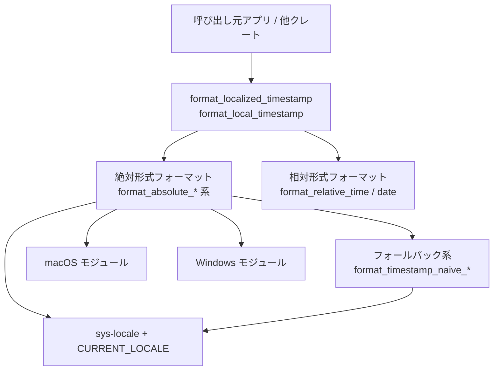
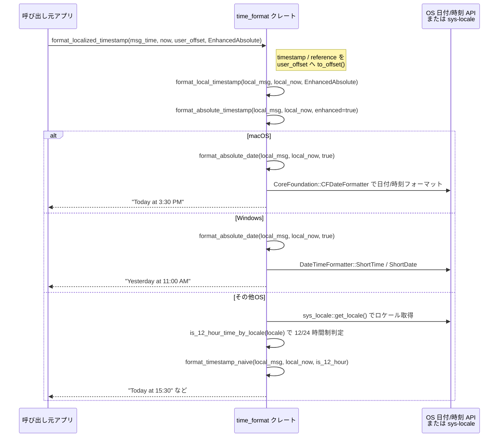

# time_format/

## 1. ざっくり一言

`time_format` クレートは、`time::OffsetDateTime` を「ユーザーのロケールや 12/24 時間設定」にできるだけ合わせて、人間が読みやすい文字列に変換するためのユーティリティです。絶対時刻・相対時刻・日付だけ・時刻だけなど複数の形式を提供します。

---

## 2. このモジュールの役割

### 2.1 概要

- このクレートは **タイムスタンプ（OffsetDateTime）を人間向けの文字列に整形する** ために存在します。
- macOS・Windows では OS の日付/時刻フォーマッタとロケール設定を利用して表示形式を決めます。
- それ以外の OS では `sys_locale` でロケール文字列を取得し、12/24 時間制や日付フォーマットを **簡易的な規則** で推定してフォーマットします。
- 「Today / Yesterday」や「x minutes ago」「y months ago」といった **自然言語的な表現** もサポートします。

### 2.2 アーキテクチャ内での位置づけ

このクレート単体の中での、主要なコンポーネントの依存関係は次のようになっています。



- 呼び出し側は主に `format_localized_timestamp` / `format_local_timestamp` を利用します。
- これらから絶対形式（`format_absolute_*`）か相対形式（`format_relative_*`）のどちらかに分岐します。
- 絶対形式は OS ごとのモジュール（`macos` / `windows`）を優先し、失敗時や非対応 OS では `format_timestamp_naive_*` 系にフォールバックします。
- 非 macOS/Windows 環境では `sys_locale::get_locale` と `CURRENT_LOCALE`（`OnceLock<String>`）を使ってロケールを一度だけ取得し、それを元に 12/24 時間制を決定します。

### 2.3 設計上のポイント

- **OS 依存部とフォールバックロジックの分離**  
  - macOS: CoreFoundation の `CFDateFormatter` を利用  
  - Windows: `windows` クレートの `DateTimeFormatter` を利用  
  - それ以外: ロケール + 独自の naive フォーマッタにフォールバック
- **「Today / Yesterday」などの強調表現**  
  - 絶対形式・日付形式のいくつかで、「同じ日」・「前日」であれば `"Today"` / `"Yesterday"` という英語表現に置き換えます。
- **相対時刻と相対日付の分離**  
  - 「〜分前／〜時間前」は `format_relative_time`、  
  - 「〜日前／〜週間前／〜ヶ月前／〜年前」は `format_relative_date` が担当し、`TimestampFormat::Relative` では両者を組み合わせます。
- **ロケールのキャッシュ**  
  - 非 macOS/Windows 環境では `CURRENT_LOCALE: OnceLock<String>` によって、プロセス中で最初だけロケールを取得します（その後は変わらない前提）。
- **エラー時の挙動**  
  - OS 依存のフォーマッタが失敗した場合でも、可能な限りパニックせず、naive フォーマットにフォールバックする方針です（Windows モジュールが典型）。

---

## 3. 主要な機能一覧

このクレートが提供する主要な機能を、用途ごとにまとめます。

- ローカライズされたタイムスタンプ表示
  - `format_localized_timestamp`: UTC などのタイムスタンプをユーザーのタイムゾーンに変換してから、指定された形式でフォーマットする。
  - `format_local_timestamp`: すでに希望のオフセットを持つ `OffsetDateTime` を、そのまま指定形式でフォーマットする。
- 絶対形式のフォーマット
  - `TimestampFormat::Absolute`: 「YYYY-MM-DD HH:MM」相当の「日付 + 時刻」を OS 依存のロケールでフォーマット。
  - `TimestampFormat::EnhancedAbsolute`: 今日・昨日の場合は「Today at HH:MM」/「Yesterday at HH:MM」といった表現を用いる。
  - `TimestampFormat::MediumAbsolute`: 「Feb. 24, 2024」形式のような「月名を含む日付」（主に日付のみ）。
- 相対形式のフォーマット
  - `TimestampFormat::Relative`: 「Just now」「1 minute ago」「2 hours ago」「3 weeks ago」「2 years ago」など、現在（または基準時刻）からの経過時間を表現。
- 日付／時刻のみを取り出すフォーマット
  - `format_date`: 日付部分だけを「Today」「Yesterday」またはロケール依存の日付文字列として表現。
  - `format_time`: 時刻部分だけをロケール依存の「短い」時刻形式で表現。
  - `format_date_medium`: 中間スタイル（例: "Feb. 24, 2024"）の日付を、必要に応じて「Today」「Yesterday」扱いに差し替え。
- フォールバック用の naive フォーマット
  - `format_timestamp_naive_time`: 12/24 時間制を指定して、単純な時刻文字列を作成。
  - `format_timestamp_naive`: 「Today at 3:30 PM」「04/10/1990 8:20 PM」のような、日付 + 時刻の組み合わせを OS 非依存で生成。
  - `format_timestamp_naive_date` / `format_timestamp_naive_date_medium`: 非 macOS 環境用の単純な日付フォーマット。

---

## 4. 関数・構造体の解説

### 4.1 型一覧（構造体・列挙体など）

| 名前              | 種別   | 役割 / 用途 |
|-------------------|--------|-------------|
| `TimestampFormat` | 列挙体 | タイムスタンプをどのスタイルで表示するか（絶対 / 拡張絶対 / medium 絶対 / 相対）を指定するための列挙体です。 |

`TimestampFormat` の各バリアントの意味:

- `Absolute`:  
  - OS のロケール設定に従って **日付 + 時刻** を表示します。
  - 「Today」「Yesterday」などの特別な置き換えは行いません（通常の絶対日時）。
- `EnhancedAbsolute`:  
  - 同じ日であれば `"Today at HH:MM"`、前日であれば `"Yesterday at HH:MM"` という表現を使用します。
  - それ以外の日は `Absolute` と同様に日付 + 時刻で表示します。
- `MediumAbsolute`:  
  - 日付の「medium」スタイル（例: `"Feb. 24, 2024"`）で表現します。
  - 実装上は `format_absolute_timestamp_medium` → `format_absolute_date_medium(..., false)` によって、基本的には「日付のみ」のフォーマットです。
- `Relative`:  
  - 基準時刻との比較により、「Just now」「1 minute ago」「3 hours ago」「2 weeks ago」「5 years ago」などの自然言語的な相対表現を行います。

### 4.2 主要な関数（詳細）

#### `format_localized_timestamp(timestamp: OffsetDateTime, reference: OffsetDateTime, timezone: UtcOffset, format: TimestampFormat) -> String`

**概要**

- `timestamp` と `reference`（基準時刻）を指定したタイムゾーン (`UtcOffset`) に変換し、その上で `format_local_timestamp` を用いてフォーマットします。
- 通常は、`reference` に「今の時刻」、`timezone` に「ユーザーのタイムゾーン」を渡して利用する想定です。

**引数**

| 引数名      | 型              | 説明 |
|------------|-----------------|------|
| `timestamp` | `OffsetDateTime` | 表示したい元のタイムスタンプ（通常は UTC など）。 |
| `reference` | `OffsetDateTime` | 相対表示や Today/Yesterday 判定の基準となる時刻（通常は「今」）。 |
| `timezone`  | `UtcOffset`      | ユーザーのタイムゾーン（UTC からのオフセット）。 |
| `format`    | `TimestampFormat` | 使用するフォーマットスタイル。 |

**戻り値**

- 指定タイムゾーンに変換され、指定フォーマットで整形された文字列。

**内部処理の流れ**

1. `timestamp.to_offset(timezone)` により、表示したい時刻を指定タイムゾーンのローカル時刻に変換します。
2. `reference.to_offset(timezone)` により、基準時刻も同じタイムゾーンに揃えます。
3. 変換後の 2 つの `OffsetDateTime` と `format` を `format_local_timestamp` に渡します。
4. `format_local_timestamp` 内のロジックに従って、絶対 / 相対フォーマットが行われ、最終的な文字列が返されます。

**Examples（使用例）**

```rust
use time::{OffsetDateTime, UtcOffset};
use time_format::{format_localized_timestamp, TimestampFormat};

fn example() {
    // 表示したいイベントの時刻 (ここでは仮に UTC の現在時刻とする)
    let event_time = OffsetDateTime::now_utc(); // UTC 現在時刻

    // 「今」の基準時刻。相対表示や Today/Yesterday 判定に使う
    let now = OffsetDateTime::now_utc();

    // ここでは UTC+9 (日本時間) を仮定
    let tokyo_offset = UtcOffset::from_hms(9, 0, 0).unwrap();

    // 強調絶対形式 ("Today at 3:00 PM" など) でフォーマット
    let s = format_localized_timestamp(
        event_time,
        now,
        tokyo_offset,
        TimestampFormat::EnhancedAbsolute,
    );

    println!("{s}");
}
```

**Errors / Panics**

- この関数自体は `Result` を返さず、内部でも明示的にパニックを起こすコードはありません。
- `UtcOffset::from_hms` は不正なオフセット値の場合に `Err` を返しますが、これは呼び出し側の責務です。

**Edge cases（エッジケース）**

- `timestamp` が `reference` より未来の場合、`TimestampFormat::Relative` を指定していると、相対フォーマットの挙動は想定されていません（後述の `format_relative_date` のコメント参照）。
- タイムゾーンオフセットが異なる場合でも、必ず `timezone` で指定したオフセットへ変換されてから判定するため、「Today/Yesterday」や「何日前」の計算はすべて **ユーザーのローカル日付** ベースになります。

**使用上の注意点**

- 相対表示 (`TimestampFormat::Relative`) を使うときは、`reference >= timestamp` となるように渡すことが前提です。未来の時刻に対する表現は考慮されていません。
- すでにローカルオフセットを持つ `OffsetDateTime` を扱う場合は、二重に `to_offset` する必要がないので、`format_local_timestamp` を使う方が自然です。

---

#### `format_local_timestamp(timestamp: OffsetDateTime, reference: OffsetDateTime, format: TimestampFormat) -> String`

**概要**

- `timestamp` と `reference` が同じオフセット（同じタイムゾーン）である前提で、指定された `TimestampFormat` にしたがって文字列を生成します。
- ローカルオフセットへの変換は行わず、純粋にフォーマットだけを担当します。

**引数**

| 引数名      | 型               | 説明 |
|------------|------------------|------|
| `timestamp` | `OffsetDateTime`  | 表示したいタイムスタンプ（呼び出し側で既に適切なオフセットに揃えておく）。 |
| `reference` | `OffsetDateTime`  | 基準となる時刻。 |
| `format`    | `TimestampFormat` | フォーマットスタイル。 |

**戻り値**

- 指定フォーマットに従って整形された文字列。

**内部処理の流れ**

```rust
match format {
    TimestampFormat::Absolute =>
        format_absolute_timestamp(timestamp, reference, false),

    TimestampFormat::EnhancedAbsolute =>
        format_absolute_timestamp(timestamp, reference, true),

    TimestampFormat::MediumAbsolute =>
        format_absolute_timestamp_medium(timestamp, reference),

    TimestampFormat::Relative =>
        format_relative_time(timestamp, reference)
            .unwrap_or_else(|| format_relative_date(timestamp, reference)),
}
```

- 絶対形式は `format_absolute_timestamp` / `format_absolute_timestamp_medium` へ移譲されます。
- 相対形式の場合、まず「分／時間」単位の `format_relative_time` を試し、それで表現できないほど古い場合に「日／週／月／年」単位の `format_relative_date` にフォールバックします。

**Examples（使用例）**

```rust
use time::{OffsetDateTime, UtcOffset};
use time_format::{format_local_timestamp, TimestampFormat};

fn example_absolute_local() {
    // すでにユーザータイムゾーン (UTC+9) に揃えてある時刻とする
    let local_offset = UtcOffset::from_hms(9, 0, 0).unwrap();
    let timestamp = OffsetDateTime::now_utc().to_offset(local_offset);
    let reference = OffsetDateTime::now_utc().to_offset(local_offset);

    let s = format_local_timestamp(timestamp, reference, TimestampFormat::Absolute);
    println!("{s}");
}
```

**Edge cases（エッジケース）**

- `timestamp` と `reference` が異なるオフセットを持っている場合、日付比較による「Today」「Yesterday」の判定結果が意図通りにならない可能性があります。
- `TimestampFormat::Relative` を指定し、`timestamp` が `reference` より未来の場合の挙動は定義されていません（後述の `format_relative_date` 参照）。

**使用上の注意点**

- 呼び出し前に `timestamp` / `reference` を同じ `UtcOffset` に揃えておくことが前提です。
- 実際のユーザータイムゾーンへの変換も含めて行いたい場合は、`format_localized_timestamp` を利用する方が適切です。

---

#### `format_date(timestamp: OffsetDateTime, reference: OffsetDateTime, enhanced_formatting: bool) -> String`

**概要**

- 日付部分のみをフォーマットします。
- `enhanced_formatting == true` のとき、同じ日であれば `"Today"`、前日であれば `"Yesterday"` を返し、それ以外は OS または naive 日付フォーマットを用います。

**引数**

| 引数名              | 型              | 説明 |
|--------------------|-----------------|------|
| `timestamp`         | `OffsetDateTime` | 対象の日付。 |
| `reference`         | `OffsetDateTime` | Today/Yesterday 判定用の基準日。 |
| `enhanced_formatting` | `bool`          | `true` なら Today/Yesterday を使用する。 |

**戻り値**

- `"Today"` / `"Yesterday"` またはロケール依存の日付文字列。

**内部処理の流れ**

- 実体は `format_absolute_date(timestamp, reference, enhanced_formatting)` で、OS ごとに分岐します。

macOS / Windows の場合（概略）:

1. `enhanced_formatting` が `false` のとき:
   - OS の日付フォーマッタ（`macos::format_date` / `windows::format_date`）でそのまま日付をフォーマット。
2. `enhanced_formatting` が `true` のとき:
   - `timestamp.date()` と `reference.date()` を比較。
   - 同じ日 → `"Today"`
   - `reference` の前日 → `"Yesterday"`
   - それ以外 → OS の日付フォーマッタでフォーマット。

非 macOS/Windows の場合（概略）:

1. `sys_locale::get_locale()` でロケールを取得し、`CURRENT_LOCALE: OnceLock<String>` にキャッシュ。
2. ロケール文字列から `is_12_hour_time_by_locale` により 12/24 時間制を判定。
3. `format_timestamp_naive_date` を用いて、Today/Yesterday 判定＋日付フォーマットを行う。

**Examples（使用例）**

```rust
use time::{OffsetDateTime, UtcOffset};
use time_format::format_date;

fn example_date_only() {
    let offset = UtcOffset::from_hms(0, 0, 0).unwrap();
    let reference = OffsetDateTime::now_utc().to_offset(offset);
    let timestamp = reference; // 同じ日とする

    // Today / Yesterday を使う日付フォーマット
    let s = format_date(timestamp, reference, true);
    assert!(s == "Today" || s == "Yesterday" || !s.is_empty());

    println!("{s}");
}
```

**Edge cases（エッジケース）**

- `enhanced_formatting == true` のとき、日付さえ一致していれば、24時間以上離れていても `"Today"` / `"Yesterday"` として扱われます（テストにもそのケースが含まれています）。
- 非 macOS/Windows では、12 時間制ロケールと判断された場合は `MM/DD/YYYY`、それ以外は `DD/MM/YYYY` の形式になります。

**使用上の注意点**

- 「Today」「Yesterday」表現は英語固定です。他言語化はここからは行われていません。
- 実際に UI 上でどの言語を表示したいかに応じて、上位でラッピングして翻訳する必要がある場合があります。

---

#### `format_time(timestamp: OffsetDateTime) -> String`

**概要**

- 時刻部分だけをフォーマットして文字列を返します。
- macOS/Windows では OS の「短い時刻形式」を使用します。それ以外では naive 形式（12/24 時間制に従う）でフォーマットします。

**引数**

| 引数名      | 型              | 説明 |
|------------|-----------------|------|
| `timestamp` | `OffsetDateTime` | 対象の時刻。 |

**戻り値**

- ロケールや 12/24 時間制を考慮した時刻文字列。

**内部処理の流れ**

- macOS: `macos::format_time(&timestamp)` を呼びます（CoreFoundation の `CFDateFormatter` を利用）。
- Windows: `windows::format_time(&timestamp)` を呼びます（`DateTimeFormatter::ShortTime()` を利用）。
- その他 OS:
  1. `CURRENT_LOCALE` からロケール文字列を取得 (`sys_locale::get_locale()` にフォールバック)。
  2. `is_12_hour_time_by_locale` で 12/24 時間制を判定。
  3. `format_timestamp_naive_time(timestamp, is_12_hour_time)` を用いて `"9:30 AM"` または `"09:30"` の形式でフォーマット。

**Examples（使用例）**

```rust
use time::{OffsetDateTime, UtcOffset};
use time_format::format_time;

fn example_time_only() {
    let offset = UtcOffset::from_hms(9, 0, 0).unwrap();
    let timestamp = OffsetDateTime::now_utc().to_offset(offset);

    let s = format_time(timestamp);
    println!("current time: {s}");
}
```

**Edge cases（エッジケース）**

- 非 macOS/Windows で `sys_locale::get_locale()` が失敗した場合は `"en-US"` として扱われ、12 時間制 + `MM/DD/YYYY` 系のフォーマットになります。
- naive フォーマットでは秒は含まれません（分まで）。

**使用上の注意点**

- この関数はタイムゾーン変換を行わないため、呼び出し前に必要なオフセットに揃えておく必要があります。
- 秒やミリ秒など、より詳細な情報が欲しい場合は、この関数だけでは足りず、別途 `time` クレートの機能を使用する必要があります。

---

#### `format_date_medium(timestamp: OffsetDateTime, reference: OffsetDateTime, enhanced_formatting: bool) -> String`

**概要**

- 日付を「medium」スタイル（例: `"Feb. 24, 2024"`）でフォーマットし、必要に応じて `"Today"` / `"Yesterday"` に置き換えます。
- 主に `TimestampFormat::MediumAbsolute` から内部的に利用されます。

**引数**

| 引数名              | 型              | 説明 |
|--------------------|-----------------|------|
| `timestamp`         | `OffsetDateTime` | 対象の日付。 |
| `reference`         | `OffsetDateTime` | Today/Yesterday 判定用の基準。 |
| `enhanced_formatting` | `bool`          | true なら Today/Yesterday を使用。 |

**戻り値**

- `"Today"` / `"Yesterday"` または medium スタイルの日付文字列。

**内部処理の流れ**

- 実装は `format_absolute_date_medium(timestamp, reference, enhanced_formatting)` に委譲され、OS ごとに分岐します。
- 非 macOS/Windows では `format_timestamp_naive_date_medium` を使ったシンプルな `MM/DD/YYYY` / `DD/MM/YYYY` 形式となります（Today/Yesterday を使う場合は別判定あり）。

**Examples（使用例）**

```rust
use time::{OffsetDateTime, UtcOffset};
use time_format::format_date_medium;

fn example_medium_date() {
    let offset = UtcOffset::from_hms(0, 0, 0).unwrap();
    let reference = OffsetDateTime::now_utc().to_offset(offset);
    let timestamp = reference;

    let s = format_date_medium(timestamp, reference, true);
    println!("{s}"); // 例: "Today" または "Feb. 24, 2024"
}
```

**使用上の注意点**

- `TimestampFormat::MediumAbsolute` では `enhanced_formatting` に `false` を渡しているため、「MediumAbsolute = 純粋な medium 日付」と理解できます。  
  「Today/Yesterday 表現を medium スタイルで使いたい場合」は、直接 `format_date_medium(..., true)` を呼び出す必要があります。

---

#### `format_timestamp_naive(timestamp_local: OffsetDateTime, reference_local: OffsetDateTime, is_12_hour_time: bool) -> String`

**概要**

- OS やロケールに依存せず、引数の `is_12_hour_time` だけに基づいて「Today at HH:MM」「Yesterday at HH:MM」「MM/DD/YYYY HH:MM」などの形式でタイムスタンプをフォーマットします。
- OS の API でのフォーマットが失敗した場合などの **フォールバック実装** として利用されます。

**引数**

| 引数名             | 型              | 説明 |
|-------------------|-----------------|------|
| `timestamp_local`  | `OffsetDateTime` | 対象のタイムスタンプ（すでにローカルオフセットにある前提）。 |
| `reference_local`  | `OffsetDateTime` | Today/Yesterday 判定の基準。 |
| `is_12_hour_time`  | `bool`          | `true` なら 12 時間制 + `MM/DD/YYYY`、`false` なら 24 時間制 + `DD/MM/YYYY`。 |

**戻り値**

- `"Today at 3:30 PM"` や `"04/10/1990 8:20 PM"` などの文字列。

**内部処理の流れ（概略）**

1. `format_timestamp_naive_time(timestamp_local, is_12_hour_time)` で `"3:30 PM"` または `"15:30"` の時刻文字列を作成。
2. `timestamp_local.date()` と `reference_local.date()` を比較。
   - 同じ日 → `"Today at {time}"` を返す。
   - `reference` の前日 → `"Yesterday at {time}"` を返す。
3. それ以外は日付を
   - `is_12_hour_time == true` → `"MM/DD/YYYY"`
   - `false` → `"DD/MM/YYYY"`
   の形式で作成し、`"{date} {time}"` として返す。

**Examples（使用例）**

```rust
use time::{OffsetDateTime, UtcOffset};
use time_format::format_timestamp_naive;

fn example_naive() {
    let offset = UtcOffset::from_hms(0, 0, 0).unwrap();
    let reference = OffsetDateTime::now_utc().to_offset(offset);
    let timestamp = reference;

    let s_12 = format_timestamp_naive(timestamp, reference, true);
    let s_24 = format_timestamp_naive(timestamp, reference, false);

    println!("12-hour: {s_12}"); // 例: "Today at 3:30 PM"
    println!("24-hour: {s_24}"); // 例: "Today at 15:30"
}
```

**Edge cases（エッジケース）**

- `reference` と日付が同じかどうかのみを見ているため、24 時間以上離れていても同じ日付なら `"Today"` として扱います（テストでカバーされています）。
- 秒以下は無視し、分単位までの表示に固定されています。

**使用上の注意点**

- この関数は「ユーザー設定に合わせる」のではなく、「設定を呼び出し側が指定する」ための関数です。
- 実際のユーザー環境の 12/24 時間制を知るには、上位でロケールを判別するか、`format_timestamp_fallback` + `sys_locale` を利用する必要があります。

---

#### `format_relative_date(timestamp: OffsetDateTime, reference: OffsetDateTime) -> String`

**概要**

- 日付ベースでの相対表現を行います。
- 「Today」「Yesterday」「2 days ago」「3 weeks ago」「5 months ago」「2 years ago」など、日〜年単位の表現を担当します。

**引数**

| 引数名      | 型              | 説明 |
|------------|-----------------|------|
| `timestamp` | `OffsetDateTime` | 過去のタイムスタンプ（基準時刻より過去である前提）。 |
| `reference` | `OffsetDateTime` | 基準となる時刻。 |

**戻り値**

- 相対日付の文字列 (`"Today"`, `"1 week ago"`, `"2 years ago"` など)。

**内部処理の流れ（詳細）**

1. `timestamp_date = timestamp.date()`、`reference_date = reference.date()` を取得。
2. `difference = reference_date - timestamp_date` を計算し、`days = difference.whole_days()` を取得。
3. `days` に応じて次のように分岐:

   - `0` → `"Today"`
   - `1` → `"Yesterday"`
   - `2..=6` → `"{days} days ago"`
   - それ以外 (`days >= 7` の想定) の場合:

     1. `weeks = difference.whole_weeks()` を計算。
     2. `weeks` に応じて分岐:
        - `1` → `"1 week ago"`
        - `2..=4` → `"{weeks} weeks ago"`
        - それ以外の場合:

          1. `month_diff = calculate_month_difference(timestamp, reference)` を計算。
          2. `month_diff` に応じて:
             - `0..=1` → `"1 month ago"`
             - `2..=11` → `"{month_diff} months ago"`
             - `months >= 12`:
               - `years = months / 12` とし、`years == 1` → `"1 year ago"`、その他 → `"{years} years ago"`

**Examples（使用例）**

```rust
use time::macros::datetime;
use time::{OffsetDateTime, UtcOffset};
use time_format::TimestampFormat;
use time_format::format_local_timestamp;

fn example_relative() {
    // 基準日: 1990-04-12
    let offset = UtcOffset::from_hms(0, 0, 0).unwrap();
    let reference = datetime!(1990-04-12 23:00 UTC).to_offset(offset);

    // 一週間前
    let one_week_ago = datetime!(1990-04-05 23:00 UTC).to_offset(offset);

    let s = format_local_timestamp(one_week_ago, reference, TimestampFormat::Relative);
    println!("{s}"); // "1 week ago"
}
```

**Edge cases（エッジケース）**

- `calculate_month_difference` のコメントに「`reference` は常に `timestamp` より新しい（大きい）」と明記されています。コード上もその前提でテストされています。
  - もし `timestamp` が `reference` より未来だと、`year_diff` が負になり `usize` への変換で大きな値になるため、結果は意味をなさない可能性があります。
- 日数が 7〜27 日程度の場合、「4 weeks ago」のような週単位の表現を経てから「1 month ago」に移行します（テストで 4 週間 → 1 month に変化することが確認されています）。

**使用上の注意点**

- 必ず「過去の時刻」を `timestamp` に渡すことが前提です。未来日の扱いは定義されていません。
- `format_local_timestamp` 経由で `TimestampFormat::Relative` を使う場合も、この前提を守る必要があります。

---

### 4.3 その他の関数

補助的な関数や OS 依存モジュールの役割を一覧でまとめます。

| 関数 / モジュール名 | 役割（1 行） |
|---------------------|--------------|
| `format_absolute_date` | 日付を OS 依存／naive でフォーマットし、必要に応じて `"Today"` / `"Yesterday"` に置き換える。 |
| `format_absolute_time` | 時刻を OS 依存／naive でフォーマットする。 |
| `format_absolute_timestamp` | 日付 + 時刻の絶対形式（拡張あり／なし）を組み立てる。 |
| `format_absolute_date_medium` | medium スタイルの日付フォーマット（拡張あり／なし）を行う。 |
| `format_absolute_timestamp_medium` | `MediumAbsolute` 用のタイムスタンプフォーマット（実質 medium 日付）。 |
| `format_relative_time` | 分・時間単位の相対表現を行う（0 分〜23 時間まで）。 |
| `calculate_month_difference` | 2 つの `OffsetDateTime` 間の「月数差」を計算する（`reference >= timestamp` 前提）。 |
| `format_timestamp_naive_time` | 12/24 時間制フラグに基づく単純な時刻フォーマットを行う。 |
| `format_timestamp_naive_date` | 非 macOS 環境向けの Today/Yesterday + `MM/DD/YYYY` / `DD/MM/YYYY` フォーマット。 |
| `format_timestamp_naive_date_medium` | 非 macOS/Windows 環境向けの medium 風日付フォーマット。 |
| `format_timestamp_fallback` | 非 macOS/Windows 環境用のフォールバック: ロケール取得 → `format_timestamp_naive` 呼び出し。 |
| `is_12_hour_time_by_locale` | ロケール文字列を見て 12 時間制かどうかを判定する（特定のロケール文字列のみ対応）。 |
| `macos` モジュール | CoreFoundation の `CFDateFormatter` を使って OS ネイティブの日付/時刻フォーマットを提供。 |
| `windows` モジュール | `DateTimeFormatter` を使って OS ネイティブの日付/時刻フォーマットを提供し、失敗時に naive フォーマットへフォールバック。 |

---

## 5. データフロー

ここでは、もっとも典型的なシナリオとして「チャットメッセージのタイムスタンプをユーザーのローカルタイムゾーンで `EnhancedAbsolute` 形式に表示する」流れを示します。



要点:

- 呼び出し側は `timestamp`・`reference`・`UtcOffset`・`TimestampFormat` の 4 つを渡すだけで、タイムゾーン変換とフォーマットを一括で行えます。
- OS によるフォーマットが利用できない場合や失敗した場合でも、内部的に naive フォーマットへフォールバックするため、基本的には常に何らかの文字列が得られます。

---

## 6. 使い方（How to Use）

### 6.1 基本的な使用方法

#### 例: ユーザーのタイムゾーンで「強調絶対形式」のタイムスタンプを表示する

```rust
use time::{OffsetDateTime, UtcOffset};
use time_format::{format_localized_timestamp, TimestampFormat};

fn main() {
    // 1. イベント時刻 (ここでは例として UTC 現在時刻)
    let event_time_utc = OffsetDateTime::now_utc(); // 実際には DB などから取得する

    // 2. 基準時刻 (通常は "今")
    let now_utc = OffsetDateTime::now_utc();

    // 3. ユーザーのタイムゾーン (ここでは例として UTC+9)
    let user_offset = UtcOffset::from_hms(9, 0, 0).unwrap();

    // 4. EnhancedAbsolute 形式でフォーマット
    let formatted = format_localized_timestamp(
        event_time_utc,
        now_utc,
        user_offset,
        TimestampFormat::EnhancedAbsolute,
    );

    println!("表示用タイムスタンプ: {formatted}");
}
```

このコードでは、UTC で保存されているタイムスタンプをユーザーのタイムゾーンに変換した上で、「今日であれば `Today at ...`」といった表現で出力します。

---

### 6.2 よくある使用パターン

#### パターン 1: 相対形式で表示する（チャットや通知向け）

```rust
use time::{OffsetDateTime, UtcOffset};
use time_format::{format_localized_timestamp, TimestampFormat};

fn relative_timestamp_for_user(msg_time_utc: OffsetDateTime, user_offset: UtcOffset) -> String {
    let now_utc = OffsetDateTime::now_utc(); // 基準は「今」

    format_localized_timestamp(
        msg_time_utc,
        now_utc,
        user_offset,
        TimestampFormat::Relative,
    )
}
```

- 数分～数時間前は「Just now」「x minutes ago」「y hours ago」、
- それより前は「z days ago」「w months ago」「v years ago」といった表現になります。

#### パターン 2: すでにローカルオフセットを持っている場合

```rust
use time::{OffsetDateTime, UtcOffset};
use time_format::{format_local_timestamp, TimestampFormat};

fn format_local_without_offset_conversion(local_time: OffsetDateTime) -> String {
    // local_time は既にユーザーのタイムゾーンに揃っている想定
    let reference = OffsetDateTime::now_utc().to_offset(local_time.offset());

    format_local_timestamp(local_time, reference, TimestampFormat::Absolute)
}
```

- すでに `OffsetDateTime` がユーザーのオフセットを持っている場合は、二重変換を避けるため `format_local_timestamp` を直接利用できます。

#### パターン 3: カスタム UI 用に日付／時刻を別々に扱う

```rust
use time::{OffsetDateTime, UtcOffset};
use time_format::{format_date, format_time};

fn split_date_and_time(timestamp_utc: OffsetDateTime, user_offset: UtcOffset) {
    let local = timestamp_utc.to_offset(user_offset);
    let now_local = OffsetDateTime::now_utc().to_offset(user_offset);

    let date_str = format_date(local, now_local, true); // Today/Yesterday 表現を使う
    let time_str = format_time(local);

    println!("日付: {date_str}, 時刻: {time_str}");
}
```

- UI によっては、日付と時刻を別の場所に表示したいケースがあるため、`format_date` と `format_time` を別々に呼び出すパターンが有用です。

---

### 6.3 使用上の注意点

- **基準時刻 (`reference`) の扱い**
  - 相対表示 (`TimestampFormat::Relative`) や Today/Yesterday 判定は、`reference` を基準に行われます。
  - 基本的には「現在の時刻」を渡すことが前提です。
  - 特に `format_relative_date` / `calculate_month_difference` は **`reference >= timestamp`** を前提としており、未来の時刻を渡すと結果が意味をなさない可能性があります。

- **タイムゾーンの一貫性**
  - `format_localized_timestamp` は内部で `to_offset(timezone)` を行うため、引数の `timestamp` / `reference` はどのオフセットでも構いません。
  - 一方、`format_local_timestamp` や naive 系関数を直接使う場合は、**同じオフセットに揃えた上で渡す** 必要があります。

- **ロケールと 12/24 時間制**
  - 非 macOS/Windows 環境では、`is_12_hour_time_by_locale` がサポートしている限定的なロケール文字列に対してのみ 12 時間制判定が行われます。
  - 対応一覧にないロケールの場合は 24 時間制 + `DD/MM/YYYY` フォーマットとして扱われます。
  - ロケールは `CURRENT_LOCALE: OnceLock<String>` にキャッシュされるため、プロセス実行中に OS のロケール設定を変更しても自動では反映されません。

- **言語は英語固定**
  - `"Today"`, `"Yesterday"`, `"Just now"`, `"x minutes ago"` などの文言はすべて英語でハードコードされています。
  - 多言語対応が必要な場合は、このクレートの上位層で翻訳テーブルを用意するなどの工夫が必要です。

- **フォールバックフォーマットの性質**
  - macOS/Windows でも OS のフォーマッタが失敗した場合には naive フォーマットにフォールバックします。
  - その場合、表示形式が「OS の標準的な見た目」と完全には一致しない可能性がありますが、少なくとも読み取れる文字列は返されます。

---

## 7. 関連ファイル

このクレートに含まれるファイルと、それぞれの役割は次の通りです。

| パス                              | 役割 / 関係 |
|-----------------------------------|------------|
| `time_format/Cargo.toml`          | クレート名・バージョン・依存関係（`time`, `sys-locale`, `core-foundation`, `windows` など）を定義するマニフェストファイルです。 |
| `time_format/src/time_format.rs`  | 本クレートの実装本体。公開 API（`TimestampFormat`, `format_*` 関数群）および macOS/Windows 向け OS 依存モジュール、フォールバックロジック、テストコードがすべてこのファイルに含まれています。 |

このチャンクには他のソースファイルやテストモジュールは登場していませんが、`#[cfg(test)]` で同一ファイル内に多数のテストが含まれており、各種フォーマットの動作がカバーされています。
