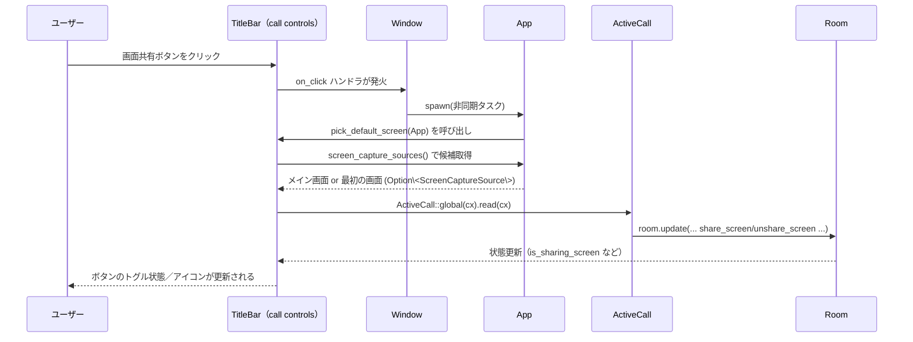

# C:\Drive\rust\zed-local\crates\title_bar

## 1. ざっくり一言

Zed のウィンドウタイトルバーを描画・制御するクレートです。  
プロジェクト名や Git ブランチ、コラボレーション通話、ユーザーメニュー、アップデート状態などをまとめて表示する UI と、その設定・メニュー周りの機能を提供します。

---

## 2. このモジュールの役割

### 2.1 概要

- このクレートは **エディタウィンドウのタイトルバー UI** を実装するためのものです。
- プロジェクト・Git 状態・リモート接続状態・通話状態・ユーザープラン・アップデート状態などを集約し、gpui の `PlatformTitleBar` 上に配置します。
- タイトルバーの項目の表示有無は `TitleBarSettings` によって制御され、メニューやバナーなどの補助モジュールも含みます。

### 2.2 アーキテクチャ内での位置づけ

中心は `TitleBar` 構造体で、Workspace から 1 つ紐付きます。  
タイトルバー内の各領域は、専用モジュールに分割されています。

```mermaid
graph LR
  Workspace -->|init() で observe_new| TitleBar
  TitleBar --> PlatformTitleBar
  TitleBar --> ApplicationMenu
  TitleBar --> Collab["collab (通話・コラボ UI)"]
  TitleBar --> OnboardingBanner
  TitleBar --> PlanChip
  TitleBar --> TitleBarSettings
  TitleBar --> UpdateVersion
```

- `title_bar::init`  
  Workspace が生成されるたびに `TitleBar` を作成し、`PlatformTitleBar` に埋め込みます。
- `TitleBar`  
  プロジェクト・ユーザー・通話・設定・アップデータなど複数のグローバル状態を購読し、タイトルバーを再描画します。
- `application_menu`  
  プラットフォームに依存しない「アプリケーションメニュー」を gpui の `PopoverMenu` として描画します。
- `collab`  
  アクティブな通話 (`ActiveCall`) と連携し、コラボレーション用のコントロールと参加者一覧を描画します。
- `onboarding_banner` / `update_version` / `plan_chip` / `title_bar_settings`  
  それぞれ、バナー・アップデート表示・プラン表示・設定を担当します。

### 2.3 設計上のポイント

- **責務の分割**
  - `TitleBar` は「何をどこに置くか」を決めるオーケストレーター的役割です。
  - メニュー (`ApplicationMenu`)、コラボ UI (`collab`)、バナー、アップデート状態などは別モジュールに分離されています。
- **リアクティブな UI**
  - `cx.observe`, `cx.subscribe` により `Project`, `ActiveCall`, `UserStore`, `AutoUpdater` などの状態を購読し、変化時に `cx.notify()` で再描画します。
- **設定駆動**
  - `TitleBarSettings::get_global(cx)` によってタイトルバーの表示内容が切り替わります（ブランチ名・ユーザーアイコン・メニュー表示など）。
- **プラットフォーム依存の分岐**
  - `PlatformTitleBar` による OS ネイティブタイトルバー統合。
  - `cfg!(not(target_os = "macos"))` や `cfg!(macos_sdk_26)` により、メニュー表示方式やレイアウトを切り替えます。
- **安全なフォールバック**
  - ActiveCall や Project、User が存在しない場合は `Option` をチェックし、何も描画しない／ボタンを表示しないといったフォールバックを行います。

---

## 3. 主要な機能一覧

- タイトルバーの初期化: `init` で `Workspace` に `TitleBar` を差し込み、アクションを登録。
- プロジェクト情報の表示:
  - プロジェクト名、複数ワークツリーの切り替え、最近プロジェクトポップオーバー。
  - Git ブランチ名・ステータス（変更／コンフリクトなど）の表示。
- リモート／制限モード表示:
  - SSH/Wsl/Docker を用いたリモートプロジェクト接続状態の表示。
  - 信頼されていないワークツリーがある場合の「Restricted Mode」ボタン。
- コラボレーション UI:
  - 通話状態に応じた「Leave Call」「Mute/Deafen」「Screen Share」「Share Project」ボタン。
  - 参加者一覧（Facepile）と「Follow/Unfollow」操作。
- ユーザー関連 UI:
  - サインインボタン（未サインイン時）。
  - ユーザーメニュー（設定・テーマ・拡張機能・サインアウト）。
  - プランバッジの表示（`PlanChip`、組織ごとのプラン切り替え）。
- アップデート表示:
  - 自動アップデートの状態（Checking / Downloading / Installing / Updated / Errored）を `UpdateButton` として表示。
  - 更新完了後の「Restart to update Zed」操作・Dismiss 機構。
- アプリケーションメニュー:
  - `ApplicationMenu` によるクライアントサイドメニューバーの描画。
  - Left/Right ナビゲーションやメニュー名指定でのオープン。
- オンボーディングバナー:
  - 新機能紹介などのバナー表示・Dismiss 状態の永続化（現状コメントにある通り未使用）。
- Storybook 統合:
  - `stories` フィーチャにより `ApplicationMenu` の UI を Story として表示。

---

## 4. 関数・構造体の解説

### 4.1 主な型一覧

| 名前 | 種別 | 役割 / 用途 |
|------|------|-------------|
| `TitleBar` | 構造体 | プロジェクト情報・通話・ユーザー・アップデートなどをまとめて描画するタイトルバー本体 |
| `ApplicationMenu` | 構造体 | クライアントサイドのアプリケーションメニュー（`PopoverMenu` ベース）を管理・描画する |
| `ActivateDirection` | enum（非 macOS） | 左右のメニュー間ナビゲーション方向を表す |
| `OnboardingBanner` | 構造体 | 新機能紹介などのバナー UI。表示条件や Dismiss 状態を管理 |
| `BannerDetails` | 構造体 | バナーに表示するアイコン・ラベル・アクションなどの詳細情報 |
| `PlanChip` | 構造体 (`IntoElement`) | `cloud_api_types::Plan` をラベルと色付きのチップとして表示する |
| `TitleBarSettings` | 構造体（設定） | タイトルバーの表示項目やボタン配置を設定するための設定型 |
| `UpdateVersion` | 構造体 | 自動アップデート状態を監視し、更新ボタン UI を描画する |
| `ApplicationMenuStory` | 構造体 | `ApplicationMenu` を Storybook で表示するためのラッパー |

---

### 4.2 重要な関数・メソッド詳細

#### `init(cx: &mut App)`

**概要**

- アプリケーション起動時に呼び出されるエントリポイントです。
- 各 `Workspace` が生成されるたびに `TitleBar` を作成し、アクション（更新シミュレーション・アプリケーションメニュー操作）を登録します。

**引数**

| 引数名 | 型 | 説明 |
|--------|----|------|
| `cx` | `&mut App` | アプリケーション全体の gpui コンテキスト |

**戻り値**

- なし（タイトルバーの初期化と各種オブザーバ登録を行います）。

**内部処理の流れ**

1. `PlatformTitleBar::init(cx)` を呼び出し、プラットフォーム依存タイトルバーの初期化を行う。
2. `cx.observe_new` を用いて、新しい `Workspace` が生成されるたびにコールバックを登録。
3. コールバック内で:
   - `TitleBar::new(...)` により `TitleBar` の `Entity` を作成。
   - `workspace.set_titlebar_item(...)` で `Workspace` のタイトルバーにセット。
   - `Workspace::register_action` を使って、以下のアクションハンドラを登録：
     - `SimulateUpdateAvailable` → `TitleBar::toggle_update_simulation` を呼び出し、アップデート UI の疑似状態遷移。
     - （非 macOS）`OpenApplicationMenu` / `ActivateMenuRight` / `ActivateMenuLeft` → `ApplicationMenu` の `open_menu` / `navigate_menus_in_direction` を呼び出し。
4. `observe_new` の返すサブスクリプションを `detach()` し、ライフタイム管理を gpui に任せる。

**Edge cases**

- `Workspace::titlebar_item()` が `TitleBar` に downcast できなかった場合は何もしません。
- 非 macOS 環境でのみアプリケーションメニュー関連のアクションが登録されます。

**使用上の注意点**

- この関数はアプリ起動時に 1 回呼び出されることを想定しています。
- `TitleBar` 自体のライフタイム管理は gpui の `Entity` に任されています。

---

#### `TitleBar::new(id, workspace, multi_workspace, window, cx) -> Self`

**概要**

- `Workspace` に紐付いた `TitleBar` インスタンスを構築し、必要な購読・サブスクリプションをすべて張ります。

**引数**

| 引数名 | 型 | 説明 |
|--------|----|------|
| `id` | `impl Into<ElementId>` | タイトルバーの UI 要素 ID |
| `workspace` | `&Workspace` | 対象の Workspace |
| `multi_workspace` | `Option<WeakEntity<MultiWorkspace>>` | マルチワークスペース管理オブジェクト |
| `window` | `&mut Window` | 現在のウィンドウ |
| `cx` | `&mut Context<Self>` | `TitleBar` 用の gpui コンテキスト |

**戻り値**

- 初期化済みの `TitleBar` 構造体。

**内部処理の流れ**

1. `Workspace` から `Project`, `UserStore`, `Client` などの `Entity`／共有状態を取得して保持。
2. `PlatformStyle::platform()` に応じて `ApplicationMenu` を生成するかを決定：
   - macOS かつ `ZED_USE_CROSS_PLATFORM_MENU` 未設定 → `ApplicationMenu` なし。
   - それ以外 → `ApplicationMenu` を `cx.new` で作成。
3. 各種イベント購読を登録し、`_subscriptions` に保存：
   - Workspace の変化（`observe`） → `cx.notify()`。
   - Project のイベント（`GitStoreEvent`、`BufferEdited`） → アクティブワークツリーのオーバーライドクリア・再描画。
   - `ActiveCall` の変化 → `active_call_changed` を呼び、診断購読を更新。
   - ウィンドウアクティベーション → `window_activation_changed`。
   - `UserStore` 変化 → 再描画。
   - ボタンレイアウト変化 → 再描画。
   - `TrustedWorktrees`（あれば）変化 → 再描画。
4. `UpdateVersion` と `PlatformTitleBar` の `Entity` を作成し、`TitleBar` フィールドに保存。
5. `observe_diagnostics(cx)` を呼び出し、通話診断情報の購読を開始。

**Edge cases**

- `TrustedWorktrees::try_get_global(cx)` が失敗した場合は購読を張りません（Restricted Mode は単純に非表示）。
- `Workspace::weak_handle().upgrade()` が失敗するケースは、observe 登録時には `unwrap` しているため、その時点で有効である前提です。

**使用上の注意点**

- `TitleBar::new` は通常 `title_bar::init` から呼ばれるため、直接呼び出す場合は Workspace 側の連携コードと整合性を取る必要があります。
- ここで張ったサブスクリプションは `TitleBar` のライフタイムと共に維持されます。

---

#### `impl Render for TitleBar::render(&mut self, window: &mut Window, cx: &mut Context<Self>)`

**概要**

- 現在の設定・プロジェクト・通話・ユーザー状態に基づき、タイトルバー全体の UI ツリーを構築します。

**引数**

| 引数名 | 型 | 説明 |
|--------|----|------|
| `window` | `&mut Window` | 描画対象ウィンドウ |
| `cx` | `&mut Context<Self>` | `TitleBar` の描画用コンテキスト |

**戻り値**

- タイトルバー全体を表現する `impl IntoElement`（gpui の UI ノード）。

**内部処理の主な流れ**

1. **MultiWorkspace の補完**
   - `self.multi_workspace` が `None` で、Workspace 側にマルチワークスペースが存在する場合、取得して `PlatformTitleBar` にも設定。

2. **設定値とメニュー表示の判定**
   - `TitleBarSettings::get_global(cx)` からボタンレイアウトや各種表示フラグを取得。
   - `show_menus(cx)` を使って「プラットフォームメニュー + クライアントメニュー」かどうかを判定。

3. **プロジェクト・Git 情報の取得**
   - `effective_active_worktree` でタイトルバーに表示すべきワークツリーを決定。
   - `get_repository_for_worktree` で対応する `Repository` を決定。
   - プロジェクト名、リンクされたワークツリー名（`linked_worktree_short_name`）を計算。

4. **左側領域の構築**
   - ApplicationMenu（必要に応じて）＋ Restricted Mode ボタン (`render_restricted_mode`)。
   - 設定に応じて:
     - プロジェクトホスト（共有者／リモート接続） (`render_project_host`)。
     - プロジェクト名・最近プロジェクトメニュー (`render_project_name`)。
     - Git ブランチ情報 (`render_project_branch`)。

5. **中央領域：コラボレーターリスト**
   - `render_collaborator_list` を呼び出して Facepile を追加。

6. **バナー**
   - 設定で `show_onboarding_banner` が有効かつ、`banner` が存在する場合はバナーを表示。

7. **右側領域：通話・接続・ユーザー**
   - `render_call_controls` で通話コントロールを追加。
   - `render_connection_status` でクライアント接続状態を表示。
   - `update_version` の UI を挿入。
   - サインインボタン（未サインインかつ設定で有効な場合）。
   - ユーザーメニューボタン（設定で有効な場合）。

8. **PlatformTitleBar への統合**
   - `show_menus` が true の場合:
     - `PlatformTitleBar` に `button_layout` と `ApplicationMenu` をセット。
     - その下に高さ `platform_title_bar_height(window)` のバーを追加し、そこへ上記 children を配置。
   - `show_menus` が false の場合:
     - `PlatformTitleBar` の children を `children` に差し替え、そのまま返す。

**Edge cases**

- ワークツリーやリポジトリが存在しない場合は、プロジェクト名やブランチ表示をスキップします。
- ユーザー未サインイン時は、ユーザーメニューではなくサインインボタンが表示されます。
- `ActiveCall` が無い場合は `render_call_controls` が空のベクタを返し、通話 UI は表示されません。

**使用上の注意点**

- `TitleBar::render` は内部状態に応じて UI を構築するため、外部から直接呼び出すのではなく gpui のレンダリングループに従って呼ばれます。
- マウスイベント伝播を `on_mouse_down(... stop_propagation)` で止めている箇所があるため、タイトルバー直下でマウスイベントを利用する場合は伝播条件に留意が必要です。

---

#### `impl Render for ApplicationMenu::render(&mut self, window: &mut Window, cx: &mut Context<Self>)`

**概要**

- `ApplicationMenu` が保持するメニューリストに基づき、アイコン版またはフルテキスト版のメニューバーを描画します。
- `OpenApplicationMenu` アクションを受けて、指定されたメニューを開きます。

**引数**

| 引数名 | 型 | 説明 |
|--------|----|------|
| `window` | `&mut Window` | 現在のウィンドウ |
| `cx` | `&mut Context<Self>` | `ApplicationMenu` の描画コンテキスト |

**戻り値**

- メニューバー (`impl IntoElement`)。

**内部処理の流れ**

1. `all_menus_shown` を計算し、メニューを「アイコンのみ」か「テキスト一覧」か決定。
2. `pending_menu_open` が `Some(name)` の場合:
   - `entries` から該当メニューを探し、そのハンドルを `handle_to_show` として取り出す。
   - 他に開いているメニューのハンドルを `handles_to_hide` に集める。
   - `handles_to_hide` が空かどうかに応じて:
     - `window.on_next_frame` + `window.defer` で show/hide を行うか、
     - 直接 `cx.defer_in` で show/hide を行う。
3. `<div>` を返し、以下を条件付きで追加：
   - `!all_menus_shown && entries 非空` → 最初のメニューのみアイコン (`render_application_menu`) として表示。
   - `all_menus_shown` → `entries` すべてを標準テキストメニュー (`render_standard_menu`) として表示。

**Edge cases**

- `entries` が空の場合、メニューは描画されません。
- `pending_menu_open` に名前が指定されていても、`entries` に該当メニューが無い場合は何も起きません。

**使用上の注意点**

- 実際にメニュー項目を表示する際は `cx.get_menus()` に依存しているため、呼び出し側でメニュー定義を gpui に登録しておく必要があります。
- `show_menus(cx)` が false の環境（macOS ネイティブメニューバー利用時など）では、ここで描画したメニューは `TitleBar` 側で表示されない構成になっています。

---

#### `TitleBar::render_call_controls(&self, window: &mut Window, cx: &mut Context<Self>) -> Vec<AnyElement>`

**概要**

- 現在の通話 (`ActiveCall`) 状態に基づき、タイトルバー右側に表示する通話コントロール群を生成します。

**引数**

| 引数名 | 型 | 説明 |
|--------|----|------|
| `window` | `&mut Window` | 現在のウィンドウ |
| `cx` | `&mut Context<Self>` | `TitleBar` のコンテキスト |

**戻り値**

- 通話コントロール要素のリスト（`Vec<AnyElement>`）。

**内部処理の主な流れ**

1. `ActiveCall::global(cx)` から `room` を取得。無ければ空の `Vec` を返す。
2. `workspace` から `RemoteConnectionModal` が開いているかどうかを確認し、プロジェクト共有ボタン表示を制御。
3. `room` から通話状態・マイク利用可否・プロジェクト共有可否・スクリーンシェア状態などを取得。
4. `ChannelStore` からチャンネル情報を取得し、パブリックチャンネルで共有禁止なワークツリーがある場合は「Share」ボタンを無効化。
5. 子要素を順に追加：
   - 「Leave Call」ボタン（`call.hang_up` を実行）。
   - 接続品質ボタン：`ConnectionQuality` に基づきアイコン色と tooltip（Latency / Jitter / Loss / Input lag）を表示し、クリックで `ShowCallStats` アクションを dispatch。
   - 「Share / Unshare」ボタン（ローカル・共有可能な場合のみ）。
   - 「Mute Microphone」ボタン。
   - 「Mute Audio / Unmute Audio」（Deafen）ボタン。
   - 「Screen Share」ボタン（microphone 利用可かつ screen capture 対応環境のみ）。
     - Linux Wayland の場合: `share_screen_wayland` / `unshare_screen`。
     - それ以外: `SplitButton` によるメインボタン + 画面選択メニュー（`render_screen_list`）。
   - 右側余白としての空 `div`。

**Edge cases**

- `ActiveCall` が存在しない場合（未接続）はボタンは一切表示されません。
- プロジェクトがローカルでない、または `can_share_projects` が false の場合、「Share/Unshare」ボタンは表示されません。
- Linux Wayland では画面選択メニューは表示されず、単一のトリガーボタンのみになります。

**使用上の注意点**

- `toggle_mute`, `toggle_deafen`, `toggle_screen_sharing` はすべて `ActiveCall` と `Room` の存在を前提としていますが、関数内で `Option` チェックを行っているため、呼び出し側で追加のチェックは必須ではありません。
- リモート共有の禁止設定（`prevent_sharing_in_public_channels`）を尊重しているため、ワークツリー設定との整合性が必要です。

---

#### `OnboardingBanner::new(source, icon_name, label, subtitle, action, cx) -> Self`

**概要**

- 新しいオンボーディングバナーを生成し、その `Entity` をグローバルに登録します。
- バナーの表示・非表示状態は `db::kvp::KeyValueStore` に永続化されます。

**引数**

| 引数名 | 型 | 説明 |
|--------|----|------|
| `source` | `&str` | バナーの識別名（Dismiss 状態のキーに使用） |
| `icon_name` | `IconName` | バナーに表示するアイコン |
| `label` | `impl Into<SharedString>` | メインテキスト |
| `subtitle` | `Option<SharedString>` | サブテキスト（`None` の場合 `"Introducing:"` が使われる） |
| `action` | `Box<dyn Action>` | バナークリック時に dispatch する `Action` |
| `cx` | `&mut Context<Self>` | バナー用コンテキスト |

**戻り値**

- 初期化済み `OnboardingBanner`。

**内部処理の流れ**

1. `cx.set_global(BannerGlobal { entity: cx.entity() })` で、現在のバナー `Entity` をグローバル登録。
2. `BannerDetails` を構築し、`subtitle` が `None` の場合は `"Introducing:"` にフォールバック。
3. `get_dismissed(source, cx)` を呼んで、過去に Dismiss 済みかを確認。
4. フィールド `source`, `details`, `visible_when(None)`, `dismissed` をセットして返す。

**Edge cases**

- `db::kvp::KeyValueStore::global(cx)` からの読み取りでエラーが起きた場合は `log_err()` でログ出力しつつ、未 Dismiss として扱われます。
- `source == "Git Onboarding"` の場合のみ、キー名が固定（`zed_git_banner_dismissed_at`）になります。

**使用上の注意点**

- このモジュールは `#![allow(dead_code)]` 指定されており、コメントにもある通り「現在は使われていない」状態です。利用するには、どこかの UI から `OnboardingBanner` の `Entity` を実際に作成し、`TitleBar` などと連携させる必要があります。
- `restore_banner` はグローバルに登録された最後のバナーにのみ作用します。

---

#### `impl Render for OnboardingBanner::render(&mut self, _window, cx)`

**概要**

- バナーの表示条件（Dismiss 状態・`visible_when` 条件）を満たす場合にのみ、バナー UI を描画します。

**戻り値**

- 表示すべきバナー要素、もしくは空の `div()`。

**内部処理のポイント**

- `should_show(cx)` が false の場合は `div()` を返して何も表示しません。
- 表示する場合は：
  - 左側にアイコン＋テキスト（`subtitle` → `label`）を並べた `ButtonLike`。
  - 右端に Close アイコンボタン。
- クリック時:
  - メイン部分クリック → `"Banner Clicked"` テレメトリ → `dismiss` → `window.dispatch_action(details.action)`。
  - Close ボタンクリック → `"Banner Dismissed"` テレメトリ → `dismiss`。

**使用上の注意点**

- `visible_when` 条件は `&mut App` を取り、真偽値を返すクロージャとして登録されます。アプリ状態に応じた表示制御が可能です。
- Dismiss 状態は KV ストアに永続化されるため、`source` の文字列設計は慎重に行う必要があります（同じ `source` を使い回すと dismiss 状態が共有されます）。

---

#### `impl Render for UpdateVersion::render(&mut self, _window, cx)`

**概要**

- 自動アップデートの状態に応じて、タイトルバーに表示するアップデートボタンを描画します。

**戻り値**

- 状態に応じた `UpdateButton`（または空）を `AnyElement` として返します。

**内部処理の流れ**

1. `self.dismissed` が true の場合は、常に空（`Empty`）を返す。
2. `self.status` と `self.update_check_type` の組み合わせに応じて分岐：
   - `Checking`（manual） → `UpdateButton::checking()`。
   - `Downloading { version }`（manual） → `UpdateButton::downloading(tooltip)`。
   - `Installing { version }`（manual） → `UpdateButton::installing(tooltip)`。
   - `Updated { version }` → `UpdateButton::updated(tooltip)` ＋
     - クリックで `workspace::reload(cx)`。
     - Dismiss で `self.dismissed = true`。
   - `Errored { error }` → `UpdateButton::errored(error.to_string())` ＋
     - クリックで `workspace::OpenLog` アクション dispatch。
     - Dismiss で `self.dismissed = true`。
   - その他の状態（Idle, Automatic Checking/Downloading/Installing） → 空 (`Empty`)。
3. Tooltip テキストは `version_tooltip_message` で `"Version: ..."` 形式にフォーマットされます。

**Edge cases**

- `AutoUpdater::get(cx)` が無い環境では、`status` は常に `Idle` であり、何も表示されません。
- `show_update_in_menu_bar()` は `dismissed && status.is_updated()` のときのみ true になり、ユーザーメニューのアバターにインジケータが付きます。

**使用上の注意点**

- `update_simulation` メソッドは、`SimulateUpdateAvailable` アクションでテスト用に状態を一周させるためのものです。本番のアップデートロジックとは独立しています。
- Dismiss 後も `status` が `Updated` のままの場合、メニューバー側で新規アップデートインジケータを表示するかどうかは `show_update_in_menu_bar` によって制御されます。

---

### 4.3 その他の関数（抜粋）

| 関数名 | 所属 | 役割（1 行） |
|--------|------|--------------|
| `ApplicationMenu::new` | `application_menu` | gpui からメニュー一覧を取得し、`MenuEntry` リストを構築する |
| `ApplicationMenu::open_menu` | `application_menu`（非 macOS） | メニュー名を受け取り、次フレームでそのメニューを開くよう予約する |
| `ApplicationMenu::navigate_menus_in_direction` | `application_menu`（非 macOS） | 現在開いているメニューから左右に隣接するメニューへフォーカスを移動する |
| `show_menus` | `application_menu` | 設定とプラットフォーム・環境変数から、クライアントサイドメニューバーを表示すべきか判定する |
| `TitleBar::effective_active_worktree` | `title_bar` | タイトルバーに表示すべきワークツリーを、オーバーライド／アクティブリポジトリ／最初の可視ワークツリーの順に選択する |
| `TitleBar::render_project_host` | `title_bar` | プロジェクトがリモート／切断／誰かに共有されているかに応じて、ホスト状態をボタンとして描画する |
| `TitleBar::render_project_name` | `title_bar` | 最近プロジェクトポップオーバー付きのプロジェクト名ボタンを描画する |
| `TitleBar::render_user_menu_button` | `title_bar` | ユーザーのアバター・プラン・組織切り替えなどを含むユーザーメニューボタンとそのメニューを構築する |
| `collab::toggle_screen_sharing` | `collab` | スクリーンキャプチャソースを渡して、現在の Room での画面共有をオン／オフする |
| `collab::toggle_mute` / `toggle_deafen` | `collab` | マイクのミュート／音声のミュート（Deafen）状態をトグルする |
| `pick_default_screen` | `collab` | 画面共有のデフォルト対象として、メイン画面か最初の画面を非同期に選択する |
| `restore_banner` | `onboarding_banner` | 現在の `OnboardingBanner` の Dismiss 状態をリセットし、KV ストアから履歴を削除する |
| `TitleBarSettings::from_settings` | `title_bar_settings` | `SettingsContent` の `title_bar` セクションから `TitleBarSettings` を構築する |

---

## 5. データフロー

ここでは代表的なシナリオとして、「ユーザーがタイトルバーから画面共有を開始する」流れを示します。

1. ユーザーがタイトルバー上の Screen Share ボタンをクリック。
2. `TitleBar::render_call_controls` 内の `on_click` ハンドラが呼び出される。
3. Linux Wayland 以外では、`window.spawn` により非同期タスクが起動される。
4. タスク内で `pick_default_screen(cx)` が呼ばれ、メイン画面または最初の画面が選択される。
5. 結果の `ScreenCaptureSource` が `collab::toggle_screen_sharing` に渡される。
6. `ActiveCall::global(cx)` から現在の `Room` を取得し、`Room::share_screen` または `Room::unshare_screen` を呼ぶ。
7. `Room` の状態更新に応じて、`TitleBar` と `collab` の UI が再描画される。



他のデータフローの例として：

- プロジェクトを切り替えたとき:
  - `Project` → `GitStoreEvent::ActiveRepositoryChanged` → `TitleBar::clear_active_worktree_override` → 次回 `render` で `effective_active_worktree` が再計算されます。
- 自動アップデート完了時:
  - `AutoUpdater` → `cx.observe` により `UpdateVersion.status` が `Updated` に変化 → `UpdateVersion::render` で「Restart to update Zed」ボタンが表示 → クリックで `workspace::reload(cx)` が呼ばれます。

---

## 6. 使い方（How to Use）

### 6.1 基本的な使用方法

アプリケーション側では、起動時に `title_bar::init` を呼び出すことで、各 `Workspace` に自動的に `TitleBar` が組み込まれます。

```rust
use gpui::App;
use title_bar; // Cargo.toml でこのクレートを依存に追加している前提

fn main() {
    App::new().run(|cx| {
        // タイトルバーの初期化
        title_bar::init(cx); // 新しい Workspace ごとに TitleBar がセットされる

        // この後で Workspace などをセットアップする
        // workspace::init(cx); など（詳細は他クレート側）
    });
}
```

タイトルバーの見た目・挙動は `settings` クレート側の設定（`TitleBarSettings`）で制御されます。タイトルバー内部からは以下のように参照されています。

```rust
use title_bar::title_bar_settings::TitleBarSettings;
use gpui::App;

fn read_title_bar_settings(cx: &mut App) {
    let settings = TitleBarSettings::get_global(cx); // グローバル設定の取得
    if settings.show_branch_name {
        // ブランチ名を表示する設定が有効
    }
}
```

### 6.2 よくある使用パターン

#### 6.2.1 タイトルバーの表示項目を切り替える

`TitleBarSettings` は `RegisterSetting` を実装しているため、設定画面（`OpenSettings` アクションなど）から編集されることを想定しています。  
コード側では単に `TitleBarSettings::get_global(cx)` を読むだけで反映されます。

例: ブランチアイコン・ユーザーアイコンを隠したい場合

```rust
// 疑似コード: SettingsContent を構築する側
use settings::SettingsContent;

fn customize_title_bar(mut content: SettingsContent) {
    if let Some(ref mut title) = content.title_bar {
        title.show_branch_icon = Some(false);
        title.show_user_picture = Some(false);
    }
    // content を永続化すると、TitleBar が自動的に新設定を使う
}
```

#### 6.2.2 アップデート UI のテストを行う

`TitleBar` は `SimulateUpdateAvailable` アクションを Workspace に登録しています。  
テスト用にこのアクションを dispatch すると、`UpdateVersion` の状態が擬似的に変化します。

```rust
use gpui::Window;
use title_bar::SimulateUpdateAvailable;

fn simulate_update(window: &mut Window, cx: &mut gpui::App) {
    // SimulateUpdateAvailable アクションを dispatch
    window.dispatch_action(Box::new(SimulateUpdateAvailable), cx);
    // タイトルバー右側に Checking → Downloading → Installing → Updated → Errored … の UI が順に表示される
}
```

#### 6.2.3 通話ショートカットからミュートを切り替える

`collab` モジュールの関数は `ActiveCall` グローバルに対して操作を行うので、独自のショートカットから呼び出すこともできます。

```rust
use title_bar::collab::toggle_mute;
use gpui::App;

fn on_mute_shortcut(cx: &mut App) {
    toggle_mute(cx); // ActiveCall があればミュート／アンミュート
}
```

### 6.3 使用上の注意点（まとめ）

- **gpui のコンテキスト前提**
  - `TitleBar`, `ApplicationMenu`, `OnboardingBanner`, `UpdateVersion` などはすべて gpui の `Entity` と `Context` の上で動作します。  
    他スレッドや gpui のライフサイクル外から直接操作することは想定されていません。
- **`TitleBarSettings::from_settings` の前提**
  - `SettingsContent.title_bar` とその各フィールドで `unwrap()` を使用しているため、設定ファイル側でこれらの値が `None` にならない構造であることが前提です。  
    新しい項目を追加する場合は、初期値が必ず埋まるように設定スキーマを更新する必要があります。
- **通話関連 API の前提条件**
  - `collab::toggle_screen_sharing` や `render_call_controls` は `ActiveCall` が存在し、`Room` が有効である場合にのみ実際の操作を行います。  
    コード内で `Option` チェックが行われているためクラッシュはしませんが、「何も起きない」パスがあることを意識して使う必要があります。
- **プラットフォーム差異**
  - macOS では通常 OS ネイティブのメニューバーが使われるため、`ApplicationMenu` の描画は `ZED_USE_CROSS_PLATFORM_MENU` 環境変数と `TitleBarSettings.show_menus` に依存します。
  - Linux Wayland ではスクリーン共有の挙動が `share_screen_wayland` 経由で異なります。
- **永続状態（KV ストア）との整合性**
  - `OnboardingBanner` は `db::kvp::KeyValueStore` を用いて Dismiss 状態を永続化します。`source` 名の変更や再利用を行うと、既存ユーザーのバナー表示状況に影響します。
- **テレメトリイベント**
  - 各所で `telemetry::event!` が呼ばれており、クリックや状態変更が記録されます。トラッキング方針を変更する場合は、これらの呼び出しの有無と内容に注意してください。

---

## 7. 関連ファイル

このクレートと密接に連携する主な外部モジュール・クレートをまとめます（パスは Rust のモジュールパス表記です）。

| パス / クレート | 役割 / 関係 |
|-----------------|------------|
| `platform_title_bar` | 各 OS のネイティブタイトルバーとの橋渡しを行うクレート。`TitleBar` はこの上に自身の UI を載せる |
| `call::ActiveCall`, `call::Room` | 現在の通話状態を表す。`collab` モジュールが通話・画面共有・ミュート制御に利用 |
| `client::{Client, UserStore}` | サインイン状態やユーザー情報・プラン・組織情報を保持し、ユーザーメニューやプラン表示に使用 |
| `project::Project` / `project::Worktree` / `project::git_store` | プロジェクトと Git リポジトリの状態を提供し、プロジェクト名・ブランチ名・Git ステータス表示に利用 |
| `workspace::{Workspace, MultiWorkspace}` | 各エディタウィンドウのコンテナ。タイトルバーは Workspace に紐付き、マルチワークスペースやフォロー機能とも連携 |
| `settings` クレート | `SettingsContent` や `RegisterSetting` を通じて `TitleBarSettings` の永続化・読み込みを担う |
| `auto_update` クレート | 自動アップデートの状態・種類を提供し、`UpdateVersion` が監視・表示を行う |
| `db::kvp::KeyValueStore` | オンボーディングバナーの Dismiss 状態（日時）を永続化するための KV ストア |
| `recent_projects` / `git_ui` / `remote` | 最近プロジェクトポップオーバー、Git ピッカー、リモート接続 UI など、タイトルバーで開くサブ UI を提供 |

これらのモジュールは本チャンクには定義がありませんが、`use` 宣言や関数呼び出しから上記の役割が確認できます。
