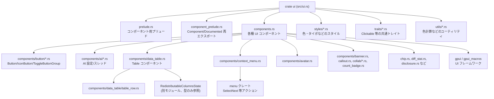
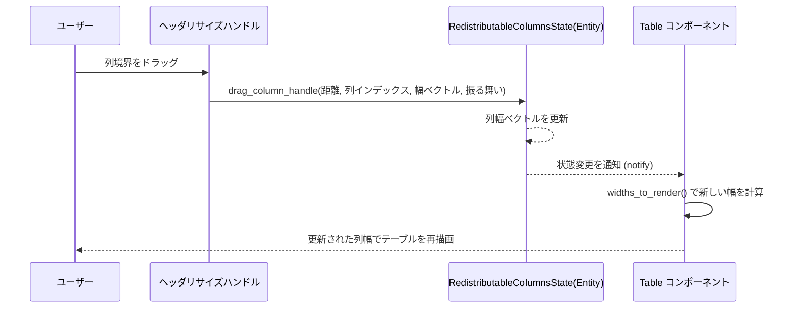
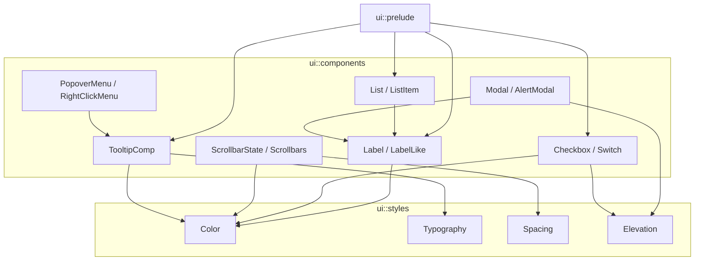

# ui/ ディレクトリ

## 1. ざっくり一言

`ui` クレートは、Zed の UI を構成する **再利用可能なコンポーネント群（ボタン・テーブル・メニュー・通知・AI 用リストなど）** を、`gpui` 上に実装したライブラリです。

---

## 2. このモジュールの役割

### 2.1 概要

- このディレクトリは、`ui` というライブラリクレートのソースです。
- 目的は、アプリケーション側のコードから簡潔に使える **高レベル UI コンポーネント** を提供することです。
- 多くのコンポーネントが `Component` を実装し、`preview` や `description` を持つため、**ドキュメント付きのコンポーネントカタログ**としても機能します。
- レイアウト・色・アニメーションなどの低レベルなスタイルは `theme` / `styles` / `traits` などに委譲され、ここでは主に「UI 部品の振る舞い」が定義されています。

### 2.2 アーキテクチャ内での位置づけ

このチャンクに現れる主なモジュール同士の関係を簡略化すると、次のようになります。



※ `styles/*.rs` や `traits/*.rs` の中身はこのチャンクには含まれていませんが、ファイル一覧から存在のみ分かります。

### 2.3 設計上のポイント

コードから読み取れる設計上の特徴をまとめます。

- **ビルダー型 + RenderOnce**
  - 各コンポーネントは `struct Foo { ... }` として状態を保持し、`Foo::new(...)` + ビルダー的メソッドで構成し、`RenderOnce` 実装で `IntoElement` を返す構造です。
  - 多くの型は `#[derive(IntoElement, RegisterComponent)]` により、`gpui` による直接レンダリングとコンポーネント登録の両方に対応します。

- **状態管理は最低限**
  - 単なる見た目のコンポーネント（`Avatar`, `Banner`, `Button` など）は基本的に **内部状態を持たない**（`self` を消費してレンダリングするだけ）設計です。
  - 状態が必要な場合（例: `CopyButton` の「Copied」状態、`TableInteractionState` のスクロール位置、`ContextMenu` の選択状態など）は、`Entity<T>` として `gpui` の状態管理に委ねます。

- **共通トレイトによる一貫性**
  - `ButtonCommon`, `SelectableButton`, `Clickable`, `Disableable`, `FixedWidth`, `Toggleable`, `VisibleOnHover` などを用いて、異なるコンポーネント間で共通の API（`on_click`, `disabled`, `width`, `toggle_state` 等）を揃えています。
  - これにより、`Button`, `IconButton`, `ButtonLike`, `ToggleButtonGroup` 内のボタンなどが似た手触りになります。

- **長さ安全性と整形**
  - テーブル行には `TableRow<T>` を使い、「列数が揃っている」ことをランタイムで保証しようとしています（`from_vec` など）。
  - `ContextMenu` や `Table` では、`TableRow` や `SmallVec` を用いて **固定長 or 小さな配列** を効率的に扱っています。

- **ドキュメント／プレビュー込みのコンポーネント**
  - 多くの `Component` 実装で `description()` と `preview()` が定義されており、`example_group` / `single_example` を使って **サンプル UI** を返します。
  - これにより、内部で UI カタログやストーリー的な画面を生成できる設計になっています。

- **サブメニュー・ドキュメントアサイドなどリッチなメニュー**
  - `ContextMenu` はサブメニュー、キーボードナビゲーション、アクションバインド、ドキュメントのサイド表示など高度な振る舞いを持ちます。
  - そのため、`SubmenuState`, `HoverTarget`, `DocumentationAside` など、メニュー専用の内部状態が定義されています。

---

## 3. 主要な機能一覧

このチャンクに含まれる主な機能を箇条書きで整理します。

- **コンポーネント基盤**
  - `component_prelude.rs`: `Component`, `Documented`, `RegisterComponent` などを再エクスポートするプリュード。
  - `ui::prelude`（コードは別チャンク）と組み合わせて、アプリ側から `use ui::prelude::*;` で主要型にアクセス可能にする前提。

- **ボタン系コンポーネント**
  - `Button`: ラベル+アイコンを持つ一般的なボタン。`Toggleable`, `SelectableButton`, `Disableable`, `Clickable`, `FixedWidth`, `ButtonCommon` を実装。
  - `ButtonLike`: 低レベルなボタン基盤。`Button` や `IconButton`、トグルグループ内のボタンのベース。
  - `IconButton`: アイコンのみ表示するボタン。選択状態やインジケータをサポート。
  - `ButtonLink`: 下線付きテキスト＋外部リンクアイコンで URL を開くボタン。
  - `CopyButton`: クリックすると文字列をクリップボードにコピーし、一定時間「Copied!」状態を見せるボタン。
  - `SplitButton`: 左がメイン操作、右がサブ操作の 2 分割ボタン。
  - `ToggleButtonGroup` 系: 複数選択肢のトグルボタン群（単行/複数行）をまとめて構成。

- **AI 関連コンポーネント**
  - `AiSettingItem`: AI サーバーやエージェントの設定行（ステータス/ソース/アクション/詳細）。
  - `ConfiguredApiCard`: 「API キーが設定済みです」などを表示するカード＋リセットボタン。
  - `ThreadItem`: エージェントスレッド一覧の各行（ステータスアイコン、タイトル、プロジェクト/ワークツリー情報、DiffStat など）。

- **アバター・コラボレーション**
  - `Avatar`: ユーザーアイコン表示とボーダー・インジケータ（マイクミュート・ステータスなど）表示。
  - `AvatarAudioStatusIndicator`, `AvatarAvailabilityIndicator`: `Avatar` 上に重ねて表示する音声ステータスや在席ステータス。
  - `CollabNotification`: コラボ関連の通知（相手のアバター＋文言＋ Accept/Decline ボタン）。
  - `UpdateButton`: タイトルバーに表示されるアップデート状態用ボタン（Checking / Downloading / Installing / Ready / Error）。

- **通知・情報表示**
  - `Banner`: ページ上部などに表示するインライン通知（Info/Success/Warning/Error）。
  - `Callout`: より強調されたコールアウト（タイトル＋説明＋アクションなど）。
  - `Chip`: 小さなラベル付きバッジ（任意の背景/枠色）。
  - `CountBadge`: 小さな pill 形の数値バッジ（最大 99+）。
  - `DiffStat`: 「+x -y」形式の変更数表示。

- **メニュー・モーダル風 UI**
  - `ContextMenu`: コンテキストメニュー（項目/セパレータ/サブメニュー/ドキュメントアサイド/キーボード操作）。
  - `Disclosure`: 開閉アイコン（Chevron）を持つディスクロージャートリガー（このチャンクでは実装が途中まで）。

- **テーブル表示**
  - `TableRow<T>`: 「列数が一定」であることを前提にした行ラッパー。
  - `Table`: ヘッダー・行・列幅設定・ストライプ表示・リサイズハンドル付き列・仮想スクロールなどを統合したテーブルコンポーネント。
  - `TableInteractionState`: テーブルのフォーカス/スクロール状態を保持するためのエンティティ。
  - `ColumnWidthConfig`, `StaticColumnWidths`: 列幅設定（静的 / Redistributable）。

- **テスト**
  - `components/data_table/tests.rs`: `RedistributableColumnsState` と `TableRow` を用いた列幅リサイズロジックのテスト。

---

## 4. 関数・構造体の解説

このセクションでは、重要な型とその代表的なメソッドを中心に説明します。  
まず主要型の一覧、その後に代表コンポーネントを詳細に見ます。

### 4.1 主要な型一覧（抜粋）

| 名前 | 種別 | 役割 / 用途 |
|------|------|-------------|
| `Button` | 構造体 | ラベル＋アイコン付きの標準ボタン。`ButtonLike` を内部に持つラッパー。 |
| `ButtonLike` | 構造体 | ボタン的外観・インタラクションの共通実装。スタイル・サイズ・クリック・フォーカスなどを一元管理。 |
| `ButtonStyle` / `TintColor` | 列挙体 | ボタンの見た目（Filled / Subtle / Tinted / Outlined / Transparent）と色系統。 |
| `IconButton` | 構造体 | アイコン中心のボタン。選択状態に応じたアイコン・色切替やインジケータ表示に対応。 |
| `ToggleButtonGroup<T, COLS, ROWS>` | 構造体 | 固定列・行数のトグルボタン群。`ToggleButtonSimple` / `ToggleButtonWithIcon` を使って構成。 |
| `ContextMenu`, `ContextMenuItem`, `ContextMenuEntry` | 構造体・列挙体 | コンテキストメニュー本体とその項目。ヘッダ/セパレータ/エントリ/サブメニュー/カスタム行などに対応。 |
| `TableRow<T>` | 構造体 | 「列数が一定」の行を表すラッパー。`map` / `map_ref` / `map_cloned` などで列数を保った変換を提供。 |
| `Table` | 構造体 | 行・列・ヘッダ・列幅・スクロールなどをまとめたテーブル表示コンポーネント。 |
| `TableInteractionState` | 構造体 | テーブルのフォーカス・スクロール・スクロールバー設定を保持する `Entity` 用状態。 |
| `ColumnWidthConfig`, `StaticColumnWidths` | 列挙体 | 列幅の指定方法（自動、明示、Redistributable + 固定テーブル幅）。 |
| `AiSettingItem`, `AiSettingItemStatus`, `AiSettingItemSource` | 構造体・列挙体 | AI サーバ/エージェント設定用の行コンポーネントとそのステータス/インストール元情報。 |
| `ThreadItem`, `AgentThreadStatus`, `ThreadItemWorktreeInfo` | 構造体・列挙体 | エージェントスレッド一覧の 1 行を表現するコンポーネントとその補助情報。 |
| `Avatar`, `AvatarAudioStatusIndicator`, `AvatarAvailabilityIndicator` | 構造体・列挙体 | ユーザーアバターと音声/在席ステータスインジケータ。 |
| `Banner`, `Callout`, `Chip`, `CollabNotification`, `UpdateButton`, `CountBadge`, `DiffStat` | 構造体 | 各種通知/バッジ/統計表示コンポーネント。 |

以下では、特に中心となるコンポーネント／型を選んで詳細に解説します。

---

### 4.2 代表的なコンポーネント・型の詳細

#### 4.2.1 Button 系コンポーネント（`Button`, `ButtonLike`, `IconButton` ほか）

##### `Button`

**概要**

- 一般的なテキストボタンです。内部で `ButtonLike` を使って見た目とインタラクションを委譲しています。
- ラベル、開始／終了アイコン、キーバインド表示、トグル状態、選択時スタイルなどを柔軟に設定できます。

**主なフィールド（抜粋）**

- `base: ButtonLike` … 実際のボタン外観・イベント処理を担う基盤。
- `label: SharedString` … 通常時のラベル文字列。
- `selected_label: Option<SharedString>` … 選択状態のときに表示するラベル。
- `start_icon / end_icon: Option<Icon>` … ラベルの左右に表示するアイコン。
- `key_binding: Option<KeyBinding>` … 対応するキー操作を表示するための情報。
- `truncate: bool` … ラベルの省略表示（`…`）を行うか。
- `loading: bool` … ローディング中表示（回転スピナー）にするか。

**主なビルダーメソッド**

- `Button::new(id, label)` … 基本コンストラクタ。
- `color(label_color)`, `label_size(size)` … ラベルの色・サイズ変更。
- `selected_label(...)`, `selected_label_color(...)` … 選択状態専用のラベルと色。
- `start_icon(...)`, `end_icon(...)` … 両端のアイコン設定。
- `key_binding(...)`, `key_binding_position(...)` … キーバインド表示位置（開始/終了）を制御。
- `truncate(bool)` … 可変長ラベルに対して省略を許可。
- `loading(bool)` … `true` のとき `start_icon` ではなくスピナーを表示。

**トレイト実装とその意味**

- `Toggleable` … `.toggle_state(true)` で「選択状態」にできる。
- `SelectableButton` … `.selected_style(ButtonStyle::Tinted(TintColor::Accent))` などで選択時スタイルを指定。
- `Disableable` … `.disabled(true)` で操作不能にし、色も Disabled 用に変更。
- `Clickable` … `.on_click(|event, window, cx| { ... })` でクリック時処理を登録。
- `FixedWidth` … `.width(px(100.0))`, `.full_width()` などで幅指定。
- `ButtonCommon` … `style`, `size`, `tooltip`, `tab_index`, `layer`, `track_focus` など共通 API。

**内部処理の流れ（レンダリング）**

- `render` では、`base.disabled` と `base.selected` を見てラベルと色を決定します。
- ラベルコンテンツ部分を `h_flex()` で組み立て、`start_icon`／`end_icon`／`key_binding` を並べます。
- `loading == true` の場合は `start_icon` の代わりに回転する `LoadCircle` アイコンを挿入します。
- 最後に `base.child(...)` として `ButtonLike` にコンテンツを渡し、`ButtonLike` 側のスタイル/イベント適用で完成します。

**エッジケース**

- `truncate(true)` の場合:
  - ラベル部分に `min_w_0().overflow_hidden().truncate()` が付与されるため、長いテキストは `…` で省略されます。
  - ドキュメントにも「静的ラベルには使わない方がよい」とコメントがあります。
- 無効化 (`disabled(true)`) された場合:
  - ラベル色は常に `Color::Disabled` になり、アイコンも `Color::Disabled` に上書きされます。

**使用上の注意点**

- `Button::new` の `id` は `ElementId` として UI 内でユニークであることが期待されています。`CopyButton` など ID ベースで状態が紐づくコンポーネントと混在させる時は特に注意します。
- `loading(true)` の間は `start_icon` が無視されるため、ローディング状態でも表示したいアイコンがある場合は別途設計が必要です。

**簡単な使用例**

```rust
use ui::prelude::*;                               // Button, Icon などをインポート
use ui::{ButtonStyle, TintColor};                 // スタイル系も必要に応じてインポート

fn render_toolbar(_window: &mut Window, cx: &mut App) -> impl IntoElement {
    h_flex()                                      // 横並びのコンテナ
        .gap_2()                                  // ボタン間の間隔
        .child(
            Button::new("save", "Save")           // ID とラベルを指定
                .style(ButtonStyle::Filled)       // 目立つ Filled スタイル
                .start_icon(Icon::new(IconName::Check))
        )
        .child(
            Button::new("run", "Run")
                .toggle_state(true)               // 選択状態
                .selected_style(ButtonStyle::Tinted(TintColor::Accent))
        )
}
```

---

##### `ButtonLike` / `ButtonStyle` / `TintColor`

**概要**

- `ButtonLike` は「ボタン風の要素」を作るための低レベルコンポーネントです。
- `ButtonStyle` と `TintColor` が、状態（enabled/hovered/active/disabled）と外観（背景・枠線・ラベル色・アイコン色）の組み合わせを一元的に決定します。
- `Button` や `IconButton` の内部実装、`ToggleButtonGroup` 内のセルなど、多くの要素が `ButtonLike` を利用します。

**主なプロパティ**

- `style: ButtonStyle` … Subtle / Filled / Tinted / Outlined など。
- `size: ButtonSize` … 高さ（Large, Medium, Default, Compact, None）を rem で制御。
- `disabled: bool`, `selected: bool`, `selected_style: Option<ButtonStyle>` … 状態管理。
- `width: Option<DefiniteLength>`, `height: Option<DefiniteLength>` … 幅/高さ指定。
- `tab_index`, `focus_handle`, `cursor_style`, `tooltip`, `hoverable_tooltip` など多数。

**スタイル決定ロジック**

- `ButtonStyle::enabled / hovered / active / focused / disabled` が、それぞれの状態における `ButtonLikeStyles`（背景・枠色・ラベル色・アイコン色）を返します。
- `RenderOnce for ButtonLike` では current style と `disabled`/`selected` 状態から使用すべき `ButtonStyle` を決定し、
  - 枠線 (`border_1`)、丸め (`rounded_*_sm`)、背景色 (`bg(...)`)、
  - hover 時の `hover(|refinement| refinement.bg(...))`、
  - focus 時の `focus_visible(...)`、
  - active 時の `active(|active| active.bg(...))`
  を設定します。

**エッジケース・注意点**

- `selected_style` がある場合、`selected == true` で `style` を差し替えて計算されます。スタイル全体が変わるので、意図しない色変化に注意します。
- `disabled == true` のときは hover/active/focus のスタイルが適用されず、カーソルも `not_allowed` になる場合があります。

---

##### `IconButton`

**概要**

- アイコンのみ（またはインジケータ付きアイコン）を表示するボタンです。
- 基盤に `ButtonLike` を利用しつつ、アイコンサイズ・色・選択時アイコンなどを制御します。

**主なフィールド**

- `base: ButtonLike` … 見た目・イベント処理。
- `icon: IconName`, `icon_size: IconSize`, `icon_color: Color` … 通常状態のアイコン。
- `selected_icon: Option<IconName>` … 選択状態でアイコンを差し替える場合に使用。
- `selected_icon_color: Option<Color>` … 選択状態のアイコン色（`selected_style` がある場合はそちら優先）。
- `selected_style: Option<ButtonStyle>` … ボタン背景なども含めて選択時スタイルを変えたいときに使用。
- `indicator: Option<Indicator>` … ドットなどの状態インジケータを重ねて表示。
- `shape: IconButtonShape` … `Square` か `Wide`。`Square` の場合はアイコンサイズに応じた正方形ボタンになります。

**主なメソッド**

- `IconButton::new(id, icon)` … 基本コンストラクタ。
- `shape(IconButtonShape)`, `icon_size(IconSize)`, `icon_color(Color)`, `alpha(f32)`。
- `selected_icon(...)`, `selected_icon_color(...)`, `selected_style(ButtonStyle)`。
- `indicator(Indicator)`, `indicator_border_color(Option<Hsla>)`。
- `on_click`, `on_right_click`, `disabled`, `width`, `full_width`, `tooltip` などは `ButtonLike` 経由で利用。

**レンダリングのポイント**

- `is_disabled` / `is_selected` を見てアイコン名と色を決定します。
  - `selected_style` があり選択状態の場合 → `ButtonStyle` から導いた `Color` を優先。
  - それ以外で選択状態の場合 → `selected_icon_color` または `Color::Selected`。
  - それ以外 → `icon_color` に `alpha` を掛けた色。
- `shape == Square` の場合はアイコンサイズ×rem からボタンの幅/高さを決定し、正方形にします。
- `indicator` があれば `IconWithIndicator` でラップして表示します。

**使用上の注意点**

- `selected_style` と `selected_icon_color` を両方設定した場合、選択時色は `selected_style` 由来の色が優先されます（`From<ButtonStyle> for Color` 実装に基づく）。
- `alpha` はアイコン色だけに掛かり、背景色には影響しません。

---

#### 4.2.2 ToggleButtonGroup（トグルボタングループ）

**関係する型**

- `ToggleButtonGroup<T, const COLS: usize, const ROWS: usize>`
- `ToggleButtonSimple`
- `ToggleButtonWithIcon`
- `ToggleButtonPosition`, `ToggleButtonGroupStyle`, `ToggleButtonGroupSize`

**概要**

- 固定列・固定行数のトグルボタン群を作るためのコンポーネントです。
- 各ボタンは内部的に `ButtonLike` で描画され、選択状態の強調や、Transparent/Outlined/Filled といったグループ全体スタイルを揃えられます。

**ボタンビルダー (`ButtonBuilder` トレイト)**

- `ToggleButtonSimple::new(label, on_click)`:
  - ラベルのみのトグルボタン定義。
  - `.selected(bool)`, `.tooltip(...)` で初期選択とツールチップを設定。
- `ToggleButtonWithIcon::new(label, icon, on_click)`:
  - アイコン付きトグルボタン。
  - 使い方やビルダーは `ToggleButtonSimple` と同様。

`ButtonBuilder` トレイトは `into_configuration()` で `ButtonConfiguration`（ラベル, アイコン, on_click, selected, tooltip）に変換されます。

**ToggleButtonGroup の主なメソッド**

- `ToggleButtonGroup::single_row(group_name, [T; COLS])` … 1 行 COLS 列のグループ。
- `ToggleButtonGroup::two_rows(group_name, [T; COLS], [T; COLS])` … 2 行 COLS 列のグループ。
- `style(ToggleButtonGroupStyle)` … Transparent / Filled / Outlined。
- `size(ToggleButtonGroupSize)` … Default/Medium/Large/Custom(height)。
- `selected_index(usize)` … 0-based で初期選択インデックスを指定。
- `auto_width()` … グループ全体が親の幅を埋めるのではなく、ボタン内容に応じた幅にする。
- `label_size(LabelSize)` … 全ボタンのラベルサイズ設定。
- `tab_index(&mut isize)` … グループ内の各ボタンにタブインデックスを割り当て、呼び出し側のインデックスも自動更新。
- `width(DefiniteLength)`, `full_width()`（`FixedWidth` 実装） … グループ全体の幅。

**レンダリングの流れ**

- 各行・各列のボタンについて：
  - `ButtonLike::new((group_name.clone(), entry_index))` で `id` を生成。
  - グループのスタイル/サイズ/高さに応じて `style(ButtonStyle::...)` や `size(ButtonSize::...)` を適用。
  - `entry_index == selected_index` または `builder` 由来の `selected == true` の場合、`toggle_state(true)` + `selected_style(ButtonStyle::Tinted(TintColor::Accent))`。
  - アイコン付きの場合、`Icon::new(icon).size(IconSize::XSmall)` を先頭に表示し、選択状態なら `Color::Accent`、そうでなければ `Color::Muted`。
- 行ごとに `border_r_1` や `border_b_1` を使って **グループ全体に枠線** を描画（Outlined/Filled の場合）。
- `ToggleButtonPosition` → `ButtonLikeRounding` への変換により、左右/上下の端にあるボタンのみコーナーが丸くなります。

**エッジケース・注意点**

- `selected_index` が `COLS * ROWS` 以上にならないようにする必要があります（コード上はチェックされていないため、論理的前提条件です）。
- `tab_index(&mut isize)` は渡された値をインクリメントするため、同一フォーム内で複数の `ToggleButtonGroup` を使う場合は **一つのカウンタを共有** する必要があります。
- `auto_width()` を指定しない場合、各アイテムは `width = 1 / COLS` の相対幅を持ちます。

---

#### 4.2.3 ContextMenu 一式

**主な型**

- `ContextMenu`
- `ContextMenuItem`（ヘッダ, セパレータ, ラベル, エントリ, カスタムエントリ, サブメニュー）
- `ContextMenuEntry`
- `DocumentationAside`, `DocumentationSide`
- `SubmenuState`, `OpenSubmenu`, `HoverTarget`

**概要**

- 高機能なコンテキストメニュー実装です。
- 機能:
  - セパレータ・ヘッダ・ラベル・通常エントリ・カスタム行・サブメニュー。
  - キーボード操作（上下/左右/Enter/Escape）による選択・決定。
  - `menu` クレートのアクション（`SelectNext`, `Confirm`, `Cancel` 等）との連携。
  - 項目ごとのキーバインド表示（`KeyBinding`）。
  - 項目に応じた「ドキュメントアサイド」（説明パネル）の表示。
  - サブメニューのホバーオープン・キーボードオープン、サブメニュー領域の「安全ゾーン」など。

**主なビルダーメソッド**

- コンテキストメニュー生成:
  - `ContextMenu::build(window, cx, |menu, window, cx| { ... }) -> Entity<ContextMenu>`
  - `ContextMenu::build_persistent(window, cx, builder) -> Entity<ContextMenu>`  
    → `keep_open_on_confirm` なメニューを作り、後から `rebuild()` でメニュー構造を作り直せる。
- 項目追加:
  - `header(title)`, `header_with_link(title, link_label, link_url)`
  - `separator()`
  - `label(text)`
  - `entry(label, action: Option<Box<dyn Action>>, handler: impl Fn)`
  - `entry_with_end_slot(...)` / `entry_with_end_slot_on_hover(...)`
  - `toggleable_entry(label, toggled, position, action, handler)`
  - `custom_row(entry_render)` … 選択不可のカスタム UI 行。
  - `custom_entry(entry_render, handler)` … クリック可能なカスタム行。
  - `custom_entry_with_docs(entry_render, handler, documentation_aside)`
  - `submenu(label, builder)` / `submenu_with_icon` / `submenu_with_colored_icon`
- その他:
  - `keep_open_on_confirm(bool)` … Confirm 後もメニューを閉じない。
  - `context(FocusHandle)` … Action 発火時にフォーカスする対象を明示。
  - `fixed_width(DefiniteLength)` … メニューの幅固定。
  - `end_slot_action(Box<dyn Action>)` … 選択エントリの「右側アクション」をトリガーする Action を紐づけ。
  - `key_context(SharedString)` … キーボードショートカット解決用のコンテキスト名。

**ContextMenuEntry の構成**

- `toggle: Option<(IconPosition, bool)>` … チェックボックス用。「どちら側にチェックを出すか」と ON/OFF。
- `label: SharedString` … メニューラベル。
- `icon / custom_icon_path / custom_icon_svg` … アイコン設定（いずれか 1 つ）。
- `handler` / `secondary_handler` … Enter/SecondaryConfirm 時に実行されるクロージャ。
- `action: Option<Box<dyn Action>>` … グローバルアクションと紐づける場合の Action。
- `disabled: bool` … 無効化。
- `documentation_aside: Option<DocumentationAside>` … 選択時に横に表示する追加説明。
- `end_slot_icon`, `end_slot_title`, `end_slot_handler`, `show_end_slot_on_hover` … 行の右端アイコン（例えば「詳細設定」など）とその挙動。

**キーボード操作系メソッド**

- `select_first(&SelectFirst, ...)`, `select_last(...)`, `select_next(&SelectNext, ...)`, `select_previous(&SelectPrevious, ...)`
  - `ContextMenuItem::is_selectable()` でフィルタしつつ、次の/前の選択可能な項目を選び、`selected_index` を更新。
- `confirm(&menu::Confirm, ...)`, `secondary_confirm(&menu::SecondaryConfirm, ...)`
  - サブメニュー項目の場合 → サブメニューを開く。
  - 通常エントリの場合 → `handler`/`secondary_handler` を呼び、`keep_open_on_confirm` が false なら `DismissEvent` を emit して閉じる。

**サブメニュー関連**

- `SubmenuState::{Closed, Open(OpenSubmenu)}` でサブメニューの開閉と対象項目を管理。
- `open_submenu(item_index, builder, trigger, window, cx)`：
  - `ContextMenu::build_submenu` で子メニュー `Entity<ContextMenu>` を作成。
  - 親メニューとサブメニューの間で `DismissEvent` をサブスクライブし、子が閉じたら必要に応じて親も閉じる。
  - 項目の描画時に `canvas` でトリガー行の `Bounds` を記録し、その位置に基づきサブメニューを `anchored` で配置。
  - `SubmenuOpenTrigger::Keyboard` の場合は `ignore_blur_until` を少し先に設定し、フォーカス遷移で親が即座に閉じられないようにしています。

**ドキュメントアサイド**

- `DocumentationAside { side: DocumentationSide, render: Rc<dyn Fn(&mut App) -> AnyElement> }`
- 各エントリで `documentation_aside(...)` を設定すると、選択中のエントリに対応するアサイドを右（または左）側に表示します。
- 幅の広いウィンドウではメニュー横に、狭いウィンドウではメニューの上下に配置されるような構成になっています。

**エッジケース・注意点**

- `build_persistent` で作ったメニューだけが `rebuild()` を持ち、`keep_open_on_confirm == true` のケースでトグル動作のたびにメニューを組み直せます。`build` で作った場合、`rebuild` は no-op です。
- `ContextMenuItem::is_selectable()` が false の項目（ヘッダ、セパレータ、ラベルなど）はキーボードナビゲーションの対象外です。
- サブメニューのホバー領域や「安全ゾーン」は座標計測 (`canvas`) と `submenu_safety_threshold_x` によって制御されています。メニュー全体を他のレイアウトに包む場合、これらの座標変化に注意が必要です。

---

#### 4.2.4 Table / TableRow 系

##### `TableRow<T>`

**概要**

- 「この行は列数 N を必ず持つ」という前提を維持するための薄いラッパーです。
- コンストラクタで列数を検査し、長さの不整合を防ぎます。テーブル内で列幅や列ごとの操作を扱う際に安全性が高くなります。

**主なコンストラクタ**

- `TableRow::from_element(element: T, length: usize)`:
  - 同じ値 `element` を `length` 個並べた行を生成。
- `TableRow::from_vec(data: Vec<T>, expected_length: usize)`:
  - 長さが `expected_length` と一致していれば `TableRow` を返し、一致しなければ panic。
- `TableRow::try_from_vec(data: Vec<T>, expected_len: usize) -> Result<Self, String>`:
  - 長さが違う場合は `Err("Row length ... does not match expected ...")` を返す安全な版。

**変換・補助メソッド**

- `as_slice(&self) -> &[T]`, `into_vec(self) -> Vec<T>`。
- `map(self, f: impl FnMut(T) -> U) -> TableRow<U>` … 消費しながら変換。
- `map_ref(&self, f: impl FnMut(&T) -> U) -> TableRow<U>` … 借用して変換。
- `map_cloned(&self, f: impl FnMut(T) -> U) -> TableRow<U>` … 内部で `clone` してから変換。
- `cols(&self) -> usize` … 列数。

**トレイト実装**

- `Index` / `IndexMut`（`usize` や範囲指定） … `Vec<T>` と同様のインデクシング。
- `IntoTableRow<T> for Vec<T>`:
  - `vec.into_table_row(expected_length)` で `TableRow` に変換（内部で `from_vec` を呼ぶ）。

**エッジケース・注意点**

- `from_vec`／`into_table_row` は長さ不一致時に panic します。入力が信用できない場合には `try_from_vec` を使う必要があります。
- `expect_get(col)` はインデクス外アクセス時に panic します。エラーメッセージには `type_name::<T>()` が含まれます。

---

##### `Table` / `TableInteractionState` / `ColumnWidthConfig`

**概要**

- 汎用テーブルコンポーネントです。列数を指定して `header` / `row` で行を追加する単純な使い方に加え、
  - 仮想化された Uniform List / 可変高さ List モード、
  - 列幅の自動/明示/再分配型（Redistributable）設定、
  - スクロール位置やスクロールバー外観のカスタマイズ
  をサポートします。

**主要フィールド（抜粋）**

- `cols: usize` … 列数。`header` / `row` で渡す行の列数チェックに使われます。
- `headers: Option<TableRow<AnyElement>>`
- `rows: TableContents` … `Vec<TableRow<AnyElement>>` / UniformList / VariableRowHeightList のいずれか。
- `column_width_config: ColumnWidthConfig`
- `interaction_state: Option<WeakEntity<TableInteractionState>>` … スクロール・フォーカス情報。
- `map_row: Option<Rc<dyn Fn((usize, Stateful<Div>), &mut Window, &mut App) -> AnyElement>>` … 1 行ごとのラップをカスタマイズするためのコールバック。
- `striped`, `show_row_borders`, `show_row_hover`, `use_ui_font`, `disable_base_cell_style` などスタイル関連フラグ。
- `empty_table_callback: Option<Rc<dyn Fn(&mut Window, &mut App) -> AnyElement>>` … 行が 0 のときに表示するコンテンツ。

**ColumnWidthConfig**

- `Static { widths: StaticColumnWidths, table_width: Option<DefiniteLength> }`
  - `StaticColumnWidths::Auto` … 各セルが `flex_1()` で等分。
  - `StaticColumnWidths::Explicit(TableRow<DefiniteLength>)` … 列ごとに固定幅。
- `Redistributable { columns_state: Entity<RedistributableColumnsState>, table_width: Option<DefiniteLength> }`
  - 列幅の合計は一定としつつ、ドラッグ操作で幅を再配分するモード。実装は別モジュールの `RedistributableColumnsState` にあります（このチャンクにはなし）。

**主なビルダーメソッド**

- `Table::new(cols: usize)` … 基本コンストラクタ。
- `header(Vec<impl IntoElement>)`, `row(Vec<impl IntoElement>)`
  - `Vec` は内部で `IntoTableRow` → `TableRow<AnyElement>` に変換され、`cols` と長さが一致しないと panic。
- `striped()` … 交互に背景色を変えるストライプ表示。
- `hide_row_borders()`, `hide_row_hover()` … 行の境界線/hover 背景の無効化。
- `width(DefiniteLength)` … テーブル全体の幅を固定（列幅は自動）。
- `width_config(ColumnWidthConfig)` … 列幅設定を直接指定。
- `interactable(&Entity<TableInteractionState>)` … スクロールやカスタムスクロールバーを有効化。
- `uniform_list(id, row_count, render_item_fn)`:
  - Uniform List（各行の高さが同じ）を使った仮想スクロールモード。
  - `render_item_fn(Range<usize>, window, cx)` は複数行をまとめて返し、内部で `render_table_row` に渡されます。
- `variable_row_height_list(row_count, list_state, render_row_fn)`:
  - 行ごとに高さが異なる場合のリスト表示モード。
  - `list_state: ListState` を外部から渡す必要があります。
- `no_ui_font()` … テキストに UI フォントスタイル (`text_ui`) を適用しない。
- `map_row(callback)` … 各行の `Div` に対して任意のラッパーや `on_click` を追加したい場合などに使用。
- `empty_table_callback(callback)` … 行がない場合に「No items」などの表示を行うためのコールバック。

**TableInteractionState**

- `focus_handle: FocusHandle` … テーブル全体のフォーカス管理に使用。
- `scroll_handle: UniformListScrollHandle` … スクロール位置の記録・復元に使用。
- `custom_scrollbar: Option<Scrollbars>` … デフォルトと異なるスクロールバーを使用したいときに設定。

**エッジケース・注意点**

- `header`／`row` に渡す `Vec` の長さが `cols` と一致しないと、`TableRow::from_vec` 経由で panic します。可変列を扱いたい場合は別のコンポーネントまたは `cols` の見直しが必要です。
- `uniform_list`／`variable_row_height_list` を呼ぶと、`rows` は `TableContents::UniformList/VariableRowHeightList` に差し替えられ、それまでに追加した `row` は無視されます。
- Redistributable 列幅を使う場合:
  - `ColumnWidthConfig::Redistributable { columns_state, .. }` で設定し、さらに `bind_redistributable_columns` と `render_redistributable_columns_resize_handles` を通じて UI/状態と結びつきます。
  - これらのヘルパー関数の実装はこのチャンクにはありませんが、テストコードから `drag_column_handle` や `reset_to_initial_size` を呼ぶ API があることが分かります。

---

#### 4.2.5 AI 設定・スレッド系コンポーネント

##### `AiSettingItem` / `AiSettingItemStatus` / `AiSettingItemSource`

**概要**

- AI 関連の設定画面で 1 行を表すコンポーネントです。
- 左側にアイコン（またはラベル頭文字のアバター）、中央にラベル＋詳細、右側にアクションボタン群、下部にエラーなどの詳細を表示する構成です。

**ステータス (`AiSettingItemStatus`)**

- `Stopped` / `Starting` / `Running` / `Error` / `AuthRequired` / `Authenticating`
- `tooltip_text()` … ステータスに応じたツールチップ文字列。
- `indicator_color()` … 小さなドットインジケータの色（Some/None）。
- `is_animated()` … `Starting` と `Authenticating` のときだけアイコンをパルスアニメーションさせる。

**ソース (`AiSettingItemSource`)**

- `Extension` / `Custom` / `Registry`
- `icon_name()` … 専用アイコン（拡張機能／カスタム／ACP レジストリ）。
- `tooltip_text(label)` … 「〇〇は Extension からインストールされた」などの説明文。

**ビルダーメソッド**

- `AiSettingItem::new(id, label, status, source)` … 基本。
- `.icon(element)` … 左側アイコンをカスタム要素で差し替え。
- `.detail_label(text)` … ラベル右側に小さめの補足テキストを表示。
- `.action(element)` … 右端にアクションボタンを追加（`IconButton` など）。
- `.details(element)` … 行の下にエラーメッセージ行などを追加。

**レンダリングのポイント**

- アイコン未指定時:
  - ラベルの最初の文字を大文字にした「文字アバター」を生成し、枠付きの四角に表示します。
- `status.is_animated()` が true の場合:
  - アイコンを `Animation::new(Duration::from_secs(2)).repeat().with_easing(pulsating_between(0.4, 0.8))` でアニメーションし、`opacity` を周期的に変化させます。
- ステータスのインジケータ:
  - `IconDecoration`（Dot）をアイコン右上付近に重ね、`indicator_color()` に応じた色で表示。

**使用上の注意点**

- `id` から `source_id` や `icon_id` を組み立てているため、1 画面内で ID がユニークになるようにする必要があります。
- アニメーションはウィンドウのテーマ色に依存しており、多数の行で `Starting` 状態があると描画負荷が上がる可能性があります。

---

##### `ThreadItem` / `AgentThreadStatus` / `ThreadItemWorktreeInfo`

**概要**

- エージェントスレッド一覧の 1 行を表し、ステータス・タイトル・通知・プロジェクト/ワークツリー・変更数・タイムスタンプなどを一括で表示します。
- 状態に応じてアイコン（エラー, 待機, 実行中スピナー, 通知ドット）が自動的に切り替わります。

**主なフィールド（抜粋）**

- 見た目:
  - `icon: IconName`, `icon_color: Option<Color>`, `icon_visible: bool`
  - `custom_icon_from_external_svg: Option<SharedString>`
  - `title: SharedString`, `title_label_color: Option<Color>`, `title_generating: bool`, `highlight_positions: Vec<usize>`
  - `timestamp: SharedString`
- 状態:
  - `status: AgentThreadStatus`（`Completed` / `Running` / `WaitingForConfirmation` / `Error`）
  - `notified: bool` … 完了通知ドットを出すか。
  - `selected`, `focused`, `hovered`, `rounded`
- 変更情報:
  - `added: Option<usize>`, `removed: Option<usize>` … `DiffStat` 用。
- プロジェクト関連:
  - `project_paths: Option<Arc<[PathBuf]>>`, `project_name: Option<SharedString>`
  - `worktrees: Vec<ThreadItemWorktreeInfo { name, full_path, highlight_positions }>`
- イベント／スロット:
  - `on_click: Option<Box<dyn Fn(&ClickEvent, &mut Window, &mut App)>>`
  - `on_hover: Box<dyn Fn(&bool, &mut Window, &mut App)>`（デフォルトは no-op）
  - `action_slot: Option<AnyElement>` … ホバー時右側に出すアクションボタンなど。
  - `tooltip: Option<Box<dyn Fn(&mut Window, &mut App) -> AnyView>>`
  - `base_bg: Option<Hsla>` … 背景色を外部から上書きするため。

**レンダリングの流れ**

- 背景色:
  - テーマの `title_bar_background`, `panel_background`, `element_active` などをブレンドして `sidebar_base_bg`, `apparent_bg`, `base_bg`, `hover_bg` を計算。
  - `selected == true` なら `element_active` をブレンドして強調。
- ステータスアイコン:
  - `Running` → `LoadCircle` アイコン＋回転アニメーション。
  - `Error` → `X` アイコン（赤）、"Thread has an Error" Tooltip。
  - `WaitingForConfirmation` → `Warning` アイコン（黄）、"Thread is Waiting for Confirmation" Tooltip。
  - `notified == true` → Accent カラーのドット。
- タイトル:
  - `title_generating == true` の場合、ラベルの `alpha` をアニメーション。
  - `highlight_positions` が空でない場合、`HighlightedLabel` コンポーネントを使って部分ハイライト。
- メタデータ行（2 行目）:
  - `project_name`, `project_paths`, `worktrees`, `DiffStat`, `timestamp` の組み合わせで行を構成。
  - `worktrees` は `name` 単位で重複を除去し、`Tooltip::with_meta` で `full_path` の一覧を表示。
- `hovered == true` かつ `action_slot` がある場合:
  - `GradientFade` で右側にオーバーレイを敷き、その上に `action_slot` を表示。
  - `MouseButton::Left` での `on_mouse_down` 時に `stop_propagation` し、行本体へのクリックを抑止。

**使用上の注意点**

- 実際のホバー状態は `on_hover` コールバックで通知される設計ですが、`hovered` フィールドも存在します。プレビューでは `hovered(true)` を使って「ホバー時の見た目」を疑似的に表示しています。
- `project_paths` から表示に使うのは `file_name()` 部分だけです。ルートディレクトリなどファイル名のないパスは無視されます。
- `highlight_positions` は文字インデックスを前提としているため、マルチバイト文字列に対してどのように interprete されるかは `HighlightedLabel` 実装次第です（このチャンクには現れません）。

---

#### 4.2.6 Avatar とインジケータ

##### `Avatar`

**概要**

- 円形のユーザーアバター（画像）を描画し、オプションでボーダーやインジケータ（音声 / 在席）が重なるコンポーネントです。

**主なフィールド・メソッド**

- `Avatar::new(src: impl Into<ImageSource>)` … 画像ソース（URL など）を指定。
- `.grayscale(bool)` … グレースケールフィルタを適用。
- `.border_color(Hsla)` … 外周のボーダー色と幅（1px）を設定。
- `.size(AbsoluteLength)` … デフォルト 1rem のサイズを上書き。
- `.indicator(impl Into<Option<E>>)` … 任意のインジケータ要素を右下に重ねて表示。

**レンダリングのポイント**

- `border_color` があるかどうかでコンテナサイズを計算し（画像サイズ + 枠線 2px）、丸め (`rounded_full`) と背景 (`element_disabled`) を設定。
- 画像読み込み失敗時には `IconName::Person` のアイコンを中央に表示する `with_fallback` を使用。

---

##### `AvatarAudioStatusIndicator` / `AvatarAvailabilityIndicator`

- `AvatarAudioStatusIndicator`:
  - `AudioStatus::{Muted, Deafened}` に応じて `MicMute` / `AudioOff` アイコンを小さな pill 上に表示。
  - `tooltip`（任意）のクロージャを受け取り、ホバー時に状況説明を表示可能。
- `AvatarAvailabilityIndicator`:
  - `CollaboratorAvailability::{Free, Busy}` に応じて緑/赤などの丸いインジケータを、アバター右下に重ねて表示。
  - `avatar_size(Pixels)` を指定すると、アバターサイズから 40% を丸めたピクセル値でサイズを算出。

**注意点**

- ピクセル計算は `Window::rem_size()` に依存するため、UI 全体のフォントサイズを変更するとインジケータの大きさも変化します。
- `AvatarAvailabilityIndicator` のコメントに「non-integer sizes result in oval indicators」とあり、内部で `round()` して整数ピクセルに揃えています。

---

#### 4.2.7 通知系・小型コンポーネント（概要のみ）

- `Banner`:
  - Severity（`Info`, `Success`, `Warning`, `Error`）に応じて背景色・境界線・アイコンを変更。
  - メインメッセージと、右側に 1 つのアクションスロット（CTA ボタンなど）を持つ。
- `Callout`:
  - タイトル＋説明＋複数アクション＋任意の dismiss ボタン。
  - `line_height` を指定して行揃えを調整でき、説明部分を `description_slot` で任意の要素に差し替え可能。
  - `border_position` により上 or 下にボーダー。
- `Chip`:
  - 小さなラベルコンポーネント。背景色・枠色・高さをカスタマイズ可能。
  - ラベルには `truncate()` が付いており、長いテキストは省略されます。
- `CollabNotification`:
  - 左側にアバター＋テキスト、右側に `accept_button` / `dismiss_button` を縦並びに配置。
  - 親から `Button` インスタンスを受け取り、そのまま子として配置する構造です。
- `UpdateButton`:
  - アップデート状態を表すテキストとアイコン、オプションで dismiss ボタン。
  - `checking()`, `downloading(version)`, `installing(version)`, `updated(version)`, `errored(error)` のファクトリメソッドが用意されています。
- `CountBadge`:
  - 右上に絶対配置される丸いバッジ。「99」までは数値、「99+」で打ち止め。
- `DiffStat`:
  - `+ N` と `− N` を色付きラベルで表示し、任意のツールチップを付けられます。

---

### 4.3 その他の関数・トレイト（簡略）

| 名前 | 役割（1 行） |
|------|--------------|
| `SelectableButton` トレイト | `toggle_state` を持つボタンに対し、`selected_style(ButtonStyle)` を設定するための共通インタフェース。 |
| `ButtonCommon` トレイト | ID・スタイル・サイズ・ツールチップ・レイヤなどボタン共通操作をまとめたトレイト。 |
| `TableRenderContext` | `Table` のレンダリングに必要なフラグ・列幅等をまとめた構造体。 |
| `render_table_row` / `render_table_header` | `TableRow` と `TableRenderContext` から 1 行 / ヘッダ行の UI 要素を構成するヘルパー関数。 |
| `TableInteractionState::listener` | `Entity<TableInteractionState>` に紐づくイベントリスナを簡単に生成するためのヘルパー関数。 |

---

## 5. データフロー

### 5.1 例: 列幅リサイズ付きテーブルのフロー

このチャンクには `RedistributableColumnsState` の実装はありませんが、`Table` と `data_table/tests.rs` から、列幅リサイズの典型的な流れを次のように読み取れます。

1. 親コードが `RedistributableColumnsState` の `Entity` を生成し、`ColumnWidthConfig::Redistributable { columns_state, .. }` を `Table` に渡す。
2. `Table` の `render` で `render_redistributable_columns_resize_handles(columns_state, window, cx)` を呼び、各列ヘッダにドラッグ用ハンドルを描画。
3. ハンドルがドラッグされると、`RedistributableColumnsState::drag_column_handle(distance, column_index, &mut widths, &resize_behavior)` が呼ばれ、列幅ベクトルが更新される（テストコードに基づく）。
4. `RedistributableColumnsState` が変更を通知すると、`Table` が再レンダリングされ、`columns_state.read(cx).widths_to_render()` に基づいて各セルの `width` が変化する。

この流れをシーケンス図にすると、次のようになります（概念レベル）。



実際のハンドル UI の詳細（ドラッグ開始・終了のイベント処理）はこのチャンクには含まれていませんが、テストコードと `render_redistributable_columns_resize_handles` 呼び出しから、このような責務分担になっていると解釈できます。

---

## 6. 使い方（How to Use）

### 6.1 基本的な使用方法

#### 6.1.1 ボタンと簡単なツールバー

`Button` と `IconButton` を使って、簡単なツールバーを描画する例です。

```rust
use ui::prelude::*;                         // Button, IconButton, Label などをまとめてインポート

fn render_toolbar(_window: &mut Window, cx: &mut App) -> impl IntoElement {
    h_flex()                                // ツールバー用の横並びコンテナ
        .gap_2()                            // 要素間の間隔
        .child(
            Button::new("open", "Open")     // ラベル付きボタン
                .style(ButtonStyle::Filled) // 強調表示
                .start_icon(Icon::new(IconName::FolderOpen))
        )
        .child(
            IconButton::new("settings", IconName::Settings)
                .shape(IconButtonShape::Square)   // 正方形ボタン
                .tooltip(|_w, cx| Tooltip::text("Settings")(cx))
        )
}
```

#### 6.1.2 シンプルなテーブル

`Table::new` と `header` / `row` を使った基本的なテーブル表示です。

```rust
use ui::prelude::*;                         // Table, px などをインポート

fn render_simple_table(_window: &mut Window, _cx: &mut App) -> impl IntoElement {
    Table::new(3)                           // 3 列のテーブル
        .width(px(400.0))                   // テーブル全体の幅を 400px に固定
        .header(vec!["Name", "Age", "City"])// ヘッダ行（列数 3）
        .row(vec!["Alice", "28", "New York"])
        .row(vec!["Bob", "32", "San Francisco"])
}
```

#### 6.1.3 コンテキストメニューの構築

`ContextMenu::build` を使って、右クリックメニューを構築する最小例です。

```rust
use ui::components::context_menu::ContextMenu;
use gpui::TestAppContext;                   // 実際のアプリでは App/Window から取得

fn build_context_menu(window: &mut Window, cx: &mut App) -> Entity<ContextMenu> {
    ContextMenu::build(window, cx, |menu, _window, _cx| {
        menu
            .header("File")                 // 見出し
            .entry("Open", None, |window, cx| {
                // Open 処理
                window.log(cx, "Open selected");
            })
            .entry("Save", None, |window, cx| {
                window.log(cx, "Save selected");
            })
            .separator()
            .action("Quit", Box::new(QuitAction)) // menu::Action と紐づける例
    })
}
```

※ `QuitAction` や `window.log` は擬似コードです。実プロジェクト側の Action / ログ API を利用します。

---

### 6.2 よくある使用パターン

#### 6.2.1 トグルボタングループでオプション選択

```rust
use ui::prelude::*;

fn render_toggle_group(_window: &mut Window, _cx: &mut App) -> impl IntoElement {
    ToggleButtonGroup::single_row(
        "theme_group",
        [
            ToggleButtonSimple::new("Light", |_, _, _| { /* Light に切り替え */ }),
            ToggleButtonSimple::new("Dark", |_, _, _| { /* Dark に切り替え */ }),
            ToggleButtonSimple::new("System", |_, _, _| { /* 自動 */ }),
        ],
    )
    .selected_index(1)                      // 初期選択を "Dark" に
    .style(ToggleButtonGroupStyle::Outlined)
}
```

#### 6.2.2 AI 設定リストの行

```rust
use ui::prelude::*;
use ui::{AiSettingItem, AiSettingItemStatus, AiSettingItemSource};

fn render_ai_settings_row(_window: &mut Window, _cx: &mut App) -> impl IntoElement {
    AiSettingItem::new(
        "ext-mcp",
        "Postgres",
        AiSettingItemStatus::Running,
        AiSettingItemSource::Extension,
    )
    .detail_label("3 tools")
    .action(
        IconButton::new("settings", IconName::Settings)
            .icon_size(IconSize::Small)
            .icon_color(Color::Muted),
    )
}
```

#### 6.2.3 CopyButton でテキストをコピー

```rust
use ui::prelude::*;
use ui::CopyButton;

fn render_copy_example(_window: &mut Window, _cx: &mut App) -> impl IntoElement {
    let text = "Copy this text";
    h_flex()
        .gap_1()
        .child(Label::new(text).size(LabelSize::Small))
        .child(
            CopyButton::new("copy-1", text)
                .tooltip_label("Copy to clipboard") // ツールチップの文言変更
        )
}
```

---

### 6.3 使用上の注意点（まとめ）

- **列数の整合性（Table / TableRow）**
  - `Table::new(cols)` に対して `header(vec![...])` / `row(vec![...])` の `Vec` 長さが `cols` と異なると panic します（`TableRow::from_vec` 経由）。
  - 外部から動的に列を生成する場合は、事前に列数を検証するか `try_from_vec` を用いる必要があります。

- **状態を持つコンポーネントの ID 再利用**
  - `CopyButton` は `window.use_keyed_state(id, ...)` を使って状態を紐付けています。同じ `ElementId` を複数箇所で使うと状態が共有されるため、意図しない「Copied」表示になる可能性があります。
  - 同様に、`Table` と `TableInteractionState` の組み合わせでは、`Entity<TableInteractionState>` を 1 つのテーブルインスタンスに対応させるのが安全です。

- **`'static` なクロージャのキャプチャ**
  - 多くの `on_click` / `tooltip` などのハンドラは `'static` ライフタイムを要求します。非 `'static` な参照（スタック上のデータ等）を直接キャプチャしないようにしてください（`Arc` や `Rc` を使うなど）。

- **ContextMenu の `build` と `build_persistent` の違い**
  - `build` で作成したメニューは Confirm 後に閉じる前提で、`rebuild()` は実質 no-op です。
  - 変更を行ってもメニューを開きっぱなしにしたい場合（チェックボックス型メニューなど）は、`build_persistent` + `keep_open_on_confirm(true)` + `rebuild()` を使用します。

- **アニメーションの負荷**
  - `AiSettingItem` や `ThreadItem`、`UpdateButton` などでは `Animation` や回転アイコンを多用しています。大量のアイテムに対して同時にアニメーションを行うと、描画負荷が高くなる可能性があります。

- **Disclosure の実装はこのチャンクでは途中**
  - `Disclosure` の `Clickable` 実装はこのチャンクの末尾で途切れており、クリック時の挙動など完全な実装は確認できません。具体的な仕様を利用したい場合は、別チャンクのコードを確認する必要があります。

---

## 7. 関連ファイル

このチャンクまたはファイル一覧に現れる関連モジュールをまとめます。

| パス | 役割 / 関係 |
|------|------------|
| `ui/src/ui.rs` | クレート `ui` のエントリポイント（`lib` 指定）。モジュールツリーの定義などを行うと推測されますが、このチャンクには内容が含まれていません。 |
| `ui/src/prelude.rs` | `Button`, `Table`, `Avatar` など主要コンポーネントやユーティリティを再エクスポートするプリュードモジュール（内容は別チャンク）。 |
| `ui/src/component_prelude.rs` | `Component`, `ComponentId`, `ComponentScope`, `Documented`, `RegisterComponent` などを再エクスポート。コンポーネント定義側で `use crate::component_prelude::*;` する想定。 |
| `ui/src/components.rs` | `mod button; mod ai; mod table; ...` のように各コンポーネントサブモジュールを束ねるルート（中身はこのチャンクには未掲載）。 |
| `ui/src/components/button/*.rs` | `Button`, `ButtonLike`, `IconButton`, `ButtonLink`, `CopyButton`, `SplitButton`, `ToggleButtonGroup` などの定義。ボタン系 UI の中核。 |
| `ui/src/components/ai/*.rs` | `AiSettingItem`, `ConfiguredApiCard`, `ThreadItem` と、その集約モジュール `ai.rs`。AI 設定とスレッドビュー専用コンポーネント。 |
| `ui/src/components/data_table.rs` | `Table`, `ColumnWidthConfig`, `TableInteractionState` などテーブル関連コンポーネントのメイン実装。 |
| `ui/src/components/data_table/table_row.rs` | `TableRow<T>` とその補助トレイト `IntoTableRow<T>`。 |
| `ui/src/components/data_table/tests.rs` | `RedistributableColumnsState` と列幅リサイズ挙動の単体テスト。 |
| `ui/src/components/context_menu.rs` | コンテキストメニュー全体の実装。サブメニューやドキュメントアサイドなど高度な振る舞いを実装。 |
| `ui/src/components/avatar.rs` | `Avatar` と音声/在席インジケータの実装。コラボ UI と連携。 |
| `ui/src/styles/*.rs` | カラー（`color.rs`）、タイポグラフィ（`typography.rs`）、スペーシング（`spacing.rs`）、エレベーション（`elevation.rs`）などのスタイル定義（このチャンクには中身は含まれていません）。 |
| `ui/src/traits/*.rs` | `Clickable`, `Disableable`, `Fixed`, `Toggleable`, `VisibleOnHover` など、コンポーネントが共通して実装するトレイト群（中身は別チャンク）。 |
| `ui/src/utils/*.rs` | コントラスト計算、距離表現フォーマット、リサイズ用ユーティリティ (`with_rem_size` など) を提供（コードは他チャンク）。 |

このチャンクでは主に **コンポーネント実装とテーブル関連のロジック** が中心であり、スタイルや低レベルユーティリティの詳細は別ファイルに分離されています。

---

# ui/src ディレクトリ解説

## 1. ざっくり一言

- `ui/src` は **Zed の UI コンポーネントとスタイル定義の中心ディレクトリ**です。
- 汎用的なラベル・リスト・モーダル・トグル・スクロールバーなどのコンポーネントと、それらが参照する色・タイポグラフィ・スペーシングなどのスタイルが定義されています。

---

## 2. このモジュールの役割

### 2.1 概要

- `components` モジュール: 画面上に実際に描画される **UI コンポーネント群**（ラベル、リスト、モーダル、トグル、タブ、スクロールバーなど）を提供します。
- `styles` モジュール: コンポーネントで共通利用される **色・タイポグラフィ・余白・アニメーション・プラットフォーム差分** などのスタイル情報を提供します。
- `prelude` モジュール: よく使う型・トレイト・コンポーネントを一括で `use` できるようにした **公開インターフェース**です。

### 2.2 アーキテクチャ内での位置づけ

このチャンクに含まれる主なモジュール間の依存関係を概略図にすると次のようになります。



- すべてのコンポーネントは `gpui` の `Div`, `Element`, `RenderOnce` などの型を利用してビルダーパターンでスタイル・子要素を組み立てます。
- `theme::ActiveTheme` から取得したテーマ情報（色・フォント・UI 密度など）を `styles` モジュール経由で参照します。
- `ui::prelude` はアプリ側から見た「入り口」で、`Label`, `List`, `Checkbox` など主要コンポーネントを再エクスポートしています。

### 2.3 設計上のポイント

コードから読み取れる設計上の特徴は次の通りです。

- **ビルダーパターン中心**
  - ほぼ全てのコンポーネントが `fn xxx(self, ...) -> Self` 形式のメソッドを持ち、メソッドチェーンでスタイルを積み上げます。
  - `RenderOnce` 実装時に `self` を消費し、`Div` などの gpui 要素に変換します。

- **共通インターフェースの活用**
  - ラベル系は `LabelCommon` トレイトを通じて、`size`, `color`, `italic`, `truncate` など共通 API を持ちます。
  - 切り替え UI は `ToggleState` と `Toggleable` トレイト、リスト系は `ParentElement` を実装し、構造的に似た API を提供しています。

- **状態は外部で管理**
  - `Checkbox`, `Switch`, `ListItem`, `TreeViewItem` などは「現在の状態（選択済みかどうか）」をフィールドに持ちますが、クリック時には **「反転後の状態」をコールバックに渡すだけ** で、自身の内部状態は保持しません。
  - 実際の永続状態は上位の View / Model が持ち、コールバック内で再レンダリング時の `ToggleState` 等を更新する前提です。

- **テーマ依存のスタイル**
  - 色やフォントサイズは直接値を持たず、`Color` 列挙体や `DynamicSpacing`, `TextSize` を経由してテーマ設定から計算されます。
  - ライト/ダークや UI 密度の違いに応じて見た目が自動調整される構造になっています。

- **高度なインタラクションの抽象化**
  - `PopoverMenu` / `RightClickMenu` / `Scrollbar` / `StickyItems` などはかなり複雑なマウス・フォーカス・スクロール処理をカプセル化し、アプリコード側はシンプルなビルダーとコールバックだけで利用できるようになっています。

---

## 3. 主要な機能一覧

このチャンクに含まれる主な機能を、用途ごとにまとめます。

- **ラベル・テキスト表示**
  - `Label`, `LabelLike`: 一般的なテキストラベル。サイズ・色・フォント・省略表示などを柔軟に指定可能。
  - `HighlightedLabel`: 文字インデックスに基づいて一部をハイライトするラベル。
  - `LoadingLabel`: テキストが徐々に表示された後、「…」がアニメーションするローディング表示。
  - `SpinnerLabel`: ドットなどのフレームを切り替えるスピナー表示。

- **リスト・ヘッダー類**
  - `List`: `ListItem` や `ListHeader` をまとめて表示するコンテナ。空状態メッセージも管理。
  - `ListItem`: アイコン、インデント、トグル、スロットなどを備えた柔軟な行コンポーネント。
  - `ListHeader`, `ListSubHeader`: セクション用ヘッダー／サブヘッダー。
  - `ListBulletItem`, `ListSeparator`: 箇条書き行・区切り線。

- **モーダル・通知**
  - `Modal`, `ModalHeader`, `Section`, `SectionHeader`, `ModalFooter`: 大きめのダイアログレイアウトを構成するコンポーネント群。
  - `AlertModal`: タイトル・本文・「OK / Cancel」等をまとめたアラートダイアログ。
  - `AnnouncementToast`: 新機能などの告知用トースト UI。

- **ポップオーバー・メニュー**
  - `Popover`: 小さなメニューや補助情報を表示するためのポップオーバーコンテナ。
  - `PopoverMenu<M>`: 任意の `ManagedView` をポップオーバーとして表示するトリガー付きコンポーネント。
  - `RightClickMenu<M>`: 右クリックで表示するコンテキストメニューのトリガー。
  - `ContextMenuStory`: `RightClickMenu` 利用例を示すストーリー。

- **進捗表示**
  - `ProgressBar`: 水平の進捗バー。
  - `CircularProgress`: 円弧で進捗量を表現するインジケータ。

- **スクロール・レイアウト補助**
  - `Scrollbars<T>`, `ScrollbarState`, `WithScrollbar`: 任意のスクロールハンドルにカスタムスクロールバーを追加。
  - `StickyItems<T>`: ツリービューなどでスクロール中に「見出し」を上部へ貼り付けるデコレーション。
  - `Navigable`: キーボードでフォーカスを次/前の要素へ移動するラッパー。
  - `h_flex`, `v_flex`: 水平/垂直方向に要素を並べるショートカット。

- **タブ・ツリー・トグル**
  - `Tab`, `TabBar`: タブバー UI。
  - `TreeViewItem`: インデント付きで階層を表示するツリービューの1行。
  - `Checkbox`, `Switch`, `SwitchField`: チェックボックス・スイッチ・ラベル付きスイッチフィールド。

- **ツールチップ・色・スタイル**
  - `Tooltip`, `LinkPreview`: ボタンなどに紐づくツールチップ／URL プレビュー。
  - `Color`: テーマに依存した意味付きカラー列挙。
  - `DynamicSpacing`, `ui_density`: UI 密度に応じた余白値。
  - `TextSize`, `Headline`, `StyledTypography`: テキストのサイズ・見出しスタイル。
  - `AnimationDuration`, `AnimationDirection`, `DefaultAnimations`: 進入アニメーションのユーティリティ。
  - `ElevationIndex`: 影と背景色のレイヤー概念。
  - `PlatformStyle`, `Severity`, `rems_from_px`, `vw`, `vh`: プラットフォーム・単位・重要度などの補助。

---

## 4. 関数・構造体の解説

ここでは特によく使われる構造体・トレイトと、その中でも重要なメソッドを抜粋して説明します。

### 4.1 ラベル関連コンポーネント

#### 主な型

| 名前 | 種別 | 役割 |
|------|------|------|
| `Label` | 構造体 | 一般的なテキストラベル。`LabelCommon` を実装。 |
| `LabelLike` | 構造体 | ラベル系コンポーネントの共通実装。`Label` や `HighlightedLabel` の土台。 |
| `LabelSize` | enum | ラベルのサイズ（`Default`, `Large`, `Small`, `XSmall`, `Custom(Rems)`）。 |
| `LineHeightStyle` | enum | 行間スタイル（`TextLabel`, `UiLabel`）。 |
| `LabelCommon` | トレイト | ラベル系に共通のスタイル操作 API。 |
| `HighlightedLabel` | 構造体 | 指定インデックスの文字をハイライトするラベル。 |
| `LoadingLabel` | 構造体 | ローディングアニメーション付きラベル。 |
| `SpinnerLabel`, `SpinnerVariant` | 構造体/enum | スピナー用ラベルと、そのバリアント。 |

#### `Label::new(label: impl Into<SharedString>) -> Label`

**概要**

- テキストを受け取って、新しいラベルを作成します。
- 内部で `LabelLike::new()` を使ってスタイル初期値を設定します。

**主な関連メソッド（`LabelCommon` 実装）**

- `size(self, size: LabelSize)`: サイズを変更。
- `weight(self, FontWeight)`: 太字などフォントウェイトを指定。
- `color(self, Color)`: テキスト色を意味ベースで指定。
- `truncate(self)`: 長いテキストを末尾で「…」省略。
- `single_line(self)`: 改行を `"⏎"` 記号に置換して単一行表示。
- `inline_code(self, &App)`: インラインコード風の背景とフォントを適用。

**内部処理のポイント（`LabelLike::render`）**

- `LabelSize` に応じて `text_ui_lg` / `text_ui` / `text_ui_sm` / `text_ui_xs` を呼び分けます。
- `Color` と `alpha` から `Hsla` を計算し、`text_color` に設定します。
- `truncate` / `truncate_start` フラグに応じて、`overflow_x_hidden` や `text_ellipsis_start` 等のスタイルを適用します。
- `single_line` が真なら `whitespace_nowrap()` を適用します。

**エッジケース**

- `Label::single_line` は内部文字列の `'\n'` を `"⏎"` に置き換えるため、元の改行位置をそのまま表示したい場合には不向きです。
- `truncate` と `truncate_start` は併用しない前提の設計です（両方 true にするコードはありません）。

**使用上の注意点**

- `Label` 自体は状態を保持しないため、`on_click` のようなイベントは直接持たず、外側で `div().on_click(...)` などに乗せて使います。
- 色を直接 `Hsla` で指定したい場合は `Color::Custom(hsla(...))` を使うとテーマとの整合性をある程度保てます。

**簡単な使用例**

```rust
use ui::prelude::*;

fn simple_labels() -> impl IntoElement {
    v_flex()
        .gap_2()
        .child(Label::new("Default label"))                           // デフォルトサイズ・色
        .child(Label::new("Accent, small").size(LabelSize::Small)
                                           .color(Color::Accent))    // 小さくアクセント色
        .child(Label::new("Single line\nwith marker").single_line()) // 改行を ⏎ 表示に
}
```

#### `HighlightedLabel`

このチャンクには構造体定義の前半が含まれていませんが、`RenderOnce` と `preview` から次のように理解できます。

- `base: LabelLike` に対して `StyledText::new(self.label).with_default_highlights(&text_style, highlights)` を子要素として追加し、指定インデックスにハイライトを当てます。
- `LabelCommon` を実装しており、`size`, `color`, `weight`, `italic`, `underline`, `truncate`, `single_line` などを `Label` と同様に利用できます。

**使用例（`preview` より）**

```rust
use ui::prelude::*;

let label = HighlightedLabel::new("Highlighted Text", vec![0, 1, 2, 3])
    .color(Color::Accent)                    // ハイライト色
    .weight(gpui::FontWeight::BOLD)          // 太字
    .underline();                            // 下線
```

**注意点**

- `vec![0, 1, 2, ...]` で指定しているインデックスが文字単位かバイト単位か、範囲外のインデックスをどう扱うかは、このチャンクだけでは不明です。

#### `LoadingLabel` と `SpinnerLabel`

- `LoadingLabel` は 2 段階のアニメーションを持ちます。
  - 1秒かけて `text` の先頭から徐々に表示。
  - 続いて 1秒のループアニメーションで `text`, `text.`, `text..`, `text...` を切り替え。
- `SpinnerLabel` は `SpinnerVariant` に応じたフレーム列（Unicode ブロックなど）を一定時間でループ表示します。

**使用例**

```rust
use ui::prelude::*;

fn loading_and_spinner() -> impl IntoElement {
    h_flex()
        .gap_4()
        .child(LoadingLabel::new("Loading project"))  // テキストが徐々に表示される
        .child(SpinnerLabel::dots())                  // ドット状のスピナー
}
```

**エッジケース**

- `LoadingLabel` は UTF-8 文字列に対して `floor_char_boundary` を使っているため、マルチバイト文字でも途中で文字が壊れないようになっています。
- `SpinnerLabel` のフレーム配列は空ではないので、インデックス計算に起因するパニックは発生しません（`Vec` 長さ > 0）。

---

### 4.2 リスト系コンポーネント

#### 主な型

| 名前 | 種別 | 役割 |
|------|------|------|
| `List` | 構造体 | ヘッダー・子要素・空状態メッセージをまとめるリストコンテナ。 |
| `EmptyMessage` | enum | 空リスト時の表示内容（テキスト or 任意要素）。 |
| `ListItem` | 構造体 | インデント・スロット・選択状態・トグルなどを持つ行。 |
| `ListHeader` / `ListSubHeader` | 構造体 | セクション見出し用ヘッダー。 |
| `ListBulletItem` | 構造体 | 行頭にダッシュアイコンを付ける箇条書き用アイテム。 |
| `ListSeparator` | 構造体 | 区切り線。 |

#### `List::render` の挙動（空状態とトグル）

```rust
impl RenderOnce for List {
    fn render(self, _window: &mut Window, cx: &mut App) -> impl IntoElement {
        v_flex()
            .w_full()
            .py(DynamicSpacing::Base04.rems(cx))
            .children(self.header)
            .map(|this| match (self.children.is_empty(), self.toggle) {
                (false, _) => this.children(self.children),
                (true, Some(false)) => this, // 折りたたみ中: 何も表示しない
                (true, _) => match self.empty_message {
                    EmptyMessage::Text(text) => {
                        this.px_2().child(Label::new(text).color(Color::Muted))
                    }
                    EmptyMessage::Element(element) => this.child(element),
                },
            })
    }
}
```

**ポイント**

- 子要素が 1つ以上ある場合: 必ずそれらの子を表示。
- 子要素が 0 で `toggle == Some(false)` の場合: 「折りたたまれている」とみなし、空メッセージも表示しません。
- 子要素が 0 で `toggle == None` または `Some(true)` の場合: `empty_message` を表示します。

**エッジケース**

- `EmptyMessage::Element` に重いコンポーネントを渡すと、空リスト時にもそれが描画される点に注意が必要です。
- `toggle` は単に空時の挙動を制御するフラグであり、展開・折りたたみの UI 自体は `ListHeader` 側の `toggle`/`on_toggle` と組み合わせて実装されます。

**簡単な使用例**

```rust
use ui::prelude::*;

fn project_list() -> impl IntoElement {
    List::new()
        .header(ListHeader::new("Projects"))
        .child(ListItem::new("p1").child(Label::new("zed-editor/zed")))
        .child(ListItem::new("p2").child(Label::new("my-side-project")))
}
```

#### `ListItem`

- `ListItem` は非常に多くのオプションを持ちますが、よく使うのは次のようなものです。
  - `start_slot`: 行頭のアイコンなど。
  - `end_slot`: 行末のボタンなど。
  - `spacing(ListItemSpacing)`: 行の縦方向パディング。
  - `indent_level`, `indent_step_size`: 階層表示用のインデント量。
  - `toggle(Some(bool))`, `on_toggle(...)`: `Disclosure` アイコン付きの展開行。
  - `selectable(bool)`: ホバー・クリック時の背景変化の有無。
  - `disabled(bool)`, `toggle_state(bool)`: 無効／選択状態。

**エッジケース**

- `inset(true)` と `indent_level` の組み合わせで、インデントを「外側の枠」側に描くか「内側の枠」側に描くかが変わります。
- `overflow_x()` を呼ばない場合、長い行は `overflow_hidden()` により横方向に切り捨てられます。

---

### 4.3 モーダル・通知

#### 主な型

| 名前 | 種別 | 役割 |
|------|------|------|
| `Modal` | 構造体 | ヘッダー・複数セクション・フッターを持つ縦型モーダルコンテナ。 |
| `ModalHeader` / `ModalFooter` / `ModalRow` | 構造体 | モーダルのヘッダー・フッター・行レイアウト補助。 |
| `Section` / `SectionHeader` | 構造体 | モーダル内のセクション（囲み or 平文）とその見出し。 |
| `AlertModal` | 構造体 | タイトル・本文・プライマリアクション・キャンセルをまとめたアラートダイアログ。 |
| `AnnouncementToast` | 構造体 | イラスト + テキスト + 箇条書き + ボタンのトースト通知。 |

#### `AlertModal::new` と `render`

**概要**

- ID を指定してアラートダイアログコンポーネントを生成します。
- `title`, `header`, `children`, `footer` などを組み合わせて、汎用的なアラート UI を構築します。

**使用例（簡略）**

```rust
use ui::prelude::*;
use ui::{AlertModal, ToggleState, ListBulletItem, Checkbox};

fn confirm_dialog() -> impl IntoElement {
    AlertModal::new("leave-call")
        .title("Do you want to leave the current call?")
        .child("The current window will be closed.")
        .primary_action("Leave Call")
        .dismiss_label("Cancel")
}
```

**内部処理の流れ（簡略）**

1. 初期 `Div` を `v_flex()` で作成。
2. `key_context` があれば `key_context(...)` を付加。
3. `focus_handle` があれば `track_focus` を付加。
4. `action_handlers` のクロージャ群を順に適用し、`on_action` などを追加。
5. `header` が指定されていればそれを、なければ `title` からヘッドラインを構築。
6. `children` があれば本文として `v_flex().text_ui().color(Color::Muted)` 内に並べる。
7. `footer` があればそれを、なければ `primary_action` / `dismiss_label` からボタン2つを自動生成。

**エッジケース**

- `primary_action`/`dismiss_label` の両方とも指定しない場合: `has_default_footer` が `false` になり、フッターは追加されません。
- `children` が空のとき: 本文の領域は描画されず、ヘッダーとフッターだけのモーダルになります。

---

### 4.4 ポップオーバー / コンテキストメニュー / ナビゲーション

#### 主な型

| 名前 | 種別 | 役割 |
|------|------|------|
| `Popover` | 構造体 | 簡単なポップオーバーコンテナ。 |
| `PopoverMenu<M>` | 構造体 | 任意の `ManagedView` をトグルボタンからポップオーバー表示。 |
| `PopoverMenuHandle<M>` | 構造体 | 既存の `PopoverMenu` を外部から開閉するためのハンドル。 |
| `RightClickMenu<M>` | 構造体 | 右クリックで開くコンテキストメニューのトリガー。 |
| `Navigable` / `NavigableEntry` | 構造体 | `SelectNext` / `SelectPrevious` アクションでフォーカスを移動するラッパー。 |

#### `right_click_menu` / `RightClickMenu::trigger`

`stories/context_menu.rs` が典型的な使い方を示しています。

```rust
use ui::prelude::*;
use ui::{ContextMenu, right_click_menu};

fn example() -> impl IntoElement {
    right_click_menu("file-menu")
        .trigger(|_active, _window, _cx| Label::new("Right-click me"))
        .menu(|window, cx| {
            ContextMenu::build(window, cx, |menu, _, _| {
                menu.header("File")
                    .action("Rename", Box::new(MyRenameAction))
                    .separator()
                    .action("Delete", Box::new(MyDeleteAction))
            })
        })
}
```

**挙動**

- `trigger` に渡したクロージャは、メニューが開いているかどうか (`bool`) を第一引数で受け取れるため、見た目を変えることができます（このチャンクのコードでは `is_menu_active` を未使用）。
- `menu` に渡したクロージャは右クリック時に実行され、`ContextMenu` の `Entity` を返します。
- `RightClickMenu` 内部の `Element` 実装が、右クリック (`MouseButton::Right`) かつヒットボックス内でイベントを捕捉したときに:
  - `window.prevent_default()` / `cx.stop_propagation()` でそれ以上伝播しないようにし、
  - `menu_builder` を呼び出してメニューを生成、
  - `DismissEvent` を購読して閉じるときにフォーカスを元に戻します。

**エッジケース**

- `menu_builder` が `Some` でない (`RightClickMenu::menu` を呼んでいない) 場合、メニューは開きません（`paint` 内で `let Some(builder) = this.menu_builder.take() else { return; };` となる）。
- `attach` を指定しない場合、メニュー位置はカーソル位置になります。`attach(Corner::TopLeft)` などを指定すると、トリガー要素の角起点でメニューを表示できます。

#### `Navigable`

- `Navigable::new(child)` に元のコンテンツを包み、`entry(NavigableEntry)` でキーボードで移動可能なフォーカス対象を登録します。
- `RenderOnce` では `menu::SelectNext` / `menu::SelectPrevious` の `on_action` を設定し、内部で `focus_handle.focus(...)` と `scroll_anchor.scroll_to(...)` を呼び出してスクロールとフォーカス移動を行います。

**エッジケース**

- `selectable_children` が空の場合、アクションは何もしません。
- 現在フォーカスを持っているエントリがない場合:
  - `SelectNext` は 0 番目へフォーカス。
  - `SelectPrevious` は最後のエントリへフォーカス。

---

### 4.5 スクロールバーと StickyItems

#### 主な型

| 名前 | 種別 | 役割 |
|------|------|------|
| `Scrollbars<T>` | 構造体 | スクロールバーの表示軸・幅・トラック色・挙動設定。 |
| `WithScrollbar` | トレイト | `Div` や `Stateful<Div>` にスクロールバーを追加する拡張。 |
| `ScrollableHandle` | トレイト | `ScrollHandle` / `ListState` などを抽象化するインターフェース。 |
| `ScrollbarState<T>` | 構造体 | スクロールバーの状態（可視性・ドラッグ状態・オフセットなど）。 |
| `ScrollbarStateWrapper<T>` | 構造体 | 親への通知を制御するラッパ。 |
| `StickyItems<T>` / `StickyItemsDecoration` | 構造体/トレイト | UniformList に対する「見出しの貼り付き」装飾。 |

#### `WithScrollbar::vertical_scrollbar_for`

```rust
impl WithScrollbar for Div {
    type Output = Stateful<Div>;

    #[track_caller]
    fn custom_scrollbars<T>(
        self,
        config: Scrollbars<T>,
        window: &mut Window,
        cx: &mut App,
    ) -> Self::Output
    where
        T: ScrollableHandle,
    {
        let scrollbar = get_scrollbar_state(config, std::panic::Location::caller(), window, cx);
        let scrollbar_entity_id = scrollbar.entity_id();

        render_scrollbar(
            scrollbar,
            self.id(("track-scroll", scrollbar_entity_id)),
            cx,
        )
    }
}
```

**典型的な使い方**

```rust
use ui::prelude::*;
use ui::scrollbar::{Scrollbars, ScrollAxes, WithScrollbar};

fn scrollable_panel(window: &mut Window, cx: &mut App) -> Stateful<Div> {
    let scroll_handle = gpui::ScrollHandle::new(); // スクロール位置を共有したい場合
    div()
        .flex()
        .flex_col()
        .size_full()
        .track_scroll(&scroll_handle) // 中身を ScrollHandle に結びつける
        .children((0..100).map(|i| Label::new(format!("Item {i}"))))
        .custom_scrollbars(
            Scrollbars::new(ScrollAxes::Vertical)
                .with_track_along(ScrollAxes::Vertical, cx.theme().colors().border_variant),
            window,
            cx,
        )
}
```

**エッジケース・注意点**

- スクロール量が 0（スクロール不要）な軸では、`space_to_reserve_for` が `None` を返し、スクロールバーの領域は確保されません。
- `ShowScrollbar::System` を使うと OS の設定に応じてオートハイドか常時表示かが決まります（`ScrollbarAutoHide` グローバル）。
- `Scrollbars::for_settings<S: ScrollbarVisibility>()` を使うと、グローバル設定型 `S` に基づいて挙動が決まりますが、このチャンクには具体的な `S` の実装は出てきません。

#### `StickyItems<T>`

- UniformList 用のデコレーションとして実装されており、`compute` で現在の可視範囲とスクロールオフセットを元に「どのエントリを貼り付けるか」を計算します。
- `StickyCandidate` トレイトの `depth()` を利用して階層を判断し、`find_sticky_anchor` で「今トップにくるべきエントリ」を選びます。
- 貼り付け対象が `drifting == true` の場合、スクロールに応じて少し下に押し出されるように `drifting_y_offset` を計算します。

**使用上の注意点**

- 貼り付けロジックは `depth` とインデックスに依存しているため、`depth()` を返す型の意味づけ（親子関係）を一貫させる必要があります。
- `StickyItemsDecoration` でインデントガイドなどを描画する場合、`indents: &SmallVec<[usize; 8]>` が「各行の深さ」として渡されます。

---

### 4.6 トグル・タブ・ツリービュー・ツールチップ

ここでは代表的なコンポーネントのみ簡潔にまとめます。

#### Checkbox / Switch / SwitchField

- `Checkbox`:
  - `ToggleState`（`Selected` / `Unselected` / `Indeterminate`）と `ToggleStyle`（Ghost / ElevationBased / Custom）で見た目を制御。
  - `on_click` には「反転後の状態」が渡されますが、自動で内部状態は更新されません。外側で状態を更新し、次回レンダリング時の `ToggleState` に反映する必要があります。

```rust
use ui::prelude::*;
use ui::{Checkbox, ToggleState};

fn checkbox_example() -> impl IntoElement {
    Checkbox::new("auto-save", ToggleState::Selected)
        .label("Always save on quit")
        .style(ToggleStyle::ElevationBased(ElevationIndex::EditorSurface))
        .on_click(|new_state, _window, _cx| {
            // new_state == &ToggleState::Unselected など
        })
}
```

- `Switch`:
  - スライド式トグル。`SwitchColor` でオン時の色をカスタマイズ可能。
  - `label_position` でラベルを前後に配置可能。
  - `key_binding` でショートカット表示も可能。

- `SwitchField`:
  - ラベル・説明文・スイッチをまとめた「設定項目」向けコンポーネント。
  - 行全体のクリックでトグルするように `Switch` と連携しています。

#### Tab / TabBar

- `Tab` は `position(TabPosition)` と `toggle_state(true/false)` により、タブバー内での位置と選択状態に応じたボーダーの描画を切り替えます。
- `TabBar` は中央のタブ群の両側に `start_children` / `end_children` を置ける構造になっており、左に「+ ボタン」、右に「設定ボタン」などを並べる構成が簡単に作れます。
- 中央のタブ列は `overflow_x_scroll()` を持つため、タブが多い場合に水平スクロールされます。`track_scroll` で `ScrollHandle` に結びつけることもできます。

#### TreeViewItem

- `root_item(true)` のときのみ先頭に `Disclosure` アイコン（折りたたみ矢印）を表示し、子はインデントされた行として描画されます。
- `toggle_state(true)` は「選択状態」、`expanded(true)` は「展開状態」を意味し、それぞれ別のフィールドです。
- `focused(true)` の場合、フォーカス用のボーダー色が適用されます。
- `track_focus(&FocusHandle)` を指定すると、外部のフォーカス管理と連動します。

#### Tooltip / LinkPreview

- `Tooltip::text("...")` は `Fn(&mut Window, &mut App) -> AnyView` を返す**ファクトリ関数**で、ボタンなどの `.tooltip(...)` にそのまま渡せます。
- `Tooltip::for_action_title`／`for_action_title_in` は、特定の `Action` に紐づいたキーバインディングを自動表示するツールチップを生成します。
- `LinkPreview::new(url, cx)` は長い URL を最大 500 文字までに切り詰め、100 文字ごとに改行しつつツールチップとして表示します。

**注意点**

- `Tooltip` 自体は `RegisterComponent` されていますが、通常は `Tooltip::text(...)` 等の工場関数経由で使います。
- `LinkPreview` は 500 文字を超える URL を `…` で切り詰めるため、完全な URL を表示したい場合には不向きです。

---

### 4.7 スタイルユーティリティ

- `Color`:
  - テーマに依存した意味的カラーを提供します（`Default`, `Muted`, `Created`, `Error`, `VersionControlAdded` など）。
  - `Color::color(&self, &App) -> Hsla` で実際の色を取得します。
- `DynamicSpacing` / `ui_density`:
  - `DynamicSpacing::Base16.rems(cx)` のように呼び出すと、UI 密度設定に応じた余白量を返します。
- `TextSize` / `HeadlineSize` / `Headline`:
  - `TextSize::Default.rems(cx)` は通常の UI テキストサイズ、`Headline` は見出し用コンポーネントです。
- `AnimationDuration`, `AnimationDirection`, `DefaultAnimations`:
  - `animate_in_from_bottom(true)` などで、任意の `Styled + Element` に対して進入アニメーションを付与できます。
- `ElevationIndex`:
  - `ElevationIndex::ModalSurface.bg(cx)` のように呼び出し、レイヤーに応じた背景色や影を取得できます。
- `rems_from_px`, `vw`, `vh`:
  - ピクセル値から rem を計算 (`14px -> rems_from_px(14.)`) したり、ビューポート幅・高さの割合から `Length` を求めるヘルパーです。

---

## 5. データフロー

ここでは、`RightClickMenu` を使ってコンテキストメニューを表示・閉じるまでの流れを例にとり、イベントとデータの流れを示します。

### シナリオ: 右クリックでコンテキストメニューを開く

1. ユーザーがラベル上で右クリックします。
2. `Window` が `MouseDownEvent` を発行し、UI ツリーをバブルフェーズで走査します。
3. `RightClickMenu` の `Element::paint` 内で登録された `on_mouse_event` ハンドラが、右クリックかつ自身のヒットボックス上かを判定します。
4. 条件を満たす場合:
   - `cx.stop_propagation()` と `window.prevent_default()` でイベントのデフォルト処理と伝播を止めます。
   - `menu_builder(window, cx)` を呼び出し `ContextMenu` の `Entity` を生成します。
   - `DismissEvent` を購読し、メニューが閉じられたときに `menu` を `None` にし、元のフォーカスを復元します。
5. `window.on_next_frame` を用いて 2 フレーム後にメニューへフォーカスを移します。
6. メニューが `DismissEvent` を emit すると、購読していたクロージャが呼ばれ、メニューは閉じられます。

### シーケンス図

```mermaid
sequenceDiagram
    participant User as ユーザー
    participant Window as Window
    participant RCM as RightClickMenu
    participant Menu as ContextMenu(Entity)

    User->>Window: 右クリック (MouseDownEvent)
    Window->>RCM: on_mouse_event (Bubble フェーズ)
    RCM->>Window: prevent_default(), stop_propagation()
    RCM->>RCM: menu_builder(window, cx) で Menu 作成
    RCM->>Window: Menu に DismissEvent 購読登録
    Window->>Menu: フォーカス付与 (on_next_frame で遅延)
    User-->>Menu: メニュー操作
    Menu->>Window: emit DismissEvent
    Window->>RCM: 購読クロージャ呼び出し
    RCM->>RCM: menu = None; フォーカスを元に戻す
    Window->>Window: refresh()
```

このように、コンポーネントは `Window` と `App` を通してイベントとフォーカスをやり取りしつつ、自身の状態 (`menu: Rc<RefCell<Option<Entity<M>>>>` など) を更新しています。

---

## 6. 使い方（How to Use）

### 6.1 基本的な使用方法

ここでは、いくつかのコンポーネントを組み合わせて「設定ダイアログ」風の UI を構成する例を示します。

```rust
use ui::prelude::*;
use ui::{AlertModal, Checkbox, ToggleState, List, ListItem, ListHeader};

fn settings_modal(window: &mut Window, cx: &mut App) -> impl IntoElement {
    AlertModal::new("settings")                               // モーダル本体
        .title("Editor Settings")                             // タイトル
        .child(                                               // 本文コンテナ
            List::new()
                .header(ListHeader::new("Behavior"))          // セクションヘッダー
                .child(
                    ListItem::new("auto-save")                // 行 ID
                        .child(
                            Checkbox::new("auto-save", ToggleState::Selected)
                                .label("Save files automatically")
                        ),
                )
                .child(
                    ListItem::new("word-wrap")
                        .child(
                            Checkbox::new("word-wrap", ToggleState::Unselected)
                                .label("Wrap long lines")
                        ),
                ),
        )
        .primary_action("OK")                                 // フッターの OK ボタン
        .dismiss_label("Cancel")                              // キャンセルボタン
}
```

- `prelude` を `use ui::prelude::*;` でインポートすると、`Label`, `List`, `Checkbox`, `AlertModal` などがすべて使えるようになります。
- `AlertModal` に `List` を子として渡し、その中に `ListItem` と `Checkbox` を配置することで、設定項目のリストを簡潔に表現できます。

### 6.2 よくある使用パターン

#### パターン1: ラベルの強調とトランケーション

```rust
use ui::prelude::*;

fn label_patterns() -> impl IntoElement {
    v_flex()
        .gap_1()
        .child(Label::new("Normal"))                         // 通常のラベル
        .child(Label::new("Accent, underline")
                    .color(Color::Accent)
                    .underline())
        .child(
            div()
                .max_w_24()
                .child(
                    Label::new("Very long file name that should be truncated.rs")
                        .truncate(),                          // 末尾を「…」で省略
                ),
        )
}
```

#### パターン2: タブバーとタブの構成

```rust
use ui::prelude::*;
use ui::{TabBar, Tab, TabPosition};

fn tabs_example(cx: &mut App) -> impl IntoElement {
    TabBar::new("main-tabs")
        .start_child(Button::new("new", "New"))              // 左側のボタン
        .child(
            Tab::new("tab1")
                .position(TabPosition::First)
                .toggle_state(true)
                .child("main.rs"),
        )
        .child(
            Tab::new("tab2")
                .position(TabPosition::Middle(std::cmp::Ordering::Greater))
                .child("lib.rs"),
        )
        .end_child(Button::new("settings", "Settings"))       // 右側のボタン
}
```

### 6.3 よくある間違い

#### 例1: `Checkbox` の状態を内部で変わると勘違いする

```rust
// 間違い例: on_click で何もしないと見た目も変わらない
Checkbox::new("auto-save", ToggleState::Unselected)
    .label("Auto save"); // クリックしても次回レンダリングで状態が変わらない
```

```rust
// 正しい例: on_click で上位の状態を更新し、次回レンダリングに反映させる
fn auto_save_checkbox(enabled: bool) -> impl IntoElement {
    Checkbox::new("auto-save", if enabled { ToggleState::Selected } else { ToggleState::Unselected })
        .label("Auto save")
        .on_click(|new_state, _window, _cx| {
            // new_state を基にアプリケーション状態を更新する（ここでは擬似コード）
            // model.set_auto_save(*new_state == ToggleState::Selected);
        })
}
```

#### 例2: `List` で `toggle(Some(false))` を指定したのに空メッセージが出ると思ってしまう

```rust
// 間違い例: toggle(Some(false)) だと空メッセージは表示されない
List::new()
    .toggle(Some(false))
    .empty_message("No items"); // 子が空なら何も表示されない
```

```rust
// 正しい理解: toggle(Some(false)) は「折りたたみ中」を意味し、空メッセージも非表示
// 空メッセージを常に表示したい場合は toggle(None) または toggle(Some(true)) にする
List::new()
    .toggle(None)              // or .toggle(Some(true))
    .empty_message("No items");
```

### 6.4 使用上の注意点（まとめ）

- **状態管理**
  - 多くのコンポーネント（`Checkbox`, `Switch`, `ListItem`, `TreeViewItem` など）は「現状態」をフィールドに持ちますが、クリック時に自分でそのフィールドを更新することはありません。
  - コールバックに渡される「次の状態」を元に、上位側のモデルが再レンダリングで状態を更新する設計です。

- **App / Window コンテキスト**
  - `RenderOnce::render` の引数で渡される `&mut App`, `&mut Window` を通じてテーマやフォーカス、イベントハンドラを設定しています。
  - コンポーネントを単独で利用する場合も、`gpui` のランタイム上で動作させる必要があります。

- **テーマ依存のスタイル**
  - `Color` や `DynamicSpacing`, `TextSize` はテーマ設定・UI 密度・UI スケールに依存して値が変わるため、固定ピクセル値を多用するよりこれらを優先的に使うと一貫性が保たれます。

- **スクロールバー / ポップオーバー**
  - `Scrollbars` や `PopoverMenu`, `RightClickMenu` は内部で `on_mouse_event` を登録しており、イベント伝播順に依存します。複数のコンポーネントでマウスイベントを扱う場合は、どのレイヤーで `stop_propagation` しているかに注意する必要があります。
  - `PopoverMenuHandle` / `RightClickMenu` で開いたメニューは `DismissEvent` によって閉じられるので、メニュー側で必ず適切なタイミングで dismiss する必要があります（このチャンクには具体的なメニュー実装は含まれていません）。

- **StickyItems / TreeViewItem**
  - `depth()` などの階層情報に依存する処理は、深さの定義が不整合だと意図しない「貼り付き」やインデントになります。ツリーやアウトラインのロジックと深さの値を合わせることが前提です。

---

## 7. 関連ファイル

このチャンクに現れないものも含め、本ディレクトリと密接に関連するファイル・ディレクトリを整理します。

| パス | 役割 / 関係 |
|------|-------------|
| `ui/src/components.rs` | このチャンクで見た全てのコンポーネント（`label`, `list`, `modal`, `toggle` 等）を再エクスポートするルートモジュール。 |
| `ui/src/prelude.rs` | アプリケーション側からよく使う `Label`, `List`, `Checkbox`, `Headline`, `h_flex` などを一括で再エクスポートするプリュード。 |
| `ui/src/components/context_menu.rs` など | このチャンクには定義がありませんが、`ContextMenu` などコンテキストメニュー本体が含まれると推測されます。`RightClickMenu` / `PopoverMenu` のメニュー本体として利用されます。 |
| `ui/src/styles/*` | `animation`, `appearance`, `color`, `elevation`, `spacing`, `typography`, `units` など、コンポーネントが参照するスタイルユーティリティ群。 |
| `theme` クレート | `ActiveTheme` トレイトを通じて色・フォント・UI 密度・外観（ライト/ダーク）などを提供する外部依存。 |
| `gpui` クレート | `Div`, `Element`, `RenderOnce`, `ScrollHandle`, `Animation`, 各種イベント型など UI フレームワーク本体。 |
| `ui/src/traits/*` | `Toggleable`, `Disableable`, `StyledExt`, `clickable` などのトレイトが定義されていると推測され、ここで説明したコンポーネントのメソッドチェーンやイベントハンドリングで利用されています（このチャンクには定義は含まれていません）。 |

このディレクトリ全体は、`gpui` や `theme` といった基盤ライブラリの上に構築された「高レベル UI コンポーネント・スタイルレイヤー」として機能している、という位置づけになります。
